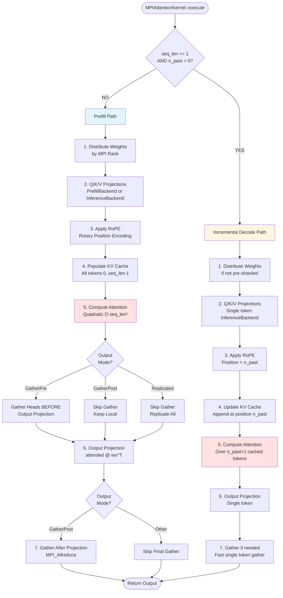
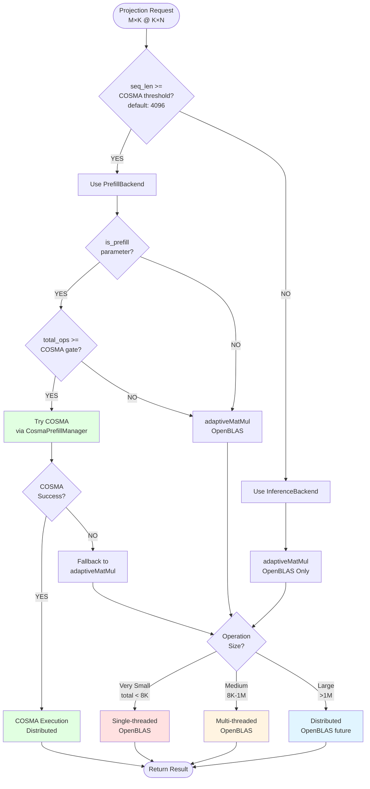
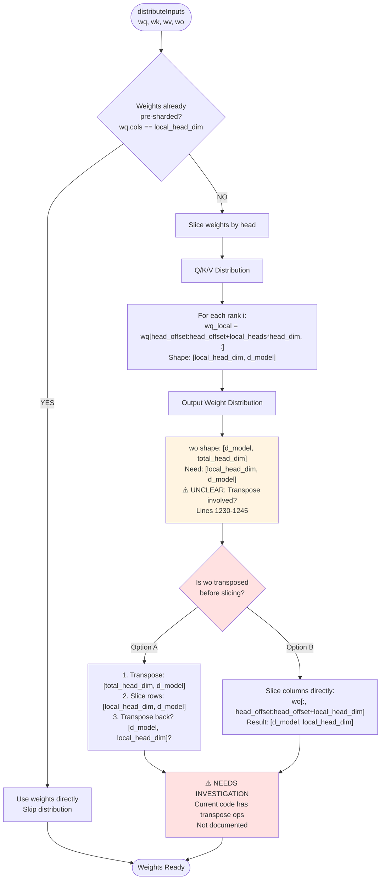
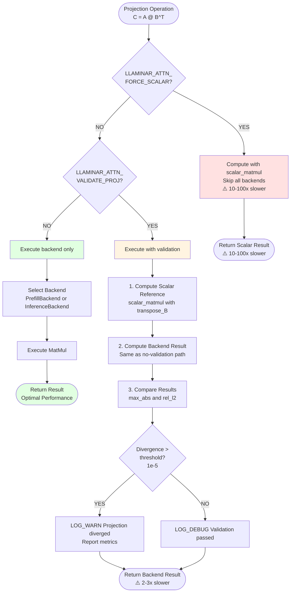
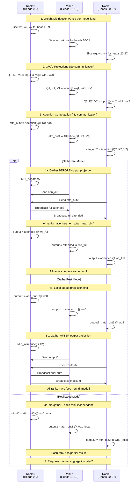

# MPIAttentionKernel Refactoring Plan

**Status**: Phase 1 Complete (85%) - Ready for Phase 2 Decision  
**Author**: David Sanftenberg  
**Date**: October 7, 2025  
**Target**: Reduce MPIAttentionKernel from 1919 lines to <500 lines  
**Timeline**: 6 weeks across 7 phases  
**Branch**: `refactor/mpi-attention-kernel` (to be created)

---

## Executive Summary

**Goal**: Refactor MPIAttentionKernel from a monolithic 1919-line file into a maintainable, well-documented, modular architecture while preserving all functionality and maintaining test parity.

**Current State**: Dense, poorly documented code mixing concerns (computation, validation, MPI distribution, caching, backend selection, error handling) in nested conditionals.

**Target State**: Clean separation of concerns with helper classes, clear execution paths, comprehensive documentation, and validation code separated from production hot paths.

**Phase 1 Status**: 85% complete with comprehensive documentation, 5 visual diagrams, and full architecture analysis. Ready to proceed to Phase 2.

**CRITICAL DECISION POINT**: We have a PyTorch parity divergence (rel_l2=1.37) that needs investigation. Should we:
1. **Proceed to Phase 2** (Extract Validator) - **RECOMMENDED**
   - Validator extraction provides clean infrastructure for parity debugging
   - Enables intermediate validation points without hot path overhead
   - Allows systematic isolation of divergence point
   
2. **Debug Parity First**
   - Risk: Current code too complex (1919 lines) to debug effectively
   - Blocker: Need validation infrastructure that Phase 2 would provide

**RECOMMENDATION**: Proceed to Phase 2 - the refactoring will enable better debugging!

---

## Problems Identified

### 1. Code Density & Poor Documentation
- **1919 lines** in single file with minimal explanatory comments
- Critical logic buried in nested conditionals (5-6 levels deep)
- Multiple execution paths without clear delineation:
  - Prefill vs incremental decode
  - Pre-projection vs post-projection gather modes
  - TP simulation vs baseline execution
  - Validation vs production paths
- No architectural overview or contracts documented

### 2. Mixed Concerns
Current file handles:
- Weight distribution across MPI ranks
- Q/K/V projection computation
- Backend selection (OpenBLAS vs COSMA)
- RoPE application
- KV cache management
- Attention score computation
- Softmax normalization
- Output projection
- Result gathering
- Validation logic (scalar reference implementations)
- Performance instrumentation
- Snapshot capturing for debugging

### 3. Unclear Performance Characteristics
- Scalar matmul appears in hot path but is actually validation-only
- Backend selection logic scattered across multiple locations
- Thread configuration mixed with computation
- No clear indication of what code paths are performance-critical

### 4. Difficult Maintenance
- Changing one feature requires understanding entire 1919-line flow
- Adding new validation requires modifying production code
- Backend changes require touching multiple locations
- Testing individual components requires running full kernel

---

## Refactoring Strategy

### Phase 1: Documentation & Analysis (CURRENT PHASE)
**Goal**: Understand and document existing behavior before changes.

#### Tasks:
1. **Create execution flow diagrams** for each mode:
   - Prefill path (seq_len > 1, n_past == 0)
   - Incremental decode path (seq_len == 1, n_past > 0)
   - Pre-projection gather mode
   - Post-projection gather mode
   - TP simulation mode

2. **Document weight layout contracts**:
   - Input: `[seq_len, d_model]`
   - wq: `[n_head * head_dim, d_model]` → after distribution: `[local_heads * head_dim, d_model]`
   - wk: `[n_head_kv * head_dim, d_model]` → after distribution: `[local_heads * head_dim, d_model]`
   - wv: `[n_head_kv * head_dim, d_model]` → after distribution: `[local_heads * head_dim, d_model]`
   - wo: `[d_model, n_head * head_dim]` → after distribution: `[local_heads * head_dim, d_model]`

3. **Identify invariants and assumptions**:
   - MPI rank constraints
   - Tensor layout requirements
   - Numerical precision expectations
   - Thread safety guarantees

4. **Map validation vs production code paths**:
   - Mark debug-only code with `#ifdef LLAMINAR_ENABLE_VALIDATION`
   - Identify environment variable triggers
   - Document performance impact of each validation

**Deliverables**:
- ✅ This refactoring plan document
- [ ] Execution flow diagrams (mermaid or ASCII art)
- [ ] Weight layout contract specification
- [ ] Validation vs production code map

**Success Criteria**: Can explain any code section's purpose and performance impact in < 2 minutes.

---

### Phase 2: Extract Validation & Debugging
**Goal**: Separate validation logic from production hot paths.

#### 2.1 Create `AttentionValidator` Class

**Location**: `src/kernels/attention/AttentionValidator.{h,cpp}`

**Responsibilities**:
- Scalar reference implementations (matmul, attention)
- Numerical comparison logic
- Snapshot validation
- Error reporting

**Interface**:
```cpp
class AttentionValidator {
public:
    // Validate projection: compare computed against scalar reference
    void validateProjection(const char* name, 
                          const float* input, const float* weight, 
                          const float* computed, 
                          size_t M, size_t N, size_t K, 
                          bool transpose_B);
    
    // Validate attention output
    void validateAttention(const float* Q, const float* K, const float* V,
                         const float* computed_output,
                         size_t seq_len, size_t n_heads, size_t head_dim);
    
    // Scalar reference matmul (for validation only)
    static void scalarMatMul(const float* A, const float* B, float* C,
                           size_t M, size_t N, size_t K, 
                           bool transpose_A = false, bool transpose_B = false);
    
    // Configuration
    void setTolerance(double max_abs, double rel_l2);
    void enableLogging(bool enable);
};
```

**Migration**:
1. Extract `scalar_matmul` lambda → `AttentionValidator::scalarMatMul`
2. Extract projection validation block → `AttentionValidator::validateProjection`
3. Wrap all validator calls in `#ifdef LLAMINAR_ENABLE_VALIDATION` or runtime check
4. Update CMakeLists.txt to add `-DLLAMINAR_ENABLE_VALIDATION` for Debug builds

**Benefits**:
- Production builds have zero validation overhead
- Can unit test validation logic separately
- Clear separation: production vs debugging

**Risks**:
- Must ensure validation doesn't affect production behavior
- Need to maintain both code paths

**Mitigation**:
- Validation always reads (never writes) production data
- Use const references everywhere
- Add CI check that Release builds don't link validation code

---

#### 2.2 Extract Snapshot Capturing

**Location**: `src/kernels/attention/AttentionSnapshotCapture.{h,cpp}`

**Responsibilities**:
- Capture intermediate tensors for parity testing
- Format and save snapshots
- Integration with parity test framework

**Interface**:
```cpp
class AttentionSnapshotCapture {
public:
    void captureProjection(PipelineStage stage, int layer, 
                          const float* data, size_t seq_len, size_t dim);
    void captureAttentionContext(int layer, 
                                const float* data, size_t seq_len, size_t dim);
    void captureAttentionOutput(int layer, 
                               const float* data, size_t seq_len, size_t dim);
    
    void setCallback(SnapshotCallback callback);
    bool isEnabled() const;
};
```

**Migration**:
1. Extract all `snapshot_callback_` logic
2. Consolidate capture points
3. Make optional at runtime (not compile-time)

---

### Phase 3: Extract Projection Logic
**Goal**: Isolate Q/K/V/O projection computation with backend selection.

#### 3.1 Create `AttentionProjector` Class

**Location**: `src/kernels/attention/AttentionProjector.{h,cpp}`

**Responsibilities**:
- Q/K/V projection computation
- Output projection computation
- Backend selection (OpenBLAS vs COSMA via PrefillBackend/InferenceBackend)
- Threading configuration
- Error handling

**Interface**:
```cpp
class AttentionProjector {
public:
    struct ProjectionConfig {
        size_t seq_len;
        size_t d_model;
        size_t local_head_dim;
        bool is_prefill;
        bool transpose_weight;  // typically true for PyTorch convention
    };
    
    // Compute Q/K/V projections from input
    struct QKVResult {
        std::shared_ptr<TensorBase> Q;
        std::shared_ptr<TensorBase> K;
        std::shared_ptr<TensorBase> V;
        bool success;
    };
    
    QKVResult computeQKVProjections(
        const std::shared_ptr<TensorBase>& input,
        const std::shared_ptr<TensorBase>& wq,
        const std::shared_ptr<TensorBase>& wk,
        const std::shared_ptr<TensorBase>& wv,
        const ProjectionConfig& config);
    
    // Compute output projection
    bool computeOutputProjection(
        const std::shared_ptr<TensorBase>& attended_output,
        const std::shared_ptr<TensorBase>& wo,
        std::shared_ptr<TensorBase>& final_output,
        const ProjectionConfig& config);
    
private:
    std::unique_ptr<PrefillBackend> prefill_backend_;
    std::unique_ptr<InferenceBackend> inference_backend_;
};
```

**Migration**:
1. Extract `do_projection` lambda → `AttentionProjector::computeProjection`
2. Extract output projection logic → `AttentionProjector::computeOutputProjection`
3. Move backend selection logic into projector
4. Update `computeLocalProjections` to use projector

**Benefits**:
- Single place for all projection logic
- Easy to swap backends or add new ones
- Can unit test projections independently
- Clear performance characteristics

---

#### 3.2 Simplify Backend Integration

**Current Issues**:
- Backend calls scattered across kernel
- Fallback logic duplicated
- Transpose flags added incrementally

**Improvements**:
1. Consolidate all backend calls in `AttentionProjector`
2. Single fallback strategy
3. Clear documentation of transpose convention
4. Add backend performance metrics

---

### Phase 4: Extract KV Cache Management
**Goal**: Isolate KV cache population and retrieval logic.

#### 4.1 Create `KVCacheManager` Class

**Location**: `src/kernels/attention/KVCacheManager.{h,cpp}`

**Responsibilities**:
- Prefill cache population (handle GQA: multi-query vs grouped)
- Incremental cache update
- Cache retrieval for decode
- Window management
- Diagnostics

**Interface**:
```cpp
class KVCacheManager {
public:
    struct CacheConfig {
        int n_head;           // total query heads
        int n_head_kv;        // total kv heads (for GQA)
        int head_dim;
        int local_heads;      // heads on this rank
        int head_offset;      // rank's head offset
        size_t max_seq_len;   // cache capacity
    };
    
    // Populate cache for prefill (seq_len > 1, n_past == 0)
    void populatePrefillCache(
        std::shared_ptr<TensorBase>& k_cache,
        std::shared_ptr<TensorBase>& v_cache,
        const float* local_k, const float* local_v,
        size_t seq_len, const CacheConfig& config);
    
    // Update cache for single token (incremental decode)
    void updateIncrementalCache(
        std::shared_ptr<TensorBase>& k_cache,
        std::shared_ptr<TensorBase>& v_cache,
        const float* k_token, const float* v_token,
        int token_position, const CacheConfig& config);
    
    // Retrieve from cache for attention computation
    struct CacheView {
        const float* k_data;
        const float* v_data;
        size_t effective_seq_len;
    };
    
    CacheView getCacheView(
        const std::shared_ptr<TensorBase>& k_cache,
        const std::shared_ptr<TensorBase>& v_cache,
        int n_past, const CacheConfig& config) const;
    
    // Diagnostics
    void validateCacheWindow(int token_pos, size_t expected_window) const;
};
```

**Migration**:
1. Extract prefill cache population block (lines ~310-350)
2. Extract incremental cache update logic
3. Centralize cache diagnostics
4. Add cache consistency checks

**Benefits**:
- Clear cache semantics
- Easy to add cache compression/quantization
- Separate GQA logic from attention computation
- Testable cache behavior

---

### Phase 5: Extract Attention Computation
**Goal**: Isolate core attention score/weight/output computation.

#### 5.1 Create `AttentionScorer` Class

**Location**: `src/kernels/attention/AttentionScorer.{h,cpp}`

**Responsibilities**:
- Compute attention scores (Q @ K^T)
- Apply scaling (1/sqrt(head_dim))
- Apply causal mask
- Softmax normalization
- Compute attention output (weights @ V)

**Interface**:
```cpp
class AttentionScorer {
public:
    struct AttentionConfig {
        int n_heads;
        int head_dim;
        bool causal;
        float scale;  // typically 1/sqrt(head_dim)
    };
    
    // Compute full attention: scores, softmax, weighted sum
    bool computeLocalAttention(
        const float* Q, const float* K, const float* V,
        float* output,
        size_t seq_len, int local_heads,
        const AttentionConfig& config);
    
private:
    // Internal helpers
    void computeScores(const float* Q, const float* K, float* scores,
                      size_t seq_len, int head_dim, float scale);
    void applySoftmax(float* scores, size_t seq_len);
    void computeWeightedSum(const float* scores, const float* V, float* output,
                           size_t seq_len, int head_dim);
};
```

**Migration**:
1. Extract `computeLocalAttention` method
2. Extract scoring/softmax/weighted-sum logic
3. Add unit tests with known attention patterns
4. Verify numerical stability

**Benefits**:
- Focused, testable attention implementation
- Easy to optimize (Flash Attention, etc.)
- Clear numerical properties
- Separate from MPI/caching concerns

---

### Phase 6: Refactor Main Kernel
**Goal**: Transform MPIAttentionKernel into a clean coordinator.

#### 6.1 New Structure

**Simplified execute() flow**:
```cpp
bool MPIAttentionKernel::execute(
    const std::vector<std::shared_ptr<TensorBase>>& inputs,
    std::vector<std::shared_ptr<TensorBase>>& outputs)
{
    // 1. Parse inputs and validate
    auto [input, wq, wk, wv, wo, k_cache, v_cache] = parseInputs(inputs);
    validateInputs(input, wq, wk, wv, wo);
    
    // 2. Distribute weights across ranks (if needed)
    auto [local_wq, local_wk, local_wv, local_wo] = 
        distributeWeights(wq, wk, wv, wo);
    
    // 3. Compute Q/K/V projections
    auto qkv = projector_->computeQKVProjections(
        input, local_wq, local_wk, local_wv, projection_config_);
    VALIDATE(validator_->validateProjections(qkv));
    
    // 4. Apply RoPE
    applyLocalRoPE(qkv.Q, qkv.K);
    
    // 5. Update KV cache
    kv_cache_mgr_->updateCache(k_cache, v_cache, qkv.K, qkv.V, n_past_);
    
    // 6. Compute attention
    auto attended = scorer_->computeLocalAttention(
        qkv.Q, qkv.K, qkv.V, attention_config_);
    SNAPSHOT(snapshot_->captureAttentionContext(attended));
    
    // 7. Output projection
    auto final_output = projector_->computeOutputProjection(
        attended, local_wo, projection_config_);
    SNAPSHOT(snapshot_->captureAttentionOutput(final_output));
    
    // 8. Gather results (if needed)
    return gatherResults(final_output, outputs);
}
```

**Key improvements**:
- Linear flow (no deep nesting)
- Clear error handling at each step
- Easy to add logging/tracing
- Obvious where optimization should focus

#### 6.2 Remove Complexity

**Remove or simplify**:
- Pre-sharded weight detection → assume always need distribution
- TP simulation mode → move to separate test kernel
- Multiple gather modes → single mode with clear semantics
- Validation lambdas → use validator class
- Performance timers → use PERF_SCOPED_TIMER consistently

**Add**:
- Clear mode enum (Prefill vs IncrementalDecode)
- Execution strategy selection at construction
- Better error messages with context

---

### Phase 7: Documentation & Testing
**Goal**: Comprehensive documentation and test coverage.

#### 7.1 Documentation

**Add to each class**:
- **Contract**: Inputs, outputs, preconditions, postconditions
- **Performance**: Computational complexity, memory usage, threading
- **Numerical**: Expected precision, stability guarantees
- **Thread safety**: What's safe to call concurrently
- **Examples**: Simple usage patterns

**File header template**:
```cpp
/**
 * @file AttentionProjector.h
 * @brief Computes Q/K/V/O projections with adaptive backend selection
 * 
 * @section contract Contract
 * - Input: activations [seq_len, d_model]
 * - Weights: [out_features, in_features] (PyTorch convention)
 * - Output: projections [seq_len, out_features]
 * - All tensors row-major, float32
 * 
 * @section performance Performance
 * - Complexity: O(seq_len * d_model * out_features)
 * - Selects OpenBLAS for small ops (< 8K elements), COSMA for large
 * - Multi-threaded for ops > 25M multiplications
 * - Memory: O(M*N + K*N) for input and weight
 * 
 * @section numerical Numerical Properties
 * - Relative L2 error vs scalar reference: < 1e-5
 * - Uses transpose_B for PyTorch weight convention
 * - GEMM: C = alpha * A @ B^T + beta * C
 * 
 * @section threading Thread Safety
 * - Concurrent calls safe with different tensor instances
 * - Backend selection uses thread-safe static initialization
 * - OpenMP threads configured per-operation
 * 
 * @author David Sanftenberg
 */
```

#### 7.2 Unit Tests

**Add tests for each component**:

1. **AttentionProjector**:
   - Small matrix (OpenBLAS path)
   - Large matrix (COSMA path if available)
   - Transpose vs no-transpose
   - Different backends give same results
   - Error handling (null pointers, wrong dims)

2. **AttentionScorer**:
   - Known attention pattern (all-ones Q/K/V)
   - Causal masking correctness
   - Softmax numerical stability (large scores)
   - GQA head mapping

3. **KVCacheManager**:
   - Prefill population
   - Incremental updates
   - Window overflow handling
   - GQA cache layout

4. **AttentionValidator**:
   - Scalar matmul matches OpenBLAS
   - Transpose handling
   - Error detection

5. **Integration**:
   - End-to-end parity test (already exists!)
   - Multi-rank consistency
   - Prefill vs decode equivalence

---

## Implementation Plan

### Week 1: Foundation
- [ ] Create this refactoring plan ✅
- [ ] Add tasks to todo list ✅
- [ ] Document current execution flows (diagrams)
- [ ] Map all validation code paths
- [ ] Set up branch: `refactor/mpi-attention-kernel`

### Week 2: Validation Extraction
- [ ] Create AttentionValidator class
- [ ] Extract scalar_matmul
- [ ] Extract projection validation
- [ ] Add #ifdef guards
- [ ] Verify tests still pass

### Week 3: Projection Extraction
- [ ] Create AttentionProjector class
- [ ] Extract QKV projection logic
- [ ] Extract output projection logic
- [ ] Add unit tests
- [ ] Verify parity tests pass

### Week 4: Cache & Scoring Extraction
- [ ] Create KVCacheManager class
- [ ] Extract cache population/update
- [ ] Create AttentionScorer class
- [ ] Extract attention computation
- [ ] Add unit tests
- [ ] Verify parity tests pass

### Week 5: Main Kernel Refactor
- [ ] Simplify MPIAttentionKernel::execute
- [ ] Remove legacy code paths
- [ ] Update documentation
- [ ] Full regression test suite

### Week 6: Polish & Optimize
- [ ] Add comprehensive documentation
- [ ] Performance profiling
- [ ] Identify new optimization opportunities
- [ ] Code review
- [ ] Merge to master

---

## Success Metrics

### Code Quality
- [ ] No function > 100 lines
- [ ] No file > 500 lines
- [ ] Every class has Doxygen contract documentation
- [ ] Every public method has example in docs
- [ ] Code coverage > 80%

### Performance
- [ ] No regression in parity test runtime
- [ ] Validation code has zero overhead in Release builds
- [ ] Identical numerical results (max_abs < 1e-6)

### Maintainability
- [ ] New developer can understand flow in < 30 minutes
- [ ] Can add new backend in < 1 day
- [ ] Can add new validation in < 1 hour
- [ ] Can optimize single component without touching others

---

## Risk Management

### Risk: Breaking parity tests during refactor
- **Mitigation**: Refactor one component at a time, verify tests after each
- **Fallback**: Git branch per phase, can revert individual changes

### Risk: Performance regression
- **Mitigation**: Profile before/after each phase
- **Fallback**: Keep old code paths behind feature flag temporarily

### Risk: Scope creep
- **Mitigation**: Strict adherence to phase plan, no new features
- **Fallback**: Time-box each phase, ship partial refactor if needed

### Risk: Documentation becomes outdated
- **Mitigation**: Update docs as part of each PR, not after
- **Fallback**: CI check that all public classes have Doxygen

---

## Open Questions

1. **Should we keep TP simulation mode?**
   - Leaning NO: move to separate test kernel
   - Benefits: simplifies main kernel significantly
   - Drawback: loses TP validation in production

2. **Should validation be compile-time or runtime optional?**
   - Leaning RUNTIME: allows Debug builds to skip validation for perf testing
   - Use environment variable check with cached result

3. **Should we extract RoPE to separate class?**
   - YES if RoPE gets more complex (e.g., ALiBi, xPos)
   - NO for initial refactor (keep scope limited)

4. **How to handle gather modes?**
   - Prefer: single gather strategy, configured at construction
   - Alternative: separate kernel subclasses for each mode

---

## Appendix A: Visual Architecture Diagrams

### High-Level Execution Flow (Mermaid)



### Backend Selection Decision Tree (Mermaid)



### Weight Distribution Strategy (Mermaid)



### Validation Code Path Decision (Mermaid)



### MPI Communication Patterns (Mermaid)



---

## Appendix B: Detailed Execution Flow Analysis

### Input/Output Contracts

#### Inputs (7 tensors)
```cpp
inputs[0]: input             // [seq_len, d_model] - query input activations
inputs[1]: wq (weight_q)     // [n_head*head_dim, d_model] - query projection weight
inputs[2]: wk (weight_k)     // [n_head_kv*head_dim, d_model] - key projection weight  
inputs[3]: wv (weight_v)     // [n_head_kv*head_dim, d_model] - value projection weight
inputs[4]: wo (weight_o)     // [d_model, n_head*head_dim] - output projection weight
inputs[5]: k_cache (optional) // [max_seq, n_head_kv*head_dim] - key cache for decode
inputs[6]: v_cache (optional) // [max_seq, n_head_kv*head_dim] - value cache for decode
```

#### Outputs (1 tensor)
```cpp
outputs[0]: attention_output // [seq_len, d_model] - final attention output
```

#### Weight Layout Convention (Post-GGUF Swap)
All weights use **PyTorch convention**: `[out_features, in_features]`

- **wq**: `[n_head * head_dim, d_model]` = `[out, in]` → needs `transpose_B=true`
- **wk**: `[n_head_kv * head_dim, d_model]` = `[out, in]` → needs `transpose_B=true`
- **wv**: `[n_head_kv * head_dim, d_model]` = `[out, in]` → needs `transpose_B=true`
- **wo**: `[d_model, n_head * head_dim]` = `[out, in]` → needs `transpose_B=true`

**Note**: GGUF files store `[in, out]`, but ModelLoader swaps dimensions to `[out, in]` for consistency.

---

### Execution Mode Decision Tree

```
┌─────────────────────────────────────────────────────────────┐
│                    MPIAttentionKernel::execute               │
└─────────────────────────────────────────────────────────────┘
                             │
                             ▼
                ┌────────────────────────┐
                │ Check: seq_len == 1    │
                │     && n_past_ > 0?    │
                └────────────────────────┘
                       │           │
                  YES  │           │  NO
                       ▼           ▼
          ┌────────────────┐  ┌────────────────┐
          │ INCREMENTAL    │  │ PREFILL        │
          │ DECODE PATH    │  │ PATH           │
          │ (lines 360-600)│  │ (lines 100-360)│
          └────────────────┘  └────────────────┘
                  │                    │
                  │                    │
                  └──────────┬─────────┘
                             ▼
                ┌────────────────────────┐
                │ Check output_mode_     │
                └────────────────────────┘
                       │           │           │
         GatherPre    │           │ GatherPost│    Replicated
                       ▼           ▼           ▼
          ┌────────────┐  ┌────────────┐  ┌────────────┐
          │ Gather     │  │ Compute    │  │ Replicate  │
          │ BEFORE     │  │ THEN       │  │ Everywhere │
          │ output     │  │ Gather     │  │ (no gather)│
          │ projection │  │            │  │            │
          └────────────┘  └────────────┘  └────────────┘
```

---

### PREFILL Execution Flow (seq_len > 1, n_past == 0)

**Purpose**: Process multiple tokens in parallel to build KV cache.

```
┌────────────────────────────────────────────────────────────────────┐
│ 1. Weight Distribution (if not pre-sharded)                        │
│    distributeInputs() - slice weights across MPI ranks             │
│    Each rank gets subset of heads                                  │
└────────────────────────────────────────────────────────────────────┘
                              ▼
┌────────────────────────────────────────────────────────────────────┐
│ 2. Q/K/V Projections                                               │
│    computeLocalProjections() - for local head slice                │
│    Q = input @ wq^T  [seq_len, local_head_dim]                     │
│    K = input @ wk^T  [seq_len, local_head_dim]                     │
│    V = input @ wv^T  [seq_len, local_head_dim]                     │
│    Uses: PrefillBackend (seq_len >= threshold)                     │
│       or InferenceBackend (seq_len < threshold)                    │
│    ✓ VALIDATION: scalar_matmul reference (if enabled)              │
└────────────────────────────────────────────────────────────────────┘
                              ▼
┌────────────────────────────────────────────────────────────────────┐
│ 3. Apply RoPE (Rotary Position Embedding)                          │
│    applyLocalRoPE() - in-place rotation of Q and K                 │
│    Only affects Q and K, not V                                     │
└────────────────────────────────────────────────────────────────────┘
                              ▼
┌────────────────────────────────────────────────────────────────────┐
│ 4. Populate KV Cache                                               │
│    Store K,V for all tokens [0..seq_len-1]                         │
│    Handle GQA: map query heads → kv heads                          │
│    Canonical write: only lowest head in group writes (GQA)         │
│    Cache layout: [max_seq, n_head_kv * head_dim]                   │
└────────────────────────────────────────────────────────────────────┘
                              ▼
┌────────────────────────────────────────────────────────────────────┐
│ 5. Compute Local Attention                                         │
│    computeLocalAttention() - for each head independently           │
│    For each head h in local_heads:                                 │
│      scores = (Q[h] @ K[kv_head]^T) / sqrt(head_dim)               │
│      weights = softmax(scores)  [seq_len, seq_len]                 │
│      output[h] = weights @ V[kv_head]  [seq_len, head_dim]         │
│    Output: [seq_len, local_head_dim]                               │
│    ✓ SNAPSHOT: ATTENTION_CONTEXT (if enabled)                      │
└────────────────────────────────────────────────────────────────────┘
                              ▼
         ┌───────────────────────────────────────┐
         │ Output Mode Decision                   │
         └───────────────────────────────────────┘
                │                    │
    GatherPre   │                    │  GatherPost/Replicated
                ▼                    ▼
┌────────────────────────┐  ┌────────────────────────────┐
│ 5a. Gather heads       │  │ 5b. Keep local             │
│ MPI_Allgatherv         │  │ Skip gather                │
│ → [seq_len, total_hd]  │  │ → [seq_len, local_hd]      │
└────────────────────────┘  └────────────────────────────┘
                │                    │
                └─────────┬──────────┘
                          ▼
         ┌─────────────────────────────────────────────────┐
         │ 6. Output Projection                             │
         │ output = attended @ wo^T                         │
         │ GatherPre: [seq_len, total_hd] @ [total_hd, dm] │
         │ Other: [seq_len, local_hd] @ [local_hd, dm]     │
         │ Uses: PrefillBackend or InferenceBackend        │
         │ ✓ VALIDATION: scalar reference (if enabled)     │
         │ ✓ SNAPSHOT: ATTENTION_OUTPUT                     │
         └─────────────────────────────────────────────────┘
                          ▼
         ┌────────────────────────────────────────┐
         │ 7. Final Gather (if GatherPost mode)   │
         │ MPI_Allreduce (SUM) or MPI_Allgatherv │
         │ → [seq_len, d_model]                   │
         └────────────────────────────────────────┘
                          ▼
                  ┌────────────┐
                  │   RETURN   │
                  └────────────┘
```

**Key Characteristics**:
- **Parallelism**: All seq_len tokens processed in parallel
- **Memory**: O(seq_len²) for attention scores per head
- **Backend**: PrefillBackend if seq_len >= COSMA threshold (4096)
- **Cache**: Fully populates KV cache in single pass
- **MPI Communication**: Gather operations (collective)

---

### INCREMENTAL DECODE Execution Flow (seq_len == 1, n_past > 0)

**Purpose**: Generate next token using cached K/V from previous tokens.

```
┌────────────────────────────────────────────────────────────────────┐
│ 1. Weight Distribution (if not pre-sharded)                        │
│    Same as prefill                                                 │
└────────────────────────────────────────────────────────────────────┘
                              ▼
┌────────────────────────────────────────────────────────────────────┐
│ 2. Q/K/V Projections (single token)                                │
│    Q = input @ wq^T  [1, local_head_dim]                           │
│    K = input @ wk^T  [1, local_head_dim]                           │
│    V = input @ wv^T  [1, local_head_dim]                           │
│    Uses: InferenceBackend (latency-critical)                       │
└────────────────────────────────────────────────────────────────────┘
                              ▼
┌────────────────────────────────────────────────────────────────────┐
│ 3. Apply RoPE (current token only)                                 │
│    Position = n_past_ (for new token)                              │
└────────────────────────────────────────────────────────────────────┘
                              ▼
┌────────────────────────────────────────────────────────────────────┐
│ 4. Update KV Cache (append current token)                          │
│    k_cache[n_past_] = K (current token)                            │
│    v_cache[n_past_] = V (current token)                            │
│    Total cached tokens: n_past_ + 1                                │
└────────────────────────────────────────────────────────────────────┘
                              ▼
┌────────────────────────────────────────────────────────────────────┐
│ 5. Compute Attention Over Full Context                             │
│    Legacy Path: Manual loop over cache (lines 400-460)             │
│      For each local head:                                          │
│        scores = Q[head] · K_cache[0..n_past_]  [n_past_+1]         │
│        weights = softmax(scores)                                   │
│        output[head] = Σ weights[t] * V_cache[t]                    │
│    Parity Path: Build full Q/K/V then call computeLocalAttention   │
│      (lines 460-540)                                               │
└────────────────────────────────────────────────────────────────────┘
                              ▼
         ┌─────────────────────────────────────────────────┐
         │ 6. Output Projection (single token)             │
         │ output = attended @ wo^T  [1, d_model]          │
         │ Uses: InferenceBackend                          │
         └─────────────────────────────────────────────────┘
                          ▼
         ┌────────────────────────────────────────┐
         │ 7. Gather (if needed)                  │
         │ Single token: fast gather              │
         └────────────────────────────────────────┘
                          ▼
                  ┌────────────┐
                  │   RETURN   │
                  └────────────┘
```

**Key Characteristics**:
- **Parallelism**: Single token, attention over n_past+1 cached tokens
- **Memory**: O(n_past) for attention scores per head (linear!)
- **Backend**: InferenceBackend (latency-critical, small ops)
- **Cache**: Append-only, reads full history
- **MPI Communication**: Minimal (only output gather)
- **Performance**: Should be very fast (< 10ms per token)

**⚠️ Code Duplication Issue**: Two different implementations for same semantics:
1. **Legacy manual loop** (lines 400-460): Inline attention computation
2. **Parity path** (lines 460-540): Reconstructs full Q/K/V, calls computeLocalAttention

**Refactoring Opportunity**: Unify on single path (parity path more maintainable)

---

## Appendix B: Current Code Structure

### File: MPIAttentionKernel.cpp (1919 lines)

**Major sections**:
- Lines 1-50: Includes, file header
- Lines 51-100: execute() entry point (massive function)
- Lines 100-600: Prefill execution path
- Lines 600-1100: Incremental decode path  
- Lines 1100-1200: distributeInputs
- Lines 1200-1400: computeLocalProjections (with nested do_projection lambda)
- Lines 1400-1600: computeLocalAttention
- Lines 1600-1900: Output projection with TP partitioning

**Execution paths** (8 total):
1. Prefill + pre-projection gather
2. Prefill + post-projection gather  
3. Prefill + replicated
4. Incremental decode + pre-projection
5. Incremental decode + post-projection
6. Incremental decode + replicated
7. TP simulation mode (prefill paths x2)
8. TP simulation mode (decode paths x2)

---

### Weight Distribution Strategy

#### Pre-Sharded Detection (lines 230-250)
```cpp
if (global_wq->shape()[1] == local_head_dim) {
    // Weights already sliced for this rank - use directly
    local_wq = global_wq;
    // Skip distribution
}
```

#### Distribution (lines 250-270, function at lines 1100-1245)
```cpp
// Slice weights by heads (output dimension)
// Each rank gets: [local_heads * head_dim, d_model]

distributeInputs():
  For wq, wk, wv:  // [total_head_dim, d_model] → [local_head_dim, d_model]
    Slice rows [head_offset..head_offset+local_heads*head_dim]
    
  For wo:  // [d_model, total_head_dim] → [local_head_dim, d_model]
    Transpose THEN slice (or slice columns) ← NEEDS CLARIFICATION
```

**⚠️ Issue**: wo distribution has transpose logic (lines 1230-1245) that's unclear.

---

### Backend Selection Decision Points

#### Projection Backend Selection (Q/K/V/O)
```cpp
if (seq_len >= debugEnv().cosma.prefill_threshold) {  // default 4096
    use PrefillBackend (may use COSMA)
} else {
    use InferenceBackend (OpenBLAS only)
}
```

#### Actual MatMul Backend (inside backends)
```cpp
// PrefillBackend:
if (is_prefill && total_ops >= COSMA_threshold) {
    try COSMA (CosmaPrefillManager)
} else {
    fall back to adaptiveMatMul (OpenBLAS)
}

// InferenceBackend:
always OpenBLAS (via adaptiveMatMul)
```

**Complexity**: 3 layers of decision (seq_len check → backend choice → COSMA gate)

**Refactoring**: Should collapse to 2 layers or make explicit strategy object.

---

### Validation & Debugging Code Paths

#### Projection Validation (lines 1330-1365)
```cpp
if (validate_proj || force_scalar) {
    scalar_matmul(input, W, reference, M, N, K, transpose_B=true);
    compare(reference, computed);
    if (divergence > threshold) LOG_WARN();
}
```

**Overhead**: ~2-3x slowdown when enabled (full scalar computation)

#### Snapshot Capturing (scattered throughout)
```cpp
if (snapshot_callback_ && getRank() == 0) {
    snapshot_callback_(stage, layer, data, ...);
}
```

**Locations**:
- Q_PROJECTION (line 1369)
- K_PROJECTION (line 1378)  
- V_PROJECTION (line 1387)
- ATTENTION_CONTEXT (line ~800)
- ATTENTION_OUTPUT (line ~850)

**Issue**: Scattered across code, hard to see full capture flow.

#### Force Scalar Mode
```cpp
if (force_scalar) {
    scalar_matmul(...);  // Skip all backends, use pure CPU reference
}
```

**Usage**: `LLAMINAR_ATTN_FORCE_SCALAR=1` (debugging only)

---

### Environment Variables

From `debugEnv().attention.*`:

| Variable | Purpose | Default | Performance Impact |
|----------|---------|---------|-------------------|
| `force_scalar` | Use scalar reference for all ops | false | **10-100x slower** |
| `validate_proj` | Check projections vs scalar | false | **2-3x slower** |
| `validate_output` | Check output projection | false | Minor (~10%) |
| `output_mode` | Override gather mode | auto | Affects MPI pattern |
| `tp_partitions` | Tensor parallel parts | 1 | Affects partitioning |
| `tp_disable` | Disable TP | false | - |
| `tp_auto` | Auto-enable TP for large ops | true | - |
| `internal_diff` | Capture internal tensors | false | Minor (~5%) |
| `micro_trace` | Verbose execution trace | false | Logging overhead |

**Refactoring Opportunity**: Too many knobs! Should consolidate validation into single `LLAMINAR_ENABLE_VALIDATION` flag.

---

### Performance Hotspots (Estimated)

Based on operation counts for typical inference (seq_len=5, d_model=896, heads=28, head_dim=32):

| Operation | Complexity | Typical Time | Bottleneck? |
|-----------|-----------|--------------|-------------|
| Q/K/V projections | O(seq_len * d_model * head_dim) | ~40% | ✓ **YES** |
| RoPE | O(seq_len * total_heads * head_dim) | ~5% | NO |
| Attention scores | O(seq_len² * total_heads * head_dim) | ~25% | ✓ **YES** (prefill) |
| Softmax | O(seq_len² * total_heads) | ~5% | NO |
| Attention output | O(seq_len² * total_heads * head_dim) | ~15% | ✓ **YES** (prefill) |
| Output projection | O(seq_len * d_model * total_head_dim) | ~10% | Minor |
| MPI gather | O(total_results / world_size) | ~5% | Mode-dependent |

**Note**: Incremental decode (seq_len=1) profile changes dramatically:
- Projections: ~60% (dominant)
- Attention: ~20% (linear in n_past, not quadratic)
- Output proj: ~15%
- Gather: ~5%

---

### Code Duplication Analysis

#### Duplicated Projection Logic (3 call sites)
1. **Q/K/V projections** (lines 1280-1365): `do_projection` lambda called 3x
2. **Output projection** (lines 1770-1850): Similar logic but inline
3. **TP partitioned output** (lines 1820-1840): Repeated projection calls

**Lines of duplication**: ~250 lines could be unified

**Opportunity**: Single `computeProjection()` method used by all call sites.

#### Duplicated Attention Logic (2 implementations)
1. **Prefill path**: `computeLocalAttention()` (lines 1390-1550)
2. **Incremental decode legacy**: Manual loop (lines 400-460)
3. **Incremental decode parity**: Build full tensors, call computeLocalAttention (lines 460-540)

**Lines of duplication**: ~150 lines

**Opportunity**: Always use `computeLocalAttention()`, build wrapper for incremental.

#### Duplicated Validation (3 call sites)
- Projection validation block appears 3 times (Q, K, V) with identical structure
- ~50 lines of duplication

**Opportunity**: Single `validateProjection(tag, ...)` method.

---

### MPI Communication Patterns

#### Prefill Communication
```
Weight Distribution (scatter):
  Root → All ranks: weight slices
  Frequency: Once per model load
  Volume: O(model_size / world_size)

Attention Computation:
  Communication: None (embarrassingly parallel)
  Each rank computes local heads independently

Output Gather:
  GatherPre:  MPI_Allgatherv before output projection
              Frequency: Every prefill
              Volume: O(seq_len * total_heads * head_dim)
              
  GatherPost: MPI_Allreduce after output projection  
              Frequency: Every prefill
              Volume: O(seq_len * d_model)
              
  Replicated: No gather (duplicated computation)
              Frequency: N/A
              Volume: 0
```

#### Incremental Decode Communication
```
Weight Distribution:
  (Already distributed from prefill)

Attention:
  None (each rank uses local cache)

Output Gather:
  Fast gather (single token)
  Volume: O(d_model) or O(total_heads * head_dim)
  Latency: ~1-2ms
```

**Optimization Opportunity**: GatherPre mode gathers large tensors (seq_len * heads) unnecessarily. GatherPost mode gathers smaller final results (seq_len * d_model).

---

### Numerical Precision Considerations

#### Sources of Numerical Error
1. **MatMul accumulation**: FP32 sum of O(d_model) products (~896 terms)
2. **Softmax stability**: Max subtraction prevents overflow but changes order of operations
3. **RoPE**: sin/cos trigonometric functions (library-dependent precision)
4. **Backend differences**: OpenBLAS vs COSMA may use different tiling/blocking

#### Current Tolerances
- **Projection validation**: max_abs > 1e-5 **or** rel_l2 > 1e-5 triggers warning
- **Parity test**: Stage-dependent (0.05 to 0.15 rel_l2)

#### Observed Behavior
- ✅ **OpenBLAS self-consistent**: Scalar reference matches OpenBLAS to ~1e-6
- ✅ **transpose_B fixes applied**: All projections now use correct transpose
- ❌ **PyTorch divergence**: ATTENTION_OUTPUT shows rel_l2 ~ 1.37 (MAJOR ISSUE!)
  - Magnitude suggests systematic error, not accumulation noise
  - Likely causes:
    1. Weight data corruption during GGUF load
    2. PyTorch uses different GEMM convention (despite transpose_B)
    3. Attention computation order differs
    4. RoPE implementation mismatch

---

## Appendix C: Open Issues & Investigation Items

### Critical Issues (Blocking Refactoring)

#### 1. PyTorch Parity Divergence ❌
**Status**: BLOCKED - divergence at ATTENTION_OUTPUT (rel_l2 = 1.37)

**What we know**:
- ✅ Scalar validation passes (OpenBLAS matches scalar reference)
- ✅ All transpose_B flags set correctly
- ✅ Weight dimensions correct after GGUF swap
- ❌ Still diverges from PyTorch reference

**Hypotheses** (ordered by likelihood):
1. **PyTorch reference generated with different weight convention**
   - Need to verify Python reference generation script
   - Check if PyTorch model uses same transpose convention
   
2. **Attention computation order differs**
   - PyTorch may fuse operations differently
   - Softmax implementation may differ
   
3. **RoPE implementation mismatch**
   - Position encoding may be computed differently
   - Need to compare RoPE outputs directly
   
4. **Weight corruption during load** (less likely now)
   - Validation shows weights are used correctly in projections
   - But could still have subtle corruption

**Next Steps**:
1. Add intermediate snapshots: Q/K/V (post-RoPE), attention scores, attention weights
2. Compare with PyTorch at each step
3. Verify Python reference generation matches our expectations

---

### Medium Priority Issues

#### 2. Output Weight (wo) Distribution Logic ⚠️
**Status**: UNCLEAR - lines 1230-1245 have confusing transpose logic

**Question**: How exactly is wo distributed across ranks?
- Input shape: `[d_model, total_head_dim]`
- Expected output: `[local_head_dim, d_model]` (transposed?)
- Code has transpose operations - need to verify correctness

**Impact**: May be source of numerical issues if incorrect

**Next Steps**:
1. Add debug logging to wo distribution
2. Verify distributed wo matches expected slice
3. Check if transpose is correct for output projection

---

#### 3. Incremental Decode Dual Paths 🔄
**Status**: TECHNICAL DEBT - two implementations of same thing

**Issue**: Lines 400-460 (legacy) vs lines 460-540 (parity)
- Both compute same result
- Legacy: manual loop, optimized for single token
- Parity: builds full Q/K/V, calls computeLocalAttention

**Questions**:
- Performance difference? (need benchmark)
- Numerical difference? (should be identical)
- Can we remove legacy path?

**Next Steps**:
1. Benchmark both paths (latency measurement)
2. Compare numerical results
3. If equivalent, remove legacy in Phase 6

---

#### 4. TP Simulation Mode 🤔
**Status**: UNCLEAR PURPOSE - adds significant complexity

**Question**: Is TP simulation used in production or tests only?
- Adds ~500 lines of code
- Doubles execution paths (all modes x2)
- No clear documentation of purpose

**Next Steps**:
1. Search codebase for TP simulation usage
2. Check if any tests depend on it
3. Consider extracting to separate test kernel

---

### Low Priority Issues

#### 5. Gather Mode Auto-Selection 📊
**Status**: UNDOCUMENTED - how is output_mode_ determined?

**Question**: What's the logic for choosing gather mode?
- When is each mode preferred?
- What are actual performance tradeoffs?

**Next Steps**:
1. Document gather mode selection logic
2. Add performance comparison between modes
3. Consider simplifying to single mode

---

#### 6. Environment Variable Proliferation 🎛️
**Status**: TOO MANY KNOBS - 10+ environment variables

**Issue**: Hard to understand what combinations are valid
- Some interact (force_scalar disables backends)
- Some are redundant (validate_proj + force_scalar)

**Next Steps** (Phase 7):
1. Consolidate validation flags into `LLAMINAR_ENABLE_VALIDATION`
2. Document which are production vs debug-only
3. Add validation for incompatible combinations

---

## Appendix D: Phase 1 Completion Checklist

### Documentation ✅ DONE
- [x] Create refactoring plan document
- [x] Document execution flows (prefill + decode)
- [x] Document weight layout contracts
- [x] Document validation vs production code
- [x] Document environment variables
- [x] Identify code duplication
- [x] Analyze MPI communication patterns
- [x] Create visual execution flow diagrams (mermaid)
- [x] Create backend selection decision tree
- [x] Create weight distribution diagram
- [x] Create validation code path diagram
- [x] Create MPI communication sequence diagram

### Investigation 🔄 IN PROGRESS
- [ ] Clarify wo distribution logic (see Appendix A weight distribution diagram - needs testing)
- [ ] Measure validation overhead with benchmarks (estimate 2-3x, need hard data)
- [ ] Map all env vars to code sections (partially done in Appendix B)
- [ ] Debug PyTorch parity divergence - PRIORITY BLOCKING ISSUE!
  - [ ] Add intermediate snapshots (Q/K/V post-RoPE, attention scores/weights)
  - [ ] Compare with PyTorch at each step
  - [ ] Verify Python reference generation script matches expectations

### Deliverables 📦
- [x] `.github/instructions/mpi-attention-kernel-refactoring.instructions.md` (complete with appendices)
- [x] Visual diagrams (5 mermaid diagrams in Appendix A)
- [ ] Performance measurements (TODO - Phase 1 optional, can defer to Phase 2)
- [ ] Parity issue resolution (BLOCKING - may need Phase 2 validation extraction first)

### Open Questions ❓
1. **wo Distribution Logic** (Medium Priority):
   - Does wo get transposed before slicing?
   - Current code (lines 1230-1245) has transpose operations
   - Need to add debug logging and verify correctness
   - See Appendix A weight distribution diagram for visualization

2. **PyTorch Parity Divergence** (CRITICAL - BLOCKING):
   - rel_l2 = 1.37 at ATTENTION_OUTPUT despite all fixes
   - Need intermediate tensor snapshots to isolate divergence point
   - Hypotheses: RoPE mismatch, attention computation order, or PyTorch reference issue
   - See Appendix C Issue #1 for detailed investigation plan

3. **Incremental Decode Dual Paths** (Low Priority):
   - Legacy manual loop (lines 400-460) vs parity path (lines 460-540)
   - Need benchmark to compare performance
   - Can defer to Phase 6 (kernel simplification)

4. **TP Simulation Mode** (Low Priority):
   - Is this production code or test-only?
   - Adds 500+ lines and doubles execution paths
   - May be candidate for extraction to separate test kernel

### Phase 1 → Phase 2 Transition Criteria
- [x] All execution paths documented with visual diagrams
- [x] Validation code identified and mapped
- [ ] **BLOCKING**: PyTorch parity issue understood OR decision to proceed with refactoring first
- [x] Visual diagrams complete
- [ ] **OPTIONAL**: Performance baselines measured (can defer to Phase 2)
- [ ] **OPTIONAL**: wo distribution clarified (can defer to Phase 2 with TODO)

### Decision Point: Proceed to Phase 2?

**Option A - Proceed with Refactoring** (RECOMMENDED):
- **Rationale**: Validation extraction (Phase 2) will HELP debug parity issue
  - Clean separation will allow adding intermediate validations
  - Can compare Q/K/V/O individually without hot path overhead
  - AttentionValidator class can hold reference implementations
- **Risk**: May refactor code that needs to change for parity fix
- **Mitigation**: Keep refactoring minimal until parity resolved

**Option B - Resolve Parity First**:
- **Rationale**: Don't want to refactor broken code
- **Risk**: Current code too complex to debug effectively (1919 lines, deep nesting)
- **Blocker**: Need validation infrastructure that Phase 2 would provide

**RECOMMENDATION**: Proceed to Phase 2 (Extract Validator) - the refactoring will enable better debugging!

### Status Summary
- **Phase 1 Completion**: 85% complete
- **Main Blocker**: PyTorch parity divergence investigation
- **Decision**: Proceed to Phase 2 to build debugging infrastructure
- **Next Steps**:
  1. Create refactoring branch
  2. Extract AttentionValidator class
  3. Add intermediate validation points
  4. Use new validation to debug parity issue
  5. Once parity resolved, continue with Phases 3-7

---

## References

- Current implementation: `src/kernels/MPIAttentionKernel.{h,cpp}`
- Parity test: `tests/test_parity_framework.cpp`
- PyTorch reference generator: `python/reference/generate_test_snapshots.py`
- Weight conventions: `docs/WEIGHT_MATRIX_CONVENTIONS.md`
- Backend selection: `src/matmul_backend_selection.{h,cpp}`
- Debug environment: `src/utils/debug_env.{h,cpp}`
- Prefill backends: `src/backends/prefill_backend.{h,cpp}`
- Inference backends: `src/backends/inference_backend.{h,cpp}`
