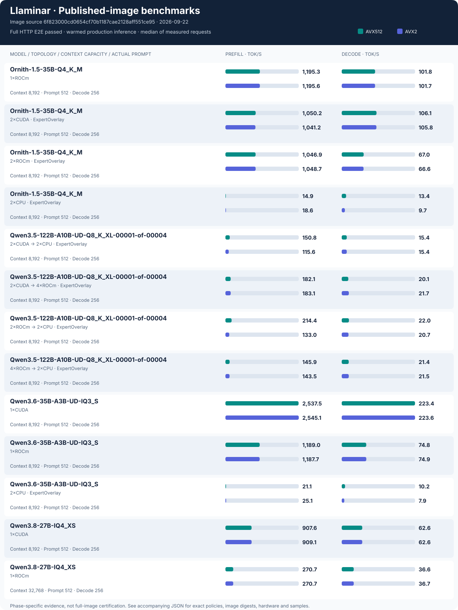

# 🚿 Llaminar
An LLM inferencing engine in C++, with custom quantised kernels for CPU AVX512-VNNI / AVX2, CUDA `sm86`, and ROCm `gfx906`.

Llaminar tries to solve a variety of problems encountered in other projects:

* **Tensor and Pipeline Parallelism:** natively supported, mix and match heterogenous domains.
* **Multiple vendors:** Mix and match CPU, ROCm and CUDA, simultaneously and natively.
* **Easy scaling:** Built from the ground-up on OpenMPI with the goal of enabling scaling across clusters of machines. NUMA-aware.
* **IaC-like experience:** Plan, then deploy.

Llaminar is **experimental** and very much in an **alpha** stage of development. Use it with that in mind and expect the odd segfault.

[Quickstart](#quickstart) · [Planning and topology](#planning-and-topology) ·
[Benchmarks](#benchmarks) · [Development](#development) ·
[Architecture](#llaminar-architecture)

## Supported Hardware

Llaminar supports:

* CPU inferencing (AVX512-VNNI and AVX2 runtime images)
* CUDA inferencing (RTX-3090 / `sm86` initial support for now)
* ROCm inferencing (`gfx906` only for now)
* All of the above simultaneously
* Tensor Parallel / Pipeline Parallel / MoE routed-expert placement (replicated,
  apportioned, or tensor-sharded compute with explicit row assignment) (WiP)

## Supported Models

Llaminar supports the following model architectures initially:

* Qwen 2.5 (dense)
* Qwen 3 (dense)
* Qwen 3.5/3.6 (dense and MoE), including Qwen 3.8 dense GGUFs

## Quickstart

Start with the published Docker image and let the auto planner choose placement.
You only need a supported GGUF, enough RAM/VRAM, and a Linux x86_64 host with
Docker. The image includes CPU, CUDA, ROCm, MPI, and the required user-space
libraries; model weights and host GPU drivers are not included.

The commands below use **Bash**. Run the setup blocks in the same shell.

### 1. Choose the image and model

Select the image for your **CPU instruction set**, not your GPU vendor. Both
images include all three compute backends.

| Host CPU | Develop image |
|---|---|
| AVX512-VNNI | `ghcr.io/llaminar/llaminar:develop` |
| AVX2 | `ghcr.io/llaminar/llaminar:develop-avx2` |

These mutable tags pass the full Unit and production-preflight gates before CI
publishes them. They are development builds, not full E2E/benchmark-certified
releases. Pin an image digest when you need a repeatable deployment.

Set the directory containing your GGUF and its path **inside the container**.
The filename below is an example; use a file you have downloaded.

```bash
export MODEL_DIR=/opt/llaminar-models
export LLAMINAR_MODEL=/models/Qwen3.8-27B-IQ4_XS.gguf
export LLAMINAR_IMAGE=ghcr.io/llaminar/llaminar:develop
# For an AVX2 host, use ghcr.io/llaminar/llaminar:develop-avx2 instead.

docker pull "$LLAMINAR_IMAGE"

COMMON_RUN=(
  --network host
  --shm-size=16g
  --security-opt seccomp=unconfined
  --cap-add SYS_NICE
  -v "$MODEL_DIR:/models:ro"
)
```

### 2. Expose the hardware

Choose **one** setup below. This controls which devices Docker exposes; Llaminar
will then plan across the available hardware.

**NVIDIA:**

```bash
DEVICE_ARGS=(--gpus all)
```

**AMD:**

```bash
DEVICE_ARGS=(--device=/dev/kfd --device=/dev/dri --cap-add SYS_PTRACE)
for node in /dev/kfd /dev/dri/card* /dev/dri/renderD*; do
  if [[ -e "$node" ]]; then
    DEVICE_ARGS+=(--group-add "$(stat -c '%g' "$node")")
  fi
done
```

For a mixed AMD/NVIDIA host, run the AMD block and then add NVIDIA access:

```bash
DEVICE_ARGS+=(--gpus all)
```

For CPU-only execution, use `DEVICE_ARGS=()` instead. The same image runs on
CPU-only hosts without GPU drivers.

<details>
<summary>Host setup and container permissions</summary>

Install [Docker Engine](https://docs.docker.com/engine/install/ubuntu/) first.
NVIDIA hosts need a compatible driver and the
[NVIDIA Container Toolkit](https://docs.nvidia.com/datacenter/cloud-native/container-toolkit/latest/install-guide.html).
AMD hosts need the AMDGPU kernel driver and accessible `/dev/kfd` and `/dev/dri`
nodes; see [ROCm container setup](https://rocm.docs.amd.com/projects/install-on-linux/en/latest/how-to/docker.html).
The image supplies the user-space GPU libraries; their pinned versions live in
the [Dockerfile](Dockerfile) and its install scripts.

The image runs as a non-root user. The AMD block supplies the host's actual
device-group IDs instead of assuming a particular `render` or `video` GID.
`SYS_NICE` and the seccomp setting permit NUMA/placement operations;
`SYS_PTRACE` is included for ROCm runtime access. Normal launches do not need
`--privileged`.

The examples use host networking and a private 16 GiB shared-memory allowance
for MPI/GPU collectives. Do not add Docker `-p` port mappings with host networking,
or combine `--ipc=host` with `--shm-size` expecting it to resize the host's memory.

</details>

### 3. Serve and send a request

```bash
docker run --rm "${COMMON_RUN[@]}" "${DEVICE_ARGS[@]}" \
  --name llaminar "$LLAMINAR_IMAGE" serve \
  -m "$LLAMINAR_MODEL" --context-length 8192 \
  --host 127.0.0.1 --port 8080
```

No device or topology flags are required: `serve` defaults to automatic
planning. It reads the model metadata, gathers hardware inventory, checks
memory capacity, and selects placement. Start here before tuning device
counts, expert quotas, precision, or collectives.

- To restrict compute to one backend, add `--only-backends rocm`, `cuda`, or `cpu`.
- Increase `--context-length` to suit your workload and available memory; the
  limit includes both prompt and generated tokens.
- For a model with MTP weights, add `--mtp --mtp-depth-policy dynamic` to enable
  adaptive speculative decoding. MTP is otherwise off; prefix caching is on by
  default.
- To accept connections from other machines, use `--host 0.0.0.0`. Expose it only
  on a trusted network or behind an authenticated proxy.

Wait for the server to become ready, then use another terminal:

```bash
curl --fail http://127.0.0.1:8080/health

curl --fail-with-body --no-buffer http://127.0.0.1:8080/v1/chat/completions \
  -H 'Content-Type: application/json' \
  -d '{
    "messages": [{"role":"user","content":"Explain tensor parallelism in two sentences."}],
    "max_tokens": 128,
    "temperature": 0,
    "enable_thinking": false,
    "stream": true
  }'
```

OpenAI-compatible clients use `http://127.0.0.1:8080/v1` as the base URL.
`GET /v1/models` lists the loaded model. Remove `"stream": true` for one complete
JSON response. Stop the foreground server with Ctrl+C, or use `docker stop
llaminar` from another terminal. Run one example at a time on the same devices.

## Planning and topology

### Inspect a plan, then apply it

`plan` and `serve` share inference options. Plan using the context, KV policy,
and MTP policy you intend to serve; do not size one configuration and silently
deploy another.

Using the Quickstart variables, save a plan without requiring a writable host
directory inside the non-root container:

```bash
docker run "${COMMON_RUN[@]}" "${DEVICE_ARGS[@]}" \
  --name llaminar-plan "$LLAMINAR_IMAGE" plan \
  -m "$LLAMINAR_MODEL" --context-length 8192 \
  --output /tmp/llaminar-plan.json

docker cp llaminar-plan:/tmp/llaminar-plan.json ./llaminar-plan.json
docker rm llaminar-plan

docker run --rm "${COMMON_RUN[@]}" "${DEVICE_ARGS[@]}" \
  -v "$PWD/llaminar-plan.json:/config/plan.json:ro" \
  "$LLAMINAR_IMAGE" serve --config /config/plan.json
```

The planning container intentionally omits `--rm` so its output can be copied
after exit. Inspect the summary and saved JSON before applying it. A saved
plan fixes placement; applying it does not rerun automatic selection.

Use constraints only when they express a real requirement:

| Intent | Option |
|---|---|
| Only ROCm compute | `--only-backends rocm` |
| Only TP or PP candidates | `--only-strategies tp,pp` |
| Prefer a backend when candidates otherwise tie | `--prefer-backend rocm` |
| Rank for an expected request length | `--plan-workload 512,384` |
| Require compute on every discovered host | `--auto-hosts all` |

`--plan-workload` is an optional costing horizon, not a prompt generator or
output limit. Auto may choose fewer devices when that is predicted to be faster.
Benchmark the result; a cost estimate is not a measured throughput guarantee.

Do not add an `expert-overlay` strategy filter merely because the model is MoE:
a homogeneous one-domain MoE candidate is currently labeled `tp` even though it
executes through ExpertOverlay. That filter would exclude it. Do not combine
auto-search filters with explicit placement or a saved apply plan.

### Explicit placement when needed

Use explicit topology for a required deployment shape or a controlled comparison,
after measuring auto. These examples reuse the Quickstart Docker arguments.
GPU IDs and model geometry must match your machine and GGUF.

**Single device:** `--device rocm:0` or `cuda:0` selects one GPU; `cpu:0` selects
one CPU NUMA endpoint. Bare `--device cpu` selects all local CPU NUMA endpoints.

```bash
docker run --rm "${COMMON_RUN[@]}" "${DEVICE_ARGS[@]}" "$LLAMINAR_IMAGE" serve \
  -m "$LLAMINAR_MODEL" --device rocm:0 --context-length 8192
```

**Dense tensor parallelism:** devices cooperate on each layer. The device list
sets the degree; no separate degree flag or forced collective is needed.

```bash
docker run --rm "${COMMON_RUN[@]}" "${DEVICE_ARGS[@]}" "$LLAMINAR_IMAGE" serve \
  -m "$LLAMINAR_MODEL" --tp-scope rank_local \
  --tp-devices rocm:0,rocm:1 --context-length 8192
```

For two NVIDIA cards, change the list to `cuda:0,cuda:1` and expose NVIDIA
devices. One native GPU TP group uses one vendor, not a CUDA/ROCm mixture.

**Dense pipeline parallelism:** successive layer ranges run on different
domains. This example requires a dense model with **64 main transformer layers**;
adapt the contiguous, inclusive ranges to your GGUF. MTP sidecar blocks are not
extra pipeline layers.

```bash
docker run --rm "${COMMON_RUN[@]}" "${DEVICE_ARGS[@]}" "$LLAMINAR_IMAGE" serve \
  -m "$LLAMINAR_MODEL" --context-length 8192 \
  --define-domain 'early=rocm:0;scope=rank_local' \
  --define-domain 'late=rocm:1;scope=rank_local' \
  --pp-stage '0=early:0-31' --pp-stage '1=late:32-63'
```

**MoE ExpertOverlay:** whole routed experts are apportioned across participants,
rather than dividing the model into layer ranges. For an MoE GGUF, a GPU
continuation tier and two CPU NUMA endpoints can be declared as:

```bash
docker run --rm "${COMMON_RUN[@]}" "${DEVICE_ARGS[@]}" "$LLAMINAR_IMAGE" serve \
  -m /models/Qwen3.6-35B-A3B-UD-IQ3_S.gguf --context-length 8192 \
  --expert-tier 'accelerator=rocm:0,rocm:1;priority=0' \
  --expert-tier 'capacity=cpu:0,cpu:1;priority=10'
```

Tier names are labels; smaller integer priorities are preferred. The lowest
priority number selects the default continuation domain, which owns the main
inference/sampling path. The greatest priority number is the derived
final-coverage tier; there is no `fallback=true` switch. A single GPU tier is
valid too; a CPU tier is not mandatory.

Capacity is automatic. Avoid hard-coded expert counts; optional
`;memory-mb=N` and `;max-experts-per-layer=N` restrict a tier when needed.
Inside tier declarations use explicit addresses such as `cpu:0,cpu:1`, not
bare `cpu`. Use the IDs actually present on the host.

Dynamic residency maintenance is on by default. It considers both promotion
between tiers and skew reduction within a tier, subject to migration economics.
`--moe-residency-maintenance off` disables maintenance for a static control;
`observe` collects demand without moving experts. Initial ownership
(`--moe-routed-expert-owner-order ordinal|random`) is a separate choice.
`--moe-hot-expert-cache` controls optional extra replicas and defaults to `off`;
it is not the capacity of the tier's uniquely owned experts.

For migration windows, transfer slots, concurrency, and advanced domain
overrides, consult `serve --help` and the
[configuration guide](AGENTS.md#run-and-inspect-configuration).
Use `serve --dry-run --explain-placement` to inspect an authored topology.
`--validate-only` checks syntax/configuration, not model fit or successful
inference.

### Remote CPU experts with an MPI hostfile

The same auto planner can use remote CPU machines for an MoE model. Provision
the same source revision of Llaminar and the GGUF at the same path on every
host. Runtime images may use different CPU ISAs for different hosts, but must
be revision-compatible. Arrange passwordless MPI/SSH launch and private network
connectivity first.

For example, `/cluster/hosts` may contain one GPU host and two CPU hosts:

```text
10.10.0.10 slots=1
10.10.0.21 slots=1
10.10.0.22 slots=1
```

Run the public frontend on the GPU controller, inside the prepared MPI runtime
environment:

```bash
llaminar2 plan -m /models/Qwen3.6-35B-A3B-UD-IQ3_S.gguf \
  --mpi-hostfile /cluster/hosts --auto-hosts all \
  --only-backends rocm,cpu --only-strategies expert-overlay \
  --context-length 32768 --mtp --mtp-depth-policy dynamic \
  --output /cluster/remote-experts.json

llaminar2 serve --config /cluster/remote-experts.json
```

Here the explicit strategy constraint requests a cross-host expert topology,
and `--auto-hosts all` requires participation on every machine. Inspect the
selected continuation, tier capacities, and remote participants. For direct
automatic serving, replace `plan` with `serve` and omit `--output`.

A hostfile does **not** provision machines, distribute weights/images, or turn
node-local shared memory into a network transport. In Docker deployments,
remote MPI daemons must run inside their matching runtime containers, not
beside them on the host. The
[Azure cross-host workflow](docs/production-ci.md#azure-resources-for-cross-host-e2e)
automates image/model staging, plan/apply and direct-serve checks, evidence of
remote CPU expert work, and VM lifecycle management.

## Benchmarks

Use the `benchmark` subcommand to measure prefill and generation through the
production runtime. Use a published runtime image or a **Release** source
build, and stop other inference jobs on the same devices before measuring.

### Run a benchmark and save the result

This uses the Quickstart variables, automatic placement, the built-in text
prompt, and a 256-token generation budget. It prints a timing table and exports
JSON; the temporary container is retained just long enough to copy the result.

```bash
docker run "${COMMON_RUN[@]}" "${DEVICE_ARGS[@]}" \
  --name llaminar-benchmark "$LLAMINAR_IMAGE" benchmark \
  -m "$LLAMINAR_MODEL" --context-length 8192 \
  --n-predict 256 --temperature 0 --seed 42 \
  --benchmark-json-output /tmp/benchmark.json

docker cp llaminar-benchmark:/tmp/benchmark.json ./benchmark.json
docker rm llaminar-benchmark
```

To benchmark your own prompt, use either `--prompt "your text"` or
`--prompt-file /models/benchmark-prompt.txt` (a readable text file under
`MODEL_DIR`). The file is consumed as raw text, not an HTTP chat template.
Prompt tokens plus the requested output must fit the context.

For a source build, the equivalent command is:

```bash
./build_v2_release/llaminar2 benchmark \
  -m models/model.gguf --context-length 8192 \
  --n-predict 256 --temperature 0 --seed 42 \
  --benchmark-json-output /tmp/benchmark.json
```

Both examples leave MTP off. For an MTP-capable model, add
`--mtp --mtp-depth-policy dynamic` and save a separate result. To compare runtime
changes on **identical placement**, benchmark a saved plan with `--config` in
place of `-m` and placement flags, using the plan mount shown above. Include
MTP in the plan if it is part of the intended workload.

### Read the numbers

- **Prefill tok/s** measures processing the prompt. Use the actual reported
  token count; neither a context limit nor a byte count is a prefill length.
- **Decode tok/s** measures generated output. JSON also reports
  `throughput_tokens_per_sec.decode_after_prefill`, excluding the token produced
  by terminal prefill; match this denominator when comparing other engines.
- **Warmup and samples:** the default is one warmup followed by three measured
  iterations. Model loading, readiness preparation, and warmup are outside the
  reported steady-state throughput.
- **Prefix cache:** each iteration clears request state and purges reusable
  prefixes before timing full prefill. These are full-prompt measurements, not
  cached-prefix speed claims.
- **Evidence:** JSON includes individual iterations, actual token counts,
  generated token IDs, the resolved configuration, and MTP/cache observations.
  Check `success` and the workload before comparing headline rates.

For a longer sample set, pass `-e LLAMINAR_BENCHMARK_ITERATIONS=5` before the
Docker image name; `LLAMINAR_BENCHMARK_WARMUP_ITERATIONS` controls warmup count.
With a local binary, supply these as ordinary environment variables.

Keep the GGUF, prompt bytes, output length, context, sampling, KV policy, MTP
policy, image revision, and device placement fixed for an A/B. Measure the
defaults first and label any tuning separately. Use `--temperature 0 --seed 42`
for a greedy baseline, not `--deterministic`: that diagnostic flag also changes
kernel dispatch. Leave profiling/debug overrides off for timing runs.

### Published benchmark results

<!-- published-benchmarks:begin -->



Tested image source: [`6f823000cd06`](https://github.com/Llaminar/llaminar/commit/6f823000cd0654cf70b1187cae2128aff551ce95). Both AVX512 and AVX2 passed the full HTTP E2E suite before measurement.
[Exact configurations, image digests and samples](benchmarks/production/published/results.json). This is E2E/benchmark evidence, not full production-image certification.

<!-- published-benchmarks:end -->

Ad hoc benchmarking does not certify an image. The
[production CI pipeline](docs/production-ci.md) benchmarks only E2E-tagged
canonical cells, after both ISA images finish their full E2E suites. Official
runs maintain [high-water marks](benchmarks/production/high_water.json) and
compact results under `benchmarks/production/results/`. AVX2 and AVX512 evidence
is separate. The ordinary develop image gate runs Unit/preflight only.

See the [testing workflow](.agents/llaminar-testing/SKILL.md) for certification
and the [llama.cpp comparison workflow](.agents/llama-cpp-comparison/SKILL.md)
for matched cross-engine workloads and profiling.

## HTTP diagnostics

Non-streaming `/v1/chat/completions` requests may include
`"return_token_ids": true` to receive the actual templated prompt IDs and committed
completion IDs, including framing/stop tokens. Counts agree with `usage` even
when displayed text omits those tokens.

`"return_runtime_summary": true` independently adds the completed request's
prefix-cache and MTP observations. Both options are rejected for streaming
requests; ordinary responses omit these diagnostic payloads. The summary is
available without enabling profiling or INFO logging.

Within `prefix_cache`, `hit` and `partial_hit` are mutually exclusive.
Optional `expert_movement` records are cumulative over `model_lifetime`, not
per-request deltas: do not sum successive responses. Movement axis and physical
transfer direction are distinct; unknown ranks are `null` and estimated weight
bytes are labeled as estimates. Export reads the existing immutable journal
without driving maintenance.

## Development

### Build from source

The recommended development environment is the repository's
[devcontainer](.devcontainer/README.md). It supplies the toolchains and the
patched NCCL/RCCL dependencies required for capture. Open it in VS Code and run
the Build Release or Build Integration task, or follow the
[terminal/SSH workflow](.devcontainer/SSH_CODEX.md).

For a Release build inside that environment:

```bash
LLAMINAR_NINJA_BIN="$(command -v ninja)"
cmake -B build_v2_release -S src/v2 -G Ninja \
  -DCMAKE_BUILD_TYPE=Release \
  -DCMAKE_MAKE_PROGRAM:FILEPATH="${LLAMINAR_NINJA_BIN}"
cmake --build build_v2_release --parallel
```

Use a separate `build_v2_integration` tree with `CMAKE_BUILD_TYPE=Integration`
for instrumented tests. Configure and build with the devcontainer's same Ninja
executable; alternating versions can cause needless full rebuilds. See
[AGENTS.md](AGENTS.md#build) for native-build dependency requirements and gates.

To build a local full-backend runtime image instead of pulling GHCR:

```bash
scripts/docker/build-runtime-image.sh --cpu-isa AVX512 --tag llaminar:local
```

Use `--cpu-isa AVX2` for an AVX2 image. A local image is not CI-certified merely
because it built successfully.

### Optional corpora

Ordinary checkouts, builds, Docker images, and Unit/preflight tests do not
require downloading large corpora. Published data lives in
[Llaminar/corpora](https://github.com/Llaminar/corpora), pinned by the optional
`corpora/` submodule. Fetch only what your task needs:

```bash
GIT_LFS_SKIP_SMUDGE=1 git submodule update --init -- corpora
git -C corpora lfs pull --include 'native_vnni_dispatch/cpu/**' --exclude ''
```

Narrow the include pattern to the desired generation. Publish corpus payloads
in that repository, then update the source gitlink; do not add them to the
source tree or Docker build context.

## Llaminar Architecture

Llaminar V2 is a kernel-centric inference runtime for CPU, CUDA, ROCm, and
mixed-vendor deployments. Model-specific graph builders declare the exact compute
stages needed for a forward pass, and the runtime binds those stages to devices,
buffers, NUMA nodes, MPI ranks, and collective backends.

The high-level pipeline is:

```text
CLI/YAML
  -> OrchestrationConfig
  -> RankExecutionPlan
  -> GraphConfig
  -> DeviceGraphOrchestrator / RankOrchestrator
  -> ComputeGraph
  -> DeviceGraphExecutor
```

`OrchestrationConfig` is the user-facing plan: devices, tensor parallelism,
pipeline stages, backend preference, batch shape, sequence limits, and model
path. `ExecutionPlanBuilder` turns that into a per-rank `RankExecutionPlan`
with parsed runtime values, local device assignments, pipeline ranges, shard
ownership, and the NUMA node for that rank. From there, model-specific config
builders create a `GraphConfig`, and the runtime chooses either a
`DeviceGraphOrchestrator` for one device or a `RankOrchestrator` for local
multi-device tensor or pipeline parallelism.

### MPI, NUMA, and CPU Scaling

OpenMPI and libnuma are hard runtime dependencies. Llaminar treats CPU sockets
as first-class execution domains, not as a flat pile of cores. Each MPI rank is
planned with an explicit host, rank id, socket/NUMA assignment, and shard
contract. The launcher bootstraps MPI, configures OpenMP placement, pins work
to sockets, and uses NUMA-aware allocation so CPU weights and activation pages
live where the kernels that consume them run.

Cross-socket work uses the same distributed execution model as cross-rank work:
local compute stages produce partial results, then collective stages reconcile
them. CPU tensor parallelism uses MPI collectives such as `MPI_Allreduce`,
`MPI_Allgather`, and variable-count gather stages to combine row-parallel
projections, logits shards, or pipeline handoffs. NUMA binding is considered a
correctness and performance contract. If model-page binding is requested and
cannot be applied or verified, Llaminar fails instead of silently accepting
remote-memory execution.

### Graphs and Compute Stages

Model execution is represented as a declarative `ComputeGraph`: a DAG of
`IComputeStage` nodes with named inputs, outputs, dependencies, and device
placement. Stages are the unit of real work. Examples include embedding, RMS
norm, fused QKV projection, RoPE, KV-cache append, attention, SwiGLU, residual
add, LM head projection, all-reduce, all-gather, and pipeline send/receive.

The graph system is model-agnostic. `GraphBuilderRegistry` maps an architecture
name such as `qwen2` or `qwen3` to an `IGraphBuilder`, while
`SchemaFactoryRegistry` provides the weight sharding and stage schema for that
architecture. Adding a model means registering a schema and graph builder; the
orchestration, MPI, memory, and collective layers remain shared.

`DeviceGraphExecutor` runs the graph through a common stage loop controlled by
`StageRunPolicy`. That loop handles buffer coherence, device uploads, output
ownership, validation, profiling, snapshots, and collective interception. This
keeps prefill, decode, parity testing, and fast cached decode on the same
execution semantics, with different policy knobs rather than separate
hand-written pipelines.

### Collectives Across CPU, CUDA, and ROCm

Graphs declare collectives abstractly. A model graph says "all-reduce this
buffer" or "all-gather these logits"; it does not hardcode MPI, NCCL, RCCL, or
host staging. At execution time, `CollectiveContext` and `BackendRouter` inspect
the participating devices and select the concrete backend.

- CPU and cross-node collectives use OpenMPI.
- Same-vendor CUDA groups use NCCL.
- Same-vendor ROCm groups use RCCL.
- Heterogeneous CPU/GPU or CUDA/ROCm paths use the available host or direct
  transfer path selected by the router.

This is what lets a single Llaminar process run CPU-only, CUDA-only,
ROCm-only, or mixed CUDA+ROCm inference. Tensor-parallel domains can be local
to a rank, spread across ranks, or composed with pipeline-parallel stages. The
graph sees the same logical collective stages in each case; only the runtime
routing changes.

### GPU Graph Capture

Prefill uses captured chunks of at most 512 tokens by default, independently
of the full KV context limit. Use `--prefill-max-bucket-size 1024` (or another
positive row count) to select a different maximum. Smaller chunks reduce
activation/workspace VRAM; larger chunks may improve prefill throughput.
The option replaces the startup `LLAMINAR_PREFILL_GRAPH_BUCKET_SIZES` list with
the canonical buckets up to that size, including the exact requested endpoint.
Without the option, an explicit environment bucket list remains authoritative.
ExpertOverlay's separate `--moe-overlay-prefill-segment-rows` limit may further
bound its chunk size; raise both limits to request larger overlay segments.

Production GPU inference uses retained captured graphs, including compatible
NCCL/RCCL collectives. Request reset publishes new execution state without
rebuilding the topology. Token positions, KV-cache counters, routing, sampling,
and MTP verification remain device-owned during execution.

Homogeneous GPU execution uses complete captured generation transactions.
CUDA can express conditional MTP execution within its parent graph. HIP uses
retained transaction graphs selected by a small immutable scheduler ticket:
the device chooses the next transaction, and the host submits it without
becoming an authority for model or sampling state.

Segmentation is reserved for declared heterogeneous device/collective
boundaries that cannot share one native graph. An unsupported capture
configuration is an error, not a reason to silently switch to eager inference.

The result is one execution model that scales down to a single CPU socket and
up to heterogeneous multi-GPU, multi-socket, and multi-rank deployments while
keeping placement, collectives, and graph replay explicit.

## The Llaminar Philosophy

* Tensors want to be open and free: so is Llaminar.
* Tensors want to be sliced, sharded, and pipelined: Llaminar lets them be.
* Tensors want to run on a variety of hardware types without artificial handicaps: Llaminar helps them to do so.

## Activation precision

Production inference currently supports FP32 model activations only.
`--activation-precision fp32` is the default; other activation modes fail as
unimplemented. KV-cache precision and model/expert weight formats are separate
settings and retain their own supported formats.
