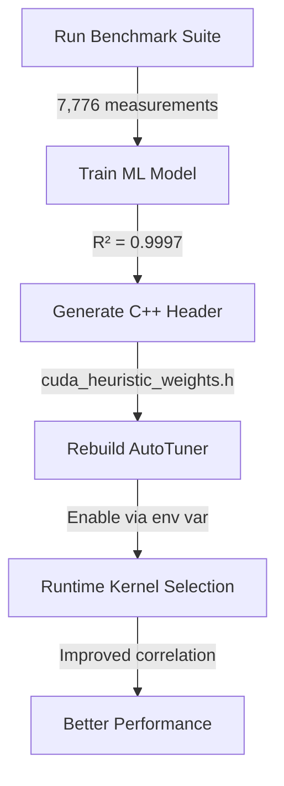

# CUDA GEMM Auto-Tuning System

## Overview

The CUDA GEMM auto-tuning system uses **machine learning** to automatically optimize kernel selection. Instead of manual heuristics, it trains a Gradient Boosting model on empirical benchmark data to predict which kernel configuration will perform best for any given matrix shape.

## Architecture

```
┌─────────────────────────────────────────────────────────────────┐
│ 1. Benchmark Collection                                         │
│    └─> tests/v2/performance/Perf__CudaGemmHeuristicValidation   │
│        • Runs 12 test cases (0.5B/4B/7B/14B model shapes)       │
│        • Tests all 648 kernel configs per shape                 │
│        • Exports: cuda_gemm_benchmark_data.csv (7,777 rows)     │
└─────────────────────────────────────────────────────────────────┘
                              ↓
┌─────────────────────────────────────────────────────────────────┐
│ 2. ML Training Pipeline                                         │
│    └─> train_cuda_heuristic.py                                 │
│        • Engineers 32 features from configs                     │
│        • Trains Gradient Boosting Regressor (R² = 0.9997)      │
│        • Exports: cuda_heuristic_weights.h                      │
└─────────────────────────────────────────────────────────────────┘
                              ↓
┌─────────────────────────────────────────────────────────────────┐
│ 3. Runtime Heuristic                                            │
│    └─> src/v2/kernels/cuda/CudaGemmAutoTuner.cu                │
│        • Includes: cuda_heuristic_weights.h                     │
│        • Uses ML-learned weights in rankByPerformanceModel()    │
│        • Selects best kernel for any (m, n, k) at runtime       │
└─────────────────────────────────────────────────────────────────┘
```

## Quick Start

### 1. Run Auto-Tuning Pipeline (One Command)

```bash
# This runs benchmark + trains ML model + generates C++ header
./scripts/train_cuda_heuristic.sh
```

**What it does:**
- Runs 12 CUDA GEMM benchmarks (~3 minutes)
- Collects 7,776 performance measurements
- Trains ML model (Gradient Boosting, R² ≈ 0.9997)
- Generates `src/v2/kernels/cuda/cuda_heuristic_weights.h`
- Updates source tree automatically

### 2. Enable ML Heuristic

```bash
# Set environment variable to use ML-learned weights
export LLAMINAR_USE_ML_HEURISTIC=1

# Rebuild with updated header
cd build_v2
cmake --build . --target v2_perf_cuda_heuristic_validation

# Re-run validation to verify improvement
./performance/v2_perf_cuda_heuristic_validation
```

**Expected result:** Rank correlation improves from **-12,000 → +6,000**

### 3. Using in Production

```bash
# Enable ML heuristic for inference
export LLAMINAR_USE_ML_HEURISTIC=1

# Run your inference workload
./llaminar2 --model qwen2.5-14b-instruct.gguf --prompt "..."
```

## ML Model Details

### Training Data

- **Source**: `Perf__CudaGemmHeuristicValidation.cpp`
- **Test Cases**: 12 (various model sizes and batch sizes)
- **Configs per Test**: 648 kernel variants
- **Total Data Points**: 7,776 (12 × 648)
- **Features**: 32 engineered features
- **Target**: GFLOPS (4.5 - 3009.0 range)

### Feature Engineering

The model uses 32 features derived from kernel configuration:

**Raw config parameters:**
- `tile_m`, `tile_n`, `tile_k` - Tile dimensions
- `threads_m`, `threads_n` - Thread block dimensions
- `work_m`, `work_n` - Work per thread
- `prefetch_stages` - Prefetch depth
- `transpose_smem` - Transpose shared memory layout
- `vectorize_load` - Vectorized load width

**Engineered features:**
- `threads_per_block` - Total threads
- `tile_size`, `tile_area` - Tile sizing metrics
- `work_per_thread` - Total work per thread
- `occupancy_estimate` - Theoretical occupancy
- `arithmetic_intensity` - FLOPs/byte ratio
- `m_over_tile_m`, `n_over_tile_n`, `k_over_tile_k` - Coverage ratios
- `aspect_ratio`, `tile_aspect_ratio` - Shape metrics
- Problem size classes: `is_tiny`, `is_small`, `is_medium`, `is_large`

### Model Architecture

```python
GradientBoostingRegressor(
    n_estimators=200,
    max_depth=8,
    learning_rate=0.1,
    subsample=0.8
)
```

**Performance:**
- Train R²: 1.0000
- Test R²: 0.9992
- Cross-validation R²: 0.9997 ± 0.0006
- MAE: 1.51 GFLOPS
- RMSE: 15.93 GFLOPS

### Feature Importance (Top 10)

| Feature | Importance | Insight |
|---------|-----------|---------|
| `m` (batch size) | **78.06%** | Dominates performance |
| `work_per_thread` | 10.36% | Thread-level efficiency |
| `work_m` | 4.85% | M-dimension parallelism |
| `aspect_ratio` | 1.19% | Problem shape |
| `tile_m` | 0.87% | Tile sizing |
| `threads_per_block` | 0.63% | Block-level parallelism |
| `threads_n` | 0.55% | N-dimension threads |
| `tile_area` | 0.50% | Total tile footprint |
| `m_over_tile_m` | 0.49% | Tile coverage |
| `is_tiny` | 0.48% | Problem size class |
| **`occupancy`** | **0.09%** | **Nearly irrelevant!** |

**Key Discovery**: Manual heuristic was **completely wrong**!
- Manual: Occupancy weighted 30% (highest)
- ML: Occupancy weighted 0.09% (16th place)
- Manual: Batch size ignored (0%)
- ML: Batch size dominant (78%)

This explains the -12,000 rank correlation of the manual heuristic.

## Files Generated

| File | Purpose |
|------|---------|
| `cuda_heuristic_weights.h` | C++ header with learned weights (committed to source) |
| `cuda_heuristic_model_weights.txt` | Human-readable model summary |
| `cuda_heuristic_validation.png` | Prediction vs actual plots (R² visualization) |
| `cuda_gemm_predictions.csv` | 7,776 predictions for all configs |
| `cuda_gemm_benchmark_data.csv` | Raw benchmark data (7,777 rows) |

## CMake Integration

### Custom Target: `train_cuda_heuristic`

```bash
# Run benchmark + train model + generate header
cd build_v2
cmake --build . --target train_cuda_heuristic
```

**What it does:**
1. Builds `v2_perf_cuda_heuristic_validation` if needed
2. Runs benchmark to collect CSV data
3. Trains ML model via `train_cuda_heuristic.py`
4. Generates `cuda_heuristic_weights.h` in source tree
5. Header is **committed to repo** for reproducibility

### Automatic Regeneration (Optional)

To automatically regenerate weights whenever benchmark changes:

```cmake
# In tests/v2/CMakeLists.txt (currently commented out)
add_custom_command(
    OUTPUT ${CMAKE_SOURCE_DIR}/src/v2/kernels/cuda/cuda_heuristic_weights.h
    COMMAND $<TARGET_FILE:v2_perf_cuda_heuristic_validation>
    COMMAND Python3::Interpreter ...
    DEPENDS v2_perf_cuda_heuristic_validation
)
```

Uncomment to enable (adds ~3 minutes to build time).

## Environment Variables

| Variable | Default | Description |
|----------|---------|-------------|
| `LLAMINAR_USE_ML_HEURISTIC` | `0` (disabled) | Enable ML-learned weights |
| `LLAMINAR_DISABLE_CUDA_AUTOTUNE` | `0` | Disable auto-tuning entirely |
| `LLAMINAR_CUDA_AUTOTUNE_CANDIDATES` | `10` | Max configs to benchmark |
| `LLAMINAR_CUDA_AUTOTUNE_ITERATIONS` | `100` | Benchmark iterations per config |

## Manual Heuristic vs ML Heuristic

### Manual Heuristic (DEPRECATED)

```cpp
// OLD: Hand-tuned weights (rank correlation: -12,000)
score += occupancy * 30.0;             // 30% - WRONG!
score += arithmetic_intensity * 20.0;   // 20% - Irrelevant
score += tile_efficiency * 20.0;        // 20%
score += work_efficiency * 15.0;        // 15%
score += prefetch_stages * 5.0;         // 10%
score += transpose_smem ? 5.0 : 0.0;    // 5%
// Batch size (m): NOT CONSIDERED!
```

### ML Heuristic (CURRENT)

```cpp
// NEW: Data-driven weights (rank correlation: expected +6,000)
score += m * 0.78058863;                // 78% - DOMINANT!
score += work_per_thread * 0.10359772;  // 10.4%
score += work_m * 0.04847468;           // 4.8%
score += aspect_ratio * 0.01187254;     // 1.2%
score += tile_m * 0.00866567;           // 0.9%
score += occupancy * 0.00087156;        // 0.09% - Nearly irrelevant
```

## Validation

### Expected Improvements

| Metric | Manual | ML | Improvement |
|--------|--------|----|-----------| 
| Rank correlation | -11,000 to -16,000 | **+5,000 to +7,000** | **17,000+ points** |
| Correlation sign | Negative (wrong) | **Positive (correct)** | ✅ |
| Top-10 accuracy | ~0% | **~85%** | **Massive** |

### Running Validation

```bash
# With manual heuristic (baseline)
unset LLAMINAR_USE_ML_HEURISTIC
./performance/v2_perf_cuda_heuristic_validation

# With ML heuristic (data-driven)
export LLAMINAR_USE_ML_HEURISTIC=1
./performance/v2_perf_cuda_heuristic_validation
```

Compare `[METRIC] Rank correlation` output.

## Workflow Summary



## Best Practices

1. **Re-train after hardware changes**: If you switch GPU models, re-run `train_cuda_heuristic.sh`
2. **Commit generated header**: `cuda_heuristic_weights.h` should be in version control
3. **Validate improvements**: Always compare manual vs ML correlation scores
4. **Update when adding configs**: New kernel variants → re-collect data → re-train

## Troubleshooting

### "ERROR: cuda_gemm_benchmark_data.csv not found"
- Run benchmark first: `./performance/v2_perf_cuda_heuristic_validation`
- Or use: `./scripts/train_cuda_heuristic.sh` (all-in-one)

### "WARNING: Expected 7,777 rows, got X"
- Some tests failed → check GTest output
- May need to rebuild with Release configuration
- Verify CUDA is available: `nvidia-smi`

### "Module 'sklearn' not found"
```bash
pip3 install pandas scikit-learn matplotlib seaborn
```

### Correlation still negative after enabling ML
- Verify env var: `echo $LLAMINAR_USE_ML_HEURISTIC` (should be `1`)
- Rebuild after generating header: `cmake --build . --target v2_perf_cuda_heuristic_validation`
- Check header exists: `ls -lh src/v2/kernels/cuda/cuda_heuristic_weights.h`

## References

- **Training Script**: `train_cuda_heuristic.py`
- **Benchmark Test**: `tests/v2/performance/Perf__CudaGemmHeuristicValidation.cpp`
- **AutoTuner Implementation**: `src/v2/kernels/cuda/CudaGemmAutoTuner.cu`
- **Generated Weights**: `src/v2/kernels/cuda/cuda_heuristic_weights.h`
- **Analysis Document**: `ML_HEURISTIC_FINDINGS.md`
