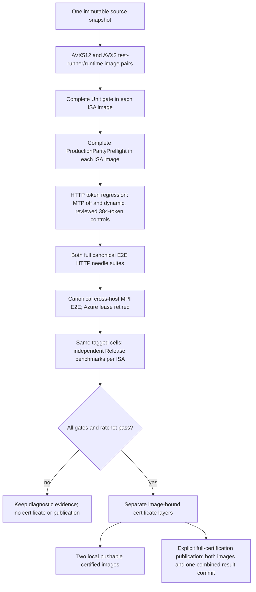

# Production image certification

`scripts/ci/run_production_pipeline.py` is the explicit local/full-certification
entry point. By default it independently certifies full CPU/CUDA/ROCm
**Release** images for both AVX512 and AVX2, not a devcontainer or
independently rebuilt executables. It remains deliberately broader than the
develop-branch GitHub Actions job described below.

The shared [Llaminar testing workflow](../.agents/llaminar-testing/SKILL.md)
routes local development checks, model diagnostics, and this full image gate.

## Develop branch image gate

`.github/workflows/ci.yml` is enabled only for pushes to `develop`. It runs
`scripts/ci/run_develop_image_gate.py`, which builds AVX512 and AVX2
full-backend test-runner/runtime pairs, runs the complete Unit and
`ProductionParityPreflight` transaction inside each test runner, then publishes
only the tested runtime images as `ghcr.io/llaminar/llaminar:develop` and
`ghcr.io/llaminar/llaminar:develop-avx2`. It does not run model discovery,
generation regression, mathematical parity, HTTP E2E, remote MPI, benchmarks,
or image certification. Its test runner contains the complete model-free
Unit/preflight inventory but not diagnostic model-parity matrices needed only
by the full pipeline's typed E2E discovery. Its tags must never be described as certified
release artifacts.

Run that exact narrow gate locally when validating its plumbing:

```bash
python3 scripts/ci/run_develop_image_gate.py \
  --output parity-results/develop-image-gate \
  --image ghcr.io/llaminar/llaminar:develop \
  --publish
```

`--publish` requires both ISA lanes and is performed only after both installed
Unit/preflight transactions pass. Omitting it is a local build/test diagnostic;
`--cpu-isa` may narrow such a diagnostic but can never publish a partial pair.

### ARC runner on the production host

The `llaminar-xeon` ARC scale set runs inside the host's Kubernetes cluster,
but it deliberately uses the host's Docker Unix socket rather than a DIND
sidecar. Docker's graph store is single-writer state: two daemons must never
share a writable `data-root`. Socket ownership gives the runner the host
daemon's one existing image and layer store. The workflow creates one named,
persistent `docker-container` BuildKit worker (`llaminar-ci`) within that
daemon; it is not a second Docker graph store and is retained across ephemeral
runner-pod replacement.

The checked-in deployment values are
`scripts/ci/arc/llaminar-xeon-host-docker-values.yaml`. They mount the host
workspace at the same `/home/runner/_work` spelling in the pod and on the
host, mount `/var/run/docker.sock`, and declare those paths through
`LLAMINAR_DOCKER_SHARED_ROOTS`. `docker_paths.py` accepts only those exact
same-path roots; an undeclared Kubernetes path is a fatal configuration error.
The scale set also mounts the existing canonical model tmpfs read-only and a
persistent host ccache root at `/var/cache/llaminar/ccache`. Before applying
the scale set, prepare the host once:

```bash
# Run on the host that owns the Kubernetes node and Docker daemon.
sudo install -d -o 1001 -g 1001 -m 0750 /home/runner/_work
sudo install -d -o 1001 -g 1001 -m 0750 /var/cache/llaminar/ccache
sudo install -d -o 1001 -g 1001 -m 0750 /var/cache/llaminar/ccache/buildkit
bash scripts/ci/setup_production_parity_tmpfs.sh --share-uid 1001
```

The cache root is an explicit `hostPath`, so it survives ARC pod recreation
and node-local runner restarts. `run_production_pipeline.py` partitions the
external Buildx OCI cache only by ISA and imports it only after a complete
prior export exists. It resets each slot on export, preventing stale manifest
blobs from growing without bound. The Dockerfile's `ccache` mounts are one
shared `llaminar-ccache` cache in the host Docker daemon's retained
`llaminar-ci` BuildKit worker; ccache hashes compiler identity and flags, so
the two ISA lanes cannot collide. `CCACHE_MAXSIZE=50G` is the hard
compiler-cache cap. The post-job BuildKit prune is best-effort 200 GB
layer-cache housekeeping and deliberately cannot fail an otherwise valid image
gate. BuildKit
intentionally does not export writable cache-mount contents; keeping that
worker and its bounded cache is what preserves compiler objects across runner
replacement. Do not replace either path with DIND, an `emptyDir`, or a second
Docker graph store.

The same retained BuildKit graph is the dependency cache. Its keyed immutable
layers retain the pinned CUDA, ROCm, NCCL/RCCL, oneDNN, CUTLASS, Python, and
vendored-dependency builds whenever their declared inputs match. Do not bind a
mutable host directory over compiled dependency output: that would allow a
library built for another compiler, ISA, ROCm version, or source revision to
masquerade as a valid layer hit. Ccache accelerates recompilation inside a
missed layer; BuildKit authenticates whether the layer may be reused at all.

The runner pod has explicit CPU/memory **requests** for stable scheduling but
intentionally no CPU or memory limits. A Kubernetes CPU limit is a CFS quota
and would throttle the action process. The expensive BuildKit and test
containers are created through the host Docker socket, so they are host-daemon
workloads with their own cgroups rather than descendants of the runner pod.
The single-runner scale set and host-level cache discipline remain the resource
isolation boundary; do not reintroduce per-pod limits as a workaround for a
node-capacity problem.

Each CI image target writes its complete Buildx output to
`build-<target>.log` and appends start/terminal timing transitions to
`build-timeline.jsonl` in the per-ISA gate evidence directory. The develop
workflow uploads this evidence after every run, including a failure. The
timeline measures the whole target transaction—compile, filesystem assembly
and `--load` import—so local Docker import time is not misreported as compiler
time. The non-published test-runner target is deliberately runtime-derived: it
contains the sealed test closure but not the compiler toolchain, SDKs, object
archives, or duplicate Release build. Building it first imports the runtime
layers which the later publication target reuses. These are compact diagnostics,
not a cache upload; no BuildKit or ccache payload is sent to GitHub.

The workflow deliberately selects Buildx's `docker-container` driver rather
than the default Docker driver: the latter cannot export the local cache
backend at all. `llaminar-ci` is the only CI BuildKit worker and remains on the
host Docker daemon after the action exits; action concurrency permits one
writer. Its `cache-binary` action feature is disabled, and the pipeline uses
only `type=local` cache import/export under the mounted host path: no compiler
or Buildx cache payload is sent to GitHub. Do not turn on automatic builder
cleanup or create per-run builders.

When the Kubernetes node is itself a k3d container, Kubernetes `hostPath`
alone reaches only that node container's filesystem. Bind the same physical
host directory into every node eligible to run `llaminar-xeon` when creating
or recreating the cluster, for example:

```bash
k3d cluster create llaminar \
  --volume '/var/cache/llaminar/ccache:/var/cache/llaminar/ccache@server:*;agent:*'
```

Verify the k3d node container has that bind before applying the Helm values.
The scale-set volume deliberately uses `type: Directory`, so a missing k3d
bind fails admission instead of creating a non-persistent node-local cache.

`setup_production_parity_tmpfs.sh` adopts the single pre-existing named tmpfs
with a bind mount when one is already exported; it never copies GGUFs or
allocates a second RAM disk. `--share-uid` grants the ARC identity read access
to sealed cached models while retaining the cache lifecycle's one owner. A
future full model-staging job must run under that cache owner or use an
explicitly delegated cache-owner transition; it must not bypass the lock and
directory-sealing protocol.

Apply the values to the existing release from a checkout visible to the host:

```bash
export KUBECONFIG=/etc/rancher/k3s/k3s.yaml
helm upgrade --reuse-values --namespace arc-runners llaminar-xeon \
  oci://ghcr.io/actions/actions-runner-controller-charts/gha-runner-scale-set \
  --version 0.14.2 \
  --values scripts/ci/arc/llaminar-xeon-host-docker-values.yaml
```

The host Docker socket group is intentionally a deployment-specific numeric
supplemental group in that values file. Validate it before an upgrade with
`stat -c '%g' /var/run/docker.sock`; do not guess, chmod the socket, or make
two daemons share a cache directory. The legacy DIND cache directory is left
untouched for manual retirement, but no live runner consumes it.



## Run locally

The node needs Docker/Buildx, Python 3, Git, `lscpu`, `lspci`, the complete
canonical model inventory, and sufficient CPU/CUDA/ROCm hardware. Missing
models or devices fail; they do not silently reduce certification coverage.
The Dockerfile installs the test/reference dependencies. Corpus submodules
are neither initialized nor included in the image. Explicitly materialize the
approved token corpus in `corpora/` (or pass `--corpus-root`); the host driver
loads only the ISA payload approved by the frozen source's catalog. Missing
answers fail rather than being generated during certification.
The devcontainer sets `DOCKER_HOST=unix:///var/run/docker-host.sock` to use
the mounted daemon socket directly. Its socket proxy can truncate Docker's
half-closed exec/attach connection, returning success while the child is still
running. HTTP and remote certification check delayed child output and exact
exit status before admission. A failed check is fatal; fix socket access
instead of retrying inference or trusting the detached client's exit code.
For a container created before this setting was installed, explicitly export
that `DOCKER_HOST` value in the invoking shell.
The full-backend shared core defers NVIDIA Driver API binding until CUDA
preparation. CPU-only cluster ranks and ROCm-selected cells use the same image
without a host NVIDIA driver. HTTP and benchmark launchers inject NVIDIA
drivers/devices only for CUDA request intent. Missing required CUDA driver
symbols fail before capture; toolkit stubs are never used for test discovery
or shipped as a substitute.

`--reference-cache-root` names the parent of authenticated Hugging Face packs.
Locally it defaults to the existing workspace packs; a separately provisioned
full-certification runner uses a
persistent `/opt/llaminar-parity-references` directory. The test image mounts
it at `/reference-cache` and sets `LLAMINAR_PARITY_REFERENCE_CACHE_ROOT`.
Model-owned pack names, generation leases and authentication are unchanged.
Cold caches generate normally; exiting a test container does not erase them.
The test runner runs tests with the invoking UID/GID, keeping newly generated packs
and read-only staged GGUFs usable by later local runs. Bind-mount path spelling
does not invalidate a cache hit when the complete file stat identity agrees.
ROCm supplementary groups come from the Docker daemon's actual device nodes,
not a devcontainer's possibly different group names, GIDs or local chmods.
ROCm group IDs and NVIDIA passthrough paths use one metadata-probe lifecycle:
create an owned container with read-only daemon `/dev`, execute once, wait for
successful completion, copy its result file, then remove the helper. Attached
stdout is not a metadata authority: short-lived Docker attach can lose output
even when the process succeeds. Probe failures are fatal, with no retries or
permission changes; an empty NVIDIA inventory remains distinct from failure.
The compiler builder and runtime install the same source-built RCCL at the same
library path. Runtime loading uses CMake's exact `RCCL_LIBRARY` selection; it never
guesses a checkout location or substitutes another packaged collective library.

```bash
bash scripts/ci/setup_production_parity_tmpfs.sh
python3 scripts/ci/run_production_pipeline.py \
  --models /opt/llaminar-models \
  --output parity-results/production-ci
```

Use `--through build`, `--through prerequisites`, `--through generation`, `--through e2e`, or
`--through benchmarks` to exercise a prefix. Continue with the same arguments
and `--resume`. A source change, changed evidence, missing image, or changed
model-file identity invalidates reuse. Partial runs never issue a certificate.
Both the test runner and runtime must match the requested source tree and ISA,
declare their distinct image roles, and include CUDA and ROCm. The test runner
must also carry the sealed receipt that attests its Integration build was not
skipped. These checks reject a
wrong image before expensive gates; they do not replace executing the installed
tests. Resume re-inspects each immutable image and checks its recorded labels
and layer ancestry as well as its ID. Certification uses the requested ISA slot,
never an ISA inferred from the candidate's own label.
The prerequisites phase runs Unit and preflight once per ISA; the generation
phase consumes that test-runner-bound receipt rather than repeating gates for each
model cell. Unit retains CTest's unrestricted parallelism. Preflight separates
its typed, resource-validated inventory into a serial host lane, a CUDA socket
lane, a ROCm socket lane, and a serial exclusive lane. CUDA and ROCm execute
concurrently only when they are single-rank, backend-exclusive cases and the
host exposes disjoint physical-package CPU sets; mixed-backend and multi-rank
cases remain exclusive. Each lane has its own `integration-<lane>.log` and
JUnit XML evidence. ISA runs are sequential on the same node. Both E2E suites
must finish successfully before either benchmark suite
starts. A passing AVX512 report never certifies AVX2 (or vice versa).

For a model-free prerequisite transaction only:

```bash
python3 scripts/ci/run_production_prerequisites.py \
  --build-dir build_v2_integration \
  --output parity-results/prerequisite-check
```

Inside a matching installed test runner, add `--installed-build-receipt
/src/installed-tests.json`. The command delegates to the same canonical
Unit/preflight authority and writes its receipt, CTest logs and JUnit files.
The installed receipt replaces incremental build preparation, not either test
gate. There are no model, backend or cell selectors, and an existing output
directory is rejected. This command never stages models or launches a runtime
container. Its receipt alone is not image certification; the outer pipeline
must bind it to the exact test-runner/source/ISA before admitting runtime tests.

Evidence lives in `avx512/` and `avx2/` beneath the output directory, with one
collection receipt at the root. A local piecewise run may specify `--cpu-isa
AVX2` or `--cpu-isa AVX512`, but official publication requires both. The optional
`--image registry/repository:tag` names the AVX512 artifact; AVX2 uses
`registry/repository:tag-avx2`. Release aliases preserve that same convention.

Local edits are captured using a private Git index and source-tree identity;
the working branch/index are not changed. A local certificate explicitly
records whether that tree differs from HEAD. Official publication requires a
clean protected-branch source revision. Output directories must remain outside
tracked source (the default examples use ignored `parity-results/`).

The existing per-cell watchdogs remain owned by the generation/E2E drivers.
Routine generation selects only serial controls and dynamic-depth MTP from the
full canonical inventory; both must match reviewed serial answers exactly,
including token 384, and still prove prefix restore, movement and graph capture.
Fixed-depth MTP and mathematical HF parity are diagnostic-only. Explicit
`--diagnostic-mathematical-parity` adds the full mathematical matrix and its CSV
and economy checks; `--through parity` requires that flag. For token drift or
suspected accuracy errors, run the matching individual HF cell first and use
its checkpoint CSVs to identify the earliest divergence. Never regenerate a
golden stream to hide drift.

### Devcontainer model staging

Bind sources are resolved in the Docker daemon's namespace. Ordinary workspace
and model bind mounts use Docker's recorded mappings. A private, owned model
tmpfs is published once using a short-lived privileged helper and Linux's
descriptor-based mount API. This creates a second mount of **the same pages**;
it does not recopy GGUFs, change NUMA placement or clear the cache. The helper
requires Python 3.12+ and glibc mount wrappers on the daemon host.

The exported mount lives under `/mnt/llaminar-docker-tmpfs/<container-id>/`
on the host until explicit manual unmount or reboot. Its exact path is printed
at setup. Unmount that exact export when retiring the cache; unmounting only
the devcontainer's original path does not free pages still pinned by its
export. Setup checks the source/export device and inode and refuses a stale
or occupied destination. Remote Docker daemons are not supported by this
node-local device-certification workflow.

## One cell inventory

C++ `ModelParityDefinition::e2e_certifiable` remains the eligibility authority.
Its optional `remote_cpu_overlays` declarations expand into distinct cross-host
E2E cases, each with both default-auto plan/apply and direct default-auto serve.
The source cell still owns the model, precision, MTP, prefix and economics;
remote scenarios declare one continuation GPU plus CPU hosts, not local CPU
socket indices. Fine-tunes must opt in independently. Discover these declarations
without provisioning resources or running inference:

```bash
python3 scripts/ci/model_parity_inventory.py \
  --build-dir build_v2_integration --scope cross-host-e2e
```

Rebuild the canonical matrix executables before discovery. A remote-only export
cannot substitute for the full inventory. These are eligibility declarations,
not completed certificates. The production driver runs full HTTP needle suites,
then remote MPI E2E plus verified resource retirement, and only then benchmarks.
Passing the existing HTTP suite does not prove the new cross-host obligations.
The long-context helper atomically publishes progress before and after each
check, including monotonic elapsed time and the active check. Interrupted
reports preserve completed evidence but remain incomplete; only normal
completion of all eight successful checks passes certificate admission.
The public MPI bootstrap propagates explicitly requested diagnostic settings
to remote ranks. Use rank-qualified PerfStats output paths (`{rank}`) available
on each host; plain output paths remain authority-rank-only. This propagation
does not export provider credentials or launcher-local device/CPU placement.
Model and image staging uses an atomic SSH/rsync upload to one owned
CPU peer, then distributes it concurrently to other peers over the leased
private network. A short-lived, SSH-owned source serves only that artifact to
the declared peer addresses with a lease capability; it closes before model
admission. No SSH private key is copied to a VM and no public listener rule is
added. Receivers publish only complete files, and every Docker import still
checks the exact image configuration and ordered filesystem layers. Image
imports on independent Docker stores launch concurrently under one shared
deadline. Every SSH import client is joined on success, failure or cancellation;
an unretired client is a hard error, not permission to admit an image. Import
logs survive staging cleanup. Remote daemon retirement remains owned by the
Azure lease rather than being inferred from an SSH exit. Model
staging uses byte counts and preserved source timestamps, not another
whole-GGUF hash gate. Unchanged owned replicas require no transfer. Changed
archives reuse matching blocks over the WAN; private receivers replace only
their explicitly observed cache file, and only after complete transfer. Every
run authenticates the full runtime image on each peer. An exact already-imported
configuration/layer match reuses the daemon's immutable image ID and avoids
export, transfer and import entirely; a transport tag alone is never sufficient.
Archive transfer caches live under the owned user's persistent cache directory,
not `/tmp` (which Ubuntu may clear at boot), and outside the model mount.
Remote declarations emit the public `--auto-hosts all` hard constraint so a
cheaper all-local or partial-host proposal cannot satisfy the fixture. This
does not bypass automatic placement or prove computation by itself: the HTTP
observer still requires completed expert work on every declared remote host.

The builder exports its **full** existing GoogleTest/CTest inventory through
`model_parity_inventory.py --scope all`, with no selectors. The retained
`container-all-cells.json` uses the image's paths; `all-cells.json` carries the
same records at the host's model mount. `manifest.json` is only the exact tagged
projection for E2E and benchmarks, not a second discovered matrix.
`cross-host-manifest.json` preserves the remote-tagged source records from that
same export, including their already-expanded frontend scenarios. Missing
remote eligibility and duplicated scenario IDs fail discovery rather than
silently removing cloud coverage. All four documents belong to the build
receipt. Final certification checks the installed HTTP/benchmark projection and
the remote report against their full-inventory parent. A pipeline-owned remote
manifest always requires `cross-host-e2e.json`; an empty projection produces an
explicit not-applicable report, never an implicit skip.

Model identity pins cover the full inventory, including models used only by
untagged numerical/generation cells. A change to any declared shard invalidates
resume. Numerical evidence must name every exact campaign/cell pair in that
inventory; a positive count or a passing E2E subset is insufficient. The final
certificate binds both full-inventory and tagged-projection metadata identities.
The manifests include complete model-file declarations, including split GGUF shards.
Path translation across the container boundary does not change the typed
execution arguments. Source paths must be canonical shard paths inside the
installed `/src/models` mount; traversal, ambiguous aliases and mount-only
declarations fail before model admission. Translation uses the caller's
resolved absolute mount and does not resolve container paths against the host
filesystem or replace shard identity checks. Benchmarks reuse those arguments verbatim; no model,
topology, precision, placement, movement or MTP matrix lives in Python/YAML.

For read-only native acquisition progress, use
`scripts/ci/audit_generation_acquisition.py --manifest <all-cell-manifest>
--reports <oldest-report> <next-report> ...`. It uses the existing canonical
reader, revalidates original HTTP responses and exact Off-control tokens, and
reports unseen cells and unresolved failed attempts. Supply original reports,
not the convenience symlink index of controls. Duplicate passes are rejected;
a later failed attempt cannot be hidden by an older green result. Different
source revisions remain explicit acquisition provenance when their complete
configurations agree. This audit neither approves a corpus nor certifies the
current build or either shipping image; it performs no inference or downloads.

For a diagnostic benchmark selection after exporting a manifest:

```bash
python3 scripts/ci/run_model_parity_benchmarks.py \
  --manifest parity-results/production-ci/avx512/manifest.json \
  --source-revision "$(git rev-parse HEAD)" \
  --image <candidate-image-id> \
  --diagnostic \
  --report parity-results/benchmark-diagnostic.json --list
```

Remove `--list` to execute that one-off experiment; `--cell` can narrow it.
Without `--diagnostic`, the runner requires `--e2e-report <full-e2e-report.json>`
proving every canonical E2E server cell passed on the exact same immutable image
and manifest. A partial E2E report cannot authorize benchmarks, even a narrowed
benchmark selection. The pipeline supplies its full report automatically and
never interleaves benchmarks with unfinished E2E tests. Diagnostic benchmark
reports cannot certify an image even if they happen to cover every cell.
The certifying pipeline deliberately has no cell/backend skip switches.

### Azure resources for cross-host E2E

The cross-host runner is `scripts/ci/run_production_cross_host_e2e.py` and its
cloud resource helper is `scripts/ci/azure_cross_host_resources.py`. The runner
consumes only `cross-host-manifest.json`, stages the immutable runtime image and
complete model shards, provisions one fresh CPU pool per image, and
invokes the existing HTTP/long-context harness through the public frontend.
The frontend consumes the hostfile and owns MPI bootstrap. Controller, remote
MPI daemons and inference children all run inside source-tree-identical
immutable Release images; a controller may use AVX512 while a CPU-only Azure
peer uses its authenticated AVX2 sibling. Before image/model transfer, the
runner reads the peer's host CPU flags and rejects an ISA-incompatible runtime
instead of discovering that mismatch as an MPI `SIGILL`. Native host MPI
processes never launch isolated container ranks. Each pinned Ubuntu peer
receives a secret-free Docker/SSH/TUN bootstrap. The runner waits for it over a
fresh SSH connection before transferring image/model bytes.
No pre-baked mutable VM image or host-side MPI installation is assumed.
The helper does not select models, execute inference or issue certificates;
only a complete public-frontend E2E run can provide that evidence.
Pool size is the maximum canonical remote-host requirement. Each case gets
only its declared subset in a fresh container fleet and hostfile; unused VMs
cannot join discovery or satisfy remote execution evidence. Image/model upload
and cloud startup/retirement are amortized across both frontend routes and
host counts.

The normal pipeline forwards `--azure-subscription`, `--azure-location`,
`--azure-vm-size`, `--azure-pricing`, `--azure-image`, `--azure-ssh-source`,
`--azure-ssh-public-key`, `--ssh-private-key`, `--azure-private-subnet`,
`--azure-tunnel-subnet`, and
`--azure-disposal` to this runner. The subscription is checked through the
already-authenticated `az` process before a lease is prepared. The standalone
runner is useful for an explicitly selected projection, but it still requires
the complete manifest and never accepts a hand-written host count.
`--remote-cpu-image` names the exact Release AVX2 sibling for remote CPU
ranks; omitting it requests the controller image and succeeds only when that
image's ISA is physically supported by every peer. The full dual-ISA pipeline
selects its built AVX2 sibling automatically. This is a typed image-selection
contract, not an execution fallback.
`--azure-pricing spot` is the default: each VM is deployed with Azure Spot
priority, deallocate-on-eviction, and the current-price cap. A Spot capacity
shortage or eviction fails the selected E2E run and retires its owned lease;
the runner never silently substitutes an on-demand VM. `on-demand` remains an
explicit operator choice for a separately requested diagnostic run.
`--planning-only` is also an explicit non-certifying diagnostic: it selects
only canonical plan/apply routes. The discovery root reads the real GGUF and
publishes its typed planning metadata through MPI; follower ranks must not
open or receive model payloads. Therefore this mode transfers the immutable
runtime image but no GGUF bytes to remote peers. A complete E2E run always
stages every declared model shard before serving and remains the only remote
inference certificate.
Its repeatable `--first-case <canonical-scenario-id>` option prioritizes failing
or unseen scenarios without removing any required cases. Remaining scenarios
keep their canonical order; unknown and repeated IDs fail before provisioning.
The report records this scheduling order, and progress includes each case's
start, outcome and elapsed time. Peer evidence downloads run concurrently with
SSH compression; all original JSON records and collision checks are preserved.
Plan/apply first runs the public `plan` command and distributes its completed
document, then starts `serve --config`. Only serving spends the cell's
server-readiness window; planning and the complete HTTP phase share one
immutable fifteen-minute frontend budget. Planning failure or cancellation never
starts the server, and changing phases cannot reset that budget. Direct
auto-serve keeps its ordinary in-process planning inside server readiness.

The existing HTTP harness accepts `--cross-host-configuration` and
`--cross-host-case` for an exact emitted scenario. They add post-shutdown checks;
they neither launch Azure resources nor replace the usual HTTP, graph, MTP,
prefix or movement checks. The runner requires canonical server arguments and
PerfStats, and rejects an absent or incomplete frontend selection before server
startup. Its compact `*.cross-host.json` report is diagnostic evidence; the
outer runner additionally requires the long-context report, exact image/revision
binding and verified Azure retirement before the phase can pass.

Server membership records project physical node/local-rank identity from the
execution context's canonical cluster inventory. Hostnames remain diagnostic
labels: two different labels on one MPI physical group do not prove two hosts.
The remote observer requires positive **completed CPU expert work in both
prefill and decode/verifier phases on every remote rank**, and pairs the actual
MPI source/target counters, bytes and ordered transaction digests. A rank that
only joined MPI or executed only empty routes cannot pass. An authenticated
empty numerical outcome has its own paired sequence and counts as no physical
MPI return traffic. Every dispatch must reconcile with a real return or an
explicit empty outcome, and graph-completion receipts must independently match
between continuation and follower before retirement is certified. Main prefill
and serial decode use depth marker `-1`; grouped-verifier depths are nonnegative.
Missing outcomes/receipts and node-local shared activation traffic across hosts
fail. No inference decision or placement state
is reconstructed from PerfStats. Exact image/ISA, resolved frontend policy and
cloud-retirement binding remain obligations of the outer remote runner.

Use the existing Azure CLI login locally. CI should establish an
[Azure federated login](https://learn.microsoft.com/en-us/azure/developer/github/connect-from-azure-openid-connect)
before invoking the same driver. Do not put tokens, private SSH keys or the
Azure CLI credential directory in Docker images or result artifacts. Keep
cloud credentials unavailable to untrusted pull-request code; provision only
from an explicitly trusted certification environment. The enabled develop
image gate has no Azure credentials and never invokes this remote phase.

Every campaign owns a fresh, uniquely named resource group and a durable
`lease.json`. Infrastructure inputs select the subscription, region, pinned OS
image, VM size, disk size, private subnet and one allowed public SSH source.
They must not become a second model/topology matrix. VM size is not CPU ISA
attestation: each shipping image must execute on compatible, observed remote
hardware. MPI traffic must use private connectivity or authenticated tunnels,
never publicly exposed MPI ports. Before preparing a lease, the runner checks
TUN permissions and rejects conflicting local routes. It owns an authenticated
SSH tunnel to the first CPU peer and a specific route to the new private VNet.
That peer forwards to the other CPU peers; an Azure return route points the
tunnel subnet back through its forwarding-enabled NIC. No pre-existing VPN or
controller-wide forwarding change is required. Containers on the controller
share its actual network namespace, including when CI runs in a devcontainer.
Narrow guest forwarding rules admit only the owned tunnel/VNet edges through
Docker's default forwarding policy. Readiness probes every private CPU peer,
not only the tunnel gateway.

Before launching containers, the runner resolves each admitted MPI address to
exactly one active interface in that host's network namespace. Per-host MCA
files select that interface by name for control and payload traffic. Missing or
ambiguous addresses are fatal. Do not replace this with a global subnet union
or `/32` filter: the installed OpenMPI 4.1 mask calculation can turn `/32` into
a zero mask and accidentally advertise loopback/unreachable interfaces.

Each frontend invocation owns its containers until MPI shutdown and collection
of every remote rank's PerfStats. Plans, HTTP logs, transport evidence and
cleanup receipts persist beside the report; only staged weights and image
archives are temporary. The SSH key is copied only into the ephemeral
controller container, outside all output mounts; cloud credentials never enter
any test container.

Docker's classic and containerd stores may assign different local image IDs to
the same runnable content. The transfer uses an owned named archive, verifies
the entire runtime configuration and ordered filesystem-layer digests against
the controller image, and records each peer's immutable image ID in
`runtime-import.json`. Containers use those verified IDs, never a mutable
transport tag. Differing runtime bytes/configuration fail admission.

The lease seals its disposal policy before creating resources. Disposable
campaign groups are deleted only after their exact subscription, group ID and
ownership tags are checked. A retained debugging lease deallocates its own
VMs and preserves disks. Existing development VMs cannot be adopted by this
helper. The standalone runner accepts `--reuse-azure-lease <original-receipt>`
for explicit local iteration on that same retired retain-disks pool. All
capacity, network, SSH-key and disposal arguments must match its original
deployment. It verifies exact live VM ownership and deallocation, renews every
shutdown schedule, submits starts together, and retires the pool again on
success or failure. The original receipt remains the sole mutable owner; an
exclusive local lock prevents concurrent reuse or cleanup. Do not copy a
receipt to another controller to run concurrent campaigns. The guest tunnel
endpoint belongs to each network lease, not first-boot initialization, so VM
restarts cannot strand readiness. Reports preserve a retirement snapshot and
reference the original receipt; cached infrastructure never reuses test results.
Provider-side daily shutdown is a crash backstop, not a precise TTL;
cleanup still must run on normal exit and CI cancellation. Retire MPI workers
and tunnels before the enclosing cloud-resource scope exits.

After an interrupted run, use its exact recorded receipt:

```bash
python3 scripts/ci/azure_cross_host_resources.py \
  --cleanup-receipt parity-results/<campaign>/lease.json
```

Cleanup cannot override the recorded target or disposal policy. It verifies
Azure deletion or actual `PowerState/deallocated`, not merely guest shutdown
or acceptance of an asynchronous stop request. Failure leaves a recoverable
non-retired receipt and must prevent certification. Never bulk-delete resources
by a loose prefix or apply campaign cleanup to an unrelated resource group.

## Repair feedback before another full run

Preserve the first failing exact cell and its fresh CSVs. Reproduce it through
the canonical registered model-parity invocation and add a focused regression
for the failing invariant. Verify that cell before restarting the full Docker
pipeline. If the failure occurs only after another cell, verify the shortest
ordered predecessor/failure sequence in one process as well; a standalone pass
does not prove retained-runner reset, arena reuse, or teardown correctness.
Include the corresponding backend case when the changed mechanism is shared.

Keep these reduced runs explicitly diagnostic. They use the registered
arguments, environment, model paths and artifact validator, but cannot supply
a full-image certificate. Run the relevant focused preflight tests while
iterating; rerun the complete Unit/preflight gates for the finished code slice,
not before every unchanged cell. Only then launch a new source-frozen pipeline
for both ISAs. Do not treat a fixed-source diagnostic pass as reusable evidence
for an older image, or resume an old image's certification after source changes.

## Reviewed generation corpus boundary

`scripts/ci/generation_corpus.py` provides read-only admission for explicitly
reviewed serial-token baselines. `ApprovedGenerationCorpus.load_reviewed`
selects the requested shipping ISA from `scripts/ci/approved_generation_corpora.json`
in the admitted source snapshot. Each catalog entry contains only a
corpus-relative `path` and reviewed `document_digest`, under
`{"schema": 1, "corpora": {"AVX512": {...}, "AVX2": {...}}}`; it does not
define another test matrix. The corpus root may be mounted elsewhere, but a
candidate-side catalog or digest cannot select its own expected answers.
The typed `ApprovedCorpusPin` binds the corpus document and expected CPU ISA.
Missing approvals, payloads and unmaterialized LFS pointers fail, as do paths
escaping their admitted roots. Only the requested ISA's payload needs to be
materialized. The reader neither downloads corpora nor creates, approves or
repairs expected answers. The real catalog is installed only after explicit
acquisition review, not automatically during a candidate run.

`scripts/ci/export_generation_controls.py --manifest ALL_CELLS --cpu-isa ISA
--reports REPORT... --output NEW_PAYLOAD` archives previously acquired controls
after revalidating their full original acquisition. It preserves exact prompts,
seeds, mappings and tokens in an explicitly unapproved document, without running
inference or changing the catalog. Publish payloads through `Llaminar/corpora`
and its source gitlink; do not commit local result directories. Review the
original configuration and independent numerical/ISA provenance before approving
a baseline. Missing approval is a hard error, never an invitation to acquire
new answers during CI.

Compatibility covers the full canonical inventory, every declared model shard,
runtime arguments and request bytes. Mount paths and the tested source revision
are not compatibility keys: changing a source implementation must still compare
against its existing regression baseline. Shard filename/length descriptors
consume the pipeline's existing stat pins without rereading model payloads.
Those descriptors are not a content hash; the reviewed independent HF proof
establishes numerical weight equivalence during baseline acquisition.

Only canonical MTP-off controls supply expected token streams. Each speculative
cell selects its declared serial control; it cannot carry a depth-specific
expected answer. `expected(record)` authenticates the complete current
configuration retained at admission, not just a cell ID. Mount translation is
an inventory-admission operation, never an implicit per-request alias.
Admission checks complete ordered requests, continuous token
horizons, repeated-request identity and exact prompt prefixes. Stored token
traces are immutable and contain no substitute for the candidate's own graph,
MTP, prefix, movement or shutdown proof. Acquisition-time numerical, serial and
MTP evidence references remain part of the explicitly reviewed document.
The routine generation phase uses this reader; its report binds the complete
Off/dynamic selection, source inventory, corpus pin, prerequisite receipt and
immutable Release image. Final certification reauthenticates those bindings.
Neither control acquisition nor a one-off comparison can certify an image.

## Benchmark workload and ratchet

`benchmarks/production/workload.json` owns the shared workload: fixed prompt
bytes, output length, sampling seed/policy, one warmup and three measured
requests. The prompt is 512 repetitions of ` test`; the actual tokenizer's
prompt count is authenticated and retained, not assumed from the text length.
All iterations must complete. The score is the median of each phase, with
decode measured after the prefill-produced first output. There is no
best-of-retry selection. No profiler/PerfStats switches are passed into the
timing container; the separate E2E gate proves production-path behavior.

The high-water key includes hardware topology, CPU ISA, model filenames/sizes,
the full canonical cell policy, authenticated prompt token count and workload.
It excludes source/image revision so future implementations compare against
the same workload. Scores may only increase. A result below the configured
tolerance fails and cannot update any marks. New keys are explicitly recorded
as `new_baseline`, not claimed as improvements. Old unrelated workloads are
preserved in `legacy_high_water.json`; they are never relabeled as comparable
measurements. Tolerance/workload changes are ordinary reviewed source changes.

## Evidence, commits and image identity

Each phase writes logs and JSON into the output directory. Numerical CSVs
remain CI artifacts, not source blobs. The final image contains:

```text
/usr/local/share/llaminar/certificates/
  production.json
  e2e.json
  benchmarks.json
```

The certificate layer adds evidence only, using an unstarted container from
the candidate ID. The driver checks Docker's actual filesystem delta against
the three certificate files and parent directories before committing that
layer. It also checks candidate-layer ancestry and reads back the installed
certificate. The certificate names the **tested candidate image ID**; the
pipeline receipt additionally names the final certificate-bearing image ID.
This avoids a circular claim that an image embeds its own digest.

An explicit full-certification `--publish` invocation is permitted only in an
authenticated protected-branch context, after both ISA variants certify. It
uses a private Git index to commit both compact ISA result JSONs and one merged
high-water file, without rerunning hooks or changing the runner checkout. ISA is part of
the measurement identity, so neither ISA overwrites or ratchets against the
other's scores. Both certified images are pushed first; a registry failure
cannot advance Git or its high-water marks. A normal fast-forward Git
push rejects branch races; a race may leave an unreferenced certified registry
image, never a checked-in claim for an unpublished image.
The result commit points back to the tested source SHA; it does not pretend
that the bookkeeping commit produced another tested binary. A failure leaves
reports available and never force-pushes or merges untested source.

The source pre-commit hook remains Unit + ProductionParityPreflight only.
Performance is never part of that model-free hook.
