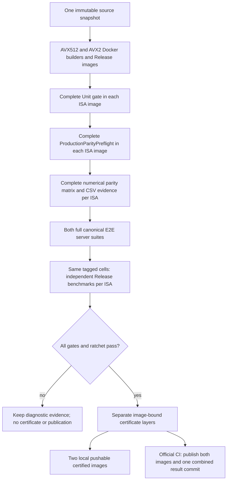

# Production image certification

`scripts/ci/run_production_pipeline.py` is the local and GitHub Actions entry
point. By default it independently certifies full CPU/CUDA/ROCm **Release**
images for both AVX512 and AVX2, not a devcontainer or independently rebuilt
executables. Administrative enablement of GitHub
Actions is separate from installing/changing this workflow.



## Run locally

The node needs Docker/Buildx, Python 3, Git, `lscpu`, `lspci`, the complete
canonical model inventory, and sufficient CPU/CUDA/ROCm hardware. Missing
models or devices fail; they do not silently reduce certification coverage.
The Dockerfile installs the test/reference dependencies. Corpus submodules
are neither initialized nor included in the image.
The full-backend shared core requires the host NVIDIA driver loader even for
CPU/ROCm-selected cells. Both HTTP and benchmark launchers inspect the image's
CUDA linkage label and supply its driver dependencies without changing the
canonical request topology. Driver stubs are never shipped as a substitute.

`--reference-cache-root` names the parent of authenticated Hugging Face packs.
Locally it defaults to the existing workspace packs; official CI uses a
persistent `/opt/llaminar-parity-references` directory. The test image mounts
it at `/reference-cache` and sets `LLAMINAR_PARITY_REFERENCE_CACHE_ROOT`.
Model-owned pack names, generation leases and authentication are unchanged.
Cold caches generate normally; exiting a test container does not erase them.
The builder runs tests with the invoking UID/GID, keeping newly generated packs
and read-only staged GGUFs usable by later local runs. Bind-mount path spelling
does not invalidate a cache hit when the complete file stat identity agrees.
ROCm supplementary groups come from the Docker daemon's actual device nodes,
not a devcontainer's possibly different group names, GIDs or local chmods.
ROCm group IDs and NVIDIA passthrough paths use one metadata-probe lifecycle:
create an owned container with read-only daemon `/dev`, execute once, wait for
successful completion, copy its result file, then remove the helper. Attached
stdout is not a metadata authority: short-lived Docker attach can lose output
even when the process succeeds. Probe failures are fatal, with no retries or
permission changes; an empty NVIDIA inventory remains distinct from failure.
Both builder and runtime install the same source-built RCCL at the same library
path. Runtime loading uses CMake's exact `RCCL_LIBRARY` selection; it never
guesses a checkout location or substitutes another packaged collective library.

```bash
bash scripts/ci/setup_production_parity_tmpfs.sh
python3 scripts/ci/run_production_pipeline.py \
  --models /opt/llaminar-models \
  --output parity-results/production-ci
```

Use `--through build`, `--through parity`, `--through e2e`, or
`--through benchmarks` to exercise a prefix. Continue with the same arguments
and `--resume`. A source change, changed evidence, missing image, or changed
model-file identity invalidates reuse. Partial runs never issue a certificate.
The parity phase already runs Unit and preflight once per ISA; the outer driver
does not repeat them for each model cell. ISA runs are sequential on the same
node. Both E2E suites must finish successfully before either benchmark suite
starts. A passing AVX512 report never certifies AVX2 (or vice versa).

Evidence lives in `avx512/` and `avx2/` beneath the output directory, with one
collection receipt at the root. A local piecewise run may specify `--cpu-isa
AVX2` or `--cpu-isa AVX512`, but official publication requires both. The optional
`--image registry/repository:tag` names the AVX512 artifact; AVX2 uses
`registry/repository:tag-avx2`. Release aliases preserve that same convention.

Local edits are captured using a private Git index and source-tree identity;
the working branch/index are not changed. A local certificate explicitly
records whether that tree differs from HEAD. Official publication requires a
clean protected-branch source revision. Output directories must remain outside
tracked source (the default examples use ignored `parity-results/`).

The existing per-cell watchdogs and numerical economy target remain owned by
the parity/E2E drivers. The parity runtime target is not a kill deadline. A
target miss remains red for official certification even if numerically green.

### Devcontainer model staging

Bind sources are resolved in the Docker daemon's namespace. Ordinary workspace
and model bind mounts use Docker's recorded mappings. A private, owned model
tmpfs is published once using a short-lived privileged helper and Linux's
descriptor-based mount API. This creates a second mount of **the same pages**;
it does not recopy GGUFs, change NUMA placement or clear the cache. The helper
requires Python 3.12+ and glibc mount wrappers on the daemon host.

The exported mount lives under `/mnt/llaminar-docker-tmpfs/<container-id>/`
on the host until explicit manual unmount or reboot. Its exact path is printed
at setup. Unmount that exact export when retiring the cache; unmounting only
the devcontainer's original path does not free pages still pinned by its
export. Setup checks the source/export device and inode and refuses a stale
or occupied destination. Remote Docker daemons are not supported by this
node-local device-certification workflow.

## One cell inventory

C++ `ModelParityDefinition::e2e_certifiable` remains the eligibility authority.
The builder exports its existing GoogleTest/CTest inventory. The manifest
includes each complete model-file declaration, including split GGUF shards.
Path translation across the container boundary does not change the typed
execution arguments. Benchmarks reuse those arguments verbatim; no model,
topology, precision, placement, movement or MTP matrix lives in Python/YAML.

For a diagnostic benchmark selection after exporting a manifest:

```bash
python3 scripts/ci/run_model_parity_benchmarks.py \
  --manifest parity-results/production-ci/avx512/manifest.json \
  --source-revision "$(git rev-parse HEAD)" \
  --image <candidate-image-id> \
  --diagnostic \
  --report parity-results/benchmark-diagnostic.json --list
```

Remove `--list` to execute that one-off experiment; `--cell` can narrow it.
Without `--diagnostic`, the runner requires `--e2e-report <full-e2e-report.json>`
proving every canonical E2E server cell passed on the exact same immutable image
and manifest. A partial E2E report cannot authorize benchmarks, even a narrowed
benchmark selection. The pipeline supplies its full report automatically and
never interleaves benchmarks with unfinished E2E tests. Diagnostic benchmark
reports cannot certify an image even if they happen to cover every cell.
The certifying pipeline deliberately has no cell/backend skip switches.

## Repair feedback before another full run

Preserve the first failing exact cell and its fresh CSVs. Reproduce it through
the canonical registered model-parity invocation and add a focused regression
for the failing invariant. Verify that cell before restarting the full Docker
pipeline. If the failure occurs only after another cell, verify the shortest
ordered predecessor/failure sequence in one process as well; a standalone pass
does not prove retained-runner reset, arena reuse, or teardown correctness.
Include the corresponding backend case when the changed mechanism is shared.

Keep these reduced runs explicitly diagnostic. They use the registered
arguments, environment, model paths and artifact validator, but cannot supply
a full-image certificate. Run the relevant focused preflight tests while
iterating; rerun the complete Unit/preflight gates for the finished code slice,
not before every unchanged cell. Only then launch a new source-frozen pipeline
for both ISAs. Do not treat a fixed-source diagnostic pass as reusable evidence
for an older image, or resume an old image's certification after source changes.

## Benchmark workload and ratchet

`benchmarks/production/workload.json` owns the shared workload: fixed prompt
bytes, output length, sampling seed/policy, one warmup and three measured
requests. The prompt is 512 repetitions of ` test`; the actual tokenizer's
prompt count is authenticated and retained, not assumed from the text length.
All iterations must complete. The score is the median of each phase, with
decode measured after the prefill-produced first output. There is no
best-of-retry selection. No profiler/PerfStats switches are passed into the
timing container; the separate E2E gate proves production-path behavior.

The high-water key includes hardware topology, CPU ISA, model filenames/sizes,
the full canonical cell policy, authenticated prompt token count and workload.
It excludes source/image revision so future implementations compare against
the same workload. Scores may only increase. A result below the configured
tolerance fails and cannot update any marks. New keys are explicitly recorded
as `new_baseline`, not claimed as improvements. Old unrelated workloads are
preserved in `legacy_high_water.json`; they are never relabeled as comparable
measurements. Tolerance/workload changes are ordinary reviewed source changes.

## Evidence, commits and image identity

Each phase writes logs and JSON into the output directory. Numerical CSVs
remain CI artifacts, not source blobs. The final image contains:

```text
/usr/local/share/llaminar/certificates/
  production.json
  e2e.json
  benchmarks.json
```

The certificate layer adds evidence only, using an unstarted container from
the candidate ID. The driver checks Docker's actual filesystem delta against
the three certificate files and parent directories before committing that
layer. It also checks candidate-layer ancestry and reads back the installed
certificate. The certificate names the **tested candidate image ID**; the
pipeline receipt additionally names the final certificate-bearing image ID.
This avoids a circular claim that an image embeds its own digest.

Official `--publish` is permitted only in an authenticated GitHub Actions
protected-branch context, after both ISA variants certify. It uses a private
Git index to commit both compact ISA result JSONs and one merged high-water
file, without rerunning hooks or changing the runner checkout. ISA is part of
the measurement identity, so neither ISA overwrites or ratchets against the
other's scores. Both certified images are pushed first; a registry failure
cannot advance Git or its high-water marks. A normal fast-forward Git
push rejects branch races; a race may leave an unreferenced certified registry
image, never a checked-in claim for an unpublished image.
The result commit points back to the tested source SHA; it does not pretend
that the bookkeeping commit produced another tested binary. A failure leaves
reports available and never force-pushes or merges untested source.

The source pre-commit hook remains Unit + ProductionParityPreflight only.
Performance is never part of that model-free hook.
