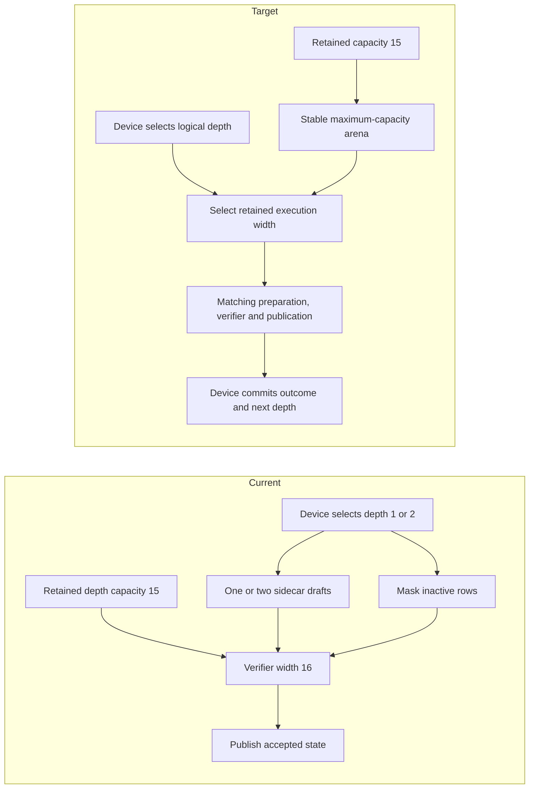
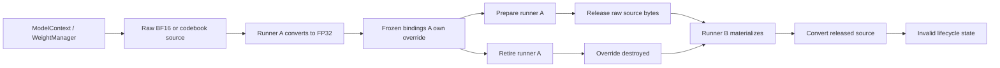
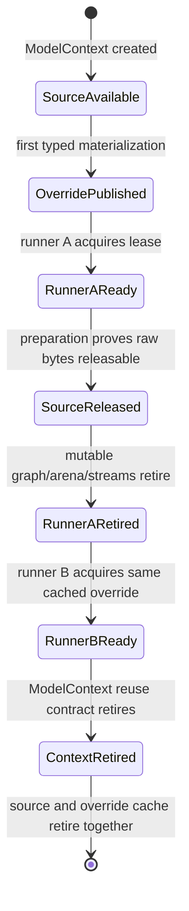

# vLLM-Style MTP Project Plan

## 2026-10-09 r41: DRM memory units in the resource observer

The first hybrid app launch stopped before sending any model request. The
external monitor rejected the valid fdinfo value `33315 MiB` because its parser
accepted only KiB. Server and observer retired normally, and driver evidence is
clean. A staged parser correction normalizes bare bytes and B/KiB/MiB/GiB/TiB,
rejects malformed/negative/fractional/extra-field counts, and preserves descriptor
alias deduplication. Three new unit cases reproduce the old failure and cover
all observed memory field prefixes; the resource/growth/scope suites pass 53
cases. A dedicated `V2_Integration_HTTPResourceDRMMemoryUnits` entry is staged.
The next local app driver mounts only this corrected observer over the canonical
monitor directory; the exact patch and tests are recorded separately. Inference
source, both compiled builds, image, smoke, and timing evidence remain unchanged.
The dense-then-MoE r41 app run is active. The two source/test files and CMake entry
must be integrated into the final candidate before commit. No commit or push has
occurred.

Evidence: `hybrid-resource-observer-20261009-r41/` and
`hybrid-app-sessions-20261009-r41/`, under the ignored resource-growth work root.

## 2026-10-09 r40: local benchmark observer and hybrid app admission

Both r39 real-model smoke lifetimes passed: exact repeated tokens, full/partial
prefix restore, Unicode, default dynamic MTP and maximum context 262,144. Dense
short benchmark medians are 692.26 prefill and 33.25 decode tokens/s; MoE measures
1,661.09 and 182.49. The full model driver window is clean and owners retired.
The local benchmark observer incorrectly required every prepared bucket to have
executed. MoE prepares a 128-row bucket that this workload does not use. The
canonical observer already permits unused materializations; the local consumer
now uses that lifecycle policy and additionally proves all 1,536 measured rows
on each of four devices. Both saved benchmark artifacts pass without changing
the binary or rerunning measurements. Three focused tests reproduce the old
reader failure and reject twelve damaged-evidence variants. The original failed
receipt remains intact. Speed review accepts both models for the long coding
workload, and the dense then MoE app sessions have been launched sequentially.
The earlier single prerequisite firmware finding remains an explicit user waiver,
not a clean canonical prerequisite driver result. No commit or push has occurred.

Evidence: `hybrid-benchmark-observer-20261009-r40/` and
`hybrid-app-sessions-20261009-r39/`, under the ignored resource-growth work root.

## 2026-10-09 r39: pipeline terminal artifact admission and diagnostic scope

Real r37 MoE smoke produced all three expected answers with default dynamic MTP,
maximum context, exact repeated tokens and full/partial prefix reuse. Its terminal
auditor then rejected the correct schema-2 stage-scoped movement sidecar because
the collector admitted only flat schema 1. The server exited normally, all owners
retired, and the complete driver window had no findings. The original failed
receipt is retained; a separate replay of its saved evidence passes the corrected
capture, transfer and MTP checks. The MoE benchmark and hybrid apps did not start.

The collector now uses the movement observer's shared stage-scope parser. It
preserves every rank and stage, exact large integer metadata, and original raw
files. Focused tests reject 22 malformed metadata variants, absent/foreign ranks,
flat/pipeline mixing and nested stage namespaces. Four/eight-device fixtures in
both vendor orders fail with the old reader and pass with the correction. The
complete server-policy suite passes 154 cases and movement validation passes 32.
The new production-preflight entry is
`V2_Integration_PipelineTerminalMovementArtifactMembership`.

The separately prepared r38 diagnostic fix is integrated in the same candidate.
Optional intrusive snapshots now retain an ordered tree of independent pipeline
epochs rather than their maximum. The focused 100/1 to 100/2 controls demonstrate
the old local/global false equality; 54 focused cases and all affected producer
compilations passed before integration. Four explicit preflight registrations
cover metadata, MTP comparison, local aggregation and global aggregation. Live
HTTP prefix observations and actual cache admission already retained stage scope.

Matching Integration/Release builds and fresh complete prerequisites are required
for the changed snapshot value layout. Both builds passed. Complete prerequisites
finished with 1,682 passes, 26 hardware skips and no failed tests. One AMDGPU
SetWorkloadMask response-zero message failed the outer driver audit. All 100
focused follow-up test executions passed without new driver records. The user
explicitly waived the single archived message for local diagnostic progress;
the original failed receipt is preserved beside the exact-window admission
decision. No driver policy or production check was relaxed. The verified local
Release overlay is now running dense/MoE smoke and short benchmarks before
the speed review and two ten-phase apps. No hybrid app, commit or push has occurred.

Evidence: `hybrid-terminal-artifact-20261009-r39/` and
`hybrid-diagnostic-epochs-20261009-r38/`, under the ignored resource-growth work root.


## 2026-10-09 r37: sparse pipeline request and captured epoch ownership

The r36 full prerequisite gate passed 1,671 outcomes with 20 hardware skips and
no failures. Dense hybrid Release smoke and the short benchmark passed
(693.17 prefill tokens/s, 24.80 decode tokens/s). Real MoE then exposed missing
root request-identity publication for stage-scoped placements. Its focused
four-GPU negative control initialized with zero publications instead of one.

After repairing publication, actual grouped replay exposed absent upstream
epoch acquire/release fragments; they now enclose the retained verifier and
accepted-state publication. A third-request one-token prefix suffix exposed a
scalar completion guard that demanded shifted-KV ownership on verifier-only PP
participants. That guard now uses the existing runtime-role resolver. The same
bridge conflated successful no-logits followers with failed execution and used
the sequential stage loop despite captured activation channels. A typed optional
completion now separates those outcomes; the frozen pipeline owner submits all
domains together through their existing native edges.

Disabled MTP exposed two companion defects. A terminal with both pipeline
placement and sparse ownership now selects an explicit combined ordinary
generation composition, preserving semantic replay, request identity, and
maintenance. Its one-token restored-prefix input also uses the concurrent
captured pipeline owner. It no longer enters the sequential activation-transfer
loop after native receive banks have been frozen. The focused disabled-MTP
regression passes twice in each four-GPU vendor order with clean driver evidence.

The production lifecycle regression covers three requests and 1/17/1 token
budgets with the same maintenance acknowledgement as the HTTP frontend. Both
vendor orders and disabled/fixed/dynamic MTP are registered in preflight at four
and optional eight GPUs. Twelve runnable MoE/dense four-GPU cases each passed
twice, with clean driver diagnostics and all native owners retired. Six eight-GPU
registrations skipped for missing hardware. Ten related device-free CTest
registrations passed. Matching Integration/Release builds passed. Complete r37
prerequisites passed 1,677 outcomes with 26 hardware skips and zero failures;
driver diagnostics were clean and all native owners retired. Dense hybrid smoke
passed all three requests with default dynamic MTP, exact repeated tokens and
maximum context 262,144. The short untraced benchmark measured 691.97 prefill
tokens/s and 24.59 decode tokens/s. MoE smoke and its benchmark remain in progress.
No hybrid app run has started.

Evidence: `parity-results/opencode-tool-calling/resource-growth-work/hybrid-request-generation-20261009-r37/`.
The compact [dashboard](MTP_VLLM_STYLE_TUNING_DASHBOARD.md) owns the current gate
sequence; its prior 4,767-line history is preserved in a linked dated archive.


## 2026-10-08 r22: prepared-context retirement and configuration codec

Terminal reset failures now stop before retirement/reuse publication. The focused
regression rejects the previous swallowed-exception behavior. Native transfer
directories retain immutable prepared sources, so their reuse seal follows
participant destruction and verifies exact original engine handles in each stage.
Mutable physical residency still restores through its live fabric. This checks
metadata and shared ownership only; it does not read or hash weight/cache bytes.

The full configure caught 39 new NO_MPI Integration registrations inheriting a
two-rank default; they now declare one process explicitly. The complete build
also caught the missing first_model_layer field in the strict saved-configuration
codec. That field now round-trips with nonzero stage origins and terminal MTP
rows. Four stale source checks now enforce the compact stage representation.

Validation: 240 focused C++ cases, 200 repeated case executions, four explicit
preflight gates and the failing old-reset negative control. All 290 qualified
ACTIVE production bindings remain unchanged. The consistent Integration build is
tracked separately at `/workspaces/llaminar/parity-results/opencode-tool-calling/resource-growth-work/hybrid-candidate-build-20261008-r22c/controller.json`; it is not yet a native serving
certificate. Focused receipt: `/workspaces/llaminar/parity-results/opencode-tool-calling/resource-growth-work/hybrid-stage-ownership-20261008/result-r22.json`.

Remaining: full candidate prerequisites, native reuse/retirement and prefix
restore/resource proofs, setup-scratch lifetime, intrusive/global epoch audit,
matching Release overlay and both hybrid app sessions. No image rebuild, commit
or push occurred.


## 2026-10-08 r21: stage-scoped completed prefix observations

Completed rank-local PP request summaries now preserve each stage's actual
admission interval and completion epoch. Stable stages at epochs 100 and 1
previously looked like movement under a flattened MIN/MAX comparison. A maximum
also hid movement in the smaller-epoch stage. Scoped comparisons now distinguish
unchanged placement, publication during a request and publication before the
next admission. Missing, changed or stale scopes fail. Actual cache restoration
already validates each participant's own fingerprint and retained lookup; these
observations remain passive metadata and perform no payload hashing or reading.

Root harvest captures the scoped values once. Cached request summaries and the
HTTP response reuse that observation without a live probe. Pipeline HTTP summaries
use schema 2 with null unscoped epoch fields; benchmark prefix metadata uses the
same serializer. Python validates exact unsigned integers and independent scopes
and still requires actual fresh/full prefix outcomes. Both runtime-summary
schemas retain movement-observer coverage.

Validation: 24 pipeline, 43 prefix-flow and 169 HTTP C++ cases; 225 production
Python and 32 movement Python cases pass. Seven focused canonical preflight
registrations pass, including three new explicit entries. Four new pipeline
cases pass twenty repeats under partial ASan (80 case executions). The C++/Python
bridge covers both declared four/eight widths and both vendor orders, with
72 rejected metadata corruptions plus fresh/full restore validation. These are
device-free tests; no GPU execution or model serving was run in this slice.

The broader HTTP check exposed an old topology object in the standalone diagnostic
link. Explicit current topology and HTTP-stats producers fix that diagnostic
composition; the full 169-case HTTP run is green. All 290 qualified
ACTIVE production source bindings remain intact. The candidate changes public
value layouts and IInferenceRunner's vtable, so a consistently rebuilt serving
binary remains required. Evidence: `/workspaces/llaminar/parity-results/opencode-tool-calling/resource-growth-work/hybrid-stage-ownership-20261008/result-r21.json`.

Remaining: intrusive/global scalar-epoch consumers; native maintenance and
prepared-context physical sealing/teardown; setup-scratch lifetime; complete
candidate qualification; then both hybrid app sessions and branch publication.
No image rebuild, commit or push occurred.


## 2026-10-08 r20: independent pipeline movement publications

The candidate now retains one publication namespace per PP stage and elects one
root inside each native TP domain. Completed work totals add; transaction IDs,
policy receipts, demand windows and progress generations stay with their owner.
Native archive exports translate compact journal rows into global layer IDs.
Counter keys include the fixed layer interval, including when stages reuse a
device. HTTP and terminal JSON, the Python observer, and frozen topology reports
retain identical stage identities. Shutdown publication marks each already-retired
stage drained while preserving failures. This is passive reporting, not a proof
of physical prepared-context restoration.

Validation: 20 pipeline C++ cases, 18 counter cases, 32 movement Python cases and
151 server-policy cases pass. Twenty repeats pass normally and under partial
ASan (400 case executions each). Six negative-control cases reproduce the old
rank selection and archive layer defects. Four new focused preflight gates pass,
including production C++ JSON/counter exports consumed by Python for declared
four/eight-device topologies. Registration auditing resolves 58 selected C++
gates / 94 case selections; 14 optional native eight-GPU skip properties remain.
These tests are device-free. No real model or GPU serving ran in this slice.

ASan also caught a temporary-view lifetime mistake in the new fixture. Retaining
the owner fixes it, and the metadata API now rejects such rvalue views at compile
time. All 290 qualified ACTIVE production source bindings remain intact.
The candidate's publication values and orchestration virtual interface changed;
real serving requires a consistent rebuild, not an old ABI diagnostic executable.

Evidence: `/workspaces/llaminar/parity-results/opencode-tool-calling/resource-growth-work/hybrid-stage-ownership-20261008/result-r20.json`.

Next work: audit scalar movement-epoch consumers (the old max reduction remains),
prove native maintenance/prepared-context sealing and teardown, then prefix
restore, bounded resources, complete candidate qualification and the two hybrid
OpenCode app sessions. No Docker image rebuild or branch publication occurred.


## October 8, 17:54 UTC: pipeline startup and retained placement handoff

The live root now admits all MoE PP stages jointly, freezes each global layer
interval with the model-aware placement resolver, and carries those immutable
placements through the prepared-context contract. Runtime construction creates
fresh checked stage authorities and registries from the original PMA. Source
identity is tied to the actual ModelContext without extending its lifetime;
metadata checks compare projection shapes/formats, never model/cache payloads.
The first native dry run exposed the production loader adapter, and the focused
fixture now exercises that exact adapter rather than a concrete-loader mock.

A focused negative control found that retained MTP reuse omitted predictor
replication versus TP sharding. The shared dense/MoE gate and pipeline metadata
identity now reject that ownership change. Active off/fixed/dynamic policies
remain legal inside unchanged retained capacity and weight ownership.

**1,038 focused cases in 34 groups pass**, including 94 planning/setup cases.
Seven new cases pass twenty normal and twenty partial-ASan iterations
(**140 executions each**). The prepared handoff sweeps 23 source formats,
both vendor orders, four MTP storage/execution lanes and all three maintenance
modes at four/eight participants: **1,104 combinations**, with two fresh runtime
lifetimes and two stages per combination. The canonical registration audit
finds **56 relevant entries selecting 74 cases**, including explicit regressions
for the predictor ownership defect and both pipeline widths.

**All 16 real-model dry runs pass**: Qwen 3.8 dense and Qwen 3.6 MoE, both
ROCm/CUDA stage orders, default dynamic MTP, fixed depth 7 with retained 15,
MTP disabled, and disabled with retained capacity. Each admits **262,144 context**,
16 GiB RAM prefix capacity per participant and a shared 32 GiB disk tier. The
MoE cases prove one aggregate authority across both stages. Native process and
driver cleanup pass. These are current-root admission checks against the local
qualified support library; they do not certify serving or captured model graphs.
The earlier 18 native component passes/14 hardware skips retain their unchanged
source bindings. Eight-GPU native hybrid coverage still needs unavailable GPUs.

All 290 qualified production source files remain unchanged; free workspace
space is 218.2 GiB. Evidence:
`hybrid-stage-ownership-20261008/result-r19.json` and
`pipeline-model-admission-20261008-r19c/controller.json`.

Remaining: stage-aware movement/status aggregation, native maintenance and
prepared-context sealing/teardown, actual prefix restore, sequential CPU scratch
lifetime, complete candidate qualification, and both hybrid OpenCode app sessions.
The stage handoff is wired and component-tested; live serving is not yet green.
No Docker image build, commit or push was performed.

## October 8, 17:16 UTC: shared stage-owned residency setup

The ordinary live runner now uses one checked `MoEOverlayResidencySetup`
constructor for histogram, residency authority, Dynamic economy catalog and
empty prepared-bank endpoints. The replaced inline constructor is removed.
Compact histogram and endpoint storage retain the exact model-global origin;
terminal MTP banks do not move the main-token histogram boundary. The factory
rejects foreign certificates, sibling-stage physical resources, unfinished or
changed quotas and mismatched maintenance storage before publishing owners.

**1,031 focused cases in 34 groups pass**, including 87 planning/setup cases.
The four/eight-participant matrix composes actual admission, placement freezing,
runtime construction and the sealed pipeline binding: **23 source formats**,
both vendor orders, disabled/fixed/dynamic MTP, Off/Observe/Dynamic maintenance
and apportioned/projection compute (**1,656 combinations; 3,312 stage sets**).
The ordinary control covers CPU and CUDA/ROCm widths 1/2/4/8. Host demand claims
retire on normal destruction and on failure after histogram construction.
Thirty foreign-owner rejections per pass cover both pipeline widths.

The five new cases pass twenty repetitions (**100 executions**) and twenty
partial-ASan repetitions (**100 executions**). The canonical registration audit
resolves 53 relevant explicit entries to 67 cases. The previous **18 native
passes and 14 hardware skips** retain exact unchanged native source bindings;
the new runtime constructor has component coverage, not a native model claim.
All 290 qualified production source files remain unchanged. Free workspace
space is 218.4 GiB. Evidence:
`hybrid-stage-ownership-20261008/result-r18.json`.

The initial ordinary control needed a valid CPU NUMA observation and its
rank-local demand descriptor, which live setup retains separately from discovery
capacity. Its original small Qwen query geometry correctly rejected eight TP
slices; the final source supplies enough real directory geometry.

The live MoE PP guard remains: startup still needs to retain stage admission
through prepared-weight reuse, install every stage binding, and compose native
maintenance, movement/statistics and teardown. CPU setup lifetime, actual prefix
payload and full-model cleanup proofs, complete candidate qualification and
both hybrid app sessions remain. No image, commit or push was produced.

## October 8, 16:49 UTC: joint MoE pipeline admission

The candidate planner now uses `AdmittedMoEPipelineMemory` to derive exact
stage GGUF manifests, assemble all fixed owners, and resolve every stage's
expert capacity in one PMA transaction. Every immutable stage result retains
that same aggregate certificate. Automatic quotas remain adaptive. Request
costing resolves each layer's own expert authority, including the later PP
root, instead of consulting a model-wide parent plan.

The shared adapter accepts the current physical observation and performs no
model payload reads or device allocations. It retains verifier geometry on
nonterminal stages while assigning predictor sources only to the terminal
stage. Only typed capacity exhaustion advances the declared graph-row search;
malformed input remains fatal.

**1,026 focused cases in 34 groups pass**, including 82 admission/planning/cost
cases. Four/eight-device metadata coverage exercises **23 loadable GGUF source
formats**, off/fixed/dynamic MTP, auto/apportioned/projection compute and both
vendor orders (**828 combinations**). Shared host exhaustion, GPU exhaustion,
failed-transaction reuse and missing transfer evidence have focused checks.
The eight new cases pass twenty repetitions (**160 executions**); the six
admission cases pass twenty partial-ASan repetitions (**120 executions**).
The registration audit now resolves 50 explicit entries to 62 cases.

The previous **18 native passes and 14 hardware skips** retain exact unchanged
native source bindings; no native run was repeated for this metadata change.
An initial incremental diagnostic mixed the new candidate value with the old
automatic-startup caller ABI; rebuilding the complete caller/producer closure
resolved the tooling abort. All 290 qualified production source files remain
unchanged, and 133 candidate files are bound. Free workspace space is
218.5 GiB. Evidence is `hybrid-stage-ownership-20261008/result-r17.json`.

This is component evidence, not a complete candidate or Release certificate.
The live runner still rejects MoE PP before weights because stage runtime
owners have not yet been constructed. Remaining work is that runtime producer,
CPU setup lifetime sharing, actual prefix payload and admission-only cleanup
proofs, complete qualification, and both hybrid Python-app sessions. No image,
commit or push was produced.

## October 8, 16:25 UTC: unused RCCL retirement

The hybrid admission-error process-exit crash is reproduced and repaired in the
candidate. An unused pooled RCCL coordinator launched a synthetic allreduce
during process teardown, which crashed inside HIP. The focused regression
passes its test body on the original implementation, then exits with SIGSEGV;
the process exit code is essential evidence.

Cleanup now requires native communicator finalization, retires unused and used
owners through that same path, and performs no priming allocation/collective.
Missing finalization is rejected at initialization. Native teardown errors are
fatal with a precise diagnostic; handles are not silently abandoned.

**18 current native cases pass**: two/four-ROCm unused teardown and pooled exit,
runtime-generation reset/reuse, rejected hybrid admission and all 12 four-GPU
ordinary/fixed/dynamic generation cases. The direct cases include **20 cycles at
each device count (40 total)**. Fourteen native eight-device cases are skipped
for missing hardware. Driver and owner-retirement evidence is clean. KFD can
publish process removal shortly after waitpid; the diagnostic records that
latency and waits for the same retirement boundary without retrying a test.

The prior **944 focused cases in 33 groups**, 400 repetitions and 640 ASan
executions remain bound to unchanged implementation sources. Registration was
refreshed: 48 explicit registrations select 54 cases, with six new unused-RCCL
preflights. Evidence is `hybrid-stage-ownership-20261008/result-r16.json` and
`unused-rccl-retirement-native-20261008-r2/controller.json` under the work root.
All 290 qualified production source files remain unchanged;
126 candidate files are bound. Workspace free space is
218.9 GiB. No image, commit or push was produced.

This remains focused evidence. The MoE pipeline startup producer, CPU setup
lifetime sharing, actual prefix payload movement, full-model admission-only
cleanup, complete candidate qualification and both hybrid Python-app sessions
remain outstanding before committing/pushing.

## October 8, 16:05 UTC: four/eight-device preflight and retained forwards

Preflight now projects four and eight devices through middle PP stages, uneven
TP groups, both vendor orders, MTP off/fixed/observe/dynamic policies, exact
channel owners and joint memory admission. Shared disk archive scratch is priced
once across the pipeline; RAM tiers remain independent per participant. The
stage planner feeds all fixed contributions into one capacity transaction.

Native four-GPU tests found and fixed a retained-width defect: active fixed
depth 7 selected eight verifier rows, while followers assumed the retained
16-row capacity. Setup now captures widths 16/8/4/2, both outcome variants,
and admission prices them all. Every supported retained depth 1–15 and legal
request depth is covered. A capture-reuse assertion also exposed the ordinary
device-token forward being deferred until first decode; that already-admitted
executable is now captured during serving setup.

All **944 focused cases in 33 groups**, **400 repeated case executions** and
**640 additional ASan executions** pass. ASan covers changed implementations,
not the complete supporting dependency DSO. All **12 native four-GPU cases**
pass: ordinary/fixed/dynamic, both vendor orders, rows 128/256, exact token/KV
oracles, verifier inventory, main-forward reuse from startup and all-helper
reuse after request reset. Driver and retirement evidence is clean. Twelve
eight-GPU cases are explicitly skipped: this host has two CUDA and four ROCm
devices; the extension requires four of each. Device-free eight-device cases
passed. The canonical registration audit resolves 42 registrations to 48 cases.

Evidence: `resource-growth-work/hybrid-stage-ownership-20261008/result-r15.json`
and `four-eight-gpu-preflight-native-20261008-r5/controller.json`. The receipt
binds 124 candidate source files and verifies all 290
qualified production files remain unchanged. This is focused component/native
evidence, not full candidate preflight or a hybrid model certificate. No new
image, commit or push occurred. Workspace free space: 219.1 GiB.

The MoE startup producer still must install these jointly admitted stage owners;
the precise fail-closed checks remain. CPU setup lifetime sharing, actual prefix
payload movement, admission-only cleanup and the earlier failure-unwind crash
still need closure, followed by complete candidate qualification and both hybrid
Python-app sessions on the locally rebuilt Release overlay.

## October 8, 14:24 UTC: authored pipeline and fixed-memory scopes

The isolated compiler now retains the authored MoE PP parent and immutable
stage projections, with actual devices, collective policy, global main-layer
bounds and terminal roles. Child configuration removes parent placement
selectors. Repeated normalization preserves each stage's compute policy;
automatic/off/fixed/dynamic MTP keeps the parent serving policy. These are
metadata projections, not installed runtime owners.

Fixed-memory assembly now requires the exact retained graph family. Main
capture frontiers use owned main layers; CPU setup sizing uses the owned routed
interval, including terminal sidecars when retained. Full parent source metadata
stays intact. Foreign scopes, mismatched continuation/histogram/controller
geometry and nonterminal sidecars fail before physical admission.

All **822 focused cases in 29 groups** pass. The **nine new cases pass 20
repetitions (180 executions)** and **180 additional ASan executions with leak
detection**. The changed compiler, normalizer and memory adapters are instrumented;
supporting objects/DSO are not a whole-program sanitizer build. Three previous
implementations fail the exact regressions: PP rejection, a raw-block capture
overcount and foreign-stage CPU descriptor access. Scope coverage includes both
GPU orders, widths 1/2 and all 24 CPU source formats. The combined diagnostic
startup consumers compile. Three explicit preflights register topology, memory
projection and CPU setup scope.

Evidence: `resource-growth-work/hybrid-stage-ownership-20261008/result-r14.json`,
`all-focused-r27-full.log`, and the `projection-*-r14` logs. The receipt binds
**112 candidate files**, revalidates **290 unchanged
qualified production files**, and retains historical native evidence separately.
This is not complete candidate preflight or a hybrid server certificate. No new
native/model run, image, commit or push occurred; **220.0 GiB** remains free.

Startup still rejects missing stage owners before weights or ordinary dense
admission. The next producer must retain parent pipeline-channel buffers and
price shared archive scratch once across stage BOMs, while preserving independent
RAM tiers and correctly typed serial setup ownership. Then submit one joint
capacity transaction, construct/seal the runtime bindings, resolve native cleanup
and failure unwinding, qualify the local Release overlay and complete both hybrid
app sessions. Details are in `startup-next-r14.txt`. The preceding goal turn
completed joint capacity; this turn advances its topology and fixed-scope inputs.

## October 8, 13:40 UTC: joint pipeline capacity and replica grants

The isolated candidate now admits one or several owned routed-layer intervals
through the same production capacity implementation. Distinct fixed allocations
on shared CPU/GPU resources contribute to one typed BOM. Every stage retains the
same final `PhysicalMemoryPlanAdmissionCertificate`, while its quota and copy
counts remain compact and retain global layer identity. All fixed banks, exact
quotas and migration sources precede optional placement. Conflicting observations
and alternate names for one physical allocator are rejected before publication.

`MoEOverlayCapacityAdmission::resolvePipelineCapacity` searches complete pipeline
candidates. It first tries all requested cache maxima, proves every enabled
minimum together when bounded selection is needed, and then maximizes grants in
authored stage order. Retained grants remain exact and transfer lanes retain
their admitted geometry. Explicit movement-off and replica-cache-off remain
separate supported policies. Ordinary single-stage callers use this same path;
there is no alternate byte ledger or automatic execution-mode change.

All **794 focused cases in 27 groups** pass. The **13 new regressions pass 20
repetitions (260 case executions)**, and another **260 case executions pass
AddressSanitizer with leak detection enabled**. The resolver, policy adapter,
transfer-directory geometry, PMA and fixture are instrumented; the supporting
DSO is not a whole-program sanitizer build. Coverage includes all **21 quantized
source formats plus FP16/BF16/FP32**, CPU/CUDA/ROCm, both GPU orderings, TP widths
1/2, compact nonzero intervals, shared RAM/GPU overcommit, exact byte boundaries,
later-stage fixed/minimum/retained grants and independent ledger-lease retirement.
The previous resolver fails the exact new resource-alias rejection test. The
changed startup, factory, graph and orchestrator consumers compile together.
Unit registration and the explicit
`V2_Integration_MoEPipelineAggregateCapacity` preflight entry own the regressions.

Evidence: `resource-growth-work/hybrid-stage-ownership-20261008/result-r13.json`,
`all-focused-r26-full.log`, and the `pipeline-capacity-*-r13` logs. The receipt
binds **101 candidate files** and revalidates **290 unchanged qualified-source
files**. This remains component evidence, not a complete candidate preflight or
hybrid server certificate. No model/cache payload hashing, native GPU execution,
new Docker image, commit or push occurred in this slice; about **221 GiB** is free.

Startup does **not yet produce the stage bindings**. Preserve authored PP during
normalization, construct each stage's fixed BOM with its own captured-graph and
CPU-service geometry, submit the contributions to the joint API, publish one PMA,
and construct/seal the runtime owners. The implicit MoE PP guard remains until
that producer is complete. Then validate actual prefix payload movement,
admission-only cleanup and failure unwinding, build the local Release overlay,
and finish both dense/MoE hybrid app sessions before review and commit/push.
The preceding goal turn was status-only and was revalidated; this turn changed
production admission and established the evidence above.

## October 8, 13:01 UTC: PP children retain their own expert runtime

The production PP child projection now selects a sealed
`MoEOverlayPipelineStageBinding`. It authenticates the owned main interval,
terminal routed MTP banks, ordered continuation devices, TP weights/backend,
maintenance mode, initial expert owner map, histogram lifetime and prepared-bank
registry. Equal dimensions and devices cannot conceal a different expert map.
Single-device PP and nested TP use the same projection. The old model-wide
runtime broadcast into every stage has been removed. Every child handoff is
checked before the first stage prepares weights, and stage owners retire after
child graph destruction. This adds no payload hashing or physical-memory ledger.

The pure configuration methods now live in `RankOrchestratorConfig.cpp`, letting
focused regressions execute the production projection without initializing GPU
runners. Three existing nested-TP tests now call that projection instead of
copying its implementation. The new binding tests are registered in both Unit
and the explicit `V2_Integration_MoEPipelineStageRuntimeBinding` preflight entry.

All **781 focused cases in 27 groups** pass. The **nine new cases pass 20
repetitions (180 case executions)** and cover CPU/CUDA/ROCm topology metadata,
single-device/TP widths, Off/Observe/Dynamic residency, nonzero stage origins,
terminal auxiliary banks, foreign owners, changed destinations and incomplete
installation. Exact original configuration validation fails two focused negative
controls: it accepts model-wide expert inheritance and missing/swapped stage
bindings. The current startup, factory and graph consumers compile. Build/link
failures from the diagnostic harness's initial dependency/include setup are
retained; the final combined build and test transaction passed.

Evidence: `resource-growth-work/hybrid-stage-ownership-20261008/result-r12.json`
and `all-focused-r25-full.log`. The receipt binds **99 candidate files** and
revalidates all **290 unchanged qualified-source files**. No native/model test or
new sanitizer execution is claimed by this slice. This remains focused evidence,
not complete candidate preflight or hybrid inference certification. No commit or
push was made; about **221 GiB** remains free.

The caller audit redirects the earlier controller/replica task: the legacy host
rebalance controller has no production construction site. The remaining target
is the device-owned production startup path. Preserve authored PP through
normalization, admit the complete pipeline through one PMA, construct each
stage's runtime and publish `moe_pipeline_stage_bindings_`. **That producer is
not implemented yet**, and the implicit MoE PP guard remains. Then qualify
actual prefix payload movement and admission-only/failure cleanup, build the
local Release overlay, complete both requested hybrid app sessions, and
review/commit/push. The preceding goal turn was status-only; this turn produced
production changes and reproducible regression evidence.

## October 8, 12:21 UTC: residency planning and proposals authenticate their pipeline stage

The residency authority now owns one exact global layer interval. Snapshot
construction, frozen-window intake, transaction validation and authoritative
export/adoption reject equal-shaped evidence from a different stage. Participant
ownership and service/movement cost tables retain only compact owned rows;
public plans, routing observations and migration records retain global model
identities. Forecast updates and publication hysteresis use the same checked
translation. Off, Observe and Dynamic maintenance all retain stage ownership.

Distributed proposals derive their origin from the existing authenticated
histogram metadata. Receivers require their admitted origin, without adding
payload rows or packet bytes. The MPI publisher validates that origin at setup,
send and receive; its consumer and startup call site compile. This turn does not
claim live MPI proposal transport or complete hybrid inference.

All **735 focused cases in 24 groups** pass. Five new cases each pass **20
repetitions**, covering origins 0, 32, 40 and near the integer limit; actual
observed decode/prefill/verifier batches; foreign/ragged cost evidence; temporal
smoothing; and publication/follower adoption. The four authority cases also
pass **20 AddressSanitizer repetitions (80 case executions)** without reported
memory errors. The authority and fixture are instrumented; this is not a
whole-program sanitizer build. Exact prior authority and decoder source fail
three regressions normally. Two explicit ProductionTestPreflight registrations
cover these defects. The first fixture build referenced a nonexistent histogram
config field; ownership already owns its origin. The first economy oracle summed
overlapping endpoint transfers; it now checks their actual critical path. Those
failed attempts are retained alongside the corrected evidence.

Evidence: `resource-growth-work/hybrid-stage-ownership-20261008/result-r11.json`
and `all-focused-r24-full.log`. All **91 candidate source bindings** and all
**290 qualified-source bindings** were checked. The earlier physical inbox and
transport receipt remains source-identical. The broad r10 native prefill receipt
has five changed source bindings and is historical evidence, not qualification
of this combined candidate. No new native/model run occurred, and no commit or
push was made.

Remaining: stage-aware controller/replica consumers, authored PP preservation
through startup normalization, and per-stage PMA-owned plan/authority/runtime
bundles. The MoE PP guard remains until that implementation is complete. Then
qualify actual prefix payload movement and admission/failure cleanup, build the
local Release overlay, complete dense/MoE hybrid app sessions, and review/commit/
push. The preceding goal turn was status-only; this turn produced code and
reproducible regression evidence.

## October 8, 11:51 UTC: stage routing and captured rebalance use compact runtime rows

The local routing, rebalance and prefill consumers now obtain the runtime base
from its first owned global model layer. Kernel commands retain compact storage
rows; graph parameters, public runtime lookups and per-layer identities retain
global model IDs. Routing preserves the all-layer selector. Rebalance preparation
and capture admission reject foreign apply selectors or mismatched table geometry.
Current-batch prefill additionally authenticates layer, expert and top-k geometry.
Prefix rehydration uses the same checked row translation; real payload execution
of that path still needs the combined Release/model qualification.

The new device-free routing regression executes the production stage with a
recording kernel and CPU-owned storage for both backend launch identities. It
covers default/current/all/explicit selectors, nonzero and near-integer-limit
origins, foreign rows and malformed geometry. It passes twenty repetitions; the
original implementation fails by looking up model layer zero in a later stage.

Two explicit native regressions cover CUDA and ROCm at stage origins 0, 32 and 40.
Real prefill graph construction and mirrored-table preparation accept every owned
row and reject foreign layer or shape bindings. A retained production rebalance
graph collects exact changing demand at scales 1, 1000, 0 and 7; the same graph
survives large-to-zero replay without stale counters. Both cases pass twenty
repetitions (40 case executions), with a clean driver window and complete owner
retirement. The original prefill and rebalance stage implementations fail both
new regressions normally, without a native crash.

Focused validation is **671 cases in 23 groups**, including the existing prefill
capture-contract suite. The new routing, prefill-preparation and captured-rebalance
regressions have explicit `ProductionTestPreflight` registrations. Evidence is
`resource-growth-work/hybrid-stage-ownership-20261008/result-r10.json`,
`hybrid-stage-prefill-native-20261008-r4/` and
`hybrid-stage-prefill-original-20261008-r2/`. The 86 candidate source bindings and
all 290 qualified-source bindings were checked. Earlier transport/inbox native
proof remains source-identical. This is focused evidence, not combined preflight
or a Release hybrid-model certificate.

Remaining work is stage-aware residency/controller planning, authored PP startup
normalization, per-stage PMA-owned plan/authority/runtime installation, combined
qualification including prefix payload movement and failure cleanup, then the
dense and MoE hybrid app runs. The MoE PP guard remains until its implementation
is complete. No commit, push, Docker rebuild or new model stress run occurred.

## October 8, 11:14 UTC: physical movement and mapped inboxes bind exact pipeline stages

The immutable command batch now retains the fabric's stage origin. Acquisition,
read-only scheduler predicates and every physical completion edge authenticate
origin, row count, expert count and participant count before acknowledging work.
Device commands keep compact rows. Physical owner endpoints, durable cycles and
shadow-slot keys translate those rows once into global model layers; transfer
bytes, command counts and device command ABI remain unchanged. Execution identity
includes only the additional setup metadata, never model or cache payloads.

Physical allocation-lifetime tracking now requires explicit immutable stage
geometry, including ranks with no local expert allocations. Initial enrollment,
wave admission, source lookup, staging, publication, abort and retirement reject
foreign stages. The production fabric supplies that geometry from its admitted
ownership. Mapped destination inboxes also reject foreign geometry before they
claim a wave or publish descriptors, and stage identity remains required for reuse.

All **566 focused cases across 21 groups** pass. Ten new device-free cases pass
**20 repetitions** each, covering Dynamic, prepared-context restore, LLEP,
no-movement receipts, near-limit origins, empty ranks and overlapping allocation
lifetimes. Exact original physical-movement and lifetime implementations both
fail the new regressions; their copied source bindings and failing results are
retained. Three focused entries explicitly register these defects in preflight.

Six native CUDA/ROCm cases pass **20 repetitions (120 executions)**, including
two new stage-origin inbox cases, the two existing inbox controls and both
captured service-publication cases. A fourth preflight entry registers the new
native inbox proof. Complete driver windows and final GPU-owner retirement pass.
Evidence: `resource-growth-work/hybrid-stage-ownership-20261008/result-r9.json`
(**80 candidate files**, **290 qualified source bindings unchanged**) and
`resource-growth-work/hybrid-stage-device-boundary-native-20261008-r1/controller.json`.
These are focused device-free/native Integration results; combined canonical
preflight and Release/model hybrid inference remain unverified.

Remaining: local rebalance/routing/prefill row coordinates, stage-aware residency
planning, authored PP preservation and per-stage PMA-owned orchestration bundles.
Then verify native admission/failure cleanup, qualify the combined binary, run
dense/MoE hybrid Release app sessions and review/commit/push. The prior status
turn made no implementation progress; this turn produced code and native proof.

## October 8, 10:53 UTC: stage-bound controller metadata and captured service publication proven

The follower and activation transport now retain model-global layer identities
while storing only the owned stage rows. Main-only, terminal NextN and nested
stage families reject foreign or incomplete intervals; topology fingerprints
include the origin. The exact original activation-manifest function fails the
new regression because it emits zero-based layer IDs for a later stage.

Controller runtime bindings authenticate the same interval as residency and
runtime tables. Host bank publication translates compact recipe rows at the
physical boundary. Controller fabric ABI 18 and service publication ABI 2 carry
the origin in existing reserved metadata, without increasing record size,
row counts or communication extents. Shared channel names, profile admission
and telemetry decode distinguish equal-shaped stages. The current controller,
follower, DGO, rank and orchestration consumers compile with the new interfaces.

All **525 focused cases across 18 groups** pass. Ten new device-free cases pass
**20 repetitions** each, covering depths 0–15, retained sidecar geometry,
near-limit origins, foreign stages, malformed headers and unchanged storage
extents. Graph-family, controller-fabric, service-decoder and native-publication
regressions have explicit ProductionTestPreflight registrations; the existing
stage-runtime entry also covers the two controller-binding regressions.

The real CUDA and ROCm service publication kernels now have a captured replay
proof for origins 0 and 32. Both cases pass **20 repetitions (40 executions)**;
each case exercises both vendors and two advancing publications from the same
retained graph. Driver diagnostics and final native owner retirement pass.
The local sm_86/gfx906 compiler spill checks pass. This is scoped native
Integration evidence; full shipped-architecture and combined Release/model
qualification remain pending. No model or prefix payload hashing was added.

Evidence: `resource-growth-work/hybrid-stage-ownership-20261008/result-r8.json`
(**69 candidate files**, **290 qualified source bindings unchanged**) and
`resource-growth-work/hybrid-stage-service-native-20261008-r1/controller.json`.
The negative-control build initially mixed headers from two worktrees; its
preserved r35 failure was resolved by compiling the exact original pure helper
against the current descriptor. The expected failing helper regression is
retained. A subsequent Doxygen-only header delta is recorded explicitly beside
the native test's unchanged compiled-source receipt.

Remaining: translate compact device movement commands into authenticated global
physical layer identities; finish local rebalance/routing/prefill coordinates
and stage-aware residency planning; preserve authored PP and install per-stage
PMA-owned runtime bundles. Combined qualification, admission/failure cleanup,
dense/MoE hybrid Release app sessions and feature-branch commit/push remain open.
The last turn was a status-only no-progress turn; this turn produced code,
focused regressions and native evidence. No image or model app was started.

## October 8, 10:14 UTC: dense pipeline admission fixed natively; MoE runtime construction binds its stage

The first dense hybrid Release startup failed before readiness: its captured
transport recomputed the global 512-row ceiling after PMA had admitted only
128 resident rows. It requested 10,489,856 host staging bytes against 2,629,632
admitted. The candidate now uses the initialized arenas' common admitted
capacity and rejects unequal stage geometry. No reserve or timeout was enlarged.

The native negative control reproduces the same PMA failure. The corrected
production pipeline passes all **16** captured cross-vendor numerical cases:
both vendor orders, one/two participants per domain, ordinary/dynamic MTP, and
256/128 admitted rows. Requests exercise chunked prefill, exact stochastic token
oracles, continuation, reset, KV payloads and exact physical-memory claims. All
eight added cases are explicitly registered in ProductionTestPreflight. The
first regression fixture omitted the root plan's admitted row count; production
already publishes it. That failed receipt remains beside the corrected proof.
The original negative control exits with SIGSEGV after reporting its expected
admission failure; the repaired cases retire normally and driver checks pass.
Evidence: `resource-growth-work/hybrid-channel-capacity-native-20261008-r2/proof.json`.

Qwen MoE runtime construction now derives its global origin from the authored
PP stage and uses compact storage counts for main, transient prefill and MTP
tables. Durable parents cover the complete owned placement manifest, including
terminal NextN banks; children cannot exceed it. Foreign-stage plans fail before
scratch allocation. Runtime keys and graph rebalance identities include stage
geometry, reused tables must match it, and fixed projection bindings and prepared
transfer-format discovery iterate only owned global layers.

All fifteen focused groups pass **467** tests. Four new device-free construction
cases pass **20 repetitions** each, covering both inert GPU identities, nonzero
and near-limit origins, parent/child NextN geometry, invalid/foreign intervals,
and unique device/stage/role/depth identities. Their production recipe is tested
without allocating mirrored GPU owners. An initially incomplete fixture plan
was rejected by ordinary plan validation; the final fixture supplies the complete
production-shaped plan. The focused construction cases have an explicit preflight
entry. Source-bound evidence is `resource-growth-work/hybrid-stage-ownership-20261008/result-r7.json`
(**52 candidate files**); all **290** qualified c20 source bindings remain unchanged.

This is focused Integration/CPU evidence, not native MoE or a new Release-model
certificate. Stage-aware controller/epoch/service and follower wiring, residency
planning, per-stage orchestration bundles, native dry-run cleanup, actual dense
and MoE hybrid app sessions, complete candidate qualification and commit/push
remain open. No new model session or Docker image build was started in this slice.

## October 8, 09:23 UTC: compact runtime tables and stage-bound prefix archives proven locally

The isolated hybrid candidate now binds runtime tables to immutable global layer
intervals while keeping their arrays compact. Placement access, fixed down banks,
initial-state replay, request reset and histogram capture/restore use checked
stage coordinates. Async histogram admission rejects foreign geometry before
querying or rotating any device bank. Child telemetry views address their owned
interval in the canonical parent's storage; native GPU proof remains pending.

Portable prefix runtime archive v6 carries global layer IDs, and its schema version
is part of immutable cache compatibility metadata. The real Qwen serializer now
checks the entire archive's syntax, table identities and layer geometry before
restoring tables. Duplicate tables, foreign later rows, obsolete versions,
truncated suffixes and trailing bytes leave live tables unchanged. Runtime-level
restore also validates all row identities and shapes before mutating an earlier
row. No model or prefix payload hashing was introduced.

All fifteen focused groups pass **463 tests**, including eleven new cases. The
seven stage-runtime tests, three real graph codec tests and one fixed-projection
binding test each pass **20 repetitions**. CPU execution and inert CUDA/ROCm
metadata cover ordinary, nonzero and near-limit stage origins; this does not
certify native GPU telemetry or hybrid inference. Two explicit preflight entries
register runtime and prefix-archive coverage; fixed projection coverage joins the
existing stage-residency entry. The source-bound receipt is
`resource-growth-work/hybrid-stage-ownership-20261008/result-r6.json`, with
`all-focused-r16-full.log`; it binds **50 candidate files**. All 290 qualified
c20 production source bindings remain unchanged.

Remaining work is graph-owned table construction, device controller/epoch and
service bindings, stage-aware residency controller planning and orchestration
bundles. MoE PP admission remains guarded. Native admission-only cleanup,
dense/MoE hybrid inference, complete candidate qualification and commit/push are
still open. This slice started no model run, image rebuild or remote publication.

## October 8, 08:43 UTC: compact stage residency and physical CPU waves proven locally

Participant banks now bind an immutable global layer interval and retain only
owned rows. Registration, missing-layer diagnostics, service imports, migration
preparation, epoch publication, reusable seals and prepared-context rebinds use
checked global-layer lookups. Same-sized foreign owner maps, snapshots, manifests
and banks are rejected; physical admission rejects a foreign stage before any
shadow memory is claimed. The CPU service measurement consumer and the local
expert stage use the same bank access contract.

All thirteen focused groups pass **337 tests**, including ten new residency and
physical-fabric cases. The eight stage bank/registry/migration cases and the two
physical admission/transfer cases each pass **20 repetitions**. Real CPU copies
cover every **21 quantized formats plus FP16/BF16/FP32**, origins 32 and 40, two
owned layers and one shared shadow slot per participant. Complete move/restore
cycles preserve exact prepared bytes, retire through both admission fences,
retain bounded PMA claims and produce valid reusable-context seals. GPU bank
identities and both movable projection families are exercised as device-free
metadata; this does not certify native GPU publication.

The new CPU fixture initially polled individual operations serially, starving
the whole-wave launch barrier. It now uses the production composite transport.
Its next attempt correctly hit the fatal retirement guard because the fixture
omitted the two-phase grace period; the test now proves active-reader deferral
and both fences before retirement. Both failed logs and the confirming backtrace
remain in the evidence directory. No production timeout or execution mode was
changed to make those tests pass.

The production local-expert stage, factory and orchestrator compile with the
candidate interfaces. Two explicit ProductionTestPreflight registrations cover
stage residency and physical residency. Evidence is bound to **44 candidate
source files** in `resource-growth-work/hybrid-stage-ownership-20261008/result-r5.json`
and `all-focused-r14-full.log`. All 290 qualified c20 production source bindings
remain unchanged. This remains focused local evidence, not complete canonical
preflight or native hybrid certification.

Next work is device runtime tables, controller/epoch state, stage-aware residency
planning and orchestration bundles. MoE PP admission remains guarded. Native
dry-run cleanup verification, actual dense/MoE hybrid inference, final candidate
qualification and commit/push remain open. No model run, image rebuild, commit,
push or remote CI was started in this slice.

## October 8, 07:54 UTC: stage-local model admission and calibration proven locally

The isolated hybrid candidate now admits compact nonzero-origin GGUF manifests,
prepared-weight BOMs and reusable transfer directories. Capacity installation
rejects a different stage even when its row count and tier geometry match.
Factory metadata and placement resolution retain only the requested main-layer
interval; routed NextN banks belong solely to the terminal stage. Serial, retained
MTP-off, fixed depths 1/15 and dynamic policies cover fifteen stage/policy cases.
Calibration classes, prepared evidence, rank merges and certified service/migration
profiles retain global layer IDs while their storage contains only owned rows.

All twelve focused groups pass **294 tests**, including thirteen newly added
stage regressions. Capacity tests sweep the source-format catalog across CPU,
CUDA and ROCm, both movable projection families, and ordinary/nonzero/near-limit
origins. Equal-sized foreign-stage evidence, missing rows and invalid intervals
are rejected. Five additional focused ProductionTestPreflight entries register
capacity, GGUF manifest, MTP admission, calibration and economy coverage. The
production factory and orchestrator compile against the candidate interfaces.

This remains focused model-free evidence, not full canonical preflight or native
hybrid certification. The first local calibration run linked an old evidence-
merger object; rebuilding that dependency clears both failures. A subsequent
new directory test incorrectly supplied changing matrix shapes to a directory
whose contract requires fixed shapes; its corrected fixture preserves that
contract while retaining heterogeneous-shape BOM tests. Both failed logs remain.
The final complete native output and all source bindings are retained in
`resource-growth-work/hybrid-stage-ownership-20261008/result-r4.json` and
`all-focused-r8-full.log`. Qualified c20 production source bindings still match.

Next work is stage-local runtime tables, participant banks, controller/epoch
state and orchestration bundles. MoE PP admission remains guarded until those
production owners exist. Native dry-run cleanup verification, actual dense/MoE
hybrid inference, complete candidate qualification and commit/push remain open.
No model run, image rebuild, commit, push or remote CI was started in this slice.

## October 8, 07:15 UTC: compact stage planning and histogram transport proven locally

The isolated hybrid candidate now preserves model-global layer identities through
compact expert-placement quotas, incumbent/cost-driven planning, histogram RCU
banks and retained MTP phase topology. Frozen demand and transaction packets bind
the stage origin; histogram ABI v4 rejects equal-sized foreign-stage data and old
packets. No preceding-stage rows are allocated or communicated by these paths.
The serving candidate is still the qualified c20 local overlay; its bound source
files remain unchanged. Hybrid MoE runtime admission is not enabled yet.

Seven focused local groups pass 161 tests, including ten new stage cases. A
nonzero-origin concurrent routing/rotation test passes 20 repetitions. The test
build recompiles changed implementations and their residency/calibration callers
together, using unchanged qualified-core dependencies. This is focused evidence,
not full canonical preflight or native hybrid certification. Early mixed-object
and diagnostic-message failures are retained in the result directory; the final
seven-group CTest receipt is green. OrchestrationRunner also compiles against the
candidate headers; the dry-run lifecycle fix still needs rebuilt-native evidence.

The work exposed a separate quota-validator defect: a ragged tier's missing row
was read even after geometry validation recorded an error. AddressSanitizer
reproduces a heap-buffer-overflow in the original validator and observes a clean
rejection in the repaired candidate. The regression covers both whole-model and
stage-offset plans and has its own ProductionTestPreflight registration,
`V2_Integration_MoERaggedQuotaValidation`, alongside the stage planning/histogram
entries.

Evidence: `resource-growth-work/hybrid-stage-ownership-20261008/result-r3.json`,
`all-focused-r4.xml`, `quota-asan-proof.json`, and
`resource-growth-work/hybrid-progress-20261008.json`. Remaining work is the stage
mapping in model catalogs, capacity resolution, device runtime/controller state
and orchestration bundles, followed by complete candidate qualification and real
dense/MoE mixed ROCm/CUDA inference. No commit, push or remote CI action occurred.

## October 8, 06:40 UTC: bounded telemetry qualified; hybrid admission and lifecycle followup

The incremental local qualification completed all 723 Unit and 839 preflight
registrations, retaining unchanged passes for the CMake-only repair. Release
was rebuilt incrementally and copied into the existing develop-image overlay
`c20f470baa4019dddb05a9c5097f7fa230771abf3a35f0e6453fe5f7a570aeb0`.
Both exact Qwen3.6 MoE whole-expert dynamic-MTP HTTP cells pass 45/45 checks.
Their bounded native movement counters join the complete terminal histories:
46 CUDA and 50 ROCm publications. These cells exercise native load-spread
movement, not a positive topology-wide controller journal. Original failed
local-wrapper evidence is retained: the wrapper initially omitted the canonical
private model-tmpfs publication step. The corrected run uses that existing
publication authority and has clean native retirement and driver evidence.

Dense hybrid admission now preserves one MPI rank owning both authored TP
stages. The local launcher previously inherited the host's two-rank bootstrap,
so an extra rank attempted an unrelated full-model admission on CUDA. Its
explicit `--mpi-procs 1` contract and seven local regressions now pass. The exact
ROCm-then-CUDA pipeline admits all 262,144 context tokens with default dynamic
MTP, 16 GiB RAM prefix storage per participant and a shared 32 GiB disk budget.
This is admission evidence only; no hybrid app session has run yet.

The successful dry run exposed a production cleanup defect: admission-only
initialization shared the inference-ready boolean and then attempted to seal
unprepared model weights. The isolated candidate now uses one typed completion
authority for admission versus inference, rejects implicit promotion, and gates
prepared retention and inference shutdown on actual inference readiness. Five
focused lifecycle cases pass and the changed production orchestrator compiles
with the qualified build's options. Native verification of this new fix is
still pending; the earlier admission receipt's error log remains intact.

Hybrid MoE work also now has compact stage-scoped ownership tables that retain
global model-layer IDs without padding earlier stages. All 16 owner-map unit
cases pass, including five new cases and 54 backend/order/layer combinations.
The two new invariants are registered explicitly in ProductionTestPreflight.
The candidate still needs stage-scoped planner/catalog/histogram/controller
integration and runtime bundles; the MoE admission guard remains in place.
These candidate changes are isolated from the qualified source. No commit or
push has occurred.

Evidence: `controller-counter-incremental-coverage-20261008-r2/`,
`bounded-counter-native-release-20261008-r2/`, `dense-hybrid-admission-20261008-r3/`,
and `resource-growth-work/hybrid-stage-ownership-20261008/result-r2.json`.
`resource-growth-work/hybrid-progress-20261008.json` records outstanding work.

## October 8, 05:38 UTC: fixture dependency repaired; remaining native gates running

The current build passed all 723 Unit registrations and 417 of 418 host
preflight registrations. The new C++/Python movement transport check failed
before execution because its direct Python CTest registration did not make the
canonical preflight build depend on its native fixture. It now uses the shared
`add_v2_test` registration. Building only the canonical gates produced the
previously absent fixture; the focused regression passes. Executable metadata
and semantic CTest comparisons prove that every retained passing test is
unchanged. No completed long app session or unaffected host test is repeated
for this registration repair.

The original failed transaction remains intact. Separate incremental local
coverage retains those 1,140 passes, adds the repaired test, and runs the complete
unrun CUDA, ROCm and exclusive lanes. One local observer initially classified
regenerated `compile_commands.json` as a binary; it stopped before any GPU work.
Its failure is preserved, and the corrected observer tracks executable files.
This evidence is explicitly local qualification, not a fabricated canonical
full-transaction or published-image certificate.

The owner then incrementally builds Release and creates a copy-only overlay
from the existing develop image. A live-process-authenticated queue admits two
exact canonical Qwen3.6 MoE whole-expert HTTP cells only after qualification.
Their short-request policies require real economical movement; the independent
retirement audit checks each rank's full movement sidecar and all bounded
counter families. The four completed OpenCode app receipts remain unchanged.
The hybrid MoE stage ownership implementation and commit/push remain pending.

Evidence: `controller-counter-qualification-20261008-r1/`,
`controller-counter-incremental-coverage-20261008-r2/`, and
`bounded-counter-native-release-queue-20261008-r1/`. The reviewed source delta is
bound by `resource-growth-work/ci-followup-candidate-20261008-r8.json`.

## October 8, 04:58 UTC: controller movement evidence bounded and independently verified

The remaining topology-wide controller counter conversion is complete. An
unchanged original publisher produced 15,360 wave/capacity rows for 512 waves
across three participant labels, before its per-edge rows. The replacement
retains all twelve wave/edge families in 36 fixed rows. The typed completed
receipt preserves actual bytes, base/candidate epochs, policy economics,
physical capacity certification and exact edge identity. Both the native C++
parity fixture and the Python HTTP consumer check the complete ordered history.
Followers retain physical receipts without acquiring leader-owned economics.
Policy cycles and physical circuits are counted separately because physical
projection can merge policy cycles sharing participants.

Validation passes: 64 focused native tests, 729 Python tests across 26 modules,
and two cross-language tests consuming the actual C++ counter/JSON export.
Negative cases cover missing interior waves with equal totals/extrema, adjacent
uint64 IDs, wrong actual bytes, invalid capacity/economy, missing or duplicated
rank evidence, and later valid terminal waves beyond the HTTP cutoff. The
changed controller, server and native publisher translation units and the real
node-overlay parity fixture compile with the qualified build's options. New
focused preflight entries register this coverage explicitly. These are
metadata-only diagnostics; a complete rebuilt binary still needs qualification.
Evidence: `resource-growth-work/controller-movement-bounded-20261008/result-r5.json`
and `resource-growth-work/ci-integration-focused-tests-20261008-r8/result.json`.

The four completed app runs remain green on `fc98`. Their exact qualified source
is preserved at `resource-growth-work/fc98-qualified-source-20261008` before
promoting the reviewed followups into the feature worktree. No original app,
resource, driver or archive evidence is removed. The next action is the local
incremental build and complete Unit/preflight refresh, then a focused native
movement/terminal-export proof. The hybrid launch remains held pending real
stage-scoped MoE ownership. No commit, push or remote CI action has occurred.

## October 8, 04:09 UTC: all four app cells passed; native movement counters bounded

All four requested homogeneous OpenCode app lifetimes passed the independent
completion audit on the locally qualified sparse-checkpoint Release overlay
`fc98a6799ad78a62159fae003c3d894025e073060be6ea7b00163a1e819f1010`.
Each completed all ten phases with default dynamic MTP, PMA-admitted maximum
context, 32,768 output tokens, 16 GiB RAM prefix cache per participant and a
shared 32 GiB disk tier. The exact client requests were preserved. All native
parsing, graph/MTP, resource, driver, archive and native-shutdown checks pass.
This is local qualification, not a published-image certificate.

| Model / TP backend | Responses | Tool errors / attempts | Token reuse | Mean / median TTFT | Workload |
|---|---:|---:|---:|---:|---:|
| Qwen 3.8 dense / CUDA | 58 | 0 / 112 | 92.30% | 12.55 / 3.61 s | 56.6 min |
| Qwen 3.8 dense / ROCm | 95 | 0 / 129 | 96.29% | 39.28 / 20.14 s | 146.7 min |
| Qwen 3.6 MoE / CUDA | 220 | 3 / 226 | 97.08% | 5.44 / 3.44 s | 49.4 min |
| Qwen 3.6 MoE / ROCm | 236 | 4 / 235 | 98.47% | 21.30 / 14.60 s | 193.3 min |

The final MoE ROCm app independently passes all 78 web-app acceptance checks;
its authored suite also reports 114 passing tests. Its four model edit mistakes
are 1.70%, under the strict 5% gate. The original report's strict task verdict
remains false because it retains those errors; the authorized engine verdict is
true. Dense ROCm and MoE CUDA app-quality failures remain visible. Across all
cells, 609 HTTP responses and 702 tool attempts completed, with no engine/parser
failures. The independent audit replays every resource journal and rechecks the
exact exited Docker IDs. Evidence:
`resource-growth-work/four-cell-completion-audit-20261008-r3/result.json`.

The separate candidate now also fixes the native-load-spread transaction-key
cardinality defect: 512 waves over three participant labels retain **12 rows**,
versus **6,144** in the preserved original-publisher negative control. The
canonical movement ledger retains actual physical receipts independently of
leader economics, including transport followers. Clean server retirement emits
a rank-owned terminal metadata sidecar. Bounded wave/edge witnesses are joined
to this full history before an earlier HTTP prefix is accepted. There is no
cache/model payload I/O or hashing. Topology-wide controller positive
movement/economy/capacity/edge families still need their corresponding conversion;
the native change does not weaken those existing per-wave consumers.

All **60 focused native tests** pass (six receipt/export, forty collector and
fourteen bounded-counter cases). Five changed production translation units
compile with the qualified build's options. A metadata-only C++ probe using the
production journal/archive/publisher is independently checked by Python: four
bounded rows cover three final waves while the HTTP cutoff contains two. Wrong
actual bytes, a missing middle wave, a missing edge and a changed backend all
fail. The candidate also passes **726 Python tests across 26 modules** in 15.05
seconds. Explicit focused preflight registrations are added, but not yet
configured/promoted into the serving build. Evidence:
`resource-growth-work/completed-movement-publication-20261008/result-r4.json`
and `resource-growth-work/ci-integration-focused-tests-20261008-r6/result.json`.

The completed serving image/source and original receipts remain unchanged.
Remaining work is the controller-specific positive telemetry conversion,
reviewed candidate promotion and local rebuild/qualification, followed by the
requested hybrid PP(TP(2xROCm), TP(2xCUDA)) cells after real stage-scoped MoE
ownership exists. The old hybrid launch stays held. No feature commit/push,
remote workflow, ruleset or release action has occurred.

## October 8: three app cells passed; canonical CI candidate prepared

The sparse-checkpoint Qwen 3.6 MoE 2xCUDA app completed all ten phases in
49.4 minutes: 220 responses, 226 tool calls and three model edit errors (1.33%).
Its engine/protocol, native-response, graph/MTP, resource, archive and continuous
driver audits pass, with native exit zero and no surviving inference process.
The generated app failed its independent quality checks; that remains visible
and does not fail the authorized engine gate. Dense ROCm has also completed at
262,144 context in 146.7 minutes: 95 responses, 129 tool calls, zero tool errors
or native alterations, and clean runtime/resource/archive/driver retirement.
Its authored-test discovery check failed because the model placed the tests
under a package; that app-quality failure remains separate. Three of four new
local Release-overlay cells are complete. MoE ROCm began after dense retirement.
The serving source remains frozen.

MoE CUDA reuses 97.08% of all prompt tokens (97.78% for ordinary turns), with
mean TTFT 5.441 s and median 3.442 s. Its first post-compaction request restores
4,096 of 17,772 tokens (23.05%) with 15.807 s TTFT, after both tiers reached
capacity and disk evictions totaled 47.47 GB. The final metadata audit reports
6,092 live payload files, no orphans and zero payload bytes read. Resource
observations cover 553 samples; anonymous plus swapped memory peaks at
2,043,412,480 bytes and each CUDA GPU at 22,273,851,392 bytes, within admission.
The continuous driver window has 2,788 snapshots and no faults. This is live
reuse evidence under churn; the matched replay owns the causal speed comparison.

Dense ROCm's request 78 legitimately performed a 1,176.77-second prefill.
At UTC midnight the real OpenCode client changed only the date in its first
system message, invalidating the later causal state. The sparse 4,096-token
checkpoint survived; 99,507 prompt tokens needed prefill. The turn completed
naturally and later requests resumed cache reuse. Its exact prompt-mutation
receipt is `qwen38-rocm-sparse/live-midnight-prefix-change.json`. No generation
timeout, prompt rewrite or special client rule was introduced.

The separate CI candidate now wires master-PR-only coding after both benchmark
lanes. It derives 27 blessed canonical cells across two ISAs (54 jobs), preserves
production placement and PMA context, independently validates every app/native,
runtime/resource/driver/archive receipt, and rejects missing, stale or cancelled
jobs. Release promotion requires the same complete coding proof. No workflow,
ruleset, release or published-image matrix has been executed or changed remotely.
The candidate passes 678 focused device-free regressions in 12.25 seconds.
CMake contains explicit Unit/preflight entries for the new lifecycle/evidence
checks; these candidate registrations have not yet been promoted/configured in
the frozen serving build.

Real model-free Docker probes additionally prove init signal forwarding and
outer parent-before-child retirement. The first outer probe exposed case-varying
Docker missing-object diagnostics; the final implementation uses exact daemon
inventory instead of error-text parsing. The repaired native probe retires both
containers in 1.53 seconds while preserving the interrupted job's failed verdict.
A failed-create reply retains ownership, and worker cancellation is propagated
before executor join. The original failures and their negative controls remain
available. Every production device lease also checks native coding-owner
inventory, so a cancelled runner cannot admit a successor beside a survivor.

A second real Docker defect dropped fast helper output from attached streams
despite exit zero. The helper now reads retained stdout/stderr after native
retirement. Twenty real Docker repetitions preserve stdin, emoji text and both
output streams. The exact serving image decoder re-audits the completed dense
CUDA session: all 58 responses and 112 calls match. A small control-image build
installs pinned OpenCode 1.18.34 over an existing local runtime; the non-root
offline client probe passes with its complete XDG environment. No inference
image was rebuilt. No cache/model payload hashing is used.

Evidence is under `resource-growth-work/ci-integration-focused-tests-20261008-r5/`,
`coding-outer-lifetime-proof-20261008-r2/`, and
`prefix-checkpoint-app-20261007-r3/qwen36-moe-cuda-sparse/`.
`resource-growth-work/ci-followup-candidate-20261008-r4.json` binds the reviewed
candidate source deltas. The final MoE ROCm app, promotion/registration of the CI
candidate, and hybrid MoE stage ownership remain outstanding. Nothing has been
committed or pushed.

An additional device-free production-coordinator regression exposes unbounded
cross-rank transaction telemetry: 256 commands grow 13 records to 2,818 in the
frozen implementation. The isolated candidate folds command/sequence identities
into fixed-width ordered evidence and preserves exact retired work. All 34
native coordinator tests pass; the HTTP graph consumer validates bounded
families against an owner-wide contiguous retirement span, including large
uint64 IDs after reset. Both producer and consumer have explicit preflight
entries. The serving source and image remain unmodified; this focused native
diagnostic links the changed publisher against the qualified shared core and
does not constitute a rebuilt-image certificate. Evidence:
`resource-growth-work/bounded-overlay-telemetry-20261008/`.

The physical-fabric follow-up now bounds six lifecycle counter families; the
no-movement controller publisher also retains numeric decision evidence without
per-transaction keys. Negative controls extracted from the original publishing
bodies retain 9,216 versus 18 physical rows and 12,288 versus six idle-controller
rows for identical workloads. Ten native counter tests and seven production CPU
fabric tests pass, including the complete weight-format sweep. The changed
fabric and controller translation units compile against the qualified shared
core. New focused preflight entries cover both fixes. This is device-free local
evidence, not a native GPU movement run or a rebuilt-image certificate. The
positive movement/economy/edge families and their strict per-wave consumers
still need a coherent bounded conversion; other controller diagnostic keys are
also under review. Evidence:
`resource-growth-work/bounded-physical-telemetry-20261008/result-r2.json`.

The independent four-cell completion audit revalidates all three retired cells,
including native Docker identity/exit, exact app counts, full resource journals,
MTP/graph policy, archive ownership and HTTP/driver observations. It binds the
three test-only image-receipt differences to the subsequent green incremental
qualification. Original cell receipts remain untouched. MoE ROCm remains pending;
at 02:09 UTC it has completed 130 responses and six phases, with zero failed HTTP
requests and 97.07% prefix-token reuse. Its live client events report three model
edit mistakes in 130 tool calls, below the authorized 5% threshold; final wire
and native validation still awaits retirement. Evidence:
`resource-growth-work/four-cell-completion-audit-20261008-r2/result.json`.

The next isolated follow-up also removes varying cadence sizes, service-snapshot
counts/generations and physical polling counts from controller map keys. Completed
prepared-context restoration remains distinct from useful optimization work.
Twelve counter tests and seven real CPU fabric tests pass. Both changed host
translation units compile, and the corresponding maintenance regression is
explicitly registered for preflight. The positive movement/economy/capacity/edge
publication families still require their coherent bounded consumer conversion;
that proof has not been weakened. Evidence:
`resource-growth-work/bounded-physical-telemetry-20261008/result-r3.json`.

The final ROCm MoE run completed phase seven at 02:45 UTC (177 responses,
175 tool calls, three model edit errors). Its next user phase appended messages
without changing earlier client history, yet the Qwen template legitimately
removed the previous turn's reasoning. Request 178 restored 93,568 of 151,227
tokens and finished a 545.148-second prefill with 548.375-second TTFT. A separate
metadata-only native-tokenizer probe reproduces all three observed prompt
lengths and proves 93,591 common leading tokens: the cache restored the longest
complete 64-token block, leaving only 23 reusable tokens. It therefore did not
miss a reusable long prefix. No debugger or GPU instrumentation was used.
Evidence: `qwen36-moe-rocm-sparse/live-phase-reasoning-prefix-change.json` and
`phase-seven-prefix-diagnostic/` in the current app root.

The movement-audit dependency review also found native-load-spread mirrors with
transaction keys, and a canonical generation join requiring exact earlier edge
identities even when shutdown records later legitimate movement. Three new
adversarial regressions preserve that contract: equal totals/ranges cannot hide
a missing middle wave, later terminal waves cannot replace earlier HTTP history,
and adjacent uint64 identities beyond double precision cannot alias. All 21
movement-ledger tests and the explicitly registered four-case
`V2_Integration_MovementTransportHistoryEvidence` command pass. Production
consumers remain unchanged pending a coherent bounded conversion; actual copied
bytes must not be inferred from estimated edge sizes. Evidence:
`resource-growth-work/movement-transport-history-contract-20261008/result.json`.

A metadata-only negative control now also reproduces the native-load-spread
publisher's growth: 512 waves and three participant labels create 6,144 retained
rows from unmodified publishing bodies. The cardinality assertion fails as
intended; no model or GPU path ran. This additional publisher must participate
in the same bounded-history repair. The reproduction is preserved at
`resource-growth-work/positive-movement-metadata-growth-20261008/result.json`.
At 03:17 UTC the final ROCm MoE app has completed eight phases and 201 requests,
with no failed/disconnected HTTP requests and four model tool errors in 198
calls (2.02%). Its 92 authored tests passed at the end of the persistence phase;
final independent engine/native/resource audits remain pending.

## October 7: sparse checkpoint reuse and app-only measurements

All four earlier app workloads have retired. Their strict native audit covers
675 responses and 693 tool calls without argument or reasoning changes. Both
dense apps passed acceptance; MoE app-quality failures remain separate from
engine/protocol results. The last ROCm MoE driver's bookend log cursor was lost,
so that old cell is not a complete certificate. The collector now journals the
whole interval continuously and its focused lifecycle/rotation tests pass.

A captured compaction transition retained 6,212 leading coding-prompt tokens
but restored none; the summary request itself shares only three. The general
recurrent checkpoint schedule now preserves aligned 4K, 8K, 16K and subsequent
doubling frontiers, plus the existing pre-tail checkpoint. It adds at most six
images at 256K context, uses existing PMA tier budgets and never reexecutes
restored history. No OpenCode-specific engine logic or payload hashing is added.
Metadata-only inspection measured approximately 95 MiB per MoE checkpoint and
225 MiB per dense checkpoint per TP participant, making sparse writes necessary.

The current incremental Integration build passes 14 focused CTest registrations,
including restored-history RAM/disk churn, MTP off/fixed/dynamic scheduling,
request measurement accuracy and TP/PP propagation. Native CPU/CUDA/ROCm prefix
state and MPI coordination pass four further registrations with a complete,
clean continuous driver interval. These are focused proofs, not renewed full
candidate certification. Both paired incremental Release overlays are built and
authenticated. A standalone decoder regression also passes after exporting its
public JSON dependency; complete Unit/preflight targets are built.
The new process-stats test needed its mock include directory registered.
The first complete Unit run found three stale dynamic-tag assertions in two
MTP suites. They now assert exact bounded sequence coordinates; both suites
and focused preflight registrations pass. These test-only repairs preserve
both serving image identities. The subsequent canonical transaction passed
713 Unit, 394 host, 127 CUDA and 92 completed ROCm registrations before two
more obsolete tag assertions failed in the shared native prefill test header.
All six affected CUDA/ROCm registrations now pass with exact bounded-coordinate
assertions. The original canonical receipt stays red. Separate incremental
coverage now passes all 713 Unit and 815 preflight registrations, retaining
unchanged completed cases and freshly running the six affected registrations,
70 remaining ROCm and 129 exclusive registrations. Its continuous driver window
is clean. No serving binary changed for these test-only repairs.

OpenCode's optional `--measure-prefix-reuse` mode binds every sequential exchange
to exact `/stats` request counters and wire usage. It reports ordinary,
compaction and post-compaction TTFT/reuse separately, bounded tier occupancy and
committed write/churn traffic including tool-execution intervals. Its real
HTTP/SSE regression preserves request/response bytes. The matched Qwen 3.6 MoE
2xCUDA replay now passes both policies with identical 4,313 committed token IDs.
After compaction, sparse checkpoints restore 4,096 of 20,391 prompt tokens
(20.09%) versus zero for the near-tail control. TTFT falls from 23.208 to 18.962
seconds (4.246 seconds, 18.3%) in this single trace-enabled comparison. Cold
prefill is effectively unchanged. Request-boundary RAM-cache peaks rise from
14,771,847,168 to 17,366,568,960 bytes across both participants (2.42 GiB more),
within the aggregate 32 GiB RAM capacity. This short replay does not exercise disk
churn. Both lifetimes pass native-output, captured runtime/MTP, resource, archive
metadata and continuous-driver audits with clean administrative shutdown.

The current Qwen 3.8 2xCUDA app has completed all ten phases and all 78
independent app checks in 56.6 minutes. Its 58 responses and 112 tool calls have
zero tool errors or native argument/reasoning changes. Runtime graph/MTP,
resource-growth, archive ownership and continuous-driver audits all pass, with
clean administrative shutdown. This is one exact local Release-overlay cell,
not a published image certificate or completion of the other model/topology cells.

The app's real post-compaction request restores 4,096 of 22,164 tokens (18.48%),
with 30.521 s TTFT, after the 32 GiB disk tier exercised eviction at capacity.
The separate 96,490-token summary prompt restores zero and takes 240.906 s to
its first token. Ordinary requests reuse 95.83% of prompt tokens, with mean TTFT
8.149 s and median 3.533 s. All 58 requests together reuse 92.30%, with mean
TTFT 12.548 s. The live transition proves retained reuse under churn; the earlier
matched MoE replay owns the causal timing comparison. The final metadata audit
finds 2,088 live payload files, no orphans and zero payload bytes read.

Dense ROCm remains active at the model maximum of 262,144 tokens. MoE CUDA has
started after dense CUDA's complete retirement, at its PMA-proven 195,328-token
context; MoE ROCm is queued behind dense ROCm. Every app retains default dynamic
MTP, 16 GiB RAM cache per participant and 32 GiB shared disk cache, and observes
all requests without a generation deadline. Concurrent vendor-pool observations
are stress evidence, not isolated throughput benchmarks.

The observer's unrelated-process probes, unconditional NVIDIA telemetry on
CPU/ROCm cells, failed collector retirement and suite-driver Docker COPY context
have staged fixes with negative controls. A scoped one-shot observer authenticates
both live native PIDs without errors. Failed-collector retirement passes 20
repetitions (100 tests). A separate `resource-growth-work/ci-integration-source`
checkout now holds these changes and the shared benchmark/app receipt validators;
all 158 focused device-free harness/CI regressions pass there. The app validator
also independently admits the completed CUDA app's full native coverage.
Seven new Unit/preflight registration pairs are prepared; the active serving
source stays frozen while the remaining cells run. Earlier local-driver mistakes
remain failed artifacts. The three remaining fresh app cells, master-PR
post-benchmark workflow wiring and hybrid MoE ownership remain outstanding.
Nothing has been committed or pushed.

Evidence: `parity-results/opencode-tool-calling/resource-growth-work/build/`
(`sparse-checkpoint-all-focused.xml`, `sparse-native-checkpoint-20261007/`) and
`app-only-scope-20261007/compaction-prefix-transition.json`.

## October 7 13:44 UTC Release registration repair and new image

The full HTTP-fix qualification passed all 703 Unit and 791 production-preflight
registrations (371 host, 128 CUDA, 164 ROCm and 128 shared-device), without
failures, skips or new driver records. Release then exposed two unconditional
HTTP-affinity registrations referencing its intentionally omitted test target.
The production registration module now follows target selection. A configure-only
regression proves both native policies remain intact in Integration and are absent
in Release; the old declaration fails the new Release control.

Per the user's explicit instruction, the complete gate was retained rather than
repeated for this test-only correction. Five focused CTest registrations pass,
including both native affinity modes. Only three test/CMake files differ from
the full-gate snapshot. The incremental Release build and local overlay
`sha256:ff9bbf2ece7404474e6f392196ed45f89129e6cdcce830695f3382343dc10292`
pass exact binary, native-loader and rebuilt prompt/parser probe checks.
The Release core is `aa824b75b0924b5fd43f68143064cf24a8642ec226e6765a08115df91725f1f3`.

`mtp-seed-http-registration-fix/` retains the old failures and names the inherited
1,494-test gate separately from its focused recheck. Campaign PID 2948268 has
started new-image context admission, followed by all four ten-phase app plus
240-session OpenCode cells. Source remains frozen at 193 bound files. Hybrid MoE
ownership remains unresolved; no commit or push has occurred.

## October 7 12:45 UTC complete original cells and fresh HTTP qualification

All four original server lifetimes and their parent controllers have retired.
MoE CUDA completed ten app phases, all seven required tools, all 78 app
acceptance checks, and 240 primitive sessions. Its original primitive result
remains 239 protocol passes / one failure, with 149 task passes. The final
native audit verified 1,204 responses and 1,043 tool calls without argument or
reasoning changes; stats, runtime policies, archive storage, shutdown and GPU
driver checks passed.

The single failure was the harness treating OpenCode's completed Bash error
for a model-authored missing working directory as a protocol defect. The actual
client exited normally. Three real OpenCode 1.18.34 loopback reproductions cover
an absent internal tool-output directory, an absolute workdir and a relative
Unicode workdir. Commands never executed. The narrow classifier requires an
exact authenticated workdir and the exact FileSystem.access NotFound diagnostic;
changed input, identity, schema, continuation and unknown errors still fail.
All 36 harness units and 20 repetitions of its focused preflight pass; the old
implementation fails all six positive path/transport controls. A separate
reassessment of retained evidence passes protocol while keeping failed tasks
and unsuccessful Bash coverage. Original reports are unchanged.

The first HTTP repair gate applied its source, then failed six 30-second Unit
timeouts. The queued campaign was retired before any serving work. A complete
unchanged Unit diagnostic subsequently passed, while process observations
exposed under-reserved CPU work: the kernel sweep used 56 workers against a
four-core reservation, and Python references created 182 threads against one
core. CMake now shares one width with the compiled sweep and reserves its full
physical demand; native numerical libraries use one worker for tiny reference
fixtures. Four inventory/runtime regressions and their negative controls pass.
No generation or test deadline was increased, and global concurrency remains
unrestricted.

Fresh owner PID 2702735 at `mtp-seed-http-requalified/run.py` authenticates 191
source files and runs the complete 703 Unit + 791 preflight inventory before an
incremental Release build, local image overlay and native probe qualification.
Campaign PID 2821112 waits on that exact owner and then runs all four fresh
cells with the explicit glob/grep/read final review. Six campaign-admission
negative controls pass. Hybrid MoE admission remains unresolved. No commit,
push, full dependency image build or new GPU profiler attachment occurred.

MoE CUDA's terminal stats show 89.40% prompt-token reuse, 79.82% request hit
rate, 83.38% MTP acceptance and 1,754 depth updates. Mean TTFT is 10.87 s,
including 7.89 s queueing; weighted decode is 82.65 tokens/s and uncached prefill
762.07 tokens/s. RAM is 92.71% full, disk 99.86%; no disk-to-RAM restores occurred
in this MoE cell. All 7,987 HTTP responses at the final reset-epoch frontier are
200. These are traced stress observations, not benchmark certification.

Evidence: `opencode-bash-workdir-reproduction/`,
`mtp-seed-http-followup/unit-contention/`, and `mtp-seed-http-requalified/`.

## October 7 11:42 UTC complete ROCm MoE cell

Qwen 3.6 MoE on two ROCm devices completed the full current-image cell and
retired normally with Docker exit code zero. All ten app phases and all seven
required tools were exercised; all 240 primitive sessions passed protocol and
aggregate successful-tool coverage. The model's wrong-workspace app failure
and 160 primitive task-quality failures remain recorded separately. They have
not been relabelled as successful tasks.

The complete native audit matched 1,268 responses and 1,133 tool calls with no
argument changes or reasoning mismatches. Full workload statistics, captured
execution/MTP/transfer policies, prefix ownership and capacity, metadata-only
archive storage/compaction checks and the driver window all passed. The actual
cell process has retired. This complete audit supersedes its partial frontiers.

At the terminal stats frontier, prompt-token reuse was 91.23%, request hit rate
80.99%, MTP acceptance 83.05%, and mean TTFT 16.19 seconds including 11.07 seconds
mean queue time. Weighted decode was 25.26 tokens/s and uncached prefill 544.53
tokens/s. The workload generated 270,420 tokens, with 1,951 dynamic-depth
updates. RAM occupancy was 93.44% and disk 99.79%; disk-to-RAM restore remained
zero for this MoE workload. The 16,754 completed HTTP responses at this reset
epoch's final stats frontier were all 200. These are traced stress observations,
not benchmark certification.

MoE CUDA remains live in its primitive sweep (93/240 at observation). The HTTP
repair/build controller PID 2340509 and next full campaign PID 2381938 still
wait for its actual retirement and the original parent owners. Dense failures
remain unchanged; the new source/image/full HTTP qualification and hybrid MoE
support are still outstanding. Nothing has been committed or pushed.

## October 7 11:33 UTC queued full HTTP campaign

The next four-cell campaign is live as PID 2381938 at
`mtp-seed-http-followup/campaign/run.py`, waiting for the exact HTTP build
handoff PID 2340509. Its operation list is empty. It authenticates 33 local
inputs and the observer replacement, requires the handoff's complete new
Unit/preflight and Release overlay receipts, and rechecks CUDA context admission
on that image before starting inference. Actual process/container/KFD ownership
and the positively checked host-PID CUDA view guard GPU admission. No source
has changed yet; all 185 active source and 18 original helper bindings match.

The workload remains four real OpenCode 1.18.34 cells, each with the ten-phase
Python app and 240 primitive sessions, all seven successful tools required,
maximal admitted context, 16 GiB RAM per participant and 32 GiB shared disk.
The reviewed explicit final-review prompt supplies concrete glob/grep/read
operations. Rebuilt native probes own the new image's prompt/parser evidence.
GPU profiling evidence is explicitly inherited only for unchanged GPU code and
native DSOs; it is not presented as a fresh profile. Six device-free admission
regressions pass, including changed-kernel, deleted-source, changed-runtime,
changed-base-commit and incomplete-build negative controls. A stats-observer
failure remains fatal to cell qualification while allowing an already completed
app result and the separately declared primitive phase to be collected.

MoE CUDA completed all ten app phases, all seven required tools, and all 78
independent acceptance checks. Its task result still records three ambiguous
edits and an incorrect result.txt marker. MoE ROCm retains its earlier wrong-
workspace app failure. The primitive sweeps reached 223/240 ROCm and 49/240 CUDA
sessions without protocol failures. Both remain live, without GPU driver
findings. No generation deadline was introduced.

Partial native audits now match 1,140 responses / 1,020 calls for MoE ROCm and
336 responses / 304 calls for MoE CUDA, with no argument changes or reasoning
mismatches. These frontiers supersede earlier partial counts. Live public stats
show 91.64% / 94.79% prompt-token reuse, 83.06% / 86.22% MTP acceptance and
16.49 s / 10.51 s cumulative TTFT for ROCm / CUDA. These include queue time in
concurrent stress, and are not benchmark certification. RAM is 93.20% / 91.91%
full and disk 99.75% / 99.81%; these MoE frontiers have no disk-to-RAM restores.
The completed dense cells did exercise disk restores.

Evidence is retained under `mtp-seed-http-followup/campaign/`,
`mtp-seed-live-audit-20261007-1128-*`, and
`mtp-seed-live-stats-20261007-1133/`. Workspace availability is approximately
256 GiB, and completed duplicate client dependencies continue to be retired.
The queued campaign will start its own cleanup observer after the prior owner
retires. Both hybrid holds remain unresolved. Nothing is committed or pushed.

## October 7 11:07 UTC guarded HTTP qualification handoff

The local `mtp-seed-http-followup/run.py` handoff is running as PID 2340509.
Its admission check authenticates the exact eleven-file repair, all 185 current
source bindings, all 18 helper bindings, focused regression receipts, build
tools, boot identity, and the four original container/process identities.
It currently observes both live MoE owners and their two parent controllers;
its operation list is empty and no source has been changed. A completed status
file alone cannot start the transition.

Once those actual owners retire normally, the handoff preserves the old source
and both cores, applies the reviewed patches and observer adapter, runs the
complete canonical Unit/ProductionTestPreflight transaction with driver-window
evidence, builds Release incrementally, and creates a two-binary overlay on
`ab29f1b5fb52`. Binary/loader authentication and the existing metadata-only
prompt/parser controls follow. Required new registrations must appear as
executed, non-skipped tests in the canonical JUnit evidence. It stops on any
failed operation, without an automatic retry, and ends at `ready_for_http`;
full live HTTP qualification remains a separate required stage. Both hybrid
holds remain unresolved and it has no commit/push operation.

The host-PID CUDA observer was positively checked against the live MoE server:
NVML reported PID 2510082 on both CUDA devices, matching `docker top`. This
prevents the devcontainer's incomplete process view from falsely admitting
overlapping GPU tests. Evidence is in
`mtp-seed-http-followup/host-pid-cuda-observation-proof.json`.

The latest partial native audits matched 826 ROCm responses / 746 calls and
175 CUDA responses / 167 calls, with zero argument or reasoning changes. These
are cumulative partial frontiers, not additional independent samples to add to
earlier partial audits. ROCm had completed 143/240 primitive sessions without a
protocol failure; CUDA had completed nine app phases and was adding final
edge-case tests at roughly 161,000 prompt tokens. There is no generation
deadline. The active driver windows remain free of GPU findings.

## October 7 10:41 UTC app results and HTTP follow-up

Dense ROCm retired normally at 09:49 UTC. All ten app phases and all 78
independent app acceptance checks completed. Its final native audit matched
103 responses and 116 tool calls with no argument or reasoning changes. The
cell remains failed: it omitted required `grep` coverage, and its original
stats observer timed out after 1,801 observations. That observer exception
prevented the primitive sweep from starting; no primitive pass is claimed.

The supplementary observer retained 3,523 successful observations and a second
five-second socket timeout at 09:44:59 UTC, during continuing decode. It
journaled the failed poll immediately, continued observation, and retained a
failed final result. The native handler took 0.3 ms after the delayed arrival.
Both actual exceptions are now known; neither was a statistics-validation
failure or a shutdown race. The delay's cause remains unproven. After dense
ROCm retired, 720 paired workspace/host-loopback probes against the remaining
servers all passed, with a maximum 7.2 ms response time. They did not reproduce
the earlier two-ROCm-server contention window. Complete file-backed probe
records are in `mtp-seed-http-timeout-transport/file-backed/`.

The isolated HTTP placement repair now exercises the actual production
listener and HTTP worker pool. All 24 focused executions across six placement
configurations, all 30 combined server tests, and twenty repeated loopback
executions pass. Omitting only the production listener's placement scope makes
the real pool test fail. Evidence is in
`mtp-seed-http-affinity-repair/production-listener/`. The nine-file HTTP/observer
patch and separate explicit-review-prompt patch remain unapplied; full updated
Unit/preflight, Release overlay and live qualification are still required.

MoE ROCm has also completed all ten app phases and all seven required tools.
The model created `/tmp/opencode-workspace-yfna1q35` instead of the supplied
`/tmp/llaminar-opencode-workspace-yfna1q35`, leaving the expected app workspace
empty. The independent launch consequently reports `No module named taskboard`.
Its task result remains failed. The partial native audit matched 215 responses
and 218 calls, including the misplaced-directory command, without changed
arguments or reasoning. Its protocol/coverage gate passes, and 69/240 primitive
sessions have completed without protocol failures. Dense CUDA completed all
240 primitive sessions and retired normally. Its final native audit matched
979 responses and 860 calls without argument or reasoning changes; workload
stats validation also passed. Its app still lacks `grep`. MoE CUDA has started,
passed ordinary/dynamic 512-token and stats controls, and completed five app
phases with its admitted 195,328-token context.

The exact eleven-file HTTP/harness transition is prepared in
`mtp-seed-http-followup/transition.json`, including all 189 expected source
bindings and the local observer-helper replacement. It remains unapplied.
Subsequent Docker work explicitly uses `unix:///var/run/docker-host.sock`:
the canonical delayed-output/exit-23 probe passes there, while the default
socket truncated attached diagnostic output. Existing server evidence was
retained through files and verified container exits. This separate Docker
transport finding does not establish the cause of the HTTP stats timeout.

After authenticating both dense containers' normal retirement and final
metadata-only storage audits, 63.8 GiB of derived cache files were removed from
the model-cache filesystem. Four complete metadata journals and the per-file
retirement records remain in
`workspace-cleanup-20261007/retired-mtp-seed-dense-caches/`. Payloads were never
read, copied or hashed. An initial untranslated workspace mount was rejected
before container creation; its failed receipt is retained, and the successful
run uses the canonical Docker path resolver. The separate workspace filesystem
still has approximately 258 GiB available.

All 185 bound source files and 18 helper files still match the live candidate.
No GPU driver findings have appeared, the hybrid MoE authority hold remains
unresolved, and no commit or push has been made. The follow-up image must retain
these failed receipts and rerun the required coverage on the repaired source.

## October 7 09:02 UTC HTTP observation and CPU-affinity follow-up

The unchanged `ab29f1b5fb52` candidate remains under the live TP2 campaign.
Qwen 3.8 CUDA completed all ten coding phases and all 78 independent app
acceptance checks. Its recorded tool transport passes, but it omitted `grep`,
so the app coverage gate remains failed. Its 240-session primitive sweep is
continuing. Both ROCm apps have completed eight phases; MoE CUDA still follows
normal dense-CUDA retirement. The latest partial native audit joined 480
responses and 476 tool calls with zero argument or reasoning changes. These
observations do not replace the unfinished full-cell and retirement gates.

An independent read-only stats audit matched native/SSE counters for 249
completed requests. CUDA dense and ROCm MoE also matched all 192 retained
per-request timing rows at those frontiers. Dense ROCm's original stats polling
thread stopped after 1,801 observations at 07:57:34 UTC while inference kept
progressing. Its actual exception remains pending until the original workload
context exits. The nearby access log reports a 0.3 ms handler after a longer
pre-handler gap; the original cause is not yet proven. A separate, read-only
observer now retains later observations without changing the original result,
resetting statistics, or interrupting generation.

The old observer silently stopped on its first polling exception. The isolated
replacement immediately journals failed polls, retains its failed qualification
status, and continues scheduled reads of the same endpoint after transport
errors. Invalid statistics still terminate observation. Ten device-free tests
pass, including a real socket stall repeated twenty times; the old behavior
fails that regression. Both Unit and focused ProductionTestPreflight entries
are prepared. Evidence and the pending local helper replacement are in
`mtp-seed-stats-observer-repair/`.

Native scheduler masks also exposed an independent HTTP placement defect:
ordinary listener/HTTP children inherited the OpenMP initial thread's first
physical core despite a 28-place rank partition. Both ROCm servers shared that
core. A scoped repair uses the admitted OpenMP partition for the HTTP listener
and newly created HTTP children, preserves the existing inference worker, and
restores the caller before shutdown. Eighteen native checks pass across bound
and unbound modes, direct execution, and MPI placement on either CPU socket.
The previous inheritance behavior fails the focused mask regression; the
updated server translation unit compiles, and the combined 29-test HTTP server
suite passes with that object. This has not yet been qualified in a new serving image and does not prove the cause of the original delayed poll.

These follow-up changes remain isolated from the running candidate. The six-file
`mtp-seed-http-affinity-repair/http-observer-fix.patch` applies cleanly to the
active source and excludes the still-red MoE PP admission regression. All 185
active source bindings and 18 helper bindings remain unchanged. Apply and
qualify the HTTP follow-up only after the bound campaign owners retire. Keep the
original dense ROCm observer failure and dense CUDA tool-coverage failure in the
campaign evidence. Current runs now report actual SSD-to-RAM restores for both
dense cells; no prefix payload hash or checksum pass was added. The live driver
windows have no GPU findings; three unrelated AppArmor records remain visible.
The next app-review prompt specifies concrete `glob`, `grep`, and `read`
operations. All 34 existing harness regressions pass with that isolated prompt
change; the current missing-`grep` result is retained.
No commit or push has been made.

## October 7 08:05 UTC live campaign and hybrid admission findings

The repaired `ab29f1b5fb52` Release overlay remains under the three active app
runs: Qwen 3.8 on CUDA2 and ROCm2, and Qwen 3.6 MoE on ROCm2. MoE CUDA follows
normal dense-CUDA retirement. All three passed ordinary/dynamic 512-token and
HTTP stats controls. The latest partial native-token audits matched 171
responses and 185 tool calls with no changed arguments or reasoning. These
partial audits do not certify the unfinished apps or primitive sweeps. The
serving driver intervals remain clean; long tool arguments continue advancing
in native token logs even while the client waits for a complete tool call.

A device-free check of the queued hybrid command found two launcher defects:
`--pp-stage` accepts inclusive ends, while the helper emitted half-open ends;
and GPU declarations accidentally pinned NUMA node zero. An isolated helper
corrects both, with nine passing regressions including real GGUF metadata and
the actual parser/rank compiler at NUMA IDs 0, 1 and 7. The original homogeneous
campaign's 185 source bindings and 18 helper bindings remain byte-for-byte
unchanged. The repaired helper is not installed into those active bindings.

After correcting the command, MoE PP still fails before inference because the
current normalization cannot represent its pipeline expert ownership. The
isolated `hybrid-admission-source` worktree now contains a focused
`V2_Integration_AuthoredPipelineMTPAdmission` registration: 160 device-free
cases cover both vendor orders, homogeneous pipelines, widths one/two, sparse
NUMA IDs, MTP off, retained-capacity off, dynamic, fixed one and fixed fifteen.
All 80 dense cases pass; all 80 MoE cases reproduce that exact ownership error
in 0.076 seconds, with no skips. This is an expected-red regression, not a
completed implementation or a new qualified binary.

The idle hybrid handoff was retired through its authenticated PID handle after
proving it had no children or GPU work. The original image waiter remains held.
Homogeneous stress and completed-fixture disk cleanup continue. Hybrid execution
now also requires the complete stage-scoped expert authority and physical-memory
admission implementation; bypassing its current rejection would not satisfy
that requirement. Evidence is in `mtp-seed-hybrid-admission-audit/`, with the
explicit pending hold in `mtp-seed-hybrid-admission-hold.json`. No commit or push
has been made.

## October 7 completed baseline and capture-repair qualification

All four original TP2 servers retired normally with clean driver intervals.
The 960 primitive sessions passed protocol validation. Full native-token audits
joined 4,363 responses and 3,822 tool calls with zero argument or reasoning
changes. Dense CUDA and ROCm completed all ten app phases and all 78 independent
app checks. Both MoE apps passed 77 independent checks but retained authored-test
discovery failures; MoE CUDA also lacked a successful `glob` call. The original
four-cell campaign therefore remains failed. No coverage requirement is waived.

| Model / backend | Audited responses / calls | Primitive task passes / failures | Reused prompt tokens | Mean TTFT, including queue |
| --- | ---: | ---: | ---: | ---: |
| Qwen 3.8 dense / CUDA2 | 949 / 843 | 220 / 20 | 83.16% | 20.89 s |
| Qwen 3.8 dense / ROCm2 | 938 / 839 | 217 / 23 | 81.26% | 44.30 s |
| Qwen 3.6 MoE / CUDA2 | 1,203 / 1,043 | 132 / 108 | 88.85% | 16.32 s |
| Qwen 3.6 MoE / ROCm2 | 1,273 / 1,097 | 86 / 154 | 92.00% | 20.70 s |

These figures describe the preceding binary, not the pending capture repair.
Per-cell final receipts are `prefix-economy-*-cell-checkpoint.json`. Disk tiers
filled and evicted metadata-backed entries, but these workloads recorded no
SSD-to-RAM restore. They do not certify that separate restoration path.

Dense ROCm's zero depth updates were an evaluated dynamic-policy hold at depth
one: terminal snapshots show evaluated windows and learned-rule matches under
bounds 1–15. Snapshot counts are observations, not independent policy windows.
Its long delimiter task emitted incorrect literals in native text; the wire and
client preserved those bytes. Neither observation establishes a parser defect.

The publication-limit defect now reproduces on both backends and passes with
the isolated repair. The changing-request-seed regression also reproduces on
both backends against the preceding core. The combined fixes and narrow grep
classifier change are applied to the feature worktree. Initial canonical
qualification stopped during CMake configuration because two new device-free
Integration registrations lacked `NO_MODELS`. That failed receipt is preserved;
the declarations are corrected, and generated CTest metadata confirms the
focused registrations are model-free preflight members. The next full gate
passed all 701 Unit and 365 host-preflight registrations, then stopped on three
CUDA registrations: stochastic MTP resolved request seeds but omitted them from
scalar and batched device admission. The new verifier correctly rejected its
zero-initialized seed bank with `InvalidRequestSeed` (error 17). ROCm's lane was
interrupted by the CUDA failure; that interruption is not a separate failure.

Four focused admission regressions reproduced the omission on the preceding
core. Both callers now pass the already resolved seeds, and stochastic graph
preparation checks descriptors against immutable admission metadata before
capture. The four regressions and all 164 prefill/decode unit cases pass on the
repair. CUDA and ROCm fixed/dynamic request-reset and retained seed-replay
native gates also pass, with no skipped cases and clean driver intervals. The new focused registration is
`V2_Integration_MTPRequestSeedAdmission` in ProductionTestPreflight. The failed
canonical receipt and exact core remain under
`mtp-seed-followup/admission-failure-20261007/`; focused evidence is under
`mtp-seed-followup/admission-repair/`. The canonical rerun completed at
06:50 UTC: 701 Unit and 786 ProductionTestPreflight registrations passed
(366 host, 128 CUDA, 164 ROCm, and 128 shared-device/MPI). Its driver window
contains no new records. All ten focused registrations retained their full
execution logs: 20 test executions and zero skipped cases. These focused counts
include intentionally shared fixtures, not 20 distinct tests. The incremental
Release rebuild, local overlay `ab29f1b5fb52`, exact loader proof and parser/prompt
probes have completed. All 96 paired native timing/oracle samples passed with a
clean driver window. The first CUDA NCU attachment completed its oracle but
raised six driver assertions in the driver's unsupported SM-throttle metadata
query; that diagnostic remains failed, and further CUDA attachment is suspended.
All 16 post-attachment unprofiled health cases passed with a clean driver window.
The CUDA review uses native graph inventories and the final linked SASS/resource
inspection, as required by the CUDA skill after an attachment failure. It does
not claim clean CUDA hardware-counter or achieved-occupancy evidence.

After correcting profiler-only visibility aliases, all 40 isolated ROCm profiles
passed with clean driver windows. Native graph IDs, dispatch correlation, code
object paths and candidate-only counters authenticate the rebuilt core, with no
copies inside those captured graphs. Register counts, launch geometry, native
occupancy capacity and intentional private storage are unchanged on both
backends. The three paired samples per shape show at most 1.413 microseconds
(1.307%) added to the rejection verifier; serial-equivalent medians are at or
below baseline. Overlapping CUDA ranges do not prove a speedup. The reviewed
kernel receipt explicitly retains the failed NCU attempt separately from the
clean execution/ROCm windows. A stale duplicate kernel-field check in the local per-cell wrapper initially
stopped three cells before any native work; its exact failed wrapper and reports
are preserved. The cell now calls the shared kernel validator. Three focused
caller tests reproduce the old failure, and all 37 local admission, cell,
resume and handoff test executions pass after the fix.

The completed six native CUDA admission cases prove dense context 155840 and
MoE context 195328; each next 64-token bucket and model-max 262144 are rejected
by capacity. The restarted HTTP owner explicitly authenticates and reuses that
completed receipt. Dense CUDA and dense ROCm have passed their ordinary/dynamic
512-token controls and entered the webapp phase. MoE ROCm is in its dynamic
control; MoE CUDA follows dense CUDA retirement. The hybrid owner waits for all
four complete HTTP cells, and duplicate dependency cleanup follows its lifetime.
All four fresh HTTP cells and both `PP(TP(2xROCm), TP(2xCUDA))` models remain
required. No full image certificate, commit, or push has been issued. The continuation keeps native-model context,
16 GiB RAM per participant and 32 GiB shared disk prefix capacity, with no
coding-turn deadline. Retired npm dependency cleanup recovered 13.03 GiB while
preserving logs, generated apps, client databases and unauthenticated installs.

## October 7 MoE app completion and authenticated grep failure

Both MoE sessions completed all ten app phases and passed the 77 independent
HTTP/Unicode/concurrency/persistence checks. Their final authored-test discovery
failed because they placed tests outside the requested `tests/` directory. ROCm
retained passing protocol and all seven successful tools; CUDA omitted `glob`,
so its app remains a failed coverage gate. These task failures are retained.

CUDA also produced an invalid regex escape in a `grep` call. Two native-token
snapshot audits matched 594 responses and 554 calls with no changed arguments
or reasoning. The failing regex is byte-identical in native text, HTTP and
OpenCode input; standalone ripgrep reproduces its exact parse error. The
isolated harness fix accepts only an authenticated full-pattern diagnostic and
caret annotation, keeps it as a task failure, and cannot satisfy successful
search coverage. Old-code negative controls fail as expected; both focused
regressions and all 34 harness tests pass. The dedicated preflight registration
is `V2_Integration_OpenCodeGrepRegexEvidence`. Saved original results are intact;
read-only reanalysis still rejects CUDA's missing `glob` coverage.

The waiting MTP refresh now includes this four-file harness patch after its
22-file capture repair (25 unique files; 185 production/test inventory entries).
The original native red/green owners and active binaries remain unchanged.
Fresh homogeneous and hybrid drivers are queued against the exact next source
and require a separate kernel qualification before HTTP admission. The local
captured-verifier probe compiles against both preceding and repaired interfaces,
with no GPU symbol interposition; 96 counterbalanced native timing/oracle
samples are queued after the rebuilt Release prerequisite gate. Profiler
attachment, economy review, all fresh HTTP cells and hybrid inference remain
pending. No commit or push has occurred. See `mtp-seed-followup/checkpoint.json`
and `opencode-grep-followup/` for retained local evidence.


## October 7 request-seed capture reuse follow-up

The completed dense CUDA inventory also contains 950 stochastic-outcome graph
materializations per participant, alongside 949 workload responses and the
earlier dynamic control. Source inspection identifies the second request-varying
capture scalar: the outcome stage stores each resolved request seed by value.
The existing admission path already publishes an arena-owned
`SAMPLING_REQUEST_SEEDS` bank. The isolated `mtp-seed-source` change connects
both verifier laws to that bank; its address participates in graph identity,
while changing seed contents does not. Zero seed data fails on device, and
ambiguous scalar/device seed bindings are rejected. No extra transfer or
allocation is introduced into captured execution.

Two device-free recording-backend tests pass. The native sweep now changes both
seed words, rejects zero seed data, recovers on the next replay, and retains the
same graph over both laws, five top-k widths and every depth 1–15. The public
pipeline proof now retains publication, outcome and parent counts across twenty
changing-seed request resets, as well as within streaming chunks. Five focused
seed/reset preflight registrations complement the original publication gates.
All eleven isolated translation-unit checks pass, including CUDA sm80/86/89/90
and ROCm gfx906 with the canonical spill policies. Compiler/ISA evidence reports
zero register spills; runtime profiling and native execution remain pending.

The original homogeneous cells and publication red/green owner are unchanged.
Four idle downstream publication waiters were retired before doing work.
`run-mtp-seed-native-red.py` follows the original native proof and uses the old
core plus only the publication fix, isolating the new cross-request regression.
`run-mtp-seed-refresh.py` then admits the combined 22-file patch, complete
Unit/preflight and incremental Release overlay against a 185-file source
inventory. Its terminal state requires kernel profiling before a fresh full
HTTP campaign. The earlier HTTP/hybrid waiters are superseded, and the original
hybrid qualification hold remains unresolved. See `mtp-seed-followup/` and
`mtp-seed-refresh-intent.json`. No new image or model pass is claimed yet,
and nothing has been committed or pushed.


## October 7 dense CUDA complete on the archive-economy candidate

The complete dense CUDA cell on image `76a30339ee73` passes its engine and
protocol gate: ten app phases, all seven required tools, 78 independent app
checks, and 240/240 primitive protocol sessions with successful coverage.
Twenty primitive sessions retain model task failures; 220/240 pass their
task checks. The terminal native audit joins 949 responses and 843 calls
with unchanged arguments and reasoning. Stats accounting, the 512-token
ordinary/dynamic controls, runtime checks, archive storage, driver checks
and normal container retirement all pass.

Terminal prefix token reuse is 83.155%, request hit rate is 74.289%, and MTP
acceptance is 82.368%. TTFT averages 20.891 seconds including 16.257 seconds
of queue time during the concurrent primitive sweep; the last TTFT is
1.871 seconds. RAM and shared disk occupancy are 98.303% and 99.794%.
All 39 metadata compactions copy zero payload bytes. The retired archive
audit reads no payload bytes and finds no orphan payload files.
See `prefix-economy-dense-cuda-cell-checkpoint.json`.

MoE CUDA has started on the cleanly released pair. The original dense ROCm
primitive sweep and MoE ROCm final app review remain active. This completed
cell does not qualify the isolated MTP publication capture repair; its native
proof, full prerequisites, rebuilt Release workload and hybrid workloads
remain pending. Nothing has been committed or pushed.


## October 7 dense ROCm app milestone

Dense ROCm has passed all ten app phases, all seven required tools and all
78 independent app checks. Its complete app history joins 68 responses and
109 tool calls to native tokens with unchanged arguments and reasoning.
No OpenCode compaction was needed. Dense CUDA's earlier full app pass remains
valid for this same image; both 240-session primitive sweeps remain incomplete.
See `prefix-economy-dense-rocm-app-checkpoint.json`. MoE ROCm is still working
on persistence, and MoE CUDA has not started.

The saved observer history also proves that the stats endpoint remained
responsive throughout MoE's long request: 406 observations, 2.102 ms mean,
2.360 ms p95 and 4.395 ms maximum HTTP latency. Request age increased
monotonically across setup, prefill and decode; the largest gap between polls
was 1.009 seconds. No additional requests or GPU instrumentation were needed
for this audit. See `long-prefill-0146-diagnostic/stats-responsiveness.json`
under the MoE ROCm cell. These are live observations of image `76a30339ee73`,
not qualification of the pending MTP capture repair.

## October 7 long-prefill diagnosis

MoE ROCm request 146 completed normally after a 388.951-second prefill.
The native renderer/tokenizer probe found 139,434 prompt tokens and a
97,491-token common prefix with request 145. Its 64-token checkpoint boundary,
97,472, exactly matches the production cache restore. The HTTP history was
append-only, but the Qwen template removes earlier reasoning after a later
user message; that render change starts at the prior app phase. The remaining
41,962 tokens required prefill. This proves reuse of the checkpointable prefix
shared with the immediately preceding request, not optimal reuse across all
historical branches.

The terminal stats observation reports 391.827-second TTFT, 0.023-second queue
time and a normal HTTP 200. Request 147 then restored all 139,434 tokens from
the preceding prompt and prefilled in 12.590 seconds. No debugger, profiler,
restart, generation deadline or cache-payload scan was used. Evidence is under
`native-opencode-qwen36-moe-rocm-prefix-economy-shared-archive/long-prefill-0146-diagnostic/`.
This is expected template behavior, not a newly established cache defect.

## October 7 streaming publication capture regression

The fresh workloads exposed unnecessary MTP publication recapture: the
controller-owned publication graph retained `max_state_commit_rows` from the
host compact-outcome plan, although its kernel derives the live commit limit
from the device response ledger. Streaming boundaries changed that unused
scalar and invalidated publication and the complete parent. A live sample
observed 452/608/1,521 publication materializations per participant in dense
ROCm, MoE ROCm and dense CUDA respectively. These are inventory observations,
not a measured latency attribution or evidence of token corruption.

Work is isolated in `parity-results/opencode-tool-calling/mtp-publication-source`;
all 176 files bound to the active source and image remain unchanged. The
materializer now supplies a host limit only for `CompactOutcome`, and the
bounded stage rejects a conflicting host limit. The device-free regression
fails against the existing library on both backend identities, then all 85
capture unit cases pass with the changed stage. The changed orchestrator
translation unit also compiles. The retained red/green diagnostic lives in
`mtp-publication-cpu-proof/`; this is not native or image qualification.

`V2_Integration_MTPPublicationCommitAuthority` explicitly registers the focused
host regression. New CUDA and ROCm
`V2_Integration_MTPStreamingPublicationGraphReuse_*` entries exercise the
public pipeline request boundary, fixed/adaptive depth, greedy/stochastic
sampling, twenty request resets, both stage orders and budgets 65/16/17/15/16.
They require exact serial-oracle tokens and unchanged publication/parent graph
materialization counts after the first chunk. Native execution, complete
prerequisites and the rebuilt Release candidate remain outstanding.

The original hybrid waiter was retired before it owned any devices. Its
replacement, whose five local admission tests pass, explicitly waits on
`prefix-economy-mtp-publication-hold.json`. It cannot launch the requested
hybrid cells while this defect is unresolved; a resolved receipt must name
the exact qualified image. Current homogeneous runs continue to completion.
The live dense CUDA emoji audit already authenticates 45 responses/46 calls,
including all eight requested Unicode examples through native, HTTP and client
arguments, and the app's 24 authored Unicode tests pass. Full workload audits
and independent final app checks remain mandatory. Disk cache eviction has
begun under the 32 GiB shared active payload limit; no payload hash, checksum
or scan was used. Nothing has been committed or pushed.

The native diagnostic executables have now compiled and are queued behind
clean retirement of all four current homogeneous cells. Their controller and
365-file execution binding are retained under `mtp-publication-cpu-proof/`.
They do not clear the Release qualification hold. The additional three-cell
Unicode audit authenticates 178 responses and 196 native calls; all requested
emoji remain exact through the wire and client arguments. MoE's first Unicode
edit reported the known exact-match-not-found outcome, then its subsequent
edit completed with the same preserved Unicode inventory. These are partial
session audits, not final workload passes.

The incremental refresh is now queued as `run-mtp-publication-refresh.py`.
Its 13-input plan authenticates the eight-file patch and existing Ninja trees
without starting GPU work. Only a successful four-case native red/green proof
and clean retirement of every current owner admit source promotion. It then
preserves the old Integration core, runs the complete canonical prerequisites,
builds Release and copies a small local image layer. Release HTTP validation
and the hybrid hold remain outstanding; this queue cannot resolve that hold.
The later partial audit in `prefix-economy-review-native-checkpoint.json`
authenticates 249 responses and 280 native calls with unchanged arguments and
reasoning. MoE's identical-old/new edit is independently authenticated as the
existing `edit_no_change` task outcome, not reclassified as a success.

Dense CUDA has now passed all ten app phases, all seven required tools and
all 78 independent app checks. Its 100 responses and 116 native tool calls
match exactly, including the one OpenCode context-compaction response. The
240-session primitive sweep has started. Dense ROCm remains at seven completed
app phases and MoE ROCm at six; their sessions are still active. These results
belong to image `76a30339ee73`; the isolated capture repair is not yet certified.
See `prefix-economy-dense-cuda-app-checkpoint.json` for the bounded milestone.

The full repaired-image HTTP campaign is also queued behind that refresh as
`run-mtp-publication-stages.py`. Its plan binds the expected 182-file source
and 15 local driver/helper inputs. Seven device-free admission cases reject
stale source/binaries, another image, incomplete refresh and missing focused
MTP gates. The workload remains all four requested homogeneous cells with
512-token controls, ten app phases and 240 primitive sessions per cell; the
same context, cache budgets, native parsing, stats, storage and driver gates
remain mandatory. It does not resolve the hybrid hold or reuse the preceding
image's model passes.

The dense CUDA primitive sweep's first 21 completed sessions have valid
protocol evidence; one delimiter session retains a task failure. Native token
decoding confirms the model omitted the requested literal closing tool-call
tag. The parser preserved that generated value exactly, and only the terminal
token was excluded from emitted text. See
`prefix-economy-dense-cuda-delimiter-task-evidence.json`; this failure is
retained rather than counted as task success.

The repaired-image hybrid handoff is now queued as
`run-mtp-publication-hybrid-handoff.py`, with 23 bound local inputs. Nine
device-free handoff tests and five tests of the actual hybrid driver pass.
The handoff requires the exact native red/green cases, complete prerequisites
and all four repaired-image HTTP cells. Only then does it preserve and retire
the old image's idle waiter using a native process handle, resolve this
specific capture hold for the qualified image, and run both requested hybrid
models sequentially. The present hold is still unresolved and no hybrid GPU
work has started. A serial cleanup-observer handoff is queued behind the
existing observer; these workers cannot prune the same dependencies
concurrently. See `mtp-publication-hybrid-handoff-intent.json` and the two
`mtp-publication-hybrid-*-tests.log` artifacts. The read-only summary now
includes the complete repair, homogeneous and hybrid queue.


## October 6 hybrid validator and client execution evidence

The frozen dense runs have now passed all ten app phases and 240 primitive
sessions on both ROCm and CUDA. Dense ROCm retired with 952 requests, 83.60%
prefix-token reuse and 83.45% MTP acceptance; its last request TTFT was 2.85 s.
These remain evidence for the preceding image, not certification of the new
bounded-storage candidate. The additional MoE ROCm session has also retired
normally. Its complete native audit joins 1,254 responses and 1,095 tool calls
with no changed arguments or reasoning. Runtime, stats and driver checks pass.
The corrected harness independently grades all 240 primitive sessions as
protocol passes with complete tool coverage; 85 also pass their task checks.
The app retains its missing successful `glob` coverage and task failure.
Final prefix-token reuse is 88.10%, request hit rate 80.78%, and last TTFT
2.95 s. The 17.58 s average TTFT includes the four-client sweep's queue time
(13.38 s average), so it is not an unloaded latency measurement.

Preparation for the requested ROCm-first/CUDA-terminal pipeline found a
validator defect: the production terminal CUDA controller correctly selects
ticket-dispatched captured transactions across a heterogeneous boundary, but
the HTTP MTP validator accepted only HIP controller records. A failing focused
regression now passes with backend-specific identity and rank/device-owned
graph, ticket and ledger joins. Homogeneous CUDA ticket dispatch, missing or
cross-rank boundaries, borrowed device replay, absent participant launches,
wrong backend/ABI and stale ticket ledgers all fail. Both vendor orders and
pinned/adaptive bounds pass. The explicit preflight is
`V2_Integration_HTTPHybridMTPBackendEvidence`; the complete HTTP evidence Unit
module passes 147 tests.

MoE primitive session 177 also exposed a distinct client execution outcome:
OpenCode returned its exact `glob` ripgrep execution failure after accepting
the unchanged wire arguments. The harness now retains that failed operation
separately from protocol corruption; neither task failure nor successful-tool
coverage is waived. Negative fixtures reject changed inputs, identities,
tools, invalid schemas and altered messages. All 32 harness Unit tests pass,
with `V2_Integration_OpenCodeGlobExecutionEvidence` registered explicitly.
The original session report is intact beside
`prefix-economy-moe-glob-error-offline.json`; the underlying filesystem/process
cause is not established by that message alone.

Both queued qualification controllers were stopped while still waiting for
native-device retirement, preserved under
`prefix-economy-queued-before-validation-fixes`, and replaced with fresh
source-bound waiters. The serving image and binaries are unchanged. The
qualification binding now covers 176 modified production/test files, and its
complete discovered preflight inventory is 776 registrations. Five affected
CTest registrations and 19 local controller/storage/topology tests pass.
The last two retired cache namespaces reclaimed another 619 GiB without
reading payloads. The fresh complete qualification now runs on the authenticated
four-ROCm/two-CUDA inventory: all 700 Unit registrations pass,
and all 776 production-preflight registrations subsequently passed. The four
new native workloads have started; the two requested hybrid workloads await
their successful completion and retirement. Nothing has been committed or pushed.

The host portion subsequently passed all 362 registrations, followed by all
125 CUDA and 161 ROCm socket-lane registrations. Their CTest results contain no
failed or skipped registrations. The exclusive 128-registration lane also
passed, including all eight mixed-backend ordinary/dynamic generation cases.
The complete driver interval is clean. The local hybrid
observer now independently requires both terminal
CUDA TP controller owners, rejecting an entirely omitted participant, a ROCm
follower controller, a foreign rank/backend, a native-conditional substitution,
or invalid/zero materialization evidence. Its generic controller-ledger checks
remain mandatory. Twenty local controller/storage/topology tests pass; the
production source binding and binary are unchanged by this local observer check.

CTest registration success must not be described as proof that every nested
GTest case executed. Inspection of the Unit XML exposed truncated skip output
in three unchanged legacy loader fixtures. A device-free verbose diagnostic
retains the complete evidence: `LayerWeightStreamer` has five skipped and
twelve disabled cases; `WeightManager_LayerPartitioned` skips eleven cases;
`ModelLoaderRowSlice` passes 138 synthetic cases and skips six optional
real-model cases. The latter seventeen skips require an external Qwen2.5
fixture. All three files match the feature base; none are new MTP, HTTP, stats,
tokenizer or prefix-cache regressions. Preserve these coverage limitations in
`prefix-economy-unit-loader-coverage-observation.json` and its untruncated
log/XML rather than counting the 22 skipped cases as passes. The canonical
gate remains unchanged. `summarize-prefix-economy.py` now projects both native
queues, live stats/tier occupancy and bounded exchange tails without touching
cache payloads or changing workload state.

The complete canonical prerequisite transaction took 2,514.25 seconds.
`prefix-economy-prerequisite-registration-audit.json` independently joins all
1,476 Unit/preflight registration identities with no duplicates, missing
results or unexpected entries; its scope explicitly excludes model/image
certification and retains the loader coverage caveat above. Fresh CUDA dry runs
confirm 155,840 tokens for Qwen3.8 dense and 195,328 for Qwen3.6 MoE, rejecting
the next 64-token bucket and the 262,144-token model maximum in both cases.
Both ROCm cells retain 262,144 tokens. The dense ROCm, MoE ROCm and dense CUDA
cells passed their ordinary-decoding controls and exact 512-token ordinary/
dynamic/streaming equivalence on image `76a30339ee73`, including native trace
IDs and live stats/reset checks. All three are now in the web-app workload with
dynamic bounds 1–15. `prefix-economy-native-start-checkpoint.json` retains their
owners and evidence; MoE CUDA follows the dense CUDA owner's clean retirement.

## October 6 requested hybrid GPU continuation

After the active v3 owners retire and the new candidate passes complete
prerequisites plus its four homogeneous OpenCode cells, run both tested GGUFs
in `PP(TP(ROCm:0,ROCm:1), TP(CUDA:0,CUDA:1))`, sequentially on the shared CUDA
pair. Explicit named RCCL/NCCL domains retain ROCm first and CUDA second.
The initial backbone splits are 0–32/32–64 for dense and 0–20/20–40 for MoE;
the GGUFs' trailing predictor blocks remain outside these half-open ranges.
Production dry-run admission owns the largest 64-token-aligned context, up to
262,144. No admission or inference probe starts before the preceding candidate
passes and all its serving owners retire.

`prefix-economy-hybrid-stages.json` owns this dependency and the two future
cells. They reuse the same ten-phase app, 240 tool sessions, exact ordinary/
dynamic/streaming controls, native parser audit, stats/reset checks, 16 GiB RAM
per participant and shared 32 GiB active disk payload. Both `/stats` and retired
PerfStats must prove every ordered TP domain and exact layer boundary; the
canonical mixed-backend graph/transfer and observed MTP-controller validators
remain mandatory. Nineteen local controller/storage/topology tests pass,
including negative controls for failed qualification, altered GPU groups,
missing stages and unexpected admission failures. Hybrid native work is queued,
not yet run or qualified. Commit/push still waits for all requested work.

## October 6 bounded disk payload ownership

The metadata-only v3 serving candidate exposed a separate disk-space defect:
whole-archive compaction chased a continuously growing payload tail. A native
metadata inspection observed 227.4 GB of published archive and 108.3 GB of
compaction output for 34.2 GB of live payload, reading zero payload bytes.
Format 3 now journals metadata only and gives every stored generation its own
immutable payload inode. Payload file and directory durability precede journal
publication; durable eviction/replacement unlinks the obsolete inode. Selected
readers retain only their exact file. Restart validates committed extents and
removes uncommitted orphans without checksumming, hashing or scanning payloads.
Maintenance copies only metadata and joins a finite tail under its writer lease.
Formats 1/2 fail with a precise fresh-directory diagnostic and remain intact.

The bounded-churn and zero-maintenance-payload-read tests reproduce the old
defect. The initial new disk suite passes 30 tests, including restart, retained
readers, concurrency and native retirement failure. Review identified a second
ordering obligation: retain the writer lease until the compacted journal's
directory entry is durable, before any writer can retire referenced payloads.
The focused native fsync/lease regression reproduces that gap and passes after
moving directory durability inside the writer lease. Twenty-four focused
registrations and all 700 Unit registrations pass. Three selected archive
gates pass twenty repetitions each. The concurrent background gate hit one
30-second timeout during overlapping large cleanup/full relinking; preserve
that failure beside its unchanged passing twenty-repetition recheck.
An additional syscall-traced twenty-repetition diagnostic passes. It observes
native filesystem flushes up to 1.21 seconds and lock waits up to 1.47 seconds;
it does not reconstruct or establish the cause of the earlier untraced timeout.
The queued full gate reclaims the final retired v3 archives before CTest begins.
The subsequent CMake-owned host preflight subset passes all 361 registrations
with no skips. The fresh complete inventory contains 774 preflight registrations;
the native portions still wait for serving-device retirement.
Release image `76a30339ee730f7f6666d89effcf5c197c4531a56f223baa99d6f9d3da81064f`
has verified binaries, native loader closure and 175 bound source/test files.
Fresh metadata-only prompt/parser probes match both models' saved controls.
Eight affected CUDA prefix ownership/restoration preflights also pass on the
idle CUDA pair with a clean driver interval (`prefix-economy-focused-cuda.*`).
This focused diagnostic does not replace the queued complete prerequisite gate.
`prefix-economy-stages.json` queues complete prerequisites, context admission
and all four native cells after the frozen owners retire. Every fresh cell
will also prove zero-payload compaction counters and exact retired payload-file
ownership. The unstarted old stats queue was cancelled and its source/image
evidence remains separate. Full native qualification is still pending.

The second MoE ROCm app finished ten phases. Candidate re-evaluation clears
the false tool-protocol errors in all 154 requests while preserving model task
mistakes and missing `glob` coverage. The separate partial native audit joins
388 responses/349 calls without changed arguments or reasoning. Authenticated
OpenCode no-change edit errors now have a focused unit regression and explicit
preflight registration; all 31 harness tests pass. Keep the original reports
alongside `opencode-moe-rocm-no-change-*` diagnostic receipts.

The additional requested cleanup reclaimed 149.9 GiB of stopped-container
writable layers and 356.5 GiB of retired cache files, plus completed client
dependency copies. Each target had a stopped owner and retained evidence;
active caches, models and source were preserved. MoE CUDA subsequently retired
normally with a clean driver interval; its cache reclaimed another 444.9 GiB.
All 240 primitive sessions pass tool protocol/coverage (133 task passes), and
the terminal audit verifies 1,174 responses/1,047 calls exactly. The retained
app failure still prevents that older cell from passing. Continue monitoring the old
active archives until those frozen lifetimes retire, then qualify the new
bounded implementation using fresh cache directories.

## October 6 live tier occupancy and churn

This section records the earlier stats candidate, superseded by the storage
change above before its queued native qualification started.

`prefix_cache.storage` now projects cache-owner metadata: enabled/initialized
RAM and disk tiers, active payload bytes, capacities, utilization percentages,
per-owner revisions/ages and completed traffic counts/bytes. Shared TP/PP disk
archives contribute once, including aliases of the same storage publisher.
`PUT /stats` resets traffic baselines while preserving occupancy; concurrent
background completions enter the new epoch. Polls perform no payload I/O,
checksums, GPU queries, cache maintenance or remote-rank communication. RAM
occupancy names installed keys; retained aliases and append-file history are
explicitly outside that payload gauge.

The feature branch now lives in `prefix-stats-source/`; the older `source/`
checkout remains frozen and all 165 v3 qualified file hashes are unchanged, so
existing native sessions retain their exact evidence. No commit/push occurred.
The new candidate builds with CUDA sm86 and ROCm gfx906. Eighteen selected Unit
and explicit preflight registrations pass in 5.99 seconds, including real HTTP
GET/PUT, concurrent publication, lazy/disabled tiers, nested TP/PP, local-only
MPI scope, archive restart, exact selected read extents and repeated eviction.
All 28 OpenCode harness unit tests also pass, including the new narrow
ambiguous-edit classification regression. Full candidate gates and a new
Release overlay remain required before its live server rollout.
The complete candidate Unit recheck passes all 700 registrations in 80 seconds.
The initial run passed 699 and failed the build-flags guard because this new
build had not exported `compile_commands.json`; enabling CMake's compile
database export resolves the setup defect without a source change. Preserve
both `prefix-stats-full-unit.xml` and `prefix-stats-full-unit-recheck.xml`.
All 357 CMake-owned host preflight registrations also pass without skips. The
local wrapper initially caught its own successful `SystemExit(0)` and marked
the wrapper failed; preserve that report and use the separate CTest-verified
`prefix-stats-host-preflight-result.json` with its exact inventory. This remains
a host-only diagnostic subset, not the complete prerequisite receipt.
The local Release build and small overlay are complete. Image
`123bbca769ebccdc0536a0e5a853fbcd7ff728682ac042c8c8a75ba7633c55fd`
has matching copied binaries, a complete loader closure and the repaired HIP
receipt, bound to 174 modified source/test files. `prefix-stats-stages.json`
waits for the preceding campaign's clean device retirement, then owns fresh
complete prerequisites, context admission and all four native cells. Candidate
live checks validate weighted tier occupancy, shared disk capacity, publication
freshness fields and monotonic churn through the whole OpenCode workload.
Both read-only prompt/parser probes now link the candidate Release core; prompt
IDs/rendering and 512-token decoding match the preserved dense and MoE controls.
Partial audits of the still-running dense sessions authenticate 723 CUDA and
77 ROCm responses, with 634 and 105 native tool calls respectively. Neither
audit finds changed arguments, reasoning mismatches or independent native
argument failures. These 800 responses/739 calls are partial observations;
normal completion, final full audits and clean retirement remain required.
The candidate parser also passes partial replays of the fresh MoE workloads:
100 CUDA responses/104 calls and 57 responses/55 calls from the second ROCm
session, with no changed arguments or reasoning text. Preserve the separate
`prefix-stats-parser-check-qwen36-*` receipts as partial observations; they do
not replace the terminal cell audits.

MoE CUDA completed all ten app phases and exercised OpenCode's automatic
compaction after a 173,812-token coding prompt. The separate 96,844-token
summary request took 190.76 seconds, then coding resumed at 10,105 prompt tokens.
Two diagnostic assumptions failed: local native auditors required a `tools`
field on summary requests, and the canonical harness treated the auxiliary
summary as the next coding continuation. Both now preserve the summary in the
audit while keeping the pending tool join until the actual resumed request.
Five local audit regressions and all 30 harness unit tests pass, with the new
explicit `V2_Integration_OpenCodeCompactionContinuation` preflight passing.
Its negative controls retain missing/changed tool and client arguments, absent
continuations and invalid summary failures. Both native decoders independently
replay 198 completed responses/199 calls exactly, including summary and resumed
reasoning; their 4,222/902 content characters also match. These remain partial
audits because the 240-session tool sweep is still running.
The preserved v3 app result remains failed: the candidate replay clears only
the false history error, retaining omitted `grep` coverage, the missing final
sentinel and an edit-target task error. Its independent app acceptance is a
separate result. The queued candidate's 174-file harness binding has been
refreshed for full qualification; the preflight inventory is now 771 registrations.
Keep `opencode-compaction-*` before/after receipts and the original image-build
binding, plus `prefix-stats-qualification-binding-before-compaction.json`.
This test/harness change does not alter the Release binaries.

The second MoE ROCm session reached phase six. Exchange 117 generated a read
block with `limit` and `offset` but no required `filePath`. Its 735 native token
IDs contain no forced token; the complete 121 content characters and 2,666
reasoning characters match HTTP output. The parser preserves the incomplete
block as text and publishes no executable call. Existing
`QwenRequiredArgumentsFailClosed` covers that invariant across every streaming
split, and its `V2_Integration_QwenMixedParameterFraming` preflight recheck passes.
The fresh partial audit joins 118 responses/113 calls without changed arguments
or reasoning. Keep `opencode-moe-rocm-incomplete-call-*`; this is parser-fidelity
evidence, not a serial/dynamic numerical comparison or a completed app result.

Both dense backends have completed all ten app phases. Dense ROCm continues its
240-session tool sweep; its completed app passes both protocol and task checks.
The MoE ROCm app was deliberately interrupted
when it repeated the same test command across more than 24 requests. Preserve
its incomplete result and clean normal shutdown/driver report. Replaying the
preserved looping request produces identical native prompt/completion IDs with
warm dynamic MTP, cold cache-disabled dynamic MTP and ordinary MTP-off decoding.
The loop-onset controls also pass: exchanges 84 and 90 have identical prompt
and completion IDs across cold/warm dynamic MTP, cache-disabled dynamic MTP
and cache-disabled ordinary decode. Exchange 84 finishes normally under the
diagnostic seed; exchange 90 repeats the test command in every configuration.
Together with the late-loop replay this points to model decisions conditioned
on the conversation, with no observed MTP/cache or tool-argument divergence.
It does not establish why the conversation triggered the model behavior,
certify the interrupted app or complete the four-cell native objective. The
original campaign admits its CUDA models sequentially after clean retirement.

The v3 dense CUDA cell is now complete and passes the engine/protocol gate:
all ten app phases, 240/240 protocol-valid tool sessions and complete per-case
tool coverage, with 972 workload requests reconciled against `/stats`. The
native audit joins all 972 responses and verifies all 850 tool calls with no
changed response, argument or reasoning bytes. Ordinary/dynamic controls,
capture, transfers, prefix ownership, capacity, normal exit and driver checks
all pass. Its task score remains 221/240 for primitive sessions; the app's final
independent acceptance passes while a recovered edit-target mistake remains
recorded. Do not hide those task errors or treat this older image's result as
qualification of the new stats candidate. MoE CUDA has now started on the
retired pair with its own driver interval and passive observer.
A second independent v3 MoE ROCm session now uses the otherwise idle `rocm:2,3`
pair while dense ROCm and MoE CUDA continue. Its separate
`qwen36-moe-rocm-metadata-v3-second-session` artifacts own unchanged controls,
ten app phases, 240 tool sessions and complete retirement checks. The original
interrupted result remains failed/incomplete. The queued stats qualification
authenticates this additional controller's live PID and actual Docker/driver
retirement before admitting any GPU gate; six focused local scheduling tests
cover valid and failed workload retirement, missing/reused PIDs, driver findings
and a still-running container. The manifest is
`prefix-metadata-v3-additional-cells.json`; both source/image bindings remain
unchanged. The additional run is not a replacement for fresh stats-image gates.

The queued local campaign and context-admission controllers now propagate a
failed workload, observer or final driver interval through their process exit
status. Five device-free controller tests pass; three negative controls first
reproduced false-success exits. Keep `prefix-stats-controller-tests.json` and
its before/after logs. This changes only unstarted local orchestration scripts,
not the 174-file candidate or live servers. Older aggregate wrapper exits must
not supersede their retained per-cell failure evidence.

Workspace cleanup removed 805 obsolete ELF/archive/object files absent from
their existing Ninja target inventories, reclaiming 64.7 GiB. Current targets,
compiler caches, sources, active feature worktrees and all test reports remain.
The inventory and deletion receipt live in `workspace-cleanup-20261006/`.
The active tool sweeps additionally retained two generated npm installations
per completed fixture, about 125 MiB each session. Retirement of 975 duplicate
installation directories recovered another 59.4 GiB, leaving about 171 GiB
free at that observation. One installation per resolved dependency lock is
retained, together with every original package/lockfile, prompt, exchange,
client database, app and result. Five device-free cleanup regressions prove
completed-only selection, active-process rejection, distinct lock retention,
symlink rejection and preservation of all other bytes. The local
`opencode-dependency-retirement/` observer continues that cleanup after each
fixture finishes through the queued candidate's terminal state; running
clients and both qualified source worktrees remain untouched.
The cleanup observer later encountered an inaccessible procfs environment and
stopped before deletion in that sweep. Its replacement records an unavailable
ownership observation, performs no deletion, and requires a fresh complete
observation on the next scheduled sweep. Other errors still fail. Eight local
regressions pass, including unavailable first/second snapshots and recovery
freshness; original failure evidence remains beside `observer-recheck.json`
and `tests-recheck.json` in the cleanup directory.

## October 6 metadata-only cache I/O

Remove every prefix-payload hash/checksum pass as requested. Immutable owners
carry version metadata across tiers and restart; disk selection bounds exact
sections and hydration copies each consumed section once. Keep small metadata
integrity checks, reject incompatible archives intact, and reduce the admitted
archive scratch to its 4 MiB compaction buffer. The regressions observe actual
native bytes and protected payload addresses, plus stale-version recency,
restart, compaction and fatal native storage failures. The preceding
`prefix-readset` qualification was stopped before GPU fixtures and closed with
clean driver evidence. Repeat focused regressions, then full Unit/preflight and
all four Release OpenCode cells using a fresh locally copied binary overlay.
Focused results now pass: seven complete affected executables (271 passing tests
and three existing hardware-dependent skips) and six registered preflights
repeated twenty times. Complete image-bound gates and the four native coding
sessions remain outstanding.
The first complete Unit transaction stopped with five failed registrations.
Repairs update metadata-first MTP assertions, enforce device-free registrations,
move native MoE scratch testing into both accelerator lanes and fix a genuine
host-resident activation no-op that incorrectly allocated GPU storage. All five
affected Unit registrations pass; eight host and three native focused preflights
pass twenty repetitions with a clean native driver interval. Preserve the failed
`prefix-metadata` gate and qualify the fresh `prefix-metadata-v2` candidate.
The v2 full Unit gate passes all 700 registrations; host preflight exposes two
remaining eager-lookup assumptions in the pipeline-prefix fixture (348/350 pass).
After explicit materialization and fresh selection for an independent restore,
all six CPU/CUDA/ROCm prefix registrations pass twenty repetitions with clean
driver evidence. Production bytes are unchanged. Preserve that failed host gate
and run complete qualification with fresh `prefix-metadata-v3` evidence.

The v3 candidate now passes all 700 Unit and 763 production preflight
registrations in 2,513.28 seconds, including a clean complete driver interval.
The locally copied Release overlay is `f8baf85b31ab`; its receipt binds all 165
changed production/test files. CUDA admission proves maximum aligned contexts
of 155,840 tokens for Qwen 3.8 and 195,328 for Qwen 3.6 MoE; the next 64-token
buckets reject capacity. ROCm uses the model's 262,144-token context. Dense
CUDA/ROCm and MoE/ROCm pass their 512-token MTP-off/dynamic, streaming/nonstreaming
controls and live stats assertions, and have entered fresh ten-phase OpenCode
webapp sessions. Native runs retain 16 GiB RAM per participant, one shared 32 GiB
SSD archive, raw token logs and passive driver observations. Full coding/tools
workloads, parser audits and clean retirement remain outstanding; MoE/CUDA
follows dense CUDA retirement. No commit or push has occurred.

## October 6 recovery and focused regression results

The user requested a normal host reboot and added a fan at the PCIe switch.
The new boot restores all four MI50 endpoints to x16 at 16 GT/s and the upstream
port to x16 at 8 GT/s; a thermal cutoff remains a hypothesis. The interrupted
native runs, original driver checkpoints, complete logs and generated apps are
preserved in `reboot-pause-20261006T142549Z/`. They are not successful gates.

The cache read-set repair now passes its complete 38-case ownership suite and
three focused preflight registrations repeated 20 times. Coverage includes
cold/mixed tiers, attention/hybrid/recurrent payloads, MTP rows, shortened TP/PP
frontiers, exact consumed sections, immutable inode leases and alias retirement.
A separate lazy `BackendManager` accessor ignored CPU-only/vendor exclusion;
native-entry traps reproduce the defect without entering a driver. Its fixed
focused preflight registration also passes 20 repetitions, and the full
device-free DGO suite completes. Exact PerfStats checks cover retained rows,
endpoint bytes, omitted checkpoints and actual verified/hydrated disk bytes.
An inaccessible archive is now a fatal storage diagnostic rather than an
ordinary miss, with an old-code failing regression. Fresh complete
Unit/preflight and Release OpenCode runs are required for these changes;
no commit or push has occurred.

## October 6 long-prefix read-set defect and native hardware interruption

The running `ef21a8aaa1e02` coding sessions exposed a dense-model cache cliff.
Lookup hydrated every historical recurrent checkpoint, retaining state that
only the selected endpoint consumes. A real device-free DGO regression restores
34 of 48 available tokens on that implementation despite enough RAM for all
KV rows and one recurrent state. The first corrected test restores all 48 with
exact KV bytes inside the same budget. Metadata-first selection, bounded restore
windows, exact disk section reads, shared inode leases and alias retirement are
under broader regression validation; they are not yet in the running image.
Preserve `hybrid-prefix-lookup-regression-red2.log`, its first green result,
and both `*-cache-cliff-metadata/` observations. Archive capacity/ancestor eviction
still needs separate long-session validation after the read-set repair.

At 14:18 UTC both ROCm runs are stalled and all four MI50 PCI configuration
headers read all FF, with unknown link speed. New SMC communication errors began
around 13:58 UTC. Preserve `native-rocm-stall-pci-observation.json` and
`native-stall-driver-read-only-observation.json`; no reset was attempted and the
original driver windows remain armed. Dense CUDA continues. The prior 700 Unit
and 753 preflight pass applies to the preceding source/image, not these new
cache edits. Fresh GPU validation requires restoration of healthy device access.

## October 6 stats, event lifetime and mixed parameter framing

Local Release overlay `ef21a8aaa1e02` binds the app, core, RCCL and repaired
HIP runtime with authenticated copied hashes and native loader closure. It
includes the stats, parser and event-lifetime fixes plus DeviceRegistry startup
policy enforcement. Complete 700 Unit and 753 preflight registrations pass in
2,564.66 seconds with clean driver evidence. The three initial model/backend
cells pass their exact MTP-off/dynamic and stream/nonstream controls and live
stats checks, and are executing the ten-phase OpenCode webapp workload. MoE on
CUDA follows dense CUDA retirement; all four full workloads remain required.

The preceding 700-Unit run passed, but its GPU phase was cancelled after a
broader ownership audit. Twenty observed registrations either needed full
CUDA/ROCm inventory ownership or a CPU-only guard for device-free construction.
Their generated CTest metadata now has focused positive/negative regression
coverage. DeviceRegistry itself ignored the startup policy and entered excluded
vendor runtimes; the production guard and CPU/native regressions now pass all
20 focused registrations with clean driver evidence. Preserve the original
failures and cancelled gate under `.before-startup-policy` and the new focused
evidence in `device-registry-startup-evidence/`. The earlier HIP visibility-mask
fix still authenticates all four ROCm and both CUDA devices before the gate.

The four native cells retain default dynamic MTP, maximum admitted context,
16 GiB RAM per participant, a 32 GiB live disk budget and unrestricted generation
duration. No commit or push follows focused passes alone.

Following the user's MoE quality clarification, qualification separates the
protocol from task quality. The explicit protocol gate retains wrong paths,
incorrect source/app behavior and authenticated tool-domain outcomes as task
failures. Schema/transport/client failures remain fatal, and every planned case
must successfully exercise its requested tool surface. Twenty-seven device-free
harness tests and ten focused CTest registrations pass, including the new
preflight entry. An independent inverse renderer also verifies complete wire
arguments against joined native token output. The final 1,278-response audit
confirms 1,086 calls and rejects the four known old-image incomplete calls; two
were parser corruption and two were incomplete native model calls. Production
replay and the inverse check are required for each new native cell. The new
image and qualification receipts bind the same complete production/test source
set; the full gate runs against those exact files and binaries.
Each native cell first runs an explicit `--no-mtp` server lifetime with the same
model, image, topology, context and cache budgets and a separate archive. Its
512-token seeded stream/nonstream control must retire normally with captured
execution and transfer evidence. The default dynamic-MTP lifetime must reproduce
every prompt/completion ID from that ordinary control before admitting OpenCode.
Both lifetimes also exercise the new stats endpoint, including zero MTP work
when disabled. The full coding workload continues to use default dynamic MTP.

The ten-phase MoE app finished after 166 requests and 81,887 completion tokens,
reaching a 215,693-token prompt. Two valid native writes lost their `filePath`
argument during parsing when the preceding value's closing tag was inline.
The fix accepts a line boundary on either side of that tag and rejects missing
required keys before publication. Old-code negative evidence, full parser and
HTTP coverage, all SSE split points and twenty focused preflight repetitions
are retained in `mixed-qwen-framing-evidence/`. The app's independent routing
and HTML-formatting failures remain red; they are not emoji byte corruption.
All 240 original tool sessions finished: 81 strict task passes and 239 protocol
passes, with complete required-tool coverage for every case. The sole protocol
failure contains the two native model calls missing a required path that the old
parser published. This assessment retains the original failed campaign and all
task mistakes; it is not qualification of the new candidate.

A native HIP event could dereference its retired producer stream, or adopt a
different stream reusing that address. ASan and a real address-reuse test prove
the old defect. Stream registry leases now validate the original monotonic
identity and lifetime without retaining hardware queues. Twelve focused native
cases and 23 prefill lifecycle cases pass twenty repetitions. The installed
runtime passes all seventeen HIP integration gates with a clean driver window.
The new repair participates in the canonical installer receipt and Docker
packaging; `V2_Integration_HIPEventProducerLifetime` belongs to preflight.

`GET /stats` and `PUT /stats` expose/reset passive host-owned observations.
Unit and HTTP regressions cover weighted throughput/reuse/MTP acceptance,
TTFT, last-request freshness, queue responsiveness, HTTP status codes, active
reset epochs and disconnects. Idle observation never queries the runner.
Queued native cells compare these counters with their exact-token controls
and log snapshots throughout the OpenCode app and tool workloads, retaining
strict task scores alongside protocol qualification. A final whole-workload
check reconciles every saved SSE usage record and native prefix/MTP summary
with the HTTP snapshot; TTFT sample counts come from nonterminal native token
traces, including valid no-token completions. No model request is added by
that passive check.

## October 6 native startup isolation and context admission

The shared-archive repair passes complete 697 Unit/744 preflight gates and
ships in local overlay `6d8342114e86`. Qwen3.6 MoE's exact 512-token streaming
control passes with default dynamic MTP, including twelve depth changes. Its
OpenCode app subsequently completed with the failures recorded above. The
strict 240-session tool sweep remains required for each model/backend pair.

A dense ROCm startup crash was reduced to shared SMI recursive mutexes whose
owners came from different PID namespaces. The old host-IPC/private-PID launch
admits two unrelated TID-1 owners. Twenty matched-PID controls exclude them.
Production launchers now default to private IPC, and explicit host/peer sharing
couples the PID namespace as well. Nine focused tests execute the policy,
cross-host acquisition, HTTP shell launch and owned-process retirement;
`V2_Integration_DockerIPCIdentity` is in preflight. The first full requalification
failed because its two-device mask excluded required four-device cases and
exposed the separate native lifecycle defect recorded above. The next complete
gate waits for all participants without interrupting the live MoE sweep.

Production dry-run BOM admission rejects 262,144 context on both CUDA models.
The maximum admitted 64-token-aligned contexts are 155,840 for Qwen3.8 dense
and 195,328 for Qwen3.6 MoE, retaining default MTP and both cache budgets. Their
immediately larger buckets are rejected. Future CUDA sessions must retain these
receipts and prove actual native materialization; admission alone is not a pass.

## October 6 delimiter generation control and terminal observation

The revision-corrected image still fails the exact literal-delimiter fixture.
Three explicit-seed observations retain all completion IDs; each ends on
`248046` (`<|im_end|>`), and independently decoded write payloads match the
HTTP arguments byte for byte. The incorrect text is already present in the
generated reasoning and raw token stream.

A pinned existing llama.cpp executable (build 10826, commit `73a43d1f6`)
reproduces both symptoms with the same GGUF and all 6,390 prompt token IDs.
The explicit control uses two CUDA devices in layer-split mode, MTP off,
262,144 context, FP16 KV, 32,000 output budget and the same card sampling.
All three seeds fail the exact content task: one emits `<|im_end|>` after an
opening `<tool_call>` inside reasoning, one inserts line breaks, and one
substitutes `_kernel` for the literal closing tag. Every request authenticates
6,390 prefill tokens, zero cached tokens and no truncation. This establishes
that these symptoms can occur outside Llaminar's parser and outside MTP; it
does not establish numerical or distributional parity across engines,
backends or topologies. The separate experimental reference tensor-split
attempt crashed during loading inside `libnccl.so.2.28.9` and provides no
inference result. Both reference lifetimes retain clean GPU-driver reports.
The executable revision differs from its subsequently advanced source checkout;
each reference directory retains that distinction in its provenance receipt.

A higher-precision control downloads the pinned Unsloth Q8_0 artifact at
`4ca720788d1e01f1bff70c033e0d0028fd02e502`, authenticating all 29,047,086,048
bytes against SHA-256
`a680f44a06920e5d689774823782006aa3acc8db95750323373b24139b67e348`.
The same reference admits full context and identical prompt IDs. One of three
seeds writes exact content; two change literal tags in the raw token stream.
No request truncates, all terminate on EOS, and the server retires normally with
a clean driver interval. This does not isolate quantization from other artifact
revision differences or eliminate the known quality failure. Preserve
`template-delimiter-q8-reference-comparison.json` and its original responses.

Preserve `template-delimiter-terminal-probes/`,
`template-delimiter-llama-reference/`,
`template-delimiter-llama-layer-reference/`, and
`template-delimiter-reference-comparison.json`. The native stress failures
remain red. No prompt substitution, fixture removal or retry promotes them
to passes. The ten-phase app and 240-session sweep continue unchanged.

Live token logging omitted the terminal token because both handlers stopped
before their trace call. Both paths now trace that ID and its typed disposition
before filtering client text. The focused red reproduces the omission; all
twelve streaming/nonstreaming, trace-enabled/disabled and tokenizer/runner
termination combinations pass after the repair. Explicit call counts prove
disabled tracing never decodes a withheld terminal preview. The complete
chat-handler suite and `V2_Integration_HTTPGeneratedTokenTrace` pass in 2.54
seconds; an intermediate mock-expectation mistake and its correction remain
in the retained logs. Integration gate targets and Release both build. Overlay
`4d2165798fe9` binds the same 76 production files at aggregate
`9e85f7961775a52c960d39f4cc5736c755710af2e4ad39a06dc896bcf719cb8d`;
both image binaries match the build. The 697/738 prerequisite receipt qualifies
the still-running preceding image, not this trace change. That trace-only
qualification was superseded before execution by the additional parser repair
below; its original controller snapshots remain retained.

The long delimiter session later generated four native writes while the wire
carried three. The missing call was preserved as assistant text because
`A</parameter><parameter=x>KEEP</parameter>B` inside its content was mistaken
for an argument boundary. Its raw token IDs, decoded output and exact wire
response are joined in
`template-delimiter-long-generation-observation/parser-defect.json`. The
original wrong-content generations and this parser defect are separate findings.
The parser now binds boundaries to native newline framing and the admitted
argument schema. The reduced old-code regression fails; all split points,
adjacent known/unknown tag names, emoji, compact calls and invalid argument
controls pass after the fix. HTTP JSON and byte-fragmented SSE cover the same
payloads. `V2_Integration_QwenLiteralAdjacentParameters` explicitly registers
the focused production defect; eight combined CTest registrations pass.

The harness also had a false-positive gap: correct final file bytes plus any
write/read call could pass without proving the requested tool operation. It
now joins the actual wire arguments to completed client inputs, the original
workspace path and exact UTF-8 content, followed by the completed read. Six
negative cases reproduce the old gaps, with
`V2_Integration_OpenCodeExactFileToolEvidence` registered in preflight.
A second false positive accepted a workflow's unrelated or failed bash command
as proof of testing. Require its exact unittest command and workspace, matching
wire/client arguments, zero native exit and nonempty discovery summary. Eight
old-code false positives are retained; the repaired suite covers nine negatives
and three workspace positives. All 21 Python tests pass directly, as do the
exact-file and `V2_Integration_OpenCodeWorkflowTestEvidence` focused entries.
The combined Unit CTest invocation exposed a two-second transport-test timeout
under live disk I/O; its original failure and focused repetitions are retained.
Twenty unchanged focused repetitions pass. The combined three CTest entries
subsequently pass in 1.26 seconds; no deadline was increased.
Read-only revalidation of all 98 completed native sessions retains 91 passes and
seven failures; original results are untouched.

The old-parser primitive campaign is now deliberately incomplete at those 98
sessions, with four interrupted workspaces retained separately. The known parser
defect already has a repaired overlay, so further broad stress moves to that
image after fresh prerequisites and native controls. The old tool server served
its queued administrative shutdown and exited zero with passing runtime and
driver checks; the five-second admin-client observation failure remains logged.
The queued `final-tools-controller.json` was superseded before execution by the
shared-archive repair. Fresh runs keep the same model, TP, dynamic MTP, context
and tier budgets. Task-owned model-volume cache directories supply archive
maintenance headroom without claiming an economy fix.

The app reached phase ten, after 47 authored tests passed.
A 105,154-token request reports a 104,883-token RAM prefix match but 777.287
seconds of prefill, followed by a coherent answer. Independent HF rendering and
tokenization match three saved 104,883/105,154/105,451-token requests; each next
prompt retains the previous prompt's complete prefix. This rules out prompt
rewriting. The next request missed all 105,451 tokens, spent 1,220.369 seconds
in prefill and then produced coherent tool output. Native host stacks sampled
queue-space backpressure inside HIP packet submission; subsequent completion
rules out a permanent deadlock for that request. Preserve the diagnostic
attachment receipts; do not count their latency as clean timing evidence.

The archive snapshot contains 24.767 GiB of recurrent state and 6.950 GiB of
attention/MTP rows, with one TP participant's initial prefix blocks evicted.
`SharedArchiveEvictionRepersistsResidentOwner` reduces a stale disk-index bug:
a peer evicts durable backing, then the participant discards its remaining RAM
copy without repersisting it. The original implementation fails; an initial
in-process residency observer still fails the independent-writer case. The
final implementation revalidates every selected victim through the canonical
archive writer, retires its RAM alias on the fresh receipt, and reuses identical
backing without copying the payload again. All 53 focused cache tests pass,
including retains arriving during publication, independent writers, exact
snapshot sections and metadata-only reuse. Twenty repetitions of the eviction
cases and both explicit preflight registrations pass. Four queued
validation controllers are superseded before this source change, with their
states retained in `shared-archive-fix-queued-controller-retirement.json`.

The later turn interruption terminated the OpenCode client during phase ten.
The retained workspace independently passes 78 HTTP checks and all 47 authored
tests; this does not complete the interrupted ten-phase session. The server's
normal administrative shutdown exits zero, with passing graph, transfer, MTP,
prefix, capacity and driver evidence. Both incremental builds pass, and
`shared-archive-qualification-controller.json` runs complete Unit/preflight
before building and authenticating the next local Release overlay.

Final app acceptance remains pending. After fresh full gates,
validate both Qwen3.8 dense and Qwen3.6 MoE on both 2xROCm TP and 2xCUDA TP.
Retain complete native tool/session, graph, MTP, prefix, capacity and driver
evidence for each combination; no single-model/backend result closes the goal.

Overlay `74576c0cd143` binds both source repairs at aggregate
`c77a5736b4908d6e2c12ffc499719b409aa539a55d66c566c57f608e1c996ad5`.
Release and complete Integration gate targets built, and the image binaries
matched that earlier build. The adjacent-parameter prerequisite and native
controllers were superseded before execution; their original state remains
retained. The new image still needs 512-token stream equivalence, explicit
terminal-ID observation and runtime retirement proofs, followed by complete
OpenCode stress. No commit or push is allowed
by the requested green gate while any required result remains unresolved.

Archive compaction during the primitive sweep requires substantial additional
filesystem space while writers keep appending. The observer retains both live
file extents and free capacity every thirty seconds. Reclaimed 31.71 GiB from
two completed local debug caches after verifying their normal process exit and
completed driver intervals; all requests, logs and PerfStats remain intact.
Preserve `inactive-prefix-cache-reclamation.json`. Neither active server cache
was removed or reconfigured.

The primitive server's archive plus compaction copy subsequently exceeded
262 GiB. The active-payload budget remained 32 GiB; continuing writers prevented
the background copy from reaching its committed frontier promptly. This is an
unqualified storage-economy result. Paused only the four owned primitive
OpenCode clients, leaving in-flight inference, maintenance and the independent
app active. A first 31.53-second attempt resumed after Docker returned empty
stdout for a short metadata command; its failed observation is retained. The
second observer-driven pause lasted 212.44 seconds until the archive shrank
from about 148 GiB to 116 GiB at publication. Clients resumed and filesystem
headroom recovered. Preserve `primitive-compaction-admission-pause*.json` and
the primitive run's `filesystem-interventions.json`. The run can still measure
strict client-session correctness, but cannot certify uninterrupted sustained
pressure or a physical 32 GiB bound. An economical archive admission/maintenance
contract remains unresolved; the operator pause is not a production fix.

Session 44 additionally omitted the required `content` parameter when asked to
write an empty file. Native token IDs decode to a first call with only
`filePath`; after OpenCode's schema error, the next call explicitly emits the
empty parameter and the parser preserves it. The model repairs the file, but
the strict session stays red. Preserve
`template-empty-write-generation-observation/`; this is a generated omission,
not loss of an emitted empty string. Existing parser tests cover explicit empty
strings at every streaming boundary, and the harness regression rejects
repaired tool errors even when final file bytes are correct.

## October 6 revision-owned templates and interrupted filesystem evidence

The stdin/deadline-corrected native runs did not finish. The app completed four
phases and 19 authored tests; the primitive sweep's last intact report passed
28 of 29 sessions. One delimiter session produced altered file content. Its
three native generated token streams decode to exactly the wire arguments,
including the unwanted line breaks and reordered closing tag. Preserve
`opencode-delimiter-generation-observation.json`; this rules out parser byte
mutation for those calls, but does not establish the model's generation cause.

Independent prompt rendering exposed a separate production defect: startup
replaced Qwen3.8's embedded template with the Qwen3.5 architecture template.
The embedded template includes the documented default xhigh instruction and
preserves reasoning before earlier user turns. Architecture-only replacement
lost both. The initial eleven-request GGUF/HF rendering check passes on the
same parsed JSON, but its token counts differ from serving by 38 tokens in
the first turn because serving installed that other template. Original JSON
key order is retained as a distinct diagnostic observation; sorting during
native JSON parsing explains the separate seven-token ordering difference.
These observations live in `opencode-delimiter-prompt-observation*`.

`ModelGenerationPolicy` now resolves sampling and template policy from the same
loaded revision identity. Identified Qwen3.5/3.6 revisions retain the maintained
template; Qwen3.8 and unrelated revisions retain their GGUF template. Removed
the graph-builder template hook and the later frontend replacement. Independent
parity prompt preparation consumes the same policy. Five focused tests pass in
142 ms, including a pinned official Qwen3.8 fixture, 25 cards across eight
metadata forms, historical emoji reasoning and explicit CLI precedence. The
two new template tests fail on the migrated old architecture rule; retain
`qwen38-template-focused-{red,green}.log`. The focused preflight entry is
`V2_Integration_QwenRevisionChatTemplate`.

Both native clients later failed artifact writes with ENOSPC. The 32 GiB disk
option is active-payload capacity; append history and compaction occupied about
83 GiB in the tool server. The run setup underestimated filesystem headroom
while retaining older task archives. Both servers shut down with exit zero.
Recovered `post-enospc` PerfStats pass graph, transfer, MTP, prefix ownership
and RAM/output-capacity checks; both driver reports pass without findings.
Failed run directories remain incomplete. Normally retired task containers
were reclaimed only after retaining logs and inspection under
`retired-cache-cleanup/`. No unrelated container or cache was removed.

The exception also exposed destructive harness cleanup: `TemporaryDirectory`
deleted the unfinished app before its artifact copy succeeded. The harness
now publishes `workspace-location.json` before client work and retires that
directory only after copying. The ENOSPC negative control fails on the old
cleanup; all 19 focused harness tests pass after the repair. Explicit preflight
entry `V2_Integration_OpenCodeWorkspaceRetention` protects the ownership rule.
The earlier 697/736 receipt does not qualify these new edits. Both complete
builds now pass, and the fresh 697 Unit/738 preflight transaction passes in
2,262.232 seconds with no driver findings. The local Release overlay
`ee16ac3d49c5` binds 76 production files and both extracted image binaries match
the Release build. Eleven saved requests match the policy-aware native renderer
and independent HF tokenization, including default xhigh. Both fresh native
workloads start only after the prerequisite receipt and driver report pass.
Their full completion and normal-retirement evidence remain required before
commit/push; earlier partial sessions do not count as acceptance.

## October 6 client deadlines during long prefill

The corrected-tokenizer diagnostic completed six app phases, 66 tool executions
without a client tool error, and 38 authored tests. Phase seven exposed an
independent OpenCode default: both provider header and SSE-idle deadlines are
300 seconds. A legitimate 51,231-token cache miss took 347.558 seconds in prefill.
The client retried the identical request after 302.582 seconds; the first relay
recorded a connection reset. This is preserved in
`opencode-provider-timeout-defect.json`. The incomplete workspace and original
CLI-input evidence remain under `dynamic-opencode-webapp-qwen38-unicode-mtp/`.
The run was stopped for this confirmed defect, with normal server exit and clean
graph, transfer, MTP, prefix ownership, memory and driver checks.
Its terminal PerfStats record 24,251 controller transactions and 1,422 evaluated
depth windows per GPU, with zero depth updates: this workload retained depth
one while evaluating across streaming publications. Preserve
`qwen38-unicode-mtp-app-depth-observation.json`; it is learner-lifecycle evidence,
not a measured speculative speedup.

The harness now explicitly disables the provider's total, header and chunk
deadlines. Optional operator limits remain owned by the harness. All eighteen
focused tests pass, including a regression that failed against the old client
launch configuration; `V2_Integration_OpenCodeClientDeadlines` registers it and
the quiet-stream/deadline controls in preflight. A real-client model-free probe
holds headers and SSE output quiet for 310 seconds in separate sessions.
Both real OpenCode probes pass with one request and normal completion after
310-second quiet intervals (313.7/314.0 seconds including client startup),
without retries. Preserve `opencode-client-deadline-probe/`.
The complete refresh passes all 697 Unit and 736 preflight entries (327 host,
147 CUDA, 173 ROCm, 89 exclusive) in 2,260.446 seconds. The fresh driver window
passes with no findings. Preserve `stdin-mtp-prerequisites/` and
`stdin-mtp-prerequisites.driver-report.json`. The final stdin-driven ten-phase
app and 240-session client sweep are running on separate ROCm pairs. The
production image remains `2a7155bd307f`; these corrections change only the harness.

## October 5 OpenCode prompt transport

The corrected-tokenizer image passes the 220-request HTTP sweep, all five native
MTP policies (default dynamic, fixed 1/3/15, observe 3), and explicit disabled
single/TP/PP/MoE controls. Default dynamic records 53 evaluated depth windows
per participant. The Qwen2.5 live card-default comparison also passes, including
four of five prompts changing under the neutral repetition-penalty control.

The native client sweep exposed a harness input defect. OpenCode 1.18.34's
`run` positional-argument path escapes quotes before constructing the user
message. All eleven inspected first requests differ from their saved prompts.
Six of the first seven completed sessions pass; the quoted-string fixture fails
exact bytes after receiving altered input. The sweep was deliberately stopped,
its active workspaces preserved, and its server retired normally with clean
prefix, MTP, capture, transfer, capacity and driver checks. Preserve
`native-opencode-tools-qwen38-unicode-mtp/` and
`opencode-cli-prompt-transport-defect.json`; this is not a green client sweep.

Prompts now enter OpenCode through UTF-8 stdin. Each phase authenticates the
first request's latest user text against its intended prompt and retains both
hashes. All seventeen focused harness tests pass, including real-child input
delivery and negative wire controls, with explicit
`V2_Integration_OpenCodePromptTransport` preflight registration. A model-free
real OpenCode probe passes all 22 intended prompts plus the deliberately
incorrect positional-argument control; it proves transport, not inference.
The earlier CLI invocation continued diagnostically until the client-deadline
defect above. Refresh the complete gate and run the final app/client sweeps
with authenticated stdin input before publication.

## October 5 model-declared tokenization defect

Token tracing during the latest unbounded OpenCode app run exposed repeated
indentation repairs. A read-only probe of the actual Release tokenizer then
confirmed 14 of 23 targeted inputs disagree with the pinned official Qwen3.8
Hugging Face tokenizer, despite every byte round trip passing. The native IDs
match a reference with pre-tokenization removed: production ignored
`tokenizer.ggml.pre` and allowed BPE merges across declared boundaries. For
`    def answer():` the reference begins `[262, 687]`, while native used
`[257, 727]`. This is a confirmed tokenizer defect; its contribution to the app's
behavior still requires the corrected native rerun.

Both live runs were deliberately interrupted for this defect, without a turn
deadline. The app completed two of ten phases; its unfinished workspace and raw
SSE/client logs are retained under `dynamic-opencode-webapp-qwen38-streaming-mtp/`.
The parallel tool run passed 220 HTTP cases and eight of its first nine native
OpenCode sessions. One session's valid `wc -c result.txt && od -c result.txt |
tail -3` inspection was denied by the harness's shell allowlist. The harness
now permits ordinary shell verification while independently requiring real
write/read calls, exact schemas, completed call identities and exact file bytes.
All fifteen harness regressions pass. The incomplete 240-session campaign is
preserved under `native-opencode-tools-qwen38-streaming-mtp/`.

Both servers retired normally with clean graph, transfer, prefix ownership,
MTP and driver checks. Five current-image policy controls pass (default dynamic,
fixed depths 1/3/15, observe depth 3); explicit MTP-off controls pass single, TP,
PP and multi-device MoE. These results precede the tokenizer correction. The boundary regression reproduces incorrect indentation IDs on the old path,
then passes with declared splitting. A larger native comparison of 1,217 inputs
per model, including archived OpenCode prompts and Python source, exposed a
second missing stage: NFC normalization declared by every audited Qwen tokenizer.
All six GGUFs (Qwen2.5, Qwen3, Qwen3.5, Qwen3.6 dense/MoE, Qwen3.8) showed 415
remaining differences on decomposed/canonically equivalent Unicode. The official
reference's normalizer remains authoritative; expected text is its decoded NFC
form, not an assumed byte round trip. NFC now has separate
preflight coverage for accents, Hangul composition, embedded NULs and unchanged
emoji sequences. All ten focused tokenizer tests pass in 0.73 seconds, including
one-million-character runs and concurrent reuse. The corrected Release tokenizer
matches every official reference across all 7,302 real-GGUF comparisons, with zero
ID or decoded-text differences. Preserve the boundary-only failure in
`qwen38-tokenizer-audit/native-expanded-comparison.json` and the final proof in
`qwen38-tokenizer-audit/nfc-native-final/native-expanded-comparison.json`.
The fresh complete gate passes all 697 Unit and 734 production-preflight
registrations (325 host, 147 CUDA, 173 ROCm, 89 exclusive), with clean driver
diagnostics. Evidence is retained in `unicode-mtp-prerequisites/` and
`unicode-mtp-prerequisites.driver-report.json`. Six separate native sampling
observations also pass their output oracles and driver checks without profiler
attachment; event-bracket observations do not measure achieved occupancy or
model throughput. The local Release overlay `2a7155bd307f` now drives fresh,
unbounded app and tool-stress runs. Current-image acceptance remains pending.

## October 5 model-card audit and observable coding turns

The official card audit now covers 25 Qwen2.5 Instruct/Qwen3/Qwen3.5/Qwen3.6/
Qwen3.8 revisions. Qwen2.5 generation configs supply size-specific repetition
factors; general-text recommendations on later cards take precedence over
specialized examples and differing generation configs. The complete card/mode
expectation table is pinned in the device-free sampling-policy regression.
The focused model-card/HTTP/CPU sampler gates and native CUDA/ROCm repetition
history gates pass (7/7). The complete prerequisite transaction passes all 697
Unit and 731 production-preflight registrations. The final native coding session
and current-image stress remain outstanding before publication.

The conversation-policy local Release image completed the first two web-app
increments. The harness stopped the third turn at its former 600-second limit.
Treat that result as harness-interrupted and incomplete, not proof of a model
failure. Its 36 completed responses emitted 17,183 tokens, with an 86.73-second
longest response. An offline stream inspection found no sustained exact repeated
phrase; repeated read/test tools occurred during indentation repairs. Independent
app acceptance remained incomplete. The server retired normally with clean driver,
prefix ownership, graph and transfer checks, but the complete dynamic-MTP ledger
validator rejected zero evaluated depth windows after 9,527 transactions. Its
other printed counters did not independently violate the validator. The focused
regression reproduces a controller reset at every 16-token publication window,
before the 32-transaction learner window could complete. Continuations now retain
partial observations, current depth, cooldown and hysteresis on device, while
per-publication reporting counters reset. A typed request boundary and resident
ticket authenticate epoch, arena generation and unchanged policy. All 32 pure
controller tests pass, along with 46,080 captured short publication windows per
GPU backend. The complete Unit and production-preflight gates pass, including
both native continuation regressions, with a clean native driver interval.
The [dashboard](MTP_VLLM_STYLE_TUNING_DASHBOARD.md#october-5-model-card-audit-and-observable-coding-turns)
owns the current gate and profiler-driver evidence.

Coding turns now have no default elapsed-time, socket-inactivity or agent-step
cutoff. Prefill and buffered XML tool calls can remain active without SSE bytes.
Readiness remains bounded; operator turn and inactivity limits are opt-in.
Raw SSE streams and per-exchange progress JSON retain live text/reasoning/tool
activity, output tails, terminal token counts and diagnostic repetition signals.
All 14 harness tests pass, including malformed JSON-shape observation and quiet
buffered tool calls that must retain their raw wire evidence.
The next native run must enable the existing generated-token trace for exact IDs,
complete all ten turns and independent acceptance, and retire with valid MTP
counters. Trace-enabled diagnostics do not establish timing performance.


## October 5 OpenCode correctness and coverage

The Qwen3.8-27B ROCm TP2 OpenCode reproduction exposed an unseeded stochastic
verifier defect: captured comparison capacity was reduced as live depth, and
the bonus sample came from the capacity row. A carried condition then admitted
two accepted drafts at device depth one and invalidated the generation ticket.
Both native GPU backends now use the controller's live depth for comparison,
bonus sampling and outcome reduction, while leaving inactive storage untouched.
No host outcome bridge or inference retry is introduced.

Focused production-stage captures pass all depths 1–15, fixed/observe/dynamic
policies, both sampling laws, carry states, budget/stop/rejection boundaries and
repeated large-to-small replay: 29,160 replays per GPU backend. The independent
CPU reducer/controller oracle and explicit preflight entries pass. GGUF startup
intent defaults to automatic MTP with dynamic depth; explicit disabled admission
has an all-format/backend/topology planning sweep. Native disabled-mode controls
pass single-device, TP, PP and two-device MoE, twenty requests each. Fixed depths
1, 3 and 15 and observe depth 3 each pass three eleven-case sampling matrices.
Every native cell passes captured-graph/host-transfer policy validation and
normal retirement with clean driver intervals.

The isolated default-dynamic TP2 HTTP stress passes twenty eleven-case matrices.
The complete prerequisite transaction passed 695 Unit and 697 production-preflight
registrations before subsequent live testing found two more lifecycle defects.
Compact continuation expert projections now admit their real top-k-expanded
workspace on both GPU backends; all quantized/floating codebooks have focused
regressions. A restored prefix chain must release both request lookup owners and
completed device-read owners before suffix harvest. The latter lifetime is
independent of the still-valid live-state ordering event. Native regressions
reproduce the unconsumed-handoff defect on both backends and pass twenty held-read
interleavings after the fix. Diagnostic block/tier/state summaries retain the
original restore facts without retaining its payload chain.

The next live attempt exposed a later admission boundary: the restore event
completed during harvest, after its initial nonblocking poll. Debugger evidence
found 364 source aliases retained after every cache metadata entry had retired.
RAM admission now asks the typed restore authority to reap completed readers
on every capacity check, including checks after required archive receipts.
The focused regression fails before that connection on both GPU backends and
passes after it, with twenty interleavings for each handoff state. CPU admission
also covers dense, hybrid and MTP archive geometries. No backing growth or
inference synchronization is introduced.

The next reduced replay still failed: the exact native read event remained
pending, so completion polling could not legally release its actual KV/MTP
sources. Debugger evidence found 17 rich checkpoints retained inside a 4 GiB
arena, with 4,211,048,448 leased bytes and only 83,918,848 reusable bytes. Earlier
blocks did not supply their recurrent/terminal sections to this restore, yet
one archive-wide range token retained those large images too. Typed read leases
now retain sequence sections from earlier blocks and the complete terminal
checkpoint; archive sections have independent physical range owners. Admission
and acquisition share the same section placement plan, including fragmented
holes, without changing admitted backing capacity. The focused native baseline
fails on both CUDA and ROCm with normal teardown and clean driver diagnostics.
The fixed 23-case prefix/lifecycle selection passes, including 80 held-read
cases per native backend; the device-free 205-case source-policy suite also
passes after updating its typed ownership assertions. Fresh replay of all 26
saved OpenCode requests passes, including the previously failing admission and
subsequent longer histories. Another twenty eleven-case default-dynamic matrices
pass. The complete server lifetime passes prefix ownership, capture, transfer,
MTP and driver checks with normal shutdown; each participant materializes its
RAM backing once. A startup overlapped with the full dependency rebuild exceeded the
120-second harness readiness bound, then became healthy and retired normally;
that failed timing observation and clean driver interval remain preserved.

Paged live KV and prefix storage is the strategic follow-up requested on
October 5. It should reuse admitted pages under typed ownership and exact
last-reader events, keep GPU request metadata/device decisions on device, and
communicate only consumed rows. MTP advancement, partial-block restore,
large-to-small replay, alias retirement and byte-equivalent verifier arithmetic
must be proven through the existing capture and backend gates. The present
section correction is needed independently of that broader allocator work.

The next actual OpenCode conversation completed the first app increment but
failed its second: the harness denied normal external scratch files, and the
600-second phase budget expired. The generated app remains incomplete. The
coding case now admits temporary test files and divides the workload into ten
smaller increments without increasing its timeout. This run also exposed missing
requested SSE usage in 25 authentic exchanges: OpenCode reported zero input
tokens and could not trigger normal context compaction. Terminal streaming usage
now publishes existing committed-token accounting once, after the final choice
and before DONE; parsing, cancellation and SDK evidence have focused regressions.

The first complete grouped-verifier run passed 77 of 81 registrations. Four
registrations exposed stale test admission, synthetic overflow/nonzero witnesses
and transport expectations. Their fixture corrections have focused registrations;
the complete rerun passes all 81 with clean driver diagnostics. The latest requested serving configuration uses
the GGUF's 262,144-token maximum if physical admission succeeds, a 32,768-token
configured output budget, 16 GiB RAM prefix storage and 32 GiB disk storage.
The refreshed complete gate, the completed real app and final same-image HTTP repetitions remain required
before push. Failed predecessor evidence remains preserved.
Full-context startup then exposed missing replicated MTP head geometry in
attention/KV workspace admission: the runtime needed 9,791,823,876 bytes but the
planner admitted 9,011,427,328. The failure retired cleanly. Admission now merges
the full-head compact member with the sharded main member by canonical workspace
name. The focused baseline fails before the correction; the corrected CPU/CUDA/
ROCm sweep covers TP 1/2/4/8, context 4K/32K/256K, four graph-row geometries and
explicit disabled controls. The entire workspace-estimator unit suite passes;
the next native attempt selects 256 resident graph rows while retaining the
262,144-token KV horizon. That attempt then exceeded readiness while zeroing an
unrelated host logits aggregate. A native stack identifies `LogitsGatherer`:
it used context times vocabulary (242.5 GiB) although the main output exposes
only one terminal row. The cancelled attempt has clean driver diagnostics.
A device-free TP/PP regression reproduces the capacity error on CPU/CUDA/ROCm
identities with MTP enabled and disabled. Main output now retains one row;
the PP copy interface no longer accepts a context length. Replicated gather
copies also reject output-capacity overruns before writing. Both focused
preflight entries and the complete rank-orchestrator/logits-gatherer unit suites
pass. The fresh local Release overlay reaches readiness in 25.3 seconds at the
full 262,144-token context with 16 GiB RAM per participant and a shared 32 GiB disk archive.
Its native JSON/SSE probe confirms exact emoji output, identical positive token
accounting, and default dynamic MTP over depths 1–15. The ten-turn real OpenCode
app session failed its second 600-second phase; it is still incomplete. The
server retired normally with clean driver diagnostics and passing graph,
transfer, MTP, prefix-ownership and capacity policies. Six saved-prompt greedy
continuations match exactly with MTP on/off, including warm-prefix repeats.
Two further integration defects are under correction: the qwen35 architecture
default supplies temperature 0.6/presence penalty 1.5 to Qwen3.8 thinking requests
(the published recommendation is 1.0/0), and HTTP message parsing drops the
reasoning_content that actual OpenCode requests send back on every tool turn.
Schema-owned string parsing, protocol literals, byte-fragment emoji streaming
and single-terminal SSE errors have focused regressions. These local proofs
do not certify a new published image or the wider performance objectives below.
Release/Integration compile and static resource audits pass for native gfx906
and sm86; both modified CUDA translation units additionally compile with fatal
spill guards for the shipping sm80/sm86/sm89/sm90 set. Their inspected kernels
have zero stack/local bytes. This is compiler-resource qualification, not a
runtime occupancy measurement or a complete shipping-image build.

## October 4 dense TP2 steering

The current dense Qwen3.8 27B target is 1.7x prefill scaling over the single
card. The last qualified global-FP16/dirty-workspace slice passes both complete
architecture builds, **1360 Unit/preflight registrations**, and **45/45** default
canonical Release HTTP checks on each GPU pair. ROCm defaults reach
**431.498 tok/s / 1.739015x** prefill scaling. CUDA's 448-row candidate reaches
**1005.358 tok/s / 1.038109x** and passes its own 45/45 HTTP checks; it is not
promoted. Fast/slow CUDA process variation remains unresolved. The
[dense TP2 report](../2026-10/QWEN38_27B_TP2_TUNING.md) owns current evidence.

The named CUDA stage report and stable skill instructions are qualified.
Raw projection timing reaches 1.832x on actual bucket schedules, with
non-projection work excluded; this is not a complete compute-scaling proof.
The recursive launch audit verifies correctly sharded main matrices and one
submission of each chunk graph per measured request. It also exposes repeated
GDN quantization and fifteen physical first-transaction sidecar forwards on
every admission despite selected depth three. Removing only redundant GDN
quantizers preserves twelve token/MTP ledgers but shows no macro improvement.
Native FP16 channel/protocol candidates do not justify another default change.

The active correction replaces capacity-sized shifted-MTP embedding traffic
with independent device-owned request prefixes on both native GPU backends.
Its implementation, dense/MoE graph regression and actual-payload/poisoned-row
replay tests are added; fresh focused and complete qualification are pending.
The existing 1360-check/HTTP receipts do not certify this new source. The next
economy obligation separates first-transaction materialization from selected
draft execution. Arithmetic order and production dynamic-depth policy stay
fixed. Read-only PCIe checks and frozen-plan authentication establish matching
CUDA/ROCm x16/x8 branch paths and Gen3 x16 CPU uplinks; bus width alone does not
explain their scaling difference.

## Objective

2026-10-04 dense Qwen3.8 27B TP2 follow-up: the sharded-head divergence was
caused by overlapping vocabulary-gather and recurrent checkpoint storage.
The complete verifier lifetime declaration fixes the second transaction;
retained matrices and local GDN state now agree byte-for-byte. Both full
builds and all 1345 prerequisites pass. Canonical CUDA and ROCm Release HTTP
both pass 45/45, and explicit CUDA sharding also passes 45/45. Sharding retains
identical tokens/MTP work and improves decode 5.59% CUDA / 3.93% ROCm at the
unchanged dynamic depth policy. Matched max-2 controls reach 727.67/115.31
CUDA and 383.41/74.71 ROCm prefill/decode tokens/s, or 0.778x/1.258x and
1.545x/1.351x against the same single-card depth policy. Both max-2 sharded
HTTP cells pass 45/45. The 1.8x target remains open. Head sharding is now being
promoted for the measured local GPU pairs and verifier families; depth defaults
remain unchanged pending wider performance evidence. A separate FP16
conversion defect changes inactive FP32 rows on both backends. Its live-prefix
correction and explicit preflight regressions pass their focused gates. Both
complete builds pass. The 1347-prerequisite run stops on a separate canonical
rank-fold inactive-row defect after Unit/host pass. Focused before-fix cases
reproduce it on CUDA TP2 and ROCm TP2/TP4 with clean drivers. The symmetric
live-prefix fold and three explicit preflight registrations are installed.
Both complete architecture builds and all nine focused checks pass. A test
registration addition invalidated the first gate's sealed identity, so its
receipts are retained. The refreshed complete 1350-prerequisite transaction
passes with no failures or skips, under the unchanged production binaries.
All 80 isolated conversion and 42 canonical-fold measurements pass exact byte
oracles with clean drivers and authenticated resource evidence. Fresh Auto
HTTP passes 45/45 on both topologies with complete evidence validation and
clean driver intervals. Frozen transport model controls are now running.
A frozen communicator control establishes a 9.70% prefill/1.77% decode win
from the installed CUDA eight-channel policy, still below the 1.8x target. The
[dense TP2 investigation](../2026-10/QWEN38_27B_TP2_TUNING.md)
owns the frozen identities, raw scaling and current evidence.

2026-09-30 follow-up: six public-auto Release stochastic matrices now pass
fixed 3/15 and dynamic CUDA/ROCm, including ROCm 262,144 capacity. Single-CUDA
dynamic max context is a precise physical admission rejection, not a graph
certificate. The issue #17 950-record cold/exact/changed-prefix sequence passes
both current fixed-3 servers with authentic hits, but the exact Nail GGUF
remains untested. Native outcome, wide Top-K, typed sampling admission and
maximum-context physical state regressions are explicitly in production
preflight and pass their focused gates. GPU DRY is a precise early rejection,
not a host or non-MTP substitution. Issue #13 now has shared mandatory learned-
weight admission before auto evidence, direct BOM or graph allocations; its
six focused Unit/preflight entries pass. Refresh the complete gate, then drive
the now-staged exact Nail weights through the reported public requests. Keep
mixed-projection implementation (#14) and matched dynamic economics (#16)
separate;
do not equate these local correctness checks with a new image or 1.6x scaling
certificate. Current evidence and next proof obligations live in the
[two-GPU project handoff](../2026-09/2026-09-27-qwen36-rocm2-prefill.md).

2026-09-27 six-GPU 122B follow-up: mapped-packet and floating-expert tuning
reaches 351.49 tok/s prefill and 42.38 decode under unchanged dynamic MTP
defaults; the updated 43.80 decode target remains open. An explicit GPU
vocabulary-sharded-head experiment fails during restored-prefix condition
setup because local TP reserves only a 1x1 gathered-logits placeholder.
The shared retained geometry fix passes both scope/backend/deep-capacity
preflight regressions and all three owning Unit groups. A fresh model run gets
past restored-prefix capture, then correctly rejects participant-local GPU
verifier outcomes over a vocabulary-sharded head: that separate graph-owned
sampler surface is not implemented. No head default changes; this is not a
sharded-head performance result. Continue tuning the existing mirrored path.
Current measurements and certification scope live in
[the six-GPU report](../../../../changelog/2026-09-27-six-gpu-expert-overlay-return-packing.md).

2026-09-26 final acceptance: the stochastic-default goal reaches both requested
performance passes. Final matched Release medians are **278.33 CUDA / 146.82
ROCm / 44.94 CPU tok/s**, versus old controls **254.93 / 86.68 / 41.34**.
The learned policy, 1–15 bounds, precision and weight formats are preserved.
Ordinary Ornith/OpenWebUI non-greedy requests retain real stochastic MTP and
exact prefix replay; each HTTP surface passes twenty cached repeats. The
service proof uncovered a vocabulary-shard archive bug, now fixed by one
checked copy/hash slice and a v3 cache compatibility identity. Its TP1–8
CPU/CUDA/ROCm regressions pass twenty repetitions each, followed by the full
673-test Unit and 419-test preflight gate without skips. A subsequent HTTP
connection-lifetime regression removes the five-second idle-connection queue
penalty while retaining the stable inference worker and complete SSE delivery.
It has its own twenty-run preflight proof. Publication proceeds through a new
feature PR and the normal complete Unit/preflight image gate. This is not a
full model/image E2E certificate, and the remaining ROCm best-fixed-depth gap
and historical profiler-associated NVIDIA assertions are not declared fixed.
The progress entries below are chronological; this acceptance supersedes their
earlier pending CPU and ordinary-service work.

2026-09-26 follow-up: make stochastic verification the production default,
preserve greedy specialization, and tune all three backends to at least 75%
of the captured old-default controls before a second pass targeting 100%.
Then verify the local OpenWebUI service keeps MTP active for non-greedy chat.
The user retained learned policy rather than a manual depth-3 default, and now
requests fresh ROCm training. Shared initialization/live interpretation and
live-row runtime fixes are implemented with focused device gates passing.
Relearn from fresh fixed-depth controls and independent prompt holdouts while
preserving unmeasured backend domains and the 1–15 adaptive range. Separately
retain the remaining dynamic-versus-fixed graph-cost investigation; a learned
depth change is not proof that padded work is gone. Refresh the full gates
after this coherent slice, then complete CPU and OpenWebUI acceptance. The
installed ROCm refresh improves all eight measured requests by 20–54%, retaining
exact output tokens and adaptive bounds. It does not close the dynamic/fixed
runtime gap; investigate the additional steady-depth acceptance discrepancy
on the held-out seed-123 repetitive prompt after the gates.
The intervening compiler-spill slice now enforces memory-spill rejection in
Release/Integration without rejecting proven register-bank moves. Both builds
pass; the first Unit/preflight gate is 673/673 and 413/413, without skips.
Whole-model comparison subsequently caught and corrected a CUDA shallow-tile
occupancy regression. Final paired medians preserve CUDA decode (279.21 →
279.43 tok/s) and ROCm (146.30 → 147.20) with exact tokens. The post-correction
gate now passes **673/673 Unit and 413/413 preflight**, with no skips. Fresh
post-gate pairs confirm unchanged CUDA decode and preserved ROCm throughput,
with exact tokens and MTP counts. The complete unprofiled gate/model-check
interval has zero new driver records/findings. Retain the earlier
profiling-associated NVIDIA assertion evidence as unresolved; isolated kernel
wins and profiler completion do not certify driver health. CPU/controller work
and service acceptance remain the next outstanding goal work.
The fresh CPU baseline is 40.01 tok/s; fixed d3 reaches 45.10, whereas the
generic controller settles at d4 (fixed d4: 39.03). Collect CPU fixed-depth
economics and independent holdouts before installing any generated CPU rules.
Keep the 1–15 range and all other backend/model domains intact. The canonical
CPU2 training wrapper now uses automatic topology constraints because its old
implicit cross-rank MoE TP invocation was rejected before inference; its
focused Unit/preflight regressions are green.
Before fitting CPU rows, the prose control exposed a separate benchmark defect:
non-MTP requests silently used greedy sampling while JSON reported stochastic
intent. Preserve the original greedy controls and the valid MTP-to-MTP timings,
but replace those mislabeled serial controls. The corrected sampling/admission
contract and its explicit preflight regression pass the focused gate. Release
replay now confirms identical serial/fixed-d1/dynamic outputs for the exact
64-token prose reproducer; refresh the gates and restart CPU training in a
separate evidence series. GPU policies were
fit from fixed MTP rows, not these serial controls, so this does not erase their
measured learned-policy evidence.
The corrected CPU corpus is now complete and token-correct across all eight
training/holdout requests and six variants. The trainer now emits an explicit
measured startup independently of acceptance-window rules; a declared 5%
near-best band avoids fitting tiny per-prompt timing differences. Classification
gates remain at 75% and numerical/output gates are unchanged. The generated CPU
candidate passes six focused entries, preserves all GPU domains and the 1–15
range, and its real after control reaches 44.94 tok/s (old target 41.34).
All eight after cases now improve by 6.7–28.7%, with exact serial token
agreement. The complete refresh passes **673/673 Unit** and **414/414
ProductionTestPreflight**, without skips. Finish the fresh GPU sampling check
and the non-greedy OpenWebUI service proof.
The [current experiment](../2026-09/2026-09-26-stochastic-mtp-default.md)
owns measurements, focused regressions and remaining work. Earlier CPU tuning
wrap-ups below do not close this newly requested scope.

2026-09-25 wrap-up: the user accepted approximately **42 tok/s dynamic-MTP
decode and 350 tok/s prefill** on both CPU sockets as good enough for this
slice. Further tuning toward 50 tok/s is stopped, not declared achieved.
The final shared-expert SwiGLU/down candidate passed its numerical gates but
gave 41.43 versus 41.50 tok/s in the paired production comparison; it and its
candidate-only tests/harness were removed. The restored Release executable and
core library are byte-identical to the preserved control. Prepared-workspace
reuse, SIMD greedy selection and their all-format/ISA regression coverage
remain. Final restored-source gates pass **670/670 Unit (75.38 s)**,
**103/103 CPU preflight (225.88 s)** and **6/6 true-AVX2 focused checks
(3.54 s)**, with zero fresh driver records or findings. No runs remain active.
This is a CPU tuning handoff, not renewed full cross-backend or release-image
certification.

2026-09-25, CPU follow-up: retained expert workspace binding removes a full
prepared-engine walk from each packet (profiled setup 648.42 → 42.43 ms over
7,872 calls), with 670/670 Unit, 99/99 CPU preflight and true-AVX2 focused
checks green. Subsequent SIMD greedy selection reduces a sharded-vocabulary
scan from 135 to 9 us, but its production control/change/change/control
results are 41.83/41.27/42.32/41.57 tok/s: no material whole-model gain is
established. The final source, including the new mixed-format expert proofs,
passes 670/670 Unit and 103/103 CPU preflight, with a clean driver interval.
A byte-exact compact-codebook lookup-table experiment showed no meaningful
mixed-format FFN improvement and was removed. All measured tokens agree and
matched prefill remains 349.00 tok/s. The 50 tok/s dynamic-MTP target is still open. See the current
[CPU investigation](../2026-09/2026-09-24-qwen36-dual-cpu-mtp-decode.md)
for precise gate scope and isolated-versus-end-to-end evidence.

2026-09-25, latest CPU slice: medium expert-input Q8 publication now amortizes
team startup against total active rows, instead of charging that cost per
worker. Clean default dynamic decode measures **39.17/39.44 tok/s**, and the
matched short-output MTP-off prefill remains **350.52 tok/s**. Token streams
are unchanged. The complete Unit gate passes **670/670**, CPU-tagged preflight
passes **96/96** with clean driver logs, and focused true-AVX2 gates pass.
This does not recertify the full cross-backend preflight. Wider movement
budgets and initial draft depth 3 do not improve this workload and are not
installed as defaults. The common fused CPU projection path now removes empty
bias epilogues and redundant completion barriers: all 17 affected numerical
groups and three true-AVX2 focused gates pass. Release measures **39.33/39.59
tok/s decode**, versus a paired 38.88 control, and **352.93 tok/s matched
prefill**, with exact token agreement. A finer ordinary-head GDN partition is
byte-exact but slower and has been removed. Final rebuilt gates pass **670/670
Unit in 76.53s** and **98/98 CPU-tagged preflight in 224.14s**, with zero new
driver records. Both runtime ISA completion regressions pass twenty consecutive
fresh processes. The 50 tok/s target and the earlier GPU-only findings remain
open; this is a green CPU slice, not a new complete cross-backend certificate.

2026-09-25: matched CPU prefill remains **351.84 tok/s**. The latest three
dynamic-MTP results are **37.51/38.99/38.43 tok/s**, not yet the 50 tok/s target.
Keep the established sharded-head and exact-arithmetic improvements; reject
the shared-descriptor experiment because paired timings did not improve.
The disabled-diagnostics fix now removes 25 C++ allocations per FFN and passes
six all-format/ISA focused preflight entries. Re-measurement gives **38.62 tok/s
dynamic decode / 348.79 tok/s matched prefill**, with unchanged token streams;
there is no substantial new speedup. Rebuilt gates pass 669/669 Unit and all ten
affected CPU integration entries (plus the shared fixture); two AVX2-only
focused entries also pass. Next focus on measured verifier compute costs rather
than more descriptor machinery. The previous full cross-backend preflight has
375/375 passing assertions but fresh, pre-existing AMDGPU planning-probe warnings,
so it is not a clean driver-health certificate. Details and retained failure
evidence are in the CPU investigation linked below.

2026-09-24: the active CPU target is **50 tok/s dynamic-MTP decode** for
Qwen3.6 35B MoE across both CPU sockets. The unprofiled Release baseline is
32.71 tok/s, versus 20.22 tok/s without MTP. Establish fixed-depth controls,
then attribute CPU verifier/draft/publication costs before changing kernels
or depth policy. Preserve weights, precision, default 1–15 adaptive bounds
and serial-row byte equivalence. See the
[bounded CPU decode investigation](../2026-09/2026-09-24-qwen36-dual-cpu-mtp-decode.md).

2026-09-15, 05:27 UTC: the full native gate passes 655 Unit + 186 preflight
groups, and both ISA images pass ten focused installed groups. The same real
Azure HTTP MTP requests improve from 22.692/44.142 seconds to 4.239/6.870 seconds
for 32/64 output tokens, with identical responses and paired remote CPU/transport
proof. Exact graph receipts preserve retirement while 1,678 empty numerical
returns are elided. The probe retired both VMs; full long-context remote E2E
is now running. No complete image certificate or changed MTP policy is implied.
See [the measured lifecycle audit](../2026-09/cross-host-empty-route-lifecycle.md).

Earlier 2026-09-15: empty sparse-result replies are now elided, with exact follower
graph-completion receipts retained as the retirement authority. The two
complementary delayed-peer tests prove numerical progress and lifetime safety;
the complete MPI suite passes twenty fresh processes across both return layouts,
mixed payloads and prefill/serial/depth-15 identities. All 22 cross-host observer
tests pass, including actual wire versus empty outcome accounting. The full
rebuilt Unit/preflight gate is running; immutable-image/Azure measurement is
next. No end-to-end speedup is claimed before that measurement.

Earlier 2026-09-15: cross-host MTP profiling isolates empty sparse-result round trips
as the dominant remote HTTP cost. The transaction channel now explicitly joins
follower graph-completion receipts before slot/placement retirement, a necessary
prerequisite for safely removing empty numerical replies. The delayed-follower
regression was red before the fix; final focused stress and the rebuilt full
gate are in progress. This changes neither MTP arithmetic nor depth policy.
Empty-return elision and new Docker/Azure evidence remain outstanding. See
[the lifecycle audit](../2026-09/cross-host-empty-route-lifecycle.md).

2026-09-14: native individual acquisition is complete, **175/175 serial controls
and 335/335 MTP comparisons (510/510 total)**. The final 49 unseen cells pass
with the same amortized receipt and no additional runtime fix. The audit has
zero unseen/failed cells; unapproved native observations do not certify an image.
Next: rebuild the orchestration changes, refresh full Unit/preflight, finish
shared auto/apply admission and the routine generation-gate cutover, then certify
both AVX512 and AVX2 Docker images through E2E before benchmarking.

Previous 2026-09-13 continuation: native coverage is **175 serial controls and 304/335
MTP passes**, with 31 remaining. Dual-ROCm Dynamic depth 1 now passes the original
complete HTTP proof in 68.998s after a green 651-Unit/170-preflight receipt.
All nineteen additional fresh processes pass, completing twenty total.
Unseen-only acquisition has resumed with the same canonical receipt.
Its first eighteen cells pass: Qwen36 dual-ROCm completes all movement/order/depth
policies, and Ornith dual-ROCm Static/Ordinal depths 1/2/3/15 pass. Ornith dynamic
depth is running. No new runtime change or per-cell prerequisite rerun was required.
Its deterministic transaction-11 failure exposed a ticket publication-boundary
ordering defect, not evidence that the new auto planner caused a regression.
The [lifecycle audit](../2026-09/hosted-mtp-maintenance-continuation.md) records
the simplified continuation, focused CUDA/ROCm proofs and full-model evidence.
Earlier acquisition history follows.

Both CUDA1/CPU2 and CUDA2/CPU2 complete all 20 MTP cells across
both movement modes, both owner orders and every depth policy. Every cell
retains exact original token streams, prefix restores, captured execution,
the declared movement/no-movement contract and clean teardown. CUDA1/CPU1
rank-local Static/Ordinal now also passes all five policies with the same
complete proof. Dynamic/Ordinal depths 1 and 2 also pass. The depth-2 strict
shutdown-log failure is fixed: local stop previously cleared retained Active
wave ownership. Depths 3/15/adaptive then pass in 219.823/439.805/238.194s,
completing the Dynamic/Ordinal MTP family with every original exact stream and
full harness checks. Static/Random depths 1/2/3/15/adaptive then pass in
186.485/198.318/208.200/442.751/233.111s with all original exact streams and
empty movement journals. Adaptive bounds remain 1–15 with real policy updates.
Dynamic/Random depths 1/2/3/15/adaptive then pass in
196.827/213.845/227.335/451.655/245.368s, retaining all original exact streams,
completed movement and full harness checks. All 20 CUDA1/CPU1 MTP cells are
individually green. ROCm1/CPU2 Static/Ordinal depths 1/2/3/15/adaptive then pass
in 148.082/155.219/164.075/336.245/170.512s with all original exact streams,
empty movement journals and full harness checks. Adaptive bounds remain 1–15
with 164/157 policy updates. This five-cell family is individually green;
ROCm1/CPU2 Dynamic/Ordinal depths 1/2/3/15/adaptive then pass in
164.900/171.482/181.239/352.470/186.031s. All original streams are exact;
both movement axes and complete harness checks pass. Adaptive bounds remain
1–15 with 164/157 updates. All ten Ordinal MTP cells are individually green;
Static/Random depths 1/2/3/15/adaptive then pass in
154.864/158.659/168.618/337.743/170.689s. All original responses are exact,
movement journals remain empty, and complete harness checks pass. Adaptive
bounds remain 1–15 with 164/157 updates. Dynamic/Random depths 1/2/3/15/adaptive
then pass in 172.719/174.058/183.639/355.958/188.444s with all original exact
streams, both movement objectives and full harness checks. Adaptive bounds
remain 1–15 with 164/157 updates. All 20 ROCm1/CPU2 MTP cells are individually
green. ROCm2/CPU2 Static/Ordinal depths 1/2/3/15/adaptive then pass in
176.736/180.290/186.327/312.773/194.906s. Every original response is exact,
movement journals remain empty, and all complete harness checks pass. Adaptive
bounds remain 1–15 with 177/157 updates. ROCm2/CPU2 Dynamic/Ordinal depth 1
then passes in 205.818s with all original exact streams, the full harness and
1,026/66/568 tier/participant/combined movement edges. Depths 2/3/15/adaptive
then pass in 211.033/216.909/341.155/222.380s with all original exact streams,
both movement objectives and full harness checks. Adaptive retains bounds
1–15 with 177/157 updates. Static/Random depths 1/2 pass in 179.491/182.147s
with all original exact responses, empty movement journals and full harness
checks. Depths 3/15/adaptive then pass in 187.117/311.856/194.399s with the
same complete proof. Adaptive bounds remain 1–15 with 177/157 updates;
Dynamic/Random depths 1/2 then pass in 209.427/212.771s, with all original
exact responses, complete harness checks and 1,136/28/620 and 1,124/34/596
tier/participant/combined edges. Depths 3/15/adaptive then pass in
218.342/344.114/228.956s, with all original exact responses, complete harness
checks and both movement objectives. Adaptive retains bounds 1–15 with
177/157 policy updates. All 20 ROCm2/CPU2 MTP cells are individually green;
ROCm3/CPU2 Static/Ordinal depth 1 passes in 187.570s with all original exact
streams, empty movement and complete harness/teardown checks. Depths 2/3 then
pass in 191.153/194.513s with the same complete proof. Depth 15 then passes
in 303.296s, retaining every exact stream and full harness checks. Adaptive
then passes in 204.985s, with bounds 1–15 and 164/166 policy updates.
The complete Static/Ordinal group is green; Dynamic/Ordinal depth 1 then
passes in 229.968s with all original exact responses, complete harness checks,
and 992/120/401 tier/participant/combined movement edges. Depths 2/3 then
pass in 229.984/233.690s with all exact streams, both movement objectives and
complete harness checks. Depths 15/adaptive then pass in 350.839/245.420s,
with all exact streams, both movement axes and complete harness checks.
Adaptive bounds remain 1–15 with 164/166 policy updates. All ten Ordinal
MTP cells are green. Static/Random depths 1/2 then pass in 198.714/196.421s
with all original exact responses, empty movement and complete harness checks.
Depths 3/15 then pass in 200.319/305.105s with all original exact responses,
empty movement and complete harness checks. Adaptive then passes in 213.251s
with bounds 1–15 and 164/166 updates, completing Static/Random.
Dynamic/Random depth 1 passes in 234.066s with every original exact stream,
full harness checks and 1,244/36/435 tier/participant/combined movement edges.
Depths 2/3 then pass in 236.122/239.801s with all original exact responses,
both movement axes and complete harness checks. Depths 15/adaptive then pass
in 350.789/251.770s with the same full proof. Adaptive bounds remain 1–15
with 164/166 updates. All 20 ROCm3/CPU2 MTP cells are individually green;
ROCm4/CPU2 Static/Ordinal depths 1/2/3/15/adaptive then pass in
200.682/198.210/199.563/282.448/212.993s with all original exact streams,
empty movement and complete harness checks. Adaptive retains bounds 1–15
and 153/148 updates. Dynamic/Ordinal depth 1 then passes in 262.293s with
all original exact streams, complete harness checks and 1,046/74/107
tier/participant/combined movement edges. Depths 2/3 then pass in
261.630/251.378s with all original exact streams, both movement objectives
and full harness checks. Depths 15/adaptive then pass in 342.316/267.864s
with all original exact streams, both movement objectives and full harness
checks. Adaptive retains bounds 1–15 with 153/148 updates. All ten Ordinal
MTP cells are green. Static/Random depths 1/2 then pass in 212.640/215.307s
with all original exact streams, empty movement and full harness checks.
Depths 3/15 then pass in 224.841/284.762s with all original exact streams,
empty movement and full harness checks. Adaptive then passes in 227.177s,
with every original response exact, no movement, bounds 1–15 and 153/148
updates. Static/Random is complete; Dynamic/Random depths 1/2 then pass in
277.379/265.607s with all original exact streams, both movement objectives
and complete harness checks. Depths 3/15 then pass in 269.783/344.945s
with all original exact streams, both movement objectives and full harness
checks. Adaptive then passes in 282.797s with all original exact streams,
both movement objectives and complete harness checks. Bounds remain 1–15
with 153/148 updates. All 20 ROCm4/CPU2 MTP cells are individually green;
ROCm1/CPU1 rank-local Static/Ordinal depths 1/2 then pass in 191.276/203.472s
with all original exact streams, empty movement and complete harness checks.
Depths 3/15 then pass in 220.130/472.126s with the same full proof;
adaptive then passes in 217.918s with all exact streams, no movement,
bounds 1–15 and 164/157 updates. Static/Ordinal is complete;
Dynamic/Ordinal depths 1/2 then pass in 206.421/224.080s with all original
exact streams, complete harness checks and 768/864 tier-residency edges.
Only tier migration is available on this topology. Depth 3 then passes in
237.466s with all original exact streams, 864 final tier edges and full
harness checks. Depths 15/adaptive then pass in 490.823/244.203s with all
original exact streams, complete harness checks and 1,638/768 tier edges.
Adaptive retains bounds 1–15 with 164/157 updates. All ten Ordinal MTP
cells are green. Static/Random depths 1/2/3 then pass in
189.673/205.602/222.891s with all original exact streams, empty movement
and complete harness checks. Depths 15/adaptive then pass in 473.716/220.650s
with all original exact streams, no movement and full harness checks.
Adaptive retains bounds 1–15 with 164/157 updates. Static/Random is complete.
Dynamic/Random depths 1/2/3 then pass in 209.247/222.772/239.261s with all
original exact streams, full harness checks and 576/768/768 tier edges.
Depths 15/adaptive then pass in 499.928/245.152s with all original exact
streams, full harness checks and 1,416/768 tier edges. Adaptive retains
bounds 1–15 with 164/157 updates. All twenty ROCm1/CPU1 MTP cells are green.
Qwen 3.6 35B IQ3S dual-CUDA Static/Ordinal depth 1 passes in 41.165s with
all original exact streams, no movement and full harness checks; depth 2
stalled after two exact responses; an unchanged retry passed three responses
then stalled on the fourth. Both observed host waits are at the captured
generation terminal event. A new model-free NCCL native-WHILE request-replay
regression is added to preflight. Its expanded all-reduce/reduce/broadcast
version passes twenty process runs (400 request resets) in 65.26s. Disposable
node markers locate the stall in the full sidecar: GPU 1 at its first NCCL
collective, GPU 0 at the routed reduction, with matched generation/epoch state
and collective descriptors. The rebuilt prefill-default/parser suites also pass. The clean
model retry reaches its unchanged 600s watchdog. Event tracing now locates a
missing reader-retirement edge: metadata consumes shifted-KV readiness on a
setup stream before a different mailbox writer can acquire it. All seven
metadata paths now use the existing const observation API. The new held-reader
regressions pass twenty process runs per backend; rebuilt Release completes all
four exact 384-token responses and clean teardown. The direct diagnostic lacked
the movement-policy environment and is not counted. The refreshed shared gate
passes 650 Unit and 168 preflight tests; its initial stale long-prefill mock is
updated to execute production chunk plans without weakening checkpoint bounds.
Twenty fresh canonical depth-2 HTTP runs then pass all eight checks and all
eighty original exact streams, with median cell time 38.648s. The whole saved
acquisition audit confirms no current red and 123 unseen. The unseen-only batch
then passes eighteen previously unseen cells, completing all twenty Qwen 3.6
dual-CUDA MTP cases. Every Dynamic final journal has 108 committed
participant-placement edges; Static journals are empty, and adaptive bounds
remain 1–15. All twenty Ornith dual-CUDA cells then pass with every original
response and lifecycle check. Its Dynamic final journals each contain 108
participant-placement edges, Static journals are empty and adaptive bounds
remain 1–15. Qwen 3.6 single-CUDA then passes all five MTP policies in
22.348/22.246/22.948/38.648/25.300s with every original response and harness
check. There are now no current failures and 80 unseen cells; Qwen 3.8 dense
single-CUDA depth 1 is running with the same receipt. Prior coverage is retained.

The read-only acquisition auditor now checks original full responses and exact
controls without issuing approval; its first whole-evidence pass takes 14.091s.
The user-approved three Qwen2 Q4_0 HF allowances are declared and rebuilt.
A prefill-only KL override retains the existing decode/MTP budgets. Its Unit
regressions pass, and all 18 runtime/generation records remain unchanged.
The full refreshed gate passes 650 Unit and 167 preflight tests. All three
fresh exact HF retries pass with eight CSVs each, in 2.900/3.817/3.448s for
CPU-Q8/CUDA-Q8/ROCm-TQ KV. The existing decode cosine-or-KL contract is
unchanged. Corpus review remains required. After an interruption, the remaining
185-cell HTTP batch resumes at ROCm3/CPU2 depth 1 with this shared receipt;
no earlier completed cell is rerun.

The independent outer CI mount translator now rejects parent traversal and
noncanonical shard declarations before stat admission. Its new device-free
regressions pass in the complete 126-test pipeline suite and both registered
pipeline/E2E Unit tests. This changes no admitted native runtime or controls;
it does not constitute Docker or approved-corpus certification.

Shutdown now closes admission without clearing active ownership; the existing
ReadyToStage method alone discards unstaged local intent. Its focused regression
and maintenance Unit suite pass, followed by 20 consecutive focused preflight
passes. The fresh gate passes 650 Unit and 167 preflight tests. The exact
depth-2 HTTP retry passes all eight checks in 207.942s; unseen-only comparisons
resume at depth 3, reusing that receipt sequentially and fail-fast.
The CPU depth-15 timeout, stochastic ownership
guard and first-use graph-evidence defects are closed; both native GPU
first-submission policies passed 20 repetitions per backend. No additional
runtime change was needed for the preceding complete topology groups.
Neither the reviewed token corpus nor either shipping image is certified.
Detailed red/green evidence is tracked in the
[generation handoff](../2026-09/production-ci-generation-regression.md).

2026-09-12 lossless-grid follow-on: IQ3_S, IQ3_XXS, IQ2_XXS and IQ1_S now
preserve native grids/scales through CPU preparation and CUDA/ROCm movement.
Both backend/ISA sweeps reduce the failing format set from nine to five;
all four CPU sparse endpoint/ticket tests pass. Rebuilt Unit gate is
648/648 green (74.32 s), and 64 Release repack/streaming economy rows pass
with zero CUDA/ROCm spills. Full production preflight completes in 583.62 s:
149/154 pass; its stale CPU packing oracle is then corrected and passes on
focused rerun, leaving 150/154 individually green. The four remaining
backend/ISA registrations fail only dual-scale Q2_K/Q3_K/IQ2_S/IQ2_XS/IQ1_M.
A clean, uncontended Release rerun also passes all 64 economy rows. These
multi-scale formats and the separate 122B HTTP drift
remain unresolved. No model/image certificate advances. See the
[repair and remaining representation contract](../2026-09/generation-qwen122-overlay-control-coverage.md#lossless-single-scale-grid-repair-2026-09-12).

2026-09-12 focused follow-on: corrected three empty floating-CPU preflight
filters and made all CTest/GTest registrations fail on zero executed tests.
Removed the obsolete sole-disabled attention registration; all remaining 648
Unit tests pass before the subsequent kernel fix. A real CPU sparse endpoint
feeding captured CUDA/ROCm tickets exposed an M=1 quantization-policy omission;
the all-format fix and both native/forced-AVX2 endpoint sweeps pass. Release
rebuild succeeds; all 648 rebuilt Unit tests pass in 74.49 seconds. Extending
the transfer arithmetic proof to original resident GPU descriptors then
exposes lossy CPU INT8 normalization in nine Q2/Q3/IQ formats on both vendors.
Those new regressions are red in preflight and need lossless representation
work, not threshold changes. Q8_0 is not among them, and the current 122B HTTP
Dynamic repeatability failure remains unresolved: nine of the original 36
controls green, one red, 26 unseen. See the
[focused evidence and arithmetic map](../2026-09/generation-qwen122-overlay-control-coverage.md).

122B acquisition (2026-09-11): all eight CUDA1/CPU2 and CUDA2/CPU2 MTP-off
controls pass on their first attempt (Static/Dynamic, Ordinal/Random), with
32 complete 384-token HTTP responses and exact cross-policy/placement streams
within each topology. Dynamic commits both tier and participant movement;
Static remains movement-free. The existing 797-test receipt and four-shard
tmpfs cache were reused unchanged. CUDA1/CPU1 Static/Ordinal then passes tokens
and teardown but exposes missing rank-local ticket-boundary evidence in the
HTTP graph observer. The sealed parent/service inventory now feeds that proof;
126 evidence-policy unit tests and both GPU cached-graph preflight suites pass.
The refreshed 649 Unit / 148 preflight gate passes, and the exact HTTP retry
passes all eight checks in 202.094 s with unchanged tokens. The 27 untouched
controls resumed with that receipt, then stopped on CUDA1/CPU1 Dynamic/Ordinal:
the fresh 384-token stream matches Static, but the full-prefix repeat drifts
at index 291 and at index 198 in an unchanged reproduction. Graph, memory and
teardown checks pass. Nine original unseen 122B controls are individually
green; 26 remain unadmitted. Focused CUDA/ROCm lowering regressions prove a
missing local-expert producer edge at the single-GPU canonical fold. The fix
and all 649 Unit / 150 preflight checks pass, but the unchanged HTTP retry
still drifts at index 216: that dependency defect is not the resolved root
cause. An uncertified no-prefix probe also drifts (index 309), excluding
restore as a necessary trigger. A four-request repeat probe drifts on requests
2/3, then returns to the original 384-token stream on request 4 (admitted at
epoch 8). Transient movement/publication is the next focus; these ad-hoc probes
did not certify graceful teardown or export normal terminal PerfStats.
These remain unapproved
controls, not MTP/HF or Docker certificates. See the
[122B control coverage record](../2026-09/generation-qwen122-overlay-control-coverage.md).

Dense 27B follow-on (2026-09-11): four new CPU controls pass their four
384-token HTTP requests. The first CUDA LocalPP control exposed a non-monotonic
attention workspace peak at an intermediate captured prefill bucket. A shared
CUDA policy envelope now feeds stage binding and metadata admission; both GPU
backends bound it to admitted query rows rather than the full KV horizon.
Five focused registrations and the full 649 Unit / 148 preflight gate pass.
The failed CUDA cell is green on exact retry (96.892 s); the two unseen
CUDA/ROCm and dual-ROCm pipeline controls pass (131.015 / 132.462 s), reusing
the same receipt. All seven dense controls are individually green, with 28
successful 384-token requests. The remaining 36 unseen controls are all 122B
overlays; prior failures and MTP comparisons remain. No token corpus or image
is certified. The current receipt is `dense27b-workspace-prerequisites-02`.
See the [dense coverage and lifecycle audit](../2026-09/generation-dense27b-control-coverage.md).

Ornith acquisition (2026-09-11): all twelve unseen CPU2/CUDA2/ROCm2 overlay
MTP-off controls and the unseen single-ROCm control pass first try. All 52
requests reach 384 tokens; policy/placement variants have identical streams
within each overlay topology while retaining movement/no-movement checks.
No implementation change or repeated prerequisite run was needed. The shared
797-test receipt remains valid; 43 MTP-off controls remain unseen. These are
unapproved controls, not model/image certificates. See the
[Ornith coverage record](../2026-09/generation-ornith15-control-coverage.md).

Native GPU evidence follow-on (2026-09-11): fixed a final-empty-wave false
negative and excluded resident-only assignments from physical movement proof.
CUDA/ROCm lifecycle entries pass 20 repetitions each; the full 649 Unit +
148 preflight gate passes. The exact CUDA2 Dynamic/Ordinal control and six
paused unseen controls pass; all eight Qwen3.6-35B homogeneous two-GPU
MTP-off controls are individually green. There are now 56 unseen controls.
No baseline or Docker certificate is approved. See the
[native movement lifecycle audit](../2026-09/native-gpu-movement-generation-evidence.md).

Host-overlay follow-on (2026-09-11): executed routing work is separated from
MTP acceptance, removing the CPU accepted-histogram graph walks. Explicit phase
tags and retained PMA-bound invocation storage are installed; seven focused
registrations pass 20 repetitions (53.80 s), followed by all 649 Unit and
146 preflight tests (609.268 s). Release and matrices rebuilt; the preserved
HTTP control passes in 85.688 s with four 384-token requests and 125 completed
expert moves (previously zero). All six resumed unseen controls also pass,
including both device-owned CUDA/ROCm Dynamic placements. Four further unseen
Qwen3.6 MoE CPU NodeTP controls pass, with 520/510 Dynamic moves but no speedup
over Static. These ten new greens leave 64 unattempted MTP-off controls. This is an
unapproved MTP-off control, not an MTP or model/image certificate. See the
[producer lifecycle audit](../2026-09/generation-rocm-cpu-random-economy.md#live-host-producer-and-mtp-workacceptance-separation).

Latest GPU follow-on (2026-09-11): compressed-cache cold/partial restore drift
was reproduced on CUDA and traced to chunk-mean AQ8 bases on both GPU backends.
CUDA and ROCm now use the first input key in every phase; the redundant policy
enum is removed and legacy disk fingerprints are invalidated. Both Release
request pairs match all 384 tokens, and the full 647 Unit + 135 preflight gate
passes. The canonical CUDA Q4_0/Q8-KV four-request generation cell is green in
17.022 s. Its HF prefill Top-5 is still 4/5 (KL 0.00317625 passes), so numerical
certification remains red. The next unseen CUDA Q4_0/TQ generation cell stops
naturally at 76 tokens on its initial cold request and remains unproven at the
required 384-token horizon. Follow-up: the cache regression passes 20 unprofiled
runs on each GPU backend; seven of eight further unseen generation controls
pass in 14.6–43.8 s. ROCm Q8_0/Q8-KV ends naturally at 182 tokens. All six
affected GPU HF cells have now run: four pass, CUDA Q4_0/Q8-KV remains Top-5
red, and ROCm Q4_0/TQ is red on KL 0.007492 versus 0.005 and Top-5 4/5.
Each has eight validated CSVs; prerequisites were reused throughout. Native
339-tensor banks now attribute both GPU failures: norms/projections closely
match their quantized same-input equations, and independently reconstructed
attention has mean relative-L2 residual 8.91e-7 (CUDA) / 3.59e-6 (ROCm).
The actual cells select post-RoPE keys; the older pre-RoPE sensitivity diagnostic
is not their live-path explanation. Final-head isolation places drift upstream,
strongly supporting accumulated quantization error; both gates remain red.
The optional effective-K/V cold-capture manifest fix is now installed: the
cache describes prepared storage before capture, and reset preserves immutable
stage descriptors. The CUDA native BF16 and FP32/BF16 request-batch gaps
are now closed with typed native kernels, without conversion workspaces.
Both graph integration binaries pass 60/60 tests; the 43-case snapshot/native
math subset passes 20 repetitions on each backend. All 99 native CUDA
specializations have zero stack/local memory, with focused NCU evidence.
Integration and Release rebuilds pass. The refreshed shared gate passes
647 Unit + 135 preflight CTests (584.434 s). Its exact ROCm Q4_0/TQ effective-K/V
diagnostic first stopped before numerical comparison: full-context snapshot
banks were absent from the reference-only memory declaration. That accounting
fix is now installed and both builds pass. Fresh 647 Unit / 135 preflight tests
pass (77.20 / 504.89 s); a driver interruption required receipt recovery from
complete CTest evidence. The exact model diagnostic now reaches all eight CSVs
in 9.206 s, retaining the same KL/Top-5 red. Actual effective-cache snapshots
give a stronger independent attention residual: mean relative L2 4.30e-7,
worst 3.42e-6 across 24 layers. No thresholds were waived. Subsequent unchanged
cells reuse this shared gate; resumed coverage prioritizes unseen controls.
Two more unseen Qwen3 controls ran: ROCm/FP32-KV passes all four 384-token
requests in 41.851 s; CUDA/Q8_1-KV finishes its partial request at 372 tokens
and fails the minimum in 16.370 s. An independent cold request matches all
372 tokens exactly, excluding restore-induced drift in this reproduction.
The next unseen Qwen3 CUDA/ROCm FP16-KV controls end their partial requests at
301/260 tokens; independent cold servers match every token exactly, ruling out
restore-induced drift in those reproductions but not satisfying the 384 minimum.
No thresholds or precisions changed. See the
[GPU prefix-basis audit](../2026-09/production-ci-gpu-aq8-prefix-basis.md).

Current follow-on (2026-09-11): CPU RoPE now derives angles from absolute
positions. Release cold/partial-restore requests match all 384 tokens. The
audit also removed Q16's four-row implicit-position buffer and fixed ignored
offsets across native CPU formats. All 28 RoPE checks pass 20 repetitions in
actual AVX2 and AVX512 Release builds. The refreshed full gate passes 647 Unit
and 133 preflight tests (597.324 s). Native Q16 now uses independent block
scales and a proved int32 query bound. Three new cache/attention regressions
pass 20 repetitions on both Release ISAs. Q16 HF KL improves from 0.0107084 to
0.00246115; the exact cell remains red on prefill Top-5 (4/5), as does the Q8
cell. The all-layer diagnostic now explains 169 linears, 24 native-cache
attention operations and 97 residual-linked norm/RoPE operations: the remaining
Top-5 difference is consistent with accumulated documented approximation.
Fused down-projection dumps now preserve K, not N; its regression fails before
and passes after the metadata fix, including 20 repetitions. The refreshed full
gate passes 647 Unit + 133 preflight tests. A final diagnostic admission defect
was also reproduced and fixed: exhausted async dumps must not touch tensor
storage or form root-relative paths. All 25 dump tests pass 20 repetitions, and
the final full gate passes in 589.649 s including build. The 5.201 s exact-cell
run reuses that gate, proves all 24 gate dumps complete and all 48 projection
outputs unchanged without dump errors; Top-5 remains red, thresholds unchanged. No
corpus or Docker certificate is claimed. See the
[position-identity audit](../2026-09/production-ci-cpu-rope-position-identity.md).

Latest correction: native CPU AQ8 cache/reader/accounting wiring is installed
for Q8_1, TQ4 and TQ8 values. One first-token basis now survives append, grouped
verification, wrap, reset and prefix export/import. Fourteen focused checks pass,
with 20/20 complete repeats and an AVX2 runtime proof. The original production
outlier quality failure is green at cosine 0.999970. Fresh 647 Unit plus 132
production preflight tests pass in 572.852 seconds. The HF Qwen2 CPU/Q8_1 cell
improves from KL 0.613263 to 0.00138603, with five exact decode tokens and passing
prefix restore, but remains red on four-of-five prefill Top-5. Its 0.001010
fifth/sixth-logit gap is reproduced by independent terminal arithmetic; no gate
was relaxed. Runtime economy, continuous generation and the remaining ranking
boundary need closure. Historical individual generation coverage remains 34;
this is not a new model-campaign, corpus or Docker certificate.
See the [current root-cause audit](../2026-09/generation-qwen2-continuous-workload.md).

Earlier generation follow-up: Qwen3.6 CPU/CUDA/ROCm and Qwen3.8 CUDA/ROCm
retain 30 individual green cells across all six MTP policies. The Qwen2
long-form workload now passes CPU/CUDA/ROCm Q4_0/FP16-KV/Off focused probes,
four 384-token requests each (34.278/13.562/29.412 s), after cold-versus-restored
comparisons proved the short journal replies were not cache corruption.
Model-owned field-guide text replaces the unsuitable journal; no inference or
EOS policy changes. The optional follow-up-turn prototype was removed.
There are **33 individual generation greens**, not a complete matrix or an
approved corpus. The 79 script-policy tests, C++ contracts and 510-cell export
pass; only 30 Qwen2 request bodies change. A fresh shared Unit/preflight gate
and canonical 30-cell Qwen2 family run are in progress. See the
[workload audit](../2026-09/generation-qwen2-continuous-workload.md) and
[prefix-state audit](../2026-09/generation-prefix-state-contract.md).
Docker certification remains outstanding.

September 10 current slice: all 510 numerical cells have been attempted;
**509 are individually green**. Qwen2 CPU Q16_1 Top-5 remains red; Ornith ROCm
dynamic-depth recursive HF parity now passes. A complementary Release
generation pilot passes all six MTP policies on Qwen3.6 MoE CUDA0 and ROCm0:
each of 12 cells runs four continuous 384-token requests with fresh/full/partial
prefix evidence, exact seeded Off-control token equality and captured execution.
These observations are unapproved controls, not mathematical/image certificates.
The common native grouped/serial assertion now requires finite byte identity
before model extension hooks. Fresh 647 Unit and 128 preflight registrations
pass, as do all twelve Qwen3.6 CUDA/ROCm single-device numerical policies under
the stronger gate. Ornith's typed independent HF-input suffix proof now passes
the exact cell (26.894 seconds, ten CSVs, 614 finite byte-exact native rows),
preserving original failed scores and unchanged cosine/L2 thresholds. Both
focused equation/reference preflight suites pass twenty repetitions each;
fresh 647 Unit / 128 preflight also pass. The full affected single-device family
passes 24/24 across CPU/CUDA/ROCm, retaining 232 CSVs and 12,280 finite byte-exact
verifier rows. Dense/multi-participant live proof remains pending; this is not
an image certificate or unfiltered-matrix result.
The next unchanged-build slice passes Qwen3.8 dense on all three backends
(18 cells) and 122B CUDA1/CPU2 across two ranks with Static/Dynamic ordinal
placement (12 cells), every fixed/adaptive MTP policy included. Combined fresh
common-gate evidence, including the symmetric twelve-cell ROCm1/CPU2 proof,
now covers 66 distinct cells and 34,980 finite byte-exact
checkpoint rows. The Dynamic cells prove both movement axes and the adaptive
cell proves controller advancement after movement. Other overlay topologies,
the unfiltered run and both image certificates remain outstanding.
Generation validator hardening passes 74 policy tests and a fresh 647-test
Unit gate. The first CPU generation control exposed a pre-model-load bug:
serialized unknown NUMA was misclassified as explicit, losing MPI worker
binding. Parsed-address locality and fatal explicit-placement admission fix it;
the new preflight regression passes twenty repeats. Fresh 647 Unit / 129
preflight gates and the exact four-request CPU Off control pass (118.892s).
The first depth-1 variant then exposes ordinary CPU sampling's call-count RNG
mismatch with MTP's position-keyed draw. A focused identical-logit regression
reproduces eighteen wrong ordinary/batched draws; the shared position-keyed fix
passes the runner suite, twenty focused preflight repeats, and fresh 647 Unit /
130 preflight gates. A new unapproved CPU serial control passes (120.586s).
The token-54 residual is now localized: CPU serial stochastic decode applied
history penalties twice, while MTP applied them once. A server-policy-matched
probe reproduces that exact token mismatch with 22,784 byte-exact checkpoint
rows. Selecting one sampling owner fixes the model-free regression and passes
twenty focused preflight repeats; the corrected short model probe passes with
26,344 byte-exact rows. Fresh 647 Unit / 130 preflight gates, the corrected
CPU Off control (119.881s), and depth 1 (133.171s) all pass. Depth 1 matches all
1,536 tokens across four requests with MTP/hybrid prefix restores. The four
remaining unseen CPU policies also pass using the same gate: depth 2 (134.204s),
depth 3 (144.147s), depth 15 (340.522s), dynamic (175.802s). All six CPU policies
are green, bringing the Qwen3.6 CPU/CUDA/ROCm generation pilot to 18 distinct
individual greens. CPU cell economy still misses 60 seconds; the broader
generation matrix and image certificates remain pending. No affinity assertion
or numerical gate is disabled.
See the [verifier audit](../2026-09/production-ci-mtp-verifier-evidence-audit.md)
and [generation handoff](../2026-09/production-ci-generation-regression.md).

The entries below retain their dated historical context.

Current local unseen-first queue: **429/510 individually green**. Docker remains
paused until the complete local matrix passes. The last authenticated unchanged
build passed **645 Unit + 128 production preflight**. Bounded prepared-context
restoration passes twenty focused loops and the six-GPU 122B Dynamic/Ordinal
MTP-off and fixed-depth 1/2/3/15 cells.

That topology's dynamic-depth cell now passes in 402.843 seconds with all nine
CSV artifacts after checkpoint admission separates retained graph capacity from
admitted append extent. The full 4,076-row closure, depth-15 mathematical and
acceptance witnesses, both prefix restores, and teardown pass. Three focused
regressions pass twenty repetitions each; fresh 645 Unit + 128 preflight also
pass. Static/Random MTP-off adds another green; unseen-first pass 17 continues.
No cache, timeout, format, or numerical gate is relaxed. See the
[append-admission lifecycle audit](../2026-09/production-ci-mtp-checkpoint-append-admission.md).
The Qwen2 Q16 Top-5 cell remains a separate known red. Historical individual
greens are diagnostic progress, not an unfiltered-matrix or image certificate.

September 9 proof 22 built both ISA builder/runtime pairs and discovered thirteen
E2E candidates per image. AVX512 passed 645 Unit and 120 preflight registrations,
then stopped at 122B CUDA2/CPU2 Static/Ordinal MTP depth 1. Exact-image diagnosis
reproduced the checkpoint-admission bug. A single same-prefix serial oracle now
replaces the competing forced-row/request diagnostics; the original cell and
all six CUDA2/CPU2 Static/Ordinal policies pass (53 CSVs), as do all six Qwen36
two-CUDA Static/Ordinal policies (53 CSVs). The complete Unit gate passes 645/645
in 76.23 seconds. The updated pipeline policy test passes 53 cases, including
generated fine-tune reference metadata exclusion from source identity.

The symmetric ROCm2/CPU2 sequence passes off/depth 1/depth 2, but depth 3 now
exposes a recursive routed-expert numerical discrepancy at the selected row-three
checkpoint; the exact cell reproduces alone. Native token equality and actual
draft acceptance pass. A separate approximately twofold expert-snapshot scale
discrepancy appears on both CUDA and ROCm and is being traced through the snapshot
publication/sharding authority before diagnosing the remaining route drift.
No threshold is changed and no new full pipeline is launched. Neither image is
certified. See the [checkpoint/oracle audit](../2026-09/production-ci-mtp-oracle-authority.md).

September 9 Docker proof 21 built both AVX512 images, then stopped before
manifest discovery because Docker lost the short-lived device probe's attached
stdout. Retained-container experiments proved the result file and logs were
complete despite empty attach output. Both backend metadata probes now read a
completed artifact, with 20/20 real iterations per backend and the exact failed
manifest-discovery step passing (13 E2E cells). This launcher-only fix does not
change inference. A fresh source-frozen proof 22 is next; no image is certified.
See the [device metadata audit](../2026-09/production-ci-device-metadata.md).

September 9 proof 20 follow-up: seventeen complete campaigns passed before the
Qwen36 IQ3_S two-ROCm Dynamic/Ordinal depth-one cell failed. Exact-cell work
separated checkpoint/maintenance admission from a real production omission:
budget-one MTP conditions advanced KV but not HIP's device maintenance clock.
The typed committed-condition graph fix passes the original exact ROCm cell
(48.626s, nine CSVs), twenty-repeat focused gates, and 645/645 Unit (73.23s).
CUDA exposes an unbounded physical reservation of the requested replica-cache
upper limit. Bounded canonical admission now passes its all-codebook/backend
Unit sweep and admits 21/25 CUDA replicas; ROCm depth 1/15 pass at the canonical
25-slot grant. CUDA Static and Dynamic instead expose a same-prefix oracle
mismatch before MTP starts. The same-prefix fix passes six focused CUDA/ROCm
cells (54 CSVs), including deep/adaptive cases. Fresh prerequisites pass
645/645 Unit (74.42s) and 120/120 preflight (469.25s). Both four-cell process-level
teardown/re-entry sequences pass (ROCm 190.311s, CUDA 126.699s, 72 more CSVs).
The slice is ready for source-frozen dual-ISA Docker proof 21. The complete
dual-ISA goal remains active; no image is certified/published. See the
[lifecycle map and evidence](../2026-09/production-ci-mtp-maintenance-checkpoint.md).

September 9 Docker proof 19 preserved the retained-runner fixes, then exposed
a missing MTP-off prefix admission budget. The shared fixture no longer has a
no-headroom parity boundary. Seven targeted real-model runs pass (60 validated
CSVs), including the neighboring Static → Dynamic and MTP-off → depth-one
transitions on CUDA1+CPU2 and ROCm1+CPU2. Full gates pass 645/645 Unit (72.80s)
and 118/118 preflight (453.87s); focused lifecycle coverage passes twenty
repetitions. Docker proof 20 is the next dual-ISA certification attempt, not
yet certified. See the [boundary audit](../2026-09/production-ci-non-mtp-prefix-boundary.md).

September 9 short-sequence verification found two retained-runner defects:
once-per-runner evidence was erased at cell reset (fixed and tested), then a
depth-15 verifier exceeded a snapshot arena frozen by a shallower first request.
Capture setup now derives its geometry from immutable retained capacity, not
the initial execution depth. Both twelve-cell shallow-to-deep CUDA/ROCm Static
sequences pass (212 validated CSVs), with 645/645 Unit tests and twenty repeats
per focused backend regression green. The full production-preflight gate also
passes 118/118 (454.65 seconds), enabling Docker proof 19 for both ISAs.
See the [retained-runner audit](../2026-09/production-ci-retained-runner-evidence.md).

September 8 container certification exposed a separate parity-oracle defect:
an HF-forced suffix was being required to equal native autoregressive decode.
The native-token authority fix and focused verification are tracked in the
[CI oracle audit](../2026-09/production-ci-mtp-oracle-authority.md).
This is test evidence ownership, not a change to production MTP arithmetic.

### Dynamic-depth economy (CUDA and ROCm)

September 8 follow-on: the user requested promotion to card-aware production
defaults. Single-device and homogeneous continuation plans now select typed
RTX3090/MI50 profiles, with automatic versus explicit threshold intent retained
through request admission and MPI. Fresh verification passes **639 Unit + 115
preflight + twelve parity cells + 106 CSV artifacts** in **600.305 seconds**.
Clean automatic-default Release decode is **68.091 CUDA / 41.103 ROCm tok/s**,
with all five token arrays unchanged per backend. Normal inference retires
cleanly; a separate pre-existing dry-run retention-seal error is recorded for
follow-up, not called green. See the
[hardware-defaults handoff](../2026-09/2026-09-08-mtp-hardware-defaults.md).

September 8 accepted handoff: CUDA dynamic capacity 15 is **68.166 tok/s**, or
**97.39%** of its best fixed depth (depth 2, 69.991 tok/s; full 1–15 inventory).
ROCm dynamic is **41.013 tok/s**, or **92.77%** of the best tested fixed depth
(depth 2, 44.208 tok/s; depths 1–9 completed). The user accepted these results
and stopped the slower deeper ROCm sweep: depth 10 was interrupted, not failed,
and 11–15 were not measured in this final sweep. ROCm uses the explicit
`--mtp-depth-demote-zero-accept 0.45` override; CUDA uses the existing defaults.
At that earlier tuning checkpoint no global policy default had changed; the
automatic-profile follow-on above supersedes the manual override. Both retain
dynamic bounds 1–15 and initial
depth 2, with real depth updates and identical per-backend output IDs across
all five measured requests in every completed case. The final gate passes
**638 Unit + 115 preflight + twelve Qwen3.8 cells + 106 CSV artifacts** in
**613.462 seconds**. This closes the accepted dynamic-depth tuning goal, not
the full production/E2E campaign or the deferred external-baseline prefill gap.
See the [reproduction and evidence handoff](../2026-09/2026-09-08-dynamic-mtp-device-row-range.md).
The following entries preserve the investigation chronology.

September 8 implementation follow-up and refreshed baselines are in the
[device-row-range investigation](../2026-09/2026-09-08-dynamic-mtp-device-row-range.md).
Raw CUDA grouped and ROCm single/fused/mixed-decoder row admission is
implemented. All 638 Unit tests, the focused all-format regressions and twenty
repetitions per backend pass; the rebuilt 115-registration preflight passes.
Subsequent ROCm mixed-decoder register-lifetime cleanup passes focused checks.
The count now reaches public projection/SwiGLU adapters, including native
FP16/BF16/FP32 fixed-order kernels, and Qwen FFN/QKV/GDN/output/identity-LM-head
stage parameters. New adapter/capture tests pass 64 CUDA and 106 ROCm cases.
Full gates are rebuilding for this interface revision. Physical-width
quantization, non-prefix row layouts and unchanged general BLAS work are not
claimed to be count-admitted. The per-backend 90% real-model proof is pending.

The September 7 user direction is to finish the current MTP-off decode slice,
then tune dynamic-depth MTP on **CUDA and ROCm independently** until delivered
decode throughput is at least **90% of that backend's best fixed MTP depth**
on the existing Qwen3.8-27B comparison prompt. This is a new follow-on acceptance
criterion, not a result already measured at that point. It became the active goal; the
remaining MTP-off prefill gap is deferred. "Fixed" describes speculative depth, not MoE
expert-residency policy.

Latest September 8 WIP checkpoint: CUDA ordinary decode retains its lead at
46.485 tok/s versus a refreshed pinned llama.cpp 45.757. The additive packed-
prefill installation improves approximately 3–4% in two control/candidate
brackets, ending at 1186.524 tok/s versus the external 1204.301 confirmation.
It adds no persistent memory and does not alter the dynamic-width design below.
All 147 all-format exact-shape cells and 45 isolated spill checks pass; full
Unit is 638/638, preflight is 112/112, and all twelve affected model cells pass
with 106 validated CSV artifacts in 581.568 seconds:
`/tmp/qwen38-staged-prefill-proof.{json,log}`. This certifies the affected slice,
not the entire production campaign or the dynamic economy target. Fixed-depth/dynamic measurements must be
refreshed after the attention change before any 90% certification.

- Reuse the exact 512-token prompt, GGUF, FP32 activations, KV precision,
  context capacity, sampling policy/seed and 256-output request from the
  [phase investigation](../2026-09/2026-09-07-cuda-mtp-off-phase-comparison.md).
  Keep topology and any expert-placement policy unchanged within each bracket.
  Do not add VRAM beyond an explicitly approved scope.
- Establish healthy fixed-depth 1/2/3 baselines first, then measure every fixed
  depth through dynamic's supported ceiling (currently 15) before calling one
  the best. The final user-directed stop limits ROCm's accepted comparison to
  the best **tested** depth (1–9); CUDA completed 1–15. Reconfirm the winner and dynamic in interleaved, warmed Release
  measurements; record all repeats and the common emitted-token denominator.
  Startup/capture cost is separate, but controller exploration during the
  measured request remains in its decode time. Do not discard a slow prefix
  or carry hidden training state between otherwise fresh requests.
- Require `dynamic_decode_tok_s / best_fixed_decode_tok_s >= 0.90` on **each**
  backend, using the same after-prefill timing definition and repeated-run
  statistic. One vendor's improvement cannot compensate for the other's miss.
  Compare emitted/accepted response tokens, never attempted draft throughput.
- Diagnose depth trajectory, proposed/accepted drafts, tokens per transaction,
  draft and verifier work, state publication, and scheduler/ticket overhead in
  separate profiled runs. Preserve the device-owned decision authority and
  retained capture semantics; no fixed-depth substitution for dynamic mode.
- Retain strict serial/grouped byte equivalence and real-model numerical/CSV
  proof, including reset, prefix restore, stochastic sampling and capacity
  through depth 15. Run focused regressions, full Unit, ProductionTestPreflight
  and affected canonical model cells before accepting a change. Performance
  measurements remain outside the functional preflight gate.

The first matched measurements, before restoring deterministic attention's
parallel KV splits, confirm the reported regression. Five warmed Release
repeats, exact 512-token prompt, 256 outputs,
greedy sampling, FP32 activations, FP16 KV and profiling disabled give:

| Backend | Fixed depth 2 | Dynamic, ceiling 15 | Dynamic / fixed 2 |
|---|---:|---:|---:|
| CUDA RTX3090 | 67.226 tok/s | 23.950 tok/s | 35.6% |
| ROCm MI50 | 38.418 tok/s | 13.990 tok/s | 36.4% |

Tokens are identical between fixed and dynamic within each backend and across
all repeats. CUDA also matches the current ordinary-decode output. CUDA and
ROCm output IDs differ from each other; neither is the other's byte oracle.
Dynamic starts at 2 and demotes once to 1 per request on both backends. It
performs only about 5% more verifier transactions than fixed 2, with slightly
higher draft acceptance, so extra transactions do not explain the slowdown.

A CUDA **diagnostic only** reduces the dynamic ceiling from 15 to 2. It gives
**65.367 tok/s (97.2% of fixed 2)** with identical output IDs and identical
depth-window, update, accepted/rejected, draft and verifier counters to the
ceiling-15 run. This establishes a large capacity-dependent execution tax
without changing the actual adaptive decisions. It is not an accepted solution:
the final dynamic policy must retain capacity through depth 15. The matching
ROCm diagnostic gives **37.176 tok/s (96.8% of fixed 2)**, again with identical
outputs and adaptive counters to its ceiling-15 run. The complete fixed-depth
inventory is also pending;
depth 2 is a healthy comparator, not yet the certified best fixed depth.
Receipts: `/tmp/qwen38-dynamic90-{cuda,rocm}-{fixed2,dynamic}.{json,log}` and
`/tmp/qwen38-dynamic90-{cuda,rocm}-envelope2-diagnostic.{json,log}`.

September 8 device-counted projection implementation now passes the complete
affected gate: **638 Unit, 115 preflight integrations, twelve Qwen3.8 CUDA/ROCm
cells, and 106 validated CSV artifacts** in 596.888 seconds. Clean Release
fixed-2/dynamic-15 is **69.842/56.839 CUDA** and **45.319/34.135 ROCm tok/s**.
This is a 2.337x/2.691x dynamic improvement over the immediate baseline, with
identical output IDs across all five repeats. It is still only 81.38%/75.32% of
fixed 2; the >=90% goal and complete fixed-depth search are not certified.

Controlled same-decision capacity pairs retain an execution-width cost. The
CUDA FFN probe identifies a concrete component: capacity-selected row reuse 16
has 80 registers and about 41% achieved occupancy; reuse 8 has 40 registers and
about 82%, with zero measured spills in both. Release timing wins at both
three and sixteen live rows. The shared exact refresh now includes 1,050
byte-checked observations across every format and five live occupancies;
offline occupancy participates in worst-surface selection, not runtime host
dispatch. The installed 32-key delta retains the entire M1/Auto programs and
44,000 other exact keys. Clean CUDA fixed-2/dynamic-15 is now
**69.991/68.166 tok/s**, or **97.39%** of fixed 2, with unchanged tokens and
controller counters. The rebuilt affected gate passes **638 Unit + 115
preflight + twelve cells + 106 validated CSV artifacts** in 594.741 seconds:
`/tmp/qwen38-counted-policy-proof.{json,log}`. No controller threshold
change is installed. CUDA's complete fixed-depth 1–15 sweep now passes, with
depth 2 fastest, so its dynamic result meets the target against the **best**
fixed depth. ROCm tuning and its fixed-depth inventory remain open. Isolated
ROCm probes rule out GDN recurrence as the dominant capacity penalty and expose
excess inactive fused-projection workgroups. The bounded fused-row candidate
now has zero spills across all 72 specializations and passes 128 focused
captured-format checks. Clean default-policy ROCm dynamic improves to 36.073
tok/s, but fixed-2 drops to 44.277 and the performance target remains open.
Controller-threshold screening identifies early zero-accept demotion as a
separate cost; screening results are not accepted defaults or clean final
measurements. The rebuilt aggregate gate passes **638 Unit + 115 preflight +
twelve Qwen3.8 cells + 106 validated CSV artifacts** in **613.462 seconds**
(`/tmp/qwen38-rocm-grid-v21-proof.{json,log}`). The quiet controller confirmation
subsequently passed; the accepted handoff above records the final measurements
and the user-directed ROCm inventory limit. See the
[bounded implementation/evidence record](../2026-09/2026-09-08-dynamic-mtp-device-row-range.md).

The original MTP-off external-baseline goal remains open. Prefill sweeps and
generic fitting stay stopped; retained exact overlays and installed Auto for
unseen shapes remain the agreed dispatch policy.

The initial fixed-depth neighborhood is now measured with five clean Release
repeats per depth, profiling disabled and normal bootstrap. Every output token
matches depth 2 within its backend:

| Fixed depth | CUDA RTX3090 tok/s | ROCm MI50 tok/s |
|---|---:|---:|
| 1 | 64.193 | 33.436 |
| 2 | 67.226 | 38.418 |
| 3 | 65.640 | 38.041 |

Depth 2 leads this neighborhood; depths 4 through 15 and an interleaved final
bracket remain required before calling it the overall best. Receipts extend
`/tmp/qwen38-dynamic90-{cuda,rocm}-fixed{1,2,3}.{json,log}`.

September 8 captured-event attribution now localizes the capacity tax on ROCm:

| Same dynamic decisions, different admitted capacity | Ceiling 2 | Ceiling 15 |
|---|---:|---:|
| Physical verifier rows | 3 | 16 |
| Measured verifier replays | 121 | 121 |
| Total verifier GPU time | 6,232.270 ms | 17,534.912 ms |
| Mean verifier replay | 51.506 ms | 144.917 ms |
| Whole measured decode loop | 6,869.387 ms | 18,213.693 ms |

Both runs produce the baseline's exact 256 output IDs and the same 201 draft
steps, 135 accepted drafts, 48 rejections and one demotion. The verifier's
11,302.642-ms increase accounts for **99.6%** of the 11,344.306-ms loop
increase in this diagnostic pair. These are asynchronous GPU-event timings
around retained full graphs under normal MPI bootstrap, not per-kernel
attribution or canonical timing labels. Full-sidecar mean GPU time is stable
at 2.612/2.625 ms. The ceiling-15 chain count contains thirteen additional
materialization launches, so its aggregate must not be interpreted as thirteen
extra device-controller drafts. No controller threshold should be tuned to
compensate for a verifier execution-width tax.

Receipts: `/tmp/qwen38-sep8-dynamic{2,15}-rocm-events.{json,log}` and
`/tmp/qwen38-sep8-dynamic{2,15}-rocm-event-bench.json`. A preceding rocprofv3
whole-graph attempt crashed in replay and produced no trace. Its direct
`--no-mpi-bootstrap` control completes but differs from the normal-bootstrap
token sequence after output 206; it is not admitted as matched numerical or
performance evidence. Both normal-bootstrap event runs reproduce the baseline
and reclaim the canonical ledger to zero. Preserve the failed profiling log
separately; do not disable retained capture to make the profiler work.

The remaining kernel-level attribution must distinguish inactive projection
work, reduction/attention work and row-sized publication. The GEMM interface
currently receives a host-fixed integer M, not the active device row count,
so masking state publication alone cannot remove that projection work.
`materializeMTPDeviceGenerationLoopGraph()` captures its verifier and
publication tail at the admitted maximum depth plus one for both CUDA and
host-ticket ROCm. The active-row controller masks unused rows while the sidecar
sequence follows the selected depth. Profile whether a shallow dynamic
transaction therefore executes materially more matrix/reducer/attention work
than its fixed-depth equivalent before changing thresholds. Also distinguish
the GPU integer-window controller from the CPU generated-policy controller;
CPU policy-table tuning does not automatically change GPU decisions. Preserve
one typed graph family, device-owned selection, stable maximum-capacity arena
bindings and the existing memory footprint when removing this execution tax;
do not change the ceiling or substitute fixed mode to meet the target.

The current/target distinction is capacity versus execution geometry, not a
new lifecycle controller. The target below is **not implemented yet**:



Next isolate the excess verifier work in captured kernel attribution, then use
typed geometry and the existing captured-family ownership to remove it. CUDA
selection stays in its native parent; HIP selection stays in the authenticated
retained-transaction ticket contract. No host state shadow, row replay, runtime
recapture or silent depth cap is acceptable. Preserve the ceiling-15 memory
baseline: both backends prepare 17,380,802,560 weight bytes; reusable workspace
is 3,387,957,252 bytes on CUDA and 3,903,954,948 on ROCm. Validate driver-visible
graph memory as well as arena bytes; unchanged tensor BOM alone cannot prove
that additional native graph executables cost no memory.

The September 8 API audit makes the first prototype boundary explicit.
`ITensorGemm::multiply_tensor` and the fused projection stages currently carry
host-fixed M only; they do not bind `ActiveVerifierRowCount`. A device-owned
logical work extent must be distinct from immutable physical row capacity and
layout stride. For example, CUDA's grouped K-part producer indexes its arena as
`(split * M + row) * N`: replacing that M with the active count would change
partial addresses underneath its captured reducer. Keep this stride frozen and
use the device count only for work/publication admission. The active count's
pointer, generation and exact producer ordering belong to the graph binding;
there must be no host download, global mode toggle or parallel count authority.

Prefer a bounded prototype of active-row-aware physical tiles in the existing
retained graph before adding more graph executables. It must skip inactive
operand/weight arithmetic, not merely mask the final write, and must measure
the remaining register/occupancy cost of the admitted tile. Cover activation
preparation, plain/fused projections, ordered reducers and floating formats
through their shared typed interfaces. A useful focused gate changes logical
rows repeatedly (shallow -> maximum -> shallow, including odd tails) in one
captured graph, poisons inactive scratch, and compares all live output bytes
against serial rows without recapture or allocation. Measure the shallow case
against the corresponding fixed-depth graph before promoting the interface;
if tile resource pressure still loses the 90% target, evaluate a bounded native
graph family only with explicit driver-memory evidence. This is a prototype
plan, not an implemented or certified dynamic-depth optimization.

### Latest completed checkpoint

September 8 floating-prefill checkpoint: the public CUDA projection bridge
now consumes the already byte-proven shared-operand kernel for economical
large batches in FP32/FP16/BF16. The full affected gate passes **638 Unit,
112 preflight, twelve Qwen3.8 CUDA/ROCm cells and 106 CSVs** in 576.680 seconds:
`/tmp/qwen38-tiny-shared-proof.{json,log}`. A new functional test proves actual
captured production selection and exact output, not just a test-only candidate.
The clean bracket supports approximately 2.3% prefill improvement with unchanged
decode and memory; the fresh external prefill comparison still leads. Dynamic
execution width and the ordinary generation-loop binding remain open.

September 8 parallel-attention checkpoint: deterministic capture no longer
forces one split on either vendor, and the HIP device selector no longer has
a separate deterministic-only serial branch. Both 288-case format/width/M
sweeps prove parallel captured geometry and serial/grouped bytes; ROCm's two
consolidated request-cache tests also pass twenty repeats. Their registration
repairs the missing ROCm context/grouped/request attention preflight coverage.
The expanded gate passes 638 Unit registrations, 112 preflight integrations,
and all twelve Qwen3.8 CUDA/ROCm cells, with 106 CSV artifacts in 574.176 seconds:
`/tmp/qwen38-parallel-deterministic-proof.{json,log}`. Two older real-Qwen2
attention fixture failures remain outside preflight: their PP model contexts
lack the required PhysicalMemoryAuthority before inference starts.

Clean Release CUDA MTP-off decode rises **43.977 -> 46.576 tok/s** (+5.91%),
with unchanged 17,091,788,800 prepared-weight and 2,435,227,652 workspace bytes.
This exceeds pinned llama.cpp's 45.689 decode result; prefill remains below
the external target at 1126.644 tok/s. ROCm MTP-off now measures 30.804 tok/s.
Five repeats agree on tokens for each backend. The changed attention fold is
not old/new byte-identical (CUDA first greedy difference at output 231), so
fresh model CSV certification was required and now passes. Dynamic-width selection is
still pending; refresh its fixed-depth comparison after this shared improvement.

September 8 startup-policy correction passed the full affected gate: 638 Unit
registrations, 109 preflight integrations, and twelve CUDA/ROCm Qwen3.8 model
cells, with 106 validated CSV artifacts (491.887 seconds). This is not a rerun
of the entire multi-model production matrix.
Early logging/splash had frozen `DebugEnv` before `--deterministic` exported
its value, so direct profiler launches and MPI-launched children could execute
different kernel policies. CLI publication now refreshes the canonical cold
snapshot. The reproducing Unit passes twenty repeats; all 181 parser tests
pass. Corrected direct CUDA MTP-off and ROCm dynamic-15 requests now reproduce
their normal-bootstrap token sequences exactly. This is not a throughput
optimization or the dynamic-width fix.

The authenticated CUDA trace changes the next ordinary-decode priority:
attention takes 1.956 ms/token versus pinned llama.cpp's 0.245 ms. Both vendor
attention launchers force one KV split under deterministic mode; the previous
unmatched trace used a parallel envelope. Prove ordered split-parallel
deterministic execution before tuning the adaptive controller. The full gate
receipt is `/tmp/qwen38-deterministic-startup-proof.{json,log}`; current
attribution is in the September 7 phase investigation's September 8 correction.

September 7 23:40 UTC: the attention partial-publication cleanup removes the
final-linked FP16 stack spill (2,808 measured local-spill requests to zero).
Its model throughput is neutral within noise at **1123.878 / 43.977 tok/s**.
The fresh gate passes **638 Unit, 109 preflight, twelve CUDA/ROCm Qwen3.8
cells and 106 CSVs** in 489.473 seconds. The new empty-prefix regression is
in preflight; the microbenchmark stays outside it. All MTP cells retain their
native-parent/ticket certificates, while both off cells still lack complete
generation-loop certification. See the phase investigation for the rejected
head-width experiment, final-image resource evidence and exact receipts.

Latest checkpoint, September 7 22:28 UTC: ordinary publication now commits the
response and borrowed live position/next-condition rows through one shared
CUDA/ROCm transition. Focused captured tests exercise twenty reset/replay rounds,
including aliased sampler storage and forward-only continuation. The fresh gate
passes **638 Unit, 108 preflight, twelve CUDA/ROCm Qwen3.8 cells and 106 CSVs**
in 827.206 seconds including the Unit rebuild. This is controller groundwork,
not a new throughput result: the public ordinary model loop remains host-driven.
The next binding must reuse the already-reserved sampling/logical-state storage
and the existing captured-parent machinery; do not add sidecar capacity or a
second executable owner. The latest retained Release result is
**1117.762 prefill / 43.930 decode tok/s**, still below pinned llama.cpp's
**1152.615 / 45.689**. Current evidence, the publication Mermaid map, and the
remaining ownership boundaries are in the
[September 7 phase investigation](../2026-09/2026-09-07-cuda-mtp-off-phase-comparison.md).
Earlier checkpoint numbers below are historical.

The active goal is now **MTP-off** Qwen3.8-27B prefill and decode on one
RTX 3090, against the same pinned llama.cpp model/prompt/precision baseline.
Keep the existing MTP correctness proof while addressing ordinary inference
latency; do not use more speculative depth to hide a kernel gap. The current
partition-boundary optimization and its all-format resource/economy checks
are recorded in the
[MTP-off tuning receipt](../2026-09/2026-09-06-cuda-qwen38-mtp-off-tuning.md).
The September 7 retained-source slice is green (Unit 634, preflight 96, six
CUDA Qwen3.8 cells, 53 CSV artifacts) at **1075.182 / 42.475 tok/s**, versus
llama.cpp **1175.520 / 45.664**. Unprofitable fusion/unpack experiments were
removed; the active performance goal is open. Next generalize the existing
device generation authority to ordinary decode without adding a host shadow,
sidecar dependency or VRAM growth. Current MTP-off tests prove mathematical
parity and captured forwards, but not the complete device-owned generation
loop required by the architecture. The receipt maps that lifecycle gap and
the exact reset, prefix, sampling and terminal-budget proof obligations.

The first ordinary-generation slice implements explicit policy and shared
response publication on CUDA/ROCm without changing persistent storage size.
All **635 Unit tests, 96 preflight tests and six CUDA Qwen3.8 cells are green**
with 53 validated CSV artifacts (397.622 seconds protected wall time). Focused
captured CUDA/ROCm reset tests pass; both publication kernels have zero spills
in isolated profiler evidence. The public model path is not redirected until sampling,
device-input forward, terminal state and reset/prefix ownership are composed
into the complete retained parent. This foundation is not a throughput win or
a completed ordinary-generation certificate.

The following composition slice adds a captured CUDA entry prologue ahead of
the native loop predicate and consolidates terminal validation behind the
complete immutable admission. Focused tests prove budget-one/EOS cannot run an
extra forward, and every CUDA/ROCm publication replay now authenticates through
the shared terminal contract. The refreshed canonical gate passes **635 Unit,
96 preflight and all six CUDA Qwen3.8 cells**, with 53 CSV artifacts in
**379.455 seconds**. The first attempt stopped on a stale source-policy
call-count assertion, replaced by explicit prologue/body lowering and ordering
checks; no model cell ran in that failed prerequisite pass. Production ordinary
forward/sampler composition and executable-owner accounting are still pending,
and the MTP-off CSV still reports no complete generation-loop certificate.

Previous CUDA Qwen3.8 performance slice: retain the gated byte-exact small-projection
prefill improvement, then attribute the remaining fixed-MTP3 decode latency
and the different acceptance/transaction counts against llama.cpp. Do not change weights,
activation precision, or depth to meet the target. The first sample is
957.651 tok/s prefill and 63.701 tok/s decode; final-source confirmation gives
948.547/63.507 tok/s, with no new workspace. Unit 633/633, preflight 94/94 and
the 1,076-case captured floating oracle pass. The fresh external baseline is
981.901/70.600 tok/s; this goal is not complete. Detailed evidence and
next actions live in the
[September tuning receipt](../2026-09/2026-09-06-cuda-qwen38-tiny-projection-tuning.md).
The fresh canonical Qwen3.8 CUDA matrix passes all six MTP policies and 53 CSV
artifacts after the complete Unit/preflight gate. MTP3 first/terminal draft-head
cosines are 0.999910/0.999922. The exact 512-token benchmark prompt separately
produces all 256 serial-equivalent output IDs with MTP3 across three repeats;
serial decode is 42.587 tok/s, so MTP3 already supplies a 49.12% speedup. Keep
the arithmetic unchanged and resume production-node attribution; differing
upstream acceptance alone is not evidence of an MTP defect.
The older lifecycle work below is historical context, not the current blocker.

September 6, 13:40 UTC: the following CUDA2/CPU2 cell exposes an auxiliary
branch attachment restriction during prefill setup. Its GPU children form one
retained parent around CPU tickets, not host-segmented inference. One typed
attachment now decorates that final parent or a directly captured body in
place, replacing paired recording calls/events/thread flags. Model-free
CUDA/ROCm ordering and CPU-ticket tests pass, as do all 22 transfer tests,
87 engine tests and three new CPU-only DAG tests. The new lifecycle is in a
twenty-round fresh-process stress gate. At 13:51 all twenty rounds pass (520
test executions), Unit is 633/633 (68.15 s), preflight is 93/93 (220.83 s), and
Release is rebuilt. CUDA2/CPU2 passes all eight long-context checks, clean
shutdown and zero residual VRAM, but its 740281-record artifact processing hits
the 600-second cell watchdog. All validators pass offline. One-pass collection
and validation preserves byte-identical evidence while reducing isolated
post-processing from 18.929 s to 10.819 s; 106 focused tests and Unit 633/633
pass. The fresh online CPU-tier retry passes 43/43 checks, all eight long checks
and 740078 evidence records in 597.234 s, with clean logs/shutdown and no GPU
memory residue. Its 2.766-second watchdog margin still needs improvement before
the full repeat campaign. Ornith 1.5 LocalTP 2xCUDA passes 43/43 checks in
109.319 s, including all eight long checks and 34439 evidence records, with
clean shutdown and zero residual VRAM. Qwen3.6 MoE NodeTP 2xCPU passes 43/43
in 572.911 s, all eight long checks and 877663 evidence records, with clean
shutdown and no GPU use. Ornith NodeTP 2xCPU also passes 43/43 in 572.858 s,
all eight long checks and 838794 records, with clean shutdown and no GPU use.
Four fresh cells pass. The remaining nine now run sequentially, starting with
122B ROCm2/CPU2; that first cell passes 43/43 in 552.792 s with all eight long
checks, 700812 evidence records, clean shutdown/logs and full VRAM release.
ROCm4/CPU2 then passes 43/43 in 512.371 s with 558140 records, and Qwen3.6
MoE CUDA1 passes 43/43 in 55.196 s with 7692 records. Both pass all eight long
checks, clean shutdown/logs and exact VRAM return. Seven of thirteen are now
fresh green. Qwen3.8 dense CUDA1 then passes 43/43 in 158.479 s, with all eight
long checks, 5757 records, clean shutdown/logs and exact VRAM return. Eight of
thirteen are fresh green; mixed 122B CUDA2/ROCm4 runs next. The complete
aggregate and its repeat gate are still pending.

Post-green sequence update: before the twenty full-suite repetitions, run a
Release A/B against then-current upstream llama.cpp for Qwen3.6 MoE 35B and
Qwen3.8 dense 27B on CUDA1 and ROCm1, fixed MTP depth three, with identical
prompt/context/token/sampling inputs. Llaminar must beat both prefill and decode
in all four comparable model/backend cells before stability stress resumes.

Mixed 122B CUDA2/ROCm4 passes 43/43 in 389.070 s with all eight long checks,
107654 records, clean shutdown/logs, exact VRAM return and no recurrence of the
long transfer warnings. Nine of thirteen are fresh green; Ornith RCCL ROCm2
runs next.

Ornith RCCL ROCm2 passes 43/43 in 159.072 s with all eight long checks, 52878
records, clean shutdown/logs and exact VRAM return. Ten of thirteen are fresh
green; Qwen3.6 MoE ROCm1 runs next.
Earlier mixed-topology green evidence below predates the graph refactor.

September 6, 12:46 UTC: current E2E work is the hosted verifier's missing
maintenance authority. The mixed 122B CUDA2/ROCm4 retry clears readiness and two
needles, then depth 14 passes an empty factory to a graph captured with the
transfer epoch. A device-free engine regression reproduces the exact cache
rejection. Retained replay now obtains its policy from the same
`IForwardExecutionHost` as materialization, without reconstructing ForwardInput
or weakening cache identity. The 200-retained-replay regression and complete
87-test engine binary pass. Release and all Unit/preflight targets rebuilt;
Unit is 633/633 and preflight 93/93. The exact E2E retry passes 43/43 checks
and all eight long-context checks in 394.907 s, with clean logs/shutdown and
zero residual VRAM. Rank-zero evidence proves 19 committed movement
transactions/170 edges/3.209 GB; remote endpoint p95 drops from 26.870 s to
410.561 ms. Full topology refresh and stronger CPU-quantized transfer proof
remain open; this is not a full-suite or inference-throughput certificate.
The separate capture-thread fix is gated by Unit 633/633, preflight
93/93, and 20 symmetric fresh-process repetitions. Current receipts and the
simplified lifecycle map are in the September E2E handoff.

Current September 6 slice: the stronger HTTP certificate now requires actual
MTP-bearing prefix restores, accepted drafts, adaptive windows, and typed
physical-movement obligations. Qwen3.6 single CUDA exposes a response-framing
bug: the second thinking delimiter terminates generation before the answer
when reasoning continues after forced budget closure. The HTTP/SSE mock
reproduces before the fix. The parser fix and both event-ordering fixes are
gated: Unit 633/633, preflight 92/92, and twenty symmetric GPU process
repetitions. Short arithmetic now requires natural EOS. The remaining
arithmetic-B loop occurs with MTP off and in the independent CPU/FP32 reference.
Model schemas dropped Qwen's leading paragraph boundary from the forced-thinking
continuation. Restoring only those bytes changes the reference from looping to
`14` plus EOS. The shared schema policy fix passes Unit 633/633, preflight
92/92, and twenty full canonical CUDA E2E repetitions, each 43/43 checks in
54.49–55.60 s. The fresh aggregate passes both CUDA single-device cells, then
the mixed 122B CUDA2/ROCm4 cell aborts during near-boundary prefill: transaction
36 times out preparing physical transfers after all earlier behavioral checks
pass. Fatal-only per-projection diagnostics are building; this new root cause
is not established. No diagnostic synchronization or parser early-stop hides a
runtime defect. The September handoff owns current receipts.

Historical previous next step: gate the sealed-command retention fix, then retry the exact
mixed122B E2E cell. A diagnostic run found empty transaction 16 erased by
snapshot 17 before the remote worker acquired it. Retain the command through
the existing next-snapshot fan-in; publish phase intent separately, without a
new barrier or acknowledgement. CPU regression and twenty captured replays per
CUDA/ROCm authority pass; full gates are rebuilding. This does not yet close the
separate prefix/archive preparation stall or certify another E2E cell.

2026-09-05 current E2E slice: resumed-parent NCCL capture is fixed and installed
as a pinned, reproducible dependency. Its production-coordinator regression
passes 20/20; Unit passes 632/632 and preflight 90/90, with no measured aggregate
collective replay regression. Exact 122B CUDA2+CPU2 now clears graph preparation
and shared-prefix checks, then rejects a stale expert epoch during forced-token
SSE decode. A KV-only sidecar wrongly acquires an ambient expert reader before
main graph-sequence admission. Separating maintenance event observation from
typed expert ownership passes CUDA/HIP 20/20 each, Unit 632/632, and preflight
90/90. Exact E2E now passes SSE and all four needle/JSON checks but times out
at 600 seconds during structured generation; no stale epoch recurs through
epoch 127. Next: attribute throughput and command-local DMA warning latency.
Command-local diagnostic timing now passes Unit 633/633 and preflight 90/90.
CPU sampling identifies OpenMP waits and ordered NativeVNNI expert projections;
their critical-path contribution is not yet isolated. No kernel speedup is
claimed. 122B ROCm4+CPU2 now passes all eight full behavioral checks, including
2048 generated tokens and 7595/8192 context. Its certificate remains red:
the harness's file-size RAM heuristic, empty shutdown POST framing, and
rank-zero-only PerfStats export are wrong for the rank-1 GPU authority.
Authority-based memory evidence, all-rank collection and strict clean shutdown
are implemented; 71 focused harness regressions, Unit 633/633 and preflight
90/90 pass. The unchanged ROCm4+CPU2 retry clears readiness but fails its first
MTP answer: shifted-KV catch-up refreshes verifier terminal hidden using the
unpopulated prefill request-length owner. The lifecycle audit identifies two
intermediate refreshes before the existing accepted-state terminal publication;
both are now removed in favor of typed scratch retirement. The initial append
API no longer accepts prefill geometry; accepted publication owns the final row.
New unit/source guards and symmetric captured two-stream CUDA/HIP regressions
pass (20/20 per GPU backend), both builds pass, Unit is 633/633 (68.51 s), and
preflight is 90/90 (190.47 s). Exact ROCm4/CPU2 passes all behavior and clean
teardown in 514.54 s but its original receipt rejects retained-parent and mapped
activation-collective evidence. Both validator omissions are corrected, with
77 focused regressions and successful revalidation of all 550186 saved records.
A fresh ROCm4/CPU2 receipt now passes in 523.24 s: all eight long checks,
39/39 harness assertions, 555186 validated all-rank records, clean shutdown,
and zero post-teardown VRAM delta. No original red receipt was relabeled.
ROCm2/CPU2 also passes all 39 assertions/eight long checks in 597.62 s, with
705832 validated records and clean teardown. Its 2.38 s watchdog margin remains
an economy risk. Four other historical E2E cells need refresh; this is not
a full certificate. See the
dated September certification handoff for receipts and lifecycle maps.

The CUDA admission follow-up now has a real-device memory certificate:
128 retained 64-kernel graphs use 80 MiB cold / 0 MiB warm on CUDA and 256 MiB
per lifetime on ROCm. Both focused certificates and both full affected graph
suites pass. The typed bounded-helper inventory and capture-time native-shape
guard are now implemented through canonical admission. Depth-15/request-one
retains 82 bounded helpers and 25 general auxiliaries (107 unchanged owners),
reducing CUDA admission by 1640 MiB per runner with no ROCm byte change. Both
builds and four focused graph suites pass. Full Unit passes 633/633 and
preflight 90/90. Exact dense CUDA E2E is green in 151.16 s, with all 39
assertions/eight long checks, 2048 generated tokens, clean shutdown and no
residual VRAM. Seven of nine cells have successful receipts; older cells still
need shared-change refresh. CUDA2/ROCm4 122B reproduces the existing prefix
archive/preparation stall in 282.98 s, with ROCm prepared at 28 and CUDA at 27.
The first long needle passes; the CUDA host thread then blocks in KV gather
submission. A separate CUDA debugger attachment fails internally and crashes
the diagnostic target without device-kernel evidence. No production change is
justified from that invalid diagnostic; reduce archive/controller ordering in
a model-free fixture next.

Port a vLLM-style MTP/speculative decoding architecture into Llaminar for
Qwen3.6 dense and MoE models on CUDA, ROCm, and CPU. SingleDevice is the first
acceptance target. Multi-device TP/PP/ExpertParallel follows only after the
SingleDevice contract is correct, fast, and covered by repeatable parity and
benchmark gates.

This replaces the old search for verifier-row shortcuts. The target is a clean
accepted-count state machine: draft state lives in speculative slots, target
verification produces accepted counts and output tokens, and only accepted
state slots are published to live model state.

Related proposer work: the
[`QWEN36_DFLASH_ACCELERATION_PROJECT_PLAN.md`](../2026-07/QWEN36_DFLASH_ACCELERATION_PROJECT_PLAN.md)
uses this accepted-count verifier/publication transaction for a parallel
block-diffusion drafter. DFlash is not a second verifier path; the shared MTP
transaction is generalized behind proposer-neutral interfaces before DFlash is
connected.

2026-09-05 E2E identity audit: homogeneous CPU NodeTP executes an ordered host
MTP program without a heterogeneous follower coordinator. Sparse sidecar
operations must therefore receive a host-owner invocation ID, not constant
zero, a token position that speculation may revisit, or a counter private to
each retained graph variant. The new sequence is shared by full/chained/
correction sidecars and is not rewound by request reset. GPU device epochs and
heterogeneous coordinator IDs are unchanged. The real CPU sidecar runner
regression and expanded real-MPI sidecar/verifier ring test each passed 20/20
repeats; the rebuilt full Unit gate passed 632/632 and preflight passed 89/89.
The CPU E2E retry cleared that defect and passed its first 5,232-token needle,
then exposed invalid grouped-policy selection. A focused test reproduced a
separate cache collision: eight-bit M identity aliases 258 prefill rows with
two verifier rows. Full-width typed cache identity passes 20 repeats, CPU
all-format grouped-verifier integration, refreshed Unit 632/632 and preflight
89/89. The unchanged CPU2 Release E2E cell passes 40/40 in 572.2 s, including
all long-context checks and 2,048 generated tokens. Other cells remain open.
See the [current handoff](../2026-09/2026-09-05-model-parity-e2e-certification.md).

2026-08-24 update: the mixed-vendor 122B depth-1 prefix-restored campaign
localized a shifted-KV correction failure to an unnecessary terminal-hidden
reselection. `PREFIX_TERMINAL_HIDDEN` is a stable arena mailbox read by the MTP
sidecar, but the correction path tried to rebuild it afterward from transient
host-visible forward geometry. `MTPTerminalHiddenPublication` now records the
typed producer and monotonic generation; correction takes an immutable read
lease, and cold graph construction rejects any dense, MoE, or ExpertOverlay
sidecar stage that writes the mailbox. The focused
`V2_Unit_{DeviceGraphOrchestrator,MTPGraphConstruction,GpuWorkspaceAllocationPolicy}`
gate passes. Exact CUDA2/ROCm4 real-weight re-certification is pending; see the
terminal-hidden lifecycle chart in
`../2026-08/EXPERT_OVERLAY_TIER_MIGRATION_DESIGN.md`.

2026-08-24 update 2: a depth-2 to depth-3 same-process campaign then exposed a
separate model-context reuse defect while the second runner materialized
`SharedExpertInputGate`. The lifecycle audit found that a helper described its
FP32 result as model-owned while only the first runner's `FrozenModelWeightSet`
actually retained it. Once device preparation released the raw BF16 source and
that runner retired, the next cell tried to convert a null raw pointer. The
repair removes that false ownership edge: `WeightManager` is now the sole
authority for immutable model-prepared FP32 overrides, keyed by canonical
weight, semantic role, and exact target device. Runner bindings only acquire a
shared lease. No reuse flags, restoration callbacks, or runner-to-runner handoff
remain.

The rejected lifecycle had two independently expiring owners:



The accepted lifecycle has one model-scoped authority and only cheap runner
leases:



The cache-miss publication and raw-source release share `cache_mutex_`, making
the transition atomic. A cache miss after source release is a fatal diagnostic;
it never dereferences null storage or invents a fallback. The focused
`V2_Unit_WeightPlan` regression destroys runner-A bindings, releases the source,
and rematerializes byte-identically through the same model-owned object for
FP16, BF16, and every quantized format in the canonical codebook registry.
The same-process 122B depth-transition repair is now integration-proven. The
CUDA2/ROCm4 Static/Ordinal campaign passes MTP off, depths 1/2/3/15, and dynamic
depth in 184.558 seconds through one retained model context, with mandatory
prefix restore and strict checkpoint/CSV evidence. The broader Dynamic and
random-order ExpertOverlay cells remain the aggregate gate.

2026-08-24 update 3: process-campaign reuse now separates retained MTP model
capacity from active request execution. Every MTP-capable matrix cell retains
the same routed predictor weights, 16-row verifier envelope, mapped follower
families, transaction slots, and memory/placement BOM. The off cell selects
only the main graph; enabled cells select buckets inside that retained envelope.
Initial ExpertOverlay residency no longer depends on which active graph was
visited first: one rank-synchronized finalization resolves every participant
and retained layer from the model-owned prepared-engine registry before
maintenance composition. See the complete Mermaid lifecycle and rationale in
`../2026-08/EXPERT_OVERLAY_TIER_MIGRATION_DESIGN.md` under “Retained MTP
capacity and initial-bank finalization lifecycle re-audit.”

2026-07-06 update: CUDA2 ExpertOverlay Dynamic + prefix-cache + MTP long-context
parity now passes after prefix restore without a model-runtime snapshot destroys
depth-0 MTP sidecar graph caches instead of preserving graph objects whose MoE
runtime tables were intentionally reset. The focused regression is
`PrefixRestoreWithoutModelRuntimeInvalidatesMTPSidecarGraphs`; E2E evidence is
`PrefixCacheMTPRestore_CUDA2TPDynamicPhaseSplit` passing in `288.7s` with
`mtp.sidecar_graph_invalidations`, fresh sidecar cache misses, grouped
publication, and initialized MoE runtime decode predicates on both CUDA
participants. Remaining debt: the lane is too slow and still emits compact
rebalance missing-source diagnostics under the movement-friendly Dynamic policy.

2026-07-08 update: LocalTP grouped GPU MTP shifted-KV publication no longer
materializes compact verifier outcomes on the host before publication. CUDA and
ROCm expose `enqueuePrepareSpeculativeShiftedKVTokens()`, a fixed-shape
device-resident token-prep kernel that reads compact accepted-count metadata
and output tokens on the sidecar stream. `DeviceGraphOrchestrator` now commits
the initial shifted row from the verifier-base terminal-hidden checkpoint plus
resident compact output token zero, then commits the shifted suffix through
`commitMTPShiftedRowsFromDeviceOutcome()`. The rank runner fans both operations
to every mirrored LocalTP child outcome. Greedy and stochastic grouped
publication now order as device initial-row prep, device suffix prep, device
accepted-state publication, then response-only host materialization. Focused
gates passed:
`V2_Unit_{PrefixMTPConfig,RankOrchestrator,PrefillDecodeTransition,MTPGraphConstruction}`
and the MTP unit gate covering `V2_Unit_MTP*`.

2026-07-08 update 2: GPU all-position MTP verification now also refuses the
old host `MTPSpecStepPlanBatch` publisher. CUDA/ROCm all-position greedy and
stochastic paths require resident compact outcome reduction plus
`publishAcceptedMTPSpecStateBatchFromDeviceOutcome()`; CPU retains the host plan
publisher only for host-owned execution. The regression
`GreedyGPUAllPositionWithoutResidentPublicationFailsBeforeHostPublish` proves a
GPU runner cannot reach row-indexed verifier setup, all-position sampling, or
state publication without resident publication support. Focused MTP unit gate
passed.

2026-07-08 update 3: The focused Qwen3.6 verifier-forward operation matrix now
requires byte-identical grouped verifier logits against serial decode for
CPU/CUDA/ROCm dense and MoE M1-M4. Tightening the real-model grouped verifier
gate exposed that full-forward/partial-forward/unified-PP graphs were still
building ordinary M>1 LM-head all-position projections, even though the
standalone decode-equivalent LM-head kernels were already proven. `QwenGraphBase`
now routes every compact MTP verifier LM-head construction through the shared
decode-equivalent grouped prefill decision, and the focused suite asserts the
`mtp.lm_head_grouped_decode_equivalent_verifier_prefill_rows` counter for
multi-row verifier buckets. Evidence: direct CUDA and ROCm M1/M2 repro cells
passed, then the full operation matrix passed `24/24` in `1053.3s`.

2026-07-08 update 4: The cross-backend grouped verifier sweep now treats every
grouped production path as a hard requirement rather than a capability fallback.
CUDA and ROCm broad GEMM harnesses were repaired to exercise the production
decode-equivalent wrappers/scopes for MTP verifier rows, including graph-captured
ROCm fused gate/up and GDN projection groups. CUDA cached prepared kernels now
declare M=1..4 GEMV KPAR scratch even when first planned for large prefill, so
prefill/decode phase reuse cannot lose the canonical decode arena. The broad
gate passed `19/19`:
`GroupedVerifierRows_{CPU,CUDA,ROCm}_{AllFormats,...}`, CUDA GEMM parity, CPU
NativeVNNI GEMV, and ROCm quantized small-M.

2026-07-09 update: CPU NativeVNNI fused grouped verifier rows now share the
caller-thread K-parallel partial-sum arena across the OpenMP team instead of
addressing each worker's empty `thread_local` arena. The regression
`MTP_FusedVerifierKParallel_AllFormatsMatchSerialDecodeRows` forces
`LLAMINAR_CPU_VNNI_K_TILES=4`, sweeps every CPU NativeVNNI format, and requires
byte equality against serial decode plus the fused grouped verifier counter. It
is part of `V2_Integration_GroupedVerifierRows_CPU_AllFormats`. The canonical
precommit/CI grouped verifier gate now runs `^V2_Integration_GroupedVerifierRows_`
 after unit tests; local, tracked, and installed hooks are aligned, and the exact
gate passed `16/16` across CPU/CUDA/ROCm.

2026-07-10 update: The intermittent ROCm Qwen3.6 MoE M=2 verifier failure was a
real router-to-expert Q8 publication bug. The router hidden quantizer used
`value / scale`, while ordinary NativeVNNI M=1 expert decode computes one
reciprocal per block and multiplies by it. Those FP32 expressions differ at
half-way rounding boundaries, so router-owned Q8 rows could differ by one int8
byte from serial decode. ROCm router-hidden M=1 and grouped M=2..4 publication
now use the serial reciprocal-multiply order; router gate-weight caching retains
its established arithmetic. The graph also declares the hidden dependency from
shared-expert FFN to MoE routing, preventing stale router publication under a
different topological order. The backend-neutral layer-31 activation fixture
drives the production router -> routed experts -> shared expert chain through
eager and graph-captured execution for every format. CUDA required no arithmetic
change because its MoE quantizers already share one expression, but its sweep
now proves the same full transaction and reuse counters. Evidence: 20 fresh
ROCm M=2 model processes passed; CPU/CUDA/ROCm MoE operation equivalence passed
M=1..4; and the complete discovered
`^V2_Integration_GroupedVerifierRows_` matrix passed `43/43` in `306.44s`
(13 CPU, 13 CUDA, 17 ROCm).

2026-07-11 update: Grouped verifier depth is now a runtime capacity contract,
not an M=2..4 architecture. Graph/schema tests reserve 31 target-query rows,
and the canonical kernel inventory proves every grouped M=2..16 plus M=31;
M=1 remains the independent production serial-decode oracle and M=31 is a
deeper sentinel, not a maximum. CPU NativeVNNI composes arbitrary M from
bounded two-row AVX2 or up-to-four-row AVX512 physical tiles. Both the direct
grouped projection and fused multi-projection long-K scheduler share decoded
weights across each tile and reduce K partials through one runtime-ISA-selected,
in-order FP32 reducer. The fused route publishes its physical tile and K-part
policy through PerfStats, so byte equality cannot hide independent one-row work.

The promotion-grade CPU trainer now executes that fused production bundle twice
in every format/M cell. AVX2-build/AVX2-runtime, AVX512-build/forced-AVX2, and
AVX512-build/AVX512 all passed the complete format and M=2..16/M31 long-K sweep
with zero serial or repeat byte mismatches. The focused CPU integration gate
passed in `89.74s`; the rebuilt unit gate passed `536/536`; and the complete
discovered grouped-verifier gate passed `50/50` CTest entries in `565.28s`
(`49` substantive lanes: 13 CPU, 16 CUDA, 20 ROCm). A fresh Release configure
also exposed and fixed an unconditional property assignment to an omitted ROCm
integration test, so performance-only build trees configure cleanly again.

## Why vLLM Is Fast

The local vLLM source shape to port is:

- `vllm/v1/worker/gpu/spec_decode/mtp/speculator.py`
- `vllm/v1/worker/gpu/spec_decode/autoregressive/speculator.py`
- `vllm/v1/worker/gpu/spec_decode/rejection_sampler.py`
- `vllm/v1/sample/rejection_sampler.py`
- `vllm/v1/attention/backends/gdn_attn.py`
- `vllm/model_executor/models/qwen3_5_mtp.py`
- `vllm/model_executor/models/qwen3_next_mtp.py`

The important ideas are:

- Draft proposal is graph-shaped: draft prefill and subsequent one-token draft
  steps use persistent input/state buffers and graph-capturable routines.
- Target verification is a `draft_count + 1` target forward: draft rows plus a
  bonus row, with logits indices describing target and bonus logits.
- Rejection sampling emits output tokens and accepted counts from device-side
  metadata. Greedy is just the deterministic special case.
- GDN/short-conv attention receives `num_accepted_tokens`,
  `spec_state_indices_tensor`, non-spec state indices, query starts, and token
  indices. Speculative state is isolated from live state.
- Full graph capture works because shapes are padded into persistent device
  tensors; no hot-path CPU sync is needed to discover accepted lengths.
- Publication is explicit: accepted speculative slots become live state; rejected
  suffix and bonus-ready rows do not mutate live recurrent/KV state.

Llaminar is slow today when it diverges from that shape: dense greedy still pays
extra verifier work through batched all-position LM-head rows, stochastic evidence
still includes stepwise/decode-equivalent cost on some lanes, and MoE verifier
paths are functionally green but dominated by target-forward and condition
forward time.

## Target Architecture

The target is a first-class speculative decode transaction, not a collection of
runner fallbacks. The transaction owns all metadata, draft rows, verifier rows,
sampling decisions, and accepted-state publication for one decode step.

```cpp
struct MTPSpecPersistentMetadata
{
    DeviceBuffer<int32_t> draft_token_ids;        // [requests, max_draft]
    DeviceBuffer<int32_t> target_logits_indices;  // flattened draft rows
    DeviceBuffer<int32_t> bonus_logits_indices;   // one per request
    DeviceBuffer<int32_t> num_draft_tokens;       // [requests]
    DeviceBuffer<int32_t> num_accepted_tokens;    // [requests]
    DeviceBuffer<int32_t> spec_state_indices;     // [requests, max_draft + 1]
    DeviceBuffer<int32_t> non_spec_state_indices;
    DeviceBuffer<int32_t> token_indices;
};

struct MTPSpecStepPlan
{
    int draft_count;
    int target_rows;      // draft_count + 1
    int accepted_count;
    bool all_accepted;
};

class IMTPSpecStateBackend
{
public:
    virtual bool prepareSpecSlots(const MTPSpecStepPlan&) = 0;
    virtual bool runDraftGraph(const MTPSpecStepPlan&) = 0;
    virtual bool runTargetVerifierGraph(const MTPSpecStepPlan&) = 0;
    virtual bool runRejectionSampler(const MTPSpecStepPlan&) = 0;
    virtual bool publishAcceptedState(const MTPSpecStepPlan&) = 0;
    virtual bool discardRejectedState(const MTPSpecStepPlan&) = 0;
};
```

Subsystem boundaries:

- `MTPSpecTransactionDriver`: one device-agnostic coordinator used by CPU, CUDA,
  ROCm, dense, and MoE. It replaces decode-equivalent verifier branches.
- `MTPSpecPersistentMetadata`: vLLM-style padded buffers for draft tokens,
  target/bonus logit rows, accepted counts, state indices, sequence/query
  starts, and masks. GPU buffers live in workspace/arena allocations; CPU uses
  the same layout in host buffers.
- Draft graph: graph-shaped prefill plus one-token draft steps using persistent
  input ids, positions, hidden state, MTP KV, and optional draft probability
  output. Draft sampling is fused when the backend supports it.
- Target verifier graph: one `draft_count + 1` target forward. It produces only
  the verifier rows needed by `target_logits_indices` and `bonus_logits_indices`;
  computing a full all-position LM head is a compatibility path, not the target.
- Rejection sampler: greedy is a deterministic specialization of the stochastic
  contract. The accepted stochastic target follows vLLM's worker fast path:
  draft proposal is greedy by default, so verifier `q` is one-hot at the draft
  token (`NO_DRAFT_PROBS` in vLLM terms); target rows are processed once, the
  first rejected or bonus row is sampled on device, and full draft
  probabilities are only an optional future lane for genuinely stochastic draft
  proposal. Compact top-k/top-p tables are compatibility scaffolding, not the
  MoE performance target.
- State publication: KV, shifted MTP KV, GDN recurrence, short-conv state,
  terminal hidden/logits, sampler history, and positions are published from
  accepted speculative slots. Rejected suffix and bonus-only rows never mutate
  live state.
- Backend layer: CPU/CUDA/ROCm implement buffer binding and kernels only. The
  accepted-count planner, metadata semantics, stochastic math, and transaction
  state machine are shared.
- MoE graph layer: routed/shared expert execution is graph-native and uses the
  same metadata. Expert routing scratch is transient; only continuation state is
  publishable.

Non-negotiable invariants:

- Per-device graphs only; no nested multi-device sidecar graph.
- Every GPU operation uses an explicit non-null stream.
- Every GPU scratch allocation uses arena/workspace declarations and
  `IWorkspaceConsumer`; no ad-hoc kernel-owned caches.
- TransferEngine handles host/device movement where graph-stage contracts do not
  already provide device-resident buffers.
- Fallbacks are temporary migration scaffolding only. Once a path is replaced
  and parity/perf accepted, the dead code and tests are removed.

Current Llaminar shape versus target:

| Area | Current shape | vLLM-shaped target |
|------|---------------|--------------------|
| Greedy dense | All-position verifier publication exists and is speed-positive | Row-indexed verifier logits and graph transaction |
| Stochastic dense | Batched sampler contract is accepted for SingleDevice CPU/CUDA/ROCm; performance remains policy-sensitive | Publish compact outcome/state fully from spec slots |
| CPU verifier | Full target forward plus batched all-position LM-head rows | Target/bonus row LM head and shared metadata buffers |
| MoE | Functionally green, speed-negative | Graph-native sidecar plus batched verifier/rejection |
| State publication | Captured-stage restore works | Spec state slots are the primary live-state mechanism |
| Graph capture | Improving per backend | Draft, verify, sample, publish are captured where possible |

## Current Status

Done:

- MTP config, sidecar loading, fixed/dynamic depth controller, per-request MTP
  summaries, and benchmark JSON/table reporting exist. Benchmark mode now
  aggregates request-scoped MTP counters across measured iterations after
  warmup and emits `measurement_iterations`, so acceptance/rollback counters
  match averaged throughput.
- `MTPSpecDecodeMetadata`, workspace declarations, upload guards, transaction
  counters, and accepted-count publication planning units exist.
- `MTPSpecStateContract` now materializes per-request `MTPSpecStepPlan` objects
  from metadata plus publication plans, including global speculative slot
  validation for multi-request batches.
- `MTPSpecStatePublisher` drives accepted-row publication through existing
  verifier-captured `IComputeStage` state hooks, can publish directly from a
  `ComputeGraph` in execution order, and hard-fails GPU publication without an
  explicit stream.
- `ForwardExecutionEngine` exposes the exact last cached forward graph, and
  `DeviceGraphOrchestrator` now has a runner hook that publishes only from a
  just-run all-position verifier graph with matching verifier rows.
- `MTPVerifierPolicy` has an explicit all-position state-publication path.
  `OrchestrationRunner` now selects it for greedy and device-resident
  stochastic runners that advertise accepted-state publication and do not
  require decode-equivalent GDN replay.
- `MTPSpecKVPublisher` now truncates main KV plus shifted MTP KV caches to the
  accepted-count invariant; `DeviceGraphOrchestrator` folds KV publication into
  its verifier-graph publication hook and updates logical position state.
- `MTPDecodeCatchup` now has a shared all-position greedy verifier contract that
  maps verifier rows to draft tokens, marks the accepted state publication
  prefix, and isolates rejected correction replay.
- Greedy and stochastic all-position publication have focused runner unit
  coverage for accept-all and reject-with-correction-replay cases. The runner
  now commits the first shifted MTP KV row before the all-position verifier and
  commits any additional accepted verifier prefix rows before state publication,
  so `MTPSpecKVPublisher` remains an invariant checker/truncater rather than a
  hidden state synthesizer.
- Depth >1 all-position publication now accepts a target verifier with a bonus
  row beyond the accepted prefix. Focused `V2_Unit_PrefillDecodeTransition` and
  `V2_Unit_MTPGraphConstruction` coverage proves partial-prefix publication can
  commit accepted shifted rows without falling back to sequential verifier
  replay.
- Request/session reset now invalidates request-scoped prefill graph captures
  with `PrefillGraphRejectReason::SessionReset`, fixing CUDA reused-runner
  no-MTP determinism after `clearCache()` without relying on logits gather.
- ROCm dense no-MTP fresh-runner determinism is fixed. Deterministic parity now
  bypasses ROCm flash-decode autotune trial rotation, because the autotuner is
  performance state rather than model state. Focused ROCm no-MTP determinism,
  ROCm MTP forward-only parity, and CUDA symmetry checks passed.
- CUDA/ROCm compact stochastic sampling kernels exist for top-k/top-p tables.
- `V2_Integration_GPUSamplingKernels` now includes Qwen3.6 real-logit-style
  seeded rows with close whitespace/code-token probabilities. CUDA and ROCm
  graph-captured distribution build and compact-table sample match the CPU
  canonical sampler on that fixture. Top-k ties are now a documented
  value-descending/token-id-ascending contract in CUDA, ROCm, and the CPU test
  oracle; this fixed the ROCm stochastic clear-cache repeatability drift where
  equal quantized logits could produce different draft candidate orderings.
- Dense CUDA/ROCm greedy and stochastic have parity/smoke coverage.
- Dense CPU/CUDA/ROCm SingleDevice Prefix+MTP parity now shares one declarative
  18-case test surface, including prefix restore, split prefill, dynamic/fixed
  depth, no-MTP determinism, forward-only MTP, and stochastic verifier coverage.
- Dense Qwen3.6 SingleDevice now also has a classic layer-by-layer math suite
  matching the Qwen3.5/Qwen3.6 MoE parity style. CPU/CUDA/ROCm prefill, decode,
  and snapshot infrastructure all pass with shared PyTorch snapshots, cosine
  thresholds of 0.96 prefill and 0.93 decode, and all first 8 layers gated.
- CPU stochastic MTP now uses the shared sampler probability/residual math on
  host for the decode-equivalent verifier path, while GPUs still hard-fail
  without device-resident stochastic verification.
- MoE CPU/CUDA/ROCm SingleDevice Prefix+MTP parity now shares one declarative
  15-case test surface for backend-neutral behavior, including stochastic
  verifier reuse after `clearCache()`; CUDA-only fused/grouped kernel assertions
  live in a separate path-guard suite.
- ROCm MoE stochastic parity no longer crashes or diverges after runner reuse.
  The fixed root causes were stale singleton MoE scratch bindings across
  workspace-manager ABA and ROCm shared-expert gate wrappers reading host-only
  gate tensors without ensuring device residency on the explicit HIP stream.
- The combined routed+shared verifier owner is not a production path. It
  previously handled the 256+1 slot shape but failed full-model strict
  continuation checks; production now requires split routed grouped verifier
  plus standalone shared GEMV-many verifier counters.
- CUDA and ROCm dense/MoE stochastic verifier parity now pass on the same
  all-position state-publication path.
- ROCm Qwen3.6 MoE main all-position verifier rows now force
  decode-equivalent replay for grouped MTP, keeping M1-M4 grouped and rowwise
  verifier parity green while the ROCm MoE decode tuning defaults stay enabled.
- vLLM-style stochastic verification is wired into the GPU SingleDevice runner
  path using processed target logits plus device-resident sampled draft tokens.
  Draft proposals follow the vLLM default greedy draft branch, so the verifier
  treats `q` as one-hot instead of allocating full draft probability rows.
  Penalty-free and penalty-sensitive rows batch through the same processed-logit
  outcome verifier; penalty-sensitive rows pre-apply the vLLM speculative branch
  history per verifier row. Host-visible sampled tokens still keep their
  arena-owned device sample-slot readiness edge, so the batch verifier consumes
  device tokens instead of re-uploading host shadows. Focused runner units,
  `V2_Unit_MTPRejectionSampler`, `V2_Integration_GPUSamplingKernels`, and
  Qwen3.6 CUDA/ROCm dense+MoE stochastic parity pass after a full relink.
- The latest GPU stochastic matrix on the vLLM greedy-draft/one-hot-q path is
  `benchmark_results/mtp_vllm_style/20260612T170149Z-gpu-stochastic-vllm-greedyq-c4096-post-moe-workspace/`.
  Dense is speed-positive on CUDA and ROCm: CUDA baseline/d1/d2/d3/dyn is
  44.7/52.6/52.6/47.7/47.7 tok/s and ROCm is
  31.3/37.0/28.7/27.0/36.9 tok/s. MoE stochastic is correctness-green but
  still performance-red: CUDA is 115.3/78.5/76.0/79.0/78.3 tok/s and ROCm is
  69.1/51.8/48.5/40.7/51.6 tok/s. The next MoE stochastic slice must reduce
  verifier/condition/sampling economics rather than returning to compact
  top-k/top-p shortcuts.
- Diagnostic probabilistic draft proposals were benchmarked in
  `benchmark_results/mtp_vllm_style/20260612T175223Z-moe-stochastic-probabilistic-draft-smoke/`.
  They improve CUDA d1 acceptance to 75% but remain speed-negative
  (CUDA 77.6 vs 115.2 tok/s baseline; ROCm 49.1 vs 67.7 tok/s baseline), so the
  accepted architecture remains vLLM's default greedy draft proposal with
  one-hot `q`. The MoE work stays focused on verifier, condition, and outcome
  costs.
- Scalar GPU stochastic rejection now preserves the direct-publication
  logical-state mailbox as the next pending condition source. The host token is
  still returned to the caller, but the following fixed-depth sidecar consumes
  the correction token and logical position from resident device metadata
  instead of the host-token entry point. Focused
  `V2_Unit_PrefillDecodeTransition` coverage proves the path and
  `V2_Unit_GpuWorkspaceAllocationPolicy` keeps the ownership boundary guarded.
- GPU stochastic MTP now follows the vLLM default draft branch: draft proposal
  uses device argmax, the processed-target verifier treats `q` as one-hot
  (`no_draft_probabilities=true`), and null draft-probability buffers hard-fail
  unless that contract is explicit. Focused coverage passed for
  `V2_Integration_GPUSamplingKernels`, `V2_Unit_MTPRejectionSampler`,
  `V2_Unit_PrefillDecodeTransition`, and Qwen3.6 CUDA/ROCm stochastic graph
  smokes. Dense and MoE CUDA/ROCm
  `MTPStochasticSamplingVerifierRuns` parity also passes on the new path. The
  production proxy in `V2_Perf_GPUSpeculativeSummary` shows rows=3 CUDA
  probability 3.96/3.81/3.69 ms improved to greedy-q 1.76/1.76/2.13 ms, and
  ROCm probability 8.91/8.93/8.96 ms improved to 4.79/4.78/5.67 ms for
  reject0/prefix1/all. Full-model matrices confirm dense speedups but not MoE
  speedups yet.
- CUDA MoE decode now declares workspace for Qwen3.6 top-k=8 gate/up fused
  fan-out. That path launches 16 logical projections but only eight active CUDA
  stream slots, so the stage reserves seven side-stream GEMV partial arenas.
  This fixes the former `[ConcurrentDecode] ... got 16` hard failure without
  reintroducing LM-head-sized global decode scratch. Regression:
  `V2_Unit_CUDAQuantisedGemmWorkspace`.
- Legacy full target/draft probability arena rows were removed from production
  `DeviceGraphOrchestrator` state after the vLLM greedy-draft/one-hot-q path
  became the accepted GPU stochastic contract. Compact distribution builds no
  longer materialize hidden full-softmax side rows, and the old scalar
  full-probability device verifier is no longer implemented by GPU runners.
  Guards passed: `V2_Unit_GpuWorkspaceAllocationPolicy`,
  `V2_Unit_PrefillDecodeTransition`, release `llaminar2`, and a CUDA Qwen3.6
  MoE d1 stochastic smoke whose perf JSON emitted processed-logit batch verifier
  counters with no full-probability rows.
- A lower-memory draft-logit proposal/verifier branch is now implemented as a
  backend/perf primitive for CUDA and ROCm, with graph-captured integration
  coverage against the CPU inverse-exponential sampler oracle. It is not
  production-promoted: focused `V2_Perf_GPUSpeculativeSummary` shows mixed CUDA
  movement and clear ROCm regression versus the existing processed-target plus
  draft-probability path, especially reject-at-prefix-0 rows. This proves the
  next vLLM-aligned win is not simply "store logits instead of q"; it must fuse
  or lazily skip target/draft probability-stat work that cannot affect the
  accepted prefix.
- A one-block prefix-stop verifier was also implemented, measured, and removed
  in the same slice. It was graph-capturable and correct, but focused perf only
  helped CUDA reject-at-prefix-0 and regressed prefix-1/all-accepted cases; ROCm
  reject-at-prefix-0 was effectively flat and deeper prefixes regressed. Do not
  reintroduce a serial prefix verifier without changing the larger target-logit
  materialization economics.
- ShortConv1d and GDN recurrence stages now refresh their shared-kernel
  verifier workspace bindings from `onGraphReplayed()`, so captured verifier
  graph replay can publish accepted rows after normal/correction graphs have
  cleared stale bindings. `V2_Unit_GDNKernels` covers this regression.
- Fresh dense GPU release benchmarks prove the accepted-count path is
  speed-positive for greedy on both CUDA and ROCm: CUDA d1 is 56.91 vs 43.82
  tok/s and ROCm d1 is 41.44 vs 30.19 tok/s. Refreshed long seeded stochastic
  evidence shows matched CUDA/ROCm acceptance at 52 accepted and 12 rejected:
  CUDA d1 is 51.29 tok/s and ROCm d1 is 31.31 tok/s. ROCm stochastic is only
  barely speed-positive and remains below the CUDA-class win target.
- Bounded dense iteration matrix covers CUDA/ROCm/CPU, greedy/stochastic,
  baseline, fixed d1/d2/d3, and dynamic at 16 decode tokens. Latest full matrix
  is `benchmark_results/mtp_vllm_style/20260609T061226Z-iteration-matrix-6753b5e7/`.
  Greedy is speed-positive on all three backends, with best lanes CUDA d3 66.7
  vs 44.6 tok/s, ROCm d1 43.9 vs 31.4 tok/s, and CPU d3 9.1 vs 4.6 tok/s.
  Stochastic is speed-negative on all three backends on this short seeded lane.
- Dynamic depth now has production-shaped exploration: standard matrix runs
  start at d1 with d1 as the adaptive floor, while d0 remains a diagnostic
  bypass lane. Demotion is stepwise, depth 1 only demotes to d0 after an all-zero
  diagnostic window, perfect probes can promote early, floor-depth windows must
  meet the promotion threshold before exploring, and a bad intermediate depth
  probes each un-rejected deeper depth once before settling downward.
  Focused controller and runner regressions cover d0 cooldown/probe,
  shifted-cache maintenance, stepwise demotion, perfect-probe promotion,
  rejected-depth hysteresis, and d2-bad/d3-untested exploration. The post-tune bounded matrix
  `benchmark_results/mtp_vllm_style/20260609T-post-hysteresis-tune-matrix/`
  completed all CUDA/ROCm/CPU dense/MoE greedy/stochastic lanes with fixed
  d1/d2/d3/dynamic. Dense greedy is still speed-positive; dynamic is less
  cliffy but remains short-run conservative versus the best fixed depth.
- `V2_Perf_MTPDepthController` now characterizes dynamic policy overhead. The
  controller is scalar counter bookkeeping, measuring about 16-26 ns per update
  in Release, so CPU dynamic-depth tuning should target verifier, condition, and
  accepted-state publication costs rather than threading or vectorizing the
  controller itself.
- CUDA MoE greedy has parity/style coverage.
- CUDA MoE MTP sidecar M=1 now uses the same grouped-prefill contract as
  verifier M=2..4, avoiding the fragile runtime grouped-decode chain inside
  captured MTP sidecar graphs. The former fixed-d3 Release crash repro passes,
  and compute-sanitizer reports 0 errors on that lane.
- CUDA MoE rejected-token correction replay now treats accepted-state
  publication as a graph replay-state boundary. Accept-all steps may preserve
  captured verifier replay, but steps that require correction replay reset
  captured GPU replay and kernel dynamic state before the following main decode
  graph. `Qwen36MoECUDASingleDevicePrefixMTPPathGuards.Depth1CorrectionReplayResetsCapturedStateBoundary`
  covers the former fixed-d1 crash.
- CUDA MoE correction replay now narrows that replay reset to ordinary decode
  graphs while dirtying explicit stream bindings on preserved verifier captures.
  Bounded CUDA MoE diagnostics show verifier replay is now exercised for fixed
  d1/d2/d3/dynamic lanes, but MoE remains speed-negative because verifier plus
  correction time still dominates.
- Ordinary decode segmented captures now carry a live replay-state epoch.
  `DeviceGraphOrchestrator` advances that epoch after live-prefix/speculative
  state publication, and `ForwardExecutionEngine` recaptures stale ordinary
  decode graphs before replay while leaving all-position verifier graphs under
  their accepted-state publication contract. Focused cache/engine units plus
  CPU/CUDA/ROCm MoE stochastic verifier and depth-3 greedy parity passed; the
  release fixed-d3 sanity check
  `benchmark_results/mtp_vllm_style/20260609T082255Z-gpu-moe-d3-versioned-replay/`
  preserved acceptance instead of reproducing the stale-capture collapse.
- Replay-state mutation policy is now an explicit typed contract rather than
  an implicit `decode && !all_position` check. `ForwardExecutionEngine` exposes
  read-only replay-cache observations for tests/diagnostics, and focused units
  assert the correction boundary resets ordinary decode replay while preserving
  verifier replay only for stream rebinding. The bounded deep correctness gate
  passed on CPU/CUDA/ROCm dense and MoE depth-3 greedy plus stochastic verifier
  parity.
- `DeviceGraphOrchestrator` now exposes read-only live replay-state epoch and
  replay-cache observations, wired to the orchestrator's current epoch. A
  focused CPU unit proves live checkpoint restore advances the state-version
  contract without marking CPU graph-cache identities stale, and the same deep
  CPU/CUDA/ROCm dense+MoE depth-3 greedy/stochastic verifier parity guard passed
  after the diagnostic hook landed.
- CPU stochastic all-position publication now uses the same accepted-state
  publication contract as CUDA/ROCm, with host-side target/draft distributions
  built from the shared sampler probability and residual math. Focused runner
  units cover host accept and reject/correction cases, and the backend-symmetric
  dense+MoE CPU/CUDA/ROCm depth-3 greedy plus stochastic verifier parity gate
  passed after the parity contract was tightened to reject the old
  decode-equivalent fallback.
- CPU hybrid state export/import now builds deterministic host-copy spans and
  copies large recurrence/short-conv payloads through the existing OpenMP
  workshare pattern. CPU accepted-state publication also restores independent
  verifier-captured stages in parallel while keeping GPU publication ordered on
  the explicit stream. `V2_Unit_HybridKVCache`, `V2_Unit_MTPSpecStateContract`,
  and `V2_Unit_PrefillDecodeTransition` cover the parallel copy and publication
  contracts.
- CPU sampler top-k distribution building now uses an ISA-dispatched
  scalar/AVX2/AVX512 top-k primitive in the Qwen chat/MTP compact top-k path,
  avoiding the former full-vocab `pair` allocation plus `partial_sort`.
  `V2_Unit_Sampler` proves scalar, AVX2, and AVX512 top-k equivalence and
  distribution parity with the old partial-sort baseline. `V2_Perf_CPUSamplerTopK`
  on a 151,936-token Qwen-style vocabulary measured old/new distribution build
  times of 0.190846/0.020120 ms for top-k 20, 0.187209/0.028611 ms for top-k
  40, and 0.262855/0.225518 ms for top-k 256.
- CPU dense Qwen3.6 Prefix/MTP parity no longer spins up redundant no-MTP
  baseline runners inside prefix restore, split-prefill, fixed/dynamic MTP, or
  stochastic verifier helpers when the PyTorch decode token fixture already
  provides the correctness oracle. Focused CTest reruns show the former slow
  cells now cluster around 41-43s: split prefill 42.63s, fixed d3 MTP 41.81s,
  stochastic verifier 43.15s, and dynamic MTP 42.55s. Dedicated no-MTP and
  determinism tests remain intact.
- Rejected-token all-position publication no longer runs an expensive same-step
  correction main forward. The runner now emits the correction token, commits
  its shifted MTP row from current terminal hidden so the sidecar cache remains
  aligned, records `deferred_correction_condition_tokens`, and defers the
  correction token's main-model condition forward to the next ordinary decode
  step. Focused units and
  `Qwen36MoECUDASingleDevicePrefixMTPPathGuards.Depth1RejectedCorrectionDefersToConditionToken`
  cover this split; fresh CUDA/ROCm GPU matrices show `correction_ms=0` and
  zero rollback, but MoE remains speed-negative because verifier time dominates.
- Greedy GPU all-position verifier replay can now defer the verifier graph's
  final stream sync and hand the capture stream directly to device-side row
  sampling. The handoff is scoped by `OrchestrationRunner`, hard-fails if a
  backend cannot sample on the handed-off stream, and is deliberately disabled
  for stochastic verification until its multi-kernel distribution path has the
  same stream contract. `V2_Unit_PrefillDecodeTransition`,
  `V2_Unit_ForwardExecutionEngine`, `V2_Unit_MTPGraphConstruction`, and focused
  CUDA/ROCm Qwen3.6 MoE d3+stochastic parity passed. Release check
  `benchmark_results/mtp_vllm_style/20260609T085703Z-gpu-moe-d3-verifier-stream-handoff/`
  shows the counters firing with zero rollback/correction replay, but still no
  MoE speed-positive result: CUDA d3 70.3 vs 109.8 tok/s and ROCm d3 42.4 vs
  64.7 tok/s. The CPU Qwen3.6 MoE d3+stochastic parity cells also passed as
  the non-GPU replay-state guard.
- All-position publication no longer captures the old post-sidecar prefix
  checkpoint, because that verifier path publishes from the just-run target
  graph and never restores the sidecar checkpoint. The decode-equivalent path
  keeps its checkpoint until CPU/host verifier publication is replaced.
  `V2_Unit_PrefillDecodeTransition` covers the skip counter and absence of the
  old checkpoint timer; the fresh bounded matrix confirms GPU all-position lanes
  emit `post_sidecar_checkpoint_skipped_all_position_publication` instead.
- CUDA MoE graph-captured no-MTP baseline decode crash is fixed. Root cause was
  a split-K down-partials workspace contract mismatch plus missing expert-id
  upper-bound guards in CUDA MoE grouped k-part kernels. The focused regression
  `RuntimeRouteSelectAndFusedDecodeCaptureWithLargeExpertTable` now captures
  route selection plus fused grouped expert decode against a Qwen3.6-scale
  expert table.
- ROCm MoE shared-expert grouped prefill preparation is now graph-native enough
  for verifier/shared-expert grouped routes. It declares workspace buffers,
  prepares implicit shared-expert group metadata on the explicit HIP stream, and
  has focused `V2_Unit_PrefillGraphCapturability` plus
  `ROCmMoEKernel.SharedExpertGroupedPrefillMatchesSequentialPath` coverage.
- ROCm and CUDA MoE verifier-prefill now use graph-capturable combined
  routed/shared verifier launches for Qwen3.6-scale M=2/3/4 rows. Focused
  production-shape perf correctness is cosine 1.0 on both backends. Fresh
  focused timings from `V2_Perf_MoEVerifierPrefill` show CUDA graph M=2/3/4 at
  about 0.117/0.151/0.176 ms and ROCm graph M=2/3/4 at about
  0.237/0.266/0.303 ms, so isolated expert-prefill kernels are no longer the
  only MoE blocker.
- ROCm GDN concurrent decode is now promoted to the default outside
  deterministic mode. Focused coverage `V2_Unit_GDNKernels` and
  `V2_Unit_DeterministicMode` proves the default and deterministic override.
  No-env probe
  `benchmark_results/mtp_vllm_style/20260612T_rocm_moe_gdn_default_probe/`
  shows ROCm MoE greedy fixed d3 at 92.1 tok/s versus 77.3 baseline (1.19x)
  with 81.5% acceptance. ROCm MoE stochastic remains rejected for performance:
  dynamic is 61.7 tok/s versus 78.0 baseline and fixed d3 acceptance is only
  30.6%, so the next accepted MoE slice must reduce stochastic target
  distribution/verifier work rather than toggling more concurrency flags.
- The focused ROCm MoE parity gate exposed a loader contract regression before
  it reached math comparison: integration tests could enter `load()` with a
  GPU pool but no pinned upload ring. The fix clamps the repack stream count at
  the `WeightManager` call site and makes `LoadOrchestrator::allocate()` reject
  pinned staging with zero H2D streams. Regression coverage:
  `V2_Unit_LoadOrchestrator`, serial
  `MTPStochasticSamplingVerifierRuns`,
  `MainVerifierAllPositionRowsMatchSerialDecode`,
  `MTPGreedyDepth3MatchesBaselineTokens`, and
  `MTPBenchmarkStyleDepth3LongPromptGreedyMatchesReference`.
- ROCm stochastic small-k partial-block sweep is rejected as a performance
  fix. `20260612T_rocm_moe_stochastic_topk_partial_sweep` tested caps
  16/32/64/128; best dynamic was cap 64 at 64.0 tok/s versus a 77.7 tok/s
  baseline, and fixed d3 stayed around 0.58x. Keep the automatic/default
  partial-block policy and move to fused/lazy stochastic verifier work that
  avoids building target/bonus distributions for rows that cannot be consumed
  after an early rejection.
- Generated MTP depth policy now keys on backend plus dense/MoE model class,
  emits direct target-depth deltas and learned hold rows, and uses hold rows as
  dynamic warm starts. Focused trainer/controller units pass. Diagnostic MoE
  smoke `20260611T-moe-generated-best-depth-guard-smoke` shows ROCm greedy
  dynamic stable at depth 3 with 96.2 vs 78.8 tok/s; CUDA MoE remains
  verifier-bound at 122.2 vs 143.8 tok/s.
- Dynamic MoE greedy now gives the generated best-depth lane one
  non-catastrophic full-window grace period before demoting. This fixes the
  ROCm depth-3 churn found in
  `20260612T_moe_rocm_splitk_depth_matrix`: a first window with
  acceptance=0.395833 and zero_accept=0.375 demoted even though fixed d3 won
  the whole request. `V2_Unit_MTPDepthController` covers that exact window and
  the second-consecutive-bad-window demotion escape hatch. Focused matrix
  `20260612T_moe_gpu_greedy_dynamic_grace` shows CUDA dynamic 147.2 vs 138.5
  baseline and ROCm dynamic 94.2 vs 78.0 baseline, both with zero demotions.
- Current MoE same-run matrices are
  `benchmark_results/mtp_vllm_style/20260612T_moe_cuda_splitk_depth_matrix/`,
  `benchmark_results/mtp_vllm_style/20260612T_moe_rocm_splitk_depth_matrix/`,
  and
  `benchmark_results/mtp_vllm_style/20260612T_moe_gpu_stochastic_refresh/`.
  CUDA greedy is correct but only weakly positive: fixed d3 is 146.8 tok/s vs
  139.2 baseline (1.05x). ROCm greedy is better but still short of dense-class
  wins: fixed d3 is 97.9 tok/s vs 77.3 baseline (1.27x). CUDA stochastic is
  still negative with best dynamic at 133.1 vs 139.2 tok/s. ROCm stochastic is
  still negative with best dynamic at 66.7 vs 77.8 tok/s.
- CUDA MoE tuning has rejected the latest gate/up=32, down=16, tile-M=2 full
  model A/B even though it helped isolated shapes: real d3 fell to 144.5 tok/s.
  Do not revive one-off tile/kpart overrides without a same-run matrix win.
  CUDA's next MoE target is verifier/condition transaction economics across
  the full 40-layer graph, not the already-fast isolated combined expert
  prefill kernel.
- ROCm stochastic attribution now shows the compact D2H copy itself is small in
  isolation, about 0.04 ms. The real cost is the queued GPU work before that
  host-visible boundary, especially Qwen-sized top-k/top-p target and draft
  distribution builds. `V2_Perf_GPUSpeculativeSummary` shows ROCm stochastic
  rows 1/2/3 at about 5.13/5.79/6.50 ms, dominated by target/draft
  distribution build, while CUDA is about 1.59/1.92/2.21 ms. A durable ROCm
  stochastic MoE win likely needs a lazy or fused target-distribution verifier
  that avoids bonus/later-row top-k work after early rejection, not another
  host read tweak.
- Focused MoE GPU sprint
  `benchmark_results/mtp_vllm_style/20260612T120836Z-moe-gpu-focused-sprint/`
  confirms that compact verifier polishing is the wrong center of gravity.
  CUDA MoE stochastic is still speed-negative despite high d1 acceptance
  (90.6%), while ROCm MoE stochastic has both poor speed and very different
  acceptance (45.8/56.9/31.3% for d1/d2/d3). The follow-up architecture slice
  proved the useful vLLM idea is not persistent full target/draft probability
  rows; it is greedy draft proposal, processed target rows, one-hot `q`, and a
  batched device outcome that can sample the rejected or bonus row without host
  participation.
- The first vLLM-style recovered-token primitive is implemented as a shared
  CPU reference plus CUDA/ROCm graph-capturable backend kernels. Focused gates
  passed: `V2_Unit_MTPRejectionSampler`,
  `V2_Integration_GPUSamplingKernels`, and `V2_Perf_GPUSpeculativeSummary`.
  Direct perf for `StochasticFullProbabilityQwen36Rows` shows rejection
  recovery itself is not the remaining MoE blocker: CUDA M=1/2/3 is about
  0.146/0.152/0.223 ms and ROCm is about 1.196/1.208/1.195 ms for Qwen-sized
  rows. Graph-capturable processed-logit softmax materialization is now also
  implemented and covered in the same GPU sampler/perf gates. Direct perf for
  `ProcessedLogitSoftmaxQwen36Rows` is CUDA M=1/2/3 about
  0.425/0.425/0.426 ms and ROCm about 0.969/1.013/1.143 ms. The accepted
  production slice wires processed target logits, device-resident draft tokens,
  one-hot `q`, and the existing stochastic summary reducer instead of allocating
  persistent full-probability buffers.
- The first lazy-target proof is deliberately perf-harness-only, not a
  production path. `Perf__GPUSpeculativeSummary.StochasticLazyTargetQwen36Rows`
  uses real backend kernels with deterministic accepted-prefix fixtures. It
  shows a host-loop lazy verifier is not viable: ROCm M=3 reject-at-0 is
  slightly cheaper than eager (about 6.00 ms vs 6.50 ms), but reject-after-1 and
  accept-all are much worse (about 8.54 ms and 13.37 ms). If we pursue lazy
  target verification, it must be one fused GPU-side reducer that scans rows
  until rejection without per-row host-visible boundaries.
- The old production compact lazy-bonus A/B was rejected and removed.
  Diagnostic matrices `20260612T_lazy_bonus_off_moe_stochastic_diag` and
  `20260612T_lazy_bonus_on_moe_stochastic_diag` showed CUDA dynamic falling
  from 136.0 to 130.2 tok/s and ROCm dynamic from 61.7 to 59.6 tok/s; only ROCm
  fixed d3 moved from 43.9 to 44.8 tok/s, not enough to justify a branchy
  env-only path. A later guarded bonus sampler is intentionally narrower:
  `enqueueSampleProcessedLogitsF32DeviceIfSpeculativeBatchNeedsBonus()` keeps
  the vLLM-style processed-logit GPU path, runs on the explicit capture stream,
  and only writes the bonus token when the speculative batch actually reaches
  the all-accepted bonus row. Focused CUDA/ROCm graph-capture regressions pass,
  and `20260613T_phase10_lazy_bonus_moe_stochastic` shows CUDA MoE stochastic
  d3 at 133.8 tok/s (0.96x) and ROCm d3 at 70.9 tok/s (0.92x). This is kept as
  a cleanup and modest ROCm d3 improvement, but it does not close Phase 10.
- Phase 10 now exposes resident sidecar-token and pending-condition counters in
  the iteration matrix. The unsafe shared top-k partial scratch between
  target/verifier and MTP-draft stochastic distribution builders was split into
  arena-owned target and draft buffers and guarded by
  `V2_Unit_GpuWorkspaceAllocationPolicy`. This is a real graph-capture hygiene
  fix, but it did not close the ROCm MoE stochastic blocker:
  `20260614T014124Z-phase10-rocm-moe-d3-split-topk-scratch` still shows ROCm
  fixed d3 at 38.4 tok/s vs 73.7 baseline with only 15.1% acceptance. A
  graph-timing attribution run of the same lane reports much higher acceptance,
  so the next target is the all-position verifier graph/state handoff whose
  correctness changes when GPU-stage timing inserts extra stream ordering.
- Same-run stochastic accepted-prefix histograms explain why this is primarily
  a ROCm MoE target today. CUDA fixed d3 accepts all three drafts in about 54%
  of verifier steps and averages about 2.09 accepted drafts, so eager batched
  target distributions remain reasonable. ROCm fixed d3 rejects at prefix 0 in
  about 65% of verifier steps and averages about 0.51 accepted drafts, so it
  frequently pays for target rows and a bonus row that cannot be consumed.
- A longer greedy capture-amortization check
  `benchmark_results/mtp_vllm_style/20260612T_moe_gpu_greedy_long256_capture_check/`
  shows first-use graph economics are part, but not all, of CUDA MoE's weak
  speedup. CUDA fixed d3 improves to 170.7 tok/s vs 146.7 baseline (1.16x) at
  256 decode tokens, compared with 1.05x in the decode-64 matrix. ROCm fixed d3
  is 96.2 tok/s vs 79.4 baseline (1.21x). This keeps both GPU MoE greedy lanes
  below the dense-class target and confirms that the next accepted win must
  reduce steady-state verifier/condition work, not merely hide capture warmup.
- `scripts/run_mtp_iteration_benchmark_matrix.sh` now has `--decode-tokens N`
  for bounded all-device iteration sweeps. The default remains the full
  benchmark decode length.
- The matrix runner now hard-fails dynamic-depth evidence without same-run
  `baseline,fixed_d1,fixed_d2,fixed_d3` neighbors unless
  `--allow-partial-variants` is explicitly set for local diagnostics.
- Bounded MoE iteration matrix covers CUDA/ROCm/CPU, greedy/stochastic,
  baseline, fixed d1/d2/d3, and dynamic at 16 decode tokens. Latest full matrix
  is `benchmark_results/mtp_vllm_style/20260609T061226Z-iteration-matrix-6753b5e7/`.
  All lanes are functionally green, including CUDA and ROCm stochastic. Every
  MoE MTP lane is still speed-negative against its same-run baseline. Best
  bounded greedy lanes are CUDA d3 69.5 vs 109.8 tok/s, ROCm d3 41.4 vs 64.7
  tok/s, and CPU d3 12.7 vs 17.9 tok/s. Best bounded stochastic lanes are CUDA
  dynamic 53.4 vs 109.7 tok/s, ROCm dynamic 30.6 vs 64.2 tok/s, and CPU d3 12.5
  vs 17.5 tok/s.
- The dead verifier-row publication hooks and tests were removed.

Open gaps:

- Full default-length CPU dense and CPU MoE matrix refreshes remain slow
  acceptance work. Bounded CPU dense and MoE have previous evidence, but fresh
  all-in-one iteration runs now split CPU out because a single `cpu:0` dense
  baseline can take about five minutes even at 16 decode tokens.
- CPU stochastic accepted-count publication is now implemented and
  correctness-gated, but benchmark acceptance is still open. The parity stats
  showed real CPU overhead in the publication path, including hybrid checkpoint
  export, accepted-state publication, and host sampler work. The first
  parallelization pass and top-k sampler fast path have landed, but latest
  bounded benchmark evidence is still speed-negative until refreshed after
  these changes.
- CPU dynamic dense greedy is not controller-overhead bound. In the latest
  bounded matrix, dynamic behaves like fixed d2 at 5.6 tok/s while fixed d3 hits
  9.1 tok/s; the dynamic perfstats show about 4.26s verifier time, 1.51s
  condition-forward time, and 0.51s accepted-state publication time over the
  16-token lane.
- A focused CPU dense dynamic profiler pass
  `benchmark_results/mtp_vllm_style/20260609T122350Z-cpu-dense-dynamic-verifier-profile/`
  confirms the verifier cost is model math, not controller or executor spin:
  dynamic landed at 6.56 tok/s with 4.20s verifier, 1.48s condition-forward,
  and 56.8ms publication. Host executor decode stage time was led by
  `GEMM_FUSED_GATE_UP` 30.7%, `GEMM` 27.2%, `GDN_PROJECTION` 13.9%, and
  `LM_HEAD` 12.2%. This is still less vLLM-shaped than desired because CPU
  stochastic evidence is stepwise and CPU greedy still pays a full all-position
  target forward plus batched all-position LM-head rows for verification.
- GDN/short-conv speculative-slot publication is available through verifier row
  capture hooks and is now used by the CPU/CUDA/ROCm all-position publication
  path; broader benchmark evidence still needs to catch up.
- CUDA/ROCm/CPU MoE bounded matrices are functionally green for greedy and
  stochastic, but MTP is speed-negative everywhere. The common blocker is true
  verifier/catch-up cost. Latest fixed d3 MoE greedy spends about 379 ms total
  verifier time plus 220 ms condition-forward time on CUDA, and 659 ms verifier
  plus 346 ms condition-forward time on ROCm, while correction replay remains
  0 ms. Dynamic depth is now stable across d0/d1/d2 transitions but still needs
  better short-run promotion and stochastic depth selection.
- Reusing the ordinary main-decode capture across rejected-state publication by
  merely restamping the live epoch was tested and rejected: focused parity was
  too weak to catch it, but the release MoE benchmark acceptance collapsed.
  Keep the correction boundary recapture until a stronger backend state-refresh
  contract exists.
- CPU vLLM-style state publication is implemented for the current stochastic
  SingleDevice contract but not yet benchmark-accepted.
- CPU MoE commit-replay verification now restores the post-condition
  verifier-base checkpoint. The focused CPU parity regression also proves the
  main all-position verifier rows match serial decode rows, including shifted
  cache preconditioning. The slow CPU serial LM-head verifier helper was removed
  after the batched NativeVNNI all-position path matched serial decode rows, so
  future failures should be treated as real state or publication drift rather
  than a checker-base artifact.
- Phase 3 row-indexed verifier work is accepted for dense SingleDevice:
  `HiddenStateRowsSelectStage` packs a fixed small row set into compact
  `[rows, d_model]` scratch, Qwen forward graphs can feed that scratch to one
  batched LM head, and `OrchestrationRunner` enables the row count around the
  all-position verifier. CPU copies compact rows; CUDA/ROCm use explicit-stream
  graph-workspace row-index arrays with captured replay support. The
  `HiddenStateRowsSelectStage` GPU direct-tensor path now hard-fails unless the
  caller already prepared device pointers, keeping new production tensor
  movement out of `ensureOnDevice()`. Focused slice gate passed:
  `V2_Unit_MTPGraphConstruction`, `V2_Unit_HiddenStateRowSelectStage`,
  `V2_Unit_ForwardExecutionEngineAdvanced`,
  `V2_Integration_CUDAHiddenStateRowSelectStage`, and
  `V2_Integration_ROCmHiddenStateRowSelectStage`. Dense Qwen3.6
  CPU/CUDA/ROCm fixed depth-3 greedy and stochastic verifier parity also pass
  on the row-indexed path. The accepted full bounded matrix
  `benchmark_results/mtp_vllm_style/20260609T-phase3-row-indexed-accepted-matrix/`
  covers CUDA/ROCm/CPU, dense/MoE, greedy/stochastic, baseline plus fixed
  d1/d2/d3 and dynamic, with perfstats enabled. Dense greedy is speed-positive
  on all three backends: CUDA best d1 60.9 vs 44.6 tok/s, ROCm best d1 45.7
  vs 31.3 tok/s, and CPU best d3 9.3 vs 4.7 tok/s. Dense stochastic remains
  policy-sensitive and MoE remains speed-negative, so Phase 3 is accepted for
  dense SingleDevice row-indexed verifier correctness/perf only; MoE tuning
  moves to the next slice.
  `MTPSpecDecodeVerifierInputPlan` now names the current single-request
  verifier input and compact-row layout. `OrchestrationRunner` scopes that plan
  around verifier forwards, `DeviceGraphOrchestrator` uploads its row metadata
  through `MTPSpecDecodeMetadataWorkspaceBinding` on the execution/capture
  stream, and `HiddenStateRowsSelectStage` reads that persistent row buffer
  without stage-local uploads. `V2_Unit_PrefillDecodeTransition` now proves the
  verifier plan is installed, consumed, and cleared for the all-position
  publication path, and perfstats expose `verifier_row_metadata_path`. The
  broader MTP unit gate, full `^V2_Unit_` hard commit gate, and required
  Integration/Release builds pass.
- CUDA MoE MTP is still speed-negative and must reduce verifier/catch-up cost
  before acceptance. Stochastic also needs acceptance-policy tuning or depth
  policy integration for the default prompt class.
- CUDA and ROCm dense stochastic MTP now match acceptance under the same seed,
  but the generated token streams still differ at a few real-model samples
  while the real-logit-style sampler fixture passes. This points at full-model
  logits/state/perf differences rather than isolated sampler math.
- Phase 4 sampler-contract and first device-outcome slices are implemented:
  `MTPRejectionSampler` owns threshold-driven stochastic row semantics and a
  backend-neutral batch summary contract. CUDA/ROCm now verify penalty-free
  all-position stochastic rows in one batch, sample the bonus token into an
  arena buffer, and reduce committed output tokens/accepted counts with a tiny
  shared-math summary kernel before copying compact metadata to host. Focused
  MTP unit gate, dense Qwen3.6 CPU/CUDA/ROCm stochastic parity, Integration and
  Release builds pass. Focused benchmark
  `benchmark_results/mtp_vllm_style/20260609T-phase4-device-batch-outcome-dense-stochastic/`
  shows CUDA best dynamic 38.4 vs 44.7 baseline and ROCm best d1 24.3 vs 31.4
  baseline; CPU baseline completed but the CPU d1 lane was stopped after
  excessive wall time. This is still not full Phase 4 acceptance: dense
  stochastic remains speed-negative and true GPU-resident sampling still needs
  fewer host round trips plus a speed-positive policy.
- Phase 4 penalty-free stochastic sidecar stream handoff is implemented:
  sidecar logits can remain on the explicit capture/replay stream until compact
  distribution build and device batch-outcome reduction consume them. Penalty
  paths still force the older synchronized contract because sampler history can
  mutate logits. `V2_Unit_PrefillDecodeTransition`, the broader MTP unit gate,
  dense Qwen3.6 CPU/CUDA/ROCm stochastic verifier parity, and Integration/Release
  builds passed. Focused CUDA/ROCm dense stochastic benchmark
  `benchmark_results/mtp_vllm_style/20260610T-phase4-stochastic-sidecar-stream-handoff/`
  shows the handoff counters active on both backends. CUDA now has a short-run
  stochastic win at fixed d2, 49.5 vs 44.6 tok/s (1.11x), but ROCm remains
  speed-negative, best fixed d2 29.9 vs 31.3 tok/s (0.96x). Perfstats point at
  ROCm stochastic device sampling cost as the next blocker:
  `sample_mtp_token_stochastic_device` is about 4.4 ms/sample on ROCm versus
  about 1.0 ms/sample on CUDA in this lane. A fused first-token direct sampler
  experiment was benchmark-rejected and removed; remaining Phase 4 work is
  ROCm sampler tuning plus true device-resident draft/decision plumbing, not
  another first-token sampler variant.
- Trusted compact stochastic result reads now use the backend fast D2H path for
  orchestrator-owned scratch. The MTP unit gate plus dense Qwen3.6 CPU/CUDA/ROCm
  stochastic verifier parity passed, and focused benchmark
  `benchmark_results/mtp_vllm_style/20260610T-phase4-stochastic-fast-d2h/`
  shows this was hygiene rather than the missing speedup: CUDA best fixed d2 is
  49.8 vs 44.6 tok/s (1.12x), while ROCm best fixed d2 is 29.2 vs 31.4 tok/s
  (0.93x) and `sample_mtp_token_stochastic_device` remains about 4.4-4.6
  ms/sample. The next accepted Phase 4 slice should promote draft tokens,
  target rows, and verifier bonus metadata to persistent device buffers so MTP
  does not D2H a sampled draft token between sidecar steps or before verifier
  input planning.
- Device-token batch verification and device-resident sidecar token input are
  now implemented for penalty-free CUDA/ROCm stochastic rows. Draft sample
  tokens are written into arena buffers, verifier batches consume those device
  tokens directly, and chained sidecar rows copy the prior sampled token into a
  stable arena-owned `MTP_CONDITION_TOKEN` on the explicit sidecar stream.
  ROCm gained the missing non-synchronizing `deviceCopyAsync()` backend hook
  after the first benchmark exposed a hard failure in fixed d2. Focused
  `V2_Unit_PrefillDecodeTransition`, broader MTP unit gate,
  `V2_Integration_GPUSamplingKernels`, and dense Qwen3.6 CPU/CUDA/ROCm
  stochastic parity passed. Focused benchmark
  `benchmark_results/mtp_vllm_style/20260610T-phase4-stochastic-device-sidecar-token-input-fixed/`
  shows CUDA fixed d2 at 46.6 vs 44.7 tok/s (1.04x) and ROCm fixed d2 at
  29.8 vs 31.3 tok/s (0.95x). Follow-up ROCm attribution
  `benchmark_results/mtp_vllm_style/20260610T-phase4-rocm-stochastic-sample-sync-attribution/`
  shows sampler enqueue is cheap, about 0.003 ms/sample, while the compact
  result D2H/sync costs 2.9-4.7 ms/sample because it drains deferred
  verifier/sidecar work at the host read boundary. The next Phase 4 target is
  device-resident verifier input and metadata rather than more top-k kernel
  tuning. The generic forward graph contract now carries stable device token
  IDs, Qwen embedding graphs pass the pointer through, forward-cache signatures
  distinguish host-token and device-token sources, and focused
  `V2_Unit_IGraphBuilder`, `V2_Unit_ForwardGraphTypes`, and
  `V2_Unit_ForwardExecutionEngine` pass for that slice. The target verifier
  can now compose `[first_token, draft_0, ...]` into arena-owned
  `MTP_VERIFIER_INPUT_TOKENS` on the same explicit stream used for verifier
  graph replay, then call `forwardWithDeviceTokenIds()` with the host token row
  retained only as metadata shadow. Focused
  `V2_Unit_PrefillDecodeTransition`, `V2_Unit_IGraphBuilder`,
  `V2_Unit_ForwardGraphTypes`, and `V2_Unit_ForwardExecutionEngine` pass for
  the verifier-input slice. Deferred draft-token host reads are now implemented
  for penalty-free GPU stochastic rows and guarded by explicit sample-ready
  events. Chained sidecars, verifier token input staging, and the batched
  stochastic verifier wait on those events instead of relying on the old scalar
  D2H read as an accidental synchronization point. Focused
  `V2_Unit_PrefillDecodeTransition`,
  `V2_Integration_GPUSamplingKernels`,
  `V2_Integration_PrefixCacheMTP_Qwen36ROCmGpuGraphsStochasticSmoke`, and
  `V2_Integration_Parity_Qwen36_ROCm_SingleDevice_Qwen36ROCmSingleDevicePrefixMTPParity_MTPStochasticSamplingVerifierRuns`
  pass. Focused ROCm benchmark
  `benchmark_results/mtp_vllm_style/20260610T-phase4-deferred-draft-host-read-ordered/`
  restores plausible acceptance and removes draft sample D2H, but fixed d2 is
  still speed-negative at 26.8 vs 31.2 tok/s; target sampling still performs a
  compact D2H at about 2.86 ms/read and verifier forward averages about
  22.7 ms/run. Later Phase 4 slices removed the token-D2H boundary and moved
  the remaining compact outcome/publication cost into the Phase 5/6 state-slot
  work.
- Penalty-free stochastic all-position verification now repairs the first
  shifted MTP KV row from the device-resident target sample when the host token
  is intentionally deferred. `HiddenStateRowSelectStage` and
  `HiddenStateRowsSelectStage` replay mutators are host-intent-only: they never
  dereference stale workspace bindings or upload GPU metadata before
  executor-owned workspace/stream binding. Graph launch preparation now uploads
  dirty row metadata through a typed `prepareGraphLaunch()` hook after the
  executor has rebound the current workspace and explicit stream, and the
  CUDA/ROCm row-select integrations exercise that contract without recapture.
  CUDA and ROCm embedding validation readbacks are skipped during graph capture
  because D2H plus stream sync is capture-illegal; ordinary validation still
  checks device token IDs outside capture. Focused gates passed:
  post-relink MTP unit gate,
  `V2_Unit_ForwardGraphTypes`,
  `V2_Unit_PrefillDecodeTransition`,
  `V2_Unit_HiddenStateRowSelectStage`,
  `V2_Unit_PrefillGraphCaptureDynamicParams`,
  CUDA/ROCm `HiddenStateRowSelectStage`,
  `V2_Integration_GPUSamplingKernels`, and CUDA/ROCm
  `Qwen36*GpuGraphsStochasticSmoke`.
- The first target token can now stay device-resident through the first MTP
  sidecar, verifier-input composition, and batched stochastic summary on
  CUDA/ROCm. Target and draft sampled-token slots use explicit sample-ready
  events, the sidecar consumes the target sample through
  `forwardMTPFromDeviceTargetForDeviceSampling()`, and the summary reducer can
  read the first token from device memory instead of a host scalar. Focused
  `V2_Unit_PrefillDecodeTransition`,
  `V2_Integration_GPUSamplingKernels`,
  `V2_Integration_PrefixCacheMTP_Qwen36ROCmGpuGraphsStochasticSmoke`, and
  `V2_Integration_Parity_Qwen36_ROCm_SingleDevice_Qwen36ROCmSingleDevicePrefixMTPParity_MTPStochasticSamplingVerifierRuns`
  pass. Focused ROCm benchmark
  `benchmark_results/mtp_vllm_style/20260610T-phase4-device-first-target-summary/`
  shows 15 deferred first-token reads, 15 device-first batch summaries, target
  sample ready events/waits, and only one remaining target-slot D2H sync for
  the final/budget-limited step. Fixed d2 is still speed-negative at 26.97 vs
  31.25 tok/s, so the next Phase 4 blocker has moved to shifted-prefill,
  condition-forward, and verifier-forward host-wall cost rather than token
  scalar D2H. The post-rebuild Phase 4 gate passed `^V2_Unit_` 500/500 plus
  focused ROCm stochastic parity, ROCm stochastic graph smoke, and CUDA/ROCm
  GPU sampling integrations.
- `clearCache()` now treats adaptive MTP depth as request-scoped state. The
  prior behavior preserved learned depth across benchmark iterations while
  resetting MTP counters, producing inconsistent summaries such as
  `current_depth=2` with `updates=0`. Focused
  `V2_Unit_PrefillDecodeTransition` passes after updating the regression. The
  follow-up ROCm stochastic reset check
  `benchmark_results/mtp_vllm_style/20260610T-phase4-rocm-dense-stochastic-dynamic-reset-check/`
  shows cold-request dynamic still trails baseline, 27.36 vs 30.74 tok/s,
  while follow-up policy probes rejected aggressive controller-only tuning:
  d1->d0 churn fell to 23.52 tok/s, optimistic d3 start reached 25.29-26.79
  tok/s, and a same-build fixed d3 control reached 28.33 tok/s. The standard
  matrix runner now keeps dynamic depth on a d1 floor; depth-zero bypass is a
  diagnostic/experimental lane until it is faster than d1. The accepted focused
  ROCm stochastic lane
  `benchmark_results/mtp_vllm_style/20260610T-phase4-rocm-dense-stochastic-fixed-dynamic-floor1/`
  shows baseline 30.68 tok/s, fixed d1 31.88, fixed d2 26.01, fixed d3 29.64,
  and dynamic 31.78 with 75% acceptance and no depth churn.
- Main-decode stream handoff now covers MTP condition forward, MTP depth-zero
  direct state advance, and ordinary GPU decode sampling. The forward engine
  reports actual deferred final-sync events and publishes the capture stream
  only to the immediate GPU sampler/distribution consumer. Focused units plus
  ROCm stochastic parity/smoke pass. The perfstats confirm `main_decode`
  replay syncs are gone on the corrected ROCm dynamic lane; the remaining
  shifted-prefill, sequential shifted-row commit, verifier, and
  condition-forward costs became the concrete follow-up tuning targets.
- Pending logits stream handoff is now structurally owned by private role
  slots (`MTPSidecar`, `MainDecode`, `AllPositionVerifier`) instead of raw
  nullable fields. The stream pointer is private to a one-shot handoff object:
  producers may republish the same explicit stream after an in-place logits
  mutation, but replacing an unconsumed handoff with a different stream is a
  hard logic error. The source hygiene unit strips comments/strings and fails
  if production code accesses the slot table or reintroduces a raw mutable
  slot-reference helper. The post-relink focused gate passed
  `V2_Unit_GpuWorkspaceAllocationPolicy`, row-select/graph-launch units, CUDA
  and ROCm row-select integrations, GPU sampler integration, and CUDA/ROCm
  Qwen3.6 stochastic graph smokes. `V2_Unit_DeviceGraphOrchestrator` now also
  covers the runtime one-shot rule through the public host interface: same
  stream republish is allowed, different unconsumed stream overwrite throws,
  explicit clear and `clear_cache()` reset ownership, and verifier/main roles
  are independent.
- Correction-replay publication reset now returns a typed
  `ReplayStateResetSummary` and exports cache-class counts in the
  `live_prefix_replay_state_after_mutation` perf record. Focused
  `V2_Unit_ForwardExecutionEngine` coverage proves ordinary decode cache
  identities are reset while all-position verifier identities are preserved for
  explicit-stream rebind. `scripts/summarize_mtp_perfstats.py` and the matrix
  TSV now surface reset-cache, stream-rebind, ordinary-decode, verifier, and
  other-cache counts for each benchmark lane. The next telemetry slice added
  decode-only sidecar, shifted-row, stochastic sampling, checkpoint, and
  sidecar graph hit/miss columns so ROCm/CUDA tuning can distinguish verifier
  cost from shifted-cache maintenance. The script unit, shell syntax check, a
  one-row baseline TSV sanity check, and an extended ROCm dense d1 field-count
  smoke pass.
- The long ROCm stochastic clear-cache repeatability regression split the state
  problem into two boundaries. Dense sidecar execution can now advertise
  `supportsMTPSidecarPreservesMainState()` and skip the verifier-base restore,
  after the preservation checker was corrected to compare against the
  post-condition verifier-base checkpoint. Accepted-state publication, however,
  is still a hard live-state mutation and now always resets GPU replay state.
  The previous accept-all replay preservation changed ROCm stochastic
  trajectories after `clearCache()`. A source hygiene guard locks the replay
  reset in `publishAcceptedMTPSpecState()`, and the focused gate passes:
  `V2_Unit_GpuWorkspaceAllocationPolicy`,
  `V2_Integration_Parity_Qwen36_ROCm_SingleDevice_Qwen36ROCmSingleDevicePrefixMTPParity_MTPStochasticSamplingVerifierRuns`,
  `V2_Integration_PrefixCacheMTP_Qwen36ROCmGpuGraphsStochasticSmoke`,
  `V2_Integration_PrefixCacheMTP_Qwen36ROCmGpuGraphsStochasticClearCacheRepeatabilityLong`,
  and `V2_Integration_GPUSamplingKernels`. The short CUDA/ROCm stochastic
  smokes now set `LLAMINAR_DETERMINISTIC` before asserting token equality; a
  Qwen3.6 top-k=20 repeated graph-replay sampler regression rules out compact
  sampler drift, while non-deterministic fast-path near-ties remain a benchmark
  signal rather than a repeatability assertion.
- KV-only MTP sidecar replay now has its own event-backed shifted-MTP-KV
  handoff instead of borrowing the pending-logits stream marker. The old
  ownership mix skipped both explicit stream sync and shifted-KV readiness
  events for segmented KV-only replay. The source hygiene unit now enforces
  that KV-only sidecars do not call the deferred sampling/logits handoff, and
  that accepted-state publication waits before touching shifted MTP KV. Focused
  units, CUDA/ROCm stochastic graph smokes, GPU sampler integration, and the
  release relink pass. Refreshed ROCm dense stochastic focused matrix
  `benchmark_results/mtp_vllm_style/20260610T-focused-rocm-dense-stochastic-dynamic-shifted-kv-shape-fixed/`
  shows baseline 32.55 tok/s, fixed d1 34.39, fixed d2 29.83, fixed d3 24.34,
  and dynamic 34.49 after one promotion. Follow-up condition telemetry and
  dynamic-depth tuning culminated in
  `benchmark_results/mtp_vllm_style/20260610T-focused-rocm-dense-stochastic-long64-depth-explore/`:
  baseline 30.37 tok/s, fixed d1 32.35, fixed d2 29.11, fixed d3 33.66, and
  dynamic 30.84. Dynamic now reaches d3 through d1 floor promotion plus
  `probe_higher_before_demote`, but it still trails fixed d3 because verifier
  and rejection-driven condition-forward cost dominate; sampling remains below
  13 ms/request. The added main-decode replay telemetry first showed the
  dynamic condition path did 28 warmups, 1 capture, and 0 replay, so ordinary
  decode replay preservation/rebinding after spec-state publication became
  the next concrete speed target. That slice is now implemented:
  `ForwardReplayStateCacheClass::SingleTokenOrdinaryDecode` keeps one-token
  condition/decode captures alive across MTP accepted-state publication by
  marking them dirty for explicit-stream rebind and stamping them with the new
  live replay-state epoch. Focused real-model telemetry in
  `benchmark_results/mtp_vllm_style/20260610T-focused-rocm-dense-stochastic-long64-ordinary-replay-preserve/`
  moved the dynamic condition path to 4 warmups, 4 captures, and 65 replays,
  with `replay_ordinary_decode_resets=0`, zero transaction validation failures,
  and zero rollbacks. The next accepted slice reuses the first shifted MTP KV
  row appended by main-state-preserving sidecars instead of truncating it away
  and rerunning a KV-only depth-0 sidecar. Focused
  `V2_Unit_PrefillDecodeTransition` coverage proves all-position publication
  reuses that first row while still sequentially committing rejected correction
  rows, and the matrix schema now reports `shifted_initial_commits` plus
  `shifted_initial_reused`. Real-model ROCm telemetry in
  `benchmark_results/mtp_vllm_style/20260610T-focused-rocm-dense-stochastic-long64-shifted-first-reuse/`
  shows `shifted_initial_commits=0`, reused sidecar rows on every MTP lane,
  dynamic `shifted_row_ms` dropping from about 1006 ms to about 102 ms, zero
  transaction validation failures, and zero rollbacks. Controller probes then
  tightened `probe_higher_before_demote`, floor-promotion thresholds, and
  rejected-depth hysteresis while benchmark-rejecting early bad-probe aborts
  and stricter perfect-floor hysteresis.
- Phase 4 dense SingleDevice closeout is accepted. The final slice split
  first-sidecar host-token and device-token graph caches, preserved sidecar
  replay state across accepted-state publication, and added a GPU regression for
  alternating host/device first-sidecar calls. The focused gate passed
  `V2_Unit_MTPRejectionSampler`, `V2_Unit_PrefillDecodeTransition`,
  `V2_Unit_MTPGraphConstruction`, `V2_Unit_DeviceGraphOrchestrator`,
  `V2_Unit_GpuWorkspaceAllocationPolicy`, `V2_Integration_GPUSamplingKernels`,
  dense Qwen3.6 stochastic parity on CPU/CUDA/ROCm, and CUDA/ROCm stochastic
  graph smokes. The closeout matrix
  `benchmark_results/mtp_vllm_style/20260610T-phase4-dense-stochastic-closeout-matrix-v2/`
  shows useful speed-positive stochastic lanes on every backend: CUDA fixed d3
  59.44 vs 43.88 tok/s, ROCm fixed d1 33.48 and dynamic 32.57 vs 30.33 tok/s,
  and CPU fixed d2 5.78 vs 4.46 tok/s. ROCm fixed d2/d3 are documented
  acceptance-limited, not contract failures.
- Phase 5 has started with a typed live-state mutation ledger. Runtime probes
  and perf tags now distinguish accepted publication, rejected correction,
  prefix restore, prefix truncate, and session reset; `clear_cache()` and
  `clearInferenceState()` both advance the live-state epoch. The runner also
  skips the post-condition verifier-base checkpoint export on the all-position
  publication path when the sidecar is main-state preserving and debug replay
  checks are off. The second focused slice moved that synthetic verifier-base
  stamp into `makeLogicalMTPVerifierBaseSnapshot()`, making the checkpoint-free
  path a tested MTP transaction primitive instead of an inline runner detail.
  `V2_Unit_MTPStateTransaction` now proves the logical stamp carries
  decode-equivalent main/shifted-KV token counts and no payload blocks.
  `V2_Unit_MTPGraphConstruction` also proves accepted publication and rejected
  correction update distinct live-state mutation reasons while preserving the
  sidecar-owned first shifted-KV row contract. The benchmark summary pipeline
  now reports `publish_count` and `publish_avg_ms` beside `publish_ms`, so the
  Phase 5 closeout matrix can judge publication stability across d1/d2/d3
  instead of comparing only total wall time. A bounded dense stochastic
  publication-cost slice is green on CUDA/ROCm with 16 decode tokens and CPU
  with 8 decode tokens:
  `benchmark_results/mtp_vllm_style/20260610T-phase5-publication-cost-dense-stochastic-gpu/`
  and `...-cpu8/`. Publish cost is stable across d1/d2/d3: CUDA
  0.47-0.56 ms/publish, ROCm 0.29-0.32 ms/publish, and CPU
  3.84-3.86 ms/publish. Checkpoint export still appears as debug/prefix
  anchoring cost, but the steady slot-publication path is no longer scaling
  with depth. The next slice added a forced-reject replay oracle for the no
  ready-token case: under `LLAMINAR_MTP_VERIFY_COMMIT_REPLAY_CHECK`, the
  all-position publication path now derives the next token by forwarding the
  rejected correction from the committed state, then compares that token and
  continuation against a full replay from the verifier base. The
  `AllPositionSpecPublicationForcedRejectReplayCheckDerivesNextToken` unit
  proves the next one-token decode consumes the rejected correction exactly
  once. The final cleanup slice removed the stale all-position
  `discarded_sidecar_checkpoint` tag; that tag remains only on the sequential
  verifier path where a post-sidecar checkpoint is still a real object.
  Phase 5 is accepted on the focused gate.
- Server E2E repair: CPU NodeLocal MTP thinking-budget requests no longer hang.
  Rank 0 now sends the per-step decode token budget with `DECODE_STEP`, worker
  ranks reset that budget after the step, and an MPI sidecar boundary fence keeps
  sidecar/verifier collectives ordered across ranks. The launcher also maps CPU
  NodeLocal ranks with `--bind-to core --map-by socket:PE=<cores/socket>`.
  Gates: `V2_Unit_MPIBootstrap`, `V2_Unit_PrefillDecodeTransition`, focused CPU
  MTP thinking E2E `27/27`, and dense Qwen3.6 baseline/prefix/MTP E2E `261/261`
  on CPU/CUDA/ROCm.
- TP/PP/ExpertParallel MTP is out of scope until SingleDevice is green.

## Implementation Phases

### Phase 1: Freeze The Spec Transaction Contract

Goal: make one transaction object describe every speculative step.

Work:

- Promote `MTPSpecStepPlan`, `MTPSpecDecodeMetadata`, accepted-count planning,
  and publication provenance into the only legal interface between
  `OrchestrationRunner` and backend publication.
- Add `MTPSpecPersistentMetadata` and a CPU reference implementation with the
  same shape as the GPU buffers.
- Encode target rows, bonus rows, accepted counts, rejected/correction rows,
  state-slot indices, and stop/EOS behavior in metadata rather than side
  channels.
- Move dynamic-depth observations to consume transaction outputs only.

Status:

- Accepted. The runner now drives speculative decode through
  `MTPSpecDecodeTransaction`, `MTPSpecStepPlan`, and
  `MTPSpecStateContract` instead of backend-local side channels. Focused
  coverage includes `V2_Unit_MTPIterationBenchmarkMatrix`,
  `V2_Unit_MTPSpecDecodeMetadata`, `V2_Unit_MTPSpecDecodeTransaction`,
  `V2_Unit_MTPDecodeCatchup`, `V2_Unit_MTPVerifierPolicy`, and
  `V2_Unit_PrefillDecodeTransition`. Dynamic-depth accounting consumes
  accepted/rejected/rollback transaction outputs rather than raw runner
  mutations.

Exit gate:

- Unit tests cover accept-all, reject-first, reject-after-prefix, bonus-ready,
  stop/EOS, prefix restore, stochastic residual, and budget-limited d0/d1 cases
  without invoking a model runner.
- Runner tests fail if a path commits tokens or state without a transaction.

### Phase 2: Persistent Metadata Buffers And Spec Slots

Goal: match vLLM's padded persistent metadata/state-buffer shape.

Work:

- Add per-backend persistent buffers for draft tokens, positions, query starts,
  target/bonus logit indices, draft probabilities, random uniforms, accepted
  counts, and GDN/short-conv/KV state-slot indices.
- GPU buffers must be declared through workspace/arena consumers and updated on
  explicit streams. CPU buffers use the same layout and can be parallel-filled.
- Replace request-local vectors in hot verifier paths with views into these
  buffers.
- Add diagnostics showing whether a lane used persistent metadata or a
  compatibility vector path.

Status:

- Accepted. Persistent metadata/workspace bindings exist for the verifier and
  sampler hot paths, including draft tokens, verifier-row positions, sampled
  device-token slots, stochastic draft sample probabilities, and accepted-count
  publication plans. GPU paths declare scratch through arena/workspace
  consumers and hard-fail missing explicit streams; CPU uses the same logical
  layout through host-side metadata. Focused coverage includes
  `V2_Unit_MTPSpecDecodeMetadata`, `V2_Unit_GpuWorkspaceAllocationPolicy`,
  `V2_Unit_PrefillDecodeTransition`, `V2_Integration_GPUSamplingKernels`, and
  the static hygiene guards for default streams and ad-hoc ROCm hot-path
  allocations.

Exit gate:

- CPU/CUDA/ROCm unit tests prove identical metadata layout for fixed d1/d2/d3,
  dynamic d0 probes, and stochastic rows.
- Perfstats show zero hot-path ad-hoc GPU allocations and no implicit-stream
  operations.

### Phase 3: Row-Indexed Target Verifier Graph

Goal: keep the target verifier as one `draft_count + 1` forward but avoid
unnecessary all-position work.

Work:

- Build verifier graph inputs from persistent metadata, not temporary vectors.
- Add row-indexed LM-head/logits production for target rows and bonus rows.
  The initial Qwen graph wiring is complete for a fixed compact row count, with
  cache-key protection for different compact depths. The current single-request
  verifier row layout is now named through `MTPSpecDecodeVerifierInputPlan`.
  `HiddenStateRowsSelectStage` consumes caller-owned device row metadata from
  `MTPSpecDecodeMetadataWorkspaceBinding`; GPU uploads happen on the same
  explicit stream as verifier graph execution. Full all-position LM head remains
  only as a guarded compatibility mode until benchmark acceptance is proven.
- Preserve verifier graph capture/replay across accept-all steps and recapture
  only when a true state-boundary invalidation occurs.
- Add CPU stage attribution for verifier rows so regressions can identify
  GEMM/GDN/LM-head cost by phase. Row metadata path diagnostics are in place;
  stage-level CPU attribution remains to be expanded if CPU verifier cost
  regresses again.

Exit gate:

- Accepted for dense SingleDevice as of
  `benchmark_results/mtp_vllm_style/20260609T-phase3-row-indexed-accepted-matrix/`.
  Dense CPU/CUDA/ROCm greedy and stochastic parity pass with row-indexed
  verifier logits; dense greedy benchmarks are speed-positive on all three
  backends.
- Remaining follow-up: keep the compatibility all-position verifier mode
  guarded until the next CI cleanup slice removes dead verifier paths.

### Phase 4: Batched Greedy/Stochastic Rejection Sampler

Goal: replace stepwise stochastic verification with a vLLM-shaped batched
sampler.

Work:

- Implement a shared rejection-sampling interface over flattened target logits,
  draft probabilities, draft tokens, and random thresholds.
  First slice complete: `MTPRejectionSampler` defines the distribution-row
  contract and all-position stochastic catch-up construction for the current
  SingleDevice path.
- Phase 4 follow-up for MoE performance: replace the compact-table stochastic
  verifier with the vLLM worker-style full-logit path. The focused
  `V2_Perf_GPUSpeculativeSummary.StochasticLazyTargetQwen36Rows` trial rejected
  two shortcuts: single-block lazy full-logit verification is far slower than
  compact tables on CUDA/ROCm, and conditional bonus sampling does not beat the
  current compact batch. Both rejected prototypes and their tests were removed
  after focused rebuild, integration, and perf-smoke guards passed. The
  accepted design now needs
  full-vocab block stats over target/draft logits, accepted-count reduction
  from draft-token probability lookups, and one-row rejected/bonus resampling.
  Shared slices complete: `MTPRejectionSampler` now has processed full-logit
  row stats, probability lookup, residual sampling, bonus sampling, and
  batch/catch-up helpers with focused `V2_Unit_MTPRejectionSampler` coverage.
  CUDA/ROCm expose graph-capturable processed-logit row verifier and bonus
  sampler kernels that match the CPU reference, reject null/default streams,
  and are covered by the verifier+bonus+summary mini-transaction in
  `V2_Integration_GPUSamplingKernels`. The direct full-vocab perf lane
  `V2_Perf_GPUSpeculativeSummary.StochasticProcessedLogitQwen36Rows` now
  exists. The first optimization slice made processed-logit verification
  row-parallel, one block per verifier row, instead of serializing rows inside
  one block. Focused correctness still passes, and release smoke now shows
  CUDA reject/all-accept cases at about 1.00/1.25 ms and ROCm at about
  2.58/2.57 ms for three verifier rows. This is correct and graph-capturable,
  but not production-promoted until the next optimization slice reduces the
  remaining full-vocab stochastic verifier cost. The next accepted slice adds
  an optional device draft-token-probability vector to the processed-logit
  verifier, matching the vLLM worker idea that the sampled draft row already
  knows `q(sampled_token)`. CUDA/ROCm now skip draft full-row stats on accepted
  rows and compute them only when residual sampling is needed after a
  rejection. Focused guards passed:
  `V2_Unit_MTPRejectionSampler|V2_Integration_GPUSamplingKernels`, and release
  `StochasticProcessedLogitQwen36Rows` reports CUDA reject/prefix1/all-accept
  0.98/0.95/0.65 ms and ROCm 2.47/2.48/1.81 ms for three Qwen3.6-sized rows.
  Follow-up plumbing complete: compact device draft sampling can now write
  `p(sampled_draft_token)` into arena-owned `STOCHASTIC_DRAFT_SAMPLE_PROBS`
  without an extra kernel or sync. The shared CPU/CUDA/ROCm sampling helper
  reports the selected probability, CUDA/ROCm graph-captured sampler tests
  prove it on Qwen3.6 top-k/top-p rows, and
  `V2_Unit_GpuWorkspaceAllocationPolicy` covers the new arena buffer.
  A fused compact target-partials verifier prototype is correct and graph
  capturable, but it is not an accepted MoE performance path: focused Release
  perf shows only noise-level CUDA movement and a clear ROCm regression
  (rows 1/2/3 compact about 5129/5792/6520 us versus fused about
  6238/6884/7597 us). Do not wire this compact fusion into production. The
  processed-logit top-k/top-p warper slice is now implemented and correct for
  CUDA/ROCm: it builds full processed-logit rows from raw Qwen3.6-sized logits,
  preserves compact top-k/top-p probability semantics, rejects null/default
  streams, graph-captures with processed-logit sampling, and can publish the
  sampled-token probability. The regression
  `TopKTopPProcessedLogits_Qwen36VocabTopK40_MatchesCPUAndCaptures` covers the
  large-vocab, top-k=40, top-p=0.95, temperature=0.6 path on both GPU backends.
  Focused guards passed:
  `V2_Unit_MTPRejectionSampler|V2_Integration_GPUSamplingKernels` and release
  `V2_Perf_GPUSpeculativeSummary`. Production wiring is now aligned with the
  vLLM worker contract instead of the earlier compact-table shortcut:
  GPU runners build processed target logits on the explicit verifier stream,
  consume sampled draft tokens from device slots, and run the batched outcome
  verifier with `no_draft_probabilities=true` so `q` is one-hot. Penalty-free
  and history-dependent penalty rows use the batched verifier; penalty rows
  first apply their deterministic vLLM speculative branch history.
  Host-visible sampled tokens keep their device sample-slot readiness edge, so
  the batch verifier still consumes device draft-token slots. Focused runner
  units, GPU sampler capture, and Qwen3.6 CUDA/ROCm dense+MoE stochastic parity
  pass. The final cleanup removed the hidden full target/draft probability arena
  rows and scalar probability-row verifier from production GPU runners; new
  tuning should reduce verifier/condition economics rather than returning to
  full-probability or compact-table dead ends.
  A fused prefix-stop verifier experiment was benchmark-rejected and removed:
  it only modestly helped ROCm reject-at-0 and was worse for
  prefix-1/all-accepted cases, so it is not an accepted path.
- GPU kernels produce output tokens plus `num_accepted_tokens` without CPU
  participation. CPU uses scalar/AVX2/AVX512 dispatch plus OpenMP where useful.
  First GPU step complete for penalty-free SingleDevice all-position verifier:
  runner batches stochastic row verification through the existing device batch
  kernel, samples the bonus token into a device arena buffer, and summarizes
  output tokens plus accepted counts through a CUDA/ROCm shared-math reduction
  kernel. The penalty-free CUDA/ROCm lane now also defers verifier final sync
  into those target distribution and batch-summary kernels, verifies draft rows
  from device token buffers, and chains sidecar inputs from a stable
  device-resident condition-token buffer. Generic forward graphs now accept a
  stable device-token input source, the target verifier input row is composed
  into arena-owned device storage on the graph execution stream, and the first
  target sample can feed both the first sidecar and batched summary without a
  host scalar read. The compact device-batch outcome now lives in the shared
  `MTPRejectionSampler` contract, and the runner no longer passes a host
  draft-token shadow into the outcome verifier; CUDA/ROCm must read sampled
  draft tokens from device slots. Focused sampler, prefill/decode transition,
  DeviceGraphOrchestrator units, GPU sampling integration, and CUDA/ROCm
  stochastic graph smokes cover that boundary. The final Phase 4 closeout slice
  also split host-token and device-token first-sidecar graph caches and
  preserves sidecar replay state across accepted-state publication. Those fixes
  let ROCm sidecar contexts reach capture/replay instead of staying in warmup.
  The accepted dense stochastic matrix
  `benchmark_results/mtp_vllm_style/20260610T-phase4-dense-stochastic-closeout-matrix-v2/`
  is speed-positive in useful bounded lanes on all three backends: CUDA fixed d3
  59.44 vs 43.88 tok/s, ROCm fixed d1 33.48 and dynamic 32.57 vs 30.33 tok/s,
  and CPU fixed d2 5.78 vs 4.46 tok/s. ROCm fixed d2/d3 are documented
  acceptance-limited on this prompt, at 28.6% and 46.2% acceptance. The runner
  still receives compact outcome metadata on the host; completing fully
  device-resident publication is Phase 5/6 work, not a Phase 4 blocker.
- Greedy uses the same buffers and output contract, with argmax equality as the
  deterministic accept test.
- Retire decode-equivalent stochastic verifier use from accepted dense
  SingleDevice lanes. The remaining compatibility code is guarded for
  unsupported future topologies/features only and must not fire in the Phase 4
  dense gates.

Exit gate:

- Accepted for dense SingleDevice CPU/CUDA/ROCm as of the closeout gate:
  `V2_Unit_MTPRejectionSampler`, `V2_Unit_PrefillDecodeTransition`,
  `V2_Unit_MTPGraphConstruction`, `V2_Unit_DeviceGraphOrchestrator`,
  `V2_Unit_GpuWorkspaceAllocationPolicy`, `V2_Integration_GPUSamplingKernels`,
  dense Qwen3.6 stochastic parity on CPU/CUDA/ROCm, and CUDA/ROCm stochastic
  graph smokes all pass.
- CPU/CUDA/ROCm sampler parity passes on synthetic and Qwen3.6 real-logit-style
  fixtures for greedy, top-k/top-p, temperature, residual sampling, and seeded
  RNG.
- Dense stochastic MTP now uses grouped decode-equivalent stochastic verifier
  counters in accepted lanes; parity and prefix-cache MTP probes assert grouped
  publication or the stronger all-position publication path explicitly.
- Bounded stochastic dense benchmarks are speed-positive on each backend at
  least one fixed/dynamic lane, with ROCm d2/d3 documented as
  acceptance-limited rather than contract failures.

### Phase 5: Publish From Spec Slots, Not Checkpoints

Goal: make accepted-state publication cheap, atomic, and backend-neutral.

Status:

- Accepted. Focused slices added typed state-version diagnostics and moved
  the all-position verifier-base checkpoint skip behind the tested
  `makeLogicalMTPVerifierBaseSnapshot()` transaction helper. Guarded by
  `V2_Unit_MTPStateTransaction`, `V2_Unit_MTPGraphConstruction`,
  `V2_Unit_PrefillDecodeTransition`,
  `V2_Unit_GpuWorkspaceAllocationPolicy`, and the MTP perfstats/matrix script
  unit regressions. The first publication-cost slice shows stable per-publish
  cost across fixed d1/d2/d3 on CUDA, ROCm, and CPU; forced-reject replay is
  covered by a no-ready-token oracle and the stale all-position checkpoint tag
  was removed.

Work:

- Publish KV, shifted MTP KV, GDN recurrence, short-conv state, terminal hidden,
  terminal logits, sampler history, positions, and sequence lengths from
  accepted speculative slots.
- Keep checkpoint export/import only for prefix-cache restore and debug
  verification, not the steady MTP verifier path.
- Add state-version diagnostics that distinguish accepted publication,
  rejected correction, prefix restore, and session reset.
- Ensure CPU publication uses the same slot contract as CUDA/ROCm rather than a
  host-only checkpoint path.

Exit gate:

- Perfstats show publication cost is small and stable across d1/d2/d3 on CPU,
  CUDA, and ROCm.
- Forced reject parity proves the live state equals full replay after the next
  ordinary decode step.
- Dead checkpoint-dependent MTP publication code and tests are removed.

### Phase 6: Graph-Captured Draft/Verify/Sample/Publish

Goal: make the whole SingleDevice MTP step graph-shaped where the backend can
support it.

Status:

- Accepted on 2026-06-10. The dense CUDA/ROCm stochastic graph smokes now assert the actual
  d1 vLLM-style graph lifecycle: `main_verifier`, `mtp_decode_sidecar`, and
  `mtp_decode_catchup` must warm, capture, and replay during graph warmup, then
  replay again after `clearCache()`. The smoke intentionally does not require
  an ordinary `main_decode` replay in this lane because the ready
  prefill/accepted logits feed the target verifier directly. Focused gate:
  `V2_Integration_PrefixCacheMTP_Qwen36ROCmGpuGraphsStochasticSmoke` and
  `V2_Integration_PrefixCacheMTP_Qwen36CUDAGpuGraphsStochasticSmoke` pass.
- ROCm verifier attention now matches CUDA for MTP continuation rows M=2..4.
  The previous ROCm M=2 limit made fixed-depth-3 verification fall through to
  a prefill-shaped path and produce wrong verifier tokens. Focused coverage:
  `V2_Unit_AttentionComputeStage_DynamicKVLen`,
  `FlashDecode_NativeFP16KV_MultiRowContinuationMatchesSerialRows`,
  ROCm/CUDA fixed-depth-3 parity, ROCm/CUDA dynamic parity, and both CUDA/ROCm
  stochastic graph smokes pass.
- CUDA and ROCm greedy graph smokes now use the same benchmark-style
  `prefill()` plus `decodeStep()` path as stochastic MTP and require
  `main_verifier`, `mtp_decode_sidecar`, and `mtp_decode_catchup` to
  warm/capture/replay. Focused gate:
  `V2_Integration_PrefixCacheMTP_Qwen36ROCmGpuGraphsSmoke` and
  `V2_Integration_PrefixCacheMTP_Qwen36CUDAGpuGraphsSmoke` pass.
- CUDA and ROCm stochastic clear-cache repeatability now use a true
  long-context 768-token prompt plus 64 decode tokens, graph capture, seeded
  stochastic sampling, and penalties. The long gate caught a CUDA lifecycle
  split where one-row catch-up captured as `mtp_decode_sequential_catchup` but
  replayed as `mtp_decode_catchup`; `DeviceGraphOrchestrator` now uses one
  canonical `kMTPDecodeCatchupContext`, guarded by
  `V2_Unit_GpuWorkspaceAllocationPolicy`. Focused long gates:
  `V2_Integration_PrefixCacheMTP_Qwen36ROCmGpuGraphsStochasticClearCacheRepeatabilityLong`
  and
  `V2_Integration_PrefixCacheMTP_Qwen36CUDAGpuGraphsStochasticClearCacheRepeatabilityLong`
  pass. Penalty-free CUDA/ROCm stochastic smokes defer final sync for
  `main_verifier`, `mtp_decode_sidecar`, and `mtp_decode_catchup`; penalty-bearing
  long-context stochastic runs keep the verifier boundary synchronized because
  target-row penalties depend on sampler history between accepted tokens.
  Final closeout covered CUDA/ROCm graph-stream stress parity, the broad
  `V2_Unit_` gate, and both integration/release builds. Release configuration
  now guards graph-stream parity test properties when non-perf tests are skipped.

Work:

- Capture draft prefill, one-token draft decode, target verifier, greedy
  sampling, stochastic distribution/rejection, and publication helpers with
  persistent buffers.
- GPU stochastic graph capture must include Qwen chat defaults: temperature,
  top-k, top-p, penalties where supported, and seeded RNG metadata.
- CPU keeps the same transaction boundaries and uses optimized kernels rather
  than graph capture.

Exit gate:

- CUDA and ROCm dense greedy/stochastic graph stress tests pass at long context.
- No GPU lane needs final verifier sync before sampling unless explicitly
  documented.
- Perfstats expose capture/replay, stream handoff, sampler, and publication
  counters for every MTP step.

### Phase 7: Dense Performance Acceptance

Goal: make dense SingleDevice performant before MoE-specific tuning.

Work:

- Run the bounded matrix every iteration and full default matrix at acceptance
  checkpoints.
- Tune M=1..4 GEMV/GEMM, GDN/short-conv publication, row-indexed LM-head, and
  dynamic-depth hysteresis using the same evidence across CPU/CUDA/ROCm.
- Build a generated dynamic-depth policy pipeline, mirroring the GEMM/GEMV
  dispatch trainer pattern:
  - collect prompt/device/mode rows from
    `scripts/run_mtp_depth_hysteresis_sweep.sh` and the standard iteration
    matrix;
  - derive train/holdout labels from same-run fixed d1/d2/d3 throughput,
    acceptance, verifier cost, and sampling mode;
  - train a compact deterministic policy surface offline;
  - emit a checked-in C++ `.inc` table consumed by `MTPDepthController`;
  - validate generated policy decisions against holdout prompts before any table
    is accepted.
  The generated policy must stay explainable: runtime code consumes binned
  window statistics and emits promote/hold/demote decisions, not a black-box
  runtime model. The controller remains deterministic and all fixed-mode
  behavior remains untouched.
- Keep CUDA, ROCm, and CPU correctness surfaces symmetric.

Status:

- Generated dynamic-depth policy side quest is implemented. The checked-in
  trainer `scripts/train_mtp_depth_policy.py` consumes matrix/hysteresis
  `summary.tsv` rows, derives fixed-depth labels, enforces deterministic
  train/holdout gates when requested, skips low-confidence generated rules, and emits
  `src/v2/execution/mtp/MTPDepthPolicyGenerated.inc`. `MTPDepthController`
  consumes that table only in dynamic mode, keeps fixed mode untouched, and
  reports generated promote/demote reasons through normal depth-policy stats.
  The table is now verify-mode-aware: greedy and stochastic rows do not share a
  single depth-2 acceptance threshold, which avoids promoting stochastic d2
  requests into a known-poor d3 lane just because acceptance is high.
- The runtime and benchmark config surfaces expose
  `mtp_depth_generated_policy`, and the hysteresis plus iteration-matrix scripts
  report whether each dynamic lane used the generated table.
- The policy trainer now keys fixed-depth examples by source summary plus
  topology, device, model, mode, decode length, request batch, and prompt case
  when present. This prevents separate short/long or scalar/request-batched
  benchmark summaries with the same backend/model/mode from overwriting each
  other before labels are derived. The trainer also learns bounded acceptance
  intervals instead of only high-acceptance promotions, so future generated
  rules can express low-to-moderate probe regions without hand-editing the
  `.inc` table. Regression: `V2_Unit_MTPDepthPolicyTrainer`.
- Focused side-quest gates passed:
  `V2_Unit_MTPDepthController`, `V2_Unit_MTPDepthPolicyTrainer`,
  `V2_Unit_PrefillDecodeTransition`, `V2_Integration_GPUSamplingKernels`, and
  CUDA/ROCm Qwen3.6 stochastic verifier parity. Older proving-ground coverage
  also includes `V2_Unit_MTPIterationBenchmarkMatrix` and
  `V2_Perf_MTPDepthController`.
- The latest policy refresh
  `benchmark_results/mtp_depth_hysteresis/20260611T-rocm-dense-mode-aware-policy-short-code/`
  retrains from dense fixed d1/d2/d3 rows plus ROCm short/text/code prompts.
  The checked-in table uses conservative thresholds: greedy d1 promotes at
  acceptance >=0.87, greedy d2 at >=0.73, stochastic d1 at >=0.50, and
  stochastic d3 demotes at <=0.83. Stochastic d2 promotion is intentionally
  absent because the current runtime features cannot separate cases where d3 is
  best from cases where d2 should hold. A regression test now proves ambiguous
  generated rules are skipped, and the depth-zero bypass regression proves a
  generated promote cannot override an all-zero window.
- Conservative generated-policy sanity
  `benchmark_results/mtp_depth_hysteresis/20260611T-rocm-dense-conservative-policy-sanity/`
  shows generated-on is now neutral on QBF, modestly positive on C++ and tech
  prompts, and slightly negative on the Python prompt. This is accepted as a
  safe seed table; restoring stochastic depth-2 promotion requires richer live
  features than acceptance rate alone.
- Dense ROCm/CUDA catch-up slice refreshed fixed d1/d2/d3 plus dynamic for
  greedy and stochastic. ROCm greedy is in the CUDA speedup class
  (`20260611T-rocm-dense-catchup-baseline/`: fixed d3 67.6 tok/s, 2.16x).
  ROCm stochastic has now caught CUDA by speedup class after the accepted
  top-k=40 specialization, batched target/bonus top-k/top-p distribution API,
  and the latest NativeVNNI graph-capture cleanup. The batched API is a
  backend/runner contract for contiguous all-position verifier rows; it uses
  declared orchestrator scratch, explicit streams, and no allocation or
  synchronization in the kernels. ROCm NativeVNNI small-M graph capture now
  defaults to workspace split-reduce, with atomic reduce kept as an explicit
  tuning opt-in. `20260611T-rocm-dense-stochastic-split-reduce/` reports fixed
  d2 at 42.1 tok/s versus 30.2 baseline (1.394x), while
  `20260611T-rocm-dense-stochastic-explicit-atomic-ab/` reports 41.7 tok/s
  (1.374x).
  The full ROCm depth matrix
  `20260611T-rocm-dense-stochastic-full-depth-matrix/` reports d1/d2/d3 at
  37.1/41.7/35.2 tok/s over 30.2 baseline, proving d2 is the best stochastic
  lane for this prompt. The final dynamic run
  `20260611T-rocm-dense-stochastic-dynamic-generated-d3-only/` holds depth 2,
  reaches 41.9 tok/s (1.385x), and records zero depth updates. CUDA reference
  `20260611T-cuda-rocm-dense-stochastic-long-d2-dynamic/` reports fixed d2
  64.4 tok/s (1.473x) and dynamic 59.1 tok/s (1.351x), so ROCm is accepted as
  the same speedup class even though its absolute tok/s still lags.
  Fresh iteration evidence
  `20260611T124556Z-rocm-dense-stochastic-refresh` confirms the accepted
  status with the standard baseline,d1,d2,d3,dynamic lane set at 64 decode
  tokens: ROCm dynamic reaches 42.60 tok/s over 30.29 baseline (1.41x),
  accepts 108 tokens, rejects 12, records 90% acceptance, and promotes to
  depth 2 without rollbacks. The remaining dense ROCm work is absolute
  verifier/condition throughput, not a correctness or policy blocker.
  Focused gates passed: `V2_Unit_MTPDepthController`,
  `V2_Integration_ROCm_NativeVNNI_GEMV`,
  `V2_Integration_ROCmQuantisedGemmSmallM`, and ROCm Qwen3.6 stochastic
  verifier parity. Remaining ROCm dense absolute-gap evidence points at
  verifier/sidecar work drained at the all-position stochastic batch outcome
  sync, about 6.8s in the 128-token run, rather than the policy or sampler
  enqueue path.
  A one-token condition-decode replay-preservation experiment was
  benchmark-rejected and removed because the bounded lane reached
  warmup/capture but not replay, dropping ROCm d2 to 32.23 tok/s.
- ROCm batched NativeVNNI generated dispatch is not accepted for runtime use.
  The 2026-06-11 dense guard proved microbench cosine is not a sufficient
  promotion gate: generated batched entries collapsed ROCm dense d2 acceptance
  to near zero, while the restored generic path kept the expected 80%
  acceptance. The trainer now resets KB/TW overrides before building its
  canonical reference, but future batched generated entries must pass a
  model/verifier-equivalence gate before runtime promotion.
- NativeVNNI decode dispatch training is now M-aware and shared across the CUDA
  and ROCm refresh path. CUDA sweep CSVs include `m`, the CUDA tree trainer
  keys features by `(M,N,K)`, exact overlay keys pack `M`, and the CUDA small-M
  runtime path consumes generated shape/tuning for verifier rows instead of
  using an N,K-only route. ROCm decode trainer and runtime already use the same
  M-aware key shape. `scripts/refresh_native_vnni_dispatch_tables.sh` is the
  canonical sweep -> train -> validate wrapper for CUDA and ROCm; it has a
  dry-run unit guard, a stratified `family-smoke` profile that runs one bounded
  sweep per requested format before combining CSVs, and can install validated
  generated includes. The compact CUDA smoke
  `benchmark_results/native_vnni_dispatch/20260611T063908Z-cuda-m-aware-refresh-smoke/`
  produced real Q4_1 M=1..4 rows and a validated generated include. Stratified
  CUDA/ROCm smoke refreshes
  `benchmark_results/native_vnni_dispatch/20260611T065536Z-cuda-family-smoke-stratified/`
  and
  `benchmark_results/native_vnni_dispatch/20260611T065515Z-rocm-family-smoke-stratified/`
  proved actual per-format partial CSV generation, CSV combine, training, and
  generated-include validation for representative simple and IQ codebook
  families. The wrapper unit test now also guards the default `family-smoke`
  inventory so CUDA includes its `Q8_0` extension while ROCm stays on the
  supported quantized weight families. Project CUDA/ROCm tuning skills document
  `family-smoke` as the bounded proxy and `qwen36`/`all` plus parity/benchmarks
  as the only table-install acceptance path. Focused gates passed:
  `V2_Unit_NativeVNNIDispatchRefreshScript`,
  `V2_Unit_CUDAGemvDispatchGeneratorAliases`,
  `V2_Unit_CUDAGemvDispatchBaseMerge`,
  `V2_Unit_ROCmNativeVNNIDecodeTrainerGenerator`,
  `V2_Unit_ROCmNativeVNNITrainerCsvValidator`,
  `V2_Unit_NativeVNNIGeneratedDispatchCodebooks`, and dense CUDA Qwen3.6
  depth-3 MTP parity. The wrapper now also exposes staged strict profiles:
  `qwen36-core` for Qwen3.6 FFN/GDN projections and `qwen36-lm-head` for the
  high-cost LM-head shape. ROCm `qwen36-core` completed without installing
  tables:
  `benchmark_results/native_vnni_dispatch/20260611T072617Z-rocm-qwen36-core-refresh/`
  generated 360 entries across 15 codebook families and passed generated
  codebook validation. The post-refresh focused gate passed
  `V2_Unit_NativeVNNIDispatchRefreshScript`,
  `V2_Unit_CUDAGemvDispatchGeneratorAliases`,
  `V2_Unit_CUDAGemvDispatchBaseMerge`,
  `V2_Unit_ROCmNativeVNNIDecodeTrainerGenerator`,
  `V2_Unit_ROCmNativeVNNITrainerCsvValidator`,
  `V2_Unit_NativeVNNIGeneratedDispatchCodebooks`,
  `V2_Integration_ROCm_NativeVNNI_GEMV`, and
  `V2_Integration_ROCmQuantisedGemmSmallM`. A first full CUDA `qwen36-core`
  attempt was stopped after two completed cases in roughly two minutes, because
  the full strict profile is a long-running acceptance job rather than an
  inner-loop gate. That attempt exposed a trainer stream-hygiene regression:
  the CUDA sweep harness called `multiply_tensor()` without binding an explicit
  stream. `Perf__CUDABlockwiseTensorCoreGemmSweep.cpp` now creates a
  non-blocking CUDA stream, binds it with `setGPUStream()`, records timing
  events on that stream, and unbinds/destroys it on every exit path. A bounded
  CUDA qwen36-core representative refresh,
  `benchmark_results/native_vnni_dispatch/20260611T081007Z-cuda-qwen36-core-representative-stream-bound/`,
  swept Q4_0, Q4_K, IQ2_XXS, and Q8_0 on the qwen36 FFN GateUp shape for
  M=1..4, generated/validated a smoke include, and proved non-null stream
  binding in the trainer log. The strict generator threshold correctly rejects
  that partial CSV as a production table, so it is recorded as a smoke artifact
  only. CUDA `qwen36-lm-head`, full `qwen36`/`all`, and model-level
  parity/benchmarks remain pending before broad checked-in table replacement.
  Focused follow-up gates passed `V2_Unit_Static_NoDefaultStreamInGPUCode`,
  `V2_Unit_GpuWorkspaceAllocationPolicy`, `V2_Unit_NativeVNNIDispatchRefreshScript`,
  `V2_Unit_CUDAGemvDispatchGeneratorAliases`,
  `V2_Unit_CUDAGemvDispatchBaseMerge`,
  `V2_Unit_ROCmNativeVNNIDecodeTrainerGenerator`,
  `V2_Unit_ROCmNativeVNNITrainerCsvValidator`, and
  `V2_Unit_NativeVNNIGeneratedDispatchCodebooks`. The ROCm trainer
  also gained an explicit `LLAMINAR_ROCM_NVNNI_DECODE_REFERENCE` mode:
  normal/core profiles keep the FP32 hipBLAS health reference, while
  `qwen36-lm-head` defaults to `native-auto` so the giant LM-head shape can
  compare candidates against a reset-AUTO native output without materializing a
  multi-GB FP32 weight mirror. A one-format LM-head smoke,
  `benchmark_results/native_vnni_dispatch/20260611T075534Z-rocm-qwen36-lm-head-native-auto-smoke/`,
  passed for Q4_0/M=1 and generated one validated entry. The trainer now treats
  already-uploaded packed weights as valid, because first-use upload clears host
  packing buffers while keeping the device upload cache authoritative.
  CUDA LM-head smoke
  `benchmark_results/native_vnni_dispatch/20260611T081631Z-cuda-qwen36-lm-head-smoke/`
  passed for Q4_0/M=1 with the stream-bound trainer and generated one
  validated entry. This proves the huge LM-head shape is tractable in the
  staged pipeline, but all-format LM-head and model-level parity still gate any
  checked-in CUDA table update. Follow-up inspection found the CUDA M=2..4
  sweep path was labelling candidates while the specialized small-M dispatcher
  still used the current generated runtime route. `CUDANativeVNNIGemvTuned.cu`
  now consumes the sweep override for real KPAR small-M candidate launches, and
  the perf harness filters out WIDE/DIRECT/ROWPAR for M=2..4 because the
  VRAM-pool prepared harness can only execute KPAR verifier kernels today.
  The standard CUDA refresh family set is therefore `wide,kpar,direct` for M=1
  and executable KPAR rows for M=2..4; ROWPAR needs a future row-major-owner
  trainer before it can appear in production generated tables. Focused smoke
  `benchmark_results/native_vnni_dispatch/20260611T091538Z-cuda-smallm-real-candidate-smoke/`
  proved the corrected path with Q4_0 Qwen3.6 GDN time projection M=2:
  648 real KPAR rows, zero small-M failure logs, generated validation passed,
  and best tile 128x1/waves4/mkg4 at 13.312 us. The CUDA sweep trainer now
  uses deterministic valid packed tensors for dispatch sweeps instead of
  per-element random quantized fixtures, prepares/uploads/repackages each
  format+shape once before candidate timing, and sizes its
  `DeviceWorkspaceManager` budget from declared `IWorkspaceConsumer`
  requirements. This keeps giant LM-head refreshes practical while retaining
  the production tensor classes and GPU preparation path. The CUDA overlay
  generator fallback is also M-aware now, matching the base tree and exact
  `(M,N,K)` overrides; `V2_Unit_CUDAGemvDispatchBaseMerge` includes a split-M
  fixture where one LM-head shape wants WIDE/DIRECT at M=1 and KPAR at M=2..4
  and an alias-conflict fixture proving Q4_1/Q4_K style source-format winners
  collapse to one codebook-level runtime dispatch row before exact thresholds.
  A strict CUDA Q4_0 LM-head refresh,
  `benchmark_results/native_vnni_dispatch/20260611T094334Z-cuda-qwen36-lm-head-q4_0-full-candidates-maware/`,
  swept the full candidate grid for M=1..4 in about 62 seconds, produced 2708
  rows, passed generated validation, and reported 100% overall/fallback
  family/exact hit rates. Full CUDA all-format LM-head refresh,
  `benchmark_results/native_vnni_dispatch/20260611T094803Z-cuda-qwen36-lm-head-all-formats/`,
  completed the full M=1..4 candidate grid in about 19.5 minutes, wrote 51,452
  sweep rows, collapsed 76 source-format winners to 64 runtime dispatch keys,
  reconciled 6 alias-conflict keys, and generated a validated include with
  100% final family/exact/fallback hit rates. Full CUDA qwen36-core refresh,
  `benchmark_results/native_vnni_dispatch/20260611T101337Z-cuda-qwen36-core-all-formats/`,
  completed the six Qwen3.6 core FFN/GDN shapes across all CUDA decode formats
  in about 10.8 minutes, wrote 308,712 sweep rows, observed KPAR as the best
  family for all 456 source-format winners, collapsed them to 384 runtime
  dispatch keys, reconciled 64 alias-conflict keys, and generated a validated
  include with 100% final family/exact hit rates. Combined CUDA qwen36 artifact,
  `benchmark_results/native_vnni_dispatch/20260611T102638Z-cuda-qwen36-combined-from-staged/`,
  was generated from the staged core plus LM-head CSVs without rerunning GPU
  sweeps. It covers 360,164 rows, 532 source-format winners, 448 runtime
  dispatch keys, 70 alias-conflict keys, and validates with 100% final
  family/exact hit rates. Full ROCm LM-head refresh
  `benchmark_results/native_vnni_dispatch/20260611T082004Z-rocm-qwen36-lm-head-full/`
  completed without installing tables. It ran all 18 ROCm text formats across
  M=1..4, produced 72 best rows, collapsed aliases into 60 generated dispatch
  entries across 15 codebook ids, and passed generated codebook validation.
  Every completed row matched the `native-auto` reference with cosine 1.0.
  IQ3_S/IQ3_XXS and IQ1_S/IQ1_M are correct but show weaker M>1 LM-head
  speedups than the Q/K/IQ2 families, so they are follow-up tuning candidates
  after model-level parity accepts any table promotion. Combined ROCm qwen36
  artifact,
  `benchmark_results/native_vnni_dispatch/20260611T102802Z-rocm-qwen36-combined-from-staged/`,
  was generated from the staged ROCm core plus LM-head CSVs without rerunning
  kernels. It covers 6048 candidate rows across 18 ROCm formats and 7 Qwen3.6
  shapes, and emits 420 generated dispatch entries across 15 codebook ids. The
  post-refresh
  generated-dispatch gate passed
  `V2_Unit_Static_NoDefaultStreamInGPUCode`,
  `V2_Unit_GpuWorkspaceAllocationPolicy`,
  `V2_Unit_NativeVNNIDispatchRefreshScript`,
  `V2_Unit_CUDAGemvDispatchGeneratorAliases`,
  `V2_Unit_CUDAGemvDispatchBaseMerge`,
  `V2_Unit_ROCmNativeVNNIDecodeTrainerGenerator`,
  `V2_Unit_ROCmNativeVNNITrainerCsvValidator`, and
  `V2_Unit_NativeVNNIGeneratedDispatchCodebooks`.
  The combined CUDA and ROCm generated tables are now installed in
  `CUDANativeVNNIGemvDispatchHeuristicGenerated.inc` and
  `ROCmNativeVNNIDecodeDispatchGenerated.inc`. Promotion evidence passed:
  the generated-dispatch unit/static gate, `V2_Integration_ROCm_NativeVNNI_GEMV`,
  `V2_Integration_ROCmQuantisedGemmSmallM`, and the symmetric dense Qwen3.6
  CUDA/ROCm MTP parity gate covering fixed d1/d3, dynamic depth, forward-only
  equivalence, stochastic verifier smoke, and benchmark-prompt known-window
  diagnostics. The only failure found during promotion was not a generated-table
  regression: ROCm teacher-forced benchmark-prompt parity hits a documented
  PyTorch FP32 versus quantized ROCm near-tie at decode step 6, where ROCm ranks
  token 4338 at 20.802 over PyTorch token 1092 at 20.793. The harness now keeps
  exact PyTorch-token checks before that row, asserts the near-tie remains small,
  and leaves long MTP checks comparing against the backend no-MTP baseline.
  Installed-table benchmark matrix
  `benchmark_results/mtp_vllm_style/20260611T-post-generated-dispatch-dense-cuda-rocm/`
  covered dense CUDA/ROCm greedy and stochastic baseline,d1,d2,d3,dynamic rows
  at 64 decode tokens. CUDA remains speed-positive: greedy d3 reaches
  91.4 tok/s (2.08x over 44.0 baseline) and stochastic d3 reaches
  65.7 tok/s (1.49x over 44.0 baseline). ROCm greedy is also speed-positive:
  d3 reaches 65.0 tok/s (2.14x over 30.3 baseline). Follow-up perfstats first
  exposed stochastic rejection-condition cost as the ROCm blocker; the later
  `20260611T124556Z-rocm-dense-stochastic-refresh` matrix closes that bounded
  lane with dynamic at 42.60 tok/s over 30.29 baseline (1.41x), 90%
  acceptance, and zero rollbacks. Dense CUDA/ROCm relative speedup is now
  accepted; future dense work should target ROCm absolute verifier/condition
  throughput without weakening the shared sampler or parity gates.
- ROCm default `family-smoke` now runs through the full supported decode
  codebook inventory. The first all-format attempt exposed Q4_K/M=3 and Q2_K/M=1
  as FP32 hipBLAS health-gate false negatives rather than dispatch mismatches:
  Q4_K/M=3 is covered by an expanded Qwen3.6 GDN time-projection packed native
  contract regression, and `V2_Integration_ROCm_NativeVNNI_GEMV` plus
  `V2_Integration_ROCmQuantisedGemmSmallM` remain the exact dispatch-equivalence
  gates. After documenting those ROCm trainer health gates, the all-format smoke
  `benchmark_results/native_vnni_dispatch/20260611T070818Z-rocm-family-smoke-all-formats/`
  generated 60 decode entries across 15 codebooks and passed validation.
- CUDA default `family-smoke` also runs through its full decode inventory,
  including the CUDA-only `Q8_0` codebook. The all-format smoke
  `benchmark_results/native_vnni_dispatch/20260611T071116Z-cuda-family-smoke-all-formats/`
  swept 58,235 candidate rows, trained the fallback tree, layered 76 exact
  known-shape overrides across 16 codebooks, and passed generated codebook
  validation. This exposed a policy issue rather than a kernel issue:
  `family-smoke` now uses proxy hit-rate thresholds while `qwen36`/`all` keep
  strict CUDA fallback-family/exact thresholds for production table acceptance.
  After fixing the CUDA small-M relabel/fallthrough bug, the corrected
  all-format smoke
  `benchmark_results/native_vnni_dispatch/20260611T091656Z-cuda-family-smoke-all-formats-corrected-smallm/`
  produced 51,452 executable rows, covered 16 codebook ids, generated 76
  known-shape overrides, validated the generated include, and had zero
  small-M failure logs. This corrected artifact supersedes the earlier CUDA
  family-smoke evidence for M=2..4 trainer behavior.
- Dynamic warm-start cleanup is accepted for the bounded dense stochastic lane.
  `MTPDepthController` now resolves an unset dynamic initial depth to depth 2
  when the configured range allows it, while preserving explicit depth-zero
  bypass. `scripts/run_mtp_iteration_benchmark_matrix.sh` no longer hard-pins
  dynamic rows to `--mtp-initial-draft-tokens 1`, so the matrix measures the
  runtime policy default. Runtime-default checks:
  `20260611T-rocm-dense-stochastic-dynamic-runtime-default-d2/` reports ROCm
  dynamic at 34.34 tok/s, 1.10x, 80% acceptance, zero updates; and
  `20260611T-cuda-dense-stochastic-dynamic-runtime-default-d2/` reports CUDA
  dynamic at 54.20 tok/s, 1.21x, 80% acceptance, zero updates.
- Deepest-lane dynamic policy is now generated-table only. Handwritten fallback
  promotion still handles shallow probes, but it no longer enters the maximum
  draft depth on perfect or ambiguous lower-depth windows. This keeps the
  default stochastic prompt on the proven fixed-d2 lane instead of paying d3
  probes, while preserving generated greedy d2-to-d3 promotion where the table
  has evidence.
- Prefix/MTP full-hit restore regression is fixed. Prefix harvest now refreshes
  the terminal hidden row from the just-finished prefill before storing a
  terminal MTP block, so a stored block no longer advertises MTP state while
  lacking the terminal hidden needed by the sidecar. Focused CUDA/ROCm
  Qwen3.6 dense `PrefixCacheMTPRestore` and
  `PrefixCacheMTPDynamicDepthRestore` parity tests pass.

Exit gate:

- Dense greedy and stochastic are correct on CPU/CUDA/ROCm.
- CUDA and ROCm post comparable speedup classes versus their no-MTP baselines;
  if one backend lags, it gets a tuning pass before acceptance.
- Dynamic approaches the best fixed depth for the prompt class after warmup.
- The generated dynamic-depth policy trainer has unit coverage for CSV parsing,
  holdout evaluation, and generated `.inc` output; controller unit tests prove
  generated recommendations are bounded by min/max depth and do not affect fixed
  policy mode.

### Phase 8: MoE SingleDevice Parity With Dense Contract

Goal: run Qwen3.6 MoE through the same transaction, metadata, sampler, and
publication contract as dense.

Work:

- Reuse the dense transaction driver for MoE.
- Make routed/shared expert sidecar and verifier stages graph-native with
  workspace-declared scratch.
- Persist only continuation state; expert routing payloads, histograms, and
  sparse scratch remain transient.
- Ensure CUDA and ROCm use the same MoE strategy before backend-specific tuning.

Status:

- First ROCm MoE tuning slice landed a backend parity fix with direct perf
  impact. ROCm `softmax_topk` now mirrors CUDA's block-wide parallel top-k
  selection instead of scanning all experts on thread 0 after softmax. The
  kernel preserves the previous ascending expert-id tie order, leaves router
  probability rows intact for diagnostics, rejects null/default streams and
  unsupported bounds, and is covered by
  `Test__ROCmMoEKernel.SoftmaxTopKParallelSelectionPreservesTieOrder` plus the
  existing verifier-shaped small-M router regression.
- Evidence: `20260611T-rocm-moe-parallel-topk/` reduced ROCm MoE stochastic
  fixed-d2 verifier router time from 291.8 ms to 51.9 ms and verifier total
  from 951.8 ms to 768.4 ms in the profiled lane. The non-profiled bounded
  matrix `20260611T-rocm-moe-parallel-topk-matrix/` moved fixed d2 from the
  previous 33.3 tok/s to 43.2 tok/s against a same-run 68.1 tok/s baseline.
  ROCm Qwen3.6 MoE stochastic verifier parity passed after the change.
- Full-ownership SingleDevice GPU MoE now advertises sidecar main-state
  preservation, matching the dense transaction contract. The predicate is
  intentionally ownership-based rather than enum-based: CUDA/ROCm SingleDevice
  production graphs may use the `ExpertParallel` label while still owning the
  full expert set (`local_expert_count < 0`, no overlay plan). CPU and sparse
  ExpertParallel overlays remain conservative. The focused unit
  `Test__DeviceGraphOrchestrator.SidecarMainStatePreservationIsInitializedAndTopologyBounded`
  covers this boundary, and CUDA/ROCm Qwen3.6 MoE stochastic parity passed with
  `LLAMINAR_MTP_VERIFY_SIDECAR_PRESERVES_MAIN_STATE=1`.
- Evidence: `20260611T-rocm-moe-sidecar-preserve-fullowner-d2/` removes
  `all_position_verifier_base_restores`, records
  `all_position_verifier_base_restore_skipped_sidecar_preserved`, and lets
  `main_verifier` reach segmented replay. ROCm stochastic fixed d2 moved to
  46.1 tok/s. The matching CUDA lane
  `20260611T-cuda-moe-sidecar-preserve-fullowner-d2/` also skips restore and
  reaches verifier replay, with fixed d2 at 62.5 tok/s.
- Long-lane MoE evidence is now the sprint steering signal:
  `20260611T144241Z-moe-cuda-rocm-longlane` shows CUDA MoE remains
  speed-negative in greedy and stochastic even at d2/d3, while ROCm greedy can
  barely exceed baseline only through dynamic policy and ROCm stochastic remains
  negative. A backend-neutral attempt to force ROCm shared-expert verifier rows
  onto grouped prefill was benchmark-rejected:
  `20260611T145646Z-moe-rocm-shared-grouped` regressed ROCm greedy d2/d3/dynamic
  to 69.1/64.7/60.5 tok/s. The CUDA tile_m sweep also found no stable default
  promotion.
- Focused verifier-prefill perf/parity coverage now exists as
  `V2_Perf_MoEVerifierPrefill`. It exercises CUDA and ROCm M=1/2/3/4 routed
  top-k and shared expert rows at the production Qwen3.6 MoE shape
  (`d_model=2048`, `intermediate=512`, 256 routed experts), compares grouped
  verifier prefill against row-wise decode-equivalent rows, and times eager plus
  graph-replay execution. The release CTest gate passed with reduced iteration
  counts for sprint use, and the short CSV run showed graph replay is already
  sub-millisecond for these kernels: CUDA routed M1/M2/M3/M4 =
  0.154/0.168/0.183/0.192 ms, CUDA shared = 0.099/0.105/0.114/0.118 ms,
  ROCm routed = 0.242/0.266/0.337/0.339 ms, ROCm shared =
  0.144/0.158/0.212/0.227 ms, all with cosine 1.0 against decode-equivalent
  output. That shifts the next Phase 8 tuning target away from isolated
  grouped prefill itself and toward full verifier economics: routed/shared FFN
  cost across all layers, rejection condition replay, and sidecar LM-head /
  sampling work.
- Fresh clean MoE depth sweep with perfstats:
  `20260611T_moe_perfstats_depth_sprint`. CUDA greedy baseline/d1/d2/d3/dynamic
  = 136.5/83.6/97.0/106.1/81.8 tok/s; CUDA stochastic =
  137.1/79.8/84.3/85.4/78.4. ROCm greedy =
  76.5/75.6/78.2/83.1/81.0; ROCm stochastic =
  76.4/59.1/59.0/61.6/56.4. Acceptance is healthy enough that draft quality is
  not the primary blocker: CUDA greedy d3 is 84.4%, ROCm greedy d3 is 85.3%,
  and ROCm stochastic d2 is 86.3%.
- ROCm exact combined shared-gate verifier prefill now uses an IQ4_NL byte-pair
  decode table for the Qwen3.6 shared expert path. The production-shaped
  speedometer improved ROCm graph replay from about 0.702 ms to 0.506 ms with
  cosine 1.0 against the split routed+shared reference; CUDA on the same shape
  is about 0.350 ms. `V2_Integration_ROCmMoEKernel` and focused CUDA/ROCm exact
  verifier perf gates pass after the change.
- The production-shaped combined shared-gate verifier speedometer now covers
  the fixed-depth target-row counts M=2/3/4 instead of only the depth-3 M=4
  case. Reduced direct run evidence: CUDA graph replay 0.308/0.330/0.351 ms,
  ROCm graph replay 0.444/0.462/0.509 ms, all cosine 1.0 against the split
  routed+shared reference. The full `V2_Perf_MoEVerifierPrefill` CTest passed,
  so future MoE tuning can use this curve as the per-depth kernel baseline.
- Fresh post-IQ4 full MoE GPU matrix:
  `20260612T_moe_gpu_post_iq4pair_matrix`. CUDA remains speed-negative in every
  MoE lane despite high acceptance: greedy baseline/d1/d2/d3/dynamic =
  139.2/84.2/98.9/107.2/106.3 tok/s and stochastic =
  139.6/81.3/90.8/96.9/105.5. ROCm greedy dynamic is the first barely
  speed-positive GPU MoE lane at 81.6 tok/s versus 77.7 baseline, but fixed
  depths remain negative; ROCm stochastic remains negative at
  49.0/48.9/38.8/50.8 versus 77.4 baseline. Perfstats show CUDA is limited by
  verifier plus condition-forward economics, while ROCm still attributes large
  time to the compact greedy/stochastic outcome sync boundary.
- Correction-replay small-M routing was tested and rejected in
  `20260611T_moe_correction_replay_sprint`. Splitting the one-token rejected
  correction condition forward into a distinct graph signature and forcing the
  verifier-prefill MoE route regressed the same-run full matrix: CUDA greedy d3
  moved from 106.1 to 97.8 tok/s and ROCm greedy d3 from 83.1 to 71.4 tok/s.
  The experiment has been removed so future tuning does not inherit a dead-end
  graph mode.
- Stage attribution from `20260611T_moe_stage_timing_probe` shows the next
  optimization should stay on full graph economics rather than per-expert
  correctness. CUDA main-verifier d3 is dominated by routed FFN (~46 ms over
  the short probe) plus shared FFN (~43 ms), with GDN/router support work next.
  ROCm main verifier is dominated by routed FFN (~78-80 ms), then shared FFN,
  router, GDN, GEMM, and attention. Sidecar attribution shows LM head as the
  largest sidecar stage, so sidecar LM-head/sampling fusion is the next
  second-order target once verifier FFN economics are improved.
- MoE remains speed-negative, so Phase 8 is not accepted. The next bottleneck
  is verifier/condition/sidecar transaction cost, not publication, router
  correctness, isolated grouped prefill, or verifier-base restore churn. For
  stochastic MoE specifically, the vLLM processed-logit/one-hot-q verifier is
  functionally green on CUDA and ROCm, but the same-run matrix is still
  speed-negative. Continue from profiler evidence on verifier, condition, and
  queued GPU sampling work rather than reviving compact-table or full-prob row
  verifier variants.
- Fresh GPU stage-timing probe
  `20260612T225841Z-moe-stochastic-gpu-stage-timing` keeps the conclusion
  sharp: CUDA best dynamic is 81.6 versus 114.4 tok/s baseline, and ROCm best
  d1 is 51.5 versus 68.7 tok/s baseline. The new `--gpu-stage-timing` evidence
  shows routed expert FFN dominates both main-decode condition rows and
  main-verifier rows. The stochastic D2H bucket is mostly the host-visible
  synchronization boundary draining queued model work, not the primary kernel
  target. The next Phase 8 slice should therefore reduce repeated full MoE
  condition/verifier transaction work before deeper sampler tuning.
- vLLM source inspection confirms that the known-good path samples the bonus
  row up front and processes target verifier rows as a batch. Llaminar's
  processed-target, greedy-draft/one-hot-q stochastic verifier is therefore
  architecturally aligned at the sampler level. The remaining speed gap is that
  Llaminar benchmarks one request at a time, so every MoE speculative step pays
  a tiny-batch 40-layer target/condition transaction. The next Phase 8
  implementation slice should add request-batched speculative transaction
  support and a benchmark lane that measures amortized target verification,
  rather than reviving compact-table sampler shortcuts or lazy bonus sampling.
- First request-batching groundwork is in shared metadata: accepted-count
  verifier outcomes can now build one padded multi-request metadata batch with
  flattened verifier state slots, while unknown rejected device draft ids stay
  invalid instead of being synthesized on host. Focused gates:
  `V2_Unit_MTPSpecDecodeMetadata`, `V2_Unit_MTPSpecStateContract`, and the
  broader MTP unit gate passed. The next implementation step is to feed these
  batched outcomes from a runner/benchmark path instead of only unit fixtures.
- The request-batch intent knob is now explicit: `MTPRuntimeConfig` carries
  `max_request_batch`, CLI/YAML accept `--mtp-max-request-batch` /
  `max_request_batch`, benchmark JSON and the iteration matrix summary export
  it. Early revisions hard-failed values other than 1; the live greedy
  SingleDevice path now treats it as capacity/intent instead of disabling
  ordinary scalar MTP decode.
- A shared `MTPSpecTransactionDriver` now builds a full batch transaction plan
  from accepted outcomes or greedy catch-up: metadata, commit plan,
  publication plan, and per-request `MTPSpecStepPlan` are produced in one
  checked object. `OrchestrationRunner` consumes this driver for the current
  single-request all-position publication path, so the future request-batched
  scheduler path will attach to the same accepted-count semantics instead of
  cloning runner-local metadata construction. Focused gates:
  `V2_Unit_MTPSpecStateContract` and `V2_Unit_PrefillDecodeTransition`.
- The greedy all-position path now has the same batched verifier-to-publication
  adapter as accepted-count stochastic outcomes. `MTPDecodeCatchup` splits one
  compact sampled-row batch into per-request results, metadata construction
  builds one padded multi-request greedy batch, and
  `MTPSpecTransactionDriver` returns a single publication plan for mixed
  all-accepted and rejected requests. Focused gates:
  `V2_Unit_MTPDecodeCatchup`, `V2_Unit_MTPSpecDecodeMetadata`, and
  `V2_Unit_MTPSpecStateContract`.
- Compact verifier scratch now scales with request-batch intent instead of the
  historical four-row constant. `mtp_target_query_rows` resolves to
  `max(4, max_request_batch * (draft_tokens + 1))`, the Qwen/Qwen3/Qwen3.5
  schemas use it for `lm_head_input_rows`, and CPU graph construction proves a
  two-request/depth-two capacity by comparing six row-indexed verifier logits
  against full all-position logits. Focused gates:
  `V2_Unit_MTPGraphConstruction`, `V2_Unit_QwenStandardGraphSchema`,
  `V2_Unit_Qwen3BufferSizes`, and `V2_Unit_Qwen35BufferSizes`.
- Compact verifier row selection now consumes an explicit verifier row plan
  instead of assuming leading rows. `GraphConfig` and `IGraphBuilder` carry the
  selected-row vector, `DeviceGraphOrchestrator` installs it from the MTP
  verifier input plan, and Qwen graph construction validates the rows against
  the real verifier activation tensor. GPU cached graphs still read row indices
  from metadata workspace, while CPU graph construction gets the same logical
  plan through the builder. Focused gate:
  `V2_Unit_MTPGraphConstruction.RowIndexedAllPositionLogitsRespectExplicitVerifierRowsOnCPU`.
- Verifier graph execution now has an explicit logical-to-padded materializer.
  `MTPSpecDecodeVerifierGraphForwardPlan` splits flattened request verifier
  tokens into `forward_batch()` input batches, maps compact verifier and bonus
  rows into padded graph-row coordinates, and feeds those rows into both
  metadata upload and CPU graph construction. `DeviceGraphOrchestrator`
  forwards actual per-request sequence lengths during padded batch execution
  and restores cumulative request state afterwards. Focused gates:
  `V2_Unit_MTPSpecDecodeMetadata`, `V2_Unit_MTPGraphConstruction`, and the
  bounded MTP/schema unit gate.
- Runner verifier forwards now go through `MTPVerifierForwardExecutor`.
  The helper materializes graph coordinates once, routes single-request host
  tokens through `forward()`, single-request device-token rows through
  `forwardWithDeviceTokenIds()`, and multi-request host tokens through
  `forward_batch()`. Multi-request device-token rows now use the explicit
  runner-local `forwardBatchWithDeviceTokenIds()` contract: callers supply
  logical host shadows plus a padded flat device buffer, and unsupported
  topologies hard-fail rather than sharing one raw pointer across participants.
  Focused gates:
  `V2_Unit_MTPVerifierForwardExecutor` and the bounded MTP/schema unit gate.
- Greedy request-batched verifier transactions are now executable as a shared
  helper. `executeMTPGreedyVerifierBatchTransaction()` enables row-indexed
  verifier logits, installs the compact row plan, executes the padded batch
  forward, samples compact rows, cleans up row mode on success or failure, and
  returns one batched transaction/publication plan. Focused gate:
  `V2_Unit_MTPVerifierForwardExecutor`. The same helper is now proven against
  the real CPU `DeviceGraphOrchestrator` verifier graph, including paired
  all-position/row-indexed mode ownership. Focused gate:
  `V2_Unit_MTPGraphConstruction`.
- Device-reduced stochastic outcomes now feed the same request-batched
  transaction driver. `buildMTPSpecTransactionBatchPlanFromDeviceRejectionOutcomes()`
  validates compact CUDA/ROCm-style outcomes against request shapes, converts
  them to accepted-count metadata, and produces the same flattened
  commit/publication/step plans as greedy catch-up. Focused gate:
  `V2_Unit_MTPSpecStateContract`.
- The live single-request GPU stochastic path now consumes that device-outcome
  transaction helper instead of rebuilding accepted outcomes locally. This
  keeps today's request-1 publication semantics on the same code path future
  request-batched scheduling will use. Focused gate:
  `V2_Unit_PrefillDecodeTransition`.
- Qwen35/Qwen36 MTP sidecar graph construction now allows bounded one-token
  request batches. The graph still rejects more than four total MTP rows,
  non-KV full sidecars with `seq_len != 1`, and multi-token catchup shapes
  that are not single-request. Focused gate: `V2_Unit_MTPGraphConstruction`.
- `DeviceGraphOrchestrator` can now publish one terminal-hidden row per
  request for a one-token batch. The multi-row row-select helper accepts the
  producer stream just like the single-row selector, preventing GPU stream
  races when this path is wired into graph-captured request batching. It still
  rejects multi-token per-request batches. Focused gate:
  `V2_Unit_MTPGraphConstruction`.
- Batched verifier forwards with an installed MTP row plan now route through
  the decode graph cache instead of the ordinary batched prefill path, giving
  accepted-state publication the exact padded verifier graph it must restore
  from. `DeviceGraphOrchestrator::publishAcceptedMTPSpecStateBatch()` now
  validates common padded shape, publishes KV per request index, restores
  stage state from each request's physical verifier row, updates per-request
  positions, and packs terminal-hidden rows atomically. Mixed zero-accepted
  shifted-KV batches still hard-fail before mutation until the scheduler owns
  correction replay for those lanes. Focused gates:
  `V2_Unit_MTPGraphConstruction` and the bounded Phase 8 unit cluster.
- Live all-position publication now goes through the batch contract end to
  end for request-count one. `OrchestrationRunner` calls
  `publishAcceptedMTPSpecStateBatch()`, and `RankOrchestrator` clamps each
  request through the common-prefix helper before publishing the batch on
  every LocalTP or LocalPP participant. This removes the side-door single-step
  publication dependency from the vLLM-style path while keeping unsupported
  participants as hard failures. Focused gates:
  `V2_Unit_RankOrchestrator`, `V2_Unit_PrefillDecodeTransition`, and the
  bounded Phase 8 unit cluster.
- LocalTP greedy grouped publication no longer falls back to row replay while
  waiting for a single cross-device device mailbox. `RankOrchestrator` now
  stages verifier device-token rows on every child, runs the verifier forward
  through a rank-owned child-pointer bundle, reduces sharded all-position
  logits into the shared compact `SamplingMath` outcome, builds the canonical
  device-outcome transaction plan, and fans accepted-state publication out
  through each child's grouped decode-equivalent publisher. The path deliberately
  does not call child direct device-resident publishers or serial replay. The
  grouped child publisher now records the resident logical-state mailbox from
  the accepted step plan, and Rank aggregates those child mailboxes into a
  domain handle that fans out next-step resident sidecar prelaunch. Focused gate:
  `V2_Unit_RankOrchestrator|V2_Unit_PrefillDecodeTransition|V2_Unit_MTPVerifierPolicy`.
- 2026-07-08 GPU LocalTP resident MTP publication now requires mirrored
  full-vocab child verifier heads. Greedy and stochastic mirrored children build
  their own compact resident outcomes and publish those handles directly; the
  rank no longer uploads or stages compact outcome metadata into child runners.
  `IInferenceRunner::stageMTPSpecOutcomeForDeviceResidentPublication()` and its
  DeviceGraphOrchestrator implementation were removed. Non-mirrored GPU LocalTP
  hard-fails before publication rather than taking rank-owned compact metadata
  as a fallback. Focused gates passed:
  `V2_Unit_RankOrchestrator`, `V2_Unit_PrefillDecodeTransition`, the MTP unit
  cluster, and full `V2_Unit_` `517/517`.
- Request-batch admission now has a first-class scheduler contract.
  `MTPSpecRequestBatchScheduler` groups pending requests in stable order,
  admits only matching mode/topology/vocab shapes, preserves variable verifier
  token counts within the configured padded shape, and records deferred versus
  rejected reasons before any runner state mutates. `MTPVerifierForwardExecutor`
  now accepts a scheduled greedy batch
  through a narrow adapter and feeds the existing padded verifier transaction
  helper, proving scheduler output is executable without teaching the
  scheduler about runner entrypoints. Focused gates:
  `V2_Unit_MTPSpecRequestBatchScheduler`, `V2_Unit_MTPVerifierForwardExecutor`,
  and the bounded MTP metadata/transaction cluster.
- Batched device-token verifier rows now have a named SingleDevice runner
  contract. `DeviceGraphOrchestrator::forwardBatchWithDeviceTokenIds()` builds
  a padded host shadow for bookkeeping, preserves per-request sequence lengths,
  and routes embedding through the caller-owned flat device token buffer. This
  removes the executor-layer single-row limitation, while Rank/TP/PP paths
  still hard-fail until they own per-participant device-token buffers. Focused
  gates: `V2_Unit_MTPVerifierForwardExecutor` and the bounded Phase 8 unit
  cluster.
- Greedy verifier transaction helpers now carry
  `MTPVerifierForwardExecutionOptions`, so scheduled request batches can select
  the padded device-token runner contract instead of being stuck on host-token
  `forward_batch()`. Focused gate: `V2_Unit_MTPVerifierForwardExecutor`.
- Request-batch scheduler admission now treats verifier input placement as part
  of the batch shape. Homogeneous host-token and device-token batches are
  admitted, mixed placement is deferred before mutation, and the scheduled
  executor hard-fails if placement and `device_token_ids` disagree. Focused
  gates: `V2_Unit_MTPSpecRequestBatchScheduler` and
  `V2_Unit_MTPVerifierForwardExecutor`.
- Request-batch ownership now has a two-phase CPU contract. The new
  `MTPSpecRequestBatchOwner` reserves scheduled requests without removing them,
  rejects duplicate ids and in-flight mutations, commits only admitted request
  ids after publication succeeds, and releases reservations unchanged after a
  failed verifier/publication transaction. This gives benchmark/server batching
  a concrete handoff point instead of letting scheduler output silently drop
  live requests. Focused gate: `V2_Unit_MTPSpecRequestBatchOwner`.
- Owned greedy request-batched verifier execution now has a single helper that
  schedules through the owner, executes the existing padded verifier
  transaction, commits admitted requests on verifier-only success, and releases
  the reservation unchanged on forward/sampling/transaction failure. A
  publication-aware variant now takes a caller-supplied accepted-state publisher
  and commits only after that publisher succeeds; publication failure releases
  the reservation without dropping pending requests. This proves the next
  benchmark/server batch lane can use scheduler output without reimplementing
  ownership cleanup or committing before live-state publication. Focused gate:
  `V2_Unit_MTPVerifierForwardExecutor`.
- Owned stochastic request-batched publication now has the matching
  device-outcome coordinator. The owner reserves an admitted stochastic batch,
  a producer callback returns compact `MTPDeviceRejectionBatchOutcome` rows for
  exactly that batch, shared transaction planning validates accepted counts and
  publication slots, and the owner commits only after the caller's
  accepted-state publisher succeeds. Producer, planning, or publication failure
  releases the reservation unchanged. Focused gates:
  `V2_Unit_MTPVerifierForwardExecutor`, `V2_Unit_MTPSpecRequestBatchOwner`,
  `V2_Unit_MTPSpecRequestBatchScheduler`, `V2_Unit_MTPSpecStateContract`, and
  `V2_Unit_MTPRejectionSampler`.
- Request-batch intent now reserves runner capacity before runner construction.
  `RuntimeConfig::fromOrchestrationConfig()` resolves effective `batch_size`
  from the larger of `--batch-size` and enabled `--mtp-max-request-batch`, and
  named-domain runners consume the resolved value instead of the raw CLI value.
  Graph/state capacity can no longer be silently under-sized when request
  batching is enabled.
  Focused gate: `V2_Unit_PrefixMTPConfig`.
- Benchmark prefill/decode now has an explicit request-batched runner contract.
  `IInferenceRunner` exposes `supportsPrefillBatchForBenchmark()`,
  `prefillBatchForBenchmark()`, `supportsDecodeStepBatchForBenchmark()`, and
  `decodeBatchStepForBenchmark()`, and `BenchmarkRunner` uses those paths
  whenever enabled MTP requests `max_request_batch > 1`. The benchmark treats
  `n_predict` as a per-request target, reports aggregate emitted tokens across
  the admitted batch, and keeps request-0 text/tokens only for compact human
  inspection. Runners that only support request-0 prefill or single-request
  decode hard-fail instead of producing fake batched measurements. Focused
  gate: `V2_Unit_BenchmarkRunnerCPU`.
- The request-batched benchmark path now has matching orchestration-level
  landing zones. `IOrchestrationRunner` exposes `supportsPrefillBatch()`,
  `prefillBatch()`, `supportsDecodeStepBatch()`, and `decodeStepBatch()`, and
  `InferenceRunnerAdapter` forwards those results into the benchmark contract.
  The default remains an explicit unsupported result until each topology wires
  the request owner, scheduler, verifier, and publication callbacks into live
  state. SingleDevice greedy has started replacing that unsupported result.
  Focused gate: `V2_Unit_BenchmarkRunnerCPU`.
- `OrchestrationRunner::prefillBatch()` now owns the first live SingleDevice
  request-batch state boundary. It validates MTP config, prefix-cache and
  topology exclusions, MPI single-rank execution, and runner batch capacity,
  calls `forward_batch()` once for the admitted prompt rows, records per-request
  terminal-token readiness, and blocks scalar `decodeStep()` while that batched
  live state is active. `clearCache()` releases the batched state. Later Phase 8
  slices consume these slots through `decodeStepBatch()`. Focused gate:
  `V2_Unit_PrefillDecodeTransition`.
- `OrchestrationRunner::decodeStepBatch()` now consumes the ready terminal
  prefill logits for each live SingleDevice request slot without looping scalar
  `decodeStep()` or re-feeding request 0. The bridge validates per-request
  sequence metadata, samples or consumes each row's terminal token, and records
  generated token state. Later Phase 8 slices have extended this bridge into
  the request-owner sidecar/verifier/publication transaction below. Focused
  gate: `V2_Unit_PrefillDecodeTransition`.
- Variable-length request-batched prefill can now publish one stable
  terminal-hidden row per request for MTP sidecar input. `DeviceGraphOrchestrator`
  records the most recent per-request forward lengths, maps padded hidden rows
  as `request * padded_seq_len + actual_len - 1`, and uses the existing
  graph-native `HiddenStateRowsSelectStage` to gather those rows into
  `PREFIX_TERMINAL_HIDDEN`. The old multi-token batched rejection test is now a
  positive variable-length regression. Focused gates:
  `V2_Unit_MTPGraphConstruction` and the bounded Phase 8 request-batch cluster.
- `DeviceGraphOrchestrator` now exposes a real request-batched greedy MTP
  sidecar draft producer through `forwardMTPBatchAndSampleGreedy()`. The graph
  runs as `seq_len=1, batch_size=request_batch` instead of looping scalar
  sidecars, requires per-request positions, and projects every compact
  `MTP_HIDDEN` row into `MTP_LOGITS` by setting the MTP sidecar LM head to
  `compute_all_positions=true`. The focused regression proves two request rows
  produce finite hidden/logit rows and valid draft tokens; shifted-prefill
  single-request multi-token catchup remains separately covered by exact perf
  tags. Focused gates: `V2_Unit_MTPGraphConstruction` and the bounded Phase 8
  unit cluster.
- Live SingleDevice greedy request-batched continuation is now wired for
  depths 1, 2, and 3. `decodeStepBatch()` builds per-request sidecar condition rows from
  the already-emitted prompt-logit tokens, runs one true batched sidecar draft,
  then batched chained sidecar drafts for deeper fixed depths, schedules an
  owned greedy verifier batch, publishes the returned `MTPSpecStepPlanBatch`
  atomically, advances each request's sequence length, and returns only the
  newly committed suffix so the first token is not emitted twice. The next
  ready bonus token is cached per request and consumed without another verifier
  forward. `supportsDecodeStepBatch()` now advertises the same d1/d2/d3 greedy
  capability the live path executes, and request-batch states own independent
  sampler histories used by the stochastic continuation described below.
  Focused gates:
  `V2_Unit_PrefillDecodeTransition`, `V2_Unit_MTPGraphConstruction`, and the
  bounded Phase 8 unit cluster.
- Live SingleDevice stochastic request-batched continuation now executes the
  bounded vLLM-style path for depth 1 through 3. It reuses the true batched
  greedy sidecar draft producer, runs one padded target verifier forward for
  the scheduled request batch, then reduces each request's compact stochastic
  outcome through runner-owned device draft slots and the shared
  `MTPSpecTransactionDriver` publication contract. Each request owns an
  independent sampler, including the bonus-token sampler commit when the device
  summary reports a sampled terminal token, so seeded stochastic rows keep the
  same per-request semantics as scalar decode. Compact stochastic reduction is
  still delegated to the single-request reducer today, but the
  scheduler/owner/publication transaction is already batched. Focused gates:
  `V2_Unit_PrefillDecodeTransition` and the bounded Phase 8 unit cluster
  (`V2_Unit_PrefillDecodeTransition`, `V2_Unit_BenchmarkRunnerCPU`,
  `V2_Unit_MTPVerifierForwardExecutor`, `V2_Unit_MTPSpecRequestBatchOwner`,
  `V2_Unit_MTPSpecRequestBatchScheduler`, `V2_Unit_MTPSpecStateContract`,
  `V2_Unit_MTPRejectionSampler`, and `V2_Unit_MTPGraphConstruction`).
- Stochastic request-batch scratch now scales from the runtime MTP capacity
  instead of the scalar four-target/three-draft shape. GPU runners allocate
  target/bonus rows as `max(4, max_request_batch * (draft_tokens + 1))`,
  draft sample rows as `max(3, max_request_batch * draft_tokens)`, per-request
  reduced output rows as `[max_request_batch, output_fields]`, and matching
  top-k partial scratch through the arena. `decodeStepBatch()` maps target and
  bonus slots to compact verifier rows, while draft slots are packed without
  bonus gaps. Focused regressions prove a two-request depth-two stochastic
  batch uses target slots `0/3`, bonus slots `2/5`, and draft slots `0/2`
  rather than clobbering slot zero, and a GPU-gated arena-shape guard proves
  two-request depth-three scratch allocates 8 target slots, 6 draft slots, and
  two compact output rows. The implementation still reduces stochastic
  summaries once per request; the next slice should add a single multi-request
  summary/reduction kernel before benchmark acceptance. Focused gate:
  `V2_Unit_MTPGraphConstruction` and the bounded Phase 8 unit cluster.
- Stochastic request-batch outcome handoff is now atomic at the runner
  contract. `DeviceStochasticBatchOutcomeRequest` value-owns thresholds,
  stop tokens, slot coordinates, bonus rows, and vLLM rejection RNG metadata;
  `decodeStepBatch()` builds/stages every scheduled request first, then calls
  `verifyStochasticDistributionsRequestBatchOutcomesOnDevice()` once. The
  mock regression proves one runner-level outcome call for a two-request
  depth-two batch while retaining target slots `0/3`, bonus slots `2/5`, and
  draft slots `0/2`. The default runner implementation delegates to the
  existing single-request reducer, while GPU runners can override the same
  contract with compact batched output rows. Focused gate: bounded Phase 8
  unit cluster.
- `DeviceGraphOrchestrator` now overrides that request-batch handoff with a
  compact GPU path. It consumes the pending verifier stream once, enqueues each
  request's verifier, bonus sampler, and existing summary reducer into a
  distinct `[request, fields]` arena row, then performs one compact D2H copy
  for all request outcomes. This removes the repeated per-request stream drain
  while preserving the proven CUDA/ROCm summary kernels; a fused backend
  multi-request summary launch is now a benchmark-driven follow-up rather than
  a correctness prerequisite. Focused gate: bounded Phase 8 unit cluster.
- Request-batched GPU prefill and verifier metadata now share the compact row
  upload machinery without confusing their state machines. GPU prefill records
  direct terminal graph rows for compact request-batch sampling, while MTP
  verifier forwards keep using the explicit logical verifier-row plan. This
  fixed the CUDA MoE stochastic RB=2 smoke failure where a prefill row-indexed
  graph tried to consume a nonexistent MTP row plan. Focused gates:
  `V2_Unit_MTPSpecDecodeMetadata`,
  `V2_Unit_PrefillDecodeTransition`, and the bounded Phase 8 unit cluster.
- Request-batched stochastic verifier forward now distinguishes ordinary
  request-batched prefill from all-position verifier continuation before
  setting compact terminal-logit row metadata. This avoids the old hard failure
  when `forward_batch()` was called under `compute_all_position_logits=true`
  for the verifier. Focused gate: bounded Phase 8 unit cluster.
- Qwen3.5/Qwen3.6 GDN and short-conv state-capture rows now scale through
  `resolveMTPMaxTargetQueryRows(config.mtp)` instead of `draft_tokens + 1`.
  Multi-request verifier graphs therefore declare enough recurrence capture
  rows for flattened request batches such as RB=2/d1 and RB=2/d3. Focused
  gate: `V2_Unit_MTPGraphConstruction`.
- Mixed stochastic request batches now stay lockstep when one lane accepts all
  drafts and another rejects. The all-accepted lane emits its bonus-ready token
  inline but does not publish bonus recurrent/KV state; the next verifier step
  consumes that token as the condition from the accepted-prefix state, matching
  the existing deferred-ready contract without leaving half the batch in
  terminal-prefill sampling. Regression:
  `RequestBatchedStochasticMixedReadyAndRejectStaysLockstep`.
- The first real CUDA MoE stochastic request-batched benchmark smoke is green:
  `llaminar2 benchmark -m Qwen3.6-35B-A3B-UD-IQ3_S.gguf -d cuda:0
  --n-predict 16 --seed 123 --mtp --mtp-draft-tokens 1
  --mtp-depth-policy fixed --mtp-verify-mode speculative-sampling
  --mtp-max-request-batch 2 -c 4096` completed with 74.38 tok/s decode,
  14 accepted tokens, 76 rejected tokens, 90 verifier runs, and zero rollbacks.
  This proves the functional Phase 8 path for CUDA RB=2 stochastic; acceptance
  remains open until CUDA/ROCm request-batch matrices show MoE stochastic
  speedup against same-run scalar baselines.
- ROCm MoE request-batched stochastic now reaches the same functional point.
  Root cause of the previous warmup failure was a backend route gap: MTP
  request batching enters the small-M verifier router with BF16 gate weights,
  but ROCm's small-M route only accepted FP32. `ROCmMoEKernel` now dispatches
  small-M router rows for FP32, FP16, and BF16 through explicit-stream HIP
  wrappers. Regressions
  `SmallMBF16GateLogits_ModelShapeMatchesSingleTokenLaunches` and
  `SmallMBF16FusedRouter_VerifierShapeRunsWithTensorGate` prove BF16 small-M
  logits match the existing scalar BF16 path and that `routeWithTensors()` uses
  the dtype-aware small-M path. Focused `V2_Integration_ROCmMoEKernel` passes.
  The real ROCm smoke
  `llaminar2 benchmark -m Qwen3.6-35B-A3B-UD-IQ3_S.gguf -d rocm:0
  --n-predict 16 --seed 123 --mtp --mtp-draft-tokens 1
  --mtp-depth-policy fixed --mtp-verify-mode speculative-sampling
  --mtp-max-request-batch 2 -c 4096` completed with 49.53 tok/s decode,
  9 accepted tokens, 81 rejected tokens, 90 verifier runs, and zero rollbacks.
  That makes RB=2 stochastic functionally green on CUDA and ROCm, but Phase 8
  remains performance-red: both backends are slower than scalar/no-MTP
  baselines, and RB=2 acceptance is much lower than the scalar seeded lane.
- Request-batched stochastic terminal-prefill sampling now uses the same
  vLLM-style logical-position threshold contract as scalar MTP. The old GPU
  path sampled compact prefill rows through the backend RNG counter, so
  CUDA MoE RB=2 could choose a different first token than scalar MTP even when
  row logits were identical. `OrchestrationRunner::decodeStepBatch()` now
  computes per-request thresholds from each request sampler and logical
  position, and `DeviceGraphOrchestrator::sampleMainLogitsBatchRowsOnDevice()`
  builds compact top-k/top-p rows before sampling on the explicit GPU stream.
  Regression `RequestBatchedStochasticGpuPrefillUsesPositionKeyedThresholds`
  covers the handoff. Fresh evidence in
  `benchmark_results/mtp_vllm_style/20260613T_phase8_rb2_stochastic_prefill_fix/`
  shows scalar CUDA MoE stochastic `-n1` and RB=2 `-n1` both generate token
  `[271]`. CUDA/RB=2 and ROCm/RB=2 MoE stochastic `-n16` both pass with
  12 accepted, 78 rejected, and zero rollbacks at 75.90/52.12 tok/s. Same-run
  scalar d1 is 88.18/56.47 tok/s and no-MTP is 115.32/69.79 tok/s, so the
  remaining Phase 8 blocker is batching policy/transaction economics, not
  prefill-row stochastic correctness.
- Request-batched RoPE metadata is now graph-capture safe on CUDA and ROCm.
  `RoPEStage` owns its kernel instance because stream/workspace/dynamic-position
  validity is graph-node local, and `prepareGraphLaunch()` uploads either the
  scalar pos-offset buffer or explicit position-row buffer before capture/replay.
  CUDA/ROCm kernels now honor explicit position IDs as row-buffer data even when
  the current values are numerically contiguous, preventing accidental fallback
  to stale scalar metadata. Regression
  `V2_Integration_(CUDA|ROCm)RoPEGraphCaptureNoH2D` covers scalar and explicit
  row replay. The real ROCm Qwen3.6 MoE RB=2 greedy smoke
  `llaminar2 benchmark -m Qwen3.6-35B-A3B-UD-IQ3_S.gguf -d rocm:0
  --mtp --mtp-draft-tokens 1 --mtp-max-request-batch 2 --mtp-verify-mode
  greedy -t 0 --n-predict 16` completed without `MTP0_rope` segmented-capture
  fallback at 69.29 tok/s, 13 accepted, 75 rejected, and zero rollbacks.

Exit gate:

- MoE CPU/CUDA/ROCm greedy and stochastic parity passes with the same tests as
  dense plus MoE layer-by-layer math analysis.
- MoE bounded matrix is speed-positive for greedy and stochastic or has a
  measured route/acceptance bottleneck.
- No MoE path uses dense-only fallbacks.

Closure status:

- Feature/correctness gate closed on 2026-06-13 for SingleDevice
  CPU/CUDA/ROCm dense and MoE. Request-batched stochastic MoE is now covered
  by the shared vLLM-style transaction path and by CUDA/ROCm real-model RB=2
  smokes with zero rollbacks.
- Performance gate remains red and moves to the tuning dashboard: MoE
  stochastic request batching currently lowers acceptance versus scalar on
  the default prompt, and scalar MoE stochastic is still slower than no-MTP.
  Future work should tune batching policy, verifier/condition transaction
  amortization, and MoE stochastic economics without changing the Phase 8
  correctness contract.

### Phase 9: Multi-Device Promotion

Goal: extend the accepted SingleDevice contract to TP/PP/ExpertParallel without
changing its semantics.

Work:

- LocalTP/GlobalTP participants share the same draft tokens, target rows,
  accepted counts, and rollback/publication decision.
- PP stages publish only their local layer state but agree on global accepted
  token counts.
- ExpertParallel participants execute sparse no-op/dispatch/return stages in a
  symmetric sequence, with placement fingerprints included in prefix/MTP state.

Status:

- First CPU/unit slice landed the shared common-prefix contract:
  `coordinateMTPSpecCommonAcceptedPrefix()` clamps participant-local
  `MTPSpecStepPlan` publication to the minimum accepted state count and marks
  divergent participants as requiring common fallback replay. This gives
  LocalTP, GlobalTP/NodeLocalTP, LocalPP, and ExpertParallel one reusable rule:
  no participant may publish verifier state past the common accepted prefix.
  Focused gate: `V2_Unit_MTPSpecStateContract`.
- LocalTP runtime fan-out now exists for accepted spec-state publication.
  `RankOrchestrator::supportsMTPSpecStatePublication()` only advertises the
  capability when every child runner supports it, and
  `publishAcceptedMTPSpecState()` coordinates the plan through the shared
  common-prefix helper before publishing on every child via the TP worker pool.
  A failed or unsupported participant fails the rank operation instead of
  silently publishing a partial topology. Focused gate:
  `V2_Unit_RankOrchestrator`; bounded MTP gate:
  `V2_Unit_(RankOrchestrator|MTPSpecStateContract|MTPSpecDecodeMetadata|MTPSpecDecodeTransaction|MTPDecodeCatchup|MTPRejectionSampler|MTPVerifierPolicy|GpuWorkspaceAllocationPolicy|PrefillDecodeTransition)`.
- LocalTP chained sidecar drafts are no longer single-child only.
  `RankOrchestrator::supportsChainedMTPDrafts()` now requires every child to
  support depth-2/3 sidecar chaining, and `forwardMTPFromLastDraft()` fans the
  same draft token plus shifted-cache position to every participant through the
  TP worker pool. This makes fixed d2/d3 LocalTP MTP reachable under the same
  all-child hard-fail contract as rank-level publication. Focused gate:
  `V2_Unit_RankOrchestrator`; bounded MTP gate same as above.
- LocalTP shifted-prefill MTP embedding now follows the vocab-parallel contract
  on CUDA/ROCm. `EmbeddingStage` passes both the local vocab range and the
  "out-of-shard rows may be zero" permission to the GPU embedding kernels, so
  device-token validation no longer mistakes an in-process LocalTP shard for a
  broken single-device embedding. This also makes FP32 GPU embedding launches
  respect explicit vocab offsets. Focused gates:
  `V2_Unit_VocabParallelEmbeddingSharding`,
  `V2_Unit_EmbeddingStage_GraphCapture`, and
  `V2_Integration_Parity_Qwen36_LocalTP_Qwen36LocalTPPrefixMTPParity_MTPGreedyMatchesPyTorchDecodeTokens`.
- LocalTP dynamic depth is now enabled through the same rank-wide
  `OrchestrationRunner` controller used by SingleDevice. The controller chooses
  one draft depth for the request step and `RankOrchestrator` fans that depth
  out to every child, so participants do not adapt independently. PP and
  GlobalTP/MPI remain hard-gated until they have explicit scalar depth
  coordination. Focused gates: `V2_Unit_PrefillDecodeTransition`,
  `V2_Integration_Parity_Qwen36_LocalTP_Qwen36LocalTPPrefixMTPParity_MTPGreedyDepth3MatchesPyTorchDecodeTokens`,
  and
  `V2_Integration_Parity_Qwen36_LocalTP_Qwen36LocalTPPrefixMTPParity_MTPGreedyDynamicDepthMatchesPyTorchDecodeTokens`.
- NodeLocalTP fixed d2/d3 MTP now uses the same all-participant chained
  sidecar contract. `GlobalOrchestrator` advertises chained draft support only
  when every stage runner supports it, and `forwardMTPFromLastDraft()` fans the
  same draft token plus shifted position to every rank-local participant.
  Dynamic depth now broadcasts rank 0's scalar controller decision before each
  step so all ranks execute the same sidecar/verifier shape. Focused gates:
  `V2_Unit_PrefillDecodeTransition`,
  `V2_Integration_Parity_Qwen36_NodeLocalTP_Qwen36NodeLocalTPPrefixParity_MTPGreedyDepth3MatchesPyTorchDecodeTokens`,
  `V2_Integration_Parity_Qwen36_NodeLocalTP_Qwen36NodeLocalTPPrefixParity_MTPGreedyDynamicDepthMatchesPyTorchDecodeTokens`,
  and full `V2_Integration_Parity_Qwen36_NodeLocalTP_`, which is green for
  five real-model tests plus fixture after this slice.
- LocalTP all-position verifier sampling now consumes the verifier graph replay
  stream exactly once per child runner and reuses that handoff for every sampled
  verifier row. This closes the race where LocalTP could sample row logits on a
  child default stream before a graph-captured verifier replay had completed.
  Focused gate: `V2_Unit_RankOrchestrator`.
- ExpertOverlay Qwen3.6 MoE parity now covers ROCm2TP-hot plus CPU2LocalTP-cold
  greedy MTP and prefix-restore MTP. The fixed causes were missing ROCm
  local-expert nested workspace declarations and GPU MoE parity not enabling the
  deterministic reduction-order mode on ROCm near-tie prompts. Focused gates:
  `V2_Unit_MoELocalExpertStage_PreparedWeights`,
  `V2_Unit_RankOrchestrator`, and full
  `^V2_Integration_Parity_Qwen36MoE_ExpertOverlay_`.
- The tuning dashboard now tracks SingleDevice, LocalTP, LocalPP, NodeLocalTP,
  and ExpertOverlay separately for implementation, parity, and benchmark state.
  LocalPP fixed-depth dense MTP is now implemented through a final-stage
  sidecar delegation path: the terminal PP stage receives shifted-prefill
  tokens, owns the MTP sidecar weights plus embedding table, and builds MTP KV
  append/attention with cache-local sidecar layer ids instead of subtracting
  the main PP offset. Non-terminal PP stages reject sidecar weights. Dynamic
  depth is enabled through the same central `OrchestrationRunner` controller as
  SingleDevice/LocalTP, so PP stages do not adapt independently. LocalPP
  all-position publication is now implemented as an all-stage contract:
  non-final stages publish verifier main KV/GDN state only, while the final
  stage owns logits, stochastic device outcome verification, terminal-hidden
  row selection, and shifted sidecar KV publication. Device-token handoff
  remains gated for PP because verifier token input starts at stage 0 while
  final-stage sampler slots live on the pipeline tail. Focused gates:
  `V2_Unit_WeightManagerPPSafety`, `V2_Unit_RankOrchestrator`,
  `V2_Unit_PrefillDecodeTransition`, and full
  `^V2_Integration_Parity_Qwen36_LocalPP_`, which is green for prefix restore,
  fixed d1/d3 MTP, dynamic MTP, stochastic MTP, and prefix+MTP restore.
- The standard benchmark matrix runner now has an explicit topology axis and a
  leading `topology` summary column. `single` remains the default; opt-in
  presets generate the tested command shapes for `localtp_rocm2`,
  `localtp_cuda2`, `localpp_rocm2`, `nodelocaltp_cpu2`,
  `expert_overlay_rocm2_hot`, and `expert_overlay_rocm2_cpu2`. The script
  fails fast for unsupported model/topology pairings so multi-device evidence
  cannot accidentally mix dense-only and MoE-only lanes. Regression:
  `V2_Unit_MTPIterationBenchmarkMatrix`.
- The matrix runner now exposes `--gpu-stage-timing`, which requires
  `--perfstats` and sets `LLAMINAR_PERF_STATS_GPU_STAGE_TIMING=1` for MTP
  perfstats rows. Use this for bounded diagnostics when CUDA/ROCm MoE aggregate
  timers hide graph-stage GPU work behind deferred sync points. Runs now also
  emit `stage_summary.tsv`, ranking decode-domain `mtp` and `stage_gpu` timers
  per topology/device/model/mode/variant so Phase 8 and Phase 9 tuning evidence
  stays comparable across SingleDevice, TP, PP, and ExpertOverlay lanes.
  Regression: `V2_Unit_MTPIterationBenchmarkMatrix`.
- Greedy compact device-outcome verification is now an explicit runner
  capability rather than a GPU-wide assumption. Single-device and final-stage
  PP runners may use the compact path; multi-child LocalTP uses the existing
  sharded verifier-row sampler until a true cross-participant compact reducer
  exists. This keeps LocalTP from hard-failing inside an unsupported compact
  verifier while preserving the topology-hard-fail contract for genuinely
  advertised capabilities. Focused gates: `V2_Unit_PrefillDecodeTransition`
  and `V2_Unit_RankOrchestrator`. Fresh ROCm topology smoke
  `20260612T232547Z-rocm-topology-dense-greedy-smoke-capability-fix` is green:
  LocalTP d1 accepted 12/12 at 34.4 vs 36.7 tok/s, and LocalPP d1 accepted
  12/12 at 40.9 vs 31.4 tok/s.
- Fresh bounded ROCm dense greedy topology matrix
  `20260612T234446Z-iteration-matrix-3ed9c37e` is green with same-run
  baseline/fixed/dynamic evidence. LocalTP ROCm2: baseline 34.1 tok/s, d1 34.6
  (1.01x), d2 34.3 (1.00x, 80% acceptance), d3 55.4 (1.62x), dynamic 54.2
  (1.59x). LocalPP ROCm2: baseline 30.3 tok/s, d1 44.0 (1.45x), d2 39.8
  (1.32x, 80% acceptance), d3 55.5 (1.83x), dynamic 62.9 (2.08x). All MTP
  lanes completed with zero rollbacks; stage timing shows the remaining cost is
  verifier graph replay and sidecar work, not publication failure.

Exit gate:

- LocalTP, NodeLocalTP, LocalPP, and ExpertParallel parity suites pass for dense
  and MoE where hardware exists.
- Multi-device MTP never lets one participant publish a longer prefix than the
  common accepted count.

Closure status:

- Feature/correctness gate closed on 2026-06-13 for the recorded Phase 9
  topology set. Dense LocalTP, LocalPP, and NodeLocalTP parity suites are
  present and previously recorded green; ExpertOverlay MoE parity is recorded
  green for ROCm2TP-hot plus CPU2LocalTP-cold. The focused Phase 9 unit guard
  `V2_Unit_(RankOrchestrator|MTPIterationBenchmarkMatrix|MTPSpecStateContract|PrefillDecodeTransition)`
  passed after rebuilding the interface-dependent multi-device test binary.
- Performance/tuning remains dashboard-owned. ROCm dense LocalTP/LocalPP
  lanes are already speed-positive, while NodeLocalTP and ExpertOverlay
  benchmark presets still need refreshed same-run matrices before any rollout
  claim.

### Phase 9.5: Device-Owned Live-State Cleanup

Goal: remove split host/device ownership from the MTP hot path so verifier
publication, replay, and graph rebuilds cannot observe incoherent GDN, KV, or
logical sequence state. Host mirrors are allowed for diagnostics, snapshots,
prefix-cache serialization, and response materialization, but they must not be
the source of truth for GPU state mutation or graph-captured inference.

Why this phase exists:

- The CUDA Qwen3.6 MoE published-state regression was a coherence bug, not a
  verifier-math bug: GDN and short-conv verifier publication restored the
  backend-owned device state but left hybrid host mirrors stale, and a later
  graph rebuild could resume from the stale host state.
- Similar split-ownership hazards remain in KV ring head/count mirrors,
  `DeviceGraphOrchestrator` logical positions/sequence lengths, MTP compact
  transaction metadata, and MoE sidecar router/expert replay metadata.
- Phase 10 performance work depends on keeping the host out of the live-state
  mutation boundary. Tuning around hidden host dependencies risks preserving
  the wrong architecture.

Work:

- Inventory every live-state surface with both host and device representations:
  GDN recurrence, short-conv history, main KV ring state, shifted MTP KV ring
  state, logical positions, sequence lengths, terminal hidden/logits, compact
  stochastic outcomes, next-condition tokens, and MoE routed/shared expert
  metadata.
- Declare one owner per surface in GPU mode. Device-owned surfaces expose typed
  handles, explicit producer streams, readiness events, and validity epochs.
  Host mirrors expose explicit adoption/flush APIs and are marked stale until
  adoption succeeds.
- Replace ad hoc D2H mirror refreshes in state-publication code with
  device-owned publication followed by optional host adoption. Adoption must
  never be required before the next graph-captured state mutation.
- Add poison-mirror regression tests: publish on device, deliberately corrupt
  the corresponding host mirror, force the graph rebuild/replay path under
  test, and prove output/state remains decode-equivalent. These tests should
  exist first for CUDA/ROCm GDN and KV, then for DGO logical state, then for MoE
  sidecar metadata.
- Extend the hygiene guards so new GPU stages cannot introduce unsanctioned
  live-state host ownership, default/null streams, direct tensor
  `ensureOnDevice()` hot-path transfers, or raw CUDA/HIP allocations outside
  workspace/back-end infrastructure.
- Keep CPU on host-owned implementations for now, but use the same typed state
  contracts so CPU can later gain a device-like mailbox abstraction without
  changing runner logic.

Exit gate:

- CUDA and ROCm GDN/short-conv publication tests prove accepted-row device
  restore and host-mirror adoption independently.
- CUDA and ROCm KV publication tests prove device head/count metadata remains
  authoritative across append, truncate, prefix restore, resident MTP
  publication, and graph replay.
- DGO logical-state tests prove `get_position()`/`sequence_lengths()` are never
  read for GPU MTP planning while a resident mailbox is newer than the adopted
  host mirror.
- MoE sidecar preservation is promoted only after a dedicated replay
  equivalence test covers router metadata, routed/shared expert scratch,
  shifted MTP KV, terminal hidden, and accepted-state publication.
- Phase 10 benchmarks report no state-mutation dependency on compact outcome
  D2H. Remaining host work must be response/output flushing or diagnostics.

Current status:

- Closed on the focused Phase 9.5 gate. CUDA and ROCm GDN/short-conv
  publication tests prove accepted verifier rows restore backend device state
  and refresh host mirrors before graph rebuild.
- CUDA and ROCm KV publication tests now prove device head/count metadata is
  authoritative: publishing accepted resident state updates device metadata
  while host mirrors stay stale until explicit adoption.
- CUDA and ROCm hybrid KV caches now use the same compressed full-attention
  layer mapping for payload, host metadata, and device-owned head/count
  pointers. The regression uses an offset map where global FA layer 3 maps to
  compressed slot 0 while parent slot 3 still exists, proving the device
  metadata path cannot silently read a valid but wrong slot. Legacy null-stream
  direct append now resolves to the backend's explicit worker stream outside
  graph capture so the payload append and device metadata upload stay ordered;
  capture-time append without an explicit stream hard-fails.
- DGO resident shifted-row commits now hard-fail without a device-derived
  `position_offset_override`. The structural guard proves this resident path
  cannot derive commit positions from `state_.positions`, `get_position()`, or
  other stale host mirrors.
- The focused split backend gate passed on 2026-06-16. CUDA may skip ROCm
  startup, but ROCm must run with normal AMD backend registration:

```bash
cmake --build build_v2_integration --parallel
LLAMINAR_LOG_LEVEL=ERROR LLAMINAR_SKIP_ROCM_STARTUP=1 \
ctest --test-dir build_v2_integration \
  -R '^(V2_Unit_GpuWorkspaceAllocationPolicy|V2_Unit_PrefillDecodeTransition)$' \
  --output-on-failure --parallel --timeout 300
LLAMINAR_LOG_LEVEL=ERROR LLAMINAR_SKIP_ROCM_STARTUP=1 \
ctest --test-dir build_v2_integration \
  -R '^(V2_Integration_CUDARingKVCacheParity|V2_Integration_CUDAHybridKVCacheReset|V2_Integration_Parity_Qwen35_SingleDevice_Qwen35_Qwen35SingleDeviceParityTest_DecodeParity_Qwen35_4B_CUDA_KV_FP16)$' \
  --output-on-failure --parallel --timeout 300
LLAMINAR_LOG_LEVEL=ERROR \
ctest --test-dir build_v2_integration \
  -R '^(V2_Integration_ROCmRingKVCache|V2_Integration_ROCmHybridKVCacheReset|V2_Integration_Parity_Qwen35_SingleDevice_Qwen35_Qwen35SingleDeviceParityTest_DecodeParity_Qwen35_4B_ROCm_KV_FP16)$' \
  --output-on-failure --parallel --timeout 300
```

- MoE persistent sidecar metadata, compact outcome hostlessness, and
  graph-captured resident transaction consumption remain Phase 10 performance
  work. Phase 9.5's role is complete: stale host mirrors are no longer allowed
  to be implicit sources of truth for the covered live-state handoffs.

### Phase 9.6: Persistent MoE Sidecar Metadata

Goal: give MoE MTP sidecars vLLM-style persistent runtime metadata with stable
graph-captured addresses. This phase removes shared/transient MoE routing
metadata from the sidecar path and keeps the production capability boundary
honest: MoE direct all-position live-state publication remains disabled until
its verifier rows are proven serial-equivalent on each backend.

Why this phase exists:

- Phase 9.5 made live-state ownership explicit, but Phase 10 profiling still
  shows MoE sidecars depending on router/expert metadata whose ownership is
  hard to reason about under graph replay.
- vLLM keeps speculative decode metadata in persistent device-side structures
  with stable addresses. Llaminar must do the same for MoE routing/expert
  metadata so graph replay does not depend on transient host vectors or shared
  main-decode route slots.
- MoE sidecar graph replay safety is narrower than sidecar main-state
  preservation. The sidecar may own persistent metadata without claiming that
  the all-position verifier can publish live KV/GDN state.
- A focused CUDA/ROCm investigation found that MoE all-position verifier rows
  are not yet serial-equivalent for this fixture, so direct MoE publication is
  explicitly outside Phase 9.6 acceptance.

Implementation plan:

1. Give every Qwen3.6 MoE MTP sidecar depth its own persistent
   `MoERuntimeTable`, even when the logical layer index aliases a main-model
   layer. Runtime-table keys must be depth-scoped and must not feed decode
   histograms.
2. Keep MoE graph buffers arena/workspace owned: routing indices, routing
   weights, grouped expert metadata, shared-expert scratch, and prefill scratch
   must have stable graph-facing addresses.
3. Keep sidecar replay-safety contracts separate from direct live-state
   publication. Persistent sidecar metadata may be used by captured sidecar
   graphs, but MoE must not advertise `supportsMTPSpecStatePublication()` until
   all-position verifier rows are serial-equivalent.
4. Do not broaden `supportsMTPSidecarPreservesMainState()` or
   `supportsMTPShiftedRowReuseFromSidecar()` for MoE in this phase. MoE still
   restores verifier base state and commits accepted shifted rows through the
   verifier publication path.
5. Add structural guards proving MoE sidecar runtime tables are depth-scoped and
   replay preservation is not tied to the dense shifted-row shortcut.
6. Add real-model integration coverage proving Qwen3.6 MoE MTP creates or
   reuses depth-scoped sidecar runtime tables, remains token-correct, and stays
   off the direct all-position publication path while that verifier is red.
7. Update dashboard evidence only after the focused Phase 9.6 gate passes.

Acceptance gate:

```bash
cmake --build build_v2_integration --parallel
ctest --test-dir build_v2_integration \
  -R '^(V2_Unit_GpuWorkspaceAllocationPolicy|V2_Integration_Parity_Qwen36MoE_(CUDA|ROCm)_SingleDevice_.*MTPBenchmarkStyleUsesPersistentMoESidecarMetadata)$' \
  --output-on-failure --parallel
```

Exit criteria:

- MoE MTP sidecar graphs use persistent depth-scoped runtime metadata.
- MoE does not opt into dense shifted-row reuse or sidecar main-state
  preservation unless a separate equivalence proof lands.
- MoE direct all-position state publication is disabled until verifier rows are
  serial-equivalent; integration tests prove the Phase 9.6 metadata path without
  exercising that broken publication shortcut.
- CUDA and ROCm Qwen3.6 MoE integration tests prove output correctness while
  the sidecar uses persistent metadata.

Current status:

- [x] Planned as a distinct cleanup phase before the next broad gate.
- [x] Initial code slice gives MTP MoE sidecars depth-scoped runtime tables and
  keeps sidecar metadata out of main-decode runtime slots.
- [x] Capability correction keeps MoE direct all-position publication disabled
  until verifier-row parity proves it.
- [x] Structural guards updated and passing.
- [x] Real-model CUDA/ROCm integration tests proving persistent sidecar
  metadata are added and passing.
- [x] Dashboard updated with Phase 9.6 evidence.

Expanded guard evidence:

- `V2_Unit_GpuWorkspaceAllocationPolicy` passed.
- CUDA and ROCm
  `MTPBenchmarkStyleUsesPersistentMoESidecarMetadata` passed.
- The broader reference sweep exposed a CUDA MoE depth-1
  `MTPBenchmarkStyleDepth1EightTokensMatchesReference` failure: live committed
  continuation matched the committed probe, but full replay diverged and the
  shifted MTP KV probe reported `596@596` live versus `594@594` after replay.
  This is not a Phase 9.6 metadata failure; it is the seed blocker for Phase
  9.7's verifier-row decode-equivalence proofs.

### Phase 9.7: Decode-Equivalent Multi-Row Verifier Proofs

Goal: implement and prove CPU, CUDA, and ROCm verifier-row paths that are
decode-equivalent to serial decode for every row count used by production MTP.
No production graph may consume a multi-row verifier state, compact outcome, or
accepted-row publisher until the corresponding backend/model-class proof is
green.

Why this phase exists:

- Phase 9.6 deliberately kept MoE direct all-position state publication off.
  CUDA MoE row publication already showed row-level drift on this fixture, and
  the expanded Phase 9.6 guard found a depth-1 CUDA replay mismatch in the
  decode-equivalent path itself.
- The vLLM-style target architecture is a batched speculative verifier: for
  each request it runs `num_draft_tokens + 1` target rows, indexes draft-token
  logits separately from bonus logits, and lets the sampler consume explicit
  device metadata. Llaminar must prove that each produced verifier row is the
  same state/logit row serial decode would have produced before wiring it into
  the hot graph path.
- Hidden, KV, GDN, MTP shifted KV, positions, sampled logits, router metadata,
  and stochastic acceptance metadata must move together as one verified row
  contract. Partial equivalence is a coherence bug waiting to happen.

Implementation plan:

1. Define `MTPVerifierRowEquivalenceSpec` for dense, hybrid, and MoE models.
   It names backend, model class, draft depth, verifier rows, sampling mode,
   row-selection policy, and the state families that must compare.
2. Add dedicated integration tests before graph promotion:
   - Dense Qwen3.6 CPU/CUDA/ROCm M=1/2/3/4 verifier rows versus serial decode.
   - MoE Qwen3.6 CPU/CUDA/ROCm M=1/2/3/4 verifier rows versus serial decode.
   - Greedy and stochastic tests using the same request seeds and sampling
     params as served inference.
   - Full-row distribution checks, not just sampled-token, top-k, or raw
     argmax checks: raw-logit cosine similarity, raw-logit relative L2, and
     symmetric KL over softmax probabilities must all pass tight thresholds for
     every verifier row before a backend is considered equivalent.
   - Stage snapshots may diagnose the first divergent layer, but they are not
     substitutes for final distribution metrics. A test that only matches the
     sampled token or a handful of logits is red for Phase 9.7.
   - Continuation replay tests that restore or publish row `k`, then decode at
     least four more tokens and compare with a fresh serial runner.
3. Compare all state needed for production:
   - Main KV logical metadata and payload hashes.
   - MTP shifted KV logical metadata and payload hashes.
   - GDN recurrence and short-conv hashes.
   - Terminal hidden and logits, including target-logit and bonus-logit rows.
   - MoE router indices/weights, grouped expert metadata, shared-expert output,
     and persistent sidecar runtime table generation.
   - Position, sequence length, accepted-token count, and sampler RNG state.
4. Keep tests backend-symmetric. If CUDA has a deep proof, ROCm and CPU must
   have the same proof unless explicitly marked unsupported in the dashboard.
5. Implement backend paths only behind a narrow capability object:
   `MTPVerifierRowPublicationCapability`. It reports supported row counts,
   supported sampling modes, supported model classes, and the exact test gate
   that promoted the capability.
6. Wire graph consumers only after proofs pass:
   - Dense direct row publication first.
   - Hybrid GDN row publication second.
   - MoE row publication last, after routed/shared expert rows are serial
     equivalent on CPU/CUDA/ROCm.
7. Preserve the fallback policy while the proof is red: use the shared
   decode-equivalent replay path and fail closed rather than silently enabling
   an unproven fast path.
8. Update the dashboard after each slice with backend/model/sampling RAG,
   failing row count, first mismatch family, and benchmark impact.
9. Treat all-position verifier rows as unaccepted until they pass the strict
   distribution proof. If a batched candidate fails cosine, relative L2, or
   symmetric KL, the accepted implementation for that lane is the row-serial
   decode-equivalent verifier path until a fused/batched replacement proves the
   same metrics against the row-serial oracle.

Acceptance gate:

```bash
cmake --build build_v2_integration --parallel
ctest --test-dir build_v2_integration \
  -R '^(V2_Unit_.*MTP.*Verifier|V2_Integration_Parity_Qwen36.*VerifierRowsDecodeEquivalent|V2_Integration_Parity_Qwen36MoE_.*VerifierRowsDecodeEquivalent|V2_Integration_Parity_Qwen36MoE_.*MTPBenchmarkStyleDepth1EightTokensMatchesReference)$' \
  --output-on-failure --parallel
```

Promotion gate:

```bash
ctest --test-dir build_v2_integration \
  -R '^(V2_Integration_Parity_Qwen36.*(MTPStochasticSamplingVerifierRuns|PrefixCacheMTPRestore)|V2_Integration_Parity_Qwen36MoE_.*(MTPStochasticSamplingVerifierRuns|MTPBenchmarkStyle.*Reference|MainVerifierPublishedStateMatchesSerialContinuation))$' \
  --output-on-failure --parallel
```

Exit criteria:

- CPU, CUDA, and ROCm dense verifier rows M=1/2/3/4 are serial-decode
  equivalent for greedy and stochastic.
- CPU, CUDA, and ROCm MoE verifier rows M=1/2/3/4 are serial-decode equivalent
  for greedy and stochastic.
- The CUDA depth-1 replay mismatch found in Phase 9.6 is fixed and covered by a
  regression.
- Production capability flags name the exact proven row counts; unsupported
  lanes remain fail-closed.
- Dashboard rows show correctness status and benchmark deltas for every
  promoted backend/model/sampling lane.

Current status:

- [x] Phase written from the Phase 9.6 CUDA depth-1 replay failure and current
  vLLM speculative verifier structure.
- [x] Full-distribution proof requirement added: cosine, relative L2, and
  symmetric KL must pass for each verifier row; top-token equality is
  insufficient.
- [ ] Equivalence spec and capability type added.
- [x] Dense CPU/CUDA/ROCm verifier-row tests added and passing for the current
  supported proof paths. CPU grouped all-position covers M=2/3/4; CUDA and
  ROCm dense grouped all-position cover M=1/2/3/4. MoE grouped all-position is
  not part of this green state.
- [x] CPU dense grouped all-position verifier rows M=2/3/4 now pass strict
  full-distribution equivalence against serial decode. The root cause was CPU
  RoPE using the normal contiguous multi-row prefill math inside tiny MTP
  verifier graphs; `RoPEStage` now has an explicit CPU decode-equivalent
  verifier-row mode that row-walks the same one-token RoPE contract as live
  decode. A later M=2 regression was traced to sub-ULP short-conv output drift:
  grouped short-conv now shares the exact serial decode channel/update helper
  and output-store helper while still running one concurrent channel-block pass
  over all verifier rows. Focused guards:
  `ComputeStageTest.RoPEVerifierPrefillMatchesSerialDecodeRows` and
  `Qwen36CPUSingleDevicePrefixMTPParity.VerifierRowsGroupedDecodeEquivalentM[2-4]`;
  `Test__GDNMathematicalCorrectness.ShortConv_GroupedVerifierRowsMatchSerialDecodeAtQwen36ShapeM2ToM4`
  locks the short-conv exactness bug.
- [x] CUDA/ROCm dense grouped all-position verifier rows M=1/2/3/4 now pass
  strict model-level parity. ROCm M=3 previously diverged because GPU
  non-captured verifier rows still used the host row-loop oracle while graph
  capture used device-derived row params; `AttentionComputeStage` now routes
  all GPU verifier rows through the same device-owned multi-row path. Focused
  ROCm attention guards prove raw flash-decode, stage, and captured
  append+attention M=2/3/4 rows match serial decode.
- [x] MoE CPU/CUDA/ROCm M=1/2/3/4 verifier-row tests added and passing for
  the currently supported shared decode-equivalent verifier path. The proof
  runs `runSharedStepwiseMTPDecodeCatchupGreedy()`, captures every verifier
  row's full logit distribution, and compares it with serial replay using
  cosine, relative L2, symmetric KL, sampled-token equality, and four-token
  continuation equality.
- [x] MoE direct all-position production capability remains disabled while
  `supportsMTPSpecStatePublication()` is false for MoE. CUDA/ROCm
  device-resident publication diagnostics now run in the parity suite for the
  decode-equivalent verifier path, while the grouped expert promotion remains
  fail-closed after strict continuation drift.
- [x] CUDA depth-1 MoE replay regression fixed. CUDA runtime MoE pointer
  staging now treats direct stream capture the same as Llaminar graph capture,
  so captured graphs reuse pre-staged scoped pointer slots instead of recording
  stack-backed H2D pointer copies. ROCm uses the same scoped-slot contract.
- [ ] Proven capabilities wired into production graph consumers.
- [x] Dashboard updated with Phase 9.7 correctness and benchmark evidence.

Focused MoE verifier-row evidence:

```bash
cmake --build build_v2_integration --parallel
ctest --test-dir build_v2_integration -R '^V2_Integration_Parity_Qwen36MoE_CUDA_SingleDevice_.*VerifierRowsDecodeEquivalentM2$' --output-on-failure --parallel
ctest --test-dir build_v2_integration -R '^V2_Integration_Parity_Qwen36MoE_CUDA_SingleDevice_.*VerifierRowsDecodeEquivalentM(1|3|4)$' --output-on-failure --parallel
ctest --test-dir build_v2_integration -R '^V2_Integration_Parity_Qwen36MoE_ROCm_SingleDevice_.*VerifierRowsDecodeEquivalentM[1-4]$' --output-on-failure --parallel
ctest --test-dir build_v2_integration -R '^V2_Integration_Parity_Qwen36MoE_(CUDA|ROCm)_SingleDevice_.*VerifierRowsGroupedDecodeEquivalentM[1-4]$' --output-on-failure --parallel
ctest --test-dir build_v2_integration -R '^V2_Integration_Parity_Qwen36MoE_CPU_SingleDevice_.*VerifierRowsDecodeEquivalentM1$' --output-on-failure --parallel
ctest --test-dir build_v2_integration -R '^V2_Integration_Parity_Qwen36MoE_CPU_SingleDevice_.*VerifierRowsDecodeEquivalentM(2|3|4)$' --output-on-failure --parallel
ctest --test-dir build_v2_integration -R '^V2_Integration_CUDAMoEKernel$' --output-on-failure --parallel
ctest --test-dir build_v2_integration -R '^V2_Integration_ROCmMoEKernel$' --output-on-failure --parallel
ctest --test-dir build_v2_integration -R '^V2_Integration_Parity_Qwen36MoE_(CUDA|ROCm)_SingleDevice_.*MTPBenchmarkStyleDepth1EightTokensMatchesReference$' --output-on-failure --parallel
```

Observed focused results:

- CPU dense M=2,3,4 passed after the RoPE decode-equivalence fix. Standalone
  M3/M4 passed in `117.09s`; the combined M2/M3/M4 proof also passed, but took
  `642.70s`, so Phase 9.8 still treats the CPU grouped proof path as
  correctness-green but performance-suspect.
- CUDA MoE M=1,2,3,4 shared decode-equivalent and grouped verifier rows pass
  strict full-distribution metrics. The earlier grouped M=2 failure was fixed
  by removing verifier-sized cuBLAS FP32 GDN projections from the path.
- ROCm MoE M=1,2,3,4 shared decode-equivalent and grouped verifier rows pass
  strict full-distribution metrics. The earlier grouped M=2 failure was fixed
  by copying route rows from immutable full routing tensors instead of the
  scoped one-row scratch bindings used during single-token replay.
- CPU MoE M=1,2,3,4 passed. M=1 cold load/proof took `209.98s`; warm M=2..4
  took about `29s` each.

### Phase 9.8: Economical Decode-Equivalent Verifier Implementation

Goal: turn the Phase 9.7 decode-equivalence proofs into production-economical
implementations before any Phase 10 default-enablement decision. The verifier
must stay decode-equivalent, but the hot path should no longer pay row-serial
replay, full all-position LM-head, or host transfer/sync costs where a compact
backend-resident path can produce the same state and logits.

NativeVNNI small-M retuning and promotion in this phase is governed by the
[Cross-Backend Batch-Invariant NativeVNNI Learned Dispatch Policy](../2026-07/NATIVE_VNNI_BATCH_INVARIANT_LEARNED_DISPATCH_POLICY.md):
verifier candidates require serial-M1 byte equality, and the exact frozen
generic policy requires maximum sealed worst-surface performance regret of at
most 3% with no post-certification refit.

Scope:

- CPU, CUDA, and ROCm dense verifier rows M=1/2/3/4.
- CPU, CUDA, and ROCm MoE verifier rows M=1/2/3/4, including routed experts,
  shared expert, final hidden publication, LM-head, sampling, correction-token
  selection, and accepted-state publication.
- SingleDevice first, then sharded LocalTP, NodeLocalTP/GlobalTP, LocalPP, and
  ExpertOverlay. SingleDevice-only reducers are a bootstrap lane, not the final
  Phase 9.8 contract.
- Greedy and stochastic paths. Stochastic promotion requires the same RNG draw
  positions and distribution metrics as the serial decode oracle.
- Fixed d1/d2/d3 paths first. Dynamic-depth policy remains secondary until the
  fixed-depth verifier economics are green.

Why this phase exists:

- Phase 9.7 intentionally proved correctness first. It allowed row-serial
  decode-equivalent replay and host bridges while the row contract was still
  being validated.
- Current MoE verifier publication no longer accepts row replay as a production
  route for multi-row verifier prefill. Routed and shared expert verifier rows
  must execute through decode-equivalent grouped implementations, with row-copy
  helpers reserved for diagnostics/oracles only.
- GPU verifier/sampling work has already moved toward resident outcomes, but
  the remaining D2H/H2D and stream-sync boundaries still show up in perfstats
  and ROCm stage timing. The hot path needs to decide, publish, and continue
  from backend-owned data.
- CPU is correctness-capable but should use the same compact row metadata
  contract and avoid GPU-only optimizations being mirrored as full host-logit
  scans or all-position target work.

Implementation plan:

1. Capability contract
   - Add or extend a verifier-economy capability record, alongside the Phase 9.7
     correctness capability, with explicit fields for:
     `device_resident_input`, `device_resident_outcome`,
     `device_resident_publication`, `grouped_decode_equivalent`,
     `row_indexed_lm_head`, `host_bridge_free_hot_path`, `graph_capturable`,
     `supported_rows`, `supported_sampling_modes`, and `perf_gate_status`.
   - Capabilities must distinguish "serial decode-equivalent fallback" from
     "grouped decode-equivalent implementation". Both can be correct; only the
     grouped path can satisfy this phase's performance gate.
   - Dashboard/perfstats rows must print the active verifier path, grouped
     support, row-indexed LM-head support, host-bridge hot-path status, and the
     exact row counts proven per backend/model/sampling lane.

2. Fully resident GPU transaction boundary
   - Keep draft tokens, verifier input rows, accepted counts, correction/bonus
     token choice, output-token metadata, terminal-hidden selection, and next
     condition token in backend-owned buffers until the state update is
     complete.
   - Remove remaining H2D uploads of compact verifier rows in CUDA/ROCm greedy
     and stochastic paths. Sidecar sampling should publish draft token rows
     directly into the verifier mailbox/arena.
   - Remove hot-path D2H dependencies from stochastic outcome and publication.
     A host-readable outcome bridge may remain only as an output materialization
     or diagnostic path after the publication-safe event.
   - Request-batched stochastic lanes need the same resident boundary as the
     scalar lane. The compact outcome reducer may already produce a
     `DeviceSpeculativeOutcomeHandle`, but publication is not complete until
     recurrent/short-conv state can restore from a batch of device row indices,
     not only one scalar accepted-row pointer. Until that batch restore contract
     exists, request-batched lanes must remain marked host-transaction-bound and
     must not quietly advertise resident publication support.
   - Perfstats must expose hot-path H2D/D2H byte counts and sync counts. The
     target value for CUDA/ROCm verifier transaction decisions is zero, excluding
     explicit final response materialization.
   - All CUDA/HIP work must use explicit non-null streams, reusable workspace,
     and graph-capturable operations. No default-stream timing or per-iteration
     allocation is allowed in a promoted path.
   - SingleDevice full-vocabulary reducers must not be mistaken for TP support.
     Vocab-sharded LocalTP and GlobalTP need a collective-aware compact outcome
     reducer that computes row argmax/top-k/top-p/probability acceptance across
     shards before publication. Until that reducer exists, TP lanes must
     fail-closed or use the explicitly labelled serial decode-equivalent path;
     they must not sample from participant 0 or silently downgrade to a local
     full-vocab assumption.

3. CPU compact verifier path
   - Bring CPU up to the same contract shape as GPU: compact verifier metadata,
     row-indexed hidden selection, row-indexed target/bonus LM-head, sampled
     output metadata, and accepted-state publication.
   - Avoid full all-position LM-head and host-logit scans when the verifier only
     needs draft rows plus the bonus/correction row.
   - Avoid per-row virtual stage replay for M=2/3/4 once the grouped CPU path is
     proven. Use cache-friendly row blocks and existing NativeVNNI/top-k CPU
     fast paths where they apply.
   - CPU stochastic sampling must keep using shared `SamplingMath` semantics so
     CPU remains the readable oracle for GPU-focused failures.

4. Performant grouped multi-row verifier
   - Dense: implement a batched row-indexed verifier path for M=2/3/4 that
     produces the same logits, sampled tokens, accepted-state rows, and
     continuation state as serial decode.
   - Every verifier stage on the promoted path must be grouped/concurrent:
     RoPE, KV append, attention, GDN recurrence, short-conv, dense
     projections, LM-head, MoE routing, routed experts, shared experts,
     sampling, and accepted-state publication. A helper that loops over M
     ordinary one-token stage executions is a correctness oracle only; it must
     remain outside production capability reporting and cannot satisfy Phase
     9.8 performance acceptance.
   - MoE: replace promoted uses of `executeDecodeEquivalentVerifierPrefill`
     row replay with grouped decode-equivalent routed+shared prefill for
     M=2/3/4. Serial replay remains available only as an offline diagnostic
     oracle and must not be called by production verifier execution.
   - CUDA: tune grouped verifier prefill with explicit stream capture, reusable
     descriptor tables/workspace, row-indexed LM-head, and tile/dispatch choices
     trained or measured for the actual Qwen3.5/3.6 verifier buckets.
   - ROCm: tune M=2/3/4 grouped verifier buckets with `rocprof` per-dispatch
     evidence, explicit HIP streams, graph-capturable grouping/prefill, and no
     producer-drain sync masquerading as a compact D2H cost.
   - CPU: provide a batched decode-equivalent verifier path with the same
     strict distribution proof and enough instrumentation to identify row
     grouping, LM-head, sampler, and publication cost separately.
   - Trained M=2/3/4 kernels are part of this phase, not a follow-up.  The
     row-wise M=1 verifier path is a diagnostic correctness oracle only;
     Phase 9.8 is not performance-complete until CPU, CUDA, and ROCm have
     generated or trained dispatch tables for verifier-shaped GEMV/GEMM buckets
     and the promoted kernels are wired into dense, GDN, LM-head, routed MoE,
     and shared expert verifier paths where applicable.
   - The generated-kernel pipeline must be turnkey: perf sweeps emit CSV for
     verifier aspect/work buckets and codebooks, the trainer emits checked-in
     C++ `.inc` dispatch tables, and backend code consumes those tables without
     ad hoc per-codebook overrides. Exact `(M,N,K)` winners may exist only as
     overlays above a broad generated fallback. The durable policy must be
     trained on aspect ratio plus work-size segments so a new model with nearby
     dimensions does not require a fresh training run before it can use the
     grouped verifier path.
   - The sweep/trainer must cover the full Q-quant, K-quant, and IQ-quant
     families used by Qwen3.5/Qwen3.6 dense and MoE weights, not only the
     codebooks present in one benchmark model.
   - M=2/3/4 trained kernels must be graph-capturable on CUDA and ROCm, use
     explicit non-null streams, consume declared workspace, and avoid raw
     cuda/hip allocations.  CPU kernels must follow the existing scalar/AVX2/
     AVX512 runtime-dispatch pattern where vectorized paths are introduced.
   - Promotion requires a focused perf win over the serial oracle for the same
     row count/backend/model/sampling lane and no full-model regression versus
     the current guarded path.

5. Strict numeric proof
   - Reuse the existing Qwen3.6 dense and MoE parity suites wherever possible.
     Extend the existing `VerifierRowsDecodeEquivalentM[1-4]` coverage or add
     adjacent `VerifierRowsGroupedDecodeEquivalentM[2-4]` tests for the grouped
     path.
   - Every verifier row must compare full logit distributions against the
     serial decode oracle using cosine similarity, relative L2, and symmetric
     KL/KLD. Top-token equality alone is not sufficient.
   - Greedy tests must verify accepted length, correction token, bonus token,
     final hidden row, KV/cache positions, and continuation tokens.
   - Stochastic tests must additionally verify RNG draw positions, accepted
     rows, residual/correction sampling, bonus sampling, and continuation under
     the same seed.
   - State publication tests must compare the grouped verifier's published
     state with a serial continuation, not just verifier-row logits.

6. Cleanup and reconciliation
   - Reconcile the Phase 10 documentation/status rows with the code capability
     flags so "grouped verifier green" cannot mean "serial oracle is a
     production lane".
   - Rename comments and metrics where needed so production surfaces advertise
     only `grouped_decode_equivalent_verifier`; serial row replay remains an
     offline diagnostic/oracle implementation detail.
   - Delete or demote retired experimental all-position verifier paths only
     after the grouped path has passed correctness and perf gates on CPU, CUDA,
     and ROCm.
   - Keep dynamic-depth policy tables conservative until fixed d1/d2/d3 grouped
     evidence is speed-positive.

7. Multi-participant verifier economy
   - Add a TP-aware compact verifier outcome contract for sharded logits. The
     contract must cover LocalTP, NodeLocalTP/GlobalTP, and LocalPP final-stage
     domains, with rank/device participation decided by the same graph-native
     collective plan used by the main model.
   - Greedy sharded verification must compute a global row argmax for each
     verifier row before acceptance/correction. Stochastic sharded verification
     must compute globally normalized distributions or an equivalent distributed
     top-k/top-p/rejection sampler with the same RNG draw positions as the
     serial oracle.
   - Accepted-state publication remains common-prefix/domain-wide: every
     participant publishes or none do, using the same accepted count and
     correction token. A participant-local compact outcome is invalid unless it
     is accompanied by the domain-wide reduced metadata.
   - GlobalTP/NodeLocalTP implementations must use a narrow typed collective
     helper or existing TP collective abstraction, not ad hoc MPI/NCCL/RCCL
     calls inside MTP-specific runner code.
   - Dedicated LocalTP and GlobalTP integration tests must prove strict
     cosine, relative L2, symmetric KL/KLD, sampled-token, accepted-count, and
     published-continuation equivalence before any sharded verifier lane is
     promoted out of the unaccepted verifier lane.

Focused correctness gate:

```bash
cmake --build build_v2_integration --parallel
ctest --test-dir build_v2_integration \
  -R '^(V2_Integration_Parity_Qwen36.*VerifierRows(DecodeEquivalent|GroupedDecodeEquivalent)M[1-4]|V2_Integration_Parity_Qwen36MoE_.*VerifierRows(DecodeEquivalent|GroupedDecodeEquivalent)M[1-4]|V2_Integration_Parity_Qwen36MoE_.*MainVerifierUsesGroupedDecodeEquivalentPublication|V2_Integration_GPUSamplingKernels|V2_Integration_CUDAMoEKernel|V2_Integration_ROCmMoEKernel)$' \
  --output-on-failure --parallel
```

Generated-kernel proof gate:

```bash
cmake --build build_v2_integration --parallel
ctest --test-dir build_v2_integration \
  -R '^(V2_Integration_.*(CUDA|ROCm|CPU).*GEMV.*M(2|3|4)|V2_Integration_.*(CUDA|ROCm|CPU).*QuantisedGemm.*VerifierM(2|3|4)|V2_Integration_Parity_Qwen36.*VerifierRowsGroupedDecodeEquivalentM[2-4]|V2_Integration_Parity_Qwen36MoE_.*VerifierRowsGroupedDecodeEquivalentM[2-4])$' \
  --output-on-failure --parallel
```

The generated-kernel proof gate must compare each trained M=2/3/4 kernel
against serial M=1 GEMV/GEMM for every supported codebook and verifier shape.
For model-level promotion, dense and MoE grouped verifier rows must pass strict
full-distribution cosine, relative L2, and symmetric KL/KLD checks against the
serial decode oracle before the trained table is selected by production code.

Focused performance gate:

```bash
cmake --build build_v2_release --parallel
ctest --test-dir build_v2_release \
  -R '^(V2_Perf_MoEVerifierPrefill|V2_Perf_GPUSpeculativeSummary|V2_Perf_CPUSamplerTopK|V2_Perf_CPUNativeVNNI_VerifierRows|V2_Perf_CPUNativeVNNI_GEMV|V2_Perf_CPUGatedDeltaNetVerifierRows|V2_Perf_.*(CUDA|ROCm|CPU).*GEMV.*M(2|3|4)|V2_Perf_.*QuantisedGemm.*VerifierM(2|3|4))$' \
  --output-on-failure --parallel
scripts/run_mtp_iteration_benchmark_matrix.sh \
  --models dense,moe \
  --modes greedy,stochastic \
  --variants baseline,fixed_d1,fixed_d2,fixed_d3 \
  --decode-tokens 16 --perfstats --gpu-stage-timing
```

Backend-specific evidence:

- CUDA: `LLAMINAR_PROFILING=1` for attribution only, clean-shell benchmark for
  throughput, and `nsys`/`ncu` only for targeted kernel diagnosis. Do not quote
  profiling-enabled decode throughput as the acceptance number because graph
  capture is intentionally disabled under executor profiling.
- ROCm: use `rocprof` per-dispatch timing for grouped verifier kernels and treat
  wallclock-only improvements as insufficient evidence on PCIe-bound systems.
- CPU: use release-build matrix rows and CPU sampler/LM-head focused timings to
  show the row-indexed path reduced verifier, sampler, and publication cost
  without weakening the serial decode oracle.

Exit criteria:

- CUDA and ROCm verifier transaction decisions are host-bridge free: zero
  hot-path H2D/D2H bytes and zero hot-path transfer-induced syncs in perfstats,
  excluding explicit final response materialization.
- LocalTP and GlobalTP/NodeLocalTP have explicit sharded compact verifier
  reducers for greedy and stochastic, or their Phase 9.8 dashboard rows remain
  unaccepted and fail-closed without a production row-replay fallback.
- CPU uses the same compact verifier metadata contract as GPU and avoids full
  all-position LM-head work for promoted verifier rows.
- Dense grouped/batched verifier M=2/3/4 passes strict cosine, relative L2, and
  symmetric KL/KLD checks on CPU, CUDA, and ROCm for greedy and stochastic.
- MoE grouped routed+shared verifier M=2/3/4 passes the same strict metrics and
  `MainVerifierPublishedStateMatchesSerialContinuation` on CPU, CUDA, and ROCm.
- CPU, CUDA, and ROCm trained/generated M=2/3/4 verifier kernels cover all
  supported Q/K/IQ codebooks, pass serial M=1 numerical equivalence in focused
  integration tests, and are wired into production only after dense/MoE grouped
  verifier parity passes strict cosine, relative L2, and symmetric KL/KLD.
- Grouped paths are faster than the serial oracle in focused verifier harnesses
  and do not regress same-run full-model MTP benchmark rows. Lanes that fail
  either condition remain unaccepted and are not eligible for Phase 10 default
  enablement.
- Dashboard rows include same-run baseline, verifier time, condition-token time,
  publication time, sampler/outcome time, graph replay time, grouped-path status,
  and host-bridge status for every backend/model/sampling lane.

Current status:

- [x] Phase added to close the gap between Phase 9.7 correctness proofs and
  Phase 10 speed/default-readiness evidence.
- [x] Verifier-economy capability advertising retired. Grouped verifier paths
  are now a hard production contract: they must be serial-row-equivalent and
  economical rather than reporting an optional capability. Runtime perfstats
  keep measured timings and counters only; dedicated `Perf__` suites own the
  economy proof.
- [x] GPU request-batched stochastic depth-1 sidecar tokens can now publish
  directly into device draft slots. `OrchestrationRunner` skips the legacy
  draft-token H2D staging for this lane, while the compatibility host shadow is
  kept only for response/metadata materialization. Focused gate:
  `V2_Unit_(PrefillDecodeTransition|DeviceGraphOrchestrator|MTPSpecRequestBatchScheduler|MTPSpecDecodeMetadata)`.
- [x] Request-batched device draft publication now covers depth greater than
  one. CUDA/ROCm batched argmax supports strided output stores, so sidecar row
  `request i` writes directly to request-major slot
  `first_draft_slot + i * draft_depth`; the old per-request host-to-device
  draft staging hook is no longer used for promoted GPU stochastic request
  batches. Focused `V2_Unit_PrefillDecodeTransition` depth-1/2/3 regressions
  pin the slot layout, and `V2_Integration_GPUSamplingKernels` proves strided
  device-output argmax on CUDA and ROCm.
- [x] NativeVNNI trainer/generated-table guardrails are green for CUDA and
  ROCm. Focused gate:
  `V2_Unit_NativeVNNIDispatchRefreshScript`,
  `V2_Unit_CUDAGemvDispatchGeneratorAliases`,
  `V2_Unit_CUDAGemvDispatchBaseMerge`,
  `V2_Unit_CUDAPrefillDispatchGeneratorAliases`,
  `V2_Unit_ROCmNativeVNNITrainerGenerator`,
  `V2_Unit_ROCmNativeVNNIDecodeTrainerGenerator`,
  `V2_Unit_ROCmNativeVNNIBatchedDecodeTrainerGenerator`,
  `V2_Unit_ROCmNativeVNNITrainerCsvValidator`, and
  `V2_Unit_NativeVNNIGeneratedDispatchCodebooks`.
- [x] Focused M=2/3/4 kernel serial-equivalence proofs are green for the
  current CPU/CUDA/ROCm NativeVNNI paths. CPU passed
  `MTP_SmallM_{FusedProjection_AllFormats,AllFormatsMatchSerialDecodeRows,Qwen36ShapesMatchSerialDecodeRows}`.
  CUDA passed `MTP_SmallM_FusedProjection_AllNativeFormats` and
  `NativeVNNISpecializedSmallM234_AllNativeFormatsMatchSerialGEMVs`; the CUDA
  assertion now keeps the strict relative-L2/cosine gates and treats sub-3e-4
  absolute KPAR reduction-order spikes as outlier diagnostics. ROCm passed
  `SpecializedSmallM234_AllNativeFormatsMatchSerialGEMVs`,
  `DispatchNativeSmallMAllCodebooksMatchReference`, and graph-captured Qwen3.6
  GDN projection samples for M=2/M=4.
- [x] Focused trainer/perf CSV smoke is green for the generated-dispatch
  pipeline. CPU `MTP_SmallM_TrainerCsv_AllFormats` now emits machine-readable
  default-route rows for M=2/3/4; the focused Q4_0/IQ4_XS smoke produced six
  rows at about 156-177 us. CUDA `GemvSweepPerf.Sweep_GemvDispatchCsv`
  emitted 48 Qwen3.6 GDN time-projection rows for Q4_0 and IQ4_XS at M=2/3/4,
  selecting KPAR winners per codebook and row count. ROCm
  `TrainerCsv_BatchedProjectionCodebookTagged` emitted 18 Qwen3.6 fused
  batched verifier projection rows across Q4_K/Q5_K/Q4_1/Q5_1 and M=2/3/4,
  all projection-correct. The ROCm batched-projection trainer now records and
  gates `cosine`, `relative_l2`, and `max_abs` metrics, and the generated
  summary preserves those values for auditability. A direct runtime promotion
  of the older projection-only table was rejected: strict Qwen3.6 ROCm verifier
  parity failed at M=2/M=3 even though M=4 passed. The next ROCm table must
  train or filter on serial-decode-equivalent verifier logits/state, not
  projection-only output. This is pipeline smoke only; CPU generated-table
  consumption and the full all-codebook generated-table acceptance boxes remain
  open.
- [x] CPU generated-table consumption is wired for verifier rows. Production
  CPU NativeVNNI dispatch now consults
  `CPUNativeVNNIVerifierRowsPolicyGenerated.inc` for trained M=2/3/4 verifier
  policy before falling back to the generic row policy. The CPU analyzer now
  rejects rows that pass cosine/relative-L2/symmetric-KL gates but are not
  faster than serial decode, and the refresh unit fixture proves those
  correct-but-uneconomical rows are excluded from generated policy. A
  family-smoke refresh across the full CPU codebook inventory for the
  Qwen3.6 GDN time-projection shape generated 47 speed-positive rows; the
  excluded rows stay unpromoted until a future sweep proves them economical.
  The CPU verifier trainer now carries `LLAMINAR_CPU_NVNNI_VERIFIER_SHAPE_NAME`
  through CSV output, and the refresh wrapper supplies each Qwen3.6 projection
  shape name so generated policy comments no longer collapse every row to a
  generic verifier label.
  `V2_Perf_CPUNativeVNNI_VerifierRows` is now the focused registered CTest for
  this microbench; the older `V2_Perf_CPUNativeVNNI_GEMV` remains the broad
  sweep target.
  Focused registered microbench evidence:
  `V2_Perf_CPUNativeVNNI_VerifierRows` passed with strict cosine 1.0,
  relative L2 0, symmetric KL 0 and N=K=5120 speedups Q4_K M2/M3/M4
  `1.40/1.49/1.63x`, Q6_K `1.75/1.83/2.03x`, and IQ4_XS
  `1.55/1.50/1.97x`. A long-K Q4_K FFN-down probe at N=5120,K=17408
  passed at `1.88/2.39/2.74x`. Full Qwen3.6 multi-shape all-codebook
  generation remains open.
- [x] CPU component verifier gates are green, and the dense verifier path has
  moved from weak to meaningfully economical but still below the aspirational
  M4 target. `V2_Perf_CPUGatedDeltaNetVerifierRows`,
  `V2_Perf_CPUFlashAttentionVerifierRows`, and
  `V2_Perf_DenseVerifierRows_CPU` pass after the NativeVNNI policy wiring,
  direct merged-QKV CPU GDN verifier path, and grow-only overwrite verifier
  state slots. The latest registered full-pipeline M2/M3/M4 speedups are
  `1.5639/1.7712/2.1822x` with exact cosine/relative-L2/symmetric-KL; a
  detailed M4-only pass measured `2.4964x` after reducing grouped M4 GDN
  recurrence from about `151ms` to about `53ms`. The next CPU Phase 9.8 slice
  should focus on remaining GEMM, gate/up, GDN projection, and LM-head costs.
  The CPU GDN verifier-row microbench now uses balanced paired timing instead
  of measuring all grouped samples before all serial samples; the previous M2
  failure was cache/order bias in the perf harness, not numerical drift. Current
  GDN-only M2/M3/M4 speedups are `1.2443/1.3732/1.4087x`, so it remains correct
  but only modestly economical.
- [x] GPU MoE verifier-prefill speedometers now hard-gate economy as well as
  strict metrics for the paths that remain supported. The rejected single-table
  routed+shared shortcut, its grouping kernels, workspace buffers, perf tests,
  and integration tests have been removed rather than kept as negative debt.
  The accepted production path is split branch-local verifier math: routed
  experts use the proven grouped verifier pipeline; the shared expert uses
  decode-equivalent M=2/3/4 GEMV-many gate/up and SwiGLU/down projections; the
  normal shared-gate add combines the two outputs. Sprint gate:
  `LLAMINAR_MOE_VERIFIER_PREFILL_ITERS=5 LLAMINAR_MOE_VERIFIER_PREFILL_WARMUPS=1 LLAMINAR_MOE_VERIFIER_PREFILL_ROWWISE_ITERS=1 build_v2_release/tests/v2/v2_perf_moe_verifier_prefill --gtest_filter='Perf__MoEVerifierPrefill.CUDA_M1234_RoutedAndShared:Perf__MoEVerifierPrefill.CUDA_M4_CombinedRoutedSharedUpperBound:Perf__MoEVerifierPrefill.CUDA_M234_SharedExpertFFNStageDecodeEquivalent:Perf__MoEVerifierPrefill.ROCm_M1234_RoutedAndShared:Perf__MoEVerifierPrefill.ROCm_M4_CombinedRoutedSharedUpperBound:Perf__MoEVerifierPrefill.ROCm_M234_SharedExpertFFNStageDecodeEquivalent'`.
  Latest strict routed/shared component rows before the shortcut deletion had
  cosine `1.0`, relative L2 below `3e-7`, and symmetric KL `0`; CUDA routed
  M2/M3/M4 speedups were `63.1/78.5/94.2x`, shared `48.7/68.1/102.7x`; ROCm
  routed `22.4/21.8/26.2x`, shared `16.6/20.0/24.2x`. Focused gate passed:
  `LLAMINAR_MOE_VERIFIER_PREFILL_ITERS=20 LLAMINAR_MOE_VERIFIER_PREFILL_WARMUPS=3 ctest --test-dir build_v2_release -V -R '^V2_Perf_GPUSpeculativeSummary$|^V2_Perf_MoEVerifierPrefill$|^V2_Perf_DenseVerifierRows_CUDA$|^V2_Perf_DenseVerifierRows_ROCm$|^V2_Perf_DenseVerifierRows_CPU$|^V2_Perf_CPUNativeVNNI_VerifierRows$|^V2_Perf_CPUGatedDeltaNetVerifierRows$' --output-on-failure --parallel`.
- [x] CUDA and ROCm generated-dispatch refresh now covers the real Qwen3.6 MoE
  expert verifier buckets. The `qwen36-moe` profile trains
  `35BMoE_Expert_GateUp` and `35BMoE_Expert_Down` across M=1..4 and all
  backend-supported Q/K/IQ codebooks without hand-coded overrides. CUDA
  qwen36-moe refresh passed with 102,904 source rows, 128 runtime dispatch
  rows, and 100% family/exact/known-shape coverage. ROCm qwen36-moe refresh
  passed with 120 generated decode entries and validated codebook references.
  A non-install merged pass combining the previous dense/GDN/LM-head staged
  CSVs with the fresh MoE CSVs also validated: CUDA produced 576 runtime rows
  with 100% family/exact/known-shape coverage, and ROCm produced 540 generated
  decode entries across the full qwen36 dense/GDN/LM-head/MoE shape set.
  These artifacts were intentionally not installed as standalone replacements;
  CUDA/ROCm table acceptance still requires a merged dense/GDN/LM-head/MoE
  refresh from fresh sweeps plus full model-level parity and MTP decode
  benchmark gates.
- [x] Greedy GPU all-position verification no longer re-uploads first-token or
  draft-token shadows when the runner advertises device slots. Main-logits
  greedy sampling writes the first target token into the runner-owned target
  arena, fused sidecar sampling writes each draft into the draft arena, the
  verifier and greedy reducer consume that prepared row, and opted-in failures
  hard-fail instead of silently falling back to host sampling/upload. Focused gate:
  `V2_Unit_PrefillDecodeTransition` and
  `V2_Unit_GpuWorkspaceAllocationPolicy`; real-model graph smoke:
  `V2_Integration_PrefixCacheMTP_Qwen36CUDAGpuGraphsSmoke` and
  `V2_Integration_PrefixCacheMTP_Qwen36ROCmGpuGraphsSmoke`.
- [x] Greedy GPU all-position compact outcomes now use the same
  `DeviceSpeculativeOutcomeHandle` contract as stochastic verification.
  `OrchestrationRunner` publishes accepted state from resident compact metadata
  before materializing the compatibility host response plan, and the static
  guard prevents the hot path from calling the legacy host-returning verifier.
  Focused gate: `V2_Unit_PrefillDecodeTransition`,
  `V2_Unit_GpuWorkspaceAllocationPolicy`, and the CUDA/ROCm Qwen3.6 graph
  smokes listed above.
- [x] Resident greedy GPU verifier outcomes no longer have a host token-row H2D
  compatibility path. A missing materialized device verifier row now hard-fails
  as a coherence error, and `V2_Unit_GpuWorkspaceAllocationPolicy` guards
  against reintroducing `hostToDeviceOnStream()` in the resident verifier body.
  CUDA/ROCm Qwen3.6 graph smokes pass after the removal.
- [x] Resident publication base cached-token counts now come from a
  pre-verifier device snapshot, not a post-verifier host upload. DGO copies the
  KV cache's device sequence-count mirror into the MTP metadata workspace before
  verifier replay mutates live KV state, keeps the snapshot through scoped-plan
  teardown, rejects missing snapshots, and the runner no longer attaches a host
  base-cache shadow to resident publication requests.
  Focused gate: `V2_Unit_GpuWorkspaceAllocationPolicy`,
  `V2_Unit_MTPSpecDecodeMetadata`, `V2_Unit_PrefillDecodeTransition`, and the
  CUDA/ROCm Qwen3.6 graph smokes.
- [x] The all-position runner path now calls an explicit host-response
  materialization boundary after device-resident publication, instead of naming
  the compatibility D2H as host-plan materialization. `IInferenceRunner` keeps
  the old host-plan adapter only as a legacy delegate, while structural guards
  require publication and sidecar prelaunch to occur before response
  materialization and still forbid the low-level host copy hook in the runner
  branch. Focused gate: `V2_Unit_GpuWorkspaceAllocationPolicy`,
  `V2_Unit_PrefillDecodeTransition`, and the CUDA/ROCm Qwen3.6 graph smokes.
- [x] Dense grouped/batched verifier M=2/3/4 strict correctness is green on
  CPU, CUDA, and ROCm. The latest CPU M=2 regression (`row0 cos=0.9970
  rel_l2=0.0780`, `row1 cos=0.9984 rel_l2=0.0572`) was fixed by making CPU
  short-conv grouped verifier rows call the same serial decode channel/update
  and output-store helpers as one-token decode. Focused gates:
  `V2_Integration_Parity_Qwen36_CPU_SingleDevice_Qwen36CPUSingleDevicePrefixMTPParity_VerifierRowsGroupedDecodeEquivalentM[2-4]`,
  `V2_Integration_Parity_Qwen36_ROCm_SingleDevice_Qwen36ROCmSingleDevicePrefixMTPParity_VerifierRowsGroupedDecodeEquivalentM[1-4]`,
  `V2_Integration_Parity_Qwen36_CUDA_SingleDevice_Qwen36CUDASingleDevicePrefixMTPParity_VerifierRowsGroupedDecodeEquivalentM[1-4]`,
  and `V2_Integration_ROCmFlashAttentionParity` raw/stage/captured M=2/3/4
  Qwen3.6 attention rows. A later CUDA M4 full-graph regression proved that
  isolated quantized GEMV equivalence was not enough: cuBLAS selected different
  schedules for serial M=1 versus grouped M=4 FP32 GDN alpha/beta projections.
  CUDA now uses a graph-capturable tiny FP32 fixed-reduction projection kernel
  for M<=4,N<=64, matching the existing ROCm pattern. Focused reruns passed
  `Test__CUDAGemmParity.GDNProjectionStage_Qwen36MixedCodebooks_M4MatchesFourM1StageRows`
  and
  `Qwen36CUDASingleDevicePrefixMTPParity.VerifierRowsGroupedDecodeEquivalentM[1-4]`.
- [x] Pathological large-model GPU load stall is fixed for production and
  Qwen3.6 parity/perf helpers. `MmapRegion` now exposes an explicit
  eager-prefault policy bit, CPU/NUMA loads keep the historical eager path, and
  GPU-target loads use lazy demand-paged mmap with sequential advice instead of
  whole-file `MAP_POPULATE` or `MADV_WILLNEED`. Qwen3.6 dense/MoE helpers now
  create configured GPU-target `ModelContext` objects instead of the legacy
  factory path. Focused guard: `V2_Unit_MmapRegion`. Observed CUDA dense
  verifier perf now starts weight upload immediately and loads 14.3GB in 4.5s;
  the same perf test fails only on verifier economy, not loader hang.
- [x] The intermittent CPU model-load crawl has a production guard. Single-rank
  CPU mmap loads and node-leader multi-rank CPU loads now explicitly
  prepopulate the page cache and skip immediate mmap cache eviction, with
  structured perfstats counters/timers. The same sprint fixed the exposed CPU
  MoE MTP lifecycle bug: nextn/MTP-only MoE expert slabs are prepared into
  `PreparedWeightStore` before host raw data release, so first sidecar graph
  construction never repacks from released raw tensors. Focused gates:
  `V2_Unit_NodeLeaderPageCache`,
  `MTPMoESidecarReusesPreparedExpertSlabsAfterRawRelease`, and focused CPU
  Qwen3.6 MoE MTP d2 E2E `20260620_081525` (`27/27`).
- [x] CUDA and ROCm dense M=2/3/4 grouped verifier economy is accepted for
  the current GPU proof lane. The rejected CUDA M=2 row was fixed by removing
  hidden small-M serial GDN/short-conv verifier helpers on both GPU backends
  and adding grouped small-M short-conv kernels that compute all verifier rows
  and final live state in one graph-capturable launch. Focused gates:
	  `V2_Unit_GDNKernels`, `V2_Unit_GDNMathematicalCorrectness`,
	  `Qwen36(CUDA|ROCm)SingleDevicePrefixMTPParity.VerifierRowsGroupedDecodeEquivalentM[2-4]`,
		  and `V2_Perf_DenseVerifierRows_(CUDA|ROCm)`. Latest release rows with two
		  timed iterations: CUDA M2/3/4 total grouped-vs-serial speedups
		  `1.50x/1.97x/2.40x` and forward-only speedups
		  `1.74x/2.31x/2.90x`; ROCm total `1.29x/1.56x/1.73x`
		  and forward-only `1.46x/1.84x/2.02x`. All rows reported
		  cosine `1.0`, relative L2 `0`, and symmetric KL `0`. CUDA GDN alpha/beta
	  tiny FP32 projections are now included in this contract rather than hidden
	  behind cuBLAS batched GEMM.
	  2026-06-18 ROCm follow-up fixed the Qwen3.6 fused QKV/GDN projection drift by
	  grouping fused small-M batches by the serial M=1 native-VNNI split-K policy
	  before launch. `V2_Integration_ROCmQuantisedGemmSmallM` passes 42/42,
	  including all-codebook small-M, mixed-codebook GDN, graph-captured
	  SwiGLU/down, strict cosine/relative-L2/symmetric-KL rows, and unsafe split-K
	  hard-fail coverage. Real-model ROCm dense grouped verifier parity
		  `VerifierRowsGroupedDecodeEquivalentM[2-4]` passes. Correctness is
		  accepted; ROCm dense verifier economics remain below the hardware-ceiling
		  target and need the next NativeVNNI/GDN/attention tuning pass. The dense
		  verifier perf harness now prints replay-scoped restore/setup/forward/sample
		  timing on every row, so future sweeps can identify whether a backend is
		  losing in grouped-forward work or in shared restore overhead.
- [x] CPU compact row-indexed verifier and LM-head path is wired and proven for
  dense M=2/3/4 strict correctness. The graph selects compact hidden rows into
  `lm_head_input_rows`, projects compact logits through the decode-equivalent
  LM-head row contract, and the focused CPU grouped parity gate compares every
  row against serial decode with cosine, relative L2, symmetric KL, and sampled
  token checks.
- [x] CPU dense M=2/3/4 verifier economy is accepted for the current
  SingleDevice dense proof lane. NativeVNNI now
  quantizes verifier activations once and, for long-K verifier shapes, computes
  row-shared M=2..4 K-tile partials before reducing them in the exact same
  tile order as serial M=1 decode. This replaced the safe but slow streamed
  row path and avoids promoting the non-equivalent wide-row kernels that failed
  the Q5_K strict regression at about `1e-3` max error. The promoted primitive
  uses the same single-row tile kernels and strict K-tile reduction contract
  for scalar/AVX2 fallback, while AVX512 shares each packed-B tile across
  verifier rows only when the partial is reduced later. The fused
  multi-projection descriptor path now supports long-K descriptors with the
  same partial-sum contract instead of rejecting them and falling back to
  per-projection scheduling. The latest registered
  `V2_Perf_DenseVerifierRows_CPU` CTest gate passes after generated-policy
  wiring and the GDN verifier-state cleanup; the latest visible replay-scoped
  run measured `2.9931x/3.0453x/4.4277x` for M2/M3/M4 with cosine `1.0`,
  relative L2 `0`, and symmetric KL `0`. K-tiled verifier
  scratch and CPU GDN verifier state slots now use uninitialized overwrite-only
  storage instead of paying redundant zero-fill. The focused
  Q4_K/Q6_K long-K sweep stayed exact, but the latency did not materially move.
  The perf harness can now force `WideRows` or `Pairwise` through the same
  production k-tiled verifier entrypoint, so the trainer can learn real
  long-K policy choices instead of relying on the removed non-tiled M4 candidate
  probe. The CPU qwen36 refresh profiles now pass required `(format,M,N,K)`
  keys to the analyzer and fail closed if a production shape does not generate
  a speed-positive strict-equivalent row. Required-key validation now skips
  decode M=1 so the generated verifier policy covers only M=2..4 rows, and
  required-key CPU profiles default to warmup `5` and iterations `10` so
  production table generation is stable by default. A qwen36-core CPU sweep
  plus targeted stable retries generated strict rows across all Q/K/IQ
  codebooks for dense/GDN verifier shapes, a qwen36-lm-head sweep added
  51 strict rows for the real vocabulary-sized LM-head shape, and the new
  qwen36-moe profile added the real MoE expert gate/up and down verifier
  buckets. The installed combined table now has 459 rows across dense, GDN,
  LM-head, and MoE expert verifier shapes. The qwen36-moe refresh first failed
  closed on speed-negative M=2 expert-down rows; the fix was to run the same
  grouped 2-row chunk kernel directly for small MoE work when OpenMP fork/join
  overhead would dominate. The analyzer rejected outlier rows instead of
  quietly falling back; targeted reruns proved those keys exact and economical,
  for example IQ3_XXS/IQ2_XS FFN-gate M2 around `2.01x`, Q8_1/Q3_K GDN-inner
  M2 around `1.99x`, Q8_1 GDN-output M3 around `64.28x`, and MoE expert
  gate/up Q4_K/Q6_K M2..4 at `1.49x/2.00x/2.40x` and
  `1.46x/2.53x/3.48x`. The latest Q4_K FFN-down probe measured default
  `1.81x/1.99x/2.01x` for M2/M3/M4; forced wide M4 was `2.00x`, while forced
  pairwise M4 was `0.34x`, proving pairwise is not a viable long-K fallback for
  that shape. LM-head production rows are exact and substantially more
  economical, with all-codebook production averages around `1.99x/2.48x/3.29x`
  for M2/M3/M4 and Q4_K at `2.00x/2.76x/3.66x`.
  Explicit K-tile sweeps showed no easy
  policy-only win, so the next CPU lift likely needs a new partial layout,
  fused reduction, or AMX-style row group rather than more `k_tiles` tuning. The stripped
  VPDPBUSD instruction-floor diagnostic reports only about `1.05x` at M=4 with
  the current packed-B layout, which makes the aspirational `3.5x` CPU M4
  target a layout/ISA project rather than a local scheduling tweak.
  `V2_Perf_CPUNativeVNNI_GEMV.MTP_VerifierRows_GroupedVsSerial_Synthetic`
  exports CSV with structural packed-layout features (`is_nibble_lut`,
  `payload_bytes`, `is_asymmetric`, `is_superblock`) and strict cosine,
  relative L2, and symmetric KL checks. Long-K all-codebook sweep
  (`N=5120,K=17408,M=2/3/4`) is exact with cosine `1.0`, relative L2 `0`,
  symmetric KL `0`; the latest broad sweep measures `1.66x-2.39x`
  grouped-vs-serial, with M2/M3/M4 averages `1.86x/1.91x/2.26x`.
  Representative rows: Q4_K `1.81x/2.12x/2.22x`, Q6_K
  `1.89x/1.95x/2.26x`; rerun outliers for IQ2_XS/IQ1_M M2 measured
  near `1.9x`, confirming the earlier 12ms rows were timing noise.
  The CPU refresh/training wrapper now has first-class `--backend cpu` support;
  qwen36 CPU profiles default to forced policy A/B training, required-key
  validation proves requested production rows exist before install, and
  generated include validation accepted canonical codebook references. Unknown
  verifier-policy keys now select the pairwise economy floor, not the wide-row
  candidate, and `MTP_VerifierRowsUntrainedShapeUsesPairwiseFloor` locks the
  untrained Q4_K 5120x5120 M=3 regression. Focused gates passed:
  `V2_Integration_CPUNativeVNNI_GEMV` direct MTP subset with real
  Qwen3.6 GDN output weights, registered CTest
  `V2_Integration_CPUNativeVNNI_GEMV`,
  `V2_Unit_NativeVNNIDispatchRefreshScript`,
  `V2_Unit_NativeVNNIGeneratedDispatchCodebooks`, release
  `V2_Perf_CPUNativeVNNI_VerifierRows`, `V2_Perf_DenseVerifierRows_CPU`, the
  qwen36-lm-head and qwen36-moe CPU refresh/profile gates, the representative
  MoE expert gate/up and down verifier perf gate with
  `LLAMINAR_CPU_NVNNI_VERIFIER_MIN_SPEEDUP=1.0`, and the broader release
  `V2_Perf_CPUNativeVNNI_GEMV` (`391s` wall). The aspirational CPU M4
  target is now met in the dense proof lane; broader CPU MoE economics still
  need full-pipeline reduction of `gate_up_proj`, `down_proj`, GDN
  recurrence/projection, LM head, and embedding overhead.
  `stage_cpu_detail` perfstats expose node-level CPU stage cost so the next
  CPU sprint can attribute those remaining regressions.
- [x] CPU GDN verifier-row microbench uses signed synthetic inputs and strict
  output/state cosine, relative L2, symmetric KL, and max-absolute checks.
  The exact-order grouped path passes the registered
  `V2_Perf_CPUGatedDeltaNetVerifierRows` gate with M2/M3/M4 speedups around
  `1.04x/1.34x/1.38x`. The production GDN recurrence stage now uses a direct
  merged-QKV verifier kernel for CPU verifier chunks, avoiding host-side
  deinterleave and sharing the exact serial decode recurrence helpers. Its
  overwrite-only verifier state slots also avoid hot-path zero-fill, which cut
  grouped M4 dense verifier GDN recurrence from about `151ms` to about `53ms`.
  A closed-form all-row recurrence experiment was rejected and removed: it
  changed floating-point order enough to miss the strict output relative-L2
  gate and was slower for M=2. GDN is no longer the primary CPU dense blocker;
  remaining work is projection/GEMM/LM-head economics plus the broader M4
  layout/ISA target.
- [x] CPU flash-attention verifier-row microbench is registered and green for
  the production decode-equivalent verifier API. `compute_flash_fp32()` now
  splits decode-equivalent verifier work over `(head,row)` tasks instead of
  head-only tasks, preserving each row's serial floating-point order while
  preventing long-context M=2 verifier batches from underutilizing CPU workers.
  `V2_Perf_CPUFlashAttentionVerifierRows` compares grouped production rows
  against M independent one-token decode calls with cosine, relative L2,
  max-absolute, per-row metrics, and symmetric KL checks. Latest release rows:
  context 2048 M2/M3/M4 = `2.44x/2.23x/3.51x`; context 8192 M2/M3/M4 =
  `1.78x/1.60x/2.33x`, all with cosine `1.0`, relative L2 `0`, and symmetric
  KL `0`. Focused gates:
  `V2_Perf_CPUFlashAttentionVerifierRows` and
  `V2_Unit_CPUFlashAttentionKernelT`.
- [x] Scalar device-indexed GDN and short-conv publication is device-owned on
  CUDA and ROCm. `GDNRecurrenceStage` and `ShortConv1dStage` no longer pass
  host mirror pointers into the device-index restore path, and the CUDA/ROCm
  tensor wrappers no longer perform D2H refresh or stream synchronization from
  `restoreVerifierStateCaptureRowFromDeviceIndex()`. Focused gate:
  `V2_Unit_GpuWorkspaceAllocationPolicy`, `V2_Unit_GDNKernels`, and
  `V2_Unit_MTPSpecStateContract`; real-runner smoke:
  `V2_Integration_PrefixCacheMTP_Qwen36(CUDA|ROCm)GpuGraphsStochasticSmoke`.
- [x] Dense request-batched resident publication is not blocked by the hybrid
  recurrent-state guard. The DGO guard now fails request batches only when the
  model has GDN/short-conv verifier state that still lacks per-request live
  storage.
- [x] Hybrid/GDN request-batched all-position verifier graphs carry request
  shape through graph construction instead of hiding the missing ownership
  model. Unsupported backends now fail at the stage/kernel capability boundary,
  where the explicit live-state-bank contract can name the missing backend
  feature. Focused gate: `V2_Unit_GpuWorkspaceAllocationPolicy` and
  `V2_Unit_MTPGraphConstruction`.
- [x] Request-batched verifier-state restore has a shared stage and
  tensor-kernel contract with default hard-fail semantics. GDN recurrence and
  short-conv stages now expose the batch hook and delegate to the backend
  batch API instead of looping scalar restore. Focused gate:
  `V2_Unit_GpuWorkspaceAllocationPolicy`.
- [x] `MTPSpecStatePublisher` has a request-batched device-index publication
  helper that validates GPU + explicit-stream ownership and calls captured
  stages through the batch restore hook exactly once. Focused gate:
  `V2_Unit_MTPSpecStateContract`.
- [x] Qwen3.5/Qwen3.6 GDN graph construction now passes request shape
  (`request_count`, `request_seq_len`) into short-conv and GDN recurrence
  stages instead of leaving them with only flattened token count. Focused gate:
  `V2_Unit_GpuWorkspaceAllocationPolicy`.
- [x] CUDA and ROCm short-conv/GDN wrappers now provide request-owned
  recurrent live-state banks for verifier batches. Batched verifier execution
  restores each request from its own device row-index, captures
  `[request,row,state]` snapshots in the existing flat transaction layout, and
  rejects invalid flattened shapes or scalar effective-length shortcuts instead
  of carrying state across requests. Focused gate:
  `V2_Unit_MTPSpecStateContract`, `V2_Unit_MTPGraphConstruction`,
  `V2_Unit_GDNKernels`, and `V2_Unit_GpuWorkspaceAllocationPolicy`.
- [ ] CUDA/ROCm MoE direct device-resident publication is promoted. The
  grouped MoE verifier path is now decode-equivalent for M=1..4 on both CUDA
  and ROCm, but direct publication and full-pipeline economics still need a
  fresh same-run benchmark before the capability can graduate. A CUDA
  routing/shared metadata race that caused illegal memory access was fixed by
  separating routing-generated expert-id workspace from shared-expert table
  metadata. A later ROCm drift was fixed by preserving immutable full routing
  tensors while one-token scoped replay temporarily points `params_` at row
  scratch. Device-resident publication remains open until the grouped verifier
  path, stochastic lane, and benchmark economics are accepted together.
- [x] Focused CUDA/ROCm attention and GDN/short-conv surfaces have strict
  evidence. CUDA attention stage/captured append+attention M=2 and ROCm
  attention stage/captured append+attention M=2/3/4 match serial decode;
  CUDA/ROCm GDN recurrence and short-conv verifier rows pass strict max-abs,
  relative-L2, cosine, and symmetric-KL checks. MoE grouped expert FFN remains
  the active red model-level surface.
- [x] GPU MoE verifier economy reporting now distinguishes unavailable,
  grouped-outcome, and promoted resident-publication lanes. CUDA/ROCm MoE
  runners now enter grouped stochastic verification and publish accepted state
  from resident device metadata; CPU MoE remains on the host/shared contract.
  Focused gates: `V2_Unit_MTPVerifierPolicy`,
  `V2_Unit_DeviceGraphOrchestrator`, `V2_Unit_RankOrchestrator`, plus the
  CUDA/ROCm real-model resident-publication guards.
- [x] `MTPVerifierPolicy` exposes both the middle state and the promoted state.
  `GroupedDecodeEquivalentOutcome` now means grouped verifier math plus a
  required device-resident publication handoff in the runner. Direct
  all-position publication still wins only when the runner advertises the
  stronger all-position state-publication capability. PerfStats emits
  `verifier_policy_selections` and
  `grouped_outcome_device_resident_publication_uses` so benchmark captures can
  separate "grouped proof exists" from "economical transaction is actually
  fast". Focused gate:
  `V2_Unit_(MTPVerifierPolicy|DeviceGraphOrchestrator|RankOrchestrator)`.
- [x] Grouped greedy and stochastic outcome plans now carry an explicit replay-publication
  contract. `MTPSpecTransactionBatchPlan` distinguishes direct accepted-state
  publication from `DecodeEquivalentReplayPublicationRequired`; the owned
  greedy/stochastic publication executors refuse replay-required plans before invoking
  a direct publisher, so grouped-outcome evidence cannot quietly mutate live
  state. `OrchestrationRunner` direct-publication callsites also reject the
  contract before backend publication. Focused gate passed:
  `V2_Unit_(MTPSpecStateContract|MTPVerifierForwardExecutor)` plus the CUDA/ROCm
  Qwen3.6 MoE grouped-publication guards
  `Qwen36MoE(CUDA|ROCm)SingleDevicePrefixMTPParity.MainVerifierUsesGroupedDecodeEquivalentPublication`.
- [x] CUDA/ROCm MoE d1 Prefix+MTP parity is green on the shared
  decode-equivalent publication contract. A CUDA regression had allowed
  host-visible positions to advance past shifted sidecar KV because direct
  resident publication was advertised without a device-side shifted-row
  synthesis/reuse proof. The direct publication path remains disabled until
  grouped all-position MoE rows pass strict continuation again. Focused gates:
  `V2_Unit_DeviceGraphOrchestrator`, `V2_Unit_GpuWorkspaceAllocationPolicy`,
  `Qwen36MoE(CUDA|ROCm)SingleDevicePrefixMTPParity.MTPBenchmarkStyleDepth1EightTokensMatchesReference`.
- [x] The earlier CUDA/ROCm full-prefill MoE shortcut remains rejected. Its
  strict probes showed activation drift even though isolated routed/shared
  expert kernels were strict, so it is not the accepted architecture. The
  target production contract is resident publication from compact metadata and
  accepted verifier state rows; the current production-safe contract is
  sequential decode-equivalent replay.
- [ ] CUDA hot-path H2D/D2H verifier transaction dependencies removed.
- [ ] ROCm hot-path H2D/D2H verifier transaction dependencies removed.
- [x] Request-batched stochastic resident publication supports CUDA/ROCm
  recurrent and short-conv batch restore from device row-index arrays, then
  publishes KV, terminal hidden, and the logical-state mailbox from one
  resident handle before compact host outcomes are materialized.
  `OrchestrationRunner` now drives GPU stochastic request-batch publication
  through `DeviceSpeculativePublicationRequest`, adopts host mirrors from the
  resident logical-state mailbox metadata, and never invokes the host-plan
  state publisher on the resident path. Full
  compact host outcome materialization happens only after resident publication
  and host mirror adoption so it can feed response tokens and sampler
  bookkeeping. A source-level guard now enforces producer-handle -> resident
  publication -> host-mirror adoption -> response-bridge ordering. Focused
  gate:
  `V2_Unit_PrefillDecodeTransition`,
  `V2_Unit_MTPVerifierForwardExecutor`, `V2_Unit_MTPSpecStateContract`,
  `V2_Unit_MTPGraphConstruction`, `V2_Unit_GpuWorkspaceAllocationPolicy`, and
  `V2_Integration_PrefixCacheMTP_Qwen36(CUDA|ROCm)GpuGraphsStochasticSmoke`.
- [x] Full compact stochastic outcome host bridge removed from request-batch
  planning/adoption decisions. The shared transaction planner now reconstructs
  host-side transaction plans from compact device rejection metadata plus the
  scheduled draft tokens, so the full output-token bridge is a response-output
  flush only. Focused gate:
  `V2_Unit_PrefillDecodeTransition`,
  `V2_Unit_MTPVerifierForwardExecutor`, `V2_Unit_MTPSpecStateContract`,
  `V2_Unit_MTPGraphConstruction`, `V2_Unit_GpuWorkspaceAllocationPolicy`, and
  `V2_Integration_PrefixCacheMTP_Qwen36(CUDA|ROCm)GpuGraphsStochasticSmoke`.
- [x] Compact stochastic planning metadata bridge removed from
  request-batch planning/adoption decisions. `DeviceResidentHostStateAdoptionRequest`
  carries the resident logical-state mailbox plus scheduled base-cache counts;
  DGO validates the mailbox, copies only target sequence lengths, accepted
  counts, and publication flags through a named tiny adoption bridge, and
  refreshes host KV/position mirrors from that device metadata. The remaining
  full compact outcome bridge is response/sampler-only. Focused gate:
  `V2_Unit_PrefillDecodeTransition`,
  `V2_Unit_MTPVerifierForwardExecutor`, `V2_Unit_MTPSpecStateContract`,
  `V2_Unit_MTPGraphConstruction`, `V2_Unit_GpuWorkspaceAllocationPolicy`, and
  `V2_Integration_PrefixCacheMTP_Qwen36(CUDA|ROCm)GpuGraphsStochasticSmoke`.
- [ ] LocalTP and GlobalTP grouped verifier support added for sharded logits:
  compact outcome reducers perform domain-wide argmax/top-k/top-p/probability
  acceptance across shards, and TP lanes fail-closed until that reducer is
  present for dense and MoE.
- [x] Dense grouped/batched verifier M=2/3/4 strict metrics and economy are
  fully accepted on CPU, CUDA, and ROCm for the current SingleDevice dense proof
  lane. CPU now passes the pinned CTest dense verifier gate with visible
  replay-scoped M2/M3/M4 rows `2.9931x/3.0453x/4.4277x`; CUDA/ROCm remain
  accepted for the current GPU proof lane.
- [ ] MoE grouped routed+shared verifier M=2/3/4 strict metrics green on CPU,
  CUDA, and ROCm. CUDA and ROCm full-model grouped verifier-row proof is now
  green for M=1..4. The divergence root cause was the shared expert using the
  prefill-style MoE grouped pipeline in the main verifier; diagnostics showed
  first drift at `MOE_SHARED_EXPERT_OUTPUT`. `SharedExpertFFNStage` now uses the
  decode-equivalent M=2..4 GEMV-many contract for shared gate/up and
  SwiGLU/down, with explicit stream and workspace ownership, while routed
  experts keep the grouped verifier path. The attempted combined routed+shared
  owner is not a supported production implementation: graph wiring and strict
  integration guards reject the
  `mtp.moe_combined_decode_equivalent_verifier_prefill_rows` counter so future
  work cannot accidentally promote the broken full-model path. Focused gates to
  keep green are `V2_Integration_ROCmMoEKernel`,
  the matching CUDA MoE kernel integration target when CUDA hardware is present,
  `V2_Integration_ROCmQuantisedGemmSmallM`, and `V2_Perf_MoEVerifierPrefill`.
  CUDA/ROCm grouped routed/shared kernel economics remain useful, but full-pipeline
  MoE stochastic is not speed-accepted yet. The remaining checkbox stays open
  until CPU has matching grouped routed/shared proof where applicable, direct
  publication has fresh strict continuation proof on every promoted backend,
  and full-pipeline MoE MTP economics are speed-positive. CPU decode-equivalent
  MoE stage replay is now stricter than before: shared expert, IQ3_S routed
  expert, top-k=8, and Qwen-sized Q4_K/Q5_K routed expert units cover M=2/3/4
  with cosine, relative L2, symmetric KL, and max-absolute checks against
  serial decode rows. A 2026-06-19 focused CUDA/ROCm proof reran MoE
  stochastic reuse plus grouped verifier M2/M3/M4 parity after the safe
  composite cleanup and passed on both backends. It also fixed a request-boundary
  reset regression where `clear_cache()` preserved stochastic target/draft
  `top_k` slot metadata after clearing streams and row formats; the new
  `V2_Unit_GpuWorkspaceAllocationPolicy.ClearCacheDropsStochasticDistributionSlotMetadata`
  guard locks that contract in.
- [x] CUDA/ROCm device-resident publication is now covered by real-model
  Qwen3.6 MoE M2/M3/M4 continuation tests when the verifier itself stays on the
  decode-equivalent MoE expert path. This proves the publication transaction
  and device logical-state handoff are not the current grouped-promotion
  blocker. The production capability remains conservative until the grouped
  routed/shared verifier graph, stochastic lane, and benchmark economics are
  accepted together.
- [x] CPU trained/generated M=2/3/4 verifier GEMV/GEMM dispatch tables cover
  all supported Q/K/IQ codebooks, pass strict serial M=1 equivalence, and are
  wired into dense/GDN/LM-head/MoE verifier paths. Dense/GDN qwen36-core,
  LM-head, and MoE expert NativeVNNI rows are now generated and installed for
  all Q/K/IQ codebooks with fail-closed required-key validation and strict
  cosine, relative L2, symmetric KL, and max-absolute proof.
- [ ] CUDA trained/generated M=2/3/4 verifier GEMV/GEMM dispatch tables cover
  all supported Q/K/IQ codebooks, pass strict serial M=1 equivalence, are graph
  capturable, and are wired into dense/GDN/LM-head/MoE verifier paths. The
  refresh wrapper now has a direct CUDA `qwen36-moe` dry-run guard proving the
  real `35BMoE_Expert_GateUp` and `35BMoE_Expert_Down` buckets, M=2/3/4, and
  CUDA strict-generation thresholds are wired into the turnkey trainer profile;
  focused `V2_Integration_CUDAGemmParity` rows also pass 14/14 for all native
  small-M formats plus Qwen3.6 GDN/FFN fused verifier shapes. The remaining
  gate is not just route correctness:
  full acceptance still requires fresh generated artifacts plus parity and
  decode benchmark evidence.
- [x] ROCm trained/generated M=2/3/4 verifier GEMV/GEMM dispatch tables cover
  all supported Q/K/IQ codebooks, pass strict serial M=1 equivalence, are graph
  capturable, and are wired into dense/GDN/LM-head/MoE verifier paths. The
  Qwen3.6 fused QKV shape (`12288x5120`) is now in the turnkey ROCm/CUDA
  trainer inventory and the ROCm decode table contains M=1..4 policies for all
  runtime codebooks. Decode-equivalent ROCm batched verifier groups now use a
  shared-row NativeVNNI kernel that decodes each packed weight block once per
  output tile while preserving serial-M1 split-K order. The single-projection
  dense/GDN/LM-head path now uses the same shared-decode strategy rather than
  re-decoding packed weights once per verifier row. Focused gates passed:
  `V2_Integration_ROCm_NativeVNNI_GEMV` all-codebook M=2/3/4 serial-equivalence,
  `V2_Integration_ROCmQuantisedGemmSmallM`,
  `Qwen36ROCmSingleDevicePrefixMTPParity.VerifierRowsGroupedDecodeEquivalentM[2-4]`,
  and `V2_Perf_DenseVerifierRows_ROCm`, with exact cosine, relative L2,
  symmetric KL, and max-absolute proof. The latest focused dense verifier
  microbench shows M2/M3/M4 total speedups of `1.29/1.66/1.85x` and forward-only
  speedups of `1.62/2.31/2.68x`.
- [x] ROCm decode dispatch generation now has a broad aspect/work fallback
  instead of exact-shape-only lookup. The checked-in
  `ROCmNativeVNNIDecodeDispatchGenerated.inc` is regenerated from the preserved
  Qwen3.6 staged CSV with 420 exact overlays and fallback coverage for 420/420
  trained packed-codebook rows; exact-candidate recovery through the fallback is
  377/420 (`89.76%`). Future refreshes must preserve this generalization path.
- [ ] Focused verifier perf harnesses show grouped path faster than serial
  fallback per backend and meet the native microkernel targets. CPU/CUDA/ROCm
  dense are accepted, with ROCm dense promoted after the shared-row verifier
  kernel; CUDA/ROCm MoE verifier microbenches are speed-positive. Full-pipeline
  MoE lanes remain open.
- [ ] Greedy temperature-zero requests with repetition/DRY penalties are
  performance-promoted beyond the safe shared sequential verifier. The current
  GPU implementation now selects all-position/grouped verification only when
  the runner advertises row-local verifier-logit penalty application, then
  applies first-token/draft-prefix sampler history to each comparison and bonus
  row before compact greedy outcome reduction. Focused
  `V2_Unit_MTPVerifierPolicy`, `V2_Unit_PrefillDecodeTransition`,
  `V2_Unit_DeviceGraphOrchestrator`, and `V2_Unit_RankOrchestrator` pass.
  CPU now has an explicit execution-device implementation for applying sparse
  penalties to CPU MTP/main/all-position logits; this is not a GPU fallback.
  The shared decode-equivalent catch-up sampler now receives the token just
  forwarded so verifier penalty history includes speculative replay rows.
  Model-level Qwen3.6 dense penalty-greedy parity passes on CPU, CUDA, and
  ROCm via `MTPPenaltyGreedyMatchesPyTorchDecodeTokens`. This checkbox remains
  open until benchmark evidence proves the promoted lane is economical for
  repetition/DRY requests.
- [ ] Full MTP benchmark matrix refreshed with perfstats and GPU stage timing.
- [x] Phase 10 status reconciled so correctness-only serial oracles cannot be
  mistaken for performant grouped verifier acceptance. Grouped verifier
  publication is invoked directly and fails on concrete structural/plan errors;
  row replay remains diagnostic-only. CPU MoE grouped units now cover M=2/3/4
  with cosine, relative L2, symmetric KL, and max-absolute checks, while the
  grouped decode-equivalence sweeps enforce bitwise gates.
- [ ] LocalTP sharded compact verifier reducers implemented and proven for
  greedy/stochastic dense lanes with strict distribution and continuation
  equivalence.  2026-07-07: RankOrchestrator now has a focused host-visible
  greedy cross-shard compact verifier reducer for LocalTP all-position rows.
  It reduces child-local argmax rows through the existing explicit-stream
  `LogitsLocalInfo` path, summarizes accepted prefix/ready-token metadata with
  shared `SamplingMath`, publishes accepted rows through grouped child
  publishers, records child resident mailboxes, and has unit coverage for
  accept, reject, and aggregate-mailbox prelaunch cases. Stochastic
  probability/top-p reduction is still unimplemented.
- [ ] GlobalTP/NodeLocalTP sharded compact verifier reducers implemented and
  proven for greedy/stochastic dense lanes with strict distribution and
  continuation equivalence.
- [ ] Sharded TP MoE/ExpertOverlay verifier reducers implemented or explicitly
  left red/amber as serial-fallback-only; no single-device compact reducer is
  allowed to advertise support for these lanes.

### Phase 10: Default-Enablement Evidence

Goal: decide rollout from measured correctness and speed, not optimism.

Work:

- Refresh the dashboard after every iteration.
- Compare CUDA against llama.cpp anchors and keep ROCm within the same class of
  speedup before considering backend acceptance.
- Capture CPU separately with realistic expectations but the same correctness
  gates.

Exit gate:

- Green requires correctness plus speed-positive MTP against same-run no-MTP
  baseline.
- Dense and MoE have separate acceptance records for greedy and stochastic.
- Any default enablement proposal names the exact backend/model/sampling lanes
  that passed parity and benchmark gates.

Current status:

- Grouped greedy device-resident publication is now implemented for dense
  CUDA/ROCm SingleDevice. The focused unit
  `V2_Unit_PrefillDecodeTransition.GroupedGreedyDeviceResidentPublicationAvoidsReplayAndCheckpoint`
  proves the runner no longer captures live checkpoints, restores, or performs
  sequential shifted replay on the promoted greedy path. The strict grouped
  verifier row gate
  `V2_Integration_Parity_Qwen36_(CUDA|ROCm)_SingleDevice_.*VerifierRowsGroupedDecodeEquivalentM[1-4]`
  now checks cosine, relative L2, symmetric KLD, max-abs error, and sampled
  token equality; all CUDA/ROCm M=1..4 rows pass with the max-abs gate active.
  The real-model dense MTP subset also passed fixed d1/d3, dynamic, benchmark
  prompt, and first-transaction parity on CUDA/ROCm.
- Fresh bounded dense GPU evidence lives at
  `benchmark_results/mtp_vllm_style/20260619T_dense_grouped_greedy_refresh/single_dense_gpu`.
  CUDA dense SingleDevice is speed-positive: greedy baseline/d1/d2/d3/dynamic
  is `44.46/58.82/70.61/74.92/72.05 tok/s` (`1.69x` best) and stochastic is
  `44.47/57.07/55.44/53.08/53.29 tok/s` (`1.28x` best). ROCm dense
  SingleDevice is correctness-green but speed-amber: greedy is
  `31.30/33.78/34.08/39.74/39.79 tok/s` (`1.27x` best), while stochastic is
  `31.79/32.22/25.51/23.50/32.16 tok/s` (`1.01x` best). ROCm still drains
  roughly `586 ms` of compact request-summary/outcome wait on greedy d3 and
  roughly `895 ms` on stochastic d1/dynamic over the short capture, so the next
  dense target is removing or overlapping that host bridge/wait. CUDA dense is
  the current ratchet.
- The older full-dashboard refresh
  `benchmark_results/mtp_vllm_style/20260619T_full_dashboard_refresh` remains
  useful for non-SingleDevice blockers: CUDA2 LocalTP dense greedy accepts zero
  MTP tokens, CUDA2 LocalTP stochastic MTP hard-fails as unsupported outside
  SingleDevice/LocalPP full-logit execution, ROCm2 LocalTP fixed d1 segfaults
  in `LocalTPContext::allreduceOnStream`, and CPU stochastic refresh was
  stopped after d1 per user direction because it was pathologically slow.
  SingleDevice MoE remains red/amber and follows dense cleanup.
- Phase 10 remains open as the active performance/default-readiness phase.
  Current full-pipeline benchmark evidence is red/amber rather than
  default-ready: the next sprint must restore economical grouped verifier paths
  in the production benchmark, then fix LocalTP correctness before any rollout
  claim.
- The post-direct-publication shifted-cache crash is fixed. The root cause was
  a host-side depth-0 shifted MTP KV mirror that under-advanced relative to the
  device-resident metadata publication target; host adoption and the
	  `MTPSpecKVPublisher` unit now use the same `main_tokens - (mtp_depth + 1)`
	  invariant as the GPU metadata path. Focused
	  `V2_Unit_MTPSpecKVPublisher` and `V2_Unit_PrefillDecodeTransition` pass.
	  The stale MoE stochastic parity helper now derives the expected publication
	  contract from topology: CUDA/ROCm SingleDevice expect direct publication,
	  while CPU and ExpertOverlay remain fail-closed. The focused CUDA/ROCm MoE
	  Prefix+MTP direct-publication, stochastic, and prefix-restore subset passes
	  11/11 after this correction.
	  The fresh bounded sweep
  `benchmark_results/mtp_vllm_style/20260618T141544Z_phase10_moe_direct_publication_post_shifted_fix`
  completes CUDA/ROCm MoE stochastic baseline plus fixed d1/d2/d3/dynamic
  without cache-shape failures, but remains speed-red: CUDA best d3 is
  14.1 tok/s versus 130.9 baseline and ROCm best d3 is 9.6 tok/s versus 78.9.
  The next Phase 10 sprint should therefore attack verifier MoE expert FFN,
  checkpoint export/import, and resident outcome wait economics rather than
  correctness or shifted-cache plumbing.
- Fresh MoE stochastic request-batch evidence confirms correctness without
  performance acceptance. Scalar RB=1 remains speed-negative on the default
  prompt (`20260613T100145Z-moe-stochastic-single-rb1`: CUDA best d3 83.8
  versus 114.6 tok/s baseline; ROCm best dynamic 53.0 versus 69.0). RB=2 is
  worse (`20260613T100431Z-moe-stochastic-single-rb2`: CUDA best d1 70.2
  versus 115.2; ROCm best d1 46.5 versus 69.1, with d2/d3 acceptance around
  4-12%). The next Phase 10 sprint should reduce MoE stochastic
  verifier/condition-token cost in the scalar path before revisiting larger
  request batches.
- Long-lane RB=1 evidence sharpens, but does not close, the gap:
  `20260613T101458Z-moe-stochastic-long-rb1` shows CUDA fixed d3 nearly neutral
  at 136.4 versus 138.6 tok/s baseline, and ROCm fixed d2 neutral at
  77.0 versus 77.0 tok/s baseline while ROCm dynamic remains poor at 62.0. A
  generated-depth-policy refresh using that evidence was benchmark-rejected
  (`20260613T_phase10_depth_policy_refresh_rocm_moe_stoch`): ROCm dynamic still
  demoted back to d1 and reached only 60.3 versus 77.7 tok/s baseline. The
  checked-in generated table therefore remains unchanged; the promoted slice is
  only the trainer grouping/interval regression.
- Fresh GPU-stage timing for MoE stochastic RB=1
  (`20260613T_phase10_moe_stochastic_gpu_stage_deep`) shows the remaining
  economics clearly: CUDA fixed d3 reaches 137.1 versus 138.6 tok/s baseline
  with 808 ms verifier and 255 ms condition time; ROCm fixed d3 reaches 84.6
  versus 77.7 tok/s baseline in the instrumented run, but still spends 1287 ms
  in verifier, 357 ms in condition, and 265 ms in device outcome/D2H summary.
  This evidence is useful for attribution, not default acceptance, because the
  run enabled GPU stage timing. The focused unit regression
  `RequestBatchedStochasticDepthThreeUsesLogicalPositionDraws` now pins RB=2
  stochastic accept/residual/bonus RNG positions against the scalar contract, so
  poor request-batch acceptance is no longer treated as an obvious descriptor
  drift bug.
- Phase 10 now tracks `stochastic_device_physical_verify_rows`,
  `stochastic_device_semantic_verify_rows`, and
  `stochastic_device_post_reject_rows` for both scalar and request-batched
  device stochastic outcome paths. `scripts/summarize_mtp_perfstats.py` and the
  standard benchmark matrix now surface them as
  `stochastic_physical_verify_rows`, `stochastic_semantic_verify_rows`, and
  `stochastic_post_reject_rows`, so this signal is present in every future
  `summary.tsv`. These counters make the next optimization decision observable:
  if post-rejection verifier rows dominate, split accept-count discovery from
  residual correction so only the first rejected row pays correction sampling;
  if not, prioritize verifier graph and condition replay cost directly.
- The first clean counter-bearing MoE stochastic pass
  (`20260613T_phase10_moe_stochastic_row_counters`) keeps both CUDA and ROCm
  below baseline: CUDA d2/d3 reaches 124.9/132.9 tok/s versus 138.4 baseline
  with only 7/132 and 19/157 post-reject rows, while ROCm d2/d3 reaches
  58.3/62.2 tok/s versus 77.0 baseline with 45/158 and 75/198 post-reject
  rows. This moves the next slice away from generic sampler-table work and
  toward ROCm outcome synchronization plus condition/rejection economics.
- `DeviceSpeculativeOutcomeHandle` is now the Phase 10 resident-outcome
  contract. `DeviceGraphOrchestrator` can enqueue a request-batched stochastic
  verifier summary and return runner-owned device pointers plus the explicit
  verifier stream without copying metadata to host. The existing
  `verifyStochasticDistributionsRequestBatchOutcomesOnDevice()` method is now a
  compatibility wrapper over resident enqueue plus
  `copyDeviceSpeculativeOutcomesToHost()`. The scalar host-returning stochastic
  APIs now build a one-request descriptor, enqueue the resident handle, and use
  the same explicit host bridge, with `V2_Unit_PrefillDecodeTransition` pinning
  host-first and device-first descriptor construction. This does not yet remove
  the scalar hot-path D2H boundary; it gives the next publication slice a
  concrete handle to consume for accepted-state publish and next-token staging.
- The resident-outcome host bridge now queues compact output-token and metadata
  D2H copies with `deviceToHostOnStream()` on the verifier stream, uses
  persistent backend-pinned host scratch for the compatibility copy target, and
  performs a single `synchronizeStream()` handoff. CUDA and ROCm reject null
  streams for stream-aware H2D/D2H copies, and
  `V2_Unit_GpuWorkspaceAllocationPolicy` guards against regressing this bridge
  back to multiple `deviceToHostFast()` synchronizations. The bridge now also
  reports `stochastic_batch_d2h_enqueue_ms` and
  `stochastic_batch_d2h_wait_ms` next to the legacy total sync column so ROCm
  attribution can distinguish actual compact-copy enqueue cost from deferred
  GPU work drained at the handoff.
- A bounded MoE stochastic refresh after that slice,
  `benchmark_results/mtp_vllm_style/20260613T121236Z-iteration-matrix-a6a69ec8`,
  remains speed-negative: CUDA best dynamic is 85.1 tok/s versus 115.1
  baseline, and ROCm best fixed d3 is 58.1 tok/s versus 69.0 baseline. CUDA is
  primarily verifier/condition limited in this capture. ROCm still drains a
  large amount of deferred GPU work at the compact outcome host boundary
  (`stochastic_request_batch_summary_d2h_sync` is 235 ms for d3 and over
  400 ms for d1/dynamic), so the next ROCm slice should move resident outcome
  consumption into device-side publication/continuation rather than adding more
  host copies. Completely removing the D2H boundary requires a device-resident
  scheduler/output contract that can carry sampled tokens across steps before
  flushing host-visible responses.
- A follow-up after persistent pinned host scratch,
  `benchmark_results/mtp_vllm_style/20260613T123247Z-iteration-matrix-a6a69ec8`,
  confirms the diagnosis: enqueue is now tiny, but total boundary cost remains
  speed-negative because the wait drains producer-stream work. CUDA dynamic is
  83.6 tok/s versus 115.3 baseline with D2H 23.8 ms split into 0.2 ms enqueue
  plus 23.5 ms wait. ROCm dynamic is 55.2 tok/s versus 69.1 baseline with D2H
  405 ms split into 0.2 ms enqueue plus 404 ms wait. The next Phase 10
  implementation target is device-resident accepted-state publication and
  continuation-token staging from `DeviceSpeculativeOutcomeHandle`, not more
  host-copy tuning.
- The scalar all-position stochastic branch now calls the resident verifier
  APIs directly, keeps the resulting `DeviceSpeculativeOutcomeHandle` visible
  in `OrchestrationRunner`, and then invokes the host bridge only as an explicit
  compatibility step. `V2_Unit_GpuWorkspaceAllocationPolicy` guards that the
  runner branch does not regress to the legacy host-returning verifier API, and
  `V2_Unit_PrefillDecodeTransition` now serializes/parses compact resident rows
  in its mock runner. This is a structural step toward device-side publication;
  it does not remove the host boundary yet.
- The Phase 10 summary surface now exposes runner-level
  `resident_outcome_enqueue_ms` and `resident_outcome_host_bridge_ms` in
  addition to compact D2H enqueue/wait. This keeps future matrices honest about
  whether a slice moved work onto the device or merely renamed the same
  synchronization boundary. The next real implementation slice is a
  device-side publication/token-mailbox contract: compact outcome metadata must
  drive accepted-state row selection, KV truncation, terminal-hidden restore,
  and next-token staging without copying the outcome to host first. The
  existing host bridge should then become an output flush, not the state
  mutation dependency.
- Fresh diagnostic evidence with those columns,
  `benchmark_results/mtp_vllm_style/20260613T125826Z-iteration-matrix-a6a69ec8`,
  keeps MoE stochastic red: CUDA dynamic is 78.8 tok/s versus 114.6 baseline,
  with 1.0 ms resident enqueue and 23.9 ms host bridge; ROCm dynamic is
  55.4 tok/s versus 69.2 baseline, with 1.4 ms resident enqueue and
  405.1 ms host bridge. This proves the next slice must remove the state
  dependency on the host bridge instead of further tuning compact copy enqueue.
- Phase 10 now has the runner/orchestrator contract for that removal:
  `DeviceSpeculativePublicationRequest` carries the compact
  `DeviceSpeculativeOutcomeHandle` plus host-known verifier shape invariants;
  pre-verifier base-cache counts live in device metadata. The only supported
  direct-publication entry point is
  `publishAcceptedMTPSpecStateBatchFromDeviceOutcome()`. Scalar
  `OrchestrationRunner` calls it before `copyDeviceSpeculativeOutcomesToHost()`;
  request-batched stochastic calls it before host response materialization, then
  adopts host mirrors from `DeviceResidentLogicalSequenceStateHandle` metadata
  through `DeviceResidentHostStateAdoptionRequest`. The compatibility host
  bridge is now only a served-token and sampler-bookkeeping flush, not a
  planning or live-state mutation dependency.
  Focused gate:
  `V2_Unit_PrefillDecodeTransition` and
  `V2_Unit_GpuWorkspaceAllocationPolicy`.
- Request-batched greedy GPU MTP now follows the same direct resident
  publication contract: the verifier input is a device-token matrix, grouped
  all-position rows are reduced into `DeviceSpeculativeOutcomeHandle`, and
  `publishAcceptedMTPSpecStateBatchFromDeviceOutcome()` runs before any host
  response bridge. A follow-up tightened the continuation token source: after
  a resident publication, row zero of the next grouped verifier is copied from
  `DeviceResidentLogicalSequenceStateHandle::next_condition_tokens_device`
  on the verifier stream instead of re-uploading the per-request host shadow.
  The initial post-prefill step remains explicit because no prior resident
  mailbox exists. Focused regression:
  `RequestBatchedGreedyVerifierUsesResidentConditionTokensAfterPublication`.
- Request-batched stochastic GPU MTP now uses the same resident verifier-token
  matrix boundary. The verifier forward hard-disables batched host tokens, and
  the stochastic summary reads row zero from the prepared device matrix so
  mirrored LocalTP children consume child-local resident rows. Focused
  regression: `RequestBatchedStochasticContinuationPublishesDeviceOutcomes`.
- A follow-up code dive confirmed why DGO cannot safely advertise the new
  capability yet: `MTPSpecStatePublisher`, `GDNRecurrenceStage`, and
  `ShortConv1dStage` still restore verifier state from a host integer row, and
  DGO positions/sequence lengths are host-owned. The next implementation slice
  is a device-indexed publication primitive: derive accepted restore rows and
  target cache counts from compact metadata on the verifier stream, restore
  GDN/short-conv snapshots by device row index, and only later flush host-visible
  output tokens.
- Device-indexed verifier-state publication is now implemented as the first
  piece of that primitive. `IComputeStage`, `GDNRecurrenceStage`, and
  `ShortConv1dStage` expose
  `restoreVerifierStateCaptureRowFromDeviceIndex()`, and CUDA/ROCm GDN kernels
  copy captured recurrence/short-conv rows by reading the row index on the
  caller's explicit stream. `MTPSpecStatePublisher` can publish graph or vector
  stage state from a device row pointer and hard-fails CPU devices, null row
  pointers, or null/default streams. Focused gate passed:
  `V2_Unit_MTPSpecStateContract` and
  `V2_Unit_GpuWorkspaceAllocationPolicy`. This unblocked later DGO resident
  publication once compact metadata also drove cache-count mutation,
  terminal-hidden row selection, and next-token staging.
- Compact outcome row/count derivation is now shared in
  `sampling_math::derive_speculative_publication_metadata()`. The helper uses
  `kSpecBatchMetaTargetVerifierStateCommitCount`, not
  `kSpecBatchMetaAcceptedSpeculativePrefix`, so reject-first stochastic steps
  still publish verifier row zero and advance one cache token. Focused tests in
  `V2_Unit_MTPSpecDecodeMetadata` cover accept-all, reject-first, and invalid
  commit-count metadata. CUDA/ROCm now expose
  `enqueueDeriveSpeculativePublicationMetadata()`, a graph-captured backend
  kernel that writes derived restore rows, target cached-token counts, accepted
  state counts, and validity flags from device-resident compact metadata plus
  device-resident base-cache counts. `V2_Integration_GPUSamplingKernels` covers
  accept-all, reject-first, invalid metadata, null-stream rejection, and graph
  capture on both GPU backends. `MTPSpecDecodeMetadataWorkspaceBinding` now
  declares and binds base cached-token, target cached-token, and
  publication-validity buffers so DGO can own the handoff through normal
  workspace allocation instead of ad hoc device allocations. DGO now also has
  an unpromoted terminal-hidden row-select helper that points
  `HiddenStateRowsSelectStage` at
  `MTPSpecDecodeWorkspaceBuffers::ACCEPTED_STATE_SLOT_INDICES` with external
  device metadata, so accepted terminal rows can be selected without host row
  uploads once the direct publication path is enabled. The next Phase 10
  implementation slice is KV count handoff, next-token staging, and DGO
  consumption without requiring
  `copyDeviceSpeculativeOutcomesToHost()` before live-state mutation.
- DGO now has the matching unpromoted publication-metadata preflight. It
  validates the resident outcome against the last all-position verifier graph,
  snapshots pre-verifier base cached-token counts from the KV cache's
  device-owned sequence metadata into the persistent MTP metadata workspace,
  and launches `enqueueDeriveSpeculativePublicationMetadata()` on that same
  verifier stream. The old host base-count upload is forbidden; a missing
  device count pointer is a hard coherence failure. That same shared CUDA/ROCm
  derivation now writes
  `NEXT_CONDITION_TOKENS`: it prefers the sampled terminal ready token when the
  verifier accepted every row, otherwise it uses the last committed compact
  output token. `V2_Unit_GpuWorkspaceAllocationPolicy` guards that the helper
  uses the verifier stream, graph workspace allocation, backend derivation,
  pre-verifier D2D base-cache snapshot, and no compatibility D2H bridge, host
  base-count H2D, or stream sync. `V2_Unit_MTPSpecDecodeMetadata` and
  `V2_Integration_GPUSamplingKernels` cover the next-token rule on CPU math,
  CUDA, and ROCm graph capture. DGO still must not advertise resident
  publication until KV cache truncation and logical positions/sequence lengths
  consume those device buffers atomically.
- The cache-side handoff is now named in `IKVCache` as
  `DeviceSequenceStatePublicationRequest`. It requires device-resident target
  cached-token counts, accepted-state counts, publication-ok flags, and an
  explicit stream. The contract documents the long-context ring-cache hazard:
  target count alone cannot recover a wrapped ring head, so implementations need
  a device-visible base head/count mirror. DGO's direct publication endpoint now
  checks `supportsDeviceResidentSequenceStatePublication()` and hard-fails with
  that exact reason before any compatibility host bridge can run. The next
  Phase 10 slice is implementing that GPU cache mirror and teaching attention
  dynamic params to consume it.
- The first mirror slice is in place for regular CUDA/ROCm ring KV caches:
  `deviceCachedTokenCountPtr()` and `deviceRingHeadPtr()` expose backend-neutral
  device pointers, and graph-captured dynamic append enqueues a tiny
  stream-ordered state-advance kernel after writing KV rows. This keeps
  device-side count/head metadata coherent after replay without a D2H sync or a
  post-replay H2D upload. TQ and hybrid variants remain guarded unless they use
  the same dynamic append contract.
- CUDA/ROCm FP32 attention now has the matching unpromoted device-count path.
  `ITensorAttention::prepareDynamicAttnParamsFromDeviceSequenceState()` defaults
  false, while the GPU kernels enqueue a tiny count-to-`AttentionDeviceParams`
  derivation on the explicit stage stream. `AttentionComputeStage` records that
  derive step after KV append for regular GPU caches and leaves TQ/hybrid caches
  on their guarded metadata path. Resident publication is still disabled because
  accepted-state KV mutation, wrapped-ring-safe target heads, graph signatures,
  and DGO logical positions still need device-owned publication.
- The mirror path is coherent outside graph replay too: regular CUDA/ROCm
  append, logical import, and truncate now refresh device head/count mirrors on
  explicit streams after host-owned mutations. This prevents the new
  device-count attention path from reading stale metadata during non-captured
  GPU execution while keeping captured append replay on the device-advance
  kernel.
- Regular CUDA/ROCm ring KV caches now have the next unpromoted cache-side
  publication primitive:
  `publishSequenceStateFromDeviceMetadata()` validates the device metadata
  request and enqueues a tiny wrapped-ring-safe head/count publication kernel on
  the verifier stream. The kernel preserves the current live ring tail and
  writes the new head as `tail + target_cached_tokens[request]`, while using
  `accepted_state_counts[request]` only as accepted-row metadata. This mirrors
  ordinary cache truncation after verifier rows have already been written and
  prevents rejected rows from leaking into the next decode step.
  `V2_Unit_GpuWorkspaceAllocationPolicy` guards the CUDA/ROCm symmetry,
  explicit-stream requirement, publication-ok gating, and DGO's continued
  refusal to advertise resident publication until logical positions and
  sequence lengths are also device-owned.
- DGO now has a separate
  `supportsDeviceResidentLogicalSequenceStatePublication()` gate before any
  cache-side device publication is enqueued. This keeps the Phase 10 handoff
  atomic: if regular CUDA/ROCm KV caches later advertise device sequence-state
  publication, direct resident publication still hard-fails before KV mutation
  until DGO positions, `sequence_lengths()`, and graph-signature inputs are
  backed by a real device-owned mailbox. `V2_Unit_GpuWorkspaceAllocationPolicy`
  guards the ordering as cache-support gate, DGO logical-state gate, then KV
  mutation.
- The first DGO logical-state mailbox slice is in place. After resident compact
  outcome metadata is derived, DGO records a
  `DeviceResidentLogicalSequenceStateMailbox` that wraps device target cached
  tokens as both next position and sequence length, carries device next-token
  and publication-ok buffers, preserves the explicit producer stream, records a
  backend readiness event, and is invalidated on request/session resets. DGO now
  exposes the mailbox through a typed
  `DeviceResidentLogicalSequenceStateHandle` and queues an event wait from the
  forward-graph live-state prelude without synchronizing the host. Reset API
  comments now distinguish the request-boundary `clear_cache()` contract from
  destructive graph/workspace teardown. The support gate remains false until
  `get_position()`, `sequence_lengths()`, and graph signatures consume that
  mailbox directly.
- The next mailbox-consumer prerequisite is now in place: generic
  `ForwardInput`, `MTPForwardInput`, Qwen/Qwen3.5 graph helpers, `RoPEStage`,
  and CUDA/ROCm RoPE kernels understand device-resident INT32 position rows.
  Host explicit positions still pre-upload through the workspace before graph
  capture, but resident position rows bind directly through
  `setDynamicDevicePositionIds()` and are rejected on null/default streams.
  `V2_Unit_GpuWorkspaceAllocationPolicy` guards that this path does not hide an
  H2D copy, while the Phase 10 focused gate
  `V2_Unit_PrefillDecodeTransition`,
  `V2_Unit_MTPPerfStatsSummary`,
  `V2_Unit_MTPIterationBenchmarkMatrix`,
  `V2_Unit_MTPSpecStateContract`,
  `V2_Unit_MTPSpecDecodeMetadata`,
  `V2_Unit_GpuWorkspaceAllocationPolicy`, and
  `V2_Integration_GPUSamplingKernels` passed on this slice. DGO resident
  publication remains disabled until the mailbox also feeds graph signatures,
  `get_position()`, and `sequence_lengths()` without host synchronization.
- DGO graph-session plumbing now has explicit `withDevicePositionIds()` hooks
  for full-forward and attention subgraph builds, and the attention-session API
  passes host and device position inputs separately into `buildAttentionGraph`.
  `V2_Unit_GpuWorkspaceAllocationPolicy` guards this structural handoff so
  future mailbox consumers do not collapse resident positions back into an
  implicit host-position path.
- Cached forward replay now refreshes explicit RoPE position rows through the
  common `IComputeStage` dynamic-position hook. The forward graph signature
  distinguishes device-resident position mode, GPU resident position rows count
  as stable replay inputs, and cache-hit replay refreshes either host explicit
  rows or the device pointer before graph capture/replay. This closes the
  position-row replay prerequisite, but Phase 10 direct resident publication
  still remains disabled until host `sequence_lengths()`/`get_position()`
  consumers are removed from the accepted-state path.
- MTP sidecar replay can now consume the resident logical-state mailbox through
  `forwardMTPFromDeviceResidentLogicalStateForDeviceSampling()`. DGO rejects
  non-owned or stale handles by checking device, epoch, stream, event, and
  mailbox pointers, then feeds `next_condition_tokens_device` plus
  `target_positions_device` into the normal sidecar graph path. The sidecar
  executor waits on the mailbox readiness event on its explicit stream and
  refreshes device position rows through `IComputeStage` before replay. Rank
  delegation is intentionally single-child only until LocalTP/PP have a
  domain-wide mailbox map. This is still unpromoted because the call retains a
  host shadow position for scalar metadata and the stochastic planner still
  copies compact outcomes to host after resident publication.
- Phase 10 mailbox ownership is now structural instead of open-coded at each
  consumer. `DeviceResidentLogicalSequenceStateHandle` owns request-bounds and
  row-pointer helpers, while DGO's mailbox owns the stream/event/pointer/epoch
  identity check. The sidecar consumer now uses those helpers before deriving
  request-local token and position rows, which keeps future getter,
  sequence-length, and scheduler consumers from drifting into partial
  ownership checks. Focused gate:
  `V2_Unit_GpuWorkspaceAllocationPolicy`,
  `V2_Unit_MTPSpecDecodeMetadata`, and
  `V2_Unit_PrefillDecodeTransition`.
- The resident sidecar path no longer reads `state_.positions` as a scalar
  crutch. Dynamic stages now expose
  `supportsDeviceResidentDynamicPositionReplay()`: RoPE, embedding, KV append,
  GDN, and short-conv declare that they ignore or consume device position rows,
  while attention opts in only for regular GPU KV caches with device cached-token
  mirrors. The sidecar validates that support before binding resident rows and
  passes a neutral scalar to `updateDynamicParams()` in device-position mode.
  This keeps unsupported TQ/hybrid attention hard-failed instead of silently
  falling back to stale host state. Focused gate:
  `V2_Unit_GpuWorkspaceAllocationPolicy`,
  `V2_Unit_MTPSpecDecodeMetadata`,
  `V2_Unit_PrefillDecodeTransition`, and
  `V2_Integration_GPUSamplingKernels`.
- Direct device-resident publication now has the matching host-mirror adoption
  boundary. `IInferenceRunner::adoptDeviceResidentMTPSpecPublishedHostState()`
  refreshes `get_position()`/`sequence_lengths()` from the already-built
  `MTPSpecStepPlanBatch` after the compact outcome host bridge, without calling
  the host KV/state publisher again. DGO ties this adoption to the current
  logical-state mailbox and refuses to synchronize or mutate KV. The runner's
  direct-publication branch now calls adoption instead of leaving host getters
  stale after skipping `publishAcceptedMTPSpecStateBatch()`. Focused gate:
  `V2_Unit_GpuWorkspaceAllocationPolicy`,
  `V2_Unit_MTPSpecDecodeMetadata`,
  `V2_Unit_PrefillDecodeTransition`, and
  `V2_Integration_GPUSamplingKernels`.
- MTP sidecar position planning now has a single guarded host-mirror read
  boundary. `IInferenceRunner::hostLogicalStateMirrorsDeviceResidentState()`
  lets DGO report whether a current resident logical-state mailbox has been
  adopted into host-visible `get_position()`/`sequence_lengths()` mirrors.
  Recording a mailbox marks those mirrors stale, adopting the validated step
  plan marks the same live-state epoch fresh, and
  `OrchestrationRunner::currentMTPBaseSidecarPositionForPlanning()` refuses
  speculative planning if a caller would read stale host logical state. Focused
  gate:
  `V2_Unit_GpuWorkspaceAllocationPolicy`,
  `V2_Unit_MTPSpecDecodeMetadata`,
  `V2_Unit_PrefillDecodeTransition`, and
  `V2_Integration_GPUSamplingKernels`.
- Direct device-resident KV/logical publication is now enabled for GPU ring
  caches that expose device head/count mirrors. CUDA and ROCm ring bases
  advertise `supportsDeviceResidentSequenceStatePublication()` only when both
  mirrors exist, publish device metadata on the verifier stream, and implement
  `adoptSequenceStateFromHostMetadata()` so wrapped-ring host heads/counts match
  the already-enqueued device update without extra GPU work. DGO now returns
  success from `publishAcceptedMTPSpecStateBatchFromDeviceOutcome()` after KV
  device publication and resident mailbox recording, then the later adoption
  bridge refreshes both KV host mirrors and DGO positions from the validated
  step plan. The remaining Phase 10 bridge is compact outcome and transaction
  output materialization, not KV/position publication.
- The all-position stochastic runner path now calls
  `materializeDeviceSpeculativeOutcomesForHostResponse()` instead of the raw
  `copyDeviceSpeculativeOutcomesToHost()` hook. This is a structural ownership
  marker: resident state publication happens first from device metadata, while
  host materialization is only for emitted response tokens and the temporary
  host adoption/transaction-plan invariant. Focused gate:
  `V2_Unit_GpuWorkspaceAllocationPolicy`,
  `V2_Unit_MTPSpecDecodeMetadata`, and
  `V2_Unit_PrefillDecodeTransition`.
- Direct resident publication for dense/supported GPU runners now includes
  shifted MTP KV caches in the same atomic handoff as the main KV cache.
  CUDA/ROCm derive per-depth shifted target counts and wrapped-head deltas from
  compact verifier metadata on the verifier stream, publish each shifted cache
  through the same
  `DeviceSequenceStatePublicationRequest` contract, and adopt matching host
  mirrors from the validated step plan. DGO now records the logical mailbox
  readiness event only after main and shifted KV publication kernels are
  enqueued, so sidecar consumers wait for the full state update instead of only
  metadata derivation. MoE remains excluded from this promotion until shifted
  sidecar KV rows can be synthesized or reused under strict parity. Focused gate
  passed:
  `V2_Unit_GpuWorkspaceAllocationPolicy`,
  `V2_Unit_MTPSpecDecodeMetadata`,
  `V2_Unit_PrefillDecodeTransition`,
  `V2_Integration_GPUSamplingKernels`, and exact Qwen3.6 CUDA/ROCm
  SingleDevice stochastic Prefix+MTP parity.
- Rejected-token correction shifted commits now consume the same resident
  logical-state mailbox. `IInferenceRunner`,
  `DeviceGraphOrchestrator`, and `RankOrchestrator` expose
  `commitMTPShiftedRowFromDeviceResidentLogicalState()`, which validates the
  mailbox owner/epoch, waits on its readiness event on an explicit stream, reads
  `NEXT_CONDITION_TOKENS` on device, and appends the shifted MTP row without
  using the host-materialized compact token. Multi-participant LocalTP greedy
  now owns a rank aggregate mailbox whose child handles are dispatched back to
  every participant; stochastic TP mailbox use remains tied to the pending
  sharded stochastic reducer. Focused gate passed:
  `V2_Unit_PrefillDecodeTransition`,
  `V2_Unit_GpuWorkspaceAllocationPolicy`, exact Qwen3.6 CUDA/ROCm SingleDevice
  stochastic Prefix+MTP parity, and the bounded CUDA/ROCm MoE stochastic sweep
  `benchmark_results/mtp_vllm_style/20260613T_phase10_resident_correction_token`.
  The sweep keeps MoE stochastic speed-negative: CUDA best fixed d2 is
  75.8 tok/s versus 114.7 baseline and ROCm best fixed d3 is 54.3 tok/s versus
  68.8 baseline. CUDA's compact bridge is now sub-ms, so CUDA remains
  verifier/condition limited; ROCm still drains about 261 ms at the outcome
  boundary in the best lane.
- The resident logical-state mailbox now carries accepted-state counts as a
  first-class device pointer alongside target positions, sequence lengths,
  next-condition tokens, and publication-ok flags. The accepted-state count is
  the correction replay boundary after a stochastic rejection, so future
  transaction-output consumers can reason from device metadata rather than
  rebuilding that boundary from host-materialized compact outcomes. Focused gate
  passed: `V2_Unit_PrefillDecodeTransition` and
  `V2_Unit_GpuWorkspaceAllocationPolicy`.
- Resident stochastic outcomes now carry a response-ready event recorded on the
  producer stream immediately after compact verifier rows are ready and before
  any direct state-publication work can enqueue behind them. The compatibility
  host bridge creates its own explicit response stream, waits on that event,
  copies compact output tokens/metadata, and synchronizes only that bridge
  stream; synchronizing the producer stream is now guarded as a regression.
  Focused gate passed: `V2_Unit_PrefillDecodeTransition`,
  `V2_Unit_GpuWorkspaceAllocationPolicy`, and exact Qwen3.6 CUDA/ROCm
  SingleDevice stochastic Prefix+MTP parity. The bounded MoE stochastic sweep
  `benchmark_results/mtp_vllm_style/20260613T_phase10_response_ready_event`
  remains speed-negative: CUDA best fixed d2 is 71.9 tok/s versus 113.7
  baseline, while ROCm best fixed d3 is 51.9 tok/s versus 66.9 baseline. CUDA
  is verifier/condition limited with sub-ms bridge time. ROCm still reports a
  large bridge wait, which now reflects waiting for compact summary/verifier
  work itself rather than extra state publication queued after the response
  event. The next Phase 10 implementation target remains device-side
  transaction/output planning and lower verifier/condition cost, not more
  compact-copy enqueue tuning.
- A fixed-depth-only MoE stochastic stage-timing pass
  `benchmark_results/mtp_vllm_style/20260613T_phase10_fixed_depth_stage_timing`
  confirms that dynamic-controller tuning is not the current floor. CUDA best
  fixed d1/d2 is about 73.9 tok/s versus 113.5 baseline, with 297-314 ms of
  verifier time and 220-221 ms of condition-forward time over the short lane.
  ROCm best fixed d1 is 42.5 tok/s versus 68.1 baseline, with 415-495 ms
  verifier time, 273-323 ms condition-forward time, and bridge waits that still
  drain real compact summary/verifier producer work. The next Phase 10 target
  is vLLM-style pending-condition verifier rows: after a stochastic rejection,
  carry the correction token as the first input row of the next target verifier
  transaction and draft from the accepted-prefix state, instead of running that
  correction token through a standalone one-token main `condition_forward`
  before sidecar drafting. Controller polishing is explicitly deferred until
  fixed d1/d2/d3 lanes become speed-positive.
- vLLM-style pending-condition verifier rows are now implemented for stochastic
  all-position publication. After a rejection, the correction token is carried
  as row zero of the next target verifier transaction, sidecar drafting starts
  from the accepted-prefix state, and only newly generated tokens are emitted
  or recorded. Focused gates passed:
  `V2_Unit_PrefillDecodeTransition` plus the adjacent
  `V2_Unit_(MTPDecodeCatchup|MTPSpecDecodeMetadata|MTPSpecTransactionPlan|MTPRejectionSampler)`
  cluster. The bounded fixed-depth MoE stochastic refresh
  `benchmark_results/mtp_vllm_style/20260613T_phase10_pending_condition_rows`
  shows the standalone condition-forward tax is gone (`condition_ms=0` on
  CUDA and ROCm), but Phase 10 remains red: CUDA best fixed d2 is
  77.5 tok/s versus 113.3 baseline, and ROCm best fixed d3 is 47.1 tok/s
  versus 68.3 baseline. The next fixed-depth target is no longer correction
  replay. CUDA is verifier, accepted-state publication, and outcome limited;
  ROCm has the same verifier/publication cost and additionally drains large
  compact outcome work at the response bridge for d1/d2. Keep dynamic-policy
  work parked until those fixed-depth lanes are speed-positive.
- Direct resident publication now mirrors the normal publication contract for
  the active single-request GPU path: it waits for shifted MTP KV readiness,
  publishes main and shifted KV from device-derived counts, restores
  GDN/short-conv verifier capture rows from device `accepted_state_slot_indices`,
  selects terminal hidden from the same device metadata, advances the live
  replay epoch, and only then records the resident logical-state mailbox. The
  direct device-resident stochastic lane now also skips success-path live
  rollback checkpoint capture and carries only a logical base stamp, matching
  the intended vLLM-style atomic transaction shape.
  Focused gates passed:
  `V2_Unit_(PrefillDecodeTransition|GpuWorkspaceAllocationPolicy)`, the
  adjacent MTP transaction/state unit cluster, and exact CUDA/ROCm Qwen3.6 MoE
  SingleDevice `MTPStochasticSamplingVerifierRuns`. The bounded probe
  `benchmark_results/mtp_vllm_style/20260613T194327Z_phase10_checkpoint_skip_probe`
  shows checkpoint time is now zero and direct publication remains bounded
  (CUDA about 12-15 ms, ROCm about 23-27 ms over the short lane), while the
  remaining hot boundary is still the host-visible stochastic outcome/plan
  bridge plus verifier work, especially on ROCm.
  `V2_Unit_GpuWorkspaceAllocationPolicy` now guards that this endpoint cannot
  regress to KV-only publication before the mailbox.
  A clean same-run non-profiling check,
  `benchmark_results/mtp_vllm_style/20260613T194526Z_phase10_checkpoint_skip_same_run`,
  keeps the lane unaccepted: CUDA fixed d3 is effectively break-even
  (128.4 tok/s versus 128.3 baseline), while ROCm remains negative
  (best fixed d3 66.1 tok/s versus 72.1 baseline). The next fixed-depth slice
  should consume device-resident transaction output directly and reduce the
  verifier/outcome boundary instead of polishing dynamic-depth policy,
  reintroducing host-plan dependencies, or restoring success-path checkpoints.
- The stochastic host response bridge now reuses a persistent explicit GPU
  stream instead of creating and destroying a CUDA/HIP stream on every decode
  step. This keeps the no-null-stream contract while removing a ROCm-visible
  runtime setup cost from fixed-depth MTP. Focused gates passed:
  `V2_Unit_(GpuWorkspaceAllocationPolicy|PrefillDecodeTransition|MTPPerfStatsSummary|MTPIterationBenchmarkMatrix)`
  plus exact CUDA/ROCm Qwen3.6 MoE SingleDevice stochastic Prefix+MTP parity.
  The bounded probe
  `benchmark_results/mtp_vllm_style/20260613T195903Z_phase10_persistent_bridge_stream_probe`
  shows measured rows have zero bridge-stream creation time and only stream
  reuses. The clean same-run check
  `benchmark_results/mtp_vllm_style/20260613T200052Z_phase10_persistent_bridge_stream_same_run`
  still leaves Phase 10 red: CUDA fixed d3 is break-even
  (128.7 tok/s versus 128.8 baseline), and ROCm improves but remains negative
  (best fixed d2 69.5 tok/s versus 74.1 baseline). The next fixed-depth target
  is therefore verifier/compact-outcome producer latency and device-resident
  transaction output, not stream allocation, checkpoint capture, or dynamic
  controller tuning.
- The resident stochastic verifier-input path now skips the final sidecar flush
  before target verification when all verifier inputs are backed by device
  sample-ready events. This removes a real host-visible sync without changing
  served inference semantics: `decodeStep()` still returns actual emitted token
  ids, and benchmark mode still exercises that same contract. Focused gates
  passed: `V2_Unit_PrefillDecodeTransition`,
  `V2_Unit_GpuWorkspaceAllocationPolicy`, and release `llaminar2`. The ROCm
  MoE stochastic d1 probe
  `benchmark_results/mtp_vllm_style/20260613T203857Z-phase10-skip-sidecar-flush-rocm-moe-d1`
  shows the skip counter firing for every verifier step and improves fixed d1
  to 70.4 tok/s versus a 77.3 tok/s baseline, but Phase 10 remains red. The
  outcome bridge still waits about 2081 ms over the measured lane because it is
  mostly waiting on queued GPU producer work, not copying compact bytes.
- Do not add benchmark-only token-count shortcuts. The verifier bonus token is
  a host-visible output prediction, but live model state has only advanced
  through the accepted verifier input prefix; the bonus token must still be
  forwarded as a later condition before it can become published state. The
  vLLM-aligned next step is therefore a resident next-input/output boundary:
  served inference may stream compact token ids to the host at real output
  boundaries, while the next main decode/sidecar input consumes the same token
  from a device-resident slot instead of round-tripping through a CPU shadow.
- The served-inference resident input boundary is now active for the scalar GPU
  stochastic lane. Rejected corrections and bonus-ready verifier tokens both
  preserve a resident logical-state mailbox, and the next sidecar consumes that
  mailbox rather than re-uploading the host-visible token shadow. The regression
  keeps compatibility host-plan publication and direct device-resident
  publication as separate contracts. Focused gates passed:
  `V2_Unit_PrefillDecodeTransition` and
  `V2_Unit_GpuWorkspaceAllocationPolicy`.
  The narrow ROCm MoE stochastic d1 check
  `benchmark_results/mtp_vllm_style/20260613T211306Z-phase10-resident-ready-rocm-moe-d1`
  is near break-even at 76.5 tok/s versus a 77.6 tok/s baseline, with
  resident-ready handoff used 170 times and resident correction handoff 37
  times. The remaining hot timer is still the response-bound compact outcome
  wait: 4378 ms total over 210 verifier steps, while enqueue is only 1.6 ms.
  That points at verifier/summary producer latency exposed at the host response
  boundary, not compact-copy byte volume.
- The compact vLLM recovered-token verifier is now the accepted GPU stochastic
  one-hot draft primitive. CUDA/ROCm device-token batch verifier kernels can
  treat `q` as one-hot at the greedy draft token and sample rejected rows with
  vLLM-style inverse-exponential residual noise, without materializing a draft
  probability table. Focused
  `V2_(Unit_MTPRejectionSampler|Unit_PrefillDecodeTransition|Integration_GPUSamplingKernels)`
  gates pass. The ROCm MoE d1 check
  `benchmark_results/mtp_vllm_style/20260613T_phase10_rocm_moe_compact_vllm_recovered_d1`
  restores acceptance versus the rejected compact-CDF shortcut (78.1%
  acceptance, 78.4 tok/s versus 77.9 baseline) but remains only break-even.
  vLLM source inspection confirms the next alignment target: keep sampled
  output tensors and transaction metadata device-owned, copy response tokens
  asynchronously for the serving layer, and remove the host-materialized
  transaction/adoption plan from the GPU state-mutation boundary.
- Resident logical-state metadata now carries device-side transaction
  predicates: all-drafts-accepted and stopped flags are derived in the same
  CUDA/ROCm graph-captured metadata pass as accepted counts, target cache
  counts, next-condition tokens, and validity. The DGO mailbox and typed
  `DeviceResidentLogicalSequenceStateHandle` expose those predicates with the
  same stream/event/epoch ownership contract, and the mock runner plus captured
  GPU sampling integration tests read them back. Focused gate passed:
  `V2_(Unit_(PrefillDecodeTransition|MTPSpecDecodeMetadata|GpuWorkspaceAllocationPolicy)|Integration_GPUSamplingKernels)`.
  This is a prerequisite for the next Phase 10 slice: graph-captured
  continuation/prelaunch must branch from resident predicates instead of
  materializing compact outcomes on the CPU to discover stop/all-accepted
  state.
- The first resident prelaunch overlap slice is implemented for the scalar GPU
  stochastic lane. Direct resident publication now enqueues the next first MTP
  sidecar from the resident logical-state mailbox before the compatibility
  compact-outcome host bridge materializes served tokens, including normal
  stop-token chat lanes. The following accepted-ready step reuses that sidecar
  instead of replaying shifted-cache work. Rejected lanes that do not expose a
  compatible ready/pending resident continuation drop stale prelaunches, and
  completed requests discard terminal-step prelaunches before they can affect
  response state. Focused gate passed:
  `V2_(Unit_(PrefillDecodeTransition|GpuWorkspaceAllocationPolicy|MTPPerfStatsSummary|MTPIterationBenchmarkMatrix)|Integration_GPUSamplingKernels)`.
  The iteration perfstats summary now exposes prelaunch enqueue time, launches,
  reuses, drops, and completed-request discards so real-model matrices can prove
  whether overlap is firing without confusing terminal waste for stale reuse.
- Seeded device-derived vLLM verifier thresholds were benchmark-rejected for
  production use. The isolated CUDA/ROCm primitive remains graph-capturable and
  unit/integration-equivalent, but the full served stochastic stream includes
  sampler state, bonus-token consumption, and recovered-token inverse sampling.
  On ROCm MoE d1, omitting explicit accept/residual threshold arrays collapsed
  default-seed acceptance to 8.6%. Production scalar and request-batched
  descriptors now always pass value-owned explicit thresholds until a shared
  end-to-end RNG stream contract is designed and proven. Focused gates passed:
  `V2_Unit_PrefillDecodeTransition`,
  `V2_Unit_MTPPerfStatsSummary`,
  `V2_Unit_MTPIterationBenchmarkMatrix`, and
  `V2_Integration_GPUSamplingKernels`. The corrective benchmark
  `benchmark_results/mtp_vllm_style/20260613T234850Z-phase10-rocm-moe-d1-explicit-thresholds`
  restored ROCm MoE d1 acceptance to 69.9%; Phase 10 remains red because the
  compact outcome/producer wait still prevents a speedup. A later recheck,
  `benchmark_results/mtp_vllm_style/20260614T010724Z-phase10-rocm-moe-d1-seeded-threshold-recheck`,
  again rejected production seeded derivation: fixed d1 reached only
  66.7 tok/s with 63.8% acceptance versus a 73.4 tok/s baseline, so explicit
  thresholds remain the production contract.
- A later processed-logit bonus wiring experiment was also benchmark-rejected.
  The primitive stayed useful for instrumentation (`stochastic_processed_rows_build_gpu`),
  but replacing the production compact target+bonus distribution path collapsed
  ROCm MoE d1 acceptance to 12.0% and throughput to 45.96 tok/s in
  `20260614T002748Z-phase10-rocm-moe-d1-lazy-processed-bonus-clean`.
  Restoring the compact bonus row recovered 70.9% acceptance and 69.53 tok/s in
  `20260614T003328Z-phase10-rocm-moe-d1-compact-bonus-restore-clean`. Do not
  reintroduce processed-bonus production sampling until a dedicated
  sampler-trajectory equivalence gate proves compact and processed paths produce
  the same served token stream, including bonus-token consumption.
- The follow-up perfstats row
  `20260614T003922Z-phase10-rocm-moe-d1-compact-bonus-restore-perfstats`
  confirms the remaining ROCm d1 wait is producer work, not byte-copy overhead:
  compact D2H enqueue is 0.36 ms total, while the response bridge waits 949 ms.
  Visible producers are target+bonus distribution build (142 ms), verifier
  forward (215 ms), and prelaunch/sidecar overlap work (93 ms over the short
  lane). The next Phase 10 tuning target should therefore reduce or overlap
  real GPU producer work and move response flushing outside live-state
  scheduling; more D2H copy plumbing is unlikely to change throughput.
- GPU replay attribution now makes that producer work concrete. In
  `20260614T004817Z-phase10-rocm-moe-d1-gpu-replay-attribution`, ROCm fixed d1
  is 64.1 tok/s with 75.5% acceptance under instrumentation, compact D2H wait
  is only 1.1 ms, and `main_verifier_graph_replay_gpu_ms` is 785 ms over 47
  replays, about 16.7 ms per target-verifier replay. The main verifier replay
  plan is 405 captured stages per replay; captured plan metadata now surfaces
  in `stage_summary.tsv` as `graph_replay_plan_stage_types.<TYPE>` rows so
  future matrices can distinguish whole-verifier graph economics from compact
  copy plumbing. The immediate tuning target is the full MoE verifier graph,
  not another host bridge tweak.
- A focused ROCm grouped-MoE regression now mutates route indices and weights
  after graph capture and proves replay still matches eager grouping, so the
  ROCm d3 acceptance collapse is not a low-level routed/shared expert grouping
  bake-in. `DeviceGraphOrchestrator` now distinguishes
  `supportsMTPSidecarPreservesMainState()` from the narrower
  sidecar-replay-after-spec-publication capability. Dense GPU sidecars keep
  replay warm; MoE sidecars recapture after accepted/rejected publication until
  their router/expert transaction metadata is vLLM-style persistent and has a
  full replay equivalence gate.
- The follow-up Release lane
  `20260614T035626Z-phase10-rocm-moe-d3-sidecar-replay-contract-summary` confirms the
  split fixed the normal ROCm d3 acceptance collapse: fixed d3 reaches
  82.0 tok/s versus a 78.6 baseline with 74.3% acceptance, and the matrix
  summary records `sidecar_replay_reset_after_spec_publication=139` at the publication
  boundaries. This moves ROCm MoE stochastic from red correctness/perf collapse
  to amber small-win status. Phase 10 remains open because the target path is
  persistent vLLM-style MoE sidecar metadata, not recurring recapture.
- Phase 10 attribution now promotes verifier stage-type timings into the
  benchmark matrix summary. The ROCm d3 evidence row
  `20260614T041420Z-phase10-rocm-moe-d3-sidecar-reset-timer` shows
  sidecar replay reset is only 10.7 ms total, while main-verifier graph replay
  is 1503 ms. Sampled verifier stage timing is led by MoE expert FFN
  (151 ms), then router (21 ms), GDN projection/recurrence, attention, and
  LM head. This confirms the next vLLM-aligned implementation target is
  persistent/fused MoE verifier execution and device-resident transaction
  metadata, not more compact D2H or reset plumbing.
- ROCm ordinary `seq_len=1` MoE runtime decode now mirrors CUDA's fused
  runtime grouped-decode hook instead of falling back to stage-owned
  gate/up TensorBase scratch handoff. The regression
  `V2_Integration_ROCmMoEKernel` covers fused-vs-two-step equivalence,
  explicit-stream HIP graph capture, and the rule that runtime-table semantic
  validation belongs at graph-build/stage setup boundaries rather than as a
  hot-path D2H check. A bounded real-runner probe,
  `20260614T043812Z-phase10-rocm-moe-d3-fused-runtime-decode`, confirms this
  is a backend-symmetry guard rather than the active MTP verifier bottleneck:
  MoE stochastic verifier rows are `M=3/4` and still use the combined
  routed+shared grouped prefill pipeline, with producer-side sidecar/verifier
  graph work dominating bridge cost.
- Production GPU `seq_len=1` MoE routing now fails closed if the runtime-table
  device route is unavailable, instead of falling through to the legacy
  host-top-k mirror path. Snapshot builds keep their diagnostic host
  materialization path for parity dumps. Focused gates:
  `V2_Unit_GpuWorkspaceAllocationPolicy` and `V2_Unit_MoERoutingStage`.
- GPU full-local Qwen3.6 MoE decode graphs now publish the runtime placement
  bank from prepared expert descriptors before routing runs. This closes the
  production gap exposed by the fail-closed guard: a valid CUDA/ROCm single-row
  MoE graph gets the device runtime-table path, while unsupported ownership
  still hard-fails. `Qwen35MoEGraph::resetState()` now preserves placement
  banks and clears only decode histograms, so request resets cannot silently
  erase persistent Phase 9.6 metadata. Focused gates:
  `V2_Unit_MoEForbiddenDependencyScan`,
  `V2_Unit_Qwen35MoEGraph`, `V2_Unit_MoERoutingStage`, and
  `V2_Unit_GpuWorkspaceAllocationPolicy`.
- The tuning dashboard has been reshaped into an explicit device/topology
  matrix covering SingleDevice, LocalTP CUDA2, LocalTP ROCm2/ROCm4, LocalPP,
  NodeLocalTP, and ExpertOverlay with RAG columns for dense/MoE and
  greedy/stochastic. Missing benchmark lanes must stay amber/red until a fresh
  same-run matrix exists for that exact mode and degree.
- Qwen3.6 MoE all-position accepted-state publication is not currently
  accepted on CUDA or ROCm. A fresh 2026-06-18 focused repro failed
  `MainVerifierPublishedStateMatchesSerialContinuation` on both backends even
  though the isolated combined routed/shared verifier kernels pass their strict
  serial-row oracle. The all-position/full-prefill shortcut is therefore a
  diagnostic only; Phase 9.8 acceptance must come from decode-equivalent
  grouped stage kernels that prove the full verifier/publish path with cosine,
  relative L2, symmetric KL, continuation, and benchmark economics.
- CUDA/ROCm GDN and short-conv verifier publication now refresh both the
  backend-owned device state and the hybrid KV cache host mirrors from the
  accepted verifier row. This fixed the CUDA Qwen3.6 MoE continuation
  divergence where publication was device-correct but a later graph rebuild
  resumed from stale host hybrid state. Direct CUDA/ROCm GDN tests assert that
  the host mirror equals the accepted snapshot row, and the CUDA MoE
  published-state parity regression passed after the fix.
- CUDA/ROCm ring-KV device publication now mirrors truncate semantics instead
  of advancing by `accepted_state_count`. The previous count/head mix could
  publish `count=target` while leaving the head at a rejected verifier row,
  producing decode-equivalent continuation drift on ROCm Qwen3.6 MoE. Device
  kernels and host adoption now preserve the current ring tail and set
  `head=tail+target_cached_tokens`; `accepted_state_count` remains metadata for
  validation/accounting. Focused gates:
  `V2_Unit_GpuWorkspaceAllocationPolicy`,
  `V2_Integration_{CUDA,ROCm}RingKVCache*`, and
  `Qwen36MoEROCmSingleDevicePrefixMTPParity.MTPBenchmarkStyleDepth1EightTokensMatchesReference`.
- The Phase 10 multi-row grouped MoE kernel guard is now green on CUDA and
  ROCm. Qwen3.6 MoE `VerifierRowsGroupedDecodeEquivalentM1/2/3/4` pass strict
  full-continuation, cosine, relative-L2, symmetric-KL, max-absolute, and token
  checks on both backends. CUDA's root cause was tiny FP32 GDN alpha/beta
  projections going through cuBLAS, which can pick different legal reduction
  schedules for M=1 versus M=2..4; CUDA now uses the deterministic
  workspace-backed tiny FP32 projection kernel for verifier-sized rows. ROCm's
  root cause was scoped one-token replay mutating `params_.routing_indices` and
  `params_.routing_weights`; the grouped verifier now copies every row from the
  immutable full route tensors before temporarily rebinding params to scratch.
  Focused gates passed:
  `GDNProjectionStageFusesCUDAQuantizedQKVAndZSmallM`,
  `GDNProjectionStage_Qwen36MixedCodebooks_M4MatchesFourM1StageRows`,
  `GDNProjectionStage_Qwen36MoEQ6K_M234MatchesSerialStageRows`, dense CUDA
  grouped verifier M=2/3/4, MoE CUDA grouped verifier M=1/2/3/4, MoE ROCm
  grouped verifier M=1/2/3/4, and
  `Test__ROCmMoEKernel.TokenRowPublicationTopK2SurvivesSnapshotSync`.
- CUDA Qwen3.6 MoE verifier-row continuation previously had segmented-capture
  ordering bugs, but those are no longer the dominant blocker. Attention,
  GDN/short-conv, KV publication, stream handoff guards, tiny FP32 GDN
  projection, and route-row publication are strict on CUDA/ROCm. Phase 10 must
  now re-benchmark direct publication and attack grouped verifier economics
  before treating the lane as speed-accepted.
- `V2_Perf_MoEVerifierPrefill` now shares the `RealModel_Perf` CTest resource
  lock with dense verifier-row perf probes. This keeps CTest parallel for
  unrelated work while preventing concurrent CUDA/ROCm timing tests from racing
  on the same accelerator and producing false verifier-economy failures.
- Direct device-resident stochastic publication now skips success-path live
  checkpoint capture even for hybrid MoE runners that cannot restore debug
  replay from a token-count-only logical checkpoint. The direct path is gated by
  sidecar main-state preservation, device-resident publication, GPU stochastic
  verification, and debug replay checks being off; replay/probe modes still keep
  payload checkpoints. Focused gate passed:
  `V2_Unit_(PrefillDecodeTransition|DeviceGraphOrchestrator)` plus CUDA/ROCm
  Qwen3.6 MoE Prefix+MTP sidecar-preservation, M=2/3/4 device-resident
  publication, and stochastic verifier parity (`15/15`). Bounded sweep
  `benchmark_results/mtp_vllm_style/20260618T152655Z_phase10_moe_direct_publication_logical_base`
  shows `checkpoint_ms=0` on CUDA and ROCm, but Phase 10 remains red: CUDA best
  fixed d1 is 27.6 tok/s versus 130.8 baseline, and ROCm best fixed d1 is
  18.6 tok/s versus 79.8 baseline. A clean served-inference rerun without GPU
  stage timing,
  `benchmark_results/mtp_vllm_style/20260618T153153Z_phase10_moe_direct_publication_logical_base_clean`,
  is also red: CUDA best fixed d1 is 23.9 tok/s versus 130.7 baseline, and ROCm
  best fixed d1/dynamic is 19.2 tok/s versus 78.4 baseline. The remaining target
  is verifier graph replay economics, especially MoE expert/router work and
  stochastic outcome producer waits.
- After the full-local runtime-table publication and reset-preservation fix,
  the bounded 16-token MoE stochastic sweep
  `20260618T193035Z/193245Z/193422Z` proves the production route is real but
  still uneconomical: CUDA baseline/d1/d2/d3/dynamic is approximately
  139.2/32.6/36.6/36.1/37.3 tok/s, and ROCm is
  84.7/23.3/25.7/25.2/23.3 tok/s. The next Phase 10 target is grouped
  verifier economics, not route fallback cleanup.
- Decode-equivalent replay publication no longer captures the discard-only
  post-sidecar checkpoint when the runner proves that sidecar execution
  preserves main state. The focused unit
  `V2_Unit_PrefillDecodeTransition` asserts the skipped checkpoint and
  unchanged restore semantics; CUDA/ROCm Qwen3.6 MoE
  `MTPBenchmarkStyleDepth1EightTokensMatchesReference` parity passed after a
  relink. The short d3 sweep
  `20260618T194327Z-iteration-matrix-e790137b` cuts hybrid export captures from
  36 to 17/16 and improves CUDA/ROCm d3 to 45.0/30.4 tok/s, but Phase 10
  remains red because shared stepwise verifier forward is still the dominant
  cost.
- A full short fixed-depth refresh after that slice,
  `20260618T195352Z-iteration-matrix-e790137b` plus matching baseline
  `20260618T195638Z-iteration-matrix-e790137b`, confirms the next target:
  CUDA MoE stochastic baseline/d1/d2/d3/dynamic is
  `139.5/42.8/46.5/46.3/45.6` tok/s and ROCm is
  `84.3/28.6/30.0/30.3/28.9` tok/s. Grouped-outcome evidence without direct
  accepted-state publication is not economical; adding an all-position grouped
  outcome and then replaying accepted rows would likely double verifier work.
  The next implementation slice must either make grouped MoE publication
  continuation-strict or replace replay with an equivalent device-resident
  transaction.
- Full continuation proof failure diagnosis: the proof was green, but the
  GPU MoE capability gate still advertised replay-only semantics. After
  promoting CUDA/ROCm single-device MoE to device-resident all-position
  publication, `MainVerifierDeviceResidentPublicationM[2-4]MatchesSerialContinuation`,
  `MTPStochasticSamplingVerifierRuns`, and `V2_Unit_DeviceGraphOrchestrator`
  pass. Fresh release sweep `20260618T202155Z-iteration-matrix-e790137b`
  was captured while the direct path was active
  (`decode_equivalent_stochastic_forward_one=0`, direct-publication counters
  present, checkpoint skips recorded), but speed was still red:
  CUDA MoE stochastic `138.2/28.2/26.6/26.0/26.5` tok/s and ROCm
  `85.0/19.3/17.7/16.7/18.9`. The remaining blocker is grouped verifier graph
  economics, led by MoE expert FFN/router/shared expert work, not replay
  publication.
- The next continuation-proof investigation narrowed the active MoE drift to
  the single-table grouped routed+shared expert shortcut. That shortcut has now
  been removed entirely, including its device grouping kernels and perf tests.
  Grouped routed verifier prefill plus decode-equivalent shared expert GEMV-many
  projections and `SharedExpertGate` add is the accepted correctness path. This
  creates measured performance debt, not a fallback contract: Phase 9.8 must
  quantify the split-shared/composite overhead and improve it only through
  strict decode-equivalent kernels with full-continuation, cosine, relative-L2,
  symmetric-KL, max-abs, and token proof.
- The production GPU MoE stochastic path now has a real grouped-outcome
  verifier lane instead of merely advertising grouped capability. The focused
  unit `GroupedOutcomeDeviceResidentPublicationUsesBatchedStochasticVerifier`
  and the neighboring stochastic runner cluster pass. The first bounded probe
  with replay publication (`20260619T-phase10-moe-grouped-outcome-runner-probe3`)
  proved attribution but was unusably slow. The follow-up
  `benchmark_results/mtp_vllm_style/20260619T-phase10-moe-grouped-outcome-device-publication-probe2`
  removes row replay/restore from the lane:
  `decode_equivalent_stochastic_forward_one`,
  `grouped_outcome_replay_forward_one`, and
  `grouped_outcome_replay_restore_base_checkpoint` are absent; grouped counters
  show `replay_forward_tokens=0` and `state_publication=device_resident`.
  CUDA fixed d3 reaches 41.2 tok/s at 75.0% acceptance and ROCm reaches
  22.0 tok/s at 78.8%. Publication itself is cheap (CUDA 11.2ms, ROCm 22.1ms
  total over 15 steps), so Phase 10's next blocker is grouped verifier graph
  economics, led by MoE expert/router/shared work and other M=2..4 verifier
  kernels.
- The latest Phase 9.8 grouped-verifier perf pass proves the isolated grouped
  MoE kernels are economical, but it does **not** promote the single-table
  routed+shared shortcut. Fresh `V2_Perf_MoEVerifierPrefill` evidence on the
  current kernels shows CUDA routed M2/M3/M4 at `63.5/75.9/89.7x`, CUDA shared
  at `49.7/72.0/88.8x`, and CUDA `SharedExpertFFNStage` at `7.45/3.80/3.93x`
  versus row-wise decode; ROCm routed is `35.5/24.7/33.0x`, ROCm shared is
  `17.5/21.9/19.8x`, and ROCm `SharedExpertFFNStage` is `23.5/7.5/8.9x`.
  A fresh full CUDA `qwen36` NativeVNNI dispatch refresh generated
  `514,520` sweep rows across `760` cases with `640/640` known-shape coverage
  and `100%` fallback-family coverage. It was kept as evidence rather than
  installed because the existing checked-in broad table is still slightly better
  on mean penalty (`0.44%` vs `0.49%`, same `2.94%` max).
  The Qwen3.6 MoE
  runtime still executes shared-expert verifier stages in the full model, so
  production path guards require the split routed+shared grouped path and reject
  combined counters. The combined shared-gate microbench is only a small win
  over split grouped routed+shared (CUDA `1.14/1.08/1.04x`, ROCm
  `1.10/1.08/1.03x`) and still fails full Qwen3.6 MoE continuation on both CUDA
  and ROCm. A 2026-06-19 repro that temporarily enabled
  `can_combine_shared_verifier` failed strict path guards with CUDA row1
  cosine `0.9955`, relative-L2 `0.0949`, symmetric-KL `0.0151`, max_abs
  `1.7398`, and ROCm row1 cosine `0.9985`, relative-L2 `0.0547`,
  symmetric-KL `0.0153`, max_abs `1.1958`. Production graph promotion is
  therefore hard-disabled with `can_combine_shared_verifier=false` until a
  future full-model cosine/L2/KL/max-abs proof turns green.
- The split-route follow-up tightened two correctness contracts before more
  MoE speed work: `V2_Unit_MoERuntimeTable` now proves decode-histogram reset
  preserves active placement banks and graph-facing runtime-table pointers, and
  `V2_Unit_PrefillGraphCapturability` now rejects `SharedExpertGateStage`
  graph capture until the effective gate tensor is device-resident on the stage
  device. Focused CUDA/ROCm MoE path guards and stochastic verifier parity are
  green after the change. Fresh bounded stochastic fixed-d3 refresh
  `benchmark_results/mtp_vllm_style/20260619T233454Z-moe-stochastic-gate-residency-reset-guard`
  shows CUDA `138.70 -> 75.61 tok/s` and ROCm `83.43 -> 74.69 tok/s` at
  `30/39` accepted tokens. The perfstats still report `49 KB` of
  `MTP0_shared_expert_gate` H2D prep, so the next speed slice should separate
  warmup-only weight staging from replay hot-path accounting and then attack
  verifier producer kernels.
- Fresh `V2_Perf_DenseVerifierRows_{CPU,CUDA,ROCm}` shows full dense verifier
  economics are not CPU-dominant: CPU M2/M3/M4 is `1.56/1.76/2.17x`, CUDA is
  `1.50/1.98/2.40x`, and ROCm is `1.28/1.57/1.73x`, all with strict
  cosine/relative-L2/symmetric-KL checks green. CPU component probes still show
  useful local wins, especially Q6_K NativeVNNI GEMV up to `2.42x`, but
  attention (`1.42-1.54x`) and GDN (`1.02-1.37x`) cap full-verifier economics.
  This shifts the near-term performance target toward ROCm full-verifier graph
  economics and MoE production composition, not a CPU-only verifier rewrite.
- A follow-up ROCm dense verifier slice promoted the decode-equivalent
  single-projection NativeVNNI path from row-parallel packed-weight decode to a
  shared small-M kernel that preserves serial-M1 split-K order. The all-codebook
  ROCm GEMV integration test now forces the production decode-equivalent policy
  and gates relative L2, cosine, symmetric KL, and max-absolute error. Focused
  dense perf improved ROCm grouped M4 forward from about `78 ms` to `60 ms`,
  with grouped `GEMM` stage time dropping from about `37.6 ms` to `18.3 ms`.
  The narrow production fixed-d3 dense run reached `55.49 tok/s` with `15/18`
  accepted tokens; accepted-state host bridge time was only `0.36 ms`, making
  proposal-token D2H sync and terminal-hidden publication the next dense
  host-bridge/accounting targets.
- A follow-up host-bridge accounting slice proved that naive greedy draft-token
  host deferral is unsafe while the production chain uses the fused
  `forwardMTPFromLastDraftAndSampleGreedyToDeviceDraftSlot()` API: that fused
  path still consumes a host condition token, so passing the internal deferred
  shadow `-2` crashes the sidecar. The safe non-fused device-slot deferral path
  is unit-covered, and the production fixed-d3 ROCm dense guard run is green at
  `56.61 tok/s` with `15/18` accepted tokens. The next structural target is a
  fused device-draft-slot sidecar API that samples the next draft into a device
  slot without materializing the previous draft token on the host.
- The fused device-draft-slot sidecar API is now implemented for the greedy
  grouped publication lane. `forwardMTPFromDeviceDraftAndSampleGreedyToDeviceDraftSlot()`
  consumes the previous draft from the runner-owned device slot, samples the
  next draft into a device slot, and treats the host shadow as optional. Focused
  `V2_Unit_PrefillDecodeTransition` coverage proves both the production fused
  chain and the non-fused device-slot chain defer draft host reads safely.
  `V2_Integration_ROCm_NativeVNNI_GEMV` and `V2_Perf_DenseVerifierRows_ROCm`
  remain green. The refreshed ROCm dense fixed-d3 run is
  `benchmark_results/mtp_vllm_style/20260619T165244Z_rocm_dense_greedy_fused_device_draft_retry`
  at `55.37 tok/s`, `15/18` accepted tokens. Proposal-token D2H sync is gone,
  compact outcome host bridge is `0.39 ms`, and the remaining dense bottleneck
  is grouped verifier forward (`370 ms` over 6 measured steps).
- The follow-up ROCm dense bridge-accounting run
  `benchmark_results/mtp_vllm_style/20260619T_rocm_dense_greedy_bridge_split`
  splits compact response materialization into response-ready wait, D2H enqueue,
  and D2H wait. Fixed d3 is `52.06 tok/s` with `30/39` accepted tokens. The
  legacy D2H-sync bucket is `464.6 ms`, but `463.6 ms` is waiting for verifier
  producer work; actual D2H wait is only `0.36 ms` and enqueue is `0.21 ms`.
  This closes the host-bridge accounting ambiguity and points the next ROCm
  dense sprint at grouped verifier graph economics rather than more copy plumbing.
- Tiny-M verifier projections now prioritize decode-equivalent row kernels over
  cuBLAS/small-M fused routes where strict M=1 versus M=2..4 equivalence demands
  it. This fixed CUDA GDN alpha/beta drift, but it is explicit performance debt:
  Phase 9.8 acceptance requires measuring the impact and replacing any slow
  row route with trained/generated M=2/3/4 dispatches that cover CUDA, ROCm,
  CPU, and the full Q/K/IQ codebook surface without ad hoc per-format
  exceptions.
- Grouped-outcome stochastic publication now prelaunches the next first sidecar
  from the device-resident publication mailbox before the compatibility host
  bridge. The focused unit gate `V2_Unit_PrefillDecodeTransition` proves the
  prelaunch is mailbox-owned (`prelaunch_timing=pre_bridge`) and the CUDA/ROCm
  Qwen3.6 MoE grouped/stochastic parity cells pass. The event-timed profiled
  sweep `20260619T-moe-stochastic-profiled-grouped-mailbox-prebridge` showed
  compact D2H wait as CUDA `0.3 ms` and ROCm `3.1 ms`, but a production-speed
  rerun without `--gpu-stage-timing`
  (`20260619T-moe-stochastic-real-speed-mailbox-prebridge`) proves ROCm still
  drains about `4.0 s` of producer work at the compact outcome bridge. CUDA MoE
  stochastic fixed d3 is `144.2` versus `146.4 tok/s` baseline; ROCm is `77.6`
  versus `85.5`. The next target is making grouped verifier/top-k/sidecar
  producer work economical enough that the required host response flush has
  nothing large left to synchronize.
- The release `V2_Perf_GPUSpeculativeSummary` gate is green after rebuilding the
  exact perf target. The Qwen3.6-vocab compact stochastic path remains the
  economical reducer: CUDA rows 1/2/3 are about `1.59/1.91/2.13 ms`, ROCm
  rows 1/2/3 about `5.13/5.80/6.51 ms`. Processed-logit and processed-target
  variants are correct but slower for this production-shaped microbench, so
  Phase 10 should not promote them without a new same-run production speed win
  and sampler-trajectory proof.
- CUDA MoE stochastic now has a concrete graph-economics win from removing
  false attention verifier recaptures. `AttentionComputeStage` capture
  signatures mirror the real CUDA flash-decode split cap instead of raw
  `kv_len / 16`; focused attention signature units pass, and the narrow
  production-speed MoE run
  `20260619T101109Z-moe-cuda-attn-signature-cap` improved fixed d3 from the
  prior `144.2 tok/s` to `169.4 tok/s` while
  `decode_segmented_variant_recapture` dropped `46 -> 0`.
- A later same-run MoE stochastic laggard refresh shows the active lane is not
  yet speed-accepted. Clean-speed fixed d3 with `76.9%` acceptance measured
  CUDA `138.5` versus `139.3 tok/s` baseline and ROCm `69.4` versus
  `84.8 tok/s` baseline. The matching perfstats run attributed CUDA cost mainly
  to verifier forward (`277 ms`) and sidecar work (`42.7 ms`) with a tiny
  bridge wait (`0.83 ms`), while ROCm still pays verifier forward (`328 ms`),
  stochastic distribution build (`57.8 ms`), first-sidecar prelaunch
  (`121.5 ms`), and compact outcome bridge wait (`192 ms`). The next Phase 10
  optimization target is therefore ROCm producer/prelaunch/bridge economics and
  CUDA verifier/top-k work, not acceptance tuning.
- The focused grouped-vs-serial perf pass now includes Qwen3.6 MoE Q6_K
  production projection groups in the ROCm batched decode trainer. A trainer
  partial-buffer bug was fixed by matching the 64-plane split-K cap used by the
  ROCm NativeVNNI launcher; KB16/KB32 variants now produce rows instead of GPU
  faults. `Qwen36MoE_GDN_Q6K_qkv_z` strict rows show best KB/TW wins over AUTO
  of M2/M3/M4 `1.18/1.13/1.28x` with cosine `1.0` and rel-L2 about
  `1.6e-7..2.2e-7`; MoE expert gate/up and down are already AUTO-best. The
  next backend-specific gap is giving ROCm Q8_0/direct small-M grouped rows the
  same trainer/generator coverage before any model-speed promotion.
- ROCm Q8_0/direct small-M now has the same trainer/generator coverage as the
  other NativeVNNI codebooks. `Perf__NativeVNNI_Throughput` can explicitly
  materialize a codebook-19 NativeVNNI payload from `IINT8Unpackable` when the
  default ROCm packer keeps Q8_0 on the INT8 scatter route. The qwen36-moe
  refresh profile now includes Q8_0 for ROCm, and the installed generated decode
  include has Q8_0 MoE projection rows for M=1..4. Focused trainer evidence:
  per-projection Q8_0 NativeVNNI beats INT8 scatter by up to `2.31x` on M2..4,
  generated AUTO resolves the trained keys, and grouped Q8_0 rows pass cosine
  `1.0` with rel-L2 around `1e-7`. This removes Q8_0 as a pipeline gap; Phase 10
  still needs end-to-end ROCm MoE stochastic speed work in verifier/top-k/
  producer economics before promotion.
- Shared-expert verifier rows now use a backend-neutral verifier-mode scope:
  stages request `ITensorGemm::beginVerifierDecodeEquivalentScope()` and keep one
  RAII scope per backend class while running grouped verifier publication or
  serial replay. CUDA's scope selects canonical NativeVNNI small-M dispatch and
  disables prefill/concurrent decode reordering without process-wide
  `LLAMINAR_DETERMINISTIC`; ROCm uses the same interface for its generated
  decode-equivalent policy. The serial replay oracle also bypasses the normal
  grouped shared-expert decode shortcut so it compares against canonical M=1
  GEMM/SwiGLU/down rows. Focused gates now pass for CUDA and ROCm
  `SharedExpertFFNStage` M=2/3/4 across all Q, K, and IQ codebooks with strict
  cosine, relative-L2, KLD, and max-abs checks. This closes the all-codebook
  shared-expert correctness gap; Phase 10 still needs end-to-end MoE speed work
  for routed/shared composition and remaining verifier producer cost.
- The standalone shared-expert grouped verifier route is now treated as the
  promoted CUDA/ROCm graph policy whenever grouped prefill is enabled; the failed
  single-table routed+shared shortcut remains hard-disabled. Focused gates
  `V2_Unit_GpuWorkspaceAllocationPolicy` and `V2_Perf_MoEVerifierPrefill` pass.
  A fresh bounded SingleDevice MoE speed refresh at
  `benchmark_results/mtp_vllm_style/20260619T231915Z-moe-stochastic-split-verifier-regression-fix`
  shows acceptance recovered after rejecting the combined owner in production:
  CUDA stochastic fixed d3 is `138.87 -> 75.15 tok/s` (`0.54x`) and ROCm is
  `84.81 -> 73.32 tok/s` (`0.86x`), both at `30/39` accepted tokens. The
  remaining blocker is full verifier producer economics: CUDA spent about
  `539.7 ms` in verifier forward in the bounded run, while ROCm spent about
  `307.2 ms` plus `110.1 ms` in first-sidecar prelaunch and `166.8 ms` response
  readiness wait.
- The stale routed-to-shared verifier graph dependency is now removed for the
  promoted standalone shared verifier route. That route uses branch-local
  GEMV-many decode-equivalent math instead of backend MoE grouped-prefill
  scratch, so the graph no longer serializes it behind routed expert FFN merely
  for historical scratch-race reasons. Focused gates passed:
  `V2_Unit_GpuWorkspaceAllocationPolicy`,
  `Qwen36MoE_{CUDA,ROCm}_SingleDevice_*GroupedVerifierUsesRoutedPrefillPath`,
  and CUDA/ROCm `VerifierRowsGroupedDecodeEquivalentM2`. A bounded Release
  refresh at
  `benchmark_results/mtp_vllm_style/20260619T195526Z_moe_split_branch_dependency`
  confirms this is necessary but not sufficient: CUDA stochastic fixed d3 is
  `139.3 -> 75.1 tok/s` and ROCm is `84.0 -> 69.9 tok/s`. The next Phase 10
  slice must implement real branch-side concurrency or a decode-equivalent fused
  producer; graph-edge cleanup alone does not eliminate the producer cost.
- Request-boundary graph reuse now follows the intended production/server model:
  warmup may build/capture replay-safe decode, sidecar, and exact bucketed
  prefill graphs, while later request boundaries clear live KV/GDN/session
  state without tearing down those executables. `clear_cache()` now calls the
  replay-preserving forward/sidecar reset path, preserves kernel dynamic pointer
  tables that captured CUDA/HIP graph nodes reference, and records
  `live_prefix_replay_state_after_mutation` with
  `forward_replay_reset_scope=request_boundary_preserve`. Hard
  `clearInferenceState()` still reports and performs a full replay/kernel
  reset. Focused gates passed:
  `V2_Unit_GpuWorkspaceAllocationPolicy`,
  `V2_Unit_ForwardGraphTypes`, `V2_Unit_PrefillGraphCache`,
  `V2_Integration_PrefillGraphCacheExecution_{CUDA,ROCm}`,
  `V2_Integration_MultiTurnSessionReset`, and CUDA/ROCm Qwen3.6 MoE
  stochastic depth-3/dynamic request-reset parity. A bounded Release refresh at
  `benchmark_results/mtp_vllm_style/20260620T_request-replay-preserve-fix`
  restored CUDA MoE stochastic fixed d3 from the recapture/regression lane to
  `99.93 tok/s` with `30/39` accepted tokens and `sidecar_replay_reset_ms=0`;
  ROCm posted `80.19 tok/s` with the same acceptance. Phase 10 remains open
  because CUDA is still below its no-MTP baseline and ROCm is only near
  break-even; the next target is verifier graph economics, not request recapture.
- Bucketed prefill graph capture is now default-on. Request-boundary reset
  preserves armed Warmup entries as well as Ready executables, so repeated
  same-key served requests progress through build+warmup -> capture -> replay
  instead of warming every request. The initial cache miss now runs on the
  dedicated prefill capture stream and arms Warmup after successful preflight.
  The E2E server harness has a `prefill-graph-probe` option that sends three
  identical long-enough prompts and requires perfstats `prefill_graph_phase`
  records for both capture and replay. Focused CUDA and ROCm probes passed:
  `20260620_045923_*prefill-graph-probe-cuda*.perfstats.json` and
  `20260620_045943_*prefill-graph-probe-rocm*.perfstats.json`, each showing one
  `warmup`, one `capture`, and one `replay` record for the same 2048-token
  bucket.
- No default-enable proposal is allowed until the active dashboard matrix has
  same-run parity and benchmark evidence for the exact backend/model/sampling
  lanes under consideration.

- GPU request-batched stochastic continuation no longer reconstructs mutable
  RNG positions on the host. Each request resolves one immutable non-zero seed
  at admission (including one-time entropy resolution for API seed zero), while
  CUDA/ROCm compact and processed verifiers read the current target position
  directly from `DeviceResidentLogicalSequenceStateHandle`. Accept, residual,
  inverse-recovery, and lazy bonus draws all use that same ordered mailbox
  scalar. The resident descriptor carries `inverse_sample_first_logical_position
  = -1`, leaves host threshold arrays untouched, and records
  `stochastic_request_batch_resident_position_threshold_rows` so served runs
  prove the route. Focused real-GPU tests graph-capture scalar-position and
  resident-position launches and require byte equality for tokens, acceptance,
  probabilities, thresholds, and both compact/processed bonus samples on CUDA
  and ROCm. Validation: transition `125/125`, GPU ownership policy `96/96`,
  explicit CUDA and ROCm sampling suites, full Integration build `935/935`, and
  the then-current canonical grouped verifier `43/43` substantive lanes.
- GPU recurrent graph lifetime is now byte-proven rather than guarded by a
  reset-all policy. CUDA and ROCm GDN/short-conv regressions capture the ordinary
  M=1 decode graph once, run grouped M=2/3/4 verifier state, publish every
  accepted row by device index, detach verifier bindings, and replay without
  recapture. Continuation output and complete live recurrent state match serial
  M=1 decode byte-for-byte. `DeviceGraphOrchestrator` now applies the typed
  correction-boundary policy: stable single-token decode and all-position
  verifier captures remain warm, while live-state-versioned multi-row ordinary
  decode resets. Validation passed the focused policy/orchestration suite
  `9/9` and canonical grouped verifier gate `47/47` substantive cells (`48/48`
  including the fixture).
- LocalTP request-batched prefill now remains resident through its first sampled
  decode token. Compact row-indexed prefill selects the mirrored full-vocabulary
  head on every child, `RankOrchestrator` samples all child-resident logits in
  parallel, and each child publishes its own logical-state mailbox. The host
  compares only tiny response token shadows; it neither gathers logits nor owns
  the sampled continuation. CUDA2 and ROCm2 greedy/stochastic unequal-length
  regressions passed in `45.77 s` and `63.18 s` respectively and require the
  mirrored-head, resident sampling, grouped GDN/short-conv commit, and rank
  fan-out counters. CPU request batches now publish captured recurrent terminal
  rows from host-owned lengths, while GPU publication ignores stale host shadows
  and consumes resident lengths only. ForwardExecutionEngine obtains worker
  streams/graphs through its host, so GPU-shaped unit tests use a hardware-free
  worker instead of initializing a physical backend. Validation: focused `9/9`,
  full unit `518/518`, CUDA2/ROCm2 production cells `2/2`. Current architecture
  estimate after that slice was LocalTP 95%, ExpertParallel 80%. Remaining ownership work is the
  complete captured collective/remote-participant lifecycle and equivalent
  mirrored-head request-batch proof across ExpertParallel modes.
- ROCm request-cache decode now has the same fully device-owned grouped
  contract as CUDA. One captured metadata kernel derives every request/query
  row from contiguous cache-owned counts; one phase grid and one reduction grid
  cover the complete request batch. The existing MI50 FP32/FP16/Q8_1 decode
  body is parameterized by shared-verifier versus independent-request cache
  ownership, and inactive split/wavefront planes reproduce each row's ordinary
  scalar split and TPB policy byte-for-byte. BF16 uses one flat device
  conversion before the grouped FP32 body. The old ROCm verifier compute-row
  loop is removed. A captured unequal-history regression uses lengths 512/93
  to exercise 4-split/256-thread and 2-split/128-thread rows in one graph and
  sweeps FP32, FP16, BF16, and Q8_1. Validation: all ROCm attention `54/54`,
  canonical ROCm grouped verifier `19/19`, exact ROCm2 resident request-batch
  model green twice (`66.4 s`, `66.2 s`), full build, and unit `528/528`.
  Current architecture estimate: LocalTP 97%, ExpertParallel 80%; LocalTP's
  remaining work is legacy host-parameter retirement plus performance/full-tier
  E2E acceptance, while mirrored-head EP request batching remains unproven.
- CUDA and ROCm attention parameter publication is now fully stream/device
  owned. CUDA's fixed host arrays, ROCm's pinned `hipHostMalloc` lifecycle, all
  parameter H2D copies, and the associated host-valid state are deleted.
  Explicit geometry is written by tiny graph-capturable CUDA/HIP kernels;
  production cache replay continues to derive geometry from the live device
  count. Changing streams or workspaces invalidates the recorded parameter
  state, preventing an unordered writer from being reused. A source-policy unit
  forbids either backend from reintroducing host mirrors or parameter H2D
  transfers. Symmetric captured replay regressions update KV length after graph
  instantiation and match direct same-backend decode byte-for-byte. Validation:
  source contract `3/3`, CUDA attention `46/46`, ROCm attention `54/54`, CUDA2
  resident request batch `54.32 s`, and ROCm2 resident request batch `70.37 s`.
  Current architecture estimate: LocalTP 98%, ExpertParallel 80%; the remaining
  LocalTP work is full-tier E2E/performance acceptance and captured collective
  lifecycle, while ExpertParallel still needs mirrored-head request batching
  and matched remote-participant graphs.

## Iteration Gates

Run these before every WiP commit.

### Required Build

```bash
cmake --build build_v2_integration --parallel
cmake --build build_v2_release --parallel
```

### Hard Commit Gate

All broader Llaminar unit tests must pass and be fixed before a WiP commit:

```bash
ctest --test-dir build_v2_integration -R "^V2_Unit_" --output-on-failure --parallel
```

### MTP Unit Gate

```bash
ctest --test-dir build_v2_integration \
  -R "^V2_Unit_(PrefixMTPConfig|MTPDepthController|MTPDecodeCatchup|MTPRejectionSampler|MTPSpecDecodeTransaction|MTPSpecDecodeMetadata|MTPSpecStateContract|MTPSpecKVPublisher|MTPStateTransaction|MTPVerifierPolicy|MTPWeightManifest|MTPGraphConstruction|PrefillDecodeTransition|PrefillGraphCacheIntegration|ForwardExecutionEngineAdvanced)" \
  --output-on-failure --parallel
```

### Generated Dispatch Gate

Run after touching NativeVNNI sweep, trainer, generated include, or CUDA/ROCm
decode dispatch code:

```bash
ctest --test-dir build_v2_integration \
  -R "V2_Unit_Static_NoDefaultStreamInGPUCode|V2_Unit_GpuWorkspaceAllocationPolicy|V2_Unit_NativeVNNIDispatchRefreshScript|V2_Unit_CUDAGemvDispatchGeneratorAliases|V2_Unit_CUDAGemvDispatchBaseMerge|V2_Unit_ROCmNativeVNNIDecodeTrainerGenerator|V2_Unit_ROCmNativeVNNITrainerCsvValidator|V2_Unit_NativeVNNIGeneratedDispatchCodebooks" \
  --output-on-failure --parallel
```

Use `scripts/refresh_native_vnni_dispatch_tables.sh --backend both --profile qwen36`
for table refreshes. Install generated tables only after model-level parity and
benchmark acceptance for the affected backend/model lanes.

### Functional/Parity Gate

Run the relevant available lanes for any touched backend:

```bash
ctest --test-dir build_v2_integration \
  -R "^V2_Integration_Parity_Qwen36.*(PrefixMTP|Math|GraphStreamStress)|^V2_Integration_PrefixCacheMTP_Qwen36.*(GpuGraphs|Smoke|Prefix)" \
  --output-on-failure --parallel
```

This must cover, as applicable:

- Dense CPU/CUDA/ROCm greedy MTP and prefix restore.
- Dense CPU/CUDA/ROCm stochastic MTP. CPU may use host kernels, but it must use
  the same batched verifier/rejection contract; CUDA/ROCm must use
  device-resident stochastic verification.
- Dense CPU/CUDA/ROCm layer-by-layer math prefill/decode parity.
- Seeded stochastic sampler parity for saved real-model logits must be symmetric
  across CPU/CUDA/ROCm so backend drift cannot hide behind aggregate counters.
- Dense CUDA/ROCm GPU graph smokes.
- MoE CPU/CUDA/ROCm layer-by-layer math prefill/decode parity.
- MoE CUDA greedy MTP parity/style tests.
- MoE CPU/CUDA/ROCm stochastic verifier parity and deterministic reuse after
  `clearCache()`.
- ROCm MoE ExpertOverlay parity remains separate from SingleDevice acceptance.

### E2E Server Gate

The release E2E server harness must include real served-inference coverage for:

- Existing Qwen2.5/Qwen3.5 CPU, CUDA, ROCm, TP, and PP smoke lanes.
- Qwen3.6 dense and Qwen3.6 MoE SingleDevice CPU, CUDA, and ROCm baseline
  lanes. Bare `cpu` is intentional here because the served E2E path should
  cover the dual-socket NodeLocal CPU configuration, not just `cpu:0`.
- Qwen3.6 dense and MoE prefix-cache server lanes with RAM storage and terminal
  state restore policy enabled.
- Qwen3.6 dense and MoE MTP server lanes with fixed greedy draft-depth coverage.
- Qwen3.6 MoE LocalTP feature lanes for 2x CUDA, 2x ROCm, and 4x ROCm. Each
  LocalTP degree must run both RAM prefix-cache and fixed-depth MTP server
  variants so cache restore, shifted MTP state, and TP collectives are covered
  by the same HTTP/SSE/shutdown checks as SingleDevice.
- Qwen3.6 MoE ExpertOverlay feature lanes for the target production tiered
  residency shapes: 2x ROCm hot plus 2x CPU cold, 2x CUDA hot plus 2x CPU cold,
  and 2x CUDA hot plus 2x ROCm warm plus 2x CPU cold. These lanes must run
  prefix-cache and MTP variants with the placement-fingerprint policy so
  overlay placement remains a first-class restore contract. Overlay E2E domains
  must declare deterministic ownership with `owner=` or `ranks=`; ambiguous
  domains are validation failures, not acceptable best-effort launches.

Current ExpertOverlay production status:

- Root-owned local overlay execution is the accepted path today. Existing
  parity covers ROCm2TP-hot plus CPU2LocalTP-cold where the root rank owns the
  graph-native sparse dispatch, local expert, and return-reduce work.
- Remote CPU-cold and warm participant ranks are intentionally fail-closed in
  production. A failed ROCm2+CPU2 served E2E attempt proved that wiring
  non-root ranks through a scalar `MoEGraphRoleRunner` creates unmatched MPI
  ordering against the root graph and can deadlock.
- The remote ExpertOverlay E2E lanes remain off the default server gate until a
  real participant graph exists: root and non-root ranks must run matched
  `MoEOverlayMPISparseCollectiveContext` dispatch, local-expert, and
  return-reduce stages for every request/decode step. Once that integration
  gate is green, enable the three target overlay suites in the default E2E
  harness.

Feature variants run the normal REST request matrix and skip only duplicate
optional long-context helpers; baseline Qwen3.6 lanes remain eligible for the
long-context stress path. Prefix-cache probes validate their own shared-prefix
answers, while generic OpenAI response-format checks use the ordinary
cache-clear response so feature probes do not become brittle when a thinking
model exhausts its token budget after already producing the checked answer.

### Mandatory Benchmark Matrix Gate

Refresh JSON/perf evidence for the same SingleDevice device matrix on every
tuning iteration: CUDA, ROCm, and CPU; dense and MoE; greedy and stochastic;
no-MTP baseline, fixed d1, fixed d2, fixed d3, and dynamic depth. Multi-device
Phase 9 lanes use the same script with `--topologies` presets so LocalTP,
LocalPP, NodeLocalTP, and ExpertOverlay evidence lands in the same schema. This
matrix is the normal tuning instrument, not an occasional acceptance run. Greedy rows use
production runtime settings with `--temperature 0`, not `--deterministic`;
stochastic rows use a pinned seed, default `123`, so acceptance and throughput
can be compared across iterations. Dynamic depth must always be reported beside
the fixed d1/d2/d3 rows from the same git hash and runtime configuration; do not
tune or accept dynamic in isolation. The standard matrix dynamic lane starts at
d1 and keeps d1 as the adaptive floor; d0 bypass must be run as an explicit
diagnostic until it is proven faster than d1 on a matching benchmark. The
generated `summary.tsv` includes
`speedup_vs_baseline` for every MTP row plus perfstats-derived verifier health:
`verifier_ms`, `stochastic_physical_verify_rows`,
`stochastic_semantic_verify_rows`, `stochastic_post_reject_rows`,
`condition_ms/count/skipped_ready`, `rejection_no_ready`, `correction_ms`,
`publish_ms/count/avg_ms`,
`sidecar_ms`, `sidecar_depth0_decode_ms`, `shifted_*_ms`, `sampling_ms`,
`shifted_kv_ready_events/waits/syncs_deferred`, `checkpoint_ms`,
`sidecar_graph_hits/misses`,
`shifted_initial_commits/reused`,
`main_decode_warmup/capture/replay`, `main_verifier_warmup/capture/replay`,
and replay reset/preserve counts. Use
those fields to explain a speed regression before changing kernels or depth
policy.

Use `cpu:0` for the SingleDevice CPU lane. Bare `cpu` auto-selects two-socket
CPU TP and belongs to a later multi-device/TP matrix, not this gate.

For CPU dynamic-depth work, also run the focused policy-overhead perf test so
controller cost stays separated from model verifier/publication cost:

```bash
ctest --test-dir build_v2_release -R "^V2_Perf_MTPDepthController$" \
  --output-on-failure --parallel
```

```bash
cmake --build build_v2_release --parallel
scripts/run_mtp_iteration_benchmark_matrix.sh --perfstats
```

The full default matrix is the acceptance capture. For inner-loop tuning, keep
the same device/model/mode/variant shape but bound the decode length so CPU and
MoE lanes remain practical:

```bash
scripts/run_mtp_iteration_benchmark_matrix.sh \
  --decode-tokens 16 --perfstats
```

When aggregate MTP timers are ambiguous, add graph-stage GPU event timing to the
same bounded matrix shape:

```bash
scripts/run_mtp_iteration_benchmark_matrix.sh \
  --decode-tokens 16 --perfstats --gpu-stage-timing
```

For Phase 9 multi-device evidence, select the topology preset under active
work. These rows are intentionally opt-in because they require matching local
hardware or MPI process availability:

```bash
scripts/run_mtp_iteration_benchmark_matrix.sh \
  --topologies localtp_rocm2,localpp_rocm2,nodelocaltp_cpu2 \
  --models dense --decode-tokens 16 --perfstats

scripts/run_mtp_iteration_benchmark_matrix.sh \
  --topologies expert_overlay_rocm2_cpu2 \
  --models moe --modes greedy --decode-tokens 16 --perfstats
```

For narrow diagnostic loops, keep the same variant shape while selecting the
lane under active work. These runs can guide a fix, but they do not replace the
bounded or full matrix capture for iteration evidence:

```bash
scripts/run_mtp_iteration_benchmark_matrix.sh \
  --devices cuda:0 --models moe --modes greedy,stochastic \
  --variants baseline,fixed_d1,fixed_d2,fixed_d3,dynamic --perfstats
```

Update `docs/v2/projects/2026-06/MTP_VLLM_STYLE_TUNING_DASHBOARD.md` after every benchmark pass.
If a row cannot run because of hardware availability, build failure, timeout, or
runtime crash, record that explicit reason in the dashboard instead of leaving
the row stale.
