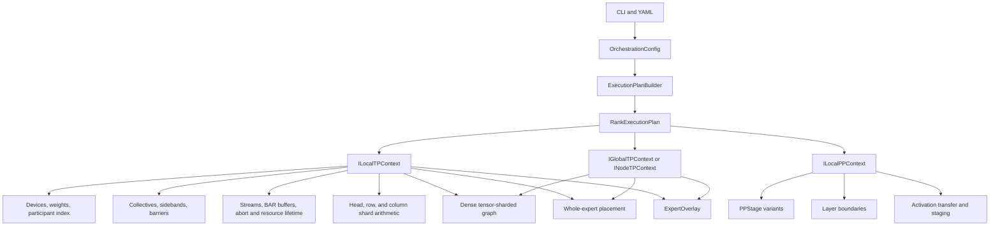
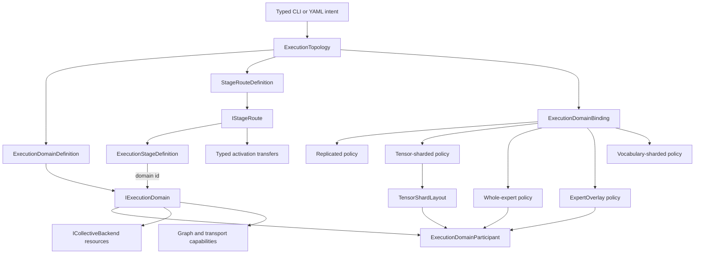

# Execution Domain and Stage Route Taxonomy Refactor

Created: 2026-08-23
Status: Proposed implementation plan
Scope: Configuration, planning, runtime collective contexts, stage routing,
graph bindings, observability, tests, CLI, and documentation

## Document purpose

This plan defines the full cutover from topology objects named after tensor
parallelism (TP) and pipeline parallelism (PP) to topology objects whose names
describe what they actually own.

The central correction is:

- an **execution domain** identifies participants and their communication
  resources;
- a **stage route** assigns ordered layer intervals to execution domains and
  moves activations between them;
- a **distribution policy** describes how a particular model role is placed
  within a domain.

Tensor parallelism, expert parallelism, ExpertOverlay, replication, and
vocabulary sharding are distribution policies. They are not hardware scopes.
Pipeline parallelism is one consequence of a multi-stage route. It is not the
identity of the activation-transfer context.

This is a target-state plan. It does not authorize compatibility aliases,
dual runtime paths, silent fallback, or a broad search-and-replace that leaves
the old ownership model intact.

## Executive decision

Use the following canonical vocabulary:

| Concept | Canonical name |
|---|---|
| Declarative group of hardware participants | `ExecutionDomainDefinition` |
| Runtime owner of one resolved domain | `IExecutionDomain` |
| Immutable participant-specific runtime handle | `ExecutionDomainParticipant` |
| Domain reachability | `ExecutionDomainScope` |
| A rank's participation in a domain | `ExecutionDomainMembership` |
| Ordered layer/domain bindings | `StageRouteDefinition` |
| One layer interval bound to one domain | `ExecutionStageDefinition` |
| Runtime activation movement along the route | `IStageRoute` |
| Model-role placement within a domain | `DistributionPolicy` |
| Binding of a role and policy to a domain | `ExecutionDomainBinding` |
| Recursive declarative topology | `ExecutionTopology` |

Scope names must be exact:

- `SINGLE`: one physical participant;
- `RANK_LOCAL`: one MPI process owns all participants;
- `NODE_LOCAL`: participants may span MPI ranks on one host;
- `GLOBAL`: participants may span hosts.

The words `Local`, `Node`, and `Global` must not be used without stating what
is local. In particular, `LocalTP` becomes `RankLocalExecutionDomain`, and
`NodeTP` becomes `NodeLocalExecutionDomain`.

The terms **tensor parallel** and **pipeline parallel** remain valid only where
the implementation genuinely performs those mathematical execution policies.
For example, `TensorShardLayout`, `TensorParallelConfig`, and an all-reduce
stage that combines tensor shards may retain TP terminology. A generic domain
used to place whole experts may not.

## Problem statement

### Current semantic mismatch

`ILocalTPContext`, `INodeTPContext`, and `IGlobalTPContext` are used as runtime
homes for participant membership, collective backends, streams, barriers,
sidebands, graph-capture resources, abort state, and proportional capacity.
Those facilities are also used by whole-expert placement and ExpertOverlay.
Calling the object a TP context falsely states that every participant owns a
tensor shard.

This causes configurations such as a two-socket whole-expert CPU domain to be
described as `NodeTP`, even when no routed expert tensor is tensor-sharded.
The naming leaks into execution-plan predicates, logs, PerfStats, CTest names,
model-parity topology names, and graph capability decisions.

`ILocalPPContext` has a different problem. It owns ordered stages, layer
boundaries, activation transfer, staging resources, and route synchronization.
That is a stage route. The object does not need to claim that PP is the only
reason such a route exists.

### Current responsibility mixture

`ILocalTPContext` currently combines at least four responsibilities:

1. domain identity and participant inventory;
2. collective transport and graph-capture capability;
3. collective resource and failure lifetime;
4. tensor-specific shard arithmetic such as head, row, and column ranges.

The first three are useful to tensor sharding, expert sharding, ExpertOverlay,
replication, and compact control sidebands. The fourth is specific to tensor
sharding. Keeping all four together makes the false TP identity structural,
not merely cosmetic.

### Duplicated declarative concepts

The repository already contains the correct declarative nucleus:
`ExecutionDomainDefinition` and `ExecutionDomainScope`. Older surfaces still
carry `DomainDefinition`, `TPDomainConfig`, `TPScope`,
`TPDomainParticipation`, `local_tp_*`, `global_tp_*`, and PP/TP nodes in
`ParallelismTree`.

The project must converge on the canonical execution-domain contract rather
than add a third vocabulary layer.

### Consequences if left unchanged

- Validators cannot distinguish hardware reachability from dense tensor
  sharding requirements.
- Expert-only execution appears to require TP even when it does not.
- Graph code receives more capability than it needs and can accidentally call
  tensor-specific helpers.
- A mutable `myIndex()`/`setCurrentDeviceIndex()` convention allows participant
  identity to depend on caller sequencing.
- CLI and diagnostics describe implementation history rather than user intent.
- Stage variants embed pointers to TP/PP contexts instead of referring to
  stable domain identities, complicating ownership and nesting.
- Tests named `NodeTP` may certify expert parallelism without proving tensor
  sharding, and vice versa.

## Goals

1. Make topology names truthful for dense, MoE, MTP, prefix-cache, and
   heterogeneous execution.
2. Give participant membership and collective resources one runtime authority.
3. Separate tensor-shard arithmetic from generic collective-domain mechanics.
4. Replace mutable participant-selection conventions with immutable typed
   participant handles.
5. Make stage routing reference execution-domain identities rather than own or
   borrow nested TP/PP contexts.
6. Make placement policy explicit per model role, because one domain may run
   dense tensor shards while also hosting whole routed experts.
7. Preserve graph-capture, explicit-stream, event-ordering, and performance
   properties exactly through the refactor.
8. Remove the replaced names, factories, modes, test registrations, and CLI
   aliases when the cutover is complete.
9. Keep real tensor-parallel and pipeline-parallel terminology where it is
   mathematically accurate.

## Non-goals

- Redesigning NCCL, RCCL, MPI, UPI, or host collective algorithms.
- Changing expert movement economics, tier priorities, or residency policy.
- Completing unfinished LLEP functionality.
- Adding a generic abstraction that hides default streams, synchronization, or
  host fallback.
- Preserving old TP/PP topology names as compatibility aliases.
- Changing numerical order or weight partitioning as an incidental effect of
  the rename.
- Making the incomplete parallelism-tree execution path appear supported.

## As-built architecture

The important current relationships are:



The defect is visible in the last three edges: the context's name describes
only one consumer.

## Target architecture



There is one participant/collective runtime object. Policies consume only the
capabilities they need. No policy owns a shadow domain context.

## Target type model

### Stable identities

Use strong value types rather than raw integers or names once parsing is
complete:

```cpp
struct ExecutionDomainId
{
    std::uint32_t value = 0;
    auto operator<=>(const ExecutionDomainId &) const = default;
};

struct ParticipantOrdinal
{
    std::uint32_t value = 0;
    auto operator<=>(const ParticipantOrdinal &) const = default;
};

struct ExecutionStageId
{
    std::uint32_t value = 0;
    auto operator<=>(const ExecutionStageId &) const = default;
};
```

Names remain user-facing logical identities, but plans and runtime bindings use
resolved IDs. Graph-cache identity must include the resolved domain ID,
participant ordinal, distribution policy, backend, and resource generation.

### Declarative execution domain

`ExecutionDomainDefinition` remains the configuration-level source of truth:

```cpp
struct ExecutionDomainDefinition
{
    std::string name;
    std::vector<GlobalDeviceAddress> participants;
    std::vector<float> capacity_weights;
    CollectiveBackendType backend = CollectiveBackendType::AUTO;
    ExecutionDomainScope scope = ExecutionDomainScope::AUTO;
    std::optional<int> owner_rank;
    std::vector<int> participant_ranks;
};
```

It must not own model-role policy. The current routed-expert compute, phase,
and assignment fields move to a routed-expert domain binding. This makes the
header's stated topology-only contract true in its data layout as well as its
comments.

`capacity_weights` describe relative work or storage capacity of participants.
They do not imply a tensor axis. Tensor partitioning may consume them, but so
may expert apportionment and automatic capacity planning.

### Runtime execution domain

The runtime object owns resolved membership and collective resources:

```cpp
class IExecutionDomain
{
public:
    virtual ~IExecutionDomain() = default;

    virtual ExecutionDomainId id() const noexcept = 0;
    virtual ExecutionDomainScope scope() const noexcept = 0;
    virtual std::span<const GlobalDeviceAddress> participants() const = 0;
    virtual std::span<const float> capacityWeights() const = 0;
    virtual CollectiveBackendType backend() const noexcept = 0;

    virtual std::size_t participantCount() const noexcept = 0;
    virtual ExecutionDomainParticipant participant(
        ParticipantOrdinal ordinal) = 0;

    // Exact-stream collective and resource APIs follow here.
};
```

The final interface should expose the existing collective functionality with
generic names. It must preserve explicit stream requirements, graph-capture
capability queries, persistent scratch reservation, abort semantics, and
backend error propagation.

Do not retain `myIndex()` as mutable ambient identity. A rank-local domain owns
multiple devices, so there is no single stable `myIndex()` for the whole
context. Callers receive an immutable participant handle:

```cpp
class ExecutionDomainParticipant
{
public:
    ExecutionDomainId domainId() const noexcept;
    ParticipantOrdinal ordinal() const noexcept;
    const GlobalDeviceAddress &device() const noexcept;
    IExecutionDomain &domain() const noexcept;
};
```

Collective calls that need participant-local state accept this handle or its
ordinal explicitly. A graph binds it once. No caller may change the context's
current participant before invoking a sharding or collective method.

### Tensor shard layout

Move tensor-only calculations out of the execution domain:

```cpp
class TensorShardLayout
{
public:
    static TensorShardLayout weighted(
        std::span<const float> capacity_weights);

    int headsFor(ParticipantOrdinal participant, int total_heads) const;
    IndexRange rowsFor(ParticipantOrdinal participant, int total_rows) const;
    IndexRange columnsFor(
        ParticipantOrdinal participant,
        int total_columns) const;
};
```

The layout is immutable and value-semantic. Its construction validates
positive weights, normalization, divisibility policy, and deterministic
remainder assignment. It contains no devices, streams, communicators, or
backend resources.

Weight sharding, dense graph construction, and vocabulary sharding receive a
`TensorShardLayout` only when their `DistributionPolicy` requires one. Whole
expert and ExpertOverlay paths must not receive it by default.

### Distribution policy and role binding

One execution domain may serve several model roles with different policies.
Therefore a domain must not have a single `compute_kind` or sharding mode.

```cpp
enum class ModelExecutionRole
{
    DenseContinuation,
    RoutedExperts,
    SharedExpert,
    VocabularyHead,
    MtpSidecar,
};

enum class DistributionKind
{
    Replicated,
    TensorSharded,
    WholeExpertSharded,
    ExpertOverlay,
    VocabularySharded,
};

struct ExecutionDomainBinding
{
    ModelExecutionRole role;
    ExecutionDomainId domain;
    DistributionKind distribution;
    std::optional<TensorShardSpec> tensor_shard;
    std::optional<RoutedExpertPolicy> routed_experts;
};
```

Validation makes incompatible combinations unrepresentable:

- `TensorSharded` requires a `TensorShardSpec`;
- `WholeExpertSharded` and `ExpertOverlay` require routed-expert policy;
- routed-expert policy is invalid for dense continuation;
- a single role cannot have two durable placement authorities;
- `ExpertOverlay` remains the sole authority for multi-device MoE placement;
- a domain backend must support every collective required by the selected
  policy and graph-capture regime.

### Stage route

A stage route owns ordered layer assignment and activation handoff:

```cpp
struct ExecutionStageDefinition
{
    ExecutionStageId id;
    std::string name;
    LayerInterval layers;
    ExecutionDomainId domain;
    bool owns_embedding = false;
    bool owns_lm_head = false;
};

struct StageRouteDefinition
{
    std::vector<ExecutionStageDefinition> stages;
};
```

The runtime `IStageRoute` resolves consecutive stage handoffs using domain
identities and participant-local endpoints. An execution stage does not embed
or borrow an `ILocalTPContext`, `IGlobalTPContext`, or nested PP context.
Domain runtimes live in one registry owned by the runner/orchestration layer.

The route must represent these transitions explicitly:

- same participant and same graph: no transfer;
- different participant in one rank: rank-local activation handoff;
- different ranks on one node: node-local activation handoff;
- different nodes: global activation handoff;
- one domain to an overlapping domain: local handoff for shared participants
  plus explicit transfer to new participants;
- collective domain to single participant and the reverse.

Pipeline parallelism is the execution policy produced when a route contains
multiple sequential layer-owning stages. The stage-route types themselves do
not need PP in their names.

### Execution topology

Replace the generic PP/TP topology tree vocabulary with structural node types:

```cpp
enum class ExecutionTopologyNodeKind
{
    StageRoute,
    CollectiveDomain,
    Participant,
};
```

The topology describes structure only. A `CollectiveDomain` node does not
assert tensor sharding. Distribution bindings separately state whether the
children run tensor shards, whole experts, replicas, or overlay residents.

If the recursive topology compiler remains incomplete at cutover time, it must
remain explicitly unsupported. The rename must not be used to advertise it.

## Canonical name mapping

The expected final mapping is:

| Existing name | Final name or disposition |
|---|---|
| `ITPContext` | `IExecutionDomain` |
| `ILocalTPContext` | Delete; callers use `IExecutionDomain` plus immutable participant handles |
| `LocalTPContext` | `RankLocalExecutionDomain` |
| `INodeTPContext` | Delete; callers use `IExecutionDomain` |
| `IGlobalTPContext` | Delete; callers use `IExecutionDomain` |
| `GlobalTPContext` | `GlobalExecutionDomain` |
| `TPScope` | Delete; use `ExecutionDomainScope` |
| `TPDomainConfig` | Delete; use `ExecutionDomainDefinition` |
| `TPDomainParticipation` | `ExecutionDomainMembership` |
| `LocalTPCollectiveSidebandKind` | `DomainCollectiveSidebandKind` |
| `LocalTPCollectiveSidebandBuffer` | `DomainCollectiveSideband` |
| `createLocalTPContext()` | `createExecutionDomain()` or scoped domain factory |
| `ILocalPPContext` | `IRankLocalStageRoute` |
| `LocalPPContext` | `RankLocalStageRoute` |
| `LocalPPConfig` | `StageRouteDefinition` or resolved `RankLocalStageRoutePlan` |
| `PPStage` | `ExecutionStage` |
| `PPStageType` | Delete; stages reference domain IDs |
| `LocalPPTransferStage` | `StageActivationTransferStage` |
| `ParallelismTree` | `ExecutionTopology` |
| `ParallelismNodeType::TENSOR_PARALLEL` | `ExecutionTopologyNodeKind::CollectiveDomain` |
| `ParallelismNodeType::PIPELINE_PARALLEL` | `ExecutionTopologyNodeKind::StageRoute` |
| `ParallelismNodeType::DEVICE` | `ExecutionTopologyNodeKind::Participant` |
| `usesLocalTP()` | `hasRankLocalExecutionDomain()` |
| `usesGlobalTP()` | `hasGlobalExecutionDomain()` |
| `usesLocalPP()` | `hasRankLocalStageRoute()` |
| `totalTPDegree()` | Keep only on an actual tensor-shard binding; otherwise `participantCount()` |
| `local_tp_devices` | resolved domain membership, not a plan-side parallel vector |
| `local_pp_devices` | execution-stage domain references |

The implementation may choose one concrete class for all scopes or scoped
classes behind `IExecutionDomain`. Scope-specific public interfaces are not
part of the target: callers branch on typed capabilities or policy, not by
downcasting to a TP-era context. The public vocabulary above remains the same
either way.

## Configuration and CLI contract

### Principles

1. Users declare hardware groups as execution domains.
2. Users bind model roles to domains with explicit distribution policy.
3. Users declare ordered stages only when layer ownership changes by stage.
4. TP flags configure tensor sharding only; they may not be required merely to
   obtain a multi-participant domain.
5. EP and ExpertOverlay configurations must be expressible without mentioning
   TP.
6. Old names fail with a precise migration diagnostic after cutover; they do
   not silently alias the new form.

### Proposed canonical shape

```text
--define-domain \
  "continuation=0:cuda:0,0:cuda:1;scope=rank_local;backend=nccl"

--bind-domain \
  "role=dense-continuation;domain=continuation;distribution=tensor-sharded"

--bind-domain \
  "role=routed-experts;domain=continuation;distribution=expert-overlay"
```

An expert-only node-local CPU domain becomes:

```text
--define-domain \
  "cpu_experts=0:cpu:0,1:cpu:0;scope=node_local;backend=upi;ranks=0,1"

--bind-domain \
  "role=routed-experts;domain=cpu_experts;distribution=whole-expert-sharded"
```

No TP term appears because no expert tensor is tensor-sharded.

Stages use a generic route declaration:

```text
--stage "id=0;domain=cpu_stage;layers=0-15;embedding=true"
--stage "id=1;domain=gpu_stage;layers=16-39;lm-head=true"
```

The exact parser grammar must be centralized in `CliSpec`,
`OrchestrationConfigParser`, and typed parser tests. Do not duplicate a
separate parser in ExpertOverlay or model code.

### Existing flag disposition

During the CLI phase, audit every existing TP/PP flag and classify it:

- retain and clarify when it selects real tensor or pipeline policy;
- replace with a domain, binding, or stage-route option when it selects only
  topology;
- remove when it duplicates named-domain configuration;
- fail fast with the replacement spelling after removal.

Likely topology-coupled candidates include `--tp-scope`, `--tp-devices`,
`--tp-weights`, `--tp-local`, `--tp-global`, and `--pp-stage`.
`--tp-allreduce-precision` may remain because it configures an actual
tensor-shard reduction. The audit decides by semantics, not by substring.

### Automatic placement

Automatic placement produces the same typed objects as explicit placement:

1. inventory selects participants;
2. planner creates `ExecutionDomainDefinition` values;
3. model/runtime intent creates `ExecutionDomainBinding` values;
4. layer ownership creates zero or more `ExecutionStageDefinition` values;
5. one validator certifies the combined topology.

Automatic placement and preflight must use these same resolved definitions so
capacity accounting and execution cannot disagree.

## Planning and ownership changes

### Rank execution plan

Replace parallel vectors and TP/PP-specific optionals with resolved records:

```cpp
struct ExecutionDomainMembership
{
    ExecutionDomainId domain;
    ExecutionDomainScope scope;
    std::vector<ParticipantOrdinal> local_participants;
    CollectiveBackendType backend;
};

struct RankExecutionPlan
{
    // Existing rank, NUMA, model-role, and runtime fields remain.
    std::vector<ExecutionDomainDefinition> domains;
    std::vector<ExecutionDomainMembership> memberships;
    std::vector<ExecutionDomainBinding> bindings;
    std::optional<StageRouteDefinition> stage_route;
};
```

The final shape should avoid copying cluster-wide data that a rank does not
need, but must preserve stable IDs and enough membership data to construct
domain-scoped communicators deterministically.

`RankExecutionPlan` convenience predicates query structure or policy
explicitly:

```cpp
bool hasDomainScope(ExecutionDomainScope scope) const;
bool hasStageRoute() const;
bool usesDistribution(ModelExecutionRole role, DistributionKind kind) const;
```

A generic `hasRankLocalExecutionDomain()` is permitted for runner selection.
It must not be interpreted as proof of tensor sharding.

### Runtime ownership

`OrchestrationRunner` or the appropriate global runner owns one
`ExecutionDomainRegistry`. The registry creates every local domain runtime once
and hands immutable participant views to `RankOrchestrator`, stage runners,
collective stages, MTP coordination, and ExpertOverlay.

```cpp
class ExecutionDomainRegistry
{
public:
    IExecutionDomain &at(ExecutionDomainId id);
    const IExecutionDomain &at(ExecutionDomainId id) const;
    ExecutionDomainParticipant localParticipant(
        ExecutionDomainId id,
        ParticipantOrdinal ordinal);
};
```

The registry owns communicator, backend, scratch, event, and abort lifetimes.
Stages and child runners hold non-owning typed handles whose lifetime is
bounded by their parent runner. There must be no independent ExpertOverlay
domain registry and no nested stage-owned collective context.

### Model graphs

Model graph files remain declarative. A graph receives resolved bindings and
participant handles; it does not decide domain membership or infer policy from
participant count.

Examples:

- dense QKV/FFN stages request `TensorShardLayout` only from a
  `TensorSharded` binding;
- MoE stages request routed-expert placement from a `WholeExpertSharded` or
  `ExpertOverlay` binding;
- a TP all-reduce stage receives `IExecutionDomain` because the graph schema
  already declared that reduction;
- sparse ExpertOverlay collectives use the same domain runtime without calling
  tensor-shard helpers;
- MTP role bindings explicitly state whether heads/verifiers are replicated,
  tensor-sharded, or mirrored.

## Implementation phases

Each phase ends in a green slice. No phase may introduce a second production
execution path or use aliases to keep stale callers alive indefinitely.

### Phase 0: Freeze semantics and add architecture tests

Deliverables:

- Add focused tests that distinguish domain membership from distribution
  policy.
- Add a configuration test proving a whole-expert node-local domain can be
  represented without TP terminology or a tensor-shard layout.
- Add a configuration test proving actual dense TP requires a
  `TensorSharded` binding.
- Add a mixed-policy test proving one domain can host tensor-sharded dense
  roles and whole/overlay routed experts simultaneously.
- Record the current numerical and performance baseline for representative
  CPU, CUDA, ROCm, node-local MPI, and stage-route tests.

Exit gate:

- the new tests fail for the intended structural reasons before production
  code is changed;
- existing unit and production parity gates remain green.

### Phase 1: Extract tensor-shard arithmetic

Deliverables:

- Introduce immutable `TensorShardLayout` and typed `IndexRange`.
- Move head/row/column proportional partition calculations out of
  `ILocalTPContext`.
- Port all divisibility, uneven remainder, capacity-weight, and TP-degree
  tests, including degree 1 through 8.
- Make loaders, schemas, and dense graph builders consume the layout directly.
- Remove tensor-shard helpers from the generic domain interface.

Correctness requirements:

- identical ranges for every existing supported geometry and degree;
- unchanged weight bytes and deterministic arithmetic order;
- no device or collective dependency in `TensorShardLayout` unit tests.

Exit gate:

- all sharding tests pass on the extracted value type;
- no generic MoE/ExpertOverlay caller includes `TensorShardLayout` unless its
  selected policy is actually tensor-sharded.

### Phase 2: Install generic execution-domain runtime

Deliverables:

- Replace `ITPContext` and scope-specific TP context interfaces with
  `IExecutionDomain` and scoped implementations.
- Introduce immutable `ExecutionDomainParticipant` handles.
- Replace mutable current-device/current-index selection with explicit handles
  or ordinals at every call site.
- Rename generic collective sideband, rendezvous, graph-capture, and resource
  APIs.
- Preserve exact-stream requirements and graph-capture support.
- Rename mocks, factories, tests, CMake targets, and source-policy rules in the
  same slice.

Required backend proof:

- CPU/host, CUDA/NCCL, ROCm/RCCL, MPI, UPI, and heterogeneous-host domain
  construction;
- allreduce, allgather, reduce-scatter, broadcast, raw-stream collectives, and
  grouped sidebands;
- graph-capture capability and explicit-stream rejection tests;
- abort and resource-lifetime tests;
- no new stream/device synchronization or hot-path allocation.

Exit gate:

- production callers use only `IExecutionDomain`;
- old TP context headers, factories, mocks, and runtime type names are deleted;
- TP remains only in true tensor-policy code.

### Phase 3: Make bindings the placement authority

Deliverables:

- Add `ModelExecutionRole`, `DistributionKind`, and
  `ExecutionDomainBinding`.
- Move routed-expert policy fields out of `ExecutionDomainDefinition`.
- Project dense, routed-expert, shared-expert, vocabulary, and MTP intent into
  bindings during planning.
- Update validators to reason over `(role, domain, distribution)`.
- Update graph schemas/builders to consume bindings rather than infer policy
  from domain size, context type, or mode booleans.
- Include binding identity in graph-cache and prepared-weight identity.

Exit gate:

- pure expert parallelism and ExpertOverlay do not construct or advertise a
  tensor-shard layout;
- actual TP still exercises identical tensor sharding and collectives;
- invalid role/policy combinations fail before model materialization.

### Phase 4: Replace PP contexts with stage routes

Deliverables:

- Introduce `ExecutionStageDefinition`, `StageRouteDefinition`, and
  `IStageRoute`.
- Replace `PPStage` context-pointer variants with domain-ID references.
- Move activation transfer and staging into typed route edges.
- Represent same-rank, node-local, global, overlapping-domain, and no-op
  handoffs explicitly.
- Rename `LocalPPTransferStage` and associated graph schema types.
- Update stage-runner ownership so one domain registry outlives every route and
  stage runner.

Exit gate:

- local and cross-rank stage-route integration tests pass;
- no stage owns or borrows a nested domain context;
- no same-rank transition is silently treated as a no-op when the destination
  runner/domain differs;
- PP terminology remains only in actual pipeline scheduling policy and
  user-facing explanations of the resulting execution strategy.

### Phase 5: Replace plan and topology vocabulary

Deliverables:

- Convert `RankExecutionPlan` to domain memberships, role bindings, and an
  optional stage route.
- Replace `ParallelismTree` with `ExecutionTopology` and structural node kinds.
- Update `ExecutionPlanBuilder`, named-domain planning, global topology,
  communicator construction, runner factories, and dry-run explanations.
- Delete `TPScope`, `TPDomainConfig`, `TPDomainParticipation`, parallel
  `local_tp_*`/`local_pp_*` plan fields, and predicates that conflate domain
  shape with policy.
- Keep incomplete topology compilation fail-closed and accurately reported.

Exit gate:

- one typed topology is the source for explicit and automatic placement;
- preflight, memory planning, runner construction, and diagnostic explanation
  consume the same resolved domain/binding records;
- no runtime code reparses strings or reconstructs topology heuristically.

### Phase 6: Cut over ExpertOverlay and MoE execution

Deliverables:

- Make ExpertOverlay consume `ExecutionDomainId`, participant handles, and
  routed-expert bindings everywhere.
- Rename generic `local_tp`/`node_tp` MoE state, counters, diagnostics, and
  tests to execution-domain terms.
- Ensure the sole ExpertOverlay authority remains unchanged: device-resident
  for all-GPU topologies and host-resident when CPU execution participates.
- Preserve tier priority, capacity budgets, histogram-driven movement,
  same-tier skew correction, and migration protocols.
- Ensure Dynamic, Static, MTP, prefix restore, and sparse collective paths use
  the generic domain runtime without a parallel controller.

Exit gate:

- one-domain whole-expert and ExpertOverlay parity cells contain no false TP
  mode in their typed definition or production evidence;
- Static proves no movement; Dynamic proves real movement;
- numerical CSV artifacts and production-path evidence remain unchanged in
  rigor.

### Phase 7: CLI, configuration, and documentation cutover

Deliverables:

- Install the domain/binding/stage-route CLI and YAML grammar.
- Classify and remove topology-only TP/PP flags.
- Retain TP/PP options only where they explicitly select real tensor or
  pipeline policy.
- Update `--help`, validation diagnostics, `--dry-run`, and
  `--explain-placement` together.
- Update `README.md`, `AGENTS.md`, architecture instructions, parity skill,
  examples, test names, and PerfStats documentation.
- Add actionable errors for removed names; do not execute an alias path.

Exit gate:

- all documented commands use the new terminology;
- every linked source path exists;
- config tests cover CLI and YAML equivalence;
- source scans find no stale topology terminology outside intentional migration
  diagnostics, dated historical documents, and true TP/PP math.

### Phase 8: Delete legacy machinery and certify

Deliverables:

- Delete obsolete context files, factories, wrappers, enums, tree builders,
  CMake registrations, mocks, test names, and compatibility branches.
- Add a source-policy test with a narrow allowlist for legitimate TP/PP terms.
- Run the full unit, integration, parity, prefix, MTP, graph-capture, and
  performance gates.
- Compare production counters and performance against the Phase 0 baseline.

Exit gate:

- there is one domain runtime and one stage-route runtime;
- the working tree contains no generated reports or parity artifacts;
- no supported topology changes numerical behavior or materially regresses
  throughput/latency because of the refactor.

## Test strategy

### Fast device-free unit tests

Add or migrate tests for:

- execution-domain definition parsing and validation;
- stable domain IDs and participant ordinals;
- immutable participant handles and invalid ordinal rejection;
- capacity-weight validation and deterministic partitioning;
- tensor-shard layout for TP degree 1 through 8;
- distribution-policy/role compatibility;
- mixed bindings on one domain;
- stage-route validation and every handoff classification;
- execution-plan projection and automatic-placement equivalence;
- graph-cache identity sensitivity to domain/binding changes;
- communicator membership/order derivation;
- source-policy enforcement of the final vocabulary.

### Collective integration tests

For every available backend, retain or rename proof for:

- single-participant domains;
- rank-local CPU domains;
- rank-local homogeneous CUDA and ROCm domains;
- rank-local heterogeneous CUDA/ROCm domains;
- node-local CPU domains across two MPI ranks;
- global MPI domains where CI hardware permits;
- explicit non-null streams and captured collectives;
- grouped sidebands and sparse ExpertOverlay metadata;
- abort, teardown, repeated construction, and back-to-back test isolation.

### Stage-route integration tests

Cover:

- same-device adjacent stages;
- same-rank cross-device handoff;
- homogeneous GPU handoff;
- heterogeneous CUDA/ROCm handoff;
- GPU/CPU handoff;
- cross-rank node-local handoff;
- overlapping source/destination domains;
- embedding and LM-head ownership at opposite ends;
- MTP and prefix-cache restore across a route.

### Model parity matrix

The canonical model-parity definitions should express topology using domain,
binding, and stage-route types. Required semantic controls include:

- dense replicated single participant;
- real dense tensor sharding;
- whole-expert placement without tensor sharding;
- ExpertOverlay Static and Dynamic;
- ordinal and random expert placement;
- MTP off and supported depths;
- mandatory fresh/full/partial prefix restore;
- CPU, CUDA, ROCm, rank-local, node-local, and heterogeneous topologies.

Tests continue to emit the established numerical CSV files plus
`prefix_restore.csv` and `production_path.csv`. A rename is not permission to
weaken tolerances, skip checkpoints, disable production graph capture, or use
test-only execution.

### Performance gates

The refactor should be performance-neutral. Measure production Release builds
for representative prefill and decode workloads before Phase 2 and after every
runtime phase.

Required evidence:

- no additional virtual dispatch inside a per-element or per-expert kernel
  loop;
- no new host synchronization, D2H transfer, allocation, or stream rebinding;
- unchanged NCCL/RCCL/MPI primitive selection;
- unchanged captured graph count and cache hit behavior for equivalent intent;
- unchanged collective payload sizes;
- unchanged or improved startup and graph-preparation time;
- PerfStats proves the selected domain, binding, route, backend, and graph path.

Any regression must be attributed before proceeding. Do not restore the old
path as a fallback.

## Observability contract

Generic topology counters use domain language:

```text
execution_domain.scope
execution_domain.participant_count
execution_domain.backend
execution_domain.collective_calls
execution_domain.collective_bytes
execution_domain.graph_captured_collectives
stage_route.stage_count
stage_route.activation_transfers
stage_route.activation_bytes
distribution.role
distribution.kind
```

Tensor-specific counters retain tensor terminology only when a
`TensorSharded` binding is active:

```text
tensor_shard.degree
tensor_shard.axis
tensor_shard.allreduce_calls
```

ExpertOverlay movement and residency counters retain their established
authority semantics, but participant/domain tags use stable execution-domain
IDs and names rather than `local_tp` or `node_tp` labels.

`--explain-placement` should render three separate sections:

1. execution domains and participants;
2. stage route and layer ownership;
3. model-role distribution bindings.

This separation is itself an architecture diagnostic. If one section must
infer another, the plan has regressed into the old coupling.

## Source-policy enforcement

Add a source sanitizer after the cutover. Its allowlist should permit TP/PP
tokens only in locations that implement or test actual tensor/pipeline policy,
for example:

- `TensorShardLayout` and tensor-parallel weight/schema code;
- TP all-reduce/all-gather compute stages;
- pipeline scheduling algorithms and user-facing explanations;
- migration diagnostics for removed CLI spellings;
- dated historical project documents.

It should reject stale generic names such as:

- `ILocalTPContext`, `LocalTPContext`, `NodeTPContext`, `GlobalTPContext`;
- `local_tp_ctx_`, `global_tp_ctx_`, `local_pp_ctx_`;
- `usesLocalTP()` or `usesLocalPP()` as generic runner selection;
- ExpertOverlay topology/test names containing TP when no tensor sharding is
  active;
- new generic APIs prefixed with `tp` or `pp`.

The sanitizer must not ban legitimate mathematical terminology or rely on a
large directory-wide exemption.

## Migration hazards and mitigations

### Accidental numerical change

Risk: extracting tensor-shard layout changes remainder assignment or shard
ordering.

Mitigation: characterize every current result first, port byte-exact tests,
and compare prepared-weight manifests before and after.

### Participant identity races

Risk: replacing mutable `myIndex()` exposes callers that relied on ambient
state or thread sequencing.

Mitigation: immutable participant handles are required at graph construction;
adversarial concurrent tests bind different participants on different threads.

### Communicator-order divergence

Risk: generic domain construction changes MPI communicator creation order.

Mitigation: derive stable domain IDs before runtime creation, sort communicator
construction by ID, and test multiple domains across repeated process-resident
campaign cells.

### Graph-cache aliasing

Risk: two policies on the same participants reuse a graph with incompatible
embedded pointers or collective semantics.

Mitigation: domain ID, participant ordinal, binding policy, resource
generation, and graph role are mandatory cache identity.

### Ownership cycles

Risk: stage objects keep shared ownership of domain contexts, recreating the
current nested-context lifetime.

Mitigation: one registry owns domains; stage routes contain IDs; runtime stages
hold bounded non-owning typed handles.

### Over-generalized interface

Risk: `IExecutionDomain` becomes a grab bag containing tensor, expert, route,
and model-specific operations.

Mitigation: keep only membership, collective transport, graph capabilities,
resources, and failure state in the domain. Policy math stays in policy types.

### Cosmetic-only rename

Risk: old semantics survive behind generic names.

Mitigation: Phase 1 removes shard arithmetic; Phase 3 removes model-role policy
from the domain definition; source-policy tests enforce the result.

### CLI ambiguity

Risk: users cannot tell whether a flag selects participants or sharding.

Mitigation: domain declarations select participants, bindings select policy,
and stages select layer ownership. Help and validation display those three
categories separately.

## Definition of done

The project is complete only when all of the following are true:

- `ExecutionDomainDefinition` is the sole declarative participant-domain type.
- `ExecutionDomainScope` is the sole domain-scope enum.
- production owns one runtime execution-domain registry.
- all participant identity is explicit and immutable at use sites.
- tensor shard arithmetic lives outside the generic domain runtime.
- stage routes reference domain IDs and do not own nested contexts.
- role/distribution bindings are typed and validated before model loading.
- whole-expert and ExpertOverlay configurations require no TP mode or context.
- actual tensor parallelism still has explicit TP policy and byte-identical
  sharding.
- topology-only TP/PP CLI names and modes are removed.
- stale runtime classes, aliases, factories, mocks, tests, CMake targets, and
  documentation are deleted or renamed.
- source-policy tests enforce the semantic boundary with a narrow allowlist.
- unit, integration, graph-capture, MTP, prefix-cache, model-parity, and
  performance gates pass.
- production parity retains all checkpoint CSV and path-evidence artifacts.
- no new fallback, synchronization, allocation, host mirror, or alternate
  authority was introduced.

## Recommended first implementation slice

The safest first green slice is deliberately narrow:

1. Add `TensorShardLayout` as a device-free value type.
2. Characterize and port all current head/row/column partition tests, including
   weighted and degree-1-through-8 cases.
3. Make `TensorParallelConfig` and weight sharding consume the new layout.
4. Leave collective calls behaviorally unchanged while removing shard
   arithmetic from `ILocalTPContext`.
5. Add the three structural configuration tests from Phase 0.
6. Run the complete unit gate plus focused dense TP and whole-expert parity.

That slice creates a real semantic boundary before the large runtime rename.
Once it is green, the context rename is mechanical enough to audit while still
being protected against accidentally treating every domain as tensor-parallel.

## Implementation checklist

Use this as the project-level progress ledger. Detailed measurements and
failure notes should go in dated handoffs rather than expanding this plan into
a diary.

- [ ] Phase 0: structural contract tests and baseline evidence
- [ ] Phase 1: `TensorShardLayout` extraction
- [ ] Phase 2: generic execution-domain runtime and participant handles
- [ ] Phase 3: typed role/distribution bindings
- [ ] Phase 4: stage-route runtime and domain-ID stage references
- [ ] Phase 5: rank plan and execution-topology cutover
- [ ] Phase 6: ExpertOverlay and MoE adoption
- [ ] Phase 7: CLI, diagnostics, tests, skills, and documentation cutover
- [ ] Phase 8: legacy deletion, source sanitizer, and full certification

## Primary implementation surfaces

The implementation should begin with these sources and follow their direct
callers rather than relying on a global textual rename:

- `src/v2/config/ExecutionDomainDefinition.*`
- `src/v2/config/OrchestrationConfig.*`
- `src/v2/config/OrchestrationConfigParser.*`
- `src/v2/config/ConfigValidator.*`
- `src/v2/config/TPDomainConfig.*`
- `src/v2/collective/ITPContext.h`
- `src/v2/collective/ILocalTPContext.h`
- `src/v2/collective/LocalTPContext.*`
- `src/v2/collective/INodeTPContext.h`
- `src/v2/collective/IGlobalTPContext.h`
- `src/v2/collective/GlobalTPContext.*`
- `src/v2/collective/ILocalPPContext.h`
- `src/v2/collective/LocalPPContext.*`
- `src/v2/collective/PPStage.*`
- `src/v2/execution/mpi_orchestration/RankExecutionPlan.h`
- `src/v2/execution/mpi_orchestration/ExecutionPlanBuilder.*`
- `src/v2/execution/parallelism_tree/ParallelismTree.*`
- `src/v2/execution/parallelism_tree/TreeToRunnerCompiler.*`
- `src/v2/execution/runner/OrchestrationRunner.*`
- `src/v2/execution/runner/NamedDomainGlobalRunner.*`
- `src/v2/execution/local_execution/orchestrators/RankOrchestrator.*`
- `src/v2/execution/local_execution/orchestrators/DeviceGraphOrchestrator.*`
- `src/v2/execution/moe/MoEExpertOverlayExecutionPlan.*`
- `src/v2/execution/compute_stages/stages/LocalPPTransferStage.*`
- `src/v2/loaders/LocalTPWeightSharder.*`
- `src/v2/config/TensorParallelConfig.*`
- `tests/v2/CMakeLists.txt`

Update the high-level V2 architecture instructions only after each installed
slice matches production. This project plan records the target; architecture
documentation must continue to describe what is live.
