# ExpertOverlay Tier Migration and Heterogeneous Ticket Design

Created: 2026-08-11  
Last implementation audit: 2026-08-25

## Document status

This is the normative target architecture for arbitrary-tier ExpertOverlay
migration. It is also a status map: the table below distinguishes code that is
installed in the production graph from protocol and device components that are
implemented but not yet composed into the live runner. In the design sections,
“must” describes the required production contract; it does not by itself claim
that the corresponding row is already certified.

| Slice | Current implementation evidence | Status |
|---|---|---|
| Immutable residency epochs, capacity-preserving cycles, shadow requirements, ticket leases, deferred retirement, and fail-closed abort | `MoEOverlayResidencyAuthority.*`; `V2_Unit_MoEOverlayResidencyAuthority` | Implemented and device-free proven |
| Exact old/current host epoch lookup for delayed captured tickets | `MoEOverlayResidencyAuthority::tryAcquireTicketSnapshot(epoch)`, the lock-free retiring-epoch slot, dispatch ticket ABI v3, and focused authority/dispatch regressions | Implemented and device-free proven; the device producer does not yet populate the epoch |
| Device-owned captured epoch admission and two-bank grace period | `DeviceMoEOverlayEpochABI.h`, `MoEOverlayDeviceEpochProtocol.*`, backend epoch kernels, runtime-table composition, and graph acquire/release stages define one model-role selector, acquisition guard, per-bank readers, candidate readiness, publication, abort, and reuse | Installed on CUDA and ROCm. Device-free adversarial epochs, real-device readers/publication, and the 122B mixed-vendor production cell prove request-pinned bank consumption; the broader depth/layout matrix remains |
| Arbitrary-tier composite prepare/commit/abort polling | `MoEOverlayTierMigrationTransport.*`; `V2_Unit_MoEOverlayTierMigrationTransport` | Implemented and device-free proven |
| Non-blocking histogram generations | `DecodeExpertHistogram::freezeAndRotateWindow()` and its concurrent-writer regressions | Implemented and device-free proven |
| GPU/CPU stream manifest and layout conversion | `ExpertTierWeightStream.*`; its unit sweep covers all 21 catalogued NativeVNNI source formats | Implemented and device-free byte-layout proven |
| CUDA and ROCm GPU↔CPU conversion kernels | `CUDAExpertTierWeightKernels.cu`, `ROCmExpertTierWeightKernels.hip`, and the corresponding `V2_Integration_*_ExpertTierWeightKernels` suites | Implemented; real-device, all-format, byte-exact proof |
| Persistent asynchronous CPU↔CPU, GPU↔CPU, and GPU↔GPU lanes | `MoEOverlayPhysicalResidencyFabric.*`, `ExpertTierWeightTransferLane.*`, `ExpertTierGpuBlobTransferLane.*`, and `ExpertTierMigrationOperations.*` | Implemented; real-device accelerator overlap and device-free parallel NUMA-copy proof with deterministic payloads |
| CUDA-hot/CPU-cold and CUDA-hot/ROCm-warm/CPU-cold cycles | `V2_Integration_MoEOverlayCudaHotCpuColdMigration` and `V2_Integration_MoEOverlayThreeTierMigration` | Real-device protocol proof; no model is loaded |
| Captured heterogeneous ticket publication/consumption | The node-local mapped activation channel, retained participant graph families, ticket-selected device placement banks, and conditional lowering in `Qwen35MoEGraph` | Installed and real-model parity proven. Hidden rows and sparse route metadata stay in the node-local mapped channel; the host may submit an immutable retained-graph ticket where the backend requires it, but does not own or reconstruct placement/model state. The channel is intentionally invalid across nodes |
| Production authority, participant banks, physical fabric, and background maintenance ownership | `OrchestrationRunner::initializeMoEExpertOverlayResidencyAuthority()`, `initializeMoEExpertOverlayResidencyMaintenance()`, `MoEOverlayParticipantResidencyRegistry`, and `MoEOverlayResidencyMaintenanceService` | Installed for process-local and distributed tier sets; real-model three-tier migration certification proven |
| Live service and movement-economy certification | `MoEOverlayEconomyCalibrationController`, `MoEOverlayMigrationMeasurementLedger`, `MoEOverlayEconomyProfileComposer`, `MoEOverlayEconomyCertificationController`, the local GPU service-evidence publisher, and the private MPI evidence lane measure real non-publishable waves plus exact live prepared-expert service, merge owner-authenticated evidence, and seal the authority before proposals | Installed for local and distributed dynamic overlays; device-free lifecycle and real two-rank physical-fabric calibration are proven. The graph-native CUDA/CPU real-weight cell now certifies both CPU and CUDA service coordinates and has published repeated host/device epochs; completion of its two-axis movement proof and the aggregate matrix remains the current gate |
| Live histogram-to-tier proposal, physical transfer, inactive-bank publication, and retirement | `MoEOverlayResidencyMaintenanceService` drives coordinator-frozen histogram generations through the local or distributed migration transport and `MoEOverlayPhysicalResidencyFabric` | Installed for local and distributed dynamic overlays; real-weight three-tier production parity proves repeated publication and retirement, while the wider topology/performance matrix remains |
| Cross-rank prepare/commit/abort/retire consensus and remote projection data plane | `MoEOverlayDistributedResidencyProtocol.*`, `MoEOverlayMPIResidencyConsensus.*`, `MoEOverlayMPIRemoteProjectionTransport.*`, `MoEOverlayGpuRemoteProjectionEndpoint.*`, `MoEOverlayPhysicalResidencyFabric.*`, and the two-rank heterogeneous residency integrations | Implemented and composed in the production runner; CPU, GPU/CPU conversion, same-packed GPU, and cross-vendor GPU blob paths are proven below model level |
| Exact model- and topology-aware capacity admission | `MoEOverlayCapacityResolver.*`, `MoEOverlayCapacityAdmission.*`, `MoEOverlayLocalCapacityPlanner.*`, and `OrchestrationRunner::freezeMoEExpertOverlayPlanForLoadedModel()` build the GGUF manifest, charge every named fixed/live/shadow/staging allocation per rank/device, search resident captured-prefill shapes, and install layer quotas before placement | Installed in production and device-free proven across all 21 NativeVNNI formats; real-weight CUDA/ROCm/CPU admission is proven, while the remaining target topology matrix must still be certified |
| Universal multi-device MoE placement authority | Every multi-device MoE topology, including one domain with one tier, is normalized to an ExpertOverlay plan and uses one RCU authority for durable placement, same-tier skew correction, replicas, and request-scoped LLEP leases | The tiered-overlay host authority now composes cross-tier optimization and capacity-preserving same-tier participant swaps in one candidate epoch, including makespan-based economy and explicit `same_priority_moves` evidence. Legacy non-overlay LocalTP/NodeLocalTP cells still own an independent controller and must be normalized to this authority. |
| Multi-tier current-batch LLEP | One authority-pinned request transaction minimizes ordinary-prefill makespan over already-resident endpoints and separately budgeted transient arrivals without mutating durable placement | **Target architecture; not installed.** Current CPU/GPU LLEP planning assumes one routed domain owns every expert in the layer. It proves one-tier transient movement, but cannot yet plan a topology-wide batch across multiple tier domains. |
| All-GPU authority execution locus | ExpertOverlay remains the sole logical authority, while one topology-selected leader GPU and device-resident follower controllers own policy, epoch selection, and generation-loop decisions without a host mirror, regardless of tier count or GPU vendor mix | Installed for homogeneous CUDA/ROCm and the mixed-vendor CUDA2/ROCm4 two-tier topology. The 122B Dynamic proof records `policy_owner=device`, device-authored promotion/demotion/same-priority edges, and request-selected device banks. Remaining topology/depth cells are campaign work, not an alternate host authority |
| CPU-participating authority execution locus | A topology with any live CPU expert participant uses the one host-resident ExpertOverlay authority because CPU execution state is host-owned; GPU controllers are physical followers/executors, never competing policy authorities | Installed for two-/three-tier CPU-participating overlays and real-weight correctness proven. The legacy non-overlay controllers still require retirement. |
| Real-weight two- and three-tier model parity | The Qwen 3.5 production graph-native overlay cells cover CUDA/CPU, ROCm/CPU, CUDA/ROCm, CUDA/ROCm/CPU, and CUDA2/ROCm4 layouts, segmented heterogeneous prefill, exact checkpoints/CSV artifacts, and a static zero-movement control | The split route-assignment authority, placement-invariant numerical contract, hosted MTP cursor, and indivisible epoch-lease publication lifecycle are fixed. The 122B CUDA2/ROCm4 Static/Ordinal process campaign now passes MTP off, fixed depths 1/2/3/15, and dynamic depth in 184.558 seconds through one retained model context, including mandatory prefix restore and strict CSV evidence. The remaining Dynamic and random-order cells are the aggregate gate. |
| Repack/stream throughput, occupancy, register/VGPR, and spill certification | `V2_Perf_CUDA_ExpertTierWeightStreaming`, `V2_Perf_ROCm_ExpertTierWeightStreaming`, Nsight Compute, `rocprofv3`, and static gfx906 code-object inspection | Implemented and certified for all formats and real projection shapes |
| End-to-end migration interference and staging backpressure during real inference | Deterministic device integrations prove asynchronous overlap, including concurrent FusedQKV stream pools. The real-weight two-rank CPU NodeTP campaign now collects exact paired baseline/concurrent inference intervals while a non-publishable reciprocal expert wave runs. | CPU NodeTP overlap is measured and gated; equivalent real-model CUDA/ROCm/heterogeneous contention and observed-speed certification remain |
| Economy-selected background/quiescent movement | The sole authority compares no movement, opportunistic movement under measured residual bandwidth, and a drained full-bandwidth transaction, including delayed-publication loss and resume cost | **Target architecture; not installed.** Current controllers admit background waves only and the current economy ABI has no resource-utilization forecast, quiescent admission state, or crossover proof |

### Distributed proposal-authority correction (2026-08-25)

The production campaign exposed a split policy authority in the distributed
host-controlled path.  The continuation rank froze one histogram, but the
histogram publisher sent only that evidence.  Every rank then independently
ran smoothing, tier placement, participant-skew planning, wave bounding, and
economy selection.  Rank-local service measurements are physical facts about
that rank, so this reconstruction was neither required nor guaranteed to be
identical.  Consensus correctly rejected the resulting transaction identities.

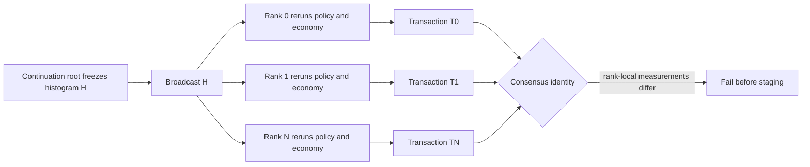
```mermaid
flowchart LR
    H[Continuation root freezes histogram H] --> B[Broadcast H]
    B --> P0[Rank 0 reruns policy and economy]
    B --> P1[Rank 1 reruns policy and economy]
    B --> PN[Rank N reruns policy and economy]
    P0 --> T0[Transaction T0]
    P1 --> T1[Transaction T1]
    PN --> TN[Transaction TN]
    T0 --> C{Consensus identity}
    T1 --> C
    TN --> C
    C -->|rank-local measurements differ| F[Fail before staging]
```

The corrected lifecycle has one policy authority and two separately typed
identities.  The root publishes an immutable canonical execution proposal:
the frozen histogram, expected epoch, complete candidate tier/participant
tables, movement-axis annotations, estimated expert bytes, and the root's
policy audit fingerprint.  A follower does not run placement or economy.  It
validates its current epoch and topology, reconstructs the exact candidate
against its local immutable snapshot, and authenticates the resulting
execution-plan fingerprint.  Consensus covers executable state; the policy
audit fingerprint records the root-only economic decision without pretending
that followers own that policy evidence.

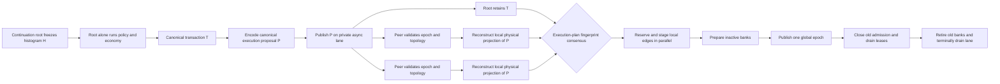
```mermaid
flowchart LR
    H[Continuation root freezes histogram H] --> D[Root alone runs policy and economy]
    D --> T[Canonical transaction T]
    T --> E[Encode canonical execution proposal P]
    E --> B[Publish P on private async lane]
    B --> V0[Root retains T]
    B --> V1[Peer validates epoch and topology]
    B --> VN[Peer validates epoch and topology]
    V1 --> R1[Reconstruct local physical projection of P]
    VN --> RN[Reconstruct local physical projection of P]
    V0 --> C{Execution-plan fingerprint consensus}
    R1 --> C
    RN --> C
    C --> S[Reserve and stage local edges in parallel]
    S --> Q[Prepare inactive banks]
    Q --> U[Publish one global epoch]
    U --> G[Close old admission and drain leases]
    G --> X[Retire old banks and terminally drain lane]
```

The proposal lane is a model-lifetime, non-blocking control plane.  Publication
completion is the irrevocability edge: after it, shutdown must finish or
globally abort that exact proposal before any private communicator is freed.
A passive preposted receive is not a promised collective and may be cancelled
during teardown.  A live consensus vote is never destroyed; failure and stop
first drive it to a typed terminal state.  There is no peer-side replanning,
fingerprint field omission, timeout extension, or host mirror of device-owned
all-GPU authority state.

The historical non-overlay Dynamic machinery and its
`DeviceMoERebalanceController` still own a separate durable table in legacy
multi-device paths. That is an implementation gap, not the target architecture.
Useful participant-load planning, device kernels, transfer slots, and LLEP
mechanics must move underneath the ExpertOverlay authority; their independent
publication path must then be removed. Existing legacy Dynamic/LLEP counters
must not be cited as proof that the ExpertOverlay protocol ran. Completion still
requires universal one-authority composition, the captured device-local
execution bank, observed performance certification, and the later
MTP/prefix/target-model matrix through that authority itself.

## Objective

### Lifecycle simplification decision (2026-08-19)

The former all-GPU Dynamic controller repeated one logical movement wave across
17 separately retained graph phases spanning topology-wide controller state,
participant/group/transport receipts, RCU banks, physical movement, cadence,
and shutdown. Even an empty decision traversed preparation, publication,
admission, retirement, and completion submissions. That lifecycle has been
replaced. `MoEOverlayDeviceControllerGraphService` now exposes four bounded
epochs, and an empty device-authored decision completes directly in `Decide`.

The installed public transaction is this state machine:

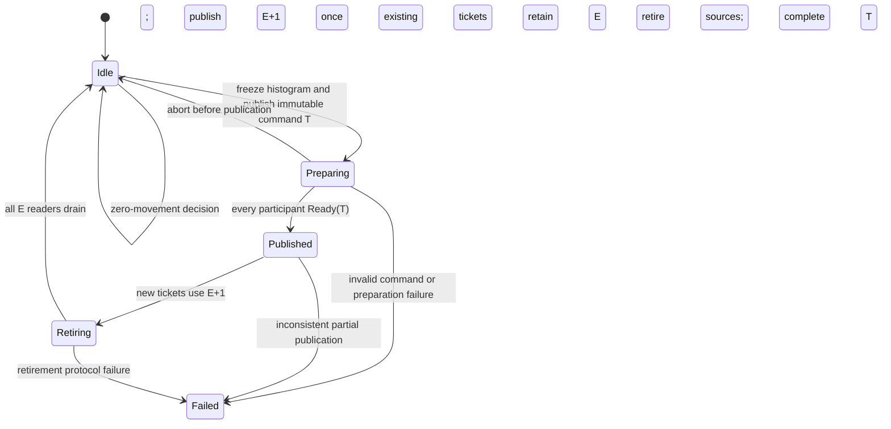
```mermaid
stateDiagram-v2
    [*] --> Idle
    Idle --> Preparing: freeze histogram and publish immutable command T
    Idle --> Idle: zero-movement decision
    Preparing --> Published: every participant Ready(T); publish E+1 once
    Preparing --> Idle: abort before publication
    Published --> Retiring: new tickets use E+1; existing tickets retain E
    Retiring --> Idle: all E readers drain; retire sources; complete T
    Preparing --> Failed: invalid command or preparation failure
    Published --> Failed: inconsistent partial publication
    Retiring --> Failed: retirement protocol failure
```

Each participant retains one graph for every **bounded device epoch**, not one
kernel chain that spins across the entire transaction. The initial launch-once
prototype was rejected by the held-reader CUDA/ROCm integration: a resident
maintenance wait prevented independent inference streams from acquiring the
newly published bank on both vendors. No retained graph may therefore contain
an unbounded transfer, reader-drain, or host-receipt wait.

An epoch may contain short mapped-memory fan-in kernels whose complete producer
set was pre-submitted before any terminal is observed. Those waits close the
device-owned topology reduction; they cannot depend on a later host action or a
graph the scheduler has not launched. PerfStats reports this distinction as
`resident_external_waits=0` and `prearmed_cross_device_fanin=true`.

The installed transaction has four pre-captured epochs:

1. `Decide` freezes the selected histogram plane and publishes immutable
   command `T`; a zero-movement command completes here.
2. `Publish` is eligible only after the physical worker's authenticated
   prepared receipt and durable candidate-lifetime receipt. It installs
   inactive banks, forms participant/group readiness, flips every selector,
   admits `E+1`, and opens retirement. The physical receipt alone cannot select
   a bank or expose `E+1` to inference.
3. `Retire` is eligible only after every participant GPU publishes its own
   old-reader grace-period receipt. It reclaims local banks and publishes
   device retirement receipts.
4. `Complete` is eligible only after the physical worker publishes the exact
   source-retirement receipt. It folds group receipts into the sole authority's
   terminal transition.

CUDA conditional graphs and the HIP authenticated-ticket dispatcher may submit
these retained epochs differently, but they consume the same typed device-owned
ticket ABI. In heterogeneous or cross-rank execution the host may observe a
ticket and submit the graph it names; it cannot choose the epoch, fabricate a
receipt, inspect readers, or mutate placement. The physical worker observes the
immutable command, prepares all projections concurrently, and publishes only
physical readiness. Group aggregation remains a transport optimization, not
another authoritative lifecycle.

The continuation-authoritative inference command already broadcasts identical
retired-token and phase sideband to every rank. Each rank consumes that exact
typed scheduler ticket and pre-submits its matching `Decide` graph; only the
authority participant may begin the transaction or author policy. This removes
the old Begin-then-host-observe scheduling cycle without creating a second
placement authority. During shutdown, a follower may join an already-admitted
transaction only by consuming the same pending sideband and matching the
authority's immutable transaction/phase ticket.

Reader readiness is likewise explicit. An inference release performs a
non-blocking probe: outside `Retiring` it is a no-op; inside `Retiring` it
publishes the participant's base-epoch readiness word only after its local bank
has zero readers. The physical scheduler sees const lifecycle aliases for every
participant in every topology group and submits `Retire` only after all words
match. The retirement kernel rechecks consensus once and fails a stale ticket;
it never spins waiting for a peer. Real-device CUDA/ROCm integration holds E,
executes and releases E+1 on independent inference streams, releases E, and
then proves exactly one topology-ready retirement with no retry graph.

Inference, economy evidence, and shutdown are deliberately outside this state
machine:

- inference acquires one immutable epoch, executes, releases it, and accumulates
  telemetry without entering maintenance state;
- economy readiness gates only whether a movement command may be authored, not
  whether inference may start;
- shutdown closes new transaction admission, lets the single shared transaction
  reach `Idle` or `Failed`, performs one final rank teardown rendezvous, and
  releases resources. It does not wrap an incomplete transaction in a second
  rank-ordered drain protocol.

Static, Dynamic, and current-batch LLEP remain policies of one ExpertOverlay
authority. Static and Dynamic no-movement complete directly. Dynamic uses the
durable `E -> E+1` path above. LLEP reuses the same physical preparation
contract for separately budgeted transient arrivals but publishes a
request-scoped lease rather than a durable epoch and restores it at request
completion. Authority execution remains device-resident for all-GPU cells and
host-resident when a CPU participant is live; transaction semantics do not
change with that locus.

The cutover is test-driven: first prove pre-armed bounded device epochs on two
real MPI processes with CUDA and ROCm participants, including no movement,
movement, reader overlap, failure before publication, and teardown while idle
or active. Then replace the production scheduler atomically and remove the
17-phase enum, phase-specific host decisions, duplicated receipt transitions,
and old distributed drain. The old scheduler is not retained as a fallback.

### Inference and MTP lifecycle audit and consolidation (2026-08-20)

The four-epoch movement controller above simplifies residency maintenance, but
the production inference path still represents one execution sequence in
several independently mutable protocols. The expanded as-built lifecycle is:

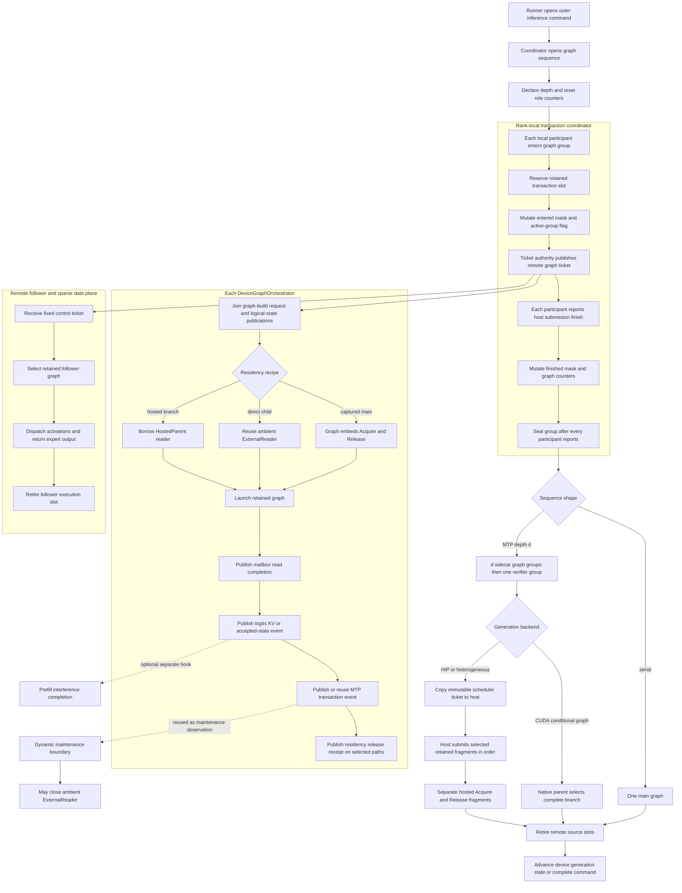
```mermaid
flowchart TB
    A[Runner opens outer inference command] --> B[Coordinator opens graph sequence]
    B --> C[Declare depth and reset role counters]
    C --> D[Each local participant enters graph group]

    subgraph COORD[Rank-local transaction coordinator]
        D --> C1[Reserve retained transaction slot]
        C1 --> C2[Mutate entered mask and active-group flag]
        C2 --> C3[Ticket authority publishes remote graph ticket]
        C3 --> C4[Each participant reports host submission finish]
        C4 --> C5[Mutate finished mask and graph counters]
        C5 --> C6[Seal group after every participant reports]
    end

    subgraph DGO[Each DeviceGraphOrchestrator]
        C3 --> D1[Join graph-build request and logical-state publications]
        D1 --> D2{Residency recipe}
        D2 -->|captured main| D3[Graph embeds Acquire and Release]
        D2 -->|direct child| D4[Reuse ambient ExternalReader]
        D2 -->|hosted branch| D5[Borrow HostedParent reader]
        D3 --> D6[Launch retained graph]
        D4 --> D6
        D5 --> D6
        D6 --> D7[Publish mailbox read completion]
        D7 --> D8[Publish logits KV or accepted-state event]
        D8 --> D9[Publish or reuse MTP transaction event]
        D9 --> D10[Publish residency release receipt on selected paths]
    end

    subgraph REMOTE[Remote follower and sparse data plane]
        C3 --> R1[Receive fixed control ticket]
        R1 --> R2[Select retained follower graph]
        R2 --> R3[Dispatch activations and return expert output]
        R3 --> R4[Retire follower execution slot]
    end

    C6 --> E{Sequence shape}
    E -->|serial| F[One main graph]
    E -->|MTP depth d| G[d sidecar graph groups then one verifier group]
    G --> H{Generation backend}
    H -->|CUDA conditional graph| I[Native parent selects complete branch]
    H -->|HIP or heterogeneous| J[Copy immutable scheduler ticket to host]
    J --> K[Host submits selected retained fragments in order]
    K --> L[Separate hosted Acquire and Release fragments]

    F --> M[Retire remote source slots]
    I --> M
    L --> M
    M --> N[Advance device generation state or complete command]

    D8 -. optional separate hook .-> O[Prefill interference completion]
    D9 -. reused as maintenance observation .-> P[Dynamic maintenance boundary]
    P --> Q[May close ambient ExternalReader]
```

The failure found by the real 122B Dynamic MTP campaign is a direct consequence
of this split. Several independently submitted MTP sidecars reuse one ambient
`ExternalReader`, while dynamic maintenance treats a separately reusable MTP
state event as proof that the reader can close. An older event generation can
therefore release the reader after a newer sidecar has been submitted, clearing
the device ticket beneath that graph. Adding another event wait or giving every
sidecar its own lease would hide the aliasing but retain the wrong ownership
model.

There are three irreducible nesting levels, and no more are required:

1. `InferenceCommand` wakes and eventually terminates remote followers. One
   command may contain several execution sequences, so it cannot be merged with
   a sequence in prefill, dynamic-depth MTP, or forced-token execution.
2. `ExecutionSequenceLease` is one atomic model-state transaction: one serial
   token or prefill chunk, or one complete MTP draft-plus-verifier transaction.
   It acquires one immutable residency epoch and releases it once. This is short
   enough to permit promotion, demotion, and same-tier rebalance between decode
   epochs, while every graph contributing to one accepted result sees the same
   expert placement.
3. `GraphGroupLease` is one symmetric retained graph invocation across all
   local participants and remote followers. MTP needs several graph groups, so
   a group cannot be merged with its sequence. Each participant contributes one
   exact device or CPU terminal to the group.

The target lifecycle is therefore:

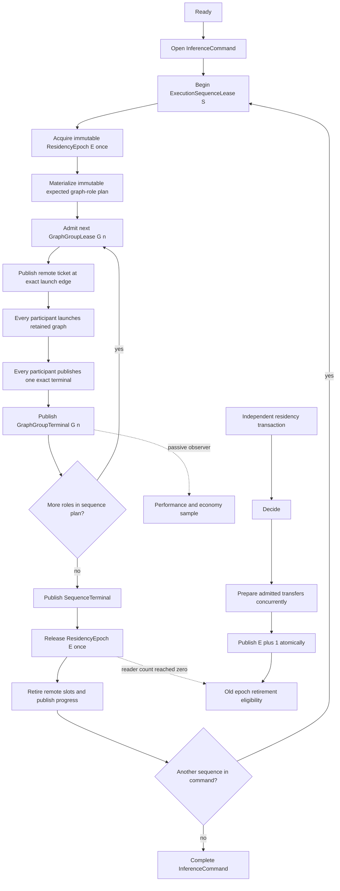
```mermaid
flowchart TB
    A[Ready] --> B[Open InferenceCommand]
    B --> C[Begin ExecutionSequenceLease S]
    C --> D[Acquire immutable ResidencyEpoch E once]
    D --> E[Materialize immutable expected graph-role plan]
    E --> F[Admit next GraphGroupLease G n]
    F --> G[Publish remote ticket at exact launch edge]
    G --> H[Every participant launches retained graph]
    H --> I[Every participant publishes one exact terminal]
    I --> J[Publish GraphGroupTerminal G n]
    J --> K{More roles in sequence plan?}
    K -->|yes| F
    K -->|no| L[Publish SequenceTerminal]
    L --> M[Release ResidencyEpoch E once]
    M --> N[Retire remote slots and publish progress]
    N --> O{Another sequence in command?}
    O -->|yes| C
    O -->|no| P[Complete InferenceCommand]

    J -. passive observer .-> Q[Performance and economy sample]
    M -. reader count reached zero .-> R[Old epoch retirement eligibility]

    S[Independent residency transaction] --> T[Decide]
    T --> U[Prepare admitted transfers concurrently]
    U --> V[Publish E plus 1 atomically]
    V --> R
```

Backend graph APIs change only how the immutable sequence plan is submitted:

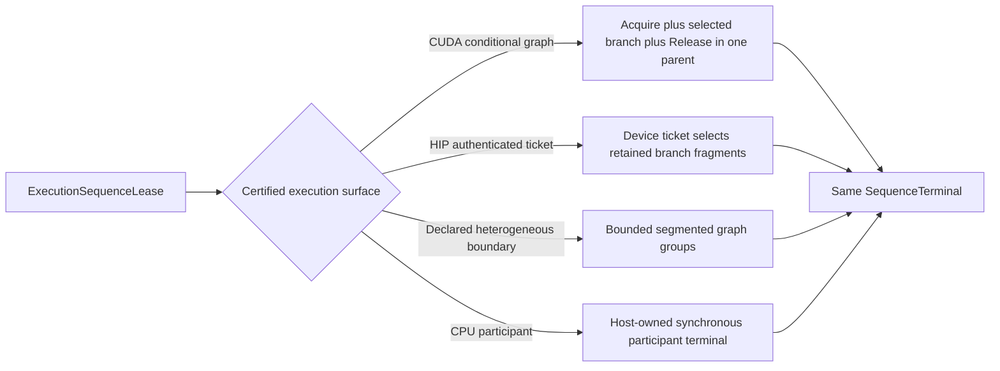
```mermaid
flowchart LR
    A[ExecutionSequenceLease] --> B{Certified execution surface}
    B -->|CUDA conditional graph| C[Acquire plus selected branch plus Release in one parent]
    B -->|HIP authenticated ticket| D[Device ticket selects retained branch fragments]
    B -->|Declared heterogeneous boundary| E[Bounded segmented graph groups]
    B -->|CPU participant| F[Host-owned synchronous participant terminal]
    C --> G[Same SequenceTerminal]
    D --> G
    E --> G
    F --> G
```

The corresponding sequence state machine is intentionally small:

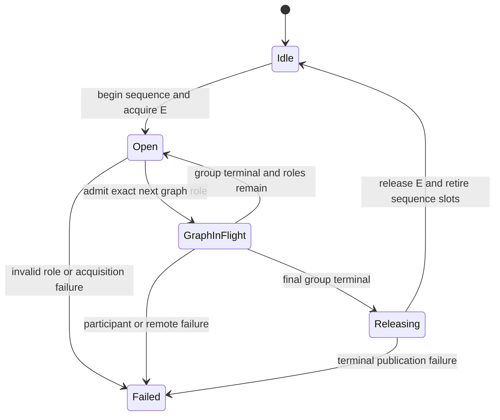
```mermaid
stateDiagram-v2
    [*] --> Idle
    Idle --> Open: begin sequence and acquire E
    Open --> GraphInFlight: admit exact next graph role
    GraphInFlight --> Open: group terminal and roles remain
    GraphInFlight --> Releasing: final group terminal
    Releasing --> Idle: release E and retire sequence slots
    Open --> Failed: invalid role or acquisition failure
    GraphInFlight --> Failed: participant or remote failure
    Releasing --> Failed: terminal publication failure
```

The consolidation is deletion-oriented:

| As-built mutable state | Replacement | State to delete after cutover |
|---|---|---|
| Depth declaration, next-sidecar ordinal, and separate main/sidecar/verifier counters | Immutable `ExecutionSequencePlan` plus one `next_graph_ordinal` | `mtp_depth_declared_`, `active_mtp_draft_depth_`, `next_sidecar_ordinal_`, and the three role counters |
| Active-group boolean, parallel entered/finished masks, and transaction `used`/`armed` booleans | One generation-checked fixed `GraphGroupSlot` with typed state and participant terminal array | `graph_group_active_`, coordinator-wide masks, and duplicated slot flags |
| Ambient external/hosted reader states and a separate forward stream pointer in each DGO | `ExecutionSequenceLease` passed into every participant graph binding | `ExternalReader`, `ExternalForward`, `HostedParent`, `HostedChildForward`, and `moe_overlay_epoch_forward_submission_stream_` |
| Pending logical-state reader stored on the orchestrator | Participant submission token that owns all graph input reads and its terminal | `pending_device_resident_logical_state_forward_read_` |
| Host submission finish plus optional device completion only for calibration | Mandatory `ParticipantTerminal`; host finish is merely rank-local submission alignment | Dedicated calibration completion lifecycle and the misleading terminal meaning of `finishParticipantGraph()` |
| Reusable MTP-state event also used to infer residency-reader safety | MTP event remains shifted-KV coherence only; `SequenceTerminal` exclusively closes residency | Every maintenance dependency on the MTP transaction event |
| Hosted scheduler booleans and independent fragment counters | Typed authenticated-transaction and exact-fragment cursors | `device_generation_dispatch_ticket_copy_pending_`, `hosted_device_generation_scheduler_started_`, `hosted_device_generation_terminal_submitted_`, `hosted_device_generation_last_transaction_count_`, and the hosted advance active/count/next triplet |
| Prefill schedule and probe flags embedded in coordinator lifecycle | Passive observer attached to the final declared `GraphGroupTerminal` | Coordinator-owned calibration state and completion hook |
| Bridge that closes an external reader before opening a hosted parent | Sequence begins before backend selection and owns both boundary fragments | `prepareMoEOverlayEpochForInternalParent()` |

Some boundaries must remain distinct. Residency maintenance is an independent
RCU writer and cannot be merged with inference. Rank-local participant alignment
is still required at a declared heterogeneous graph boundary, but it is a host
submission barrier rather than a device terminal. HIP still needs an immutable
scheduler-ticket observation because it lacks CUDA conditional graphs. The MTP
shifted-KV readiness event also remains because it protects different data; it
simply loses all authority over residency lifetime.

The implementation cutover proceeds vertically, not by adding an adapter over
the old flags. `ExecutionSequencePlan`, the fixed `GraphGroupSlot`, their typed
coordinator state machine, and the hosted transaction/fragment cursors are
installed. The remaining work is to bind serial, bootstrap MTP, native CUDA
MTP, and hosted HIP/heterogeneous MTP to one device-orchestrator sequence lease;
make every participant publish the mandatory terminal; move remote-slot
retirement, progress, and passive measurement to `SequenceTerminal`; and then
delete the ambient epoch variants, bridge, and maintenance use of the MTP event
in the same slice. Real CUDA and ROCm tests must hold a movement candidate while
a depth-15 sequence runs, prove every child used one epoch, and prove the next
sequence may acquire the newly published epoch without a host or stream
synchronization.

### Graph/MTP lifecycle re-audit after route localization (2026-08-20)

The route defect did not justify another graph lifecycle. It was a data-authority
error below an already admitted graph group. Re-plotting the code after the
Static producer fix and hosted-cursor cutover shows the current boundary:

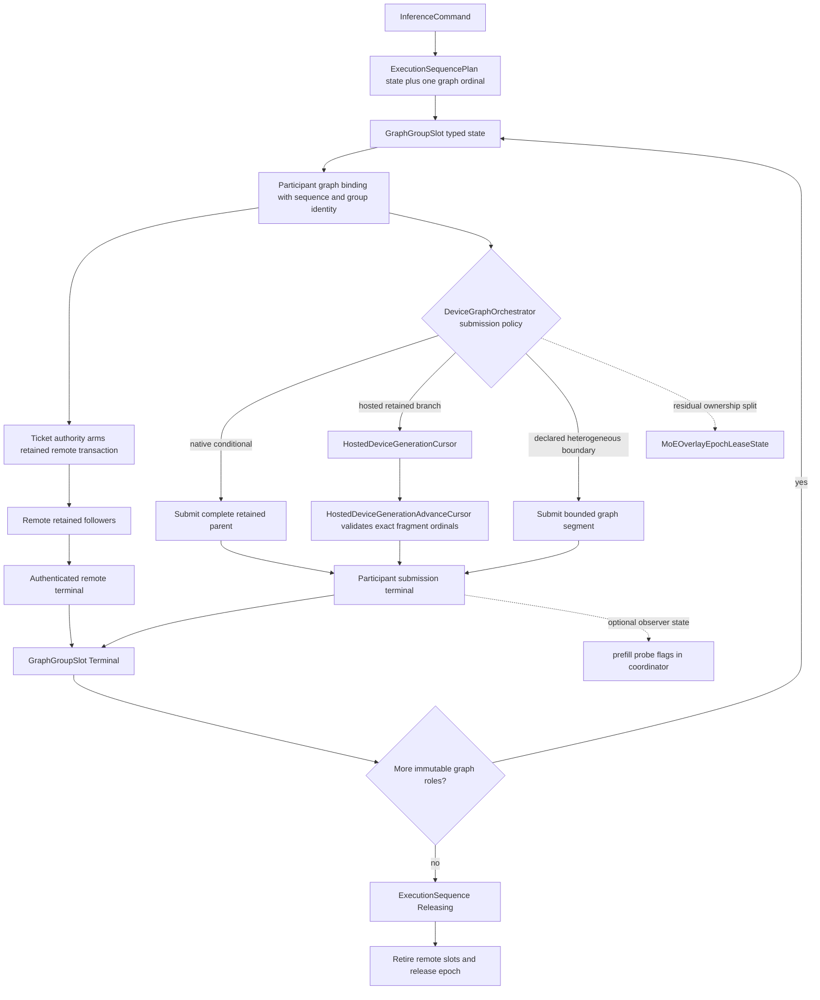
```mermaid
flowchart TB
    A[InferenceCommand] --> B[ExecutionSequencePlan state plus one graph ordinal]
    B --> C[GraphGroupSlot typed state]
    C --> D[Participant graph binding with sequence and group identity]
    D --> E[Ticket authority arms retained remote transaction]
    D --> F{DeviceGraphOrchestrator submission policy}
    E --> G[Remote retained followers]
    F -->|native conditional| N[Submit complete retained parent]
    F -->|hosted retained branch| HC[HostedDeviceGenerationCursor]
    F -->|declared heterogeneous boundary| S[Submit bounded graph segment]
    HC --> HA[HostedDeviceGenerationAdvanceCursor validates exact fragment ordinals]
    N --> H[Participant submission terminal]
    HA --> H
    S --> H
    G --> I[Authenticated remote terminal]
    H --> J[GraphGroupSlot Terminal]
    I --> J
    J --> K{More immutable graph roles?}
    K -->|yes| C
    K -->|no| L[ExecutionSequence Releasing]
    L --> M[Retire remote slots and release epoch]

    F -. residual ownership split .-> R1[MoEOverlayEpochLeaseState]
    H -. optional observer state .-> R2[prefill probe flags in coordinator]
```

This confirms three and only three lifecycle levels: command, sequence, and
graph group. Global placement banks and domain route ledgers are immutable data
owned within a sequence/layer; they are not fourth and fifth lifecycle state
machines. Likewise, CUDA conditional submission, HIP authenticated-ticket
submission, and declared heterogeneous segmentation are strategies underneath
one graph-group transition, not separate coordinator protocols. The two hosted
cursors are protocol substates inside one graph group: the request cursor owns
the authenticated device transaction, while the advance cursor owns exact
fragment ordinals after a branch has been selected.

The hosted submission state is now explicit and installed:

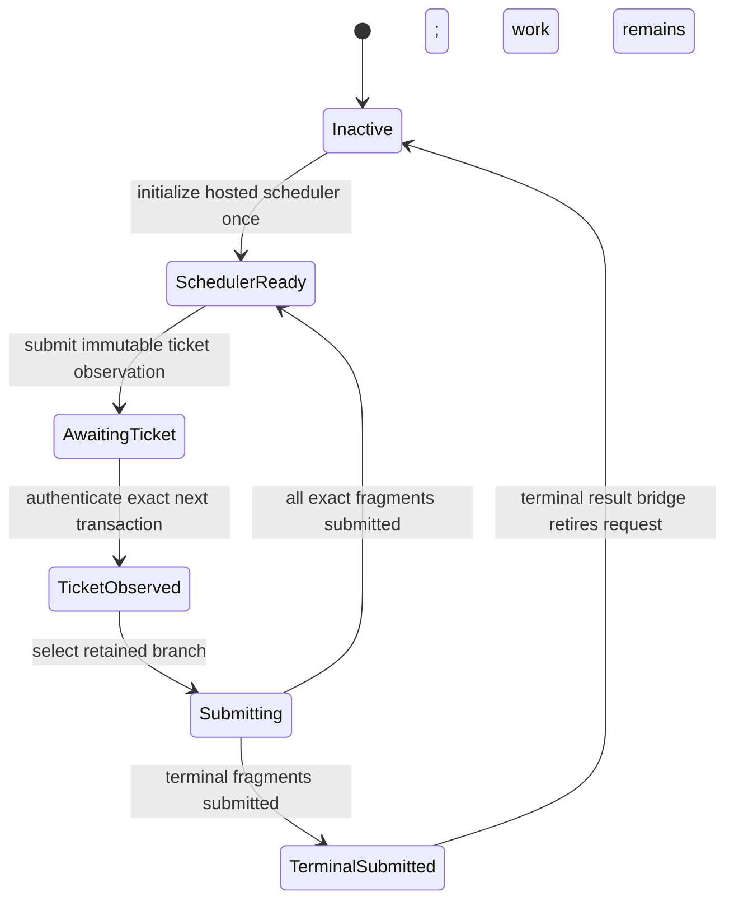
```mermaid
stateDiagram-v2
    [*] --> Inactive
    Inactive --> SchedulerReady: initialize hosted scheduler once
    SchedulerReady --> AwaitingTicket: submit immutable ticket observation
    AwaitingTicket --> TicketObserved: authenticate exact next transaction
    TicketObserved --> Submitting: select retained branch
    Submitting --> SchedulerReady: all exact fragments submitted; work remains
    Submitting --> TerminalSubmitted: terminal fragments submitted
    TerminalSubmitted --> Inactive: terminal result bridge retires request
```

`HostedDeviceGenerationCursor` now replaces the independent
`hosted_device_generation_scheduler_started_`,
`hosted_device_generation_terminal_submitted_`, and
`hosted_device_generation_last_transaction_count_` fields, as well as the
separate ticket-copy-pending flag. `HostedDeviceGenerationAdvanceCursor`
replaces the active/count/next fragment triplet. Device-free adversarial tests
prove rejection of stale and non-contiguous tickets, overlapping advances,
duplicate or out-of-order fragments, premature finish, and premature terminal
retirement. A post-submit transition failure is fatal because retrying an
already submitted retained fragment could execute it twice.

The remaining vertical simplification is independent of this cursor:
`MoEOverlayEpochLeaseState` should become a member of the sequence binding
rather than mutable ambient DGO state. Until that cutover is complete, deleting
its hosted/external variants would be cosmetic and unsafe.

The coordinator's participant bit vectors are not competing lifecycle flags:
they are bounded membership evidence inside one typed `GraphGroupSlot` and are
required for symmetric LocalTP admission. The prefill-probe fields are still
misplaced policy/measurement state and should move to a passive terminal
observer, but they did not participate in the route defect. The parity matrix
therefore proceeds without another tactical event, lease, or boolean. Depth-15
and dynamic-depth failures, if any, must be reduced against this three-level
model before extending it.

### Epoch-lease submission re-audit after the reused-context race (2026-08-21)

The next canonical campaign exposed a narrower race when depth 3 reused the
model context immediately after depth 2. The device-owned epoch protocol and
the three-level command/sequence/group model were sound. The defect was inside
one DGO's host submission boundary: inference and maintenance could publish
temporary acquire/release phases before the retained graph launch and terminal
event record which made those phases true.

The former local lifecycle mixed semantic owners with host call-stack progress:

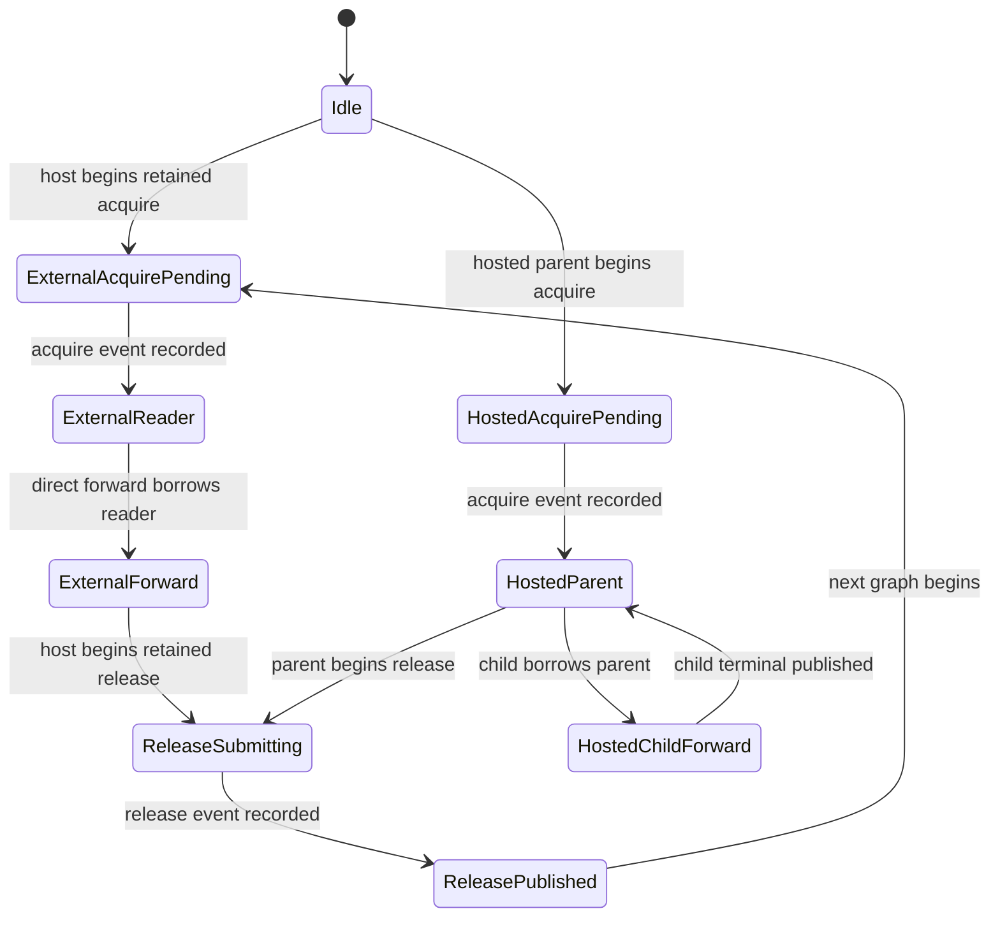
```mermaid
stateDiagram-v2
    [*] --> Idle
    Idle --> ExternalAcquirePending: host begins retained acquire
    ExternalAcquirePending --> ExternalReader: acquire event recorded
    ExternalReader --> ExternalForward: direct forward borrows reader
    ExternalForward --> ReleaseSubmitting: host begins retained release
    ReleaseSubmitting --> ReleasePublished: release event recorded
    ReleasePublished --> ExternalAcquirePending: next graph begins
    Idle --> HostedAcquirePending: hosted parent begins acquire
    HostedAcquirePending --> HostedParent: acquire event recorded
    HostedParent --> HostedChildForward: child borrows parent
    HostedChildForward --> HostedParent: child terminal published
    HostedParent --> ReleaseSubmitting: parent begins release
```

`ExternalAcquirePending`, `HostedAcquirePending`, and `ReleaseSubmitting` were
not durable ownership facts. They were partially submitted recipes whose
required event might not exist yet. A second host worker could observe one of
them, classify an otherwise valid next graph as busy, and eventually leave the
remote follower waiting for an ExpertOverlay ticket. Keeping more booleans or
waiting longer would only enlarge that invalid-state window.

The installed lifecycle publishes semantic ownership only:

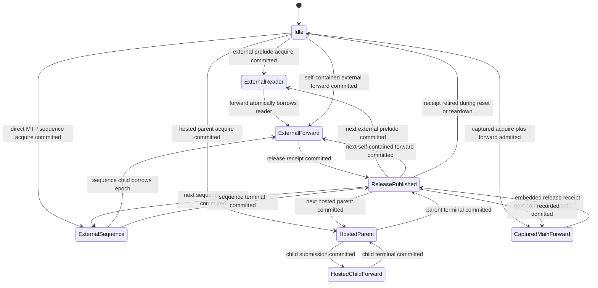
```mermaid
stateDiagram-v2
    [*] --> Idle
    Idle --> ExternalReader: external prelude acquire committed
    ReleasePublished --> ExternalReader: next external prelude committed
    ExternalReader --> ExternalForward: forward atomically borrows reader
    Idle --> ExternalForward: self-contained external forward committed
    ReleasePublished --> ExternalForward: next self-contained forward committed
    ExternalForward --> ReleasePublished: release receipt committed

    Idle --> ExternalSequence: direct MTP sequence acquire committed
    ReleasePublished --> ExternalSequence: next sequence acquire committed
    ExternalSequence --> ExternalForward: sequence child borrows epoch
    ExternalSequence --> ReleasePublished: sequence terminal committed

    Idle --> HostedParent: hosted parent acquire committed
    ReleasePublished --> HostedParent: next hosted parent committed
    HostedParent --> HostedChildForward: child submission committed
    HostedChildForward --> HostedParent: child terminal committed
    HostedParent --> ReleasePublished: parent terminal committed

    Idle --> CapturedMainForward: captured acquire plus forward admitted
    ReleasePublished --> CapturedMainForward: next captured forward admitted
    CapturedMainForward --> ReleasePublished: embedded release receipt recorded
    ReleasePublished --> Idle: receipt retired during reset or teardown
```

Every arrow is now one `MoEOverlayEpochLeaseLifecycle::Submission`. The RAII
submission holds a mutex only across the finite host enqueue/publication recipe:

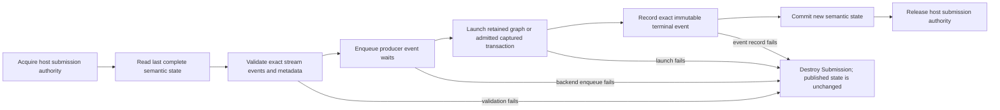
```mermaid
flowchart LR
    A[Acquire host submission authority] --> B[Read last complete semantic state]
    B --> C[Validate exact stream events and metadata]
    C --> D[Enqueue producer event waits]
    D --> E[Launch retained graph or admitted captured transaction]
    E --> F[Record exact immutable terminal event]
    F --> G[Commit new semantic state]
    G --> H[Release host submission authority]
    C -->|validation fails| R[Destroy Submission; published state is unchanged]
    D -->|backend enqueue fails| R
    E -->|launch fails| R
    F -->|event record fails| R
```

The critical section never waits for device completion, performs a transfer,
runs histogram policy, or executes migration. GPU work remains asynchronous;
the mutex merely prevents two host workers from interleaving the few API calls
which construct one event edge. The atomic state remains available for
non-owning maintenance preflight and diagnostics.

Eight semantic states remain because their ownership contracts differ:
captured-main acquire/release is embedded, an external sequence spans several
graph groups, a hosted child must return to its still-live parent, and a
published release event must remain consumable by the next graph. Merging those
states would discard a real owner or stream contract. The three temporary
states were deleted outright, and direct forward admission now consumes an
already acquired `ExternalReader` in the same submission instead of releasing
and reacquiring through a visible gap.

The device-free adversarial regression proves rollback on abandoned enqueue,
illegal-transition rejection, atomic reader-to-forward borrowing, and a
concurrent release/next-acquire interleaving in which the next worker can see
only the old owner or the complete immutable release receipt. The focused real
Qwen 3.5 122B CUDA2/ROCm4 Dynamic/Ordinal run then executes depth 2 followed by
depth 3 in one reused model context with strict Hugging Face checkpoints, CSV
artifacts, authenticated sparse endpoints, MTP evidence, and committed movement
all green. This closes the local race without introducing another coordinator
level, event type, retry path, or host-owned device state.

#### Authenticated maintenance-claim correction (2026-08-22)

The focused ROCm Dynamic campaign then exposed one remaining duplicate edge.
ROCm cannot put the maintenance predicate in a conditional graph, so its
authenticated scheduler ticket selects a retained maintenance transaction.
The ticket submission still assumed that every due boundary owned an ambient
`ExternalReader` and unconditionally launched a release. Self-contained
retained forwards now publish their own release, so the actual state was
already `ReleasePublished`; attempting to close it again correctly failed.

The failing lifecycle was:

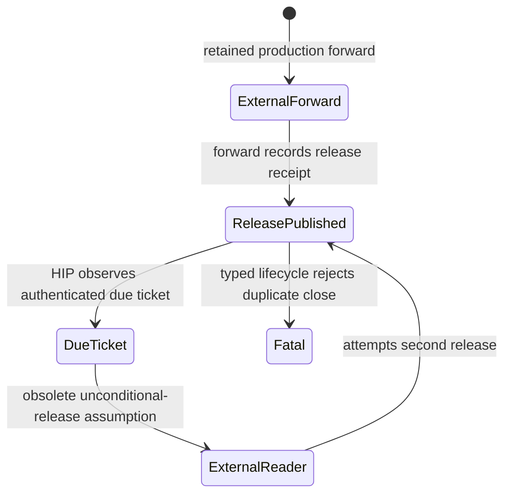
```mermaid
stateDiagram-v2
    [*] --> ExternalForward: retained production forward
    ExternalForward --> ReleasePublished: forward records release receipt
    ReleasePublished --> DueTicket: HIP observes authenticated due ticket
    DueTicket --> ExternalReader: obsolete unconditional-release assumption
    ExternalReader --> ReleasePublished: attempts second release
    ReleasePublished --> Fatal: typed lifecycle rejects duplicate close
```

No new lease state is required. The repair adds one total action classifier and
claims the boundary while holding the existing `Submission` authority:

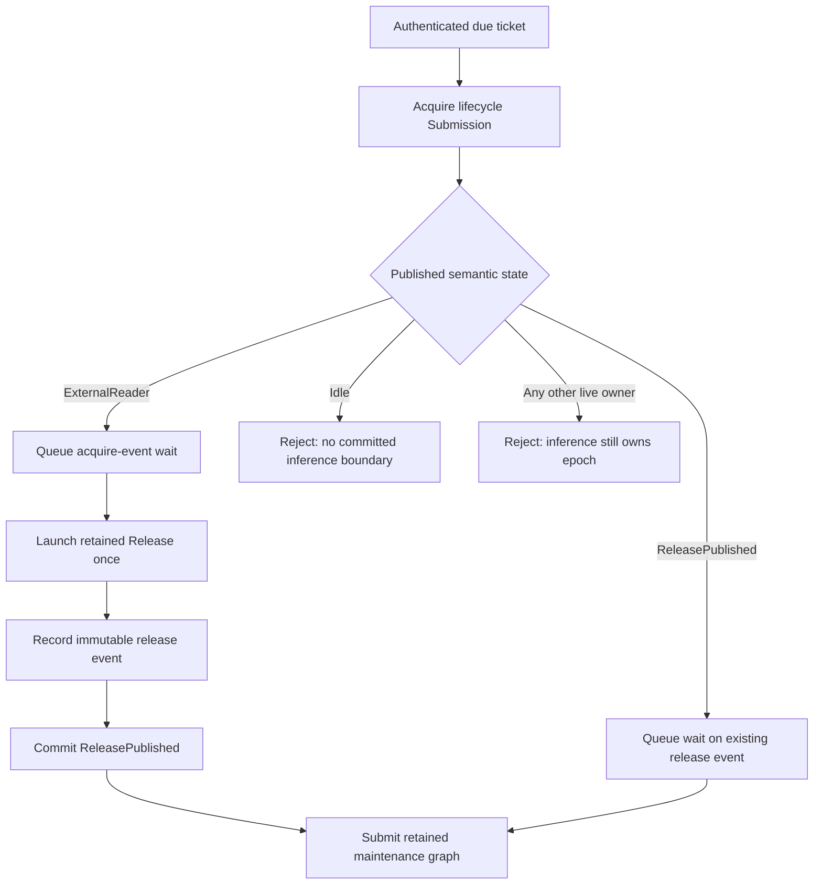
```mermaid
flowchart TD
    A[Authenticated due ticket] --> B[Acquire lifecycle Submission]
    B --> C{Published semantic state}
    C -->|ExternalReader| D[Queue acquire-event wait]
    D --> E[Launch retained Release once]
    E --> F[Record immutable release event]
    F --> G[Commit ReleasePublished]
    C -->|ReleasePublished| H[Queue wait on existing release event]
    C -->|Idle| X[Reject: no committed inference boundary]
    C -->|Any other live owner| Y[Reject: inference still owns epoch]
    G --> I[Submit retained maintenance graph]
    H --> I
```

Ordinary inference release and the authenticated writer now share one private
release-submission primitive, so their wait/launch/record/commit recipe cannot
drift. The strict inference release remains non-idempotent. Maintenance merely
joins an existing immutable event when the forward already closed the reader;
there is no stream synchronization, host state mirror, retry fallback, or
second release. The former `boundary_already_published` boolean is replaced by
`MoEOverlayEpochMaintenanceBoundarySource`, which states whether the graph
launch dependency owns the edge or an authenticated dispatch ticket already
claimed it.

#### Release-receipt payload ownership correction (2026-08-22)

The 20-cell 122B campaign reached Dynamic/random/dynamic-depth after eighteen
green cells, then exposed a still-smaller torn observation. The lifecycle state
was atomic, but the exact stream which had recorded the persistent release
event remained a separate raw DGO field. Background maintenance performed an
early non-owning preflight, joined the other inference publications, and then
read that state and field without submission authority. Concurrent admission of
the next forward could consume the release, clear the raw stream, and only then
commit its successor state:

```mermaid
sequenceDiagram
    participant M as Maintenance observer
    participant L as Atomic lease state
    participant P as Raw release-producer stream
    participant A as Next inference acquire

    M->>L: read ReleasePublished
    A->>L: lock Submission; still ReleasePublished
    A->>P: clear pointer after enqueueing event wait
    M->>P: read null while state still says ReleasePublished
    M-->>M: fatal incomplete release receipt
    A->>L: commit next inference owner
```

This was not a missing wait and cannot be repaired by retrying the maintenance
epoch. `ReleasePublished` means that both the event and its exact producer are a
complete immutable receipt; representing either component separately makes an
invalid state expressible.

`MoEOverlayEpochLeaseLifecycle` now owns the producer stream as the payload of
that typed state. `Submission::publishRelease(stream)` is the only transition
into `ReleasePublished`, rejects a null stream, and publishes the payload/state
pair under the existing finite enqueue lock. A transition to any successor
clears the receipt under that same authority. Consumers obtain it only through
`Submission::publishedReleaseProducerStream()`:

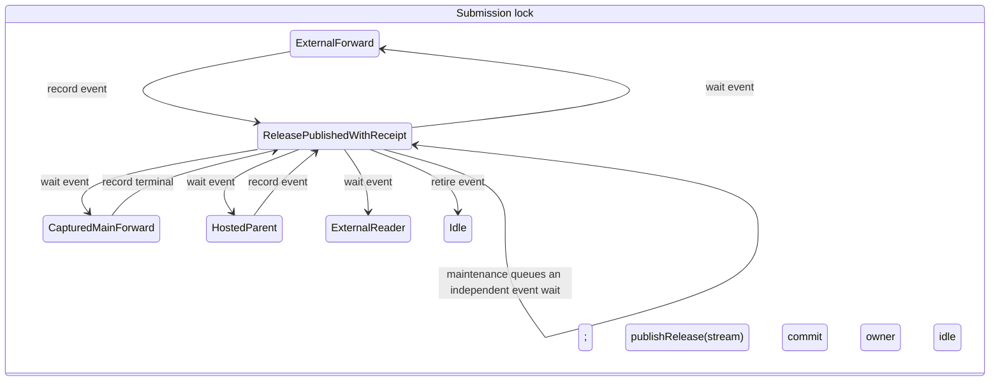
```mermaid
stateDiagram-v2
    state "Submission lock" as S {
        ExternalForward --> ReleasePublishedWithReceipt: record event; publishRelease(stream)
        CapturedMainForward --> ReleasePublishedWithReceipt: record terminal; publishRelease(stream)
        HostedParent --> ReleasePublishedWithReceipt: record event; publishRelease(stream)
        ReleasePublishedWithReceipt --> ExternalReader: wait event; commit owner
        ReleasePublishedWithReceipt --> ExternalForward: wait event; commit owner
        ReleasePublishedWithReceipt --> HostedParent: wait event; commit owner
        ReleasePublishedWithReceipt --> CapturedMainForward: wait event; commit owner
        ReleasePublishedWithReceipt --> Idle: retire event; commit idle
        ReleasePublishedWithReceipt --> ReleasePublishedWithReceipt: maintenance queues an independent event wait
    }
```

Maintenance holds this lock only while it snapshots the semantic state and
queues one `streamWaitEvent`; it never waits for device completion. The next
acquire may briefly wait for those host API calls, then independently consumes
the same multi-consumer event. The former DGO release-stream shadow is removed.
The adversarial device-free regression holds a maintenance observation open
while a concurrent acquire attempts to retire the receipt and proves that the
acquire sees the complete old pair before committing the complete successor;
generic `commit(ReleasePublished)` and null receipts are rejected.

The exact Static failure exposed one further distinction: binding a ledger
pointer is not evidence that a captured graph contains its producer. Static
ordinary prefill bound `runtime_layer.route_participant_ids` into the mapped
reducer while a Dynamic-only condition omitted the runtime grouping publisher.
Remote routes consequently read zero/stale participant IDs instead of the
required `-1` external-domain sentinel. The graph now derives production from
one typed shape role, independent of placement policy:

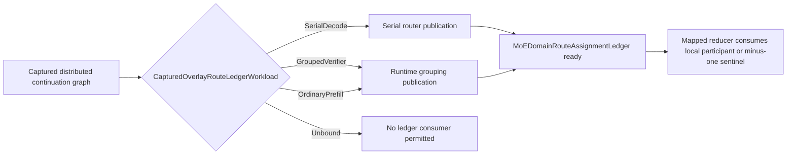
```mermaid
flowchart LR
    A[Captured distributed continuation graph] --> B{CapturedOverlayRouteLedgerWorkload}
    B -->|SerialDecode| C[Serial router publication]
    B -->|GroupedVerifier| D[Runtime grouping publication]
    B -->|OrdinaryPrefill| D
    B -->|Unbound| X[No ledger consumer permitted]
    C --> E[MoEDomainRouteAssignmentLedger ready]
    D --> E
    E --> F[Mapped reducer consumes local participant or minus-one sentinel]
```

This is deliberately a graph-shape role rather than a Static/Dynamic/LLEP
branch. All policies must publish the same reducer input contract. The focused
source regression rejects a return to a policy-gated producer, and the exact
Qwen 3.5 122B Static/Ordinal/MTP1 CUDA2/ROCm4 rerun completed in 38.124 seconds
with every checkpoint and recursive MTP CSV proof green.

### Final route-publication re-audit (2026-08-20, post-proof)

The exact 122B Dynamic CUDA2/ROCm4 campaign localized a smaller split authority
inside one MoE layer. Expert execution and heterogeneous packet dispatch read a
request-pinned device placement bank, but the mapped continuation reducer could
still reconstruct ownership from the setup-time map. Dynamic movement therefore
made execution follow epoch `E+1` while reduction followed startup placement.

The first simplification pass correctly removed the setup-owner branch, but it
used the ambiguous name `DeviceRouteAssignmentLedger` for two different
relations. The green real-weight rerun exposed that they cannot be collapsed:

| Typed value | Cardinality | ID namespace | Lifetime | Meaning |
|---|---:|---|---|---|
| `MoEOverlayRoutePlacementDeviceBinding` | one entry per expert in each of two durable banks | overlay-wide global participant ID | residency epoch, selected by the immutable request ticket | Which domain/endpoint owns the expert payload |
| `MoEDomainRouteAssignmentLedger` | one entry per live router slot | participant index local to the continuation domain, or `-1` | one layer invocation | Which continuation participant executes the local row; `-1` means the heterogeneous return supplies it |

These are two projections of one pinned epoch, not two authorities. The durable
bank answers inter-domain placement. The route ledger applies optional
invocation-local scheduling only after that placement has selected the
continuation domain. Merging the ID spaces would make `-1` look like missing
placement and would prevent future LLEP from choosing an eligible replica inside
the domain without mutating durable ownership.

The proven production lifecycle is now:

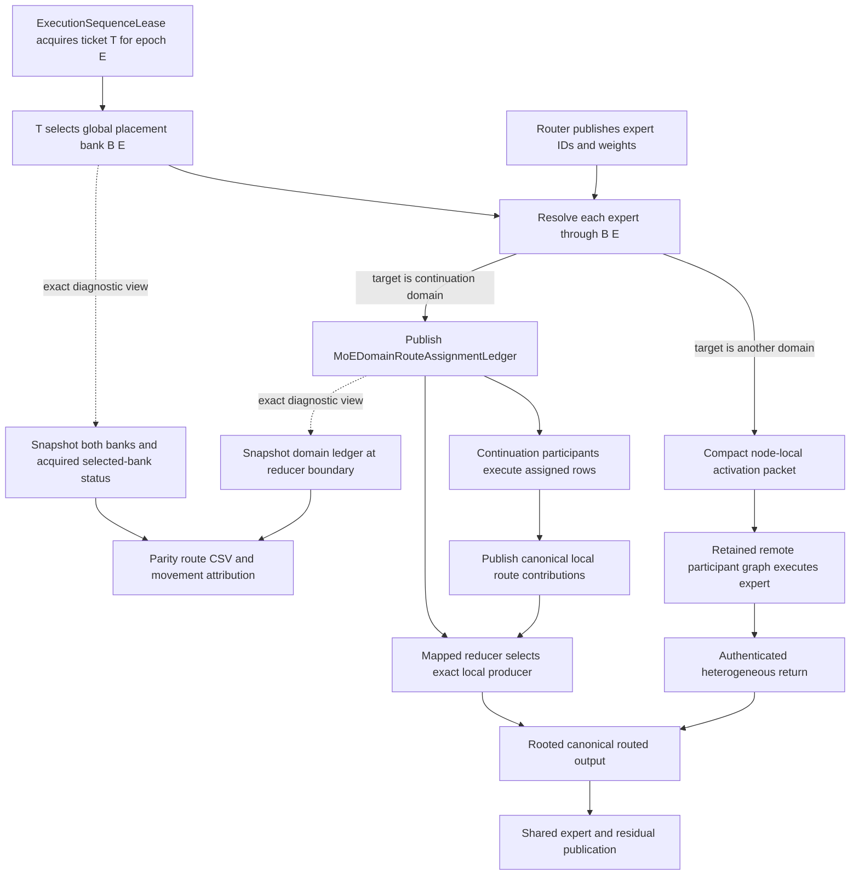
```mermaid
flowchart TB
    A[ExecutionSequenceLease acquires ticket T for epoch E] --> B[T selects global placement bank B E]
    C[Router publishes expert IDs and weights] --> D[Resolve each expert through B E]
    B --> D

    D -->|target is another domain| R1[Compact node-local activation packet]
    R1 --> R2[Retained remote participant graph executes expert]
    R2 --> R3[Authenticated heterogeneous return]

    D -->|target is continuation domain| L1[Publish MoEDomainRouteAssignmentLedger]
    L1 --> L2[Continuation participants execute assigned rows]
    L2 --> L3[Publish canonical local route contributions]
    L1 --> L4[Mapped reducer selects exact local producer]
    L3 --> L4

    L4 --> M[Rooted canonical routed output]
    R3 --> M
    M --> N[Shared expert and residual publication]

    B -. exact diagnostic view .-> X[Snapshot both banks and acquired selected-bank status]
    L1 -. exact diagnostic view .-> Y[Snapshot domain ledger at reducer boundary]
    X --> Z[Parity route CSV and movement attribution]
    Y --> Z
```

There is one authority and one ordering chain:

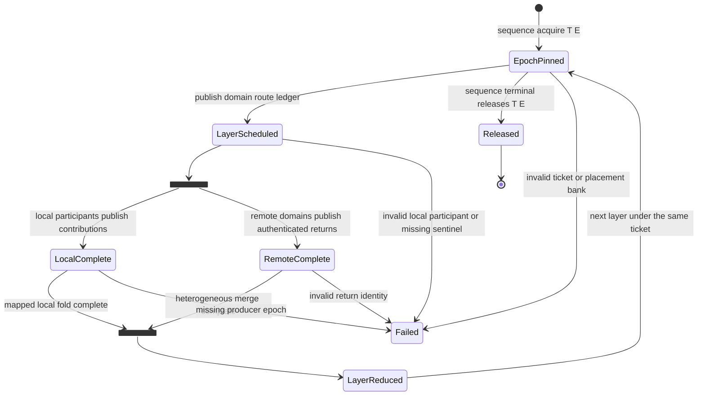
```mermaid
stateDiagram-v2
    [*] --> EpochPinned: sequence acquire T E
    EpochPinned --> LayerScheduled: publish domain route ledger
    state WorkFork <<fork>>
    state WorkJoin <<join>>
    LayerScheduled --> WorkFork
    WorkFork --> LocalComplete: local participants publish contributions
    WorkFork --> RemoteComplete: remote domains publish authenticated returns
    LocalComplete --> WorkJoin: mapped local fold complete
    RemoteComplete --> WorkJoin: heterogeneous merge complete
    WorkJoin --> LayerReduced
    LayerReduced --> EpochPinned: next layer under the same ticket
    EpochPinned --> Released: sequence terminal releases T E
    Released --> [*]
    EpochPinned --> Failed: invalid ticket or placement bank
    LayerScheduled --> Failed: invalid local participant or missing sentinel
    LocalComplete --> Failed: missing producer epoch
    RemoteComplete --> Failed: invalid return identity
```

The cutover is deletion-oriented and now installed:

| Former ambiguity | Installed replacement | Deleted assumption |
|---|---|---|
| `MoENodeLocalRouteAssignmentSource` and policy-selected reducer inputs | One `MoEDomainRouteAssignmentLedger` input | Reducer selection between setup owner and runtime ledger |
| Generic `DeviceRouteAssignmentLedger` name | Explicit global placement binding plus explicit domain ledger | One participant-ID namespace across domains and local collectives |
| Uploaded setup owner table and routing-index reconstruction | Ticket-selected durable device banks | Host topology as live placement evidence |
| Treating every negative local entry as an error | Typed `-1 == another overlay domain` protocol value | Local ledger as an overlay-wide owner map |
| Reading the runtime's newest `active_bank` for diagnostics | Acquired request status selects bank zero or one | Background publication cannot change the bank attributed to an in-flight request |
| Mode-aware reducer branches | Static/Dynamic publish the same typed inputs; future LLEP must do likewise | Reducer knowledge of Static, Dynamic, or LLEP policy |

The exact rerun proves the distinction with real weights and the production
graph: global participants `0..5` all receive routes, domain participants `0`
and `1` receive continuation-local routes, `-1` covers all ROCm-domain routes,
the selected durable bank is recorded per row, committed movement includes
promotion/demotion and same-priority edges, every prefill checkpoint passes,
incremental decode passes 4/4, and MTP1 passes. The CSV keeps `participant` as
the global ID and adds `domain_participant` and `selected_placement_bank`.

### Deferred device-plan RCU re-audit (2026-08-23)

The Qwen 3.6 Dynamic/Random/depth-15 campaign exposed one remaining violation
of the two-bank contract in the homogeneous device controller. A deferred
planning kernel used the inactive durable bank as temporary policy scratch.
That bank was not a candidate yet: physical arrivals had not completed, and it
could still be the retiring bank selected by a live request. A second defect in
the same path copied only the domain-local destination ID into the eventual
bank, leaving the overlay-wide sparse-route owner stale after movement.

The fix does not add a lifecycle phase. It makes the existing phases own
different typed storage:

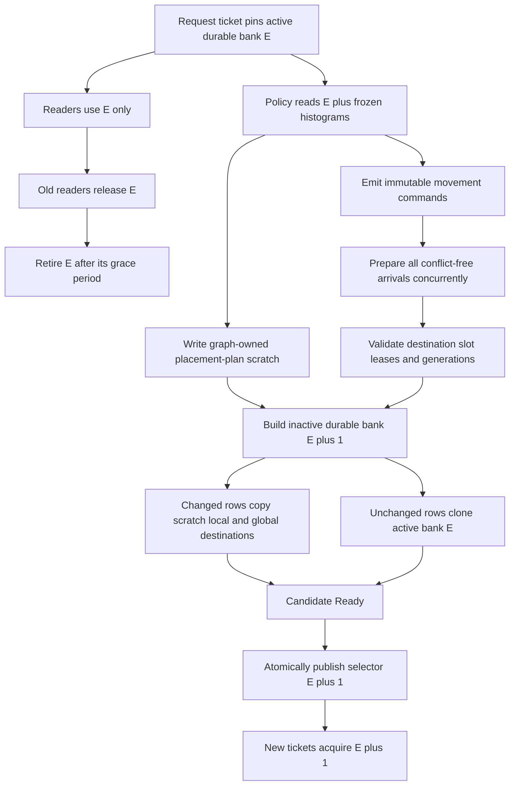
```mermaid
flowchart TB
    A[Request ticket pins active durable bank E] --> R[Readers use E only]
    A --> P[Policy reads E plus frozen histograms]
    P --> S[Write graph-owned placement-plan scratch]
    P --> C[Emit immutable movement commands]
    C --> T[Prepare all conflict-free arrivals concurrently]
    T --> V[Validate destination slot leases and generations]
    S --> B[Build inactive durable bank E plus 1]
    V --> B
    B --> B1[Changed rows copy scratch local and global destinations]
    B --> B2[Unchanged rows clone active bank E]
    B1 --> Q[Candidate Ready]
    B2 --> Q
    Q --> U[Atomically publish selector E plus 1]
    U --> N[New tickets acquire E plus 1]
    R --> G[Old readers release E]
    G --> X[Retire E after its grace period]
```

The storage states are deliberately non-interchangeable:

```mermaid
stateDiagram-v2
    [*] --> ScratchFree
    ScratchFree --> ScratchPlanned: policy derives candidate
    ScratchPlanned --> ScratchFree: zero movement or abort
    ScratchPlanned --> CandidateBuilding: authenticated arrivals ready
    CandidateBuilding --> CandidateReady: changed and unchanged rows complete
    CandidateBuilding --> Failed: lease generation or route identity mismatch
    CandidateReady --> Published: selector flips once
    Published --> RetiringOld: new readers use candidate
    RetiringOld --> ScratchFree: old readers drain and old bank is reusable
    Failed --> [*]
```

`DeviceMoEPlacementBank` scratch is graph-owned persistent memory and is part of
capture identity; it is neither a third durable bank nor a host mirror. The
immutable `DeviceMoERebalancePlanEntry` carries both
`destination_participant` (domain-local execution ID) and
`destination_overlay_participant` (overlay-wide sparse endpoint). Apply is the
only writer that converts those planned values into durable placement. CUDA and
ROCm use the same ABI and byte-size assertions, and focused real-device tests
hold the active bank constant through planning before proving the changed row,
global route, and untouched-row clone after apply.

### MTP controller and maintenance-boundary composition (2026-08-23)

Adaptive MTP depth and ExpertOverlay maintenance are independent device-owned
policies, but they share one irreducible transaction boundary. A maintenance
deadline may limit the token budget of the next generation transaction so a
new placement epoch can be published. The MTP depth controller correctly
rejects that clipped transaction as an economics sample: learning from work the
scheduler prevented it from attempting would bias the selected depth. With an
initial and recurring maintenance cadence of one token, however, every MTP
transaction is clipped and the adaptive controller can never observe a window.

The typed composition rule is:

```mermaid
flowchart LR
    A[Request admitted] --> B{Maintenance due?}
    B -->|yes| C[One bounded serial-visible transaction]
    C --> D[Publish or complete movement epoch]
    B -->|no| E[Admit full-budget MTP transaction]
    D --> E
    E --> F[Predictor rows plus one grouped verifier]
    F --> G{Budget limited?}
    G -->|yes| H[Do not train adaptive depth]
    G -->|no| I[Publish one adaptive-depth window]
    I --> J[Next maintenance boundary remains eligible]
    H --> J
```

The canonical proof therefore keeps two concerns explicit. Its original
stop-isolated transaction proves every recursive checkpoint and emitted token
against the serial oracle. A fresh prefix-restored request then retires the
initially due movement with one ordinary token and runs one complete verifier
under a recurring cadence at least as wide as the declared verifier
transaction. The second transaction must be serial-token exact and must
increase the controller-window, attempted-draft, and verifier counters. Those
facts are emitted in `mtp_transactions.csv`; a physical depth-15 run without an
adaptive policy window is not accepted as dynamic-depth coverage. This is a
test-profile economy choice, not a magic production cadence: serving policy may
choose a wider interval, but it may not configure a cadence that makes its
selected MTP policy structurally unable to execute.

### Terminal-hidden mailbox lifecycle re-audit (2026-08-24)

The 122B CUDA2/ROCm4 Static/Ordinal/depth-1 prefix-restored cell localized a
failure outside ExpertOverlay placement. A resident shifted-KV correction
sidecar consumed the stable `PREFIX_TERMINAL_HIDDEN` arena mailbox and then
tried to reconstruct that same row from `last_forward_seq_len` and
`last_forward_batch_size`. A full prefix hit or retained device-generation
continuation legitimately has no fresh host-visible verifier geometry, so the
reconstruction failed even though the correct row was already resident.

The former effective lifecycle contained an unnecessary destructive edge:

```mermaid
flowchart LR
    A[Main forward, prefix restore, verifier, or checkpoint] --> B[Publish terminal-hidden mailbox]
    B --> C[Acquire logical-state reader]
    C --> D[Sidecar reads terminal hidden and appends shifted KV]
    D --> E[Infer producer rows from last-forward host geometry]
    E --> F[Reselect terminal hidden into the same mailbox]
    F --> G[Release logical-state reader]
    E -->|no current geometry| X[Fatal despite valid resident publication]
```

There is no reason for `E` or `F`. The production MTP graph is declarative and
every dense, MoE, and ExpertOverlay sidecar stage declares
`PREFIX_TERMINAL_HIDDEN` as read-only. The simplified lifecycle therefore owns
one typed publication and one immutable read lease:

```mermaid
stateDiagram-v2
    [*] --> Unavailable
    Unavailable --> Current: typed producer publishes source plus generation

    state "Current publication: MainForward, PrefixRestore, AcceptedVerifier, or CheckpointRestore" as Current {
        [*] --> PublishedGeneration
        PublishedGeneration --> SidecarReadLease: acquire source plus generation
        SidecarReadLease --> PublishedGeneration: read-only graph and same generation
    }

    Current --> Unavailable: reset or live-state mutation
    Current --> Current: another typed producer publishes next generation
```

`MTPTerminalHiddenPublication` makes source and generation explicit. A sidecar
acquires a `ReadLease`, queues the existing producer-event wait and graph work,
then verifies that the publication generation did not change before releasing
the logical-state reader. Graph construction fails if any sidecar stage writes
the mailbox. No selector, host geometry, copy, recapture, or synchronization is
introduced after the read. Focused orchestrator, graph-construction, and source
policy tests prove the typed transitions and the read-only contract; the exact
real-weight mixed-vendor cell remains the production re-certification gate.

### Depth-15 oracle and optimization-status lifecycle re-audit (2026-08-24)

The historical `0.981` depth-15 observation did not identify a backend
arithmetic defect. The serial oracle request and grouped-MTP request were
independent production requests while Dynamic maintenance remained live. A
legal publication could therefore place them on different residency epochs.
The old diagnostic compared those different experiments as if they shared one
execution epoch, then attributed the resulting branch drift to numerical
lowering. That edge was invalid.

The invalid comparison was:

```mermaid
flowchart LR
    A[Serial request acquires epoch E] --> B[Capture serial token and row]
    B --> C[Background maintenance publishes E plus 1]
    C --> D[Grouped MTP request acquires E plus 1]
    D --> X[Unconditional serial versus grouped comparison]
    X --> F[False numerical failure]
```

No additional MTP, graph, or placement state is needed. Each existing
`ExecutionSequenceLease` already publishes the exact placement epoch it
consumed. The corrected proof records that authority beside every serial and
grouped row and only claims serial equivalence when the epochs match:

```mermaid
flowchart TB
    S[One-token serial production request] --> SE[Authenticated execution epoch Es]
    S --> SR[Serial token and main-model snapshots]
    G[Grouped production MTP request] --> GE[Authenticated execution epoch Eg]
    G --> GR[Grouped tokens and verifier snapshots]

    SE --> Q{Es equals Eg}
    GE --> Q
    Q -->|yes| X[Require exact serial token trajectory and row-zero comparison]
    Q -->|no| N[Record epoch mismatch; make no serial-equivalence claim]

    GR --> H[Always compare eligible main and recursive checkpoints with Hugging Face]
    SR --> X
    X --> C[Write token and checkpoint CSV evidence]
    N --> C
    H --> C
```

This removes one false edge instead of adding a lifecycle. The strict aggregate
gate is now `0.99`, and the exact Qwen 3.5 122B ROCm+CPU
Dynamic/Ordinal/fixed-depth-15 production cell passes it with real movement,
prefix restore, grouped verification, and the canonical CSV artifacts. A
future placement-invariant arithmetic project still needs concrete divergent
same-input/same-weight evidence; this incident is not that evidence.

The same audit found that parity setup used PerfStats counters to decide when
economy certification and movement had completed. PerfStats is a diagnostic
sink and can be disabled or filtered, so it cannot be a lifecycle authority.
`MoEOptimizationStatus` is now a passive typed projection of the sole real
owner:

```mermaid
stateDiagram-v2
    [*] --> NotApplicable: no ExpertOverlay authority
    [*] --> MovementDisabled: Static authority
    [*] --> LearningEconomy: Dynamic authority not yet certified
    LearningEconomy --> Active: immutable economy profile installed
    LearningEconomy --> Failed: certification or publication fails
    Active --> Active: durable movement wave publishes
    Active --> Failed: owning maintenance/controller fails

    state Active {
        [*] --> OwnerState
        OwnerState --> OwnerState: publish monotonic wave and movement totals
    }
```

Host status reads the RCU residency authority and physical transport. Device
status reads the device-controller fabric and its physical follower's coherent
completion totals. `IOrchestrationRunner`, `IInferenceRunner`, and the public
adapter preserve that status without polling or advancing maintenance. The
benchmark delimits each request with two typed owner snapshots; it no longer
reconstructs transactions, commands, bytes, promotions, demotions, or
same-priority moves from telemetry. Static reports zero completed movement by
construction.

```mermaid
flowchart LR
    H[Host residency authority] --> O[MoEOptimizationStatus]
    D[Device controller authority] --> O
    O --> P[Parity lifecycle driver]
    O --> B[Benchmark interval attribution]

    H -. post-run evidence only .-> T[PerfStats and CSV export]
    D -. post-run evidence only .-> T
    P -. assertions only .-> T
    B -. result serialization only .-> T
```

There is deliberately no arrow from PerfStats back to certification, movement,
publication, request admission, or benchmark accounting. A source-policy gate
allows production ledger reads only in result serialization and the collector
itself. Tests may still assert PerfStats because it proves that the optimized
path ran; those assertions observe completed work and never cause it.

Floating expert movement is covered symmetrically under this lifecycle. The
CPU physical fabric runs repeated RCU publication and shadow-slot reuse for
FP16, BF16, and FP32, while the real CUDA/ROCm integration runs every format in
both directions through retained relay and remote endpoint paths with byte-exact
publication and no blocking inference waits.

The completed ExpertOverlay system keeps the most frequently selected routed experts in the tiers
with the greatest compute capacity and demotes colder experts when residency is
rebalanced. The live tiers are the source and destination of every movement;
the model loader is not a migration fallback and the runtime does not retain a
second host copy of accelerator-owned weights.

A rebalancing integration is evidence only when it proves all of the following:

- routing histogram evidence changed the selected residency;
- complete gate/up/down weights moved directly from the old tier to the new;
- an immutable residency epoch was published only after destination prepare;
- inference continued issuing tickets while the candidate epoch was prepared;
- every CPU participant prepared immutable banks off-path and published them by
  fixed-slot atomic pointer stores, with no inference-visible writer lock;
- no inference stream synchronized with or joined a migration stream;
- dispatch tickets used exactly one epoch from dispatch through final return;
- old owners were retired only after publication and that old epoch's leases
  drained;
- all required domain, rank, backend, conversion, and byte counters appeared in
  `PerfStats`;
- Static residency ran the same maintenance check and produced zero movement;
- logits and stage checkpoints retained the canonical parity CSV contract.

The protocol applies to decode and bucketed captured prefill, plus grouped MTP
verification when MTP is enabled. Decode and prefill are universal certified
phases. Grouped-verifier service and interference evidence is required only for
an MTP-enabled instance; an MTP-disabled certificate retains exact zero in that
column, and later grouped demand is fatal. Ordinary CUDA-only and ROCm-only
production cells, plus CUDA MTP, remain one complete captured graph. HIP MTP
retains complete captured transaction graphs and crosses only the authenticated
fixed-size scheduler-ticket boundary; this is neither eager replay nor
segmentation. Segmentation is permitted only at declared heterogeneous
ExpertOverlay boundaries.

## Universal multi-device MoE authority

ExpertOverlay is not a synonym for heterogeneous execution or for movement
between differently prioritized tiers. It is the placement, residency, and
publication authority for **every** MoE execution cell with more than one
physical participant. A one-domain, one-tier cell is the simplest valid
ExpertOverlay topology: every expert's tier index remains unchanged, so it has
no promotions or demotions, while participant ownership, resident replicas,
and current-batch work assignment may still change.

The production rule is structural:

```text
one physical MoE participant  -> direct single-device residency
two or more MoE participants  -> exactly one ExpertOverlay authority
```

No graph in the second row may construct a legacy domain controller, publish a
second ownership epoch, or infer placement from graph-construction order. CLI,
YAML, and programmatic configurations that name one multi-participant domain
are normalized during topology planning to one tier with an explicit integer
priority and exact physical budgets. This normalization is canonical topology
resolution, not a runtime fallback and not a hidden compatibility mode.

The authority owns four related but distinct decisions:

1. **Tier membership:** which priority tier contains each logical expert.
   One-tier cells keep this vector constant.
2. **Durable participant residency:** the exact owner and any bounded durable
   replicas inside the selected tier/domain. Histogram-driven skew correction
   changes this state through the ordinary `E -> E+1` RCU transaction.
3. **Request-scoped LLEP residency and assignment:** one topology-wide plan of
   temporary complete expert copies and routed-row destinations for one
   ordinary-prefill transaction. It may use several tier domains, but every
   lease is based on one durable epoch and no child arrival becomes the next
   durable owner map implicitly.
4. **Execution publication:** one immutable epoch identity consumed by main
   decode, ordinary prefill, grouped verification, MTP sidecars, and prefix
   restore. Every physical transfer finishes before the relevant durable or
   request-scoped publication becomes visible.

`Off`, `Observe`, and `Dynamic` are maintenance policies of this authority,
not selectors for different controller implementations. Static/Off still
constructs the authority and runs its immobility check. Observe records the
same evidence and candidate diagnostics without moving bytes. Dynamic may
produce cross-tier cycles, same-tier participant cycles, replica changes, or
any combination admitted by the fixed capacity and economy contracts.

### Authority execution locus

The topology chooses where the one authority executes; it never chooses a
second authority. Authority ownership follows live state ownership rather than
tier count, rank count, or vendor homogeneity:

```text
all live routed-expert participants are GPUs -> device-resident authority
one or more live routed-expert participants are CPUs -> host-resident authority
```

An all-GPU cell uses one topology-wide device authority for Static, Dynamic,
and LLEP. A topology-selected leader GPU owns the canonical histogram banks,
policy state, durable owner map, request-local LLEP leases, and epoch CAS.
Other GPUs run device-resident follower controllers that validate commands,
prepare their inactive banks, publish readiness, acquire the selected epoch,
and retire old banks. Followers never choose placement or publish an
independent epoch. Single-tier homogeneous execution is merely the degenerate
case in which every follower uses one native collective and tier membership
cannot change.

Multiple priorities, ranks, CUDA/ROCm mixtures, and host-staged GPU byte paths
do not transfer policy ownership to the CPU. The leader and followers exchange
fixed device-owned control records through a topology-certified GPU-visible
control fabric. On this node that may be native NCCL/RCCL inside a homogeneous
domain and the node-local mapped activation/control channel between domains.
The host may progress a transport API or submit the captured transaction named
by an authenticated HIP ticket; it may not reduce histograms, evaluate economy,
mirror an owner map, select a branch, or publish an epoch. Node-local mapped
control is explicitly ineligible for a multi-node edge. An all-GPU topology
without a certified device-visible controller transport fails setup rather
than falling back to host policy.

When any routed-expert participant is CPU-owned, the one ExpertOverlay RCU
authority is host-resident. It composes CPU state, capacity budgets, GPU/CPU
format conversion, arbitrary transfer domains, and cross-rank consensus.
Device components remain exact physical executors and ticket consumers under
that authority; no legacy GPU Dynamic/LLEP controller may continue making
decisions beside it.

In both loci, histogram windows, policy decisions, epoch publication, and all
mutable MTP/decode state have exactly one owner. The graph API determines only
how a device-selected branch is submitted: CUDA composes a native conditional
parent; HIP publishes one immutable 48-byte scheduler ticket and the host
submits the already-captured transaction named by that ticket.

The backend implementations are intentionally asymmetric at the graph-control
boundary. CUDA has a native conditional MTP parent. The installed HIP graph
surface has no conditional nodes, so ROCm uses a first-class ticket-selected
captured-transaction policy. Certification requires graph-family
materialization, the exact 48-byte `immutable_scheduler_snapshot` with
`state_payload=false`, authenticated decisions, per-device transaction and
terminal submissions, controller/compact-reducer ledger equality, no
intermediate host state materialization, and either a standalone device launch
or a rank launch proving every participant was submitted before the next ticket
wait. `production_path.csv` keeps `full_graph_*` false for this policy while
requiring `forward_full_graph_*`, `hosted_ticket_boundary_certified`, and
`generation_loop_certified`; it never relabels the captured transactions as a
native parent.

### Same-tier skew objective

Tier-only optimization is insufficient for an apportioned domain. Equal expert
counts can leave one participant with nearly all routed work when its experts
are disproportionately popular. Candidate construction must therefore solve
for exact physical participants, not derive owners afterward from ordinal or
random expert order.

For each layer, the planner assigns experts to participant vertices. Each
vertex inherits its tier membership, exact resident-slot/byte quota, measured
phase service costs, and compute-capacity weight. The objective first respects
the fixed tier quotas and then minimizes projected service time and normalized
participant load using the frozen decode/prefill/grouped histogram. Incumbent
ownership is the deterministic movement-cost tie-break. A capacity-preserving
pair or cycle within one tier is a `SamePriority` migration: it increments no
promotion or demotion counter but must increment explicit same-tier and
same-domain movement evidence.

Owner swaps address divisible aggregate skew without increasing residency.
When one indivisible expert dominates a participant, an optional bounded
durable replica is the only way to distribute that expert's rows. Replica
slots are part of the immutable epoch, charged by the physical capacity plan,
and published by the same transaction. An independent hot-cache table is not
another authority.

Replicated domains already retain every complete expert and ordinarily need
only row reassignment. Tensor-sharded domains retain one collective shard group
per expert; they participate in the authority and epoch protocol, but a whole
expert owner swap is inapplicable unless the declarative topology first changes
the residency representation. These distinctions are typed compute policies,
not reasons to bypass the authority.

### LLEP interaction

Current-batch LLEP is an authority-owned child transaction rather than another
placement authority. Multi-tier LLEP is not one independent planner per tier:
that decomposition cannot decide whether copying one batch-dominant expert to
another priority tier beats leaving that endpoint idle, and the planners could
compete for the same transient capacity. The ExpertOverlay authority instead
pins durable epoch `E` and constructs one request-wide ordinary-prefill plan
over every eligible endpoint.

The candidate set has three cost classes:

1. execute on a durable owner or replica that already holds the expert;
2. create a request-scoped copy on another participant in the same tier; or
3. create a request-scoped copy in another priority tier, including any
   required cross-domain transfer and GPU/CPU repack.

The planner always considers already-resident execution first because it has
no weight-readiness edge, but this is an optimization tie-break rather than a
separate mode. A same-tier or cross-tier arrival is accepted only when an exact
batch-local model predicts a lower critical-path prefill makespan after charging
weight preparation, transfer/repack, activation dispatch/return, and measured
destination service. The comparison uses this batch's real routed-row counts
and request-scoped payoff; it must not borrow Dynamic's multi-request
amortization horizon. A cross-priority copy is therefore possible for a long or
highly skewed prefill and naturally rejected for a short batch whose transfer
cannot pay back.

Integer tier priority remains the durable capacity-fill order and deterministic
final tie-break. It is not a rule that forces a request-local row onto a lower
numeric priority when measured batch completion would be worse. Likewise, an
LLEP copy across priorities is recorded as a `transient_cross_priority_arrival`,
not as a promotion or demotion: it neither changes tier quota nor advances the
durable placement epoch.

The transaction reserves separately budgeted temporary slots, transfers every
missing complete expert through concurrent transport lanes, publishes one
immutable request-local assignment, executes, and releases the slots after the
last return. The current request cannot consume a missing expert until that
payload is complete, so materialization remains on the prefill dependency DAG
even though independent conversions, transfers, and resident expert work may
overlap. Decode and grouped MTP verification continue to use durable epoch `E`.

Dynamic consumes logical expert demand before LLEP destination rewriting. This
prevents a successful transient balance from hiding the durable owner skew that
should be repaired in a later epoch. An `E+1` maintenance wave may prepare and
publish while the LLEP transaction executes, but retirement and slot recycling
for `E` wait for both durable inference readers and LLEP leases. Durable shadow
arrivals, request-scoped arrivals, and retiring epochs have disjoint admitted
slot pools even when their event-ordered transfer streams overlap.

The current implementation has only the one-domain subset of this contract.
`tryAcquireCurrentBatchLLEPLease()` rejects a layer when any durable expert
owner lies outside the requested domain, and the GPU fast path likewise plans
one LocalTP domain. Multi-tier LLEP therefore requires a topology-wide lease,
endpoint/slot catalogue, batch-local economy planner, and heterogeneous
materialization graph; enabling the existing per-domain switch on several
tiers is not a valid substitute.

## Capacity, apportionment, and hotness destination

### Tier identity and ordering invariant

ExpertOverlay has no built-in `hot`, `warm`, or `cold` tier classes. A tier
name is an opaque user label; it is used only for configuration identity,
diagnostics, distributed-plan hashing, and human-readable output. Production
must never branch on a tier name, derive a backend from it, or use declaration
order as a preference tie-break.

Every tier instead has one unique signed integer `priority`. Smaller values are
more preferred, values need not start at zero or be contiguous, and tier index
is stable identity rather than rank. Equal priorities are rejected because
otherwise some second field would silently become the ordering authority. The
optional `fallback` flag is orthogonal coverage responsibility, not a thermal
class: when present it must be on the greatest numeric priority, and it implies
neither CPU placement nor unbounded storage. Terms such as "hot tier" in old
test names or examples are shorthand for a particular configured priority,
never schema values or recognized labels.

### The intended answer

Yes: after setup has resolved exact physical capacities, live experts are
apportioned by filling the lowest-numeric-priority tier first, then the next
priority, and finally the coverage tier. The word "fill" refers to the tier's
resolved **live expert quota**, not every byte of RAM or VRAM. Migration shadow
slots, old-epoch leases, transfer staging, graph workspaces, and KV cache
consume physical memory but are never routable live capacity. There is no
unnamed safety reserve: every excluded byte must have a typed owner and appear
as a concrete term in the bill of materials.

For each routed layer `l`, let `Q[t,l]` be tier `t`'s fixed live logical-expert
quota and `E[l]` the model expert count. Setup must establish:

```text
sum over tiers t of Q[t,l] = E[l]
```

Every expert consequently has exactly one tier, including the least-preferred
tier. A
fallback tier is the final coverage tier; it is not an infinite-memory escape
hatch. Its resolved physical budget must be able to hold the remainder. A plan
whose priority-ordered capacities cannot cover all experts fails before any
graph is built.

Example: if a 256-expert layer resolves to 96 slots at priority `-20`, 64 slots
at priority `7`, and 96 coverage slots at priority `90`, cold start assigns 96
experts to priority `-20`, the next 64 to priority `7`, and the remaining 96 to
priority `90`. The domains could be CUDA, ROCm, CPU, or another supported
combination; the labels do not decide. After routing evidence exists, the 96
most demanded experts belong at priority `-20`, the next 64 at priority `7`,
and the remainder at priority `90`. A newly high-demand expert is promoted
through a capacity-preserving cycle that demotes a lower-demand occupant;
capacities do not change while inference is live.

### Physical memory budget and live quota resolution

Memory is owned by physical participants, not by a tier name. A tier spanning
two GPUs therefore needs one budget and one exact byte bill for each GPU. Two
tiers sharing a physical device must be admitted against one combined device
budget. CPU budgets are NUMA-endpoint budgets; treating all host RAM as freely
fungible would defeat the NodeLocalTP placement contract.

For every physical participant `p`, setup must prove an inequality of this
form using the actual model manifest and destination packing:

```text
fixed[p]
  + transfer_and_shadow[p]
  + sum over layers l of resident_copies[p,l] * expert_bytes[p,l]
  <= usable_budget[p]
```

The terms have exact meanings:

- `usable_budget[p]` is the smaller of the inventory-reported allocatable
  memory and any explicit user limit;
- `fixed[p]` includes continuation/non-expert weights, captured graph arenas,
  activations, KV and prefix-cache reservations, libraries, descriptors, and
  other model-lifetime allocations owned by that participant;
- `transfer_and_shadow[p]` includes the inactive arrival slots needed for RCU
  publication, old/new epoch overlap, bounded conversion buffers, network
  staging, streams, and events;
- `expert_bytes[p,l]` is the exact sum of gate/up/down prepared bytes for one
  expert in layer `l` on that backend. It comes from the GGUF weight manifest
  and the real GPU or CPU packed layout, including scales, minima, extended
  minima, compensation, alignment, and codebook-specific sections;
- `resident_copies[p,l]` follows the domain's compute policy. Apportioned
  domains divide logical experts between participants, replicated/LLEP decode
  domains charge every replica, and tensor-sharded domains charge their exact
  shards rather than pretending a logical expert has one copy.

The capacity resolver chooses the integer vectors `Q[t,l]` once, before weight
preparation and graph materialization. In automatic mode it lexicographically
maximizes live capacity in strict integer-priority order subject to every
physical inequality. Thus it uses all exactly unallocated capacity at each
successive priority and assigns the remainder to the coverage tier. An explicit expert cap is an additional
upper bound, not a substitute for byte admission. An explicitly fixed quota is
either admitted exactly or rejected; setup must not silently shrink it.

The resolved quota may vary by layer when projection geometry or codebook
changes. Runtime migration preserves each `(tier, layer)` quota and each
participant's derived share exactly. Migration shadow and transfer capacity
are planned as named allocations, so increasing concurrency cannot silently
evict live experts. A tier
with zero resolved live slots is inactive for residency; tests expecting
movement through that tier must require a positive quota instead of relying on
its name being present.

### Cold-start selection and ordinal/random ownership

Capacity and membership are distinct from participant ownership:

1. Capacity resolution decides how many logical experts each tier can hold.
2. Cold-start ordering decides which expert IDs initially occupy those quotas.
3. `RoutedExpertOwnerOrder` distributes a tier's selected experts over that
   tier's physical participants.

Without a certified prior histogram/profile, cold start is deterministic. The
default orders expert IDs ordinally across priority-ordered tier quotas. A
seeded-random cold-start policy may randomize tier membership when requested,
but its seed and permutation are part of placement identity. Independently,
ordinal and seeded-random owner order control which participant in a tier owns
each selected expert. Random owner order must never randomize tier priority or
make a cold expert outrank a hot one once histogram evidence exists.

A future persisted routing profile may seed cold start, provided its model,
quantization, topology, phase mix, and profile generation are authenticated.
It is an optimization only: absence or mismatch returns to deterministic cold
start, not to an unproved placement fallback.

### Runtime placement objective

Raw frequency is a useful baseline, but the production objective is expected
inference time saved. The histogram authority must retain separate evidence for
ordinary decode, grouped MTP verification, and real (unpadded) prefill rows.
For an expert `e`, layer `l`, phase `f`, and candidate tier `t`, the planner
uses the measured service cost of that tier for the model's projection shapes
and codebook:

```text
expected_cost[e,l,t] = sum over phases f of
    demand[e,l,f] * service_time[t,l,f]
```

Assignment minimizes total expected cost subject to the fixed quotas. When
tier service costs are monotonically ordered and experts in a layer have equal
size, this reduces to the intuitive rule: sort by phase-weighted demand and
fill `Q[t,l]` in ascending integer-priority order. The explicit priority
remains the capacity-fill authority and final deterministic assignment tie.
It is not an assertion that one backend wins every phase and sparse geometry:
CPU/GPU and GPU/GPU kernels can have legitimate batch-size crossovers. Exact
measured phase service time therefore remains the primary runtime objective.
The engine must preserve and expose a crossover rather than reject it, clamp it
to the configured order, or infer a cost from a device-type label. Operators
who require a different residency preference express it through capacities and
priorities; the optimizer never rewrites those quotas.

Movement itself has a cost. Counts are smoothed across immutable histogram
generations, and an incumbent remains preferred on a deterministic tie. A
candidate cycle is admitted only when its projected service-time gain over the
configured horizon exceeds transfer/repack cost, measured interference, and a
hysteresis margin. Minimum residency generations and a deterministic
expert-ID final tie break prevents occupants from oscillating on noisy
windows. Bounded waves may approach the global target over several epochs;
every admitted wave must have positive predicted benefit and preserve all
capacities. The number of independent closed cycles admitted to one wave is a
configuration policy, not an architectural constant.

### Host-authority service-evidence lifecycle re-audit (2026-08-21)

The graph-native CUDA/CPU Dynamic parity cell reached economy certification
with CPU service evidence but no CUDA evidence. Re-plotting the complete path
shows that service observation does not require another placement or inference
lifecycle. It is one passive data edge from the device-owned inference graph
into the existing host-authority certification lifecycle:

```mermaid
flowchart LR
    subgraph INFERENCE[Production inference on each participant]
        A[Canonical runtime table owns GPU accumulators]
        B[Retained sparse MoE executor]
        C[Begin timestamp marker]
        D[Expert projection kernels]
        E[Finish marker accumulates layer and phase totals]
        A --> B
        B --> C --> D --> E
    end

    subgraph OBSERVATION[Process-local passive observation]
        F[Exact completed inference boundary]
        G[Submit retained snapshot graph]
        H[GPU publishes cumulative rows to mapped seqlock page]
        I[Query exact terminal event]
        J[Decode and import coherent snapshot]
        F --> G --> H --> I --> J
    end

    subgraph CERTIFICATION[Sole host authority]
        K[Local CPU and GPU evidence registry]
        L[Typed topology readiness]
        M[Owner-authenticated MPI evidence exchange]
        N[Compose and seal immutable economy profile]
        O[Movement decisions become eligible]
        J --> K --> L --> M --> N --> O
    end

    E --> H
    P[CPU expert execution records direct host evidence] --> K

    X[Missing canonical observation binding in retained sparse GPU child]
    X -. severs accumulator production .-> B
```

There are two ownership lifecycles, not three. Inference owns the producer
stream and its exact terminal. Certification owns topology-wide readiness,
evidence exchange, and sealing. The publication adapter owns neither policy nor
global progress; it may only observe a completed local inference boundary and
copy cumulative device rows. It must therefore contain no MPI state, placement
decision, calibration mode, histogram policy, or benchmark-visible control.

The adapter's minimum live state machine is:

```mermaid
stateDiagram-v2
    [*] --> AwaitingBoundary
    AwaitingBoundary --> SubmissionQueued: cadence due; enqueue on device worker
    SubmissionQueued --> AwaitingBoundary: inference boundary deferred
    SubmissionQueued --> PublicationInFlight: boundary admitted; graph and event submitted
    PublicationInFlight --> AwaitingBoundary: event ready; coherent generation imported
    AwaitingBoundary --> Stopped: certification froze registry or shutdown began
    SubmissionQueued --> Failed: worker or submission failure
    PublicationInFlight --> Failed: event or seqlock failure
    Stopped --> [*]
    Failed --> [*]
```

`SubmissionQueued` is irreducible because GPU API calls must execute on the
device's worker thread without blocking maintenance. `PublicationInFlight` is
separate because worker submission completion does not imply device completion;
only the exact event permits the host to read the mapped page. The cadence is
data on `AwaitingBoundary`, not another state. `Stopped` and `Failed` are
terminal results, not progress flags.

The failure is below this state machine. A retained `MoELocalExpertStage` child
executes from an epoch-indexed prepared residency bank and therefore correctly
does not receive the complete `IMoERuntimeTable` as another placement
authority. It also received no narrower observation capability, so the exact
production executor called `executeWithoutServiceTelemetry()` and the
publisher correctly snapshotted an accumulator that no graph updated. The fix
is a typed three-pointer view derived by the canonical table: route-count
source, layer accumulator, and sample cursor. The retained child may observe
through that view but cannot select a placement bank or publish runtime state.
No new event, epoch, readiness flag, retry path, calibration round, or
runner-facing option is justified. A focused construction regression and the
failing real-weight Dynamic cell must prove the repaired edge before the matrix
is described as certified.

### Measured economy and asynchronous-overlap contract

The economy certificate prices the production protocol, not an estimated link
bandwidth. Setup builds capacity-preserving reciprocal expert swaps for
representative manifest-equivalent layers. Each attempt first records an
ordinary production inference interval. It then reserves the same physical
lanes used by maintenance, arms an exact-workload concurrent probe, and releases
the transfer only after that live inference ticket reports `Running`. The
candidate bank is never published. All ranks accept a sample only when the
concurrent inference interval wholly contains the transfer stage interval;
otherwise the wave is aborted, cleaned up, and retried with a fresh baseline.
Warmups are discarded and the sealed profile uses robust medians.

For a histogram window containing `W` routed tokens and a configured payoff
horizon `H`, the policy computes:

```text
window_gain = phase-aware service savings - phase-aware service penalties
projected_service_gain = floor(window_gain * H / W)
projected_net_benefit = max(
    0,
    projected_service_gain - transfer_and_repack - interference)
```

A same-priority participant swap uses the reduction in the domain's maximum
participant makespan rather than aggregate tier work, which is unchanged by the
swap. Cross-priority movement uses the demand-weighted difference between the
source and destination phase service costs. The strict admission gate also
requires `projected_net_benefit` to exceed the configured minimum and every
expert to have satisfied its minimum-residency generations.

Cost composition follows the calibration shape. Gate, up, and down projections
run concurrently and one reciprocal two-expert swap is calibrated as one wave.
Its two directed rows therefore contain the same critical path and the cycle is
charged the slower row once, not once per expert. This corrects the former
double charge. A longer cycle, or multiple separately calibrated cycles admitted
to one wave, is conservatively additive today. The destination design is a
typed physical contention graph: each conversion engine, PCIe root, GPU peer
fabric, NUMA memory controller, UPI link, NIC, and maintenance CPU executor is a
resource group; calibrated edge intervals may take a maximum only when their
groups are disjoint or the exact composite wave shape was measured. This is
required before a multi-cycle scheduler may claim a less conservative price.

The homogeneous GPU controller and current-batch LLEP use the same concurrency
rule for their row-based admission floors. CUDA and ROCm compact-transfer waves
price `payload_bucket_requested_slots`, the maximum source-lane payload ordinal,
rather than the global command count. A reciprocal ownership swap therefore
publishes two logical arrivals but has one serialized payload slot. The shared
CPU/CUDA/ROCm LLEP planner now prices the maximum outgoing or incoming payload
count incident on any participant: reciprocal and disjoint edges overlap,
while two sends or receives on one participant remain additive. The offline
trace evaluator uses the identical multiplier and reports both logical
`weight_transfer_count` and `critical_path_transfer_slots`; PerfStats likewise
keeps logical movement separate from critical-path payload width.

This closes the duplicate-edge accounting defect, but the two controller
families still have different evidence classes. Durable ExpertOverlay movement
uses measured nanoseconds and an amortization horizon. Homogeneous device-side
maintenance and request-scoped LLEP currently use configured row/spread floors;
they contain no reservation-to-dispatch clock that can contaminate cost, but
the floors are policy proxies rather than measured time. The destination is a
setup-certified, device-resident GPU cost table and a request-local LLEP
break-even model that compares transfer preparation against savings in that
prefill batch. Neither may borrow the durable 65,536-token horizon.

Asynchronous movement is the default strategy, not an unconditional scheduling
invariant. It does not mean migration consumes no shared hardware. The economy
model retains interference as a separate term precisely because CPU scheduler
time, memory bandwidth, UPI/PCIe/NVLink bandwidth, MPI progress, and GPU
execution resources can slow an otherwise independent inference stream. At
high shared-resource utilization, a low-priority copy can make negligible
progress or can impose a long tail of small inference delays whose total is
greater than one short, deliberate maintenance pause.

The sole ExpertOverlay authority therefore compares three typed choices for an
admitted candidate: no movement, opportunistic background movement, and a
quiescent movement transaction. The comparison is made from one immutable
histogram/economy snapshot and includes the delay before the improved epoch can
be published:

```text
background_cost =
    interference_integral
  + old_layout_penalty_while_transfer_is_in_flight
  + background_transfer_and_repack_time

quiescent_cost =
    admission_drain_time
  + full_bandwidth_parallel_transfer_and_repack_time
  + epoch_publication_time
  + resume_and_cache_recovery_time

choose strategy S only when
    projected_service_gain(S) > strategy_cost(S) + hysteresis_margin
```

The transfer term is a critical-path time, not a sum over independent edges.
Both candidates use the same typed physical contention graph: conversion
engines, copy engines, PCIe roots, NVLink/xGMI fabrics, NUMA controllers, UPI
links, NICs, and collective lanes are resource groups. The background estimate
uses measured residual bandwidth and queueing while inference is live. The
quiescent estimate uses the measured uncontended profile and charges the full
intentional stall. A background wave that cannot complete inside its payoff
horizon is ineligible even if its isolated transfer bandwidth was high.

Context length is an input to the forecast, not the switch itself. Attention
and KV traffic normally grow with live context; collective payload grows with
active row count, prefill bucket, and grouped/MTP geometry rather than with
context alone. The controller consumes measured resource utilization and
queueing for the exact phase/topology, with context and graph geometry used to
select or extrapolate that profile. It must not switch modes from a magic token
count or a tier/backend label.

A quiescent movement is not an accidental stream synchronization. The device
authority closes new transaction admission at an authenticated decode,
prefill-segment, or grouped-verifier boundary, lets already-issued immutable
epoch tickets retire, transfers every admitted cycle in parallel on the
pre-materialized lanes, publishes one new epoch, and reopens admission. CUDA
uses its device-resident conditional controller; HIP may publish one immutable
scheduler ticket naming the retained maintenance transaction. A
CPU-participating topology uses the same typed state transition under its host
authority. No inference worker performs migration work or waits on an
individual copy/event. Static mode can select neither movement strategy and
must retain exact zero for both background and quiescent movement counters.

The ordinary asynchronous path still uses a maintenance-owned worker or device
controller and event-polls every operation; the inference worker neither polls
nor joins it. Admission-to-dispatch delay is reported separately from active
transfer wall time so waiting for an exact transaction boundary or distributed
reservation vote can never be mislabeled as wire cost. PerfStats must publish
the three candidate costs, selected strategy, resource-group saturation,
drained ticket count, paused nanoseconds, and before/after inference throughput.
Integration tests must force both sides of the crossover and prove that the
chosen strategy has lower measured completion time than the rejected strategy
while preserving identical model outputs and epoch semantics.

Local CPU projection movement follows the same rule. Setup creates one
persistent destination-NUMA worker for every admitted directed edge, projection
role, logical-participant multiplicity, and cycle slot. A wave reserves all of
those lanes before it starts, then a two-sided gate releases the complete set
only after every lane is armed and every worker is ready. Workers first-touch
their destination storage on the destination NUMA node, copy bounded chunks,
and run under Linux `SCHED_IDLE`; inference threads therefore remain the
scheduler's preferred runnable work. A worker never executes on the inference
executor, and polling observes state rather than joining it. Pool exhaustion,
a missing NUMA edge, or a wave that cannot reserve its exact fan-out fails the
transaction before its first byte.

The 2026-08-14 Qwen 3.5 35B-A3B CPU NodeTP ordinal campaign on this two-socket
host provides the first audited example after those accounting fixes:

| Quantity | Observed value | Interpretation |
|---|---:|---|
| Reciprocal pair-wave transfer/repack price | 17.091 ms | Complete concurrent two-expert wave; not a per-expert cost |
| Worst robust inference interference | 5.168 ms | Added latency charged separately from movement |
| Projected service gain over 65,536 routed tokens | 2,603.981 ms | Horizon projection, not elapsed time for the short parity request |
| Projected net benefit | 2,581.722 ms | Service gain minus the two measured cost terms |
| Calibration admission-to-dispatch delay | 33.8--34.7 ms mean by projection lane | Intentional wait for the exact live ticket; excluded from movement economics |
| Active remote projection wall | 12.7--19.6 ms mean by projection lane | Manifest, header, payload, endpoint work, and observed MPI progress |
| Endpoint host work | 1.0--2.1 ms mean by projection lane | Checksum, validation, final CPU copy, and publication work |
| MPI request-visible time | 11.7--18.0 ms mean by projection lane | Includes time until maintenance observes completion; it is not raw UPI latency |

The representative expert payload is 2,686,976 bytes at layer 0 and 3,407,872
bytes at layer 10 in each direction. The remaining cost is therefore dominated
by authenticated endpoint work and the three-step MPI request protocol rather
than a single bulk-copy limit. Follow-up optimization must benchmark checksum,
copy, request progression, maintenance affinity, and scheduler interference as
separate production-shaped candidates. Any checksum replacement is a protocol
ABI change and needs cross-backend byte-corruption tests; any affinity or
priority policy must be topology-derived and configurable, never hard-coded to
a socket or rank.

### Current implementation audit

The current code installs setup-time RAM/VRAM capacity resolution and the
complete measured-economy lifecycle in the production runner. It has the
phase-separated histogram, exact fixed-quota service-cost optimizer,
incumbent-preserving tie break, smoothed payoff gate, minimum-residency
hysteresis, real non-publishable movement calibration, live prepared-expert
service accumulation, owner-authenticated MPI evidence exchange, and atomic
certificate installation inside the residency authority. Maintenance cannot
request its first proposal until that certificate is installed. The real-model
topology matrix is now certified; the remaining gaps are listed explicitly:

| Behavior | What the code does now | Gap to the destination |
|---|---|---|
| Priority fill | `OrchestrationRunner` gathers physical rank/device budgets, `MoEOverlayCapacityResolver` resolves layer-varying live quotas in ascending signed `priority`, installs them into the frozen plan, and `MoERoutedExpertPlacementPlanner` consumes those exact quotas. Shared validation rejects duplicate priorities and a coverage tier that is not numerically last. | Installed, name/declaration independent, and real-model topology proven. Complete placement-explanation output remains. |
| Fixed expert cap | `max_experts_per_layer` is an upper bound on every resolved layer quota. `resolved_live_experts_per_layer` represents the immutable fixed result consumed by placement, distributed plan hashing, and graph diagnostics. | The user-facing scalar cap is still uniform. If explicit layer-varying fixed quotas are to be user selectable, configuration and CLI need a typed spelling rather than exposing the setup-owned resolved field. |
| Byte cap | The GGUF manifest supplies exact projection geometry and codebook identity. For every one of the 21 catalogued formats, the resolver prices a reusable GPU allocation as the union of the loader's compact representation and the migration-stable CPU-promotion representation, including every required scale, minimum, and embedded-minimum region. `memory_budget_bytes` remains only a legacy tier-local upper bound; zero/`auto` no longer means unbounded because physical admission still applies. | Retire or rename the ambiguous tier-local `memory-mb` spelling and expose physical participant limits plus every named allocation in configuration, CLI help, and `--explain-placement`. |
| Fallback capacity | Automatic preferred tiers consume safely admitted slots first; the fallback tier must admit the exact remainder under its physical budgets and upper bounds. A one-expert shortfall fails setup before graph construction. | Installed and real-weight target-topology proven. Campaign-visible failure diagnostics for deliberate one-slot shortfalls remain. |
| Hardware admission | `MoEOverlayLocalCapacityPlanner` uses the production `MemoryPlanner` to charge dense weights, graph arenas, KV cache, and other named fixed owners, joins tier participants to unique physical rank/device authorities, and adds exact transfer staging and shadow slots. The runner gathers those budgets across ranks and searches resident captured-prefill row candidates before freezing placement. GPU admission uses reported free memory and optional limits. CPU rank inventory publishes both exact owned-NUMA total bytes and current available bytes; admission uses the smaller authority, so another socket or the parity ramdisk cannot be counted as local free capacity. | Installed and proven with both socket-owned CPU endpoints while the inventory binder remains free to place either GPU backend on either MPI rank. Placement-explanation detail remains. |
| Initial membership | Absent histogram evidence, expert IDs are filled ordinally into the priority tiers. `owner_order` then distributes members ordinally or by a deterministic random permutation within each tier. | There is no separate typed random cold-start membership policy or persisted-profile seed. |
| Histogram membership | The histogram rotates immutable decode, real-prefill, and accepted grouped-verifier source banks. `HistogramTieredCache` and `RoutedTierRebalanced` consume a total certified per-tier/layer/active-phase service profile and solve the exact fixed-quota assignment, minimizing measured service cost first, incumbent movement second, and expert id last. The residency authority smooths generations and applies measured transfer/interference payoff plus minimum-residency hysteresis before admitting a cycle. The production runner now calibrates representative exact-weight layers with real abort-only transport waves, expands only manifest-equivalent layers, gathers owner-authenticated rows over a private non-blocking MPI lane, and installs the composed certificate before proposal admission. | Installed and local/distributed protocol proven. The real-weight three-tier adversarial proof admits 22--23 economical cycles in each of three epochs and improves matched prefill/decode medians by 10.71%/17.36%. The remaining topology cells still require the same observed-economy gate. |
| Within-tier participant skew | After constructing the fixed-quota tier candidate, `MoEOverlayResidencyAuthority` plans paired whole-expert swaps inside each apportioned tier, scores pure same-tier cycles by the reduction in maximum participant makespan, and publishes them through the same candidate epoch and transport as cross-tier cycles. | Installed with explicit proposal/load-spread/`same_priority_moves` evidence and one-tier unit/integration proof. The real-weight three-tier gate proves one participant-skew cycle and 21--22 tier-residency cycles share every wave and jointly reduce observed latency. |
| Multi-tier LLEP | Existing CPU and GPU current-batch planners pin a durable epoch, balance one domain, materialize transient expert copies, and restore owner-only residency. | One-tier correctness and movement evidence are installed. A topology-wide lease and batch-local economy planner for resident, same-tier transient, and cross-tier transient destinations are missing; per-domain LLEP switches must not masquerade as this feature. |
| Physical migration capacity | Production preallocates inactive RCU shadow slots per endpoint/layer and a 4 MiB chunk per physical lane, retains old/new residency banks, and adopts every loader-owned initial live slot into the recyclable physical arena. `migration_transfer_slots` is the positive setup-time physical concurrency authority (default `1`): a local directed edge receives `slots * min(source-device logical multiplicity, destination-device logical multiplicity)` lanes per projection; a remote GPU role receives `slots * local logical multiplicity`; MPI receives `global participants * slots * 3` lanes. `migration_cycles_per_wave` is an optional positive active-policy cap which defaults to all physical slots and may only reduce that width. Every Started-wave operation reserves a distinct lane before the first byte. | Slot recycling, both typed limits, exact lane/staging charging, and fail-closed parallel fan-out are installed. A retained model authority can therefore serve policies with different active wave widths without re-solving physical tier capacity. Focused real-device tests prove concurrent MPI and local paths. The real-weight three-tier campaign materializes 24 slots and admits every conflict-free positive-payoff cycle (22--23 per wave), while telemetry classifies the remaining candidates as policy-bounded rather than capacity-bounded. It records zero pool exhaustion, inference waits, blocking synchronization, or capacity rejection. |
| Production proof | Dynamic real-weight CUDA/CPU, ROCm/CPU, CUDA/ROCm, and CUDA/ROCm/CPU inference proves seeded-random/adversarial residency, histogram-driven promotions/demotions across domains, ranks, and backend types, repeated improving epochs, tunable transfer-slot waves, non-blocking background preparation, numerical parity, and the canonical CSV artifact set. Static CUDA/ROCm proves zero movement; segmented tri-tier prefill proves its declared heterogeneous capture boundary. | The exact CUDA/ROCm/NodeTP-CPU adversarial cell is green across repeated runs: three epochs commit 65 promotions, 65 demotions, and three paired CPU skew cycles, then improve matched prefill/decode medians by 10.71%/17.36%. Unsummed HF route evidence compares moved experts independently of unrelated top-k drift: all 294 comparable observations pass, with seven true route divergences retained as non-voting evidence. The remaining topology and MTP cells must pass the same mathematical and economy contracts before the campaign is complete. |

Therefore the answer to "does it work that way now?" is: **priority-ordered
capacity budgeting, phase-aware cross-tier movement, and within-tier
participant skew correction are implemented under one multi-tier Dynamic
authority. The exact three-tier adversarial path now passes mathematical and
observed-performance gates; the remaining generated topology/MTP matrix and
topology-wide multi-tier LLEP are not yet certified**.
The implementation determines exact layer quotas from the model and
per-participant physical budgets, then admits only cycles whose measured phase
benefit pays for measured transfer and interference. For MTP-disabled
instances the typed active-phase mask requires decode and prefill only;
grouped verification stays zero instead of stalling certification or borrowing
a decode estimate. The remaining proof must show that accepted movement
improves measured inference latency on the target hardware.

### Configuration and observability destination

The configuration model must represent these concepts independently with typed
fields: strict tier priority, fixed-versus-automatic live capacity, per-physical
participant memory limit, optional per-layer expert caps, cold-start
membership policy, participant owner order, shadow concurrency, and migration
payoff/hysteresis policy. `fallback=true` means final coverage responsibility;
it must not imply unlimited memory. Before retaining the existing CLI spelling,
the parser must stop treating `memory-mb=auto` as the same value as "no cap".

`--validate-only`, `--dry-run`, and `--explain-placement` must print, for every
participant and layer, the budget source, fixed bytes, exact expert bytes,
resolved live quota, replica/shard multiplier, shadow/staging bytes, and exact
unallocated bytes. The same resolved-plan identity and BOM are included in
graph-cache identity and distributed consensus. Setup and every migration
proposal publish `PerfStats` for quota occupancy, phase-specific hit rate,
expected service-time gain, transfer cost, hysteresis rejection, and the
hottest expert assigned to each tier. Tests assert these values rather than
inferring success from a tier name or a nonzero copy counter.

## Authorities and ownership

### Live tier residency

One live participant owns each resident expert. Its prepared gate/up/down
engines are the only transfer source for a promotion or demotion. GPU weights
use the common separated accelerator packing consumed by CUDA and ROCm. CPU
weights use the CPU NativeVNNI interleaved packing. Migration reorders an
already-quantized representation and copies its metadata; it never dequantizes,
requantizes, or asks the model loader to recreate an evicted expert.

Each `(domain, participant, layer)` endpoint owns persistent destination slots
and conversion staging sized before captured execution. GPU engine pointers and
runtime placement banks remain stable for the graph lifetime. CPU engines are
host-owned and NUMA-placed according to the endpoint's typed policy.

The physical arena is the endpoint's resolved live allocations plus its
separately charged RCU shadow allocations. Initial live allocations are
prepared by the loader before the migration fabric exists, so the fabric
adopts their exact storage as initially occupied slots instead of copying the
weights into a second arena. The first migration normally arrives in a shadow
slot. Only after the old epoch's final inference ticket and distributed retire
fence have drained may the departed loader slot become a free destination for
a later epoch.

Every assignment made after bootstrap carries an aliasing lease token through
the candidate bank, published bank, transfer operations, and retirement work.
Destroying the final alias after retirement returns that exact physical slot
to the endpoint arena. Consequently one shadow slot is overlap capacity, not a
lifetime limit of one migration: live and shadow allocations alternate roles
across arbitrarily many epochs without allocation, rereading the model file,
or overwriting a pointer reachable by an old ticket. Retirement publishes
`bootstrap_live_slots_recycled`, `adopted_live_slot_acquired`, and ordinary
pool-release evidence through `PerfStats`.

#### Live accelerator format and recyclable allocation capacity

The execution descriptor and the physical allocation descriptor are distinct
typed contracts. The execution descriptor names the bytes that the current
CUDA or ROCm GEMM consumes. The allocation descriptor names every byte that
the slot can safely hold after any permitted tier round trip. A loader-owned
slot may therefore keep its compact initial representation without an eager
normalization copy, provided that its allocation was admitted and created for
the union of:

- the source format's compact payload, scales, minima, and embedded minima; and
- the migration-stable GPU representation produced by CPU-to-GPU promotion.

Nibble codebooks and Q6_K keep their native 16- or 24-byte payloads across the
CPU boundary. Other compact formats may return as signed INT8 with a 32-byte
payload and, for asymmetric sources, an FP16 minimum under execution codebook
23. For example, a Q5_K loader slot executes its original 20-byte payload but
owns 32 bytes of payload capacity per logical block, so a later expanded
promotion can reuse that exact address. Q2_K retains its source embedded-minimum
region even though the normalized arrival does not need it. The exhaustive
catalog contract, rather than a hand-picked format list, defines this union for
all 21 supported source formats.

Coalesced expert preparation preserves ordinary GEMM layout: bytes remain
tightly packed within each expert, and only the base of the next independently
addressable expert advances by the wider allocation capacity. There is no
per-block padding in the live matrix. This prevents a future expanded arrival
from overwriting its neighbor without changing the kernel's arithmetic or
requiring a second loader copy. Capacity admission, loader allocation, prepared
engine construction, physical-fabric adoption, and transfer destination
validation all consume the same typed allocation descriptor and fail if they
disagree.

Every cached prefill bucket and decode graph for an endpoint resolves the same
prepared-store slab identity. A transport never keeps an untracked raw pointer
to a graph-cache stage. Stages consume a participant residency object whose
lifetime exceeds every graph-cache entry.

### Residency publication

`MoEOverlayResidencyAuthority` is the only owner of the live expert owner map.
It publishes immutable snapshots with monotonically increasing epochs.
The authority combines one immutable routing-demand generation with the
setup-certified capacity and service profile; no mutable runtime table or
loader state may influence a proposal. Tier priority is compute-capacity order:
lower numeric priority is more preferred. Candidate planning minimizes the documented
phase-weighted service objective, uses incumbent residency and expert ID as
deterministic tie breaks, and preserves each tier/layer and participant capacity
exactly.

### Dispatch tickets and multi-version retirement

One request-lifetime device ticket selects `{epoch, bank, generation}` before
the first captured MoE boundary. Every continuation-local layer reads the bank
from that ticket rather than the mutable published selector. Every segmented
boundary copies the same epoch into dispatch ticket ABI v3; CPU and remote
participants acquire that exact epoch from the host authority. The final
captured continuation consume releases the device reader and the final host
return releases its exact host lease. Ticket admission never closes for weight
preparation or transfer.

Publication is read-copy-update (RCU), not a stop-the-world maintenance gate.
Tickets already bound to epoch `E` continue using `E` while an inactive bank for
`E+1` is prepared. After the candidate bank's ready event completes, one atomic
publication makes new tickets acquire `E+1`. The immutable snapshot, prepared
engines, runtime descriptor bank, and slot leases for `E` remain owned by an
epoch retirement record until the last `E` ticket releases. Retirement is
performed by the maintenance worker; a final-return thread only decrements its
epoch lease counter and never frees weights or waits for a stream.

CPU participant publication separates heavy preparation from the bring-live
linearization point in the type system. `prepareReadyBank()` validates the
complete layer/expert geometry, moves every prepared gate/up/down lifetime into
an immutable node, and allocates that node while it is invisible. A distributed
transaction prepares every process-local endpoint before installing its first
one. `installReadyBank()` accepts only that move-only prepared type, verifies in
constant time that it belongs to the endpoint, moves it into one fixed retained
slot, and publishes one raw pointer. It performs no allocation, expert-table
copy, physical transfer, or reclamation.

Inference `acquire(epoch)` never takes the maintenance writer mutex. It enters
one lock-free `acquires_in_flight` hazard, scans the bounded atomic pointer
slots, increments the selected node's lock-free reader counter, and drops the
hazard. The returned `MoEOverlayParticipantBankLease` retains that exact node
through deferred GEMM completion. Retirement first clears the publication
pointer, moves its already-owned node onto an allocation-free retired list, and
reclaims only when both the acquire hazard and that node's readers are zero.
Thus a reader that loaded a pointer just before unlink cannot race destruction,
while a new reader cannot observe the retired bank. Static assertions reject a
host on which the pointer or 64-bit counters are not always lock-free. Engine
destruction and allocator work remain maintenance-owned and may be deferred to
a later maintenance visit; lease release performs only one atomic decrement.

Host-current ticket acquisition increments a per-epoch counter and rechecks the
published epoch. Exact acquisition instead searches only the current and single
retiring generation, increments its counter, and rechecks both addressability
and the retirement gate. This lets a device ticket for `E` arrive after host
publication of `E+1` without pairing its packets with the wrong owner map.

Device admission uses one 64-bit packed selector as its linearization point.
Before reading it, the captured acquire kernel increments
`acquisitions_in_flight`; it then increments the selected physical bank's
reader count before dropping that guard. Publication can select the ready peer
bank immediately. Reuse of the old bank requires both its reader count and the
global acquisition guard to be zero, closing the otherwise possible delayed
reader-increment race. The selector generation prevents ABA when physical bank
indices alternate over many epochs. Bucket selection changes ticket data,
never graph topology or embedded addresses.

The control block is device-owned. CUDA and ROCm use equivalent captured atomic
acquire/release kernels and maintenance-stream publication kernels over the
shared ABI; the host does not download it to decide inference. Maintenance
polls a bounded retirement-ready result and exact event, just as it polls
transfer readiness. CPU execution operates directly on the same ABI through
`MoEOverlayDeviceEpochProtocol`.

Current implementation boundary: the CPU protocol/oracle and exact host lookup
are installed and green. The existing GPU ticket publisher still copies only
logical rows, routes, weights, and hidden data; host dispatch chooses the
current epoch and writes it into the header. Until the CUDA/HIP acquire kernel,
epoch D2H field, bank-selected local kernels, and final release kernel are
composed, this is correctness evidence for the segmented path rather than the
target no-bounce execution path.

### Arbitrary-tier cycle scheduling

A full tier is never updated by overwriting one expert at a time. For each
layer, the planner represents the old-to-target delta as a directed multigraph
whose vertices are exact physical participants and whose edges are complete
expert moves. Fixed participant capacity makes every vertex balanced, so the
graph decomposes into closed directed cycles. A same-participant descriptor
replacement is a one-edge cycle; a same-tier move between two participants is
part of the corresponding participant cycle. A hot/warm/cold rotation is
therefore one closed
`cold -> hot -> warm -> cold` transaction, not three independently publishable
copies.

`MoEOverlayResidencyTransaction` carries the deterministic cycle decomposition
and an exact inactive-slot requirement for each
`(layer, destination tier, destination participant)`. Before any byte moves,
the transport atomically reserves every requirement and pins every source in
the selected cycle set. A simple cycle needs one inactive expert slot in every
participating endpoint. Multiple independent cycles may share one background
wave only when the sum of their endpoint requirements fits the currently free
adopted-plus-shadow arena, the configured `migration_transfer_slots` physical
concurrency budget, and the resolved `migration_cycles_per_wave` active-policy
cap. Otherwise the planner emits a
smaller capacity-preserving cycle wave or defers it; it never exposes a
path-shaped partial placement.

This generalizes to any positive tier count. Every independently runnable GPU
conversion and transport operation in one or more cycles receives a distinct
pre-materialized lane and is submitted in the same maintenance pass; software
never waits for command `N` to finish before dispatching command `N+1`.
Hardware copy engines and links may still arbitrate their shared bandwidth,
while publication of residency epochs remains serialized. At least one
preallocated inactive slot per participating endpoint permits a single simple
cycle to make progress. The transfer-slot count is tunable and is never
assumed to be one by the protocol; actual admission is still bounded by the
resolved per-endpoint/layer arena BOM. Raising it can exploit disjoint cycles
without increasing memory, while a topology requiring multiple simultaneous
arrivals at one endpoint must first provision and readmit deeper shadow
capacity. The transfer-slot count, participant-to-device multiplicity, local lane pools,
remote GPU pools, MPI payload pools, capacity admission, and measurement journal
all use the same setup-time factors. Pool exhaustion after admission is fatal,
not runtime backpressure or permission to queue. Runtime allocation is
forbidden.

### Histogram generation rotation

Planning freezes one complete routing-evidence generation and immediately
rotates inference to a fresh preallocated histogram bank. The frozen generation
is retained by the candidate transaction, so its expert temperatures and
placement decision cannot change while transfer is in flight. Decode, grouped
MTP, and prefill routes continue accumulating in the new bank throughout that
wave. Commit updates ownership but does not clear the new bank. Abort also
leaves it intact. This avoids losing potentially thousands of observations when
a cross-domain migration lasts longer than one histogram window.

CPU histogram writers use the same RCU acquire/recheck pattern as residency
tickets. Rotation switches banks atomically and the maintenance worker waits
only for writers already pinned to the frozen bank; inference writers never
wait for maintenance. Device histogram sources rotate their persistent device
banks on their exact maintenance event and merge the frozen bank only after its
ready event is queryable. There is no inference-stream synchronization or host
shadow of a live device counter bank.

## Lossless transfer formats

### GPU to GPU

CUDA and ROCm share `GpuExpertPackedDescriptor`: separated quantized payload,
FP16 scales, optional FP16 minima, and optional extended minima. Movement is a
length-checked blob transfer with no format conversion. Local peer, staged
host/network, and cross-rank transports all preserve the same arrays byte for
byte. Completion is published from the exact destination stream/event.

### GPU to CPU

The source GPU transforms its separated accelerator arrays into final CPU
NativeVNNI interleaved bytes while producing bounded stream chunks. Payload
bytes are transposed into the 64-row CPU grouping and scale/min/compensation
metadata is written at its final inline offsets. The destination CPU receives
those chunks directly into its final NUMA-owned buffer; it performs no repack.

Conversion is representation-exact. Compensation values are derived with the
same fixed integer order as the canonical CPU packer. Formats whose CPU engine
uses additional eager sections must have those sections produced by the source
GPU protocol too; an unsupported codebook is a fatal planning error.

### CPU to GPU

The source CPU streams its final NativeVNNI interleaved bytes. The destination
GPU receives bounded chunks into persistent staging and launches a conversion
kernel on its exact maintenance stream as chunks become ready. That kernel
deinterleaves payload bytes and extracts scale/min/extended-min metadata into
the common accelerator arrays. The destination does not require raw GGUF tensor
views and does not retain the CPU representation after commit.

### Background execution and streaming invariants

The wire manifest fixes layer, expert, projection, geometry, codebook,
asymmetry, source packing, destination packing, total bytes, chunk geometry,
residency epoch, and checksum before data moves. Chunks have monotonic sequence
numbers and exact final ranges. Persistent double-buffered staging slots use
producer/consumer events; there are no null streams, blocking synchronizations,
hot-path allocations, or host callbacks. A missing, duplicate, stale, or
out-of-range chunk aborts the candidate epoch.

All repack kernels and DMA execute in a background migration execution domain
owned by the rebalance service. It reuses the device context's persistent
auxiliary-stream machinery, but it does not share event handles with captured
inference stages. The implementation exposes two typed lanes:

- a low-priority conversion lane for GPU source/destination repack kernels;
- a low-priority transport lane for peer copies, H2D/D2H, and collectives.

One-lane execution is permitted only when the isolated performance corpus proves
it is more economical. In the two-lane pipeline, conversion records a per-slot
ready event, transport waits on that exact event, and conversion waits on the
slot's transport-consumed event before reuse. This permits conversion of chunk
`n+1` to overlap transport of chunk `n` without sharing a staging address.

In opportunistic mode, the ordinary inference/capture stream never waits on
either migration lane. Event queries and network progress run on a maintenance
worker, not an inference worker. GPU stream priority and bounded chunks reduce
compute interference; backpressure defers additional migrations when staging,
bandwidth, or inactive-slot capacity is exhausted. Deferral leaves the current
epoch live and is not a fallback placement.

In quiescent mode, the authority stops admitting new complete inference
transactions and drains the current immutable-ticket set before it releases the
same pre-materialized lanes at full admitted concurrency. This is a topology-
wide controller state with an economy proof, not a wait inserted into a compute
stage. Captured graphs, transfer streams, and event DAGs remain unchanged; only
transaction admission is temporarily closed. Publication and admission reopen
as one ordered controller transition after every destination bank is ready.

### Host-authority publication lifecycle re-audit (2026-08-21)

The CUDA/CPU Dynamic parity failure at epoch two exposed a real authority split:
participant host banks advanced to `E+1`, while the CUDA runtime table and epoch
selector remained at `E`.  The transfer was correct; the missing edge was the
GPU inactive-bank preparation and selector publication owned by a host-policy
topology.  Treating the host bank install as GPU publication would preserve two
authorities and make the next sparse packet depend on timing.

The complete as-built transaction now has one semantic lifecycle.  The nested
objects below are ownership adapters, not independent state machines:

```mermaid
flowchart TB
    H[Histogram generation frozen at public epoch E] --> P[Authority proposes immutable transaction T: E to E+1]
    P --> S[Stage all gate/up/down transfers concurrently]
    S --> HB[Install immutable host participant candidate banks]
    HB --> GB[Prepare every CUDA/ROCm inactive runtime bank on background streams]
    GB --> PC[All-rank Prepared consensus]
    PC --> X[Open exact-addressable candidate slot E+1]
    X --> DP[Publish every local device selector concurrently]
    DP --> DC[All-rank RuntimePublished consensus]
    DC --> F[Advance ordinary host admission floor to E+1]
    F --> R[Retain E plus its source slots and engine leases]
    R --> HF{Host leases for E drained?}
    HF -->|no| R
    HF -->|yes| GF{Every device reader and acquisition guard drained?}
    GF -->|no| R
    GF -->|yes| RC[All-rank LeaseDrained consensus]
    RC --> RR[Retire E banks and recycle physical slots]

    S -. failure .-> A[Abort unpublished transfers and candidate banks]
    HB -. failure .-> A
    GB -. failure .-> A
    PC -. failure .-> A
    DP -. failure after first selector submit .-> Z[Fatal: partial publication is not rollback-safe]
    DC -. failure .-> Z
```

The corresponding type-level state machine is deliberately small:

```mermaid
stateDiagram-v2
    [*] --> Staging
    Staging --> Preparing: every projection Ready
    Preparing --> Publishing: all host and device inactive banks Ready
    Publishing --> Published: every selector publication Ready
    Published --> RetirementFencing: public floor is E+1
    RetirementFencing --> RetirementReady: host/device/distributed E readers drain
    RetirementReady --> Retired: reclaim E

    Staging --> Aborting: failure before publication
    Preparing --> Aborting: failure before publication
    Aborting --> Aborted: every asynchronous abort edge drains
    Publishing --> Fatal: any selector may have changed
    Published --> Fatal: publication invariant failure
    RetirementFencing --> Fatal: retirement protocol failure
```

#### Inference-reader ownership re-audit (2026-08-21)

The mapped CUDA/CPU production cell exposed one remaining boolean lifecycle
split.  A host sparse descriptor acquired an authority ticket, but its final
return released that ticket only when no mapped activation parent existed.
Those conditions describe unrelated objects: the mapped parent owns a device
transport reader, while the direct or rank-batch CPU return owns the host
descriptor reader.  On the failing run, 9 published epochs accumulated 9,360
host-ticket acquisitions and zero explicit releases; the last request therefore
kept epoch `E` permanently outside `LeaseDrained` consensus.

The installed lifecycle has one typed owner per reader and no transport-derived
release boolean:

```mermaid
flowchart TB
    A[Admit one inference sequence at exact epoch E] --> H{Host descriptor reader?}
    H -->|no| D
    H -->|yes| O{MoEOverlayHostDispatchLeaseOwner}
    O -->|FinalSparseReturn| HA[Acquire host TicketLease for E]
    O -->|CurrentBatchLLEP| LA[Acquire request-scoped LLEP lease for E]
    O -->|None| X[Fatal invalid binding]

    HA --> HB[Direct or rank-batch CPU sparse work]
    HB --> HC[Final ordered host return]
    HC --> HR[Release exact host TicketLease]

    LA --> LB[Execute request-local replica assignment]
    LB --> LC[Restore durable owner map]
    LC --> LR[Release exact LLEP lease]

    A --> D[Acquire device bank reader for E]
    D --> M[Optional node-local mapped activation channel]
    M --> G[Captured local and remote GPU work]
    G --> DR[Publish exact device release event]

    HR --> F[Local retirement readiness for E]
    LR --> F
    DR --> F
    F --> C[All-rank LeaseDrained consensus]
    C --> R[Retire E banks and recycle slots]

    M -. transport topology never owns a host lease .-> HC
```

`MoEOverlayHostDispatchLeaseOwner::{None, FinalSparseReturn,
CurrentBatchLLEP}` is selected once while the graph is built.
`MoEOverlayHostDispatchLeaseTerminal::{Retain, Release}` is then derived only
from that owner and whether a return is the final ordered host return.  The
mapped-parent flag, device kind, direct-versus-rank-batch shape, and caller
discipline cannot influence host lease termination.  The focused regression
also proves that a mapped parent cannot steal terminal ownership.  The next
real-weight run recorded 16,080 acquisitions and 16,080 releases and exited
shutdown without the former phase-five timeout.

This audit leaves exactly three retirement inputs, all already necessary:

1. host descriptor/LLEP ticket counts;
2. exact device reader and acquisition-guard events; and
3. the authenticated all-rank `LeaseDrained` vote.

They are independent readers converging on one authority fence, not nested
state machines.  There is no host mirror of device reader state, no mapped-
transport ownership state, and no teardown synchronization path.

#### Mapped activation payload lifecycle re-audit (2026-08-21)

The first Dynamic/random CUDA/CPU checkpoint failure was initially compatible
with several lifecycle faults: a stale placement bank, a missed admission, a
lost descriptor, or a follower that completed against the wrong generation.
CSV localization and the authenticated endpoint records ruled those out.  Both
four-row prefill transactions completed every stage, while the one-row tail was
correct.  Five of nine layer-zero output rows were exactly zero, matching the
rows whose routes were owned only by the CPU participant.

The address audit found the exact defect.  Multi-row CUDA dispatch publishes
the source graph's physical-row matrix once into the rank-pair shared payload.
Its device follower view replaces the compact lane pointer with that matrix and
gathers by `row_ids`.  The CPU follower, however, was permanently constructed
from `sharedDispatchRows()`, whose hidden pointer names the participant-local
compact matrix.  That compact matrix is written only by the one-row direct
path.  The protocol and descriptor were current, but they authenticated a
payload whose interpretation was not part of the CPU view.

The complete as-built lifecycle before simplification was:

```mermaid
flowchart TB
    subgraph Setup[Setup and retained graph materialization]
        T[Topology and capacity plan] --> M[Create node-local mapped channel]
        M --> F[NUMA first-touch shared pages]
        F --> R[Register exact CPU/CUDA/ROCm aliases]
        R --> L[Build participant lane]
        L --> P1[Keep compact hidden pointer]
        L --> P2[Keep shared physical hidden pointer]
        L --> G[Capture exact-row GPU transaction]
        M --> C[Construct one CPU sparse-row object]
        C --> CP[Bind compact hidden pointer permanently]
    end

    subgraph Admission[Request admission]
        Q[Authenticated request ticket] --> E[Pin placement epoch and graph family]
        E --> S[Select exact physical-row graph shape]
        S --> A[Arm both endpoint controls]
        A --> X[Publish admission release]
    end

    subgraph Layer[Each ordered MoE layer]
        X --> D[Continuation compacts row ids and CSR metadata]
        D --> B{Separate PayloadPath decision}
        B -->|one row| DC[Write compact lane hidden matrix]
        B -->|many rows| DS[DMA shared physical-row matrix once]
        DC --> DP[Release dispatch timeline]
        DS --> DP
        DP --> GF[GPU follower derives HiddenPayloadLayout and overrides pointer]
        DP --> CF[CPU follower reuses permanently bound compact pointer]
        GF --> GC[Gather compact rows and execute experts]
        CF --> CC[Execute experts using compact row ordinal]
        GC --> RP[Publish compact return]
        CC --> RP
        RP --> J[Continuation acquires returns and folds canonically]
        J --> N{More MoE layers?}
        N -->|yes| D
    end

    subgraph Retirement[Terminal and residency retirement]
        N -->|no| EC[Continuation Complete]
        RP --> EF[Follower Complete]
        EC --> ET[Observe exact terminal event]
        EF --> ET
        ET --> Z[Validate traffic and reset leased timelines]
        Z --> U[Release request placement readers]
        U --> V[Permit old residency epoch retirement]
    end

    P1 -. GPU compact address .-> DC
    P2 -. GPU shared address .-> DS
    CP -. stale competing CPU authority .-> CF
    G --> S
```

The two red-flag concepts are not independent policy:

| Former concept | Why it was redundant | Replacement |
|---|---|---|
| `MoEOverlayActivationPayloadPath` | `DirectMapped` meant exactly `CompactRows`; `SharedPhysicalMapped` meant exactly `SharedPhysicalRows` | One `MoEOverlayActivationPayloadSelection` derived from exact positive physical-row geometry |
| `dispatchView()` pointer override | Re-derived the hidden pointer after the lane had already been constructed | One typed dispatch payload view containing selection, pointer, capacity, and mapped offset |
| Permanently bound CPU `sharedDispatchRows()` | Could not represent the captured transaction's row geometry | Admission binds the CPU sparse view from the same typed lane selection before descriptor acquisition |
| Raw `hidden_rows_fp32 + compact_row * d_model` | Assumed compact storage without expressing it in the input type | `hiddenRowForCompactIndex()` resolves compact or physical row addressing and rejects capacity violations |

The simplified target has one immutable selection at the shape boundary and no
payload-path boolean or pointer override:

```mermaid
flowchart TB
    T[Topology and capacity plan] --> M[Mapped channel owns compact and shared storage]
    M --> L[Typed endpoint lane owns both stable addresses]

    Q[Authenticated request ticket] --> S[Resolve exact positive physical-row shape]
    S --> PS[MoEOverlayActivationPayloadSelection]
    PS -->|row count equals one| C[CompactRows view]
    PS -->|row count greater than one| P[SharedPhysicalRows view]

    L --> C
    L --> P
    C --> V[One ActivationDispatchPayloadView]
    P --> V
    V --> GP[GPU pack/consume launch embeds exact view]
    V --> HP[CPU sparse input binds exact view]

    GP --> PUB[Publish metadata plus selected payload then release timeline]
    PUB --> ACQ[Acquire descriptor and the same selected payload]
    HP --> ACQ
    ACQ --> ROW[Resolve every compact row through typed row addressing]
    ROW --> EX[Participant-local expert compute]
    EX --> RET[Compact return publication]
    RET --> FOLD[Canonical continuation fold]

    B0[Background residency prepares epoch E plus one] -. independent event DAG .-> BN[New request may select E plus one]
    Q -. retains epoch E through terminal .-> BR[Retire E only after reader quiescence]
```

The resulting endpoint state machine remains the existing activation protocol;
payload selection is immutable transaction identity, not a new lifecycle:

```mermaid
stateDiagram-v2
    [*] --> Materialized: lane addresses and retained graphs ready
    Materialized --> ShapeSelected: ticket authenticates family and physical rows
    ShapeSelected --> Armed: exact payload view plus placement epoch fixed
    Armed --> Active: both endpoints acquire admission
    Active --> DispatchPublished: continuation publishes descriptor and selected bytes
    DispatchPublished --> DispatchConsumed: follower validates identity, counts, and row addressing
    DispatchConsumed --> ReturnPublished: local expert work completes
    ReturnPublished --> ReturnConsumed: continuation validates and folds
    ReturnConsumed --> DispatchPublished: next declared layer
    ReturnConsumed --> Complete: final declared layer
    Complete --> Retired: both terminal events, traffic proof, timeline reset
    Retired --> Materialized: next generation reuses topology

    ShapeSelected --> Fatal: invalid geometry or payload view
    Active --> Fatal: stale generation or missing event
    DispatchPublished --> Fatal: descriptor/view mismatch
    DispatchConsumed --> Fatal: row id exceeds selected matrix capacity
```

Segmentation, MTP draft families, grouped verification, and request replay do
not add states.  They select another already-materialized graph family or exact
row shape, then execute the same transaction.  Residency movement also remains
orthogonal: an in-flight ticket retains its selected placement bank while
background preparation publishes a later bank for future admissions.  The
focused proof must cover non-contiguous physical row ids in both compact and
shared layouts, repeated 4/4/1 replay/reset, and a real CUDA producer with a CPU
follower before the Dynamic real-weight cell can certify the fix.

#### Routed-output finalization lifecycle re-audit (2026-08-21)

The next real-weight run proved that the payload fix removed the zero rows, but
also exposed participant `0` in a route slot whose globally selected expert was
resident in the CPU domain.  The placement projection was not wrong.  The
continuation runtime table correctly stores `-1` for an expert outside the
continuation domain and separately stores its overlay-wide participant.  The
snapshot was simply taken before the invocation-local route ledger had reached
its final state.

The as-built ordering was:

```mermaid
flowchart TB
    R[RouterSelected<br/>expert ids and weights ready] --> D[Mapped dispatch pack]
    D --> DS[Snapshot labels route_participant_ids final]
    D --> L[Continuation local expert stage]
    L --> G[Grouped planner writes final domain participant per route]
    D --> F[Remote follower expert work]
    G --> LO[Local dense participant sum]
    F --> RO[Remote dense participant sum]
    LO --> J[Mapped return join folds participant sums]
    RO --> J
    J --> O[Routed output complete]

    S[Prior invocation or earlier layer values] -. visible before G .-> DS
```

`route_participant_ids` is shared graph-stable scratch, not router output.
`publishCompleteGroupedPrefillPlanFromRouter()` (or the typed LLEP assignment
equivalent) is its producer.  Dispatch needs expert ids, weights, the pinned
overlay placement banks, and target participant identity; it neither needs nor
finalizes the domain assignment ledger.  Attaching evidence there therefore
created a false lifecycle edge and allowed a later layer or invocation to be
reported as the current assignment.

The simplified lifecycle is:

```mermaid
flowchart TB
    R[RouterSelected] --> P[Dispatch packets from pinned overlay placement]
    R --> A[FinalizeDomainAssignment]
    P --> RF[Remote participant computation]
    A --> LF[Continuation participant computation]
    LF --> LC[Publish local canonical route slots]
    LC --> LR[Fold local slots in router order]
    RF --> RR[Publish remote participant returns]
    LR --> J[RoutedOutputFinalized]
    RR --> J
    J --> O[One diagnostic/evidence boundary]
    O --> N[Shared expert combine or next graph edge]

    B0[Pinned placement bank 0 or 1] --> P
    B0 --> O
    A --> O
    LC --> O
```

There are four typed semantic states, regardless of whether the concrete final
arithmetic stage is a canonical LocalTP reducer or a mapped activation return
join:

```mermaid
stateDiagram-v2
    [*] --> RouterSelected: router ids and weights published
    RouterSelected --> DomainAssignmentFinalized: grouped plan or typed LLEP assignment published
    DomainAssignmentFinalized --> CanonicalContributionsComplete: every local route-slot producer and remote return complete
    CanonicalContributionsComplete --> RoutedOutputFinalized: one ordered fold owns the output
    RoutedOutputFinalized --> [*]: downstream graph may consume and diagnostics may observe

    RouterSelected --> Fatal: a consumer requests final assignment evidence
    DomainAssignmentFinalized --> Fatal: assignment does not match pinned placement/domain projection
    CanonicalContributionsComplete --> Fatal: a live route has no authenticated producer
```

The implementation must preserve only the distinctions required by transport:

- a LocalTP continuation finalizes through its canonical route reducer;
- a single-participant heterogeneous continuation first folds its local
  canonical slots, then its mapped return join finalizes the complete output;
- both finalizers expose the same `MoEOverlayPinnedRouteEvidenceViews` type and
  stable snapshot names;
- dispatch stages expose no final assignment or routed-output evidence;
- the route ledger has one producer boundary, and no stage before
  `DomainAssignmentFinalized` may advertise it as current evidence.

This removes the early observer instead of adding a readiness boolean.  Graph
dependencies already carry the required producer/consumer order, the runtime
table remains the sole device authority, and snapshot capture observes existing
device pointers without introducing a host mirror, copy, synchronization, or
new inference lifecycle.

#### Promoted-projection materialization lifecycle re-audit (2026-08-21)

The next Dynamic real-weight proof localized a different zero-output defect.
Every failing route named the promoted CUDA participant, retained its non-zero
post-filter runtime weight, and used the newly published placement epoch, yet
its canonical expert contribution was exactly zero.  A same-process CPU-to-CUDA
promotion failed in the same way as cross-process promotions.  MPI transport,
route filtering, participant assignment, and early diagnostic observation are
therefore not common causes.  The remaining shared boundary is projection
conversion, certification, and installation into the inactive execution bank.

Local and remote transfers have different byte transports but one semantic
lifecycle:

```mermaid
flowchart TB
    E[Epoch E remains readable under an inference lease]

    subgraph Source[Immutable source projection]
        C[CPU prepared projection]
        G[GPU prepared projection]
    end

    C --> LP[Local admitted CPU-to-GPU operation]
    C --> RM[Authenticated remote manifest and ordered chunks]
    G --> GP[GPU blob or peer transfer]

    LP --> X[Exact transfer stream event complete]
    RM --> RL[Remote lane validates final chunk and event]
    GP --> X
    RL --> X

    X --> PC[PreparedProjection certificate<br/>descriptor + engine + source arithmetic identity]
    PC --> J[PreparedExpertArrival joins gate, up, and down]
    J --> HC[Install complete triplet in host candidate bank]
    HC --> DC[Prepare inactive device execution bank]
    DC --> BP[Publish device bank selector E+1]
    BP --> AP[Authority publishes global epoch E+1]
    AP --> DR[Drain epoch-E inference leases]
    DR --> R[Retire superseded storage]

    E --> LP
    E --> RM
    E --> GP
```

The transport branches must converge at one typed projection certificate.  An
operation being poll-ready is not independently publishable state: readiness
means its exact event has completed, all destination byte regions have their
declared capacities, the physical decoder and source arithmetic identity are
bound together, and the resulting engine owns the transferred storage.  The
three certificates then form the only input accepted by candidate-bank
preparation.  Selector publication cannot inspect a partially prepared arrival,
and retirement cannot precede the old epoch's lease fence.

```mermaid
stateDiagram-v2
    [*] --> SourcePinned: epoch-E source and destination slot retained
    SourcePinned --> TransferActive: admitted operation owns exact stream and event
    TransferActive --> ProjectionCertified: event complete and descriptor validated
    ProjectionCertified --> TripletCertified: gate + up + down share expert identity
    TripletCertified --> CandidatePrepared: inactive host/device banks installed
    CandidatePrepared --> EpochPublished: selector and authority publish E+1
    EpochPublished --> Retired: epoch-E readers drained
    Retired --> [*]

    SourcePinned --> Fatal: source generation or capacity mismatch
    TransferActive --> Fatal: chunk, hash, event, or byte-range failure
    ProjectionCertified --> Fatal: decoder/provenance/geometry mismatch
    TripletCertified --> Fatal: missing or mismatched projection
    CandidatePrepared --> Fatal: selector publication lacks complete bank
```

This audit does not justify another calibration phase, host mirror, completion
boolean, or blocking synchronization.  The existing event edge and epoch lease
are necessary.  The simplifying change is to make the convergence certificate
the sole publication input and to make its certification prove execution, not
only buffer capacities.  In particular, every supported source codebook and
production projection orientation must pass CPU-to-GPU conversion and execute
with its original arithmetic policy before an epoch containing those bytes can
be published.  The focused Q5_K down-projection regression now drives the real
slot pool, host-authority bank publisher, request-pinned device epoch ticket,
grouped decode, and grouped prefill on both CUDA and ROCm.  It is byte-exact
against the compact source representation.

##### Grouped execution-format lifecycle re-audit (2026-08-21, post-proof)

That focused chain localized the zero to a capture-identity split, not another
movement phase.  Bootstrap Q5_K descriptors used compact execution codebook 7,
so setup captured only codebook-7 grouped kernels.  CPU promotion correctly
published expanded asymmetric INT8 descriptors using codebook 23.  Routing,
weights, ownership masks, the request epoch, and every descriptor pointer were
current, but no captured codebook-23 kernel owned the valid row.  The
codebook-7 launch rejected the descriptor by design and the contribution
remained exactly zero.

The pre-fix graph had two accidental authorities for one capture contract:

```mermaid
flowchart LR
    B[Bootstrap prepared descriptors<br/>Q5_K execution codebook 7] --> M[Setup derives launch mask<br/>bit 7 only]
    M --> C[Capture grouped kernels<br/>codebook 7]

    S[Authenticated Q5_K source identity] --> X[CPU tier expands payload]
    X --> P[Publish runtime descriptor<br/>execution codebook 23]
    P --> R[Replay resolves current descriptor 23]
    C --> D{Captured decoder owns 23?}
    R --> D
    D -->|no| Z[No projection writes the route<br/>exact zero contribution]
```

The fix does not add a readiness bit, recapture path, host decoder mirror, or
per-epoch kernel decision.  Graph lowering selects one typed
`MoEDecodeDescriptorSource` authority.  Descriptor-table setup then derives one
immutable `NativeVnniExecutionFormatEnvelope` from authenticated source
identity.  An immutable table contains only its current execution formats; a
runtime-placement table contains the union of every representation reachable
without changing arithmetic identity: canonical compact GPU bytes and the
CPU-round-trip migration-stable bytes.  The policy mask remains the canonical
source arithmetic codebook, independently of physical representation.

```mermaid
flowchart TB
    L[Graph lowering selects descriptor authority once]
    L -->|StaticDescriptorTable| IS[Immutable prepared descriptors]
    L -->|RuntimePlacementTable| RS[Authenticated source identities]

    IS --> SE[Exact current execution-codebook envelope]
    RS --> CE[Canonical compact GPU codebooks]
    RS --> ME[CPU-round-trip migration codebooks]
    CE --> RE[Reachable execution-format union]
    ME --> RE

    SE --> V[Validate complete backend decoder support]
    RE --> V
    V --> T[Publish persistent descriptor tables]
    T --> C[Capture every certified codebook launch]

    subgraph Epoch[Existing residency epoch lifecycle]
        P[Prepare complete inactive placement bank] --> E[Publish epoch E]
        E --> A[Acquire request-pinned bank]
        A --> D[Resolve live descriptor]
    end

    C --> K[Matching captured decoder filters by live descriptor codebook]
    D --> K
    K --> O[Canonical routed contribution]
```

There is one lifecycle and one immutable replay certificate:

```mermaid
stateDiagram-v2
    [*] --> AuthoritySelected
    AuthoritySelected --> EnvelopeCertified: all reachable formats and source policies valid
    EnvelopeCertified --> TablesPublished: persistent table slots and resources ready
    TablesPublished --> Captured: every envelope decoder is in graph identity
    Captured --> Replaying: acquire exact residency epoch
    Replaying --> Captured: release request epoch
    Captured --> Retired: graph identity retired
    Retired --> [*]

    AuthoritySelected --> Fatal: mutable authority lacks source provenance
    EnvelopeCertified --> Fatal: backend lacks a reachable decoder
    Captured --> Fatal: publication escapes certified envelope
```

The stage no longer carries a `runtime_decode_uses_mutable_descriptors`
boolean and repeatedly reconstructs policy.  Its typed descriptor source is
chosen once by model lowering and passed unchanged through table upload, fused
decode preparation, grouped prefill, and replay.  CUDA and ROCm use the same
catalog helper, and a device-free totality test iterates all 21 NativeVNNI
source formats from both their compact and migration-stable representations.
The exact real-weight Qwen3.5 Dynamic CPU/CUDA production campaign passes after
this consolidation, including its checkpoint CSV comparisons.

`MoEOverlayResidencyAuthority::ActiveBackgroundWave`,
`CompositeResidencyWave`, `ParticipantInactiveBankTransaction`, and
`HostAuthorityDeviceBankTransaction` each encode this ordering with one scoped
phase enum.  Per-transfer and per-device readiness vectors remain because those
children genuinely progress independently; they are not wave lifecycle flags.
The distributed wrapper contributes authenticated votes at the existing
barriers and cannot invent another phase or publish an epoch itself.

Opening the exact candidate slot before selector fan-out is intentional and is
not ordinary admission.  The first device that selects `E+1` can issue an exact
request/activation epoch while another participant still serves `E`; both
immutable snapshots remain addressable, and the sequence's peer epoch contract
pins every follower to the epoch selected for that sequence.  New host-current
admission continues to return `E` until every process reports
`RuntimePublished`.  Only then does the sole public floor advance.  This avoids
both unsafe device-first lookup failure and the stale host-first ordering that
previously declared success before any GPU selector changed.

The process-local GPU publisher owns one persistent mapped staging page,
background-maintenance stream, semantic status cell, and event per endpoint.
It copies only the prepared `DeviceMoEPlacementBank` plus the eight-byte
`active_bank`/`active_epoch` selector metadata.  Uploading a whole
`DeviceMoELayerRuntime` is forbidden because routes, histograms, scratch state,
and reader state are live device-owned values.  All endpoints are visited on
every poll, so publication and retirement never become a participant-ordered
serial loop.

### Two-axis economic admission re-audit (2026-08-21)

The next real-weight failure was not a publication state defect. Dynamic
published repeated promotion/demotion epochs but never admitted a
same-priority CPU-owner correction. Re-plotting proposal construction exposed
one incorrect edge in the economy model: a participant swap was priced against
epoch `E` in isolation even when the same candidate promoted epoch `E`'s
bottleneck expert away. That made a profitable post-promotion makespan
reduction appear to save zero time.

Proposal construction is one pure, pre-publication calculation with two typed
placement axes. It does not add another transaction state:

```mermaid
flowchart LR
    H[Freeze one immutable phase-aware histogram] --> T[Solve integer-priority tier target]
    T --> B[Build stable post-tier participant baseline]
    B --> P[Plan capacity-preserving participant swaps]
    P --> C[Decompose complete delta into closed physical cycles]
    C --> S[Classify cycles: TierResidency, ParticipantPlacement, or Combined]
    S --> E[Price tier deltas plus post-tier participant makespan deltas]
    E --> G{At least two admitted lanes and both axes profitable?}
    G -->|yes| F[Try best tier-advancing cycle first]
    F --> R[Reserve next opportunity for a fitting participant-advancing cycle]
    G -->|no| N[Retain deterministic net-benefit order]
    R --> M[Validate exact shadow BOM and marginal transaction payoff]
    N --> M
    M --> Q[Emit one immutable transaction T]
    Q --> L[Enter existing Staging phase]
```

Within one apportioned tier, host and device authorities now call the same
`bestDynamicOwnershipSwap` policy.  The selector first proves that the complete
routed-layer window meets the configured activation floor, then applies the
imbalance threshold to the participants in the tier being optimized and
examines every capacity-valid exchange between the most-loaded and least-loaded
participants.  It minimizes post-swap maximum load, maximizes minimum load,
avoids reversing the endpoints on a tie, and finally uses expert IDs as the
deterministic tie break.  The former hottest-for-coldest shortcut could
overshoot the balance point and reject an otherwise exact swap; the focused
18/12 regression now selects 10-for-7 and reaches 15/15 on the shared host,
CUDA, and ROCm policy.  `participant_rebalance_checks` records `load_total`,
`minimum_window_activations`, and `evidence_floor_satisfied`, so a CSV can
distinguish insufficient evidence from a genuinely unswappable distribution.

`MigrationCycleAxis` is classification data, not policy authority. A combined
cycle satisfies both objectives. For a pure participant cycle the baseline is
the candidate layout after all selected tier-crossing edges but before any
same-tier edge. The final transaction applies every admitted same-tier edge
together and measures the maximum participant-load delta once per
`(layer,tier,phase)`, so two swaps cannot claim the same makespan reduction.
Tier service savings and penalties remain demand-weighted per expert. Transfer
and interference remain conservative sums of the independently certified
closed-cycle waves. Every added bounded cycle must improve the combined
transaction's projected net benefit by more than the configured margin; a
context-dependent or gratuitous cycle is deferred to a later histogram epoch.

The bounded scheduler first establishes a tier baseline because participant
economics can depend on it. When two or more lanes exist and both axes have
eligible work, it then tries all participant-advancing candidates before using
the second lane for another pure tier cycle. Exact shadow-slot admission still
wins: if no participant cycle can coexist safely, the remaining cycles retain
their deterministic economic order. Single-tier homogeneous execution has no
tier axis and therefore remains entirely participant-driven. Static execution
has neither axis and publishes exact zero movement.

PerfStats record `cycle_axis_admission` with eligible/admitted counts for both
axes, combined-cycle count, whether two-axis reservation was active, and
whether capacity bounded the result. Actual publication still proves movement
through the per-edge `promotion`, `demotion`, and `same_priority` records; an
admission counter is never accepted as movement evidence.

The parity campaign must not create a second MPI control plane. Once setup
enters coordinated serving mode, only the parity root executes test logic;
every other rank blocks in the production `MPIWorkerLoop` as an authenticated
transaction follower. Certification and movement loop decisions are therefore
root-local decisions over the root authority's aggregate evidence, while each
request itself uses the exact server command surface:

```mermaid
sequenceDiagram
    participant T as Root parity driver
    participant R as Root OrchestrationRunner
    participant W as Remote MPIWorkerLoop
    participant O as Production ExpertOverlay transaction
    T->>R: ordinary prefill or decode API
    R->>W: typed PREFILL / DECODE_STEP command and payload
    par continuation participant
        R->>O: execute root graph transactions
    and remote expert participant
        W->>O: follow authenticated retained-graph tickets
    end
    O-->>R: exact command terminal and root result
    O-->>W: exact follower terminal
    W-->>R: production command completion edge
    R-->>T: request result
    T->>T: inspect aggregate proof evidence and choose next request
    Note over T,W: no test-owned MPI collective exists inside coordinated serving
```

The remote rank never runs the movement loop and never samples its local
PerfStats to decide command count. A raw test-side broadcast or all-reduce here
would be consumed as the worker's next command tag and is a fatal protocol
violation. The production lifecycle remains the single typed state machine
shown above.

Coordinated shutdown uses the same ownership rule. Histogram publication is
the irreversible distributed edge: after the coordinator starts a generation,
a peer may derive it before the coordinator observes its acknowledgement. The
coordinator therefore closes new local proposal admission and drains that exact
generation through migration, publication, and retirement while remote worker
loops remain alive. Only after its maintenance service is stopped does it send
the existing runner `SHUTDOWN` command; peers then cancel only their passive
next-generation receive and exit.

```mermaid
sequenceDiagram
    participant R as Coordinated root
    participant C as Root maintenance coordinator
    participant P as Peer maintenance follower
    participant W as Peer MPIWorkerLoop
    R->>C: stop accepting unpublished local work
    alt histogram generation already published
        C->>P: finish acknowledged generation E+1
        C->>P: complete residency/publication/retirement consensus
        P-->>C: terminal epoch E+1
    end
    C-->>R: maintenance Stopped
    R->>W: existing typed SHUTDOWN command
    W->>P: stop and cancel passive next-generation receive
    P-->>W: maintenance Stopped
```

This replaces the former concurrent teardown race; it does not introduce a
shutdown collective or another lifecycle enum. The device-free regression
holds coordinator histogram completion pending, races `stopAndDrain()`, and
proves the published generation reaches the new epoch before shutdown returns.

### Initialization, capture, and evidence-scope lifecycle re-audit (2026-08-21)

The CUDA/ROCm/CPU Dynamic-random campaign exposed two defects in sequence. The
first was a graph-construction ownership defect: a heterogeneous host policy had
no mapped device-policy fabric, so the ROCm follower was built without the
device placement table needed by its captured dispatch-consume stage. The
second appeared only after that correction let the real graph run through 48
profitable publication epochs: every wave advanced tier residency, but the
participant-placement axis was declared ineligible.

The former initialization failure could strand ranks in different collective
protocols. A failing rank returned to an outer phase rendezvous while a
successful peer entered an inner raw setup `Allreduce`:

```mermaid
sequenceDiagram
    participant R0 as Continuation rank
    participant R1 as Follower rank
    participant W as ExpertOverlay communicator
    R1->>R1: serving-graph materialization fails
    R1->>W: outer phase terminal
    R0->>R0: serving-graph materialization succeeds
    R0->>W: inner raw materialization Allreduce
    Note over R0,R1: different collective identities; no valid terminal
```

Initialization now has one typed terminal protocol per phase. Local success,
returned failure, and exceptions all become a fixed-size phase outcome before
any rank may enter the next phase:

```mermaid
stateDiagram-v2
    [*] --> RunningLocal
    RunningLocal --> AwaitingConsensus: success / returned failure / exception
    AwaitingConsensus --> Committed: every identity and outcome succeeds
    AwaitingConsensus --> FailedLocal: this rank failed
    AwaitingConsensus --> FailedPeer: another rank failed
    AwaitingConsensus --> PhaseMismatch: ordinal or phase identity differs
    AwaitingConsensus --> TransportFailure: consensus transport fails
    Committed --> [*]
    FailedLocal --> [*]
    FailedPeer --> [*]
    PhaseMismatch --> [*]
    TransportFailure --> [*]
```

Policy ownership and GPU execution state are independent axes. Host authority
means the host decides which immutable bank to publish; it does not mean a GPU
follower can execute without its own device-resident table and epoch arena:

```mermaid
flowchart LR
    P{Authority execution locus}
    P -->|HostResident| H[Host publication authority]
    P -->|DeviceResident| D[Mapped device controller]
    H --> R[ParticipantGpuRuntime]
    D --> R
    R --> A[Device epoch arena]
    R --> T[Device placement table]
    X[Peer dispatch epoch] --> Q[Acquire exact epoch]
    A --> Q
    T --> Q
    Q --> C[Captured dispatch consume]
    C --> E[Captured expert compute]
    E --> O[Captured sparse return]
    O --> Z[Release exact epoch]
```

That separation collapses the former conditional runtime construction. Every
GPU participant gets exactly one `ParticipantGpuRuntime`; the authority locus
selects its publisher and optional policy-controller binding only. A follower
transaction may be admitted only after complete runtime binding proves every
stage capture-ready and lowers the declared device-owned envelope to exactly
one native executable:

```mermaid
stateDiagram-v2
    [*] --> EndpointDeclared
    EndpointDeclared --> RuntimeBound: arena, placement table, streams, events
    RuntimeBound --> CaptureCertified: every stage has a static contract
    CaptureCertified --> Retained: exactly one native executable
    Retained --> Admitted: authenticated serving ticket
    Admitted --> Retained: exact device terminal published
    EndpointDeclared --> Fatal: incomplete endpoint geometry
    RuntimeBound --> Fatal: missing placement or stream authority
    CaptureCertified --> Fatal: manual segment in device-owned envelope
```

The second defect was not a slow convergence timeout. The CSV showed
`eligible_participant_placement_cycles=0` for every admitted epoch. The public
64-activation knob qualifies a complete routed layer window. The device
controller already tests the complete layer total before partitioning work by
tier; the host authority incorrectly summed only the experts left in each tier
and reapplied the same floor. With top-k traffic divided among three tiers, a
valid 64-activation layer could therefore make every individual tier
permanently ineligible.

```mermaid
flowchart TB
    W[Immutable routed layer window] --> E[Typed whole-layer evidence<br/>observed and required activations]
    E --> G{Evidence floor satisfied?}
    G -->|no| N[No Dynamic decision for this layer]
    G -->|yes| T[Tier-residency optimizer]
    T --> P[Partition candidate owners by integer-priority tier]
    P --> I[Measure participant imbalance inside each tier]
    I --> S[Shared exact ownership-swap selector]
    S --> C[Classify closed cycles by TierResidency / ParticipantPlacement / Combined]
    C --> M[Measured economy and shadow-BOM admission]
    M --> B[One immutable candidate bank and epoch]
```

`DynamicOwnershipEvidenceWindow` is now the one host/device accounting type.
It carries the complete routed-layer activation count and configured minimum;
the ownership selector separately receives the participant loads whose skew it
is optimizing. `participant_rebalance_checks` records both
`routed_window_activations` and tier-local `load_total`, so future CSV evidence
cannot conflate policy qualification with placement partitioning. A focused
multi-tier regression uses 240 complete-layer activations and a deliberately
skewed 50-activation CPU slice: the layer must qualify and the CPU owners must
exchange one capacity-preserving pair.

The next exact campaign exposed a third, test-side lifecycle mistake after the
production wave had completed correctly. The evidence gate equated promotion
and demotion *edge counts* as a proxy for capacity preservation. That happens to
hold for a reciprocal two-tier swap, but it is false for an arbitrary-tier
participant cycle. For example, the observed four-edge cycle was:

```mermaid
flowchart LR
    C1[CPU participant 1<br/>priority 41] -->|promotion 41 to -20| G[CUDA participant<br/>priority -20]
    G -->|demotion -20 to 7| R[ROCm participant<br/>priority 7]
    R -->|demotion 7 to 41| C0[CPU participant 0<br/>priority 41]
    C0 -->|same priority 41 to 41| C1
```

It contains one promotion, two demotions, and one same-priority handoff, yet
every participant and every tier loses exactly one slot and gains exactly one
slot. Thermal direction is useful diagnostic metadata; it is not a conservation
law. The complete transaction lifecycle now names the actual invariant once:

```mermaid
stateDiagram-v2
    [*] --> TargetPlacement
    TargetPlacement --> ExpertEdges: diff immutable owner maps
    ExpertEdges --> ClosedCycles: decompose by layer and physical participant
    ClosedCycles --> CapacityCertified: zero net slot flow per layer/participant and layer/tier
    CapacityCertified --> EconomyCertified: measured payoff and interference gate
    EconomyCertified --> ShadowReserved: exact destination capacity BOM
    ShadowReserved --> Staging: asynchronous transfers and repacks
    Staging --> Prepared: every producer event complete
    Prepared --> Publishing: candidate bank made addressable
    Publishing --> Live: one epoch publication
    Live --> Retiring: old exact-ticket admission closes
    Retiring --> Reclaimed: final old ticket releases
    ExpertEdges --> Fatal: malformed endpoint or open flow
    ClosedCycles --> Fatal: missing, duplicate, or non-closing edge
    CapacityCertified --> Rejected: uneconomical or insufficient evidence
    EconomyCertified --> Deferred: shadow or concurrency budget unavailable
```

`MoEOverlayMigrationCapacityEvidence` is shared by host-authoritative and
device-authoritative completion paths. Transaction validation rejects malformed,
participant-unbalanced, or tier-unbalanced edge graphs; the publication edge
checks the same typed proof again and emits one
`capacity_conservation_certifications` record per committed wave. The movement
CSV now carries `cycle_index` and `cycle_size` on host-authoritative edges. The
parity gate requires one conservation certification per publication instead of
the invalid `promotions == demotions` proxy. This removes a topology-specific
branch from the lifecycle: two tiers and twenty tiers use the same closed-flow
contract.

The setup simplification is now installed. Physical-fabric materialization,
serving-graph binding, GPU publication composition, dormant service
composition, and worker activation are named rank phases. Construction stops at
`Prepared`; the next outer initialization phase calls `start()` only after every
rank has completed composition. The three former raw setup `MPI_Allreduce`
blocks have been removed, so local failure, peer failure, phase mismatch, and
transport failure all use the same typed terminal protocol.

```mermaid
stateDiagram-v2
    [*] --> Prepared: validate and retain dependencies
    Prepared --> Starting: explicit start after all-rank composition completes
    Prepared --> Stopped: teardown before activation
    Starting --> Waiting: worker owns progress
    Waiting --> CertifyingEconomy
    Waiting --> DrainingEvidence
    Waiting --> Deferred
    Waiting --> Staging
    Staging --> Preparing
    Preparing --> Publishing
    Publishing --> Waiting: one immutable epoch committed
    Waiting --> Draining: coordinated shutdown
    Deferred --> Draining
    Staging --> Draining
    Preparing --> Draining
    Publishing --> Draining
    Draining --> Stopped: waves, aborts, and retirements quiesced
    Starting --> Failed: worker creation or protocol failure
    Waiting --> Failed: protocol or transport failure
    Failed --> Draining: teardown
```

`start()` rejects every state except `Prepared`, including double start and
restart after stop. Stopping a prepared service creates no worker and cannot
start a migration merely to tear it down. This removes the constructor/thread
race and makes “dependencies exist” versus “background protocol may advance” a
compile-visible lifecycle distinction.

The distributed transport now names preparation and publication as separate
public phases and exports separate consensus counters for each. The historical
`commit_consensus_*` vocabulary was removed because it obscured which bank was
merely prepared and which selector was already visible to inference.

The synthetic heterogeneous residency smoke source was retired from the MPI
consensus binary during this audit. It created physical CUDA/ROCm/CPU transfer
lanes but no serving graph, model-owned runtime table, inference boundary, or
GPU bank publisher, so its claim to prove production publication had become
false. Its legitimate checks remain covered by narrower real-device gates:
three-tier migration, heterogeneous GPU blob transfer, CUDA/ROCm asynchronous
inference overlap, pre-armed MPI device epochs, and host-authority runtime-bank
publication. End-to-end authority is certified by the real-weight graph-native
campaign rather than by an independent copy used as an “inference witness.”

After this simplification, the exact Dynamic/random CUDA+ROCm+CPU Qwen 3.5 MoE
production campaign passed in 86.70 seconds. It exercised all-rank composition,
explicit maintenance activation, background preparation, device selector
publication, capacity-conserving movement, retirement, strict checkpoint
parity, and the canonical CSV evidence path.

## Transaction protocol

For a candidate epoch `E+1` planned from live epoch `E`:

1. Acquire a maintenance-wave lease and validate that the proposal references
   exact published snapshot `E`; ticket admission remains open.
2. Pin every source engine/slot named by the wave so epoch `E` and its live
   tickets cannot lose a source during background preparation.
3. Resolve each movement to typed source and destination participant endpoints.
4. Price no movement, opportunistic background movement, and quiescent
   movement against the same projected service gain. Record the selected typed
   strategy and its complete cost terms. If neither movement strategy pays,
   reject the proposal without touching admission or physical lanes.
5. Reserve inactive destination engines, final slots, and one distinct
   persistent streaming/conversion lane for every independently runnable
   operation. If shadow capacity is unavailable, defer the wave without
   evicting a live slot or stalling inference. A lane shortage is an admission
   defect and fails the wave; it cannot become serialized execution.
6. For an opportunistic wave, enqueue all three projections directly from each
   old owner on the background lanes and return to inference immediately. For a
   quiescent wave, close admission and drain every already-issued ticket for
   epoch `E` before releasing all admitted projection operations together.
7. The maintenance worker advances chunk events, checks manifest checksums, and
   verifies every candidate expert has three complete prepared engines.
8. Install every complete immutable host participant bank for `E+1`, then build
   each CUDA/ROCm inactive runtime descriptor/mask bank on its exact background
   maintenance stream. No pointer reachable through epoch `E` is overwritten.
   Candidate readiness is an event, not a stream wait.
9. Complete the all-rank `InactivePrepared` vote. A stale epoch or failed vote
   aborts the still-unpublished candidate and asynchronously drains its lanes.
10. Publish the immutable candidate snapshot into the narrow exact-epoch lookup
    slot while ordinary current admission remains at `E`. This must precede the
    first device selector because an exact device-selected `E+1` ticket needs a
    resolvable owner map immediately.
11. Enqueue every process-local GPU selector publication concurrently, then
    complete the all-rank `RuntimePublished` vote. A lagging device may still
    serve exact `E`; a leading device may serve exact `E+1`; the request/peer
    epoch contract keeps one inference sequence coherent. No inference stream
    waits on this work. Failure after the first selector submission is fatal.
12. Atomically advance the ordinary host admission floor from exact `E` to
    `E+1`, clear the candidate-only lookup slot, and move `E` plus its old
    slot/engine leases to the retirement queue.
13. Once the host `E` lease count, every device-bank reader, every acquisition
    guard, and the distributed retirement fence are clear, the maintenance
    worker retires excluded engines, returns bootstrap assignments or later
    aliasing leases to the physical arena, and publishes final `PerfStats`
    evidence. The next histogram generation has already been live since
    proposal time and is never reset by this retirement.

Failure before publication aborts destination staging and leaves epoch `E` and
all old owners live. A failure after any endpoint exposes a candidate bank is
fatal; there is no eager replay, recapture, archive reload, or alternate
placement, or synchronous inference-thread cleanup.

## Multi-domain and cross-rank movement

A three-tier CUDA-hot/ROCm-warm/CPU-cold wave may contain multiple independent
edges. Each migration still has exactly one live source, one destination, and
one conversion authority:

- accelerator-to-accelerator edges transfer common packed blobs;
- accelerator-to-CPU edges convert on the source accelerator;
- CPU-to-accelerator edges convert on the destination accelerator.

For cross-rank edges, metadata and bounded chunks traverse the overlay
communicator. Rank-local endpoint services stage their destinations and join a
two-phase transaction vote. All ranks acknowledge prepare before the root
publishes `E+1`; epoch and manifest checksum are included in every command. The
standard 30-second collective timeout applies.

The remote service accepts only typed `StageWave`, `CommitWave`, `AbortWave`,
and `RetireWave` commands. Repetition is idempotent only for an identical epoch
and manifest checksum. A stale epoch, unknown participant, missing projection,
null GPU stream, or incomplete mask is fatal.

## PerfStats proof contract

Dynamic integrations assert positive applicable counters for checks, committed
waves, committed migrations, promotions, demotions, same-priority moves,
cross-domain, cross-rank and cross-backend migrations, exact
source/destination bytes, conversion chunks/bytes, dispatch leases,
final-return releases, captured ticket publication/consumption, heterogeneous
segments, background waves, inactive-bank publications, old-epoch
retirements, bootstrap-slot recycling, and subsequent adopted-slot
acquisitions. They also assert zero inference-stream migration waits, zero
migration-stream synchronizations, zero active-slot overwrites, and at least
one interval where inference epoch `E` completed while preparation of `E+1`
remained pending. A multi-tier skew campaign must observe both a cross-priority
cycle and a same-priority participant cycle; either may occur in the same
publication or in successive bounded epochs.

LLEP integrations have a distinct proof contract: one durable epoch lease per
transaction, request-local begin/publication/restore, non-owner rows, positive
transient copy bytes when the accepted plan needs a missing payload, separate
same-tier and cross-priority arrival counters, balanced lease acquire/release,
and exactly zero durable migrations, promotions, demotions, or placement-epoch
advances. The economy evidence records predicted static and selected makespan,
transfer/repack cost, activation-transport cost, accepted improvement, and the
number of resident-only versus transient destinations. A cross-tier LLEP cell
is movement-positive only when it proves a cross-domain transient arrival and
a measured prefill improvement over the identical Static owner schedule.

The CUDA-hot/ROCm-warm/CPU-cold integration must move experts across at least
two distinct domain edges and prove both promotion and demotion. The
CUDA-hot/CPU-cold integration must prove movement in both directions. Static
integrations assert the maintenance check ran while all movement, transfer,
conversion, promotion, and demotion counters remain exactly zero.

## Verification layers

1. Device-free units exhaust manifest validation, chunk ordering, byte-layout
   maps, transaction races, stale epochs, rollback, capacity selection,
   ordinal/random placement, ticket-acquire/publication races, overlapping old
   and new epoch leases, deferred retirement, shadow-capacity deferral, and
   repeated byte-exact migration through at least three waves with one shadow
   slot per endpoint.
2. CPU-only protocol integrations emulate both accelerator layout endpoints,
   exercise the exact streaming state machine and reference conversions, and
   compare every resulting packed section byte for byte.
3. Backend integrations execute real CUDA/ROCm conversion kernels, stream/event
   publication, prepared-engine replacement, and same-packed GPU transfers.
4. Real-weight model parity campaigns run production capture and compare live
   checkpoints to the Hugging Face reference with canonical CSV artifacts.
5. Campaign orchestration enforces one aggregate wall-clock budget below one
   hour across every backend, precision, model, and test type.

## Real-weight migration proof (2026-08-14 baseline; 2026-08-23 update)

The isolated Qwen 3.5 MoE graph-native campaigns now certify every backend
pairing plus the three-tier topology under real weights and two production MPI
instances:

| Residency cell | Backends | Wall time (seconds) | Result |
|---|---|---:|---|
| Dynamic seeded-random | CUDA + CPU | 71.550 | Numerical/path pass; convergence-speed gate red |
| Dynamic seeded-random | ROCm + CPU | 73.593 | Numerical/path pass; convergence-speed gate red |
| Dynamic seeded-random | CUDA + ROCm | 22.904 | Numerical/path pass; convergence-speed gate red |
| Dynamic seeded-random | CUDA + ROCm + CPU | 124.245 | Numerical/path pass; convergence-speed gate red |
| Static seeded-random control | CUDA + ROCm | 11.015 | Pass, zero movement |
| Segmented prefill | CUDA + ROCm + CPU | 14.072 | Pass |
| Dynamic adversarial, 24 slots and three epochs (2026-08-23) | CUDA + ROCm + NodeTP CPU | 152.02 | Repeated full mathematical/path/economy pass; prefill +10.71%, decode +17.36% |

Every cell stayed within the shared campaign wall-time target and emitted the
canonical CSV evidence. Every live checkpoint remained within authenticated
Hugging Face tolerances. The first four Dynamic measurements above preserve the
original two-slot baseline that exposed both hot-path telemetry cardinality and
an underpowered convergence wave; they are historical red results, not the
current three-tier outcome. After bounding ordered PerfStats evidence and
materializing 24 transfer slots, the exact adversarial three-tier cell admitted
every positive-payoff conflict-free cycle over three epochs and cleared the same
two-percent observed-economy gate.
The segmented cell still certifies its ordered heterogeneous capture boundary
and full-prompt reconstruction.

The dynamic cells used real CUDA, ROCm, and/or NodeTP CPU participants as
declared. `PerfStats` proved seeded-random or authenticated adversarial initial
layouts, repeated improving residency epochs per rank, positive projected
service gain and net benefit, balanced promotions and demotions, all applicable
cross-domain/rank/backend traffic, background physical preparation,
inactive-bank publication, old-epoch retirement, loader-slot adoption, and
subsequent bootstrap-slot recycling. In the current three-tier proof the public
`migration_transfer_slots` value is `24`; every rank publishes that value and
the three epochs admit 23, 23, and 22 cycles. Each contains one same-priority
participant swap plus 21--22 cross-priority swaps. The unfilled slots are
explicitly policy-bounded, not capacity-bounded. There were no inference-stream
migration waits, blocking migration synchronizations, active-slot overwrites,
capacity rejections, or migration failures.

Transport capacity follows that public knob rather than assuming one cycle.
`MoEOverlayRemoteProjectionLaneBudget` materializes exactly
`maximum_participants_per_cycle * maximum_concurrent_cycles * 3` projection
lanes per rank, with checked zero/overflow rejection. The current tri-tier proof
therefore uses 288 preallocated remote projection lanes per rank (four
participants, 24 slots, three projections). Config parser tests cover other
positive values, and changing the slot count requires model-aware admission
rather than a source
change. Local GPU/CPU, same-backend peer, and heterogeneous CUDA/ROCm pools use
the tighter per-edge logical-participant multiplicity bound described above.
The capacity resolver prices those exact device and pinned chunks with the same
factor, and the production runner sizes the movement-measurement journal from
`participants * cycles` rather than a historical fixed cardinality.

Separately, `V2_Integration_CUDAVnniUnpackKernels` and
`V2_Integration_ROCmVnniUnpackKernels` sweep all 21 source formats through
three coalesced recyclable experts and compare the entire capacity-sized output
against independently prepared experts byte for byte, including unused compact
tails and all metadata regions. This is the device proof that the loader layout
used by the real model and the later migration layout share one safe physical
allocation contract.

### Homogeneous GPU MTP proof (2026-08-14)

The registered Qwen3.6 CUDA2 and ROCm2 ExpertOverlay campaigns now pass all 12
fresh/prefix-restore combinations at fixed depth 2, fixed depth 3, and dynamic
depth in 332.09 and 365.53 seconds respectively. The combined CSV audit covered
8,544 prefill-stage rows, 832 decode-stage rows, 107,648 sidecar checkpoint
rows, and 64 transaction-trace rows, with every aggregate pass bit true and no
non-finite production or reference value.

HIP's retained graph reuse is certified as production evidence, not inferred
from requested topology. A reuse record is accepted only when it authenticates
the HIP backend, hosted execution policy, request and depth geometry, sampling
mode, fragment geometry, and positive workspace generation. The request-local
ticket/submission/reduction/terminal ledgers must still agree exactly on every
participant. This matters for prefix restore: the seed request may materialize
the executable, while the restored request truthfully reports an exact reuse
after request-local counters have been reset.

### MTP diagnostic ownership lifecycle re-audit (2026-08-22)

The 122B heterogeneous parity matrix exposed an intermittent false failure at
depth 15.  The grouped transaction and every Hugging Face checkpoint passed,
but post-transaction branch diagnosis sometimes reported no recursive
proposal.  The diagnostic probe was rereading the sidecars' reusable proposal
scratch after verifier preparation.  That scratch has no durable ownership
contract: a producer may recycle or clear it as soon as its slot-ready event
has been consumed.  Treating its later contents as transaction identity added
an invalid lifecycle edge from completed inference back into producer
workspace.

```mermaid
flowchart LR
    S[Sidecar graph] -->|writes reusable slots| P[Proposal scratch bank]
    P -->|slot-ready events| V[Verifier-input preparation]
    V --> T[Stable verifier transaction row]
    T --> G[Grouped verifier]
    G --> C[Typed state publication]
    C --> R[decodeStep returns]
    R --> O[Diagnostic observation]
    O -. invalid reread .-> P
```

The simplified lifecycle has one durable transaction identity, distinct from
both proposal scratch and verifier-input scratch. Verifier preparation
materializes `[target, drafts...]` in its reusable input row. The existing fused
response/state commit kernel validates the complete active prefix *before* it
mutates the response ledger, then copies the exact committed prefix into one
request-local `MTPCommittedVerifierIdentityRecord` after the controller commit.
The record carries a version, committed transaction count, immutable
last-transaction draft depth, and a fixed-capacity token array whose inactive
suffix is `-1`; `valid` is written last. Dynamic depth therefore records the
depth of the transaction that just committed, never the already-selected depth
of the next transaction.

No new kernel or execution state machine is involved. The same fused kernel
that owns response visibility owns identity publication, and its existing
state-ready event publishes the record. Parent terminal publication preserves
that producer edge without claiming either reusable scratch bank as durable.
Request admission asynchronously invalidates the record on the exact admission
stream before publishing the initialized controller. Terminal absorbing replay
does not erase the last committed record.

Diagnostic observation calls `BufferArena::prepareForRead` on the identity
record so `TransferEngine` joins its exact newest producer event before the
result-boundary D2H. The broader live inference frontier is not a substitute: a
retired transaction may no longer own any current scratch buffer. The probe
validates the record ABI, count, depth, active token prefix, and sentinel suffix,
then exports only the committed draft suffix plus its count and depth. Rank
aggregation requires every symmetric mirrored participant to publish an exact
match. Missing, partial, stale-count, malformed-suffix, or cross-participant
identity is a fatal coherence defect.

```mermaid
flowchart LR
    S[Sidecar graphs] -->|slot-ready events| P[Reusable proposal scratch]
    P --> V[Prepare reusable verifier-input row]
    V --> G[Grouped verifier]
    G --> F[Fused response and controller commit]
    V -->|validated active prefix| F
    F -->|copy count, depth, target and drafts; valid last| I[Persistent committed identity record]
    F -->|same producer event| E[Device-generation state ready]
    I --> E
    E --> T[Parent terminal publication]
    T --> O[Diagnostic prepareForRead and bounded D2H]
    O --> C[CSV and mirrored-rank identity checks]
```

```mermaid
stateDiagram-v2
    [*] --> IdentityInvalid: setup or admission resets valid=0
    IdentityInvalid --> ScratchReady: sidecars publish slot-ready events
    ScratchReady --> VerifierPrepared: prepare [target, drafts...]
    VerifierPrepared --> GroupedVerification
    GroupedVerification --> CommitValidated: active prefix valid
    CommitValidated --> IdentityCommitted: fused commit advances controller, copies identity, writes valid last
    IdentityCommitted --> TerminalPublished: publish same producer edge
    TerminalPublished --> DiagnosticObserved: join record event and read bounded record
    DiagnosticObserved --> ScratchReady: next transaction may reuse scratch
    IdentityCommitted --> IdentityCommitted: terminal absorbing replay preserves last identity
    DiagnosticObserved --> [*]: request teardown
```

There is no host shadow, added hot-path copy, kernel launch, or synchronization.
The only D2H is the explicitly requested result-boundary diagnostic read.
Focused device-free tests prove identical-record aggregation and divergent-
record rejection. CUDA and ROCm captured-controller integrations prove exact
retention through multiple transactions and terminal absorbing replay, and
prove that an invalid active verifier prefix poisons the authoritative
controller before response commit. The canonical real-weight matrix must still
prove the complete two-rank, two-CUDA/four-ROCm Static/Dynamic,
ordinal/random, fixed/dynamic/depth-15 surface with mathematical CSV evidence;
this design statement does not substitute for that campaign result.

### Model-authority construction and reuse lifecycle re-audit (2026-08-21)

The aggregate parity matrix exposed an invalid test-side edge in the CPU
NodeTP ExpertOverlay cells.  The generic Qwen campaign cache retained a bare
`ModelContext` before an ExpertOverlay runner had resolved its rank plan,
frozen model-aware tier quotas, or certified its prepared-weight set.  The
fixture then passed that pointer through the legacy preloaded-context overload.
Production correctly rejected all four Static/Dynamic and ordinal/random cells:
a pointer proves object lifetime, but it does not prove physical placement.

The rejected lifecycle was:

```mermaid
stateDiagram-v2
    [*] --> ParsedContext: test parses GGUF
    ParsedContext --> BarePointerCached: cache shared_ptr<ModelContext>
    BarePointerCached --> RunnerConstructed: config + bare pointer
    RunnerConstructed --> OverlayPlanResolved
    OverlayPlanResolved --> Rejected: no certifying rank/placement plan
    Rejected --> [*]
```

That flow conflated three semantically different objects: raw model payload,
an initialized production model authority, and a reusable prepared-weight
certificate.  The simplified lifecycle has only two legal construction
transitions:

```mermaid
stateDiagram-v2
    [*] --> DeclarativeConfig

    state FreshConstruction {
        DeclarativeConfig --> RunnerOwnsLoad: factory(config)
        RunnerOwnsLoad --> RankPlanResolved
        RankPlanResolved --> OverlayPlanFrozen
        OverlayPlanFrozen --> WeightsPrepared
        WeightsPrepared --> GraphMaterialized
        GraphMaterialized --> Ready
    }

    state CertifiedReuse {
        Ready --> ReuseContractPublished: context + rank plan + frozen routed plan + identity
        ReuseContractPublished --> ReuseValidated: factory(config, contract)
        ReuseValidated --> Ready: exact identity and plan match
        ReuseValidated --> FatalMismatch: any physical-weight field differs
    }

    Ready --> Shutdown
    Shutdown --> [*]
    FatalMismatch --> [*]
```

The NodeTP parity fixture follows `FreshConstruction`.  Its matrix cells change
residency mode and owner order; those fields participate in automatic capacity
and physical prepared-weight identity, so a coarse cross-cell cache is not a
valid optimization.  The fixture no longer parses or caches a model authority
above the production runner.  Contract reuse remains one explicit production
API for genuinely identical authorities, already exercised by the dedicated
prepared-weight reuse campaigns.  There is no `is_preloaded`, `is_prepared`, or
test-owned compatibility boolean: construction overload and contract type make
the only legal transitions explicit.

### Retained MTP capacity and initial-bank finalization lifecycle re-audit (2026-08-24)

The 122B process campaign then exposed one remaining conflation inside an
otherwise valid reuse contract. The MTP-off cell described only its active
request geometry, so it prepared 48 main layers and a one-row transaction.
The next depth-enabled cell required the model's routed MTP predictor layer and
16-row verifier family. Treating `mtp.enabled` as both execution policy and
physical model capacity made two requests for the same model appear to own two
different model contexts.

The first separation correctly retained the sidecar weights and follower graph,
but revealed a second implicit edge: continuation graph construction happened
not to visit the dormant predictor layer, so the CUDA participants never
published layer 48 into their initial residency banks. An unsynchronized local
readiness check then let one MPI rank return while its peer entered the next
maintenance subphase. Both defects came from allowing graph visitation order to
stand in for an explicit setup transition.

There are now two orthogonal typed inputs and one shared physical authority:

```mermaid
flowchart TB
    C[Typed ModelParityCase]
    C --> R[Retained MTP draft capacity]
    C --> A[Active MTP execution policy]

    subgraph Physical[Model-context physical identity]
        R --> G[Retained rows and graph-family identity]
        R --> L[Main plus routed predictor layer manifest]
        R --> W[Prepared expert-engine registry]
        R --> H[Mapped activation channels and transaction slots]
        R --> B[Memory and placement capacity BOM]
    end

    W --> E[Graph builders may register exact visited layers early]
    E --> F[Synchronized FinalizeInitialPreparedResidencyBanks]
    W --> F
    F --> P[Complete immutable initial-bank certificate]
    P --> M[Compose maintenance and seal retained graph families]
    M --> Ready[Ready for inference]

    subgraph Request[Request-time device-owned selection]
        A -->|off| Main[Select main family only]
        A -->|fixed or dynamic depth| Sidecar[Select retained sidecar and verifier buckets]
    end
    Ready --> Main
    Ready --> Sidecar
```

`MTPRuntimeConfig::graph_capacity_draft_tokens` owns the retained physical
envelope. `enabled`, `draft_tokens`, and the depth policy own only request-time
selection. The prepared-weight reuse identity includes retained depth, request
batch capacity, and terminal-head authority; it deliberately ignores active
depth inside that envelope. Consequently the off control retains exactly the
same 49-layer, 16-row model authority as depths 1 through 15, while PerfStats
must prove that it selects the dormant sidecar zero times.

Initial-bank publication is also one explicit state machine:

```mermaid
stateDiagram-v2
    [*] --> PreparedRegistryComplete
    PreparedRegistryComplete --> EarlyLayerRegistration: graph resolves a visited layer
    PreparedRegistryComplete --> Finalizing
    EarlyLayerRegistration --> Finalizing
    Finalizing --> LocalBanksReady: every frozen participant/layer lifetime resolves
    Finalizing --> Fatal: missing engine, identity drift, or stale geometry
    LocalBanksReady --> RankConsensus
    RankConsensus --> MaintenanceComposed
    MaintenanceComposed --> FamilySealed
    FamilySealed --> Ready
    Fatal --> [*]
```

`MoEOverlayParticipantResidencyRegistry` is the sole publication authority.
Graph-local registration remains an idempotent early contribution, not a
completion signal. Finalization walks the frozen owner map and model-owned
`ExpertGemmRegistry` deterministically, refuses to fabricate missing engines,
and participates in rank consensus before any rank can enter the next phase.
This removes the readiness boolean race without adding an eager sidecar launch,
recapture, host mirror, or fallback. The device-free dormant-layer regression
and the real CUDA2/ROCm4 Static/Ordinal six-cell campaign prove off-to-on reuse,
fixed depths 1/2/3/15, dynamic depth, mandatory prefix restore, and unchanged
mathematical CSV parity through one tmpfs-backed model context.

### Activation-channel planning lifecycle re-audit (2026-08-21)

The next CPU NodeTP production cell localized a second setup defect.  A
single-tier, two-rank overlay requested the valid channel
`tier0#domain0#rank0to1#p1,` while preflight had installed none.  Channel
planning incorrectly treated "same tier" as "local execution" even though
tier priority and transport locality are independent axes.  The graph correctly
used world-rank ownership; the capacity and preflight planner incorrectly used
tier inequality as an additional admission condition.

The rejected as-built flow had two competing selection predicates:

```mermaid
flowchart TD
    P[Frozen placement and owner map]
    P --> C{Capacity/preflight predicate}
    C -->|participant tier differs AND rank differs| B[Price and create mapped rank-batch channel]
    C -->|same tier| O[Omit channel and staging BOM]
    P --> G{Production graph predicate}
    G -->|participant rank differs| R[Request exact rank-batch channel]
    O --> X[Fatal missing-channel diagnostic]
    R --> X
```

That is not a distinct single-tier lifecycle; it is a category error.  Tier
priority decides residency promotion and demotion.  World rank and physical
node decide activation transport.  A same-tier remote participant still needs
the same authenticated dispatch/return channel as a cross-tier remote
participant.

The consolidated lifecycle is:

```mermaid
flowchart TD
    P[Frozen placement and owner map]
    P --> A[ActivationChannelPlanner: every non-root remote-rank participant]
    A --> N{Same physical node?}
    N -->|yes| T[Typed channel plan: tier, domain, rank pair, ordered participants, lanes]
    N -->|no| M[Portable MPI transport contract]
    T --> B[Capacity consumes exact endpoint staging BOM]
    T --> F[Preflight creates and registers exact channel]
    F --> G[Production graph requires the same immutable topology]
    G --> R[Captured dispatch and return lifecycle]
```

`MoEOverlayActivationChannelPlanner` is the node-local topology and memory
authority for both one-tier and arbitrary-tier overlays.  Its remote-rank
predicate is shared with local-capacity admission, so preflight cannot create a
channel that automatic capacity failed to price.  Same-rank participants stay
inside the participant-local graph; cross-node participants stay on the MPI
transport.  No `is_hot`, `is_cold`, single-tier exception, lazy mapping, or
fallback path is introduced.

The same production cell then exposed a row-geometry split after the channel
was present.  Capacity admitted a 600-row sparse prefill segment and created
600-row protocol/compact arenas.  The CPU continuation deliberately retained a
4,096-row dense context graph, but local-expert construction incorrectly used
that dense nominal width as its compact packet width.  Decode built first and
froze the correct 600-row serial arena; full-prefill graph construction then
requested 4,096 rows and was rejected.

```mermaid
flowchart LR
    A[Capacity: sparse segment 600] --> P[Protocol arena 600]
    A --> S[Serial compact arena 600]
    D[Dense CPU graph 4096] --> L[Local expert requests 4096]
    L --> X[Fatal immutable-family mismatch]
    S --> X
```

Dense context capacity and sparse packet capacity are intentionally different
authorities, but each value must have one consumer domain.  The simplified
contract derives the immutable sparse envelope once as
`max(prefill_segment_rows, MTP_verifier_rows)`.  Each retained graph variant
uses `min(graph_variant_rows, sparse_envelope)` for its compact tensor family:

```mermaid
flowchart LR
    A[Resolved sparse envelope]
    A --> P[Protocol workspace capacity]
    G[Graph variant rows: decode, bucket, or dense context] --> C[min variant rows, sparse envelope]
    A --> C
    C --> S[Exact serial compact tensor family]
    P --> E[Authenticated live sparse rows]
    S --> E
```

This preserves the full CPU dense/KV context without allocating or copying a
full-context sparse packet.  It also preserves exact smaller decode and MTP
families.  There is no resize, fallback allocation, or request-time topology
change after the serial family publishes its stable addresses.

The subsequent graph build exposed a third, independent role error.  Both CPU
ranks in a NodeTP continuation must build the full dense model graph, but only
the logical continuation root owns routing publication and sparse reduction.
The old lowering represented that distinction with `continuation_root_graph`
and then rejected every distributed tier on the non-root graph.  It therefore
treated a valid dense continuation follower as though it had to be an
expert-only participant runner:

```mermaid
flowchart TD
    P[Frozen NodeTP continuation: two full-model ranks]
    P --> R0[Rank 0 builds full graph; root boolean true]
    P --> R1[Rank 1 builds full graph; root boolean false]
    R0 --> S[ContinuationSource rank-batch stages]
    R1 --> X[Fatal: distributed rank-batch requires root]
    X --> N[RemoteTarget role is never materialized in rank 1 model graph]
```

The graph now resolves one `DistributedSparseGraphRole` from frozen topology.
The enum admits exactly four construction roles: local authority, distributed
continuation source, CPU rank-batch continuation target, and captured GPU
continuation peer.  Later lowering queries that contract instead of rebuilding
ownership from combinations of distributed/captured/root booleans.

```mermaid
stateDiagram-v2
    [*] --> RoleResolved
    RoleResolved --> LocalAuthority: one process
    RoleResolved --> ContinuationSource: distributed and owns logical root
    RoleResolved --> RankBatchContinuationTarget: distributed CPU dense follower
    RoleResolved --> CapturedContinuationPeer: distributed retained GPU peer

    ContinuationSource --> DispatchPublished
    RankBatchContinuationTarget --> DispatchReceived
    DispatchPublished --> DispatchReceived: authenticated rank batch
    DispatchReceived --> LocalExpertsComplete
    LocalExpertsComplete --> ReturnSubmitted
    ReturnSubmitted --> ReturnsReduced: source consumes canonical participant group
    ReturnsReduced --> RootedDensePublication
    RankBatchContinuationTarget --> RootedDensePublication: joins after return submission
```

The target rank therefore remains a normal full-model `Qwen35MoEGraph`; its
participant-local expert stage is an ordinary production graph node using the
prepared-weight registry and epoch-indexed residency endpoint.  It does not
spawn a nested graph, mirror route authority, or reconstruct a host placement
table.  The expert-only participant runner remains the correct role only for a
rank that does not carry the dense continuation graph.  Current-batch CPU LLEP
is deliberately not conflated with this durable Static/Dynamic transaction and
still fails closed until its separate multi-rank child protocol is completed.

Graph construction then completed on both CPU ranks and exposed a setup-policy
leak. Distributed orchestration originally treated
`materializeServingGraphFamilyWithoutLaunch()` as a GPU-only capture method and
let an eager CPU graph bypass the common admission seal. That was incorrect:
native executable capture is backend-specific work, but certifying the retained
endpoint family and sealing ticket admission is a shared lifecycle transition.

```mermaid
flowchart LR
    A[Distributed overlay graph built] --> D{Distributed?}
    D -->|yes| K{Preparation kind}
    K -->|EagerHostGraph| X[Old path skipped family seal]
    K -->|NativeDeviceExecutableFamily| M[Capture and instantiate family]
    X --> Y[Ticket authority sees an unsealed CPU participant]
```

The runner interface now publishes one typed preparation kind, while every
resolved kind crosses one common family-seal operation before request-ticket
authority is installed:

```mermaid
stateDiagram-v2
    [*] --> GraphBuilt
    GraphBuilt --> EagerHostGraph: CPU runner
    GraphBuilt --> NativeDeviceExecutableFamily: CUDA or ROCm runner
    GraphBuilt --> Unresolved: child has no declared lifecycle
    EagerHostGraph --> FamilyPreparing: certify retained CPU endpoints
    NativeDeviceExecutableFamily --> FamilyPreparing: capture every bucket and serial decode
    FamilyPreparing --> FamilySealed: one common admission transition
    Unresolved --> Fatal
    FamilySealed --> RankConsensus
    RankConsensus --> TicketAuthorityInstalled
```

`DeviceGraphOrchestrator`, `RankOrchestrator`, and the expert-only participant
runner own this declaration.  A participant runner containing any GPU reports
the stronger native-family transition, even when it also contains CPU
endpoints; an all-CPU runner reports the eager host transition. A composite
runner reports `Unresolved` only when a child has not declared any preparation
contract. Preparation kind selects the internal work, never whether the common
seal occurs. This keeps native capture mandatory for GPU execution while
removing backend knowledge and failed capability probes from orchestration.

Successful graph preparation exposed one final collapse of two different
distributed protocols.  `builds_root_graph` meant both “owns the command and
artifact authority” and “owns any dense continuation shard.”  Transaction
setup then classified every non-authority rank with expert weights as a
retained-graph ticket follower.  A CPU NodeTP peer satisfies both “not the
authority” and “has experts,” but it is a complete dense model participant:

```mermaid
flowchart TD
    P[Rank topology roles] --> B{builds_root_graph?}
    B -->|authority true| C[Create ticket coordinator]
    B -->|peer true| X[Fatal: remote follower also owns dense graph]
    B -->|false with experts| F[Create retained expert follower]
    C --> Y[Fatal when no expert-only followers exist]
```

The execution plan now publishes exactly one `OverlayRankExecutionKind` per
rank.  Composable ownership roles remain useful for weight/domain preparation,
but they can no longer select a command protocol.  The exclusive lifecycle is:

```mermaid
stateDiagram-v2
    [*] --> RankExecutionResolved
    RankExecutionResolved --> ContinuationAuthority: owns command, logits, artifacts, dense shard
    RankExecutionResolved --> ContinuationPeer: owns non-root dense NodeTP shard
    RankExecutionResolved --> ExpertOnlyFollower: owns sparse endpoints and no dense shard
    RankExecutionResolved --> RelayOnly: owns no model graph

    ContinuationAuthority --> CoordinatedDenseAuthority: no expert-only ranks
    ContinuationPeer --> CoordinatedDensePeer
    CoordinatedDenseAuthority --> RankBatchRoundTrip
    CoordinatedDensePeer --> RankBatchRoundTrip

    ContinuationAuthority --> TicketPublisher: one or more expert-only ranks
    ExpertOnlyFollower --> TicketFollower
    TicketPublisher --> TicketFollower: authenticated retained-graph ticket
```

Only `ExpertOnlyFollower` constructs `MoEOverlayParticipantGraphRunner` and
`MoEOverlayInferenceTransactionFollower`.  A continuation peer stays in the
ordinary MPI command loop, executes its full graph, and participates through
the in-graph `RemoteTarget` rank-batch stages.  An authority with zero
expert-only followers creates no empty coordinator.  Mixed topologies publish
tickets only to expert-only ranks; dense peers retain the coordinated model
command.  `PerfStats` records both the execution kind and selected control
plane, making the production choice directly assertable.

The same production initialization then found two authorities for CPU NUMA
placement.  `GlobalDeviceAddress` already stores either an exact NUMA node or
`NUMA_NODE_UNKNOWN`, but `RankExecutionPlan` also stored
`primary_device_numa_explicit`.  Named-domain binding resolved an exact CPU
address without updating the second flag, so validation and execution could
disagree about whether that address was strict:

```mermaid
flowchart LR
    T[Topology resolves CPU rank to NUMA N] --> A[GlobalDeviceAddress: NUMA N]
    T --> B[Shadow explicit flag remains false]
    A --> V[Parity validates exact rank binding]
    B --> R[Runtime performs non-strict lookup]
```

The shadow flag is removed.  The canonical address alone now drives the
lifecycle: unresolved shorthand remains non-strict; inventory or named-domain
resolution replaces it with an exact address; and runtime requires that exact
NUMA placement.

```mermaid
stateDiagram-v2
    [*] --> UnresolvedAddress: NUMA_NODE_UNKNOWN
    UnresolvedAddress --> TopologyResolvedAddress: inventory or domain binding
    UnresolvedAddress --> ExplicitAddress: user supplies NUMA
    TopologyResolvedAddress --> StrictDeviceAdmission
    ExplicitAddress --> StrictDeviceAdmission
    UnresolvedAddress --> NonStrictDeviceAdmission: no resolver applies
```

This removes a drifting lifecycle bit rather than teaching ExpertOverlay about
another NUMA exception.  The exact two-rank Qwen 3.5 MoE Static/ordinal
real-weight initialization now reaches `Ready` on both ranks through the
production runner.

The first real prefill then exposed another conflation: the shared overlay
schedule names both a logical continuation segment and the physical capacity
of a retained remote graph.  The runner treated that capacity as GPU padding
on every backend, while the CPU orchestrator rejected chunk scheduling
entirely.  Neither behavior represents an eager CPU continuation paired with a
possibly captured expert-only follower.

```mermaid
flowchart LR
    S[Frozen overlay prefill schedule] --> B[Physical bucket rows]
    B --> G[GPU continuation executes padded captured bucket]
    B --> C[CPU continuation asked to execute GPU bucket lifecycle]
    C --> X[Unsupported chunk schedule]
```

One scheduler still owns the canonical segment boundaries, but graph
preparation kind now selects the local execution geometry.  The eager host
graph consumes exact logical rows.  A separate private transaction descriptor
carries the authenticated physical bucket only to a retained remote follower;
it cannot change local tensor geometry or be supplied to decode/MTP roles.

```mermaid
stateDiagram-v2
    [*] --> ScheduleFrozen
    ScheduleFrozen --> SegmentAdmitted
    SegmentAdmitted --> NativeDeviceBucket: NativeDeviceExecutableFamily
    SegmentAdmitted --> EagerHostRows: EagerHostGraph
    NativeDeviceBucket --> LocalForward: physical rows include padding
    EagerHostRows --> LocalForward: logical rows only
    EagerHostRows --> RemoteFollowerGeometry: expert-only follower exists
    RemoteFollowerGeometry --> RetainedBucketTicket: authenticated physical capacity
    LocalForward --> SegmentRetired
    RetainedBucketTicket --> SegmentRetired
    SegmentRetired --> MaintenanceBoundary
    MaintenanceBoundary --> SegmentAdmitted: more logical rows
    MaintenanceBoundary --> ScheduleComplete: terminal segment
```

This transition also makes accounting backend truthful: CPU padding remains
zero, native device padding is counted, and the schedule fingerprint retains
both logical and bucket widths so remote ticket identity cannot drift.

At layer-zero execution, the distributed sparse graph then revealed a false
transport state.  Remote participants correctly use the rank-batch protocol,
but every participant colocated with the continuation rank was assigned to a
context whose old “direct” contract prohibited equal source and target IDs.
The continuation authority owning participant zero is not an exceptional
topology; it is the ordinary rank-local loopback case.

```mermaid
flowchart TD
    T[Participant target] --> R{Target world rank}
    R -->|remote| M[Rank-batch MPI edge]
    R -->|local| D[Direct sparse edge]
    D --> E{source participant differs from target?}
    E -->|yes| P[Copy into colocated participant]
    E -->|no: continuation loopback| X[Fatal invalid contract]
```

The replacement is one rank-local sparse-edge lifecycle, not a second
loopback protocol.  It accepts the two valid endpoint relations under the same
fixed workspace and replay ledger; MPI remains a distinct cross-rank edge.

```mermaid
stateDiagram-v2
    [*] --> TargetResolved
    TargetResolved --> CrossRankBatch: target rank differs
    TargetResolved --> RankLocalEdge: target rank matches
    RankLocalEdge --> ContinuationLoopback: source ID equals target ID
    RankLocalEdge --> ColocatedParticipant: source ID differs from target ID
    ContinuationLoopback --> PacketPublished
    ColocatedParticipant --> PacketPublished
    PacketPublished --> LocalExpertComplete
    LocalExpertComplete --> ReturnPublished
    ReturnPublished --> ReplayLedgerRetired
    CrossRankBatch --> RemoteExpertComplete
    RemoteExpertComplete --> RankBatchReturnReduced
```

`MoEOverlayRankLocalSparseCollectiveContext` now names that ownership boundary
directly and accepts both relations.  It performs no allocation or collective,
copies only between setup-owned views, and rejects replay/abort reuse by exact
key.  Focused tests cover loopback and cross-participant dispatch/return paths,
including replay rejection.  This removes an invented lifecycle branch rather
than weakening distributed validation.

The next return exposed a second ambiguity in the same lowering pass.  Remote
rank batches and rank-local endpoints each computed an independent "final"
participant.  Both families consume one host dispatch residency lease, so two
uncoordinated terminal booleans could either release the same lease twice or
leave it unreleased depending on topology and lowering order:

```mermaid
flowchart LR
    A[Acquire one host dispatch lease] --> D[Dispatch rows]
    D --> RB[Remote rank-batch returns]
    D --> RL[Rank-local returns]
    RB --> RF{final remote endpoint?}
    RL --> LF{final local endpoint?}
    RF -->|yes| R1[Release lease]
    LF -->|yes| R2[Release same lease]
```

Return order now resolves one `OrderedHostSparseReturnEndpoint` before stages
are lowered.  Rank-batch groups are ordered first and rank-local endpoints
last, so a present rank-local endpoint is the terminal; otherwise the final
remote endpoint is.  Every return stage derives its typed `Retain` or `Release`
contract from that same endpoint, and ticket completion uses the same terminal.

```mermaid
stateDiagram-v2
    [*] --> LeaseAcquired
    LeaseAcquired --> RemoteReturns: ordered rank batches exist
    LeaseAcquired --> RankLocalReturns: no remote batch
    RemoteReturns --> RankLocalReturns: rank-local endpoint exists
    RemoteReturns --> TerminalReturn: no rank-local endpoint
    RankLocalReturns --> TerminalReturn
    TerminalReturn --> LeaseReleased: exact endpoint publishes completion
    LeaseReleased --> [*]
```

The device-free regression constructs a production MPI rank batch plus a
rank-local loopback and proves that the former retains while exactly one return
stage releases.  The real-weight NodeTP campaign remains the node-local
shared-row proof; transport selection cannot alter lease ownership.

The first Dynamic NodeTP cell then failed before inference because its parity
fixture still implemented a retired calibration protocol.  It read private
probe arms, selected prefill versus decode on behalf of maintenance, and
bounded work from obsolete `economy_calibration_*` counters.  Production had
already removed synthetic inference from calibration and now publishes a
finite background transport profile instead.  The stale fixture therefore saw
zero expected pairs and aborted one MPI rank while its peer remained in the
serving command loop.

```mermaid
flowchart TD
    S[Production setup starts bounded transfer profile] --> P[Fixture polls obsolete probe arm]
    P --> C{Old expected-pairs counter present?}
    C -->|no| F[Root fails and aborts MPI]
    C -->|yes| O[Fixture chooses a private calibration workload]
    O --> I[Inference coupled to maintenance internals]
```

There are now two independent, typed evidence streams and one publication
join.  The transport profiler uses already-materialized production lanes for a
finite set of reversible waves and never publishes residency.  Ordinary
requests accumulate prepared-expert service telemetry without knowing that
profiling exists.  Certification joins the sealed streams and installs one
immutable economy profile; only then may the Dynamic planner admit movement.

```mermaid
stateDiagram-v2
    state "Background transport profile" as Profile {
        [*] --> StartWave
        StartWave --> AwaitTransfer
        AwaitTransfer --> AbortPreparedWave
        AbortPreparedWave --> ExchangeTiming
        ExchangeTiming --> StartWave: more finite waves
        ExchangeTiming --> ProfileComplete: corpus sealed
    }
    state "Ordinary serving" as Serving {
        [*] --> InferenceReady
        InferenceReady --> PrefillOrDecode
        PrefillOrDecode --> InferenceReady: publish service telemetry
    }
    ProfileComplete --> CertificationJoin
    PrefillOrDecode --> CertificationJoin: required service coordinates complete
    CertificationJoin --> EconomyCertified
    EconomyCertified --> DynamicProposalEligible
```

Parity now drives only the public serving surface used by the model server and
observes `economy_transport_profile_complete`,
`economy_transport_profile_waves_completed`, and
`economy_certification_complete` as outcome evidence.  It neither reconstructs
private controller state nor supplies a calibration workload.  Static remains
ready immediately and proves zero movement; Dynamic may serve during profiling
but cannot publish a migration until certification completes.

#### Economy activation and routing-demand rebase (2026-08-25)

The first distributed 122B Dynamic production cell exposed one remaining
implicit edge in that join. Service certification deliberately uses real
prefill, decode, and grouped-verifier requests. The host controller composed
the resulting cost profile and made it visible to policy immediately, while
the routing histogram still contained those measurement requests. A full
calibration-era window could therefore publish epoch two inside the first
post-certification timing cohort.

The buggy lifecycle was short, but semantically incomplete:

```mermaid
flowchart LR
    S[Required live service rows complete] --> C[Compose immutable economy profiles]
    C --> I[Install certificate and mark Dynamic active]
    I --> H[Planner consumes still-full calibration routing histogram]
    H --> P[Epoch publishes inside first production cohort]
```

The host path now uses the same activation invariant as the device-resident
controller. Profile composition and policy activation are separate typed
states. Maintenance starts the existing asynchronous runtime-histogram drain,
freezes and discards that generation, rotates the preallocated RCU bank, and
only then installs the certificate. Inference continues to write and execute
while this edge is pending; no benchmark pause, stream synchronization,
synthetic request, or second histogram protocol exists.

```mermaid
stateDiagram-v2
    [*] --> CollectingEvidence
    CollectingEvidence --> ProfilesComposed: complete migration plus service evidence
    ProfilesComposed --> RebasingRoutingEvidence: begin existing async drain generation
    RebasingRoutingEvidence --> RebasingRoutingEvidence: device or CPU source pending
    RebasingRoutingEvidence --> ReadyForCertification: freeze, discard, and rotate generation
    ReadyForCertification --> Certified: install immutable profiles
    Certified --> DynamicProposalEligible: fresh production window becomes full
    RebasingRoutingEvidence --> Failed: drain or geometry failure
    ReadyForCertification --> Failed: profile installation failure
```

There is one histogram drain lane with a typed purpose:
`ProposalWindow` or `CertificationRebase`. A purpose cannot change while its
generation is active, and `installEconomyCertification()` rejects callers that
have not reached `ReadyForCertification`. This removes both the prior timing
assumption and the possibility of a future caller bypassing the rebase. For a
distributed host authority every rank rotates before its first policy-bearing
window; only the continuation authority needs the policy evidence used to
author the canonical proposal. The executable proposal remains identical on
followers because calibration profiles are not transport identity.

#### Convergence publication lifecycle re-audit (2026-08-25)

The first post-rebase 122B run exposed a test-lifecycle ambiguity rather than
a production movement defect. One asynchronous publication contained two
independent closed cycles: a cross-priority promotion/demotion cycle and a
same-priority participant-rebalance cycle. The authority correctly reported
one published wave, one physically completed transaction, two cycles, four
edges, and placement epoch two. The convergence fixture compared that one wave
with the 35B workload's four-window taper constant and rejected the otherwise
complete epoch.

The old flow allowed four distinct quantities to collapse into one integer:

```mermaid
flowchart LR
    H[Histogram window closes] --> P[Proposal wave]
    P --> C[One or more independent closed cycles]
    C --> E[One durable placement epoch]
    E --> B{Raw wave count at later timing boundary is at least global window target?}
    B -->|no| F[Reject valid model-specific convergence]
    B -->|yes| T[Measure converged cohort]
```

Convergence is now one typed objective composed once from the model workload
and frozen topology. Its publication target and required logical axes remain
separate. Progress is derived from `MoEOptimizationStatus` plus the durable
`MoEOptimizationMovementLedger`; PerfStats only mirrors the result. The 122B
objective accepts one wide wave only when its ledger proves every expressible
axis. The 35B objective still requires four successive publications because
that workload needs the observed taper; several cycles in one wave do not
masquerade as several publications.

```mermaid
stateDiagram-v2
    [*] --> AwaitingPublication
    AwaitingPublication --> AwaitingPhysicalCompletion: required RCU publications visible
    AwaitingPhysicalCompletion --> AwaitingTierResidency: matching retirement transactions complete
    AwaitingTierResidency --> AwaitingParticipantPlacement: durable ledger proves tier objective
    AwaitingTierResidency --> Satisfied: topology has no participant-balance degree of freedom
    AwaitingParticipantPlacement --> Satisfied: durable ledger proves participant objective
    Satisfied --> ConvergedCohort: pin one nonzero immutable placement epoch

    AwaitingPublication --> InvalidAuthorityEvidence: counter or ledger regression
    AwaitingPhysicalCompletion --> InvalidAuthorityEvidence: truncated or malformed ledger
    AwaitingTierResidency --> InvalidAuthorityEvidence: truncated or malformed ledger
    AwaitingParticipantPlacement --> InvalidAuthorityEvidence: truncated or malformed ledger
```

The parity proof phase is now `ConvergenceTargetSatisfied`, not the weaker
`MovementPublished`. A later timing boundary checks only that the cohort is in
the initial epoch or a nonzero post-publication epoch; it cannot re-derive a
model target from another raw constant. This removes the duplicated gate while
retaining the important event distinction: device-selectable publication may
precede source retirement, and convergence is not satisfied until the matching
physical transaction and complete typed ledger are both durable.

#### Between-wave boundary and economy-ownership re-audit (2026-08-25)

The next 122B ROCm/CPU run proved the numerical path and all required movement
axes, then exposed two smaller observation errors. First, publication wrote the
generic `Waiting` state before maintenance checked whether inference had
already filled the next histogram bank. The timing driver could therefore
start its converged cohort during the narrow interval before an already-queued
wave began preparation. Second, the final gate treated per-rank PerfStats
mirrors as independent economic decisions even though only the continuation
coordinator owns the policy inputs and admission arithmetic.

```mermaid
flowchart LR
    P[Publish residency epoch N] --> W[Waiting]
    W --> T[Test starts converged timing]
    W --> H[Poll already-full histogram N plus 1]
    H --> M[Move weights during timed cohort]
    C[Coordinator admits profitable wave] --> R[Per-rank PerfStats mirrors]
    R --> F[Followers incorrectly judged as economy authorities]
```

No new orchestration protocol is required. `MoEOptimizationStatus` now
projects one typed activity state from the existing host or device owner.
Publication and dynamic no-movement return to `ReconcilingDemand`; only a poll
that actually observes no complete demand window may enter
`CollectingDemand`. The convergence driver stops adding demand and passively
waits for that real between-wave boundary. It neither pauses maintenance nor
introduces synchronization into inference.

The same authority-owned movement ledger now retains one immutable economy
record per committed transaction. All participants retain physical movement
edges, while exactly one host coordinator or device-policy leader retains the
admitting service gain, transfer/repack cost, interference cost, and exact net
benefit. PerfStats remains an observability mirror and is cross-checked, but it
cannot manufacture authority when enabled or erase correctness when filtered.

```mermaid
stateDiagram-v2
    [*] --> CollectingDemand: poll proves no full window
    CollectingDemand --> ReconcilingDemand: wake or completed publication
    ReconcilingDemand --> ExchangingProposal: full window admitted
    ReconcilingDemand --> CollectingDemand: poll proves no full window
    ExchangingProposal --> MovingWeights: canonical plan acknowledged
    MovingWeights --> PublishingResidency: prepared banks ready
    PublishingResidency --> ReconcilingDemand: epoch becomes selectable
    ReconcilingDemand --> BetweenWaveBoundary: no queued window
    BetweenWaveBoundary --> ConvergedCohort: typed convergence objective satisfied
```

```mermaid
flowchart TD
    A[Single policy authority admits transaction] --> E[Typed economy record]
    A --> P[Canonical movement plan]
    P --> L[Complete movement edges on every participant]
    E --> G[Correctness and economy gate]
    L --> G
    P -. optional mirror .-> S[PerfStats on each rank]
    S -. diagnostic cross-check only .-> G
```

This keeps the lifecycle at one policy decision, one distributed physical
transaction, and one post-publication demand reconciliation. It removes the
false idle edge and the fabricated follower authorities instead of adding a
calibration phase, barrier, test-side collective, or special topology branch.

### Graph-cache handoff lifecycle re-audit (2026-08-22)

The intermittent 122B Static parity failure was not quantisation drift.  Its
first prefill reached the embedding graph with zero request rows, while later
decode and MTP transactions in the same runner were numerically sound.  The
graph cache had one event object serving both directions of an alternating
stream handshake:

```mermaid
sequenceDiagram
    participant P as Request / transaction producer stream
    participant E as One reused event
    participant G as Retained graph stream
    participant C as Result consumer stream

    P->>E: record producer completion
    G->>E: enqueue wait
    G->>E: record graph completion on the same event
    C->>E: enqueue wait
    Note over E,G: a later record can retarget an earlier queued wait
    P->>E: next producer record reuses the same identity again
```

That event alias made two independent happens-before edges look like one
mutable completion frontier.  CUDA and HIP both permit an event to be recorded
again, but a queued wait and a later reverse-direction record must not rely on
an informal promise about when the backend snapshots the event generation.
The resulting race could launch a retained prefill before the admitted token
rows were visible, exactly matching the all-zero embedding and uniform-router
evidence.

The corrected lifecycle gives each independently live edge one authority.  It
does not add a host synchronization or a second execution path:

```mermaid
sequenceDiagram
    participant P as Producer stream
    participant I as capture_input_event
    participant G as Cache-owned capture/replay stream
    participant O as sync_event
    participant C as Consumer stream
    participant T as terminal_event
    participant H as Explicit host ticket observer

    P->>I: record exact admitted-input completion
    G->>I: wait before transaction launch
    G->>G: launch one retained executable
    G->>O: record exact captured-output completion
    C->>O: wait before consuming output
    opt declared heterogeneous host boundary only
        G->>T: publish generation-numbered terminal
        H->>T: observe that exact generation
    end
```

`capture_input_event`, `sync_event`, and `terminal_event` are deliberately not
interchangeable.  The first two can be live concurrently in opposite
directions; the terminal has a separate generation protocol and is observed
only at a declared heterogeneous boundary.  Reusing any pair would recreate
the ambiguity.  All three are allocated outside captured execution, reused for
their one role, and destroyed only after the cache's exact terminal fence.

The executable lifecycle itself is now one typed state machine.  Setup capture
is not represented by a loose combination of “initialized” and “replayed”
flags:

```mermaid
stateDiagram-v2
    [*] --> Empty
    Empty --> MaterializedUnlaunched: setup captures and instantiates only
    Empty --> ReplayReady: ordinary transaction zero captures, instantiates, launches
    MaterializedUnlaunched --> ReplayReady: first admitted request launches transaction zero
    ReplayReady --> ReplayReady: steady replay

    Empty --> Empty: adopt initial snapshot identity without a fence
    MaterializedUnlaunched --> Empty: typed topology retirement behind exact terminal
    ReplayReady --> Empty: typed topology retirement behind exact terminal
    Empty --> [*]: teardown destroys owned stream and events
```

The `ExecutableSubmissionState` enum carries the three states, while
`GraphInitialSubmissionPolicy` distinguishes setup materialisation from an
ordinary first submission.  A pristine cache adopts the executor's initial
snapshot epoch without recording and synchronously waiting on an otherwise
idle stream.  A non-pristine topology change retires real native resources
behind their exact terminal before recapture.  Stream lifetime is independently
typed as `None`, `Owned`, or `Borrowed`; it is not inferred from a pointer or a
backend.

This audit therefore removes two accidental lifecycle couplings:

1. one mutable event no longer impersonates two ordering authorities; and
2. initial diagnostic identity installation no longer impersonates executable
   retirement.

The focused device-free regression alternates both stream directions twice and
requires two distinct event identities with zero stream/device synchronizes.
A second regression proves pristine snapshot identity adoption performs no
event creation, recording, query, wait, or synchronization.  The real-weight
Static depth-1 then depth-2 sequence passed ten consecutive same-process
iterations (20 strict parity cells), covering the reused-model/setup boundary
that originally exposed the race.

## MTP transaction and parity-checkpoint lifecycle audit (2026-08-23)

The production MTP lifecycle has three independent quantities. They must not
be inferred from one another:

1. **Graph capacity** is the largest verifier transaction retained by the
   model instance. It is immutable capture identity.
2. **Selected execution depth** is the depth chosen by the fixed or dynamic
   device policy for one transaction. It identifies which MTP checkpoint banks
   the transaction actually materializes.
3. **Response commit budget** is the number of serial-visible tokens still
   permitted by the request. The device commit controller clips publication to
   this budget; it does not change the identity of an already selected graph.

The complete captured transaction remains device-owned. A retained parent may
invoke the same chained child graph repeatedly; the child's graph-stable
snapshot slot is overwritten on each invocation and therefore holds the
terminal chained checkpoint when the transaction completes.

```mermaid
flowchart TD
    R[Prefix restore or fresh request] --> A[Device admission]
    A --> P[Select execution depth D within graph capacity C]
    A --> B[Publish remaining response budget B]
    P --> X[Externally materialized transaction]
    X --> M0[Primary sidecar publishes MTP0]
    M0 --> CH{D greater than 1?}
    CH -- no --> V[Grouped verifier]
    CH -- yes --> MC[Replay chained sidecar D minus 1 times]
    MC --> MT[Terminal chained bank publishes MTP D minus 1]
    MT --> V
    B --> V
    V --> DC[Device commit controller clips serial-visible rows to B]
    DC --> NEXT{Request complete?}
    NEXT -- no --> RP[Retained parent or authenticated HIP ticket]
    RP --> P
    NEXT -- yes --> T[One terminal result crosses the host boundary]
```

The parity harness had incorrectly treated a response-limited span as the
recursive checkpoint identity. At fixed depth three, for example, a two-token
remaining response still executes the selected depth-three transaction and
leaves the chained snapshot bank at `MTP2`; comparing that bank with the
Hugging Face `MTP1` row was a test lifecycle error, not a model error.

The corrected proof derives a bounded typed checkpoint plan solely from the
actual execution depth:

```mermaid
stateDiagram-v2
    [*] --> DeclaredMatrixCell: typed MTP policy
    DeclaredMatrixCell --> ExecutionDepth: fixed D or device-selected D
    ExecutionDepth --> PrimaryCheckpoint: reference depth 0
    ExecutionDepth --> TerminalCheckpoint: reference depth D minus 1 when D is greater than 1
    PrimaryCheckpoint --> CheckpointsProven
    TerminalCheckpoint --> CheckpointsProven
    ExecutionDepth --> SerialOracle: D plus 1 budget-one serial decodes
    ExecutionDepth --> GroupedTransaction: one production grouped proof at D
    SerialOracle --> ExactTokensProven
    GroupedTransaction --> ExactTokensProven
    CheckpointsProven --> CellComplete
    ExactTokensProven --> CellComplete
    CellComplete --> [*]
```

Each declared matrix cell now performs one grouped transaction at its declared
depth. Depths 1, 2, 3, and 15 and dynamic depth remain independent production
cells; the exact serial-token trajectory and the terminal checkpoint cover all
intermediate recursion inside a deeper cell. This removes the former
one-through-D grouped replay ladder, which duplicated coverage and made the
depth-15 cell quadratic in setup/restore work. It does not alter production
graph ownership, device authority, response clipping, or snapshot storage.

The CSV evidence records all three meanings explicitly:
`requested_draft_depth`, `response_limited_draft_depth`,
`snapshot_execution_draft_depth`, and `last_transaction_draft_depth`. A fixed
depth-15 CUDA LocalTP production cell completed in 54.2 seconds with all 16
emitted tokens byte-identical to serial decode and its terminal `MTP14`
checkpoint within the Hugging Face tolerance. The dynamic-depth sibling
completed in 57.4 seconds; it began with snapshot execution depth 15 and
reported a last transaction depth of 14 after the controller adapted, while
retaining exact serial-token equivalence.

### Restored-prefix suffix authority and retained capacity audit

Request intent and mathematical phase are separate typed facts. A public
prefill request may restore a cached prefix and leave exactly one uncached row;
that row is serial decode, not a one-row prefill padded to the smallest capture
bucket. The old padded route was Hugging Face-close but produced different
terminal-logit bytes from ordinary serial decode. The production path now opens
one serial graph sequence inside the already-admitted outer command and runs
decode arithmetic. It neither opens a second command nor falls back to eager
execution.

MTP changes only the state carried by that decode transaction. With MTP off,
the main model advances normally. With MTP on, the existing typed bridge also
advances depth-zero shifted KV and the terminal-hidden archive. CPU keeps those
values host-owned. CUDA and ROCm admit the token once, compose it with the
canonical device KV count, and publish the resulting logical row by event before
replaying the captured bridge. All branches rejoin at the same byte-equivalent
committed boundary.

```mermaid
stateDiagram-v2
    [*] --> OuterCommandAdmitted
    OuterCommandAdmitted --> PrefixLookedUp
    PrefixLookedUp --> PrefixRestored: matched tokens greater than zero
    PrefixRestored --> CommandComplete: no suffix and terminal state restored
    PrefixRestored --> SegmentedPrefill: suffix has two or more rows
    SegmentedPrefill --> CommandComplete: prefill graphs self-admit
    PrefixRestored --> SerialSequenceAdmitted: suffix has exactly one row
    state AuthorityChoice <<choice>>
    SerialSequenceAdmitted --> AuthorityChoice
    AuthorityChoice --> MainOnlyDecode: MTP disabled
    AuthorityChoice --> CPUDecode: MTP enabled and CPU authority
    AuthorityChoice --> GPUAdmission: MTP enabled and CUDA or ROCm authority
    MainOnlyDecode --> SuffixCommitted: ordinary serial decode state
    CPUDecode --> CPUShiftedAdvance: main decode then shifted MTP row
    CPUShiftedAdvance --> SuffixCommitted
    GPUAdmission --> DeviceLogicalMailbox: token plus canonical device KV position
    DeviceLogicalMailbox --> CapturedBridge: event-ordered publication
    CapturedBridge --> SuffixCommitted: main and shifted state in one graph
    SuffixCommitted --> CommandComplete
    CommandComplete --> [*]
```

The sequence admission happens once before the phase-changing graph; the
participant scope and follower ticket then use the ordinary sparse transaction
protocol. The backend choice happens once at the typed state boundary. CPU must
not enter the GPU logical-mailbox transition, and GPU must not create a host
shadow of its live KV position. PerfStats records the decode mathematical phase,
one logical row, outer-command identity, and whether the transaction advanced
main-only or main-and-shifted-MTP state.

Graph admission has an adjacent but independent invariant. The exact prefill
bucket is a throughput/snapshot shape; it is not necessarily the largest row
owner in the retained graph family. Memory planning now publishes one common
capacity equal to the maximum of the selected prefill bucket and every enabled
participant's MTP target-query capacity. The same value is priced and installed
on CUDA, ROCm, and captured routed-expert participants. This prevents a small
nine-token parity prompt from approving a nine-row hidden arena while the
depth-15 family subsequently materializes sixteen-row terminal-hidden
publication graphs.

### Complete retained-runtime publication audit (2026-08-24)

Retained graph capacity can add routed layers that are not executed by the
ordinary main graph. Qwen 3.5 MTP, for example, retains the NextN routed layer
beside the main-model layers even when a particular request selects MTP-off.
The durable runtime table is sized for that complete retained family, so setup
must publish ownership, routing, and prepared-engine state for every table
layer—not merely every layer visited while building the active main graph.

The old setup path violated that rule asymmetrically. Continuation graphs
initialized only their active main-model layers while remote follower graph
families happened to initialize the complete retained table. Static policy
could traverse the lifecycle without interpreting those missing ownership
words; Dynamic policy correctly rejected the resulting snapshot as invalid.
That made the first Dynamic cell fail only after all Static MTP depths had
passed, and the host follower then hid the precise device error behind a
command-acquisition deadline.

No policy-specific initialization phase or repair flag is required. The
installed lifecycle has one typed publication transition shared by every
policy:

```mermaid
flowchart TD
    A[PreparedWeightStore seals stable expert handles] --> D
    B[Canonical owner map and tier quotas] --> D
    C[Retained graph capacity fixes runtime-table layer count] --> D
    D[Build participant-local active graphs] --> E[InitialRuntimePublication role]
    E --> F[Record graph-build producer event]
    F --> G[Controller stream waits on exact producer event]
    G --> H[Finalize every runtime layer 0 through layerCount minus 1]
    H --> I{Ownership routing and prepared engines complete?}
    I -- no --> X[Fail setup before controller capture]
    I -- yes --> J[Publish exact completion event]
    J --> K[Capture controller and follower graph families]
    K --> L[Controller enters Idle]
    L --> M{Policy selected for transaction}
    M -- Static --> S[Snapshot and prove zero movement]
    M -- Dynamic --> Y[Snapshot then author economical movement]
    M -- LLEP when installed --> P[Snapshot then author request lease]
    Y --> Q{Command or terminal error published}
    Q -- command --> R[Physical follower acquires immutable batch]
    Q -- error --> T[Physical follower reports authority error immediately]
```

`IMoEOverlayDeviceInitialRuntimePublisher` is the only setup boundary allowed
to complete this transition. It joins exact non-null streams with events,
finalizes the canonical table on the controller stream, and publishes a
completion event consumed before capture. CUDA, ROCm, continuation, and mapped
follower participants implement the same contract. The controller service
rejects a binding without it, and `DeviceMoERuntimeTable` exposes a total
completeness predicate so a dormant retained layer cannot silently pass setup.

The resulting state space is smaller: policy selection happens only after one
complete runtime publication, and all policies consume the same immutable
snapshot shape. A device-authored terminal error before command publication is
also an explicit transport observation; it is never represented as “still
waiting for a command.”

Migration concurrency has two typed inputs with different lifetimes.
`migration_transfer_slots` is the setup-time number of independently runnable
physical cycle lanes; it belongs to model-context capacity identity, memory
admission, and transport materialization. Optional
`migration_cycles_per_wave` is the active scheduler ceiling, defaults to the
physical count, and must lie in `[1, migration_transfer_slots]`. Device and host
policy may use fewer lanes without invalidating prepared weights, while
marginal economics, residency conflicts, or shadow capacity may reduce the
observed width further. Both values are tunable per deployment and parity
definition; no topology-specific move count is hardcoded.

### Terminal-hidden publication lifecycle re-audit (2026-08-24)

The retained MTP family consumes one durable terminal-hidden mailbox from
several production entry points: ordinary decode, restored-prefix decode,
resident logical-state correction, verifier-outcome catch-up, and shifted
prefill construction. The mailbox has one physical tensor, but its current row
may be authored by four distinct lifecycle transitions. Treating “current” as
a boolean, or acquiring a read lease in only one caller, made both provenance
and coverage incomplete.

The complete lifecycle is now one typed publication state machine:

```mermaid
stateDiagram-v2
    [*] --> Unavailable
    Unavailable --> MainForward: exact main-forward producer publishes generation N
    Unavailable --> PrefixRestore: restored terminal row publishes generation N
    Unavailable --> AcceptedVerifier: accepted grouped row publishes generation N
    Unavailable --> CheckpointRestore: rollback restores row and publishes generation N

    MainForward --> MainForward: later main row publishes N plus 1
    PrefixRestore --> MainForward: suffix decode publishes N plus 1
    AcceptedVerifier --> MainForward: next serial target publishes N plus 1
    CheckpointRestore --> MainForward: resumed decode publishes N plus 1

    MainForward --> AcceptedVerifier: grouped commit publishes N plus 1
    AcceptedVerifier --> CheckpointRestore: rollback publishes N plus 1
    MainForward --> Unavailable: request reset invalidates and advances generation
    PrefixRestore --> Unavailable: request reset invalidates and advances generation
    AcceptedVerifier --> Unavailable: request reset invalidates and advances generation
    CheckpointRestore --> Unavailable: request reset invalidates and advances generation
```

Every retained sidecar reaches the same executor boundary regardless of which
public operation selected it:

```mermaid
flowchart TD
    P[Typed producer writes canonical terminal row on exact stream] --> E[Publish producer event]
    E --> S[Sidecar stream waits on exact event]
    S --> C{Bound buffer identity}
    C -->|persistent prefix terminal hidden| L[Acquire source plus generation ReadLease]
    C -->|transient MTP hidden| T[Use transaction-local buffer contract]
    L --> V[Verify retained graph declares mailbox read-only]
    V --> G[Submit retained sidecar graph]
    T --> G
    G --> O{Same source and generation still current after submission?}
    O -->|no| F[Fail transaction; publication edge was crossed]
    O -->|yes| R[Record sidecar read-lease evidence]
    R --> H[Publish logits or shifted-KV completion event]
    H --> N[Next typed transaction may replace the mailbox]
```

The read lease protects the finite host submission recipe; the producer and
consumer events protect the asynchronous device read itself. It is not a
reader-counted residency epoch and does not introduce a host wait. Graph
construction independently proves that no sidecar stage writes the persistent
mailbox, so repeated recursive sidecars can share the same publication until a
real model-state transition replaces it.

This collapses two accidental protocols into one. The old resident-logical-
state caller acquired a lease and emitted a caller-specific counter, while the
device-outcome and prefix paths reached the same graph without that evidence.
Lease acquisition, generation verification, and the
`sidecar_terminal_hidden_read_leases` counter now live only in
`executeMTPDepth0Batched()`, immediately around graph submission. Callers name
their input buffer and transaction geometry; they cannot reconstruct
publication provenance or bypass the common ownership check. No new boolean,
retry path, row replay, copy, stream synchronization, or graph variant is
needed.

### Dynamic wave-geometry authority re-audit (2026-08-25)

The 122B convergence proof exposed a split authority between the typed campaign
definition and its fixture. The fixture read the authenticated 48-layer model
metadata and derived a model-wide wave, but stored that value only in a local
diagnostic member. `ModelParityCase::applyRuntimePolicy()` subsequently
installed the centrally declared two-cycle policy and the fixture copied that
value back over its derived member. Capacity admission, transport
materialization, and the real controller therefore all correctly built two
lanes, while the proof narrative incorrectly described 49.

```mermaid
flowchart TD
    M[Authenticated model metadata: 48 routed layers] --> F[Fixture derives 49 desired cycles]
    F --> S[Store only in fixture diagnostic mirror]
    D[Central Qwen122 definition: two slots] --> A[applyRuntimePolicy]
    A --> O[Overwrite fixture mirror with two]
    A --> C[Capacity admission prices two]
    C --> T[Materialize two physical lane families]
    T --> P[Planner can publish one economical tier cycle]
    P --> W[Wait another 256-token window]
    W --> P
    P --> E[Four-window two-axis proof]
    E --> R[Thermal and prefix-tier drift contaminate early versus late timing]
```

The corrected lifecycle gives wave geometry one authority: the typed
model/topology definition. A wave owns one conflict-free tier cycle for every
serial routed layer and, when any tier has a genuine participant exchange
degree, one additional participant-placement cycle. Its command envelope is
the wave width multiplied by the maximum number of participants a closed cycle
may visit. The per-layer arrival bound remains separate: it is one tier arrival
plus at most one independent participant arrival. These values flow unchanged
through runtime policy, capacity preflight, physical lane construction,
planner admission, movement evidence, and the convergence gate.

```mermaid
flowchart TD
    T[Typed model plus topology definition] --> G[Derive WaveGeometry]
    G --> G1[cycle slots = routed layers plus optional participant axis]
    G --> G2[command entries = cycle slots times maximum cycle edges]
    G --> G3[layer arrival slots = tier arrival plus optional participant arrival]
    G1 --> R1[Physical migration_transfer_slots]
    G1 --> R2[Active migration_cycles_per_wave]
    G2 --> R
    G3 --> R
    R1 --> R[MoERebalanceRuntimeConfig]
    R2 --> R
    R --> C[Single capacity and preflight accounting]
    C -->|insufficient BOM| X[Fail before materialization with exact deficit]
    C -->|admitted| L[Materialize the exact transfer lane and shadow BOM]
    L --> P[Economy planner scores all independent layer cycles]
    P --> A[Admit every conflict-free positive marginal cycle]
    A --> B[Prepare transfers concurrently in background]
    B --> U[One cheap atomic epoch publication]
    U --> V[Durable ledger proves physical completion and both required axes]
    V --> Q[Measure converged production inference]
```

This is not a mandate to fill every lane. `migration_transfer_slots` remains
the tunable physical upper bound, `migration_cycles_per_wave` may deliberately
activate only a subset, and marginal economics may leave active capacity idle.
A model-parity policy claiming a model-wide convergence wave must still
materialize and price the physical width that backs it; a fixture-side integer
can no longer advertise concurrency absent from production. Broad parallel
movement also shortens the causal A/B horizon, so cache-pressure and thermal
drift are less able to masquerade as the effect of changing two experts out of
a 48-layer model.

### Routed-contribution evidence-state re-audit (2026-08-25)

The widened 122B movement wave first exposed a parity-evidence failure after
both movement axes, full-model parity, and the convergence economy gate had
passed. The original comparator treated any norm product below `1e-10` as
zero, so the first correction separated exact row presence from magnitude and
computed every positive cosine in FP64. That correction was necessary: a
proportional low-energy pair must still pass, while a low-energy orthogonal
pair must still fail its per-route comparison.

The next exact ROCm1/CPU2 soak exposed the remaining ambiguity rather than a
movement or transport defect. One returned CPU addend had 3,072 nonzero FP32
values. Production/reference L2 norms were `9.081e-6`/`8.334e-6`, cosine was
`0.906348`, and per-element RMSE was only `6.925e-8`; the independently
completed `MOE_EXPERT_OUTPUT` cosine was `0.999008`. The route signal therefore
sat below the canonical parity comparator's established `1e-10` norm-product
resolution. Treating its unstable angle as either a missing execution or a
fully resolvable mismatch was incorrect.

```mermaid
flowchart TD
    F[Captured production forward completes] --> P[Pinned route bank names expert and participant]
    P --> C{Typed publication form}
    C -->|continuation or returned canonical| J[Join canonical slot by row and expert with HF]
    C -->|deferred remote aggregate| D[Prove intentional empty slot plus completed dense return]
    J --> R{Typed contribution state}
    R -->|one-sided zero| X[Fail missing canonical execution]
    R -->|exact zero equality| E[Exact equality proof]
    R -->|nonzero above resolution| K[Apply per-route cosine gate]
    R -->|nonzero below resolution| L{Per-route cosine passes?}
    L -->|yes| K
    L -->|no| A[Require independently passing completed MoE output]
    D --> A
    K --> Q[Typed proof outcome]
    E --> Q
    A --> Q
    Q --> O[CSV state, proof, norms, L2 error, RMSE]
```

A subsequent soak chose a different but valid dynamic placement and exposed a
second, independent authority error in the test. During decode step 1,
production and Hugging Face first selected different low-weight experts in an
earlier layer. At layer 27 every individually observable same-expert addend was
still close (`0.994`--`0.999` cosine), including the promoted ROCm expert, but
the different expert sets made the completed routed sum a different operation.
That branch difference propagated into later hidden states. The old epilogue
then treated 39 later same-expert comparisons, now evaluated on different
inputs, as independent evidence against the moved experts. Seven implicated
promotions independently passed during prefill and other decode steps. The
production LM-head/KL gate also passed. The failures therefore identified a
test-authority defect, not a weight-transfer or expert-kernel defect.

```mermaid
flowchart LR
    A[HF and production enter a layer] --> B{Any prior discrete route differed?}
    B -->|no: canonical lineage| C[Per-expert HF comparison is authoritative]
    B -->|yes: branched lineage| D[Per-expert HF comparison is diagnostic]
    C --> E{Typed numerical proof passes?}
    E -->|yes| P[Certified positive witness]
    E -->|no| F[Fail numerical parity]
    D --> G{Comparison happens to pass?}
    G -->|yes| P
    G -->|no| I[Inconclusive; cannot convict with different inputs]
    I --> J[Require another certified publication-path witness]
    P --> K[Movement path certified]
    J --> K
    K --> L[Global downstream HF checkpoints remain authoritative]
```

Reference lineage is advanced only *after* the current layer's routing
decision, because that decision changes the residual consumed by the next
layer. A branched-lineage mismatch is neither success nor failure: it cannot
satisfy the required positive movement witness. Invalid geometry, non-finite
evidence, and one-sided zero remain fatal regardless of lineage. Every
observed destination participant must still have at least one independent
certified same-expert witness, and the ordinary branch-aware stage, layer,
LM-head, KL, and token gates remain unchanged.

Magnitude is not execution state: exact zero, one-sided zero, and nonzero
publication remain distinct. Resolution is nevertheless a numerical property.
The comparator now assigns one `RoutedExpertContributionState`, retains cosine
for every positive norm, and records production/reference norms, absolute L2
error, and RMSE. A second typed `RoutedExpertContributionProof` then states
which independent authority certified the result. A resolvable mismatch can
never be rescued by aggregate parity. Only a nonzero contribution below the
same cosine-resolution boundary already used by the canonical parity suite may
use a passing completed semantic output, and only the explicitly declared
deferred publication may use that output with an empty canonical slot.

```mermaid
stateDiagram-v2
    [*] --> InvalidGeometry
    InvalidGeometry --> InvalidEvidence: malformed ID / duplicate route / non-finite value
    InvalidGeometry --> NoComparableRows: geometry and encodings valid
    NoComparableRows --> NoComparableRows: no shared expert row
    NoComparableRows --> OneSidedZero: shared row, exactly one canonical side nonzero
    NoComparableRows --> ExactZeroEquality: every shared row exactly zero on both sides
    NoComparableRows --> ComparableNonzeroBelowCosineResolution: both nonzero; norm product <= canonical resolution
    NoComparableRows --> ComparableNonzero: both nonzero; norm product above canonical resolution
    ExactZeroEquality --> ExactProof
    ComparableNonzero --> PerRouteProof: cosine meets model threshold
    ComparableNonzero --> CheckLineage: cosine misses model threshold
    ComparableNonzeroBelowCosineResolution --> PerRouteProof: cosine meets model threshold
    ComparableNonzeroBelowCosineResolution --> AggregateProof: cosine misses; completed semantic output passes
    ComparableNonzeroBelowCosineResolution --> CheckLineage: completed semantic output misses
    OneSidedZero --> DeferredAggregateProof: publication explicitly deferred and completed output passes
    OneSidedZero --> Failed: canonical publication required
    CheckLineage --> Failed: canonical reference-input lineage
    CheckLineage --> Inconclusive: prior discrete routing diverged
    InvalidEvidence --> Failed
```

FP32 inputs are squared and accumulated in FP64, so every positive norm still
receives the same cosine calculation. Focused regressions cover proportional
and orthogonal pairs below the resolution boundary, require the latter to fail
without a passing completed-output witness, and prove that an above-resolution
mismatch cannot be rescued even by perfect aggregate cosine. The production
capture path and artifact filenames remain unchanged; the two route-evidence
CSVs append the explicit state/proof, input lineage, three-state disposition,
and error metrics needed to diagnose this decision without another
instrumented model run.

### Distributed maintenance terminal-drain lifecycle re-audit (2026-08-25)

The ROCm/CPU production soak exposed a teardown race after all numerical work
had completed. The arbitrary continuation rank began publishing histogram
generation 3 just as the command root announced terminal shutdown. The peer
treated its preposted receive as disposable process-local state, cancelled it,
and entered prepared-context restoration. The continuation rank then waited
for an acknowledgement that could no longer be produced. Proposal publication
and prepared-weight restoration had therefore been given two independent
shutdown authorities.

```mermaid
flowchart LR
    S[Command root publishes terminal shutdown] --> C[Continuation rank admits proposal N]
    S --> F[Peer stops local worker]
    F --> X[Peer cancels matched receive]
    F --> R[Peer starts prepared-context restoration]
    C --> A[Continuation waits for peer acknowledgement]
    X --> A
    A --> T[Canonical 30-second protocol failure]
```

The consolidated terminal transition is topology-owned and mirrors the
device-controller drain. The process-local scope exists only for a prepared,
partial, or genuinely local composition. A live production distributed worker
rejects that scope; destructors cannot silently enter an MPI collective, and
setup rollback cannot accidentally acquire terminal authority.

```mermaid
stateDiagram-v2
    [*] --> InferenceClosed: every rank receives terminal shutdown
    InferenceClosed --> WorkersLiveBarrier: all proposal workers still runnable
    WorkersLiveBarrier --> CoordinatorDraining: arbitrary proposal authority closes admission
    CoordinatorDraining --> CoordinatorDraining: finish admitted proposal, movement, publication, retirement
    CoordinatorDraining --> CoordinatorQuiescent: exact worker join completes
    CoordinatorQuiescent --> FollowersDraining: topology barrier proves no later proposal
    FollowersDraining --> FollowersQuiescent: finish adopted wave; cancel only passive next receive
    FollowersQuiescent --> TopologyQuiescent: final topology barrier
    TopologyQuiescent --> PublishersReleased
    PublishersReleased --> PreparedPlacementRestored
    PreparedPlacementRestored --> [*]
```

All proposal, transfer, prepare, publication, and retirement progress inside
this transition remains event- or `MPI_Test`-polled on the maintenance worker;
there is no inference-stream synchronization or hot-path wait. A real two-rank
regression uses rank 1 as coordinator, admits a genuine MPI proposal, gates the
poll/ack edge until terminal drain is active, and proves the coordinator drains
while the follower remains live before either publisher is released.

## Performance certification baseline (2026-08-13)

The registered Release targets exercise all 21 NativeVNNI source formats, both
Qwen MoE projection geometries (`N=512,K=2048` gate/up and
`N=2048,K=512` down), both conversion directions, and kernel-only plus
kernel-and-pinned-DMA modes. Every fixture first performs a byte-exact full
round trip. Each timing row is the median of three independent 20-iteration
event batches after five warmups and records its economy floor and pass bit in
CSV. PCI sysfs selects the GPU's actual NUMA node before pinned memory is
allocated, so moving a card between sockets does not invalidate the test.

The canonical registered invocation completed both backends in 6.46 seconds
of aggregate wall time. It emitted 168 rows per backend, 42 rows per
backend/mode/direction combination, with zero malformed, unvalidated, or
uneconomical rows. The minimum and arithmetic-mean semantic throughput in the
retained evidence was:

| Backend | Mode | Direction | Minimum GB/s | Mean GB/s |
|---|---|---|---:|---:|
| CUDA | kernel | GPU to CPU | 69.189 | 206.945 |
| CUDA | kernel | CPU to GPU | 43.554 | 62.595 |
| CUDA | streaming | GPU to CPU | 7.237 | 8.280 |
| CUDA | streaming | CPU to GPU | 6.615 | 6.797 |
| ROCm | kernel | GPU to CPU | 64.962 | 114.382 |
| ROCm | kernel | CPU to GPU | 116.125 | 210.974 |
| ROCm | streaming | GPU to CPU | 8.532 | 9.667 |
| ROCm | streaming | CPU to GPU | 8.592 | 10.040 |

The production 4 MiB staging lane can hold all 512 complete CPU packing units
for either model shape. A 64/128/256/512-unit sweep confirmed that 512 units is
the economical production point on both backends, so the benchmark default
matches the installed lane rather than measuring an artificial tiny chunk.

Nsight Compute isolated every distinct CUDA conversion specialization with
`--single-launch`. Across 16 demotion and five promotion specializations it
reported zero local-memory spilling requests. Demotion used 32--56 registers
per thread and promotion used 40; achieved occupancy was 17.7--23.9 percent
against 66.67 percent theoretical occupancy. The complete 512-block workload
is only 0.39 waves per SM on an RTX 3090, so the occupancy delta reflects a
short bounded migration kernel rather than register or spill pressure.

On gfx906, `rocprofv3` counter passes were isolated into compatible SQ and
memory groups. Seven physical kernel-family representatives reported zero
scratch, 12--48 runtime VGPRs, 32 SGPRs, and 512 wavefronts. Static metadata
and ISA inspection covered every emitted specialization: private segment size,
VGPR spill count, and SGPR spill count were all zero; VGPR use was 11--58 and
SGPR use was 18--28; no scratch, flat spill, or LDS instructions were present.
Raw profiler captures are intentionally temporary and are not repository
artifacts. This dated summary and the reproducible Release targets are the
durable evidence.

## Current completion sequence

The remaining implementation should be completed in this order so no test-only
composition becomes an accidental second production path. The model-aware
capacity resolver, quota installation, and setup-time physical BOM are complete
foundations rather than remaining design work.

1. Finish the capacity system's user-facing boundary: replace the legacy
   tier-local byte-cap wording with typed physical participant limits,
   expose the installed per-layer quotas and complete BOM in
   `--explain-placement`. Retain the now-green per-NUMA available-memory
   admission cells for the real two- and three-tier model topologies.
2. Retain and certify the installed production economy profiler/composer. It
   measures exact prepared gate/up/down service for every runtime-active phase,
   every directed participant transfer/repack edge, and paired overlap
   interference; authenticates and distributes the rows; and installs the
   profile before maintenance proposal admission. Add real-model assertions
   for complete phase evidence, identical identities, abort-only calibration
   waves, and identical proposals on every rank.
3. Retain the installed all-codebook capacity, apportioned/replicated, shared
   resource, fallback-failure, shadow-capacity, and captured-graph admission
   sweeps. Extend policy coverage with ordinal and seeded-random membership and
   ownership, varying NUMA/VRAM availability, strict integer-priority fill, and
   noisy-window non-oscillation. Add focused configuration/parser and
   placement-explanation regressions for `auto` versus explicit limits.
4. Certify the installed shadow/staging materialization and remote inactive
   prepared-engine banks on their exact background streams. Prove decode,
   grouped MTP, prefix restore, and bucketed prefill tickets retain one epoch
   while a new epoch is prepared, with no inference-stream join.
5. Retain the green real-weight production parity slice for histogram-forced
   dynamic promotion/demotion. CUDA/CPU, ROCm/CPU, CUDA/ROCm, and
   CUDA/ROCm/CPU cells use explicit integer priorities, canonical checkpoint
   CSVs, and the complete capacity/benefit/movement `PerfStats` contract. Keep
   static zero-movement and segmented-prefill cells as controls.
6. Measure inference-only versus inference-plus-migration on real models,
   including concurrent internal stream pools, and gate overlap loss, staging
   backpressure, migration deferral, quota hit rate, projected-versus-observed
   benefit, and zero inference-stream waits through `PerfStats`.
7. Fold those cells into the aggregate parity campaign, skill, precommit, and
   CI gate while preserving the 75-minute whole-matrix performance target.

Remote endpoint and distributed-runner composition are no longer remaining
design work. The two-/three-tier real-weight matrix now certifies correct live
production migration. Until the remaining steps are green, it does not
demonstrate that convergence delivers the required observed inference speedup
or certify the later MTP/prefix/target-model matrix.
