# MTP ExpertOverlay segmented lifecycle audit

Date: 2026-08-25

Scope: the Qwen3.5 122B `CUDA1 + CPU1` ExpertOverlay Depth-15 production
parity failure reached a successful 97-unit grouped-verifier forward, then
rejected it as non-monolithic while pairing the verifier with its preparation
graph. The subsequent error path had already consumed
`DeviceGenerationStateReady`, so request reset could not join the controller
frontier.

This is a dated investigation record. The source-owned contracts are
`DeviceGraphOrchestrator`, `ForwardExecutionEngine`,
`HostedDeviceGenerationLifecycle`, and `DeviceExecutionTimeline`.

## Lifecycle before the correction

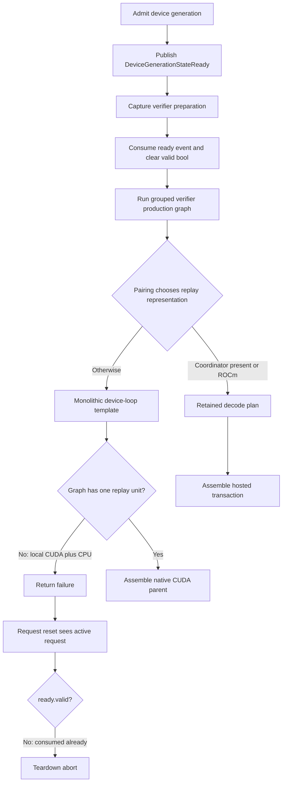

Two unrelated facts had been collapsed:

1. The presence of a rank transaction coordinator was being used as a proxy
   for heterogeneous execution. A process-local CUDA/CPU overlay has no remote
   coordinator but still has an explicit sparse boundary and segmented replay.
2. `ready.valid == false` represented both “no request owns this state” and
   “one exact stream borrowed it and has not republished yet.” The latter is a
   live frontier that reset must join.

## Simplified authoritative lifecycle

`deviceGenerationExecutionPolicy()` is the sole outer-loop execution-policy
authority. It consumes the same typed topology proof as decode capture:

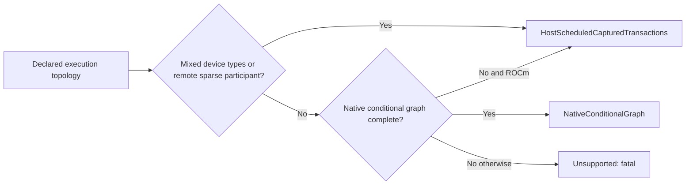

This is not a fallback. The policy is chosen before parent materialization and
both verifier pairing and branch assembly consume it. Hosted execution retains
the exact production graph, including every declared sparse boundary; the host
submits only the device-authenticated transaction named by the ticket.

Controller ordering now has one explicit state machine:

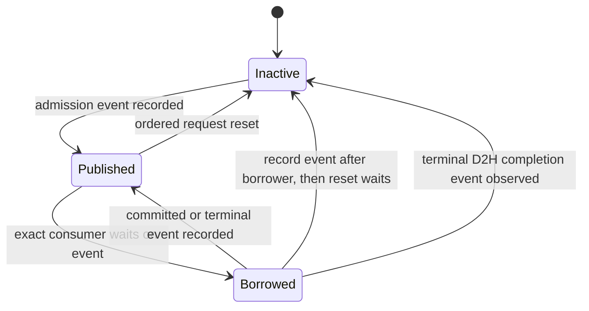

The backend callback must succeed before a transition commits. A reset of a
borrowed frontier re-records the preallocated controller event after the exact
borrower stream and enqueues a wait on the reset stream. It does not synchronize
a stream/device, claim that partial controller contents are committed, or replay
work.

## Remaining proof sequence

1. Device-free adversarial transition tests for publish, borrow, republish,
   backend-edge failure, published reset, and borrowed reset.
2. Source-policy proof that pairing and branch assembly consume the same typed
   topology policy and that reset contains no blocking synchronization.
3. Exact real-weight `CUDA1 + CPU1`, Dynamic, Ordinal, FP16 activation/KV,
   Depth-15 production parity cell.
4. Affected CUDA/ROCm ExpertOverlay matrix, then the complete canonical parity
   campaign.

## Follow-up: sparse request identity audit

The complete production campaign subsequently isolated a second lifecycle
proxy in hosted HIP MTP replay.  `resolveMTPMoEOverlayCollectiveRuntimeParams()`
read only the ExpertOverlay root-generation field.  Dense Qwen3.6 and ordinary
single-device MoE do not install that field, so dynamic-depth replay rejected a
valid local request after all numerical checkpoints had passed.

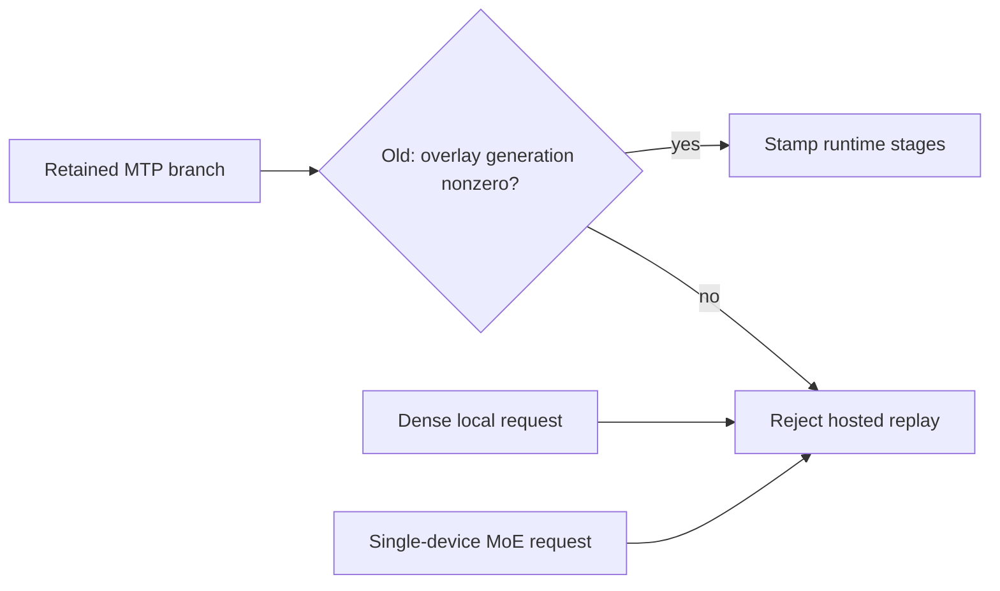

The simplified flow selects one typed authority before capture or replay.  A
backend, coordinator pointer, and presence of sparse stages are no longer
authority proxies.

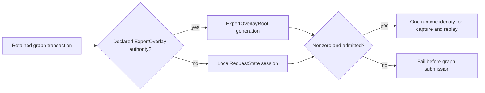

`MoESparseRequestIdentity` makes zero invalid at construction and preserves the
authority kind even when both sources happen to carry the same integer.  The
orchestrator owns the sole selection method.  Distributed graphs still verify
that the selected root generation equals the transaction coordinator binding;
local graphs never populate or impersonate that distributed field.

## Follow-up: LocalTP capture-wave collective cycle

The `ROCm2 + CPU2` static production cell exposed a third defect during the
first real prefill transaction.  Both ROCm participants captured valid native
segments, but the authority participant placed the next rooted shared-expert
reduction in its pre-ticket unit while its sibling placed the same collective
in the post-ticket unit.  This was a graph dependency error, not a GEMM or
ticket-polling defect.

The resulting wait-for graph was cyclic:

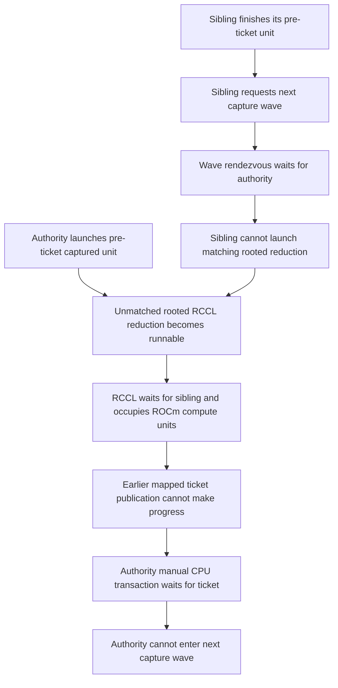

Textual stage order did not make this safe.  The rooted collective and mapped
publication are separate GPU-stream branches inside one native graph, so a
later collective can run before an independent copy.  Correctness therefore
has to follow typed transaction boundaries and collective ordinals rather than
assuming insertion order.

The simplified per-layer lifecycle is now:

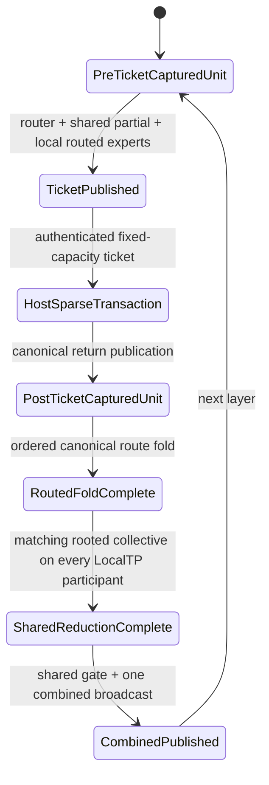

`GraphHeterogeneousTicketUnitContract` remains the sole cutpoint authority.  A
rooted shared reduction now depends on the post-ticket routed-unit terminal;
the reverse dependency is forbidden.  This one edge gives all participants the
same collective sequence in the same capture wave without a stream
synchronization, timeout extension, eager replay, or topology-specific branch.

The focused graph-lowering proof covers both mapped-sparse and native-collective
LocalTP transport.  The exact real-weight `ROCm2 + CPU2`, static, ordinal,
FP16-activation/KV production cell then passed graph-captured prefill, every
CSV checkpoint comparison, incremental decode, and automatic prefix restore.

## Follow-up: reusable ModelContext physical seal

The next `ROCm1 + CPU2` Dynamic cell restored its initial logical owner map and
successfully rebound the model registry, but the following MTP cell rejected
one GPU resident.  Its execution payload matched the source format while its
allocation still included the generic shadow arena's optional `mins` and
`emins` regions.  Logical restoration and physical canonicalization had been
incorrectly treated as the same lifecycle edge.

The old teardown path was therefore incomplete:

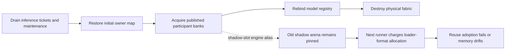

A closed migration cycle cannot write directly into a departing expert's
loader allocation: the old epoch may still read that slot.  Staging through a
shadow slot is correct.  Once the terminal ticket and maintenance barriers have
drained, however, the newly free loader allocation must become authoritative
again before the model context is reusable.

The simplified lifecycle has one typed terminal transition and no second
logical publication:

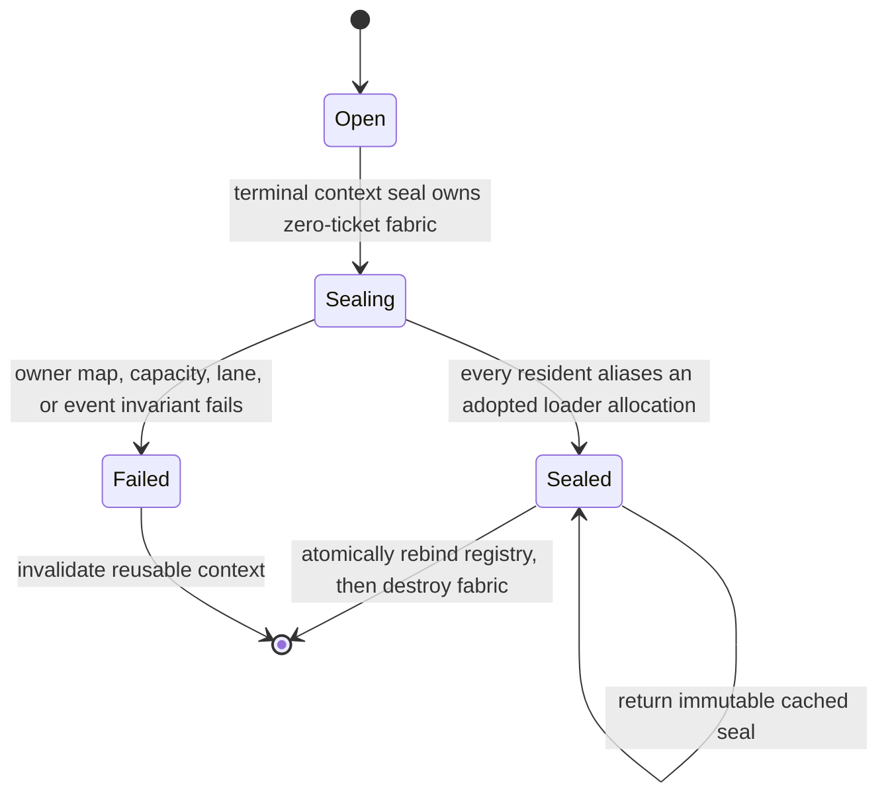

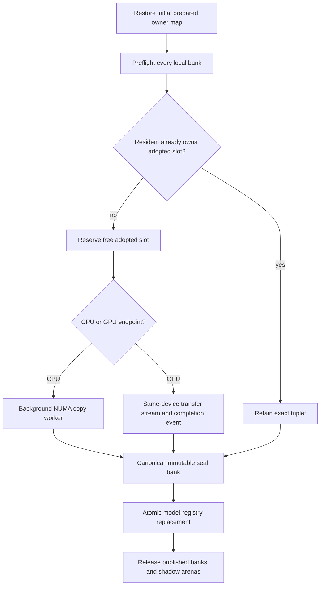

The fabric materializes same-endpoint lanes during setup even for a single
logical participant.  Sealing polls worker state or exact GPU completion events
and never uses stream/device synchronization.  After `Sealing` begins, ordinary
physical movement is structurally rejected.  A device-free regression rotates
one shadow slot through three closed cycles, leaves exactly one expert in the
shadow arena, and proves byte-exact canonicalization for all 20 quantized
codebooks plus FP16, BF16, and FP32.

## Follow-up: prefix/MTP proof crossed a movement fingerprint

The first reused `ROCm1 + CPU2` Depth-1 cell initialized successfully after the
physical seal, then failed three apparently separate assertions: the serial MTP
oracle observed a prefix miss, the partial restore's cached KV bytes differed,
and no typed Depth-1 boundary was published.  All three came from one stale
proof edge.  Decode parity captured its step-zero oracle at movement epoch 2,
then ordinary dynamic maintenance published epoch 3.  The cell deliberately
uses `InvalidateOnRebalance` while measuring convergence, so epoch 3 correctly
has a new cache fingerprint.

The old proof composition silently crossed those epochs:

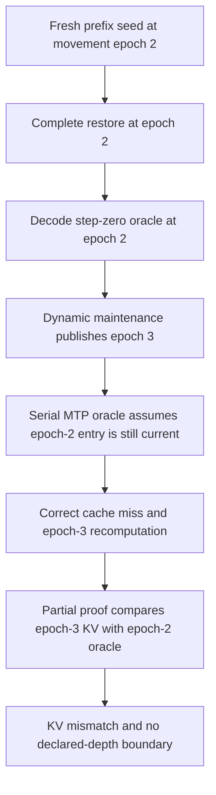

The simplified proof owns one cache fingerprint from admission through
comparison.  It admits at most one seed request; the immediately following
request must be a complete hit at the same movement epoch.  A second miss,
cache bypass, epoch change, or missing MTP payload is fatal.

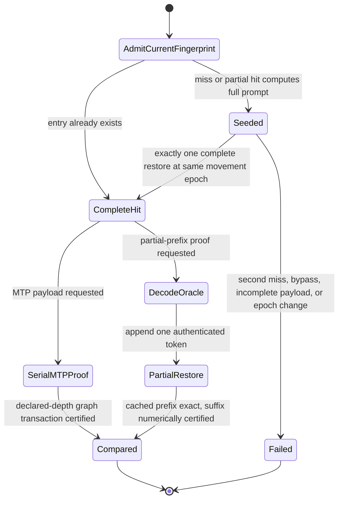

The canonical prefill parity phase remains the graph-capture proof.  Cache-only
admissions do not require compute snapshots because a complete hit launches no
model graph by construction; the following decode or MTP transaction restores
the ordinary production snapshot policy.  This removes cross-phase state reuse
without changing production cache policy, numerical thresholds, movement
cadence, or execution mode.

## Follow-up: Dynamic economy evidence multiplied by MTP depth

The first post-seal CPU/ROCm process campaign reached only nine of 96 cells in
12 minutes.  Every Dynamic MTP policy was independently repeating the same
256-token initial/converged timing cohorts.  The MTP axis must still prove its
own captured numerical path and real movement, but logical draft depth does not
create a new hypothesis about whether an adversarial expert placement becomes
faster after one economical residency wave.

The old product accidentally made an evidence role look like an execution
axis:

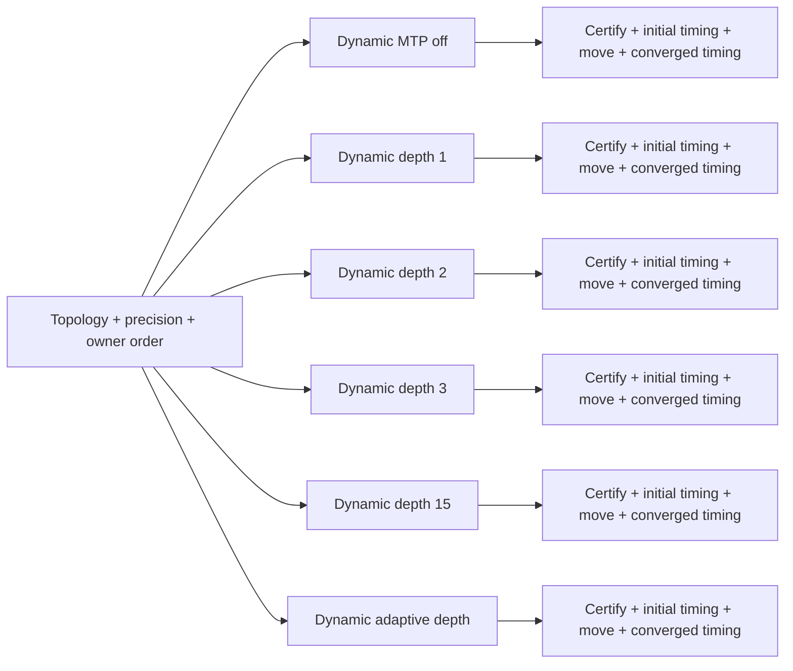

`ModelParityDynamicEvidence` now makes the two proof obligations explicit.
Every Dynamic cell owns `EconomicMovement`: it runs the real production
service certification, publishes physical expert bytes, settles at a typed
between-wave boundary, proves its exact graph/MTP/prefix path, and emits the
normal CSV evidence.  The central matrix expander assigns exactly one
`EconomicMovementAndObservedSpeedup` witness per topology, activation/KV
precision pair, and owner order.  The witness is the MTP-off cell on the first
declared prefill schedule; no fixture infers this role from a test name.

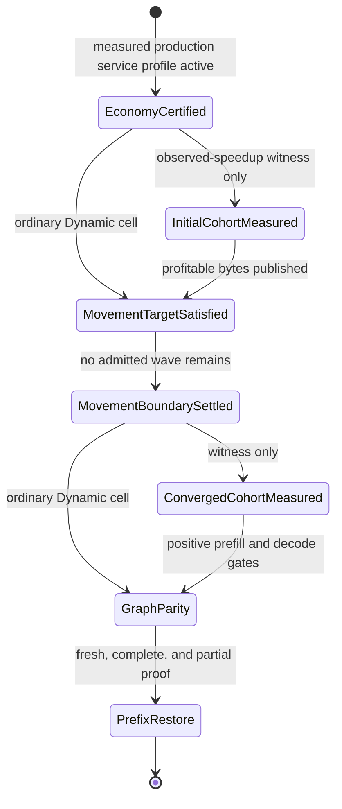

The first real `ROCm1 + CPU2`, Dynamic, ordinal, FP16 activation/KV, MTP-depth-2
non-witness passed on both ranks in 135.6 seconds from a cold process.  It
published 144 movement rows, retained all three prefix-restore rows, certified
full captured prefill/decode/MTP execution, and intentionally emitted no
convergence-timing artifact.  The previously identical depth cell took roughly
four minutes when it also repeated the matched timing proof.  This is an
evidence-lifecycle reduction only; production movement, graph capture,
numerical thresholds, and output artifacts remain mandatory.

## Follow-up: phase-collapsed movement economy

The retained `ROCm1 + CPU2` speedup witness then isolated a policy defect rather
than another execution-lifecycle defect.  A longer matched sample made the
signal unambiguous: the accepted placement improved decode by 9.83% while
regressing prefill by 6.75%.  The controller's projected net benefit remained
strongly positive because it had summed decode, prefill, and grouped-verifier
critical paths before asking whether service improved.

That scalar was an invalid state: a large decode win could cross-subsidize a
prefill loss even though the production campaign independently gates both
phases.  The same collapse existed in the heterogeneous host authority, the
deterministic CPU oracle for device policy, and the shared CUDA/HIP controller
kernel.

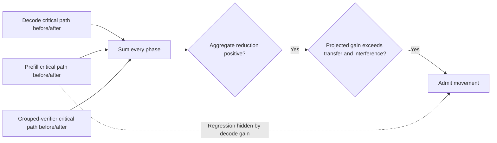

The simplified economy lifecycle preserves phase identity until the independent
production objectives have been checked.  There is still one movement payoff
calculation and one publication authority; this change does not introduce a
second controller, calibration pass, or phase-specific placement map.

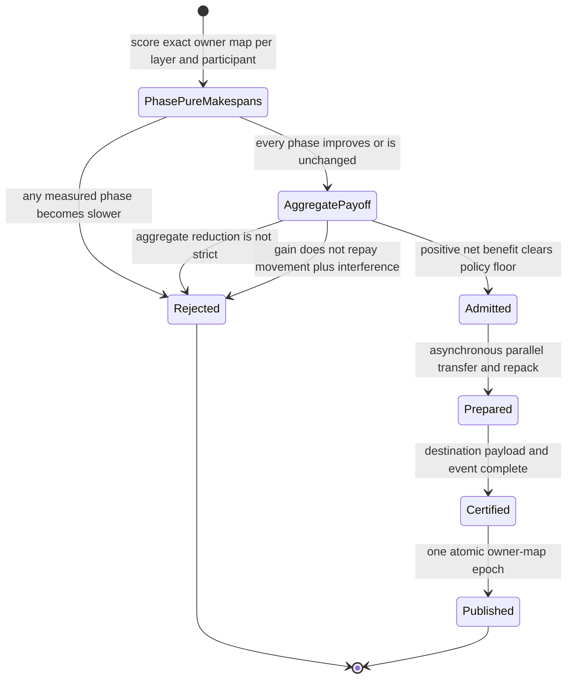

Equality for an individual phase is deliberate.  It permits a cycle that helps
decode without changing prefill, or vice versa, while forbidding cross-phase
harm.  The aggregate objective must still decrease strictly and repay measured
transfer/repack and inference-interference costs.  Host, CUDA, and HIP consume
the same no-regression rule; focused regressions construct the formerly accepted
decode-win/prefill-loss case and a positive control in which both phases favor
the move.

## Follow-up: invalidation changed identity but retained stale capacity

The phase-pure controller admitted a placement whose captured forward work and
CPU expert service both decreased, yet the exact production witness reported a
2.4x prefill slowdown: 865.1 ms became 2075.6 ms while decode improved 5.78%.
Request-matched `forward_graph` timers ruled out the graph. The missing latency
was in prefix harvest after the forward returned.

The cell uses one-token prefix blocks to prove exact partial restore. Its
terminal hybrid block is roughly 157 MB and its RAM tier is 4 GiB.
`InvalidateOnRebalance` correctly incorporated the movement epoch into the
request fingerprint, but publication only replaced `prefix_fingerprint_`.
RAM/device-hot records from every old epoch remained capacity-resident. Once
ordinary convergence traffic filled RAM, each new harvest synchronously
checksummed, appended, and fsynced a stale 157 MB block into the disk tier.

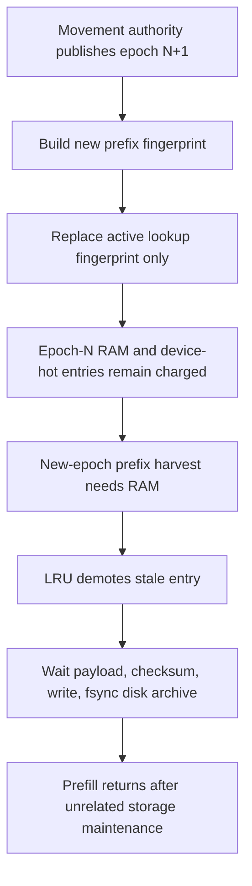

The corrected lifecycle has one post-initialization fingerprint publisher.
For `InvalidateOnRebalance`, it first performs a typed cache rebase. The rebase
preflights legacy explicit leases, drops stale RAM and device-hot cache owners,
and removes stale disk records from the current runtime index. Shared handles
already held by an admitted request remain valid. Durable records stay in the
append-only archive and are reclaimed by its normal bounded LRU, so the
request-boundary transition performs no archive write, delete, compaction, or
fsync.

```mermaid
stateDiagram-v2
    [*] --> FingerprintStable
    FingerprintStable --> CandidateBuilt: movement epoch or live payload shape changes
    CandidateBuilt --> Unchanged: candidate equals active fingerprint
    CandidateBuilt --> RebasePreflight: InvalidateOnRebalance and identity changed
    CandidateBuilt --> Published: compatible retention policy and identity changed
    RebasePreflight --> Failed: zero identity or retained explicit lease
    RebasePreflight --> VolatileRetired: stale RAM/device-hot owners dropped; stale disk keys unindexed
    VolatileRetired --> Published: active fingerprint replaced atomically
    Unchanged --> FingerprintStable
    Published --> FingerprintStable
    Failed --> [*]
```

Two device-free regressions lock down the transition. One proves that RAM
capacity is recovered without changing durable archive bytes or adding another
RAM-to-disk demotion; the other proves a busy explicit lease rejects the whole
transition before any tier is mutated. A source-policy regression requires live
hybrid layout refresh to use the same publisher, eliminating the former direct
assignment exception.

## Follow-up: convergence workload identity and demand-window admission

After volatile prefix rebasing removed the storage-maintenance latency, the
same production witness improved decode by 2.01% but prefill by only 0.58%.
Captured-forward timers were flat and the prefix archive remained an empty
80-byte header. The remaining weakness was in the test lifecycle: an 18-row
prefill was split into a 16-row captured segment and a noisy two-row tail, while
movement training repeatedly reused the eight measurement cache identities.
After the first pass, most training windows therefore represented prefix-hit
decode traffic instead of the prefill/decode mix judged by the final gate.

The identity reuse also created an avoidable race model. Because a movement
publication could retire between observation and prefix admission, the fixture
kept a ninth baseline candidate, remembered an optional overlapping identity,
and omitted that identity from both cohorts.

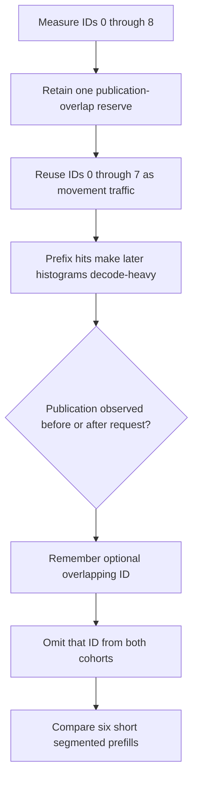

The first simplification removed the ninth candidate and made every observed
prefill 64 rows, exactly divisible into four retained 16-row segments on this
memory-constrained 122B topology. It also assigned every training request a new
identity outside measurement IDs 0 through 7. That fixed the prefill witness,
but the identity is a real first token, not merely a cache salt. The nominally
stationary training workload therefore optimized different autoregressive
decode trajectories. One exact run improved prefill by 9.35% but decode by only
1.02%, and the request-paired samples showed that the prompts whose routes were
not represented by the moving training interval had regressed.

The final lifecycle distinguishes two traffic purposes instead of making cache
identity carry both meanings. Normal optimization cycles the exact eight A/B
prompt identities, including genuine production prefix hits. Every accepted
placement publication changes the `InvalidateOnRebalance` fingerprint, so each
new epoch still sees a full-compute copy of those prompts before reuse begins.
Only after the movement target is satisfied may a partially occupied demand
bank receive cache-distinct rotation traffic; those IDs can never seed a hit in
the subsequent measured cohort.

The 640-row histogram window admits the complete timing cohort because
`8 * (64 + 5) = 552`. Quiescence alone is insufficient: a partial active bank
can have fewer than 552 rows remaining and publish a new epoch during timing.
The host authority now exposes a typed `MoEOptimizationDemandWindow` containing
the RCU bank generation, exact collected row count, and capacity. The snapshot
pins the active bank and rechecks its complete monotonic epoch after reading, so
it cannot return an ABA-stale bank during rotation. Timing admission requires
both reconciled quiescence and strictly more than 552 rows of headroom; equality
is rejected because the cohort's last row would complete the window.

```mermaid
stateDiagram-v2
    [*] --> EconomyCertified
    EconomyCertified --> InitialCohortMeasured: IDs 0..7; one immutable epoch
    InitialCohortMeasured --> MovementTraining: cycle exact IDs 0..7
    MovementTraining --> MovementTargetSatisfied: required waves and axes complete
    MovementTargetSatisfied --> ReconcileProgress: stop admitting requests
    ReconcileProgress --> MovementTraining: publication or physical work remains
    ReconcileProgress --> InspectDemandHeadroom: typed authority is quiescent
    InspectDemandHeadroom --> MovementBoundarySettled: remaining rows > 552
    InspectDemandHeadroom --> DemandWindowRotation: insufficient headroom
    DemandWindowRotation --> ReconcileProgress: ordinary disjoint IDs 8+n rotate bank
    MovementBoundarySettled --> ConvergedCohortMeasured: replay exact IDs 0..7
    ConvergedCohortMeasured --> GraphParity: strict prefill and decode economy gates
    GraphParity --> [*]
```

No measurement request can overlap movement because movement does not begin
until the initial cohort completes, and the converged cohort does not begin
until the typed reconciled-and-headroom boundary. Prefix rebasing makes the
final replay a full-compute miss under the new placement, while the disjoint
rotation mode prevents a later no-movement bank rotation from repopulating its
keys. The reserve count, optional overlap identity, omission branch, short-tail
timing geometry, and guessed fixed-wave headroom are removed. The production
controller, asynchronous publication, cache policy, and strict 2% economy
thresholds are unchanged. The focused real-weight ROCm1+CPU2 run settled after
four publications at placement epoch 5, improved prefill by 12.35% and decode
by 5.04%, passed both MPI ranks, and left the prefix archive at its empty 80-byte
header.

### Movement-only cells must not reserve the timing cohort

The first canonical wrapper run exposed one more leaked lifecycle assumption.
The demand-headroom check above was applied to every Dynamic matrix cell, even
though only the centrally assigned MTP-off speed witness executes the matched
A/B cohort. Movement-only MTP cells use the normal short production histogram
window. Asking those cells to reserve 552 unused rows was therefore impossible:
each quiescent observation requested another bank rotation, ordinary inference
closed that small bank, and maintenance kept publishing new epochs instead of
crossing into graph parity.

Settlement now owns a typed `ConvergenceBoundaryPurpose`. A
`MovementProof` ends at the first quiescent topology-valid publication;
`ObservedSpeedupCohort` additionally requires the authoritative demand window
to admit all 552 routed rows. This keeps bank geometry out of cells that do not
consume it while preserving the stronger no-publication interval around the
speed witness.

```mermaid
stateDiagram-v2
    MovementTargetSatisfied --> ReconcileProgress
    ReconcileProgress --> MovementBoundarySettled: MovementProof and quiescent
    ReconcileProgress --> InspectDemandHeadroom: ObservedSpeedupCohort and quiescent
    InspectDemandHeadroom --> MovementBoundarySettled: remaining rows > 552
    InspectDemandHeadroom --> DemandWindowRotation: insufficient headroom
    DemandWindowRotation --> ReconcileProgress
    MovementBoundarySettled --> GraphParity: movement-only cell
    MovementBoundarySettled --> ConvergedCohortMeasured: speed witness
```

The focused real-weight ROCm1+CPU2 Dynamic/Ordinal/MTP-depth-1 cell then passed
both MPI ranks in 122 seconds, including physical movement, captured prefill,
prefix restore, decode, MTP/Hugging Face checkpoints, promoted-expert execution,
and teardown. The pre-fix wrapper instance had remained in repeated rotations
for more than 18 minutes without producing its first parity artifact.

## Follow-up: `Waiting` raced an unreconciled inference notification

The first 64-row run reached the required durable movement axes, then exposed
one remaining publication race. The continuation observed three committed
waves and a `CollectingDemand` activity left by the worker's previous empty
poll. Its final training request filled generation four and woke maintenance,
but the status reader ran before the worker consumed that wake. It therefore
treated the stale activity as quiescent. Wave four became visible inside the
first converged prefill (`expected=3`, `before=3`, `after=4`), and the typed
epoch guard correctly rejected the cohort.

```mermaid
sequenceDiagram
    participant I as Inference
    participant S as Public status
    participant W as Maintenance worker
    I->>W: Complete request and set wake boolean
    S->>S: Read stale CollectingDemand
    S-->>I: quiescent=true
    I->>I: Begin converged prefill at epoch 3
    W->>W: Drain newly full histogram
    W->>I: Publish epoch 4
    I->>I: Reject epoch crossing
```

A boolean wake cannot identify which progress a worker has actually
reconciled. The host authority now publishes a monotonic progress generation
before every inference/event wake. Immediately before the authoritative
histogram poll, the worker captures that generation. It may publish
`CollectingDemand` only together with the captured generation after the poll
reports no complete window. Public quiescence requires equality between the
published and reconciled generations as well as an idle activity state.

```mermaid
stateDiagram-v2
    [*] --> Reconciled: published_generation == reconciled_generation
    Reconciled --> ProgressPublished: inference/event increments published_generation
    ProgressPublished --> ReconcilingDemand: worker observes wake
    ReconcilingDemand --> MovingWeights: complete window exists
    ReconcilingDemand --> Reconciled: no complete window; publish reconciled_generation
    MovingWeights --> PublishingResidency: prepared payload events complete
    PublishingResidency --> ReconcilingDemand: new epoch is selectable
    Reconciled --> TimingEligible: activity is CollectingDemand and generations match
    ProgressPublished --> TimingRejected: generations differ even if activity is stale
```

The generation is host-owned lifecycle state, not PerfStats and not a shadow of
device routing data. A distributed follower retains a normalized zero/zero pair
because its preposted proposal mailbox owns no policy decision; the arbitrary
coordinator alone reconciles topology demand. This strengthens the production
status surface used by diagnostics and tests without adding a synchronization,
host-side inference wait, or test-only controller call.

## Follow-up: logical graph identities underpriced native executables

The reused `ROCm1 + CPU2` process campaign passed MTP-off and Depth-1, then
failed while constructing the Depth-2 runner with only 36 MiB free. The next
4 MiB physical-fabric allocation was merely where exhaustion became visible.
The capacity plan had reserved driver storage for logical graph-cache
identities, while a host-authority ExpertOverlay graph is lowered into one
native HIP executable before every authenticated CPU boundary plus one terminal
unit. Retained MTP controller fragments add a second, independent executable
family.

The old lifecycle both priced the wrong object and ordered topology too late:

```mermaid
flowchart TD
    A[Declarative ExpertOverlay plan] --> B[Capacity admission]
    B --> C[Count logical graph-cache identities]
    C --> D[Fill GPU expert quota from apparent remainder]
    D --> E[Freeze host or device authority]
    E --> F[Lower each logical graph into native units]
    F --> G[Instantiate retained MTP fragments]
    G --> H[Driver pool exhausts during reused runner setup]
```

For the 48-layer host-authority model, every complete logical model graph owns
49 native executables. Dynamic MTP depth `D` additionally retains the exact
semantic fragment upper bound `D * (D + 10)`. Debug driver evidence at depth 15
observed hundreds of physical HIP instantiations and roughly 928 MiB of positive
driver high-water growth, while the former logical estimate reserved only about
185 MiB. Increasing a generic safety margin would not make those two meanings
coherent.

The simplified setup lifecycle freezes one topology authority first and prices
one typed physical inventory before any expert quota is resolved:

```mermaid
stateDiagram-v2
    [*] --> DeclarativeTopology
    DeclarativeTopology --> AuthorityFrozen: normalize explicit or synthesized plan
    AuthorityFrozen --> InventoryResolved: model identities x native segments plus auxiliary executables
    InventoryResolved --> CapacityAdmitted: fixed graph bytes charged on each GPU
    CapacityAdmitted --> PlacementFrozen: fill tier quotas from the true remainder
    PlacementFrozen --> GraphsMaterialized: exact retained executable family
    GraphsMaterialized --> InferenceReady: driver and physical-fabric admission complete
    AuthorityFrozen --> Failed: declared authority conflicts with topology
    InventoryResolved --> Failed: invalid geometry or arithmetic overflow
    CapacityAdmitted --> Failed: complete fallback coverage cannot fit
```

`CapturedGraphExecutableInventory` now distinguishes model graph identities,
native segments per model graph, and auxiliary native executables. Host-owned
heterogeneous overlays resolve `layers + 1` segments; all-GPU device-owned
execution remains one complete native executable per logical graph. The same
`resolveMTPRetainedDeviceGenerationFragmentCapacity()` function feeds both
memory admission and `DeviceGraphOrchestrator`, so requested depth cannot be
priced with one formula and materialized with another.

Authority normalization was already the intended one-way transition, but the
runner installed its result only for synthesized single-tier plans. Explicit
plans therefore reached capacity with `Unresolved` authority even though the
normalizer had produced the correct immutable clone. The normalized result is
now installed for both dispositions before capacity admission; later
model-aware placement freezing consumes it instead of reconstructing topology.
Focused capacity, memory-planner, and orchestration-plan unit gates cover the
typed inventory and authority transition. The reused real-weight MTP sequence
remains the production proof of driver-pool sufficiency.

## Follow-up: participant search breadth was confused with admission capacity

After native-executable admission was corrected, the reused `ROCm1 + CPU2`
Dynamic sequence reached live inference but Depth-1 published tier movements
only. The histogram and planner both reported participant skew, yet no
participant-placement edge survived economy admission. The controller had
applied the two-entry participant transfer budget while *generating*
candidates, so only the raw-count swap from layer zero existed. Phase-weighted
service accounting correctly assigned that swap zero projected gain; useful
independent swaps in later layers were never visible to the economy authority.

The test driver amplified the defect. Movement-only cells repeatedly used a
small set of prefix identities and sized their horizon as though each request
would execute five routed rows. Once those prefixes were cached, a request
executed only its decode continuation, so the nominal 520-request horizon made
little histogram progress while spending minutes proving cache hits.

```mermaid
flowchart TD
    H[Complete typed histogram] --> G[Generate at most two participant entries]
    G --> L[Only layer-zero swap exists]
    L --> E{Phase-weighted economy positive?}
    E -->|No| T[Tier-only publication]
    T --> P[Reuse cached movement prompt]
    P --> D[One decode row instead of full prefill]
    D --> P
```

Search breadth and physical admission are now separate typed stages. Candidate
discovery exposes one self-contained closed swap per layer, avoiding dependent
same-layer swap chains while allowing economy to inspect the entire model.
The selector may skip a phase-regressive or over-budget candidate and continue
to later layers. Only after selection does it enforce the two participant
objective entries and the configured concurrent physical-cycle capacity.

```mermaid
flowchart TD
    H[Complete typed histogram] --> S[One independent participant swap per layer]
    S --> E[Score exact phase and participant service makespan]
    E --> O[Order economically eligible closed cycles]
    O --> A{Fits participant-objective and physical-cycle budgets?}
    A -->|No| R[Record typed rejection and inspect next candidate]
    A -->|Yes| B[Build bounded authoritative transaction]
    B --> C[Recompose and certify physical closed cycles]
    C --> P[Publish immutable placement epoch]
```

Admission evidence is a conservation ledger over disjoint outcomes:
individual-policy rejection, dependent-payoff rejection,
participant-axis-budget rejection, physical-capacity rejection, or admitted
candidate. `policy_bounded` includes the first three; `capacity_bounded`
includes only physical capacity. The production parity gate parses every
category and requires the totals and flags to agree, so adding a rejection
reason without extending the conservation equation fails closed.

Movement-only traffic now uses cache-distinct, reference-shaped 64-row
prefills. Ten such requests are sufficient to close a 640-row histogram, with
eight additional requests reserved only for asynchronous publication overlap.
The observed-speedup witness retains its fixed paired corpus and stronger
demand-headroom lifecycle; the two proof purposes no longer share a guessed
request multiplier. A focused authority regression makes layer zero
phase-regressive and proves that a profitable layer-one participant swap is
selected without exceeding the two-entry admission budget.

## Follow-up: native executables outlived the arena they borrowed

With physical executable admission fixed, the retained Depth-1 runner passed
and released its public buffers, but Depth-2 still exhausted ROCm memory while
allocating a final 4 MiB physical-fabric block. The explicit allocation ledger
showed roughly 7.8 GiB free and the HIP graph ledger showed that all 562 native
executables were eventually destroyed. Neither observation described the
ordering edge that controlled physical reclamation.

Line-by-line VRAM accounting identified one 4,369,981,188-byte activation and
workspace arena. `BufferArena` returned that allocation to the backend while
all 562 HIP graph executables still embedded addresses inside it. The backend
removed the pointer from Llaminar's allocation registry, but HIP retained the
physical pages until the executable family was destroyed. The following runner
therefore allocated a second complete arena against the same device. A failed
runner whose capture had not begun returned the identical arena immediately,
which rules out capacity estimation and generic allocator caching as the
cause.

The old teardown order made member destruction, rather than the lifecycle API,
the accidental owner of graph topology:

```mermaid
flowchart TD
    A[Retire selected publication events] --> B[Release BufferArena]
    B --> C[Backend registry forgets 4.07 GiB allocation]
    C --> D[Live native executables still borrow arena addresses]
    D --> E[HIP defers physical reclamation]
    E --> F[Destructor eventually destroys child graphs]
    F --> G[Next runner has already admitted and allocated a second arena]
    G --> H[Depth-2 setup OOM]
```

There is now one destructive topology transition shared by object teardown,
public buffer release, and explicit cache invalidation. It is idempotent and
owns the complete graph inventory. The MTP generation parent is destroyed
before the children whose capture identities it embeds; forward, verifier,
publication, stochastic, overlay-epoch, and maintenance graphs are destroyed
before their exact device contexts; the arena remains live until all borrowers
are gone.

```mermaid
stateDiagram-v2
    [*] --> Captured: arena addresses embedded in native executables
    Captured --> EventsRetired: wait exact producer events
    EventsRetired --> ParentDestroyed: release MTP generation parent and stream
    ParentDestroyed --> ChildrenDestroyed: release every forward, MTP, publication, stochastic, and overlay graph
    ChildrenDestroyed --> ContextsDestroyed: release graph streams and device contexts
    ContextsDestroyed --> ArenaReleased: return activation/workspace allocation
    ArenaReleased --> [*]
```

No device or stream synchronization is introduced. Event retirement preserves
the producer/consumer DAG, and graph destruction happens only at a destructive
runner boundary where no new inference can be admitted. A source-policy
regression inventories every retained graph owner and requires parent-before-
child, graph-before-context, and topology-before-arena ordering. The formerly
failing reused real-weight Depth-1 to Depth-2 sequence is the required physical
reclamation proof.

## Follow-up: retained MTP capacity was mistaken for an active transaction

The first cell in a reusable production-matrix process deliberately executes
with MTP off while retaining capacity for the largest later matrix member. The
memory admission path charged that retained depth, but several graph-resource
and participant declarations were still guarded by `mtp.enabled`. The MTP-off
runner therefore sealed a 1,864,785,668-byte serial-family arena; the following
Depth-1 runner required the complete 4,369,981,188-byte family and correctly
rejected reuse. A safety reserve would only have hidden the disagreement
between two authorities.

The underlying lifecycle error was a category collapse:

```mermaid
flowchart TD
    A[Matrix declares retained MTP depth 15] --> B[Memory admission charges retained capacity]
    B --> C{Old graph setup checks MTP enabled?}
    C -->|No in first MTP-off cell| D[Omit verifier, sidecar, KV, and workspace participants]
    D --> E[Seal undersized reusable arena]
    E --> F[Later Depth-1 cell requests declared family]
    F --> G[Exact reuse check rejects insufficient arena]
```

Retained capacity and transaction activation now have separate meanings.
`retainsMTPGraphCapacity()` is the sole setup-time authority for resources that
must exist in a retained graph family: decode-equivalent row geometry, terminal
hidden storage, shifted KV state, grouped-verifier and condition manifests,
sidecar logits participation, and the eager workspace-family declaration.
`mtp.enabled` remains the execution-time authority: it alone permits a request
to bind and launch an MTP transaction. The
`WorkspaceFamilyDeclaration` binding mode can describe the dormant family
without pretending that MTP executed.

```mermaid
stateDiagram-v2
    [*] --> DeclarativeCapacity: standard matrix publishes maximum retained depth
    DeclarativeCapacity --> ResourceInventory: resolve all retained graph participants
    ResourceInventory --> ExactWorkspacePlan: combine complete serial-family manifests
    ExactWorkspacePlan --> ArenaSealed: allocate the exact maximum block once
    ArenaSealed --> MTPDisabled: request policy selects MTP off
    ArenaSealed --> MTPEnabled: request policy selects fixed or dynamic depth
    MTPDisabled --> ArenaSealed: no MTP branch binds or launches
    MTPEnabled --> ArenaSealed: captured transaction completes
    ArenaSealed --> [*]: graphs retire before arena release
```

This is capacity accounting, not speculative headroom. Every byte is produced
by the same declared graph geometry later consumed by capture; an insufficient
block remains a fatal error. Focused unit gates require the capacity authority
on every affected participant, and a reused real-weight `ROCm1 + CPU2`
MTP-off-to-Depth-1 sequence passed with full graph-capture, prefix-restore, MTP,
and CSV evidence in one model context.

## Follow-up: parallel selector fan-out exposed a prepared candidate

The mixed `CUDA1 + ROCm1 + CPU2` Dynamic cell intermittently failed its first
segmented prefill with `InvalidControl`. Failure-only device status identified
an acquire for placement epoch 2 while the local selector still published
epoch 1. Epoch 2 was present in the other bank with `Ready` state, and a peer's
authenticated activation descriptor already named it. The former acquire
contract accepted only `Published` or `Retiring`, so it rejected a legitimate
intermediate state in the host-authoritative two-phase publication protocol.

The bug was not missing preparation or a stale descriptor. Global preparation
had completed before the candidate epoch became externally nameable. Selector
publication then deliberately fanned out across endpoints in parallel; making
that last step serial would remove the race only by adding inference-visible
latency and would contradict the movement architecture.

```mermaid
sequenceDiagram
    participant H as Host overlay authority
    participant A as Participant A
    participant B as Participant B
    H->>A: Prepare inactive bank E+1
    H->>B: Prepare inactive bank E+1
    A-->>H: Ready(E+1)
    B-->>H: Ready(E+1)
    H->>H: Open exact candidate epoch E+1
    par Parallel selector publication
        H->>A: Publish selector E+1
        H->>B: Publish selector E+1
    end
    A->>B: Authenticated activation descriptor E+1
    Note over B: Local selector may still name E while bank E+1 is Ready
    B--xB: Old acquire rejects Ready as InvalidControl
```

Serializing the selector fan-out, prematurely changing every participant's
publication floor, or accepting arbitrary prepared banks would each obscure a
different ownership error. Admission is instead represented by one scoped
policy with two explicit meanings:

```mermaid
stateDiagram-v2
    [*] --> Ready: global inactive-bank preparation consensus
    Ready --> PinnedPrepared: authenticated exact peer descriptor names E+1
    Ready --> Published: local selector atomically advances to E+1
    PinnedPrepared --> Published: local selector advances while reader remains pinned
    Published --> PinnedPublished: ordinary or exact acquisition
    PinnedPrepared --> Ready: exact reader releases before local publication
    PinnedPublished --> Published: reader releases
    Published --> Retiring: later selector publication
    Retiring --> Reusable: final reader releases
    Reusable --> Ready: prepare a later epoch
```

`PublishedFloor` admission continues to accept only `Published` or `Retiring`
banks. `ExactPreparedPeer` additionally accepts `Ready`, but only after the
existing peer descriptor authentication resolves one positive exact epoch.
It pins that bank with the anticipated selector generation and does not mutate
the local selector, publication floor, or host authority. CUDA and ROCm use the
same rule, and the host protocol exposes the same typed transition for
device-free adversarial testing. Generation overflow and every descriptor,
epoch, bank, and state mismatch remain fatal.

The focused proof comprises the device-free admission state machine, real CUDA
and ROCm epoch tests that hold E+1 in `Ready`, and the exact real-weight mixed
backend production cell. After the fix, that cell passed 20 fresh MPI worlds:
20 correctness passes, 20 artifact-contract passes, 160 validated parity
artifacts, and a 106.33--108.23 second runtime range under the unchanged
600-second exact-cell watchdog.

## Follow-up: parity teardown isolation was only partially adopted

The first broader campaign after the prepared-peer race proof found a harness
lifecycle defect. Qwen2 single-device, LocalTP, and LocalPP cells completed
their numerical comparisons and emitted passing CSV artifacts, then every cell
failed from `TearDown` with `Parity teardown has no isolated lifecycle channel`.
The common base had begun using a teardown-only communicator, but only the
heterogeneous GraphNative fixture constructed and retired that communicator.
The exact 20-run race gate therefore passed while unrelated fixture families
could not complete teardown.

```mermaid
flowchart TD
    B[Common ParityTestBase TearDown] --> R[Require teardown-only barrier]
    G[GraphNative fixture SetUp] --> C[Create control and teardown channels]
    G --> P[GraphNative cells pass]
    O[Every other parity fixture] --> N[No lifecycle channel]
    N --> R
    R --> F[Throw before runner and cache cleanup]
```

Channel ownership is now centralized rather than conditionally repaired in
each model fixture. `ParityCellLifecycle` is one typed object with three states.
Its active payload contains both communicator owners and both non-owning
`MPIContext` facades, so a control-only or teardown-only partial state cannot
exist. `ParityTestBase::SetUp` is the sole entry authority and
`ParityTestBase::TearDown` is the sole retirement authority. A derived setup
that skips before invoking the base remains explicitly `NotEntered`; every
entered lifecycle must cross both teardown barriers and retire exactly once.

```mermaid
stateDiagram-v2
    [*] --> NotEntered
    NotEntered --> Active: common base SetUp duplicates both lanes
    NotEntered --> [*]: derived prerequisite skips before base entry
    Active --> Active: setup and evidence use control lane
    Active --> Active: teardown entry barrier on teardown-only lane
    Active --> Active: destroy runner, graphs, caches, and model state
    Active --> Active: teardown exit barrier on teardown-only lane
    Active --> Retired: common base releases both lanes
    Retired --> [*]
```

The protocol now has two complementary gates. A source-policy unit requires
the common base to own the only entry/retirement calls and forbids GraphNative
or another topology fixture from reclaiming that authority. A model-free MPI
integration binary executes communicator isolation, ordered barriers, and all
invalid state transitions at both one and two ranks. The surrounding MPI
topology, rank initialization, orchestration, heterogeneous ticket, prepared
ExpertOverlay weight, CUDA/ROCm graph-capture, prefill-cache, and cached-replay
integration gates run alongside it before another real-weight campaign.

## Follow-up: one epoch deadline incorrectly bounded 48 healthy rendezvous

The ROCm2/CPU2 Static predecessor of the first Dynamic production cell failed
at routed layer 45 with dispatch timeline 22 while expecting 23. The terminal
snapshot was only 10 microseconds beyond its deadline and showed that the CPU
follower had successfully consumed every preceding layer. This localized the
fault to timeout scope rather than graph admission, ordering, or payload
publication: one deadline was created while the epoch was armed, then reused
for every dispatch and the final endpoint-completion wait.

The as-built lifecycle therefore treated a complete multi-layer inference
transaction as though it were one collective rendezvous:

```mermaid
flowchart LR
    A[Arm epoch and set T plus 30 seconds] --> S0[Wait for layer 0 dispatch]
    S0 --> C0[CPU expert compute and return]
    C0 --> SN[Repeat healthy layer rendezvous]
    SN --> S45[Wait for layer 45 using original deadline]
    S45 --> X{Wall clock beyond T plus 30 seconds?}
    X -- yes despite continuous progress --> F[Abort epoch as NotReady]
    X -- no --> Z[Wait for endpoint completion using same deadline]
```

That deadline was redundant with the typed activation state machine and had
the wrong semantic owner. A transaction may contain any admitted number of
layers and expensive CPU expert work; the standard 30-second collective
timeout bounds one absent peer publication, not the sum of all compute and
collectives in the request.

The simplified lifecycle retains one immutable epoch identity and creates a
fresh typed deadline only when a peer edge is actually expected:

```mermaid
flowchart TB
    A[Arm immutable epoch identity] --> L{Next routed layer?}
    L -- yes --> D[Begin DispatchPublication rendezvous]
    D --> W{Expected timeline published within 30 seconds?}
    W -- no --> X[Terminal abort with exact layer and timeline]
    W -- yes --> C[Acquire descriptor]
    C --> E[Run CPU expert compute outside wait budget]
    E --> R[Publish exact return]
    R --> L
    L -- no --> G[Acquire submitted GPU terminal events]
    G --> T[Begin EndpointCompletion rendezvous]
    T --> Q{Both typed endpoints Complete within 30 seconds?}
    Q -- no --> X
    Q -- yes --> Z[Validate traffic and reset epoch]
```

No progress flag or host shadow was added. The activation ABI now calls its
timestamp `timeout_not_before_ns`: it is merely the earliest legal terminal
watchdog observation, not a transaction budget. The immutable
`MoEOverlayActivationRendezvousDeadline` distinguishes dispatch publication
from terminal completion, is recreated at each exact edge, and can emit
timeout evidence only after that edge expires. A model-free integration proof
drives all 48 ordered round trips with synthetic elapsed time far greater than
one rendezvous interval, then proves that a genuinely stalled next generation
still fails terminally.

## Follow-up: accepted MTP publication was a late histogram producer

The first `ROCm1 + CPU2` Dynamic depth-two production cell completed prefill,
ordinary decode, and the grouped verifier, then failed while first
materializing the accepted-state publication graph. The background histogram
drain had already sealed its exact producer set. Publication nevertheless
created a cache-local stream at that late edge, so the runtime table correctly
rejected it as a foreign writer. The earlier stream-preservation fix covered
recapture after a publication graph already existed; it could not make the
first lazy stream exist before maintenance.

```mermaid
sequenceDiagram
    participant T as Runtime-table histogram authority
    participant V as Grouped verifier graphs
    participant M as Async maintenance
    participant P as Accepted-state publication cache
    T->>V: Admit already-materialized verifier streams
    V->>T: Publish grouped service and route evidence
    M->>T: Begin first bank rotation
    T->>T: Producer topology Open to Sealed
    P->>P: Lazily create cache-local stream
    P->>T: Attempt producer admission
    T--xP: Fatal foreign producer after seal
```

The simplified design removes that timing dependency. A mirrored runtime table
whose typed source mask includes `GroupedVerifier` creates one dedicated
accepted-publication stream while allocating its model-lifetime histogram
banks. It admits the stream immediately through the same initialization event
edge as every other producer. Every routed verifier publisher exposes that
single identity, the publication stage requires all layers to agree on it, and
the graph cache borrows it instead of owning another stream.

```mermaid
stateDiagram-v2
    [*] --> ResourcesAllocated: allocate two banks and maintenance stream
    ResourcesAllocated --> PublicationStreamAdmitted: create and register exact grouped-verifier stream
    PublicationStreamAdmitted --> ProducerTopologyOpen: materialize remaining graph families
    ProducerTopologyOpen --> ProducerTopologySealed: first asynchronous bank rotation
    ProducerTopologySealed --> PublicationGraphBound: lazy graph borrows pre-admitted stream
    PublicationGraphBound --> PublicationGraphBound: replay or replace capture identity on same stream
    PublicationGraphBound --> Retired: terminal graph fence and table teardown
    ProducerTopologySealed --> Fatal: any foreign stream requests admission
```

There is no host shadow, recapture fallback, or synchronization in inference.
The stream is part of complete capture identity and outlives every mutually
exclusive publication graph. Only terminal model teardown may fence and
destroy it. CUDA and ROCm integration tests now force the first rotation before
capturing publication work, prove replay on the reserved stream, and prove
that a genuinely late stream remains fatal. Those tests stay in the model-free
`ProductionParityPreflight` gate so this lifecycle is certified before any
real-weight campaign starts.

## Follow-up: static graphs falsely claimed deferred histogram ownership

The next production cell exposed a second ambiguity in the old boolean
contract. Grouped-verifier geometry alone made every routed MoE verifier stage
claim deferred histogram publication, even when Static placement deliberately
disabled runtime histogram collection. Graph setup then demanded a publication
stream that did not—and must not—exist in Static mode.

The correction is a typed, graph-wide boundary lifecycle. Graph lowering now
selects one of three roles from two independent facts: whether the stage owns a
routed-layer boundary, and whether the graph collects runtime history. The
orchestrator collects those boundaries once and resolves them atomically; it no
longer reconstructs intent from several booleans while wiring the publication
stage.

```mermaid
flowchart TD
    L[Declarative graph lowering] --> O{Owns routed-layer boundary?}
    O -- no --> N[NotOwner]
    O -- yes --> H{Runtime history enabled?}
    H -- no --> S[StaticNoPublication]
    H -- yes --> D[DeferredAcceptedRows]

    N --> I[Ignore during boundary discovery]
    S --> B[Register exactly one boundary per routed layer]
    D --> B
    B --> R{Resolve complete boundary set}
    R -- missing, duplicate, mixed role, or foreign stream --> F[Faulted: terminal setup error]
    R -- all StaticNoPublication --> P[Resolved: no publisher and no stream]
    R -- all DeferredAcceptedRows on one exact stream --> A[Resolved: ordered publishers plus publication stream]
    P --> K[Publish ordinary accepted KV/GDN/model state only]
    A --> C[Publish accepted rows into runtime histogram on exact stream]
```

```mermaid
stateDiagram-v2
    [*] --> Collecting
    Collecting --> Collecting: register routed layer or candidate stage
    Collecting --> Resolved: complete and internally consistent
    Collecting --> Faulted: missing/duplicate boundary, role mixture, or stream mismatch
    Resolved --> Faulted: any late mutation
    Faulted --> Faulted: fail closed
```

This is the minimum state machine required by the production distinction:
Static still owns an explicit verifier-history boundary, so graph validation
can prove that every routed layer was considered, but it has neither a
histogram publisher nor a synthetic stream. Dynamic/Observe owns deferred
accepted-row publication and must name the exact model-lifetime stream shared
by every layer. Dense graphs resolve as an empty boundary set. A model-free
integration test adversarially covers all valid and invalid transitions, and
the formerly failing real-weight Static/ordinal/FP16/MTP-depth-one cell proves
the resolved Static branch through captured production inference and its CSV
artifact contract.

## Follow-up: Dynamic teardown outlived borrowed HIP producer streams

The amortized Static-to-Dynamic campaign completed two real histogram
generations, then crashed in `ROCmBackend::recordEvent` during runner teardown.
The runtime table retained raw producer-stream identities, but ordinary C++
member destruction first cleared the graph caches and `DeviceContext` objects
that owned those streams. The table destructor subsequently tried to create a
terminal event edge on a dead HIP handle. A single-cell Static process never
registered those Dynamic producers, which is why the invalid lifetime remained
hidden until process-resident campaign reuse exercised the transition.

The old lifecycle conflated two independent operations in one destructor:

```mermaid
flowchart LR
    A[Inference stops] --> G[Destroy captured graph caches]
    G --> C[Destroy DeviceContexts and their streams]
    C --> T[Destroy graph builder and runtime tables]
    T --> E[Record terminal event on remembered producer pointer]
    E --> X[Use-after-destroy in CUDA or HIP runtime]
```

The corrected lifecycle gives producer references an explicit ownership type
and a terminal state transition. Graph/context streams are borrowed; the
grouped-verifier publication stream is table-owned. The device orchestrator
closes every model-internal producer DAG while the borrowed owners are still
alive, and only then destroys executable topology:

```mermaid
flowchart TD
    S[Stop inference admission] --> P[Retire exact published inference events]
    P --> R[Graph builder retires borrowed execution streams for this device]
    R --> A[Record one arrival on every live producer]
    A --> J[Maintenance stream joins all arrivals]
    J --> F[One terminal maintenance-stream fence]
    F --> B[Erase borrowed stream identities; retain table-owned handles]
    B --> G[Destroy captured graph families]
    G --> C[Destroy DeviceContexts and external streams]
    C --> T[Destroy runtime tables]
    T --> O[Destroy table-owned events, maintenance stream, and publication stream]
```

```mermaid
stateDiagram-v2
    [*] --> CollectingProducers
    CollectingProducers --> CollectingProducers: admit exact borrowed or table-owned stream
    CollectingProducers --> ProducersRetired: terminal producer-DAG join while owners are live
    ProducersRetired --> ProducersRetired: idempotent retirement
    ProducersRetired --> ResourcesReleased: destroy only table-owned resources
    CollectingProducers --> Fatal: borrowed producer reaches resource destruction
    ProducersRetired --> Fatal: producer admission or histogram progress resumes
```

There is no per-request fence, replacement stream, backend fallback, or host
shadow. The one blocking fence is permitted only after inference admission has
stopped and covers the complete producer family. CUDA and ROCm model-free
integration regressions deliberately retire the DAG, destroy the external
producer stream, and only then destroy the runtime table. Both registrations
are part of `ProductionParityPreflight`, and a unit source-policy assertion
locks the retirement call ahead of graph/context destruction.
