# Canonical HTTP certification — 2026-09-05

## Source and scope

Typed `ModelParityDefinition::e2e_certifiable` selections own eligibility.
GoogleTest JSON discovery exports each existing cell's public server arguments.
`scripts/ci/run_model_parity_e2e.py` transports those arguments to the mature
Release HTTP harness and full eight-check long-context helper. Neither runner
contains a model/topology matrix. Mathematical parity remains a separate gate.

Current discovery contains thirteen tagged cells. All have FP32 activations, FP16
KV, adaptive MTP with retained maximum depth fifteen, prefix restore, and an
8192-token E2E context. ExpertOverlay tags select Dynamic/Ordinal. The newly
added Qwen3.6 CPU NodeTP definition contributes 24 mathematical cells but only
one HTTP tag. It uses one tier spanning two sockets/ranks, not a CPU hot/cold
split. GPU/socket association in multi-tier declarations is inventory-resolved.

## Receipts and status

The thirteen individual certification cells are **green** on the final-parent
Release build. The parser, two device event-ordering
fixes, and Qwen forced-thinking paragraph boundary are gated. Twenty complete
Qwen3.6 CUDA cells pass with the corrected prefix; the independent CPU/FP32
Hugging Face oracle reproduces both the old loop and the corrected termination.
The earlier aggregate passed its first two cells, then failed physical movement
during long prefill in the mixed 122B CUDA2/ROCm4 cell. The September 6, 13:03
targeted retry of that mixed cell is now green after the bounded service and
hosted-verifier authority fixes; every cell now has a fresh passing receipt.
Four further ROCm cells now pass on the request-summary build, including both
Ornith ROCm topologies. The twenty-repeat stability certificate remains pending.
Per operator direction, that stress run is paused while fixed-depth-three
single-GPU performance is compared with a pinned current llama.cpp mainline.

### Current refresh — September 6, 15:29 UTC

This is a result dashboard derived from the canonical thirteen-cell manifest,
not a second eligibility/configuration source. All rows use the unchanged
final-parent Release build and single-pass evidence collector. Older passes
below do not count toward this refresh.

| Model / topology | Fresh result | Cell wall |
| --- | --- | --- |
| Qwen3.6 MoE 35B / CPU2 NodeTP | PASS, 43/43 | 572.911 s |
| Ornith 1.5 MoE 35B / CPU2 NodeTP | PASS, 43/43 | 572.858 s |
| Qwen3.5 MoE 122B / CUDA2 + CPU2 | PASS, 43/43 | 597.234 s |
| Qwen3.5 MoE 122B / ROCm2 + CPU2 | PASS, 43/43 | 552.792 s |
| Qwen3.5 MoE 122B / ROCm4 + CPU2 | PASS, 43/43 | 512.371 s |
| Ornith 1.5 MoE 35B / CUDA2 LocalTP | PASS, 43/43 | 109.319 s |
| Qwen3.6 MoE 35B / CUDA1 | PASS, 43/43 | 55.196 s |
| Qwen3.8 dense 27B / CUDA1 | PASS, 43/43 | 158.479 s |
| Qwen3.5 MoE 122B / CUDA2 + ROCm4 | PASS, 43/43 | 389.070 s |
| Ornith 1.5 MoE 35B / ROCm2 LocalTP | PASS, 43/43 | 159.072 s |
| Qwen3.6 MoE 35B / ROCm1 | PASS, 43/43 | 118.641 s |
| Ornith 1.5 MoE 35B / ROCm1 | PASS, 43/43 | 126.415 s |
| Qwen3.8 dense 27B / ROCm1 | PASS, 43/43 | 377.616 s |

Ornith CPU2's receipt is `/tmp/e2e-ornith-cpu2-final-parent-single-pass.json`;
artifacts `/tmp/e2e-1788705479370939292/1/`. All eight long checks pass, with
2048 generated tokens / 185 orderly lines, 838794 evidence records, clean logs,
zero-exit shutdown and no GPU use. The remaining nine are selected by excluding
these four completed cases from the canonical manifest, run sequentially and
stop at the first failure. Live report:
`/tmp/e2e-nine-remaining-final-parent-single-pass.{json,log}`. There is no new
engine/harness edit and no redundant preflight between these cells. Four fresh
individual passes are not the full aggregate or twenty-repeat certificate.

14:58 update: the remaining-nine report now records its first pass, 122B
ROCm2/CPU2, **43/43 in 552.792 s**, all eight long checks, 2048 tokens / 162
orderly lines, and 700812 evidence records. Logs are clean, shutdown exits
zero, and GPU VRAM returns to the 40 MiB baseline. Artifacts:
`/tmp/e2e-1788706064060002150/1/`. The runner has admitted ROCm4/CPU2 next;
**five of thirteen** now have fresh passing receipts. No source change or
timeout relaxation was needed for either ROCm continuation admission.

15:08 update: 122B ROCm4/CPU2 passes **43/43 in 512.371 s** with all eight
long checks, 558140 evidence records, clean logs/shutdown and exact 40 MiB VRAM
return. Qwen3.6 MoE CUDA1 then passes **43/43 in 55.196 s**, with 7692 records,
clean logs/shutdown and exact 2 MiB VRAM return. Their artifacts are the second
and third children of `/tmp/e2e-1788706064060002150/`. Qwen3.8 dense CUDA1 is
the active fourth child. **Seven of thirteen** cells now have fresh passing
receipts; no engine, harness, matrix or threshold changed between them.

15:10 update: Qwen3.8 dense CUDA1 passes **43/43 in 158.479 s**, all eight
long checks, 2048 tokens / 175 orderly lines, 5757 evidence records, clean
logs/shutdown and exact 2 MiB VRAM return. Artifacts are the fourth child of
`/tmp/e2e-1788706064060002150/`. The mixed 122B CUDA2/ROCm4 cell is now active;
**eight of thirteen** have fresh passing receipts. This mixed refresh is the
first one after both the final-parent attachment and evidence-lifecycle changes.

The operator changed the post-green sequence at 15:11 UTC. Once all thirteen
individual cells pass, pause before the requested twenty full-suite repetitions.
First compare the Release Llaminar and then-current upstream llama.cpp paths on
the exact installed Qwen3.6 MoE 35B and Qwen3.8 dense 27B GGUFs, on CUDA1 and
ROCm1, with fixed MTP depth three. Use identical prompt bytes, context, token
budgets and sampling, report prefill and decode separately, and prove Llaminar
beats the external baseline in every comparable cell. Backend tuning follows
that A/B evidence; only then resume the twenty-repeat E2E stability gate.

15:16 update: mixed 122B CUDA2/ROCm4 passes **43/43 in 389.070 s**, all eight
long checks, 2048 tokens / 160 orderly lines, 107654 evidence records, clean
logs/shutdown and exact 42 MiB VRAM return. Artifacts are the fifth child of
`/tmp/e2e-1788706064060002150/`. This fresh pass covers the final-parent and
single-pass evidence implementations and contains none of the prior long
transfer warnings. Ornith RCCL ROCm2 is now active; **nine of thirteen** have
fresh passing receipts.

15:19 update: Ornith RCCL ROCm2 passes **43/43 in 159.072 s**, all eight long
checks, 2048 tokens / 174 orderly lines, 52878 evidence records, clean
logs/shutdown and exact 40 MiB VRAM return. Artifacts are the sixth child of
`/tmp/e2e-1788706064060002150/`. Qwen3.6 MoE ROCm1 is active and through its
prefix checks; **ten of thirteen** have fresh passing receipts.

15:29 update: the remaining three single-ROCm cells all pass **43/43**.
Qwen3.6 MoE takes **118.641 s** with 17443 evidence records, Ornith 1.5 takes
**126.415 s** with 18110 records, and Qwen3.8 dense takes **377.616 s** with
15877 records. Each passes all eight long checks, exits cleanly, emits no
WARN/ERROR records, and returns ROCm memory to the exact 40 MiB baseline.
The canonical remaining-nine receipt is
`/tmp/e2e-nine-remaining-final-parent-single-pass.json`: selected=9,
correctness_passed=true, elapsed=2449.677 s. Together with the four independent
receipts named above, all **thirteen of thirteen** cells now have fresh passing
certificates. The twenty-repeat run has deliberately not started. The next gate
pins llama.cpp master at `73a43d1f69345aee8bb186ef4b3172cef892f2e5` and
requires Llaminar to beat it for prefill and decode on Qwen3.6 MoE 35B and
Qwen3.8 dense 27B, independently on CUDA1 and ROCm1 at fixed MTP depth three.

### September 6, 13:34 UTC: CPU-tier parent composition exposes the second attachment shape

14:25 current result: `/tmp/e2e-cuda2cpu2-single-pass-evidence.json` is **PASS**,
**597.234 s** cell wall. All **43/43** checks, all eight long-context scenarios,
clean zero-exit shutdown, zero residual GPU VRAM (2 MiB before/after), and
**740078** full evidence records pass online. No WARN/ERROR records occur.
Artifacts: `/tmp/e2e-1788704071936502241/1/`. The watchdog remains 600 seconds;
this is only **2.766 seconds of margin**, not a robust economy/stress certificate.
Continue the remaining individual cells before the full aggregate/repeat gate.
Next launched cell is Ornith 1.5 LocalTP NCCL 2xCUDA Dynamic/Ordinal/dynamic-MTP,
receipt `/tmp/e2e-ornith-cuda2-final-parent-single-pass.{json,log}`. No engine
or harness source changed after the green gates above.

14:27 follow-up: Ornith 1.5 **2xCUDA passes 43/43 in 109.319 s**, including all eight long
checks, 34439 complete PerfStats records, clean shutdown and zero VRAM delta.
Artifacts: `/tmp/e2e-1788704731956852981/1/`. The next active individual cell
is Qwen3.6 MoE 35B **NodeTP 2xCPU**, Dynamic/Ordinal/dynamic-MTP, receipt
`/tmp/e2e-qwen36-cpu2-final-parent-single-pass.{json,log}`. Do not query or
initialize GPU backends during this CPU-only run.

14:38 follow-up: Qwen3.6 MoE **NodeTP 2xCPU passes 43/43 in 572.911 s**,
including all eight long checks, 2048 generated tokens / 165 orderly lines,
and 877663 complete evidence records. Shutdown exits zero, logs are clean,
and the CPU-only process uses no GPU memory. Receipt:
`/tmp/e2e-qwen36-cpu2-final-parent-single-pass.json`; artifacts:
`/tmp/e2e-1788704891039008201/1/`. The next active cell is Ornith 1.5
**NodeTP 2xCPU**, receipt `/tmp/e2e-ornith-cpu2-final-parent-single-pass.json`.
Three cells have fresh passing certificates after the final-parent and
single-pass-evidence changes. The other ten and full-suite repetitions remain
pending; earlier receipts are historical, not a current aggregate certificate.

14:02 outcome: `/tmp/e2e-cuda2cpu2-final-parent-attachment.json` remains
**cell_timeout**, **600.033 s**. This is not a model failure: all eight long
checks pass (2048 tokens / 160 orderly lines, 7595/8192 boundary), the server
exits zero, VRAM returns to its exact 2 MiB baseline and its log has no WARN or
ERROR. The watchdog expires during artifact handling after clean shutdown.
Rank files are 222.15 and 198.62 MiB; their complete 312.70 MiB aggregate is
written at 14:01:31, immediately before the watchdog expires. Every existing
validator passes offline against all **740281 records** in **6.546 s**;
the timed-out online receipt is not relabeled green.

The feedback-loop fix now consolidates rank collection, publication and feature
validation into one process and one owned document. Each raw rank is parsed
once; provenance is attached in place instead of duplicating every dictionary;
the complete aggregate is still published atomically. No records are filtered,
no thresholds relaxed, and the ten-minute watchdog is unchanged. New regressions
prove one parse per rank, unchanged raw files, complete record preservation and
failure-safe publication. All 106 focused HTTP-evidence tests pass. Full Unit
is refreshing; GPU preflight remains the unchanged 93/93 engine gate. Original
artifacts remain at `/tmp/e2e-1788702692717830511/1/`; replay/measurement uses
an independent `/tmp/e2e-single-pass-evidence-bvFQMB/` output namespace.

14:14 isolated evidence replay: the previous copy/serialize/reparse pipeline
takes **18.929 s** (collection 8.042, publication 3.868, reparse 4.048, then
validation); the one-owner pipeline takes **10.819 s** (collection 4.651,
publication 3.611, then the same validators). Both validate **740281** records.
`cmp` proves the new aggregate byte-identical to the original complete aggregate;
no hashing or evidence reduction was used. Receipt:
`/tmp/e2e-evidence-phase-bench.log`. The initial 13.496 s replay overlapped Unit
and is only a functional receipt, not the isolated timing sample. Unit passes
**633/633**, **68.18 s** (`/tmp/e2e-single-pass-evidence-unit-gate.log`). GPU
runtime/tests are unchanged, so the 93/93 preflight and twenty-round native
stability receipts remain applicable. Fresh exact Release retry:
`/tmp/e2e-cuda2cpu2-single-pass-evidence.{json,log}`. The earlier 600.033 s
timeout remains unmodified and is not a certificate.

The next cell, `/tmp/e2e-cuda2cpu2-hosted-verifier-authority.json`, fails before
readiness at the CUDA prefill bucket-600 setup guard. Its policy is
`RequireRetainedParentComposition`: graph-only GPU children and canonical CPU
tickets are composed into **one native executable**, not host-segmented replay.
The old auxiliary interface required recording a fork/join inside one direct
stream capture and rejected this legitimate parent shape. The exact model-free
CPU-ticket integration test reproduces that rejection on CUDA; ROCm's native
SDMA implementation needs no transfer branch and passes.

The in-progress simplification replaces paired recording operations, capture
events and recording-thread state with one typed `attach(final_graph)` before
instantiation. Three tiny graph-only sources are prepared cold. The native
CUDA/HIP builder decorates the existing body **in place**, preserving CUDA
conditional-handle ownership. It clones only the small Open/worker/Close
sources. One interval spans the entire executable, including CPU waits; neither
per-child workers nor host replay can provide that guarantee.

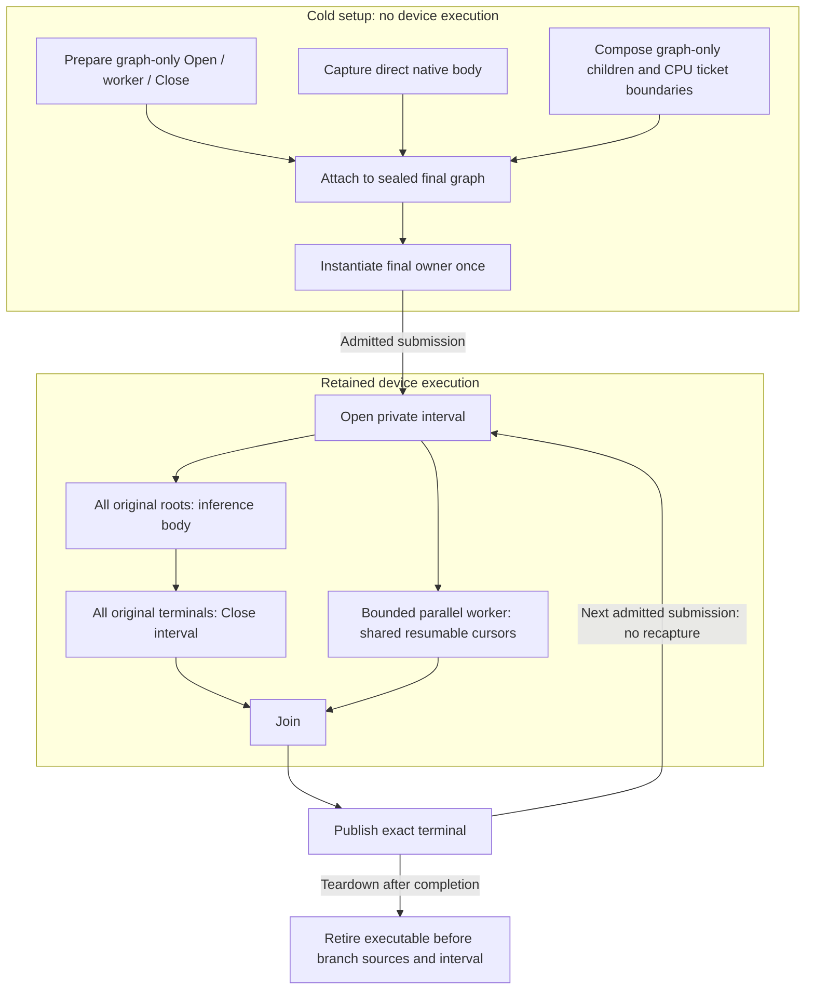

The worker may await Close, so it must never precede the body in a serial
dependency chain. New CPU-only DAG tests inspect every original root/terminal
and exact failure propagation. A symmetric real-device regression makes the
worker wait for Close over twenty retained replays, with a diagnostic-only
bounded escape before teardown. Existing held-inference/future-observer tests
now use this final attachment too. The refactor is **not yet gated**: the
13:03 targeted pass and earlier Unit/preflight receipts predate these edits.
Build log: `/tmp/e2e-parent-service-native-assembly-build.log`; initial focused
reproducer: `/tmp/e2e-retained-parent-service-cuda-red.log`.

13:46 follow-up: both builds complete. Unit passes **633/633**, **68.15 s**
(`/tmp/e2e-parent-service-unit-gate.log`). The fresh-process stability gate
passes **20/20 rounds**, each with 22 transfer tests, two CUDA graph tests and
two ROCm graph tests: **520 successful test executions**. The shared native
ordering test itself performs twenty retained replays in each invocation.
Receipts: `/tmp/e2e-parent-service-stability-{transfer,cuda,rocm}-{1..20}.log`.
An additional extension of the existing CUDA conditional-owner test decorates
both conditional outcomes, with/without timing, and destroys graph-only sources
before replay. It checks that native conditional handles are never cloned as a
side effect of attachment. The full 93-entry preflight is now building/running;
the exact Release CPU-tier retry remains next. No production changes followed
the successful stability and Unit runs.

13:51 follow-up: preflight passes **93/93**, **220.83 s**, including the
extended conditional-owner test and both native-ordering/CPU-ticket binaries
(`/tmp/e2e-parent-service-preflight.log`). The exact CUDA2/CPU2 Release retry
is running with unchanged typed topology/feature arguments and persistent
tmpfs staging: `/tmp/e2e-cuda2cpu2-final-parent-attachment.{json,log}`.

### September 6, 13:03 UTC: mixed 122B cell green, long transfer stalls removed in this run

`/tmp/e2e-mixed122b-hosted-verifier-authority.json` is **PASS**, **394.907 s**
cell wall. All **43/43** harness checks and all **eight** long-context checks
pass: three 5230–5232-token needles, strict multi-needle JSON, 2048 generated
tokens (160 numbered lines without resets/duplication), cache reset, a valid
7595/8192 boundary and oversized-input rejection. Shutdown exits zero and GPU
VRAM returns to its exact baseline (42 MiB before/after). The log contains no
WARN or ERROR records, including none of the previous 20–25-second chunk stalls.
Artifacts are `/tmp/e2e-1788699431301299836/1/`; the merged PerfStats document
retains **106751** records from both ranks.

Count topology-wide controller observations from **rank 0 only**: rank 1
reports the same committed transactions and must not double their totals.
The new run proves **19 committed transactions**, **170 edges** and
**3208642560 physical bytes**: **36 promotions**, **36 demotions** and **98
same-priority moves**. CUDA submitted 1728 service commands; ROCm's native
progress submitted 2532. Dynamic MTP executes with maximum/captured depth 15
and reports actual depth-14 states, so the repaired route is exercised.

The old receipt `/tmp/e2e-mixed122b-request-summary-default.json` completed
behavioral checks but failed its warning gate. Compare the per-operation
`remote_projection_wall_ns` observations with `purpose=placement_change`;
every selected record has count=1. These times include the complete endpoint
operation, not isolated copy-kernel time:

| Endpoint observation | Previous native queued client | Shared bounded service |
|---|---:|---:|
| Observations | 264 | 744 |
| Median | 342.657 ms | 181.004 ms |
| p95 | 26869.931 ms | 410.561 ms |
| Maximum | 26993.638 ms | 421.744 ms |
| Completed topology moves | 43 | 170 |
| Completed physical bytes | 811597824 | 3208642560 |

The run removes the long transfer tail while completing roughly four times as
much movement. It is **not** an end-to-end inference speedup certificate:
whole-cell wall was 368.033 s before versus 394.907 s now, with different
movement counts. Current gate receipts remain Unit **633/633**, preflight
**93/93**, engine **87/87**, the 200-retained-replay unit matrix, and twenty
symmetric TP-worker recording processes. No source changed after those gates.
Other topology refreshes, quantized CPU future-observer progress, explicit
service-storage physical accounting, obsolete API retirement and twenty full
suite repetitions remain open. Do not treat this targeted pass as a green
thirteen-cell aggregate.

### September 6, 12:46 UTC: hosted verifier omitted the captured service authority

The mixed retry `/tmp/e2e-mixed122b-bounded-service-recording-owner.json` is
**red**, not running or certified. Readiness, short HTTP/thinking/prefix/SSE
checks and the first two needles pass. At 12:34:35 both CUDA participants reject
an auxiliary-branch identity mismatch in the hosted all-position verifier at
dynamic depth 14. No long-transfer warning precedes that failure, but incomplete
execution/shutdown means this does not certify the transfer-delay fix.

The caller explicitly supplied `GraphCaptureAuxiliaryBranchFactory{}` while
materialization asked `IForwardExecutionHost` for the real epoch factory. The
cache guard is correct. `/tmp/e2e-hosted-verifier-authority-red.log` reproduces
the exact mismatch with a device-free retained graph. The interface correction
makes retained replay take the same host authority as materialization, and
resolves the factory inside the engine. The host query now accepts only device
identity; a transient ForwardInput was used only for incidental telemetry and
does not own this model-lifetime policy.

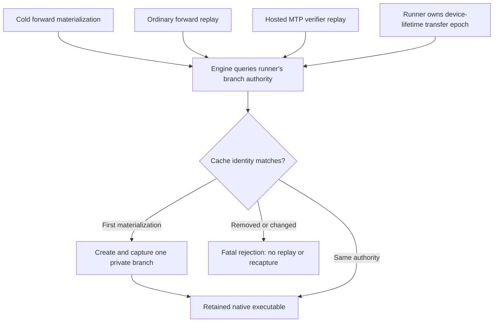

The regression sweeps CUDA/ROCm-shaped mock contexts and depths 1/2/3/14/15,
twenty retained replays each, one branch creation/fork/join, and negative
removed/replaced-authority checks. These are device-free engine lifecycle
tests; real-device branch recording is covered by the existing symmetric
preflight fixture. The new regression passes all 200 retained replays and its
negative cases (`/tmp/e2e-hosted-verifier-authority-green.log`). The complete
engine binary passes **87/87**, **18 ms**, in the sibling `-engine-all.log`.
The Release rebuild and all **621** Unit/preflight build actions passed.
Refreshed Unit passes **633/633**, **68.40 s**, and preflight passes **93/93**,
**221.32 s**, in `/tmp/e2e-hosted-verifier-authority-{unit-gate,preflight}.log`.
The 12:56 exact Release retry subsequently passed as recorded above, with report
`/tmp/e2e-mixed122b-hosted-verifier-authority.json` and sibling `.log`.

### September 6, 12:08 UTC: repeat gate, Unit gate, and Release transfer economy

**12:16 follow-up:** the mixed Release retry failed before readiness, in the
first auxiliary capture fork on both CUDA participants (about 70 s including
load/setup). It did not reach transfer latency or HTTP correctness checks.
`CapturedBranch::recordFork/Join` incorrectly required the epoch context's
private resource-worker thread. Production records on persistent TP workers;
`IWorkerGPUContext::recordEventChecked/waitEventChecked` already explicitly
admit that capture owner and establish the exact device. Focused proofs had
recorded only inside `context.submitAndWait`, so they missed this integration
boundary. New symmetric TP-worker recording regressions are being added to the
existing preflight fixture before changing production. The correction must
retain the native capture on its caller thread, not dispatch individual event
edges to another worker.

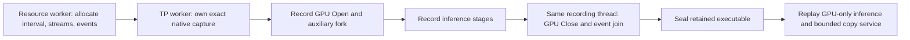

**12:23 follow-up:** the model-free reproducer in
`/tmp/e2e-service-recording-owner-red.log` fails exactly at CUDA's TP-worker
fork while ROCm passes. Production now checks the active native-capture scope,
with an explicit `Unrecorded -> Forked{stream, thread} -> Joined` variant;
resource-worker identity is no longer incorrectly used as recording authority.
The matching join rejects a different stream/thread. No extra host dispatch,
GPU wait, or copy-kernel change was introduced. The corrected regression passes
on both backends (`/tmp/e2e-service-recording-owner-green.log`) and **20/20 fresh
processes passed both tests**, **40 executions**, in
`/tmp/e2e-service-recording-owner-repeat-{1..20}.log`. Each tests both directions
with held inference and 32 future observers. Both tests belong to the existing
`V2_Integration_MappedTransferProgressEpoch` preflight registration. Refreshed
Unit passed **633/633**, **72.21 s**, and preflight passed **93/93**, **222.93 s**;
receipts are `/tmp/e2e-service-recording-owner-{unit-gate,preflight}.log`.
The complete transfer registration now includes 22 GTests. The subsequent Release
retry failed as described in the 12:46 entry, with report
`/tmp/e2e-mixed122b-bounded-service-recording-owner.json` and sibling `.log`.

The expanded transfer fixture completed **20/20 fresh processes**, each passing
all 20 GTests: **400 successful test executions**. The rebuilt full Unit gate
also passed **633/633** in **67.95 s** (`/tmp/e2e-service-clients-unit-gate.log`).
Unit plus all 56 CTest-discovered preflight executable targets rebuilt cleanly
in `/tmp/e2e-service-clients-gate-build-2.log`. The registered integration
preflight subsequently passed **93/93**, **221.10 s** wall, in
`/tmp/e2e-service-clients-preflight.log`.

The Release build completed. Unprofiled `BoundedTransferServiceEconomy.*`
passed byte checks for four concurrent 4 MiB commands in each direction
(`/tmp/e2e-service-clients-economy.log`):

| Direction | Median device-active time | Median publication-to-receipt wall | Payload throughput |
|---|---:|---:|---:|
| CUDA → mapped host | 1.339 ms | 1.420 ms | 11.818 GB/s |
| Mapped host → CUDA | 2.172 ms | 2.295 ms | 7.312 GB/s |

Separate isolated Nsight launches for each direction passed their byte checks;
their timing is **not** used in the table. Reports are
`/tmp/e2e-service-clients-{d2h,h2d}-ncu.ncu-rep` with exported `-details.log`
siblings. Both show **zero local-memory spill requests**, **36 registers per
thread**, and **4 × 256** launch geometry. Achieved occupancy is 16.67% on active
SMs (one CTA), deliberately leaving most SMs available to concurrent inference;
this is a bounded background service, not a standalone full-device GEMM.
Compiler resource inspection independently reports zero stack/local memory.

These are model-free correctness/economy results, **not** evidence that the
mixed 122B E2E delays are resolved. That first Release retry failed with report
`/tmp/e2e-mixed122b-bounded-service.json` and sibling `.log`, after both gates
passed. The quantized CPU service, canonical service-allocation accounting,
obsolete API retirement, thirteen-cell refresh and twenty full E2E suite repeats
listed below remain outstanding.

### September 6, 11:57 UTC: CPU/blob clients share receipts; expanded fixture green

CUDA local contiguous FP16/BF16/FP32 edges and remote raw GPU projection blobs
now reserve read/write slots in the fabric's shared progress epoch. Their
completion authority is the exact GPU generation receipt, not an event on an
unrelated native stream. `BackgroundTransferProgressBinding` requires explicit
setup selection of graph service versus the independently progressing native
mechanism; missing service authority is not a runtime retry. Standalone native
repack fixtures explicitly retain their native scope. Production CUDA fabric
clients receive the same epoch installed in main/follower graph branches.

`TransferProducerDependency` carries an exact producer event or already-published
source. The maintenance authority observes a pending producer before exposing
its command to the resident worker, without blocking other slots. Both CUDA
and ROCm have a captured blocked-producer regression proving independent work
finishes first. CUDA receipts now sum actual claimant nanoseconds across partial
retirement; CPU-edge economy consumes that measurement, never native timing
events around asynchronous service bytes. Host copy time remains separate.

Two setup/fixture defects were fixed during this integration: command slots may
be smaller than the epoch-wide maximum (each publication still validates its
own mapped extent), and global command IDs must not index a client's local
buffer vector after other clients reserve slots. The latter caused the interim
test SIGSEGV and was pinpointed with GDB; it was not a device numerical fault.

Current receipts:

- `/tmp/e2e-service-clients-focused-3.log`: registered complete transfer fixture
  **PASS**, all **20 GTests**, **19.85 s** CTest wall.
- `/tmp/e2e-service-clients-focused-2.log`: mapped-host Unit registration passed;
  the transfer fixture in that *earlier* receipt crashed on the now-fixed local
  index mistake. Do not cite it as a green combined gate.
- `/tmp/e2e-service-clients-repeat-{1..20}.log`: **12/20 fresh processes passed
  as of 11:57 UTC**, continuing. Each run covers local FP16/BF16/FP32 and remote
  blobs in both directions, both held inference alone and 32 future observers,
  partial resume, exact producer admission, and the existing generation sweeps.
- `/tmp/e2e-service-clients-cuda-resources.log`: new timing retains **36 registers,
  zero stack/local memory**, shared storage **92 bytes**. This is compiler
  resource evidence, not an end-to-end performance certificate.

Active work at this checkpoint:

- Repeat session `54357` continues the 20-process transfer gate.
- Build session `30566`, `/tmp/e2e-service-clients-gate-build.log`, builds Unit
  plus **56 CTest-discovered preflight binaries** after the IBackend ABI change.
  It encountered two shared test headers missing the new explicit binding;
  those headers are fixed, but the build must finish and be rerun before gates.
- Release session `46449`, `/tmp/e2e-service-clients-release-build.log`, builds
  `llaminar2` plus `v2_perf_background_mapped_copy`.
- New `BoundedTransferServiceEconomy.CUDADownload4MiB`/`CUDAUpload4MiB` cases in
  that performance binary measure four concurrent 4 MiB commands with separate
  device-active and end-to-end copy timings and byte checks. They are **not yet
  built/run/profiled**, and remain outside functional preflight by design.

**Remaining, explicitly not certified:** compound quantized CPU repack/copy
still uses native kernels/events and needs the same future-observer proof and
implementation across every codebook. New service inbox/cursor/private-interval
storage still needs canonical physical-memory BOM/admission/materialization
claims. The obsolete unused claim/snapshot entrypoints remain to be removed.
No Release E2E retry has run with these client changes. The thirteen-cell
campaign and twenty complete E2E suite repetitions remain outstanding.

### September 6, 11:03 UTC: production bounded service integration in progress

The CUDA copy service is now implemented behind `TransferEngine`, not just the
standalone prototype. `MappedTransferProgressEpoch` keeps its permanent host
directory but maps only execution-concurrency-sized commands/receipts. A
device-only claimant/cursor is shared by graph branches and finite idle passes;
an enqueued-but-starved idle pass cannot reserve execution. Each graph owns its
own GPU Open/Closed word, fork and terminal events. Private words are never
reset by a host update. A 64 KiB quantum bounds partial retirement; every copying
thread system-fences before receipt/claim publication. Four independent CTAs
service the bounded inbox. Main and follower graph factories use the same epoch
identity during setup and replay. ROCm remains native SDMA, as established by
the symmetric future-observer regression.

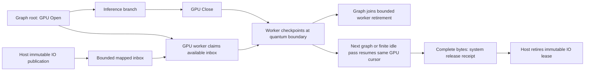

New focused integration covers future native observers through the actual epoch
branch, and a production-ABI partial-retirement test checks joined cursors,
same-executable resume, changed generations, both directions and unaligned
tails. Device-free TransferEngine tests reject contradictory lifetime, device,
bounds and stream identities. The synchronization source policy passes; its one
new approved wait is exact service-event retirement in the epoch destructor.
The initial backend compile reports **36 registers, zero stack/local memory,
84 bytes shared** (`/tmp/e2e-bounded-service-cuda-resources.log`).

**Not certified yet:** Integration build and device execution are still in
progress (`/tmp/e2e-bounded-service-integration-build-2.log`). The full preflight
and Release E2E results have not been refreshed. CPU-edge compound repack/copy
clients still require the future-observer audit; the new epoch path alone must
not be described as proving those clients. The new service allocations also
need explicit admission/materialization BOM coverage through the physical
memory authority before the implementation is ready for production acceptance.
Obsolete unused snapshot/claim transfer entrypoints must be retired after the
replacement proof, not retained as a second implementation.

#### 11:19 UTC: focused production proof green; complete fixture exposes remaining clients

The initial focused run passed partial resume and ROCm but rejected CUDA's
attempt to import an uncaptured initialization event inside graph capture.
Cold epoch construction now joins exactly its cursor-initialization event once
before returning. Capture owns only its private Open/fork/Close/join edges. The
extra setup event member was removed; initialization reuses the existing idle
terminal event. Source policy approves this exact setup join plus the exact
destructor idle join, not any inference/maintenance wait.

Receipts on the compiled production implementation:

- `/tmp/e2e-bounded-service-unit.log`: **12/12** device-free mapped-transfer tests.
- `/tmp/e2e-bounded-service-focused-cold-ready.log`: **3/3**, 2.623 s.
- `/tmp/e2e-bounded-service-repeat-{1..20}.log`: **20 fresh processes, 60/60 test
  executions**. Each process checks 32 CUDA and 32 ROCm copies in both directions
  under future native observers, plus four changed partial/resume generations
  (both directions, aligned/unaligned, byte-exact data and untouched guards).
  Thus 80 command generations actually exercised partial graph retirement.
- `/tmp/e2e-bounded-service-sync-policy-final.log`: source policy **PASS**.
- `/tmp/e2e-bounded-service-full-fixture.log`: **17/18 GTests**, registered
  `V2_Integration_MappedTransferProgressEpoch` **RED**, 18.82 s CTest wall.

The remaining fixture failure is
`CUDACPUWeightEdgesShareProgressSafePool`: D2H local FP16/BF16/FP32 and remote
blob lanes finish only **29–30/32** native-event receipts before the deliberately
held inference graph is released. All commands drain and bytes compare after
release; H2D and the other 17 tests pass. This is not a new numerical failure.
The graph-bounded service fixes its own clients, while direct CPU/remote lanes
still submit kernels and observe native events on queues subject to the same
starvation. Capturing the service changes native queue occupancy and makes that
remaining dependency visible even without the fixture's additional observers.
Do not remove this test or omit the graph branch to conceal the integration gap.

**Next critical path is the actual E2E client, not another model retry.** The
mixed-cell log explicitly names `MoEOverlayGpuRemoteProjectionLane` source
gate/up/down `gpu_blob_read` operations on CUDA:0/1, not merely relay epoch
commands. Those methods still call `enqueueBackgroundStagingCopy` followed by
`fenceSubmissionLocked`, and `poll()` waits for a native event. Route the remote
blob and local floating copy clients through the same bounded service and
generation receipt. Extend the per-device physical inbox/BOM to cover those
roles (epochs are currently created only for non-direct local GPU relay edges).
Compound CPU-format repack/copy clients must also be audited under future
observers for every codebook; making only the floating/blob clients green does
not certify quantized CPU edges. Native timing-event measurement must not be
silently retained around an asynchronously serviced copy, because those events
would no longer bracket its bytes. Preserve exact production timing evidence.

No Release rebuild or E2E retry was made on this partial integration. No full
Unit/preflight claim is made for this tree: the expanded transfer fixture is
currently red, and the IBackend ABI change requires rebuilding all gate binaries
before running the broader gates. The thirteen-cell campaign and twenty full
campaign repetitions remain outstanding.

### September 6, 09:55 UTC: CPU startup root cause; bounded-copy prototype

The Qwen3.6 CPU2 cell completes all behavioral scenarios but finishes 42/43:
the CPU-only server owns 1024 MiB of CUDA contexts. Its report is
`/tmp/e2e-cpu-unseen-request-summary.json`. A concurrent diagnostic contaminated
the global GPU-memory delta in that run, so that delta is not an isolated
measurement. The server-owned contexts were independently reproduced in an
otherwise idle Ornith CPU2 run: each CPU rank owned 256 MiB on each 3090.
That diagnostic was interrupted through the runner's normal process-group
cleanup once the defect was established; it is not a certificate.

The startup ordering defect is in `MPIBootstrapPhase`: named CPU domains did
not count as CPU intent, and device inventory happened before the old CPU-only
startup policy was installed. The already-in-MPI early return also preceded
that policy. CUDA discovery consequently created otherwise unused primary
contexts. Typed device declarations now select the existing startup authority
before either boundary. Both dense and routed GPU participants override CPU
intent; MPI rank count or collective backend alone do not imply a device type.
The focused real-driver test fails before the fix and passes in twenty fresh
processes afterward. Pure Unit cases cover CPU shorthand, named domains,
device maps, TP, topology trees and both GPU vendors in mixed plans. The new
real-driver regression is in the canonical preflight inventory. Receipts:
`/tmp/e2e-cpu-bootstrap-regression-red.log`,
`/tmp/e2e-cpu-bootstrap-focused-green.log`, and
`/tmp/e2e-cpu-bootstrap-integration-repeat20.log`.
Release and all gate executables have rebuilt; full Unit/preflight and CPU
E2E recertification are pending at this checkpoint.

At 10:00 UTC the rebuilt startup slice passes **633/633 Unit in 68.51 s** and
**93/93 preflight in 212.34 s**. Receipts:
`/tmp/e2e-cpu-bootstrap-full-{unit,preflight}.log`. The unchanged canonical
Qwen3.6 CPU2 and Ornith CPU2 cells are running sequentially with report target
`/tmp/e2e-cpu-bootstrap-cpu-cells.json`, artifacts
`/tmp/e2e-1788688823951120704`. Both models are persistent tmpfs hits, with zero
copied bytes. No GPU diagnostics or competing builds run during these CPU
certificates. The live Qwen CPU server owns no CUDA memory.

Both CPU cells subsequently finish **43/43**, including all eight long-context
scenarios, clean logs, full runtime evidence and clean shutdown. Qwen3.6 CPU2
takes **582.91 s** and Ornith CPU2 **585.67 s**. Each explicitly reports
**0 MiB process GPU memory and 0 MiB global GPU-memory delta**. The completed
report above has `correctness_passed: true`. These timings remain close to the
unchanged 600-second cell watchdog; this startup fix is not a CPU throughput
optimization.

Two additional integration cases extend the existing
`MappedTransferProgressEpochIntegration` proof to 32 native future observers,
both copy directions and both GPU vendors. They use the real TransferEngine
and queue real observer kernel work after each wait. All deliberate waits are
released and drained before asserting, even on failure. After the CPU cells
exit, the focused run reproduces **CUDA 0/32 before release in both directions**;
ROCm completes every copy. All CUDA bytes drain correctly afterward. Receipt:
`/tmp/e2e-future-observer-regression-red.log` (4.09 s). These tests belong to the
existing preflight fixture, but were added after its preceding green receipt:
the expanded CUDA transfer gate is currently **red**. The Release runtime was
not changed during either CPU certificate.

The transfer investigation has a promising **unintegrated prototype**, not a
production fix. A copy worker rooted inside the captured parent makes progress
while 32 native consumer streams wait for that parent's inference branch.
The inference branch device-publishes its terminal generation, bounding the
worker lifetime without a host stop signal. Twenty fresh processes, three
replays each, complete all 32 four-MiB copies before deliberate inference
release: 128 MiB in 10.808–12.196 ms (median 11.389 ms). The otherwise identical
independently submitted finite-copy baseline completes 0/32. Prototype receipts:
`/tmp/cuda_graph_bounded_copy_progress_repeat20.log` and
`/tmp/cuda_graph_future_wait_baseline.log`. The compiler reports 26 registers
and zero stack/spills for the one-CTA, 256-thread candidate. These small fixed-
geometry results do not certify production transfer economy or all formats.

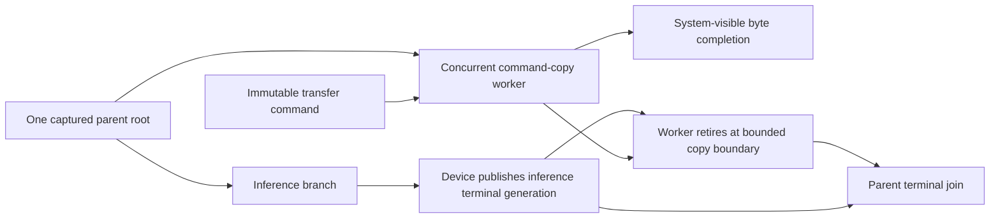

A model-lifetime worker is deliberately rejected: an independent allocator
probe shows `cudaFreeHost` blocked until such a worker stops (300.75 ms for a
deliberate 300 ms hold). Production prefix-cache eviction frees pinned pages,
so an indefinitely resident worker would create a new lifetime deadlock.
This allocator probe rules out that design; it does not establish allocation
as the cause of the model's 20-second chunk waits. Before installation, the
graph-bounded design still needs exact command ownership, bounded partial-copy
retirement, idle progress, lifecycle regressions and real-model validation.

#### Bounded partial-copy proof and economy (10:30 UTC)

The prototype now checkpoints a partially copied command at 64-KiB boundaries,
retires with the inference interval, and resumes the same command in the next
replay of the same captured executable. Each command generation changes every
source byte and poisons every destination, with full-byte validation after
completion. An initial implementation performed excessive mapped-host cursor
publication and fences, taking approximately 33 ms per 128 MiB. Keeping the
interval completion authority in VRAM and fencing only publication/retirement
boundaries restores approximately 11.4 ms; no deadline is increased.

| Diagnostic proof | Fresh processes / replays | Outcome |
| --- | ---: | --- |
| Stop partway through the backlog, then resume the same commands | 20 / 60 | Every retirement is partial; every resumed byte matches |
| Complete copies while 32 future observers and 32 captured D2H leaves remain held | 20 / 60 | 32/32 commands complete before deliberate release on every replay |

Unprofiled receipts:
`/tmp/cuda_graph_bounded_partial_progress_repeat20.log` and
`/tmp/cuda_graph_bounded_quantum_progress_repeat20.log`. Complete-copy times are
11.338–11.569 ms (median 11.416 ms), approximately 11.76 GB/s. Partial/resume
times are 11.219–11.649 ms (median 11.385 ms). The host release-to-parent-return
observation is 30.463–62.305 microseconds; it includes the inference branch's
own exit and driver observation, not just worker retirement.

A separate Nsight Systems trace authenticates overlap and worker termination:
`/tmp/cuda_graph_bounded_partial_progress_trace.nsys-rep` and its SQLite export.
There is one active parent at a time, making its contained terminal publisher
unambiguous. The worker ends 13.760–19.520 microseconds after the GPU terminal
publisher during partial copies, and 2.496–3.168 microseconds afterward when
idle. This profile is not mixed into the preceding timing samples. CUDA reports
one 256-thread CTA, 34 registers, 16 shared bytes, zero local memory and zero
compiler spills; the geometry permits six CTAs per SM (100% theoretical
occupancy), while the actual service intentionally launches only one CTA for
the device. Resource receipt:
`/tmp/cuda_graph_bounded_partial_progress_resources.log`.

Source: `/tmp/cuda_graph_dma_progress_probe.cu`; latest executable:
`/tmp/cuda_graph_bounded_partial_progress_tuned_probe`. Full-copy arguments are
`32 1 1 32 0 1 32 0 0 0 0 1 1 0`; stop/resume arguments are
`32 0 1 0 0 1 32 0 0 0 0 1 1 1`. These are diagnostic selectors, not CLI options.

**Production integration remains outstanding.** In particular, the real epoch
must preserve exclusive command ownership across captured and idle progress,
bound GPU-visible inbox size by execution concurrency rather than the complete
topology directory, retain inactive/source regions until byte completion, and
retire the worker at the graph boundary without waiting for the command backlog.
Its buffers belong in the canonical physical-memory BOM, and its private
interval control must be GPU-owned with captured open/close transitions rather
than a host-maintained execution shadow. GPU/CPU repack clients sharing the
same stream pool must be included in the proof, not just GPU relay blobs.
ROCm's demonstrated native SDMA progress must remain intact. Neither the new
CUDA regression nor the mixed 122B E2E cell is green yet; the prototype is not
an installed transfer fix or a production throughput certificate.

### September 6, 09:15 UTC: four ROCm certificates; CUDA delay still fails

`/tmp/e2e-rocm-unseen-request-summary.json` is green for all four selected
cells, each with 43/43 checks and the full eight long-context scenarios:

| Canonical cell | Elapsed seconds |
| --- | ---: |
| Ornith 1.5, ROCm2 local TP overlay | 159.05 |
| Qwen3.6 MoE, ROCm1 | 118.07 |
| Ornith 1.5, ROCm1 | 126.42 |
| Qwen3.8 dense, ROCm1 | 378.02 |

The default-environment mixed CUDA2/ROCm4 122B rerun completes every behavioral
check, movement evidence, and clean shutdown/VRAM release, but still fails its
strict log gate. Five transactions and 43 migration edges complete (811597824
physical bytes, reported consistently by both ranks); individual chunk events
remain pending for 20–25 seconds and emit 199 warnings. Report:
`/tmp/e2e-mixed122b-request-summary-default.json`; artifacts:
`/tmp/e2e-1788684297622628219/1`. It is **not a green cell**. These warnings
must be resolved, not filtered out or moved to a lower log level for a pass.

The large report also exposes a harness defect: `printf | head -40` under
`pipefail` aborts reporting with SIGPIPE (141). The bounded excerpt now drains
its input, retaining the failure and later MPI/shutdown diagnostics. A real
shell regression reproduces 141 on 199 long warnings before the fix and
reports the correct ordinary failure afterward; clean and single-warning
logs are covered too. The existing Unit script gate passes after the fix:
`/tmp/e2e-log-scan-pipe-{red,green}.log`.

A CUDA-only reduction now distinguishes a held graph from independently
parked consumer streams. One held captured graph with parallel D2H leaves
allows all 32 unrelated SM copies to finish. Add native event waits on 1, 2,
4, or 8 consumer streams, and only 29, 25, 17, or 0 copies finish before the
deliberate source release. The probe always releases the source and validates
all destination bytes before cleanup. Maximum copy priority does not help;
32 work queues only partly help. Event-wait graphs and separately launched
acquire kernels also fail the eight-stream case. These are diagnostic probes,
not installed production fixes or complete attribution of the model stall.
Source: `/tmp/cuda_graph_dma_progress_probe.cu` and its diagnostic executables.

The prior production trace contains native waits from the prefix observation
stream onto the long-prefill producer, with archive kernels submitted at
118.039 s and entering at 151.552 s. This establishes the relevant dependency
shape for further isolation. Do not restore a raw cached producer-stream
pointer to avoid the wait: cache invalidation can retire that stream, which
the existing durable-publication lifecycle deliberately prevents.

### September 6, 08:40 UTC: serving logs accidentally observe live GPU state

The mixed-cell Nsight timeline contains 780 `cudaDeviceSynchronize` calls
after readiness. A live breakpoint authenticates their caller chain:
`ChatCompletionHandler::logRuntimeStateSummary` → runner `prefixStateProbe`
→ `inspectKVCacheForPrefixProbe` → cache `get_head_position` →
`observeDeviceSequenceState` → device synchronization. The snapshot was
computed before the INFO macro, so disabling INFO did not remove the work.
The analogous HIP cache observer also synchronizes. Evidence:
`/tmp/e2e-mixed122b-device-sync-callsite.log` and
`/tmp/e2e-mixed122b-remote-copy-timeline.nsys-rep`.

Ordinary serving now requests a narrow `RequestRuntimeSummary`, projected from
the existing prefix outcome and validated terminal MTP ledger. It neither
walks child runners nor observes live cache positions. The explicit deep probe
remains available for diagnostic callers and reuses the same summary builder.
This adds no second ledger or host shadow of device state. HTTP/SSE regressions
forbid deep probes at both INFO and WARN; a facade regression proves summaries
do not inspect the child and retain the same terminal facts.

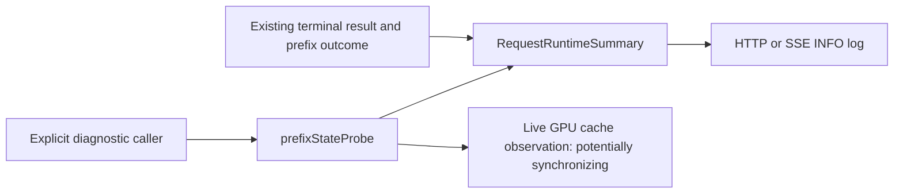

This is a proven logging defect, not yet proof that it explains every remaining
movement timeout. A separate `CUDA_DEVICE_MAX_CONNECTIONS=32` diagnostic passed
42/43 checks, with no physical timeout. Its sole failure was actually an
observer gap: completed all-GPU controller transactions, migration edges and
physical bytes were present, but the validator only recognized host and
homogeneous-device movement counters. The validator now requires all three
completion counters from that authority, rejects incomplete/proposed movement,
and rejects any completed movement in Static. CUDA/ROCm symmetric regressions
and all 102 script tests pass (`/tmp/e2e-overlay-movement-observer-green.log`).
The old report is preserved, not relabeled green. No work-queue environment
change is installed. Release and the complete Unit/preflight inventory have
rebuilt. Unit passes 633/633 in 67.70 seconds
(`/tmp/e2e-request-summary-full-unit.log`), and both new focused regressions
pass twenty iterations (`/tmp/e2e-request-summary-{http,facade}-20.log`). Full
preflight passes 92/92 in 208.56 seconds
(`/tmp/e2e-request-summary-full-preflight.log`). The exact mixed 122B cell is
now running under the default environment; no debugger or profiler is attached.

### September 6, 08:12 UTC: physical receipts isolate submitted CUDA events

The command-local diagnostic rerun fails after 374.90 seconds:
`/tmp/e2e-mixed122b-remote-event-diagnostic.json`, artifacts
`/tmp/e2e-1788681545033462365/1`. Transaction 35 has 22/27 projections ready.
Its remaining operations include both ROCm-to-CUDA uploads and CUDA-to-ROCm
downloads on CUDA:0, unlike the previous CUDA:1-only receipt. Therefore this is
neither one broken card nor exclusively one transfer direction.

The exact chunk terminal events remain not-ready for up to forty seconds,
with over 200000 successful native not-ready observations per affected lane.
They are already submitted, not waiting to acquire a staging slot. The worker
is actively polling. These observations do not yet distinguish GPU scheduling
from an earlier dependency on the same native queue.

CUDA's canonical background path uses prepared bounded SM copy kernels; HIP
uses explicit SDMA. Reverting CUDA to ordinary DMA would reintroduce the
independent-copy queue failure documented below. The next diagnostic is a
captured-graph timeline and a model-free reduction of the actual blocking
relationship, not a longer deadline or a collective replacement.

All Unit/preflight executables have rebuilt against the diagnostic lane layout.
Unit passes 633/633 in 68.60 seconds
(`/tmp/e2e-remote-event-all-unit.log`); the focused remote MPI integration
passes in 2.62 seconds (`/tmp/e2e-remote-event-focused-preflight.log`). The full
92-case preflight has not yet been rerun after these diagnostic additions.

### September 6, 07:38 UTC: aggregate first failure is physical movement

The fresh aggregate passes Qwen3.6 CUDA (55.39 s) and Qwen3.8 dense CUDA
(160.66 s), then stops at the mixed 122B CUDA2/ROCm4 cell (363.99 s).
Report: `/tmp/e2e-thirteen-paragraph-aggregate.json`; artifacts:
`/tmp/e2e-1788679694691297487/3`. Remaining ten cells were not admitted.

The mixed cell passes both thinking modes, A/B/exact-prefix restore, SSE,
all three needles, multi-needle JSON, 2048-token structured generation, and
cache reset. During the valid near-boundary request, rank zero times out
waiting for physical projection transfers in device transaction 36, base
epoch 21, candidate 22, seven movement commands. Both groups have snapshotted
transaction 36; neither has prepared it. No new placement was published.
MPI abort then produces derivative memory, missing-PerfStats, and shutdown
failures: six failed harness checks are not six independent defects.

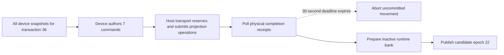

The first error omitted which projections were pending. A fatal-only diagnostic
now formats existing physical receipts and immutable endpoints before abort,
including poll counts. Its complete focused Unit family passes 10/10, and the
full Unit gate passes 633/633 (68.27 s). The exact-cell rerun reproduces after
366.38 s (`/tmp/e2e-mixed122b-projection-diagnostic.json`, artifacts
`/tmp/e2e-1788680722143227603/1`). Transaction 33 has 15/18 projections ready;
only layer 46, expert 35, gate/up/down from rank-1 ROCm:3 (participant 5) to
rank-0 CUDA:1 (participant 1) remain pending. The ROCm group has prepared the
transaction. Rank zero serviced 283925 quanta and 567868 operation polls, so
the worker was not simply unserviced. The root cause is still not established.

Remote GPU endpoint lanes now reuse the command-local progress-watch helper
to distinguish a native-event wait from an unacquired staging lane. Its
five-second warnings reuse existing not-ready observations and reset per chunk;
no extra device query or synchronization is added. Timing/reset Unit tests
pass. The exact mixed-cell diagnostic is queued after its rebuilt remote-MPI
integration regression (`/tmp/e2e-mixed122b-remote-event-diagnostic.json`).
All Unit/preflight executables are rebuilding for the updated lane layout;
the earlier full preflight receipt predates this diagnostic instrumentation.
The twenty full Qwen3.6 CUDA repetitions remain valid evidence for the prior
event/prompt fixes; the full aggregate is **not green**.

### September 6, 06:59 UTC: reference reproduces the remaining answer loop

The final event fix passes Unit 633/633 (67.95 s), preflight 92/92 (208.87 s),
and twenty process repetitions of both symmetric GPU regressions (63.50 s).
Receipts: `/tmp/e2e-forced-boundary-unit-gate.log`,
`/tmp/e2e-forced-boundary-preflight.log`, and
`/tmp/e2e-forced-boundary-20-repeat.log`.

The queued full-cell loop nevertheless stops on iteration one (55.90 s),
`/tmp/e2e-qwen36-cuda-forced-boundary-repeat-1.json`. Arithmetic A terminates
naturally in 48 tokens; arithmetic B repeats `14` to the 200-token request
limit. All eight long-context checks and runtime-feature assertions pass.
Iterations 2–20 and the thirteen-cell aggregate **did not start**.

Fresh Release MTP-off and MTP-on servers reproduce identical B outcomes:
budget 16 loops on both the first and repeat request; budget zero terminates in
27 tokens and budget 64 in 91. No A-to-B cache transition is needed.
See `/tmp/e2e-thinking-branch-b-comparison.log` and the corresponding
`/tmp/e2e-thinking-diagnostic-mtp-{off,on}_branch_b` artifacts.

The independent reference loads the exact staged GGUF into Hugging Face on CPU
in FP32, authenticates the native prompt length and recorded token prefix,
and prefills the exact prompt plus sixteen native reasoning tokens and the
forced stop phrase. It generates the same repeating `14`, newline, closing
thinking marker, blank line pattern. The loop has large top-logit margins,
not near-tied EOS rounding. Evidence:
`/tmp/e2e-forced-thinking-hf-reference/{input,continuation}.json`.

The model schemas omit the leading blank paragraph and space in
[Qwen's documented thinking-budget continuation](https://qwen.readthedocs.io/en/stable/getting_started/quickstart.html#thinking-budget).
This joins the phrase directly to a truncated reasoning heading. The reference
A/B run changes only that boundary and now produces `14` followed by EOS in
three tokens (`/tmp/e2e-forced-thinking-hf-paragraph-reference`). All original
reasoning tokens, weights, FP32 math, greedy policy, and prompt stay fixed.
Schemas now share `qwenStopThinkingPrompt()` so the exact continuation cannot
drift among dense and MoE models. A device-free factory regression fails for
all three old schemas before the fix
(`/tmp/e2e-thinking-paragraph-red-actual.log`), and passes after correction
(`/tmp/e2e-thinking-paragraph-green.log`). The Release diagnostic now completes
both first and repeated B requests naturally in 44 tokens, content exactly
`14` (`/tmp/e2e-thinking-paragraph-native-diagnostic.log`). Budgets zero and 64
also finish naturally; unbounded reasoning still truthfully reaches its
200-token diagnostic limit. Full Unit passes 633/633 (73.66 s) and preflight
passes 92/92 (210.28 s). Twenty complete canonical CUDA-cell repetitions pass
20/20, each with all 43 HTTP/long-context/runtime checks, in 54.49–55.60 s per
run. Receipts: `/tmp/e2e-qwen36-cuda-paragraph-repeat-{1..20}.json` and
`/tmp/e2e-paragraph-certification-progress.log`. The thirteen-cell aggregate
started at 07:28:14 UTC on the same Release binary, with all model files reused
from the persistent tmpfs cache.
The new aggregate report is `/tmp/e2e-thirteen-paragraph-aggregate.json`; no
completion is claimed before that receipt exists and passes. No EOS gate,
budget, sampling policy, or numerical tolerance is relaxed.

### September 6, 06:43 UTC: forced-token and sidecar event ownership

Publication diagnostics change the failing response to natural EOS in 43
tokens, whereas the normal MTP path can repeat through 200 tokens. Diagnostics
perform exact-event host observations, so this is an ordering clue, not a
production fix. Two different dependencies must be distinguished:

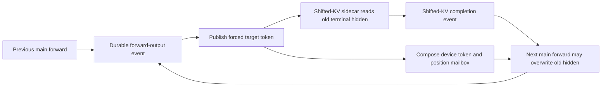

The installed main-forward prelude now observes the existing shifted-KV event
before its fast path, protecting the pending sidecar's source read without
consuming the next sidecar's handoff. Model-free tests invoke that actual
prelude, hold the reader, and attempt a captured overwrite. Both CUDA and HIP
pass twenty process repetitions, each containing twenty interleavings across
all three forward roles (`/tmp/e2e-main-reader-20-repeat.log`). Unit passes
633/633 in 67.98 s and preflight passes 92/92 in 210.31 s. The first fixture
revision expected a false return for null streams instead of the actual fatal
exception; its release gate also queued behind HIP DMA during failure cleanup.
The corrected fixture uses the established host-owned mapped test gate and
checks the real exception contract.

This edge alone is **insufficient**: a normal Release diagnostic finishes its
first budget-16 request in 48 tokens but repeats to the limit on request two
(`/tmp/e2e-thinking-diagnostic-mtp-on_reader_fixed`). Normal target sampling
joins the current forward-output publication; forced-token staging did not.
The next candidate routes forced staging through that existing event-aware
sampler boundary, retaining the logits handoff and accepting the current typed
output kind. It adds no host synchronization, allocation, or kernel. Symmetric
tests call the actual forced-token method with a held preceding forward and
an arena-owned token slot. The prior Integration DSO is preserved at
`/tmp/e2e-forced-boundary-control-library` for a red-before comparison, not as a
runtime alternative. With that exact DSO, both backends overwrite the token
before the held forward retires and the reader observes the wrong bytes on
every round (`/tmp/e2e-forced-boundary-red-control-warm.log`). Both tests pass
with the fixed library. The fixture warms the scalar kernel before closing its
gate; an initial un-warmed version stalled in CUDA first-use module loading,
which is preparation rather than the publication invariant under test.

All five ordinary Release diagnostic requests now match the MTP-off output,
finish reason, and token count, including the repeated budget-16 request and
budgets zero/64 (`/tmp/e2e-thinking-diagnostic-mtp-on_forced_boundary`). Twenty
more exact HTTP requests all finish naturally with the same 48 tokens, without
tracing or publication diagnostics (`...-on_forced_boundary_repeat20`). These
are focused requests, not the full E2E cell. Unit passes 633/633 in 67.95 s.
Twenty repetitions of both GPU regressions, then full production preflight,
then twenty **complete** canonical E2E-cell repetitions are sequenced in
`/tmp/e2e-forced-boundary-certification-progress.log`; only after all pass does
the thirteen-cell aggregate start. Final report:
`/tmp/e2e-thirteen-forced-boundary-aggregate.json`. No campaign completion is
claimed before that full receipt exists and passes.

### September 6, 05:56 UTC: reasoning framing must not terminate inference

The typed-contract aggregate stops at its first Qwen3.6 CUDA cell in 56.04 s;
all eight long-context checks and the complete runtime-feature validator pass.
The thinking arithmetic response contains correct arithmetic but stops before
the final answer. Adding exact request/response artifacts passes 99 focused
Python tests and Unit 633/633 in 67.63 s. A fresh diagnostic passes 43/43, but a
stop-on-failure 20-run loop reproduces on run 2 (56.44 s). Preserved evidence:
`/tmp/e2e-qwen36-cuda-response-repeat-2.json` and its `http_000012.response.json`.
It ends with `finish_reason=stop` after 175 tokens, not budget exhaustion.

The field splitter incorrectly owns a generation stop decision: a closing
thinking marker after any content enters `Stopped`. Budget injection already
closed reasoning, so a model's continued reasoning is classified as content;
its later natural delimiter terminates generation before its answer. An INFO
token trace confirms delimiter token 248069 immediately precedes HTTP finalization.
The backend-independent HTTP/SSE mock regression fails before the fix because
both paths make four decode calls instead of the six required to reach the
answer and EOS (`/tmp/e2e-reasoning-delimiter-red-test.log`).

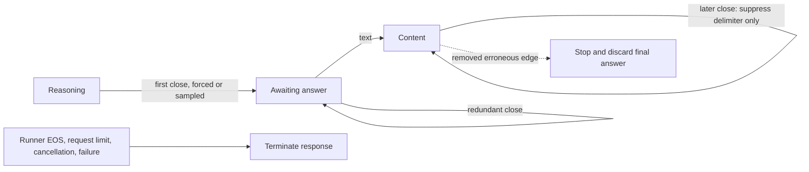

The fix removes `Stopped` and `SplitResult::stop_generation` entirely. The
incremental splitter owns field framing only; every complete close is removed
without dropping subsequent text. HTTP and SSE keep their actual terminal
conditions. No heuristic detects prose as reasoning or an answer, and no prompt,
sampling policy, token allowance, graph, or kernel is changed. Existing tests
that asserted the erroneous stop policy are replaced with final-answer/EOS
checks and every-chunk-width framing coverage. Release and Integration rebuild;
all ChatCompletionHandler tests pass, including 23 reasoning-focused cases.
Full Unit passes 633/633 in 67.21 s and production preflight passes 92/92 in
208.28 s (`/tmp/e2e-reasoning-delimiter-{unit-gate,preflight}.log`). The 99
Python harness-policy and 12 typed-discovery tests also pass. Twenty exact-cell
repetitions now run fail-fast, logging to
`/tmp/e2e-qwen36-cuda-delimiter-fixed-repeat.log`; all twenty successes are
required before the chained thirteen-cell aggregate starts, report
`/tmp/e2e-thirteen-delimiter-fixed-aggregate.json`. Token tracing and INFO
diagnostics are off for these canonical runs.

**The loop was stopped during run 2; the full aggregate never started.** Run 1
passes the old answer matcher in 58.26 s but response inspection finds repeated
`13` through the 200-token limit. The framing fix exposes a deeper MTP answer
loop that the old parser masked. This is not accepted as a clean certificate.
The arithmetic observer now requires `finish_reason=stop`; budget-exhausted
numbers cannot pass. All 100 focused Python policy tests pass. No old report is
relabeled; the run-1 response artifact is the evidence of that observer gap.

A controlled Release CUDA comparison loads the same canonical model/topology
and original HTTP prompt with MTP off/on (diagnostic only, not a canonical
manifest mutation). MTP off reaches EOS in 48 tokens at budget 16; MTP on
repeats to 200. Budget 0/64 also differs between modes (27/91 tokens off versus
32/96 on), so this is not simply a missing final-answer parser branch. Exact
requests/responses and server arguments are in
`/tmp/e2e-thinking-diagnostic-mtp-{off,on}`. Both diagnostic runs completed all
five requests; shutdown initially used an unavailable endpoint and the scoped
process-group cleanup retired each server. The corrected diagnostic enables
the existing admin endpoint. Device-publication observation is next; no kernel
or graph-state fix is claimed yet.

All thirteen cells previously obtained individual 39-check passing receipts.
The last engine failure, 122B CUDA2/CPU2, passed in **577.55 seconds** after the
captured CPU-ticket progress and row-copy fixes. These historical passes do not
certify the subsequently strengthened runtime-feature contract.
A fresh thirteen-cell aggregate starts September 6 at **04:19:27 UTC**, with
report `/tmp/e2e-thirteen-current-code-aggregate.json` and wrapper log beside it.
Its first five cells pass: Qwen3.6 CPU2 NodeTP in **571.84 seconds**,
Ornith CPU2 NodeTP in **561.45 seconds**, 122B CUDA2/CPU2 in **588.63 seconds**,
122B ROCm2/CPU2 in **561.25 seconds**, and 122B ROCm4/CPU2 in **509.97 seconds**.
Each has 39/39 HTTP checks, all eight long-context checks, validated runtime
evidence, clean shutdown and zero post-shutdown VRAM delta. The aggregate then
stopped at cell six, Ornith CUDA2, after **107.82 seconds**: all behavioral and
eight long-context checks passed, but FlashAttention evidence validation
reported an ambiguous domain. Cells seven through thirteen were not admitted.
At 04:40 UTC, fresh code-owned discovery exported to
`/tmp/model-parity-e2e-current-source-audit.json` matches all thirteen active
manifest records exactly after sorting by case: same revision, eligibility,
profiles and server arguments. Only execution order differs. Runtime sources,
test policies and binaries remain unchanged throughout this aggregate.

The Ornith failure is a validator namespace bug. Canonical CLI export declares
the same ordered participants once in `--define-domain` (general orchestration)
and once in `--moe-routed-expert-domain` (expert placement). The validator
incorrectly counted both as duplicates. Its fix corroborates membership across
namespaces, rejects repeated definitions inside either namespace, and rejects
cross-namespace participant or order mismatches. The focused red reproduces on
CPU/CUDA/ROCm in both CLI option spellings; all 88 server-policy unit tests now
pass. Runtime sources and Release binaries are unchanged. Full Unit regating
passes **633/633 in 67.70 seconds**. The corrected complete harness validator
accepts all 32499 preserved Ornith records, receipt
`/tmp/e2e-ornith-domain-preserved-validation.log`; the original red report is
preserved, not relabeled.

Completion audit still owes an explicit runtime-feature check against the saved
artifacts. The existing shell validator gates its stronger prefix/rebalance and
movement checks on optional probe tags, whereas canonical HTTP cells currently
carry only `e2e-certification`. Thus the 39/39 HTTP result alone must not be
described as a positive physical-movement or adaptive-depth certificate. Inspect
the committed `expert_migration_edges` evidence (not proposals), actual MTP
attempt/accept/controller counters, and prefix restore counters for each typed
configuration after the frozen run. Any missing required evidence must be
resolved before goal completion; do not change validators under a live cell.

The offline audit `/tmp/e2e-first-six-runtime-feature-audit.json` confirms
accepted drafts and adaptive windows in all six cells. CPU-containing cells
have committed placement edges; Ornith CUDA2's homogeneous device controller
exports 38 current applied arrivals and 169383936 useful payload bytes. Most
cells, however, have lookup hits without actual prefix restore operations. The
short different-answer shared prefixes need not cross a stored hybrid-state
boundary. The harness now preserves those A/B checks and adds exact replay of
A in both thinking modes. The new post-shutdown runtime-feature validator
requires completed MTP-bearing restores, attempted/accepted drafts, dynamic
controller windows and physical movement (or no movement for Static).
All **97 server-policy tests** pass, including an executed shell scenario with
a request observer; full Unit is **633/633 in 67.54 seconds**, receipt
`/tmp/e2e-runtime-feature-unit-gate.log`. Engine binaries and the 92-test
integration preflight receipt remain unchanged. A fresh full thirteen-cell run
will start with the corrected Ornith CUDA2 cell and previously unrun GPU cells,
then revisit all five CPU-containing cells under the stronger certificate.

That stronger run starts at **05:25:16 UTC**, report
`/tmp/e2e-thirteen-runtime-features-aggregate.json`, artifacts
`/tmp/e2e-1788672315999761012`. Ornith CUDA2 passes **43/43 in 109.28 seconds**,
including actual MTP-bearing prefix restore. The single-CUDA Qwen3.6 MoE cell
then passes all behavior and restore checks but fails the newly added movement
check after **55.05 seconds**. This is an observer scope error: the CLI retains
Dynamic defaults, but a single device has no movement axis. No engine error or
numerical/behavioral regression occurred.

The fix exports the existing `ModelParityCase::movementEvidence()` contract
through typed discovery (`not_applicable`, `forbidden`, `required`) and pins it
in the harness environment. The observer accepts a required `MovementEvidence`
enum, never guesses a movement obligation from defaults or absent diagnostics.
Missing metadata fails closed. All **98 server-policy** and **12 E2E-discovery**
Python tests pass. The matrix and full Unit inventory rebuild successfully in
63 steps (`/tmp/e2e-typed-movement-build.log`); full Unit regating and fresh
discovery are running before another complete, unseen-first campaign. Release
engine binaries and their 92-test integration preflight evidence are unchanged.
The typed-obligation Unit gate passes **633/633 in 66.92 seconds**,
`/tmp/e2e-typed-movement-unit-gate.log`. Fresh discovery still has thirteen cells
(eight movement-required, five not-applicable). The complete corrected validator
accepts both saved 43-check artifacts, including all 7782 single-CUDA Qwen3.6
records; original reports remain unchanged. Receipt:
`/tmp/e2e-typed-movement-preserved-validation.log`.
The new full run uses `/tmp/model-parity-e2e-typed-movement-unseen-first.json`
and reports to `/tmp/e2e-thirteen-typed-contract-aggregate.json`. It starts with
the single-CUDA Qwen3.6 cell, then the still-unrun GPU cells, the five CPU cases,
and Ornith CUDA2. Sorting by exact case proves its records identical to fresh
canonical discovery; no configuration, model, budget or axis was changed.

| Canonical E2E cell | Latest certificate status |
|---|---|
| Qwen3.8 dense 27B, CUDA1 | Prior pass, 151.16 s; queued for shared-fix refresh |
| Qwen3.8 dense 27B, ROCm1 | Historical pass, 381.80 s; shared-fix refresh due |
| Qwen3.6 MoE 35B, CUDA1 | Historical pass, 57.40 s; shared-fix refresh due |
| Qwen3.6 MoE 35B, ROCm1 | Historical pass, 120.56 s; shared-fix refresh due |
| Qwen3.6 MoE 35B, CPU2 NodeTP | **Fresh aggregate pass, 571.84 s**; full evidence and clean shutdown |
| Qwen3.5 MoE 122B, CUDA2 + CPU2 | **Fresh aggregate pass, 588.63 s** following individual pass at 577.55 s; 39/39 HTTP, 8/8 long checks, full harness evidence, clean shutdown and complete VRAM release; no pending-transfer warnings |
| Qwen3.5 MoE 122B, ROCm2 + CPU2 | **Fresh aggregate pass, 561.25 s**; 39/39 HTTP, 8/8 long checks and clean teardown; 38.75 s watchdog margin |
| Qwen3.5 MoE 122B, ROCm4 + CPU2 | **Fresh aggregate pass, 509.97 s**; 39/39 HTTP, 8/8 long checks, full harness evidence and clean teardown |
| Qwen3.5 MoE 122B, CUDA2 + ROCm4 | Prior pass, 375.51 s; 39/39 HTTP, eight long checks, physical movement and clean shutdown; queued for shared-fix refresh |
| Ornith 1.5 MoE 35B, ROCm1 | **Pass, 125.49 s**; both thinking modes, 39/39 HTTP checks, full long context |
| Ornith 1.5 MoE 35B, ROCm2 | **Pass, 157.38 s**; same complete contract |
| Ornith 1.5 MoE 35B, CUDA2 | **Aggregate validator failure, 107.82 s**; 38/39 HTTP and 8/8 long checks; matching cross-namespace declarations were rejected; validator fix under verification |
| Ornith 1.5 MoE 35B, CPU2 NodeTP | **Fresh aggregate pass, 561.45 s**; full behavior, 840335 validated runtime records and clean shutdown |

### Native-copy full-model retest (September 6, 02:46 UTC)

`/tmp/e2e-qwen122-cuda2-cpu2-native-progress.json` is still red: the unchanged
600-second watchdog expires (605.00 seconds including cleanup). Artifacts are
`/tmp/e2e-1788661960643430139/1`. All short behavioral checks and six of eight
long checks finish; the three needles take 52.94/52.74/53.25 seconds, strict
JSON 54.55 seconds, 2048-token generation 246.24 seconds, and reset 3.80 seconds.
There is no material prefill/decode improvement versus the prior diagnostic.
No profiler or debugger was attached; all four GGUF shards were tmpfs hits.

Ten five-second pending-copy warnings recur on CUDA:0, concerning five GPU
relay commands in each of generations 17 and 19. The focused native-copy fix
is therefore **not a complete production progress proof**. Existing diagnostics
observe host completion publication, not the last native event query; additional
command-local observational evidence is being added to distinguish service
delay from a genuinely incomplete GPU event, without adding diagnostic GPU work.

The missing test composition is significant: local and remote CPU weight lanes
still enqueue native DMA on the exact same background stream pool as the
corrected mapped GPU relays. A pending DMA can therefore strand later kernel
copies by ordinary stream ordering. A new focused proof composes these actual
CPU weight-lane classes with the relay under peer-held captured inference.
This is currently a hypothesis under test, not a proven model root cause.

At 02:57 UTC the composed regression reproduces this dependency using real
`ExpertTierWeightTransferLane` and `MoEOverlayGpuRemoteProjectionLane` instances:
CUDA completes only 24/32 CPU edges **and** 24/32 following mapped relays before
the held graph is released. ROCm completes every edge/relay. All bytes drain
correctly afterward. Receipt: `/tmp/e2e-shared-cpu-copy-red.log`.

The fix extends the existing native-copy authority to persistent staging slices.
Their single shared host slab now retains an exact mapped alias; local and
remote CPU edges call `TransferEngine::enqueueBackgroundStagingCopy`, which
validates the exclusive slice and delegates to `enqueueBackgroundMappedCopy`.
No repack arithmetic, stream count, completion event, inference dependency, or
tensor-format dispatch is changed. Submission failure still fences any earlier
accepted repack operation before storage can be reused.

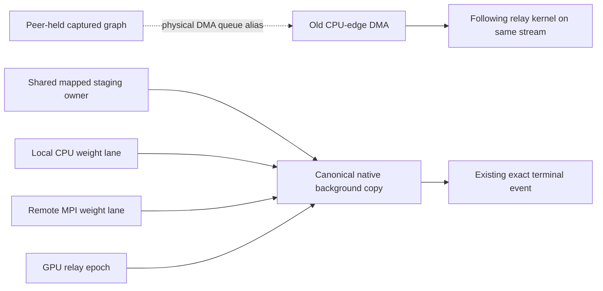

The 16-branch standalone graph probe alone still completes all 32 kernel copies;
branch count was not sufficient to reproduce the regression. The missing
composition is other physical copy clients on the shared stream. The expanded
native-copy proof is building; no replacement model result is claimed.

The replacement passes the focused composed proof on both backends
(`/tmp/e2e-shared-cpu-copy-focused.log`). The final variant sweeps local FP16,
BF16 and FP32 descriptors, both directions, remote wire blobs, independent
mapped relays and neighboring-slice bounds. **20/20 repetitions of all six
focused tests pass** (`/tmp/e2e-shared-cpu-copy-repeat20.log`, 120 test executions).
The transfer unit binary passes 95 cases and command-local diagnostic timing
passes five device-free cases. The complete Unit gate subsequently passes
**633/633 in 68.21 seconds** (`/tmp/e2e-shared-cpu-copy-certified-unit.log`).
The complete preflight is in progress; the replacement model retest is pending.

The shared gates finish green: **92/92 preflight in 202.07 seconds**
(`/tmp/e2e-shared-cpu-copy-certified-preflight.log`). All 56 CMake-discovered
preflight executables and the full Unit inventory were rebuilt. No performance
test was added to preflight. Quiet Release API measurements are in
`/tmp/e2e-shared-cpu-copy-economy-{cuda,rocm}-idle.log`: 4 MiB CPU staging copies
reach CUDA 12.51/12.09 GB/s D2H/H2D (ordinary DMA 9.01/8.20) and ROCm
11.78/11.54 GB/s (DMA 11.89/11.64). The bounded CUDA kernel is unchanged from
the separately profiled zero-spill implementation; HIP retains native DMA.

At 03:16:33 UTC the unchanged CUDA2/CPU2 E2E cell restarts with report target
`/tmp/e2e-qwen122-cuda2-cpu2-unified-background-copy.json`. All four GGUF shards
are persistent tmpfs cache hits, zero copied bytes. The Release build reports
no work to do, and no profiler, debugger, blocking-launch environment setting,
or interposer is active. Runtime/harness sources remain frozen for the cell.
This retest, not the microbenchmark, will determine production progress.
The harness uses its normal WARN log level in this retest; the prior diagnostic
used INFO. Warning/error visibility and all certificate evidence remain enabled,
but any timing comparison must record this observability difference.

Historical status remains twelve of thirteen individually certified cells;
the fresh aggregate has not run. Shared gates before this model retest were
633/633 Unit and 92/92 preflight. Neither the watchdog nor workload was relaxed.

At 03:23 UTC this diagnostic is cancelled through the campaign runner's normal
process-group cleanup after the same production stall recurs. It is **not a
certificate**: four long checks (three needles and strict JSON) finished, and
2048-token generation was still running. The report records 428.19 seconds and
an empty cell array because interruption preceded cell-result append. Artifacts
are `/tmp/e2e-1788664593015515706/1`; no model processes remain after cleanup.
The shutdown HTTP request queued behind the server's single busy HTTP worker,
so runner cancellation was required rather than waiting for that endpoint.

Ten warnings again concern five CUDA:0 relay commands in generations 16 and 18.
Crucially, each command had 2240–2256 exact native not-ready observations, with
the last observation only 2.2–2.6 milliseconds before its five-second warning.
This is genuine GPU-event delay, not a stalled host publication worker. The
shared-copy correction fixes the independently reproduced DMA queue defect,
but does not completely explain or cure the production stall. The next bounded
proof composes the actual retained CPU-return ticket consumer with thirty-two
prepared background copies, including the model's 4800-route prefill geometry;
the existing ticket proof checked only an independent DMA operation.

### Retained CPU-ticket maintenance composition (September 6)

The new witness prepares 32 independent maintenance streams before capture and
requires each exact terminal event to complete while the real CPU-return ticket
is deliberately unpublished. It covers 8, 512 and 4800 routes at hidden width
3072, then validates every route permutation and every maintenance byte after
release. CUDA passes this composition. ROCm initially completes only 24/32 lanes
at small-copy size (`/tmp/e2e-ticket-maintenance-focused.log`); this is a separate
progress defect, **not yet a reproduction of the remaining CUDA model stall**.

A controlled two-change experiment distinguishes the remedies:

| CPU-ticket wait | ROCm copy policy | Focused result |
|---|---|---|
| Payload-sized waiting grid | Ordinary asynchronous copy | Red |
| Payload-sized waiting grid | Explicit no-compute copy | Red |
| One-thread acquire before payload | Ordinary asynchronous copy | Red |
| One-thread acquire before payload | Explicit no-compute copy | Green initially; repeat gate follows |

The selected graph owns exactly the same sequence and terminal acknowledgement,
but only its one-thread acquisition node waits for the CPU. The large parallel
payload node starts after that acquire instead of parking a payload-sized grid.
ROCm uses `hipMemcpyDeviceToDeviceNoCU` with registered device-visible aliases;
the runtime's ordinary copy selection can choose a compute blit for small
buffers. The queue diagnostic confirms the explicit path requests actual SDMA
(`forceSDMA=1`), so the failed no-compute-only trial is not a guessed mechanism.
No transport retries, host state mirrors, new buffers in inference, or hot-path
synchronization are added.

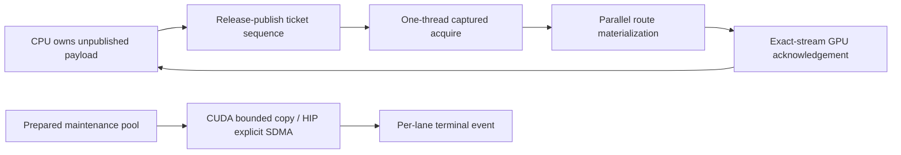

Ready-payload economy is measured separately from intentionally held-ticket
latency. The new timing cases belong to the existing standalone transfer perf
target, **not preflight**. Native resource inspection reports CUDA acquire
10 registers and payload 25; HIP acquire 5 VGPR/11 SGPR and payload
16 VGPR/46 SGPR. Both acquire/payload pairs have zero stack/scratch and spills.
The original HIP payload had 22 VGPR/26 SGPR and zero scratch; register spilling
was not the defect.

Additional bounded CUDA probes with same-device D2D predecessors, sixteen graph
branches, and a device-owned conditional parent all complete 32/32 background
copies (`/tmp/e2e-{d2d-predecessor,conditional-maintenance}-probe.log`). None is
being represented as a complete production CUDA progress proof.

The acquire/no-compute variant passes **20/20 repetitions** of both backend
tests, each with twenty ticket replays at three capacities and 32 independent
4 KiB round trips. Its full Unit gate passes **633/633 in 67.69 seconds**.
The selected no-compute copy costs about 10.5–11.2 microseconds for 4 KiB on
ROCm versus ordinary-copy 3.4–3.8 microseconds, but retains 11.7–11.8 GB/s at
expert-sized 4 MiB. This is an explicit progress cost, not an unreported free
optimization (`/tmp/e2e-ticket-final-copy-economy-rocm.log`).

The new ready-ticket microbenchmark exposed a larger CUDA cost: the original
flat payload kernel re-read two mapped route indices for every output element.
The next candidate uses one block per route-row tile and reads those indices
once into shared memory. It preserves the same fresh payload loads and unique
output writer, with no floating-point arithmetic change or lifecycle addition.
An odd-width 19-route/67-column regression supplements the real 3072-column
decode/prefill geometries. This candidate requires fresh repeat/shared gates.

Quiet Release event medians, no profiler, same binary harness and old/new
Release core libraries, fixed first-touch CPU affinity:

| Backend / route count | Original consumer (µs) | Acquire + row tiles (µs) |
|---|---:|---:|
| CUDA / 8 | 1368.06 | 67.58 |
| CUDA / 512 | 8681.47 | 1654.78 |
| CUDA / 4800 | 29735.94 | 7681.02 |
| ROCm / 8 | 141.76 | 40.32 |
| ROCm / 512 | 976.48 | 644.64 |
| ROCm / 4800 | 9765.11 | 5826.08 |

Receipts: `/tmp/e2e-ticket-economy-{cuda,rocm}-{before,row-copy}.log`.
These are **ready-consumer microbenchmarks, not model token rates**. The old
Release core used for A/B is retained under
`/tmp/llaminar-ticket-economy-baseline/`. Both versions pass payload-byte checks.
The row payload compiles to CUDA 20 registers and HIP 15 VGPR/50 SGPR, with zero
local memory/scratch/spills. The separate one-thread acquire remains CUDA
10 registers and HIP 5 VGPR/11 SGPR. Isolated Nsight application-replay evidence
is collected separately from these quiet timing samples.

The final row-tiled implementation passes **20/20 repetitions of both backend
tests**, including the added odd-width case
(`/tmp/e2e-ticket-row-roundtrip-repeat20.log`). Its refreshed complete Unit gate
passes **633/633 in 69.36 seconds** and production preflight passes
**92/92 in 206.03 seconds** (`/tmp/e2e-ticket-row-certified-{unit,preflight}.log`).
All preflight executables and the Unit inventory were rebuilt. No performance
test was added to preflight. At 04:09:12 UTC the unchanged CUDA2/CPU2 cell
restarts with report target `/tmp/e2e-qwen122-cuda2-cpu2-row-ticket.json`.
All four GGUF shards are tmpfs hits, zero copied bytes. Release is rebuilt;
the fresh model result is pending.

Nsight reports the isolated ready acquire at 7.94 microseconds (one thread,
one block; rounded register allocation 16), and the eight-route row payload at
68.99 microseconds (8 × 256 threads, 20 registers, 16.66% achieved occupancy).
The small grid is intentional for eight rows, not representative of prefill
occupancy. Reports are `/tmp/e2e-ticket-{acquire,materialize}-ncu.ncu-rep`, with
text details beside them. Profiler timings remain separate from quiet medians.

The complete model retest passes at **577.55 seconds**, with report
`/tmp/e2e-qwen122-cuda2-cpu2-row-ticket.json` and artifacts
`/tmp/e2e-1788667751828696818/1`. All **39/39 harness checks** and **8/8 long
checks** pass. Structured generation emits 2048 tokens and 160 progressing
report lines, no resets or duplicate lines; valid boundary reaches 7595/8192
tokens, and oversized input receives the required HTTP 400. Shutdown exits zero,
VRAM returns from the model to the exact two-MiB baseline, and the harness
validates **730577 PerfStats records**. The server log is clean: the previously
observed pending-copy warnings do not recur in this full run. This is one full
production receipt, not a universal proof that arbitrary queue compositions
cannot stall. No timeout, precision, workload, or certificate criterion changed.

All thirteen cells now have individual certificates. With the current Unit,
preflight and twenty-repeat gates green, the fresh canonical aggregate starts
at 04:19:27 UTC. Runtime sources are frozen for this aggregate; no duplicate
preflight run is inserted between unchanged cells.

Aggregate artifact root: `/tmp/e2e-1788668366860471991`. Its seven-file staging
inventory has five hits (Ornith and all four 122B shards); Qwen3.6 IQ3_S and
Qwen3.8 IQ4_XS are staged into the persistent cache in 15.08/15.27 seconds.
The existing cache was not emptied. Cell 1/13 is the dual-socket CPU Qwen3.6 MoE
case and has passed the short HTTP checks. The aggregate remains in progress;
its JSON report, not this initial status note, owns completed-cell results.

### CUDA/CPU cost attribution and independent-copy starvation (September 6, 01:45 UTC)

The diagnostic receipt `/tmp/e2e-qwen122-cuda2-cpu2-cost-diagnostic.json`
times out at 605.00 seconds (600-second cell watchdog plus cleanup), with
artifacts `/tmp/e2e-1788657703014034362/1`. It completes six of eight long
checks: the three needles take 53.09/52.85/52.77 seconds, structured output
54.95 seconds, 2048-token generation 244.25 seconds, and reset 9.58 seconds.
Startup is approximately 69 seconds. No wrong answer is observed, but this is
not a certificate: the near-boundary and oversized checks are unfinished.

`perf` samples from the exact two server ranks separate the compute costs:

- Prefill: 49.54% of sampled CPU cycles in the ordered two-row AVX-512 expanded
  expert GEMM; approximately 28% in OpenMP waiting. The eight-second counter
  interval measures 32.38 active cores and 0.65 IPC. The annotated hot loop
  shows no vector accumulator spills.
- Decode: approximately 77% in OpenMP waiting, 10.98% in serial expert dot
  products, and 4.87% in two-row GEMM; 55.02 active cores and 0.19 IPC.
  Much of the waiting has worker-thread roots without active expert frames:
  these cycle shares are **not** equivalent wall-time speedup opportunities.

Evidence is `/tmp/e2e-cuda2-cpu2-{prefill,decode}.perf.data`, corresponding
`*-stat.txt` and `*-report.txt`, and `*-prefill-annotate.txt`. Profiling is
diagnostic only; repeat the full cell unprofiled after the fix.

CUDA maintenance events also remain pending for 5+ seconds, beginning before
the profiler attaches. A device-free-model production regression now isolates
the problem: capture a peer-held timeline wait followed by one D2H operation,
then submit 32 independent maintenance copies through `TransferEngine` and
`MappedTransferProgressEpoch`. CUDA completes **24/32** before peer release;
ROCm completes **32/32**. All bytes drain correctly after release. Receipt:
`/tmp/e2e-held-inference-progress-red.log`. Both tests join the existing
`V2_Integration_MappedTransferProgressEpoch` preflight fixture.

The standalone CUDA reproducer agrees: without the pending graph-copy node,
32/32 DMA copies finish in approximately 15 ms; with it, 24/32 finish before
the 300 ms deliberate release. Raising `CUDA_DEVICE_MAX_CONNECTIONS` to 32
still strands one copy. A prepared bounded SM-copy probe completes all 32 in
approximately 24 ms despite the held graph. This supports physical copy-queue
aliasing, not a missing logical event dependency. NVIDIA documents potential
serialization when independent streams share physical work queues in its
[environment-variable reference](https://docs.nvidia.com/cuda/cuda-programming-guide/05-appendices/environment-variables.html).

That red checkpoint precedes the bounded-copy implementation below. No CPU
kernel optimization is installed. The prior 633-unit/92-preflight pass predates
this new proof and cannot certify the replacement.

#### Bounded copy implementation and economy evidence (02:00 UTC; gates pending)

`TransferEngine::enqueueBackgroundMappedCopy` consumes an unforgeable prepared
execution-lane lease. CUDA and HIP share the byte-total kernel implementation in
`MappedHostCopyDevice.inl`; kernel copies use exact mapped aliases. Aligned
vectors handle their own odd byte tail rather than scalarizing an entire expert.
The existing slot lifecycle, command ownership, and terminal event stay intact:

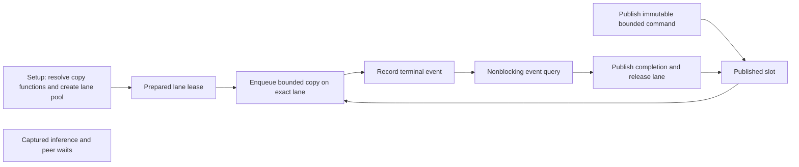

There is deliberately no maintenance-to-inference join. Setup resolves native
function handles before concurrency: NVIDIA documents lazy kernel loading as a
possible synchronization/deadlock boundary in its
[lazy-loading guide](https://docs.nvidia.com/cuda/cuda-programming-guide/04-special-topics/lazy-loading.html).
Copy submission telemetry now names copies, not DMA. Successful native enqueue
records identify the selected mechanism and direction. This changes neither collective
selection nor inference's producer/consumer event protocol.

The isolated unprofiled candidate sweep covers both directions, 192 KiB, 4 MiB
and 4 MiB+13 bytes, with grids 16/32/64/128/256/1024 versus DMA. Host pages are
first-touched on the GPU's socket before registration. With 32 blocks of 256
threads, 4 MiB CUDA reaches 12.89 GB/s download and 12.05 GB/s upload (DMA
9.60/8.12); ROCm reaches 12.61/13.27 GB/s (DMA 11.79/11.74). Larger grids are
not generally faster. These are copy microbenchmarks, not inference speedups.
Raw evidence: `/tmp/mapped-copy-economy-{cuda,rocm}.csv`.

Separate single-candidate profiling uses the installed shared kernel source,
not the prototype. CUDA reports 18 registers, zero stack/spills, 100% theoretical
occupancy and approximately 16% achieved occupancy with the intentionally small
concurrent grid. HIP reports 16 VGPRs, 32 SGPRs, zero LDS/private scratch and
wave64. Each direction has its own profile under
`/tmp/mapped-copy-production-{cuda,rocm}-{0,1}*`. Do not mix profiler durations
into the unprofiled timing sample. The repository-owned
`v2_perf_background_mapped_copy` benchmark compares the actual public
TransferEngine entrypoints; it is deliberately excluded from preflight.

The functional fixture now checks 32 independent commands in **both** directions
behind peer-held captured inference, odd tails, independent unaligned offsets,
whole-buffer canaries, invalid direction and region bounds. The existing
256-generation rollover tests remain. No replacement-model result is claimed yet.

The first focused retest establishes an important backend distinction
(`/tmp/e2e-progress-safe-copy-focused.log`): CUDA's held-graph upload/download
proof passes, but HIP kernel copies complete only 25/32 before peer release.
The original HIP DMA proof completed 32/32. HIP compute queues can therefore
introduce the converse false dependency. The final public contract delegates
native progress to the backend: CUDA bounded kernels, HIP asynchronous DMA,
with no runtime retry or automatic alternate mode. The common terminal-event
and slot state machine is unchanged. A separate test expectation was corrected
to use the mapped owner's actual page-rounded extent for its out-of-bounds
request; all whole-buffer byte/canary comparisons already passed.

The first build's complete Unit gate passes **633/633 in 67.68 s**, but it
predates this final native-progress refinement. Rebuild/repeat/full Unit and
fresh preflight are pending again. Function preparation is also explicitly
rejected inside graph capture, covered by a device-free regression.

The refined native-progress build passes all four focused tests in 2.00 seconds
(`/tmp/e2e-native-progress-copy-focused.log`), then **20/20 repetitions of all
four tests**: 80 case executions with no failure
(`/tmp/e2e-native-progress-copy-repeat20.log`). Both upload and download complete
all 32 slots while inference remains deliberately held. The next build includes
the complete Unit inventory and all 56 binaries owning the 92 CTest preflight
cases; the performance benchmark is confirmed absent from that label.

The rebuilt **Release public-API benchmark** passes both directions on both
backends (`/tmp/e2e-native-progress-copy-economy-{cuda,rocm}.log`). At 4 MiB,
CUDA background download measures **333.52 us / 12.58 GB/s** versus DMA
450.11 us / 9.32 GB/s; upload **346.84 us / 12.09 GB/s** versus
499.40 us / 8.40 GB/s. Odd-sized bulk transfers retain the gain. The 192 KiB
CUDA upload is approximately 2 us slower (20.52 versus 18.45 us); independent
progress is required for both sizes, so no size-triggered unsafe DMA path is
introduced. HIP's public progress path remains its native DMA implementation,
approximately 12 GB/s at 4 MiB, with bulk timings within about 1.3% of the direct
DMA entrypoint. These five-sample medians exclude setup and warmup. No model
throughput improvement is claimed from the microbenchmark alone.

The final byte sweep additionally invokes the shared kernel directly under the
test-only backend boundary, so HIP vector/tail correctness remains covered even
though HIP maintenance correctly uses DMA. Every allocation and stream still
comes from TransferEngine. Repeat stress and the refreshed functional gates run
after this additive test coverage.

The expanded direct-kernel/native-progress sweep also passes **20/20 repeats**
(`/tmp/e2e-native-progress-copy-final-repeat20.log`). The next full Unit run
finds one unrelated test-harness timing flaw: `V2_Unit_ProductionParityCampaigns`
uses a real child sleeping 0.3 seconds per case against a 0.5-second test
watchdog, and parallel host scheduling delays cause a spurious first-cell
timeout. The production 600-second watchdog is unchanged. Its positive
deadline-renewal unit now drives the existing loop with a mock process and a
controlled clock; the separate real-child termination test remains. All 65
campaign-runner tests and 20 repeats of that state-machine proof pass
(`/tmp/e2e-campaign-watch-virtual-clock{,-repeat20}.log`). Full Unit/preflight
are being rerun; no GPU/model correctness failure is inferred from this unit
fixture's synthetic timing failure.

**Final shared gate is green (02:32 UTC):** complete Unit **633/633, 68.94 s**,
and model-free ProductionParityPreflight **92/92, 196.66 s**, including the
expanded mapped-progress fixture. Receipts are
`/tmp/e2e-native-progress-copy-certified-{unit,preflight}.log`. The remaining
CUDA2/CPU2 122B cell is next, with unchanged context, generation, MTP, placement,
readiness and ten-minute watchdog settings, loading the persistent tmpfs cache.

### Ornith both-mode completion and new red cells (21:43 UTC)

ROCm1 is fully certified by `/tmp/e2e-ornith15-rocm1-both.json`, artifacts
`/tmp/e2e-1788644416860113967/1`. ROCm2's complete receipt remains
`/tmp/e2e-ornith15-rocm2-both.json`. Neither disables thinking checks.

CPU2's `/tmp/e2e-ornith15-cpu2-both.json` is a timeout, not a certificate.
It passed all eight long-context outcomes (including 2048 generated tokens),
both-mode API checks, clean exit and VRAM release. Its two raw PerfStats files
total **1,042,868,098 bytes**; the watchdog interrupted writing the aggregate.
The largest three record families each contain 119,334 rank-local entries:
`rank_batch_total`, `rank_batch_wire_wait`, `rank_batch_zero_copy_publications`.
Their aggregation keys contain request generation and logical step, turning
bounded timing/counter metrics into an unbounded per-transaction trace. This
requires a producer-side observability audit, not a longer watchdog or omitted
participant evidence. Artifacts: `/tmp/e2e-1788643707776396984/1`.

Offline rank-zero cardinality audit (`/tmp/e2e-cpu2-rank-batch-cardinality-audit.log`)
finds 791,034 records. For each of those three transport families, excluding
generation, logical step and measured byte count from aggregation keys yields
**242 topology/phase rows instead of 119,334**, with all 119,334 observations
still contributing. This is a projected grouping audit, not a new runtime
receipt. The implementation must retain bytes as measured values and fold
temporal protocol identity through the existing ordered-sequence witness API,
without dropping participant evidence or adding a second trace authority.

CUDA2's `/tmp/e2e-ornith15-cuda2-both.json` fails its first thinking request
after non-thinking passed and a movement epoch committed. The first observed
backend error is `misaligned address` at `deviceToHostOnStream` while exposing
the mirrored main-target argmax. That API is an asynchronous-error observation
boundary, **not an established originating kernel**. The later prefix-restore
and reset errors follow the poisoned context. A Compute Sanitizer run of the
same canonical cell is active; diagnostic times are not certification results.
Artifacts: `/tmp/e2e-1788644336293374856/1`.

#### CUDA originating access and shared workspace fix (22:01 UTC)

Compute Sanitizer reproduces an **invalid global FP32 write** in
`nativeVnniGemv_kpar<128,1,5>` on `main_condition` captured replay. The partial
address ends in `...5555`: the CUDA fused-projection binder divides a merged
workspace byte envelope by three side streams. Another graph-family stage had
enlarged that same buffer name; the merged capacity is not divisible by twelve,
so direct byte division creates misaligned FP32 slots. This is not an expert
codebook or MTP sampling arithmetic defect.

The initial sanitizer-wrapped campaign exhausted readiness during instrumented
MPI startup and is not a numerical receipt. After the captured-kernel smoke
passed, a direct diagnostic Release launch with `--no-mpi-bootstrap`, explicit
CPU affinity and unchanged exported topology reproduced the first non-thinking
and thinking requests. Logs: `/tmp/e2e-ornith-cuda2-direct-memcheck.log` (first
precise error at line 506), `/tmp/e2e-ornith-cuda2-direct-server.log`.

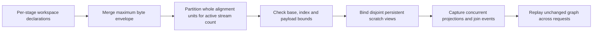

`AlignedWorkspaceSlices` is a non-owning geometry value, not another memory
ledger. It rounds usable stride down to complete alignment units, leaves the
remainder unused, and rejects invalid geometry or insufficient payload capacity.
The CUDA decode K-partials, prefill K-partials, and concurrent INT32 accumulator
binders share this calculation. No kernel arithmetic, launch geometry, stream,
event, workspace allocation, graph reset or collective policy changes. ROCm's
analogous decode binder already uses explicit column-based prefix offsets in
FP32 units rather than dividing a merged byte envelope; the floating adapters
do not use these NativeVNNI partial-slot binders.

Focused red: `/tmp/e2e-merged-workspace-red.log` reproduces CUDA error 716 on
Q4_0 before the fix, without loading a model. Green:
`/tmp/e2e-merged-workspace-green.log` passes the canonical all-codebook inventory
against serial output bytes and twenty poisoned-output captured replays per
format (1.66 seconds). The complete regression passed **20/20 repetitions**:
`/tmp/e2e-merged-workspace-repeat20.log`. Two device-free tests sweep alignment,
fan-out 1–8, non-divisible envelopes, bounds, and overflow extremes:
`/tmp/e2e-aligned-workspace-unit.log`. The focused Integration test is registered
in `ProductionParityPreflight`; Unit coverage joins its existing gate binary.
Release rebuilt successfully. Compute Sanitizer reports **zero errors** for the
all-format regression (`/tmp/e2e-merged-workspace-sanitizer.log`), and the full
Unit refresh passes **633/633 in 67.14 seconds**
(`/tmp/e2e-aligned-slices-full-unit.log`). The preflight refresh passes **90/90
in 189.93 seconds** (`/tmp/e2e-aligned-slices-preflight.log`).

#### Ornith CUDA2 thinking-output framing (22:16 UTC)

The complete aligned-workspace retry, `/tmp/e2e-ornith15-cuda2-aligned-slices.json`,
has no CUDA errors and passes all eight long-context checks, captured-path and
memory evidence, and clean shutdown. It remains red on two assertions for one
short request: the thinking-mode shared-prefix `6+7` response has empty visible
content. This is not a green certificate.

A normal MPI-bootstrapped diagnostic Release server, using the same exported
arguments and tmpfs model, reproduces the empty response twice. Token tracing
shows a forced budget close followed immediately by a model-generated
`</think>` before any answer. The HTTP handler unconditionally stops at the
second marker, assuming an answer already exists. Preserved raw responses:
`/tmp/e2e-ornith-cuda2-thinking-responses.jsonl`; tokens:
`/tmp/e2e-ornith-cuda2-thinking-diagnostic.log`. Different budget positions and
an unconstrained diagnostic do produce the correct visible answer; these are
diagnostics, not a changed certification budget.

Replace the independent whole-transcript HTTP scanner with the same incremental
splitter used by SSE. Its typed states make the missing distinction explicit:

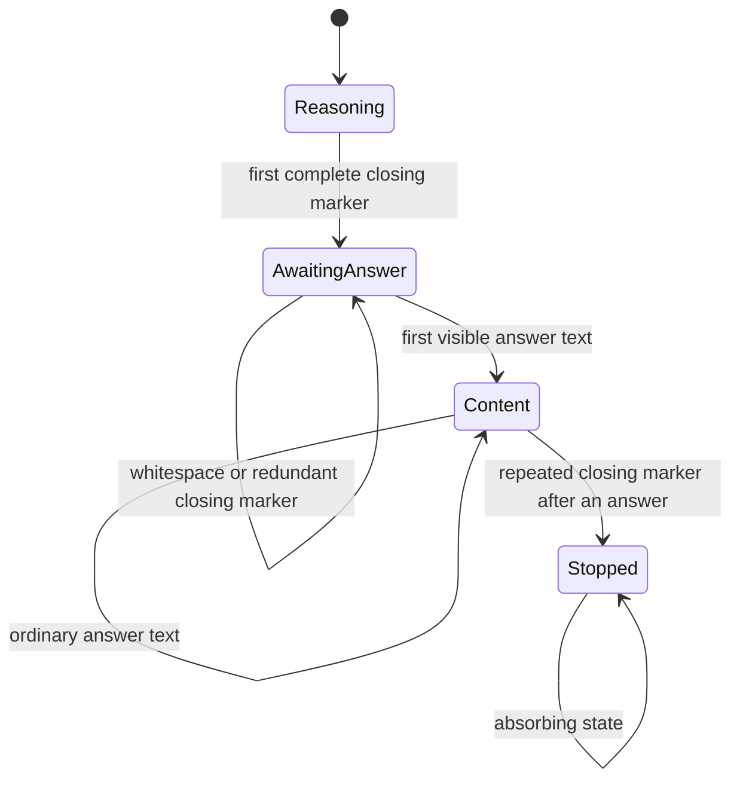

Marker suffixes survive tokenizer-piece boundaries; only end-of-input uses a
terminal flush. The old SSE caller flushed after every piece, which could leak
partial markers. HTTP/SSE mock regressions and all-chunk-width splitter sweeps
cover both boundaries. The existing post-answer repetition guard remains.
No model prompt, thinking budget, graph/MTP/movement policy, or correctness
assertion is relaxed. The new SSE mock also exposed reinjection when the last
forced piece was counted as sampled reasoning; budget accounting now occurs
after marker interpretation and excludes forced pieces. The complete handler
suite passes **125/125** (`/tmp/e2e-thinking-state-unit.log`), and all sixteen
splitter/budget tests pass **20/20 repetitions**
(`/tmp/e2e-thinking-state-repeat20.log`). Release and all Unit/preflight
executables are rebuilt. The complete gate is running; model retry is still
required at that point. The ensuing complete Unit gate passes **633/633 in
67.06 seconds**, preflight **90/90 in 190.21 seconds**. The exact full CUDA2
retry is now **green in 107.53 seconds**, with all 39 HTTP assertions, eight long
checks, captured-path/memory evidence and clean shutdown. Receipt:
`/tmp/e2e-ornith15-cuda2-thinking-state.json`, artifacts
`/tmp/e2e-1788647436372770331/1`. No test budget or prompt changed.

#### CPU2 bounded rank-batch evidence (22:38 UTC)

`MoEOverlayRankBatchTelemetry` replaces independent MPI/shared-row recorders.
It borrows the authenticated call identity; it does not own protocol state,
movement decisions or a live allocation ledger. Stable topology, phase and MTP
graph depth identify aggregates. Payload bytes remain measured counters;
generation/logical-step/sequence/bytes feed the existing ordered witness.
Actual nonblocking MPI submission evidence remains distinct from shared-page
publication. Runtime protocol validation and event/transfer behavior are
unchanged.

Unit regressions sweep 1024 observations across both transports, endpoint roles
and directions, asserting bounded row counts, exact timing/byte/count totals
and order-sensitive fingerprints. The existing real-MPI preflight proof also
rejects temporal/byte fields in submission tags. Release and gate builds pass;
the three focused Unit/Integration checks pass in 1.07 seconds
(`/tmp/e2e-rank-batch-telemetry-focused.log`), and the two bounded-recorder
regressions pass 20 repetitions (`/tmp/e2e-rank-batch-telemetry-repeat20.log`).
The complete Unit gate passes **633/633 in 67.77 seconds**, and production
preflight passes **90/90 in 191.14 seconds**. Logs are
`/tmp/e2e-rank-batch-telemetry-full-unit.log` and
`/tmp/e2e-rank-batch-telemetry-preflight.log`. The exact Ornith CPU2 retry began
at 22:45 UTC, retaining the full workload and 600-second cell limit; receipt
destination is `/tmp/e2e-ornith15-cpu2-bounded-telemetry.json`.

That retry is now **green in 572.84 seconds**: 39/39 HTTP assertions, all eight
full long-context checks, clean shutdown, and validated rank/memory evidence.
The rank files total **523,139,972 bytes**, down from 1,042,868,098 (about 50%).
No observation counts, bytes or sequence witnesses were omitted. Other metric
families still make the export large: the complete aggregate has 812,938 rows;
this change fixes the identified unbounded rank-batch keys, not every remaining
observability cost. All four Ornith topologies now have successful receipts.

#### Remaining mixed-GPU handle ownership audit (22:49 UTC)

The remote source is already retaining the original live projection engine,
not creating a special transfer-only GEMM. When that expert leaves its old
bank, the last transfer reference can legitimately destroy its floating GEMM
adapter. CUDA currently gives every adapter a private cuBLAS/cuBLASLt pair,
even for FP16/BF16 projections that execute fixed-order custom kernels. The
recorded retirement stack enters `cublasLtDestroy -> cuCtxSynchronize_v2` from
the Dynamic worker. Extending the transfer lifetime would conceal, not repair,
this library-resource ownership defect.

The next implementation should use the already persistent GPU worker context
as the library-handle owner. The weight adapter should own only its immutable
weight view, stream/workspace binding and weight lifetime. Merely sharing the
current mutable kernel object is insufficient: stream selection and complete
BLAS submission must form one context-owned host critical section, and
concurrent streams require separate arena-backed workspaces. This lock must
not wait for GPU completion or enter replay. CUDA and ROCm need the same
ownership contract. Existing bias workspace declarations are candidates for
reuse by mutually exclusive ordinary BLAS calls, avoiding a second allocation
ledger or per-expert scratch allocation.

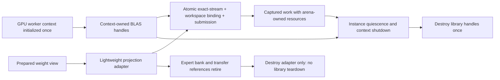

This is an audited target, **not yet an installed fix or green mixed-GPU
receipt**. The focused proof must retire FP16/BF16/FP32 adapters while an
unrelated stream remains deliberately blocked, alongside exact-stream and
captured multi-stream arithmetic tests. NVIDIA's
[cuBLAS stream/workspace contract](https://docs.nvidia.com/cuda/cublas/index.html#cublassetworkspace)
also requires rebinding caller workspace after `cublasSetStream`, and serialized
host calls when a shared handle is used with caller-provided scratch.

#### Context-owned BLAS implementation and focused proof (23:24 UTC)

The audited ownership is now implemented on both GPU backends. All projection
constructors resolve or borrow the persistent worker context; neither a CUDA
nor ROCm projection creates/destroys a BLAS handle. ROCm's separate mutable
device-kernel cache entry is retired. `GPUBlasSubmission` holds the context's
host submission lock across exact stream/workspace binding and enqueue only;
captured replay never enters the lock. Each concurrent projection uses its own
arena workspace, and ordinary BLAS/Lt share the same declared 4 MiB region when
mutually exclusive. `FloatingPointGemmWorkspaceABI` supplies the named BOM to
both kernels and planning; there is no independent live memory reserve.

The pre-fix CUDA retirement regression failed while an unrelated stream was
blocked (`/tmp/e2e-floating-retirement-red.log`). With the fix, the focused
eight-CTest group passes in 8.55 seconds
(`/tmp/e2e-context-blas-focused-final.log`). CUDA and ROCm's three-test proof
groups each pass twenty repeated runs
(`/tmp/e2e-context-blas-retirement-repeat20.log`): retirement of FP16/BF16/FP32
adapters while unrelated work is blocked, exact-stream isolation, and twenty
poisoned-output replays of a two-stream native graph with independent scratch.
These two model-free registrations join `ProductionParityPreflight` (92 tests).
The source sanitizer additionally forbids all eight BLAS/Lt create/destroy
variants outside the exact device-context initialization/shutdown functions.

Removing implicit library lifecycle drains exposed two ROCm test-fixture
ordering defects: fresh tensors were uploaded on an implicit transfer stream
then consumed on a different nonblocking compute stream without a producer
dependency. Those fixtures now use `TransferEngine` on the exact consumer
stream and require already-published weight dependencies. No kernel arithmetic,
tolerance, or blocking synchronization changed. Both grouped-row tests pass
20/20 repetitions (`/tmp/e2e-context-blas-row-order-repeat20.log`). Both full
Integration and Release builds complete successfully. The complete Unit gate
passes **633/633 in 67.35 seconds**, and preflight passes **92/92 in 194.62
seconds** (`/tmp/e2e-context-blas-full-unit.log`,
`/tmp/e2e-context-blas-preflight.log`). Fresh typed discovery is identical to
the prior thirteen-cell manifest.

The mixed-GPU retry remains **red, 282.40 seconds**:
`/tmp/e2e-qwen122-cuda2-rocm4-context-blas.json`, artifacts
`/tmp/e2e-1788651503546656442/1`. Short checks and the first 5232-token needle
pass (84.91 seconds; twelve accepted MTP tokens). Transaction 28 has both
physical receipts and ROCm preparation, but CUDA still reports prior actions
24/17 and preparation receipt 25. The second request fails on the standard
preparation deadline. Read-only host stacks taken during that transition show
the maintenance workers polling and the HTTP thread in
`CUDARingKVCache<FP16>::exportLogicalBlock -> cuLaunchKernel`, **not** BLAS
destruction (`/tmp/e2e-context-blas-mixed-rank{0,1}-stacks.log`). The debugger
sample makes this a diagnostic run, not an unperturbed timing certificate.
The independent library-lifetime fix is therefore real but does not explain
the remaining scheduling cycle. A deeper second sample missed process exit.

The other outstanding cell, CUDA2/CPU2, also remains **red** on the same frozen
gated build (`/tmp/e2e-qwen122-cuda2-cpu2-context-blas.json`): the ten-minute
watchdog expires during structured generation, 605.00 seconds including
retirement. Its three single-needle requests take 76.00, 75.58 and 75.80 seconds;
multi-needle strict JSON passes in 77.52 seconds. All four recall checks pass,
but no complete long-context/shutdown certificate is produced. No preflight
or model copying was repeated. This is a throughput problem, not evidence of
the mixed device-controller preparation failure.

At 23:55, the previously interrupted `CUDA_DEVICE_MAX_CONNECTIONS=32`
diagnostic is repeated with context-owned BLAS installed. Everything else is
the same canonical mixed cell, including the watchdog. Receipt destination:
`/tmp/e2e-qwen122-mixed-context-blas-queues32-diagnostic.json`. It also fails,
**289.00 seconds**, now on the decode-demand snapshot for transaction 27 after
the first long needle passes in 88.33 seconds. CUDA retains snapshot 26 while
ROCm publishes 27. This does not establish a fix or certify the default
environment; the connection setting is not installed. The preparation-only
read-only observer did not trigger because this failure occurs in snapshot
state, not preparation state. Its empty log is not evidence of progress.

A separate audit notes that `materializeEndpoint()` selects an ordinary
auxiliary stream for finite controller epochs even though both backends already
expose `LatencyCritical`. The next focused regression checks that the real
service captures onto and reuses that immutable scheduling class on all six
participants. Stream priority is a scheduling hypothesis, not an established
explanation of the complete E2E stall.

#### Controller-priority diagnostic rejected (2026-09-06, 00:18 UTC)

Capturing the real controller graphs on each backend's existing latency-critical
stream class passes a six-participant scheduling regression 20/20, full Unit
633/633 (67.51 s), and preflight 92/92 (201.79 s). Nevertheless the unchanged
mixed E2E cell fails **earlier**, after 136.65 seconds during a short request:
`/tmp/e2e-qwen122-mixed-controller-priority.json`, artifacts
`/tmp/e2e-1788653757633138514/1`. Transaction 16 opens, but neither group publishes
its snapshot. The ROCm decode parent simultaneously misses its terminal
deadline. No additional cell becomes green. The unproven priority change and
its test-only expectation are removed; this is not an installed optimization.

The saved Nsight trace `/tmp/e2e-mixed-archive-flushed.sqlite` exposes a separate
large prefill cost: `materializeMultiRowCanonicalReturnBatchKernel` has 432
600-row launches at grid `(57600,4,1)`, averaging 288.98 ms with zero reported
local memory. The 256-row shape averages 22.94 ms. Those are diagnostic trace
times, not standalone or end-to-end speed certificates. An isolated probe now
compiles the unchanged production kernel, tests captured replay with alternate
CPU-published payload generations and poisoned output, and varies only grid
capacity before considering a production change.

#### Bounded sparse-return payload grid (2026-09-06, 00:26 UTC)

The isolated probe reproduces the 600-row, width-3072, top-k-eight, four-lane
problem with unchanged production kernel code. Using the existing 256-block
payload bound instead of a full-capacity grid for every lane gives these
unprofiled captured-replay medians:

| Backend | Capacity-sized grid | Bounded grid | Byte evidence |
| --- | ---: | ---: | --- |
| CUDA, first-touch CPU 0 | 146.44 ms | 26.51 ms | Both CPU payload generations exact |
| ROCm, first-touch CPU 28 | 17.92 ms | 8.21 ms | Both CPU payload generations exact |

The isolated CUDA sweep covers rows 2/16/256/600/1024 and lanes 1/2/4; larger
shapes improve about 4–6x. Rows whose original grid is already below the cap
keep the identical launch geometry. Sources and receipts:
`/tmp/overlay_return_probe.{cu,hip}`,
`/tmp/overlay-return-cap-sweep-isolated.csv`,
`/tmp/overlay-return-cuda-shape-sweep.csv`, and
`/tmp/overlay-return-hip-cap-sweep.csv`. The first non-isolated cap sweep and
Nsight report overlapped; they are discarded as timing/resource evidence.

Fresh isolated Nsight reports are
`/tmp/overlay-return-{baseline,cap256}-isolated-ncu.ncu-rep`. Both show 26
registers and zero spill requests. The bounded grid has 85.09% achieved
occupancy and 2.18 GB/s reported memory throughput versus 91.63% and 410 MB/s
for the capacity grid: the defect is latency/work scheduling, not register
spilling. ROCm's isolated dispatch trace reports about 8.16 ms;
`/tmp/overlay-return-hip-cap256-profile/dispatch.csv`. Its exact code object
reports 14 VGPRs, 24 SGPRs, zero LDS/private memory, and zero spills.

Both production launch bridges now reuse `kSparseRoutePayloadBlocks`. The
kernel's unique writers, cache-volatile mapped reads, metadata authentication,
and exact event/timeline edges are unchanged. Two added round-trip regressions
use an odd 16385-row sparse packet at width eight to cross the live grid-stride
boundary, through three retained production stages and two poisoned generations
in both CUDA/ROCm role assignments. Both pass 20/20 repetitions
(`/tmp/e2e-return-grid-repeat20.log`) and join the already-registered functional
packet preflight test; no performance test enters preflight. The complete fresh
Unit gate passes **633/633 in 67.20 s** and preflight **92/92 in 196.90 s**:
`/tmp/e2e-return-grid-unit.log`, `/tmp/e2e-return-grid-preflight.log`.
Both complete Integration and Release builds pass. Inspection of the actual
production objects finds CUDA's kernel uses 30 registers and zero stack/local
bytes; the standalone probe's 26-register compilation is not the production
resource count. The production gfx906 kernel retains 14 VGPRs, 24 SGPRs and
zero private/spill memory.

The unchanged mixed cell remains **red**:
`/tmp/e2e-qwen122-mixed-return-grid.json`, artifacts
`/tmp/e2e-1788654789096314470/1`. Its first 5232-token needle passes in **28.7546 s**
versus 84.906 s before the grid change, including the same twelve accepted MTP
tokens. That access-log measurement precedes debugger attachment. The following
request stalls at candidate preparation for transaction 29: both physical
transports are prepared, ROCm is prepared, and CUDA retains preparation 28.
Read-only live stacks show idle CUDA worker queues, maintenance polling graph
completion, and the HTTP thread inside `cuMemcpyDtoDAsync_v2` from
`DeviceGraphOrchestrator::harvestPrefix`. Receipts:
`/tmp/e2e-return-grid-stall-rank{0,1}-pid*.log`.

After attachment the continuation endpoint reports `InvalidControl` in
stage-zero `ConsumeReturn`, retaining last-published/consumed stage 47. The
follower observes that terminal failure and aborts MPI at 152.17 s. Timing and
failure after attachment are diagnostic, not an unperturbed certificate. This
narrows a possible native dependency/replay defect; it does not yet establish
which ordering edge is missing. No extra cell is green. The next diagnostic
exports actual native sparse-packet graph DAGs at instantiation without changing
any edge, launch geometry, policy, or workload.

#### Mixed behavioral completion and captured admission audit (2026-09-06, 01:10 UTC)

The next unchanged mixed cell completed in **376.03 seconds** with all eight
long-context checks green, including 2048 generated tokens, 160 ordered lines,
and 7595/8192 near-boundary context. Both thinking modes and clean shutdown
pass. Receipt: `/tmp/e2e-qwen122-mixed-native-dag-diagnostic.json`, artifacts
`/tmp/e2e-1788655402841291646/1`. An attempted graph-inventory interposer missed
the actual `cudaGraphInstantiateWithFlags` entrypoint; no graph instrumentation
or debugger attachment ran in this sample. It remains **red**, not a twelfth
certificate: ten warnings report two actual CUDA0-to-CUDA1 background D2H
commands (4 MiB and 2 MiB) pending for 5–25 seconds, and the evidence gate still
assumed all GPU participants own attention and separate MTP runtime tables.
Those waits eventually recovered. Their cause is not yet established.

The earlier stage-zero stale control is now reproduced without a model in
`CUDAForkedPrefillWaitsForNewGenerationAfterStaleAdmission`. The fixture completes
generation N, leaves its admission and return timelines intact, then queues
generation N+1 before scheduler retirement. The previous regression tested only
the fused one-row graph. With four-row asynchronous dispatch, metadata packing
waited on the auxiliary stream while main-stream return consumption raced ahead
against N's completed grant. Native CUDA graph inspection proves the missing
dependency; this is not quantization noise or a request-time host-state issue.

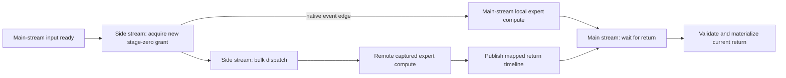

`MoEOverlayActivationLaneBatchState` owns one persistent event per stage-zero
lane. The dispatch stage records it immediately after admission metadata and
joins it onto its main stream before returning. Later layers have no added
join. Both record and wait are in the same native capture, leaving payload
copies and follower work asynchronous. Native graph node count remains **20**;
the new dependency is metadata node 2 to wait node 5. Evidence:
`/tmp/overlay-native-graph-1187020-0.{dot,nodes}` (red),
`/tmp/overlay-native-graph-1188264-0.{dot,nodes}` (green), and
`/tmp/e2e-forked-admission-red.log`.

The shared device admission retry loop also observes the existing abort sentinel
after a failed acquisition. This drains a canceled successor without inventing
a new admission; the successful first acquisition adds no load. Fused/forked
early-replay and abort tests pass **20/20 repetitions of six tests**, in both
CUDA/ROCm role assignments: `/tmp/e2e-admission-all-repeat20.log`. All are in the
existing functional packet preflight executable. No arithmetic, tensor format,
graph policy, workload or timeout was changed. Full fresh Unit **633/633 in
66.60 s** and preflight **92/92 in 194.54 s** pass:
`/tmp/e2e-admission-unit.log`, `/tmp/e2e-admission-preflight.log`. Complete
Integration and Release builds also pass. The exact uninstrumented mixed retest
is `/tmp/e2e-qwen122-mixed-epoch-admission.json`. This focused proof does not
claim every maintenance stall is resolved.

The HTTP evidence policy now derives attention ownership from the exported
public base/continuation domain. It still requires full plan evidence there.
A CUDA scheduler ticket is admitted only with same-rank/device evidence for an
explicit heterogeneous hosted captured transaction, using the unchanged strict
52-byte immutable ABI; homogeneous CUDA remains forbidden. One follower route
table must have exact same-owner arena allocation/binding evidence plus native
main/MTP family materializations and a sealed serving-family proof. Missing
records, wrong ranks, declared-only families and malformed tickets fail closed.
The saved complete counters now pass the actual embedded validator (`ok 105623`),
and **85 script regressions pass**. This offline correction does not turn the
historical warning-bearing run green.

#### Mixed CUDA2/ROCm4 certificate (2026-09-06, 01:20 UTC)

The fresh retest **passes 39/39 HTTP assertions in 375.51 s**, all eight
long-context checks, full ranked evidence validation (105,871 records), memory
authority attestation, clean coordinated exit and complete VRAM release to its
42 MiB baseline. All four model shards were persistent tmpfs hits. No debugger,
profiler or graph interposer ran; a read-only mapped-fabric observer captured
recoverable preparation pauses without modifying state. There are no application
WARN/ERROR entries. This is the twelfth individual certificate, not a fresh
thirteen-cell aggregate. Artifacts: `/tmp/e2e-1788657258063781609/1`.

The three needles take 28.96, 28.50 and 27.51 seconds; strict JSON takes 29.30 s.
Device-owned `dynamic_physical_bytes` records prove actual migration across
successive epochs, rather than merely selecting Dynamic. The earlier pending-DMA
warnings did not recur; their standalone originating mechanism remains
unproven, and this clean observation must not be described as an isolated
DMA-starvation fix. The remaining red individual cell is CUDA2/CPU2's 600-second
performance watchdog. Its next run uses the same exact cell with separate CPU
sampling intervals; diagnostic timing is not a clean certification benchmark.

### ROCm4/CPU2 full behavioral proof and harness corrections (16:56 UTC)

The exact 122B ROCm4+CPU2 cell completed **all eight full long-context checks**
with Dynamic/Ordinal, dynamic MTP through depth 15, and unchanged 8192 context.
Three single needles and multi-needle recall pass at about 30 seconds/request;
structured generation produces 2048 tokens/168 ordered lines without resets or
duplicates. Near-boundary use is 7595/8192. Movement advances through more than
120 epochs without an application WARN/ERROR. All shards were persistent tmpfs
hits. This is **not a certified green cell**: report
`/tmp/e2e-qwen122-rocm4-cpu2-command-age.json` returns 2 after 515.37 seconds;
artifacts are `/tmp/e2e-1788626683504852796/1`.

The remaining failures in that run are in harness bookkeeping/lifecycle:

- Its model-file `du` heuristic applies a 5142 MiB process-tree RAM ceiling to
  a CPU expert tier (observed RSS 265419 MiB). A staged/split file's filesystem
  blocks are not the model's RAM ownership or a capacity authority.
- An empty shutdown POST omits Content-Length, is rejected, and triggers a
  signal sweep that kills MPI rank 0 before evidence export. The harness then
  incorrectly calls exit 143 clean. The GPU/HTTP authority is rank 1 here.
- Unqualified PerfStats export suppresses nonzero-rank artifacts even on a
  genuinely clean shutdown. Rank 0 cannot certify this GPU continuation.
- Editing the active shell file during this run additionally caused a trailing
  EOF parse error. This was an agent execution mistake, not an engine defect.
  Do not modify active harness sources during future runs.

The replacement evidence lifecycle does not introduce an inference collective:

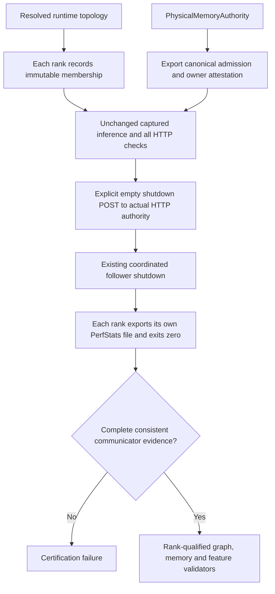

Implemented: rank-qualified raw exports, strict membership aggregation with
process-local graph identities preserved, explicit shutdown framing, zero-only
clean exit, and authority-based memory proof instead of the file-size/RSS
estimator. RSS remains OS telemetry; the new guard validates admitted allocator
capacity and materialization/reservation owner bounds, not a guessed RSS cap.
There are 71 focused harness regressions, including an actual local HTTP peer,
missing/conflicting ranks, cross-rank capture impersonation, and memory-owner
envelope failures. Release and the full 582-step Unit/preflight inventory build
passed. Full Unit is **633/633 in 68.18 seconds**, and preflight is **90/90 in
196.92 seconds**. Receipts: `/tmp/e2e-rank-evidence-gates-build.log`,
`/tmp/e2e-rank-evidence-release-build.log`, `/tmp/e2e-rank-evidence-unit.log`,
and `/tmp/e2e-rank-evidence-preflight.log`.

The unchanged exact cell reran from 17:02:28 UTC, report
`/tmp/e2e-qwen122-rocm4-cpu2-rank-evidence.json`, artifacts
`/tmp/e2e-1788627748294506750/1`, exec session 38960 (terminal exit 1).
It cleared readiness at 17:04:51 but **failed its first answer**, before testing
the repaired shutdown. At 17:04:56 all four ROCm DGO participants rejected
`Resident request-terminal publication requires current device-owned request
lengths: requests=1 active_lengths=0`. The MPI abort and downstream HTTP failures
are consequences of that one root error. Only rank 0 exported before abort;
the new collector correctly rejected incomplete membership. Its artifact does
contain the new runtime membership and canonical memory admission records.
No prior behavior-only result is being relabeled as certified.

#### Current root and simplification audit (implemented; gates running)

`commitMTPInitialShiftedRowFromDeviceOutcome` (DGO around 36627) imports the
base checkpoint's terminal row into the mailbox, performs a KV-only sidecar,
then calls `refreshMTPTerminalHiddenState(main_forward_token_count, 1, ...)`.
That generic refresh interprets every multi-row GPU producer as **prefill** and
selects using `request_sequence_lengths_dev_` and its admission count. Grouped
verifier execution instead uses `mtp_verifier_request_lengths_dev_` (already
explicit in the graph-family source-policy test). No request-input admission
has populated the prefill count in this failing branch. Merely setting that
count, uploading prompt lengths, or clearing the disk prefix cache would hide
the wrong geometry owner, not fix it. Persistent prefix reuse is a plausible
trigger for avoiding ordinary prefill, but still needs direct confirmation.

Both actual callers are the greedy/stochastic grouped paths in
`OrchestrationRunner` (around 14490/14924). Their order is identical:

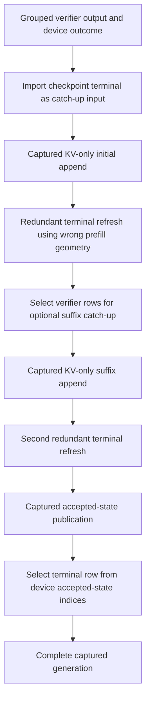

Preferred simplification to verify: initial and suffix catch-up consume temporary
mailbox inputs, then **invalidate their scratch publication** through the existing
typed `MTPTerminalHiddenPublication` transition. The suffix explicitly selects
its own rows from HIDDEN_STATE, so it does not require the initial refresh.
The immediately following `publishAcceptedMTPSpecStateBatchFromDeviceOutcome`
already uses the captured accepted-state selector and publishes the true final
terminal row. This should eliminate both interim refreshes, not add another
graph/cache/geometry mirror. Audit failure/stop paths and every caller before
editing; keep exact stream events and the sidecar's existing read-lease proof.
Add a focused typed-lifecycle regression, source prohibition on prefill refresh
inside these outcome commits, and real-device regression/repeats in the
preflight workflow. The general partial-forward commit also calls refresh, but
is a different public contract and must not be changed blindly.

The runtime now removes both intermediate refreshes and invalidates the temporary
publication after successful sidecar submission. The initial-append interface
no longer accepts `main_forward_token_count`, so its callers cannot supply
unrelated geometry. The suffix still validates its actual verifier input bounds.
No buffer/event lifetime is shortened, new graph is introduced, or operation is
made synchronous. The accepted-state selector remains the only final producer:

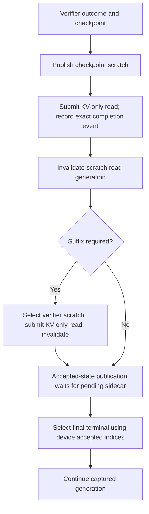

Added a typed lifecycle unit regression and source guard for the real entry
points. The shared CUDA/HIP integration proof reuses six captured copy graphs
and two streams over twenty rounds of both catch-up shapes. It proves exact
reader bytes and stale-lease rejection across scratch retirement; it is a
model-free protocol proof, not a replacement for the exact real-model E2E run.
It joins the existing graph-capture suites in preflight. Release rebuilt cleanly;
one test mock initially retained the removed argument, was corrected, and the
full Integration/Unit inventory rebuilt cleanly. The focused CUDA and HIP
regressions each pass **20/20** GTest repetitions (2.54 seconds combined), with
the complete repetition log in `/tmp/e2e-mtp-scratch-repeat-detail.log`.
Full Unit is **633/633 in 68.51 seconds**, receipt
`/tmp/e2e-mtp-scratch-unit.log`. Preflight passes **90/90 in 190.47 seconds**,
receipt `/tmp/e2e-mtp-scratch-preflight.log`. The unchanged exact ROCm4/CPU2
run completes all short and eight long-context checks, clean exit 0, and zero
post-teardown VRAM delta in **514.54 seconds**. Structured generation emits
2048 tokens/168 lines; near-limit use remains 7595/8192. No runtime WARN/ERROR.
Report `/tmp/e2e-qwen122-rocm4-cpu2-mtp-scratch.json` is still a **failed original
receipt** because its final evidence validator omits two installed mechanisms;
artifacts are `/tmp/e2e-1788629289855358555/1`.

The aggregate now contains both ranks and 550186 records. The graph validator
was still demanding `full_graph_*` records from retained heterogeneous parents:
ROCm:0's verifier actually has 5559 recorded executable nodes and 889 parent
replays. Graph-only child templates cannot certify the physical parent. The
updated validator checks its own rank/device/context, positive parent nodes,
setup or transaction-zero proof, and actual replay. Unused setup families do
not need synthetic inference; homogeneous segmentation remains forbidden.

The second rejection was `shared_physical_dispatch_d2h_bytes`, emitted by the
explicit `TransferEngine::enqueueDeviceToMappedHost` activation collective.
The validator now recognizes only that reviewed wire, with a declared mixed
device topology, matching-rank node-local mapping registration, and exact
nonblocking/shared-row payload tags. It does not authorize mutable execution
state readbacks or arbitrary D2H operations. This is observational validation,
not a new inference path or an exception to device-owned control.

All **77** focused harness regressions pass. Replaying the complete embedded
PerfStats validator against the saved aggregate yields `ok 550186`; this does
not rewrite the original red receipt. Full Unit passes **633/633 in 68.10 s**
after these Python-only changes, receipt
`/tmp/e2e-retained-parent-policy-full-unit.log`. The existing runtime preflight receipt remains
current: no C++ source, binary, or device execution changed in this validator
slice. The fresh exact-cell run started at 17:44:55 UTC with report
`/tmp/e2e-qwen122-rocm4-cpu2-certified-evidence.json` and artifacts
`/tmp/e2e-1788630295682965443/1` (exec session 4419, terminal exit 0).
It **passes certification in 523.24 seconds**: 39/39 harness assertions,
all eight full long-context checks, 555186 validated all-rank PerfStats records,
clean exit 0, and zero post-teardown GPU VRAM delta. The canonical memory
authority proof replaces the obsolete file-size RAM assertion, explaining the
39 rather than historical 40 harness assertions without removing long-context
coverage. No original failed receipt was changed. The unchanged next cell,
122B ROCm2/CPU2, also **passes in 597.62 seconds**, report
`/tmp/e2e-qwen122-rocm2-cpu2-certified-evidence.json` (exec session 8354,
terminal exit 0), artifacts `/tmp/e2e-1788630959545740650/1`. It passes 39/39,
all eight long checks, 705832 validated records, clean exit, and zero VRAM
teardown delta. Structured generation emits 2048 tokens/162 ordered lines,
with no resets or duplicates. Each needle takes about 47 s. The 2.38-second
watchdog margin is fragile, not a satisfactory economy margin. No production
source changed between the two fresh passes.

Next admission investigation (not implemented): `MTPGraphOwnerPlan` counts
107 auxiliary owners for depth 15/request capacity one: 21 sidecar, 35
terminal-hidden, 15 draft publication, 32 verifier preparation, and four
controller owners. `CapturedGraphMemoryEstimator` prices all of them at the
same CUDA 22 MiB full-executable contract. The terminal-hidden and verifier
preparation builders are single compute-node helper graphs, not complete
model forwards. A future correction needs a typed executable-shape inventory
and cold/warm **complete-family** CUDA/HIP memory certificates; do not simply
lower the global unit or attribute a shared driver-pool growth event to one
graph. This may help Qwen3.8 CUDA admission and GPU expert capacity, but no new
capacity or throughput benefit has been proven.

Read-only follow-up confirms the saved Qwen3.8/ROCm native census: terminal
selection has one node, draft publication two, and verifier preparation three;
the speculative-state publication is larger (202 nodes), so auxiliary owners
must not all receive one small-graph charge. Production verifier preparation
also scales with request count, and draft diagnostics add nodes. A proposed
bounded class must cover those declared geometries and reject mismatched native
shape before instantiation, not infer a cheap charge from an observed trace.
An integration certificate has been added to the shared CUDA/HIP cached-graph
suite: 128 simultaneously retained 64-kernel helper graphs, then a second warm
lifetime, with aggregate positive pool-growth accounting. Both binaries rebuilt
after ROCm2/CPU2 exited; the two focused tests **pass in 4.34 s**. CUDA's complete
family grows the pool by **80 MiB cold / 0 MiB warm**; ROCm uses **256 MiB in
each lifetime**. Both fit the candidate two-MiB-per-helper family envelope.
Receipts: `/tmp/e2e-helper-memory-certificate-build.log` and
`/tmp/e2e-helper-memory-certificate.log`. The complete two affected graph suites
also **pass in 6.40 s**, receipt `/tmp/e2e-helper-memory-full-graph-suites.log`.
No production accounting changed. Next implementation: a typed bounded-helper
inventory shared by `MTPGraphOwnerPlan`, ordinary and overlay admission, and
native capture validation. Preserve large auxiliary owners and request-scaled
verifier geometry; do not install a blanket discount from these measurements.

### Typed native-helper accounting implementation (18:39 UTC, prerequisites green)

The installed source now separates `General` and `BoundedFlatHelper` executable
shapes. `MTPGraphOwnerPlan` partitions the same retained owner inventory: depth
15/request capacity one has 82 helpers and 25 general auxiliary owners, still
107 total. Ordinary and ExpertOverlay planning both consume that partition.
CUDA admission decreases by 1640 MiB per runner; ROCm admission bytes do not
change. No graph count, MTP depth, context capacity, activation precision, or
execution policy is reduced.

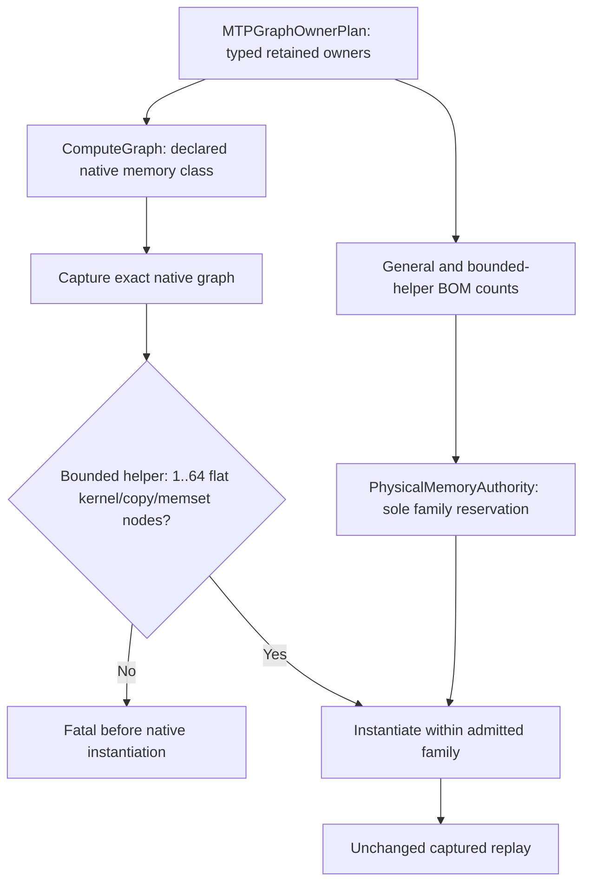

The native CUDA/HIP guard inspects only root node kinds/counts, not symbols,
occupancy, device values, or memory availability. Nested/control/event nodes
cannot masquerade as cheap helpers. General sidecar/controller owners retain
their existing contract. Verifier preparation is request-scaled: the
standalone bound is four nodes/request plus two fixed nodes; larger request
shapes remain general graphs. `ComputeGraph` carries this as captured topology,
so request reset preserves it and topology mutation changes capture identity.

Added Unit coverage for exact partition/cardinality/bytes, overflow and invalid
classes, request/depth geometry, and graph reset/move identity. Real-device
coverage rejects oversized and event-node helpers before executable allocation;
the prior cold/warm family certificate now enters this production guard.
Release and the complete Unit/preflight inventory build successfully. All four
focused CUDA/ROCm capture and cached-replay suites pass in 8.90 seconds. The
new event-node negative fixture initially used ordinary event recording, which
both drivers elide into dependency edges without retaining a native node. The
fixture now explicitly records an external native event; production event
semantics are unchanged. Both backend guards reject it as intended. Full Unit
passes 633/633 in 67.96 seconds (`/tmp/e2e-bounded-helper-unit.log`). The first
preflight run passes 89/90; the sole failure is an older device-context test
still pricing all 107 auxiliaries as general graphs (expected 2508 MiB versus
the new exact 868 MiB). Both vendor versions now assert the 82/25 typed
partition and rebuilt successfully. The fresh full preflight passes 90/90 in
194.53 seconds (`/tmp/e2e-bounded-helper-preflight-fixed.log`). The exact dense
CUDA E2E cell passes with its unchanged profile and persistent tmpfs weights:
**151.16 seconds**, 39/39 assertions, all eight full long checks, 2048 generated
tokens/175 ordered lines without resets or duplicates, context use 7595/8192,
5845 validated PerfStats records, clean exit zero and zero VRAM delta. Report:
`/tmp/e2e-qwen38-cuda-bounded-helper.json`; artifacts:
`/tmp/e2e-1788633539753329063/1`. Readiness takes about nine seconds. The remaining
CUDA2/ROCm4 prefix-progress cell is now retrying on the same gated binary.
Build receipts:
`/tmp/e2e-bounded-helper-release-build.log` and
`/tmp/e2e-bounded-helper-gates-build.log`; focused result:
`/tmp/e2e-bounded-helper-focused-integration-fixed.log`.

### Mixed-vendor prefix archive retry (18:50 UTC)

The same gated Release binary fails the CUDA2/ROCm4 cell after 282.98 seconds:
`/tmp/e2e-qwen122-cuda2-rocm4-bounded-helper.json`, artifacts
`/tmp/e2e-1788633772034690182/1`. All four model shards were tmpfs hits. Readiness
takes about 79 seconds; short answers, prefix, SSE and the first 5232-token
needle pass. That first needle takes 84.57 seconds. The following long request
reproduces the existing preparation stall: ROCm has prepared transaction 28,
CUDA's group is still prepared at 27, and the standard protocol deadline fires.
Live host stacks again place the CUDA request thread in `cuLaunchKernel` under
`CUDARingKVCache<FP16>::exportLogicalBlock`. The earlier deeper stack identifies
`RankOrchestrator::harvestPrefix` -> `DeviceGraphOrchestrator::harvestPrefix`
as its caller. This is the same failure boundary as the earlier transaction-29
run, not proof of a new numerical or memory-admission defect. Receipts:
`/tmp/e2e-mixed-bounded-helper-rank{0,1}-stacks.log`. The failed process group has
exited; no model process remains.

Known ordering and the unresolved edge:

```mermaid
flowchart TD
    F[Submit captured prefill across participants] --> H[Rank harvest visits local devices]
    H --> E[Exact published live-state event waits]
    E --> K[Per-block per-layer KV gather and archive copies]
    K --> B[Observed CUDA launch submission blocked]
    D[Background device-authored movement transaction] --> R[ROCm prepared 28]
    D --> C[CUDA group still prepared 27]
    C --> T[Topology preparation timeout]
    B -. Missing ordering or queue-progress edge not yet proven .-> C
```

Do not install a guessed synchronization or disable prefix/movement. Next is
device-side wait/queue attribution and a model-free reproducer for that exact
intersection. Host stacks alone do not prove whether the blocked launch is
driver backpressure, a dependency cycle, or scheduler starvation.

An explicitly diagnostic repeat, `/tmp/e2e-qwen122-cuda2-rocm4-device-waits-diagnostic.json`,
again passes the first needle (84.75 seconds). Attaching CUDA GDB twelve seconds
later fails inside `cudbgApiAttach` with a driver internal error and yields no
CUDA devices/kernels. The target then segfaults at the debugger's injected call
boundary. This is an invalid diagnostic, not a new engine failure or a passing
certificate. Preserve `/tmp/e2e-mixed-device-active-kernels.log` and artifacts
`/tmp/e2e-1788634271336213159/1`; do not repeat this attachment approach. The
matching `cuda-gdb-13-0=13.0.85-1` package and its disassembly-tool dependencies
were installed only for diagnosis; no compiler, driver or production runtime
library was changed. All model processes exited and both CUDA devices returned
to their one-MiB idle baseline.

Code audit: `RankOrchestrator::harvestPrefix` submits each local device's archive
serially. Each DGO enqueues the full set of read-only live-state event joins on
its explicit context stream, then one gather plus K/V archive copies per
block/full-attention layer. The Dynamic service independently fans out bounded
candidate and preparation-receipt graphs to all local workers. Establish the
actual inter-stream dependency/queue saturation in a model-free graph/transfer
fixture before changing either lifecycle. Capturing many operations or making
the host fan-out parallel is a hypothesis, not yet a proven remedy.

### Expert source retirement: explicit global cuBLAS wait (21:00 UTC)

The diagnostic-only `CUDA_DEVICE_MAX_CONNECTIONS=32` mixed-vendor run completed
movement transaction 26 on both groups, then stopped progressing while retiring
a source endpoint. Read-only GDB evidence in
`/tmp/e2e-mixed-queues32-rank0-stacks.log` shows the maintenance worker in
`cuCtxSynchronize_v2 <- cublasLtDestroy <- CuBLASGemmKernel::~CuBLASGemmKernel`
through `MoEOverlayGpuRemoteProjectionSource` and the completed network-operation
destructor. Concurrent inference was inside a prefix-archive DtoD submission.
This proves an unwanted global synchronization during background retirement;
it does not prove every earlier candidate-preparation stall has the same cause.

The exact runner was interrupted with SIGINT and its canonical cleanup retired
the full server/MPI process group. This diagnostic is not a certificate and the
32-connection setting is not a new default. Next runtime work: move BLAS resource
lifetime to the device-context authority without introducing concurrent
`setStream` races, and prove floating expert retirement under pending inference
for FP16/BF16/FP32 on both vendors. No ownership fix has been installed yet.

Additional ownership audit: CUDA floating wrappers construct a private
`CuBLASGemmKernel` for every weight, including FP16/BF16 weights whose main
compute uses custom kernels. ROCm floating wrappers instead borrow a cached
`HipBLASGemmKernel` from `DeviceKernelCache`, so normal wrapper retirement does
not destroy its library handles. Both underlying BLAS classes still expose
legacy owning constructors and context-borrowing constructors. Borrowing alone
is insufficient: CUDA rebinds stream state without a shared dispatch guard;
HIP's guard is per kernel object, not per context handle. A fix must preserve
atomic bind-plus-submit across all clients of each handle, exact stream
identity, and concurrent-stream workspace ownership. NVIDIA documents both
the implicit device synchronization at handle destruction and separate
workspaces/handles as the reproducible multi-stream contract:
[cuBLAS context and stream ownership](https://docs.nvidia.com/cuda/cublas/).
Do not turn background destruction into another thread that still globally
synchronizes the GPU, or fix only the currently observed expert format.

### Ornith 1.5 certification expansion (21:15 UTC)

Current requested topology set supersedes the initial CUDA1 selection below:
**CUDA2 NCCL overlay, ROCm1, ROCm2 RCCL overlay, CPU2 NodeTP**. All overlays
select Dynamic/Ordinal/adaptive MTP. Fresh typed export is
`/tmp/model-parity-e2e-thirteen-ornith15.json`: 13 E2E cells, with the original
nine configurations byte-for-byte unchanged and no Ornith CUDA1 cell. The
standard numerical matrix adds 78 Ornith cases. Both affected matrix binaries
and the definition/CLI gate are rebuilt/passing. The preserved CUDA1 admission
failure is now historical evidence for a user-retired topology, not an active
campaign red.

The CUDA2 run `/tmp/e2e-ornith15-cuda2-first.json` returned success in 100.35
seconds with all eight long-context outcomes and clean shutdown. **Do not count
it as full certification yet:** inspecting the 19/19 harness total exposed a
second tooling defect. `is_thinking_model()` guessed support from Qwen filename
fragments, silently omitting Ornith's thinking-mode checks. The equivalent
Qwen harness exercises 39 assertions. The initial ROCm receipt has the same
coverage omission, independently of its graph-accounting red.

`ModelParityE2EProfile::thinking_modes` now owns an explicit typed choice:
`ThinkingAndNonThinking` (default) or `NonThinkingOnly`. Export supplies `both`
or `non-thinking`; the runner rejects a missing/stale field and overrides
inherited environment settings. The shell filename table is removed, and a
canonical both-mode cell rejects the narrower diagnostic suite option.
The 11 runner and 79 graph-policy unit tests pass; the C++ export/admission
regression and all matrix targets rebuilt successfully. The full Unit gate is
633/633 in 67.40 seconds (`/tmp/e2e-typed-thinking-full-unit.log`). New live receipts must
exercise both modes before the four Ornith cells can turn green.

Current canonical manifest: `/tmp/model-parity-e2e-thirteen-thinking.json`,
13 cells with explicit `thinking_modes=both`. All nine original configurations
are otherwise unchanged. **Ornith ROCm2 is fully green:** 157.38 seconds,
39/39 HTTP assertions, 8/8 full long-context outcomes, complete graph/PerfStats
validation and clean shutdown. Receipt `/tmp/e2e-ornith15-rocm2-both.json`,
artifacts `/tmp/e2e-1788643513231724425/1`. Ornith CPU2 is now running from the
same warm tmpfs copy (`/tmp/e2e-ornith15-cpu2-both.json`); CUDA2 and ROCm1 still
need refreshed both-mode runs. No engine source changed during this slice.

Ornith ROCm1 first run finished in 118.55 seconds: all eight full long-context
outcomes passed, as did short API checks and clean shutdown. The only observed
failure was graph-evidence accounting (`main_condition_batch`: two captures,
zero replays). Raw records prove two **materialized-unlaunched** setup shapes,
no runtime admissions, and matching nonempty executables; node totals were
1438 and 1421. The native graph auditor incorrectly counted those setup shapes
as two inference calls, unlike its already-correct retained-parent counterpart.

Focused regressions first reproduced this failure for both CUDA and ROCm.
The auditor now subtracts the exact materialization **sample count**, never the
node value, when deciding how many capture-with-launch invocations occurred;
explicit runtime admission still demands launch/replay. Adversarial tests
reject missing real launches, repeated live execution without replay, and
cross-rank/context evidence borrowing. All 79 graph-policy tests pass. Source
runtime is unchanged. Preserved evidence validates under the corrected graph
rule, but this is not a fresh full certificate: a live retry must also reach
the later harness assertions previously stopped by this first error.
Receipts: `/tmp/e2e-ornith15-rocm-first.json`,
`/tmp/e2e-ornith-native-materialization-red.log`,
`/tmp/e2e-ornith-native-materialization-green.log`.

Initial expansion and historical CUDA1 receipt:

User requested the same E2E topologies as Qwen3.6 MoE 35B for the installed
`Ornith-1.5-35B-Q4_K_M.gguf` (21,713,463,040 bytes). Read-only GGUF metadata
confirms `qwen35moe`, 41 blocks including one next-token predictor, 16 attention
heads, two KV heads and 256 experts. The typed definitions inherit the three
tagged topologies (CUDA1, ROCm1, CPU2 NodeTP), including their full context and
MTP/movement policies, while keeping model/reference identities independent.
Verified discovery delta: three E2E cells (9 to 12), 36 numerical cells.
Both affected matrix binaries rebuilt, the focused definition/CLI/framework
gate passed 3/3, and the complete Unit gate passed 633/633 in 68.12 seconds.
Fresh manifest `/tmp/model-parity-e2e-twelve-ornith15.json` preserves all nine
previous exported configurations exactly. Broad production discovery passes.
Receipts: `/tmp/e2e-ornith15-matrix-build.log`,
`/tmp/e2e-ornith15-definition-gate.log`, `/tmp/e2e-ornith15-full-unit-gate.log`,
`/tmp/e2e-ornith15-production-discovery.log`. No runtime changed in this
matrix-only slice, so the existing 89/89 preflight receipt remains applicable.
The first CUDA Ornith HTTP cell failed memory admission in 5.43 seconds with
the unchanged Release binary: the authority reports 26.9 GB new allocation
against 23.3 GB available (22.5 GB weights, 2.1 GB workspace, plus KV, graph,
prefix and execution-state allocations). This is a pre-inference red, not a
numerical or generation failure. Audit the physical BOM before concluding the
deficit is irreducible; do not substitute another topology, reduce context or
MTP depth, or weaken admission. Report `/tmp/e2e-ornith15-cuda-first.json`,
artifacts `/tmp/e2e-1788642445220473149/1`. Model staging took 21.31 seconds at
971.9 MiB/s and the persistent tmpfs copy remains warm. No model process remains.
The Ornith ROCm1 and CPU2 cells are registered but unrun. None of the new cells
is certified yet. No runner-side matrix was added.

### Archive-pressure regression and topology-wide failure observation (19:10 UTC)

The new real-CUDA regression
`Test__CUDAGraphCapture.PrefixArchiveQueuePressureAllowsControllerProgress`
submits 2048 actual ring-KV gathers and archive D2H copies behind a blocked
captured producer while a separate worker submits the captured controller that
releases it. The independent controller completes without the test-only rescue
word: **20/20 repetitions pass**, normally about 56 ms warm. This weakens a
generic CUDA queue-backpressure explanation; it does not reproduce or fix the
mixed-model stall. Evidence: `/tmp/e2e-prefix-queue-proof-repeat20.log`.

`describeLifecycle()` now prints all topology participant lanes, not only the
reporting rank's local group. The focused device-free regression proves remote
and local preparation/action observations appear without advancing receipts,
and invalid bindings are rejected. This is a failure-only diagnostic change,
not a scheduler or memory-policy change. Both Release and the complete gate
inventory rebuilt. Full Unit is **633/633, 67.75 s** and model-free preflight is
**90/90, 192.99 s** (including the new archive-pressure regression). Receipts:
`/tmp/e2e-topology-lifecycle-{unit,preflight}.log`.

The exact mixed cell is rerunning to
`/tmp/e2e-qwen122-cuda2-rocm4-topology-lifecycle.json`. A bounded read-only mapped
fabric observer records a two-second preparation stall before timeout cleanup;
it neither attaches a debugger nor submits GPU work. Its output is
`/tmp/e2e-mixed-topology-preparation-observation.log`. No additional cell is
certified by these diagnostic changes.

The run instead failed earlier, after **201.00 seconds**, with a precisely
identified empty-command race (artifacts `/tmp/e2e-1788635442705689732/1`).
At 19:12:51 ROCm was acquiring transaction 16 while CUDA had already completed
16 and opened snapshot 17. BeginTransaction cleared the sole command slot and
its publication word. ROCm could neither acquire 16 nor advance to snapshot
17; CUDA then waited for that missing snapshot. This is a different earlier
race, not proof that the archive stall is gone. The read-only preparation
observer was stopped after the model exited because this failure never reached
its preparation predicate.

```mermaid
flowchart TD
    A[Seal empty command N] --> B[Device completes N]
    B --> C[Open snapshot N+1 and publish its phase intent]
    A --> R[Keep sealed command N readable]
    C --> D[Delayed follower acquires command N]
    R --> D
    D --> E[Follower certifies N from monotonic completion]
    E --> F[Follower joins snapshot N+1]
    F --> G[Existing all-participant snapshot fan-in]
    G --> H[Authority may replace command N with command N+1]
```

The CPU regression reproduces the old Waiting-versus-Ready failure in
`/tmp/e2e-empty-command-regression-red.log`. Implemented the above lifecycle in
the shared CUDA/HIP kernel and CPU specification: opening no longer clears or
modifies the command; a separate transaction phase-intent field is copied into
the command only at publication. Controller/fabric ABI versions advance to
reject stale mappings. No new collective, acknowledgement, blocking wait, or
inference-policy mirror is added. All 14 transport/gate unit cases pass in
`/tmp/e2e-empty-command-unit-focused.log`. A real captured completion/open pair
with delayed transport acquisition and twenty changing-identity replays per
CUDA/ROCm authority is being built; full gates and the exact E2E retry remain
required. The archive/preparation issue is still open.

The captured completion/open regression passes **20 replays per authority**
(CUDA and ROCm), 1.11 s including backend initialization:
`/tmp/e2e-empty-command-captured-replay20.log`. Static Release resource evidence
is `/tmp/e2e-empty-command-{cuda,rocm}-resources.txt`. CUDA retains 150 registers
and reports 16584 bytes shared memory, zero static stack/local bytes. ROCm
reports 121 VGPRs, 98 SGPRs, 63360 bytes LDS, zero private scratch/VGPR spills,
and 296 SGPR spills. Do not describe the latter as spill-free or infer a model
throughput gain from static resource metadata. The new transition removes
command-header clearing and adds no kernel dispatch or inference wait.

Twenty complete test repetitions also pass in
`/tmp/e2e-empty-command-captured-repeat20.log`: 400 forced completion/open
interleavings per authority backend, with normal warm repetitions around
10 ms. This is a focused lifecycle proof, not a replacement for full E2E.

The adjacent reset audit distinguishes transient admission from terminal
observation: nonempty preparation/publication/retirement cannot advance without
each participant's receipt; delayed final observations already use monotonic
group and completion fields. Empty decisions uniquely bypass those physical
receipts, which is why the still-unacquired command needed retention. Full Unit
passes **633/633 in 70.94 s**, `/tmp/e2e-empty-command-unit.log`; the complete
first full model-free preflight finished **89/90 in 195.41 s** in
`/tmp/e2e-empty-command-preflight.log`. The sole failure was an obsolete
collision-test assertion that transaction-open clears `command_transaction`.
Updated that assertion to require the preceding sealed transaction, an
unchanged command-header identity, and no publication or transport work for
the rejected new transaction. No production change was needed. The complete
preflight rerun is `/tmp/e2e-empty-command-preflight-retention-fixed.log`;
its formerly failing process-resident controller suite passes in 6.78 s.

That rerun was interrupted by a host reboot at approximately 19:40 UTC. Its
log ends at **20/90 passed**, not a gate completion. At 19:46 UTC host uptime
was six minutes, the container was newly started, no test/model process
remained, and all six GPUs were visible and idle. The cause of the reboot is
not established by those observations. Recreated the lost dedicated tmpfs
with the canonical setup script; model staging must refill it through the
normal campaign authority. Preflight restarted without code changes in
`/tmp/e2e-empty-command-preflight-after-reboot.log`.

The post-reboot preflight completes **90/90 in 188.44 s**, exit zero. Together
with the unchanged **633/633** Unit receipt this restores the prerequisite
gate. The exact CUDA2/ROCm4 retry is
`/tmp/e2e-qwen122-cuda2-rocm4-empty-retained.json`; mapped observation is
`/tmp/e2e-mixed-empty-retained-preparation-observation.log`. The canonical
runner is restaging the selected 122B shards after reboot before server launch.

The exact run finishes red in **230.36 s** (362.73 s including the 132-second
post-reboot staging). All short checks and the first long needle pass. At
19:56:20 UTC, the read-only observer catches transaction 27 before cleanup:
both physical transports have matching digest and prepared/published receipts,
ROCm participants completed action 18 and its root action 4, but CUDA
participants still show actions 24/17 and preparation receipt 24. The CUDA
candidate action has not entered. Both CUDA devices show 100% busy with 0–1%
memory utilization. Ordinary host GDB stacks again place the HTTP thread in
`CUDARingKVCache<FP16>::exportLogicalBlock -> cuLaunchKernel`; no CUDA debugger
or injected device calls were used. The GDB snapshots were late enough that
the maintenance worker was already unwinding, so use the earlier mapped
observer as the pre-timeout evidence. Logs:
`/tmp/e2e-empty-retained-rank{0,1}-root-stacks.log`. No process remains after
the normal failure exit. This is not a new empty-command failure or a green
mixed-cell certificate.

The model-free archive proof now covers both a flat captured producer and a
native conditional IF parent, with the archive on a separate explicit stream
joined through the producer's exact event. Both pass **20/20 repetitions**
without the test-only rescue; each pair normally takes 112–113 ms. The entire
`V2_Integration_CUDAGraphCapture` suite also passes (1.63 s CTest wall time).
Receipts: `/tmp/e2e-conditional-archive-event-proof-repeat20.log` and
`/tmp/e2e-conditional-archive-full-capture-gate.log`. These narrower shapes do
not reproduce the real mixed-model stall and do not justify a speculative
scheduling fix.

Nsight Systems attachment was verified in isolation, including `--run-as=vscode`:
the smoke has two actual eager/captured executions each of the tiled router
and softmax kernels, not merely graph metadata. The exact mixed cell is now
running under a bounded diagnostic trace, retaining the real Release server,
topology, depth and prefix/movement policies. Artifact prefix:
`/tmp/e2e-mixed-archive-timeline`; runner report:
`/tmp/e2e-qwen122-cuda2-rocm4-archive-profiled.json`. This profiled run is not a
performance or correctness certificate. Check for executed activities in the
real report: the installed Nsight release has a documented conditional-graph
visibility limitation even when its simple-graph smoke works.

The traced run reproduces the same preparation stall at transaction 33,
finishing red after **409.37 s**; the normal exact-cell watchdog is unchanged.
No model process remains after its failure exit. The 60-MiB report and SQLite
export contain 1,135,873 executed kernel records, but their span ends at
117.28 s, before the stalled transition. Runtime API records continue to
295.45 s, primarily from transport/event-polling threads. Nsight reports
incomplete CUDA collection and a timeout waiting for the injected process to
stop recording. Therefore the aggregate kernel ranking is not an attribution
of this stall. A follow-up trace needs bounded periodic activity flushing and
CUDA event tracing disabled (the profiler documents possible false event
dependencies); retain the unchanged production graph and model configuration.

While inspecting that read-only trace, started the other outstanding exact
cell, CUDA2/CPU2, against the unchanged gated runtime and warm tmpfs:
`/tmp/e2e-qwen122-cuda2-cpu2-bounded-helper.json`, artifacts
`/tmp/e2e-1788639251600512897/1`. Short HTTP checks and the beginning/middle
long needles passed during observation. The completed receipt is **red**:
the 600-second cell watchdog expired (605.00 s including cleanup). All short
checks and four long checks passed; the structured long-generation request was
still running. Movement proposals continued advancing, so this is not evidence
of the mixed-vendor preparation deadlock. The first long request took 76.49 s.
Repeated physical-relay warnings show 196,608-byte and 3,145,728-byte CUDA
commands pending for over five seconds; these measure queue residence, not
raw link bandwidth. No full evidence or shutdown certificate was produced.

The follow-up mixed-vendor diagnostic uses a 500-ms CUDA activity flush interval
and disables profiler CUDA-event completion tracing. It retains the canonical
configuration and watchdog. Report:
`/tmp/e2e-qwen122-cuda2-rocm4-archive-flushed.json`; timeline prefix:
`/tmp/e2e-mixed-archive-flushed`; read-only mapped observation:
`/tmp/e2e-mixed-flushed-preparation-observation.log`. This is diagnostic evidence,
not an unprofiled certificate or a reason to change a production stream policy.

The flushed diagnostic finishes red in **399.62 s**. At 20:30:34 UTC the mapped
observer records transaction 33 with both physical receipts complete and only
ROCm prepared. Host-only GDB snapshots were obtained before the first timeout
at 20:31:02: both CUDA context workers were idle, the CUDA maintenance worker
was waiting for its submitted candidate graph's terminal (not unwinding), and
the HTTP thread was inside `cuMemcpyDtoDAsync` from MTP prefix export. This
rules out an unsent host task for this occurrence, but does not yet distinguish
a GPU dependency cycle from resource/queue starvation. Stack receipts:
`/tmp/e2e-mixed-flushed-rank{0,1}-early-stacks.log`.

Periodic flushing extends executed-kernel coverage to 259.95 s (1,187,293
records), versus 117.28 s in the previous trace. CUDA context-worker API
coverage remains incomplete; do not infer controller absence from the trace.
The device-authored entry receipts above are the relevant evidence. Both model
processes exited and both CUDA devices returned to their 1-MiB idle baseline.

Code review also found that the existing CPU-ticket acknowledgement regression
was labelled GraphCapture but submitted eager consumers after CPU publication.
It now captures once and replays before CPU publication, checks independent
DMA on a separate exact stream while the ticket is pending, and compares every
returned byte for both 8-slot decode and 512-slot prefill geometries. The same
existing preflight registrations cover CUDA and ROCm. This is a test-only
coverage correction, not an asserted production fix for either outstanding cell.

The narrowed lifecycle is now:

```mermaid
flowchart LR
    P[Both physical transports publish transaction 33] --> H[CUDA worker submits candidate graph and terminal event]
    H --> I[Host worker returns idle]
    H -. unresolved CUDA execution dependency .-> C[Candidate entry receipt remains at old action]
    P --> R[ROCm candidate and group preparation complete]
    R --> W[Wait for all groups: standard deadline expires]
    A[HTTP prefix archive queues D2D copy] --> B[Driver submission waits]
    C --> W
```

The diagram deliberately has no invented edge from archive to candidate: the
trace and mapped receipts establish their lack of progress, not causality.
Before changing orchestration, a single diagnostic comparison increases CUDA's
driver work-queue connection setting from its default to 32, with no model,
topology, graph, movement, prefix, or watchdog change. NVIDIA documents possible
false dependencies when independent streams alias work queues. A different
outcome would motivate an explicit queue/progress ownership design; the setting
alone is not proof of a robust fix and is not installed as a default.

The initial strengthened ticket pair passes **20/20 per backend** (49.49 s).
Running its full owning binary exposes six older fixtures failing before GPU
execution: they omitted `activation_layout` after that became a required
transport contract. The fixture now calls
`planMoEOverlayNodeLocalActivationLayout` with its declared geometry; no runtime
validation or accounting was weakened. The complete **14-test packet suite
passes 20/20 repetitions** (50.28 s), including byte-exact retained CPU-ticket
replays and both heterogeneous role assignments. Receipts:
`/tmp/e2e-captured-cpu-ticket-progress-repeat20.log`,
`/tmp/e2e-captured-ticket-full-packet-suite.log` (preserved setup failures), and
`/tmp/e2e-full-packet-captured-progress-repeat20.log` (corrected full suite).

Preflight now selects the full owning packet suite instead of its two narrow
ticket children. This removes duplicate execution while covering twelve more
GTests; the CTest prerequisite inventory changes from 90 to **89** entries.
The updated complete gate passes **89/89 in 186.82 s**, recorded in
`/tmp/e2e-full-packet-preflight-gate.log`. The production runtime is unchanged
through this test-only slice; the previous complete 633-unit receipt still
applies. No new model cell is certified by these integration results.

The unprofiled queue-setting diagnostic was launched with only
`CUDA_DEVICE_MAX_CONNECTIONS=32` added to the canonical mixed cell's inherited
environment. Report:
`/tmp/e2e-qwen122-cuda2-rocm4-queues32-diagnostic.json`; read-only observation:
`/tmp/e2e-mixed-queues32-preparation-observation.log`. It reuses all four tmpfs
shards and leaves the 600-second watchdog intact. Do not count a pass here as a
default-environment certificate. It was subsequently interrupted after the
global cuBLAS retirement wait was captured; see the 21:00 UTC finding above.

Separate performance lead, not a deadlock diagnosis: the flushed trace records
`materializeMultiRowCanonicalReturnBatchKernel` with grid `(57600,4,1)`, block
256, 30 registers/thread and no shared memory for 600-row prefill. Sampled
executions near the first long-request terminal take 94–108 ms. The launch
bridge uses unbounded `blocksFor(capacity_elements)` per lane although its
kernel is already grid-strided. Other sparse payload kernels use a bounded
payload grid. A future isolated CUDA/ROCm microbenchmark should compare this
exact copy/permutation at equal payload/route bytes before changing dispatch;
do not present these profiled samples as unprofiled latency or conflate this
potential launch-overhead reduction with the missing controller entry.

### NCCL resumed-capture root cause (15:45 UTC, earlier slice)

The new model-free production-coordinator regression
`V2_Integration_CUDA_NCCLRetainedParentFragmentReentry` reproduces the server's
second-fragment failure without model loading. It records three fragments into
one parent, includes native conditionals, and checks five changed-input replays.
CUDA preserves a graph's capture ID across recording sessions. NCCL's
`ncclStrongStreamAcquire` accepted a cached matching ID without checking whether
its internal stream was still capturing; `cudaStreamEndCapture` had ended it.

```mermaid
flowchart LR
    A[Begin recording into final parent] --> B[Acquire NCCL strong stream]
    B --> C{Stream actively capturing?}
    C -->|Yes, matching graph ID| D[Reuse current recording membership]
    C -->|No| E[Rejoin current recording through existing event edge]
    C -->|Invalidated| F[Fatal capture error]
    D --> G[Record collective and conditional nodes]
    E --> G
    G --> H[End fragment recording]
    H --> A
```

The installed distribution library and an unpatched source build at the same
pinned commit both fail on fragment index 1 with the identical uncaptured-work
dependency error. The sole strong-stream membership patch passes 20/20 process
runs (53.04 seconds), with unchanged collective kernels and transport. Receipts:
`/tmp/e2e-nccl-reentry-{system,source-control,candidate,repeat20}.log`.

`scripts/docker/install-nccl.sh` now owns the pinned source/patch build for both
devcontainers and release builders. The distinct `libllaminar_nccl.so.2` SONAME
prevents silently loading the incompatible distribution library. Installation
and idempotent reuse passed locally. The installed-library test also passes
without a temporary loader override (`/tmp/e2e-nccl-reentry-installed.log`).
Release and the complete functional target inventory built successfully; the
fresh Unit gate passed **632/632 in 71.91 seconds**
(`/tmp/e2e-nccl-canonical-unit-gate.log`). Preflight passed **90/90 in
190.97 seconds** (`/tmp/e2e-nccl-canonical-preflight-gate.log`).

Unprofiled Release `GraphCapturedAllreduce` was measured in three paired
unpatched/patched source-library runs, with no other GPU workload. Across 13
message shapes, the geometric mean fixed/control median latency ratio is
**0.99907**. Per-shape changes range from -1.81% to +3.98% (the latter is
25.60 to 26.62 microseconds for shared M1); this is not evidence of a throughput
improvement or a material aggregate replay regression. Raw records are
`/tmp/e2e-nccl-replay-{control,fixed}-{1,2,3}.log`. The earlier candidate sample
collected while Unit tests were starting is not part of that paired summary.
The exact 122B CUDA2+CPU2 cell now clears captured graph preparation, short HTTP
requests, cache clearing, and both shared-prefix checks. Its first SSE request
fails during forced-token decode; it is **not an E2E pass**. The report is
`/tmp/e2e-qwen122-cuda2-cpu2-nccl-reentry-fixed.json` (119.16 seconds), with
server artifacts in `/tmp/e2e-1788623774047034865/1`.

### Forced-token placement ownership (16:10 UTC)

First terminal error: generation 174 requires placement floor 19, but CUDA's
acquired ticket and bank are both epoch 18. `InvalidControl/PublishDispatch`
rejects admission immediately; the CPU follower reports that GPU rejection,
not a collective timeout. The old grant remains generation 173/epoch 18.

The forced-token path first commits shifted MTP KV, then admits the main graph
sequence. The KV-only sidecar contains no expert stages, but the old maintenance
wait helper silently acquired an `ExternalReader`. Main condition decode could
reuse that stale reader after graph-sequence admission selected a newer epoch.
The candidate removes acquisition from the maintenance-wait API entirely and
uses typed sidecar ownership: KV-only has no expert access, coordinated full
sidecars belong to the graph sequence, and standalone full sidecars explicitly
acquire their reader. No host synchronization, changed placement floor, or
recapture is introduced.

```mermaid
flowchart LR
    A[Forced target token] --> B[Captured shifted-KV append: no expert lease]
    B --> C[Publish exact shifted-KV event]
    C --> D[Admit main graph sequence and pin current placement]
    D --> E[Main stream joins KV event and acquires admitted epoch]
    E --> F[Captured main condition decode]
    F --> G[Release expert reader and publish terminal event]
    M[Async placement publication] --> D
```

Both symmetric CUDA/HIP captured KV-only/publication/main-acquire regressions
pass **20/20 process runs per backend** (45.18 seconds combined), recorded in
`/tmp/e2e-kvonly-lease-repeat20.log`. Full Unit passes **632/632 in 67.59 seconds**
(`/tmp/e2e-kvonly-lease-unit-gate-final.log`). The initial Unit run was 631/632:
one source scanner still expected the deleted boolean argument. It now asserts
the typed ownership policy and forbids acquisition in the maintenance observer.
Preflight passes **90/90 in 190.21 seconds**
(`/tmp/e2e-kvonly-lease-preflight.log`). The device tests deliberately
publish a successor between KV-only and main admission with event ordering;
the full server run remains the orchestration proof.

The exact retry `/tmp/e2e-qwen122-cuda2-cpu2-kvonly-lease-fixed.json` terminates
as **cell_timeout**, return code 124, at 602.42 seconds including cleanup.
Artifacts: `/tmp/e2e-1788625085764125914/1`. It passes both SSE modes and shared
prefix checks, then beginning/middle/end needle recall (5232/5231/5230 prompt
tokens) and strict multi-needle JSON (5252 tokens). Their request times are
78.7005, 77.6684, 77.2953, and approximately 79.3 seconds. The 2048-token
structured-generation request remains active when the watchdog fires. No
stale-epoch rejection recurs through placement epoch 127. Remaining long
checks, terminal PerfStats, and clean shutdown are not certified; this cell is
still red, and the four historical green cells remain unrefreshed.

Next diagnosis has two separate concerns:

- Throughput: long requests consume roughly 313 seconds before structured
  generation, in addition to startup and short checks. Preserve the workload
  and watchdog; attribute the CPU/GPU hot-path cost before choosing a change.
- Seven pending-DMA warnings also violate the clean-log gate. The warning uses
  `active_batch_started_ns_` (origin of a continuously non-empty queue) to
  describe one particular command. That is not the command's age. Prove
  command-local wait durations before deciding whether these are actual
  transfer stalls; do not suppress the warning or widen the log allowlist.

### Throughput attribution and command-local diagnostics (16:40 UTC)

A diagnostic Release HTTP server used the exact CUDA2+CPU2 exported arguments,
FP32/FP16, dynamic depth 15, dynamic movement, and persistent-tmpfs model.
Three 128-token requests used the full structured-report prompt. The first
sampling run covered CPUs 0–55; inspection showed OpenMP workers may run on
their core's SMT sibling, so the second covered 0–111 and the call-stack run
attached to both exact MPI process IDs. No samples were lost. These are
**profiler-only samples**, not canonical latency or a shortened certificate.

- All-thread decode sampling: about 72% of sampled cycles in `libgomp` waits,
  10.9% in the AVX512 non-nibble GEMV, 4.6% in the two-row ordered GEMM.
- A 2293-token diagnostic needle succeeds. Prefill sampling: 46.7% in the
  two-row ordered GEMM and about 27% in OpenMP waits. Worker waiting cycles do
  not establish critical-path wall time or a proportional potential speedup.
- Root-rank PerfStats reports 33.7 seconds in CPU endpoint compute across the
  four requests (19.5 seconds verifier submissions, 14.3 seconds prefill).
  Peer-rank timings are absent because this first export was not rank-qualified;
  use `{rank}` in subsequent profiler filenames before diagnosing rank skew.
- The exact capacity certificate admits 7.05 GB live experts per CUDA device,
  13.92 GB fixed resources, approximately 3.01 GB staging, and 0.616 GB shadow.
  Layer 0 retains 30/256 experts in the CUDA tier. No arbitrary cap or reserve
  was changed. CPU bandwidth, grouped work, and event scheduling still require
  separate attribution before a performance fix is selected.

Artifacts: `/tmp/e2e-cpu-structured{,-allthreads,-stacks}.perf.data`,
`/tmp/e2e-cpu-prefill.perf.data`, `/tmp/e2e-cuda-cpu-throughput.perfstats.json`,
and the corresponding `/tmp/e2e-cpu-*-profile.log` files. The stack log is
`/tmp/e2e-cpu-structured-stacks.log`. The diagnostic server exited cleanly after
SIGTERM to its verified serving rank and exported PerfStats.

`TransferCommandProgressWatch` now gives each published DMA generation its own
monotonic age and five-second warning throttle. It changes diagnostics only,
not completion/admission/inference authority. Busy-queue, independently stalled
slot, generation-reuse, and clock-boundary units use injected timestamps with
no sleeps. Pending warnings retain WARN severity and now include exact
`command_pending_ns`. The previous queue-global timing atomics are removed.
The implementation and Release rebuild are complete. Unit passes **633/633 in
68.58 seconds** (`/tmp/e2e-command-age-unit.log`); preflight passes **90/90 in
192.20 seconds** (`/tmp/e2e-command-age-preflight.log`). The next unproven
122B ROCm4+CPU2 E2E cell is running with the unchanged exported matrix settings.

### Descriptor-publication investigation (11:20 UTC)

The diagnostic Nsight run reproduced the mixed-vendor failure at transaction
33, durable epoch 13, during the second long-context request. The first needle
passed again (5232 prompt tokens). ROCm reported missing topology preparation
at 11:14:47; CUDA eventually reported the descriptor-DMA deadline at 11:16:18.
Both CUDA worker queues were idle in the read-only GDB snapshot. Unwinding
adds transfer-abort, descriptor, and backend cleanup waits; the gap between
rank error logs is not API-submission latency.

Evidence: `/tmp/e2e-mixed-descriptor-timeline.{json,nsys-rep,sqlite}` and
`/tmp/e2e-mixed-descriptor-host-stacks.txt`. Nsight again omits the CUDA worker
threads/conditional execution, so absence of a descriptor memcpy row is not
proof that it was never submitted. A standalone CUDA probe shows queue-level
serialization with eight outstanding captured waits, but one waiting graph
plus idle streams does **not** reproduce it. This establishes a scheduling
hazard, not a complete attribution of the production failure to queue aliasing.

The implementation under validation removes the redundant descriptor DMA
altogether. `TransferEngine` owns one mapped immutable inbox. The existing
physical prepared receipt releases its bytes; the captured candidate builder
system-acquires that receipt and snapshots descriptors into its inactive
device bank. There is no host placement decision or new live-state mirror.
Inbox reuse now requires the exact command/digest and an authoritative
controller-completion receipt, rather than merely DMA completion.

```mermaid
flowchart LR
    W[Async weight transfer completes] --> H[Stage immutable mapped descriptors]
    H --> R[Existing physical prepared receipt: system release]
    R --> G[Captured candidate builder: system acquire]
    G --> B[Inactive device runtime bank]
    B --> P[Device epoch publication and reader retirement]
    P --> C[Controller transaction complete]
    C --> U[Inbox reuse allowed]
```

This removes a device descriptor mirror, transfer stream, event, submission
futures, completion poll, and descriptor-specific failure-drain loop. The
candidate is **not yet E2E certified**. Release and focused Integration builds
passed. Seven focused CUDA/ROCm lifecycle and captured-controller tests passed
20 repetitions each (140 checks), recorded in
`/tmp/e2e-mapped-inbox-20-run-gate.log`. The fresh full Unit gate passed
632/632 in 68.73 seconds and model-free preflight passed 88/88 in 183.63
seconds (`/tmp/e2e-mapped-inbox-{unit,preflight}-gate.log`). The unchanged
mixed-vendor Release cell **failed** in 291.96 seconds:
`/tmp/e2e-mixed-mapped-inbox.json`, artifacts
`/tmp/e2e-1788608266107030510/1`. First long needle passed (5232 prompt tokens,
87.02 seconds, 12 accepted MTP tokens, no rejection). During the second request,
both physical transport receipts reached transaction 29, but CUDA's candidate
preparation graph did not finish. ROCm's topology-prepared wait failed first;
CUDA then reported the bounded candidate-preparation epoch timeout. Durable
epoch 14 remained authoritative. The mapped inbox is therefore **not a
sufficient fix** for the production scheduling failure.

Read-only post-failure stacks are in
`/tmp/e2e-mapped-inbox-cuda-stacks.txt`. A small standalone CUDA conditional
graph with 2008 finite compute nodes permits independent maintenance work.
By contrast, eight parallel native memory-wait leaves in a single graph block
independent work; 64 ordered memory-wait leaves do not. This narrows the next
investigation to native wait fan-out/queue scheduling, but does not yet prove
that production capture has that exact offending shape. Temporary probes:
`/tmp/probe_cuda_conditional_concurrency.cu` and
`/tmp/probe_cuda_graph_dma.cu`.

The topology-export retry also failed at candidate preparation:
`/tmp/e2e-mixed-native-topology.json`. Its actual CUDA0 prefill graph contains
196 native wait nodes with a five-node maximum independent wait set; CUDA1
contains no native memory-wait nodes. Five waits alone permit independent
work in the small probe, so the eight-wait reproducer is not a demonstrated
production root cause. Raising the probe maintenance priority does not cure
eight-wait exhaustion. A compute-saturated conditional-graph probe also
permits independent graph progress at both normal and high priority.

CUDA debugger attach failed internally and the attached process subsequently
crashed (`/tmp/e2e-mixed-device-stacks.json`). Do not count this instrumented
run as an independent production regression or usable timing evidence. The
next build adds diagnostic-only device action-entry observations to the
existing participant record (fabric ABI 16), so a timeout can distinguish
an action that never entered from one waiting inside its kernel. Unit coverage
explicitly rejects those observations as substitutes for lifecycle receipts.

The action-entry build passed five focused captured CUDA/ROCm checks, the
full Unit gate (632/632, 68.31 seconds), and full preflight (88/88, 187.68 seconds):
`/tmp/e2e-action-entry-preflight-gate.log`. CUDA retains 150 registers/thread;
the isolated candidate sample has 12 local-load/store sectors each rather
than eight, and took 138.27 microseconds under profiling. ROCm dispatch
metadata remains 132 VGPRs, 112 SGPRs, 63488 LDS bytes, zero scratch in the
Integration build. Evidence:
`/tmp/e2e-action-entry-cuda-candidate.{ncu-rep,txt}` and
`/tmp/e2e-action-entry-rocm-profile/dispatch.csv`.

The unchanged action-entry E2E retry is red after 305.24 seconds:
`/tmp/e2e-mixed-action-entry.json`, artifacts
`/tmp/e2e-1788610112144208644/1`. The first 5232-token needle passes. Transaction
28 then has all physical receipts and all four ROCm preparation receipts, but
neither CUDA preparation receipt. Initial live observations show CUDA actions
24/23 rather than candidate action 18. This is **not yet proof of non-entry**:
`MoEOverlayEpochBoundaryStage` also runs action 23 on inference streams, which
overwrites the shared last-action observation. The diagnostic refinement
excludes those readiness probes from maintenance-entry recording, removing its
two system-scope diagnostic writes from the recurring inference boundary.
The reader-grace integration proof now asserts that a readiness probe preserves
the preceding maintenance action. Control predicates and receipts are unchanged.

Two additional model-free cases exercise profitable movement at 49 layers and
256 experts with CUDA and ROCm authority. The first ROCm run passed (1.96 s).
The CUDA case stopped at a fixture-only assertion before GPU publication:
the repeated policy seed selected two tier cycles, not an additional
same-priority edge. That assertion is now restricted to the original dedicated
two-axis geometry; full-size cases still require positive movement, exact CPU
oracle command bytes/economics, complete bank publication, and both tier
directions. Both full-size cases and the reader-grace regression subsequently
passed 20 iterations each (60/60), recorded in
`/tmp/e2e-maintenance-entry-20-run-gate.log`. Release and all 54 discovered
Unit/preflight build targets completed; full gates are next. No production
root-cause fix or additional E2E green is claimed.

The refined diagnostic's isolated CUDA candidate still uses 150 registers and
38.76 KB static shared memory, with NCU reporting zero local-spilling requests
in this sample. ROCm remains 132 VGPRs, 112 SGPRs, 63488 LDS bytes and zero
scratch. Evidence is `/tmp/e2e-maintenance-entry-cuda-candidate.{ncu-rep,txt}`
and `/tmp/e2e-maintenance-entry-rocm-profile/dispatch.csv`.

The native-wait probe now distinguishes graph identity: two *different* graph
executables with five parallel wait nodes, queued on one stream, block an
independent DMA and kernel until the host releases the gates. Repeated launches
of the *same* executable do not reproduce that exhaustion. Production prefill
requires a single physical bucket throughout a request, so this behavior alone
still does not establish the E2E cause. Next capture ordinary host GDB stacks
while preparation is stalled (not after unwind), together with the corrected
maintenance-only action observations. Debugger-attached runs are diagnostic.

Resource profiling found no increase versus the preceding controller: CUDA
uses 150 registers/thread, with eight local-load and eight local-store sectors
in the isolated profiled launch (not spill-free); the ROCm Release code object
uses 121 VGPRs, zero private bytes, and zero VGPR spills. Existing SGPR spill
metadata remains unchanged. Evidence is
`/tmp/e2e-mapped-inbox-cuda-candidate.ncu-rep`,
`/tmp/e2e-mapped-controller-rocm-resources.txt`, and
`/tmp/e2e-mapped-inbox-rocm-profile/dispatch.csv`. Profiler timings do not
replace an unprofiled production comparison.

| Model / topology | Latest observation |
|---|---|
| Qwen3.8 27B, CUDA1 | Admission red: 24.6 GB requested versus 23.3 GB available |
| Qwen3.8 27B, ROCm1 | **Green: 40/40**, `/tmp/e2e-nine-qwen38-rocm-role-fixed.json` |
| Qwen3.6 MoE 35B, CUDA1 | **Green: 40/40**, `/tmp/e2e-nine-qwen36-cuda-retry.json` |
| Qwen3.6 MoE 35B, ROCm1 | **Green: 40/40**, 120.56 s, `/tmp/e2e-nine-qwen36-rocm.json` |
| Qwen3.5 MoE 122B, CUDA2 + CPU2 | 60-second readiness timeout; CPU post-pack NUMA migration warnings |
| Qwen3.5 MoE 122B, ROCm2 + CPU2 | 60-second readiness timeout; same NUMA warnings |
| Qwen3.5 MoE 122B, ROCm4 + CPU2 | 60-second readiness timeout; clean log |
| Qwen3.5 MoE 122B, CUDA2 + ROCm4 | Author search repaired; durable epoch 14 reached; CUDA descriptor-DMA deadline during second long prefill |
| Qwen3.6 MoE 35B, CPU2 NodeTP | Startup red: unresolved LocalTP backend in node-wide MPI memory admission |

Local first-attempt reports: `/tmp/e2e-nine-qwen38-cuda.json` and
`/tmp/e2e-nine-qwen38-rocm.json`. The ROCm attempt took 356 seconds. Its
three needle prompts had 5230–5232 tokens; structured generation produced
2048 tokens and 167 numbered lines; valid-boundary use was 7595/8192. The
server exited cleanly and released VRAM. These partial results do not certify
the whole cell.

All selected GGUFs use the existing persistent tmpfs staging authority.
Qwen3.8 reuse was a cache hit with zero bytes copied. The 122B split-file
stager expands the first shard into all four members through the canonical
parity staging code.

## Defects and changes

1. Ordinary serving request/setup bucket selection previously ignored the
   engine's minimum raw-prefill bucket floor. Both callers now use the same
   floor-aware helper as execution. The device-free regression covers CUDA
   and ROCm identities. The first full Unit gate passed 632 tests and the
   corresponding preflight passed 88 tests.
2. The multi-needle helper reused the single-needle record-count estimate with
   much shorter filler text. It generated only 3587 tokens against the 4096
   minimum. Both use the same audit-record generator now; the minimum is not
   lowered. Added a pure Python regression.
3. The old prefill evidence gate required eager warmup. Production setup now
   captures without launching model work, then replays real requests. The gate
   accepts this installed lifecycle, rejects eager warmup, and matches every
   replay to device/bucket/domain/participant/epoch/topology capture evidence.
4. Setup hardcoded `main_decode` as the capture's telemetry context, even for
   verifier graphs. Cache submission and materialization now carry the full
   `ForwardGraphSignature` instead of a decode boolean. Both setup and reuse
   derive attribution from that identity. A focused mock-backend regression
   proves `main_verifier` attribution. The gate accepts unlaunched materialized
   executables only under the same context as their later replay.
5. Exact HTTP cells now have a 600-second process-group watchdog. Timeout or
   interruption retires the whole server/MPI group through the existing parity
   retirement helper. Missing long-context evidence records a failed cell even
   when the shell exits zero.

```mermaid
flowchart LR
    S[Complete typed graph signature] --> C[Capture and instantiate]
    C --> R[Ready: no model work launched]
    R --> T[First admitted request launches]
    T --> P[Later requests replay]
    C -. same device and graph identity .-> E[Evidence validator]
    P -. same device and graph identity .-> E
```

After the attribution change, the full Unit gate again passed 632/632 in
68.54 seconds (`/tmp/e2e-native-identity-unit-gate.log`). The 58 graph-policy
Python tests and eight E2E-driver tests passed. The fresh model-free preflight
passed 88/88 in 194.74 seconds (`/tmp/e2e-native-identity-preflight.log`).
The repaired ROCm cell is running with report
`/tmp/e2e-nine-qwen38-rocm-retry.json`. Release build log:
`/tmp/e2e-native-identity-release-build.log`.

## Remaining CUDA admission investigation

The CUDA plan includes 3.3 GB workspace and 2.4 GB native graph reservations.
`MTPGraphOwnerPlan` declares 107 auxiliary slots at retained depth fifteen;
the current backend contract prices every slot at 22 MiB, including small
publication helpers. This is an investigation lead, not proof of reclaimable
bytes. Do not lower the reservation without a bounded owner/graph-family
certificate, and do not hide the failure by reducing MTP capacity, context,
precision coverage, or changing the selected model/topology.

## Next execution

The first completed pass inside the Qwen3.8/ROCm retry passed all eight
long-context checks and clean teardown, but failed graph evidence:
`main_condition_batch` had captures with its replays incorrectly attributed to
`main_decode`. Editing the live shell harness then caused duplicated execution;
the enclosing watchdog correctly terminated it at 600 seconds. The receipt is
a timeout, not a certificate. Do not edit a shell launcher while it is running.

The next unseen Qwen3.6 MoE/CUDA cell completed in 56.90 seconds with 39/40
checks passing. Its only failure was the same condition-role attribution;
all eight long-context checks passed. Evidence:
`/tmp/e2e-nine-qwen36-cuda.json`.

Cached replay now derives its telemetry from the same `ForwardGraphSignature`
as setup instead of replacing the role with a verifier/decode boolean. The
expanded unit exercises setup and repeated replay for ordinary decode, grouped
verifier and live request-batch condition roles. Rebuild and run the full Unit
and model-free preflight gates before new model admission. Then rerun affected
cells and continue unseen tags. Keep the CUDA dense admission red unresolved;
discover exact names with `run_model_parity_e2e.py --list`, not hand-edited
manifests.

The expanded setup/replay regression passed in 1 ms. Fresh Unit passed
632/632 in 66.81 seconds and preflight passed 88/88 in 181.74 seconds
(`/tmp/e2e-role-replay-{unit-gate,preflight}.log`). The repaired CUDA MoE
cell then passed all 40 HTTP/evidence checks; CPU2 is the next unseen cell.

## First inventory sweep

All nine tags have now been attempted individually. Qwen3.8/ROCm is being
rerun with the complete role-attribution fix and an unchanged live launcher:
`/tmp/e2e-nine-qwen38-rocm-role-fixed.json`.

The four 122B receipts are `/tmp/e2e-nine-qwen122-{cuda2-cpu2,rocm2-cpu2,
rocm4-cpu2,cuda2-rocm4}.json`. All were stopped by the mature harness's
60-second readiness gate before behavioral certification. The outer 600-second
cell watchdog was not reached. No timeout was increased. Mixed-GPU startup
had already loaded about 18.4 GiB/device on CUDA but was not HTTP-ready.

CPU2 receipt: `/tmp/e2e-nine-qwen36-cpu2.json`. Its pure-node continuation
has global tensor shards, not rank-local TP. `MoEOverlayLocalCapacityPlanner`
only binds a collective backend for LocalTP/LocalPP, while `MemoryPlanner`
requires one whenever `total_shards > 1`. Fix this scope/ownership mismatch
through a typed collective BOM contract, not by guessing a local backend.

For the CPU-containing 122B variants, `MoEExpertWeightService` still attempts
strict post-pack `mbind` migration and then reallocates/copies on failure.
Repeated EIO warnings establish that this path is active on this host; they do
not explain the clean-log all-GPU timeout. The correct next diagnostic is
startup-phase timing, keeping first-touch CPU preparation and native graph
materialization distinct. Neither startup issue is certified fixed.

## Per-cell readiness budget

The user requested explicit per-cell readiness budgets after the first sweep.
`ModelParityE2EProfile::readiness_timeout_seconds` now owns that budget: 60
seconds by default and 180 seconds on the four initial 122B tags. JSON discovery
exports it; the driver validates it before staging, displays it, and passes it
through `LLAMINAR_E2E_STARTUP_TIMEOUT_SECONDS`. Inherited environment values
cannot replace a canonical cell's policy. The overall 600-second watchdog and
individual request deadlines are unchanged. Missing/stale or invalid profile
budgets fail closed.

All matrix targets rebuilt. Focused C++ selection/export/default/invalid-profile
tests passed, including the four 122B tags; ten Python driver regressions pass.
The fresh manifest is `/tmp/model-parity-e2e-nine-readiness.json` (five 60-second
and four 180-second entries). Use it instead of the older nine-cell manifest.
The complete Unit gate passed 632/632 in 68.07 seconds
(`/tmp/e2e-readiness-unit-gate.log`); production code and the most recent green
88-test preflight are unchanged by this test-policy-only edit.

The all-GPU 122B retry with its exported 180-second readiness budget passed
startup and `/health`, then failed during inference in 86.82 seconds total.
Receipt: `/tmp/e2e-nine-qwen122-cuda2-rocm4-readiness.json`. Both ranks reported
the same terminal Dynamic controller state: state=9, error_code=5,
transaction=1, command_transaction=0, snapshot epoch=1, candidate epoch=2.
The continuation then aborted MPI after failing to publish retired-prefill
progress. This is a distinct production controller failure, not a readiness
timeout; preserve the first error before the cascading HTTP parse failures.
No controller fix has been attempted in this readiness-policy slice.

## Dynamic MTP phase-accounting audit

The first error is `InvalidTopology`, not a transport timeout. The device
policy requires economy source bits `0x3` (ordinary decode plus prefill), but
the production MTP topology correctly prices `0x6` (prefill plus grouped
verifier). Ordinary decode remains reachable for catch-up without being a
recurring economy phase. More importantly, the controller currently combines
decode and verifier histograms into one demand plane, then prices that plane
with the ordinary-decode cost. Removing only the mask check would admit
incorrectly priced movements.

```mermaid
flowchart LR
    D[Decode histogram] --> X[Current: merged generation demand]
    V[Grouped verifier histogram] --> X
    P[Prefill histogram] --> H[Current: two history planes]
    X --> H
    C[Three measured cost planes] --> G[Hardcoded decode + prefill guard]
    G -->|MTP profile rejected| E[InvalidTopology before commands]
    H --> S[Two-phase movement scoring]
    G -->|ordinary profile| S
```

Target simplification: use the same decode/prefill/verifier plane order for
snapshot deltas, persistent history, and measured costs. Pack all three planes
inside one retained participant snapshot transaction and publish once; no new
collective or host-owned histogram is needed. Prefill/decode maintenance
triggers remain scheduler boundaries, not a second source of histogram
semantics. A model-free mixed-device regression first reproduces the valid
MTP-profile rejection, then must prove physical two-axis movement with exact
phase pricing, including CUDA and ROCm authority placements.

```mermaid
flowchart LR
    H[Three phase-pure runtime histograms] --> D[Three baseline deltas]
    D --> P[One participant snapshot publication]
    P --> U[Device authority updates matching history planes]
    C[Measured costs in the same phase order] --> S[Phase-weighted cycle pricing]
    U --> S
    S --> A[Economical parallel prepare / publish / retire]
```

The phase-complete implementation is installed in fabric ABI v15. Snapshot
storage, participant offsets, publication digests, device histories, and cycle
scoring now all include decode/prefill/verifier planes. The two identical
prefill/decode snapshot graph objects were consolidated into one. Each source
has its own model-lifetime cumulative baseline; one publication follows all
three packs. The immutable active-source mask is cached once per transaction.
Unpriced catch-up demand remains in history but is excluded from recurring
placement demand. The CPU policy oracle also required removal of a hardcoded
two-plane sum; the new grouped-verifier regression caught it.

Verification so far:

- Focused original rejection: `/tmp/e2e-mtp-economy-regression-red.log`,
  reproduced `InvalidTopology` in 6.58 seconds.
- Exact phase-price and two-axis movement checks pass with CUDA and ROCm
  authority. Decode/prefill/verifier prices deliberately differ. All three
  focused tests passed 20 repetitions each:
  `/tmp/e2e-mtp-phase-20-run-gate.log`.
- Full Unit gate passes 632/632 in 68.09 seconds:
  `/tmp/e2e-mtp-phase-unit-gate-final.log`.
- Release rebuilt. The refreshed integration preflight passes 88/88 in
  182.87 seconds (`/tmp/e2e-mtp-phase-preflight-gate.log`).

Kernel resource evidence is separate from unprofiled correctness:

- HIP previously advertised a 1024-thread maximum despite an exact
  256-thread launch. Declaring the actual bound removes private scratch and
  VGPR spills: the latest Release code object reports private bytes 0,
  VGPRs 121, VGPR spills 0, SGPRs 98, SGPR spills 280, LDS 63,360 bytes.
  Scalar spills still exist (not private-memory spills); this is not a claim
  that all register pressure has disappeared. Baseline private bytes were 384
  with 195 VGPR spills. Reports:
  `/tmp/e2e-controller-final-rocm-resources.txt` and
  `/tmp/e2e-controller-before-rocm-resources.txt`.
- An isolated ROCm-led fixture trace reports zero scratch on controller
  dispatches. Its policy-author dispatch (index 50) takes 1.081 ms for the
  two-layer, twelve-expert fixture; this is profiler attribution, not model
  latency. Evidence: `/tmp/e2e-phase-controller-rocm-profile/dispatch.csv`.
- CUDA policy-author NCU evidence (skip four matching launches in this exact
  fixture) reports 150 registers/thread, 38,760 shared bytes, and a 1024-byte
  stack. Local-memory traffic remains: 250 load and 358 store sectors in a
  596.32-us profiled author launch. Do not claim spill-free CUDA or a measured
  inference speedup. Evidence:
  `/tmp/e2e-phase-controller-cuda-author.ncu-rep` and its `.txt`/`.csv` exports.
  The fixture passed under both profilers; no profiler is enabled in E2E.

### E2E retry: original rejection removed, later author-phase timeout

`/tmp/e2e-nine-qwen122-cuda2-rocm4-phase-fixed.json` failed after 125.54 seconds;
artifacts are `/tmp/e2e-1788603123425666123/1`. Startup and the initial HTTP
checks pass (14/35 checks total), but full long-context certification remains
red. The first error is now the standard 30-second **policy-author** deadline
on transaction 6, not `InvalidTopology`. Transactions 1–5 completed without
moving weights; durable epoch remains 1. Every participant and group published
snapshot 6, the controller remains in `CollectingSnapshots` with error=0, and
no command for transaction 6 was published. MPI/HTTP failures afterward are
cascades. All inference processes exited; no benchmark was left running.

Next isolate the author at the actual 49-layer/256-expert geometry, including
conflicting phase demand and unprofitable cycles. Small two-layer/twelve-expert
fixtures certify phase pricing and publication but do not prove policy scaling
or scheduling alongside a retained model graph. `findDynamicCycle` uses an
iterative DFS over expert edges, including parallel edges; repeated dead-end
exploration is one candidate to measure, not yet an established root cause.
Do not extend the protocol deadline or assume that all-snapshots-ready alone
proves whether the kernel is computing or waiting for device scheduling.
The overall certificate count remains **3/9**.

### Full-geometry isolation

Added model-free 49-layer/256-expert CUDA-authority and ROCm-authority cases
to the existing process-resident controller integration gate. They repeat an
adversarial owner distribution and deliberately price transfers as uneconomical,
so the policy must examine the complete model without accepting an early wave.
Both compare the device verdict with the CPU policy oracle. The runtime apply
rig now captures its finite author/publish/complete transaction, matching the
serving graph rather than submitting those three actions eagerly.

Both retained cases pass (2.484 s CUDA, 1.532 s ROCm, including setup/teardown).
The containing preflight lifecycle registration passes in 5.66 s. Receipts:
`/tmp/e2e-retained-full-geometry-first.log` and
`/tmp/e2e-retained-full-geometry-lifecycle-gate.log`. These cases establish
geometry and captured-publication coverage, not proof that real routing demand
or concurrent inference cannot expose the timeout.

Nsight attachment was first verified on the focused full-geometry case. The
production diagnostic `/tmp/e2e-mixed-author-timeline.json` reproduced the same
transaction-6 failure. However, its `.nsys-rep` contains execution activities
only for CUDA device 1, omitting authority device 0. It cannot distinguish an
executing versus queued authority kernel; do not infer a scheduling cause from
that missing trace. No production policy algorithm was changed in this slice.

Next collect the completed transaction-5 history and frozen transaction-6
snapshot/prices from one run namespace for offline CPU/device replay. Earlier
MPI aborts leave stale named shared-memory files, so diagnostic capture must
ignore pre-existing names, pin one newly created namespace, and authenticate
the two images' namespace/transaction identities. The first mixed-namespace
capture is invalid as exact reproduction evidence and is not a regression
oracle. The matched collection is diagnostic-only and never writes live state.

### Recorded-demand search defect

The namespace-matched files `/tmp/e2e-controller-matched-transaction{5,6}.bin`
retain completed history and the following frozen snapshots/prices from one
production run. Offline replay starts at cursor 5 and reproduces the complete
49-layer/256-expert policy. Linux perf attributes 98.61% of CPU cycles to
recursive `findCycle` (zero lost samples):
`/tmp/e2e-controller-policy-replay.perf.data`. The original recursive CPU and
iterative GPU searches both cleared visited vertices on backtracking, repeatedly
exploring dead-end subgraphs through parallel expert edges. This is an
algorithmic defect; no new lifecycle phase or longer deadline is warranted.

`MoEOverlayCycleSearch.h` replaces both search implementations with one shared,
allocation-free iterative reachability routine. Exhausted vertices remain
visited within each root search. The ascending expert order and canonical cycle
remain unchanged, while each participant's outgoing edge list is scanned at
most once per root. Existing persistent GPU scratch is reused.

```mermaid
flowchart LR
    S[Published phase-pure snapshots and prices] --> A[Retained author epoch]
    A --> V[Visit each participant once per root]
    V --> C[Same canonical cycle]
    C --> E[Unchanged economic admission]
    E --> P[Existing publish and complete transitions]
```

The recorded CPU replay falls from 1.133 s to 0.016 s; all ten 64-byte movement
commands are identical (`/tmp/e2e-policy-{unbounded,bounded}-bytes.txt`). These
are policy diagnostic timings, not inference throughput claims. Two new Unit
regressions prove a six-participant/250-edge parallel-dead-end work bound and
canonical equivalence over 19,683 small graph/exclusion cases (3 ms total).
Release and the complete Unit/preflight executable inventory rebuilt. Fresh
full Unit, device repeat, and preflight runs are required before the next E2E
retry; the production timeout is not yet certified resolved.

Updated Release HIP metadata retains 121 VGPRs, zero VGPR spills/private bytes,
and 63,360 LDS bytes; SGPR spills rise from 280 to 286. Keep this visible as
scalar-register pressure debt rather than claiming a universally spill-free
kernel. Evidence: `/tmp/e2e-bounded-controller-rocm-resources.txt`.

Fresh full Unit gate passed 632/632 in 66.76 s
(`/tmp/e2e-bounded-cycle-unit-gate.log`). Five focused CUDA/ROCm tests passed
20 repetitions each, including both full-geometry retained cases and exact
phase-price/two-axis movement (`/tmp/e2e-bounded-cycle-20-run-gate.log`).
CUDA author NCU resource/traffic evidence remains identical to the preceding
phase-complete kernel: 150 registers/thread, 1024-byte stack, 250 local load
and 358 local store sectors. The small-case profiled author duration is
622.30 us; ROCm's matching author dispatch is 1.052 ms with zero scratch.
These small-case traces do not measure the recorded-demand speedup. Reports:
`/tmp/e2e-bounded-controller-cuda-author.ncu-rep` and
`/tmp/e2e-bounded-controller-rocm-profile/dispatch.csv`. Full model-free
preflight is running in `/tmp/e2e-bounded-cycle-preflight-gate.log`.

That preflight completed green: 88/88 in 184.87 s. The unprofiled production
retry uses `/tmp/e2e-mixed-bounded-cycle.json` with the unchanged canonical
manifest and cell policy. Its outcome, not the offline speedup, determines
whether the transaction-6 production timeout is resolved.

### Production retry after bounded search

`/tmp/e2e-mixed-bounded-cycle.json` finishes red after 287.24 s, with artifacts
in `/tmp/e2e-1788605841364095303/1`. The previous transaction-6 author failure
is cleared: the same multi-turn request completes in 2.33 s instead of about
35 s, subsequent ordinary/streaming/cache-clear checks pass, and the first
long-context needle succeeds at 5232 prompt tokens. That first long request
takes 85.30 s, a separate performance concern. No setup recapture is logged
during it. Overall the harness reports 37/40, but only one of the eight
long-context checks completed successfully; this is not an E2E certificate.

The new first failure is transaction 28, **after policy publication**, with
durable epoch 14, candidate 15, and nine published commands. At 11:01:11.866
ROCm times out awaiting topology preparation receipts: all four ROCm
participants are prepared for 28, while both CUDA participants remain at 27.
At 11:01:59.088 CUDA reports `prepared descriptor DMA exceeded the protocol
deadline`. Subsequent MPI errors are cascades. This is not the old author
timeout: authoring and thirteen durable-epoch advances have now occurred.

Next audit `DynamicWorker::runOne`'s inbox worker submissions and
`MoEOverlayDevicePreparedArrivalInbox::{enqueue,enqueueDependency,queryReady}`.
Descriptor uploads already use a dedicated stream and asynchronous H2D, but
the ~47-second difference between rank failures means submission/worker delay
must be separated from the subsequent DMA-event deadline. Do not assume either
driver starvation or worker serialization without measuring that boundary.
Existing reader-grace tests hold epoch ownership but do not model a long live
captured prefill while descriptor DMA is being submitted. Add that concurrent
publication regression before altering the lifecycle. Keep the original
30-second protocol and 600-second cell watchdogs. No inference or profiler
process remains live after this receipt; the overall E2E count stays **3/9**.

### Distributed-TP accounting and captured CUDA wait progress

The CPU2 startup failure was a genuine ownership mismatch: `total_shards > 1`
was interpreted as proof of a rank-local LocalTP collective, although NodeTP
can shard weights across ranks with only one participant per rank.
`DevicePlanConfig::local_tp_backend` now explicitly distinguishes absent local
collective ownership from a resolved local backend. Present `AUTO` remains an
error. No reserve or parallel memory ledger was introduced. The old error is
reproduced in `/tmp/e2e-distributed-tp-memory-red.log`; all 47 MemoryPlanner
tests pass after the fix, including device-free CPU/CUDA/ROCm cases. Release
and the 54-target Unit/preflight inventory rebuilt; full Unit passed 632/632
in 67.42 s (`/tmp/e2e-distributed-tp-memory-full-unit-gate.log`). Fresh E2E
certification of CPU2 is still outstanding.

The corrected maintenance-only entry markers did not fix the mixed cell:
`/tmp/e2e-mixed-maintenance-entry.json`, artifacts
`/tmp/e2e-1788611122031649615/1`. The first 5232-token needle passes in 85.585 s.
Transaction 25 then has physical receipts on both groups and completed ROCm
preparation, but CUDA never records candidate-preparation entry. The later
stack snapshot shows idle CUDA submission workers and controller failure
unwind, not a host worker stuck inside a launch API. It is not a pre-timeout
stack proof. The updated observer script now starts its stalled-state timer
even when the transaction was first observed before preparation began.

A separate scheduling hazard now has a focused production-API reproducer:
`Test__CUDAGraphCapture.PendingPeerGraphsAllowIndependentControllerProgress`.
Two distinct retained graphs, each with five parallel mapped waits, starve
both an independent DMA operation and a captured controller publication.
It reproduces for shared and separate submission streams in 2.817 s
(`/tmp/e2e-cuda-wait-progress-red.log`). The test always releases its artificial
peer gate before cleanup, so a failure does not leave a hung device.

```mermaid
flowchart LR
    G[Distinct retained graphs waiting for peers] --> W[Pending timeline waits]
    W -->|native batch-memory nodes| Q[Finite scheduling channels occupied]
    Q --> S[Independent controller and DMA cannot progress]
    W -->|system-acquire kernel nodes| K[One sleeping warp per ready frontier]
    K --> P[Independent producer can run]
    P --> R[Peer signal releases original graph dependencies]
```

CUDA active-capture and explicit timeline composition now share one
system-acquire wait-node lowering, matching the existing ROCm approach.
Transport, graph dependencies, device-owned state, and protocol deadlines
are unchanged. This is a tested scheduling-hazard fix under validation, **not
yet proof that the full mixed-model failure is resolved**. The pending checks
are the 20-run focused gate, ready-wait timings/resource profile, full shared
gates, and unchanged canonical E2E retry. No new cell is certified by this edit.

The new wait regression passed 20/20 repetitions (both submission-stream
arrangements per repetition), normally 29 ms per warm repetition:
`/tmp/e2e-cuda-wait-progress-20-run-gate.log`. Isolated unprofiled Release
ready-wait chains of 196 nodes measure 330.721 us with the production
system-acquire lowering versus 409.498–420.403 us for the native batch-memory
baseline. This is a 19–21% microbenchmark improvement, not yet a model
throughput claim. Timing logs are `/tmp/e2e-{kernel,native}-ready-wait-benchmark.log`;
the temporary benchmark source is `/tmp/bench_cuda_timeline_wait.cpp`.

NCU isolates one ready wait: one block/one thread, 16 registers/thread, zero
static or dynamic shared memory, and zero sampled local-spilling requests.
The single-warp occupancy is intentional for a control dependency, not a
compute-throughput kernel. The tool reports a 1024-byte stack setting; this
must not be described as a zero-stack certificate. Evidence:
`/tmp/e2e-cuda-ready-wait.ncu-rep` and
`/tmp/e2e-cuda-ready-wait-resources.txt`. Profiling timings are excluded from
the above comparison. Full Unit/preflight are being refreshed after the CUDA
production change.

Both refreshed shared gates are green: Unit 632/632 in 69.13 s
(`/tmp/e2e-cuda-wait-progress-unit-gate.log`) and ProductionParityPreflight
88/88 in 185.89 s (`/tmp/e2e-cuda-wait-progress-preflight-gate.log`). The
unchanged mixed122B Release cell is now running with report destination
`/tmp/e2e-mixed-system-acquire-waits.json`. This retry, rather than the
model-free progress reproducer, determines whether the observed production
preparation stall is resolved.

### Latest production receipts: wait hazard fixed, archive stall still open

The mixed retry is **red**, not a full-model fix certificate:
`/tmp/e2e-mixed-system-acquire-waits.json`, artifacts
`/tmp/e2e-1788612435900034059/1`. Short, multi-turn, prefix, streaming and
error-handling checks pass. The first 5232-token needle passes with 12 accepted
MTP tokens and no rejections, taking 89.319 s. The second needle stalls at
transaction 29: both physical transports publish their prepared receipts;
ROCm finishes preparation, while CUDA never records action 18. The native
wait regression is a real independently reproduced defect, but its fix did
**not** resolve this production stall or improve long-request latency.

The repaired watcher captured the process at **12:50:41, before the 12:51:08
ROCm timeout**. CUDA worker threads are idle; the maintenance worker is inside
`run_epoch`'s terminal query, not failure unwind. The HTTP worker is blocked
in `cuLaunchKernel` called from:

```mermaid
flowchart TD
    P[OrchestrationRunner prefill] --> H[RankOrchestrator harvestPrefix]
    H --> D[DeviceGraphOrchestrator harvestPrefix]
    D --> J[Join live-state producer events on observation stream]
    J --> B[Loop over archive blocks and FA layers]
    B --> K[CUDARingKVCache exportLogicalBlock device gather]
    K --> L[cuLaunchKernel blocks on host]
    K --> C[Queued D2H into pinned archive storage]
    M[Background movement physical receipts ready] --> A[CUDA candidate graph submitted]
    A --> N[No observed preparation entry]
```

This chart locates the observed obstruction; it does not yet prove why CUDA
cannot schedule the submitted work. The wait implementation is no longer a
sufficient explanation. Inspect archive submission backpressure, exact stream
dependencies, and the interaction with pending inference/maintenance graphs.
Do not disable prefix caching, add host synchronization, or assume lazy module
loading: the same export kernel already ran during the first long request.
Stack evidence is `/tmp/e2e-system-acquire-waits-live-stacks.log` (early, 12
frames) and `/tmp/e2e-system-acquire-waits-deep-stacks.log` (32 frames). GDB
attached on the detected stall, so this run is diagnostic, not an unperturbed
timing certificate.

The CPU2 cell was then retried without repeating unchanged preflight:
`/tmp/e2e-qwen36-cpu2-distributed-accounting.json`, artifacts
`/tmp/e2e-1788612755333045976/1`. The admission defect is cleared: the real
model loads, calibration completes, and the HTTP server becomes ready in
approximately 10 s. The first MTP request then fails reproducibly on both
ranks with `stale shared rank-batch transaction key reuse rejected` in the
`MTP0_moe_rank_batch_*_tier0_priority_0_rank1` stages. Total cell time 15.711 s.

The next CPU identity audit is narrowly located:
`DeviceGraphOrchestrator::resolveMTPMoEOverlayCollectiveRuntimeParams` defaults
`step_id` to zero and replaces it only when the heterogeneous inference
transaction coordinator exists. Its no-coordinator comment assumes stages own
local monotonic counters, but `MoERankBatchDispatchStage::makeRuntimeKey`
honors the required explicit runner identity instead. Homogeneous cross-rank
CPU MTP therefore needs a real operation identity, not a constant or a
per-stage counter workaround. Preserve stale-key rejection and cover repeated
full/chained sidecar calls, corrections, and request reset in the regression.
No fix for this newly reached MTP failure has been installed yet.

Both model runs have terminated. Shared gates remain green for the installed
memory/wait fixes; the overall E2E history remains **3/9 certified**, with no
new full cell certificate from these two retries.

### CPU sidecar operation identity fix under validation

`CPUSparseSidecarIdentitySurvivesReuseCorrectionAndRequestReset` reproduces the
constant-zero stamp through the real CPU sidecar runner and real tiny-model
MTP math, with a protocol-observer stage appended to each retained graph. It
executes 16 Full calls, two Chained calls, a Full correction at a revisited
position, and one call after request reset. The unfixed implementation reports
step zero for every operation (694 ms, `/tmp/e2e-cpu-sparse-identity-red.log`).

```mermaid
flowchart LR
    R[Admitted CPU request generation] --> O[Host graph owner invocation sequence]
    F[Full sidecar] --> O
    C[Chained sidecar] --> O
    X[Correction or request reset] --> O
    O --> I[One new operation ID for this graph execution]
    I --> S[Every sparse stage receives the same immutable stamp]
    S --> T[Transport authenticates matching peers and rejects exact reuse]
```

`MoESparseHostOperationSequence` is a non-copyable, checked monotonic owner;
it contains one integer, allocates nothing, and adds no lock or collective.
`resolveMTPMoEOverlayCollectiveRuntimeParams` uses it only for CPU execution
without the heterogeneous coordinator. Homogeneous CPU TP endpoints follow the
same ordered host graph program; the transport still validates matching wire
identity. GPU device-owned sequences and heterogeneous coordinator-issued IDs
are unchanged. No sequence is tied to a graph-cache object or token position.

The real-MPI asynchronous ring regression now mixes repeated depth-zero
sidecars with verifier depths 1/2/3/15, wraps its two physical send slots over
36 operations, and rejects exact return-key reuse on every round. Its existing
CTest registration joins ProductionParityPreflight with a model-free 60-second
timeout. Release and focused Integration targets are rebuilding; green gates
and a fresh CPU2 E2E receipt are still required.

The focused Release/Integration rebuilds now pass. Moving a graph owner also
transfers its sequence authority, exhausting the moved-from object rather than
cloning IDs; a device-free regression proves this boundary. Both focused gates
passed 20/20: production-runner identity/reset coverage (two tests per repeat,
approximately 34 ms warm) and the real two-rank transport suite (24.06 s total).
Evidence: `/tmp/e2e-cpu-sparse-identity-repeat20.log` and
`/tmp/e2e-cpu-sparse-transport-repeat20.log`. Full shared-gate rebuild/validation
is in progress; discovery confirms 89 preflight entries including the new
model-free sparse transport gate. These focused passes are not an E2E certificate.

Shared validation then passed: **632/632 Unit (68.40 s)** and **89/89
ProductionParityPreflight (185.97 s)**. Receipts are
`/tmp/e2e-cpu-sparse-identity-unit-gate.log` and
`/tmp/e2e-cpu-sparse-identity-preflight-gate.log`. The unchanged canonical CPU2
E2E retry is running with report target
`/tmp/e2e-qwen36-cpu2-sparse-identity.json`.

That retry finished red after 115.82 s, artifacts
`/tmp/e2e-1788614218134843600/1`. The identity failure no longer occurs:
short MTP, multi-turn, reset, prefix reuse, streaming, and HTTP error checks
pass. The first 5,232-token needle passes (42.54 s request, 30 drafts,
11 accepted tokens, one rejection). During the next long request rank 1
aborts with `std::invalid_argument` and recursively interleaved termination
messages, after maintenance epoch 56. The throw origin is not recoverable from
that log. A diagnostic replay now attaches GDB to the follower after the first
long prefill and stops at `__cxa_throw`; report target
`/tmp/e2e-qwen36-cpu2-first-throw.json`, stack target
`/tmp/e2e-cpu2-first-throw.log`. Do not call this new failure another stale-ID
failure without its stack. Historical E2E certificates remain 3/9.

### CPU grouped-policy cache identity defect reproduced

The unchanged retry `/tmp/e2e-qwen36-cpu2-first-throw.json` failed earlier,
during the first long prefill, before the planned GDB attachment. This time the
exception text survived: `CPU grouped verifier selected policy is unsupported
for the runtime ISA/M/K geometry`. No debugger attached; its watcher was stopped
after both server ranks exited. Artifacts: `/tmp/e2e-1788614406763794076/1`.

Audit found that `VerifierRowsPolicyCacheEntry` used the generated exact-overlay
64-bit key as runtime identity, but that key masks M to eight bits. The generated
selector explicitly excludes M>255 from exact-overlay lookup; the surrounding
cache did not. Thus M=258 and M=2 could reuse one another's decisions. The new
all-18-codebook/AVX2+AVX512 cache-versus-uncached-selector unit test reproduced
wrong policy reuse in 0 ms (`/tmp/e2e-cpu-policy-cache-red.log`, codebook 4,
M=2 after 258, one thread, full K).

The installed fix replaces cache equality with a typed full-width
codebook/M/N/K key, retaining the one-entry MRU and 256-entry allocation-free
thread-local cache. Truncated generated keys are now hashes only, never equality
authority. Generated policy choices and arithmetic are unchanged. Integration
is rebuilding (`/tmp/e2e-cpu-policy-cache-fixed-build.log`); this new change has
not yet passed its focused or shared gates. The earlier 632/632 + 89/89 receipts
apply to the sparse-operation fix, not this newly edited kernel header. The
E2E connection remains to be proven by a fresh unchanged cell after validation.

Focused fixed validation now passes 20/20 repeats across all 18 codebooks,
both compiled-supported runtime ISA routes, 1/28 workers and full/partitioned
K selector inputs (`/tmp/e2e-cpu-policy-cache-fixed-repeat20.log`). Release and
focused Integration rebuilt successfully. The full shared-gate inventory is
rebuilding in `/tmp/e2e-cpu-policy-cache-gates-build.log`; tests and E2E must
follow before this second fix is considered production-validated.

The complete discovered gate build now passes. The dedicated
`V2_Integration_GroupedVerifierRows_CPU_AllFormats` passes (3.89 s,
`/tmp/e2e-cpu-policy-cache-allformat-gate.log`), and the refreshed full Unit gate
passes **632/632 in 67.70 s** (`/tmp/e2e-cpu-policy-cache-unit-gate.log`). The
89-test preflight is running in `/tmp/e2e-cpu-policy-cache-preflight-gate.log`.
Next: require preflight success, then rerun the same canonical CPU2 cell and
preserve its fresh receipt. No server or debugger is currently running.

Refreshed preflight passed **89/89 in 187.97 s**. The unchanged Release CPU2
E2E retry is now running with report target
`/tmp/e2e-qwen36-cpu2-exact-policy-cache.json`. This run is unprofiled and has
no debugger attached; it is the first E2E test of full-width CPU policy-cache
identity after both shared gates passed.

### CPU2 Qwen3.6 MoE is fully green

`/tmp/e2e-qwen36-cpu2-exact-policy-cache.json` reports
`correctness_passed=true`, **40/40 checks**, **572.176 s**. Artifacts:
`/tmp/e2e-1788615427155145494/1`. All eight full-context results are present
and green: 5,230–5,252-token recall prompts, strict multi-needle JSON, 2,048
completion tokens with 163 monotonically numbered lines, reset isolation,
7,595/8,192-token near-boundary admission, and oversized rejection. Server
exits zero; VRAM returns to its 42 MiB baseline. The run retained Dynamic
placement and dynamic-depth MTP, with no profiler/debugger or reduced settings.
The operation-identity and full-width policy-cache fixes have therefore cleared
the two earlier failures in a complete fresh Release cell. CPU economy remains
tight against the 600-second watchdog; do not describe 572 s as a tuned result.

History now contains **4/9 successful E2E cells**, with the three earlier GPU
certificates still needing refresh after shared changes. Next selected cell is
122B CUDA2 + CPU2 under its canonical 180-second readiness budget. Shared gates
are unchanged and will not be rerun merely because the model changes.

### Fresh 122B CUDA2 + CPU2 failure: post-pack NUMA migration

The next canonical run `/tmp/e2e-qwen122-cuda2-cpu2-current.json` failed during
initialization in **84.58 s**, not at the 180-second readiness timeout.
Artifacts: `/tmp/e2e-1788616033182651974/1`. All four GGUF shards were tmpfs hits.
`MoEExpertWeightService::enforceExpertKernelNUMA` first tries strict
`mbind(MPOL_MF_MOVE | MPOL_MF_STRICT)` on already-packed heap storage. That
fails repeatedly with EIO. Its replacement path allocates another AlignedVector,
applies `mbind` policy, copies bytes, then queries every page; several queries
fail, ultimately aborting CPU-tier preparation (including layer 44/expert 14
down). Rank initialization fails collectively and both server processes exit.

Next implementation should remove this post-pack migrate/copy repair lifecycle,
not weaken verification. Establish typed NUMA placement on dedicated final
storage **before** packing/copying and retain the existing owner through
publication. `AlignedVector::pageMappedUninitialized` and
`NUMAAllocator::prepareExternalReceiveRangeOnNode` already provide exclusive
page mappings and affinity-controlled, certified first-touch machinery.
Do not call its discard/first-touch API on already-packed live bytes.
Propagate placement through `KernelFactory::prepareExpertGemmLocal` to the
quantized packer and FP16/BF16/FP32 expert-owned copy paths. The misleadingly
named `ensurePackedWeightsInTensorCache` is currently a no-op; NativeVNNI kernels
actually pack in their constructor via `packWeightsCPUNativeVNNI`, so there is
no tensor-cache packing authority to extend. Avoid a separate migration-only
representation or a second physical-memory ledger. Add model-free cross-NUMA
all-format preparation/byte-equivalence coverage and include it in preflight.

The implementation under validation now passes `CPUWeightStoragePlacement`
through the CPU expert factory, every NativeVNNI encoding, floating-point native
copies, and portable archive deserialization. Exact-node storage is a dedicated
page mapping certified before writing. Direct arrivals retain their already
placed final owner. The old post-pack migration and replacement-copy helpers
are removed; publication performs read-only placement verification.

```mermaid
flowchart LR
    P[Declared CPU NUMA placement] --> A[Allocate exclusive final pages]
    A --> F[First-touch under scoped affinity]
    F --> C[Certify every page and restore caller affinity]
    C --> W[Pack or copy exact native bytes]
    W --> O[Complete owned engine]
    O --> V[Publish borrowed engine pointers]
```

Parallel preparation now publishes only after the complete batch succeeds.
Previously a successful worker could leave a borrowed pointer dangling when
another worker failed and the local owner array was destroyed. A focused Unit
regression exercises failure after successful work with one, two, and four
workers. Additional final-storage tests extend the existing all-format packing
preflight member: all 21 codebooks, archive arrivals, all three floating-point
formats, both physical NUMA nodes, every-page certification, source retirement,
and affinity restoration.

Release and focused Integration builds succeeded. The three new cross-NUMA
tests passed 20/20 iterations (60 checks), including all 21 codebooks plus
FP16/BF16/FP32 on both nodes. Each complete iteration takes about 70 ms; evidence
is `/tmp/e2e-numa-firsttouch-repeat20.log`. The failed-publication regression also
passed 20/20 iterations (`/tmp/e2e-numa-firsttouch-publication-repeat20.log`).
The full CMake-discovered executable inventory rebuilt successfully. Fresh Unit
passed 632/632 in 67.82 seconds and preflight passed 89/89 in 188.24 seconds;
receipts are `/tmp/e2e-numa-firsttouch-{unit,preflight}-gate.log`. The expanded
packing preflight member takes 0.65 seconds. The unchanged 122B CUDA2+CPU2 E2E
cell failed again: `/tmp/e2e-qwen122-cuda2-cpu2-firsttouch.json`, artifacts
`/tmp/e2e-1788617668961357029/1`. The first failure is now an every-page
first-touch query returning `-ENOENT` at layer 4, rank 0; the old post-pack
migration path is absent. Rank 0 concurrently loads CUDA and CPU weights.

The initial regression used sub-huge-page buffers. A new eight-worker test with
4 MiB-plus-tail mappings fails immediately without any GPU, observing node 0
for a node-1 first-touch allocation (`/tmp/e2e-numa-large-stress-red.log`).
Adjacent anonymous mappings can merge into one VMA; transparent huge pages can
then span independently owned allocation boundaries. One participant's first
touch places another's pages, and discarding a neighbouring range can split a
shared huge-page entry during certification. Linux 6.14's
[page-table walk](https://github.com/torvalds/linux/blob/v6.14/mm/pagewalk.c#L727)
excludes migration entries unless requested, and its
[move_pages query](https://github.com/torvalds/linux/blob/v6.14/mm/migrate.c#L2274)
does not request them. ENOENT alone therefore does not prove lost application
storage; the independent wrong-node reproducer proves the allocation-isolation
contract was genuinely incomplete.

The next implementation retains inaccessible virtual guards around each
dedicated mapping and aligns large payloads to huge-page boundaries. This
prevents VMA/huge-page sharing across owners without disabling huge pages or
rounding every physical payload up to 2 MiB. The existing page-rounded physical
capacity remains the sole BOM input; unbacked guards are virtual address space.
Retirement releases payload and both guards together. Unit coverage inspects
the actual guard VMAs, payload alignment, and unchanged physical accounting;
the large concurrent test joins the existing packing preflight member.
Integration and Release builds succeeded. The enlarged NUMA suite passed
20/20 iterations (80 checks), including the immediately failing large-mapping
reproducer: `/tmp/e2e-numa-guarded-repeat20.log`. This is a focused red-to-green
proof of allocation isolation, not yet an E2E certificate. Guard ownership,
retirement, and capacity tests also passed 20/20 iterations:
`/tmp/e2e-numa-guarded-owner-repeat20.log`. The full inventory rebuilt; fresh
Unit passed 632/632 in 67.81 seconds and preflight passed 89/89 in 189.39
seconds (`/tmp/e2e-numa-guarded-{unit,preflight}-gate.log`). The expanded NUMA
packing preflight test takes 0.68 seconds without build contention. The unchanged
122B CUDA2+CPU2 retry is running with report
`/tmp/e2e-qwen122-cuda2-cpu2-guarded.json` failed during initialization again;
artifacts `/tmp/e2e-1788618996536195014/1`. Guard isolation cures the independent
wrong-node reproducer, but rank 0 still encounters `-ENOENT` observations during
concurrent CUDA loading. It is therefore not sufficient to certify E2E.

The next change keeps batched observations for the common path and completes
only `-ENOENT` entries through `get_mempolicy(MPOL_F_ADDR | MPOL_F_NODE)`.
Linux's [physical-node lookup](https://github.com/torvalds/linux/blob/v6.14/mm/mempolicy.c#L863)
uses a temporary `get_user_pages_fast` reference, resolving migration rather than
assuming the requested placement. The observed physical node must still match;
all other errors, failed resolution, and wrong nodes remain fatal. There is no
poll/retry loop, user-space data repair, or per-page slow lookup on already
resolved batch entries. The service's read-only audits now use this canonical
NUMA authority rather than duplicating a non-faulting page query.

`NUMAPageQuery` has device-free status-transition coverage: resolved values do
not call the resolver, unrelated errors propagate unchanged, ENOENT requires
one actual lookup, a different returned node is preserved, and failed lookup
cannot become success. A real protected guard query must fail without touching
payload bytes. Integration and Release builds succeeded. Both focused query and
NUMA storage suites passed 20/20 iterations (40 query checks and 80 storage
checks): `/tmp/e2e-numa-resolved-{query,storage}-repeat20.log`. The full rebuilt
Unit gate passed 632/632 in 67.69 seconds; preflight passed 89/89 in 186.61
seconds (`/tmp/e2e-numa-resolved-{unit,preflight}-gate.log`). The NUMA packing
preflight member takes 0.69 seconds. The unchanged 122B CUDA2+CPU2 cell is now
finished with a later failure: `/tmp/e2e-qwen122-cuda2-cpu2-resolved.json`,
69.003 seconds, artifacts `/tmp/e2e-1788619653923229293/1`. CPU expert
preparation now completes without NUMA errors. The run reaches retained serving
graph materialization and prefix-cache setup on both CUDA participants.

The first new error is `cudaGraphAddChildGraphNode` returning `operation not
supported` in `CUDAGraphCapture::buildOrderedTimelineTransaction`, while sealing
prefill bucket 600 on CUDA0/1. `DeviceGraphCaptureController` reports that the
retained-parent composition could not lower the mapped timeline transaction.
The later destroyed-context/histogram-retirement error occurs during failure
cleanup, after collective cancellation; do not treat it as the first cause.

Next slice: identify the exact rejected captured fragment/node kinds, map the
native graph composition and ownership constraints, and add a model-free
captured-timeline regression before fixing composition. Do not disable capture,
flatten by host replay, change topology, shrink buckets, or raise readiness.
The numerical/NUMA gates are green, but this cell and the overall nine-cell E2E
campaign remain red. Four cells retain historical successful receipts; shared
changes still require their eventual fresh certification. No model process or
build remains active at this handoff.

### CUDA retained-parent conditional ownership (September 5 follow-up)

The diagnostic retry `/tmp/e2e-cuda-child-diagnostic.json` confirms the exact
failure on both CUDA participants: timeline unit 3 includes layer-3 adaptive
prefill attention and one native conditional node. CUDA1 has 41 ordinary kernels;
CUDA0 has 56 kernels and one memcpy alongside that conditional. NVIDIA's
[graph API](https://docs.nvidia.com/cuda/archive/13.0.0/cuda-driver-api/group__CUDA__GRAPH.html)
forbids cloning graphs containing conditional nodes. The rejected operation is
therefore a composition ownership defect, not a numerical or capacity failure.

The old lifecycle recorded independent graph definitions, then asked the parent
to clone each definition. The replacement records CUDA fragments directly into
their eventual native owner and connects explicit entry/exit frontiers once:

```mermaid
flowchart LR
    A[Create unsealed timeline owner] --> B[Create graph-only fragment view]
    B --> C[Record once into owner graph]
    C --> D[Seal fragment frontier]
    D --> B
    D --> E[Validate exact complete fragment set]
    E --> F[Join declared timeline edges]
    F --> G[Instantiate sole parent]
    G --> H[Replay unchanged graph]
    H --> H
    H --> I[Retire executable and shared definition]
```

CUDA conditional handles remain in their original definition. Empty entry/exit
nodes express dependencies, not additional kernel launches. Fragment inventory
walks only that fragment's descendants, avoiding a repeated whole-model walk.
HIP retains its native clonable-child representation behind the same factory
contract; CPU inference and device branch decisions do not change. Views share
definition storage for safe retirement, but only the parent can instantiate it.
Incomplete, duplicate, foreign, or revoked fragments are rejected, not replayed
through another execution mode.

Implementation and model-free regressions are installed. Release and the CUDA
integration target build successfully. The complete CUDA graph suite passed
20/20 repetitions in 44.20 seconds under concurrent build load:
`/tmp/e2e-cuda-direct-recording-repeat20.log`. The new test covers both native
conditional outcomes, reverse recording versus execution order, mapped timeline
publication/waits, optional per-step events, five poisoned-output replays per
graph, and fragment-before-parent retirement. Invalid-owner coverage rejects
duplicate, missing, foreign, unrecorded, and revoked fragments. HIP's existing
timeline test now exercises the same owner-first factory contract.

The full 55-target Unit/preflight inventory rebuilt. Its first Unit run caught
stale test assumptions: the fake controller factory created children before the
parent, and a source check required unconditional CUDA update support. The fake
now records parent-owned fragment creation; assertions retain zero child launches,
one parent instantiation, and no reconstruction during replay. The source gate
continues forbidding error clearing and requires capability rejection before the
native update API. A real instantiated-conditional update rejection assertion
was added to the CUDA integration test.

The updated CUDA suite passed a further 20/20 iterations in 30.42 seconds:
`/tmp/e2e-cuda-direct-recording-final-repeat20.log`. Fresh full Unit passed
632/632 in 68.59 seconds: `/tmp/e2e-cuda-direct-recording-unit-gate-final.log`.
The full preflight gate passed 89/89 in 187.86 seconds:
`/tmp/e2e-cuda-direct-recording-preflight-gate.log`. The unchanged 122B CUDA2+CPU2
retry `/tmp/e2e-qwen122-cuda2-cpu2-direct-parent.json` is **red**, not certified.
All four GGUF shards were reused from persistent tmpfs. Artifacts:
`/tmp/e2e-1788621748529874846/1`. The candidate now fails earlier, recording the
second fragment's `layer0_shared_expert_reduce_to_overlay_root` NCCL reduction.
Do not call this candidate a production fix merely because the graph-only
regression and existing preflight are green.

A diagnostic-only repeat with `NCCL_DEBUG=INFO` reproduces the same failure:
`/tmp/e2e-qwen122-cuda2-cpu2-direct-parent-nccl.json`, artifacts
`/tmp/e2e-1788621892181144854/1`. Installed NCCL is **2.28.9+cuda13.0**. Both
participants report `misc/strongstream.cc:356` / `dependency created on uncaptured
work in another stream`; subsequent end-capture failures are consequences.

The narrow CUDA identity probe
`/tmp/llaminar-capture-identity.VH084Z/probe.cpp` records three separate
`cudaStreamBeginCaptureToGraph` / end-capture sessions into one graph. All three
return the **same capture ID (1)**. NCCL's
[2.28.9 strong-stream acquisition](https://github.com/NVIDIA/nccl/blob/v2.28.9-1/src/misc/strongstream.cc#L174)
returns a cached internal stream on an ID match without checking whether that
stream is still capturing. The stream ended with the previous fragment. This is
the concrete capture-reentry contract to reduce and repair; no collective or
attention algorithm needs replacement.

Next: add a model-free **production LocalTP/NCCL** regression that records at
least two collective-bearing fragments into one timeline, then preserves the
conditional-fragment proof and repeats the combined lifecycle. The existing
preflight covered NCCL capture and direct conditional composition separately,
not their resumed-capture intersection. Do not disable NCCL, conditional
attention, graph capture, mixing support, or introduce eager replay. Compare a
single continuous parent recording design with correcting NCCL's stale
strong-stream capture acquisition before choosing the implementation. Any
dependency patch must be reproducible through the repository build, not a
one-off system-library edit.

An attempted standalone `ncclCommInitAll` probe in that temporary directory
segfaults during NCCL initialization before recording anything, unlike the
production coordinator and existing preflight. It is **not evidence for the
capture failure** and should not become a side quest. Use the existing
`Test__LocalTPNCCLGraphCapture.cpp` fixture and its production coordinator.
The CUDA-only identity probe is valid. No production NCCL library was changed.
No model process or build remains active at this handoff.
