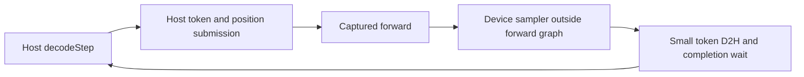
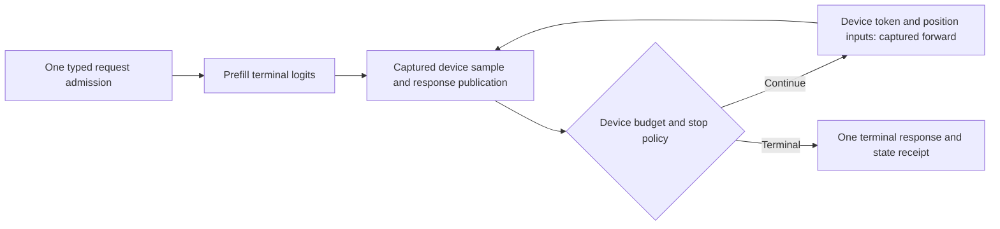
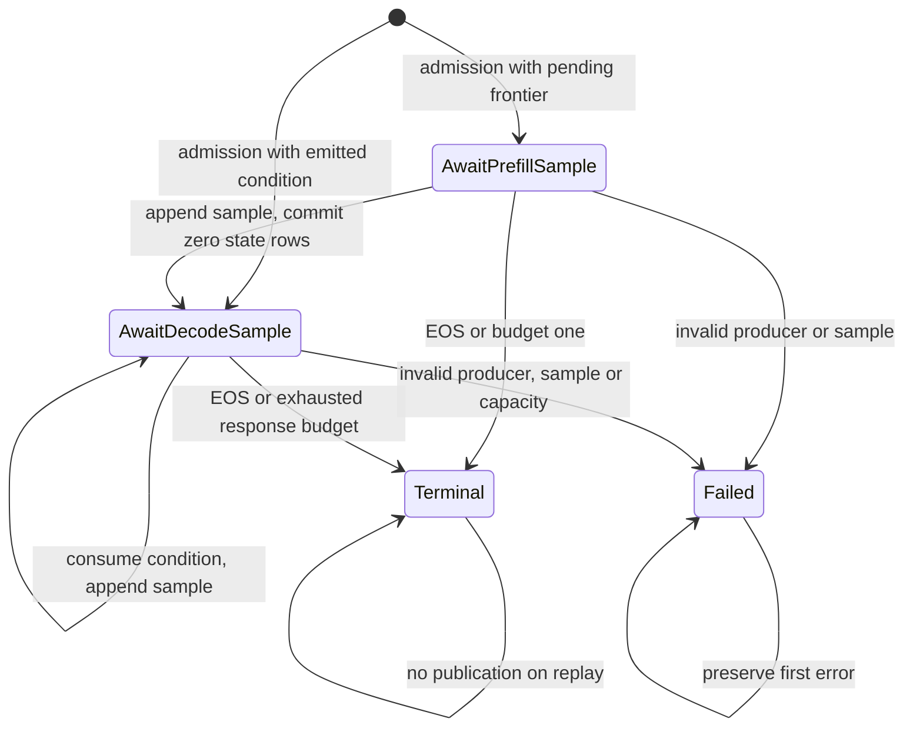
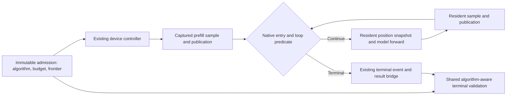
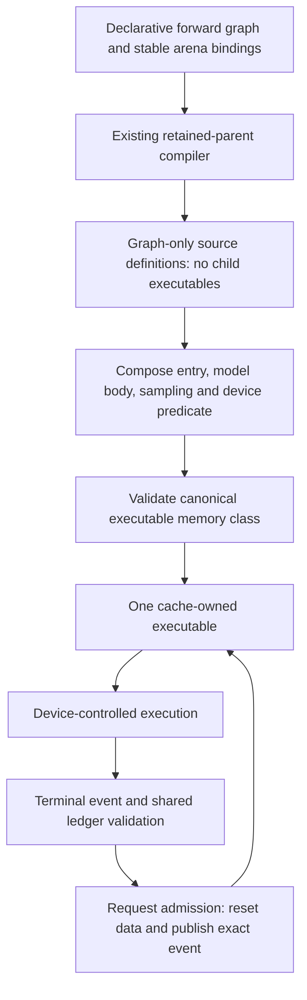
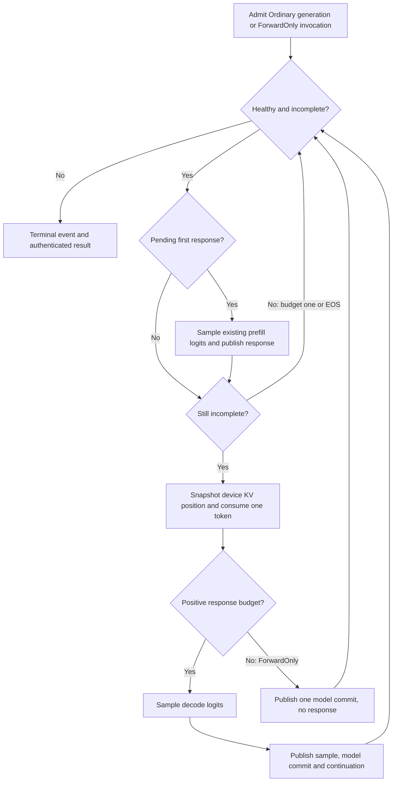

# CUDA Qwen3.8 MTP-off tuning — September 6, 2026

## Latest verified snapshot (September 7)

The latest restored-source Release measurement is **1061.632 tok/s prefill and
42.403 tok/s after-prefill decode**, against the pinned llama.cpp baseline of
**1166.248 / 45.417 tok/s**. The throughput goal remains open. The earlier
September 7 restored-source run measured 1010.604 / 42.211; none of the three
rejected kernel experiments below accounts for this variation. They were
removed before the new five-iteration run. Receipt:
`/tmp/qwen38-mtpoff-restored-after-screening.{json,log}`. All five iterations
produce the same 256 IDs as the prior baseline; MTP and PerfStats are disabled.
Prepared weights and workspace remain 17,091,788,800 and 2,435,227,652 bytes.
These are fixed-contract Release workloads, not the profiler measurements below.

The shared ordinary/forward-only controller slice passes **636 Unit tests,
96 ProductionParityPreflight integrations and all six selected CUDA Qwen3.8
cells** (MTP off, 1, 2, 3, 15 and dynamic depth), with **53 validated CSVs**.
The aggregate took **384.866 s**; its model campaign took approximately 59 s.
Receipt: `/tmp/qwen38-ordinary-shared-program-proof.{json,log}`. Artifact root:
`/tmp/production-campaign-artifacts/20260907T041335Z-2034004-1788754415126554058`.
This is the selected CUDA dense matrix, not the entire cross-model/backend
campaign. Ordinary device-loop production binding is still unfinished; the
model-free native-parent proof does not certify that missing integration.

## Paired phase comparison and rejected geometry experiments (September 7)

The fresh [paired phase attribution](2026-09-07-cuda-mtp-off-phase-comparison.md)
now compares both engines on the same 512-token/256-output MTP-off workload.
It establishes a quantized projection/reduction pipeline deficit, plus separate
attention and floating-projection prefill deficits; the old Llaminar-only
hotspot ranking was not sufficient to distinguish these.

Two smaller output tiles were tested and removed. The 64x128/16-warp IQ4 tile
achieved 64.39% occupancy with 64 registers and zero dynamic spills, but mean
gate/up and down timing was 1394.237/1426.289 us versus the existing tile's
1283.072/1215.756 us. The 64x64/16-warp tile was slower again. Q5 also lost on
the smaller candidate; five other ordinary codebooks spilled on the first
geometry, correctly failing the all-codebook resource gate. Receipts:
`/tmp/qwen38-small-output-tile-{resources.csv,iq4.csv,q5.csv}` and
`/tmp/qwen38-small-output-tile6-ncu.{ncu-rep}` with its details text.

A four-quant-block/BK128 double-buffered experiment retained the large output
tile and exact 32-value contribution/serial partition order. It halved outer
CTA barrier count and used 79,888 on-chip shared bytes for IQ4, without growing
global VRAM. Full-output comparisons were byte-exact, but mean gate/up and down
timing was 1372.058/1333.105 us versus 1275.597/1222.861 us for the old tile in
the same process. Isolated NCU confirmed 128 registers, zero dynamic spills,
33.07% occupancy, and 50.27% SM throughput. No end-to-end benefit was claimed.

The initial generalized storage/unroll form also introduced spills into old
specializations. A revised portable-storage binding plus two-block unrolling
removed the new IQ4 spill but did not recover economy or the whole resource
inventory. Both versions were rejected, not converted into allowlist entries.
All BK128/type/macro additions and temporary tile IDs were removed. The
restored Release binary passes the exact original 196-specialization resource
gate again; the source retains the previously accepted cursor optimization.

Receipts: `/tmp/qwen38-bk128-unroll2-{resources.csv,iq4.csv,iq4-timing.csv}`,
`/tmp/qwen38-bk128-unroll2-ncu.{ncu-rep}` and its details text,
`/tmp/qwen38-bk128-restored-{build.log,resources.log,resources.csv}`.
The rejected prototype is archived only at
`/tmp/qwen38-bk128-rejected-prefill.cu`, not installed in production.

## Rejected packed-payload staging experiment (September 7)

A BK64 candidate asynchronously copied each 16-byte packed block into a
thread-owned shared slot while the current tile computed, then decoded that
slot after its copy-group wait. It retained the existing CTA publication
barrier, decoded double buffers, canonical arithmetic, and device allocation
BOM. It added no graph node or device-global weight representation.

The 26-case IQ4_XS tile/strategy sweep at M=512 remained byte-exact for both
N=17408/K=5120 and N=5120/K=17408, but AUTO mean latency regressed:

| Native-event measurement | Gate/up µs | Down µs |
|---|---:|---:|
| Accepted source | 1279.317 | 1204.259 |
| Packed-payload candidate | 1322.223 | 1252.215 |
| Candidate repeat | 1317.888 | 1247.130 |

The isolated exact-tile NCU launch reported 128 registers, 48,128 shared bytes,
zero dynamic spills, 32.99% achieved occupancy, and 87.35 GB/s DRAM throughput.
The added shared staging did not improve occupancy or expose a bandwidth win.
An earlier 32-byte-payload variant also exceeded the static shared-memory
limit at device link; it never produced a usable executable. The final
16-byte candidate built and passed focused bytes, but was **removed** because
of the repeatable slowdown. It was not promoted or claimed as a model proof.

Receipts: `/tmp/qwen38-async-payload-{baseline,candidate,candidate-repeat}.csv`,
their `.log` files, and `/tmp/qwen38-async-payload-ncu.ncu-rep` with its
`-details.txt` export. Profiler timings are not canonical model measurements.

## Rejected scale-consumer experiments (September 7)

Moving the interior tile's scale/minimum loads from a whole-warp-tile preload
to the current column pair preserved all 26 focused output comparisons, but
did not reduce the production tile's 128-register allocation. AUTO means were
1275.836 / 1194.701 µs, versus 1279.317 / 1204.259 µs before the experiment.
That sub-1% difference is not a demonstrated optimization. Receipt:
`/tmp/qwen38-local-scale-candidate.{csv,log}`.

The next candidate moved the original primary FP16 scale's exact widening to
the shared-tile producer. It used the same canonical contribution helper with
a typed widened-scale argument, rather than duplicating any format's formula.
All 26 focused byte comparisons passed, but AUTO timings were 1278.669 /
1205.589 µs: no gain. The isolated NCU tile retained 128 registers, zero dynamic
spills and 32.99% occupancy; shared storage grew to 45,056 bytes. The broader
196-candidate resource gate also caught a new IQ1_M ordinary tile-2 spill
(despite eliminating a different existing canonical tile-5 spill). That gate
was not weakened. Both scale experiments were removed.

After restoration, the original 196-candidate resource gate passed again and
all 26 focused byte comparisons passed, with AUTO timings of 1276.109 /
1194.359 µs. Receipts: `/tmp/qwen38-shared-scale-{candidate,resources}.csv`,
their logs, `/tmp/qwen38-shared-scale-ncu.ncu-rep`, and
`/tmp/qwen38-restored-prefill{,-resources}.{csv,log}`. No production source
change from these experiments remains; no full campaign is claimed for the
rejected variants.

## Refreshed production attribution (September 7)

`/tmp/qwen38-mtpoff-current-attribution.{nsys-rep,sqlite}` profiles the restored
Release source with the same model, 512-token prompt and 256-token generation.
It uses one warmup plus one timed request. For profiler attachment only, the
launch uses `--no-mpi-bootstrap`, `OMP_NUM_THREADS=1`, `OMP_PROC_BIND=true`,
and `LLAMINAR_PROFILER_NORMAL_EXIT=1`; it is not a canonical throughput sample.
Nsight records executed graph nodes, not merely construction metadata.

The last complete prefill graph (correlation 1279423) spans 488.531 ms. Include
all CUDA kernels inside that interval, including attention kernels whose
correlation is zero. A timestamp sweep distinguishes category unions from
time spent in that category with no other category running:

| Prefill category | Union ms | Category-only ms |
|---|---:|---:|
| IQ4 tensor-core projections | 293.564 | 290.853 |
| Q5 tensor-core projections | 80.381 | 77.681 |
| GDN recurrence | 28.046 | 28.040 |
| Tiny floating projections | 21.765 | 21.759 |
| Other kernels, including full attention | 67.241 | 67.196 |
| No kernel active | — | 0.267 |

Category unions must not be summed as serial critical-path costs. Main GGUF
Q5_K tensors use native codebook 7 (the Q5_1 arithmetic family); no GGUF weight
format was changed. The exact Q5 inner projection N=10240/K=5120/M=512,
tile 64x128/w4x2, reports 128 registers, zero dynamic spills, 31.97% achieved
occupancy, 65.38% SM throughput and only 9.12% DRAM throughput. Receipts:
`/tmp/qwen38-q5-prefill-{baseline.csv,ncu.ncu-rep,ncu-details.txt}`. Its full
three-geometry tile sweep is byte-exact. AUTO in this diagnostic harness
disables exact overlays; it is not necessarily the installed production tile.

Across the final 20 complete decode graphs, the mean kernel interval is
22.072 ms. Quantized matrix producers occupy 17.617 ms as a union (16.647 ms
without other categories); vocabulary projection occupies 1.314 ms. Reducers
occupy 1.535 ms as a union but only **0.550 ms** without overlap. Kernel-idle
time inside the graph is 0.066 ms. These intervals exclude host work between
graphs and do not replace the earlier non-CUPTI CPU API timing probe.

The next prefill experiment should target per-thread accumulator footprint
and warp/CTA residency, not add more raw-payload staging or scale storage.
Evaluate a smaller output tile with more warps per tile through the canonical
candidate harness; preserve the serial-M1 tree and require all-codebook
resource and captured-byte gates before any production selection. This is a
hypothesis, not an installed policy or a claimed speedup. Decode remains a
separate, predominantly weight-bandwidth problem; a prefill tile win would not
establish the decode goal.

## Scope and initial September 6 result

The active target is to beat the pinned llama.cpp Release build on both
prefill and decode, with **MTP disabled**. All runs retain the same
Qwen3.8-27B IQ4_XS GGUF, one RTX 3090, FP32 model activations, FP16 KV,
4096-token context capacity, exact 512-token prompt bytes, greedy sampling,
and 256 generated tokens. No weight conversion policy, activation precision,
workspace budget, or collective transport was changed.

| Unprofiled Release measurement | Prefill tok/s | Decode after prefill tok/s |
|---|---:|---:|
| Refreshed Llaminar baseline | 957.946 | 42.465 |
| CUDA BK64 cursor, first candidate | 1058.454 | 42.392 |
| Final typed partition geometry | 1065.861 | 42.426 |
| llama.cpp `73a43d1f69345aee8bb186ef4b3172cef892f2e5` | 1175.520 | 45.664 |

The final candidate improves prefill by 11.27%; decode is unchanged within
measurement variation. **The goal is not achieved.** Throughput remains about
9.3% below llama.cpp in prefill and 7.1% below it in decode. Every Llaminar
receipt contains identical 256-token output sequences in every measured
repeat, with zero MTP draft calls.

Decode comparison uses 255 tokens divided by decode time: the first token is
produced by prefill. Llaminar's separate headline `decode` field counts 256
and must not be compared directly with llama.cpp's after-prefill rate.

Local receipts, deliberately outside version control:

- `/tmp/qwen38-mtpoff-tuning-baseline.{json,log}`
- `/tmp/qwen38-mtpoff-cursor.{json,log}`
- `/tmp/qwen38-mtpoff-typed-partitions.{json,log}`
- `/tmp/qwen38-llama-no-mtp-{1,2,3}.json`

One warmup and three measured requests use the ordinary MPI bootstrap:

```bash
env LLAMINAR_BENCHMARK_ITERATIONS=3 LLAMINAR_BENCHMARK_WARMUP_ITERATIONS=1 \
./build_v2_release/llaminar2 benchmark \
  -m /mnt/llaminar-production-parity/cache/models/Qwen3.8-27B-IQ4_XS.gguf \
  -d cuda:0 -c 4096 --prompt-file /tmp/qwen38-exact512-prompt-nonl.txt \
  -n 256 --deterministic \
  --benchmark-json-output /tmp/qwen38-mtpoff-typed-partitions.json
```

Prepared weights remain 17,091,788,800 bytes and reusable workspace remains
2,435,227,652 bytes. The GGUF is loaded from the persistent tmpfs cache.
Canonical timings have neither PerfStats nor a vendor profiler enabled.

## Attribution and change

Fresh node-level Nsight Systems reports cover MTP-off inference in both
engines, not an eager substitute:

- `/tmp/qwen38-cuda1-mtpoff-attribution.{nsys-rep,sqlite}`
- `/tmp/qwen38-lcpp-mtpoff-attribution.{nsys-rep,sqlite}`

These traces include setup and multiple prefills; whole-process kernel totals
are not per-request timings. Adjacent final vocabulary projections delimit
complete decode steps. In one Llaminar decode step, 400 K-partition reducers
consume 1.553 ms of summed kernel time, including overlap between streams.
This is a candidate for further launch/publication fusion, not a guaranteed
1.553 ms end-to-end saving. Ordinary decode's dominant IQ4 projection reaches
91.89% DRAM utilization (837.19 GB/s) in an isolated NCU launch, so removing
scalar decoder instructions alone is unlikely to recover the whole gap.

Prefill is different: the dominant `nativeVnniTC_BK64<4,128,128,4,4,2>` has
128 registers/thread, one resident block per SM, and approximately 33%
occupancy. It is not DRAM-bandwidth-limited. Its inner partition publication
previously tested a runtime integer remainder after every 32-value block.
The candidate computes the immutable partition span once and advances the
next boundary after each fold. Short final partitions still commit at the
end of K. The order of contributions, partition scaling, ascending reduction,
and final epilogue are unchanged for every BK64 codebook.

The existing full candidate tile sweep remains byte-exact and still selects
the installed 128x128/16-warp tile for the measured projections. No generated
dispatch include was hand-edited or replaced using partial evidence.

| Isolated IQ4_XS M=512 projection | Previous mean µs | Cursor mean µs |
|---|---:|---:|
| N=17408, K=5120 | 1464.013 | 1300.036 |
| N=5120, K=17408 | 1391.514 | 1237.502 |

Native-event aggregate and timing sidecars:
`/tmp/qwen38-mtpoff-tile-{baseline,cursor}.{csv,timing.csv}`.
Every timed row reports zero mismatched bytes against serial decode.

Separate NCU reports, not used as canonical timings:

- `/tmp/qwen38-mtpoff-tc-baseline.ncu-rep`
- `/tmp/qwen38-mtpoff-tc-cursor.ncu-rep`
- `/tmp/qwen38-mtpoff-m1-baseline.ncu-rep`

The prefill candidate retains 128 registers/thread, 44,032 shared bytes/CTA,
and zero measured local-memory spilling requests. Profiled duration falls
from 1.39 to 1.21 ms; the resource and graph-workspace footprints do not grow.

### All-format resource and economy correction

The first cursor is not the accepted final source: ptxas introduced new
spilling specializations in register-heavy formats. Precomputing the immutable
span in the host launch parameters removes most of that pressure, but forcing
IQ1_M's remaining affected tiles to one resident CTA is **rejected**. Its
large-M projections slow down by approximately 8–11%; the isolated normal
tile grows from 128 to 244 registers/thread and halves theoretical occupancy.
Zero spills alone is not an economy certificate.

The final candidate carries typed immutable `CanonicalM1PartitionGeometry`
launch parameters. Ordinary BK64 formats use the moving boundary; IQ1_M keeps
its original stateless boundary calculation and two-CTA register budget.
Grid-Z canonical-KPART arithmetic also retains its original calculation.
These are compile-time codebook/launch specializations, not runtime retries,
changed arithmetic schedules, generated dispatch edits, or model-specific
shape exceptions.

The resource gate again reports the exact original inventory: 196 queried,
176 spill-free, and 20 pre-existing spilling candidates excluded from installed
selection. No new spill is permitted. IQ1_M A/B covers both 17408x5120 and
5120x17408 at M=33,128,512,1024, ordinary and canonical-KPART tiles 2/3.
Every output remains serial-byte-exact; large-M automatic selection is within
0.65% of its original timing, with 128 registers and zero local bytes. Receipts:

- `/tmp/qwen38-mtpoff-iq1m-{original,cursor,typed}.{csv,timing.csv}`
- `/tmp/qwen38-mtpoff-typed-resources.log`
- `/tmp/qwen38-mtpoff-tc-typed.ncu-rep`

The final IQ4_XS production tile's separate NCU run reports 128 registers,
44,032 shared bytes, 33.01% achieved occupancy, zero spilling requests, and
1.20 ms duration versus the original 1.39 ms. The earlier IQ1_M `tile3` NCU
report selected the normal oracle kernel, not the requested candidate, and
must not be used as canonical-KPART evidence.

## Verification and next action

The final source passes the canonical CUDA Qwen3.8 aggregate at 22:57 UTC:

- Complete Unit gate: **633/633**, 69.96 seconds.
- ProductionParityPreflight: **96/96**, 250.78 seconds. Its newly registered
  captured all-format boundary test passes in 24.09 seconds, and the exact
  all-codebook compiler-resource inventory passes in 1.50 seconds.
- Qwen3.8 CUDA model parity: **6/6 cells**, 59.22 seconds; **53 CSV artifacts**
  validated. MTP off, depths 1/2/3/15 and dynamic depth all retain prefix-restore
  verification. This is one selected canonical campaign, not a claim that the
  entire multi-model/backend matrix was rerun.
- Aggregate selected-run wall time: **380.84 seconds**. Persistent tmpfs staging
  has one cache hit and copies zero bytes; Hugging Face packs are reused.
- The expanded ROCm all-format boundary inventory separately passed in 25.30
  seconds before the final CUDA-only kernel revision.

Machine-readable receipt: `/tmp/qwen38-cuda-mtpoff-tuning-proof.json`; full log:
`/tmp/qwen38-cuda-mtpoff-tuning-proof.log`. Artifact root:
`/tmp/production-campaign-artifacts/20260906T225058Z-868067-1788735058626169061`.

The shared all-format N/K inventory now includes
56-block reductions with odd partition spans and short final partitions.
CUDA exact-M/bucket-M comparisons additionally replay retained graphs twice,
poisoning outputs inside each replay. The canonical preflight label now owns
this byte-equivalence test and the all-codebook compiler-resource gate; both
are model-free functional tests, not performance benchmarks.

Continue MTP-off tuning, especially economical consolidation of decode
K-partition publication and remaining prefill latency, without changing the
serial arithmetic tree or increasing the model's admitted VRAM.

The next decode experiments should first profile the Q5 projection family
separately from the already bandwidth-saturated IQ4 gate. The existing trace
attributes approximately 4.25 ms per profiled decode step to Q5 KPAR producers,
in addition to the 1.55 ms summed reducer time. CUDA still expands each Q5
high-plane nibble with individual shifts/masks, whereas ROCm's prefill decoder
already uses an exact multiply-and-mask expansion. Porting that instruction
reduction is a smaller experiment than reorganizing cross-CTA publication.
The follow-up below records those experiments separately from this green gate.

## September 7 follow-up: retained source and rejected experiments

The retained source adds an exhaustively tested integer Q5 high-plane deposit
to the existing CUDA unpacker. It serves Q5_0, Q5_1 and Q5_K; centering,
scales, FP32 contribution arithmetic and every other codebook are unchanged.
The helper checks all 2^20 combinations of four five-bit values in a
device-free Unit test. ROCm prefill already uses the equivalent multiplication
and mask. No generated dispatch policy was edited.

The fresh unprofiled Release confirmation is **1075.182 tok/s prefill and
42.475 tok/s after-prefill decode**. Every one of the three 256-token outputs
matches the previous source, MTP remains disabled, and prepared/workspace
bytes remain exactly 17,091,788,800 / 2,435,227,652. Receipt:
`/tmp/qwen38-mtpoff-final-unpack.{json,log}`. This is about 0.9% above the
previous prefill measurement; do not attribute that small difference entirely
to Q5 instructions. The isolated Q5 projection is unchanged at approximately
51.8 microseconds. The performance objective remains open.

These experiments were rejected and removed, including their prototype-only
planner and Unit target:

| Experiment | Prefill tok/s | Decode tok/s | Disposition |
|---|---:|---:|---|
| CTA-local canonical partition fold | 1074.358 | 42.259 | Slower decode |
| Single-wave specialization | 1073.943 | 42.255 | Slower decode |
| Wider column locality | 1074.212 | 42.174 | Slower decode |

The old IQ4 KPAR producer reaches 837 GB/s, 38 registers and about 80%
occupancy. CTA-local folding keeps all output bytes but falls to 651–668 GB/s,
50–51 registers and about 69% occupancy. Removing a reducer launch is not a
win if its producer loses that much bandwidth. A two-column diagnostic uses
the same arithmetic partitions and improves the fused microkernel, but no
partial measured dispatch table was installed. Receipts:
`/tmp/qwen38-mtpoff-cta-fold{,-specialized,-locality}.{json,log}` and
`/tmp/qwen38-mtpoff-iq4-kpar-fold-{isolated,specialized}.ncu-rep`.
The earlier non-isolated `iq4-kpar-fold.ncu-rep` accidentally captured the
KB=1 oracle, not KB=6, and is **not valid candidate evidence**.

An interval-union check further narrows the opportunity: in the previously
profiled decode step, only **0.538 ms** contains a KPAR reducer without another
kernel active. About 0.999 ms of reducer intervals overlaps other work. This
is not itself a critical-path bound, but treating all 1.553 ms of summed
reducer time as independently removable latency would be misleading. The
two IQ4 gate/up producers begin together; their roughly 78/117-microsecond
durations overlap, rather than forming a 195-microsecond serial sequence.

A second rejected prefill experiment split 16-byte nibble unpacking across
all 512 threads instead of 256. It preserved bytes, registers and shared
storage but regressed the IQ4 gate/down projections from 1300/1238 to
1432/1351 microseconds. Its source was removed before the final confirmation.
Receipt: `/tmp/qwen38-mtpoff-balanced-unpack.{csv,timing.csv,log}`.

The retained IQ4 prefill tile's isolated stall profile reports 24.38% barrier,
11.84% long-scoreboard, 11.50% fixed-latency wait and 10.62% math-pipe-throttle
active-warp cycles. These are warp stall categories, not additive percentages
of end-to-end inference time. Occupancy is 33%, instruction issue utilization
about 51%, and spills zero. Receipts:
`/tmp/qwen38-mtpoff-tc-{stalls,warp-stalls}.ncu-rep`.

### Discovered ordinary-generation lifecycle gap

The current MTP-off path captures the **forward**, not the complete generation
policy. This is a production implementation gap relative to AGENTS.md's
device-owned generation requirement, not a new benchmark option:



`BenchmarkRunner` calls the public adapter's `decodeStepForBenchmark`, which
delegates to `OrchestrationRunner::decodeStep`. With MTP disabled, that method
calls `forward(&last_token_, 1)` and samples a host-visible token. The complete
parent is reached only through the MTP branch. Admission/materialization also
explicitly require retained MTP capacity and positive draft depth. Merely
changing the benchmark caller or enabling MTP with a disguised zero depth
would not implement ordinary generation properly.

The original node-level trace magnifies the gap to about 3.3 ms. A separate
graph-level trace shows 22.808 ms median forward duration and **0.742 ms median
between forwards**, with approximately 0.372 ms median host graph-launch API
duration. This lighter trace still has profiler overhead; it is not an
unprofiled saving guarantee and does not explain the entire decode deficit.
Receipt: `/tmp/qwen38-mtpoff-graph-level-tax.{nsys-rep,sqlite,json,log}`.

The next structural slice should generalize the existing generation authority:



Implementation boundaries and proof obligations:

- Distinguish ordinary generation from fixed/dynamic MTP with an explicit
  policy. Reuse the response ledger, logical state, reset and terminal
  ownership; do not create a parallel controller or host shadow.
- `initializeBuffers` already registers response, control, dispatch-ticket
  and logical-state buffers for GPU execution independently of MTP. Reuse
  those owners without loading a sidecar or increasing the admitted VRAM.
- CUDA uses a complete conditional parent. ROCm uses a complete retained
  transaction and an authenticated immutable ticket. Device state remains
  authoritative in both; CPU continues to own CPU state.
- Preserve the first sample from prefill and the final emitted-but-unconsumed
  token, exact sampling draws, EOS, budget-one behavior, prefix restore,
  continuation and reset/replay equivalence. No final extra forward is allowed
  merely to simplify state accounting.
- Extend the canonical proof to require this policy for MTP-off GPU cells.
  `collectProductionParityEvidence` currently considers the parent requirement
  satisfied when no device-generation controller was observed. Existing green
  MTP-off math/forward-capture tests therefore do **not** certify a complete
  device-owned generation loop. Do not relabel those old receipts as such.

### Final verification of the retained source

At 00:19 UTC the complete Unit gate passes **634/634** in 69.49 seconds,
ProductionParityPreflight passes **96/96** in 250.12 seconds, and the selected
Qwen3.8 CUDA campaign passes **6/6** in 59.53 seconds with **53 validated CSV
artifacts**. Individual cells: MTP off 10.159 s, depth 1 9.345 s, depth 2
9.182 s, depth 3 9.185 s, depth 15 9.344 s, dynamic depth 11.052 s. Prefix
restore remains enabled. Including builds and fixture handling, aggregate
wall time is 392.645 seconds. No new all-model/backend aggregate is claimed.

Receipt: `/tmp/qwen38-cuda-mtpoff-unpack-proof.{json,log}`. Artifact root:
`/tmp/production-campaign-artifacts/20260907T001307Z-1007489-1788739987477574583`.
This is green under the existing numerical/forward-capture contracts; the
ordinary complete-generation requirement described above remains unimplemented
and unproven. The external throughput objective also remains open.

## Ordinary-generation controller implementation slice

The shared admission ABI is now named `DeviceGenerationPolicy` and has an
explicit `ordinary()` algorithm. `fixed(0)` remains invalid; ordinary admission
zeros every speculative-only policy field and never requests a draft or
verifier row. The immutable policy remains 44 bytes and the persistent control
row remains 46 INT32 words. No response, logical-state, arena or weight
allocation is added by this change.

CUDA and ROCm now implement the same typed
`IBackend::enqueuePublishOrdinaryGenerationSample` contract. Its descriptor
borrows persistent sampler/stop, response and controller buffers. One lane per
request publishes a sample; only `DecodeLogits` advances the committed-state
count. `PrefillLogits` can occur exactly once for a pending response frontier.
An already-emitted continuation must start at `DecodeLogits`. EOS is part of
the response but remains unconsumed, as in the existing serial path.



The diagram names logical transitions, not additional resident flags. The
existing response, transaction and committed-state words encode them. Ordinary
and speculative publication reject each other's active controller algorithm.
No separate host copy is consulted by a transition.

Five device-free regression tests pass (the CMake-owned
`V2_Unit_OrdinaryGenerationController`, 0.33 seconds). They cover every stop
position through a 256-token response, budget one, continued requests, repeated
prefill rejection, overflow/malformed admission, terminal replay and unchanged
storage ABI. CUDA/ROCm capture/reset tests join the existing
`DeviceGenerationController` preflight registrations rather than a performance
gate. Both registrations pass (CUDA 1.69 s, ROCm 0.86 s), including their existing
MTP cases. The new fixture covers request counts 1, 2, 31, 32, 33, 63, 64, 65
and 129, budgets 1, 2 and 17, both initial frontiers, independent EOS, padded
strides, invalid sampler output and twenty replays per captured configuration.
The selected canonical campaign passes its unchanged prerequisites:
**635/635 Unit** in 71.57 seconds and **96/96 ProductionParityPreflight** in
250.28 seconds. The six CUDA Qwen3.8 cells then pass in 59.58 seconds with
**53 validated CSV artifacts** and prefix restore enabled. Cell times are:
MTP off 9.919 s, depth 1 9.219 s, depth 2 9.385 s, depth 3 9.174 s, depth 15
9.335 s, dynamic depth 11.106 s. Total protected wall time, including build
and fixture handling, is **397.622 seconds**. Persistent tmpfs model staging
reused the existing GGUF and copied zero bytes.

Receipt: `/tmp/qwen38-ordinary-controller-proof.{json,log}`. Artifact root:
`/tmp/production-campaign-artifacts/20260907T010029Z-1258495-1788742829453386687`.
This is the selected six-cell campaign, not a new all-model/backend aggregate.
It protects the existing model/MTP behavior; the full ordinary model loop
remains unimplemented, and no new Release throughput result is claimed.

Initial compiler-resource inspection of the new publication kernel reports
CUDA 22 registers, zero stack/local/shared bytes; gfx906 reports 14 VGPRs,
27 SGPRs and zero private bytes or SGPR/VGPR spills. Launches use one warp/wave
per up-to-32/64 independent requests. Batch-one publication is intentionally a
single scalar transition, not a vocabulary reduction.

Isolated first-publication profiler evidence (one request, budget one,
`PrefillLogits`, Integration binary; **not production timing**):

| Backend | Profiled duration | Launch | Registers | Scratch/spills |
| --- | ---: | --- | --- | --- |
| CUDA / RTX 3090 | 4.90 us | one 32-thread block | 22/thread | zero |
| ROCm / gfx906 | 7.04 us | one 64-thread wave | 16 VGPR / 32 SGPR allocated | zero |

CUDA reports 2.08% achieved occupancy: a single request has only one scalar
ledger transition, so filling the device would add unnecessary work. ROCm's
counter-bearing dispatch reports exactly one wave; compiler metadata requests
14 VGPR / 27 SGPR, rounded to the allocation granularity shown above. Neither
kernel contains a vocabulary reduction or a hidden data transfer. The focused
test completes cleanly under each profiler. Receipts:
`/tmp/qwen38-ordinary-publication-cuda.ncu-rep`,
`/tmp/qwen38-ordinary-publication-cuda-details.txt`, and
`/tmp/qwen38-ordinary-publication-rocm/3cd9f562a1d1/1255035_results.db`
(the single counter-bearing kernel dispatch is event 7).

This is a controller/backend foundation, **not the finished model loop**.
The serving and benchmark ordinary path is deliberately not redirected to a
partial implementation. Next reuse the existing sampler, logical-state and
captured-forward owners in a complete parent, generalize its terminal
validation, and wire that through public orchestration. The first-prefill
sample must precede a predicate-checked decode body so budget one cannot launch
an extra forward. Existing off-generation evidence must only be tightened when
that full production execution is actually installed; old passes remain
math/forward-capture evidence, not full-generation certification.

### Composition boundaries for the next slice

- `beginDeviceResidentGeneration` must accept the ordinary policy without
  requesting MTP graph capacity; the shared request/reset event owner remains
  unchanged. Do not activate a sidecar to satisfy its current MTP-only guard.
- `MTPGraphOwnerPlan` already retains minimum scalar sampler storage when MTP
  is off, but correctly admits **zero MTP executables** in that mode. Reusing
  sampler buffers is not permission to retain unpriced extra graph executables.
  Replace/share the ordinary forward executable ownership through the canonical
  graph-owner BOM so admitted bytes do not grow.
- Reuse the existing argmax/stochastic primitives and admitted penalty history.
  `sampleGreedyFromMainLogitsToDeviceTargetSlot` currently couples its device
  output to MTP readiness and optional host observation; a complete ordinary
  parent needs the resident producer contract, not a call to the host-returning
  sampler for every iteration.
- The CUDA WHILE composer already evaluates the controller before its first
  body iteration. A prefill-sample prologue must precede that predicate so a
  one-token request consumes no extra KV row. An already-emitted continuation
  instead begins with its condition-consuming decode body. Compose those
  explicit request frontiers without an additional host-owned token/position.
- Generalize the existing terminal validator rather than creating a second
  result bridge. Its current positive-depth/verifier-count conditions are
  speculative-only; ordinary terminal evidence must validate zero speculative
  counters, the response/state offset, EOS and the pending last token.
- Preserve benchmark phase semantics when replacing host step timing with one
  complete launch. The external comparison uses 255 after-prefill decode rows
  for a 256-token response. Do not report 256 forward rows, silently include
  setup/capture in one engine's sample, or call a profiled GPU duration a new
  unprofiled end-to-end result. Timing must come through the shared production
  surface, without benchmark-owned knowledge of the controller.

### Captured entry prologue and shared terminal contract

The CUDA composer now accepts an ordered prologue before the native WHILE's
initial predicate. Prologue and body are validated together before replacing
the graph, then cloned into **one** parent. An ordinary prefill sample can
therefore exhaust the response budget or emit EOS without executing even one
decode forward. Existing MTP callers use the same API with an empty prologue;
there is no second host launch or new device allocation.

The new `NativeWhilePrefillPrologueCUDA` regression uses the actual ordinary
publication backend and a device-written forward marker. It checks every one
of twenty resets for budgets 1, 2, 17 and 256, prefill EOS, first-decode EOS,
an invalid sample, and terminal replay. The marker detects an unwanted forward
even if its publication subsequently becomes a no-op. The focused CUDA graph,
CUDA controller and ROCm controller registrations pass 3/3 in 5.06 seconds
(`/tmp/qwen38-ordinary-prologue-proof.log`). These are model-free composition
proofs, not an end-to-end ordinary model-loop certificate.

`DeviceGenerationContract.h` now owns both the immutable admission and terminal
validation. The orchestrator retains that complete admission instead of only
its depth policy; it does not retain another copy of live device counters.
One validator authenticates response plus remaining budget, every immutable
policy field, algorithm-specific state commits, depth statistics and movement
evidence. Ordinary generation proves `committed = response + initial-leading
- 1`, leaving the last returned token unconsumed. MTP retains its different
verifier/commit rules. Counter arithmetic is widened before sums/products so
corrupt terminal data cannot overflow while being diagnosed.



This is the intended complete production composition. The resident position,
model-forward and sampler wiring is still pending; the diagram does not claim
those missing pieces already execute through this parent. The seven pure-host
controller tests pass in 7 ms, including all 46 terminal words poisoned with
negative/INT_MAX values, continued-response frontiers and each speculative
policy at depths 1 through 15. Receipt:
`/tmp/qwen38-ordinary-terminal-unit-proof.log`.

The remaining implementation must replace/share the existing ordinary decode
executable owner, not keep a second unpriced model executable. Forward graph
export currently requires device-owned token/position inputs, whereas serving
setup still records a host-token serial graph. Position must be snapshotted
from the canonical device KV counter before the forward advances it. Existing
scalar sampler and logical-state arena owners are already present with MTP off.
Those are concrete wiring boundaries, not permission to enable MTP capacity.

Benchmark timing needs no additional controller-aware API: its public adapter
already accepts multiple returned tokens and measures the complete decode call.
For this workload it divides 255 after-prefill rows by that full duration; it
does **not** subtract a separately observed first-sample latency. A complete
ordinary parent can preserve that convention without a host-per-token bridge.

The fresh canonical selected run passes **635/635 Unit** in 67.80 seconds,
**96/96 ProductionParityPreflight** in 250.93 seconds, and **6/6 CUDA Qwen3.8
cells** in 59.67 seconds. It validates all **53 CSV artifacts**, including
mandatory prefix restore. Individual GoogleTest cell times are MTP off
9.956 s, depth 1 9.408 s, depth 2 9.167 s, depth 3 9.296 s, depth 15 9.312 s,
and dynamic depth 11.062 s. Both controller integrations include the stronger
every-replay terminal authentication (CUDA 1.82 s, ROCm 0.97 s).

The run's complete protected wall time is **379.455 seconds**. Persistent
tmpfs staging reuses one model and copies zero bytes. Both CUDA devices return
to 1 MiB after retirement. Receipt:
`/tmp/qwen38-ordinary-contract-proof-v2.{json,log}`; artifact root:
`/tmp/production-campaign-artifacts/20260907T014505Z-1507229-1788745505458029277`.
This certifies the selected campaign, not the entire model/backend matrix.

The first prerequisite attempt is retained separately at
`/tmp/qwen38-ordinary-contract-proof.{json,log}`. It passed 634 Unit tests and
failed one architecture source assertion that expected two calls to the
shared fragment lowerer. The prologue legitimately added a third call. The
replacement checks named prologue/fixed-body/selector-body regions and requires
the initial predicate's explicit prologue dependency; no production invariant
or numerical gate was weakened. That failed run loaded no model.

The fresh MTP-off `production_path.csv` still truthfully reports
`device_generation_controller=false` and `generation_loop_certified=false`.
The five MTP cells report the certified native conditional parent. Thus the
remaining ordinary model-loop gap is visible, not hidden by this green slice.
No new Release throughput number is claimed, and the llama.cpp performance
objective remains open.

## Ordinary parent ownership and resumed entry — September 7

The existing retained-parent executor solves the source/executable ownership
split needed here. Its capture controller
records graph-only child definitions, calls the typed parent composer, validates
the parent's declared memory class, and instantiates **only that parent**.
`GraphSegmentCache` rejects an executable child when sealing the parent plan.
The first integrated test exposed an important distinction: CUDA's ordinary
retained timeline records fragments directly into their final graph to preserve
conditional-handle identity. Those views cannot be supplied to a composer that
clones sources into a WHILE body. The initial test therefore failed during
setup, without launching inference; its receipt is
`/tmp/qwen38-ordinary-retained-parent-focused.log`.

`RequireCloneableParentComposition` now expresses independent graph-only
recording explicitly in the same executor policy. It selects the source factory
before capture, and the native composer rejects incompatible source node kinds.
The existing shared-timeline policies are unchanged; a failure never retries
another strategy. Both strategies use the same parent finalization, memory
validation, first-launch, replay and teardown implementation. This requires no
in-place graph replacement API, extra cache state, or second admission ledger.



The ordinary controller's existing `NextLeadingCommittedOutputCount` is also
sufficient to select fresh versus continued entry. A typed zero-word fragment
predicate samples prefill only when that field is zero. The complementary
non-zero predicate retains its original instruction specialization; hosted
ticket selection preserves the same polarity without reading device state on
the host. No inverted flag, new device allocation, or policy upload is needed.

The strengthened `NativeWhilePrefillPrologueCUDA` test now uses the production
`DeviceGraphExecutor` retained-parent path, rather than manually instantiating
its parent. Its model-free stage observes a forward marker and calls the
production publication backend. Both initial frontiers, budgets 1/2/17/256,
EOS, invalid stale prefill samples, and terminal replay share one executable;
every one of twenty resets is checked against the serial controller oracle.
It asserts one composition and no executable source children. This is a
compiler/lifecycle regression, **not yet a complete model-loop certificate**.

Remaining production integration must retain the existing single-forward
contract used by prefix suffix processing, route model token/position inputs
through their resident authorities, and keep sampling/history/thinking policy
semantics. A generator-only replacement that silently removes prefix's forward
operation is not acceptable. Parent identity must include every captured
program fragment and policy; a raw callback's presence is not sufficient
capture authentication. The generic retained-parent compiler can be reused,
but those model/request bindings still need to be installed and proven before
any new Release throughput claim.

The retained-parent slice's canonical selected gate passes **635/635 Unit**
and **96/96 ProductionParityPreflight**, followed by **6/6 Qwen3.8 CUDA cells**
and **53 validated CSV artifacts**. Individual times are off 10.061 s, depth 1
9.215 s, depth 2 9.168 s, depth 3 9.260 s, depth 15 9.396 s, and dynamic depth
11.132 s. Protected wall time is 382.804 s; persistent tmpfs staging copies
zero bytes. Receipt: `/tmp/qwen38-ordinary-cloneable-parent-proof.{json,log}`.
Artifact root:
`/tmp/production-campaign-artifacts/20260907T022711Z-1636563-1788748031399501134`.
This remains a selected-campaign certificate, not a whole-matrix claim.

The zero/non-zero predicate specializations both compile to 24 registers and
zero stack, local or shared bytes. Their sm86 instruction counts are equal;
only the final predicate polarity differs. Nsight Compute declines individual
kernel profiling inside a conditional graph, so the two attempted profiler
receipts are not timing evidence. Resource and ISA evidence are retained at
`/tmp/qwen38-ordinary-predicate-resources.txt` and
`/tmp/qwen38-ordinary-{zero,nonzero}-predicate.sass`.

Next separate kernel work from further controller foundations: the measured
host gap accounts for only part of the decode deficit and cannot improve
prefill. First evaluate compile-time double-buffer stage indexing in the
existing BK64 prefill loop, preserving the exact arithmetic, dispatch choices,
shared-memory capacity, and every codebook. This is a candidate, not an
accepted optimization or a new performance result.

### Prefill experiments after the retained-parent gate

Three experiments were removed; no new tile, dispatch override, async payload
path, or additional storage remains installed. Native-event timing and complete
output-byte comparisons used the Release trainer, IQ4_XS, M=512, the shared
17408x5120 / 5120x17408 production geometries, ten warmups and fifty samples.

| Experiment | Gate mean us | Down mean us | Disposition |
| --- | ---: | ---: | --- |
| Retained baseline | 1276.600 | 1227.142 | Unchanged |
| Compile-time ping-pong stage pairs | 1273.446 | 1203.569 | No convincing gain; new IQ1_M tile-2 spill |
| Async payload into inactive decoded slot | 1284.015 | 1214.505 | No convincing gain |
| Narrow-output 64x128, 16-warp tile | 1389.056 | 1435.668 | Slower than its same-process AUTO: 1278.300 / 1221.612 |

The paired-stage resource inventory reduced the total number of spilling
specializations from twenty to seventeen, but introduced a spill in a formerly
eligible IQ1_M tile. A smaller aggregate spill count does not excuse that
regression. The restored kernel retains the previously certified inventory.

The narrow-output candidate had its own physical tile identity during the
experiment; the installed AUTO policy was unchanged. Its isolated profiler
launch confirms 64 registers, 32,768 shared bytes, two theoretical resident
CTAs, 64.43% achieved occupancy and zero dynamic spilling requests. Barrier
stall share rises to 30.56%. Higher occupancy alone therefore is not an economy
certificate. NCU clock control differs from earlier profiler invocations, so
its absolute duration is not an A/B latency label.

Receipts: `/tmp/qwen38-mtpoff-stage-index-{baseline,candidate}.{csv,timing.csv}`,
`/tmp/qwen38-mtpoff-stage-index-resource-inventory.{csv,log}`,
`/tmp/qwen38-mtpoff-async-payload.{csv,timing.csv}`,
`/tmp/qwen38-mtpoff-narrow-warp.{csv,timing.csv}`, and
`/tmp/qwen38-mtpoff-narrow-warp-profile{.ncu-rep,-details.txt}`.
Every timed output in these focused candidate comparisons is byte-exact.
They do not establish all-format or model-level certification for rejected
code, and no losing candidate was passed on to the broad parity campaign.

Release configuration exposed an independent build defect: the standalone
ordinary-controller Unit target declared a language feature after the Release
inventory had excluded that target. The target-selection module now owns the
feature setter alongside the existing creation/link/include/options setters.
`V2_Unit_TestTargetSelection` configures CPU-only fixtures against that real
module for both inventories, checks every admitted property, and verifies an
unknown feature on an admitted target still fails. It launches no device or
compiled executable and takes about one second. This prevents future callers
from needing target-specific Release guards.

### Restored-source confirmation, September 7 at 03:11 UTC

The selected canonical gate passes again: **636 actual Unit tests**, **96
preflight integrations**, **six CUDA Qwen3.8 cells**, and **53 validated CSV
artifacts**, in 383.167 seconds. Receipt:
`/tmp/qwen38-mtpoff-restored-final-proof.{json,log}`. CMake regenerated while
building the gate; its initial discovery and JSON list still named 635 Unit
tests, although CTest ran and passed 636. The driver now rediscovers the
registrations after a successful build, before running CTest. A device-free
regression simulates additions and removals during regeneration and verifies
the returned inventory; the complete campaign-script suite passes 66 tests in
1.936 seconds (`/tmp/qwen38-gate-inventory-proof.log`). The older JSON is retained
unchanged as historical evidence, not retroactively rewritten.

The fresh unprofiled Release run is **1041.657 prefill / 42.373 after-prefill
decode tok/s**. Its three prefill samples are 1070.889, 1029.751 and 1025.521;
decode samples are 42.418, 42.342 and 42.359. All 256 output IDs are identical
across all repeats and the previous accepted receipt. MTP remains disabled and
prepared/workspace bytes remain 17,091,788,800 / 2,435,227,652. Receipt:
`/tmp/qwen38-mtpoff-retained-sep7.{json,log}`. This confirms unchanged decode
performance and visible prefill variability, not a new throughput improvement.
The external performance objective remains open.

### Floating projection locality, September 7

The next candidate changes only the CUDA throughput schedule's assignment of
its eight warps. Instead of eight columns of one row, a block computes four
columns of two rows. One warp still owns one output and eight stride-256
partials; every multiply-add and reduction stays in its original order. The
short-batch schedule (M<32), native weights, activation/KV precision, graph
bindings, workspace and persistent allocation inventory are unchanged.

The isolated Release harness passes all 1,076 format/geometry cases with
twenty retained graph replays each, plus its separate timing suite. The latter
is not registered in preflight. Measured M=512, N=48, K=5120 latencies are:

| Native weights | Previous 1x8 block, us | Candidate 2x4 block, us |
| --- | ---: | ---: |
| FP32 | 440.965 | 386.406 |
| FP16 | 391.153 | 377.595 |
| BF16 | 394.424 | 375.823 |

Receipts: `/tmp/qwen38-tiny-row-group-baseline.log` and
`/tmp/qwen38-tiny-two-row-candidate.log`. An 8x1 block regressed small FP16/BF16
batches; a 4x2 block improved FP32 but was less balanced for the smaller native
weights. Neither alternative remains. A separate full-K/tail split was also
removed: despite improving BF16, it regressed FP32 and FP16. Those rejected
receipts are `/tmp/qwen38-tiny-row-group-candidate.log`,
`/tmp/qwen38-tiny-balanced-tile-candidate.log`, and
`/tmp/qwen38-tiny-full-k-candidate.log`.

Isolated per-format Nsight Compute reports for the retained 2x4 layout are
`/tmp/qwen38-tiny-row-tile-{FP32,FP16,BF16}-M512.ncu-rep`, with corresponding
`-details.txt` exports. All use grid (12,256,2), 256 threads/block, no static or
dynamic shared storage, and zero measured spilling requests. Registers/thread
are 77/77/80; achieved occupancy is 48.35/48.52/48.58%. FP32's L1 hit rate rises
from the earlier 48.67% to 64.83%, and its L2 throughput drops from 87.99% to
67.68%. This supports the locality hypothesis; profiler duration is not used
as the canonical timing label. FP16/BF16 L1 hit rates are 69.15/69.27%.

The candidate's unprofiled Release model result is **1059.324 prefill / 42.431
after-prefill decode tok/s**, with identical 256-token sequences in every
repeat and versus the restored-source receipt. Memory remains exactly
17,091,788,800 prepared plus 2,435,227,652 reusable bytes. Receipt:
`/tmp/qwen38-mtpoff-row-tile.{json,log}`. Prefill repeats are 1079.771, 1068.897
and 1030.579; the mean is 1.70% above the immediately preceding baseline,
but the observed variability is too large to claim that whole-model gain as
repeatable. The isolated kernel gain is clear; decode remains unchanged.

The final 2x4 source passes the canonical selected gate: **636/636 Unit**
(69.43 s), **96/96 preflight** (248.26 s), **6/6 CUDA Qwen3.8 cells**, and
**53 validated CSV files**. Exact cell times are off 9.806 s, depth 1 9.750 s,
depth 2 9.179 s, depth 3 9.352 s, depth 15 9.455 s, dynamic 11.235 s. Total
protected wall time is 379.190 s. Receipt:
`/tmp/qwen38-tiny-row-tile-final-proof.{json,log}`; artifact root:
`/tmp/production-campaign-artifacts/20260907T032523Z-1898519-1788751523811886921`.
The refreshed preflight JSON correctly enumerates all 732 prerequisites.
This is still one selected model/backend campaign, not the entire broader
production matrix or a newly completed ordinary-generation-loop certificate.
Its short HF prompt uses 9/16-row prefill graphs, below the changed schedule's
32-row crossover. The throughput schedule itself is certified by the captured
all-floating-format legacy-byte oracle, including M=512 at the model geometry,
and the unchanged 512-token production benchmark outputs. Do not describe this
run as a newly generated 512-token HF checkpoint pack.

The five-repeat confirmation was slower, at **1009.750 / 42.210 tok/s**
(`/tmp/qwen38-mtpoff-row-tile-final.{json,log}`). Rather than attributing this
to noise without evidence, the prior layout was rebuilt and measured, then
the exact certified 2x4 source was restored and rebuilt. Both five-repeat runs
use the same fixed workload and one warmup:

| Matched recheck | Prefill tok/s | After-prefill decode tok/s |
| --- | ---: | ---: |
| A: prior 1x8 layout | 1022.899 | 42.320 |
| B: retained 2x4 layout | 1019.775 | 42.308 |

These are effectively neutral (-0.31% prefill, -0.03% decode), not a model-level
improvement. Every token is identical across both sets of repeats. Receipts:
`/tmp/qwen38-mtpoff-row-tile-recheck-{A,B}.{json,log}`. A separate 500-ms
read-only NVML monitor, `/tmp/qwen38-row-tile-recheck-telemetry.csv`, reports
software thermal slowdown during both workloads, with observed SM clocks
around 1.68–1.85 GHz rather than the old isolated profile's 1.93 GHz. GPU core
temperature alone does not identify the limiting sensor; memory temperature
is unavailable through this host's `nvidia-smi` query. No cooling, power-limit,
clock-lock, precision or format setting was changed.

The 2x4 experiment was initially retained on its isolated evidence. Review
against the CUDA tuning acceptance rule reverses that decision: its neutral
whole-model result does not establish the required production gain. The 1x8
layout is restored, preserving the earlier proven arithmetic-tree optimization.
The 636+96+6 receipt above certifies the experiment, not this later restoration.

### Decode representation audit (read-only)

The GGUF declares 65 blocks including one `nextn_predict_layers` sidecar. A
metadata-only audit of quantized two-dimensional matrices in the 64 main
blocks plus the output head, excluding token embedding and the disabled
sidecar, finds:

| Format | GGUF bytes | Canonical NativeVNNI logical bytes |
| --- | ---: | ---: |
| IQ4_XS | 10,740,039,680 | 11,371,806,720 |
| Q5_K | 2,825,912,320 | 3,082,813,440 |
| Q6_K | 1,042,944,000 | 1,112,473,600 |
| Total | 14,608,896,000 | 15,567,093,760 |

Native lengths are obtained by invoking the production
`nativeVnniPackedRegionSizes` helper on each GGUF shape and format; no parallel
allocation ledger is introduced. The expanded FP16 scale/minimum metadata
adds 958,197,760 logical bytes, or 6.559%, to this matrix set. These are
representation sizes, **not a measured DRAM trace or the physical memory
authority's total allocation**. Embedding row reads, non-matrix FP32 weights,
activation traffic, cache reuse and alignment are not covered by this sum.

Receipts: `/tmp/qwen38-main-quantized-weight-metadata.txt`,
`/tmp/qwen38-main-quantized-weight-bytes.csv`, and the read-only helper
`/tmp/qwen38-native-byte-audit.cpp`. The saved isolated IQ4 GEMV profile still
shows 837.19 GB/s and 91.89% DRAM throughput with zero spills. Thus expanded
metadata is a plausible contributor to the remaining decode gap; source-byte
counts alone do not establish its exact latency share. This audit changes no
representation, weight format, activation precision, or memory budget. The
next optimization remains the ordinary host-launch boundary and exposed
publication/reducer work within the existing formats.

### Shared ordinary program: simplify before production binding

The fresh pinned llama.cpp run uses one server slot, non-unified KV, the same
512-token prompt and 256-token output, one warmup and five measurements. It
reports **1166.248 prefill / 45.417 after-prefill decode tok/s**. The restored
Llaminar 1x8 projection layout reports **1010.604 / 42.211 tok/s** under the
same workload. Receipts: `/tmp/qwen38-llama-no-mtp-sep7-refresh.log`,
`/tmp/qwen38-llama-no-mtp-sep7-{0,1,2,3,4,5}.json` and
`/tmp/qwen38-mtpoff-layout-restored-sep7.{json,log}`. The first llama launch
accidentally used its automatic four-slot default and was discarded; the
reported run explicitly selects `-np 1 --no-kv-unified`. All six retained
llama requests evaluate 512 prompt tokens with `cache_n=0`. No clock, cooling,
power, model-format, activation or KV-precision setting changed.

The ordinary-loop audit identified an avoidable split: a special prologue
outside the request predicate could still execute sampling work on a terminal
replay. Forward-only completion consumes its pending condition, leaving the
leading-row word zero; using that word alone would select prefill sampling
again. An absorbing response publisher would hide the extra sampler execution.

The graph compiler no longer has a separate prologue surface. Every operation
belongs behind the same health/completion predicate, and existing typed
device-word conditions select work inside that one body:



`ForwardOnly` is an internal typed operation, not a CLI mode or zero-depth
MTP. It admits zero response budget and an already-owned condition, consumes
one model row, returns no token and terminates. Zero-budget `Ordinary` and
`fixed(0)` remain invalid. The shared 46-word controller and 44-byte policy
ABI do not grow. CUDA/HIP initialization uses one shared admission validator,
and their ordinary publisher closes forward-only work without reading sampler
scratch. The terminal validator authenticates its zero-response/one-commit
semantics separately from ordinary and speculative generation.

The model-free retained-executor regression now exercises ordinary and
forward-only calls through the **same executable**, including 20 reset/replay
rounds, poisoned sampling sources, budget one, EOS, initial/continued frontiers
and absorbing terminal launches. A separate prefill-sampler marker exposes
unwanted work even if the response publisher would have ignored it. The CUDA
and ROCm publication sweep covers padded controller/response rows and request
counts across warp/wave boundaries. These are backend/compiler proofs; the
production runner still needs its complete sampler/input/event binding before
the MTP-off model path can claim device-loop certification or a speedup.

Focused validation passes **5/5 tests in 1.771 s**, including the shared CUDA
parent and both backends' ordinary/forward-only publication sweeps. Receipt:
`/tmp/qwen38-ordinary-shared-program-focused.log`. The new cases are already
selected by the canonical `OrdinaryDeviceGeneration` preflight filters; no
separate performance test was added to preflight.

The isolated first forward-only publication has no measured spills on either
GPU. CUDA Nsight Compute reports a one-block/32-thread launch, 22 registers,
zero shared memory and zero spilling. This scalar controller deliberately
uses one warp for one request; its 2.15% measured occupancy is not a vocabulary
kernel's throughput metric. The ordinary user cannot access CUDA counters on
this host, so this diagnostic alone was repeated with `sudo`, without changing
driver permissions or clock policy. Receipt:
`/tmp/qwen38-forwardonly-publication.ncu-rep`.

ROCm's isolated counter record contains exactly one matching dispatch:
one 64-thread workgroup, one wave, zero LDS and zero scratch, with the hardware
allocation rounded to 16 VGPRs/32 SGPRs. The corresponding gfx906 code object
declares 14 VGPRs/30 SGPRs and zero spills/private storage. Its counter-run
duration is 5.120 us, **not an unprofiled timing result**. Receipt:
`/tmp/qwen38-forwardonly-rocm-exact/3cd9f562a1d1/2033818_counter_collection.csv`.
The earlier broad ROCm trace includes multiple geometries and is not used as
isolated candidate evidence.

#### Production binding audit: remaining work, not installed behavior

The model integration must reuse the forward cache's parent as the single
executable owner. Creating a second ordinary-loop executable around an already
instantiated decode graph would duplicate native graph storage under the
unchanged memory budget. The cloneable graph-only source policy proven above
is intended to avoid that duplication.

Three concrete boundaries still need consolidation before enabling the path:

1. **Input preparation:** ordinary `ForwardInput` currently stages the token
   from the host, and `prepareLiveStateForForwardGraphExecution` snapshots the
   live KV position before a host-submitted forward. A repeated parent needs
   the existing stable device token binding and that position snapshot inside
   every iteration, before attention advances the canonical KV count. Moving
   only graph launch would repeat a stale token or position.
2. **Sampling:** request parameters belong to `OrchestrationRunner` today;
   `setDecodeSamplingParams` is not implemented by the device orchestrator.
   The ordinary program must receive a complete immutable sampling binding,
   including stochastic draws, penalties, stop policy and persistent history.
   Reusing the MTP helper's pointers while manufacturing MTP-readiness flags,
   or enabling only a benchmark-specific greedy lane, would be invalid.
3. **Admission and terminal handoff:** `beginDeviceResidentGeneration` still
   requires retained MTP capacity and resets a committed-verifier identity.
   Ordinary admission must use the same response ledger and event lifecycle
   without requiring speculative buffers. Terminal result validation already
   distinguishes ordinary, forward-only and speculative semantics; production
   launch, cache identity and result delivery must now preserve that distinction.

The earlier lightweight timeline measured 0.742 ms between 22.808-ms forwards.
Removing that host interval is worthwhile but does not by itself account for
the full remaining llama.cpp gap. No new throughput benefit is claimed from
the controller regression or these profile records.

### Correct the launch-cost estimate before prioritizing more controller work

A diagnostic-only `LD_PRELOAD` probe forwards `cudaGraphLaunch` and
`cudaMemcpyAsync` unchanged, records monotonic CPU timestamps in a bounded
host array, and writes CSV only at exit. It adds no CUDA calls, device storage,
per-call formatting or allocation. This separates CPU API timing from CUPTI's
graph interception. It is not enabled in canonical benchmark samples.

The successful Release run used one warmup and three 512/256 measurements,
ordinary MPI bootstrap and `LLAMINAR_PROFILER_NORMAL_EXIT=1` so the diagnostic
finalizer can run. The first attempt omitted that flag; the application's
intentional `_exit` discarded its probe buffer, so it supplies **no API timing
evidence**. A small integration launch separately verified symbol interception.

The valid receipt contains 8,797 API records, zero dropped records and no CUDA
errors. The ordinary decode executable accounts for 1,020 launches:

| CPU measurement, without CUPTI | Result |
| --- | ---: |
| Decode graph launch median | **6.244 us** |
| Decode graph launch p95 | **8.149 us** |
| Prior graph-level Nsight launch median | approximately **372 us** |
| Last scalar D2H return to next launch, median | **324.874 us** |

The last row uses 1,016 within-request intervals and is a CPU boundary
measurement, **not GPU event timing or an exact removable-latency bound**.
Each such interval contains two four-byte D2H copies and one four-byte H2D
copy; this trace provides no evidence of a whole-logit-buffer transfer.
Nsight's launch duration was heavily perturbed, so it must not be presented as
the production cost of submitting the graph.

The diagnostic reports 42.310 after-prefill decode tok/s, identical token IDs
to the uninstrumented source, PerfStats disabled and zero MTP work. Prepared
weights/workspace remain 17,091,788,800 / 2,435,227,652 bytes. Its throughput is
not a new canonical A/B result. Receipts:
`/tmp/qwen38-mtpoff-cpu-api-probe-flushed.{json,log}`,
`/tmp/qwen38-cuda-api-timing-2156331.csv`, and
`/tmp/qwen38-cuda-api-timing.cpp`.

**Priority correction:** a roughly 0.325-ms host boundary is only about 1.4%
of this decode step, versus the roughly 7.6% improvement required to match the
fresh llama.cpp baseline. Completing ordinary device-owned generation remains
an architecture requirement, but should not consume the tuning effort under
the premise that native graph launch is the main performance gap. Further
performance work must target the GPU critical path within the existing
formats, arithmetic and memory budget, with separate unprofiled acceptance.
