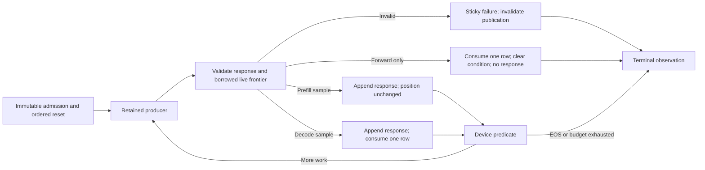
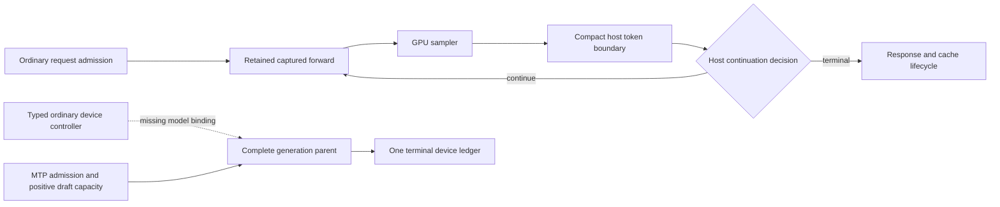
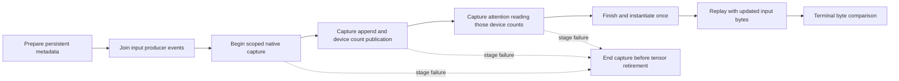

# CUDA MTP-off: paired phase attribution, September 7

## Verdict

**September 8 additive packed-prefill candidate (affected gate green):** the
canonical exact-overlay tournaments cover M512 at both large FFN geometries
and five auxiliary projections, across all 21 source formats: **147/147 cells**.
They refresh 112 pooled runtime keys, changing 45 physical launch choices while
preserving all 25,088 unrelated rows and the complete selector byte-for-byte.
No generic fit, new CUDA kernel body, weight conversion, precision change or
persistent allocation was introduced in this installation.

The clean benchmark bracket is:

| Dispatch | Prefill tok/s | After-prefill decode tok/s |
|---|---:|---:|
| Original control | 1153.824 | 46.559 |
| FFN-only candidate | 1179.506 | 46.543 |
| FFN + auxiliary candidate | 1192.794 | 46.556 |
| Restored original control | 1141.808 | 46.454 |
| Restored combined candidate | 1186.524 | 46.485 |

Every run has one warmup and five measured repeats with profiling off; every
repeat emits the same 256 output IDs. Weight/workspace bytes remain
17,091,788,800 / 2,435,227,652, driver free bytes before retirement remain
5,262,868,480, and the canonical ledger returns to zero. The prefill gain is
approximately 3–4%; decode is unchanged within run variation. A refreshed same-
pinned llama.cpp run gives 1169.355 / 45.504 but contains an unusually slow
1080.201-tok/s prefill sample. Keep it, but do not declare success from that
outlier: an independent confirmation gives **1204.301 / 45.757**, with all
baseline output IDs unchanged. Against that confirmation, final Llaminar decode
leads about 1.6% and prefill still trails about 1.5%. The original full-phase
throughput objective therefore remains open.

All **45** changed physical launches have separate final-linked NCU reports,
one exact format/geometry per report, with **zero measured spill requests**.
The selected IQ4 gate tile uses 248 registers and about 16.63% achieved occupancy;
the selected Q5 GDN output/inner tiles use 128 registers, approximately 33%
occupancy and 60% SM throughput. These counters are separate from canonical
timing labels. Expanded staging regression coverage passes every supported
staged output tile for the five affected packed codebooks, ragged outputs and
canonical partial buffers, with twenty retained replays. The shared generator's
32 Unit tests pass, including CUDA/ROCm additive retention and malformed-base
rejection. The complete affected gate passes 638 Unit registrations, 112
preflight integrations, twelve model cells and 106 validated CSV artifacts
in 581.568 seconds: `/tmp/qwen38-staged-prefill-proof.{json,log}`. Ten MTP cells
certify native/ticket generation; the two MTP-off cells certify captured
forwards, not the complete ordinary generation loop. This is not a claim that
the entire production campaign is green. The short canonical model prompt
is complemented by full-buffer M512 tournament byte proofs and the clean
512-token model output comparison; it is not a new M512 HF checkpoint pack.

Receipts: `/tmp/qwen38-staged-prefill-model-{control,candidate,closing-control}.{json,log}`,
`/tmp/qwen38-staged-prefill-combined-model-{candidate,final}.{json,log}`,
`/tmp/qwen38-staged-prefill-{ffn,aux}-allformats/`,
`/tmp/qwen38-staged-prefill-{installed,aux-installed}-{retention.json,winners.csv}`,
`/tmp/qwen38-staged-prefill-{,aux-}ncu-*.{ncu-rep,log}`,
`/tmp/qwen38-staged-prefill-expanded-fixture.log`,
`/tmp/qwen38-staged-prefill-combined-generator-unit.log`, and
`/tmp/qwen38-staged-prefill-llama{,-confirmation2}-*`.

**Latest September 8 shared-operand checkpoint:** the floating prefill candidate
is now connected to the public projection bridge. A clean control/candidate/
control/restored bracket measures **1125.352 / 1150.142 / 1120.414 / 1146.532
prefill tok/s** and **46.581 / 46.509 / 46.516 / 46.495 decode tok/s**. Every
output token is unchanged, profiling is off, and prepared/workspace bytes stay
17,091,788,800 / 2,435,227,652. The prefill gain is approximately 2.3%; decode
is unchanged within run variation. A fresh five-repeat **same pinned llama.cpp**
run measures **1208.976 prefill / 45.787 decode**, with identical old/new output
IDs, 512 evaluated prompt tokens and no prefix reuse. Thus decode still leads,
but the refreshed prefill gap is about 5.2%; the older 1152.615 external number
is historical, not the current comparator. The complete affected gate passes
638 Unit registrations, 112 preflight integrations, twelve CUDA/ROCm model
cells and 106 validated CSV artifacts in 576.680 seconds; see the evidence
section below. Dynamic-depth MTP's
maximum-width verifier tax remains a separate pending fix.

**September 8 correction:** direct profiler launches had retained a pre-CLI
environment snapshot despite `--deterministic`. The startup regression now
reproduces and fixes this on CUDA and ROCm policy fields. A corrected CUDA
trace reproduces all 256 canonical output IDs. Earlier direct traces require
this re-authentication and are not accepted as matched deterministic evidence.
Normal MPI-bootstrap Release throughput and the canonical parity receipts
remain separately valid.

The corrected pre-fix paired trace identifies **attention** as the largest exposed
decode deficit: 1.956 ms/token versus 0.245 ms for pinned llama.cpp. Both CUDA
and ROCm forced a single attention KV split when deterministic mode was enabled;
the earlier unmatched trace instead used the parallel envelope. Quantized
projections remain a significant second deficit. Both backends now use their
existing ordered parallel split policy in deterministic execution. Focused
all-format serial/grouped byte proofs and the expanded affected gate pass.

The first unprofiled CUDA Release result is **1126.644 prefill / 46.576 decode
tok/s**, versus the preceding **1123.878 / 43.977**: decode improves 5.91% and
exceeds the pinned llama.cpp 45.689 result by 1.94%. Prepared weight and reusable
workspace bytes are unchanged (17,091,788,800 and 2,435,227,652 respectively).
All five repeats emit identical tokens. Relative to the old single-split
arithmetic, the first changed greedy output is token index 231; this is not a
claim of old/new byte equivalence. The required invariant is parallel serial vs
grouped byte identity, plus fresh real-model numerical certification.
Receipts: `/tmp/qwen38-parallel-deterministic-cuda-bench.{json,log}`.

The authenticated post-change CUDA trace reproduces all clean-run tokens and
confirms attribution: attention/RoPE/gate falls **1.955580 -> 0.430392 ms/token**,
while the complete measured forward interval falls **22.632438 -> 21.150787 ms**.
Quantized-projection exclusive time is essentially unchanged (17.315210 ->
17.332456 ms). This localizes the speedup to restored attention parallelism,
not a guessed GEMM win. ROCm's clean refreshed MTP-off baseline is **267.385
prefill / 30.804 decode tok/s**, with identical tokens across five repeats and
PerfStats disabled; no matched pre-change ROCm MTP-off rate is claimed here.
Trace: `/tmp/qwen38-parallel-deterministic-cuda-profile.{json,nsys-rep,sqlite}`;
attribution: `/tmp/qwen38-parallel-deterministic-phase-comparison*.{json,csv}`;
ROCm: `/tmp/qwen38-parallel-deterministic-rocm-bench.{json,log}`.

Final affected gate: **638/638 Unit registrations, 112/112 preflight integrations,
and 12/12 Qwen3.8 CUDA/ROCm cells**, with 106 validated CSV artifacts, in
574.176 seconds. Each vendor passes MTP off/1/2/3/15/dynamic and three prefix
restore evidence rows per cell. The ten MTP cells certify complete generation
execution; the two ordinary cells certify captured forwards, not the still-open
ordinary device-controlled generation binding. Receipt:
`/tmp/qwen38-parallel-deterministic-proof.{json,log}`; artifacts:
`/tmp/production-campaign-artifacts/20260908T011641Z-935548-1788830201757005263`.

The full throughput goal remains open (prefill still trails). Before removing
the deterministic split override, the Release measurement was
**1123.878 prefill / 43.977 after-prefill decode tok/s**, versus
**1152.615 / 45.689** for pinned llama.cpp. The new attention spill cleanup is
speed-neutral within noise: its fresh preceding control is 1119.720 / 43.950.
The earlier retained IQ4-lookup result is 1117.762 / 43.930; its preceding
candidate is 1121.464 / 43.971, bracketed by controls at 43.458 and 43.356.
All token IDs, weight formats, FP32 activations, and prepared/workspace bytes
remain unchanged. This is a small reproducible improvement, not completion of
either external target. The earlier exact-refresh, normalization, GDN and
attention brackets below remain separately identified historical evidence.
The original paired traces used the earlier 1061.632/42.403 and
1166.248/45.417 baselines. Never replace unprofiled rates with profiler timing.
The refreshed correctness slice passes **638 Unit tests, 109 preflight
integrations, twelve CUDA/ROCm Qwen3.8 model cells and 106 validated CSVs**. This proves
the selected numerical/forward-capture contract, not the complete all-model
matrix or the still-unimplemented ordinary device-owned generation parent.
The five CUDA MTP cells certify their native conditional parent and the five
ROCm MTP cells certify the retained ticket boundary; both MTP-off cells retain
the explicitly documented forward-only capture gap. Decode is the active tuning
focus; prefill sweeps and generic fitting are stopped.

The follow-on user target is now explicit: **after this ordinary decode slice**,
tune dynamic-depth MTP to at least 90% of the best fixed-depth throughput on
CUDA and ROCm separately, on this same model/prompt contract. Fixed-depth
economics, controller trajectory and unprofiled delivered-token throughput
must be measured; current parity cell durations are not evidence of that ratio.
The [MTP project plan](../2026-06/MTP_VLLM_STYLE_PROJECT_PLAN.md#dynamic-depth-economy-cuda-and-rocm)
owns that slice and its acceptance criteria. Its initial matched measurements
started after the attention cleanup gate below. Fixed-2/dynamic-15 measures
67.226/23.950 tok/s CUDA and 38.418/13.990 ROCm. Diagnostic dynamic ceilings
of 2 recover 65.367/37.176 tok/s with the exact same adaptive counters and
within-backend tokens as dynamic-15. The plan records the capacity/execution
geometry audit and pending fix. These reduced-ceiling diagnostics are not
accepted configurations; depth-15 capacity and best-fixed-depth certification
are still required.

## Shared-operand floating prefill production selection, September 8

The corrected matched trace still spent 21.685 ms in 48 small floating
projection kernels during M512 prefill. The previously byte-proven shared
candidate existed only in an integration header and never reached the public
production bridge. This is not another deterministic-mode override: the live
bridge selected the one-row warp schedule for every large batch.

The bridge now selects CTA-local sharing for M>=512, N>=32 and K>=256.
These are workload crossover boundaries, not model names or GGUF formats.
FP32/BF16 use eight output rows per CTA; native FP16 uses four, because the
larger FP16 tile lost its measured economy contest. Smaller/narrower work retains
the established block/warp schedules. All three schedules implement the same
stride-256 partials and reduction tree. No persistent buffer, transfer, capture
boundary, precision, weight representation or MTP policy changes.

The new `ProductionPrefillUsesSharedOperandsWithoutChangingTree` regression
first fails against the old public bridge, then passes against the installed
one. It checks complete bytes against an independent legacy-tree oracle and
inspects the actual captured production symbol's grid, shared bytes and zero
local storage. FP32/FP16/BF16 cover M512/513/1024/4096 and N/K tails. The existing
all-floating-format and shared-candidate sweeps remain intact, including M1..65,
boundary rows, exhaustive finite 16-bit encodings and twenty retained replays.
Both functional registrations pass in 9.38 seconds. The new regression joins
their existing preflight registration; the separate performance test does not.

At M512/N48/K5120 with two projection batches, unprofiled public-bridge
latencies change as follows:

| Native weights | Old warp schedule, us | Shared schedule, us |
|---|---:|---:|
| FP32 | 438.062 | 210.232 |
| FP16 | 392.090 | 330.117 |
| BF16 | 388.367 | 219.725 |

The first control microbenchmark overlapped a short CPU fixture compilation;
it is corroborating evidence, not the sole promotion gate. The production
control/candidate/control/restored bracket and the fifteen geometry pairs below
ran without concurrent builds, tests or profiling.

Fifteen further matched geometry/format points cover the M/N/K admission
boundary, odd tails, M1024 and M4096. Each improves, with candidate/control
latency ratios 0.422..0.885. These are kernel-economy checks, not another
canonical timing denominator. Three fresh separate NCU launches profile the
final-linked public bridge at the model geometry: FP32/FP16/BF16 use
120/56/126 registers, 31.73/62.41/31.69% achieved occupancy and
81.86/61.99/75.81% SM compute throughput. All report **zero spilling requests**.
Their shared allocations are CTA-local, not additional persistent VRAM.

The final production Nsight trace matches every one of the clean run's 256
output IDs and the exact prompt identity. Its 48 floating projection kernels
take **10.534986 ms**, versus **21.684844 ms** in the preceding authenticated
trace. Floating-category exclusive time drops 21.735467 -> 10.587432 ms.
The complete captured prefill interval changes 452.958915 -> 447.080320 ms;
quantized projections vary upward by 4.539 ms between these separate profiler
runs, so the profiler's total is not substituted for the clean A/B/A/B result.
The last-twenty-forward decode interval is essentially flat at
21.150787 -> 21.196914 ms. This attributes the improvement to the intended
prefill work, with no new unclassified kernels or inferred decode win.

Receipts:

- `/tmp/qwen38-tiny-shared-production-{before,candidate,control,restored}.{json,log}`;
- `/tmp/qwen38-tiny-shared-llama-{0..5}.json`, `-summary.json`, `-server.log`;
- `/tmp/qwen38-tiny-shared-{micro-before,micro-candidate,geometry-control,geometry-candidate}.log`;
- `/tmp/qwen38-tiny-shared-production-{FP32,FP16,BF16}.{ncu-rep}` and `-details.txt`;
- `/tmp/qwen38-tiny-shared-production-red.log`, `/tmp/qwen38-tiny-shared-functional.log`;
- `/tmp/qwen38-tiny-shared-production-profile.{json,nsys-rep,sqlite}` and
  `/tmp/qwen38-tiny-shared-production-phase-comparison*.{json,csv}`;
- complete prerequisite/model receipt: `/tmp/qwen38-tiny-shared-proof.{json,log}`.

The affected gate passes **638/638 Unit, 112/112 preflight, 12/12 model cells**
and **106 CSV artifacts**, with no artifact errors, in **576.680 seconds**.
Prerequisites take 509.164 seconds; CUDA/ROCm six-cell aggregates take
63.433/66.897 seconds on separate devices. The persistent GGUF is a cache hit
with zero copied bytes. Artifact root:
`/tmp/production-campaign-artifacts/20260908T015200Z-1066059-1788832320672555937`.
Every cell reports captured forwards; the ten MTP cells additionally certify
their CUDA native parent or ROCm retained-ticket generation policy. The two
ordinary cells still explicitly report `generation_loop_certified=false`.
This is the affected two-vendor model slice, not the full multi-model campaign
or proof that the pending ordinary device-controlled generation binding exists.

## Ordinary attention decode: final-link spill audit, September 7 late UTC

The refreshed five-repeat Release baseline is **1126.612 prefill / 44.001
after-prefill decode tok/s**. The same source repeated after a rejected
experiment gives **1119.720 / 43.950**. These are measurement refreshes, not
another installed throughput improvement; pinned llama.cpp remains
1152.615 / 45.689. All runs use the unchanged exact 512-token prompt, 256
outputs, MTP off, FP32 activations, FP16 KV, deterministic sampling and
PerfStats disabled. All measured output IDs match. Prepared weights remain
17,091,788,800 bytes and workspace 2,435,227,652 bytes.

A head-width specialization was rejected and fully removed: it reduced
decode to **42.837 tok/s**, with the restored control returning to 43.950.
At the exact HD256, 24-query/4-KV-head, KV768 production attention point,
captured microbenchmark latency increased from **18.610 to 22.541 us**.
Lower register counts alone were not economical. The new performance fixture
retains 64 complete production attention calls in one graph, asserts its
128 kernel nodes, compares bytes with the untimed production launch and
separately measures KV64/512/768/1024/4096/8192. It is not a preflight test.

The profile also exposed an important compiler-evidence distinction: the
pre-link attention object reports no stack, but the **final linked library**
has an 8-byte stack slot in ordinary FP16 decode. Its SASS spills a partial
output address across the K/V traversal, not the accumulator. The isolated
KV768 counter record reports 2,808 local-spilling requests. Removing four
redundant early-zero branches gives one terminal partial publisher across
FP32, FP16, Q8_1 and TurboQuant. Empty live spans already use zero-initialized
online accumulators and therefore need no separate publisher. The current
candidate's final-linked ordinary FP16 kernel has **64 registers, zero stack
and zero local bytes**. A separate exact KV768 profile confirms **zero local
spilling requests**, 59.52% achieved occupancy (66.67% theoretical),
200.47 GB/s observed memory throughput and an 18.08-us instrumented duration.
These counters are not canonical timing. The new all-format empty-prefix
captured regression passes 240 replays across four native storage paths and
three head widths. The complete attention binary passes 58 tests in 61.097 s.
The fresh canonical gate passes **638 Unit, 109 preflight, all twelve selected
CUDA/ROCm Qwen3.8 cells and 106 validated CSVs**, with no artifact errors.
Protected wall time is **489.473 seconds**, including 422.987 seconds of
prerequisites. CUDA's six-cell aggregate takes 61.526 seconds and ROCm's takes
65.952 seconds, running on disjoint devices. One immutable tmpfs model is
reused without copying; references are cached. All ten MTP cells retain their
complete generation certificate; both off cells still explicitly report
`generation_loop_certified=false` / `not_observed`.

Its first five-repeat model receipt is **1123.878 / 43.977 tok/s**, unchanged
within noise, with identical output IDs and physical bytes. This is a
certified spill/lifetime simplification, **not a claimed model speedup**.
Neither the throughput goal nor the pending ordinary device-owned model
generation binding is complete.

Receipts: `/tmp/qwen38-decode-headwidth-{before,candidate,control}.{json,log}`,
`/tmp/qwen38-decode-headwidth-{candidate,control}-micro.log`,
`/tmp/qwen38-decode-headwidth-{candidate,control}-profile.ncu-rep`,
`/tmp/qwen38-decode-fp16-control.sass`, and
`/tmp/qwen38-decode-empty-branch{.json,.log,-micro.log,-profile.ncu-rep}`. Profiler timings are
not included in any canonical throughput result.

Gate receipt: `/tmp/qwen38-empty-prefix-proof.{json,log}`; artifact root:
`/tmp/production-campaign-artifacts/20260907T233213Z-671908-1788823933654173967`.
The new functional registration is `V2_Integration_CUDAFlashDecodeEmptyPrefix`
in `ProductionParityPreflight`. The separate performance fixture now uses
`CUDAGraphCapture` plus `ScopedBackendGraphCapture`, rather than a second raw
capture owner. Its final six-point run passes exact output and 128-node shape
checks (`/tmp/qwen38-decode-empty-branch-scoped-micro.log`). The final rebuilt
Release image still reports zero stack/local bytes for ordinary FP16 decode.

## Corrected startup policy and matched attribution, September 8

### Parallel deterministic attention implementation

Removed the deterministic-only launch envelope in both vendor C++ adapters,
and removed HIP's additional device-side single-split selector and its obsolete
kernel boolean argument. Both kernels retain the ordinary ordered partition
fold; attention already reserves the maximum 32-split workspace independently
of this policy, so no memory BOM increase is needed.

The new integration sweep covers six cache formats, three widths (64/128/256),
and M=1..16: 288 configurations per vendor. It inspects native captured producer
grids and compares deterministic grouped output against normal parallel M=1
output. CUDA reproduced the old grid-y=1 defect. Both new sweeps pass. HIP
resource metadata reports zero private segment and zero SGPR/VGPR spills for
all four native decode storage templates (38/36/33/35 VGPRs); reducer: 25 VGPRs,
zero spills. CUDA's full 59-test attention binary also passes.

The broader HIP attention binary exposed stale request-batch fixtures: manual
capture did not prepare exact producer events, and their CPU Q8 source/oracle
no longer matched the canonical cache publisher. Those two fixtures are now
consolidated around actual production cache publication, retained scoped
capture, serial cache oracles, and live converted K/V byte checks. All six
formats are retained. Grouped HIP attention and request-batch attention were
also missing from the preflight label; one request filter referenced a nonexistent
test. Registration now includes symmetric HIP context, grouped and request
attention gates. The consolidated request-cache registration passes 20
consecutive runs in 18.46 seconds. The expanded full HIP binary reports 59/61
passed; its two remaining failures are the older real-weight
`FlashAttn2_RealQwen2Layer3ContextParity` and
`FlashAttn2_RealQwen2Layer3InputSensitivity` fixtures. They call the PP runner
factory with model contexts lacking a PhysicalMemoryAuthority and fail before
inference; they are not model-free preflight cases. Keep this explicitly open,
not hidden by a filter or a claim that the entire attention binary is green.
The expanded Unit/preflight/Qwen3.8 validation passes as recorded above. These
two legacy real-model fixture failures are not included in that green claim.

Receipts: `/tmp/qwen38-parallel-deterministic-{cuda,rocm}-*.log`,
`/tmp/qwen38-parallel-attention-gfx906-resources.txt`.

### Startup policy correction

`BenchmarkCommand` initializes logging and prints the splash before parsing
CLI options. Those operations instantiate `DebugEnv`. The `--deterministic`
setter previously changed environ but left that snapshot stale. Self-launch
executes a child that inherits the new value, whereas direct debugger/profiler
launches continue with the old kernel policy. The parser now checks environment
publication and refreshes the canonical snapshot at the same cold boundary;
no backend-local mirror or runtime inference refresh is introduced.

`DeterministicPublishesIntoPreviouslyReadKernelPolicy` fails against the old
implementation and passes twenty repeats after the fix. It checks both vendor
policies and idempotent reparse. All 181 parser tests pass. The corrected CUDA
node-profiled MTP-off request matches every canonical output ID; the corrected
direct ROCm dynamic-15 control also matches all IDs and the canonical 201 draft
steps, 135 accepted drafts, 48 rejections, 121 verifiers and seven windows.
Neither direct run is a canonical throughput measurement.

| Matched decode GPU interval, ms/token | Llaminar | Pinned llama.cpp |
|---|---:|---:|
| Complete captured forward | 22.632 | 21.205 |
| Quantized projections | 17.315 | 16.465 |
| Vocabulary head | 1.259 | 1.180 |
| Normalization / elementwise | 0.711 | 1.297 |
| GDN / convolution | 0.589 | 0.402 |
| Attention / RoPE / gate | 1.956 | 0.245 |
| KV / state / layout | 0.040 | 0.657 |

Sixteen ordinary FP16 attention kernels account for 1.833 ms/token. Their
actual grid is `(24,1,1)`, block `(256,1,1)`, with 64 registers/thread. The
single-split overrides are `computeDecodeSplitEnvelopeForDevice()` in CUDA
and `selectFlashDecodeSplitEnvelope()` in ROCm. Both already use an ordered
parallel scalar/grouped implementation outside deterministic mode. Removing
the override is only a candidate until active-row byte equivalence, real-model
CSV gates, memory accounting and a clean Release bracket establish it.

Receipts: `/tmp/qwen38-deterministic-startup-{red,green20,parser-full}.log`,
`/tmp/qwen38-sep8-matched-mtpoff-profile.{json,log,nsys-rep,sqlite}`,
`/tmp/qwen38-sep8-matched-phase-comparison{.json,-categories.csv,-kernels.csv}`,
and `/tmp/qwen38-sep8-dynamic15-rocm-corrected-control.{json,log}`. The full
Unit/preflight/affected-model gate passed in
`/tmp/qwen38-deterministic-startup-proof.{json,log}`: 638 Unit registrations,
109 preflight integrations, twelve Qwen3.8 CUDA/ROCm cells and 106 validated CSV
artifacts in 491.887 seconds. MTP off/1/2/3/15/dynamic passed on both vendors.
As in the prior receipt, ordinary MTP-off certifies captured forward mathematics,
not a complete device-controlled ordinary generation parent. Artifact root:
`/tmp/production-campaign-artifacts/20260908T003115Z-805504-1788827475494454990`.

## Excluded pre-fix ordinary decode attribution, September 8

**Excluded from matched evidence after token authentication:** this direct
trace diverges from the normal-bootstrap sequence after output 231. The
parser previously exported `LLAMINAR_DETERMINISTIC` without refreshing the
snapshot already read by logging/splash. The table is preserved as a raw
diagnostic receipt, not a basis for claiming the GPU intervals are tied under
the benchmark's actual policy. A corrected trace is required.

No production code or dispatch policy changes in this measurement pass. The
fresh node trace selects the final twenty captured forwards of the measured
512-prompt/256-output request; it excludes setup and warmup and includes
overlapping uncorrelated kernels. Compared with the same retained pinned
llama.cpp trace, category-exclusive intervals are:

| Decode GPU interval, ms/token | Current Llaminar | Pinned llama.cpp |
|---|---:|---:|
| Complete captured forward | 21.147 | 21.205 |
| Quantized projections | 17.337 | 16.465 |
| Vocabulary head | 1.259 | 1.180 |
| Normalization / elementwise | 0.719 | 1.297 |
| GDN / convolution | 0.595 | 0.402 |
| Attention / RoPE / gate | 0.428 | 0.245 |
| KV / state / layout | 0.040 | 0.657 |

These instrumented intervals are not a new throughput result or proof that
the external goal is met. The current unprofiled 43.977 tok/s remains below
45.689. The incomplete ordinary-generation binding and per-token host boundary
remain known work; the relative GPU deficits in this unaccepted trace must be
remeasured with matched kernel policy.
The earlier lightweight host measurement, not Nsight interception overhead,
remains the quantitative evidence for removable submission cost.

All 28 executed decode symbols resolve against the final linked library's
resource inventory. Ordinary FP16 attention and the selected projection
kernels have zero stack/local bytes. The two normalization entrypoints retain
64-byte stack frames; those are the already-investigated, unmodified kernels
whose spill-removal candidate showed no whole-model gain. Do not confuse the
many unselected high-M compiled candidates with executed M1 spills.

Receipts: `/tmp/qwen38-sep8-mtpoff-profile.{nsys-rep,sqlite,json,log}`,
`/tmp/qwen38-sep8-phase-comparison{.json,-categories.csv,-kernels.csv}`, and
`/tmp/qwen38-current-final-linked-resources.txt`. The profiler process exited
normally. No new functional gate is implied by this read-only profiling pass;
the 638/109/12/106 gate above certifies the unchanged production source.

## Ordinary decode: response and live-frontier publication, September 7 22:10 UTC

This slice is **controller groundwork, not a model throughput improvement**.
The production ordinary model loop is not redirected yet. The last clean
Release numbers above remain the relevant throughput evidence.

The audit found that the existing ordinary publisher advanced response and
controller counts but not the live model position/next condition needed by the
next captured forward. CUDA and ROCm now call one shared host/device transition
with a mandatory borrowed `OrdinaryGenerationFrontier`. It names existing
arena rows for cached position, next condition, stop status and publication
validity; it adds no allocation, live host shadow, or persistent byte ledger.

The transition validates capacity, policy and response accounting before
committing. Prefill sampling consumes zero cache rows, a decode sample consumes
one, and forward-only continuation consumes one without reading sampler output
or emitting a response. Complete/failed controller rows are absorbing. The
sampler may write directly into next-condition/stop rows: the controller's
typed leading-row disposition, not the overwritten input bytes, determines
whether a condition was consumed. Failure atomicity applies to the publication
itself; it does not undo a preceding producer's writes into aliased storage.

This chart describes the proven model-free transition/captured composition,
not a claim that the full model already executes that loop. Pending production
work is to bind the existing logical-state rows, resident sampler/history/stop
policy, device-input forward, and reset/prefix/terminal ownership into the
shared serving surface. In request batches, the producer as well as the
publisher must mask completed rows; an absorbing publisher cannot undo an
unguarded sampler. Do not enable MTP sidecar capacity, duplicate executable
graphs, or add host iteration merely to make ordinary mode use these hooks.

The follow-up binding audit confirms that the long stochastic-buffer setup
block also executes with MTP off: `MTPGraphOwnerPlan` retains minimum sampling
scratch independently of native MTP executable admission. Consequently the
logical rows, sampler/history scratch, terminal bridge, explicit loop stream
and capture-definition owner already exist. Their presence must not be confused
with a retained MTP sidecar graph family. The real barriers are the MTP-only
admission/materialization guards, condition-forward policy, terminal/reset
integration, and the forward engine's MoE-specific retained-parent composer.
Generalize those ownership contracts; do not allocate another set of buffers.

Focused validation passes the `OrdinaryGenerationController` Unit registration
and both `DeviceGenerationController_{CUDA,ROCm}` integrations (3.64 s combined).
Tests cover independent/padded request rows around warp/wave boundaries,
twenty resets/replays, malformed/overflowing positions, invalid samples/stops,
budget-one/EOS, forward-only continuation, and aliasing. The native CUDA parent
now consumes the preceding publication's live position in its forward marker;
the new symmetric aliasing test derives each next sample from that position
without staging another buffer. Neither is whole-model mathematical parity.

Separate isolated profiles authenticate the updated kernel. CUDA uses 30
registers, no stack/local allocation and zero measured spills; its one-request
launch is one 32-thread block, 4.192 us under counters, 2.083% achieved
occupancy. ROCm gfx906 uses 20 VGPRs, 58 static SGPRs (64 allocated in the
trace), zero private bytes/spills, one wave and no LDS. Its isolated counter
record selects dispatch 6 only and reports one wave, 6.789% VALU utilization
and 8.000 us instrumented duration. Low device-wide occupancy is expected for
a single-request control transition, not a bulk compute kernel. These are
resource/attribution records, not canonical timing or evidence of a speedup.

Receipts: `/tmp/qwen38-ordinary-frontier-{controller-gate.log,cuda-profile.ncu-rep,cuda-profile.csv}`,
`/tmp/qwen38-ordinary-frontier-rocm-{trace,counters}/`, and the extracted gfx906
code object `/tmp/qwen38-ordinary-frontier.gfx906.co`. All profiles terminate
normally and are separate from the canonical gate. The fresh preflight
inventory is 108 tests / 65 executable targets; all rebuilds pass.

The canonical driver then passes **638/638 Unit, 108/108 preflight, all twelve
CUDA/ROCm Qwen3.8 cells, and 106 validated CSVs** with zero artifact errors.
Its protected wall time is **827.206 seconds**, including 602.065 seconds for
the Unit build/test and preflight phases. The preceding manual Integration
rebuild is not included in that driver duration. Model staging is one tmpfs
cache hit, zero bytes copied. The CUDA aggregate takes 101.783 seconds and
the ROCm aggregate 224.584 seconds; they run concurrently on separate vendors.
The ROCm off cell generates a missing CPU reference pack in 114.151 seconds.
These cell/setup timings are not Release inference throughput.

| Policy | CUDA cell seconds | ROCm cell seconds |
|---|---:|---:|
| Off | 9.787 | 124.162 |
| Depth 1 | 10.766 | 34.475 |
| Depth 2 | 10.466 | 9.289 |
| Depth 3 | 10.633 | 9.247 |
| Depth 15 | 10.159 | 31.940 |
| Dynamic depth | 42.098 | 11.822 |

Report: `/tmp/qwen38-ordinary-frontier-proof.{json,log}`. Artifact root:
`/tmp/production-campaign-artifacts/20260907T221407Z-534250-1788819247291426792`.
Every selected cell retains fresh/full/partial prefix checks. Both off cells
still report generation-loop certification `not_observed`; the passing math
and captured-forward checks do not close the full-generation contract gap.
No test, profiler, trainer or GPU model process remains after this run. No
fresh Release speedup is claimed, and the external performance goal stays open.

## Exact-only refresh decision and fresh baseline, September 7 19:20 UTC

The user explicitly stopped generic fitting in favor of refreshing measured
exact entries while preserving installed Auto rules for unseen shapes. The
fitter, coordinator, six workers and idle-window helper have exited; there is
no live fitting transaction to resume. All immutable timing and profiler
artifacts remain available. This changes the offline workflow, not runtime
dispatch precedence, which already was exact-first then Auto.

The CUDA analyzer now has paired `--retain-auto-policy-json` and
`--retain-auto-include` inputs for a production exact-only refresh. It
authenticates the base, rejects incomplete/ambiguous emitter boundaries and
changed ABI, filters new entries through the shared production-shape manifest,
and keeps the entire generic/grouped suffix byte-for-byte. Retained certificate
and new exact-corpus provenance are explicitly separate. The focused analyzer
suite passes **31/31** (`/tmp/qwen38-exact-refresh-unit-repeat.log`).

The retained all-format corpus successfully regenerates the candidate:
890,140 validated observations, 4,026 M1 winners before production-shape
filtering. No fitting or fresh GPU timing is involved. Evidence is under
`/tmp/qwen38-exact-refresh/`; the generation log is
`/tmp/qwen38-exact-refresh-generate.log`. The previous include is retained as
`before.inc`. Release and Integration core rebuilds have passed. The candidate
now passes the selected six-cell Qwen3.8 CUDA numerical matrix; the fresh proof
scope and receipts are recorded below.

A fresh unprofiled Release baseline is **1108.130 prefill / 42.451
after-prefill decode tok/s**, one warmup and five measured iterations, exact
512-token prompt and 256 outputs, MTP off, PerfStats disabled, the same tmpfs
GGUF and unchanged 17,091,788,800 prepared / 2,435,227,652 workspace bytes.
Receipt: `/tmp/qwen38-exact-refresh-before.{json,log}`. It still trails pinned
llama.cpp's 1152.615 / 45.689; the goal remains open.

Static Release resource inventory is in
`/tmp/qwen38-decode-exact-resource-inventory.txt`: every M1 WIDE, KPAR,
fused-KPAR, ROWPAR and ordered reducer has zero stack/local bytes. Historical
grouped small-M specializations include spilling high-M variants and are not
covered by this M1 claim. The broad profiler feature corpus reports spill
metrics unavailable, not zero; isolated dynamic-spill receipts remain separate
evidence obligations. The future trainer-wide pre-timing resource gate is not
implemented by this offline audit.

### Refreshed exact table: decode-focused validation, 19:50 UTC

The user requested decode as the next tuning focus. No further prefill sweep,
generic fit, source-format change, activation-precision change, collective
substitution, or memory-budget increase is part of this pass.

An initial candidate timing overlapped the CPU-only Unit gate and returned
1104.204 prefill / 42.488 after-prefill decode tok/s, effectively flat. That
sample is retained but is not the clean comparison. A repeat with no concurrent
build, test, profiler or trainer reports **1100.259 / 43.408 tok/s**. Its five
decode measurements are 43.416, 43.452, 43.410, 43.390 and 43.370. Against the
fresh 1108.130 / 42.451 baseline, decode improves **2.25%** and prefill differs
by -0.71%; this is not a prefill improvement or a completed external goal.
Pinned llama.cpp remains 1152.615 / 45.689. Receipts:
`/tmp/qwen38-exact-refresh-{before,after,isolated}.{json,log}`.

All runs authenticate 512 prompt tokens, 256 outputs, MTP off and PerfStats
disabled. The canonical prepared/workspace byte counts remain exactly
17,091,788,800 / 2,435,227,652. Every iteration within each run reproduces its
token IDs, but the new table changes the generated sequence versus the old
table. Some selected K partitions changed, so old model CSVs cannot certify
the refreshed arithmetic. The fresh model parity receipt below supplies that
proof for the selected matrix, without relabeling the old CSVs.

The updated trace proves the selected fused kernels execute in the model, not
only in the trainer. The same final-twenty captured-forward interval method
gives the following exclusive category times; overlapped work is not added:

| Decode GPU interval, ms/token | Previous trace | Refreshed trace | Pinned llama.cpp |
|---|---:|---:|---:|
| Complete captured forward | 22.062 | 21.470 | 21.205 |
| Quantized projection pipeline | 18.158 | 17.595 | 16.465 |
| Vocabulary head | 1.315 | 1.260 | 1.180 |
| Attention / RoPE / gate | 0.435 | 0.443 | 0.245 |
| GDN / convolution | 0.608 | 0.607 | 0.402 |

The projection pipeline still supplies the largest measured deficit. These
node-profiled intervals are not canonical throughput or an exact estimate of
removable host overhead. The existing ordinary-generation binding gap and
lightweight CPU timing in the September 6 handoff remain applicable; do not
mistake the captured forward for a completed device-owned generation parent.
Fresh trace: `/tmp/qwen38-exact-refresh-decode-attribution.{nsys-rep,sqlite}`;
derived evidence: `/tmp/qwen38-exact-refresh-phase-comparison{.json,-categories.csv,-kernels.csv}`.
The temporary analyzer authenticates the fused Q6 head's physical grid before
using it as a request boundary and preserves the previous interval-accounting
method and immutable baseline artifacts.

Verification so far:

- Complete Unit gate: **638/638 PASS**, repeated by the canonical driver in
  71.75 seconds after the final test change.
- All-codebook canonical K-partition fold and all-format prefill bucket
  byte-invariance gates pass.
- `GroupedVerifierRows_CUDA_AllFormats` now passes, including every M16
  vocabulary-head row compared byte-for-byte with independent public M1.
  The first attempt exposed a stale WIDE/DIRECT-only expectation; the next
  exposed that its PerfStats route names the inherited `fused_kpar` M1 family
  even when grouped execution uses the global ordered fold. The regression
  now queries the production canonical partition contract and authenticates
  all admitted route semantics. No numerical comparison or tolerance changed.
  Receipt: `/tmp/qwen38-exact-refresh-byte-gate-final.log` (140.79 seconds;
  this functional run overlapped rebuilding other preflight executables).
- The complete CTest-owned preflight inventory is **104 tests / 64 binaries**;
  its rebuild passes (111 work items). All **104 preflight tests pass** in
  340.52 seconds.
- An isolated counter run now authenticates the newly selected IQ4
  32-column/KB6 fused kernel: grid 544, block 32-by-6, **38 registers/thread,
  zero measured local spilling, 85.55% achieved occupancy and 827.72 GB/s
  aggregate DRAM throughput**. Its isolated, counter-instrumented duration is
  63.008 microseconds; it is not a concurrent gate/up-pair latency or a new
  end-to-end timing. Receipt: `/tmp/qwen38-exact-refresh-iq4-t32.{ncu-rep,csv,log}`.
  The former 16-column receipt remains separate. The full-model profiler
  needed host memory backup for its eleven replay passes; that overhead is
  profiling-only and not part of the canonical benchmark.
- All **six Qwen3.8 CUDA cells pass**, with **53 validated artifacts** and
  fresh/full/partial prefix restore retained. Cell elapsed times: MTP off
  9.210 s; depth 1, 8.443 s; depth 2, 8.424 s; depth 3, 8.398 s; depth 15,
  30.578 s; dynamic depth, 10.269 s. Depth 15 generates a new forced-branch
  HF oracle at step 0/depth 14, so its longer wall time is not evidence of a
  thirty-second inference. The aggregate completes in 81.80 s; including
  prerequisites and fixture/staging, the selected run takes **495.715 s**.
  The tmpfs model is an identity-validated cache hit with zero copied bytes.
  Report: `/tmp/qwen38-exact-refresh-cuda-proof.{json,log}`. Artifact root:
  `/tmp/production-campaign-artifacts/20260907T195342Z-141284-1788810822745719958`.
  All MTP cells report `native_conditional_parent` and a certified generation
  loop. MTP-off reports no generation controller: its current numerical and
  forward-capture pass must not be called a complete-generation certificate.

The next decode-only inspection finds a concrete additional lead: both
`rmsnorm_fp32_kernel` and `fused_residual_rmsnorm_fp32_kernel` compile with a
64-byte per-thread stack frame. Their source's dynamically indexed 16-element
arrays claim register caching. The fused norm accounts for approximately
0.573 ms of summed work over 127 launches per measured decode graph. SASS now
confirms real `STL`/`LDL`, including 128-bit local operations, in both actual
Release functions. Receipts: `/tmp/qwen38-decode-{fused-norm,norm}-stack.sass`.
The unfused and fused FP16/BF16 kernels also allocate 64-byte frames; a fix
must cover those kernel interfaces without advertising unsupported model
activation precisions.

This is a concrete implementation lead, not proof that 0.573 ms is removable.
The next bounded experiment should compare the production baseline with
arithmetic-identical static register indexing and a no-cache, second-input-read
schedule. Preserve the existing thread partition and reduction order, residual
rounding, aliasing, and all positive supported widths; do not substitute
rounded FP16/BF16 residual output for an unrounded intermediate. Authenticate
the compiled resources before timing M=1 and representative grouped rows, then
extend the existing shared RMSNorm/fused-residual grouped-verifier harnesses.
Only a byte-exact, spill-free, economical candidate should enter the production
dispatch and the next matched Release A/B. No normalization implementation is
changed by this inspection. Source formats, model activation precision, and
resident capacity remain fixed.

## Decode-only experiments after the exact refresh, September 7 20:40 UTC

Neither of the following candidates is installed. The Release and Integration
cores have been restored to the certified exact-refresh implementation. Model
formats, FP32 activations, existing collectives and prepared/workspace capacity
remain unchanged. These negative results narrow the next pass back to the
larger quantized-projection pipeline deficit rather than justify a broad
normalization rewrite.

### RMSNorm: local stack traffic is real, but the model win is not

The isolated captured probe compares the actual Release C entrypoints with
static-register and second-read candidates for all six FP32/FP16/BF16
unfused/fused operations. The admitted small-register and wide-reread variants
pass 612 geometry/format cases byte-for-byte. At M1/N5120, representative
FP32 fused latency improves from 3.388 to 3.052 microseconds. Static indexing
keeps up to eight values spill-free; the fully cached sixteen-value variants
either exceed the launch resource limit or spill under launch bounds.
Bounded-cache/wide-reread alternatives are byte-exact but have mixed wide-row
economics, so none replaces the existing wide-row implementation.

An isolated Nsight receipt for the M1/N5120 FP32 fused register candidate
reports 40 registers, zero measured spills, one 1024-thread CTA and 64.50%
achieved occupancy. Its instrumented 4.896-us duration is not canonical timing.
The temporary model experiment overrides only the existing six normalization
C entrypoints; the production graph, model and benchmark are unchanged. Its
one-time entrypoint receipts authenticate interception. Five-repeat unprofiled
Release timing is **1107.503 / 43.517 before**, versus **1101.791 / 43.472
prefill/decode tok/s** with the candidate. All five 256-token sequences match
exactly, but there is no model-level improvement. The diagnostic DSO is not
loaded by any subsequent run and no normalization source changes are retained.

Evidence: `/tmp/qwen38-norm-stack-probe.cu`, its
`*-functional-admitted.log`, `*-functional-bounded-tail.log` and `*-timings.log`;
`/tmp/qwen38-norm-register-candidate-profile.{ncu-rep,csv,log}`;
`/tmp/qwen38-norm-{before,experiment}.{json,log}`. Rejected compiler candidates
have separately named failure logs; they are not included in the zero-spill
claim. No alias or complete production certificate is claimed for this
uninstalled diagnostic family.

### GDN: remove serial preprocessing edges, then check the whole model

The candidate prepares Q, K and scalar gates on independent warps and replaces
six preprocessing CTA barriers with one publication barrier. Each operand
retains its original strided accumulation, XOR tree and lane-zero result
broadcast; broadcasting is essential because different XOR lanes can round
differently. It changes no recurrence partition, state layout, row ordering or
snapshot publication. Both D_K=64/128 and normalized/unnormalized byte checks
pass, as do grouped captured snapshots and unequal-length request batches.

The captured M1 microbenchmark improves from **4.760 to 4.096 us** for
32 heads, D_K=D_V=128. Its isolated NCU receipt reports 98 registers, zero
measured spills, grid 32-by-4, block 256, 25.50% achieved occupancy and
458.98 GB/s DRAM throughput. The profiler was initially attached to the older
eager timing test: counter collection succeeds, but profiler overhead causes
that test's 25-us timing assertion to fail. This is not a numerical failure;
the new captured timing lane must be used unprofiled for economy evidence.

The real-model bracket is **43.517 baseline -> 43.471 candidate -> 43.458
restored baseline tok/s**. All output tokens are identical and every run seals
17,091,788,800 prepared / 2,435,227,652 reusable workspace bytes. The new
candidate is inside the measured variation, not an established model win, so
it is removed. Its patch remains at `/tmp/qwen38-gdn-parallel-candidate.patch`
for reproducible investigation, not as a second production path. Receipts:
`/tmp/qwen38-gdn-{parallel-after,bracket-baseline}.{json,log}`,
`/tmp/qwen38-gdn-captured-{baseline,candidate}.log` and
`/tmp/qwen38-gdn-parallel-candidate-profile.{ncu-rep,csv,log}`.

The retained changes improve future experiments and regression coverage:

- A captured M1 lane in the existing CUDA GDN perf binary measures persistent
  graph execution independently of host launch overhead. It is not in preflight.
- The D_K=128 independent-prefill/serial byte sweep now includes normalization
  disabled as well as enabled, symmetric with the existing D_K=64 sweep.
- The independent preprocessing proof, captured grouped state-publication proof
  and unequal-length request-batch proof join the canonical model-free preflight
  label. The expanded preflight inventory is 107 tests, not a new parallel gate.

The three focused integration registrations pass in 5.78 seconds. The full
restored-source recheck also passes: **638/638 Unit, 107/107 preflight, and all
six CUDA Qwen3.8 cells**, with 53 validated artifacts. Unit plus preflight take
421.89 seconds; the selected model campaign takes 59.01 seconds; total wall
time is **481.48 seconds**. Cell times are MTP off 9.691 s, depth 1 9.108 s,
depth 2 9.168 s, depth 3 9.129 s, depth 15 9.299 s, and dynamic depth 11.015 s.
This time depth 15 reuses its authenticated reference pack. Persistent tmpfs
staging reports one cache hit and zero copied bytes. Receipt:
`/tmp/qwen38-decode-expanded-gate.{json,log}`; artifact root:
`/tmp/production-campaign-artifacts/20260907T203932Z-272132-1788813572126661563`.
This is the selected six-cell numerical/forward-capture contract, not a claim
that the broader matrix or the ordinary device-owned parent gap is resolved.

### IQ4 lookup instruction schedule: initial offline lead

Offline compilation compares the current register-LUT helper with a schedule
that expands adjacent nibble groups first and separates even/odd nibbles last.
Both use the same sixteen signed byte values; neither changes the source
codebook, packed payload, floating contributions or reduction order. The pinned
llama.cpp `get_int_from_table_16` implementation provides the structural lead:
our existing implementation already avoids constant-memory table lookups, but
spends more scalar instructions constructing selectors and byte-wide masks.

In the isolated four-word compiler probe, the production helper uses 33
registers and 134 non-NOP instructions; the candidate uses 30 registers and
97 non-NOP instructions. Both have zero compiler stack/spill bytes. This is
not the production GEMV's register count or a performance certificate. PRMT
count increases from 16 to 32, so latency/throughput still need measurement.
The uninstalled diagnostic is `/tmp/qwen38-iq4-lookup-inspect.cu`, with matching
`.cubin`, `.sass` and `-build.log` artifacts. No GPU candidate is run while the
canonical gate owns the devices. Next: byte-check nibble packing, then measure
the actual frozen M1 projection geometry and inherited grouped regimes before
considering any shared-helper change. All other codebooks must remain covered.

### IQ4 shared lookup: measured decode improvement, September 7 21:10 UTC

The adjacent-nibble schedule now replaces the shared CUDA `iq4nl_decode_word`
helper. This is an integer instruction-scheduling change for physical codebook
4, shared by IQ4_NL and IQ4_XS, not a weight-format, activation-precision,
dispatch-table, reduction-partition, or capacity change. CPU and ROCm use their
own ISA-specific lookup implementations and do not call this CUDA intrinsic.
The immutable Auto policy and exact dispatch entries remain unchanged.

The initial independent host-table probe checks 262,144 packed words and
2,097,152 decoded values after twenty captured replays. The retained focused
integration additionally tests the production word **and** vector interfaces,
all sixteen-bit half-word selectors in both positions, complementary/mixed
neighbors, a partial CTA and protected tail bytes. Each of its twenty replays
poisons and republishes outputs, then checks every byte independently. Its
`V2_Integration_CUDAIQ4PackedLookup` registration joins the existing preflight
label; the label now contains 108 tests / 65 binaries, not a parallel test gate.

The actual model-selected IQ4 fused projection keeps grid 544, block 32-by-6
and KB6. Isolated NCU reports **40 registers/thread, zero measured spills,
85.86% occupancy and 838.42 GB/s DRAM throughput**, versus 38 registers,
zero spills, 85.55% and 827.72 GB/s in the preceding receipt. Its profiled
62.208-us duration is not canonical timing. Resource and counter receipts:
`/tmp/qwen38-iq4-permute-shard-resources.txt` and
`/tmp/qwen38-iq4-permute-profile.{ncu-rep,csv,log}`.

Clean Release measurements, each with one warmup and five measured requests:

| Implementation | Prefill tok/s | After-prefill decode tok/s |
|---|---:|---:|
| Earlier retained baseline | 1101.911 | 43.458 |
| Adjacent-nibble lookup | 1121.464 | 43.971 |
| Restored baseline bracket | 1092.405 | 43.356 |
| Retained lookup repeat | 1117.762 | 43.930 |

All measured requests have the same 512 input tokens and 256 generated IDs;
every candidate sequence equals the corresponding baseline sequence. MTP and
PerfStats remain off. Prepared weights and reusable workspace are unchanged at
17,091,788,800 and 2,435,227,652 bytes. No builds, tests or profilers overlap
these canonical measurements. Decode improves roughly 1.1–1.4%, beyond this
bracket's variation. The retained repeat reproduces the gain with identical
tokens, but remains below pinned llama.cpp's 45.689 tok/s.
Receipts: `/tmp/qwen38-gdn-bracket-baseline.{json,log}` and
`/tmp/qwen38-iq4-permute-{after,bracket-baseline,retained}.{json,log}`.

The focused lookup/canonical-fold tests pass in 6.51 s. The all-format prefill
bucket-invariance and grouped-verifier byte sweeps pass in 145.47 s, including
the M16 vocabulary-head obligations. Receipts:
`/tmp/qwen38-iq4-permute-focused.log` and
`/tmp/qwen38-iq4-permute-all-format-bytes.log`.
The complete retained-source gate now passes **638/638 Unit, 108/108 preflight,
and all six selected CUDA Qwen3.8 cells**, with 53 validated artifacts. Unit
build/test plus preflight take 435.64 s; the selected campaign takes 59.46 s;
the whole run takes **495.68 s**. Cell elapsed times: MTP off 9.848 s, depth 1
9.353 s, depth 2 9.209 s, depth 3 9.165 s, depth 15 9.271 s, and dynamic depth
11.060 s. The persistent tmpfs corpus is a cache hit with zero copied bytes.
Both GPUs are released at completion. Receipt:
`/tmp/qwen38-iq4-permute-gate.{json,log}`; artifact root:
`/tmp/production-campaign-artifacts/20260907T211231Z-402175-1788815551890869431`.

This is a selected numerical/forward-capture certificate, not the entire
model/topology matrix. All five MTP rows certify their native conditional
parent. The ordinary row still truthfully reports no complete generation
controller; this optimization does not close that separate architectural gap.

### Q6 packed expansion: negative offline result

The bounded Q6_K inspection compares the installed scalar extraction with two
packed high-plane expressions: shifts/masks, and the multiply/mask expression
already used by ROCm. All three pass independent host-byte verification across
all 24-bit four-value selectors, complementary high nibbles, and twenty captured
replays. Static decoder-only register counts are 30/21/22 respectively, all
without spills; instruction counts fall from 232 to 120/106. Nevertheless,
separately measured captured-chain timing gives 326.336/359.264/347.168 us
for this large decoder-only fixture. Neither packed alternative earns promotion.
This is not a whole-GEMV or model-level regression claim: fewer instructions
alone did not establish a useful lead. No Q6 production code was changed.

An isolated profile of the actual retained model's Q6 vocabulary head reports
39 registers, zero spills, 85.69% occupancy and **882.78 GB/s** DRAM throughput
at its unchanged 16-by-27 block and 15,520-block grid. Its profiled 1.264-ms
duration is not canonical timing. Receipts:
`/tmp/qwen38-q6-packed-probe{.cu,.sass,-build.log,-functional.log,-timing.log}`
and `/tmp/qwen38-q6-packed-baseline-profile.{ncu-rep,csv,log,json}`.

### Ordinary generation lifecycle audit: binding is not a switch

The ordinary typed device controller and synthetic native-parent tests exist,
but the live model binding still requires positive MTP depth.
`beginDeviceResidentGeneration()` requires retained MTP graph capacity;
`materializeDeviceResidentGeneration()` and
`materializeMTPDeviceGenerationLoopGraph()` reject zero draft depth and assemble
sidecar/verifier/publication fragments. The response/control/ticket arena
buffers are already registered and materialized for every GPU, independently
of MTP. However, parent stream/capture creation and terminal bridge setup are
still nested inside stochastic-verifier buffer binding. Distinguish those two
facts: ordinary admission need not add another response ledger, but turning
on speculative capacity to reach the existing parent setup is not an acceptable
ordinary-decode optimization or a no-extra-VRAM experiment.

The intended consolidation is one algorithm-typed admission/storage contract,
with ordinary forward/sample/publication as a first-class complete transaction;
it must not borrow speculative buffers or manufacture verifier state. Request
reset and prefix continuation must reuse that same proven captured topology.
The existing executor regression
`OrdinaryDeviceGeneration.NativeWhileSharesPrefillForwardAndGenerationCUDA`
already proves graph-definition-only children composed into one executable;
reuse that ownership boundary rather than retaining an additional executable
copy of the forward graph. Remaining binding work must cover admission before
prefill, device-owned sampler/history/position inputs, terminal continuation,
and all public inference callers, not a benchmark-specific route. Its functional
gate must include budget-one, stop-token, request reset, stochastic sampling and
prefix continuation before a matched Release throughput claim.
This audit installs no additional host mirror, controller, or fallback. Existing
API-interposer evidence bounds the observed token-boundary interval at roughly
0.325 ms/token; it does not prove that entire interval is removable. The larger
immediate decode tuning opportunity remains quantized projections, so a bounded
instruction-overlap experiment precedes a broader orchestration change.

### Canonical decode loop unrolling: reject before production

The off-tree `qwen38-decode-unroll-probe.cu` compares unroll factors 1/2/4
inside the same canonical K-partition loop. It reuses the installed packed
decoder and explicitly rounded contribution helper. Every factor preserves
each partition's ascending FP32 additions and the ascending final fold.
Twenty poisoned captured replays per factor match all output and guard bytes
at each of four production-shaped anchors. Sixty rotating, interleaved native
event samples follow five warmup rounds; profiler runs are separate.

| Physical shape | Unroll 1 us | Unroll 2 us | Unroll 4 us |
|---|---:|---:|---:|
| IQ4 N17408 K5120 KB6, columns32 | 59.296 | 72.352 | 71.200 |
| IQ4 N5120 K17408 KB16, columns32 | 59.232 | 59.968 | 59.776 |
| Q5 N10240 K5120 KB11, columns32 | 47.230 | 47.360 | 51.424 |
| Q6 N248320 K5120 KB27, columns16 | 1263.360 | 1299.488 | 1306.016 |

All tested specializations have zero compiler local storage, but unrolling
increases registers: IQ4 40/44/46, Q5 38/40/43 and Q6 40/42/42. IQ4 gate/up
residency consequently falls from eight to six CTAs per SM; Q6 falls from
three to two. Overlapping more instructions is not free when it displaces
latency-hiding warps. Reject both unrolled variants; do not add a special-case
dispatch entry or a register cap that hides spills. These are synthetic
schedule comparisons, not new model throughput results. Production source,
memory footprint, dispatch and the last green gate are unchanged.
Receipts: `/tmp/qwen38-decode-unroll-probe{.cu,-build.log}` and
`/tmp/qwen38-decode-unroll-{iq4-up,iq4-down,q5-in,q6-head}.log`.

Separate single-specialization Nsight Compute launches confirm the IQ4 gate/up
resource explanation. Achieved occupancy is 82.15% / 68.97% / 69.16%, and DRAM
throughput is 839.53 / 687.00 / 702.26 GB/s for unroll 1/2/4. Each reports zero
local spilling requests. Their profiled durations (62.112/75.936/74.240 us)
remain outside the canonical timing table. The profiler skips the twenty
correctness replays and selects exactly one extra launch of one candidate.
Receipts: `/tmp/qwen38-decode-unroll-iq4-u{1,2,4}.{ncu-rep,csv}` and matching
`-profile.log` files. The initial unprivileged counter-access attempt failed;
these successful receipts use the required privileged profiler launch.

## Follow-up after current certification: certify the shipped container

The September 7 user request makes the next E2E packaging contract explicit:
build through the repository Dockerfile and run certification against the full
CPU/CUDA/ROCm Release runtime image. Do this after the current certification;
do not change the live trainer or its physical build identity mid-run.

The existing `scripts/docker/build-runtime-image.sh --variant full` builds the
Release binary in the Dockerfile builder stage and packages its runtime
dependencies. `scripts/ci/run_release_container_e2e.sh` already delegates to the
canonical typed-cell driver, and CI already has a build/test/push sequence.
Reuse and consolidate these entrypoints rather than introducing another image
recipe, model/topology matrix, or local-binary certification path.

The acceptance contract for this follow-up is:

- Build the candidate image once, then run the canonical tagged E2E cells
  against that exact immutable image identity. Do not bind-mount a workspace
  executable or dependency over the packaged production implementation.
- Bind the certificate to the tested image content ID, exact source/build
  provenance, selected typed-cell inventory, host driver/device inventory,
  external model identities and complete results. A Git HEAD label alone must
  not imply that a dirty workspace build contains only that revision.
- Retain successful evidence as well as failure logs. A partial selection or
  missing cell is not the full declared certification set.
- Promote or export the exact tested image without rebuilding or modifying it
  after E2E. When the release workflow publishes it, retain the registry digest
  and its association with the tested content identity; a mutable tag alone is
  not certification evidence.
- Keep model weights, tmpfs staging, caches and result files external to the
  image. Certification covers the recorded configurations and compatible host
  environment; it does not imply arbitrary-model or arbitrary-hardware proof.

This is a queued implementation requirement, not a claim that the current local
certification has already produced a shippable, certified container.

## Packed prefill staging: shared launch identity and completed GPU byte proof

The BK64 arithmetic body now lives in
`src/v2/kernels/cuda/gemm/CUDANativeVNNIPrefillDevice.cuh`, compiled by the
production core. The focused fixture captures that core's exact opaque kernel
symbol; it does not recompile the body. `CUDANativeVNNIPrefillSchedule.h`
owns a CUDA-runtime-free typed identity and structural admission predicate.
RegisterDecode, AsyncPayload, AsyncWeightOperands and AsyncAllOperands are
distinct physical specializations; staging is not encoded as another tile or
K-partition count. The device instantiation and host visitor consume the same
predicate derived from the actual codebook payload width and copy-owner grid.
Unsupported schedules/tiles are rejected rather than rewritten.

Production launch and exact-symbol resource queries now carry that identity.
The diagnostic selection is thread-local, and the last-launch record includes
staging, so querying a staged candidate cannot accidentally inspect the older
RegisterDecode specialization. BK256 rejects staged-BK64 requests. The native
tournament, aggregate CSV, individual timing rows, immutable plan inventory and
overlay generator now carry the independent staging axis end to end. Requested
and observed staging must match, and older CSVs without that identity fail
closed. The generator emits the typed C++ enum. Only the generated config's ABI
was extended with a RegisterDecode default; no existing selected row changed,
and no asynchronous schedule has been promoted to production.

Current verification for this slice:

- Integration core and the expanded staging fixture build successfully; protected
  Release core/trainer sizes and mtimes remain unchanged.
- Full Unit gate: **638/638 PASS**, 70.89 s, including exhaustive enum-byte,
  payload-width, owner-boundary and malformed-geometry admission tests.
  Latest evidence: `/tmp/qwen38-prefill-staging-corpus-unit-gate.log`.
- The focused Python corpus module passes **29 tests**, including staging
  identity, timing separation, requested/observed disagreement, unsupported and
  spilling symbols, typed rendering and rejection of old CSV headers.
  Evidence: `/tmp/qwen38-prefill-staging-corpus-tests.log`.
- The exact production-symbol resource and thread-local control checks pass
  **2/2**. The expanded all-codebook resource gate inspects **358 implemented
  specializations: 334 zero-local-storage, 24 spilling**. The four newly staged
  exclusions are CB5/CB7, direct tile 2, weight/all metadata schedules; the other
  twenty are the existing baseline exclusions. Unsupported schedule/format/tile
  requests are tested for explicit rejection as well. These are compiler
  resource receipts, not new timing or dynamic-spill measurements:
  `/tmp/qwen38-prefill-staging-corpus-resource-identity.log` and
  `/tmp/qwen38-prefill-staging-corpus-resources.{csv,log}`.
- The GPU fixture now covers 965 direct-output cases plus 60 private-partition
  cases, twenty captured replays per admitted schedule, and exact resource-query
  identity for all five staged codebooks and both publication families. These
  captured byte checks now **PASS**. Non-nibble formats retain their existing
  implementation and independent all-format M1-equivalence gate.
- After fitting stopped, the staging, tiny floating projection, shared-operand
  floating projection and all-format prefill bucket invariance gates all passed:
  **4/4 in 40.29 s**, `/tmp/qwen38-exact-overlay-kernel-gate.log`. No helper
  remains running. This is functional evidence, not promotion of an asynchronous
  prefill winner; exact Release timing remains required.

A ten-second, 499-sample observation of CUDA fitting worker 3610833 still finds
236 samples in compact label materialization, 174 in scorer/marshalling and 89
elsewhere. This worker imported the code before the label-view cache change.
The receipt is `/tmp/qwen38-prefill-staging-live-fit-profile.raw`; it is fitting
overhead evidence, not an inference measurement and not grounds to relabel or
discard completed timing/profiler evidence. No new model-level speedup is claimed.

The first resource-only check found a fixture-provenance defect before any new
timing: the fixture recompiled the shared device header without relocatable
device code, while the production core used RDC. Two local-memory values were
0 in production versus 8 in the fixture, and three register counts differed by
one (`/tmp/qwen38-prefill-staging-resource-identity.log`). Shared source is not
identical compiled code. The correction is to inspect and capture the exact
production kernel symbol returned with its resource metadata, not loosen the
resource assertion or treat the duplicated fixture as production evidence.

## Dispatch fitting: repeated immutable-key hashing

A ten-second, 489-sample Python profile of the live initial development fit
attributes 97.34% of active sample weight to generated dataclass hashing while
the parent reconstructs worker result sets. Runtime/domain keys now memoize
their unchanged structural hash. The cache is not a dataclass value field and
is explicitly omitted from pickle because another interpreter uses a different
hash seed. It cannot enter canonical observation or policy digests.

The focused fresh/warmed/replacement/pickle checks and independent hash-seed
subprocess checks pass. The complete affected modules pass **127 common-policy
and 143 profiler-evidence tests**. A seven-round interleaved Python-only
microbenchmark (500,000 warm lookups per round, identical generated-dataclass
controls) measures runtime keys at **371.708 to 278.619 ns (1.334x)** and domain
keys at **343.335 to 287.601 ns (1.194x)**. These are lookup measurements, not a
whole-fit or model-inference speedup. The live fit imported the previous code
before the change and continues unchanged; fresh later phases use the cache.

Receipts: `/tmp/qwen38-fused-fit-preparation.speedscope.json`,
`/tmp/qwen38-key-hash-{common-full,profiler-full,bench}.log`.

Prediction-inventory publication also repeated each geometry's complete runtime
JSON for every candidate. Its canonical byte stream now reuses standard-encoder
runtime/string fragments. The already existing flattened point sort key was
unused after the binary-cache conversion; inventory construction now uses that
single key implementation instead of repeated dataclass comparisons. A focused
negative test first reproduced both the repeated runtime mapping and slow
ordering. The passing regression checks every runtime discriminator, empty
inventories, escaped strings, Unicode and lone surrogates against the original
independent JSON encoder. Cache order and length-framed SHA-256 are unchanged.

Five interleaved host-only rounds over 65,536 synthetic points measure complete
inventory construction at **1.639 s historical / 0.305 s updated (5.372x)**.
Fragment reuse alone measured 1.619 / 1.083 s; removing repeated rich comparison
is the larger improvement. The final common-policy module passes 128 tests,
and the complete Unit gate passes **637/637 in 71.49 s**. Receipts:
`/tmp/qwen38-inventory-fragments-sort-bench.log`,
`/tmp/qwen38-inventory-sort-common-full.log`, and
`/tmp/qwen38-inventory-sort-final-unit-gate.log`. These are tooling gains, not
new inference rates. The already-imported live fit remains unchanged.

The first development fit subsequently reaches six accelerator-backed CV
workers. A separate ten-second/489-sample worker profile attributes **53.58%**
of sample weight to `_materialize_compact_fold_costs`, including **27.40%** in
`dataclasses.replace` and its constructor descendants. The native
`fit_tree_budgets_and_evaluate` frame accounts for 24.74%; that is an API-frame
sample share, not an isolated GPU-duration measurement. Repeated fitting-label
materialization was the next measured tooling target. Receipt:
`/tmp/qwen38-cv-preparation.speedscope.json`.

Each scoring lane now owns a bounded fitting-label cache. One active immutable
cost/held-group/prediction scope retains at most the four demanded non-measured
influence views. Feature and boundary alternatives reuse these identical
labels, but still independently evaluate their trees against original measured
regrets. Source, held-group, prediction-owner, inventory or backing-array
changes invalidate the scope. Mutable diagnostic mappings remain uncached,
writable production arrays and incomplete teacher surfaces remain fatal, and
the worker joins tasks before releasing lane-owned views and scorers. Partial
lane construction also retains earlier owners for failure cleanup.

All eight focused cache/worker regressions pass, including full CPU CV-result
equality with the uncached oracle. Both complete affected modules pass:
**151 profiler-evidence and 128 common-policy tests**. A five-round interleaved
host-only benchmark visits 150 feature/placement/influence tasks over 4,096
synthetic candidate rows. Including the cache's cold construction each round,
label materialization falls from **2.919 s to 0.0819 s (35.64x)**. It retains
four label tuples, adds no GPU allocation, and changes no semantic cache key,
observation, threshold or held-out decision. This is not a measured whole-fit
or model-inference gain. Already-imported CV workers continue unchanged; fresh
subsequent fitting processes receive the optimization.

Receipts: `/tmp/qwen38-compact-label-cache-focused.log`,
`/tmp/qwen38-compact-label-{profiler-full,common-full,bench}.log`.
The complete Unit gate passes **637/637 in 70.77 s**; its build reports no
pending work. Receipt: `/tmp/qwen38-compact-label-unit-gate.log`. The exact live
fitter (PID 3355668) and six CV workers were rechecked after this gate and
remain active; the bounded floating-kernel proof guard (PID 3611186) is still
waiting for their idle boundary while retaining its exact coordinator hold.
Release core and trainer sizes/mtimes remain unchanged from the measurement
generation. No candidate has been installed and no fresh model benchmark has
run during this host-only optimization.

## Completed concurrent-fold and async-prefill diagnostic window

The initial decode profiler phase completed **115,898/115,898 requests** in
237 process batches, with zero failed, missing, or unsupported requests. The
offline v8 unit correction then completed all 237 batches, correcting 38,228
byte-valued metrics without changing physical identities or timing. Its
versioned original and lineage receipt remain beside the canonical manifest.
The turnkey transaction has resumed; this is not yet a certified or installed
dispatch policy.

All following timings use unprofiled captured replays, 60 interleaved measured
rounds after five warmups, and unchanged weight bytes/FP32 arithmetic. Nsight
and sanitizer launches are separate and never enter timing labels. Artifacts:
`/tmp/qwen38-concurrent-fold-window-vh_j_7ai/`; guard receipt:
`/tmp/qwen38-concurrent-fold-window-upgrade.log` (completed successfully).

### Decode: real branch overlap limits the exposed fold gain

The independent gate/up pair at IQ4 N=17408, K=5120, KB=6 gives:

| Publication | Serialized pair, us | Concurrent pair, us |
|---|---:|---:|
| Global KPAR + ordered reducer | 123.952 | 121.544 |
| CTA-local fold, 16 columns | 121.008 | 120.168 |
| CTA-local fold, 32 columns | 121.168 | 120.464 |

Thus the best concurrent reduction is **1.13%**, not twice the isolated
single-projection saving. Independent seeded weights, outputs and workspaces
prevent aliasing one projection as both branches. The boundary proof passes
204 pair cases: 17 physical codebooks, two ragged geometries, six retained
serial/concurrent graphs, 20 replays per graph, and full bytes/guards for both
outputs. This external test complements, rather than replaces, the permanent
all-format production-bridge regression.

The three single-replay Systems traces authenticate two distinct compute
streams in every concurrent mode. Global KPAR has four kernels with 90.817 us
of overlapping activity; fused16/fused32 have two kernels with 76.096/74.881 us
of overlap. These trace durations are attribution only. They rule out missing
branch overlap in this fixture; they do not establish a whole-model speedup.

### Prefill: asynchronous compressed-payload staging is promising for IQ4

The prototype stages compressed bytes into the existing decoded shared-memory
slots, overlaps their fetch with current-tile compute, then decodes in place
after each owner waits for its exact copies. The existing CTA barrier publishes
decoded bytes. Mode 1 stages payload only; mode 2 additionally stages metadata
in a block-major shared view of identical allocation size.

| M=512 projection | Original, us | Payload async, us | Payload + metadata async, us |
|---|---:|---:|---:|
| IQ4 gate/up, N17408 K5120 KB6 | 1323.967 | 1240.480 | 1228.608 |
| IQ4 down, N5120 K17408 KB16 | 1218.048 | 1143.712 | 1134.431 |
| Q5 asymmetric, N10240 K5120 KB9 | 987.584 | 1065.408 | Ineligible: compiler spill |

IQ4 latency falls **7.20% / 6.86%** on these two shapes. Q5 payload-only
regresses **7.88%**; do not enable this schedule globally. Q4-asymmetric and
Q5-asymmetric metadata variants have 8 bytes local allocation and are rejected
before capture/timing. Keep the original schedule as a first-class candidate,
not an automatic error-recovery path.

All 52 eligible format/boundary/mode cases pass 20 captured replays with full
output and guard-byte equality. They cover execution codebooks 0/4/5/6/7,
M/N boundaries 1/127/128/129/131, K tails and odd/large canonical partitions.
The actual timing shapes also pass full-byte checks. This is diagnostic
nibble-format coverage, not the full production format/geometry matrix.

The six isolated IQ4 NCU reports cover control and both variants on both
timing shapes. Each retains 128 registers/thread, 44,032 static shared bytes,
one resident CTA and zero dynamic spill requests. Gate/up mode 2 reduces
long-scoreboard stalls from 0.87 to 0.36 and barrier stalls from 1.85 to 1.42
cycles per issued instruction; compute throughput rises from 50.34% to 55.02%.
Achieved occupancy remains approximately 33%. No persistent VRAM or operand
precision changes are involved.

Independent Compute Sanitizer memcheck and racecheck both pass the ragged
IQ4 M129 N129 K1056 KB20 case, all three schedules, 20 captured replays each.
Receipts: `/tmp/qwen38-raw-prefill-sanitizer-window.log` and
`/tmp/qwen38-raw-prefill-sanitizer-uu72am3i/`.

Next: retain these immutable diagnostic results while decode certification
finishes. Integrate successful prefill schedules through the canonical typed
candidate/overlay machinery, expand byte/resource/economy coverage, and only
then run the matched Release model benchmark. Neither diagnostic is installed,
and the end-to-end rates at the top remain authoritative.

## CTA-local KPAR candidate: expanded feasibility, not an installed speedup

### Later prefill diagnostics: broader staging surface and activation scales

The bounded nibble-format surface completed **45 timing contests**: execution
codebooks 0/4/5/6/7, M32/128/512, and two large plus one ragged geometry.
All eligible paths passed complete output/guard checks over 20 replays before
timing. Payload-plus-weight-metadata staging consistently helps the large
M128/M512 Q4/IQ4/symmetric-Q5 cells (approximately 5.2–7.4% latency reductions).
Small M32 and ragged cells do not justify global selection. Payload-only
staging regresses every measured asymmetric Q4/Q5 cell. Receipts:
`/tmp/qwen38-raw-prefill-surface-window.log` and
`/tmp/qwen38-raw-prefill-surface-mgnnbvb3/`.

A fourth schedule also places activation-scale reads into the same explicit
async group. Previously those scalar global reads still preceded current-tile
compute. Four-byte copies preserve alignment for odd K-group counts, use the
existing shared FP32 slots, and join the original wait/barrier publication.
In a fresh four-way interleaved comparison, large IQ4 gate/up goes from
**1338.048 to 1209.728 us (9.59%)**, and down from **1232.608 to 1117.536 us
(9.34%)**. Against weight-metadata staging alone the extra reduction is
2.16%/1.68%. Q4/symmetric-Q5 also improve modestly; asymmetric metadata
specializations still spill and remain ineligible.

The new schedule retains 128 registers, 44,032 shared bytes and no local
storage. Four separate NCU reports cover all three eligible execution
codebooks and both large IQ4 shapes. The inspected IQ4 gate/up report has zero
dynamic spills, 33.09% achieved occupancy, long-scoreboard stalls 0.16 and
barrier stalls 1.30 cycles per issued instruction. Memcheck and racecheck pass
all four modes at ragged IQ4 M129 N129 K1056 KB20, 20 replays each. Receipts:
`/tmp/qwen38-async-scales-window.log`,
`/tmp/qwen38-async-scales-q7r4klfi/`,
`/tmp/qwen38-async-scales-profile-window.log`, and
`/tmp/qwen38-async-scales-4ab4r88h/`.

### Shared-operand floating projection: larger structural prefill candidate

The small GDN projections expose a separate measured gap. The production warp
schedule reloads the same activation row for each column and the same weight
row for each output row. A new external prototype stages both operands in
shared memory: eight column-owning warps reuse an activation tile, and each
warp reuses its weight tile across 2/4/8 output rows. Each lane retains eight
independent original stride-256 partial sums; all FMA operands and final
reduction parenthesization remain unchanged. K tails skip arithmetic instead
of adding padded zeros. No persistent workspace or native encoding changes.

One transaction contains the real two-projection batch, M512 N48 K5120. The
oracle is the live Release `cudaFp32*_tiny_batched_projection` bridge, not a
copied production kernel. Sixty interleaved rounds after five warmups give:

| Native weight dtype | Production, us | Shared 2 rows, us | Shared 4 rows, us | Shared 8 rows, us |
|---|---:|---:|---:|---:|
| FP32 | 430.656 | 316.160 | 231.424 | 210.462 |
| FP16 | 379.583 | 426.880 | 330.464 | 445.632 |
| BF16 | 391.296 | 327.744 | 244.320 | 228.128 |

The best reductions are **51.13% FP32, 12.94% FP16, 41.70% BF16** on this
geometry. This is two-axis operand reuse, distinct from previously rejected
register-only row reuse or wider-load experiments. It is not permission to
force one tile across all dtypes or small/irregular geometries.

All nine compiled shared specializations have zero local allocation. Twelve
separate NCU launches cover all candidates plus each dtype's production
control, and all report zero dynamic spill requests. FP32 eight-row staging
uses 122 registers and 16,384 shared bytes; achieved occupancy falls from
47.55% to 31.71%, but L2 throughput falls from 88.15% to 43.72% and long-
scoreboard stalls from 11.70 to 1.54 cycles per issued instruction. The latency
gain comes from avoiding repeated operand loads, not increasing occupancy.
BF16 eight-row staging uses 126 registers/16,384 shared bytes; FP16's faster
four-row candidate uses 56 registers/12,288 shared bytes.

The initial captured check and the stronger cancellation/rounding check each
cover **84 dtype/shape/mode cases**, two independent weight batches, 20
replays, and complete output plus guard bytes. Shapes span M1/15/31/32/33/129/
512, N1/7/9/48/49, and K1/255/256/257/511/513/5120. The stronger fixture varies
IEEE mantissas, signs and exponents; it does not rely on low-range dyadic
values that could hide an arithmetic-order change. All pass against the live
bridge. Separate memcheck/racecheck runs for each dtype also pass M33 N9 K511
with every candidate and 20 replays.

Timing receipts: `/tmp/qwen38-tiny-shared-window.log`,
`/tmp/qwen38-tiny-shared-752er1b8/`. Resource/profiler/sanitizer receipts:
`/tmp/qwen38-tiny-shared-profile-window.log`,
`/tmp/qwen38-tiny-shared-w7oqr7l3/`. Stronger byte receipts:
`/tmp/qwen38-tiny-shared-adversarial-window.log`,
`/tmp/qwen38-tiny-shared-ze0lmjjr/`. These remain external diagnostics; extend
the permanent all-floating-format integration gate and measure the matched
Release model after production integration. Do not add isolated savings to
claim that the end-to-end goal has already passed.

#### Reusable shared kernel and permanent preflight coverage

`CUDATinyProjectionSharedKernel.cuh` now owns the physical shared-operand
candidate, with native weight types and compile-time 2/4/8-row tiles. It does
not select itself or change the installed production bridge. The permanent
`V2_Integration_CUDATinyProjectionSharedOperands` registration joins
`ProductionParityPreflight`; it covers **1,944 cases**, each with two weight
batches and complete output checks after every one of 20 poisoned replays.
All finite FP16/BF16 encodings and M/N/K arithmetic tails are included. It and
the established production projection test pass together in **9.41 s**.

The first reusable version exposed a BF16 economy regression: replacing the
prototype's visible integer bit expansion with `__bfloat162float` kept all
bytes correct but made the eight-row schedule approximately twice as slow.
CUDA's helper uses inline PTX `mov.b32` on Ampere, not a floating conversion
instruction; do not attribute this to a nonexistent BF16 conversion opcode.
Restoring the visible high-half bit expansion recovers **397.856 to 232.832 us**
for M512 N48 K5120 versus the live production bridge. The lower-register opaque
version was not the economical version. New timings cover **63 contests**:
all three dtypes, M1/16/31/32/64/128/512 and three N/K geometries. Small batches
and narrow/ragged shapes still often favor the established production schedule.
FP16 prefers four shared rows only at the larger measured batches; no universal
tile has been installed.

Nine isolated native-format/tile reports all have zero dynamic spill requests.
For 2/4/8 rows, registers are FP32 **48/72/120**, FP16 **48/56/96**, BF16
**58/80/126**; shared bytes are **10,240/12,288/16,384**. Selected FP32 R8,
FP16 R4 and BF16 R8 occupancy is 31.69%, 62.31% and 31.68%; corresponding
long-scoreboard stalls are 1.45, 13.96 and 1.49 cycles per issued instruction.
Receipts: `/tmp/qwen38-shared-tiny-proof-flt5v94h/` (initial reusable version),
`/tmp/qwen38-shared-tiny-proof-7h198zc6/` (visible BF16 bit expansion), and their
`/tmp/qwen38-shared-tiny-{proof,bf16-proof}-window.log` ownership receipts.

A final source audit changes the K-loop induction to unsigned arithmetic so
advancing past the last partial tile cannot overflow near the signed public
width limit. The updated test and diagnostic binary compile; their final
complete gate/timing/profile window is queued behind the live six-device CV
workers. Pending receipt: `/tmp/qwen38-shared-tiny-bounded-k-proof-window.log`,
artifact root `/tmp/qwen38-shared-tiny-proof-_45zwifn/`. Do not treat that queued
retest or production selection as complete.

### Turnkey replay defect journal: fused generic admission

Before changing automatic dispatch, a device-free regression found that
`project_cuda_shape_resolved_candidates` excluded literal global KPAR counts
from generic fitting but did not exclude the newly registered fused counts.
For example, an unconditional fused KB6 leaf passes the generic tree partition
proof, yet emitted C++ rejects K=128 because only four K groups exist. The
existing generated-selector test mistakenly expected that dispatch hole.
Both 16- and 32-column reproducer cases fail at the generic-eligibility check.

Extending the compiled test to positive N near INT_MAX also reproduced an old
global/fused emitter overflow: `(n + tile_n - 1)` was computed in signed int.
The emitted ceil now widens before adding. This preserves ordinary geometry
and allows generic dispatch beyond the compact exact-key representation.
The compiled agreement sweep was broadened to both formula families.

The correction must use the existing shape-resolved formula mechanism for both
physical publication families. Concrete counts remain exact-overlay evidence;
generic formulas own their explicit geometry-dependent count and CTA capacity,
with every projected cost backed by the exact measured physical launch. The
emitter must reject literal KPAR generic leaves rather than append a hidden
admission predicate. No concrete launch may silently change its count, and no
alternate runtime route is permitted.

This is a policy-tooling change, not a measured-kernel change. The live CUDA
collection remains untouched. Before the formula addition, the 4,591 registry
entries have ordered `(candidate_id, candidate_policy_hash)` digest
`6cba008a58fa36a4fce420fce5192e0d71ad94459639c8a2dad2b4f6cf91a351`;
verify that entire retained entry set stays byte-identical before reusing its
physical timing. New virtual formulas require their own current registry and
projection identity and cannot create timing observations without witnesses.

The v13 registry preserves that retained-entry digest exactly and adds 768
virtual fused recipes; no physical candidate, kernel, prepared layout, or
timing row changed. Projection v2 excludes both literal families from generic
costs. All recipes passed 82,944 Python physical-admission checks; generated
C++ also checks exact-overlay precedence and successful smaller-K dispatch.
The common policy module passes 125 tests. The profiler suite passes 140 tests,
with additional focused global/fused formula rejection and lazy physical
witness lookup checks passing after parameterization. Final module reruns pass
29 CUDA analyzer tests, 125 common policy tests, and 140 profiler tests. The
compiled resolver sweep executes all 3,456 global/fused recipes at 99 geometry
points each: **342,144 exact Python/C++ agreements**, including N=INT_MAX.
Receipts: `/tmp/qwen38-fused-formula-{trainer,common,profiler}-unit.log`.
These are device-free tooling gates, not a new model-throughput result or a
replacement for the post-install production correctness gate.
The neighboring CUDA adapter and paired-request/confirmation modules also pass
15, 33, and 21 tests respectively after the formula extension. Their physical
request resolution still names the measured exact launch, not a formula token.

The compact fold prototype was expanded from three formats to all 17 physical
execution codebooks, including the CPU-migration representations. The oracle
is now the actual Release `cudaNativeVNNIGemvTuned_fp32` KPAR bridge rather
than a copied producer. **765 cases passed**, with 20 captured replays per
mode and full-output byte/guard checks. Coverage combines M=1/2/3/16/31,
ragged columns, trailing empty partitions, signed-zero alpha, non-unit alpha,
beta and bias. Both 16- and 32-column prototypes pass. These grouped rows
are diagnostic equivalence evidence, not an economical grouped implementation.

The prototype was built with the production CUDA fast-math flags. Its local
IQ device symbols use a separate namespace from the linked production DSO;
an initial `invalid device symbol` fixture-construction failure was fixed by
separating those symbol owners, before any numerical case ran. All 34
compiled specializations report zero local storage/spills. Receipt:
`/tmp/qwen38-fused-kpar-all-proof.log`, source/build evidence
`/tmp/qwen38-fused-kpar-all{.cu,-build.log}`.

The seven timing contests authenticate the existing production-selected tile,
columns/thread and exact partition count before comparing physical fold
schedules. Each uses 60 measured interleaved rounds of 64 captured replays
after five warmup rounds; profiler overhead is excluded:

| Codebook | N | K | KB | Production two-node us | Fused 16-column us | Fused 32-column us |
|---|---:|---:|---:|---:|---:|---:|
| 4 | 17408 | 5120 | 6 | 62.192 | 60.576 | 60.960 |
| 4 | 5120 | 17408 | 16 | 62.032 | 60.400 | 60.112 |
| 7 | 10240 | 5120 | 9 | 50.064 | 47.680 | 47.456 |
| 4 | 2048 | 5120 | 20 | 8.895 | 7.888 | 7.616 |
| 4 | 10240 | 5120 | 8 | 38.400 | 36.672 | 36.560 |
| 7 | 4096 | 5120 | 20 | 22.928 | 20.656 | 20.608 |
| 7 | 5120 | 4096 | 16 | 22.640 | 20.608 | 20.608 |

Receipt: `/tmp/qwen38-fused-kpar-all-timing.log`. These do not supersede the
unchanged model benchmark at the top. In particular, the earlier, more
register-heavy CTA-fold experiment regressed the model (see the September 6
tuning investigation); a microbenchmark result is not permission to repeat
that mistake.

Integration now adds an immutable `CUDACanonicalKpartFoldPlan`, a sharded
explicit candidate bridge reusing the existing contribution helper, and
per-specialization resource queries. The generated automatic selector is
unchanged. The permanent device-free admission gate and captured all-format
gate now pass. The latter takes **3.65 s** and adds 85 physical-capacity/in-place
cases to the 765 row/epilogue cases: **850 cases**, with 20 replays per admitted
path. It covers KB=31/32/33/63/64 and explicitly exercises the 16-column
1024-thread limit without pretending the 32-column geometry supports KB>32.
All queried physical specializations have zero local storage and nonzero
occupancy. Rejected bindings also leave a surrounding captured transaction
valid. The test is a model-free `ProductionParityPreflight` member, while the
header-only test belongs to the complete Unit inventory. Receipt:
`/tmp/qwen38-fused-kpar-functional-fixed.log`.

The first permanent integration invocation caught a new bridge-admission bug
before any candidate math executed: `cudaStreamGetDevice` returns CUDA error
900 inside capture and invalidates it. A model-free minimal program reproduced
the same behavior. `cuCtxGetCurrent` plus `cuStreamGetCtx`, on the other hand,
both succeed during capture and establish exact current-context ownership.
That capture-safe validation is now installed alongside the current device
check in the one thin public bridge. It does not skip validation during capture
or create a host stream-owner cache.
This defect is in the new, unselected candidate boundary, not an observed
regression of the existing model dispatch. The header-only plan unit tests
already pass. First-failure receipt:
`/tmp/qwen38-fused-kpar-functional.log`; isolated reproducer source:
`/tmp/cuda-stream-device-capture.cpp` (now carrying the context-query variant).

The **integrated Release kernel**, not the prototype, retains the isolated
gains with the real production contribution helper:

| Codebook / N / K / KB | Production two-node us | Integrated 16-column us | Integrated 32-column us |
|---|---:|---:|---:|
| 4 / 17408 / 5120 / 6 | 62.208 | 60.528 | 60.912 |
| 4 / 5120 / 17408 / 16 | 62.080 | 60.384 | 60.048 |
| 7 / 10240 / 5120 / 9 | 50.080 | 47.872 | 47.728 |
| 4 / 2048 / 5120 / 20 | 8.912 | 7.856 | 7.584 |
| 4 / 10240 / 5120 / 8 | 38.432 | 36.624 | 36.576 |
| 7 / 4096 / 5120 / 20 | 22.944 | 20.864 | 20.864 |
| 7 / 5120 / 4096 / 16 | 22.656 | 20.720 | 20.752 |

All contests use the same 60 measured interleaved rounds and independently
authenticate the existing production KPAR identity. Receipt:
`/tmp/qwen38-fused-kpar-integrated-timing.log`. No compile, model inference,
or profiler ran during that seven-shape timing transaction.

A read-only join back to the paired model trace limits what these isolated
gains establish. The trace's last measured decode graph contains 128 IQ4
gate/up launches at N17408/KB6, 64 IQ4 down launches at N5120/KB16, and 48
Q5 inner-projection launches at N10240/KB9. These are the three matching
large-model shapes in the seven-point pilot. The other four pilot points are
exploratory geometries, not a complete inventory of this model's smaller
projections. Multiplying the three isolated improvements by those physical
launch counts gives about 0.458 ms of **summed isolated savings**, not exposed
model latency: the real gate/up streams overlap and share bandwidth. Neither
that number nor the pilot's best percentage predicts a model-level win.
The complete dispatch corpus and the post-install matched Release benchmark
remain required. Source: `/tmp/qwen38-llaminar-mtpoff-phase-attribution.sqlite`,
using the final `decode_tail20_graph` interval in
`/tmp/qwen38-phase-comparison.json`, grouped by exact symbol and grid geometry.

The follow-up external `/tmp/qwen38-concurrent-fold-probe.cpp` now compiles
against the unchanged Release library. It records six complete pair graphs:
global-partials, fused-16 and fused-32, each serial and event-forked. The two
arms share only activations; distinct seeded weights, contexts, partials and
outputs prevent aliasing or artificial weight-cache reuse. Both branches join
before native timing stops. A planned all-physical-codebook boundary pass
checks complete outputs and guards for twenty replays, followed by a
60-sample interleaved contest at the actual IQ4 gate/up N17408/K5120/KB6.
The diagnostic retains every raw sample. Separate one-extra-replay Nsight
Systems captures will authenticate overlap; their durations are not timing
labels. This is prepared diagnostic work, not a measured pair win yet.

`/tmp/qwen38-concurrent-fold-window.py` is waiting for the current profiler
collector's exact identity to exit. Its log is
`/tmp/qwen38-concurrent-fold-window-upgrade.log`; artifacts are reserved in
`/tmp/qwen38-concurrent-fold-window-vh_j_7ai`. It holds only the waiting
refresh coordinator; the existing profiler collector and its CUDA workers
continue normally. The prior prefill guard is finished. The new guard requires
idle CUDA devices before each probe and resumes the same coordinator in its
finally block. Do not resume the coordinator manually or launch another CUDA
job during that diagnostic window. No core/trainer rebuild was performed.
The original pair-only guard was terminated while still waiting, its `finally`
resumed the coordinator, and its process was joined before this expanded guard
started. The expanded guard was subsequently joined in the same way before
adding the offline byte-unit evidence upgrade. The current guard upgrades the
completed profiler manifest before probes or fitting; if that correction fails,
it terminates only the exact waiting coordinator rather than fitting stale
units. It also owns the bounded raw-weight prefill experiment below; there
are not multiple competing guards.

Separate Nsight captures of the integrated IQ4 N17408/K5120/KB6/columns16 and
Q5 N10240/K5120/KB9/columns32 specializations report **38 registers, zero
dynamic spill requests**, **80.309% / 72.154% occupancy**, and **817.179 /
816.493 GB/s DRAM throughput**. Geometry is grid1088/block16x6 and
grid320/block32x9, respectively. Each report contains only the exact selected
extra candidate launch. Receipts:
`/tmp/qwen38-fused-kpar-integrated-{iq4,q5}-ncu.{ncu-rep,csv,log}`.

Canonical candidate registration/certification and real-model benefit remain
required before automatic runtime selection may use this candidate. The fresh
canonical regression run passes **637 Unit tests, 102 preflight integrations,
all six CUDA Qwen3.8 cells, and 53 validated CSV artifacts**. Total wall time
is **468.076 s**, of which the model campaign takes **59.466 s**. The model
was reused from persistent tmpfs with zero copied bytes. MTP off, fixed
1/2/3/15 and dynamic depth are all green, with prefix restore. Report:
`/tmp/qwen38-fused-kpar-complete-proof.{json,log}`; artifact root:
`/tmp/production-campaign-artifacts/20260907T115652Z-2732022-1788782212153641313`.
This certifies the selected CUDA dense slice and the new explicit candidate
gate, not an automatic candidate dispatch change or a whole-matrix result.

### Canonical dispatch integration and first production-trainer contest

Registry v12 now exposes all 96 physically legal `fused_kpar` candidates
(16 columns through KB64 and 32 columns through KB32). The generated selector
can emit this family, source-policy export preserves it, and the canonical-M1
arithmetic query reports ordered K partitions to grouped consumers. Grouped
DP4A uses its economical row-sharing producer with the inherited exact KB;
there is no production serial-row replay. The installed generated table is
still unchanged pending a certified measurement/fit transaction.

The strong Release trainer now drives this family through its normal prepared
GEMM object, checks exact-symbol compiler/occupancy resources before capture or
timing, and writes resource-admission fields beside the aggregate/raw samples.
The common adapter rejects missing/mismatched resources and substituted KB.
The profiler model derives CTA ownership and shared/global partial storage
from current runtime geometry, with a new surrogate identity to invalidate
old prediction caches. It does not reuse a profiled anchor's grid at unseen
geometry.

The expanded all-codebook captured integration passes in **5.87 s**, now
including explicit bridge, normal M1 dispatch, and actual grouped DP4A
inheritance for both fused widths. The 850 parameter cases still perform 20
replays per admitted path. **182 focused Python tests pass**, including
compiled/generated C++ family/KB selection, adapter tamper rejection, and
analytical ownership features. The fresh complete gates pass **637/637 Unit**
in **69.31 s** and **102/102 ProductionParityPreflight** in **345.04 s**.
The first Unit pass found only the old registry-cardinality assertion; it now
requires the exact additional 96 physical width/KB pairs, and the entire Unit
gate was repeated successfully. No new real-model campaign or E2E performance
run has been claimed for this unselected family.
Receipts: `/tmp/qwen38-fused-dispatch-{functional,python}.log`.
Full-gate receipts: `/tmp/qwen38-fused-dispatch-{unit-gate,preflight}.log`.

The first strong-trainer timing contest covers **all 21 source formats** at
N17408/K5120/KB6, three physical candidates, 60 interleaved samples and up to
64 captured replays per sample. All **63 rows** authenticate through the common
adapter with their native timing sidecar. Within each format all three output
digests agree; the separate full-byte integration remains the mathematical
certificate. Fast trainer byte-mismatch counts compare against its *different*
diagnostic KB1 tree, not the equal-KB candidate, and must not be described as
fused-versus-global byte drift.

Best fused timing wins for **20/21 formats** at this geometry. IQ4_XS goes from
63.616 to 61.824 us (**2.82% lower latency**), Q5_0 from 75.922 to 73.728 us
(2.89%), and Q8_0 from 113.664 to 111.002 us (2.34%). IQ1_M regresses from
42.837 to 44.117 us (2.99%); keep the global candidate and let measured policy
choose. This is one geometry, not a full production corpus or E2E speedup.
Receipts: `/tmp/qwen38-fused-dispatch-all-formats.{csv,timing.csv,log}`.

### Full dispatch certification in flight

The canonical `scripts/train_native_vnni_dispatch.sh --backend cuda`
transaction began September 7 at approximately 12:37 UTC, without `--install`.
It uses the standard p95 <5% / at-least-95%-of-domains criteria, fresh Release
measurements, 117 common-development shapes, all 21 source formats, and two
CUDA lanes with disjoint format ownership. Both scorer integrations pass.
At the 12:52 check both native trainer processes were alive; more than 122,000
candidate rows had been emitted without a `pass=0` record. This is partial
collection evidence, not a fit, sealed certificate, or installed speedup.

Initial collection subsequently completed with **844,368 rows across all
4,914 contests** (234 per source format), zero `correctness_pass` failures,
and zero repeat-byte failures. Both native workers passed. Both Q4 refinement
workers also passed; the canonical adapter validated **890,140 observations**
including refinement and emitted 4,026 provisional Fast-M1 exact entries.
The isolated profiler phase is now running 237 request batches over the two
CUDA devices. Provisional entries are not installable, and neither generic CV,
sealed certification, grouped verification nor a new model benchmark has
completed for this generation.

The work directory is
`benchmark_results/native_vnni_dispatch/work/collect-cuda-nvidia-geforce-rtx-3090-8.6-aa32f0858c642c2c-4f53cda18c2b`;
the driver log is `/tmp/qwen38-fused-certification.log`. Detailed progress is
in its `cuda_decode_m1-development-common.lane{0,1}.log` files. Do not restart
because the parent log is quiet or rebuild the measured core during collection.

The follow-on profiler audit found no two-dispatch assumption to repair: kernel
records are partitioned by their exact request stream, and feature publication
counts those physical records rather than the legacy `force_two_phase` field.
A new device-free regression now covers global/fused requests at both widths,
KB1/6 and their capacity limits, in eager and captured modes. It proves that
interleaved streams cannot donate the global reducer to the fused request,
canonical medians remain unchanged, and the fitter sees one versus two physical
dispatches. The complete profiler-sidecar unit module passes **140 tests in
26.202 s**; receipt `/tmp/qwen38-fused-profiler-lifecycle-unit.log`. This did
not modify or relaunch either CUDA measurement lane.

### Nsight byte-unit defect found during collection

The saved CSV reports `0.896 Kbyte/block` for a 896-byte fused CTA, but the
collector multiplied that by 1,024 and recorded 917.504. Nsight's display
prefixes are decimal, as documented in its
[CLI unit contract](https://docs.nvidia.com/nsight-compute/NsightComputeCli/index.html#metrics-and-units).
This is a profiler resource-interpretation bug, not an inference allocation,
arithmetic, or canonical-timing failure. Collection continues under its original
imported v7 parser; no live journal or kernel binary was rewritten.

The forward parser fix distinguishes SI/IEC prefixes and exports explicit
base units. Collector v8 remains separate from the original generation.
`profiler_reparse` authenticates complete retained batch files and request
members, reparses their exact CSVs, joins immutable stream IDs, and permits
only byte-valued metric changes. It rejects altered durations, geometry,
dispatch identity, membership, raw bytes, incomplete coverage, and live journals.
Explicit in-place promotion retains the original manifest and a lineage receipt.
Batch parsing/hashing uses the physical-core worker budget, not new GPU runs.

The real first-batch diagnostic passes **498 records**, correcting **144**
byte-valued metrics while preserving every duration and physical-evidence
identity. Receipts: `/tmp/qwen38-ncu-reparse-proof.log` and
`/tmp/qwen38-ncu-reparse-proof-itgezovf/`. The complete profiler module passes
**143 tests**, and the refresh driver passes **117 tests**. Logs are
`/tmp/qwen38-ncu-units-{full-unit,refresh-unit}.log`. The later full-corpus
correction completed successfully, as recorded in the completed window above.

The independent two-batch diagnostic also passes: **984 records**, **225**
corrected byte-valued metrics, and byte-identical output manifests from one
versus two workers. No GPU launch occurs in either replay. Receipts:
`/tmp/qwen38-ncu-reparse-parallel-proof.log` and
`/tmp/qwen38-ncu-reparse-proof-nd7f067_/`. This proves parallel replay on
retained real reports; it does not replace the pending full-corpus upgrade.

The economical one-pass corpus marks its optional dynamic-spill metrics
`unsupported_by_tool`; it does **not** establish zero spills. Compiler/runtime
admission and the separate exact-kernel NCU reports remain the spill evidence.
An earlier diagnostic merely counted nonzero available spill metrics; its zero
count cannot be interpreted as full-corpus zero-spill certification.

### Prefill decoder ownership experiment prepared while GPUs are occupied

Read-only analysis of the retained IQ4 SASS profile confirms the selected tile
is **128x128, 4x4 warps, 512 threads**, not the 256-thread Q5 tile. It uses
128 registers/thread, 44,032 shared bytes, and one resident CTA per SM.
The kernel's payload decoder currently admits only `2*BN` threads: half the
512-thread CTA skips that work. Barrier stalls account for 10,316 of 38,196
sampled non-issuing stalls (27.0%). The largest attributed branch follows a
deferred blocking CTA barrier; it is not evidence of an expensive standalone
branch. Existing smaller tiles and global K-partition variants were slower in
the retained all-tile contest, so higher occupancy alone is not a solution.

An external diagnostic shares each existing nibble payload between two lanes,
with interleaved and warp-grouped ownership variants. It covers physical
codebooks 0/4/5/6/7, keeps the same bytes, decoded shared layout, arithmetic,
barriers, output shape, and allocation sizes, and handles 20-byte Q5 alignment
with four-byte loads. All 15 compiled baseline/candidate specializations have
zero stack/spills, unchanged 128-register usage, and unchanged shared bytes.
A device-free mapping check also proves unique complete payload/metadata
publication for 20 admitted CTA/column-width combinations.

At this preparation checkpoint neither candidate had run on a device: both
CUDA devices were reserved for certification. The planned checks were captured
full-buffer/guard equivalence (including ragged M/N/K and partition boundaries),
then interleaved timing and isolated Nsight profiling. Sources and
compiler receipt are `/tmp/qwen38-payload-lanes-prefill-{core.cuh,probe.cu,build.log}`;
the binary is `/tmp/qwen38-payload-lanes-prefill-probe`. Its arguments are
`CB M N K KB MODE`, where -1 means timing, 0..2 selects one profiler replay,
and 3 is correctness-only. The production source and measured build are
unchanged by this experiment.

The external probe now also builds BM64/BN128 with the same 4x4 warp topology.
Its mode-zero oracle always retains the original BM128 production geometry;
candidate byte comparison therefore covers the changed row tile as well as
decoder ownership. With a one-block compiler hint the smaller tile uses
86 registers (CB0/4/6) or 89 (CB5/7), with no spills. The two-block hint reaches
64 registers without spills for CB0/4/6, making 1024 resident threads possible
within the register/shared-memory limits. CB5/7 instead require a 24-byte stack
and spill loads/stores under that hint and are explicitly inadmissible. Those
asymmetric formats retain their independently measured one-block candidates;
no spilling specialization may enter timing or production.

Current executable and compiler receipt:
`/tmp/qwen38-payload-lanes-prefill-probe-tiles` and
`/tmp/qwen38-payload-lanes-prefill-tiles-build.log`. Append `BM MIN_BLOCKS` to
the existing arguments for the explicit `(128,1)`, `(64,1)`, or `(64,2)`
experiment. The build contains 35 prefill specializations, of which four
candidate specializations spill and must be excluded. These compiler receipts
alone established feasibility, not timing or byte equivalence.

The external phase-boundary guard ran as
`/tmp/qwen38-prefill-window.py`, with status in
`/tmp/qwen38-prefill-window.log` and artifacts in
`/tmp/qwen38-prefill-window-s1x70oqc`. It holds only the already-waiting refresh
coordinator while its two existing timing children run to completion. No child
is interrupted. After their exact PID/start-time identities exit and NVIDIA
reports no remaining compute process, the guard runs 52 captured byte-proof
processes and 12 interleaved IQ4 timing contests. It resumes the same
coordinator in a finally block, including on a failed probe or handled
termination. The coordinator's stopped state during this window is intentional,
not evidence of a stalled trainer. Confirm the live guard/process identities
before taking any recovery action. Nsight profiling and model timing are not
part of this window and remain separate obligations.

The window is now complete and the guard exited successfully after resuming
the same coordinator. Both initial timing workers passed; the coordinator has
advanced to Q4 development refinement. All 64 probe processes passed, producing
192 full-buffer/guard byte certificates with 20 captured replays each
(3,840 checked replays). Codebooks 0/4/5/6/7 are covered; spilling CB5/7
two-block variants were excluded before capture and timing.

**Reject the payload-sharing experiment.** In 60-sample interleaved IQ4
contests, every candidate was slower than its own original-tile control:

| Row tile / resident-block hint | Interleaved ownership slowdown | Warp-grouped ownership slowdown |
|---|---:|---:|
| 128 / 1 | 18.05–19.86% | 12.11–12.90% |
| 64 / 1 | 66.60–76.73% | 56.59–65.63% |
| 64 / 2 | 12.78–25.27% | 11.17–21.33% |

Each range spans four tested shapes, not a confidence interval. The original
N17408/K5120 control takes 1297.728 us in the first contest, versus
1534.942/1458.432 us for the same-tile ownership changes. Reducing the tile to
64 rows and obtaining two resident CTAs still loses. Increasing active decoder
lanes or compiler occupancy therefore does not establish useful throughput.
The predicted shared-bank advantage below also fails to rank these timings;
it must not be presented as a measured explanation. No new Nsight collection
or model run was spent on these losing candidates. No production source,
selector, prepared format, or persistent allocation changed. Full receipts:
`/tmp/qwen38-prefill-window-s1x70oqc/*.log` and the guard log above.

Analytical shared-store mapping favors the interleaved candidate: with the
existing 80-byte column stride its two 128-byte subtransactions each touch all
32 banks once. The warp-grouped candidate's eight-byte stores touch only half
the banks per minimal subtransaction, predicting four wavefronts instead of
two. That is a launch-layout prediction, not a hardware counter; retain both
for the A/B and inspect their exact shared-store counters before drawing a
performance conclusion.

An aggregate-only read of completed in-flight IQ4_XS development contests
passes the common row adapter in explicitly non-installable workflow mode.
For equal production partition trees, N17408/K5120 improves from 63.744 to
62.208 us and N5120/K17408 from 63.872 to 61.952 us; output digests agree.
These roughly 2.4–3.0% local gains support continued certification but neither
authenticate the unfinished full timing corpus nor establish E2E throughput.

### Async raw-weight prefill staging: prepared, not measured

The current BK64 loop overlaps activation copies with arithmetic, but performs
the next tile's synchronous packed-weight read/decode before the current
tile's compute. A separate external candidate stages raw compressed payloads
with `cp.async` into the **existing decoded shared slots**, executes the
current tile, waits for each owner's copies, then expands those bytes in
place. The original CTA barrier publishes the complete next tile. Each raw
slot has the same copy and decoder owner; other threads read only after that
barrier. No new persistent buffer, shared allocation, weight representation,
activation dtype, arithmetic order, or core build is involved.

`/tmp/qwen38-raw-prefill-{core.cuh,probe.cu,probe,build.log}` retain this
diagnostic. Mode 0 is the original loop, mode 1 stages raw payload only, and
mode 2 also stages scales/minima into an equal-sized block-major shared view.
IQ4/Q4 use aligned 16-byte copies; the 20-byte Q5 payload uses aligned
four-byte copies. Metadata vectors have scalar bounds-safe handling for
unaligned/ragged rows. These are instruction-alignment cases, not alternative
inference modes.

The compiler inventory has **13 of 15 spill-free specializations** for physical
codebooks 0/4/5/6/7, all at 128 registers with unchanged shared-memory sizes:
44,032 bytes for CB0/4/6, 45,056 for CB5, and 33,792 for CB7. Metadata-staging
mode 2 spills one four-byte value on CB5/7 and is resource-disqualified before
capture/timing. Reducing metadata vectors from sixteen to four bytes did not
remove those spills; the diagnostic retains the sixteen-byte candidate.
Payload-only mode remains eligible for every covered codebook. A device-free
mapping audit passed 480 boundary stages for unique ownership, alignment,
metadata coverage and source bounds; that does **not** establish runtime
ordering or numerical correctness.

The expanded guard described above owns twenty planned boundary processes,
each checking complete outputs and guards for twenty captured replays of
every admitted mode. It then times three actual IQ4 gate/up, IQ4 down, and Q5
inner-projection M512 geometries with sixty interleaved samples. Only variants
at least 2% faster locally receive separate candidate/control NCU launches.
GPU byte tests, race checks, dynamic resource proof, and timing are still
pending. Nothing from this experiment is installed or certified.

## Controlled workload and evidence

Both fresh captures run the same Qwen3.8-27B-IQ4_XS GGUF from persistent tmpfs
on CUDA device 0 (RTX 3090), exact 512-token prompt bytes, 256 generated tokens,
4096-token context capacity, greedy sampling, FP16 KV, and MTP off. Llaminar
retains FP32 model activations and its existing prepared weights/workspace.
No weight representation, activation precision, persistent VRAM budget,
collective transport, or production dispatch was changed for this comparison.

Llama.cpp is commit `73a43d1f69345aee8bb186ef4b3172cef892f2e5`, launched with
`-ngl 999 -c 4096 -b 512 -ub 512 -np 1 --no-kv-unified -fa on -ctk f16
-ctv f16 --spec-type none`. Requests use the completion endpoint,
`temperature=0`, `seed=42`, `ignore_eos=true`, `cache_prompt=false`, and
`return_tokens=true`. Both responses confirm `prompt_n=512`, `cache_n=0`,
and `predicted_n=256`. No HTTP chat-template transformation is involved.

Each engine runs one warmup request and one measured request. Nsight Systems
captures actual CUDA execution with `--trace=cuda --sample=none
--cpuctxsw=none --cuda-graph-trace=node`, through sudo for counter access.
Llaminar uses `--no-mpi-bootstrap`, `OMP_NUM_THREADS=1`, and
`OMP_PROC_BIND=true` only for profiler attachment; canonical benchmarks retain
normal MPI bootstrap. Both are Release binaries. Profiling is not part of
canonical timing and PerfStats is not enabled.

Local receipts:

- Llaminar: `/tmp/qwen38-llaminar-mtpoff-phase-attribution.{nsys-rep,sqlite,json,log}`.
- Llama.cpp: `/tmp/qwen38-lcpp-mtpoff-current-attribution.{nsys-rep,sqlite,log}`
  and `/tmp/qwen38-lcpp-mtpoff-current-attribution-{0,1}.json`.
- Analysis: `/tmp/qwen38-phase-attribution.py`.
- Full phase/category CSV: `/tmp/qwen38-phase-comparison-categories.csv`.
- Per-kernel CSV: `/tmp/qwen38-phase-comparison-kernels.csv`.
- Interval boundaries and coarse/fine accounting:
  `/tmp/qwen38-phase-comparison.json`; readable output in the corresponding log.

## How intervals and categories are defined

Both traces contain 514 vocabulary-head invocations: two initialization
invocations plus two 256-output requests. The final 256 heads identify the
measured request. Its first head terminates prefill; subsequent heads delimit
255 serial decode cycles. The analysis also retains all-255-cycle data, not
only the steady tail.

The table's decode column averages the final twenty captured graphs at the
same context positions. Every selected graph has more than 1000 executed
nodes. Llaminar's prefill starts at its retained graph's first kernel;
llama.cpp's starts at its first GPU kernel after the previous request and ends
at the prefill vocabulary head. Llama.cpp physically processes 508 rows and a
four-row tail; both sum to the same 512-token prompt. Setup, warmup and the
idle wait between HTTP requests are excluded.

**Table values are category-exclusive GPU-interval milliseconds.** An event
sweep counts simultaneous kernels of the same category once. Overlap between
different categories has its own row. Thus rows sum to the measured interval;
raw summed kernel durations do not. Quantized projections in this table
include their ordered reductions. The detailed CSV additionally separates
producers/reducers and retains summed, union and exclusive time.

Fused operations remain whole: for example, fused activation quantization
cannot honestly be divided between activation and GEMM preparation. Generic
copy/gather/concat kernels remain in the conservative KV/state/layout bucket;
the trace does not justify calling every one a KV-cache operation. Device
sampling is counted in complete decode cycles; llama.cpp's host sampler is
outside GPU graph intervals. The analyzer reports no unclassified kernels and
self-checks overlapping and clipped intervals with exact synthetic examples.

## Paired phase table

| Physical work | Prefill Llaminar ms | Prefill llama.cpp ms | Decode Llaminar ms/token | Decode llama.cpp ms/token |
|---|---:|---:|---:|---:|
| Quantized projections + reductions | 365.121 | 244.054 | 18.158 | 16.465 |
| Floating projections | 21.814 | 4.059 | 0.272 | 0.366 |
| Vocabulary head | 1.330 | 1.178 | 1.315 | 1.180 |
| Activation quantization / fused activation | 11.984 | 10.383 | 0.422 | 0.475 |
| Attention / RoPE / output gate | 28.751 | 3.157 | 0.435 | 0.245 |
| GDN / convolution | 39.089 | 57.689 | 0.608 | 0.402 |
| Normalization / elementwise | 11.800 | 27.828 | 0.718 | 1.297 |
| KV / state / layout movement | 0.170 | 7.539 | 0.041 | 0.657 |
| Embedding | 0.021 | 0.000 | 0.002 | 0.000 |
| Sampling / request control | 0.004 | 0.000 | 0.000 | 0.000 |
| Mixed-category overlap | 0.053 | 0.000 | 0.024 | 0.043 |
| No kernel active inside interval | 0.268 | 61.647 | 0.066 | 0.075 |
| **Measured interval** | **480.405** | **417.535** | **22.062** | **21.205** |

Zero means absent from this GPU interval, not zero CPU work or unsupported
functionality. "No kernel active" can include DMA and host submission gaps;
it must not be renamed "GPU idle" or attributed entirely to host overhead.
Llama.cpp's prefill has 4453 executed kernels versus Llaminar's 1399 in the
selected interval, including uncorrelated attention nodes. Graph-construction
metadata alone would miss those execution details.

### Prefill: specific deficits and offsets

- Quantized projections/reductions expose **121.067 ms more** time in Llaminar.
  Large FFN IQ4 and Q5 projections deserve direct shape-matched kernel
  comparison, not an inference from Llaminar-only hotspot percentages.
- Attention exposes **25.594 ms more**. Its main pipelined attention kernels
  alone sum to 26.019 ms, while llama.cpp's two query-size flash-attention
  forms sum to 2.606 ms. Audit the attention schedule, tiling and resource
  use next; the phase trace does not yet establish the implementation cause.
- Small floating projections expose **17.755 ms more**. Llaminar's fused tiny
  warp projections account for 21.764 ms of summed time; llama.cpp uses
  library/tensor-core and small SGEMM paths. Any optimization must preserve
  Llaminar's required arithmetic/precision rather than importing a looser
  numerical contract from the baseline.
- Faster GDN/convolution, normalization, layout work and fewer submission
  gaps offset much of the projection/attention deficit. Optimizing GDN
  prefill solely because it is visible in our trace would target a phase
  where we already lead this baseline.

### Decode: pipeline cost versus one GEMV

The quantized producer/reducer pipeline exposes **1.693 ms more per token**.
This is not evidence that a standalone GEMV is 1.693 ms too slow. Llaminar's
400 reducers sum to 1.555 ms, occupy a 1.534 ms union, and expose only **0.548
ms with no other category active**. Much of their work overlaps matrix
producers; removing them cannot save their raw summed duration.

Attention adds 0.189 ms, GDN/convolution 0.206 ms, and the vocabulary head
0.135 ms. Faster floating projection, normalization and layout work offset
these losses. The complete captured GPU interval is only **0.858 ms longer**,
whereas the unprofiled end-to-end decode gap is approximately 1.565 ms/token.
Clock/run variation and profiler overhead prevent treating that difference as
an exact host-tax measurement. Both the GPU pipeline and the outside-graph
request path still warrant attention; neither has been proved to explain the
entire end-to-end gap by itself.

The profiled final-twenty head-to-head cycles average 24.652 ms for Llaminar
and 24.132 ms for llama.cpp. These include sampler/submission/DMA boundaries
and are deliberately **not** throughput acceptance numbers. The much larger
API durations under Nsight than under the earlier low-overhead CPU interposer
are a known instrumentation effect.

## Transfers are not hidden in the kernel table

CUDA activity records across the final 255 decode cycles show:

- Llaminar steady tail: two 4-byte D2H copies and one 4-byte H2D per token.
  Across all 255 cycles, it additionally performs a 156,893,184-byte D2H
  snapshot (18.409 ms), 256 131,072-byte D2H copies (2.686 ms total), and
  one 993,280-byte D2H transfer (0.114 ms), plus device-local snapshot work.
  These are separate lifecycle/cache traffic, not evidence of a full-logit
  download on every Llaminar token.
- Llama.cpp: one 993,280-byte D2H per token, totalling 28.545 ms over the
  255 cycles, plus input/control H2D traffic.
- Llama.cpp prefill also contains 48 3,145,728-byte D2H transfers taking
  26.102 ms total and 48 122,880-byte D2H transfers taking 0.488 ms. These
  account for part of its no-kernel intervals; those intervals are not all
  launch overhead.

Summed DMA times can overlap compute and must not be added to the kernel
table as serial penalties. Source-level ownership is required before assigning
every transfer to a particular cache mechanism.

## Resulting optimization order

1. Compare the actual selected IQ4/Q5 matrix implementations and ordered
   reduction pipeline between engines, including precision, contribution
   order and memory traffic. Do not infer this from raw kernel sums.
2. Investigate the much larger relative attention-prefill gap in parallel
   with that analysis; preserve FP32 model activations, exact invariance and
   the existing VRAM budget.
3. Revisit floating prefill projections with their correct numerical
   contract. Their maximum available saving is meaningful but smaller.
4. Quantify the remaining outside-graph decode cost without CUPTI overhead
   before claiming that another kernel-only change will close the goal.

No new performance winner or completed throughput goal is claimed here.

### Fresh Release bracket after the complete attention gate

The same five-repeat 512/256, MTP-off contract was run with vector staging,
then a scalar-only staging control, then the byte-for-byte restored vector
source. No other kernel, allocation, precision or launch policy changed.

| Schedule | Prefill tok/s | After-prefill decode tok/s |
|---|---:|---:|
| Vector before | 1028.253 | 42.226 |
| Scalar control | 1033.513 | 42.368 |
| Vector after | 1063.313 | 42.325 |
| Fresh pinned llama.cpp | 1152.615 | 45.689 |

All fifteen Llaminar samples produce exactly the previous 256 token IDs.
Prepared/workspace bytes remain 17,091,788,800 / 2,435,227,652, with MTP and
PerfStats off. The five llama.cpp samples each authenticate 512 evaluated
prompt tokens, zero reused prompt tokens, 256 outputs and no truncation.
They use the same pinned revision and server options above. The response's
`timings.cache_n` proves a miss; `tokens_cached` is the resulting cache length,
not the number reused at admission.

The two vector process means differ by about 3.4%, and scalar sample rates
range from 1008.4 to 1058.7. Thus the bracket does **not** establish a model-level
attention win beyond run variation, despite the clear isolated-kernel gain.
Vector staging remains a correctness-proven tuning candidate, not a certified
end-to-end performance winner. The scalar control is removed, and Release
contains the exact restored vector source. At that point the vector sample still
needs approximately **8.4% prefill and 7.9% decode** improvement to match this
fresh external baseline. No clock, power, weight-format or activation change
was made to manufacture a lead.

Receipts: `/tmp/qwen38-attention-aba-{vector-before,scalar-control,vector-after}-release.{json,log}`,
`/tmp/qwen38-attention-aba-llama-{0..5}.json` (zero is warmup), and the
`...-llama-server.log`. The owned server exited cleanly and left no GPU process.

### Read-only packed-byte inventory: next diagnostic, not a new allocation plan

A header-only GGUF inventory was paired with a temporary C++ probe calling
the production `nativeVnniPackedRegionSizes()` function. No tensors were
dequantized or uploaded, no full-GGUF hashing was performed, and no alternative
live accounting ledger was created. Main-layer and vocabulary matrices show:

| Source / role | GGUF bytes | Canonical native bytes | Expansion |
|---|---:|---:|---:|
| IQ4_XS / 288 main matrices | 10,740,039,680 | 11,371,806,720 | 631,767,040 |
| Q5_K / 112 main matrices | 2,825,912,320 | 3,082,813,440 | 256,901,120 |
| Q6_K / vocabulary head | 1,042,944,000 | 1,112,473,600 | 69,529,600 |

Their logical expansion totals **958,197,760 bytes**. The native layout stores
per-32-element FP16 scales/minima in place of the source superblock metadata.
This is a storage-contract calculation, **not a measured per-token DRAM count**:
cache effects, physical transactions and actual graph consumers still need
attribution. Embeddings, MTP-only tensors and floating matrices are excluded
from this table. Do not equate the whole resident allocation with bytes read
by ordinary decode.

At the previously measured 837 GB/s, reading that many extra bytes would cost
about 1.15 ms if all came from DRAM. That conditional estimate is meaningful
beside the remaining decode gap, but does not prove a removable penalty.
The next step is matched physical-traffic profiling of the actual matrix
kernels. Any subsequent optimization must retain the same source codebooks,
exact expanded values, serial reduction order and admitted VRAM ceiling;
no execution-layout change is implemented or authorized by this inventory.
Receipt: `/tmp/qwen38-native-weight-byte-inventory.txt`, with the temporary
canonical-helper probe `/tmp/qwen38-canonical-native-byte-probe.cpp`.

### Physical-traffic follow-up: representation cost confirmed on three families

Six separate Nsight Compute invocations now measure one production kernel
each, with native graph capture retained, the same GGUF, raw 512-token prompt,
256-token completion, FP16 KV, FP32 Llaminar activations, and MTP off. These
are hardware-counter observations, **not new unprofiled timing samples**.
No engine source, generated dispatch, storage layout or allocation policy was
changed in this pass.

| Projection | Matrix N / K | Llaminar DRAM read bytes | llama.cpp DRAM read bytes | Extra reads |
|---|---:|---:|---:|---:|
| Q5_K GDN inner projection | 10240 / 5120 | 39,340,544 | 36,065,280 | 9.081% |
| IQ4_XS gate/up pair | 2 × 17408 / 5120 | 2 × 50,151,040 | 94,726,400 | 5.886% |
| Q6_K vocabulary head | 248320 / 5120 | 1,112,536,064 | 1,042,985,088 | 6.668% |

The IQ4 row deliberately normalizes the amount of work. Llaminar's selected
launch computes **one** projection; llama.cpp's `has_fusion=true` launch
computes gate and up together. Twice the observed single-projection read
count is a same-geometry estimate for Llaminar's pair, not a separately
profiled concurrent-pair counter. Do not double its profiled time and call
that the exposed latency of the concurrent production pair.

Read counts closely match the canonical native region lengths and original
GGUF lengths for each matrix. This confirms that expanded scale/minimum
metadata actually reaches DRAM; it is not just an unused allocation-size
difference. It also gives no evidence of an accidental whole-activation-buffer
read in these launches. The 958,197,760-byte whole-matrix inventory remains
an extrapolation over the model, **not a counter collection covering every
matrix in one decode token**. Its approximately 1.15-ms bandwidth estimate is
not an established removable end-to-end saving.

The native payload is already compact. The expansion comes from converting
source superblock scales into a binary16 value for every 32 weights (two
values for the applicable asymmetric/dual-scale families). Existing repacking
publishes those values through `canonicalPreparedHalfBits()`. Retaining the
original superblock coefficients in a future internal metadata encoding must
therefore reconstruct the **same rounded binary16 bits**, including canonical
derived zero, before calling the unchanged block-contribution arithmetic.
Multiplying unrounded source factors directly into a dot product would change
the numerical contract and is not the proposed optimization.

The exact profile inventory is:

| Engine / family | Specialization | Grid | Block | Registers/thread | Profiled duration |
|---|---|---|---|---:|---:|
| Llaminar IQ4 | `nativeVnniGemv_kpar<128,1,4>` | 136 × 6 | 128 | 38 | 62.848 µs |
| llama.cpp IQ4 pair | `mul_mat_vec_q<23,1,1,0,0>` | 17408 | 32 × 4 | 48 | 113.280 µs |
| Llaminar Q5 | `nativeVnniGemv_kpar<128,2,7>` | 80 × 9 | 64 | 40 | 51.072 µs |
| llama.cpp Q5 | `mul_mat_vec_q<13,1,0,0,0>` | 10240 | 32 × 4 | 40 | 46.656 µs |
| Llaminar Q6 | `nativeVnniGemv_wide<64,1,8>` | 3880 | 64 | 37 | 1320.640 µs |
| llama.cpp Q6 | `mul_mat_vec_q<14,1,0,0,0>` | 248320 | 32 × 4 | 40 | 1182.176 µs |

Each invocation uses `--graph-profiling node --kernel-name-base demangled`,
an exact family/template regex, `--launch-count 1`, `--section LaunchStats`,
and `--clock-control none`. The Q6 invocations additionally skip three matching
head launches; IQ4 and Q5 use the first matching decode producer. Collected
metrics are `dram__bytes_read.sum`, `dram__bytes_write.sum`,
`lts__t_sectors_op_read.sum`, `lts__t_sectors_op_write.sum`, and
`gpu__time_duration.sum`. Reports are exported with `--print-units base` to
avoid rounding gigabyte counters in the evidence CSVs. Profiler session pages
retain the complete executable command lines. These minimal one-pass reports
do not replace the earlier full occupancy/spill profiles.

NCU also reports roughly 2–3 MB of DRAM writes for these launches, much more
than their logical result arrays. Those device-level counter observations
must not be labeled as kernel-output bytes without isolating dirty-cache
writeback and the profiler's collection boundaries. This comparison relies
on the read counts, not an unsupported attribution of those writes.

Receipts: `/tmp/qwen38-traffic-production-{llaminar,llama}-{iq4,q5,q6}.{ncu-rep,csv,log,json}`.
All three Llaminar runs complete successfully and retain all 256 previous
output IDs. All three llama.cpp completions validate 512 evaluated prompt
tokens, `cache_n=0`, 256 output IDs, and no truncation. Each owned server was
stopped after its response and report were complete; no GPU process remains.

After profiling, an ordinary MPI-bootstrapped five-repeat Release run reports
**1057.407 / 42.345 tok/s**, still behind **1152.615 / 45.689**. All five
iterations reproduce the previous output IDs, with PerfStats and MTP off.
Canonical prepared/workspace bytes remain **17,091,788,800 / 2,435,227,652**.
The direct profiler launches report the same prepared bytes but retain
3,064,373,252 workspace bytes; their full-session BOM is not claimed equivalent
to the canonical benchmark, and that observed difference is not
used as performance evidence. No production memory-budget increase was made.
Post-profile receipt: `/tmp/qwen38-post-traffic-release.{json,log}`.

#### Metadata experiment: exactness passes, current proposal not admitted

A standalone CUDA diagnostic now tests factorized metadata without changing
the engine's prepared storage or source GGUF. It retains the actual native
payload decoder and block-contribution helper. Its KPAR schedules match the
measured IQ4 and Q5 producers; the Q6 experiment is **KPAR with one partition**
at vocabulary-head geometry, not the currently selected production WIDE head.
No Q6 production-head speedup is claimed from that comparison.

The encoding retains binary16 source bases and integer coefficients. It
reconstructs the existing, rounded binary16 value **before** the unchanged
FP32 contribution arithmetic. Hardware RNE plus canonical positive derived
zero matches `canonicalPreparedHalfBits()` for **48,758,784** combinations:
every finite binary16 base, every signed-byte coefficient, and exact factors
of one, one quarter and one eighth. This includes subnormals, signed zeros
and finite products that round to infinity. It does not establish the handling
of NaN/Inf source bases or authenticate extraction from every GGUF codebook.

All four metadata variants also pass 72 complete-partial byte comparisons:
three codebooks, all eight source-superblock origins, and three geometries
covering N tails, clipped K shards, single-block K, and empty trailing K
partitions. A partition starting midway through a source superblock must load
its base on its first iteration, not only on an eight-block boundary.

The final decode diagnostic uses 40 measured interleaved rounds after five
warmup rounds, with 32 retained graph replays per event interval. The table is
unprofiled producer latency, not model throughput:

| Anchor | Expanded half | Byte factors | Cached byte factors | Six-bit factors |
|---|---:|---:|---:|---:|
| IQ4 N17408/K5120, KB6 | 60.064 µs | 59.584 µs | 60.000 µs | 58.208 µs |
| Q5 N10240/K5120, KB9 | 48.032 µs | 46.048 µs | 45.856 µs | 48.384 µs |
| Q6 N248320/K5120, KB1 | 1284.896 µs | 1227.488 µs | 1228.992 µs | 1227.616 µs |

For Q6, the last column uses the same signed-byte coefficients as the byte
variant; six bits cannot encode that source coefficient range. Q6's two
subblock scales share one source base. Q5's scale and minimum have independent
bases. These distinctions are not interchangeable execution-codebook aliases.

Twelve separately profiled specializations have **zero local spills**,
38–40 registers/thread, and unchanged launch geometry. IQ4 achieved occupancy
is approximately 79–80%, Q5 34–35%, and Q6 63%. Physical reads decrease from
50,149,504 to 47,558,016 bytes for six-bit IQ4, from 39,341,568 to 37,127,168
for cached-byte Q5, and from 1,112,696,704 to 1,045,101,952 for byte Q6.
Six-bit Q5 reads still less (36,491,648 bytes), but is slower than expanded:
fewer transferred bytes do not automatically make the decoding economical.
The rounding proof is also separately profiled: 16 registers, no local spills,
80.33% achieved occupancy and 84.11% compute utilization. Its timing is not
part of an inference benchmark.

##### Prefill veto: test the actual tensor-core schedule before changing storage

A second external diagnostic derives the existing BK64 prefill kernel and
substitutes only its six scale/minimum reads. Its payload decode, shared-memory
pipeline, MMA, serial-M1 partition boundaries and FP32 fold remain unchanged.
It matches the observed IQ4 `128×128, 4×4 warps, two stages, one-CTA hint`
and Q5 `64×128, 4×2 warps, two stages, two-CTA hint` specializations. An initial
probe accidentally used the template's default two-CTA IQ4 hint and was
rejected for spilling before timing; the corrected probe matches production.
That was a diagnostic configuration error, not a discovered production spill.

At M512, all three variants produce byte-identical complete output matrices.
First, middle and last rows additionally match independent serial KPAR plus
its ascending FP32 fold. No lower-precision activations or reassociated
arithmetic are used. Forty interleaved measured rounds (16 captured replays
per interval) report:

| Anchor | Expanded half | Byte factors | Six-bit factors |
|---|---:|---:|---:|
| IQ4 M512/N17408/K5120, KB6 | 1297.664 µs | 1313.408 µs | 1332.096 µs |
| Q5 M512/N10240/K5120, KB9 | 1026.496 µs | 1051.392 µs | 1066.496 µs |

An additional **90** captured boundary cases pass complete-output byte
comparisons and the selected serial-row oracle: both families, M values
1/2/3/15/16/17/63/64/65/127/128/129/511/512/513, and source origins 0/1/7,
at N129/K640 with six canonical K partitions. These exercise MTP row counts,
tile edges, a partial N tile and misaligned source superblocks. They are a
bounded diagnostic sweep, not the canonical all-format grouped-operation gate.

Thus the tested replacement increases prefill latency by roughly **1–4%**.
An unprofiled repeat in reverse family order reproduces the penalty: IQ4
expanded/byte/six-bit medians are 1304.832 / 1320.896 / 1340.928 µs, and Q5
medians are 1026.240 / 1051.264 / 1066.368 µs. All repeat outputs remain exact.
The v2 diagnostic passed a null activation-sum pointer. That exercises the
kernel's mathematically equivalent on-chip sum calculation, not the production
caller's precomputed-sum binding. A v3 repeat explicitly publishes the exact
INT8 block sums: IQ4 expanded/byte/six-bit medians are 1295.936 / 1312.832 /
1332.416 µs, and Q5 medians are 1030.720 / 1051.648 / 1072.512 µs. Complete
outputs and the selected serial rows remain byte-exact. The rejection therefore
survives the binding correction. The v2 hardware profiles below retain their
original null-sum contract; do not relabel them as counters from the v3 launch.
All six exact specializations are separately profiled and remain spill-free,
at 128 registers/thread. Static shared bytes remain 44,032 for IQ4 and 33,792
for Q5; measured occupancy is 33.05–33.06% and 31.75–31.76%, respectively.
Unlike decode, observed prefill DRAM reads barely change: IQ4 expanded/byte/
six-bit reads are 69,798,272 / 69,804,672 / 69,123,200 bytes, and Q5 reads are
54,589,568 / 54,640,768 / 54,163,968 bytes. These whole-kernel counters include
activation traffic and cache effects; they must not be presented as a direct
measurement of scale-region bytes alone.

**Decision:** do not install the current factorization proposal. Its isolated
decode benefit does not satisfy the simultaneous prefill economy requirement.
Further work must reduce or amortize reconstruction inside the prefill tile,
not add a persistent expanded mirror or silently select another storage path.
If that cannot be made economical, retain the existing representation and
target other measured pipeline costs. No loader, migration ABI, graph identity,
accounting, generated dispatch, production kernel or precision was changed by
these diagnostics. No all-format/backend certificate or new model-level win
is claimed. The existing production correctness receipt remains unchanged.

Local reproducibility receipts:

- Decode source: `/tmp/qwen38-factorized-metadata-probe.cu`; final kernel build
  and timings use the `*-v6.log` receipts. A subsequent explicit `return 0`
  only permits including its diagnostic main under another name; device code
  is unchanged.
- Conversion certificate/profile: `/tmp/qwen38-factor-rounding-v6.{log,ncu-rep}`.
- Decode boundary proof: `/tmp/qwen38-factorized-metadata-shard-boundaries-v6.log`.
- Twelve decode profiles: `/tmp/qwen38-factor-probe-cb{4,7,8}-mode{0,1,2,3}-v6.{ncu-rep,csv,log}`.
- Prefill source: `/tmp/qwen38-factorized-prefill-probe.cu` and
  `/tmp/qwen38-factorized-prefill-core.cuh`; compiler receipt
  `/tmp/qwen38-factorized-prefill-probe-build-v2.log`.
- Prefill timings: `/tmp/qwen38-factorized-prefill-{iq4,q5}-v2.log`.
  Reverse-order confirmations use the corresponding `*-v2-repeat.log` files.
  Precomputed-sum binding confirmations use `*-v3.log`; the v3 compiler log
  records that diagnostic rebuild.
- Prefill boundary proof: `/tmp/qwen38-factor-prefill-boundaries-v2.log`.
- Six prefill profiles: `/tmp/qwen38-factor-prefill-cb{4,7}-mode{0,1,3}-v2.{ncu-rep,csv,log}`.

All profiler invocations isolate one exact candidate, with retained graph-node
profiling, one selected post-verification launch and clocks unmodified. CSVs
use base units. Profiler durations are not substituted for event medians.

##### Conditions for any subsequent production implementation

Test lossless metadata factorization before attempting a production ABI
change. Keep the exact GGUF codebooks, payload values, canonical prepared-half
values and serial/grouped reduction order. A typed format-owned metadata view
must cover every source family, including families with no useful compaction;
it must not be an IQ4_XS-only pointer reinterpretation or model-specific mode.
The existing format catalog and PhysicalMemoryAuthority remain the only BOM
and allocation authorities. No second expanded mirror may increase VRAM.

The experiment needs all-format round-trip/derived-half byte tests, CUDA and
ROCm resource/traffic profiles, and captured M1/grouped/prefill comparisons.
Source-factor reconstruction adds computation and can erase a bandwidth win
or regress prefill, so it must pass isolated economy before any loader,
expert-stream ABI, graph-cache identity or production consumer is changed.
Only an actual Release model win plus the full prerequisites and affected
canonical parity cells can promote it. No compact metadata representation is
installed in production by this investigation update.

### Smaller instruction-only probe: exact packed-byte sums

The common CUDA `sum_packed_i8()` currently extracts four signed bytes and
adds them as scalars. A separate diagnostic substitutes signed
`__dp4a(packed, 0x01010101, 0)` without changing metadata, payload storage or
floating arithmetic. Exhausting **all 4,294,967,296 input words**, including
every position of -128, finds zero mismatches. The proof uses a sticky error
bit rather than a 32-bit mismatch count, so an all-failing sweep cannot wrap
around to a false success.

For the expanded-metadata Q5 N10240/K5120, KB9 producer, a scalar/candidate/
scalar process bracket measures **48.064 / 47.870 / 48.064 µs**. The generated
function has 256 static instructions instead of 304, with 24 rather than 16
signed DP4A instructions. Static counts include control/epilogue code and are
not dynamic instruction-retirement counts. Registers remain 40, measured
occupancy 35.42%, DRAM reads 39,337,728 bytes, and spills zero. All four
diagnostic metadata variants are individually profiled; their largest
register count is 48 and none spills.

This is only about a **0.4%** improvement on that producer, not a meaningful
model-level gap closure. It reinforces the measured bandwidth limitation:
removing scalar integer instructions does not remove the weight bytes. The
Q5 prefill interior consumes precomputed activation sums when supplied and
otherwise computes them with DP4A, so
this helper change is not a proposed cure for the measured Q5 prefill gap.
Keep the candidate outside production until an affected-format sweep and an
end-to-end bracket justify installing it. It is not a new all-backend feature
or an established throughput win.

Receipts: `/tmp/qwen38-packed-sum-probe.cu`, its `*-build.log`,
`/tmp/qwen38-packed-sum-{scalar-before,dp4a,scalar-after}.log`,
`/tmp/qwen38-packed-sum-mode{0,1,2,3}.{ncu-rep,csv,log}`, and
`/tmp/qwen38-packed-sum-exhaustive.{ncu-rep,log}`. The latter separately
profiles the exhaustive-proof kernel. The current production source and its
last green correctness gate are unchanged by this experiment.

### Production prefill load experiments: rejected

An isolated source-counter profile of the actual IQ4 M512/N17408/K5120
producer reports 128 registers, zero spills, 44,032 bytes of shared memory,
32.94% achieved occupancy, 50.54% SM busy, and 46.43% cycles without an
eligible warp. Source counters attribute most excessive shared wavefronts
to `LDGSTS`, not the matrix instructions. These excess-transaction metrics
are not themselves proof that shared-bank conflicts are the cause or that
their associated time is removable.

Three load experiments retained the existing payload, activation precision,
output arithmetic and arena capacities:

- Permuting activation-copy row lanes preserved every destination but did
  not improve the counters or timing (IQ4 gate/up and down means
  1296.102/1211.571 us). The initial shared-bank hypothesis was not confirmed.
- A 64-byte instead of 128-byte L2 prefetch hint likewise left transaction
  counts essentially unchanged (1278.720/1215.872 us). Both variants passed
  their byte comparisons and the unchanged compiler-resource gate.
- Paired activation-scale loads modestly improved the selected IQ4 kernels,
  but introduced spills in other codebooks. The first and simplified second
  versions increased the excluded specialization count from 20 to 28 and
  27 respectively. Neither is eligible for production; the resource gate
  was not relaxed to accept them.

All three experiments have been removed. The restored production source
passes the original 196-specialization resource inventory (176 spill-free,
20 previously excluded) and the four captured IQ4 gate/up/down comparisons.
That focused rerun is not a replacement for a full campaign receipt, and no
model-level gain is claimed. Evidence prefixes under `/tmp/` are
`qwen38-prefill-iq4-source-stalls`, `qwen38-activation-bank-permute`,
`qwen38-activation-prefetch64`, `qwen38-paired-activation-scales`,
`qwen38-paired-activation-scales-v2`, and
`qwen38-restored-after-scale-trials`.

### WIDE decode activation ownership: production candidate

The source audit found an inconsistency between the two serial decode
families: KPAR already uses direct cached activation loads, while WIDE still
publishes one mutable shared activation slot and joins the entire CTA twice
per 32-element K block. The selected Q6 vocabulary head has 160 such blocks.
Those 320 barriers per CTA are not required for independent output columns.

A captured external diagnostic independently varies direct activation loads
and vectorized payload loads while retaining the exact old WIDE arithmetic,
alpha/beta/bias, and prepared bytes. At N248320/K5120, the original and
direct-activation versions measure **1334.656 / 1285.408 us** (40 interleaved
measured rounds after five warmups). Vectorizing the payload separately adds
no useful Q6 benefit, so that change is not part of the production candidate.
All four variants compare every output byte and preserve output guards.

The direct-activation variant improves every one of the 17 physical execution
codebooks at N65536/K1024, by 3.07–21.82% in throughput. Separate boundary
checks cover N/K=(1/32),(33/96),(65/640),(129/5120), twenty captured replays per
policy. This is 68 geometry/codebook cases, not proof of every compiled tile
or of loader/source aliases. The new production regression expands the
code-owned source and promotion catalog across all eight WIDE tile/CPT pairs
and their lower/exact/upper N boundaries. It passes all 408 physical cases,
twenty captured replays per case, in 1.90 seconds. Each replay poisons its
destination and tail guards before comparing against one-partition KPAR's
ascending FP32 fold. Source aliases resolve through the canonical promotion
catalog; the fixture does not introduce a second format inventory.

Separate Q6 profiles show zero spills in both variants. Register count rises
from 37 to 40, shared storage falls from 32 bytes to zero, achieved occupancy
is 65.31/63.42%, and measured memory throughput is 851.15/874.64 GB/s.
Profiler durations do not enter the timing comparison. Receipts are
`/tmp/qwen38-wide-load-probe*`,
`/tmp/qwen38-wide-load-all-execution-codebooks-{byte20,timing}.log`, and
`/tmp/qwen38-wide-{shared,direct}-q6-ncu.{ncu-rep,csv,log}`.

The production source now has this candidate but retains the same dispatch,
payload decoder, FP32 contribution order, and arena requirements. Its first
Release smoke request passes all five exact 256-token comparisons against the
prior baseline and retains the 17,091,788,800/2,435,227,652-byte weight/workspace
BOM. That run overlapped compilation, so its timing is **not** acceptance
evidence. The isolated head saving is only about 0.05 ms/token and is not a
claim that the remaining llama.cpp gap has closed.

The production library's 136 compiled WIDE specializations (17 execution
codebooks by eight tiles) all have zero local/stack storage and use at most
40 registers. A separate profile of the actual Q6 production head reports
zero dynamic spills, zero shared storage, 40 registers, 63.45% achieved
occupancy and 872.15 GB/s memory throughput. This is a dynamic profile of one
selected shape, not every specialization. Receipts:
`/tmp/qwen38-wide-direct-production-resources.txt` and
`/tmp/qwen38-wide-direct-production-q6-ncu.{ncu-rep,csv,log}`.

The new standalone functional regression is now a model-free preflight
member; it does not install a performance threshold in preflight. The broader
existing CUDA all-format grouped-verifier integration also passes in
127.50 seconds. The fresh canonical prerequisite/selected-model gate passes
**636 Unit tests, 100 preflight integrations, six CUDA Qwen3.8 cells and 53
CSV artifacts** in **461.099 seconds**. All MTP off/1/2/3/15/dynamic cells
are green. Persistent tmpfs staging reuses the model with zero copied bytes.
Receipts: `/tmp/qwen38-wide-production-functional.log`,
`/tmp/qwen38-wide-grouped-all-formats.log`, and
`/tmp/qwen38-wide-direct-proof.{json,log}`. This is not a full cross-model or
cross-backend campaign certificate.

Clean five-repeat A/B/A measurements are **1079.050 / 1042.887 / 1059.294
prefill tok/s** and **42.369 / 42.341 / 42.317 after-prefill decode tok/s**.
The middle sample uses the immutable candidate Release executable and core
library; `/proc` confirms that the MPI child loads that library. Neither
compilation nor a profiler runs concurrently. Every generated ID matches in
all fifteen requests and the earlier baseline; MTP and PerfStats are off,
and all three weight/workspace BOMs are identical. The decode candidate sits
between its baseline brackets, so **no end-to-end speedup is established**.
The prefill variation is larger than this isolated head change can explain.
The simpler kernel retains its separately measured all-codebook benefit, but
must not be described as closing the model gap. Both source and Release build
have been restored to the tested candidate after the bracket. Receipts:
`/tmp/qwen38-wide-aba-{a1,b,a2}.{json,log}` and
`/tmp/qwen38-wide-aba-restored-candidate-build.log`.

## Coalesced activation sums: isolated proof and production candidate

The activation-scale experiment separates scales from integer correction
sums; they need not share a physical layout. The original scale gather
generates excessive sectors, but changing scales to block-major order makes
the dominant IQ4 kernel slower. Preserving its original shared-memory lane
mapping does not repair that regression: 1331.200 versus 1382.080 us at
M512/N17408/K5120 with six canonical M1 partitions. Source counters improve
from 10,692,072 to 6,515,400 excessive global sectors, yet cycles per issued
instruction rise from 7.41 to 7.67. Registers, shared storage and spills are
unchanged. Fewer sectors alone are not an economy certificate. Both scale
variants remain external experiments, not installed production layouts.

Changing **only INT32 activation sums** avoids the IQ4 regression because
symmetric formats do not consume those sums. At M512/N10240/K5120, nine
canonical partitions, row-major versus block-major sum medians are:

| Execution representation | Row-major sums | Block-major sums |
|---|---:|---:|
| Q4_1/Q4_K, CB5 | 994.624 us | 960.064 us |
| Q5_1/Q5_K, CB7 | 1049.088 us | 1011.776 us |
| IQ1_S, CB16 | 1199.680 us | 1103.680 us |
| Expanded INT8 with minimum, CB23 | 1124.544 us | 1080.384 us |

These are all four physical sum-consuming families; they are not a claim of
measuring every source alias or tile. Each timing uses forty interleaved
measured rounds following five warmups. Every candidate matches all captured
output bytes and first/middle/last independent serial rows. A separate
68-case boundary sweep covers these four families, N129/K160, and seventeen
M witnesses from 1 through 513, twenty captured replays each, with guards.
The expanded external serial oracle was generalized to read secondary
metadata for every asymmetric family before running this sweep. The older
metadata-factorization oracle was only scoped to CB4/7/8.

The ordinary and fused SwiGLU quantizers write the new sum index directly.
An independent producer experiment retains the exact production arithmetic
and launch geometry: activation bytes and FP32 scales remain row-major and
byte-identical, and the integer sums retain identical values. At M512/K5120,
ordinary producer medians are 25.344/25.280 us and fused medians are
35.040/35.104 us. At K17408 they are 82.336/81.616 and 114.528/114.608 us.
There is no material producer penalty, extra transpose, or extra buffer.
Canonical timing excludes diagnostic poisons and terminal byte copies.

Separate candidate profiles report zero dynamic spills. Ordinary producer
registers remain 27, fused registers change 28 to 29, with no shared storage.
Candidate occupancies are 85.32% and 88.69%, and memory throughput is
592.47 and 745.52 GB/s at the respective profiled geometries. The four
consumer candidates use 128 registers, 33,792 bytes shared storage, and
31.98–32.97% achieved occupancy. Their isolated profile records remain
separate from their latency labels. Evidence prefixes under `/tmp/`:
`qwen38-activation-layout-prefill-*`, `qwen38-activation-layout-v2-*-ncu`,
`qwen38-activation-sums-producer-*`,
`qwen38-activation-sums-consumer-cb*`,
`qwen38-activation-sums-all-consumers-boundary20.log`, and
`qwen38-activation-sums-*-ncu`.

The production candidate changes the two CUDA producer indices and all four
prefill consumer indices together. The physical M already embedded in the
captured producer/consumer launch is the sum pitch; semantic active rows must
not substitute for it. CUDA's activation sums are backend-local workspace,
not movable expert weights. ROCm's distinct kernels retain their existing
row-major sum contract. Weight formats, FP32 model activations, Q8 activation
bytes, FP32 scales, allocation sizes and dispatch policy are unchanged.

The new model-free `V2_Integration_CUDAActivationBlockSums` passes in
3.47 seconds: 108 producer/row/K cases, each replayed twenty times, compare
the real grouped production publisher with captured serial-row bytes and
independent exact integer sums. It is in preflight and has no performance
threshold. The existing all-format captured prefill/bucket byte gate passes
in 28.19 seconds. The compiler-resource inventory now expands the canonical
source and promotion catalog instead of a copied ID list: **208 queries,
17 execution codebooks, the same 20 pre-existing excluded specializations,
and no new spills**. This closes its prior CB23 coverage omission.
Receipts: `/tmp/qwen38-block-major-sums-{functional,prefill-all-formats}.log`
and `/tmp/qwen38-block-major-sums-resources-all-runtime.{csv,log}`.
The fresh canonical prerequisite/selected-model campaign passes **636 Unit,
101 preflight integration tests, all six CUDA Qwen3.8 cells and 53 CSV
artifacts** in **469.085 seconds**. Model execution takes 59.340 seconds;
the model is reused from persistent tmpfs. Off, fixed depths 1/2/3/15 and
dynamic depth are individually green. Receipts:
`/tmp/qwen38-block-major-sums-proof.{json,log}`, with artifact root
`/tmp/production-campaign-artifacts/20260907T104306Z-2597176-1788777786464775167`.
This is the selected dense CUDA campaign, not a full cross-model certificate.

The clean candidate/baseline/candidate Release bracket gives prefill
**1102.717 / 1085.296 / 1074.138 tok/s** and after-prefill decode
**42.474 / 42.468 / 42.407 tok/s**. Each sample has five measured requests;
all fifteen token sequences match the earlier baseline exactly, MTP and
PerfStats are off, and all weight/workspace BOMs remain
17,091,788,800 / 2,435,227,652 bytes. The first candidate result is not a
repeatable 1102.7-tok/s claim: variability obscures a small model-level
benefit. The installed kernel change has isolated all-consumer economy and
full correctness evidence, but the llama.cpp throughput objective remains
open. Timing receipts are `/tmp/qwen38-block-major-sums-release{,-repeat}.*`
and `/tmp/qwen38-block-major-sums-baseline.*`.

The separate real-graph Q5 profile confirms the installed producer is the
expected `(8,80,1)` grid with 256 threads per block, 128 registers per thread,
33,792 bytes static shared memory, and **zero dynamic spill requests**.
Achieved occupancy is 31.51%, SM busy 63.97%, load/store instruction-pipe
utilization 67.18%, and DRAM throughput 84.59 GB/s. Its 20-pass profiling run
is not a throughput sample. Receipt:
`/tmp/qwen38-block-major-sums-production-q5-ncu.{ncu-rep,csv,log}`.

### Rejected output-memory accumulator experiment

An external diagnostic reused the existing output region for ascending FP32
partition totals, attempting to reduce simultaneous register accumulators
without increasing persistent VRAM. It preserved all compared output bytes,
guards and twenty captured replays for the two measured production shapes,
but only tested beta-zero/non-aliased output; it was never a general production
implementation. IQ4 register count fell 128 to 121 and Q5 128 to 120, with no
spills. Neither change increased resident blocks per SM.

The additional output traffic was decisively uneconomical: IQ4
M512/N17408/K5120 took **1331.904 to 1871.868 us**, and Q5
M512/N10240/K5120 took **1002.496 to 1429.248 us**. The experiment remains
outside production. Receipts:
`/tmp/qwen38-output-accumulator-prefill-{iq4,q5}.log`.

### Shared-scale expansion is not production-eligible

A subsequent external diagnostic expanded the existing prepared half scales
once into shared memory, preserving global weight representation and the exact
FP32 contribution contract. IQ4 M512/N17408/K5120 passed twenty full-output
captured byte comparisons and improved only **1329.408 to 1305.024 us**.
Registers remained 128 and shared memory grew 44,032 to 45,056 bytes. Q5's
equivalent specialization introduced a 120-byte stack frame with 720 bytes of
spill stores and 600 bytes of spill loads in compiler evidence. It was excluded
before timing; that spilling implementation is not installed or eligible for
promotion. Receipts: `/tmp/qwen38-shared-scale-prefill-{build,iq4}.log`.

### CTA-local KPAR reduction: promising decode feasibility, not installed

The separate external `qwen38-fused-kpar-probe.cu` preserves the canonical
serial partition count and each ascending FP32 contribution/reduction. Threads
with a different Y coordinate own different K partitions; each publishes its
partial once into shared memory, and partition zero folds in ascending order
after one CTA barrier. Inactive tail columns still reach that barrier and empty
partitions publish explicit zero. This removes the separate global-partial
reducer launch without changing weight bytes, activation precision, or adding
persistent storage. It is not yet a production candidate or installed policy.

Host-only queries against the current Release policy confirm the baseline
tile/CPT/KB identities below, rather than selecting more convenient reduction
counts. Both baseline and candidate are retained captured graphs, using
unchanged expanded metadata and unit alpha/zero beta. The baseline is a
diagnostic copy of the actual producer plus an ascending reducer, **not** a
real-model benchmark. Each timing contest alternates candidate order over
sixty measured rounds; correctness compares all output bytes and guards over
twenty replays per mode.

| Physical format / N / K | Canonical tile / CPT / KB | Separate producer + reducer | CTA-local, 32 columns | CTA-local, 64 columns |
| --- | --- | ---: | ---: | ---: |
| IQ4 / 17408 / 5120 | 128 / 1 / 6 | 62.256 us | 60.432 us | 60.848 us |
| IQ4 / 5120 / 17408 | 128 / 1 / 16 | 61.935 us | 59.840 us | 60.080 us |
| Q5 / 10240 / 5120 | 128 / 2 / 9 | 49.616 us | 47.056 us | 47.136 us |

Separate exact 32-column profiles report 38 registers and zero dynamic spills
for IQ4 and Q5. Their achieved occupancy is 81.80% / 72.10%, and DRAM
throughput 824.51 / 822.16 GB/s. These counters authenticate the physical
candidate, not an end-to-end speedup. Receipts:
`/tmp/qwen38-fused-kpar-{iq4,iq4-down,q5}.log` and
`/tmp/qwen38-fused-kpar-{iq4,q5}-ncu.{ncu-rep,csv,log}`.

A further **27 boundary cases**, each with three captured modes and twenty
byte-checked replays, pass for CB4/7/8, N=1/33/129, and K/KB=32/9,
160/3, 5120/16. These deliberately include ragged columns and empty trailing
partitions. This extends the protocol proof, not all-format certification;
alpha/beta/bias, grouped rows and other codebooks remain explicit obligations.
Receipt: `/tmp/qwen38-fused-kpar-boundary20.log`.

Promotion would require a registered arithmetic-preserving schedule, full
codebook/grouped/alpha-beta-bias coverage, capacity and zero-spill admission,
and the canonical dispatch economy/correctness procedure. Small N or large KB
can leave too few CTAs to occupy the device, so these three wins are not
authority to replace every existing KPAR launch. Do not add a model-shaped
special case or assume the standalone 3–5% gain applies to total decode.

## Attention counter follow-up

The exact dense HD256 context producer (`QW=2, PVW=4, HD=256,
TILE_KV=16`, FP16 KV) is latency-bound, not at its compute or bandwidth limit.
Isolated captured-kernel NCU evidence reports 130 registers, zero local-memory
spills, 53,760 dynamic shared bytes, one resident 320-thread block per SM,
20.75% achieved occupancy, 23.45% compute utilization and 3.94% DRAM utilization.
Barrier stalls account for 52.12% of the measured issue interval. These counters
do not identify every barrier's owner; they justify testing producer/consumer
work distribution rather than claiming the arithmetic has reached hardware peak.

The full-model conditional parent cannot expose this child to the installed
NCU node profiler. The new
`CUDAFlashAttentionPerf.Prefill_DenseHD256_CapturedContextPipeline` case instead
captures the same context producer, ordered reducer and device-parameter
publication as a three-node transaction. Its 24-Q-head/4-KV-head, HD256 geometry
and 4096-row capacity match the model benchmark. It checks direct/context output
byte equivalence at M64/128/512/1024 and both short and 4096-row resident prefixes.
This is kernel evidence, not a substitute for the full production-model trace or
unprofiled benchmark. Both `LLAMINAR_ATTN_PROFILE_M` and
`LLAMINAR_ATTN_PROFILE_KV_LEN` select one point for isolated profiling.

Baseline M512/KV512 direct/context timings are 987.366/1114.405 us. Forcing the
already-supported one-query-group geometry gives 925.038/1076.750 us; no global
policy change has been installed from this narrow measurement. A column-major
shared-score experiment was slower (1080.690/1238.313 us), increased register
use across many specializations, and was removed. Its selected context kernel
remained spill-free but rose to 135 registers with only 21.93% compute
utilization. The production score layout is restored.

The external baseline also has a materially different attention arithmetic
contract: its selected Ampere `flash_attn_ext_f16` path uses half P@V MMA
accumulators (`mma_tile_sizes` in pinned `fattn-mma-f16.cuh`). Llaminar retains
FP32 P@V accumulation in fixed key order. Do not close the timing gap by changing
that precision or presenting the difference as a pure scheduling comparison.

Receipts: `/tmp/qwen38-attention-context-baseline-ncu.{ncu-rep,log}` and its
details text; `/tmp/qwen38-attention-{baseline,qgroup1,score-column}-micro.log`;
`/tmp/qwen38-attention-score-column-ncu.{ncu-rep,log}` and its details text.

## Vector K/V staging candidate, September 7

The producer now stages FP16 K/V with 16-byte loads and FP32 K/V with
four-float loads followed by the same exact FP32-to-half conversion. This
changes memory instructions only: score layout, arithmetic, reduction order,
barriers, persistent allocations and launch policy are unchanged. Direct and
context entrypoints reject unaligned vector bases before submitting work.

Captured M512/KV512 direct/context latency falls to **700.379/709.390 us**,
from 987.366/1114.405 us. The context pipeline improves from 16827.904 to
8328.704 us at M512/KV4096. Every measured point retains full output-byte
equivalence. All 60 compiled FA2 variants report zero local storage. The
selected FP16 context producer uses 137 registers, 20.71% achieved occupancy,
31.73% compute throughput, 6.47% DRAM throughput and zero measured spills.
CTA-barrier stall share falls from 52.12% to 33.61%.

A separate FP32-K/V captured producer profile also reports zero dynamic spills.
Its exact scope is HD64, M17, one Q/KV head, 262,144 resident rows, 256-row
logical partitions, and launch `(1024,2,1)x(96,1,1)`. This is the existing
capacity-totality integration transaction, not the dense HD256 benchmark.
It uses 159 registers, 13.06 KB dynamic shared memory, 23.84% achieved
occupancy, 40.12% compute throughput and 71.95% DRAM throughput (655.60 GB/s).
Receipt: `/tmp/qwen38-attention-vector-fp32-context-ncu.ncu-rep` and its
`-details.txt` export. No profiler duration enters canonical timing.

The first five-repeat unprofiled Release receipt is **1077.470 prefill /
42.441 after-prefill decode tok/s**, against the preceding 1061.632/42.403
receipt. All 256 IDs match across repetitions and the baseline. Prepared
weights and workspace remain exactly 17,091,788,800 and 2,435,227,652 bytes.
The isolated win is clear; the small end-to-end prefill change still requires
a stronger repeated A/B noise check. Neither phase yet beats llama.cpp.

The selected canonical gate passes **636 Unit, 96 preflight, six CUDA Qwen3.8
cells, and 53 CSV artifacts** in 383.209 seconds. The separately registered
attention regression includes non-power-of-two head widths and misaligned-base
rejection; that registration was not yet a member of this 96-test preflight.
Receipts are `/tmp/qwen38-attention-vector-{micro.log,release.json,release.log}`,
`/tmp/qwen38-attention-vector-ncu.ncu-rep`, and
`/tmp/qwen38-attention-vector-proof.{json,log}`. This is a selected CUDA
campaign, not the full cross-backend matrix.

An additional unfiltered attention-binary run then exposed a stale standalone
captured-append fixture outside that preflight selection. GDB catches the first
exception in `TransferEngine::requireDeviceInput`: the fixture never joined
its external producer event before capture. The later H2D-source-retirement
abort is secondary, caused by unwinding tensors before ending native capture.
The fixture repair shares the existing grouped-byte oracle, performs production
launch preparation, and uses `ScopedBackendGraphCapture`; no production
coherence check is weakened.

The complete standalone attention binary now passes **57 tests in 60.338 s**.
Four captured append/growing/variable-request lifecycle cases also pass twenty
consecutive repetitions each. Besides missing launch preparation and producer
joins, the fixture audit repaired three stale oracle assumptions: Q8_1 cache
selection consumes FP32 through the AQ8 publisher, converted cache reads use
the device-owned grouped view, and serial quantized-cache verification must
start with the same historical calibration anchor before appending future
rows. A cache test decorator now forwards the native device ring view while
continuing to reject legacy host-state reads.

The request-batch CTest still named a nonexistent old GTest. Its exact filter
now covers the installed growing, maximum-small, variable-length and
host-read-trap cases. All three relevant attention registrations are now
model-free, GPU-resource-locked preflight members. The production checks and
numerical tolerances are unchanged. Receipts:
`/tmp/qwen38-attention-full-functional-final.log`,
`/tmp/qwen38-attention-lifecycle-repeat20.log`, and the first-throw GDB traces
`/tmp/qwen38-attention-{captured-append,small-request}-first-throw.log`.
The fresh complete prerequisite/selected-model run passes **636 Unit tests,
99 preflight integrations, all six selected CUDA Qwen3.8 cells and 53 CSV
artifacts** in **463.061 s**. Prerequisites take 402.532 s (including rebuilding
the complete Unit executable inventory); the model campaign takes 59.888 s.
MTP off, fixed 1/2/3/15 and dynamic depth are individually green. Receipts:
`/tmp/qwen38-attention-complete-proof.{json,log}` and artifact root
`/tmp/production-campaign-artifacts/20260907T071642Z-2309631-1788765402511086696`.
This still certifies the selected CUDA dense campaign, not the entire model
and topology matrix.

The repaired fixture follows the same preparation/capture boundary as the
production stages. The scope owns cleanup ordering; another boolean does not
stand in for native capture lifetime:

## Rejected wider-load floating projection experiment

A four-element vector-load schedule retained the original stride-256 partials
and reduction tree for FP32, FP16 and BF16. The all-format/geometry oracle
passed 1,076 points, each replayed twenty times. Isolated M512/N48/K5120
latencies improved from 436.982/386.796/392.325 us to
400.993/258.606/256.691 us for FP32/FP16/BF16 respectively. Static register
counts fell to 42/48/48, with zero local storage. Separately profiled exact
format launches show no dynamic spills; FP32 achieved 77.49% occupancy.

Nevertheless, the five-repeat real-model result was **1077.899 prefill /
42.384 decode tok/s**, versus 1077.470/42.441 for the attention candidate.
Every generated token and the memory BOM remained unchanged, but there was
no useful end-to-end gain. The experiment was removed and both build trees
restored to the accepted projection source. A microbenchmark win alone is not
an installed optimization. Receipts:
`/tmp/qwen38-tiny-vector-{candidate.log,release.json,release.log}` and the
separate `...-{fp32,fp16,bf16}-ncu.ncu-rep` records.

## Reusable paired profiling workflow

`.agents/llama-cpp-comparison/SKILL.md` now owns the stable comparison procedure,
the original exact-byte 512-token prompt, and an overlap-aware SQLite helper.
The helper's nine device-free checks pass, and its independently supplied
phase/rule inputs reproduce all 50 Llaminar and 40 llama.cpp category records
from this investigation exactly. Kernel CSVs additionally retain grid/block
geometry. Both real-trace runs have zero unclassified names. The benchmark
asset intentionally retains its 88-word synthetic padding; it is not a natural
language workload certificate or a new prompt replacing these measurements.
