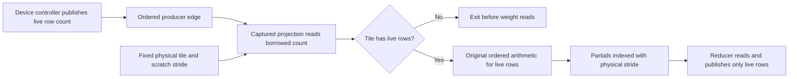

# Dynamic MTP: device-owned row extent, September 8

Subsequent work promoted the accepted settings to automatic card-aware defaults;
see the [hardware-defaults implementation and fresh proof](2026-09-08-mtp-hardware-defaults.md).
The measurements and explicit CLI commands below describe the earlier tuning
checkpoint, before that promotion.

## Accepted result and handoff

The user accepted this tuning slice and stopped the deeper ROCm search once
the completed depths were getting slower. No benchmark process remains live.
Clean Release measurements use Qwen3.8-27B IQ4_XS, the exact 512-token prompt,
256 output tokens, one warmup and five measured requests, normal MPI bootstrap,
FP32 activations, FP16 KV, and PerfStats/profilers disabled. The metric is
`decode_after_prefill`, counting 255 decode steps per request.

| Backend | Best measured fixed depth | Fixed decode | Dynamic, capacity 15 | Dynamic / fixed |
|---|---:|---:|---:|---:|
| RTX3090 CUDA | 2 | 69.991 tok/s | 68.166 tok/s | 97.39% |
| MI50 ROCm | 2 | 44.208 tok/s | 41.013 tok/s | 92.77% |

CUDA's fixed-depth 1–15 inventory is complete. ROCm's completed inventory is
depths 1–9; depth 10 was interrupted and 11–15 were not run in this final
performance sweep. The ROCm result is therefore relative to the **best tested**
depth, not a claim that every supported depth was measured. Its fixed results
for depths 1 through 9 are 38.352, 44.208, 43.201, 31.948, 30.846, 29.643,
27.941, 22.473 and 21.507 tok/s. The interrupted cell is not a correctness
failure. Depth-15 capacity and numerical correctness remain covered by the
functional gate on both backends.

Both dynamic configurations retain bounds 1–15 and initial depth 2. CUDA uses
the existing policy defaults. ROCm requires the explicit measured override
`--mtp-depth-demote-zero-accept 0.45`; **no global CLI/runtime default changed**.
The latter postpones premature demotion without disabling adaptation: its five
requests record five depth updates, 565 verifier runs, 1,125 draft steps and
715 accepted drafts. Fixed depth 2 records 565 verifier runs, 1,130 drafts and
715 accepts. Every one of the five output-token arrays in every completed
fixed/dynamic receipt matches the previously accepted baseline within its
backend; cross-vendor outputs are not used as byte oracles.

Reproduce the ROCm policy with the same model/prompt and no profiling overrides:

```bash
LLAMINAR_BENCHMARK_ITERATIONS=5 LLAMINAR_BENCHMARK_WARMUP_ITERATIONS=1 \
  ./build_v2_release/llaminar2 benchmark \
  -m /mnt/llaminar-production-parity/cache/models/Qwen3.8-27B-IQ4_XS.gguf \
  -d rocm:0 -c 4096 --prompt-file /tmp/qwen38-exact512-prompt-nonl.txt -n 256 \
  --deterministic --mtp --mtp-verify-mode greedy \
  --mtp-depth-policy dynamic --mtp-draft-tokens 15 \
  --mtp-min-draft-tokens 1 --mtp-max-draft-tokens 15 \
  --mtp-initial-draft-tokens 2 --mtp-depth-demote-zero-accept 0.45
```

For the measured CUDA policy, select `cuda:0` and omit the zero-accept override.
Receipts: `/tmp/qwen38-dynamic90-counted-cuda-{fixed2,dynamic}.{json,log}`,
`/tmp/qwen38-fixed-inventory-cuda-depthN.{json,log}`, and
`/tmp/qwen38-grid-v21-final-rocm-{fixedN,dynamic_zero45}.{json,log}`.

The final affected gate passes **638 Unit tests, 115 production-preflight
integrations, twelve Qwen3.8 CUDA/ROCm parity cells and 106 validated CSV
artifacts** in **613.462 seconds**:
`/tmp/qwen38-rocm-grid-v21-proof.{json,log}`. It includes Off, fixed 1/2/3/15,
dynamic and prefix restore. This is not certification of the entire production
matrix or HTTP E2E suite. All 72 final ROCm fused specializations are spill-free;
the focused captured-row suite covers 128 cases. No weights, activation/KV
precision, persistent workspace size or device-owned controller authority was
changed to obtain the result. The original external-baseline prefill goal is
separate and remains open. The sections below retain the investigation history.

## Acceptance and baseline

The active goal is dynamic-depth MTP delivering at least 90% of each backend's
best fixed depth on the matched Qwen3.8-27B workload. Depth-15 capacity remains
mandatory. Do not reduce the ceiling, change weights/activation/KV precision,
increase persistent buffers, or move GPU decisions to the host.

Fresh Release measurements after checkpoint `8c3097fe5` use the persistent
tmpfs IQ4_XS model, exact 512-token prompt, 256 outputs, greedy verification,
one warmup and five measurements with PerfStats disabled:

| Backend | Fixed depth 2 | Dynamic, capacity 15 | Dynamic / fixed 2 |
|---|---:|---:|---:|
| RTX3090 CUDA | 69.555 tok/s | 24.318 tok/s | 35.0% |
| MI50 ROCm | 43.724 tok/s | 12.684 tok/s | 29.0% |

These use `decode_after_prefill`, not attempted-draft throughput. Every output
ID agrees between fixed and dynamic and between all repeats within a backend.
CUDA and ROCm are not each other's byte oracle. Depth 2 is a comparator, not
yet the best of the required fixed-depth 1–15 inventory.

Receipts: `/tmp/qwen38-dynamic90-v2-{cuda,rocm}-{fixed2,dynamic}.{json,log}`.
The refresh runner is `/tmp/qwen38-dynamic90-refresh.py`.

## Wired Release result and remaining capacity tax

The complete affected correctness gate passes (details below). The same clean
one-warmup/five-measurement Release bracket now gives:

| Backend | Fixed depth 2 | Dynamic, capacity 15 | Dynamic / fixed 2 | Dynamic speedup |
|---|---:|---:|---:|---:|
| RTX3090 CUDA | 69.842 tok/s | 56.839 tok/s | 81.38% | 2.337x |
| MI50 ROCm | 45.319 tok/s | 34.135 tok/s | 75.32% | 2.691x |

Receipts: `/tmp/qwen38-dynamic90-wired-{cuda,rocm}-{fixed2,dynamic}.{json,log}`.
All five repeats match the prior baseline and fixed-depth output IDs within
each backend. PerfStats is disabled. Neither backend meets the 90% target yet;
the complete fixed-depth inventory also remains outstanding.

A separate normal-bootstrap GPU-event diagnostic compares capacities 2 and 15
with the same initial depth 2, output IDs, and controller observations. CUDA
decode takes 3594.463/4459.939 ms; ROCm takes 6371.424/7488.168 ms. CUDA's
monolithic parent exposes only its setup verifier replay to these events, so
do not attribute that single event to live transaction latency. ROCm exposes
all 139 verifier replays: 5858.754/6942.025 ms, mean 42.149/49.943 ms. This
confirms a remaining execution-width cost independent of depth decisions.
Receipts: `/tmp/qwen38-rows-{cuda,rocm}-cap{2,15}-events{,-bench}.json`.

The installed CUDA grouped policy selects row reuse 16 for the large FFN
projections at physical M16, but reuse 4 at M3. Live-count admission skips
arithmetic, not the wider variant's register allocation. An explicit
`V2_Perf_CUDA_DeviceCountedVerifierRows` probe reuses the all-format fixture's
byte oracle at these model shapes to measure this lead; it is excluded from
preflight. No new production launch-policy change is accepted yet.

The Release probe confirms the effect at physical M16:

| IQ4_XS projection N/K | Installed, live 3 | Reuse 8, live 3 | Installed, live 16 | Reuse 8, live 16 |
|---|---:|---:|---:|---:|
| 17408 / 5120 | 114.720 us | 77.536 us | 328.168 us | 214.864 us |
| 5120 / 17408 | 131.104 us | 77.400 us | 393.384 us | 222.312 us |

Installed columns use the closing bracket; the opening bracket and every
2/4/8/16-row candidate remain in `/tmp/mtp-rows-release-economy.log`. Reuse 4
is slightly faster for shallow rows but loses to reuse 8 at depth 15. Every
candidate byte-checks every live count 0..16 and the poisoned inactive suffix.
This focused probe is diagnostic, not an installable all-format dispatch corpus.
Release and Integration have separate executables sharing fixture source;
neither Perf registration belongs in preflight. Both Release Perf registrations
(including the separated CPU collective comparison) pass in 12.07 seconds.

Isolated Release NCU evidence for FFN-up at live M3 makes the register cost
explicit: reuse 16 uses 80 registers/thread, 50% theoretical and 41.37%
achieved occupancy, versus reuse 8's 40 registers, 100% theoretical and 82.16%
achieved occupancy. Both have zero measured local spilling requests. The
profiler durations are 113.12/75.49 us and memory throughput is
468.12/691.23 GB/s, respectively; these are attribution, not timing labels.
Reports: `/tmp/mtp-rows-release-ffn-up-r16-live3.ncu-rep` and
`/tmp/mtp-rows-release-ffn-up-r8-live3-v2.ncu-rep`. The initial R8 profiler filter
matched no kernel because demangled template arguments include `(int)`; its
separate log is retained and is not evidence. No eager model path was used.

After the test-only additions, the 64-case CUDA fixture, Unit test-target
selection, campaign framework, and all three shared-memory Unit registrations
pass again: `/tmp/mtp-rows-post-economy-functional.log`, six CTest entries in
9.13 seconds. The production library is unchanged from the full green gate.
Next installation must use the shared authenticated dispatch transaction and
preserve installed Auto for unseen shapes; do not hand-edit generated rules or
treat these two IQ4_XS shapes as universal format coverage.

## Partial-batch exact policy — affected gate green

The first all-format refresh measured only fully active M16. Its FFN-down
winner was tensor-core MMA16, but a counted-row probe rejected it: at three
live rows it took about 182 us, versus about 77 us for DP4A reuse 8. It was
reverted before model benchmarking. Full-capacity throughput alone is not a
valid dynamic-depth objective.

The existing strong CUDA trainer now accepts an optional device-counted live
prefix while retaining physical M, capture, workspace, and scratch strides.
It compares live rows against the serial M1 byte oracle and independently
checks poison in the inactive suffix. Common observations and profiler request
identities carry this offline occupancy. Runtime dispatch does **not** gain a
host-visible row count: the common exact oracle minimizes worst-surface regret
across occupancies and source-format aliases for one existing physical key.
Counted observations are exact-only, not generic-fitting features.

The declared refresh covers 21 source formats, two manifest FFN geometries,
five reachable candidates, and live rows 2/3/4/8/16 inside physical M16:
1,050 strong observations and 31,500 raw timing samples, all passing byte,
repeat, capture, and inactive-poison checks. The resulting 32-key delta retains
44,000 installed keys plus the complete M1 and generic selection programs.
IQ4_XS selects DP4A reuse 8 for both projections; worst-surface regret is
5.58% for gate/up and 6.00% for down. No new weight format, activation dtype,
persistent buffer, or arithmetic order is introduced.

Evidence is under `/tmp/mtp-counted-surfaces-cuda-active{2,3,4,8,16}*`;
generation and retention receipt are
`/tmp/mtp-counted-surfaces-cuda-{candidate.inc,retention.json,common.csv}`.
Four authenticated isolated profiles for the IQ4_XS winner at live 3/16
completed in `/tmp/mtp-counted-surfaces-r8-profile-{requests,evidence}.json`.
All four producers use 40 registers/thread. Dynamic resource metrics remain
attached to their exact occupancy; a full-row profile cannot certify a
shallow-row point. Optional counters absent from the collector are recorded
as unavailable, not invented as zero.

Tooling validation includes the complete 638-test Unit gate before the final
profiler identity extension, followed by all 11 relevant analyzer/common
schema/profiler Unit registrations after that extension. The latter exposed
and fixed a fast resume reader that incorrectly required the new optional
field on historical receipts. Both typed and fast readers now share field
validation, with tests proving distinct counted-row coverage and unchanged
historical identities. CUDA's functional fixture also now exercises the
tensor-core candidate through every live count in M31; all 85 tests pass.
Performance measurements remain excluded from preflight.

The occupancy-robust delta is installed and both builds are complete. The
installed captured microbenchmark passes in 9.80 seconds, confirming roughly
77 us at live 3 for both FFN projections. Clean Release model confirmation
now measures **69.991 fixed-2 / 68.166 dynamic-15 tok/s** on CUDA, using the
same one warmup and five measurements. Dynamic gains **19.93%** over 56.839
and reaches **97.39%** of this fixed-2 comparator. All output IDs and controller
counters are unchanged, including 600 verifier runs, 1,000 drafts, 680 accepted
tokens, and five depth updates across the measured requests. PerfStats is off;
no profiler, dispatch override, or new workspace is used in this comparison.
Receipts: `/tmp/qwen38-dynamic90-counted-cuda-{fixed2,dynamic}.{json,log}`.

The rebuilt affected gate passes **638 Unit tests, 115 production-preflight
integrations, all twelve Qwen3.8 CUDA/ROCm cells, and 106 validated CSV
artifacts** in **594.741 seconds**:
`/tmp/qwen38-counted-policy-proof.{json,log}`. Each backend passes MTP off,
fixed depths 1/2/3/15, and dynamic depth, including prefix restore. This is the
affected slice, not the entire production campaign. The complete CUDA fixed-depth
1–15 inventory now passes, with depth 2 fastest at 69.991 tok/s; dynamic therefore
meets the target at **97.39% of the best fixed depth**, not just a chosen
comparator. Every depth agrees with all 256 reference output IDs across five
measurements. Receipts: `/tmp/qwen38-fixed-inventory-cuda-depthN.{json,log}`;
depth 2 reuses the preceding accepted receipt. ROCm is unchanged at 34.135 dynamic versus 45.319 fixed-2 tok/s; its
remaining width cost and controller economics are still open.

## ROCm bounded fused rows — affected correctness gate green

The actual GGUF has 48 GDN value heads and 128-by-128 recurrent state. An
isolated captured production recurrence probe measures about 48.46/52.96 us
for capacity 3/16 with three live rows: roughly 0.216 ms across 48 layers,
not the 7.794 ms observed verifier gap. Timing and successful isolated profiles:
`/tmp/mtp-rocm-gdn-capacity-timing.log` and
`/tmp/mtp-rocm-gdn-cap{3,16}-profile*`. The historical 32-head fixture remains
unchanged in geometry; a separate 48-head instantiation supplies this evidence.

The fused projection probe instead exposes material scheduling overhead.
Three IQ4_XS projections at N=17408/K=5120 take 257.22/361.12 us for physical
M=3/16 with three live rows. The same-format bundle takes 216.64/316.78 us.
Both byte-check every live publication and preserve poisoned inactive outputs.
These three-equal-projection bundles isolate the dispatcher; they are not yet
a complete model-stage attribution. Receipts:
`/tmp/mtp-rocm-fused-capacity-timing.log` and
`/tmp/mtp-rocm-fused-mixed-cap{3,16}-profile*`.

The trace shows 13,056/52,224 producer workgroups and 2,448/13,056 reducer
workgroups for the same live rows. Admission skips weight arithmetic but still
pays workgroup launch/exit cost. A candidate bounded row-worker grid uses the
existing parallelism policy and device-side grid-stride iteration; scratch
capacity, format, arithmetic, and device count ownership remain unchanged.
The spill-free fused candidate now separates direct-output and ordered-partial
publication at capture time, hoists immutable bias out of the row loop, and
requires the fused quantizer's published sum plane. All 72 fused specializations
have zero private allocation and zero SGPR/VGPR spills. The compiled MI50
profile confirms 13,056 producer and 816 reducer workgroups for capacity 16:
`/tmp/mtp-rocm-grid-v21-mixed16-profile.csv`. No count is read by the host and
no scratch region or precision grows.

Unprofiled same/mixed-format capacity-16 timing falls to 227.89/233.755 us;
closing capacity-3 timing is 226.707/232.38 us. Mixed improves absolutely, but
the homogeneous shallow case regresses from its 216.64 us baseline. Evidence:
`/tmp/mtp-rocm-bounded-grid-v21-fused-timing.log`. This is not a universal
short-depth speed win. A separate bounded single-projection experiment was
spill-free but slower, including fully live M16, and was removed.

The clean five-repeat Release model pair preserves every token and all
controller observations: fixed depth 2 is 44.277 tok/s (previously 45.319),
dynamic capacity 15 is 36.073 tok/s (previously 34.135). Thus dynamic improves
5.68%, but remains only 79.60% of the previous fixed-depth comparator. The
ROCm target is not met. Receipts:
`/tmp/qwen38-dynamic90-grid-rocm-{fixed2,dynamic}.{json,log}`.
The expanded 128-case all-format retained-row proof, including nonzero bias,
column tails, and seven direct-publication source formats, passes in 13.218s:
`/tmp/mtp-rocm-grid-v21-expanded-functional.log`.

The broader affected gate is now green: **638 Unit + 115 production-preflight
integrations + all twelve Qwen3.8 CUDA/ROCm cells + 106 validated CSV artifacts**
in **613.462 seconds**, with one persistent-tmpfs cache hit and zero copied
model bytes. Evidence: `/tmp/qwen38-rocm-grid-v21-proof.{json,log}`; artifact
root `/tmp/production-campaign-artifacts/20260908T085908Z-2045948-1788857948025166618`.
Each backend passes Off, fixed 1/2/3/15 and dynamic with FP32 activations,
FP16 KV and prefix restore. This is the affected slice, not the full production
matrix or HTTP E2E certification. At this checkpoint the quiet ROCm controller
confirmation and fixed-depth inventory were pending; the accepted result above
records the later confirmation and user-directed limit on the deeper sweep.

The follow-up same-decision capacity pair measures 6,026.805/6,535.564 ms in
139 verifier replays at capacity 3/16, a 3.66 ms/replay gap, down from 7.79 ms.
It retains identical tokens, 171 drafts, 117 accepted drafts and one depth
update per request. These event timings are diagnostic, not unprofiled
throughput; host compilation overlapped part of the diagnostic run. Receipts:
`/tmp/qwen38-grid-v21-rocm-cap{2,15}-events{,-bench}.json`.

An isolated final mixed-decoder counter pass reports zero scratch, 99.73% VALU
lane utilization, 41.98% VALU busy, 17.33% SALU busy, 39.86% memory-unit busy,
2.26% memory-unit stalled and 53.78% L2 hit. Producer traffic is 64,348 KiB
fetched and 9,258 KiB written; the 816-wave reducer is memory/launch dominated.
These are cold isolated attribution counters, not model timing. Evidence:
`/tmp/mtp-rocm-grid-v21-mixed16-counters.{csv,log}`; the request selects only
dispatches 3 and 4, leaving setup kernels outside the measurements.

Controller screening (three repeats, compilation overlapping: not a clean
performance certificate) isolates the existing 30% zero-accept demotion:
lowering the accepted-draft threshold from 55% to 45% changes no decisions;
raising the zero-accept threshold to 45% instead reduces verifier runs from
139 to 113 per request, while retaining a late depth update and identical
tokens. This screens at 41.152 tok/s. Changing both thresholds removes the
late update and screens at 40.930 tok/s. Observe depth 2 is diagnostic only,
not a dynamic certificate. No policy default has changed. Receipts:
`/tmp/qwen38-grid-rocm-depth-economy-{observe2,dynamic_accept45,dynamic_zero45,dynamic_both45}.{json,log}`.

A whole-model rocprof-v1 attempt terminated with SIGSEGV inside
`librocprofiler64.so.1` at retained graph launch, exit 139. Its partial trace
contains setup/prefill, not a valid steady decode result:
`/tmp/mtp-rocm-model-cap15-profile*`. Do not treat those aggregate statistics
as live-decode attribution or disable capture to make the profiler succeed.
Isolated captured probes remain functional. All new timing cases belong only
to Perf registrations, never production preflight; the corresponding byte
invariants belong to the existing all-format integration fixture.

## Implemented boundary — affected model gate green

`DeviceRowRange` separates a retained physical row range from a borrowed
device-owned count. Host factories validate metadata without reading that
count. Device consumers reject corrupt publications, skip wholly inactive
tiles before weight access, and retain physical split-K strides. Nested
slices preserve the same original count owner and matrix coordinates.



The raw launch contract now spans CUDA's grouped DP4A, integer tensor-core,
row-parallel and reducer families, and ROCm's single/fused/mixed-decoder
producer/reducer families. All use the same borrowed row descriptor and fixed
physical scratch indexing. The existing verifier RAII scope now also carries
immutable row geometry through nested tensor adapters, rejecting mismatched
physical extents and restoring its enclosing scope even after exceptions.
This is host recording metadata, not a host copy of the changing device count.
CUDA/ROCm NativeVNNI and fixed-order FP16/BF16/FP32 projection and SwiGLU bridges
copy the descriptor into their retained kernel arguments.

Qwen FFN, QKV/GDN and attention-output graphs now borrow the existing verifier
request-length owner. An identity-layout LM head also borrows it; arbitrary
compact row selections do not reuse an unrelated source-prefix count. The
current descriptor represents a contiguous single-request prefix, not a ragged
multi-request matrix. CPU still uses its existing host-owned actual geometry.
Activation quantization remains physical-width, and unchanged general BLAS
routes are not claimed to skip inactive rows. Full affected model capture/CSV
validation now passes; the clean Release improvement and remaining gap are
reported above.

The expanded public-adapter regressions pass on both devices: 64 CUDA cases
(21 raw, 21 projection, 21 SwiGLU, one six-combination native floating proof)
and 106 ROCm cases (63 raw/bundle, 42 public-adapter, one floating proof).
CUDA/ROCm take 5.28/23.46 seconds, respectively, in
`/tmp/mtp-device-rows-adapter-functional-v2.log`. The fixture explicitly joins
initial tensor publication before capture, as production preparation does;
a completed stream alone is not a coherence receipt. Existing CUDA floating
legacy-tree and shared-tile checks also pass. The complete Unit and preflight
gates have been rebuilt after the interface change; prior gate receipts below
do not certify this new model-wiring revision. The first latest-revision run
passed 637/638 Unit registrations, stopping on the shared-memory collective's
competitive p95 assertion while Release compilation occupied the host. No
preflight or model cell ran in that attempt. The unchanged economy assertions
now have their own `V2_Perf_ShmemSpinPrefillSequence` registration; Unit retains
a 121-reduction full-buffer correctness check with different values each epoch.
An isolated rerun passes: shared p50/p95 402.611/446.246 us versus MPI
1636.57/1715.36 us (`/tmp/mtp-rows-shmem-isolated-perf.log`). This separates
measurement from functional gates without weakening either assertion. The
canonical rerun now passes **638 Unit, 115 preflight, twelve Qwen3.8 cells,
and 106 validated CSV artifacts** in 596.888 seconds:
`/tmp/qwen38-device-rows-proof-v2.{json,log}`. Both CUDA and ROCm pass Off,
depths 1/2/3/15, and dynamic depth with prefix restore. The ten MTP cells certify
full captured generation; the two existing Off cells certify captured forward
execution, not an ordinary full-generation parent. This is the affected gate,
not the entire production/E2E campaign. Release paired measurements completed
via `/tmp/qwen38-dynamic90-wired.py`, without profiler/debug overrides.

The capture-identity audit found that `ForwardGraphSignature` stored only a
boolean for device request lengths. That flag is replaced with the exact
borrowed pointer, used by equality and hashing; telemetry derives presence
from it. The Unit regression distinguishes two equal-valued count owners, and
resident-prefill integration fixtures now assert the actual post-admission
binding. Workspace generation still owns allocation-lifetime validation. This
avoids adding a parallel flag or recapturing when only the count value changes.

The device-free policy tests cover growth, shrinkage, empty publications,
invalid geometry/counts, odd tails, and nested slices. The separate small
`ROCmDeviceCountedVerifierRows` integration fixture uses all 21 source formats,
production-prepared weights, a public serial-M1 byte oracle, and one retained
31-row graph crossing the sixteen-row scratch boundary. It poisons inactive
outputs and scratch between live-count changes. Its registration is in the
canonical production preflight inventory; no performance test is added there.
CUDA has the symmetric 21-format fixture. ROCm now has 63 cases: 21 formats
each through the single, homogeneous fused, and mixed-decoder dispatchers.
Each fused case owns three separate outputs and scratch slices. This last
fixture exercises every decoder but uses same-format weights within a bundle;
the existing heterogeneous-weight regressions remain complementary coverage.

Initial fixture failures were not accepted as numerical tolerances: use the
shared nondegenerate format registry for IQ3_S and normalize Q8_1/Q8_K source
policy IDs exactly as the production adapter does. The resulting new
all-format functional registration passes in 2.17 seconds.

## Additional regression exposed

The wider existing ROCm all-format registration found two related gaps:

- The fused-QKV serial-equivalence fixture had not declared its simultaneous
  projection arena through `appendFusedProjectionWorkspaceRequirements()`.
- The fused launcher validated/sliced partials with the full logical M, while
  allocation and execution correctly reused at most sixteen physical rows.
  M17/M31 therefore failed admission despite sufficient declared scratch.

The fixture now supplies its complete projection inventory; the launcher uses
the retained physical tile for partial slices. This does not enlarge the
arena or change arithmetic. The existing all-format registration is now also
model-free and included in preflight. Revalidation passes, including CUDA's
broader grouped-verifier registration and ROCm FP16/BF16/FP32 checks:
`/tmp/mtp-device-rows-both-bundle-functional.log`, seven CTest registrations
including the fetch fixture, 145.13 seconds. The new CUDA/ROCm fixtures take
2.37/5.98 seconds respectively. The rebuilt complete Unit gate passes all 638
registrations in 69.48 seconds: `/tmp/mtp-device-rows-unit-gate.log`.

The new CUDA raw-launch regression also exposed an incomplete public verifier
scope. It selected the tensor adapter's route but only a second internal helper
selected the raw serial-M1 arithmetic policy. The public RAII scope now owns
and restores both selectors, and grouped launch no longer repeats that second
scope. The broad CUDA registration remains byte-correct across all formats.

## Compiler evidence and remaining proof

The extracted current gfx906 object contains 34 modified producer variants
and one reducer: all report zero private scratch, zero SGPR/VGPR spills, and
no dynamic stack. VGPR counts span 7–36; SGPR counts span 18–83. IQ4's four-row
producer uses 23 VGPRs / 62 SGPRs versus 22 / 60 in the previous Release
object. ISA confirms a uniform count load and tile-exit branch before weight
loads. These are compiler/ISA facts, not measured occupancy or throughput.
Isolated ROCprof counters are in
`/tmp/mtp-device-rows-iq4-profile.aTn046/{active3,active16}.csv`.
Each selects exactly one IQ4 four-row producer, physical M16/N1024/K1024,
with a live prefix of three or sixteen rows. VALUBusy is 3.63/15.37%,
MemUnitBusy 3.96/12.99%, and WriteSize 379.81/779.81 KiB. Different cache hit
rates mean these are execution/traffic diagnostics, not bandwidth or model
speedup certificates. The initial single-projection fixture passes twenty
repetitions in 40.54 seconds. The expanded CUDA/ROCm registrations also pass
twenty repeats apiece: 1,680 format/launch cases in 166.91 seconds,
`/tmp/mtp-device-rows-both-stress20.log`. All 68 executables referenced by the
115-registration preflight label were rebuilt; that gate passes all 115 in
444.75 seconds: `/tmp/mtp-device-rows-preflight.log`.

The expanded compiler audit then found 14 scalar-register spills in the ROCm
mixed-decoder four-row entry (no private scratch or VGPR spill). Admission now
resolves before the format switch; a typed per-projection binding sheds the
whole bundle's pointer-table lifetime and preselects its physical K plane.
The entry also derives physical M from the row descriptor instead of carrying
a duplicate kernel scalar. The best current variant uses 49 VGPR / 100 SGPR
and retains eight scalar-to-vector spills; this is **not** a zero-spill or
economy certificate. Do not hide that outstanding profiling/tuning work.
Byte-equivalence revalidation of this post-preflight cleanup passes:
`/tmp/mtp-device-rows-rocm-resolved-functional.log` (new 63-case fixture,
existing all-format and floating registrations).
Object: `/tmp/mtp-device-rows-canonical-stride.gfx906.co`.

CUDA resource inspection covers 1,705 compiled grouped producer/reducer
variants across all eight shards: zero local memory and zero static stack,
37–255 registers depending on the candidate. This inventory includes unused
large-row candidates; it does not claim all have economical occupancy.
An isolated captured IQ4 DP4A-8/TN128/CPT1 launch with physical M16, live M3,
N/K1024 reports 40 registers, zero spill requests, 100% theoretical / 31.01%
achieved occupancy and 136.54 GB/s memory throughput. Its grid is only half a
wave across the 3090's SMs. The profiler duration (4.70 us) is not a canonical
timing sample. Evidence:
`/tmp/mtp-device-rows-cuda-iq4-live3{.ncu-rep,-details.txt,.log}`.
Warmed real-model-shape economy measurements and fused ROCm profiling remain
required before accepting the production optimization.

Objects: `/tmp/mtp-device-rows{,-control}.gfx906.co`. Keep profiler evidence
isolated by exact format, physical geometry, and published active count.

The newly counted floating bridges also have isolated evidence. CUDA's FP32
M31/N32/K257 launch at live M3 has 64 registers, zero spill requests,
66.67% theoretical / 52.58% achieved occupancy, and 11.79 GB/s measured memory
throughput (`/tmp/mtp-device-rows-cuda-floating-live3*`). Its 3.68-us profiler
duration is not a canonical model timing. ROCm's three modified floating
kernels report zero private scratch and zero scalar/vector spills, with
10/13/21 VGPR and 22/25/32 SGPR respectively
(`/tmp/mtp-floating-rows-resource-notes.txt`). One isolated FP32 live-M3
projection reports 1.42% VALUBusy, 12.74% SALUBusy and 2.47% MemUnitBusy:
`/tmp/mtp-floating-rows-rocm-live3.csv`. This tiny partially active grid is
admission/launch dominated; it does not certify performance at model widths.

The tuning slice is accepted with the explicit settings and evidence at the top
of this document. Further capacity-cost work or ROCm depths 10–15 would be a
follow-up, not a benchmark still running or an outstanding step in this accepted
slice. Any future extension must preserve device ownership and exact arithmetic,
and rerun the affected Unit/preflight/model/CSV gate after implementation changes.
