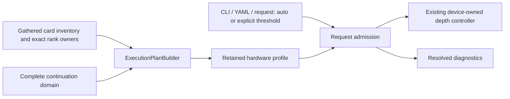

# MTP hardware defaults, September 8

## Requested behavior

Promote the measured CUDA/ROCm MTP controller settings to automatic production
defaults for a single card or a homogeneous continuation domain of that card
type. Other expert tiers may use different device types without changing the
continuation profile. Explicit user settings remain authoritative.

## Implementation

`ExecutionPlanBuilder` classifies the complete continuation membership using
the existing gathered `DeviceInfo` inventory and exact participant/rank owners.
It selects one immutable `MTPDepthDefaultsProfile` in the retained runtime:

| Profile | Automatic zero-accept demotion threshold |
|---|---:|
| RTX3090 CUDA | 0.30 |
| MI50 ROCm | 0.45 |
| Portable / uncharacterized continuation | 0.30 |

`execution/config/MTPDepthDefaults.h` is the sole numeric default table. The
MI50 identity requires its 60-CU inventory as well as the marketing name,
because HIP reports the ambiguous `AMD Instinct MI60 / MI50` name. A different
card from the same vendor, mixed cards, CPU participation in continuation,
or missing card identity does not select a measured-card profile. Card indices,
NUMA socket numbers, rank zero and tier ordering are not policy keys.

The planner also now honors declared owner ranks when resolving named-domain
participants; otherwise two ranks' local `rocm:0` devices could incorrectly
resolve to the first rank and make a heterogeneous domain appear homogeneous.

The threshold is an optional explicit value, not a default-valued scalar with
an auxiliary boolean. CLI/YAML `auto` retains absence, including through config
rendering and MPI request-policy wire version 2. Explicit `0`, `0.30`, and `1`
remain distinct from automatic intent. Request policy cannot replace the
retained topology profile; admission composes intent with that profile and
seals the same effective threshold into the existing integer device ABI.

No kernel arithmetic, GPU allocation, device-state ownership, or capture
capacity changes. The profile does not enable MTP, switch fixed/dynamic mode,
or change requested depth bounds. Greedy adaptive warm start remains depth 2
when permitted by the configured bounds; stochastic initialization retains its
existing semantics. A measured single-card policy is a default for homogeneous
domains, not a claim that their absolute throughput or every workload has been
benchmarked.

`BenchmarkMode` exports the initialized runner's configuration instead of
unresolved CLI intent. JSON records the profile, effective threshold and
automatic/explicit source. Named-domain stage construction now consumes the
plan-owned runtime rather than reparsing it independently.

## Verification

Both Release and Integration are rebuilt. The fresh canonical affected gate
passes **639 Unit registrations, 115 ProductionParityPreflight registrations,
and all twelve Qwen3.8 CUDA/ROCm numerical cells**, with **106 validated CSV
artifacts** and no artifact errors. Wall time is **600.305 seconds**, including
532.750 seconds for the shared Unit/preflight gate. Both backends cover MTP
off, fixed 1/2/3/15, dynamic capacity 15, prefill/decode checkpoints, and prefix
restore. The model staging receipt proves persistent tmpfs reuse with zero
copy bytes. This is the affected slice, not the entire production or HTTP
E2E matrix.

Receipts:

- `/tmp/mtp-hardware-defaults-proof.json` and `.log`.
- `/tmp/production-campaign-artifacts/20260908T104456Z-2192750-1788864296474495207`.
- Focused configuration/MPI tests also passed; the new hardware suite covers
  1/2/3/4/8-card local TP, named cross-rank ownership, other expert tiers,
  uncharacterized/mixed cards, automatic/explicit CLI/YAML intent, and admission
  into both greedy and stochastic device policies.

### Clean Release confirmation

Ordinary MPI-bootstrap Release benchmarks used the same Qwen3.8 IQ4_XS GGUF,
exact 512-token prompt, 256 generated tokens, context capacity 4096, FP32
activations, FP16 KV, greedy deterministic sampling, dynamic bounds 1–15,
initial depth 2, one warmup and five measurements. Neither command supplied
`--mtp-depth-demote-zero-accept`; both receipts attest `hardware_default`.
PerfStats was off and no profiler or concurrent workload ran during timing.

| Card | Prefill tok/s | Decode-after-prefill tok/s | Fraction of prior best fixed |
|---|---:|---:|---:|
| RTX3090 | 1157.84 | 68.0906 | 97.28% |
| MI50 | 266.94 | 41.1030 | 92.98% |

Every one of the five generated token arrays matches its backend's prior
accepted receipt exactly. Both runs attest graph execution, active bounds
1–15, five depth updates, no transaction validation failures, and clean normal
inference retirement. Aggregate CUDA counters are 600 verifier runs, 1000 draft
steps and 680 accepted tokens; ROCm counters are 565, 1125 and 715 respectively.
The raw `mtp_graph_capacity_draft_tokens=0` config field means automatic capacity;
the active controller's maximum is 15, not zero.

Receipts are `/tmp/mtp-hardware-defaults-{cuda,rocm}.{json,log}`; the exact
local reproduction script is `/tmp/mtp-hardware-defaults-bench.sh`. The prior
accepted tuning evidence and fixed-depth inventories remain in
[the measured-policy handoff](2026-09-08-dynamic-mtp-device-row-range.md).
These are single-card performance confirmations, not measured multi-card
throughput claims or an external llama.cpp comparison.

### Separate dry-run lifecycle finding

Real two-card planning selects `cuda-rtx3090` for CUDA0/1 and `rocm-mi50` for
ROCm0/1. However, both auxiliary `--dry-run` invocations log a shutdown error:
`model-context retention seal found no prepared records`. Dry-run skips weight
preparation but its initialized model/workspace owners enter the existing
exclusive-retirement retention seal. That branch and diagnostic already exist
in HEAD; this defaults change does not modify them. Do not count these receipts
as clean lifecycle certificates or as two-card inference performance evidence.

Follow-up: distinguish planning-only ownership from prepared model ownership in
the typed retirement contract, and add a model-free dry-run shutdown regression
to the shared gate. Do not weaken prepared-weight sealing for real inference.
Logs are `/tmp/mtp-hardware-defaults-{cuda,rocm}-tp2-dry-run.log`. This issue is
not fixed in the hardware-defaults slice.
