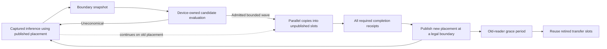

# Dynamic ExpertOverlay: measured cadence repair and economy follow-up

Date: 2026-09-18. This is an investigation, the evidence for the first runtime
repair, and the remaining implementation sequence. It is not a replacement
architecture specification or a broad performance certificate.

Provenance: dirty `develop` tree based on `2dccc5ef9`. The initial controls used
AVX512 Release `llaminar2` build ID
`4f717528603e65cb1ecc62f3b67aa041d5de0c37`; the cadence-repair controls used
build ID `d9ab2560a15f28a66aac68bf896a86a840794b1507ac1365e40509d91ab0c624`.
Pre-existing working-tree changes were preserved.

## Runtime cadence repair implemented

Hosted heterogeneous generation already carried cumulative, device-authenticated
committed-token progress in every immutable transaction ticket. The missing edge
was production wiring: `retired_decode_progress_sink` woke only the old
host-authoritative maintenance service. The topology-wide device controller saw
the entire returned batch through the next MPI command instead.

The runtime now binds that existing sink to exactly one process-local maintenance
authority. Every continuation transition and expert follower converts the ticket
frontier into an exactly-once positive delta and wakes its local device controller.
For the topology-wide device authority, only the continuation rank retains a
terminal acknowledgement total; the older host authority preserves its existing
per-process outer acknowledgement. The outer decode boundary authenticates that
total and does not enqueue it again. A non-hosted path retains the next-command
sideband because it has no per-sequence ticket. No policy, placement mirror,
extra MPI command, device download, or blocking inference wait was added.

Focused proof is in the ordinary Unit gate and model-free production preflight:

- a 1,024-token hosted command must admit four fixed 256-token controller
  windows before its outer terminal;
- the real two-rank MPI follower must turn the existing ticket frontier into
  recurring controller windows without duplicating repeated graph tickets; and
- source architecture checks require direct device-controller notification and
  terminal acknowledgement instead of double publication.

The real 2x RTX 3090 continuation / 4x MI50 secondary topology then proved the
production behavior in one instrumented 1,024-token request. Each rank received
564 decode deltas totaling exactly 1,024 tokens. The adaptive gate consumed two
in-request batches, 261 tokens against a 256-token threshold and 385 against a
384-token threshold. It completed a 16-command wave before request return:
five promotions, five demotions, six same-priority moves, and 169,869,312
physical bytes. The outer boundary acknowledged all 1,024 ticket-retired tokens;
no `decode_boundary_progress_queued` record was emitted.

The reverse 4x MI50 continuation / 2x RTX 3090 secondary topology proved the
same ownership direction. Its 512-token request delivered 269 decode deltas,
admitted one 261/256 window on both ranks, and published the sole 512-token
outer acknowledgement on the continuation rank. The first decision did not
move weights; this short run proves cadence and rank ownership, not payoff. Its
roughly eight-minute weight-preparation/setup time is a separate economy gap.

Matched unprofiled controls on the cadence-repair Release build retained the
same 1,024-token output in every Static and Dynamic iteration:

| Control | Measured requests | Decode tok/s | Movement per Dynamic request |
| --- | ---: | ---: | --- |
| Static | 3 | 31.5858 | none |
| Dynamic, all requests | 6 | 31.6516 | 2-3 transactions |
| Dynamic, first three | 3 | 31.3939 | 2-3 transactions |
| Dynamic, last three | 3 | 31.9202 | 2-3 transactions |

Dynamic is 0.21% above the matched Static mean over the complete measured
horizon, and its latter half is 1.06% above Static. This establishes a positive
same-seed payoff for this repeated-prompt workload while moving on both axes. It
does not certify other prompts, context lengths, or tier compositions.

## What the new controls establish

The old inference trace did **not** establish that the resident copy worker
consumed ten seconds of inference time. It summed overlapping lifetimes across
two GPUs. The earlier one-warp change also combined a geometry change with an
idle-polling change, so it did not isolate either effect.

Fresh unprofiled measurements use the same current Release executable, Qwen3.5
122B Q8_K_XL shards in the persistent tmpfs, two RTX 3090 continuation participants
at priority 0, and four MI50 expert participants at priority 1. Configuration:
131072-token capacity, FP32 activations, FP16 KV, ordinal initial placement,
seed 42, deterministic sampling, dynamic MTP with the explicitly held 1–3 depth
range, a 26-token prompt, and 1024 generated tokens per request. This restricted
MTP range is an experimental control, not a proposed change to service defaults.
There is one warmup and six measured requests per control. No PerfStats, stage
dumps, or GPU profiler is enabled in these timing runs.

| Control | Decode tok/s | Observed completed movement |
| --- | ---: | --- |
| Static | 31.2725 | None |
| Dynamic, observations below admission threshold | 31.2526 | None |
| Dynamic, candidate economics with a one-token payoff horizon | 30.4834 | None |
| Dynamic, actual movement; first six requests | 31.0989 | 78 commands |
| Dynamic, actual movement; last six requests | 31.8024 | 96 commands |
| Dynamic, actual movement; all twelve requests | 31.4467 | 174 commands |

Every measured request in these controls produced the identical 1024-token
sequence. The first two means differ by only 0.064%; they do not establish an
idle-worker bottleneck. Enabling candidate economics without allowing movement
reduced throughput by about 2.5% in this session. This is evidence to investigate
planning and its scheduling, not a direct measurement of policy-kernel duration.
These are sequential runs, not randomized/interleaved confidence bounds; clock
and session variation still matter. Rejecting every candidate can also scan more
candidates than filling a movement budget early, so this is not an additive
constant to subtract from every active-movement request.

The Dynamic controls have identical physical provisioning. Static retains
259522560 additional prepared-weight bytes per CUDA participant because it does
not reserve migration storage. Thus Static versus Dynamic is an end-user
configuration comparison, not a perfectly capacity-matched kernel experiment.
Do not charge that capacity difference to polling overhead or bypass the physical
memory authority to equalize it.

The full-movement leg extended to twelve measured requests, keeping placement
between requests while the benchmark resets request KV state. This distinguishes
adaptation across requests from a single long-context decode; it is not a prefill
or 8192-context performance claim. Its results must be considered separately from
the short-prompt prefill number, which is dominated by request/graph overhead.
It completed eleven movement transactions: 47 promotions, 47 demotions, and 80
same-priority moves, totaling 1847328768 physical bytes. All twelve output streams
were identical to the Static control. Aggregate throughput was 0.557% above
Static; the latter six requests were 1.694% above it. This is an encouraging
adaptation trend, not a certified speedup given sequential-run variation.

Local evidence: `/tmp/llaminar-dynamic-economy-Iel8EK/`. Raw JSONs, logs, and
profiler databases are local artifacts and must not be committed.

## Captured transfer versus finite transfer

`Perf__BackgroundMappedCopy.cpp` now measures the actual captured service, not
just the finite-pass entrypoint. It holds a captured primary branch, publishes
commands after graph entry, and requires receipts before releasing the primary.
No independently submitted finite pass can provide the measured progress.
Every generation changes the payload and checks all bytes after completion.

Unprofiled medians, 4 MiB per inbox:

| Path | Inboxes | Download GB/s | Upload GB/s |
| --- | ---: | ---: | ---: |
| Captured, one CTA / 32 threads | 4 | 1.560 | 0.550 |
| Captured, one CTA / 32 threads | 30 | 1.605 | 0.507 |
| Finite pass, four CTAs / 256 threads | 4 | 12.031 | 7.578 |

These are aggregate wall-time bandwidths, not sums of command active durations.
The captured and finite geometries differ deliberately. The fixture measures
progress while the primary is held, **not interference with real inference**.
Primary release through worker retirement was approximately 13–16 microseconds
in this fixture; it does not explain a seconds-scale regression by itself.

An isolated Nsight trace of `CUDAUpload4Slots4MiB` reports one block, 32 threads,
36 registers/thread, 92 bytes of static shared memory, and zero local-memory
allocation. This is resource evidence, not an achieved-occupancy measurement.
Profiler timings are excluded from the table.

A final rebuild and complete run of `v2_perf_background_mapped_copy` passed all
12 cases in 15.646 seconds, including the new captured cases, finite service,
CUDA/ROCm copies, and retained ticket consumers. Captured payload validation now
distinguishes each slot as well as each generation. The repeat measured captured
upload at 0.540/0.510 GB/s for 4/30 inboxes and finite upload at 7.476 GB/s,
consistent with the original gap. ROCm's 4 MiB background copy measured 10.962
GB/s upload and 11.425 GB/s download; it does not exhibit the CUDA one-warp
bandwidth limitation in this isolated measurement. No new production kernel was
installed, and the full Unit/preflight gate was not rerun for a measurement-only
test addition.

## Evidence gaps that must not become assumptions

1. `BenchmarkRunner` divides a returned multi-token graph step's elapsed time
   evenly across its tokens. Its derived `decode_windows` therefore cannot
   establish speedup at an intra-request epoch boundary. Whole-request elapsed
   times and completed movement receipts are real; the interpolated windows are
   not token-level observations.
2. `blocking_inference=false` on movement logs names a mode. It is not measured
   proof of zero contention or zero publication delay.
3. Startup migration normalization explicitly requires the interference fields
   to be zero. Those fields are reserved, not a measured zero-slowdown result.
   Its method documentation still describes paired interference samples and is
   stale. Do not reinstate expensive synthetic-inference startup calibration.
4. Calibration prices a finite setup transfer. It does not certify the bandwidth
   of a different captured worker geometry under live inference.
5. Movement counts alone cannot prove profit: measure both placement improvement
   and total inference time, including the period spent adapting.

## The repaired structural cadence limitation

Before the repair, the full-movement log completed approximately one transaction
per 33-second request. Source inspection explained why the configured token
window did not imply an in-request decision window in this path:

- `OrchestrationRunner::maybeApplyMoERebalance` adds the **returned decode
  batch's** committed tokens to `moe_overlay_pending_decode_progress_tokens_`.
- The next ordinary prefill/decode/forced-token command drains that count and
  calls `MoEOverlayDeviceControllerGraphService::notifyInferenceProgress` on
  each participant rank.
- This benchmark's captured generation call returns all 1024 tokens together.
  It therefore cannot notify four intermediate 256-token windows through this
  outer-command mechanism.
- The existing hosted-generation `retired_decode_progress_sink` was bound only
  to the host-owned residency maintenance service, not the all-GPU graph service.
  Its existence therefore did not prove in-request admission for the all-GPU
  controller.

The implemented direct ticket wiring removes this limitation for every hosted
heterogeneous transaction. The next-command sideband remains intentionally for
non-hosted paths only.

There is a second boundary to audit: maintenance snapshot admission defers to
the live MTP/forward lease. Merely supplying more host wakeups is insufficient
if the only legal snapshot edge is still the complete generation terminal.
The filtered phase diagnostic is intended to distinguish this from queueing
and from actual single-thread policy execution time.

The subsequent three-request diagnostic confirms three `1024`-token notification
batches on both ranks, while the configured required windows are `256` and
`384`. It observes one empty decision followed by two movement transactions.
Rank-zero maintenance timings were:

| Phase | Observations | Total elapsed ms |
| --- | ---: | ---: |
| Complete background transaction | 3 | 2996.02 |
| Policy-author terminal wait | 3 | 1349.45 |
| Group-snapshot terminal wait | 3 | 513.83 |
| Participant-snapshot terminal wait | 3 | 438.04 |
| Old-reader receipt wait | 2 | 79.08 |
| Runtime-candidate preparation wait | 2 | 6.40 |
| Runtime-candidate publication wait | 2 | 0.22 |

These are **host-observed maintenance phase durations**, including device queue
delay, not isolated kernel times and not inference stalls. The transaction row
contains the other rows; never add it to them or sum corresponding ranks' waits
as though they executed serially. They argue against rewriting the cheap
publication protocol first. Snapshot/policy execution versus queueing is the
next attribution target. The live lease produced only nine reported telemetry
deferrals on CUDA:0 in this diagnostic; it did not establish a request-long
snapshot blockage. The coarse notification/admission path is proven separately.

## Preserve the ownership and lifecycle, simplify the work

The existing transaction can remain the authority. These are dependency edges,
not instructions to add new synchronizations:



There must remain one placement authority, generation-checked receipts,
preallocated storage, exact stream/event edges, and no host policy shadow. A
faster path may not drop the held-graph progress guarantee, free slots early,
introduce recapture, or serialize unrelated transfers.

### 1. Admit work from real device commit windows, not returned host batches — installed

Publish a typed, generation-authenticated maintenance ticket at an existing
committed-token boundary inside captured generation. It identifies an immutable
demand snapshot and a retained maintenance transaction; it must not expose
mutable sampler, verifier, KV, or routing state. Use the same committed frontier
for CUDA conditional generation and HIP ticket-selected generation, with exact
once-only delivery to every affected participant. The all-GPU authority owns
the window decision; host workers may submit the named retained transaction,
not infer policy from a shadow counter. CPU-owned execution retains its own
host authority through the same typed retirement interface.

Make the snapshot bank's release independent of the live request's complete
model-state lease. This requires a bounded immutable snapshot/baseline handoff,
not borrowing mutable histograms while inference writes them. Reuse the existing
group receipts and RCU publication/grace-period protocol. New placement becomes
eligible at the next legal captured commit boundary, while inference continues
on the old placement until readiness. No smaller host decode batches, eager
replay, request recapture, or new per-token MPI collective may be used to emulate
this behavior.

The primary CUDA- and ROCm-continuation proofs are now complete, including one
in-request movement publication and byte-identical CUDA output. Remaining
hardening still includes deferred snapshots, stale tickets, rollback, exhausted
transfer slots, concurrent retirement, and a CPU-tier production topology.

### 2. Repair observation before using it to tune policy

Give timing samples a typed granularity: complete request, returned graph batch,
or genuinely measured device interval. Never emit synthetic token windows under
a measured-window name. Extend existing completed-decision/movement evidence
with phase timing rather than creating another placement or accounting ledger.

In an explicitly enabled diagnostic run, measure snapshot, policy, transfer
queue delay, active copying, publish, and retirement separately. Use timestamps
from one clock domain for each duration; do not subtract raw CUDA and ROCm
timestamps from one another. Sparse device-side interval records may be collected
with the terminal result, without per-token host synchronization. The ordinary
timing run must remain uninstrumented.

### 3. Make the captured payload copy economical

The least-complex first candidate is to restore useful payload parallelism
within the existing captured worker: benchmark one CTA with 128/256 threads,
then a small bounded CTA count only if inference overlap justifies it. Idle
polling is already performed by thread zero; shrinking payload participation to
one warp is not necessary to make the poll itself single-lane.

Keep idle backoff independent of the payload geometry. Keep the private
graph-lifetime word device-resident: only GPU graph nodes produce/consume it;
mapped command publications and completion receipts remain system-visible. Do
not add a host wakeup protocol for a value the host does not own.

Retain the current claims, partial cursor, release fences from every copying
thread, and graph terminal join. Do not replace captured progress with ordinary
DMA simply because DMA benchmarks well outside the held-graph case.

ROCm's current background entrypoint uses explicit NoCU SDMA, not this CUDA
resident kernel. Apply common receipt/lifetime tests on both backends, but do
not replace working ROCm SDMA with a CUDA-style polling kernel for superficial
symmetry. Measure the reverse continuation topology before choosing its budget.

### 4. Bound and parallelize candidate evaluation where measurement warrants it

`authorDynamicPolicy` currently performs all layers' candidate work in one
device thread. The no-copy control makes this a more credible target than an
unproven idle-worker tax. First distinguish actual policy execution from time
queued behind inference or waiting on a snapshot/publication boundary.

For compute-bound policy, evaluate independent layer/candidate work in parallel
on the authority device, then use a deterministic final selection/compaction to
enforce the existing wave, capacity, hysteresis, and tie-breaking constraints.
Cache each immutable snapshot's prices once. Avoid rescoring unchanged full
expert vectors where a bounded cycle delta is sufficient. If queueing dominates,
fix admission at the existing declared graph boundary; speeding arithmetic alone
will not make a blocked policy graph run.

This is one device authority with parallel computation, not multiple competing
controllers. Match its result against the CPU policy oracle on both backends.

### 5. Price the objective that the user experiences

Separate three quantities:

- **Readiness latency:** how long until a new placement can become usable.
- **Interference cost:** extra inference time caused by planning, copying, and
  publication while retaining the old placement.
- **Realized benefit:** saved inference time after the new placement is active.

A useful admission model is `remaining useful work × conservative savings per
token > interference + publication cost + risk margin`, with useful work starting
only after placement readiness. A fully overlapped transfer's entire wall time
is not automatically an inference stall; an unmeasured interference field is
not automatically zero either. Keep a conservative bound until real evidence
exists. This does not justify optimistic zero-cost movement.

Use ordinary live traffic to refine the existing economy evidence and bounded
copy concurrency. No startup synthetic-inference campaign, no extra host-owned
GPU state, and no hardcoded CUDA/ROCm tier identities. Keep the configured payoff
horizon distinct from allocated context capacity and report the observed
break-even horizon rather than only a projected one.

## Acceptance sequence

1. Focused functional progress, partial-copy/replay, exact-byte, publication and
   lifetime regressions; both continuation vendors and all affected formats.
   Functional regressions join production preflight; performance sweeps do not.
2. Isolated captured/finite transfer measurements with resource/spill evidence,
   followed by copy-plus-real-inference overlap measurements.
3. Repeat the same four controls on one unchanged Release build. Require exact
   output equality, unchanged formats/capacity policy, proved movement on both
   axes, and no significant no-movement regression.
4. Measure cumulative time and steady-state time separately over longer decode
   and 512/4096/8192-token prefill workloads. Vary request distribution to expose
   stale hotness and churn. A twelve-request repeated prompt is a controlled
   adaptation experiment, not a general service certificate.
5. Certify Dynamic only after it beats Static end to end over a reported horizon;
   do not substitute predicted gains, copy bandwidth, or faster post-move GEMMs.

No production default or lifecycle change is justified solely by these initial
measurements. Implement and test the smallest measured bottleneck first, then
repeat the controls before broadening the design.

## Reproduction

Use the existing persistent tmpfs model, an otherwise idle device set, and the
same Release executable for all controls. Keep profilers off for these runs.

```bash
benchmark=(./build_v2_release/llaminar2 benchmark
  -m /mnt/llaminar-production-parity/cache/models/Qwen3.5-122B-A10B-UD-Q8_K_XL-00001-of-00004.gguf
  -c 131072 --planning-mode apply
  --expert-tier 'continuation=cuda:0,cuda:1;priority=0'
  --expert-tier 'secondary=rocm:0,rocm:1,rocm:2,rocm:3;priority=1'
  --mtp --mtp-depth-policy dynamic
  --mtp-min-draft-tokens 1 --mtp-initial-draft-tokens 2 --mtp-max-draft-tokens 3
  --activation-precision fp32 --kv-cache-precision fp16
  --moe-routed-expert-owner-order ordinal --deterministic -s 42
  -p 'Provide a detailed numbered technical analysis of expert parallel inference with at least 200 distinct numbered points. Do not conclude early.'
  -n 1024)

export LLAMINAR_BENCHMARK_ITERATIONS=6
export LLAMINAR_BENCHMARK_WARMUP_ITERATIONS=1
evidence_dir="$(mktemp -d /tmp/llaminar-dynamic-controls-XXXXXX)"

"${benchmark[@]}" --moe-residency-maintenance off \
  --moe-routed-expert-residency static-by-id \
  --benchmark-json-output "$evidence_dir/static.json"

dynamic=(--moe-residency-maintenance dynamic --moe-routed-expert-residency rebalanced)
"${benchmark[@]}" "${dynamic[@]}" \
  --moe-dynamic-min-window-activations 18446744073709551615 \
  --benchmark-json-output "$evidence_dir/dynamic-no-moves.json"
"${benchmark[@]}" "${dynamic[@]}" --moe-migration-payoff-horizon-tokens 1 \
  --benchmark-json-output "$evidence_dir/dynamic-plan-reject.json"
LLAMINAR_BENCHMARK_ITERATIONS=12 "${benchmark[@]}" "${dynamic[@]}" \
  --benchmark-json-output "$evidence_dir/dynamic-active.json"
```

Validate token arrays and movement totals before comparing rates. In a separate
diagnostic invocation, use `LLAMINAR_PERF_STATS_FILTER=moe_overlay_controller,moe_overlay_residency`
with `LLAMINAR_PERF_STATS_JSON` set to a path containing `{rank}`. Its timings do
not replace the unprofiled controls. No stage timing is requested by that filter.

The targeted measurement executable is `v2_perf_background_mapped_copy`; select
one exact `CapturedTransferServiceEconomy.*` case per profiler launch. Never run
it alongside the real-model measurement on the same device.
