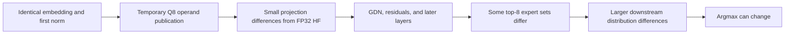

# Ornith Q8 four-ROCm accuracy diagnosis

## Authority and scope

The canonical oracle is CPU/FP32 Hugging Face reconstructed from the exact
`Ornith-1.5-35B-Q8_0.gguf` (37,802,149,280 bytes). Neither Llaminar CPU nor
llama.cpp supplies expected answers. Production weights, activation policy,
KV precision, and existing numerical thresholds were not changed in this slice.

The new typed `Ornith15MoE_35B_Q8_0_NaturalDecode` definition retains the exact
424-token natural-language prompt from the reported comparison. Its 89
teacher-forced incremental steps include the two observed disagreement
frontiers and their successors. HF owns that continuation. CPU and GPU must
consume the same history when comparing checkpoints; comparing freely generated
sequences after their first different token would confound the diagnosis.

The standard expander supplies six CPU cases and 24 four-ROCm ExpertOverlay
cases (Ordinal/Random, Static/Dynamic, MTP off/1/2/3/15/dynamic). These are
diagnostic mathematical cases, not new HTTP certification selections. Only the
two exact cells listed below have been executed in this slice.

## Completed checks

Both use the Integration production runner, the canonical campaign driver,
immutable persistent tmpfs staging, and independent authenticated HF snapshots.

| Check | Result |
|---|---|
| Complete Unit gate | 658/658 passed |
| Complete ProductionParityPreflight gate | 243/243 passed |
| CPU0, FP32 activation / FP16 KV, MTP off | Passed existing numerical and prefix gates; 58.995 s |
| Four ROCm, Dynamic/Ordinal, FP32 activation / FP16 KV, MTP depth 1 | Passed existing numerical, MTP, and prefix gates; 338.015 s |

The GPU production-path receipt certifies homogeneous captured execution,
device-owned generation state, authenticated HIP transaction tickets, and no
segmentation. Complete and partial prefix restores pass. The native grouped
MTP witness at reference step 41 has **614/614 byte-exact checkpoint rows** and
an accepted draft; this is a focused batch-invariance witness, not a claim that
every possible MTP transaction has been tested.

The GPU diagnostic time includes full per-step KV/prefix-state inspection and
two brief debugger attachments. Stack samples locate the long quiet interval in
`PrefixCacheStateProbe` / `ROCmRingKVCache::exportLogicalBlock`, not a stalled
maintenance collective. These elapsed times are not inference benchmarks.

## Numerical observations against HF

| Metric | CPU | Four ROCm |
|---|---:|---:|
| Prefill logit cosine | 0.999916 | 0.999888 |
| Prefill KL | 0.000193598 | approximately 0.0008 |
| Decode top-1 agreement | 87/89 | 88/89 |
| Minimum decode logit cosine | 0.996039 | 0.996519 |
| Maximum decode KL | 0.0797307 | 0.0599235 |

Passing the existing numerical gates **does not establish exact token equality**.
The decode gate accepts cosine **or** KL and checks aggregate cosine and
reference-top-token inclusion in the native top-K. Stage CSVs also retain
individual failing rows even when a layer/whole-cell aggregate passes. Do not
describe this run as zero drift or use its green status to rebaseline tokens.

At generated token 38 (decode CSV step 36), HF prefers token 279 (` the`) over
660 (` all`) by 0.322479 logits. ROCm chooses 279; CPU chooses 660. The separate
384-token Llaminar CPU serial/MTP-1 comparison is identical throughout, so CPU
MTP is not necessary to produce that disagreement.

At generated token 88 (decode CSV step 86), the independent HF logits are
20.609089 for token 41173 (` Pref`) and 20.606703 for 94533 (` Ordinary`): a
margin of only **0.002386**. ROCm gives them 20.361526 and 20.641840 and chooses
94533. CPU also chooses 94533. The canonical forced serial main-model trace
already contains this difference; a grouped MTP verifier is not necessary to
produce it.

## First arithmetic divergence, isolated

Embedding and layer-0 attention-normalization inputs agree with HF. The first
projection differs because production quantizes its temporary GEMM operands to
Q8 while the independent HF calculation remains FP32. This is distinct from
GGUF weight quantization: HF loads the exact same quantized weights and
dequantizes them.

There is also an existing cross-backend policy difference for **ordinary
non-expert** projections:

- CPU `BackendNative` derives the inverse from the FP32 scale and subsequently
  stores that scale as FP16 (`tensors/SIMDHelpers.h`).
- GPU derives Q8 values using the already FP16-rounded canonical scale
  (`DeviceQ8ActivationNumericalContract.h`).
- CPU expert projections already select `GPUAlignedExpert`; this diagnosis
  does not establish a new movable-expert weight-format or migration defect.

Reconstructing layer-0 QKV with its exported input and exact GGUF weights at
token 38 gives:

| Reconstruction compared with the live output | Relative L2 |
|---|---:|
| CPU native Q8 publication vs CPU output | 1.66e-7 |
| GPU Q8 publication vs ROCm output | 1.36e-7 |
| CPU Q8 publication vs ROCm output | 6.96e-4 |
| FP32 input matmul vs CPU output | 2.37e-3 |
| FP32 input matmul vs ROCm output | 2.38e-3 |

The same reconstruction holds for the first GDN gate projection. For the CPU
GDN output projection, native Q8 publication reconstructs the output to
3.35e-7 relative L2, versus 1.62e-2 for the FP32-input calculation. This
separates operand quantization from a broken weight layout at those stages;
the reconstruction is diagnostic evidence, **not a substitute HF oracle**.

For token 38 the first changed expert set is layer 21 on CPU and layer 14 on
ROCm; token 88 first changes at layer 3 on both. This is consistent with small
upstream arithmetic differences being amplified by sparse top-K selection.
It does not, by itself, prove that every downstream difference is harmless.

## Evidence and remaining work

Untracked local evidence:

- `parity-results/ornith-q8-accuracy-prerequisites-20260919/prerequisites.json`
- `parity-results/ornith-q8-cpu-cpu0_actfp32_kvfp16_mtpoff-20260919.json`
- `parity-results/ornith-q8-rocm-dynamic_ordinal_actfp32_kvfp16_mtpdepth1-20260919.json`
- The reports name their immutable artifact directories and all numerical,
  prefix, production-path, and MTP CSVs.
- Scratch arithmetic reconstruction and additional 384-token controls live in
  `/tmp/ornith-4rocm-bench.oSsZkW/`; these are local evidence, not source assets.

No production numerical fix has been installed. Exact cross-backend token
equality would require auditing the complete ordinary projection arithmetic
contract, not selecting CPU or GPU as a new oracle or changing HF to mimic a
backend. Exact HF argmax agreement is additionally stronger than the current
quantized numerical gates, especially at nearly tied logits. Do not silently
claim one obligation from evidence for the other.

The optional broad snapshot export also exposed unresolved namespace handling
for `PREFILL_CHUNK_0_*` and packed `MTP_SCALAR_CONDITION_*` checkpoints. Their
ordinary semantic counterparts were available and compared successfully, but
these logged diagnostic errors are not a clean all-checkpoint result. A parser
fix needs a focused namespace/shard-layout regression in preflight; it must not
substitute one participant's shard for a missing combined tensor.

The remaining generated cells, longer GPU MTP/serial equivalence, those
namespace defects, and any numerical-policy changes are **not certified** by
this two-cell slice. No source or corpus commit was made.
