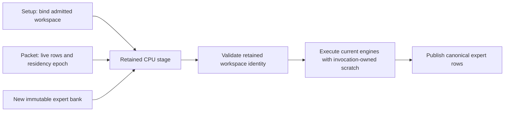
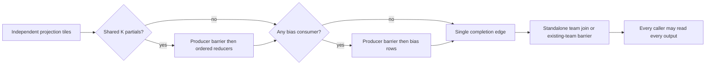
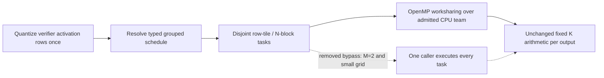
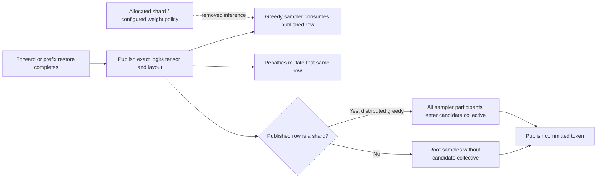

# Qwen3.6 MoE: dual-socket dynamic-MTP decode

## Objective and baseline

The requested target was **50 generated tokens/s with dynamic MTP on both CPU
sockets**. On September 25 the user accepted the approximately 42 tok/s result
as good enough and asked to wrap up this tuning slice. The 50 tok/s target was
not achieved; further performance exploration is stopped, not certified as
complete. The preceding prefill checkpoint, `047bddf22`, passes 668 Unit
and 369 ProductionTestPreflight tests. That functional evidence does not
establish this new performance target.

The first unprofiled Release measurement is **32.71 tok/s** with dynamic
MTP, versus **20.22 tok/s** with MTP off. The three dynamic measurements are
32.53, 32.73 and 32.86 tok/s. Dynamic depth reaches 4 within its default
1–15 range; each measured request accepts 195 of 224 drafts (87.05%) and
uses 60 grouped verifier forwards for 256 output tokens. This is a repetitive
benchmark prompt, not a natural-language acceptance or accuracy certificate.

## Matched workload

- Model: `Qwen3.6-35B-A3B-UD-IQ3_S.gguf`, from the persistent model tmpfs.
- Release AVX512; two Xeon Gold 6238R sockets, two MPI ranks, 28 physical-core
  workers per rank. Normal auto-planning, MPI bootstrap and NUMA binding.
- Only placement constraints: `--only-backends cpu --auto-device-counts cpu=2`.
- Context 8192; 512 repetitions of ` test` (512 prompt tokens); 256 output
  tokens; temperature 0, seed 42; one warmup and three measured requests.
- Production weights, FP32 activations, default KV precision, prefix cache
  and dynamic expert maintenance unchanged. No profiler in timing runs.
- Dynamic measurements complete 10, 20 and 20 within-tier expert moves.

Reproduce the final default-dynamic lane from a Release AVX512 build:

```bash
./build_v2_release/llaminar2 benchmark \
  -m /mnt/llaminar-production-parity/cache/models/Qwen3.6-35B-A3B-UD-IQ3_S.gguf \
  --only-backends cpu --auto-device-counts cpu=2 -c 8192 \
  --prompt "$(printf ' test%.0s' {1..512})" \
  -n 256 --temperature 0 --seed 42 --mtp --mtp-depth-policy dynamic \
  --benchmark-json-output /tmp/qwen36-cpu2-dynamic.json
```

This intentionally uses the production auto planner and defaults, including
the CPU vocabulary-sharded head and 28 physical workers per socket. Clear
profiling and ISA/thread diagnostic overrides before timing. For the matched
prefill checkpoint, omit the MTP options and use `-n 16`; do not compare that
short-output checkpoint with the different residency history of the 256-token
dynamic run. The repetitive prompt is a stable performance fixture, not an
application-quality or long-context certificate.

Local diagnostic artifacts are under `/tmp/llaminar-cpu-mtp.FtIQja/`; they
are not committed corpus payloads or durable certification artifacts.

## September 25: retain CPU expert workspace through replay

The `5d12abcc8` checkpoint is committed locally. Subsequent clean fixed-depth
controls on that binary give 28.72/36.45/42.24/39.62/34.60 tok/s at depths
1/2/3/4/5. Depths 1–3 accept every draft on this repetitive prompt; depths 4/5
accept 84.91%/77.25%. All measured streams match the dynamic control. Dynamic
remains adaptive over 1–15; these controls are not sufficient evidence to
install a CPU policy for other workloads.

Reducing the physical worker budget is not profitable: 14/20/28 workers per
socket give 32.70/38.10/39.14 tok/s in matched dynamic runs. Prepared anonymous
memory is local to each rank's socket; the observed remote anonymous residency
is below 0.3 MiB. No worker/default-placement override is retained.

The endpoint profile identifies a redundant setup operation: every CPU packet
calls `MoEExpertComputeStage::bindWorkspace()`, which walks the full prepared
gate/up/down inventory and performs RTTI/virtual dispatch. Production CPU
engines have invocation-owned scratch, so those per-engine binds store nothing.
The retained stage already receives the correct workspace during graph setup.
CPU replay now checks that retained binding instead, just as retained GPU
replay does. Newly installed expert engines receive the same stage workspace
as an explicit invocation argument; movement does not rebind scratch.



Across 7,872 endpoint calls in three measured requests, the separately profiled
`stage_setup_and_transfers` total falls from **648.42 ms to 42.43 ms** (93.5%).
Total endpoint service falls from 4.546 s to 3.744 s, but its nested compute
time also varies, so the entire difference must not be attributed to binding.
These instrumented runs are attribution evidence, not throughput certificates.

Two clean dynamic-MTP runs measure **39.93** and **40.84 tok/s**. The latter's
three requests are 40.77/40.83/40.93 tok/s. All per-request token streams match
the checkpoint control; acceptance remains 87.05%, final depth 4, with no
profiling enabled. The exact matched MTP-off 512-prompt/16-output prefill check
is **351.04 tok/s**, versus the checkpoint's 352.93. No weight, activation,
workspace-capacity, dispatch-policy or MTP-depth-policy change is involved.
The **50 tok/s goal remains unmet**.

The focused regression fails on the previous implementation's repeated binds
and passes with retained binding. It replays 20 packets, installs a different
expert engine bank halfway through, checks the new numerical signature, and
checks both zero replay-time binds and the workspace actually supplied to
each numerical invocation. Its named integration registration,
`V2_Integration_CPUExpertWorkspaceReplay`, belongs to ProductionTestPreflight.

Post-fix validation passes **670/670 Unit tests in 75.91 s** and **99/99
CPU-tagged ProductionTestPreflight tests in 223.92 s**. That CPU projection
includes all-format CPU-to-CUDA/ROCm ticket ingress, native and forced AVX2,
and quantized plus FP16/BF16/FP32 movable experts. The two native GPU ticket
registrations also pass a separate 2/2 check in 12.74 s. The true AVX2 build
passes both the prepared-weight unit fixture and the focused workspace
preflight entry (2/2). The authenticated driver interval is complete and clean,
with zero new kernel records or driver findings. This is a focused CPU slice,
not recertification of the previously recorded unrelated GPU-only issues.

Additional grouped-kernel diagnostics retain candidate evidence without
installing an override. At eight IQ2_S experts/20 route rows, Auto/Pairwise
medians across three independent runs are 211.18/193.32 us for the complete
persistent FFN.
At four experts/20 rows, Auto is 194.69 us versus Pairwise 197.31 us and WideRows
201.30 us. WideRows deliberately rejects the eight-expert layout's two-row
members. The mixed results require canonical workload/ISA/all-format dispatch
training, not a blanket policy change. Local evidence for this entire slice is
`/tmp/llaminar-cpu-depth.Oo8oK9/`; no result payloads are committed.

## Investigation order

### Vocabulary communication and CPU greedy selection follow-up

The production row-strided MPI exchange was isolated on the same two sockets.
For 124,160 FP32 logits per rank, median exchange time is about 121 us for one
row, 478 us for two, 1,216 us for five and 4,048 us for sixteen. Retaining the
derived datatype only saves a few microseconds. It does not explain the
whole-model gap, and no transport/datatype-cache change is installed. Stage
all-gather timing also includes peer arrival; it is not pure wire time. Greedy
sampling could avoid full-logit materialization, but that requires an explicit
publication contract spanning stochastic requests and retained graph identity,
not silently skipping an existing collective.

CPU greedy sampling did a serial vocabulary scan with unconditional runner-up
tracking even when margin diagnostics were disabled. It now uses the existing
ISA-dispatched `select_topk(..., 1)` primitive. Explicit margin diagnostics keep
their previous second-best semantics. This changes no model arithmetic, head
sharding, request policy, workspace capacity or GPU sampling path.

The isolated clean scan medians, in microseconds, are:

| Vocabulary width | Previous scan | AVX512 selection | Forced AVX2 selection |
|---|---:|---:|---:|
| 124,160 | 134.67 | 8.81 | 20.96 |
| 248,320 | 270.36 | 21.48 | 42.46 |

The forced-AVX2 timing uses the AVX512 Release binary's runtime AVX2 route;
it is not mislabeled as an AVX2-only code-generation measurement. Independent
AVX2-only Integration tests prove the actual narrow build's selection and
production forward/sampling behavior. The primitive is unchanged; no new
format-specific kernel or hand-authored dispatch policy is involved.

Four independent unprofiled Release processes in control/change/change/control
order measure **41.83 / 41.27 / 42.32 / 41.57 tok/s**. Their pair means are
41.70 versus 41.80, only **0.23%**, inside the observed run-to-run spread: this
is a clear sampling microbenchmark win, **not a demonstrated whole-model
decode gain**. All twelve measured 256-token streams match, acceptance remains
87.05%, adaptive bounds remain 1–15 with final depth 4, and every process
completes 10/20/20 same-priority moves. The exact MTP-off 512-prompt/16-output
prefill check is **349.00 tok/s**, preserving the 350-class checkpoint.

Focused tests cover unaligned rows, every relevant SIMD tail, first-winner
ties, signed zero and non-finite values across scalar/AVX2/AVX512/runtime
selection. The real two-rank forward test covers full and sharded publications,
penalties and absence of an extra sampler collective. Native and true-AVX2
focused checks each pass 4/4. The new primitive checks are explicitly registered
as `V2_Integration_CPUGreedySelector` and its forced-AVX2 sibling in
ProductionTestPreflight. Performance measurements remain outside that gate.
Local artifacts are `/tmp/llaminar-cpu-gather.dEsrJl/`.

The final rebuilt sampling/workspace slice passes **670/670 Unit in 79.20 s**
and **101/101 CPU-tagged ProductionTestPreflight in 229.22 s**, with native
and true-AVX2 focused checks each passing 4/4. The authenticated driver interval
is complete and clean: zero new records and findings. These results do not
recertify the parked GPU-only issues.

A subsequent `mtp,stage_cpu,kernel` profile preserves the control token stream
but drops to 27.63 tok/s from the clean 42-class runs. Its heavier diagnostic
overhead makes it unsuitable as a timing certificate. The root's three
measured decodes attribute 7.77 s to routed expert stages, 3.08 s to shared
expert FFNs, 2.90 s to vocabulary projections, and 2.22 s to GDN projections.
These stage families are inside the 23.32 s verifier / 3.73 s draft totals;
the nested scopes must not be added together. Draft sampling takes only
27.20 ms over 672 calls. The remaining target is projection economy, not the
now-small sampling scan.

The same profile exposes a limitation of the old uniform-format expert
microbenchmark: the model's gate/up projections are predominantly execution
codebook 13 (IQ2_S), while down projections are predominantly codebook 4
(IQ4_NL/IQ4_XS family), not IQ2_S. Smaller layer groups use other formats.
The diagnostic harness now permits an independently selected down format and
records it in CSV/profiler evidence; no model weights or runtime policy change.
Do not treat earlier all-IQ2_S FFN timings as an exact model-workload match.

Reading the local GGUF tensor table, without hashing or reading weight payloads,
confirms 39/41 gate/up blocks are IQ2_S; one is IQ3_S and one Q2_K. Down is
IQ4_XS in 37 blocks, Q6_K in three and Q4_K in one. The mixed-format functional
proof cycles all 21 registry formats through every projection role, unequal
M, three worker budgets and nested workshares. Native/forced-AVX2 focused gates
pass 6/6 and the true-AVX2 build passes 3/3. Both ISA registrations are explicit
ProductionTestPreflight entries, not performance thresholds.

An unsigned-biased lookup-table candidate removed repeated integer XOR work
from IQ2_S/IQ2_XS/IQ1_M AVX512 dots without changing arithmetic or packing.
All 11 affected functional groups passed, including the independent scalar
ordered-partition oracle. However, three fresh interleaved mixed-format runs
at eight experts / twenty route rows measured complete-FFN medians of
**146.42 us control versus 146.15 us candidate**: no meaningful win. Other
layouts were inconsistent too. The candidate was removed, including its extra
read-only tables. There is no new production kernel or dispatch-policy change.
Artifacts are `/tmp/llaminar-cpu-grid.O3Fuo3/`; only the improved harness,
functional coverage and this evidence summary are retained in the worktree.

After removing the candidate and rebuilding the complete gate dependencies,
the final source passes **670/670 Unit in 76.44 s** and **103/103 CPU-tagged
ProductionTestPreflight in 226.66 s**. The additional two preflight entries
are the mixed-format expert-transaction proofs. The authenticated driver
interval is complete and clean, with zero new records or findings.

### Current depth and ISA controls

On that final source, a fresh unprofiled fixed-depth-3 process measures
**44.20 tok/s** with 100% draft acceptance. The adjacent default-dynamic
process measures **41.59 tok/s**, still ending at depth 4 with 87.05%
acceptance. All generated token IDs agree. The roughly 6.3% fixed-depth lead
is potential controller headroom on this repetitive prompt, not evidence for
a universal depth cap or a measured 50 tok/s implementation. The generated
depth table currently contains GPU rules only; extending it for CPU requires
the canonical multi-prompt training and holdout workflow.

Forcing runtime AVX2 inside the same AVX512 Release build is slower:
**31.59 tok/s**, with unchanged output tokens but 85.09% draft acceptance.
This is a runtime-ISA diagnostic, not an AVX2-only Release certificate. No ISA
override is retained. An independent eighteen-second hardware-counter interval
during measured requests includes both prefill and decode: page walks are
active for 0.59% of sampled cycles, while outstanding-memory stalls account
for 33.53%. It does not support rewriting allocation around huge pages, nor
does the aggregate identify one particular kernel's limiting resource.
These diagnostics are in the same artifact root's `depth/` subdirectory;
their profiler run is excluded from clean timing evidence.

A second compact-kernel candidate interleaved two independent output vectors
inside each K traversal. Its first lowering spilled accumulators in the inner
loop. Bounding activation-broadcast lifetimes removed those inner-loop spills
for the inspected IQ2_S/IQ1_M variants, while some accumulated partition
values still used stack storage at partition boundaries. All 11 focused
functional groups passed. Three interleaved control/candidate processes at
eight experts / twenty mixed-format routes measured complete-FFN medians of
172.32 versus 186.66 us, with considerable process-to-process variation.
There was no reliable win, so the entire experiment was removed. The restored
Release executable and core library are byte-identical to the preserved
control; no wider-tile policy or compiler workaround is retained.

OpenMP spin-budget controls do not support changing the worker default.
`GOMP_SPINCOUNT=1000`, `10000`, and unset measure **38.28 / 41.87 / 41.90
tok/s**, respectively. All nine measured 256-token streams are identical;
each process retains 87.05% draft acceptance and 10/20/20 completed moves.
The very short spin interval hurts this fine-grained workload.

An explicit `--threads 56` experiment uses both SMT siblings of all 28 cores
on each socket, verified through live worker affinity and CPU observations.
It measures only **21.45 tok/s**, with unchanged output tokens and 84.72%
acceptance. This is not evidence for increasing the default worker budget.
The canonical 28-physical-core team and unset spin count remain unchanged.
Artifacts are `depth/spin-*`, `depth/smt56.*`, and the captured affinity file
under the artifact root above. No timing here includes profiler collection.

### Shared-expert SwiGLU/down transaction

The shared-expert verifier still materialized a complete FP32 activation,
opened another workshare to quantize it, then opened down projection. The
routed-expert path already supplied an exact fused SwiGLU/Q8 publisher.
At the shared projection's M=5, N=2048, K=256 Q6 geometry, three fresh
alternating-path microbenchmarks give median-of-medians of **59.65 us separate
versus 34.20 us retained-team** on AVX512. Forced AVX2 gives **71.25 versus
57.79 us**. Every Q8 block and projected output byte agrees with an independent
serial-row witness. These are isolated timings, not a whole-model certificate.

The experimental unrotated, block-aligned verifier transaction reused that
publisher and kept one team alive through down projection. It borrowed only
the existing Q8 and partial banks. The caller's serial TP output geometry was
explicitly scoped onto each worker and restored afterward. Rotation and
partial-block inputs retained their distinct stored-FP32 transform contract.
There were no format, precision, arena-capacity or generated-policy changes.

The focused preflight first failed on the old full-FP32 scratch requirement,
then passed all 21 formats, both arithmetic policies, every grouped row count
from 2 through 31, three worker budgets, output tails, and caller/worker
TP-scope restoration. Native/forced-AVX2 registrations passed 2/2, and a
true-AVX2 build passed 1/1. The experimental source passed 670/670 Unit and
105/105 CPU preflight, including observational-counter checks.

Clean Release control/change/change/control runs measured **42.06 / 41.28 /
41.58 / 40.95 tok/s**. The pair means were **41.50 control versus 41.43
candidate**: no whole-model improvement. All twelve 256-token streams were
identical, profiling was disabled, acceptance stayed 87.05%, the dynamic range
stayed 1–15 with final depth 4, and each process completed 10/20/20 moves.
The candidate's matched MTP-off prefill was 346.70 tok/s, with per-request
measurements of 356.47/353.02/331.69. Do not compare its longer dynamic-prefill
history directly with the short-output prefill checkpoint.

Separate native/forced-AVX2 profiles of only the retained-team Q6 projection
recorded zero lost samples, 0.36/0.65 IPC and 0.05%/0.04% last-level cache
reference misses. Native cycle samples were predominantly OpenMP waits and
Q6 dot work; this does not identify that wait share as removable wall latency.
The driver interval completed cleanly with zero new records or findings.

Because the production economy gate showed no benefit, the candidate, its
temporary registration/fixture and its candidate-only microbenchmark were
removed. The generic prepared-workspace reuse, SIMD greedy sampling, and
mixed-format expert regressions remain. The restored Release executable and
core library are byte-identical to the preserved control. Final rebuilt gates
pass **670/670 Unit in 75.38 s**, **103/103 CPU-tagged
ProductionTestPreflight in 225.88 s**, and **6/6 focused true-AVX2 checks in
3.54 s**. The two candidate-only preflight entries were removed with their
implementation, explaining the return from 105 to 103 entries. The final
driver interval is complete and clean, with zero new records or findings.
No new dispatch or depth policy is installed. Raw evidence remains local
under the artifact root above as `wrap-*` and `shared-*`; no benchmark,
profiler, build, or test process is left running. This does not renew the full
cross-backend or image certificate. Further tuning is stopped at the user's
request, and the 50 tok/s objective remains unachieved.

### Future tuning sequence (not running in this slice)

1. Fixed-depth controls and rank-specific stage attribution are now available.
   Keep the default dynamic range intact until multi-prompt/holdout evidence
   supports a generated CPU depth policy.
2. Target the measured projection costs with the mixed-format FFN harness;
   preserve serial-row byte equivalence,
   and validate AVX2 and AVX512 behavior for affected formats/geometries.
3. Repeat clean production timing and verify longer natural-language/code
   output streams. Functional regressions belong in ProductionTestPreflight;
   performance thresholds do not.

The 50 tok/s target is **not achieved**. No change to production decode or
dynamic-depth-controller policy is implied by the initial baseline; subsequent
worker and terminal-head changes are recorded below.

## Current expert-publication investigation

### Full-model instruction profile and rejected compact-kernel candidates

The next evidence set is `/tmp/llaminar-cpu-verifier.SYzMNo/`. It preserves
the original Release benchmark executable and matching core DSO for paired
measurements. A hot 8-expert/20-route FFN scales from 2,946.73 us with one
physical worker to 534.93/284.65/200.27 us with 7/14/28 workers. Its isolated
instruction profile spends roughly two-thirds of sampled cycles in compact
IQ2_S projections. A separate six-event counter run reports 1.27 IPC and
0.30% last-level-cache reference misses; these diagnostic runs are not timing
labels.

Two arithmetic-preserving candidates were rejected and removed. Hoisting the
immutable layout accessors shrank the ordered two-row function from 6,614 to
3,608 bytes, but the aligned FFN median was essentially unchanged
(198.16 to 197.77 us) and the ordinary CPU variant slowed. Collapsing exactly
one-block partitions through the existing contiguous kernel also preserved
bytes but did not improve timing (202.51 to 206.00 us aligned medians). Neither
candidate is installed. The scalar-reference regression was expanded to
M=1/2/3/4 and K=256/512/768/2048, including one-block, multi-block and empty
tail partitions. Its surrounding five native/forced-AVX2 registrations and
three AVX2-only registrations passed; final-source gates must be refreshed
after any further kernel changes.

A production benchmark profile starts only after model preparation and
warmup, then samples the measured request interval on CPUs 0-55 for twenty
seconds. It records 190,704 samples with zero loss, but that CPU list omits
the SMT siblings permitted by `OMP_PLACES=cores`. The subsequent all-logical-
CPU userspace profile is the better aggregate: 103,303 samples with zero loss;
Q6 serial/two-row/four-row projections account for 8.73/6.11/5.81% of sampled
user cycles. The hottest serial instructions are payload and high-bit-plane
loads. OpenMP worker waits account for roughly half of sampled user cycles;
stack inspection separates idle pool workers from barriers inside GDN, FFN
and collectives. Neither category is by itself removable wall-clock overhead.
The profiled throughput is not a canonical speed measurement.

Explicit high-bit-plane prefetch improves the isolated vocabulary-head
measurement by roughly 5%, but slows the clean production dynamic benchmark
from **38.81 to 38.09 tok/s**. All three request streams, acceptance (87.05%)
and final depth (4 within [1,15]) remain unchanged. The candidate is removed.
Similarly, distributing GDN preprocessing by token and head instead of token
alone preserves serial-row bytes but produces no material microbenchmark win:
the eight-head M=5 case changes from 78.22 to 77.66 us, while M=2 and M=4
slightly worsen. That scheduling experiment is also removed. These rejected
candidates do not change the 350-class prefill baseline or meet the 50 tok/s
dynamic-decode target. A named-register serial Q6 tile is also rejected: its
accumulators remain in registers, but its full-model result is 38.42 tok/s,
with unchanged token streams. It is not installed.

### Expert-input publication worksharing

The next isolated harness calls the actual transported expert-major public
entrypoint, including its runtime worksharing decision. The previous threshold
required 64 KiB of input **per useful worker** before opening the team. That
charged the shared launch overhead repeatedly and kept medium verifier route
batches serial. Paired 28-worker AVX512 runs, with identical 2048-wide inputs,
measure median-of-medians of 41.98 → 11.83 us for twenty rows and 135.79 →
20.72 us for sixty-four rows. Eight rows improve from 16.71 to 11.59 us;
five rows are faster serial (10.70 versus 13.88 us), so the installed candidate
keeps tiny publications serial and applies the existing 64 KiB threshold to
the complete active input instead. The 512-row control is unchanged at about
80 us; reserved ticket capacity never contributes to the decision.

Optional counters observe rows actually completed by each worker, with no
diagnostic map construction when collection is disabled. New Unit and explicit
AVX2/AVX512 ProductionTestPreflight entries check partial blocks, repeated and
permuted source rows, untouched destination guards, invalid-input rejection,
small team sizes, and real 14/28/31-worker budgets. The first three native /
forced-AVX2 registrations pass in 0.59s; the two AVX2-only registrations pass
in 0.15s. This Q8 publication ABI serves every quantized expert codebook;
neither weight formats nor FP32 activation precision change.

The clean production runs are **39.17 and 39.44 tok/s**, with unchanged 87.05%
draft acceptance, final depth 4 within [1,15], and PerfStats disabled. All
compared per-request token streams match. The immediately paired original
binary/core control is only 37.20 tok/s, versus 38.81 earlier; report that
spread rather than promoting the latest pair's 6% difference into a stable
speedup claim. The matched MTP-off, short-output prefill is **350.52 tok/s**,
with the same tokens as the earlier 351.84 result. This preserves the committed
350-class prefill checkpoint but does not meet the 50 tok/s decode target.

After the disabled diagnostic maps are guarded, the final entrypoint's
AVX512 1/7/14/28-worker medians are 39.55/11.74/9.54/9.96 us. Forced AVX2
measures 40.48/11.66/9.59/9.97 us, and the AVX2-only binary measures 9.65 us
at 28 workers. The separate 50,000-invocation CPU profile records 10,634 samples
without loss. Quantization accounts for 18.82% of sampled user cycles; the
rest is largely team/barrier activity. Those aggregate cycle shares are not a
direct estimate of removable wall latency, and profiled timings are not used
as canonical speed labels.

The refreshed complete Unit gate passes **670/670 in 76.60s**. The four
AVX2-only numerical registrations (compact formats, one-/multi-block expert
arithmetic and explicit rounding) pass in 2.84s. The broader CPU-tagged
production preflight passes **96/96 in 223.82s**, including mixed GPU/CPU expert
execution. Its fresh kernel-log cursor reports zero new records and zero
driver findings. This is not the complete cross-backend preflight; earlier
GPU-only driver/lifecycle findings remain open.

Evidence: `q8-workshare-*`, `q8-final-*`, `q8-team-budget-*`, and the separate
`TransportedExpertMajor` performance case under
`/tmp/llaminar-cpu-verifier.SYzMNo/`.

### Rejected movement and initial-depth overrides

The same clean 512/256 Release workload was measured with wider movement
budgets, without changing placement or numerical policy. Raising transfer
slots to 32 gives **39.20 tok/s**, with 16/32/32 completed moves. Raising the
command budget as well (`--moe-dynamic-max-plan-entries-per-wave 64`) permits
32 swap cycles in a wave and completes 64/112/30 moves, but gives only
**38.98 tok/s**; its second prefill drops to 291.16 tok/s. More movement is
real, not hidden by disabled diagnostics, but it is not profitable here.
Both settings are rejected as default changes.

Starting adaptive MTP at three drafts instead of the normal initial depth,
while retaining the full 1–15 range, also gives **38.98 tok/s**. It finishes
at depth 4 and accepts 84.48% of drafts, versus the default's 87.05%.
All per-request output streams match the default run byte-for-byte. This
short repetitive prompt does not support changing the global initial-depth
policy. Evidence: `q8-team-budget-slots32*` and
`q8-team-budget-initial3.*` in the same local evidence directory.

### Fused projection completion audit

The layer-wide full-K, local ordered-tree and shared-partial schedules each
ran a separate bias-row workshare even when every descriptor's bias was null.
Their final implicit workshare barrier also duplicated a standalone team's
join. The candidate consolidates the three bias implementations and makes
only the actual bias consumer require an additional producer edge:



The required K producer/reducer barrier remains. The common completion owner
is `OMP_WORKSHARE_REGION_SYNC`; empty bias passes disappear, and no output
arithmetic, dispatch selection, buffer capacity or codebook changes. A new
model-free AVX2/AVX512 preflight fixture checks all quantized formats, mixed
biased/unbiased members, padded tails and immediate reads by every member of
an existing OpenMP team. Both registrations pass, and all 17 affected
native/forced-AVX2 projection groups pass in 45.55s. The true AVX2-only build
also passes its completion, worker-ownership and disabled-allocation gates
(3/3). Both runtime ISA completion registrations then pass **20/20 fresh
processes each** in 41.79s. These are functional gates, not performance thresholds.

Initial isolated 28-worker expert-FFN medians change only **202.96 to
200.84 us**. The first clean Release A/B is **38.88 to 39.33 tok/s** with
identical per-request token streams. A repeat after removing the rejected
GDN experiment measures **39.59 tok/s** (39.55/39.59/39.62), while the exact
matched MTP-off short-output prefill reaches **352.93 tok/s**. Draft acceptance
remains 87.05%, final depth 4, and completed movements remain 10/20/20. Every
compared request stream matches, and PerfStats is disabled. These are small
improvements, not evidence that the 50 tok/s target has been met. The rebuilt
complete Unit gate passes **670/670 in 76.53s**, and the complete CPU-tagged
ProductionTestPreflight group passes **98/98 in 224.14s**. Its authenticated
driver interval is complete and clean: zero new records or findings. This is
not a new full cross-backend certificate; the previously recorded GPU-only
issues remain open. Local artifacts are under
`/tmp/llaminar-cpu-fused-barrier.dcR25a/`.

### Rejected normal-head GDN column partition

A separate experiment split ordinary GDN value heads into power-of-two
column intervals to occupy otherwise idle workers: eight local 128-value
heads become 32 tasks on 28 workers, with two AVX512 vectors per task instead
of eight. The existing pipelined recurrence and snapshot ownership remain
unchanged, and every tested output/state snapshot remains byte-exact against
serial recurrence. Nevertheless M=5 slows from a three-run median of
**75.30 us to 155.23 us**; M=2/3/4 also become slower than serial rows. The
performance harness rejects the candidate before any whole-model run. This
reinforces that idle worker counts alone are not evidence of removable wall
time. The entire GDN experiment is removed and the file restored exactly to
its pre-experiment content. Evidence: `/tmp/llaminar-cpu-gdn-tiles.d9cArW/`.

The more detailed, separately instrumented decode run records 7,198 verifier
expert transactions on rank 0. Their grouped FFN work totals 5,491.8 ms and
transported expert-major Q8 input publication totals 1,194.0 ms; schedule and
bundle validation is only 55.5 ms. This profile drops observed decode to
27.63 tok/s and is attribution evidence, not a canonical performance result.
Frequent observed `(active experts, local route rows)` pairs include `(4,20)`,
`(8,20)` and `(7,21)`, so the older `(14,16)` microbenchmark is not the whole
production geometry. The hot-weight expert microbench still scales from
4,051 us at one worker to 221 us at 28 workers under GPU-aligned arithmetic;
there is no evidence for reducing the physical-core worker budget.

The scalar cross-device reciprocal retained each of its 15 Newton intermediates
with a volatile memory store/load. On x86 SSE that storage is unnecessary:
the scalar instruction has already rounded to binary32, and an opaque XMM
input/output dependency prevents contraction just as the existing AVX2/AVX512
expert contribution helpers do. The change retains every arithmetic edge and
the same five Newton steps; GPU device code and non-x86 storage semantics are
unchanged.

Three paired, unprofiled runs of the isolated 20-row, 2048-wide Q8 publication
on physical CPU 10 give median-of-medians of 85.90 → 58.64 us for AVX512 and
87.17 → 61.12 us for AVX2 (31.7% and 29.9% less time). Separate 30,000-invocation
AVX512 hardware-counter runs show 8.977 → 6.148 billion cycles, 9.507 → 8.309
billion instructions and 1.06 → 1.35 IPC. Disassembly confirms the 15-step
normal reciprocal tree has no stack store/reload; cold feature-discovery paths
still preserve live scalar registers around their runtime calls.

The independent memory-rounded oracle passes on true AVX2 and AVX512 builds:
all 31,745 non-negative finite/infinite binary16 scale words, 262,144 binary32
exponent/mantissa probes, a multiply/add contraction counterexample and every
Q8 block tail at five magnitudes. `V2_Integration_CPUExplicitRoundingContract`
is registered explicitly in ProductionTestPreflight, and the same fast proof
is in Unit. `V2_Perf_CPUExpertQ8Publication` is separate performance-only
tooling.

Two unprofiled, normally bootstrapped Release runs improve default dynamic
decode to **38.02 / 38.29 tok/s**, versus 36.89 immediately before this change
(+3.1% / +3.8%). All nine measured 256-token streams are identical across the
old and two new runs. Each request still accepts 195/224 drafts, performs 60
verifier forwards, and completes 10/20/20 moves across the three requests.
Physical transfer bytes vary with measured economics; no movement is disabled.
The matched MTP-off/16-output prefill check is **348.14 tok/s**, versus 348.50
before the helper change, with identical tokens. It remains in the committed
350-class noise band; the 327 tok/s dynamic-MTP prefills are a different
request history and must not be compared as if they were that checkpoint.
The rebuilt complete Unit gate passes **669/669 in 76.06 seconds**. The full
production-preflight gate finishes **374/375 in 1123.12 seconds**, with one
unresolved failure: `V2_Integration_PipelineDomainGeneration_ROCm2_CUDA2_Ordinary` times out
after 120 seconds. At 23:11:11 UTC its first capture-boundary allreduce on
ROCm:1 reports HIP `invalid configuration argument`; cancellation is published,
but cleanup does not finish before the test timeout. This happens during
materialization before inference, not as a token/numerical mismatch. The same
cell passed in 4.64 seconds in `main-sampling-preflight-gate.log`; a relation
to this source change has not been established. Twenty isolated repetitions
with RCCL/collective diagnostics pass, followed by the preceding
`PipelineMTPStateOwnership_ROCm` cell and another twenty repetitions under the
original logging settings. These passes do **not** fix or erase the aggregate
failure: its initial setup error and secondary failed-cleanup path remain
unexplained. Do not call the full gate green or expand its timeout to hide the
failure. The active 50 tok/s decode target remains unmet.

Failure localization: `LocalTPContext::graphCaptureBoundaryOnStream` has
successfully zeroed its INT32 device fence before
`RCCLCoordinator::allreduceSingleDeviceOnStream` fails. CUDA's partner domain
finishes materialization, while ROCm publishes cancellation and defers its
communicator abort. Capture preparation and cancellation/cleanup are separate
questions; no generated token is implicated. The coordinators have private
per-collective thread-local last-device caches worth auditing independently,
but the fence's preceding `hipMemsetAsyncDevice` explicitly selects the right
device, so those caches are not an established explanation for this incident.

Evidence stems in the local directory: `expert-detail-*`, `expert-baseline-t*`,
`q8-publication-paired.log`, `q8-publication-*.perf-stat` and
`q8-publication-*.asm`, `register-rounding-dynamic*` and
`register-rounding-prefill.*`. The focused lifecycle evidence is
`pipeline-rocm-cuda-ordinary-repeat20.log`, `pipeline-predecessor-repeat.log`
and `pipeline-rocm-cuda-ordinary-standard-repeat20.log`.

### Next kernel experiments (not installed policy)

The rebuilt isolated Q6_K head diagnostic uses M=5, N=124160, K=2048 and
28 physical cores on socket 0. A second 64-column projection permits the
existing bundle/standalone comparison without duplicating a whole vocabulary
head. All candidates are byte-identical to the independent serial rows.
The 12-sample means are 6070.93 us for Auto's two standalone projections,
6056.48 us for Pairwise and 5240.18 us for WideRows. That is a 13.7% head-local
lead, not an end-to-end gain or permission to install a shape-specific override.
Files: `q6-head-current-ts-{Auto,Pairwise,WideRows}.log`.

The 8-expert/20-route IQ2_S microgeometry accepts Auto and Pairwise. Forcing
WideRows rejects the two-row members of this sparse bundle; this is an
unsupported diagnostic candidate, not a new production failure. The first
Auto/Pairwise timing pair is too noisy to select a policy.

Before profiling that expert transaction, the performance harness was repaired:
profile mode now requires one format, rejects timing CSV output and returns
after only the selected policy/phase. Previously it also executed the other
policy and the ordinary timing loops, contaminating whole-process samples.
This changes profiling tooling only, not production inference or dispatch.

### Exact half-scale lookup and direct byte packing

The quantized expert scale is already persisted as binary16; activations remain
FP32. Its normalized mantissa has only 1024 possibilities. The next candidate
uses a compile-time 4 KiB table of the existing five-Newton-step results and
integer exponent installation, including half subnormals. It changes neither
the reciprocal bits nor any weight format. ELF inspection places the table in
read-only `.rodata`, with no extra BSS, mutable cache, allocation or GPU memory.
Direct AVX2/AVX512 narrowing also removes the intermediate 32-element INT32
array; byte-lane permutations and integer summation remain exact.

The six focused tests pass in true AVX2 and AVX512 builds, including every one
of the 65536 half words (valid scales and canonical invalid results), the
independent FP32 probes, every block tail and extremal/per-lane packing cases.
The Unit and ProductionTestPreflight registrations both pass. Release and all
integration gate targets rebuild successfully. The complete Unit gate passes
**669/669 in 76.17 seconds**. The next full preflight completes **375/375 test
assertions in 1006.90 seconds**, including the earlier mixed-GPU cell in
4.95 seconds. That does not explain its previous intermittent failure. Five
fresh AMDGPU IH-ring-overflow warnings were also observed during this gate;
the assertion pass is therefore not a clean driver-health certificate.

Three paired micro-runs give median-of-medians of **58.59 → 42.22 us** on
AVX512 and **61.06 → 36.72 us** on AVX2, compared with the preceding
register-rounded helper. Separate 30,000-invocation counters improve from
6.166b to 4.652b cycles / 1.35 to 1.59 IPC (AVX512), and from 6.799b to 4.306b
cycles / 1.32 to 1.60 IPC (AVX2). This is isolated publication economy, not an
equivalent whole-model speedup.
Evidence: `half-lookup-*`, `half-packed-*` in the local evidence directory.

Three normally bootstrapped, unprofiled Release runs measure dynamic decode at
**37.51, 38.99 and 38.43 tok/s**. Their median is only marginally above the
preceding 38.02/38.29 results; the between-process spread is larger than that
difference, so this does not establish an end-to-end decode win. All twelve
compared 256-token streams match, with unchanged 195/224 draft acceptance,
60 verifier forwards per request and 10/20/20 completed moves. The matched
MTP-off/16-output prefill check reaches **351.84 tok/s**, with all six compared
short streams identical. This preserves the committed 350-class prefill
result; the 330–336 tok/s prefills inside the longer dynamic-MTP runs have
different request/movement history and are not that regression comparison.
Evidence: `half-packed-dynamic{,-repeat,-third}.*`, `half-packed-prefill.*`,
`half-packed-unit-gate.log` and `half-packed-preflight-gate.log`.

Driver-warning localization uses the existing HTTP driver's monotonic kernel
cursor, not wall-clock guesses or cleared logs. A guarded repeat of
`PlanningNativeLocalTP_ROCm` is clean. `PlanningMPIExpertSample_ROCm` passes
assertions but emits four fresh IH overflows. Splitting its five GTests narrows
the warning to `ROCm_StreamingCollection` and
`ROCm_BoundedRequestCostPreparation`; expert payload, communication-only and
source-backed collection are clean in that split run. Three separate
single-device bandwidth and FP32 arithmetic repetitions are also clean.
All-device source-free probes are being isolated next. No causal link to the
CPU arithmetic change or the earlier RCCL setup failure has been established.
Evidence: `planning-mpi-sample-driver-*`, `split-Planning*`,
`streaming-alone-*` and `arithmetic-alone-*`.

The separately selectable all-device streaming and arithmetic probes are each
clean in their first guarded run; their original combined sequence reproduces
the warnings. Both isolated probes now have CUDA/ROCm GTests in the existing
MPI planning preflight registrations. The same unresolved planner warning is
already documented in committed prefill checkpoint `047bddf22`; it is not a
newly established regression from this CPU tuning slice. Preserve this sequence
dependency for further driver investigation rather than altering GPU execution
without an identified cause.

The next setup-cost lead is narrowly localized, not a diagnosed scheduling
bug. Every worker entering the persistent expert FFN rebuilds both its fused
descriptor array and the same numerical/schedule plan. The existing Release
expert harness disassembly shows a 32 KiB descriptor clear and a 61,472-byte
plan clear, followed by default initialization of all 512 plan entries, for
each gate/up or down invocation. The isolated profile attributes 4.39% of CPU
cycles to memset and 2.45% to planning. These are store counts and sampled CPU
shares, not measured off-chip bandwidth or promised wall-time savings. A
candidate should first prepare immutable descriptors once per transaction;
sharing a schedule must still use the actual OpenMP team width, preserve its
ordered K tree and avoid paying another barrier merely to reduce bookkeeping.
Do not install a new cache, uninitialized-storage convention or model-specific
dispatch override on the strength of this observation alone.

### Shared immutable expert descriptors (rejected experiment)

A caller-prepared descriptor bundle passed all-format functional coverage on
native AVX512, forced AVX2 and an AVX2-only build. It did not provide an
economical win. The first implementation copied its entire 32 KiB array into
an optional result; a second in-place implementation removed that copy (verified
in assembly) but still measured 202.83/202.01/210.49 us for the GPU-aligned
expert FFN, versus 201.09/203.70/200.21 us in paired original runs. The candidate
has been removed rather than retaining more machinery without a speedup.

The all-format FFN regression remains: 21 quantized formats, unequal member
sizes, M=2/3/15/31, 1/3/7 workers, nested workshares, malformed-down rejection
before gate writes, and every intermediate's serial-row bytes. Preparation
counters specific to the rejected implementation have been removed.

### Disabled diagnostic allocation (functional defect)

Assembly inspection exposed unconditional diagnostic tag-map construction in
the batched projection and complete-FFN wrappers. The focused allocation
interposer confirms **25 C++ allocations per warmed FFN invocation** in each of
252 all-format/worker/row combinations with kernel collection disabled. The
red evidence is `disabled-diagnostics-red-confirmed.log` in the run directory.
The collector's internal guard is too late: callers have already constructed
its string/map arguments. The fix checks the existing collection policy before
constructing those arguments, including the related router-Q8 wrapper.

Explicit AVX2 and AVX512 `NativeVNNIDisabledDiagnostics` preflight entries use
the same serial-byte oracles and require zero warmed C++ allocations; enabled
diagnostics and actual worker-ownership checks remain separate entries. The
interposer first proves it sees a real allocation, and the disabled case
asserts its collection policy so a misconfigured test cannot skip the audit.
All six focused entries pass: four native/forced-AVX2 registrations in 4.00s,
plus two AVX2-only-build registrations in 1.54s. Both the complete FFN and
serial/grouped router-Q8 wrappers report zero warmed C++ allocations and exact
serial bytes. No performance threshold is added to the functional gate.

Three clean paired Release micro-runs show the model-relevant GPU-aligned
expert path essentially unchanged on AVX512 (median 200.18 → 200.84 us), and
slightly better on forced AVX2 (377.80 → 375.10 us). The allocation removal is
a concrete hot-path defect fix, not a substantial throughput improvement.
The clean two-socket dynamic benchmark is **38.62 tok/s**, with 87.05% draft
acceptance, final depth 4 within [1,15], and all twelve compared before/after
256-token streams identical. Its per-request decode is 38.49/38.72/38.64.
The matched MTP-off short-output prefill is **348.79 tok/s** (355.55/353.39/337.98
per request), within the previous 348–352 aggregate range; all six compared
16-token streams match. Both JSON records confirm PerfStats disabled. These
results preserve the 350-class prefill result but do not meet the 50 tok/s
dynamic-decode target. The canonical Unit/preflight dependency targets have
been rebuilt. The full Unit gate passes **669/669 in 76.01s**; the affected CPU
integration selection passes **10 substantive entries plus its model fixture
in 57.49s**, including the all-format grouped verifier, workspace isolation,
sampling publication, exact rounding and full MoE expert paths. The separate
AVX2-only build passes its two focused entries. The final CUDA planning-probe
group also passes in 8.12s with zero new driver records. The complete current
377-entry cross-backend preflight has not been rerun for this guard-only fix;
the earlier ROCm IH warnings and unexplained mixed-GPU stall remain open and
are not converted into a clean full-suite claim by these CPU passes.

The control immediately before this candidate measures fixed-depth-3 decode
at **39.66 tok/s**, with all nine compared old/new-fixed/dynamic 256-token
streams identical. It does not improve on the earlier 40.14 fixed result and
must not be reported as a dynamic-policy gain. The subsequent default-dynamic
results for the new Release binary are recorded above.

## Fixed-depth controls and attribution

| Policy | Unprofiled decode tok/s | Draft acceptance |
|---|---:|---:|
| MTP off | 20.22 | — |
| Fixed depth 1 | 17.78 | 100% |
| Fixed depth 2 | 31.27 | 100% |
| Fixed depth 3 | 35.66 | 100% |
| Dynamic, default terminal head | 32.71 | 87.05% |
| Dynamic, explicit vocabulary-sharded terminal head | 36.57 | 87.05% |
| Fixed depth 1, vocabulary-sharded terminal head | 18.74 | 100% |

All five initial controls and both sharded-head experiments produce the same
256-token stream. At this initial-control stage sharding was a measured
placement override; the later CPU-only default is recorded below. The repeated
prompt remains an intentionally narrow workload.

A separate CPU-stage/MTP profile slows dynamic decode to 24.96 tok/s and must
not be used as a canonical score. Its root-rank transaction totals attribute
8.085 of 10.251 seconds to verification and 1.805 seconds to drafting. Within
those forwards, expert computation totals 2.827 seconds, terminal heads 1.897
seconds, and GDN recurrence 0.426 seconds. These are nested observations, not
additive independent timers. Snapshot/publication overhead is comparatively
small. Rank 1's observer labels its combined warmup/measured work `combined`;
do not compare that total directly with rank 0's measured-only decode phase.

### Two-row scheduling defect

For fixed depth 1, the `2048 x 2048`, M=2 projection takes 0.866 ms per call
in the instrumented run, versus 0.119 ms for M=5 in the dynamic run. The
resolved M=2 schedule reports 32 N-tile tasks, full-K pairwise arithmetic and
28 workers. A later `direct_small_m2` branch nevertheless executes all tasks
on the calling thread. It bypasses the already-resolved scheduling contract
for every format satisfying the same shape test.



The repair removes the redundant one-thread branch rather than adding another
size threshold. New observed-worker evidence counts tasks actually completed
by each bounded worker id. A separate, small integration binary checks all
21 source formats, tail columns, M=2/3/4/15, and several positive team sizes;
the exact Qwen Q6_K projection receives an additional case. Both AVX2 and
AVX512 entries are explicitly registered in ProductionTestPreflight. This is
a functional ownership/byte gate, not a timing threshold.

The focused Qwen test first fails on the old M=2 bypass with 28 and 31 workers,
while its other row/team combinations pass. After removing that branch, all
seven focused Integration registrations pass: worker ownership, four-row
prefill and fused verifier schedules in AVX2/AVX512, plus the all-format grouped
verifier gate (15.73 seconds total). The separate AVX2 build's new preflight
entry also passes (0.63 seconds). Clean Release throughput after the fix is
26.13 tok/s at fixed depth 1, versus 17.78 before (+47.0%), with all tokens
unchanged. Default dynamic MTP remains 32.92 tok/s; its M=3/4/5 forwards
rarely entered the removed M=2 shortcut. The explicit sharded-head repeat is
35.72 tok/s, versus 36.57 before. Report that range rather than treating a
single sharded result as a guaranteed score. The full Unit/preflight gate has
now passed for the worker fix and retained Q6 two-row candidate: 668/668 Unit
tests (76.40 seconds) and 372/372 ProductionTestPreflight tests (1005.89 seconds).

## Q6 projection experiment

A separate hardware-sampling run after the worker fix records 535,089 samples
without loss across physical cores 0–55. It uses dynamic MTP with the explicit
sharded-head override and contains the three measured prefills as well as
decode; it is not a decode-only or unprofiled throughput certificate. Native
Q6 serial, two-row and four-row primitives account for 8.32%, 6.74% and 4.82%
of aggregate cycles. OpenMP wait instructions are also prominent, but their
worker stacks do not identify a particular calling stage, so those samples
alone do not establish a barrier bug.

The Q6 two-row assembly copies eight integer dot chains around each rolled
four-group loop. Exposing those four fixed integer groups to the compiler
removes redundant loop-carried copies without changing the floating-point
K-block order, packing, or policy selection. An analogous serial-loop
experiment introduces two decoded-weight temporary spills per K block and
does not improve the vocabulary-head measurement; that part is discarded.
The retained two-row candidate has no dot/output accumulator spills. It
still reads a stack-homed broadcast constant, as the previous kernel did;
this is not a claim of zero stack traffic.

The paired 28-worker Q6 harness retains exact M=1 output bytes in all six
measured M=2/3/5, N=2048/124160, K=2048 cases. Before discarding the serial
experiment, standalone paired-projection medians at N=124160 change from
5.195 to 5.082 ms (M=2), 8.880 to 8.882 ms (M=3), and 11.713 to 11.476 ms
(M=5). The small-N timings are noisier. These are diagnostic candidate
measurements, not yet an accepted whole-model speedup.

The focused native-Q6 cross-ISA test is now explicitly registered in
ProductionTestPreflight. It compares AVX512 serial/grouped bytes with the
unchanged AVX2 implementation through all supported grouped runtime row
counts, in addition to the all-format worker/schedule regressions. The full
Unit and preflight gates subsequently passed for this combined slice, as above.

## CPU-only terminal-head default

The user authorized vocabulary-sharded terminal heads as the CPU default while
preserving CUDA/ROCm mirroring. Public authoring now carries typed `auto` intent;
the execution-plan compiler resolves the complete continuation/terminal domain
before admission. CPU expert-only followers cannot change a GPU continuation's
policy. Explicit overrides are retained, and `ResolvedRankOrchestration` copies
the same concrete policy into runtime and saved/apply configuration. Physical
weight-set and graph-layout consumers reject unresolved intent.

Focused coverage includes CPU scopes and participant counts, disabled/enabled
MTP, GPU defaults, explicit overrides, mixed expert tiers, pipeline terminal
ownership, strict configuration round trips, and matching layout/weight charges.
The new model-free entry is in ProductionTestPreflight. All five focused groups
(hardware defaults, parser, plan compiler, memory planner, and new preflight
entry) pass in 1.34 seconds. The rebuilt full Unit gate passes 668/668 tests in
76.96 seconds. The expanded ProductionTestPreflight gate also passes 373/373
tests in 1007.49 seconds, including the new terminal-head default regression.

Fresh unprofiled Release A/B/A measurements on the unchanged 512/256 workload:

| Terminal policy | Decode tok/s | Prefill tok/s |
|---|---:|---:|
| CPU automatic default (sharded) | 36.11 | 324.05 |
| Explicit mirrored control | 32.45 | 333.52 |
| CPU automatic default, repeat | 36.38 | 333.79 |

The decode gain is 11.3–12.1%. All nine measured 256-token output streams are
identical, profiling is disabled, and each run completes 10/20/20 same-priority
moves across its measured iterations. Draft acceptance remains 195/224 with
60 grouped verifier forwards. Public `plan` with no head override also writes
`VocabularySharded` into its reusable JSON document before memory admission.
Artifacts are `head-default-*` and `head-mirrored-dynamic.*` in the local root.

### Do not compare unlike prefill workloads

The committed 349.57/351.44 tok/s prefill certificate used **MTP off and 16
generated tokens**, not dynamic MTP and 256 tokens. The longer decode changes
residency history too: the earlier certificate observes 0/10/10 completed
moves, whereas the dynamic-decode workload observes 10/20/20. Before this slice,
the latter workload already measured 335.49 tok/s prefill; the new default's
repeat is 333.79, about 0.5% lower. That is not sufficient evidence of a code
regression or of unchanged performance. A rerun of the original MTP-off/16
workload subsequently exposed the sampling issue below. After its repair,
two clean Release repeats give **348.50 and 348.91 tok/s**, against the
committed 349.57/351.44. Their aggregate difference is about 0.5%, not evidence
of the previously suspected 5% prefill regression. All twelve measured token
arrays across old/new runs match, and both new runs retain 0/10/10 completed
moves with profiling off. These artifacts are `prefill-checkpoint-fixed*`.
No prefill speedup is claimed for the head-policy change.

### Matched-recheck failure: CPU sampling ignored output publication

The first original-workload recheck stalls during the warmup's initial decode
sample, before producing timings. Attached Release stacks show rank 0 in
`sampleGreedyOnDevice -> coordinateGreedyCandidate -> MPI_Allgather`, while
rank 1 is already in the post-sampling `MPI_Barrier`. The scoped benchmark MPI
job was stopped after both stacks were saved; this attempt is not a performance
sample. The preceding 668/373 gate pass did not cover this runtime ownership
combination, so it cannot certify the new default yet.

The CPU sampler infers a local row from the allocated shard and configured
terminal-head policy, even though the actual CPU forward already gathered a
complete vocabulary row. Its participation hook independently assumes CPU
always samples a gathered row. CPU penalty application repeats the same
incorrect allocation-based choice. The existing typed main-logits publication
already records the actual producer output on both CPU and GPU; those CPU
consumers should use it instead of reconstructing ownership.



A focused two-rank production-forward regression covers gathered and local
outputs, prefill/decode, greedy penalties, collective participation, and
rejection after request reset. Real MPI owns the graph's terminal all-gather;
a separate scripted candidate peer exposes an unwanted later collective
without waiting for a deadlock. On the old implementation the test samples
the poisoned retired shard, counts an extra candidate collective, and proves
the published full row never receives its penalty. CPU sampling, penalties,
and worker participation now use the already-existing typed publication.
The small standalone integration target shares extracted tiny model fixtures
with the larger graph-construction suite. The regression is explicitly in
preflight and passes **20/20 fresh two-rank runs in 40.85 seconds**. The original
Release benchmark now completes with the matched results above. A fresh
dynamic-MTP repeat gives 36.89 tok/s decode, the same 256-token streams and
195/224 draft acceptance in each measured request, with 10/20/20 completed
moves. Its prefill is 326.98 tok/s; this longer-horizon workload remains
separate from the MTP-off prefill certificate. No 50 tok/s claim is made.
The complete post-fix Unit gate passes 668/668 tests in 75.92 seconds. The
expanded ProductionTestPreflight gate passes 374/374 tests in 1007.23 seconds,
including the focused CPU sampler regression and the CUDA/ROCm suites.
A test-fixture declaration-order cleanup then makes the prepared-weight store
outlive its borrowing runner explicitly. The standalone target rebuilds and
passes another 20/20 fresh MPI runs in 41.08 seconds; production binaries are
unchanged by that fixture-only cleanup.

### Current fixed-depth control and narrower CPU profile

With the repaired sampler and automatic CPU sharded head, fixed depth 3 reaches
**40.14 tok/s** across three unprofiled requests (39.90/40.22/40.32). All three
streams match the dynamic control exactly, with 100% draft acceptance. Dynamic
at 36.89 tok/s is about 91.9% of this fixed-depth control; this does not establish
that depth 3 is optimal over other prompts. No new adaptive-depth policy is
installed from this single repetitive prompt. Fixed depth 3's prefill measures
308.71 tok/s on its own longer-decode/residency history and is not the matched
MTP-off prefill regression check above. Artifacts are `head-default-fixed3.*`.

A separate current-binary profile requests only `mtp`, `stage_cpu`, and
`stage_cpu_detail`, with one JSON export per rank. Root-rank measured decode
totals across three requests are:

| Scope | Wall time across measured decode |
|---|---:|
| MTP transactions | 22.163 s |
| Target verifier forwards (inside transactions) | 17.699 s |
| Draft forwards (inside transactions) | 3.612 s |
| Routed expert stages (inside forwards) | 5.344 s |
| Main and draft vocabulary projections | 2.852 s |
| GDN projections | 1.791 s |
| Other GEMM stages | 1.157 s |
| GDN recurrence | 1.103 s |
| Vocabulary all-gathers | 0.665 s |

These scopes are nested and must not be summed as independent expenses.
Boundary fences around the sidecar/verifier total under 9 ms; accepted-state
host publication totals 170 ms. Those boundaries are not the dominant cost.
Verification remains roughly 80% of transaction wall time, and routed expert
computation is the largest stage family. That makes grouped expert throughput
and the remaining projection costs the next measured optimization targets;
unattributed OpenMP spin samples alone are still not evidence of a barrier bug.

This diagnostic runs at 34.64 tok/s, about 6.1% below the clean dynamic control,
so its timings must not be promoted into a throughput certificate. Tokens,
acceptance, and completed movement counts remain identical, although measured
economics select somewhat different physical transfer byte counts. Rank 1's
combined warmup/measured accounting is not directly comparable with rank 0's
measured-only decode totals. Artifacts are `head-default-stage-profile*`.

### Serial Q6 tile diagnostic

The new diagnostic compares existing one-, two- and four-vector register spans
with persistent buffers and exact output-byte comparisons. All variants pass
at N=K=2048 with 1/28 workers and N=124160, K=2048 with 28 workers. The large
head averages 2.268/2.238/2.238 ms respectively: no reliable gain supports
replacing the current four-vector serial primitive. These measurements do not
install a dispatch policy or alter production arithmetic.
