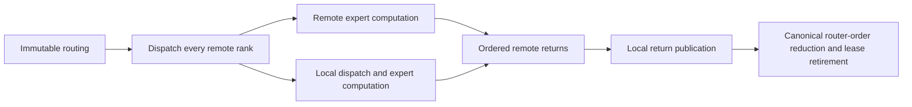

# Qwen3.6 MoE: dual-socket CPU prefill

## Current checkpoint

Release prefill is **297–299 tok/s** on the matched 512-token dual-socket
workload, with Dynamic maintenance enabled and real movement. Selective
four-row weight reuse measures **298.66** and **297.04 tok/s** in independent
runs, versus the previous 287.29 tok/s checkpoint. Both runs complete 20
expert movements and preserve all three measured output token streams.
The **350 tok/s goal remains open**; expert computation and dense projections
are the leading remaining costs. No precision, format or GPU segment-cap
change is included in this result.

The previous swap-scoring checkpoint passed **668 Unit + 364
ProductionTestPreflight = 1,032 tests**, in 777.05 seconds. The four-row
checkpoint adds two explicit preflight entries; its commit must pass the full
**668 Unit + 366 preflight** hook. This is functional prerequisite evidence,
not a driver-clean HTTP certificate: the previously reproduced MI50 IH-ring
warnings remain unresolved. The new HTTP driver-log guard fails such cells.

## Experiment

Feature branch: `feature/qwen36-moe-cpu-prefill`, based on develop
`62171c0faca6423855a75e0328440d2f2305527f`.

- Two Xeon Gold 6238R sockets, 28 physical cores per socket; 28 OpenMP workers
  per MPI rank, production socket/NUMA binding.
- Release, AVX512, all backends built. Auto planning constrained only to CPU
  and two CPU endpoints selects the two-rank, single-tier ExpertOverlay path.
- `Qwen3.6-35B-A3B-UD-IQ3_S.gguf`, read from the existing persistent model tmpfs.
- 8,192-token capacity, FP32 activations, default Q16_1 KV, MTP off. Dynamic
  residency maintenance and prefix caching retain their production defaults.
- Exact prompt: the string ` test` repeated 512 times, yielding 512 tokens.
  Greedy sampling, seed 42, 16 generated tokens, one warmup and three measured
  requests. The benchmark purges prefix reuse before each measured prefill.
- Timings below exclude profiling. Separate PerfStats, `perf` and GDB runs
  diagnose the cause; their perturbed timings are not speedup evidence.

```bash
./build_v2_release/llaminar2 benchmark \
  -m /mnt/llaminar-production-parity/cache/models/Qwen3.6-35B-A3B-UD-IQ3_S.gguf \
  --only-backends cpu --auto-device-counts cpu=2 -c 8192 \
  --prompt "$(printf ' test%.0s' {1..512})" \
  -n 16 --temperature 0 --seed 42 \
  --benchmark-json-output /tmp/qwen36-dual-cpu.json
```

The maintenance-off control adds `--moe-residency-maintenance off`; this is
only a diagnostic comparison, not the proposed production fix.

## Root cause and changes

Every public prefill called `activateOptimizationDemandAtRequestBoundary()`.
That method acquired `economy_mutex_` before checking whether activation had
already finished. Background candidate scoring holds the same mutex for its
complete derivation. GDB captured the inference thread blocked in that mutex
while the maintenance thread ran `ObservedTransactionServiceObjective::score`.
This is an actual request-admission dependency, not an inference-kernel limit.

In a separate profile, three requests took 31.83 seconds in prefill, but their
compute graphs accounted for only 12.00 seconds. The unprofiled baseline's
individual prefills deteriorated from 131 to 42 to 22 tokens/s.

The existing typed activation state now owns a nonblocking fast path. `Active`
is terminal for the authority's lifetime; an acquire read observes the histogram
bank published by its release store. An uncertified boundary likewise returns
`NotReady` without joining background planning. Only the first boundary after
certificate publication takes the lock and rechecks before activating once.


The planner also walked every routed token for every candidate swap. The new
`PreparedTransactionCost` compacts one immutable transaction into nonzero
integer expert counts before candidate search. Each candidate still supplies
its current before/after owner maps and certified prices. Positive integer
multiplication/addition gives exactly the same participant work, with explicit
overflow rejection. Each transaction retains its own participant maximum:
this does **not** replace transaction-shaped economics with window marginals.
Only one layer's prepared evidence is retained at a time.

These changes are model-, codebook-, and ISA-independent. They do not change
inference kernels, tensor formats, precision, sampling, capacity, or movement
policy. All-GPU device-owned controllers are unchanged; host-authoritative
CPU/heterogeneous maintenance uses the optimized scoring.

## Initial matched measurements

Aggregate throughput is total prompt tokens divided by total prefill time,
not an arithmetic mean of the individual throughputs.

| Implementation | Request 1 | Request 2 | Request 3 | Aggregate tok/s |
|---|---:|---:|---:|---:|
| Original Dynamic | 130.7 | 41.8 | 21.8 | 38.74 |
| Nonblocking admission only | 111.6 | 100.9 | 100.2 | 103.98 |
| Admission + prepared transaction pricing | 125.4 | 126.8 | 109.5 | 120.02 |
| Maintenance-off diagnostic control | 135.2 | 131.6 | 135.6 | 134.14 |

The combined change is a 3.10x improvement in this short repeated-request
workload. All three output streams match the original baseline exactly. The
combined run also committed two movement waves / 20 expert commands during
measurement; the gain was not obtained by disabling movement. This is not an
image certificate, a long-generation accuracy proof, or a CPU compute ceiling.

## Regression coverage and artifacts

- `ActiveDemandAdmissionDoesNotWaitForEconomyPlanner` and
  `UncertifiedDemandAdmissionDoesNotWaitForEconomyPlanner` hold the real
  planner mutex while calling the public admission API from another thread.
  Both failed on the old implementation; both pass after the fix. The wait
  bound is a deadlock watchdog, not a benchmark threshold.
- Prepared transaction scoring is compared with raw route scoring across
  1–4,096 rows, 6/32/256 experts, 1/2/3/17 participants and repeated candidate
  ownership changes. Additional cases prove transaction-boundary preservation,
  ignored padding, malformed-input rejection, and multiplication/sum overflow.
- The complete residency-authority and transaction-cost units plus the
  dependent-cycle integration regression pass.
- New production-preflight registrations:
  `V2_Integration_ExpertOverlayNonblockingDemandAdmission` and
  `V2_Integration_ExpertOverlayPreparedTransactionEconomy`.

## Admission slice validation

The complete canonical model-free gate passed: **666 Unit tests and 347
ProductionTestPreflight tests**, including all 155 host, 71 CUDA, 69 ROCm and
52 mixed/exclusive preflight tests. The three admission/certification checks
also passed 20 consecutive repeats. No performance threshold was added to
preflight.

After that gate completed, with no concurrent build or test load:

| Prompt | Maintenance | Measured prefill tok/s | Movement during measurement |
|---|---|---:|---|
| 512 tokens | Dynamic, clean repeat | 131.27 | 2 waves / 20 expert commands |
| 2,048 tokens | Dynamic | 127.96 | 11 waves / 108 expert commands; final epoch 12 |
| 2,048 tokens | Off, diagnostic control | 137.12 | None |

The clean 512-token repeat measured 138.9, 136.3 and 120.2 tokens/s individually,
giving **3.39x** the original aggregate throughput. All three generated streams
match the original short baseline. The longer Dynamic requests took 15.78,
16.27 and 15.97 seconds: the old escalating admission delay is absent. Their
generated token streams also match the same-prompt maintenance-off control.
These are **combined two-socket** numbers, not per-socket throughput.

Dynamic still trails the maintenance-off control by about 6.7% on the longer
prefill. This slice fixes the major serialization defect and reduces repeated
scoring work; it does not establish that Dynamic is now faster than Static or
that CPU inference has reached its hardware limit. Remaining work includes
profiling maintenance/compute contention, measuring one-versus-two-socket
scaling, and optimizing the dominant expert/GDN work without changing arithmetic.

A separate pinned-core pricing microbenchmark compared 4,096 candidate swaps
over 256 experts/top-8 routes. Both AVX2 and AVX512 builds produced matching
raw/prepared cost checksums. At 512 rows, raw versus prepared time per candidate
was 17.85 versus 1.54 microseconds (AVX2) and 7.33 versus 0.82 microseconds
(AVX512). These are control-plane microbenchmarks, not inference throughput or
a claim that small-row pricing improves by the same factor.

Local raw evidence is under `/tmp/llaminar-cpu-prefill.pzN2az/` (not versioned):
`baseline.json`, `static-control.json`, `admission-fixed.json`,
`prepared-fixed.json`, `final-repeat.json`, `long-dynamic.json`,
`long-static.json`, the two PerfStats rank files, captured stacks and
`admission-stress.log`. The canonical receipt is
`prerequisites/prerequisites.json` with return code zero and 1,013 tests.

Measured Release artifacts (SHA-256):

- `llaminar2`: `cc0b3a706e7a6e1b62573322ec7ddf696780b3fb740cb3b6cafddb1cfc212b26`
- `libllaminar2_core.so`: `407d07511cf91d2ec1a2fd1c370ea829931fbc61a7afcfffffe0e6b29dca73b1`

This is a local performance/correctness slice, not a new release-image or
long-generation model-accuracy certificate. Benchmark raw artifacts are not
checked into the source repository.

## Continued dual-socket tuning

The active goal is 350 tokens/s combined, not per socket. The admission
fix is insufficient: a one-socket control reached 147.94 tokens/s while the
original two-socket graph reached only 131.27. Inspection and stage timing
confirmed that the root waited for the remote socket's expert result **before**
starting its own expert computation.

The rank-batch graph now has an explicit fork/join. Independent sends precede
participant-private local work; only numerical return publication remains
ordered. No new threads, buffers, alternate transport, or reduction tree are
introduced. The real three-rank regression requires the root's local compute
stage to release its peers before they can return, making the old ordering
deadlock instead of relying on a noisy timing assertion.



Local dispatch and return now borrow the same participant-owned workspace
instead of copying through redundant local banks. Independent large host
payload rows are copied with the socket's existing OpenMP worker budget, with
a join before count publication. Decode-sized packets remain caller-local.

| Cumulative implementation | Prefill tok/s | Evidence file |
|---|---:|---|
| Nonblocking admission and compact economics | 131.27 | `final-repeat.json` |
| Remote/local expert fork/join | 160.21 | `overlap-fixed.json` |
| Local payload aliases and parallel large-row publication | 192.46 | `payload-fixed.json` |
| Occupancy-aware ordinary-prefill scheduling | 206.56 | `wave-fixed.json` |
| Linear sparse route walk and parallel dispatch payloads | 225.54 | `packing-fixed.json` |
| Parallel independent FP32 residual-normalization rows | 233.67 | `norm-fixed.json` |

These are unprofiled Release measurements of the same 512-token workload.
The generated 16-token streams match the admission-slice baseline. Dynamic
maintenance is still enabled; none of these runs changes the model format,
activation or KV precision, sampling, or worker count.

### Ordinary-prefill task occupancy

At N=2048 a column-only 64-column schedule has 32 tasks for 28 workers. Its
last wave occupies only four workers while every task processes all M rows.
The existing row-pair grid gives the same independent output tiles a balanced
ownership assignment. A device-free typed resolver selects that grid only
when at least four row pairs and the maximum per-worker load predict a 5:4
advantage; balanced waves retain column reuse. Very narrow projections retain
their existing row/chunk grid. Serial decode and grouped-verifier policy are
not changed.

The existing production trainer compared both physical schedules at N=2048
and 4096, K=2048, M=32 and 512, across all 21 source formats. Every output row
was checked byte-for-byte against independent serial decode. All 168
comparisons passed across AVX512 and a separately compiled AVX2 binary.
AVX512 speedups were 1.55–1.77x for N=2048 and 1.21–1.32x for N=4096;
AVX2 speedups across both geometries were 1.15–1.69x. Nearby balanced shapes
and small batches justify retaining their original schedules.

Separate per-candidate hardware-counter launches for Q8_0, IQ3_S and Q6_K
show essentially unchanged instruction work, rather than a numerical shortcut.
On AVX512, instructions/cycle were approximately 2.0–2.8. The change reuses
the existing two-row microkernels; no new vector accumulator or register
allocation is introduced. Profiler timings are not used as benchmark results.

New schedule units sweep positive worker budgets 1–128, tails, large dimensions,
invalid inputs and explicit overrides. The focused integration sweeps both
AVX2 and AVX512, every source format, M=1–33 plus 63/64/127/128, odd worker
budgets, partial columns, padded strides and untouched output guards. They
pass and are explicitly registered in `ProductionTestPreflight`.

### Sparse routing and row-local normalization

Host sparse dispatch previously rescanned the complete route list for every
selected row. The validated `MoEOverlayHostDispatchRows` view walks the
token-major entries once, without allocating a second route index. It rejects
malformed or out-of-order descriptors before publication. Metadata is completed
first, independent payload rows are copied in parallel, and the completed count
is published only after the join. Local and rank-batch dispatch use the same
contract. Their combined measured stage time fell from about 830 ms to 64 ms
across three profiled prefills; those perturbed timings are attribution only.

The FP32 fused residual/RMSNorm stage also processed every prefill row on one
thread. Its exact per-row primitive is now shared across the existing socket
workers for large batches, with unchanged reduction order inside each row.
Small decode batches keep their previous schedule. The focused tests compare
FP32, BF16 and FP16 outputs and residuals byte-for-byte against serial rows,
including tail widths and 32/127/512-row batches.

The 2,048-token prompt, using the production default four 512-row chunks,
reaches **216.75 tok/s** after these changes (`long-optimized.json`). Its output
streams match the same-prompt maintenance-off control. This is 1.69x the
admission slice's long-prompt Dynamic result, but still short of the target.

A separate 15-second `perf` sample over repeated production prefills recorded
62,173 samples without loss. Compact multi-scale two-row kernels accounted for
23.67% of aggregate CPU cycles and native Q6 two-row kernels for 18.59%.
OpenMP waiting accounts for a substantial further share; these aggregate-cycle
shares are not an additive critical-path wall-time breakdown. Annotated ISA
identified repeated widening/horizontal activation sums in the compact kernels
as a concrete next optimization. Existing four-row candidates were also timed:
they were not consistently faster, so the installed verifier policy was not
changed merely to favor the benchmark model.

This continued slice remains in progress. The refreshed combined gate below
covers the subsequent changes; the 1,013-test receipt above certifies the
earlier admission slice only. The 350-token/s target is not yet met.

### Compact-format decoding and exact integer corrections

The next clean 512-token result is **256.20 tok/s** (`compact-sign-fixed.json`),
with every measured 16-token output matching `final-repeat.json`. This remains
a two-socket Release measurement with Dynamic enabled, not a per-socket number.
The intervening reduction-only result was 237.65 tok/s (`compact-fixed.json`).

The compact kernels now reuse the quantizer's exact whole-block integer sum,
compute only the required half/quarter sums, fetch complete eight-byte IQ grid
entries in paired AVX512 gathers, and apply packed signs directly with byte
predicates. The source/prepared weight representations and all FP32 scaling
and accumulation expressions remain unchanged. AVX2 retains its native gather
geometry and has corresponding exact sign/sum implementations.

The exhaustive sum test includes INT8_MIN, every signed input value, each byte
position and every byte alignment. Independent lookup/sign tests visit every
grid entry and all 256 sign masks. The existing all-format serial/grouped
byte gates pass. Separately compiled AVX2 and AVX512 trainers each passed 84
format/M combinations at N=512, K=2048 and M=2/16/128/512. The AVX2 output
digests also match the retained pre-change evidence for all 84 combinations.
These standalone full-K timings diagnose decode work; they do not substitute
for the GPU-aligned expert partition tree used by production MoE.

The register audit found only an invariant byte-ones reload in the AVX512
compact K loop, but output and integer temporaries also spill in the AVX2
version. This is not a zero-spill certificate. A biased-SAD half reduction
removes the AVX512 constant spill; an attempted sequential AVX2 gather did
not improve its register pressure or economy and was not retained.

The production expert path also repeatedly enters the same compact microkernel
for its 16 fixed numerical partitions. A fused, column-local implementation
preserves every partition boundary and ordered fold while removing repeated
call/setup and partial-buffer materialization. Its clean whole-model result is
259.51 tok/s (`ordered-fused-model.json`), only a 1.3% improvement over the prior
result, not a large isolated win. All measured token streams match the earlier
baseline.

### Typed ordinary-prefill scheduling

An explicit `ProjectionRowsPurpose` distinguishes prompt processing from MTP
verification; a large M alone is not a prefill discriminator. Compact expert
prefill can now select the existing four-row serial-K-part policy, while M=1,
MTP, noncompact formats and explicit diagnostic overrides retain their previous
policies. No generated learned policy or partition arithmetic changes.

The real expert-FFN microbenchmark measured IQ2_S gate/up/down work at 12.05 ms
with two rows versus 10.10 ms with four rows for 2,048 routed rows across four
experts. Whole-model improvement is smaller: **262.98 tok/s**
(`prefill-purpose-model.json`), with identical measured output token streams.
The all-format multi-block and typed-purpose preflight tests pass on both
runtime ISA paths. They explicitly prove that even M=512 verification retains
the installed verifier policy.

A separate three-prefill stage profile attributes about 34% of graph time to
local experts, 17% to GDN projections and 5% to routing. These are diagnostic
attributions, not unprofiled timing labels.

### Shared-weight FP32 routing

The router now shares each weight load across four independent token rows.
Each row retains the original two accumulator chains, horizontal fold and
scalar tail. Partial tiles use the original row primitive; softmax, top-k,
normalization and quantized activation publication are unchanged. Output
columns remain independent, so the existing socket worker team owns a grid
of row tiles and experts rather than rereading the weights in every row.

At M=512, K=2048, 256 experts and 28 physical workers, the isolated router
fell from 2,361.89 to 1,193.86 microseconds. The whole-model result is much
smaller, as expected: 265.94 tok/s in the first clean run, followed by
**270.16 tok/s** with the original Q6 implementation retained. All three
16-token outputs match the original same-prompt baseline. Q6 microbenchmarks
and whole-model results did not agree on a durable benefit from changing its
sum primitive, so that experiment was removed; it is not claimed as a win.

The current long-prompt result is **242.68 tok/s** at 2,048 tokens, up from
216.75 at the earlier graph/norm checkpoint. Its output streams also match.
An explicit general 2,048-row bucket cap alone still ran four 512-row overlay
segments and measured 242.09 tok/s. That is the same physical batching, not
evidence about the economy of a larger overlay segment.

The new router byte regressions cover both runtime ISA paths and a separately
compiled AVX2 binary, unaligned/strided rows, odd expert widths, worker counts
1 through 28, tail batches and production 512-by-2048 geometry. The activation
sum, multi-block expert and typed-prefill tests also pass in the separately
compiled AVX2 build. Both router ISA implementations keep vector accumulators
off the stack in the hot K loop. A separate production-shaped router counter
run reported IPC 0.78 and approximately 50% L1 load misses; it includes router
finalization and worker synchronization and is not an isolated FMA throughput
measurement. Cache reuse remains a potential further improvement.

Raw evidence includes `router-before.log`, `router-after.log`,
`router-q6-original-model.json`, `router-long-default.json`,
`router-long-bucket2048.json`, `router-vector-isa.txt`,
`router-vector-avx2-isa.txt` and `router-profile-stat.txt` in the local evidence
directory.

### Combined validation through the router change

The complete canonical gate passes **667 Unit tests and 362
ProductionTestPreflight tests**, 1,029 tests total. The preflight breakdown is
170 host, 71 CUDA, 69 ROCm and 52 mixed-device/exclusive tests. The receipt is
`prerequisites-combined-recheck/prerequisites.json`, with return code zero and
754.21 seconds elapsed, including the no-op incremental build.

The first combined attempt found one stale architecture assertion expecting an
inline scheduling switch. Scheduling now lives in the typed, device-free
resolver; its compiled unit tests prove totality and override behavior. The
architecture check was updated to enforce the unchanged generated-policy
boundary. All 117 dispatch-refresh script tests pass separately, and the
entire canonical gate was then rerun successfully. No numerical tolerance or
functional gate was relaxed.

The real three-rank fork/join regression also passes **20 consecutive runs**
after the combined gate (`fork-join-stress20.log`, 19.90 seconds). This stresses
the new dependency order separately from model timings; it is not a claim that
the two-socket model benchmark itself uses three ranks.

### GDN floating-point assists (diagnostic, not a precision change)

One head on the second socket makes layer-zero GDN substantially slower than
other heads. An isolated `fp_assist.any` profile collected 1,421 samples,
representing approximately 14.21 million assists; all samples belong to GDN
chunk recurrence, mostly its decay multiply and state FMAs. This establishes
a concrete arithmetic slow path instead of attributing the imbalance to MPI.

A standalone experiment found that suppressing exceptions does not remove
subnormal arithmetic cost. Widening a single FP32 multiplication to FP64 then
rounding to FP32 can avoid that penalty, but widening FMA is not generally
byte-equivalent because of double rounding. No GDN precision, FTZ/DAZ setting,
or recurrence arithmetic has been changed. This issue remains open.

### Explicit larger CPU segments and exact workspace admission

The first actual 2,048-row overlay segment failed before inference. The CPU
continuation admitted projection scratch using token rows, whereas its local
sparse expert stage declares one row per routed expert: token rows times top-k.
The stage needed a 2,147,483,648-byte partial bank, exceeding the complete
1,157,453,064-byte workspace budget. This was accounting disagreement, not an
out-of-memory device or a reason to add a safety reserve.

`WorkspaceMemoryGeometry` now carries an optional, already-batched compact
token capacity. Continuations and followers use the same checked conversion
to route rows, and merge the existing CPU projection workspace contract by
buffer name. An explicit follower capacity is no longer multiplied by batch
size a second time. `PhysicalMemoryAuthority` remains the allocation ledger.

The focused regression compares real `MoELocalExpertStage` declarations with
the planner BOM across all 21 quantized formats, FP16/BF16/FP32, TP degrees
1 through 8, multiple batches, and compact capacities through 4,096. A second
metadata-only test verifies flattened capacities on CPU, CUDA and ROCm. Both
are registered in `V2_Integration_CPUOverlayCompactWorkspaceAdmission` in the
canonical production preflight. The original code reproduced the failure;
the targeted planning/preflight checks pass with the fix.

| Prompt tokens | Overlay segment rows | Prefill tok/s | Evidence |
|---|---:|---:|---|
| 2,048 | 512 (default) | 242.68 | `router-long-default.json` |
| 2,048 | 2,048 (explicit override) | 278.88 | `large-segment2048-fixed.json` |
| 4,096 | 4,096 (explicit override) | 245.09 | `large-segment4096-fixed.json` |

The matched 2,048-token comparison improves approximately 14.9%, and all
three generated token streams agree. The 4,096-token result has no matched
default-segment control and is not a same-workload regression claim. The
512-token benchmark's best result remains 270.16 tok/s. The 350 tok/s goal
has not been reached. Neither the general 512-row serving cap nor the 512-row
overlay default has changed; larger CPU-only experiments set both overrides.

### Rejected experiments and hybrid safety follow-up

Splitting a GDN head's value columns into additional independent OpenMP tasks
passed focused byte-exact tests but reduced whole-model 512-token prefill to
235.39 tok/s. That experiment was removed completely. A four-row ordered
compact-expert microkernel also showed accumulator spills in its hot loop;
it was not installed. These are not part of the retained performance gains.

The user's MI50 ring-buffer concern prompted a real hybrid check before any
larger default is considered. The schedule contract already takes the minimum
admitted/requested segment capacity across ranks before binding captured
graphs. Historical code identifies excessive portable mapped-host
registrations as one IH-ring exhaustion source; a 512-row limit alone is not
proof against it. Existing kernel messages on this host include IH overflows
during the earlier green preflight. Fresh kernel logging is therefore being
collected alongside the new gate and the canonical CUDA2/ROCm4/CPU2 HTTP cell,
instead of treating successful process exit as sufficient ring-health evidence.

### Hybrid HTTP result and mandatory driver-health gate

The compact-workspace change passed the complete canonical model-free gate:
**667 Unit + 363 ProductionTestPreflight = 1,030 tests**, in 792.99 seconds
(`prerequisites-compact-workspace/prerequisites.json`). This receipt predates
the new driver-health observer; it certifies test results, not clean kernel
logs.

The Release Qwen3.5 122B CUDA2/ROCm4/CPU2, two-rank ExpertOverlay HTTP cell
then passed **44/44 functional checks**, including all eight long-context
checks, dynamic MTP, movement and prefix evidence. Its 2,048-token structured
generation was non-degenerate; the near-boundary prompt used 7,595 of 8,192
tokens. VRAM returned from 42 MiB baseline to 42 MiB after teardown. All model
shards came from the persistent tmpfs, and the 512-row cap was unchanged.
The run took 474.73 seconds (`hybrid-e2e.json`).

**That is not a driver-clean certificate:** concurrent kernel observation
recorded fresh AMD IH-ring overflows and SVM workqueue warnings during startup
and long prefill. The old harness's passing artifact is retained as emitted,
not rewritten to imply a clean driver. A focused GPU-only planner sample also
reproduced the overflow without model inference or larger CPU prefill segments;
the underlying cause remains unresolved.

`gpu_driver_diagnostics.py` now brackets every shared HTTP/generation server
lifetime, including teardown. Boot-qualified retained-log cursors exclude
old warnings and reject lost history, reboot and unreadable logs. New AMDGPU
or NVIDIA warnings, faults, resets and informational Xid diagnostics make the
cell fail. The outer HTTP validator requires the complete clean artifact and
checks its retained messages rather than trusting a passing summary alone.

The real `V2_Integration_PlanningMPIExpertSample_ROCm` process returned zero,
but the new observer returned one and retained **seven fresh AMD diagnostics**
(`planner-rocm-driver-repro.driver-diagnostics.json`). Device-free tests replay
both vendors' warnings through the real CLI and shell failure counters; the
suite is explicitly registered as
`V2_Integration_HTTPGPUDriverDiagnostics` in production preflight.

Published-image runs keep kernel-log access in the non-runtime tools container:
read-only `/dev/kmsg`, `SYSLOG`, and a fixed root-exec read from the cache-owning
user. A real container begin/finish proof passes and verifies the shared boot.
Without the device mount, that tools image's legacy syslog JSON reader expanded
approximately 1.5 MB of log into 3.4 GB; the read-only mount removes that
quadratic parsing path. Inference-container privileges are unchanged.

After adding the guard, **all 668 Unit tests pass** (77.40 seconds), as do
the four affected preflight entries for driver diagnostics, HTTP deadlines,
published-image suites and Docker bind identity (1.83 seconds). The new
driver-health module has twelve device-free cases, including both vendors,
teardown warnings, historical-message exclusion, log loss, denied access and
the real shell failure counter. The earlier complete GPU preflight is
amortized across these harness-only changes; it was not rerun per cell.

### Exact maintenance search: removing repeated full-layout pricing

A follow-up Release profile found the background host proposal worker spending
substantial CPU time in `ObservedTransactionServiceObjective::score`. Its samples
were on CPU 0 while the inference leader also used its SMT sibling, CPU 56.
This is interference evidence, not proof that all Dynamic/Static differences
come from scheduling. A maintenance-off diagnostic reached 298.29 tok/s while
the then-current Dynamic path remained about 270 tok/s; disabling movement is
not an accepted production optimization.

The host objective now groups only exactly equal, phase-local transaction
histograms, preserving each invocation's independent maximum. More importantly,
an immutable `PreparedTransactionSwapSearch` prices the source layout once and
adjusts just the two exchanged experts for each candidate. Each new search
owns the source layout and prices; accepting a swap requires a fresh search.
General multi-move admission still uses the complete-map scorer. The search
space, economic thresholds, phase gates and tie-breaking are unchanged.

The focused Release microbenchmark compares all 8,128 pairs of 128 experts
with the complete-map scorer. Matching checksums accompany every sample.
The two-participant, 512-row case drops from 6,876.67 to 65.52 microseconds
(104.96x); one-row transactions improve 10.87–14.06x across 2/6/17 participants.
These are search timings, not inference speedups. Its performance target is
deliberately outside production preflight.

| 512-token Release run | Prefill tok/s | Notes |
|---|---:|---|
| Compact/grouped pricing, native GDN | 267.10 | Before immutable swap search |
| Immutable swap search | 285.18 | 20 completed same-tier moves over measured iterations |
| Independent repeat | 288.76 | Same defaults; 20 completed moves |
| Post-gate confirmation | 287.29 | Same defaults; 20 completed moves; all token streams match |

All measured output streams still match the original 16-token greedy stream.
Five focused Unit/preflight entries pass, including the all-candidate raw-route
oracle, source-snapshot lifetime, tier selection, invalid input and overflow
checks. The subsequent complete gate passes all 668 Unit and 364 preflight
entries (`prerequisites-swap-search/prerequisites.json`), including CPU/ISA,
CUDA, ROCm and shared/MPI lanes. The 350 tok/s target is not met.

The exact widened GDN arithmetic experiment was removed: repeated whole-model
runs were 269.07 and 269.83 tok/s, with no durable improvement. Its temporary
patch is retained outside the repository. An initial tiny-gate microbenchmark
used a different gate exponent from the observed model head; its isolated
29.36-to-26.37 ms result must not be represented as a model-shaped certificate.
The retained diagnostic fixture now uses the observed subnormal gate regime;
production GDN arithmetic and floating-point environment remain unchanged.

Four-row full-K Q6_K projection kernels show a local improvement, but the
all-format tournament also finds regressions for some other encodings. No
universal four-row default or learned-policy change has been installed from
that diagnostic evidence. GPU/overlay segment defaults remain 512 rows.

The repeated CPU-only 2,048-token/2,048-row-segment diagnostic reaches 285.18
tok/s (`swap-search-segment2048-model.json`), versus the earlier 278.88 on that
workload. Its three output streams also match; the speedup is smaller than the
512-token case. Larger segments alone do not close the remaining gap.

## Selective full-K prefill row reuse

The ordinary-prefill harness now measures the existing four-row physical kernel
through the real prefill entry point, with an explicit `FourRowGrid` schedule,
candidate-registry identity and matching physical task counter. It does not
change serial or MTP learned dispatch. The full 21-format comparison at
`N=K=2048`, `M=128,512` compares every output byte against independent serial
rows and finds no mismatches or repeat drift.

At M=512 the Q6 two-row/four-row medians are 2,673.8/2,505.4 us (1.067x).
Compact multi-scale formats improve 1.166x (Q2_K), 1.350x (Q3_K), 1.239x
(IQ2_S), 1.358x (IQ2_XS) and 1.317x (IQ1_M). Widening the other prepared
encodings is counterproductive: Q8 is about 16% slower and IQ4 about 40%
slower. Short Q6 batches also retain the two-row advantage. The generic rule
therefore widens only an already-selected Cartesian grid, with native Q6 or
compact multi-scale encoding, AVX512, M >= 128 and sufficient independent
worker waves. There is no model/N/K exact overlay and AVX2 remains pairwise.

Isolated trainer-owned perf intervals on Q6, M=512, N=K=2048 report 484.4M
versus 429.1M instructions and 109.7M versus 90.6M L1 loads. Both attach to
the exact 28-worker team without event multiplexing; timing labels come from
the separate canonical microbenchmark. Assembly retains FP32 accumulators in
registers; the existing kernel still parks broadcast constants on the stack,
so this is not a zero-stack-traffic kernel claim.

Artifacts: `four-row-q6*`, `four-row-all-formats*`,
`four-row-*-perf.*` and `four-row-q6.asm` beneath the same local artifact root.
The four focused all-format AVX2/AVX512 preflight entries and the schedule unit
pass. Whole-model Release runs measure **298.66** and **297.04 tok/s** prefill
with Dynamic maintenance left on, versus **287.29** previously (3.4–4.0%
improvement). Decode is 20.26 and 19.37 tok/s on this short 16-token workload;
these runs do not establish a long-horizon decode improvement. Every measured
token stream matches the previous checkpoint; both runs complete 20 moves.

The complete Unit run exposed one stale tooling expectation: candidate
expansion still expected five additions instead of nine. The corrected check
asserts the exact inventory. Probe planning now calls the production scheduler
instead of duplicating its heuristic, and unsupported AVX2/M2 four-row labels
retain unmeasured, explicitly different physical-route evidence. Thirteen
focused policy/evidence test entries pass after that repair. The complete
Unit/preflight hook is required for the feature-branch checkpoint commit.

The next isolated production profile still puts local expert computation
first, followed by dense/GDN projections. Across three profiled prefills on
rank zero, `MOE_LOCAL_EXPERT` totals 1,804 ms and `GDN_PROJECTION` 929 ms;
profiling is separate from the uninstrumented throughput measurements. GPU
segment caps, activation/weight formats and deterministic reduction order are
unchanged. The 350 tok/s target and driver-clean hybrid proof remain open.
