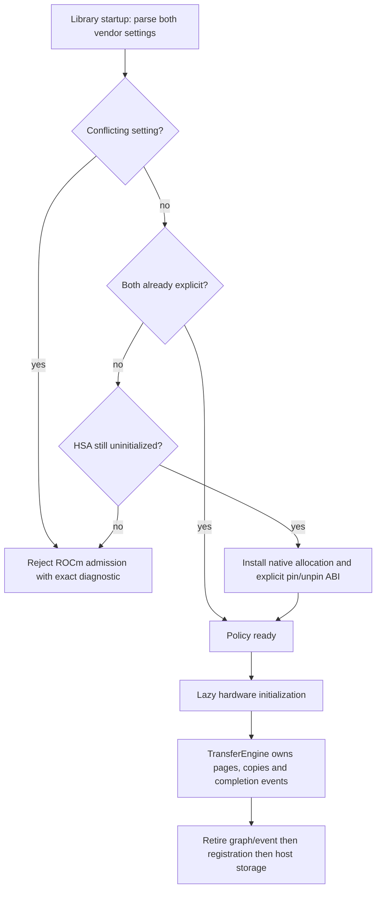
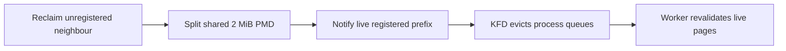

# ROCm host registration and Vega IH2 overflow

This investigation follows the unresolved GPU warning recorded by the CPU
tuning checkpoints. CPU tuning remains at its accepted checkpoint; no CPU
kernel, inference graph, collective, or model policy changes in this slice.

## Reproduction and attribution

On four MI50s, ROCm 7.2.4 and the host's Intel-IOMMU-enabled 6.14 kernel,
`V2_Integration_PlanningMPIExpertSample_ROCm` passes its mathematical/service
assertions in 12.70 seconds but emits ten fresh AMDGPU `ih2 ring buffer
overflow` warnings. The combined source-free streaming/arithmetic GTest alone
also reproduces. Kernel-log begin/finish receipts retain each exact interval;
historical messages are neither cleared nor ignored.

`amdgpu:amdgpu_iv` tracing identifies 10,412 IH2 vectors with client ID 21
(ATS), source ID 1. These are address-translation invalidations, not retry
page faults or an inference graph's completion interrupts. Kernel CPU stacks
include `svm_range_validate_and_map`, deferred SVM range retirement,
`iommu_dma_unmap_page`, and Intel queued IOTLB invalidation.

A standalone HIP reproducer removes Llaminar, MPI, GEMM and graph capture. It
first-touches two 32 MiB anonymous ranges, registers them, performs exact-stream
H2D copies, awaits their terminal event, then unregisters/unmaps them. Two
passes across all four GPUs produce nine fresh IH2 overflows. The identical
copy lifetime with native driver-owned pinned allocations produces none.

ROCr's SVM registration path applies HMM range attributes/mappings. Its explicit
buffer-object path instead pairs pinning and unpinning with the host owner.
Selecting that explicit registration ABI (`HSA_USE_SVM=0`) also makes the
original complete planner registration clean in an initial 11.17-second run.
That timing is a diagnostic observation, not a whole-model performance claim.

The explicit-policy standalone reproducer completes **20/20** process runs
without a fresh driver warning. Matching interrupt traces of its two-pass
four-device workload count **20,679 ATS vectors before versus 32 after**.
The trace measures interrupt traffic, not inference throughput; kernel-log
receipts remain the pass/fail authority for warnings.

For timestamp correlation, use `perf record --clockid mono` with application
`CLOCK_MONOTONIC` timestamps. The default perf/kernel trace clock on this host
has a different offset; comparing it directly with user timestamps can falsely
attribute the interrupt burst to process teardown.

## Production fix

Extend the existing early `ROCmRuntimeStartup` authority to install both halves
of explicit host-memory ownership before HSA initialization:

`HSA_USERPTR_FOR_PAGED_MEM=0` retains the existing native GTT allocation
contract; `HSA_USE_SVM=0` extends explicit ownership to caller-allocated pages.
Neither is a caller-facing performance toggle. A conflicting value or missing
half after HSA initialization is fatal rather than an environment change that
the already-running driver cannot honor. CPU-only startup remains device-free.
Llaminar uses explicit storage and transfers, not demand-paged managed memory.

The change adds no payload copies, RAM/VRAM reserve, polling, hot-path
synchronization, inference graph split, reduced graph bucket, or warning
allowlist. CUDA keeps its existing explicit registration implementation and
receives the same byte-level lifetime tests.

## Regression contract

- Device-free total startup-policy coverage: both settings present/absent,
  every conflicting value, initialized/uninitialized HSA, and partial policy.
- ROCm integration queries the **live runtime**, not just the environment, to
  require explicit registration; native host slabs still prove driver backing.
- CUDA and ROCm integration exercise every visible device twice, small odd
  tails and 32 MiB regions, ordinary tensor uploads and external-channel
  registration, retained graph replay, exact copied bytes, changing replay
  payloads and ownership retirement. Both registrations explicitly join
  `ProductionTestPreflight`.
- Loop the previously failing planner cell 20 times under the driver observer;
  then refresh the complete Unit/preflight gate under the same observer.

## Validation progress

The initial focused selection passes **8/8 CTest entries** with zero new driver
records: startup units, startup preflight, live ROCm backing/registration,
CUDA/ROCm captured registration lifetimes, and both complete planner samplers.
The original ROCm sampler then passes **20/20** fresh, normally registered
CTest runs with zero new driver records: 222.33 seconds total, 11.101-second
mean, 10.55–11.47-second range. No environment override is supplied to these
post-build tests; production startup installs the policy.

One earlier repetition attempt overlapped the unrestricted gate rebuild and
hit its unchanged 30-second limit while still progressing. The all-format
subtest grew from about 3 seconds to 20.49 seconds, with measured CPU bandwidth
falling from about 74 GB/s to 19–22 GB/s. Its driver interval is clean, but the
timed-out run is a failure and is **not** included in the clean 20-run cohort.
Do not overlap planner calibration tests with a full parallel compilation.

The first complete transaction passed all **670 Unit tests and 387/388
preflight entries**, with zero fresh driver diagnostics. Its one failure was
a reproducible segmentation fault in the mixed-vendor controller-fabric suite,
not an IH2 warning. GDB localized it to host-side `deviceBinding()` construction:
it read `layout` and `participants` through their **GPU virtual addresses**.
HMM's equal host/device addresses had hidden the violation; explicit HIP
registration may legitimately return a distinct GPU-only address.

The follow-up audit found the same assumption in stage traffic estimation,
fixture lifecycle/evidence reads, and a failure-only runner diagnostic. Capture launch
scalars now come from typed model-frozen setup metadata, not device reads.
Stage capture identity includes that metadata and every embedded alias. Test
evidence uses its explicit host transport view, while the runner reuses the
fabric's existing host-view diagnostic instead of maintaining a second raw
pointer walk. No controller state is mirrored and no copy or synchronization is
introduced. A device-free `PROT_NONE` regression rejects any host dereference
independently of vendor address assignment; it has its own explicit preflight
entry. The real six-GPU suite also verifies all participant metadata, stage
estimates, capture identity, and retained transaction execution.

The corrected controller slice passes its **3/3** focused CTest entries. Its
complete six-GPU controller-fabric suite then passes **20/20** independent
process repetitions in **111.97 seconds**, with zero fresh driver diagnostics.
Each repetition includes all 23 named GTests, both authority vendors, real
retained controller graphs, and the new six-participant setup-metadata proof.

The refreshed complete transaction passes **670/670 Unit tests and 389/389
production-preflight entries**, in 791.70 seconds combined. The kernel-log
checkpoint has zero new records across that entire transaction, including
teardown. The added alias-boundary entry accounts for the increased preflight
count.

The original Release HTTP hybrid case then completes **44/45 checks**. All
eight long-context checks pass, including 2,048 structured generation tokens
(147 correctly ordered lines), 7,595/8,192-token near-boundary context, prefix
restore, tool calling and clean exit. GPU memory returns from the loaded model
to its exact 42 MiB baseline. The same canonical profile and cached model shards
are used; no reduced segment size or relaxed assertion is substituted.

**That first E2E run is red.** It reports no IH2 overflow, but catches six fresh
`amdgpu_amdkfd_restore_userptr_worker` CPU-hog warnings. Five occur during
startup and one later in the HTTP workload. Explicit BO registration still has
MMU-notifier invalidation semantics for caller-owned pages; eliminating the
SVM registration/retirement storm does not prove those pages can never be
invalidated. A separate 45-second eviction trace during structured generation
contains no eviction calls, so this is not evidence of continuous per-token
invalidation. A startup-only run of the same canonical service is now tracing
the invalidation call stacks and matching HIP registration lifetimes. It is a
diagnostic, not an E2E or performance certificate. The first startup trace
mistakenly treated the server's valid HTTP 202 shutdown response as an error;
its forced-exit callbacks are not normal-retirement evidence. The corrected
startup-only run reaches readiness in 88.42 seconds, exits cleanly and records
no evictions or driver warnings.

A second complete HTTP run, with only passive eviction tracing, passes
**45/45 checks in 450.73 seconds**, with zero kernel records and zero eviction
callbacks through normal teardown. This proves the original topology can pass,
but does not erase the first run's intermittent warnings or identify their
source conclusively.

## Neighbouring huge-page invalidation

A smaller, deterministic experiment establishes an additional registration
hazard. A 31 MiB registered prefix and an unregistered tail share one initially
huge-page-backed mapping. Discarding **only a 4 KiB page in the unregistered
tail** nevertheless produces the following stack in all **20/20** iterations:

The captured kernel stack is `madvise_vma_behavior -> zap_page_range_single ->
__split_huge_pmd -> __mmu_notifier_invalidate_range_start ->
amdgpu_amdkfd_evict_userptr`. A separate neighbour mapping gives **0/20**
evictions. Marking just the registered boundary page `MADV_NOHUGEPAGE` before
registration also gives **0/20**. The experiment establishes this mechanism,
not yet the precise call site behind the first model run's warnings.

`HostRegistrationPageBoundary` now installs that narrow setup contract before
both ordinary and mapped ROCm host registration. Checked geometry selects at
most two base pages; data, permissions, allocation sizes and interior huge-page
eligibility remain unchanged. The policy persists until storage reuse/unmap:
rejoining edges on unregister could invalidate a still-live neighbour.
No global THP setting, anonymous reserve, extra payload copy or GPU wait is
introduced. NVIDIA uses long-term physical pinning rather than KFD's USERPTR
restore protocol; its byte/capture/reclaim tests remain symmetric.

Device-free tests exercise every byte offset within a page, overflow rejection,
real VMA flags, idempotence and payload preservation. The CUDA/ROCm captured
registration suite now reclaims an unrelated neighbour through both public
pinned and mapped TransferEngine paths, on every visible device. On ROCm it
asserts the actual installed edge/interior VMA policy, so a rate-limited or
absent kernel warning cannot disguise a missing implementation. Both the
device-free boundary check and the device suites are explicit preflight
registrations. The focused selection passes **4/4 entries** in 10.24 seconds,
with zero driver warnings and zero traced evictions. The complete registration
suite then passes **20/20 ROCm and 20/20 CUDA process repetitions**, in 197.21
seconds combined, with zero new kernel records and zero traced evictions.
Each process exercises every visible device, ordinary uploads, mapped/pinned
registration and captured replay while reclaiming an unregistered neighbour.
The refreshed transaction passes all **671 Unit and 390 preflight entries** in
792.64 seconds. Its separate driver-health receipt is nevertheless **red**:
one fresh `kfd_process_wq_release` CPU-hog warning occurs. The original hybrid
HTTP cell is not recertified after a failed driver-health gate.

## Independent host-driver process-cleanup warning

The new warning concerns process destruction, not live USERPTR restoration or
IH2 overflow. The boot log shows this same worker warning at 2,587 seconds,
long before these changes; its exponentially spaced warning count reaches 259
during the refreshed gate. A clean interval alone therefore cannot establish
that an old driver has the correct workqueue contract.

The loaded module's `kfd_process_create_wq` disassembly passes zero flags to
`alloc_workqueue`, creating a CPU-bound cleanup queue. A 45-second kernel trace
records 11 release callbacks, with sampled work in device dequeue/destruction.
This is the kernel driver's queue ownership, not a captured inference kernel.
Upstream commit
[`505b1c7342ae`](https://github.com/torvalds/linux/commit/505b1c7342aed9cc3c35c8043fe6bc5ccbeb6b0b)
changes this queue to `WQ_UNBOUND`: cleanup has no per-CPU locality requirement.
Do not change warning thresholds, keep processes artificially alive, or add
inference synchronization to mask a host-driver scheduling defect.

The user upgraded the host driver and rebooted. The new boot is
`7d6581c9-f171-48d9-8dfa-1557de203ebf`, still on kernel `6.14.0-37-generic`.
The loaded AMDGPU version is `7.1.9.31600000`, source identity
`EF3C6A7EB400F1E48E59FA0`. The installed DKMS module has the same identity;
both its source and compiled argument prove `WQ_UNBOUND` is present. This is
stronger than relying on package installation or on an empty warning log.
No host driver or warning policy was modified by the diagnostic agent.

The device-free driver-health fixture now explicitly covers both the USERPTR
restore and KFD release warning shapes, including a release warning after
successful HTTP work. Its Unit and `ProductionTestPreflight` entries pass
**2/2**. On the upgraded driver, the complete ROCm host-registration suite and
the MPI planner expert-sample reproducer each pass **20/20 independent process
runs**, taking 339.33 seconds together. The interval contains zero new kernel
records. Fresh complete prerequisites and all **11 canonical local HTTP E2E
cells containing ROCm** are the release-binary verification scope: homogeneous
single-device/TP/PP and mixed CPU/CUDA/ROCm topologies. Old-boot receipts are
retained, not reinterpreted as new-driver certification. These are local AVX512
Release proofs, not a new Docker or AVX2 image certificate.

The upgraded-driver prerequisite transaction passes **671 Unit + 390
ProductionTestPreflight entries** in 795.12 seconds. Its independent kernel
receipt is complete and green: one informational DMA-address record, zero
driver findings. Initial model staging exposes an unrelated shell bug:
omitting the optional ARC sharing UID makes bare `return` propagate a false
test status under `set -e`, despite successful tmpfs creation/adoption. The
helper now explicitly returns success for that no-op. A real-entrypoint,
device-free regression first reproduces all three states (create/adopt/reuse),
then proves idempotent success and preservation of existing cache files. Its
new `V2_Integration_ModelStagingTmpfsSetup` preflight entry, the existing staging
capacity entry and the complete 88-test campaign-tooling Unit entry pass
**3/3** in 3.05 seconds. No inference binary code changes during this harness
repair; the complete device gate is amortized across the HTTP matrix.

## Upgraded-driver canonical HTTP results

All **11/11 canonical local E2E cells containing ROCm pass**, with **495/495
HTTP/lifecycle checks**, using the existing Release AVX512 binary and unchanged
typed auto-planning, dynamic-MTP, movement and context policies. Every cell
completes its full 2,048-token structured-generation accuracy check, retires
cleanly and restores GPU VRAM from 42 MiB back to 42 MiB. Each per-cell kernel
receipt and the additional whole-run receipt pass: four informational records
across the entire run, **zero driver warnings or faults**, including gaps
between servers. No tracing or warning suppression is used.

| Model | Topology | Cell wall time | Result |
|---|---|---:|---|
| Qwen 3.5 122B MoE | CUDA2 + ROCm4 + CPU2 | 455.08 s | 45/45 |
| Qwen 3.5 122B MoE | ROCm2 + CPU2 | 473.08 s | 45/45 |
| Qwen 3.5 122B MoE | ROCm4 + CPU2 | 400.37 s | 45/45 |
| Qwen 3.5 122B MoE | CUDA2 + ROCm4 | 387.10 s | 45/45 |
| Qwen 3.8 27B dense | CUDA2 + ROCm2 TP/PP | 174.90 s | 45/45 |
| Ornith 1.5 35B MoE | ROCm2 ExpertOverlay | 155.93 s | 45/45 |
| Qwen 3.6 35B MoE | ROCm1 | 103.11 s | 45/45 |
| Ornith 1.5 35B MoE | ROCm1 | 108.57 s | 45/45 |
| Qwen 3.8 27B dense | ROCm2 TP | 229.61 s | 45/45 |
| Qwen 3.8 27B dense | ROCm2 PP | 274.21 s | 45/45 |
| Qwen 3.8 27B dense | ROCm1, 32K context | 832.73 s | 45/45 |

The final cell proves near-boundary inference at **30,205/32,768 tokens**;
the other cells use their canonical 8K profiles. Total HTTP-run wall time is
**3,773.61 seconds**, including the one-time post-reboot staging of seven GGUF
files (187,694,225,536 bytes). The persistent tmpfs remains available for reuse.
The exact exported inventory, global result and driver receipt are
`rocm-e2e-manifest.json`, `rocm-e2e.json` and `e2e-driver.json` under the
new-driver evidence directory; per-cell logs live under
`e2e-1790336089766629807/`. These results establish the requested local Release
correctness/lifecycle scope; they are not throughput measurements or image
certificates.

Local diagnostic evidence is under `/tmp/llaminar-gpu-driver.y4j1rA/`:
`prerequisites-final/`, `final-gate-driver.json`, `hybrid-fixed-e2e.json`, and
the `e2e-1790324796755508890/1/` HTTP artifacts. Generated logs and traces stay
outside git. Keep each failed and successful receipt separate; a clean retry
must never overwrite an earlier diagnostic failure.
New-driver evidence is isolated under `/tmp/llaminar-driver-upgrade.Qq9WtW/`.

The subsequent throughput comparison exposed a harness identity bug: native
diagnostics used `local-diagnostic` as their ISA, so they could not match the
AVX512/AVX2 image ratchets. Native runs now reuse HTTP's actual Release/ISA
validation, while diagnostic provenance remains separate and non-certifying.
Its explicit preflight regression proves a slower second measurement fails
for both real ISAs. After that harness fix, the complete prerequisite
transaction passes **671 Unit + 392 preflight entries** in **787.52 seconds**,
with zero new driver findings. The later benchmark stress-policy correction
and its timing evidence are tracked in
[the production-default benchmark investigation](2026-09-25-production-benchmark-defaults.md).

The current Release then completes all **14 non-CUDA-only production-default
benchmark cells** in 969.18 seconds with zero kernel records/findings. Rerunning
the exact last-release AVX512 image on the same upgraded host under matched
benchmark intent provides a negative control: its timing requests complete,
but it emits **21 driver warnings** (IH2 overflow and deferred/restore SVM
workers), so its enclosing driver-health gate fails. The newer host cleanup
queue alone therefore does not eliminate the old application's SVM registration
hazard. No warning is suppressed or reassigned to the current implementation.
All 28 current-versus-release phase comparisons meet the existing 10% tolerance;
the largest decrease is 1.30%. These are local diagnostics, not new image
certificates; the linked investigation records the complete qualified table.
