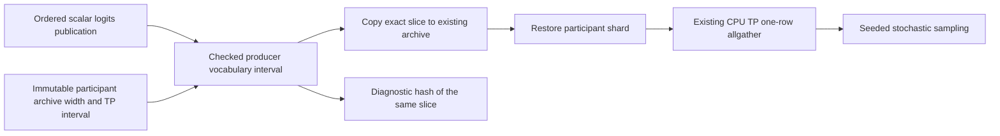

# Stochastic MTP default: production economics and request policy

## Contract

Make speculative sampling the default verification policy. Non-greedy requests
must keep MTP active on CPU, CUDA and ROCm, and greedy requests remain its exact
argmax specialization. Retain the 1–15 adaptive range. Do not change weight
formats, activation precision, sampling law or expected token streams to obtain
a performance result.

First record the old-default Release controls. Complete a first pass reaching
75% of those decode rates on **every** backend before pursuing the 100% pass.
After backend correctness/economy gates, deploy the change to the local CPU
Ornith/OpenWebUI service and verify ordinary non-greedy chat, streaming, prefix
restoration and nonzero draft/verifier activity without an MTP bypass.

## Latest result

The requested old-default performance target is met on every backend, with
stochastic verification enabled and the learned 1–15 depth policy intact:

| Backend | Old greedy default tok/s | New stochastic default tok/s |
|---|---:|---:|
| CUDA RTX 3090 | 254.93 | 278.33 |
| ROCm MI50 | 86.68 | 146.82 |
| Dual-socket CPU | 41.34 | 44.94 |

These are matched-model/topology/workload Release medians, not a claim that
dynamic depth now matches the best fixed depth on every prompt. The remaining
ROCm dynamic/fixed gap and profiler-associated NVIDIA assertions are retained
below as separate limitations. Weight formats and activation precision did not
change. Fresh serial/MTP controls, focused byte-equivalence gates, and the
ordinary non-greedy live service proof accompany the speed measurements.

The sections below are a chronological investigation record; later completed
gates supersede earlier pending-work statements. The final service checks also
found and fixed vocabulary-shard prefix corruption and idle HTTP connection
ownership, rather than hiding either behind MTP bypass or a different sampler.

## Evidence and measurement contract

Local evidence: `benchmark_results/mtp_stochastic_default/20260925-odNmcL/`.
Its `control-source.patch`, executable/core digest, immutable per-run CLI and
model stat metadata identify the control. Model bytes remain the staged
`Qwen3.6-35B-A3B-UD-IQ3_S.gguf`. No model hashing or restaging is needed.

Release AVX512, one CUDA or ROCm GPU / both CPU sockets, 512-token prompt,
256-token generation, context 4096, seed 42, one warmup and three measured
iterations. Report median **decode-after-prefill** throughput (255 timed tokens),
not total-token throughput. Controls use the old greedy verification default
and greedy sampling. Stochastic trials use temperature 0.7 / top-k 40 /
top-p 0.9. Thus these compare actual stochastic work against the requested old
control, not an unchanged greedy workload wearing a stochastic flag. Keep a
separate greedy-request non-regression check.

| Backend | Old control decode tok/s | 75% threshold | 100% threshold |
|---|---:|---:|---:|
| RTX 3090, CUDA:0 | 254.93 | 191.20 | 254.93 |
| MI50, ROCm:2 | 86.68 | 65.01 | 86.68 |
| Dual-socket CPU | 41.34 | 31.00 | 41.34 |

All three controls completed without bypass. The preliminary automatic
stochastic trials selected different physical GPU ordinals (CUDA:1, ROCm:3);
they are diagnostics, not matched comparison evidence. Freeze each initial
auto-selected endpoint for the subsequent paired trials. All other production
defaults remain in force. The live CPU service is paused only around CPU
measurements and resumed by an exit trap.

## Initial diagnosis and planned boundaries

- Runtime/request verification currently defaults to greedy. A non-greedy
  request therefore enters a silent bypass; change the default and test the
  no-override public behavior.
- Verification capability and request sampling law are distinct. The current
  depth resolver uses configured verification mode even when the request is
  greedy, which would make a simple default flip alter greedy economics.
  Resolve the active policy once from the admitted request law, retaining the
  original physical graph envelope and explicit policy intent.
- Stochastic startup begins at depth 1, greedy at 2. Preliminary GPU runs
  verify 100 groups rather than 76/77 for the control despite near-perfect
  draft acceptance. Measure fixed-depth economics and sampler cost before
  changing adaptive policy; do not hand-edit trained policy tables.
- The routine HTTP regression exporter explicitly selects speculative sampling;
  its seed/prompt/token contract does not need rebaselining. Add an unpinned
  default regression because those explicit flags cannot catch this defect.
  Diagnostic HF math cells deliberately keep their declared verification mode.

## First-pass result and default implementation

The exact-endpoint stochastic trials meet the 75% first-pass floor on every
backend without kernel changes:

| Backend | Stochastic decode tok/s | Fraction of old control | Evidence label |
|---|---:|---:|---|
| CUDA:0 | 209.91 | 82.3% | `stochastic-cuda-matched` |
| ROCm:2 | 70.29 | 81.1% | `stochastic-rocm-matched` |
| Dual-socket CPU | 38.27 | 92.6% | `stochastic-cpu-before` |

The second pass can now target 100% across all three. These are measurement
results, not new tuning wins. All cases generated 256 tokens in every repeat.

The implementation now defaults both startup and request policies to
`SpeculativeSampling`. `resolveMTPSamplingRequestConfig` specializes an argmax
request to greedy execution without mutating authored policy or physical
capacity. Changing request sampling regime invalidates only the request depth
controller, not retained graphs. Explicit greedy-only plus non-greedy sampling
fails rather than silently bypassing MTP. New configuration and runner
regressions are explicitly registered in `ProductionTestPreflight`.

The first default implementation passed the two full affected Unit binaries
and both focused preflight registrations. No refreshed full gate, 100% economy
or OpenWebUI proof is claimed yet.

## Learned-policy consistency and ROCm runtime follow-up

The user explicitly selected a learned policy, not a manually forced initial
depth of three. The first runtime repairs kept generated rows unchanged; the
subsequent request is to **relearn ROCm from fresh measurements**. Diagnostic
initial-depth/fixed-depth trials alone are not production default proposals.

The audit found two policy-consumption defects: GPU admission did not receive
the backend/model keys supplied to the CPU controller, and the resident GPU
window evaluator ignored the generated rules entirely. The fix shares initial
resolution and the learned integer rule interpreter across both execution
owners. GPU observations and decisions stay resident; request admission supplies
only immutable policy keys. Learned holds are real matches, not permission to
run generic promotion afterward. Retain the complete 1–15 adaptive range and
explicit user overrides. Focused captured CUDA/ROCm replay regressions and
cross-owner policy tests enter ProductionTestPreflight. Both backend regressions
have passed; the complete prerequisite gate is being refreshed below.

Matched diagnostics on the first default implementation:

| Backend | Dynamic, explicit initial 3 | Fixed depth 3 | Drafts / verifier calls |
|---|---:|---:|---|
| CUDA:0 | 262.91 tok/s | 313.59 tok/s | 204 / 67 versus 201 / 67 |
| ROCm:2 | 95.87 tok/s | 175.09 tok/s | Both 198 / 66 |

ROCm's identical transaction counts make the dynamic runtime overhead a separate
investigation from acceptance or learned depth selection. The retained dynamic
transaction currently uses the maximum-capacity physical verifier width even
when its selected depth is small. Profile that production path against fixed
depth before assigning the entire gap to padded work. Do not cap maximum depth,
disable capture or move live decisions to the host to manufacture a win.

CPU profiles identify verifier work, not stochastic sampling, as the main gap:
three measured requests spend 16.172 s in stochastic verification versus 15.349 s
for greedy; sampler timers are only 71.9 versus 27.6 ms. These are attribution
runs, not clean throughput labels. Larger explicit CPU initial depths did not
improve throughput. Learned-policy runtime fixes do not yet resolve that gap.

## Live-row runtime repair (September 26)

The GPU learned-policy consumption regressions passed on both vendors. Honoring
the existing ROCm stochastic-MoE learned hold at depth 1 initially exposed a
runtime regression (57.35 tok/s); this was not hidden by forcing depth 3 or
editing the generated policy. The GPU and CPU now use the same learned-rule
interpreter, including real hold matches.

Two independent capacity/live-work defects explained most of the dynamic gap:

1. ROCm grouped MoE selected the large-M tiled projection family from captured
   capacity (16), even when only 2 or 4 verifier rows had valid routes. The
   typed replay predicate now borrows the canonical group counts/offsets and
   applies the existing exact/generic route selector to live routes. Capture
   retains reachable families; only the device-admitted family writes output.
2. Shared-expert grouping marked every captured row active. Both CUDA and ROCm
   now accept `DeviceRowRange` and borrow the same live-count publication as
   routed experts. Invalid padded routes and zero weights are republished on
   each replay, including full-to-empty and depth-demotion transitions.

No arithmetic order, activation/weight precision, VRAM arena, graph capacity,
or learned coefficient changed. Dynamic capacity still reaches depth 15.

| Backend / lane | Median decode tok/s | Evidence |
|---|---:|---|
| CUDA unchanged learned default | 281.08 | `cuda-shared-live-learned` |
| ROCm unchanged learned default | 94.41 | `rocm-shared-live-learned` |
| ROCm diagnostic dynamic initial depth 3 | 146.49 | `rocm-shared-live-initial3` |
| ROCm diagnostic fixed depth 3 | 172.86 | `rocm-shared-live-fixed3` |
| CPU unchanged learned/default policy | 39.25 | `cpu-learned-default` |
| CPU refreshed greedy control | 40.13 | `cpu-learned-greedy-control` |

Every measured iteration retains all 256 original per-backend token IDs for
its sampling regime. CUDA/ROCm stochastic defaults exceed their old greedy
controls; CPU remains 5.1% below its original control and 2.2% below the fresh
greedy comparison. Do not claim the full goal complete. The diagnostic depth-3
ROCm result is not the installed default and still trails fixed-depth by 15.3%.

Finalized rocprof traces and `transaction-attribution.json` under the
`*-dispatch-finalized-profile` directories isolate ten warmed commit-to-commit
transactions. These are profiler measurements, not benchmark scores. Dynamic
depth-3 transaction span fell from 40.90 ms to 27.12 ms (fixed: 22.61 ms).
The dominant IQ2_S gate/up projection fell from 8.44 to 3.26 ms/transaction;
shared Q6_K gate/up fell from 7.74 to 1.35 ms/transaction. All changed expert
projection/publication kernels report zero scratch. Remaining differences are
distributed across padded geometry and additional predicated/directory nodes.
The pre-existing runtime grouping kernel reported 64 scratch bytes; its separate
repair and evidence are recorded below.

Focused gates already passed the device-free route-policy totality suite and
both learned GPU controller regressions. `V2_Integration_MoELiveRows_CUDA` and
`V2_Integration_MoELiveRows_ROCm` are explicitly in ProductionTestPreflight:
one captured graph traverses every live count 0–16 repeatedly, checking exact
serial-decode bytes and zero padded output for direct and canonical publication.
The expanded 24-format version now passes on both backends, including FP16,
BF16 and FP32 and distinct expert weights. The floating serial oracle gives each
row its own immutable table owner; rewriting one owner's expert IDs is correctly
rejected by the runtime. Complete Unit/preflight gates are still being refreshed.
Driver monitoring found no new CUDA/AMDGPU warnings in the measured slice.
The live OpenWebUI service has been resumed but not yet updated to this binary.

## Scratch-free ROCm runtime grouping

All four `rocm_moe_prefill_group_small_runtime_kernel` variants already require
and launch exactly 256 threads. Their missing compiler launch bound allowed a
1024-thread workgroup, unnecessarily constraining register allocation. Declaring
the existing contract with `__launch_bounds__(kActiveExpertThreads)` changes no
arithmetic, launch geometry, arena capacity or graph identity.

Release gfx906 code-object evidence for every variant:

| Resource | Before | After |
|---|---:|---:|
| Maximum compiler workgroup | 1024 | 256 |
| VGPR spills | 14 | 0 |
| Private scratch bytes/thread | 64 | 0 |
| Logical VGPRs/thread | 64 | 77 |

The new `V2_Integration_ROCmMoERuntimeGroupResources` registration belongs to
ProductionTestPreflight and queries all four loaded functions. Integration's
symbol-enabled HIP build has a separate 8-byte OCKL printf call frame with zero
register spills. A minimal, identically compiled diagnostic reference measures
that ABI frame; the gate permits no additional private storage and hard-codes
no byte allowance. Release's frame and scratch are both zero. Neither resource
query executes in inference.

Five focused preflight cells passed (both live-row suites, both learned-policy
suites, and compiler resources). Three existing runtime-grouping/assignment/
verifier-boundary regressions also passed. All three 256-token benchmark repeats
remain identical to their pre-change streams. The driver diagnostic bracket is
green with no new GPU warnings.

Clean Release `rocm-no-scratch-learned` measures **94.48 tok/s**, essentially
unchanged from 94.41. Diagnostic `rocm-no-scratch-initial3` measures **141.79**
versus the previous 146.49, so this change is not claimed as an end-to-end speed
win. The separate rocprof trace confirms zero runtime scratch and records
1.410 ms/transaction for grouping versus 1.447 previously, but overall traced
transaction time is 27.81 versus 27.12 ms. Retain that discrepancy rather than
attributing a whole-model improvement to removal of diagnostic-path spills.

The canonical complete gate at `complete-gates-20260926` discovered 671 Unit
and 402 production-preflight registrations, but stopped during compilation:
three CUDA test call sites needed the `llaminar2::DeviceRowRange` qualification.
Those call sites are corrected. No full test execution or complete-gate pass
is claimed; refresh the gate after the learned-policy slice is installed.

## ROCm learned-policy refresh

The scratch-free fixed-depth-3 control is **173.88 tok/s**, versus **94.48**
for the old learned dynamic policy and **141.79** for diagnostic dynamic depth
3. The policy mismatch and remaining dynamic graph overhead are separate.
Relearning cannot by itself prove the latter solved.

Use the canonical iteration matrix on the unchanged Release binary, model,
sampling settings and endpoint. Four training requests cover repetitive input,
explanatory prose, C++ code and long context; four predeclared holdouts use
different prompts/seeds, including the built-in benchmark. Each has baseline,
fixed d1/d2/d3/d4 and unchanged dynamic controls with one warmup and three
measured repeats. Local commands, prompt bytes and JSON are retained under
`rocm-relearn-before`; no raw corpus is added to source control.

Trainer changes are evidence-boundary repairs, not hand-tuned policy:

- Accept measured fixed depths 1–15 instead of silently discarding d4+.
- Keep explicit holdout inputs out of fitting, even if the automatic hash split
  is disabled. Never turn an empty training fold into training on holdout data.
- Preserve generated rows for unmeasured backend/model/sampling domains.
- Score the final emitted hold predicate, including its acceptance margin.
- Reject duplicate depth rows and invalid measurements.

The controller counts accepted tokens divided by **all attempted drafts**;
stochastic `acceptance_rate` in the JSON instead counts accepted/tested tokens
and excludes the untested suffix after rejection. Training inputs now use the
controller's feature definition. The matrix reports median decode-after-prefill
throughput, excluding the first token, and leaves dynamic startup/capacity to
production defaults. Its device-free regressions and the trainer regressions
are explicitly labeled ProductionTestPreflight.

### Installed refresh and Release validation

The candidate fits only the four training prompts. Each of its four rules
scores 4/4 on training and 3/4 on independent holdout: the unseen prose prompt
prefers fixed depth 2 by 2.2%; the other three prefer depth 3. The predeclared
0.75 per-rule holdout gate passes. All 21 unmeasured-domain rows compare
byte-for-byte equal to the prior generated include. ROCm stochastic MoE now
learns startup/healthy hold at depth 3, promotion from d1/d2, and demotion from
an uneconomical d4. This is not a handwritten initial-depth override or a
reduction of the 1–15 adaptive bounds.

Rebuilt Release, same seeds/prompts/sampling, one warmup and three repeats:

| Prompt | Old dynamic tok/s | Relearned dynamic tok/s | Gain |
|---|---:|---:|---:|
| Training repetitive | 94.97 | 146.47 | 54.2% |
| Training prose | 86.01 | 115.65 | 34.5% |
| Training code | 86.38 | 107.35 | 24.3% |
| Training long context | 83.88 | 105.17 | 25.4% |
| Held-out repetitive | 95.64 | 123.57 | 29.2% |
| Held-out prose | 88.36 | 106.34 | 20.3% |
| Held-out code | 92.57 | 126.33 | 36.5% |
| Held-out built-in benchmark | 84.98 | 119.77 | 40.9% |

All **6,144 compared token IDs** are unchanged. Every run retains `[1,15]`,
nonzero stochastic MTP work and zero bypasses. Dynamic genuinely changes depth
on three of these prompts; the learned start is not a fixed-mode substitution.
Thirty-one device-free trainer/matrix tests pass. Captured backend, complete
Unit and complete preflight proofs are refreshing at
`complete-gates-relearned-20260926`; no full-gate pass is claimed yet.

The 165 tok/s expectation and 90%-of-best-fixed goal are **not achieved**:
dynamic reaches 76.8–87.2% of each prompt's best measured fixed depth. Most
remaining cost is the previously measured dynamic-capacity graph overhead.
One independent prompt adds a sharper lead: held-out repetition at seed 123
stays at depth 3 with zero policy updates but performs 79 verifier calls/request
versus fixed d3's 72, with identical output tokens. A fresh fixed-d3 run on the
rebuilt binary reproduces 160.93 tok/s, 184 accepted drafts and 72 verifier
calls/request; dynamic has 177 accepted drafts and 79 calls. Do not dismiss
this acceptance discrepancy as policy selection or claim it is already
explained. The other two steady held-out d3 prompts have equal verifier counts.

## Compiler-enforced memory-spill cleanup

The user selected **reject memory spills, report register-only moves**. Release
and Integration now enforce that contract for project CUDA/HIP compilation,
including generated specializations and test targets. Debug remains a
source-debugging configuration, not a performance certificate. Prebuilt vendor
libraries are outside this project's compilation authority.

CUDA promotes ptxas spill warnings to errors. HIP inspects every bundled final
code object together with LLVM's final stack-slot classifications, including
out-of-line device helpers. Missing evidence fails closed. Scalar-to-vector and
vector-to-accumulator moves are legal only when the final stack evidence proves
they do not spill to memory; a nonzero early allocator counter alone is not a
memory-spill certificate. Explicit private arrays and ABI call frames are
different from spilled registers. The same audit runs after ccache hits, and
the guard's identity is part of Ninja's compile command.

Integration retains symbols and snapshots but disables HIP's debug-unwind-only
register saves. Full intrusive device-frame unwinding remains available in
Debug. This avoids measuring instrumentation-generated scratch as production
register pressure without suppressing real allocation evidence.

### Retained fixes

- CUDA HD256 attention no longer keeps its accumulator array live across an
  unnecessary out-of-line shuffle helper. Both row-owner lanes already compute
  the same maximum. Removing that redundant broadcast preserves the arithmetic.
- Grouped CUDA GEMV bounds accumulators per lane and partitions larger row
  groups across the launch geometry. The K partition and reduction tree do not
  change, and no additional workspace is allocated.
- ROCm GEMM reduces operand lifetimes only for pressure-heavy combinations.
  Ordinary streaming variants retain full row reuse and their three-wave
  occupancy policy. IQ1_M publishes the independent next LDS tile before compute
  so its decoded operands do not survive the whole accumulation. Keeping these
  publication sites explicit also avoids a reference-capturing lambda's extra
  register pressure in IQ2_XXS.
- Attention, TurboQuant, MoE packet/grouping and sampling kernels receive exact
  launch bounds or shorter helper lifetimes. MoE controller operations become
  immutable action specializations; decisions and mutable state remain owned
  by the device.
- Already-rejected CUDA prefill resource combinations are no longer instantiated
  merely to compile an unusable spilling symbol. This does not remove an admitted
  runtime mode. Their resource/staging tests now assert the precise rejection.

The first broad ROCm register-reduction candidate was **rejected**: despite
passing byte checks and eliminating spills, it slowed several codebooks by
20–50%. Later changes restore reuse where the compiler can afford it, instead
of accepting that slowdown or weakening the build rule.

### Isolated performance evidence

The preserved pre-cleanup working core is
`/tmp/llaminar-spill-baseline.zutESR/libllaminar2_core.so`. It includes the earlier
live-row and learned-policy changes; it is not a clean-HEAD reference. Paired
measurements use the same Release harness, device and shape, without competing
tests or profiler activity.

CUDA attention, M128 / KV8192 / 16 query heads / 2 KV heads / HD256 / FP16 KV:

| Captured specialization | Old median | New median | Latency reduction |
|---|---:|---:|---:|
| PV4 | 2,896.9 us | 2,479.1 us | 14.4% |
| PV1 | 6,495.7 us | 6,140.9 us | 5.5% |

Separate Nsight profiles report zero local-memory spill requests. PV4 uses
124 registers, 192 threads/CTA and 128 CTAs, with 25% theoretical / 19.54%
achieved occupancy and approximately 45% SM and memory throughput. PV1 uses
217 registers and 96 threads/CTA. These are isolated kernel results, not
whole-model speedup claims. Evidence: `/tmp/llaminar-spill-fa-comparison-*`,
`/tmp/llaminar-spill-fa-pv4-final.ncu-rep` and
`/tmp/llaminar-spill-fa-pv1-fixed.ncu-rep`.

ROCm paired FFN-up checks (N11008/K2048) recover the rejected candidate's large
regressions. Q6_K and IQ2_S are unchanged or faster; the final Q4_1 M32 median
is 301.0 → 283.4 us and M64 is unchanged. IQ2_XXS M32 is 176.5 → 176.5 us,
M64 is unchanged, and IQ1_S differences are within the observed run-to-run
spread. The final IQ2_XXS M32 symbol is back to 111 logical VGPRs with no
scratch. Keep profiler runs of the earlier regressed candidate separate from
this final evidence. Logs: `/tmp/llaminar-spill-isolated-r2-*` and
`/tmp/llaminar-spill-r2-shard6.resources`.

### Correctness and remaining acceptance

Both optimized build trees are rebuilt under the guard for SM86 and gfx906.
The first complete Unit gate passes **673/673 in 75.78 s**, and the complete
ProductionTestPreflight gate passes **413/413 in 1,055.58 s**, with no skipped
tests. Logs and JUnit reports are `/tmp/llaminar-spill-{unit,preflight}-sealed.*`.

New explicit preflight regressions exercise both actual compilers on spilling
kernels/helpers, clean functions, intentional private storage, register-only
moves and cache rechecks. Focused captured tests cover CUDA attention KV types,
all-codebook CUDA grouped row bounds, and all-codebook ROCm GEMM row/geometry
boundaries with repeated replay and byte comparison against serial results.
The first full preflight found two stale CUDA test expectations about rejected
specializations; both are corrected and pass in the final complete run together
with the optimized kernels.

### Whole-model comparison caught a CUDA occupancy regression

The first paired Release model run was numerically exact but **not accepted**:
CUDA decode fell from 279 to 266 tok/s in both run orders. Shorter register
lifetimes alone are insufficient if a new launch/index expression also damages
occupancy in shallow production tiles.

Two changes recover the original shallow behavior without restoring spills:

1. Remove the unnecessary maximum-CTA compiler hint from grouped DP4A. It let
   ptxas expand register use in previously economical shallow tiles. This alone
   recovers only part of the loss.
2. A one-row-group CTA must express its row address as block-uniform, independent
   of the thread argument. Computing a redundant zero group from the thread ID
   instead made unrolled row addresses lane-dependent to the compiler. The
   shared geometry now specializes that case directly, and its Unit/preflight
   proof locks in independence from the thread argument before launch-range
   analysis.

Final median register counts at row tiles 2/4/8/16 are again **40/48/56/80**,
matching the original. The deeper 32/64 tiles decrease from median 200/255 to
128, with zero local/stack bytes across the grouped kernel inventory. Compiler
spill enforcement remains enabled for every specialization.

A separate captured Q6_K N1024/K5120 check matches serial bytes: M16 is
27.526 → 27.528 us; M64 is **187.733 → 103.014 us**. Nsight's exact M64 node
reports **469,760 → 0 local spill requests**, **255 → 128 registers**,
**32 → 128 threads/CTA**, and **15.74% → 31.44% achieved occupancy**. The grid
remains 1,280 CTAs. These profiles are separate from the unprofiled timing CSVs
in `/tmp/llaminar-spill-grouped-economy/`; reports are
`/tmp/llaminar-spill-grouped-m64-{old,uniform}.ncu-rep`.

Final paired production runs use both orders, one warmup and three measurements
per process, the unchanged learned dynamic policy, and the same 512/256 prompt
and token horizon. Medians pool six observations per variant:

| Backend | Prefill old → new tok/s | Decode old → new tok/s |
|---|---:|---:|
| CUDA:0 | 1,712.5 → 1,710.9 | 279.21 → 279.43 |
| ROCm:2 | 825.0 → 837.1 | 146.30 → 147.20 |

CUDA is unchanged within the observed run-order noise. ROCm prefill improves
1.3–1.8% in the individual pairs; its smaller decode change is not a material
speedup claim. All **3,072 compared token IDs** and draft/accept/reject/verifier
counts agree. Evidence directories: `/tmp/llaminar-spill-wholemodel-cuda-uniform`,
its `-reverse` companion, `/tmp/llaminar-spill-wholemodel-sealed-rocm`, and its
`-reverse` companion. Earlier `sealed-cuda`/`cuda-occupancy` timing records describe
rejected intermediates, not the final implementation.

The post-correction canonical build and full gate pass: **673/673 Unit in
75.46 s** and **413/413 ProductionTestPreflight in 1,054.27 s**, with zero
failures or skips. Logs and JUnit reports are
`/tmp/llaminar-spill-{unit,preflight}-certified.*`. Their build targets now also
own the new geometry executable explicitly, so clean checkouts do not depend
on a manually built test binary. A post-build Ninja dry run reports no work.

After the gate, a fresh unprofiled comparison confirms the result without
overlapping any test, build or profiler. Each variant again has one warmup and
three measured iterations:

| Backend | Prefill old → new tok/s | Decode old → new tok/s |
|---|---:|---:|
| CUDA:0 | 1,709.8 → 1,721.2 | 279.68 → 279.58 |
| ROCm:2 | 823.3 → 839.4 | 146.35 → 147.36 |

All 1,536 additional compared token IDs and MTP counts match. The fresh CUDA
decode difference is -0.03%; ROCm prefill improves 1.95%, consistent with the
earlier pairs. Evidence: `/tmp/llaminar-spill-wholemodel-unprofiled-{cuda,rocm}/`
and their companion `-summary.log` files. These comparisons certify preservation
of whole-model economics; the larger isolated kernel gains are not whole-model
speedup claims.

The mixed profiling interval is **not driver-clean**: its observer retained
24 `pSmIssueThrottleCtrl != NULL` NVIDIA assertions, six at each of the four
Nsight Compute runs, including profiles using the preserved control core.
Timestamps align with profiler execution rather than the unprofiled model
comparisons. `/tmp/llaminar-spill-final-driver-report.json` records the failed
interval without suppression. The separately observed final unprofiled gate
and model checks **pass driver health with zero new records and zero findings**:
`/tmp/llaminar-spill-unprofiled-driver-report.json`. No log clearing, driver
reset, or warning allowlist is used. This establishes a clean ordinary execution
interval, not a resolution of the separate profiling-associated assertions.

The CPU 100% stochastic target, remaining ROCm dynamic/fixed discrepancy, and
deployment to the local OpenWebUI service are still open.

## CPU second-pass economics after spill acceptance

The fresh normally bootstrapped two-socket baseline is **40.01 tok/s**
(39.91/40.01/40.15), versus the original 41.34 control. All tokens, 669 draft
steps, 195 verifier calls and 864 verifier rows match the previous stochastic
baseline. The full 1–15 range and production placement/movement defaults remain
enabled. The local CPU service is paused only during measurements and restored
by the shell's exit trap. Evidence: `cpu-post-spill-default` under the experiment
root above.

A separate `mtp,stage_cpu,stage_cpu_detail` profile attributes 16.516 of
20.966 transaction seconds to verification. Routed experts contribute 3.909 s,
vocabulary projections 2.823 s, GDN projection 1.848 s and recurrence 1.416 s.
These are nested diagnostic observations, not additive whole-model costs or
canonical throughput. Sampling and accepted-state publication are not the
dominant gap. Raw profile: `/tmp/llaminar-cpu-stochastic-stage-refresh.json`.

Before changing kernels again, fixed-depth controls expose an economic policy
gap: CPU has no trained domain rows and its generic controller settles at
depth 4 despite depth 3 being much faster on this workload.

| Stochastic policy | Median decode tok/s | Draft acceptance | Verifier calls / rows |
|---|---:|---:|---:|
| Existing dynamic | 40.01 | 85.65% | 195 / 864 |
| Fixed 2 | 38.60 | 100% | 255 / 765 |
| Fixed 3 | 45.10 | 100% | 192 / 768 |
| Fixed 4 | 39.03 | 80.25% | 183 / 912 |

All three measured 256-token streams at each fixed depth match the dynamic
control. Counts cover all three requests. The deeper lane performs fewer
verifier calls but substantially more rows and rejected work; acceptance alone
does not establish profitability. These controls motivate measured CPU policy
training, not a manually authored depth-3 default or a smaller adaptive ceiling.

The canonical training wrapper's CPU2 recipe initially failed before inference:
it authored an implicit MPI device-map/TP plan that cannot express current
cross-rank MoE authority. `nodelocaltp_cpu2` now supplies two CPU endpoints and
TP as automatic-planning constraints, letting the production planner author the
domain for both dense and MoE models. The focused wrapper tests fail before the
fix and pass afterward; both its Unit and explicitly registered
`V2_Integration_MTPBenchmarkPolicyEvidence` entries pass. The rejected real-model
invocation is retained in `cpu-relearn-before-implicit-tp-rejected`. The complete
CPU repeat-prompt baseline/fixed-depth/dynamic matrix completed through
the repaired wrapper: 24.14 / 30.84 / 37.56 / 45.09 / 38.06 / 40.18 tok/s
for serial / d1 / d2 / d3 / d4 / dynamic, with equal output streams. The serial
sampling qualification below supersedes its original interpretation.

### Matched-control sampling defect discovered before CPU policy training

The first independent prose prompt produced an apparent serial/MTP divergence
at zero-based output token 36 (`1406` versus `4963`), identically in all three
repeats. All four fixed MTP depths nevertheless agreed on all 256 tokens. The
larger sweep was stopped; no CPU policy was trained or installed from it.

The cause is in `BenchmarkRunner`, not established kernel or verifier drift:
it set temperature to zero and only copied the requested temperature/top-k/
top-p when MTP was enabled with stochastic verification. Non-MTP controls
therefore ran greedy despite their JSON echoing temperature 0.7/top-p 0.9.
The repetitive prompt concealed the mismatch because both laws picked the
same tokens. Existing original greedy controls remain genuine greedy controls;
historical serial rows labelled stochastic are not matched stochastic evidence.

The regression checks actual sampling delivered to the production decode
surface against both CLI intent and JSON, across CPU/CUDA/ROCm endpoint labels,
MTP on/off, both verification modes, and greedy/stochastic requests. It failed
before the fix. Sampling is now independent of the MTP toggle and published
before prefill admission; low-level greedy-only probes reject stochastic work.
`V2_Integration_BenchmarkSamplingPolicy` explicitly registers this invariant in
`ProductionTestPreflight`. The complete BenchmarkRunner Unit entry and new
focused preflight entry both pass (0.85 s total). Release replay of the exact
prose reproducer now gives identical 64-token outputs for serial, fixed d1,
and dynamic MTP with genuinely matched sampling settings. Dynamic retains
the 1–15 range, performs stochastic verification, and reports no bypasses.
Evidence: `cpu-prose-corrected-control`; this is a focused correctness replay,
not a replacement for the longer training/holdout measurements.
The previously installed GPU policy was fit from fixed MTP rows, not the serial
baseline, so its training labels and dynamic-to-fixed comparisons remain valid.
Evidence is retained under `cpu-relearn-before/train-prose` and
`cpu-prose-divergence`; the GDB diagnostic was inconclusive and is not proof.

The refreshed complete Unit gate passes **673/673 in 74.70 s** after the
benchmark sampling fix. The unchanged kernel slice retains its preceding full
preflight result; refresh that complete gate again after the coherent CPU
policy change, rather than per training lane. Corrected CPU observations use
the separate `cpu-relearn-sampling-corrected-before` series. The first complete
repeat-prompt case is green across serial/d1/d2/d3/d4/dynamic and all three
256-token repetitions, with medians 24.29/30.52/36.73/43.58/38.17/38.58 tok/s.
No policy is installed from a partial corpus.

### Completed CPU controls and explicit learned startup

All eight corrected cases completed: four training requests and four independent
seed-123 holdouts, each with serial/d1/d2/d3/d4/dynamic and three timed 256-token
generations. All **30,720 MTP token IDs** agree with their corresponding serial
controls. No bypasses occurred, and every dynamic lane retained bounds 1–15.

| Prompt | Prior dynamic tok/s | Best fixed tok/s | Best depth |
|---|---:|---:|---:|
| Train repetition | 38.58 | 43.58 | 3 |
| Train prose | 23.11 | 29.22 | 3 |
| Train code | 29.30 | 31.87 | 4 |
| Train longer context | 28.24 | 31.00 | 4 |
| Holdout repetition | 37.13 | 46.33 | 3 |
| Holdout prose | 23.67 | 30.20 | 3 |
| Holdout code | 32.84 | 35.45 | 4 |
| Holdout standard prompt | 28.87 | 32.93 | 3 |

The exact-winner classifier was rejected: its first CPU promotion row scored
only 25% on holdouts. Tiny d4 wins (0.6–2.3% in training) produced incompatible
labels despite d3 being almost equally fast. No rejected rules were installed.
The trainer now distinguishes two decisions explicitly:

1. Startup maximizes geometric-mean relative throughput over complete training
   requests, considering only depths measured in every such request. This
   selects d3 at 99.29% of per-request best training throughput. Holdouts do not
   participate. Runtime no longer infers startup from the deepest hold row.
2. Transition labels prefer that startup inside an explicit 5% near-best
   economic band (`--startup-tie-tolerance`; zero restores exact-winner labels).
   Outside the band, even on a holdout, the actual fixed-depth winner remains
   the label. This does **not** change numerical tolerances, sampling, token
   expectations, or the 75% training/holdout classification gates.

The resulting four CPU rows score 100% on training and 75–100% on holdouts.
All 25 GPU transition rows and their eight startup choices are preserved.
The generator emits one typed startup/adaptation artifact and rejects missing,
duplicate, or invalid startup metadata. Seventeen trainer tests pass, including
the economic-band boundary, held-out regressions, all depths 1–15, corpus
relocation, and unmeasured-domain preservation. The startup/controller regression
is part of `V2_Integration_MTPRelearnedStartup`; the trainer regressions already
belong to `V2_Integration_MTPDepthPolicyTrainingEvidence`.

Release and the complete Integration gate targets rebuild successfully with
memory-spill enforcement enabled. The six focused controller/trainer/benchmark
Unit and preflight entries pass in 1.24 s. The full after-policy sweep now
passes all eight requests, three 256-token repetitions each, with all **6,144
new token IDs** matching the independently sampled serial controls. Every
adaptive request retains bounds 1–15 and reports zero bypasses.

| Prompt | Prior dynamic tok/s | Learned dynamic tok/s | Change |
|---|---:|---:|---:|
| Train repetition | 38.58 | 44.94 | +16.5% |
| Train prose | 23.11 | 29.75 | +28.7% |
| Train code | 29.30 | 31.26 | +6.7% |
| Train longer context | 28.24 | 30.25 | +7.1% |
| Holdout repetition | 37.13 | 45.43 | +22.4% |
| Holdout prose | 23.67 | 29.29 | +23.7% |
| Holdout code | 32.84 | 36.95 | +12.5% |
| Holdout standard prompt | 28.87 | 32.82 | +13.7% |

These are medians of unprofiled production Release generations, not fixed-depth
potential. The canonical CPU result exceeds the original old-default 41.34
tok/s control. The after sweep changes learned policy only; it does not change
weights, precision, topology, kernels, or adaptive capacity. Evidence is in
`cpu-relearn-sampling-corrected-after`. The refreshed complete gates pass
**673/673 Unit in 75.78 s** and **414/414 ProductionTestPreflight in 1,055.45 s**,
without skips. Logs and JUnit: `/tmp/llaminar-mtp-final-{unit,preflight}.{log,xml}`.
Fresh GPU matched-sampling checks also pass: three 256-token prose generations
on each backend match genuine serial stochastic controls, adding **1,536 exact
token IDs**. Dynamic bounds remain 1–15, stochastic verification performs work,
and no bypass occurs. The original 512/256 workload measures **278.33 CUDA**
and **146.82 ROCm tok/s**, both above their old-default controls. Prose throughput
is 207.42 CUDA / 116.05 ROCm tok/s; do not compare those different prompts to
the original repetitive control. Evidence: `final-gpu-{cuda_0,rocm_2}-{prose,repeat}`.
The repeat checks intentionally run only dynamic throughput; their diagnostic
log's `serial_match: false` means no new serial comparison was requested, not
token disagreement. Only prose supplies the new serial/MTP equivalence proof.

The subsequent ordinary non-greedy OpenWebUI acceptance is recorded below. Its
local validation image layers these gated Release binaries onto the existing
full runtime and retains the exact CMake-selected RCCL DSO path. This is not a
newly published or certified release image.

### Live service exposed a prefix vocabulary-shard defect

Ordinary non-greedy chat keeps dynamic MTP enabled, but the final service probe
found seeded first-token drift after an exact prefix hit on dual-socket Ornith
Q8_0. The partial-hit response began with token 760; exact restore began with
124920, precisely one 124160-token vocabulary shard higher. Both requests had
the same prompt, seed and movement epoch (24), excluding concurrent expert
movement as the cause of this particular drift.

The terminal archive has participant-local width, while the CPU LM-head
allgather publishes a full-vocabulary tensor. Harvest copied from byte zero
on every rank. Restore correctly gathered those corrupted archives, duplicating
rank zero's logits into the upper vocabulary. Greedy argmax can conceal this;
stochastic sampling exposes the duplicated probability mass. The same unsliced
source affected diagnostic hashes.

The model-free regression reproduces the original defect in 41 ms of test-body
time, sweeping degrees 1–8. Every nonzero rank archives the wrong values. The
fix binds physical producer identity and logical archive ownership together in
one checked `PrefixTerminalLogitsSlice`; copies and diagnostics consume the
same offset/length. It introduces no kernel, allocation, extra transfer, stream
wait, or change to weights, precision or sampling.

Persisted compatibility moves to `prefix-cache-v3`: old files are left intact,
but cannot restore unsliced terminal logits after an upgrade. The compatibility
regression compares against a frozen v2 key. Model/GGUF RAM staging is unchanged.

The corrected implementation passes **7/7 focused entries** in 5.27 s. Model-free
CPU/CUDA/ROCm archive/restore tests cover canonical and all-position full/local
surfaces, diagnostics and TP1–8. Pure geometry tests also cover uneven shards,
padding and rejected invalid/overflowing ranges. Each focused regression is
explicitly registered in `ProductionTestPreflight`. All three backend regressions
then pass **20/20 repetitions each** (60 process runs, 8,640 archive/restore
surface cases) in 56.94 s. Asynchronous host archive inspection waits on the
archive's completion event; a raw pointer alone is not permission to read it.
The fresh canonical prerequisite transaction is green: **673/673 Unit** in
74.88 s and **419/419 ProductionTestPreflight** in 777.96 s, with no skips. Its
complete receipt records 1,092 checks and 853.65 s overall, including preparation.
Retained evidence: `prefix-vocabulary-prerequisites` under this slice's local
benchmark root. The canonical driver-warning observer also passes with no GPU
warning findings (16 new, non-failing kernel records).

The fixed Release service runs in local image
`llaminar-local:stochastic-prefix-vocabulary-avx512-20260926`
(`sha256:39e6947454fe62d2ce8803a8f429e4f793d49ccc739735108892d0ef09c1dcd0`).
Its entire Docker host configuration and launch argument list are identical to
the previous service: Ornith Q8_0, two CPU sockets via auto, 64k context, dynamic
MTP and dynamic residency maintenance. OpenWebUI and its account/history/settings
are unchanged. The prior container is retained stopped for comparison; this
validation image is not a newly published/certified release artifact.

Both HTTP surfaces pass cold/partial/exact prefix checks and incremental SSE,
with reasoning separate from answer content. Each then passes **20/20 seeded
replays**, **20/20 cache hits**, exact token-ID equality, real stochastic
verification work, no MTP bypass, and adaptive bounds 1–15. These are real
requests through `serve`, not benchmark-runner calls. Local evidence is
`webui-stochastic-prefix-vocabulary-proof`.

The independently generated endpoint probes have different prompts and output
lengths; their total response times are not an estimate of proxy overhead.
A final matched-prompt/seed/token comparison is recorded separately.

### Stable HTTP worker must not belong to an idle connection

The matched probe exposed a repeatable five-second tail before the first SSE
token, despite a full prefix hit. Client wall time was 6.29 s while the server
request log accounted for only 1.36 s. This was HTTP queueing, not inference,
prefix restore, or the OpenWebUI proxy: cpp-httplib schedules **connections** on
its task queue, and an idle keep-alive connection reserved the sole stable CPU
worker until the library's five-second idle timeout elapsed.

`configureSerializedInferenceHttpServer` now owns the executor and connection
policy together. Keep the single stable worker (and its reused OpenMP team),
but serve one complete response per connection. The library publishes
`Connection: close` and retires the socket only after the full ordinary or SSE
response. Clients reconnect normally; streaming and inference serialization
are unchanged. No additional thread pool, inference scheduler or timeout
increase is introduced. The tradeoff is one TCP connection per HTTP request.

The real-loopback regression failed for both ordinary and chunked responses
before the fix: a second client could not enter its trivial handler while the
first client remained alive. Both routes now pass, along with stable-worker
identity. The focused Unit/preflight pair passes in 1.15 s, and the explicit
`V2_Integration_HTTPSerializedConnectionLifetime` preflight passes **20/20**
fresh processes in 10.26 s. This is a model-free lifecycle gate, not a timing
benchmark. Its one-second read bound only detects starvation of a trivial route.

The rebuilt local service uses
`llaminar-local:stochastic-http-lifetime-avx512-20260926`
(`sha256:2b124ff13bf6927136694af6b8f91baafcfacbac6515391ae82d9296810c3ee6`),
with the same model, topology, context, runtime configuration and OpenWebUI
settings. Cold/partial/exact prefix and incremental-reasoning checks pass.
Five alternating matched non-streaming requests per endpoint preserve all
prompt/completion IDs, hit prefix cache and perform stochastic MTP work.
Five matching SSE requests per endpoint preserve the same answer/reasoning.

| Surface | Median first streamed token | TTFT range, five requests | Median complete non-streamed response |
|---|---:|---:|---:|
| Direct Llaminar | 325 ms | 323–328 ms | 1.249 s |
| OpenWebUI model proxy | 340 ms | 339–392 ms | 1.314 s |

Both endpoints used the identical prompt, seed and 27-token completion. No
five-second outlier remained. This measures the authenticated OpenWebUI API
proxy, not browser rendering or unrelated UI tasks. Evidence is in
`webui-stochastic-http-lifetime-matched-proof`. The previous independently
generated workload is not used for a complete-response speedup claim.
The servers remain available for manual use; older containers are retained
stopped. No local validation image is advertised as a release certificate.
