# Qwen 3.6 35B: two-GPU prefill scaling on ROCm and CUDA

## Maximum-context and issue-triage slice (2026-09-30)

The communication-discounted scaling goal is still open: the established ROCm
certificate is **1.524x**, not 1.6x. The following correctness work is a distinct
production blocker slice, not another performance certificate.

CUDA no longer retains a full linearized K/V mirror per layer and request.
Wrapped contiguous readers borrow explicitly bound graph workspace, just like
ROCm; native ring readers do not materialize that view. The canonical cache BOM
now prices two payload horizons rather than four. For replicated Qwen 27B
main-model FP16 KV at 262144 tokens this removes **16 GiB** of redundant storage;
it does not prove that weights and all execution state fit one device.

The complete CUDA wrap/RoPE suites, canonical accounting unit suite, and real
maximum-context state allocations for Qwen 27B/35B on CPU/CUDA/ROCm pass: eight
CTest entries in 24.72 seconds. Those allocation tests exercise off, dynamic
1..15 and fixed 2..15 with real cache/workspace factories. They amortize immutable
cache topology, not request policy or physical admission. Their local one- and
two-shard geometries are not certificates of multi-device model execution.

Issue #15's captured stochastic outcome tests pass on both backends (3000
native replays each), including unseeded-first construction and depths 1..15.
The first Release HTTP matrix passed nine of eleven requests; it exposed an
unimplemented K=65..256 batched distribution builder and late GPU DRY rejection.
The new shared wide Top-K kernels pass captured CUDA/ROCm ordering, Top-P,
serial-row byte equivalence and live counts 0..16 without a larger scratch
allocation. GPU DRY sequence history remains **unimplemented**: it now has a
typed pre-inference admission rejection, separately certified from generation.
Both HTTP response modes, request-state preservation and the matrix's refusal
to accept arbitrary 400/500 errors pass their focused preflight gates.

Fresh Release public-auto HTTP validation uses the existing Qwen3.6 35B
IQ3_S MTP GGUF without weight, activation, KV or transport changes:

| Backend / policy | Admitted context | HTTP matrix result |
|---|---:|---|
| ROCm fixed 3 | 81,920 | 10 generation scenarios and the precise DRY admission rejection pass |
| CUDA fixed 3 | 81,920 | Same 11 scenarios pass |
| ROCm dynamic 1..15 | 262,144 | Same 11 scenarios pass, with live adaptive MTP |
| CUDA dynamic 1..15 | 8,192 | Same 11 scenarios pass, with live adaptive MTP |
| ROCm fixed 15 | 8,192 | Same 11 scenarios pass |
| CUDA fixed 15 | 8,192 | Same 11 scenarios pass |

The matrix includes unseeded-first requests, seeded repeat/replay, streaming
and non-streaming responses, interleaved greedy/stochastic requests, Top-K 256
and penalties. The six DRY outcomes are **negative capability certificates**,
not generated completions. Every successful server lifetime has a complete,
clean driver-diagnostics window. These six initial checks used the project
GGUF; the subsequent exact Nail proofs are recorded below. None certifies an
AVX2 release image.

Both fixed-depth-3 servers also complete the issue #17 950-record prefix
sequence (22,831 prompt tokens): cold, exact replay and changed suffix. ROCm
request wall times are 54.58 / 1.31 / 1.58 seconds; CUDA is 17.54 / 0.26 / 0.35.
Production cache counters prove full/partial hits of 22,831 / 22,784 tokens.
The subsequent exact Nail reproduction is recorded below; no old release image
is declared fixed by a local branch result.

Single-CUDA dynamic at 262,144 is rejected by canonical admission before
loading (31.325 GB required versus 25.018 GB available). At 81,920 it is also
narrowly over capacity: 25.045 GB versus 25.018 GB, a 26.9 MB deficit. These
are complete-envelope capacity results, not stochastic graph crashes, and
cannot be turned into passes by changing precision or underpricing storage.

The older CUDA comprehensive/TurboQuant/sharding/logical-block suites were
then rebuilt and checked alongside the wrapped all-format gate. This exposed
stale fixtures: scalar wrapping still assumed private mirrors, and two TQ
capture fixtures lacked authenticated input-event joins. The fixtures now
bind graph workspace and exact streams/publications. All seven CTest entries
pass in 8.56 seconds with a clean driver window, including explicit default-
stream rejection for wrapped reads. No per-entry allocation was restored.

Open GitHub issues were inventoried from the repository, without assuming that
reported release behavior is necessarily current branch behavior:

| Issue | Required next proof / action | Current status |
|---|---|---|
| [#15](https://github.com/Llaminar/llaminar/issues/15) stochastic MTP capture | Publish and certify the repaired image after the final aggregate gate | Six initial Release matrices plus exact Nail fixed-3 and dynamic 1..15 HTTP matrices pass |
| [#17](https://github.com/Llaminar/llaminar/issues/17) reusable-boundary harvest | Preserve the focused boundary regression and repeat in the shipping image | Exact Nail cold/repeated/changed-suffix 950-record sequence passes with authenticated prefix hits |
| [#13](https://github.com/Llaminar/llaminar/issues/13) no-predictor MTP admission | Refresh complete Unit/preflight after focused admission proof | Canonical learned-weight requirement now rejects absent/incomplete predictors before evidence, BOM or main-runner allocation; six focused Unit/preflight entries pass in 3.99 s |
| [#14](https://github.com/Llaminar/llaminar/issues/14) mixed-family expert admission/capacity | Preserve the exact-artifact diagnostic and distinguish unsupported arithmetic from capacity | Exact Tiel two-/three-ROCm auto plans name layer 34 and all three source formats before preparing that sample; mixed triplets remain unsupported, so these negative proofs do not certify full-residency capacity |
| [#16](https://github.com/Llaminar/llaminar/issues/16) dynamic-depth overhead | Validate format-generic live-row scheduling changes against native timings and exact tokens | Counterbalanced reproduction confirms a 13.7% dynamic slowdown at identical depth, acceptance and output; measured-window traces identify envelope overhead |
| [#18](https://github.com/Llaminar/llaminar/issues/18) four-gfx906 Q8 context/performance and mixed arithmetic | Refresh matched Release short/long-context measurements after the SDK gate; preserve the exact mixed-family admission diagnostic | New October 1 report uses fixed MTP1, 227/908/4086-token prompts and a Gen2 x8 fabric. Its 615–719 prefill / 61.5–84.8 decode figures are not directly comparable with this branch's 512/256 dynamic-MTP cohort. The repeated Tiel mixed-family rejection is the same representation boundary as #14, not a newly identified numerical defect. |

All new focused regressions are explicitly registered in
`ProductionTestPreflight`. Local evidence lives under the ignored
`parity-results/qwen36-rocm2-prefill/native-live-extent/` directory. No issue has
been closed and no release published from these local-only results.

Issue #14's separate capacity reproduction remains explicitly unverified. On
October 1 the user confirmed they do not have a path or download link for
`Tiel-Coder-35B-A3B-MTP-UD-Q8_K_XL-HOMOG.gguf`. The original mixed-family file
stops at a different admission boundary. Available-model accounting tests are
supporting evidence, not a substitute for that exact reproduction; no altered
or re-quantized checkpoint has been manufactured for the test.

The October 2 metadata-only audit adds a useful capacity distinction. The exact
pinned release computes `usable_bytes` from observed free VRAM, optionally
reduced by an explicit GPU ceiling; it does not automatically halve nominal
32-GB devices. The issue's 15,758,000,128-byte per-device limit therefore needs
an actual total/free inventory and configured ceiling before attribution.
The original GGUF header confirms 40 main expert layers, 256 experts per layer,
2,048 hidden channels and 512 expert channels. If only the reporter's three
BF16 down tensors are changed to Q8_0, the main expert payload alone is
34,980,495,360 bytes (32.578125 GiB), versus the reported two-device admission
limit of 31,516,000,256 bytes. That conditional lower bound excludes sidecar,
non-expert weights, KV and execution storage. It explains why a few megabytes
of freed staging cannot make that reported TP2 budget sufficient; it does not
authenticate the unavailable rebuilt checkpoint, explain the unusually low
free-memory inventory, or prove the separate TP3 failure. The reporter has been
asked for those inventories, the exact rebuilt file and complete BOM logs;
the issue remains open.

The exact Nail artifact for issues #15–17 is staged in the persistent
tmpfs, from Hugging Face revision
`dc3f6b9bdc5ee6d617499e4be5d05d81f2a1db03`, with the declared
15,346,441,440-byte size. Fresh Release ROCm public-auto servers pass all eleven
stochastic HTTP scenarios with fixed depth 3 at 81,920 context and dynamic
depth 1..15 at 8,192 context. DRY remains the explicitly tested unsupported
GPU capability, not a generated completion.

The fully cold, unseeded greedy fixed-depth-3 prefix reproduction also passes
on the exact Nail artifact at 81,920 context. Cold / exact / changed-suffix
requests take 54.71 / 1.48 / 1.54 seconds and recall the correct final code.
The canonical cache summary proves 0 / 22,831 / 22,784 matched prompt tokens.
All three exact-model server lifetimes have complete, clean driver diagnostics.
This does not certify the old pinned image or establish a new prefix root cause;
it proves that the reported operation works on this branch's current Release.

The refreshed complete local gates pass **683 Unit + 559 production-preflight
entries**. Preflight takes 2,098.49 seconds and its complete driver window is
clean. Subsequent projection-E2E intent/evidence and mixed-triplet diagnostic
edits require their own rebuilt delta gate; the completed gate is not evidence
for source edited during that run.

The HTTP scenario collector also preserves malformed HTTP error bodies as
individual failures rather than aborting later scenarios; its nine executable
matrix unit regressions pass and remain in the existing explicit preflight entry.

CUDA2 and ROCm2 gate/up-owned/down-column definitions now declare one full E2E
tag each (ordinal ownership, dynamic movement, dynamic MTP), while retaining
the same 24 diagnostic math cells per topology. Automatic export carries the
typed routed-compute constraint without authored device ordinals; certification
requires the actual frozen runtime domains to report that exact mode. The
device-free HTTP observer suite passes 16 tests. The compiled definition/export
delta gate passes nine CTest entries; real projection-mode HTTP certification
remains pending. Its first CUDA2 launch exposed native planning graph-family
accounting and an unimplemented projection-work cost description, not an
inference-token failure. Auto candidate compilation now preserves the requested
routed-compute mode instead of normalizing it to whole-expert apportionment;
both vendors pass the focused candidate round-trip gate.

### Native context storage versus graph storage (2026-10-01)

The CUDA sibling of the new projection-owned HTTP cell stopped in bounded
native communication preparation, before inference. Its two native executables
appeared to consume 48 MiB against their unchanged 44 MiB graph-family envelope.
The controlled attribution showed 34 MiB and 14 MiB of CUDA stack-limit growth,
not executable backing: preparing that stack first reduced both instantiation
deltas to zero, and destroying graphs did not release the context bytes.

A second controlled experiment explicitly restored the old stack limit. Both
GPUs returned every byte of each 34/14 MiB growth event, and the full driver
window was clean. This permits exact cold footprint admission without a guessed
driver granule, a global stack environment flag, or a bigger graph reservation.

The implementation separates the two lifetimes:

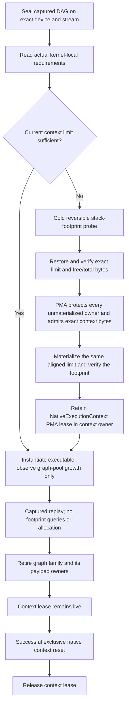

`PhysicalMemoryAuthority` owns the pending-demand calculation and the separate
immutable context-allocation certificate. Backend storage retains only its
canonical leases, not an independently updated byte balance. Lazy-pool
reservations are not mistaken for materialized backing. CUDA's probe/restore/
materialize sequence uses explicit RAII transitions and rollback; a changed
footprint or failed restoration is fatal. HIP authenticates the same setup
scope without inventing a CUDA-style stack-limit expansion.

All GPU planning-probe entry points now use this boundary. New device-free
admission/lifetime regressions and the cold production-size CUDA LocalTP proof
are explicitly registered in `ProductionTestPreflight`. The rebuilt PMA/planner
Unit registrations and device-free admission entry pass (3/3, 1.68 s). All eight
real CUDA/ROCm planning registrations pass (34.08 s), including native
collectives, prepared experts/projections, streaming bandwidth and host/device
service; their complete driver window is clean.

The Release CUDA2 projection-owned auto HTTP cell now passes 45/45 checks in
80.93 s. Its 5.2k-token recall prompts complete in 2.77–2.93 s; structured
generation completes 2,048 tokens in 17.35 s with monotonic records and no
duplicate lines. Tool round trips, prefix checks, movement/placement evidence,
near-boundary context, shutdown and driver evidence pass. VRAM returns from the
server's 25,554 MiB backend delta to the original 42 MiB baseline. Together with
the earlier ROCm2 45/45 pass, both new-mode frontend cells are green. Evidence:
`native-context-planning-green` and
`projection-cuda2-auto-e2e-context-fixed-run2` under the ignored result root.

The cold lifetime proof additionally covers public exclusive model unload and
successor-context admission. That extension's initial fixture
had a zero allocation BOM, correctly rejected by retirement; it now holds and
releases real PMA-owned workspace before completing unload. All twenty fresh
processes pass the final capture/repeat/unload/re-admit proof in 76.09 s; the
complete driver window is clean (`native-context-reset-loop-v2`). The complete
Integration gate targets were rebuilt after the owner/vtable changes: fresh
Unit is 684/684 in 77.01 s and production preflight is 570/570 in 2,135.36 s.
The full preflight driver interval contains no new records or findings. Evidence
prefixes: `native-context-full-unit`, `native-context-full-preflight` and its
`driver-diagnostics.json`. These current-source results supersede the earlier
Unit/preflight observations; final benchmark/default decisions, the full HTTP
matrix and shipping-image certification remain separate pending obligations.

### Projection-mode automatic costing and scope agreement (2026-10-01)

The former whole-expert-only cost compiler could not price
`GateUpOwnedDownColumns`. The new description binds the canonical
`MoEExpertProjectionOwnership` to the actual admitted domain membership and
source triplet. Gate/up work uses that participant's owner quota; down work
uses all routed experts and only its fixed output columns, with the full
reduction width. In particular, zero gate/up owners do **not** mean zero down
work. An overlay's fixed zero-owner weight BOM is not its selected live expert
inventory; this description neither alters PMA accounting nor invents a live
placement ledger.

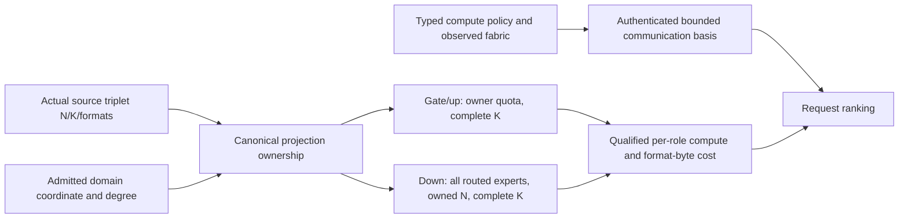

GPU memory traffic uses the source format's existing NativeVNNI logical-plane
size or its actual floating scalar width. No weight conversion, precision
change, GPU state readback, or anonymous memory allowance is introduced.
Arithmetic rates remain explicitly qualified extrapolations from the measured
complete-FFN sample. Native column gathers are explicitly identified as
allreduce byte-volume proxies, not claimed measurements of gather throughput.
Counted intermediate channels price live owner records and publication fields,
not reserved channel capacity or cache-line padding. This cost model is not a
certificate that the P2P intermediate implementation is already compact.

The first real ROCm2 HTTP attempt exposed a second gap: a TP-only search omitted
host-link sampling even though this compute policy uses counted mapped channels
when P2P is unavailable. Unrestricted synthetic searches had sampled PP/overlay
links and hidden the omission. The requested compute policy now enters the
versioned, all-rank sample-plan agreement; TP-only projection searches retain
each permitted GPU's exact rank-owned first-touch basis. Whole-expert TP and
explicit single-device searches keep their previous smaller basis. No other
rank's NUMA sample or a different inference transport substitutes for missing
evidence.

Focused preflight now covers both phases, CUDA/ROCm source identities, all
23 GGUF source formats, valid 2/4/8-way geometries, zero-owner down work,
TP-only scope selection, missing fabric evidence and malformed policy. The
scope-specific regression first reproduces the exact HTTP planning exception,
then passes with the fix. The focused entry and complete MemoryPlanner suite
pass in 1.68 seconds (`projection-cost-scope-green`). The preceding fresh full
Unit gate passes **684/684 in 77.06 seconds** (`projection-cost-full-unit`).
The Release public-auto ROCm2 projection cell now passes **45/45 HTTP checks
in 119.98 seconds** (`projection-rocm2-auto-e2e-scope-fixed`). It includes all
eight full long-context checks, 2,048-token structured generation, JSON/SSE
tool round trips, and prefix reuse. The runner independently accepts the
automatic selection, exact routed-compute mode and required movement evidence;
teardown releases VRAM to its original level and the driver window is complete
and clean. This is one AVX-512 local Release cell, not an aggregate image or
CUDA certificate. CUDA context-stack attribution below remains a separate
unresolved admission defect.

### Exact Nail dynamic-depth attribution (2026-09-30)

One public-auto plan selects ROCm ordinal 2; all four counterbalanced cohorts
apply that same plan, prompt, FP32 activation/FP16 KV policy and seed. Each
cohort has one warmup and three measured 128-token decodes. No profiler,
PerfStats or build overlaps these timings. Fixed depth 3 / dynamic 1..15 /
dynamic 1..15 / fixed depth 3 yields:

| Cohort | Prefill tok/s | Decode tok/s |
|---|---:|---:|
| Fixed 3, first | 1,163.44 | 146.17 |
| Dynamic, first | 1,163.56 | 125.87 |
| Dynamic, second | 1,164.39 | 125.65 |
| Fixed 3, last | 1,165.01 | 145.27 |

All twelve measured token streams are identical. Both policies execute depth
3 with 85.4369% acceptance (88 accepted, 15 rejected, 40 verifier invocations);
dynamic does not change depth during this window. This isolates envelope
overhead from acceptance or learned-policy differences.

Separate rocprofv3 runs authenticate the last 40 transactions, excluding the
warmup. Fixed submits 56,483 kernels; dynamic submits 72,483 for the same
128-token output. The additional 16,000 launches are largely guarded inactive
tiled-MoE families. Live single-projection GEMV, deinterleave, quantization and
attention also pay larger reserved-envelope scheduling costs. Summed kernel
service is attribution under profiling, not an accepted throughput benchmark.
Both profiler lifetimes and the native A/B/B/A have clean complete driver
windows. Evidence: `issue16-nail-short-abba/`, `issue16-nail-fixed3-trace2/`
and `issue16-nail-dynamic-trace/` under the ignored root above.

Single-projection ROCm NativeVNNI producer/reducer kernels now use the same
bounded live-row worker contract already used by fused projections. Physical
split-K strides and ascending serial-row arithmetic remain unchanged. The
focused preflight entry passes **149 tests**, including all 21 codebooks at a
wide depth-15 envelope, actual captured-grid inspection, every live count,
empty publications and poisoned inactive rows. This is a numerical/scheduling
certificate, not evidence of an end-to-end speedup. The updated native
A/B/B/A yields fixed 144.10 / dynamic 125.34 tok/s means, versus the previous
145.72 / 125.76. Auto selected ordinal 0 for this second campaign rather than
the first campaign's ordinal 2; this is not a same-device causal comparison.
The within-campaign gap remains about 13%, so it does not demonstrate a
meaningful benefit. All 24 measured
before/after token streams agree exactly, and the complete driver window is
clean. Inactive tiled-MoE dispatch costs remain unresolved.

### Live-request GDN deinterleave (2026-10-01)

Both CUDA and ROCm merged-Q/K/V transforms now borrow the recurrence's existing
device-owned request-length array through `DeviceRequestRowRanges`. Request
strides and Q/K/V plane bases stay physical. Only the request-local live prefix
is copied; an empty first request does not suppress a following live request.
There is no new count publication, host shadow, graph node, buffer rebinding,
allocation, weight conversion or changed arithmetic order.

The focused rebuilt delta gate passes **12/12 entries in 52.24 seconds**.
Its new native capture proofs cover four regular/odd/modulo-head geometries,
one/two requests, full/short/empty/large-to-small-to-large replays, raw FP32 bit
patterns, untouched poison tails, exact stream rejection and one native kernel
node. CUDA reports 37 registers and six possible resident blocks per SM; gfx906
reports 23 VGPRs and eight possible resident blocks per CU. Both inspected
kernels have zero private-memory bytes; both optimized compiler spill guards
pass. These new functional entries and the typed metadata proof are explicitly
registered in `ProductionTestPreflight`.

An initial auto-selected ordinal-3 A/B/B/A gives fixed 144.59 / dynamic 128.74
tok/s. To remove cross-revision endpoint drift, a second A/B/B/A applies the
original ordinal-2 auto plan without rerunning selection:

| Matched ordinal-2 cohort | Prefill tok/s | Decode tok/s |
|---|---:|---:|
| Fixed 3, first | 1,161.86 | 144.02 |
| Dynamic 1..15, first | 1,162.71 | 128.22 |
| Dynamic 1..15, second | 1,162.22 | 129.07 |
| Fixed 3, last | 1,161.57 | 143.81 |

The matched dynamic mean is **128.64 tok/s**, versus the original **125.76**
(+2.29%). Fixed's mean is 143.92, versus 145.72 earlier; the remaining
within-campaign dynamic gap is **10.61%**. The timings do not certify recovery
of the entire reported gap. All 48 measured token streams across the four
campaigns agree byte-for-byte, with identical depth-3 acceptance and no dynamic
depth changes. The full [1,15] envelope, source formats, activation/KV precision,
prefix-cache setting and seed remain unchanged.

A separate updated rocprofv3 trace still submits 72,483 kernels for the measured
40 transactions, but the 1,200 GDN transforms now average **4.01 us**, rather
than **18.86 us** in the original dynamic trace (fixed previously 3.83 us).
Their summed service falls from 22.64 to 4.81 ms. The wider retained launch
grid remains, but it no longer copies padding. Profiled service is attribution,
not accepted native throughput. Every new gate, benchmark and profiler lifetime
has complete, clean driver evidence. Local prefixes: `issue16-gdn-live-*`,
`issue16-nail-gdn-live-*`, and `issue16-nail-dynamic-gdn-trace*`.

The October 2 source-only audit confirms the retained-launch mechanism; it is
not a new timing result. `MTPVerifierPhysicalWidthPolicy::DynamicDeviceEnvelope`
keeps the admitted scalar verifier at its maximum physical width. For a
15-draft capacity that width is 16, even when a transaction has three drafts
and one bonus row. `ROCmMoEGroupedRouteAdmission::maySelect()` examines every
reachable live count during capture. The current generic policy is route-owned
through eight rows and expert-tiled above eight, so a 16-row capture retains
both families. Replay's device group publication chooses the compact family
for four live rows, but the dormant tiled nodes still submit and reject work.

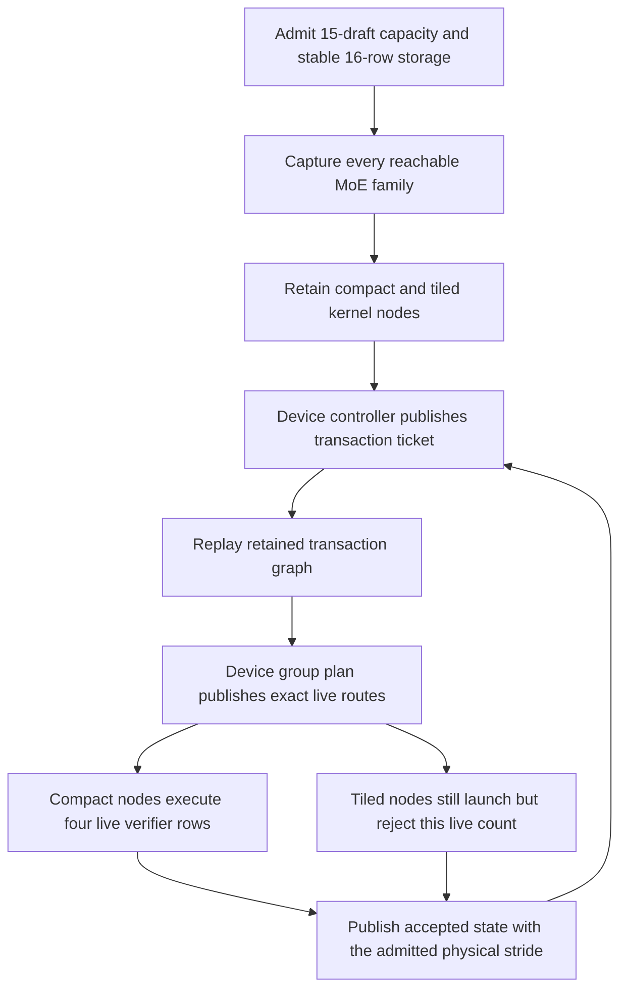

A route-policy change is a potentially smaller optimization than another
verifier graph-family lifecycle, but it requires timing compact versus tiled
execution over every reachable row count and representative routing skew.
Sparse average routing is not proof that expert reuse is absent: concentrated
rows may make tiling economical. No policy is changed from this audit. A
candidate must preserve all 15 drafts, device-owned live counts, serial-row
bytes, prefix/reset transitions and all-format correctness; changing only the
width selector would not establish the token-packing, history and publication
stride contract. Fresh native timings follow the ongoing stability gate;
profiling or benchmarking does not overlap its six GPUs.

The exact Tiel Q8_K_XL artifact is also staged from revision
`bbe9e566f39e4fc9652ac66b71968289a03c520a`, declared size 38,840,606,560
bytes. Metadata confirms BF16 whole triplets at layer 1, Q8_0/BF16 mixed
triplets at layers 34/38/39, and Q3_K predictor experts. It therefore genuinely
exercises issue #14's representation boundary; a generic uniform-quant model
would not reproduce that issue. GPU planning's expert source sampler now calls
the same arithmetic validator as the live transfer directory before loading,
preparing or allocating that expert sample. Its device-free regression covers
all 21 quantized codebooks against FP16/BF16/FP32 in all three projection
positions, uniform supported families, mixed floating precision, unknown
formats and malformed geometry. The explicit admission preflight entry passes
in the twelve-entry delta above.

Public auto plans for both two and three ROCm cards now reject the exact source
with an actionable layer-34 diagnostic: `ffn_gate_exps=NativeVNNI/Q8_0`,
`ffn_up_exps=NativeVNNI/Q8_0`, `ffn_down_exps=floating/BF16`. Both driver windows
are clean. No source tensor was converted. This implements the reporter's
requested diagnostic option; it does **not** implement mixed-arithmetic FFNs,
certify the independently reported complete-residency limit, or make a
partial-residency policy available. Those distinctions must remain explicit
in any issue or release response.

### Retained-width audit and refreshed gates (2026-10-01)

The rebuilt aggregate gates pass **684/684 Unit entries in 78.57 seconds** and
**563/563 production-preflight entries in 2,092.14 seconds**. The complete
preflight driver window is clean (zero new records or findings). These gates
include the live-request GDN transform and precise mixed-projection admission
regressions above. The subsequent learned-block-count unification is a new
metadata-only delta: its six focused entries pass in 1.75 seconds, and the
refreshed full Unit gate passes 684/684 in 77.80 seconds. The reproducer first
failed because a complete trailing NextN block without its optional count key
was discovered by the weight manifest but omitted by planning. The shared
directory/metadata resolver now gives both consumers one learned block, and
the regression proves exactly one shifted-cache contribution on CPU, CUDA and
ROCm, including serialized profile round trips. It does not confuse draft
depth with learned-block count. The new explicit preflight accounting entry
passed in the focused gate; the expanded aggregate has not yet been rerun.

The updated dynamic trace attributes its 16,000 extra measured launches to
6,400 tile-directory kernels, 3,200 tiled down projections, 3,200 tiled gate/up
projections and 3,200 partial publishers. Together those inactive families
consume about 68.4 ms of profiled service. The device selector correctly picks
the sparse route-owned path for the actual four-row transaction; the retained
16-row graph must still contain the other reachable family. This is retained
envelope overhead, not evidence of incorrect expert routing or poor acceptance.

The current homogeneous HIP lifecycle is:

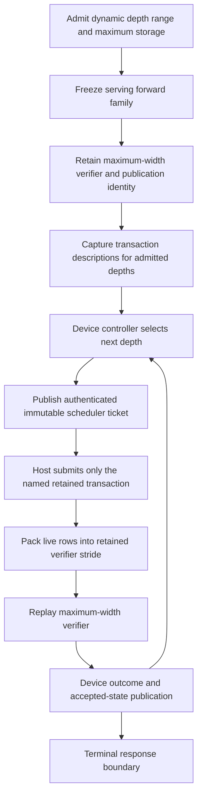

Ticket-selected depth branches currently share the same maximum verifier
width. Narrowing only the width selector is invalid: token packing, forward
cache identity, stage-owned rollback/history publication and the publication
template must agree on the same physical width. The preparation registry
already has bounded buckets, but the retained forward inventory and singular
publication owner do not constitute a complete bucketed family. A structural
fix must install and admit that complete family during setup, with shared
storage only where non-concurrency is proven. It must preserve device-owned
depth decisions and the existing immutable ticket boundary; no recapture,
eager replay or host model-state mirror is an acceptable substitute.

### Inactive tiled-directory work (2026-10-01)

The next focused reproducer poisoned the complete retained tile directory,
then changed only device routing data to empty or sparse-tail work. The old
directory planners overwrote that poison even though every tiled consumer was
inactive. The red run also exposed a newly added observer's null workspace
owner after rebinding; the fixture now retains exactly one current workspace
owner. That observer bug was a host-side test failure, not a GPU fault.

All four fixed-tile and both adaptive directory planners now borrow the same
`ROCmMoEGroupedRouteAdmission` value as their consumers. They return uniformly
before the expert-count scan, barriers or directory stores when the device
selector does not choose expert tiling:

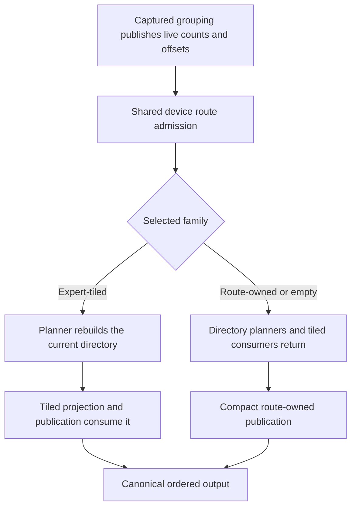

This removes inactive scans and stores, not the retained launch nodes. No new
flag, host decision, allocation, representation conversion, publication or
arithmetic order was introduced. Restoring tiled work rebuilds the directory
before reading it; dormant stale storage has no consumer. CUDA has no matching
directory-planner implementation to change.

The rebuilt five-entry functional delta passes in **97.67 seconds**, with a
complete clean driver window. It includes the dedicated all-codebook preflight
entry, the existing all-codebook canonical-publication sweep, sparse-tail
capture, packed SwiGLU and the projection boundary. Complete/empty/tail/complete
replays retain the same graph and compare serial-row bytes; rebinding also
uses the new active workspace. The six optimized gfx906 entrypoints have zero
scratch bytes and zero SGPR/VGPR memory spills: fixed planners use 7 VGPRs and
22 SGPRs, adaptive gate/up 13/44, and adaptive down 10/25. They retain the same
512-thread geometry and fixed/adaptive 2/4 KiB LDS. ISA inspection confirms the inactive exit
precedes directory barriers/stores.

The full Unit gate remains 684/684; the last complete preflight gate was
563/563 before the two new accounting/directory entries. The current registered
preflight inventory is 565, not a claim of a fresh 565-entry aggregate pass.
The matched original ordinal-2 Release A/B/B/A yields fixed 142.93 / dynamic
128.69 / dynamic 129.62 / fixed 143.70 tok/s. The means are **143.31 / 129.15**:
dynamic is **90.12%** of fixed, and rises only **0.40%** from the preceding
128.64 result. Prefill remains 1,159–1,161 tok/s. This is a modest result with
little margin, not proof that retained-width overhead has disappeared. All
60 measured 128-token streams across five campaigns agree exactly; depth 3,
85.4369% acceptance and zero depth updates are unchanged. Driver evidence is
complete and clean. Evidence prefix: `issue16-nail-directory-live-matched-abba`.

## Native live-row installation and final overlap audit (2026-09-30)

### CUDA native planning-memory attribution (2026-10-01)

The new CUDA2 projection-mode E2E cell initially failed before inference: its
two retained native planning graphs report 48 MiB against a 44 MiB executable
allowance. A diagnostic built with the Integration target's exact ABI flags
reproduces the production worker/LocalTP/TransferEngine/PMA transaction at
H=2048 and prefill M=64. Native metadata explains the mismatch:

| Boundary | CUDA requested stack limit | Captured kernel local bytes/thread | Reported instantiation growth |
|---|---:|---:|---:|
| Worker/communicator prepared | 1,024 | — | — |
| One-row NCCL RING_LL instantiated | 1,296 | 1,288 | 34 MiB |
| 64-row NCCL RING_SIMPLE instantiated | 1,424 | 1,416 | 14 MiB |
| Both executable owners retired | 1,424 | — | Memory remains resident |

Both kernels use 96 registers/thread. The native runtime grows context-owned
kernel stack storage during graph instantiation; the free-memory delta is not
solely executable storage. The requested limit and resident bytes persist
after graph destruction, and communicator retirement releases a separate
16 MiB. Kernel attribute inspection uses no CUDA profiler or device readback.
The diagnostic's successful run has a clean driver window. Its initial
standalone build used incomplete conditional ABI definitions and failed in
host tensor initialization; that diagnostic failure is not a production GPU
failure or evidence against the aggregate gates.

A controlled native ablation prepares each captured kernel's exact local-byte
requirement through `cudaDeviceSetLimit` at a separate diagnostic boundary.
The same 34/14 MiB growth occurs there, then both instantiations report zero
growth. Graph destruction still releases none of that storage. Its complete
driver window is clean. This independently distinguishes context stack growth
from executable storage; the ablation is not installed as a production fix or
an unaccounted global NCCL setting. Evidence:
`native-localtp-memory-prepared.log`.

This identifies the accounting cause, not a completed fix. Kernel/context
storage must receive an explicit PMA workspace obligation distinct from
executable storage, with its actual context lifetime and already-resident
credit. Merely raising the general executable unit or setting an unaccounted
NCCL stack override would hide the misattribution. The public-auto CUDA2 E2E
cell remains red until the complete admission/materialization contract is
implemented and its cold-process regression passes.


The native live-row prototype described below is now wired into the production
NCCL/RCCL collective interfaces. `NativeCollectiveRows` separates admitted
storage/strides from a device-owned live prefix for allgather, allreduce and
reduce-scatter. `TransferEngine` still owns publication; the native collective
reads the count in captured execution. No host count readback, new payload
allocation, graph recapture, precision change or transport substitution was
introduced. Main single-request prefill obtains its count from the authenticated
`DevicePrefillChunk` materializer. MTP graph construction explicitly suspends
that binding rather than borrowing a main-prefill count with another meaning.

The native patches and their content identities are included in both canonical
dependency installers and the image build. Local runtime validation uses the
tested sm86/gfx906 library builds; this is **not yet a clean all-shipping-target
container certificate**. The project-owned GPU spill guard is unchanged. The
narrow native NCCL tradeoff retains the faster 96-register implementation with
residual spills, rather than the measured slower high-register alternative;
the executed RCCL sum/min/max entries have no scratch memory spill traffic.

Focused proof before the final scheduling change:

- Each backend passes 1,200 captured native replays: three collectives, all five
  supported scalar types, two row widths, observed/unobserved payloads, and
  full/partial/empty/growing prefixes with poisoned unused capacity.
- Seven stage-level operations cover allgather, FP32/FP16 allreduce and column
  scatter, and FP32/FP16 grouped sidebands. Empty payloads retain their control
  sideband and do not overwrite the live count. Both backend tests pass.
- Six typed contract tests, twelve existing native collective/overlap
  regressions and both dependency-packaging tests pass. All diagnostic driver
  windows are complete and clean.
- Five measured 256-token Release runs per backend exactly match the previous
  installed token stream. The saved plans retain dynamic residency, static-owner
  routed assignment, and learned dynamic MTP; assignment is not a claim that
  the separate residency controller was configured Static.

| Current unprofiled Release smoke | Prefill tok/s | Decode tok/s |
|---|---:|---:|
| ROCm2 | 1,350.42 | 98.83 |
| CUDA2 | 2,011.98 | 167.49 |

These are repeat-averaged installed checks, **not a fresh paired causal A/B**.
They do not supersede the previous 1.524x communication-discounted scaling
certificate or prove the 1.6x target. The new live-row API currently binds main
prefill only: grouped verifier/ragged query extents, ownership-sparse embedding
publication and the P2P-active sparse intermediate bank remain distinct economy
gaps. Do not advertise total communication-volume completion.

Fresh native traces authenticate every prefill communication family on both
participants and both 512-capacity/448-live and 64-live graphs. NCCL/RCCL logs
show exactly one communicator per device and the new `*DeviceRows` entrypoints.
Their printed counts are storage capacity, **not measured replay wire bytes**;
the focused native observer tests prove actual clipped primitive payloads.
ROCm dispatch intervals give this main-chunk overlap audit:

| Communication family, summed within one participant only | GPU 2 inclusive / exposed ms | GPU 3 inclusive / exposed ms |
|---|---:|---:|
| Attention/GDN output sums | 36.973 / 36.973 | 37.566 / 37.566 |
| Shared column reduce-scatter | 21.038 / 0.629 | 21.320 / 0.533 |
| Final combined-column gather | 19.971 / 19.971 | 21.150 / 21.150 |
| Owned-router exchange | 1.539 / 1.539 | 1.438 / 1.438 |
| Routed-intermediate exchange | 14.595 / 3.405 | 14.852 / 3.184 |
| Embedding sums, two occurrences | 5.281 / 5.281 | 1.892 / 1.892 |

Shared scatter is 97.0/97.5% overlapped in the main chunk and 98.5/99.97% in
the suffix. Intermediate exchange overlaps shared FFN for 76.7/78.6% of its
main-chunk dispatch interval. Other families have no independent compute in
the current captured DAG; that proves the present dependency structure, not
that no deeper algorithmic pipelining could ever help. Earlier shared scatter
has only a 1.635/1.344-ms optimistic aggregate readiness opportunity here;
workspace ownership and the ordered native communicator must still be proved
before removing those edges. Existing row-tiling measurements below do not
justify a blanket pipelining default.

CUDA's native-event observations prove the same independent branches and
required joins without CUPTI attachment. Their broad brackets include queue
scheduling and observer interference, so they are not precise kernel service
times or an achieved-overlap percentage. No hardware-counter or spill result
is inferred from those event brackets.

The decode audit found a separate avoidable edge: all forty shared full-row
allreduces followed routed-down completion and its final column gather. The
shared partial was already ready. On ROCm that exposes 2.796/2.784 ms in the
last 27.984/27.963-ms verifier transaction. The retained narrow correction uses
the existing paired overlap lifecycle and retains the original full-row sum,
gate and add arithmetic (no verifier reduce-scatter substitution):

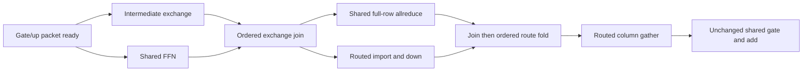

`overlapMoEProjectionSharedAllreduce` owns these protocol edges in the reusable
builder; the model declares the policy. CUDA/ROCm native and device-counted
projection fixtures cover all expert formats, every serial/MTP row count 1–16,
twenty owner/full/empty/partial replays, exact shared-sum bytes, guard regions
and the submission order. They are explicitly registered in
`ProductionTestPreflight`. The initial five-row-set versions pass on both
backends. The expanded every-row sweep and the complete final scheduling gate
passed: **682 Unit + 544 production-preflight entries, 1226/1226**, in 26m27s,
with a complete clean driver window. This certificate precedes the separate
maximum-context/stochastic changes above and must not be reused as their gate.

The final scheduling decision uses an unprofiled Release A/B/B/A, two process
cohorts per variant and five measured 256-token generations per cohort. Only
the shared decode-sum scheduling edge differs between immutable core libraries;
plans, model, prompt, seed, learned MTP policy, native libraries and precision
are identical. No timing/profiling or channel override is active.

| Paired scheduling check | Control prefill tok/s | Overlap prefill tok/s | Control decode tok/s | Overlap decode tok/s |
|---|---:|---:|---:|---:|
| ROCm2 | 1,349.39 | 1,347.64 | 96.83 | 96.70 |
| CUDA2 | 2,009.77 | 2,007.08 | 167.44 | 180.20 |

CUDA decode improves **7.63%**. ROCm is neutral (**−0.14%**); its two control
cohorts vary from 95.31 to 98.36 tok/s, so this is not evidence of a ROCm
throughput gain or regression. Prefill is unchanged within 0.14%. All forty
measured streams match their backend's unchanged prior control, MTP transaction
validation reports no failures, and all four driver windows are complete and
clean. These are within-backend token comparisons, not cross-backend or HF
equivalence claims.

The independent ROCm trace confirms the intended event overlap rather than
just earlier host submission. Shared sums change from 2.796/2.784 ms entirely
exposed to 0.746/0.846 ms exposed (2.192/2.043 ms overlaps routed computation).
The traced final verifier shrinks from 27.984/27.963 to 26.911/26.929 ms.
This trace explains the scheduling behavior; it is not substituted for the
neutral unprofiled ROCm throughput result. CUDA's retained-conditional graph
does not expose equally precise child-kernel timing through the safe event
instrumentation on this host, so no precise CUDA overlap percentage is claimed.

The common scheduling implementation is retained for the repeatable CUDA
benefit, proved dependency overlap on ROCm, and no demonstrated ROCm regression.
No further kernel tuning is planned in this slice. Finish the final prerequisite
gate, then exercise full HTTP/long-context stability on both two-GPU plans.

Evidence is under ignored `parity-results/qwen36-rocm2-prefill/native-live-extent/`:
`production-*.log`, `model-*.json`, `rocm-final-dags.json`,
`rocm-decode-candidates.json`, `final-overlap-audit.json`,
`decode-overlap-comparison.json`, `paired-sum-*.json`, and complete driver
reports. The first refreshed build completed and all 682 Unit tests passed;
the aggregate was stopped before GPU preflight to incorporate this final
decode edge fix. It is not a complete prerequisite receipt. The next gate
must include the added scheduling regressions before HTTP E2E stability.

## Ordered route folding and whole-model communication discount (2026-09-30)

The current compute-tuning gate discounts communication at model level as
well as running communication-free local probes. Valid captured inference
still executes the real collectives; removing them would corrupt downstream
activations/routes. Separate native-DAG analyses set communication service
cost to zero and recompute the longest path. Main and suffix chunks and both
participants are included. The maximum participant-local path is an explicit
lower-bound envelope: the exports do not authenticate cross-device peer-ready
edges. This is not achieved communication-disabled inference throughput.

A new route-fold candidate overlaps eight independent loads in a bounded
register window, then performs the **unchanged ascending FP32 additions**.
Partial windows retain the same serial order. Eight is the register window,
not a hard-coded model route count. There is no new persistent memory, graph
node, format conversion, host readback or stream operation. Both GPU backends
use the same helper; every expert weight format reaches this FP32 boundary.

Isolated A/B/B/A captured event medians, top-8 main rows, microseconds:

| Backend | Columns | Control | Candidate |
|---|---:|---:|---:|
| ROCm | 2048 | 77.47 | 48.70 |
| ROCm | 1024 | 73.62 | 28.86 |
| ROCm | 512 | 62.59 | 14.62 |
| CUDA | 2048 | 45.952 | 45.056 |
| CUDA | 1024 | 24.826 | 23.424 |
| CUDA | 512 | 14.208 | 12.544 |

All 96 geometries per backend pass their independent serial oracle. Separate
ROCm one-dispatch counters retain the same FetchSize (16385.5625) and 8192
wavefronts; MemUnitBusy rises 15.14 to 76.54 while serialized waits become
overlapped requests. The isolated candidate has 20 VGPRs versus 7, zero
scratch/spills. CUDA has 40 registers and zero stack/spills; CUPTI attachment
remains prohibited on this host, so no achieved-occupancy claim is made.

Full-model communication-discounted main+suffix DAG envelope:

| Metric | Control | Candidate |
|---|---:|---:|
| ROCm1, dependency-only compute | 410.282 ms | 409.117 ms |
| ROCm2, dependency-only compute | 271.481 ms | 268.480 ms |
| ROCm2, retained queue order and gaps | 279.949 ms | 277.866 ms |
| ROCm1/ROCm2 dependency-only scaling | 1.511x | 1.524x |
| CUDA2, broad native-event compute envelope | 191.704 ms | 191.698 ms |

The overall ROCm change is 1.1%, but replacing **only** the authenticated fold
intervals in the control DAG yields 269.584 ms: 1.898 ms / 0.70% attributable
to this family with unrelated timings held fixed. CUDA's same replacement
estimate saves only 0.069 ms. Its broad event brackets include substantial
scheduling/contention: e.g. count-per-expert totals grow from 0.378 ms on one
GPU to 9.984 ms on two. Zeroing NCCL nodes does not remove contention already
charged inside those compute brackets. Do not use that CUDA envelope as a pure
kernel-scaling certificate or claim a resolved whole-model CUDA speedup.

The preceding CUDA cohort retained an old diagnostic script's eight-channel
override; it must not be mixed with the default-channel unprofiled cohort.
That override was removed from the local trace script. A fresh, default-channel
control/installed-candidate capture (`moe-fold-default-dag-*`) preserves tokens
and reports a clean driver window. Its dual-GPU broad-event envelope is
193.773 versus 192.748 ms, but replacing only authenticated fold intervals
with unrelated timings held fixed saves just 0.100 ms (0.052%). This confirms
the small attribution, not a 1.8x CUDA compute-scaling certificate: native
before/after events still include queue scheduling and concurrent interference.

A narrower count-only CUDA audit makes that limitation concrete. Every captured
count kernel reads/writes its own device's VRAM (driver memory type 2), with
4,096 main / 512 suffix slots and 256 experts on both single and dual GPU.
There is no mapped-host or peer-pointer mistake at this boundary. Narrow event
brackets remain about 305 us per main count on two GPUs versus 9 us on one.
An isolated integer-equivalent count replacement, with per-block GPU clocks,
records main on-device spans of about 11.3/14.3 us on the two participants,
against surrounding event medians of 305.7/313.9 us. The suffix's internal
span is at/below the roughly 1.024-us clock granularity, not 60 us. Its added
barriers/stores make this a diagnostic, not the production kernel's benchmark;
it nevertheless rules out interpreting the entire event bracket as counting
work. Two captured replay tests pass, both 16-token model outputs match the
unmodified runs, and all driver windows are complete/clean. The probe compiles
with 12 registers and zero stack/local/spills. Evidence: `compute-count-*`,
`compute-narrow-count-*`, `count-selftime-smoke*` and `native_count_selftime*`.
Consequently the CUDA broad-event zero-collective DAG remains **contaminated
by scheduling/communication waits** and cannot certify pure compute scaling.

Communication-included Release A/B/B/A smoke/correctness runs preserve all
20 measured 256-token streams per backend, along with MTP work. ROCm prefill
averages approximately 1322.07 to 1328.46 tok/s; CUDA 1878.94 to 1882.11.
These small end-to-end changes are not the compute acceptance metric. Driver
windows for timing, counters and model traces are complete and clean.

The shared helper and focused captured-replay regressions are now installed;
the complete 1,218-test prerequisite gate passes (682 Unit plus 536
`ProductionTestPreflight`, 1,465.9 seconds wall time). All 240 host, 103 CUDA,
116 ROCm and 77 exclusive/mixed-device preflight cases pass. The GPU gate's
driver window is complete and clean. Installed Release model validation and
four targeted mathematical cells reuse this one gate rather than rerunning it
per cell. Both installed 96-shape sweeps pass, and all five measured 256-token
Release iterations per backend match their pre-change controls. The unprofiled
installed smoke reports ROCm2 1,329.36 tok/s prefill / 94.70 tok/s decode and
CUDA2 1,881.12 / 163.64; these remain communication-included supplementary
numbers, not compute-scaling claims. Canonical Static/MTP-off and
Dynamic/adaptive-MTP HF cells pass on ROCm2 (18.46/47.59 s) and CUDA2
(18.66/47.70 s), with all 36 required CSV artifacts. Both installed and HF
driver windows are complete and clean.
The device-free all-stride/window arithmetic test passes. Integration replay
covers every verifier M=1..16, prefill tails, top-k through 33, full/zero/sparse
inputs, signed zero, cancellation and poisoned capacity/output guards. CUDA
and ROCm cases are explicitly registered in `ProductionTestPreflight` and pass
in 4.31/3.66 s respectively, with a complete clean driver window. The Integration
build passed the spill guard for CUDA 80/86/89/90 and HIP gfx906.
Both builds now contain the helper. Offline resource inspection of the actual
Release objects reports 18 VGPRs / 20 SGPRs / zero scratch and spills for the
HIP fold, and 40 registers / zero stack or local bytes for CUDA; the earlier
20-VGPR figure belongs to the isolated ABI probe, not the installed object.
Evidence: `moe-route-fold-*`, `moe-fold-dag-*` and `route-fold-*` under the
ignored result directory. The 1.8x scaling goal remains unmet.

The separate fused adaptive gate/up candidate also has a full-model discounted
comparison now (`moe-adaptive-dag-*`). Its dual-GPU main+suffix envelope falls
271.807 to 269.749 ms (0.76%), but single-GPU falls 410.240 to 406.958 ms too,
leaving the 1→2 ratio effectively unchanged at 1.509x. Preserving measured
queue/scheduler gaps gives 280.624 versus 280.591 ms, effectively neutral.
Actual main gate/up contribution falls 46.127 to 44.622 ms on participant 2
and 45.496 to 44.049 ms on participant 3; suffix is essentially unchanged.
The expected candidate is authenticated: 39 adaptive layers change from two
TM12/TM16 dispatches to one TM16-capacity dispatch. Token streams match and
both driver windows are complete and clean. This remains an isolated candidate,
not an installed dispatch/default change or a claimed scaling-goal success.

### Rejected GDN query-load lookahead

An isolated current-source candidate moved the immutable Q-register loads
ahead of the first recurrence pass, with no arithmetic, ownership, tile,
capacity or stream change. Both control and candidate pass the five captured
serial-byte-equivalence suites and the compiler spill guard. A/B/B/A captured
medians regress from 800.04 to 855.19 us for 448 rows / 16 heads, and from
110.02 to 117.74 us for the 64-row suffix. It is not installed.

The exact single-dispatch counter comparison retains 128 waves, 124 allocated
VGPRs and zero scratch. LDS instruction count is unchanged (23188.75), but
ALU-stalled-by-LDS rises 3.17 to 11.33 and VALU busy falls 14.73 to 13.40.
Static instruction scheduling changes without eliminating loads; issuing Q
earlier does not establish overlap or economy. Both driver windows pass.
Evidence prefix: `gdn-query-ahead-*`.

### Rejected gate/up alternating LDS banks

An isolated candidate alternated two activation/scale LDS banks by the global
K-block ordinal, eliminating the trailing overwrite barrier without changing
the serial arithmetic, weight formats or global workspace. The five captured
all-format integration suites pass, as does the gfx906 spill guard. The clean
six-shape timing pair regresses every shape by approximately 1.3–2.2%; the
two-way main gate/up phase grows from 1442.84 to 1460.48 us. A reverse-order
repeat confirms the loss. It is not installed.

One exact live IQ2_S/TM12/TN128 counter dispatch retains 9,568 waves and zero
scratch; VGPR allocation grows from 56 to 60 and LDS from 512 to 1,024 bytes.
LDS stalls are already small and decrease slightly, while memory-unit busy
rises from 70.42 to 71.67. Fewer barriers do not establish a faster kernel.
The TM16 variants also cross the 64-VGPR occupancy boundary. All completed
timing/counter driver windows are clean. Evidence: `moe-stage-pingpong-v3-*`,
`moe-stage-pingpong-v4-*`, and `moe-stage-pingpong-profile-*`.

The initial unchanged interposer failed because its device entrypoints and IQ
constant tables were not fully isolated from the core DSO. Renaming all of
them repairs that experiment; it is not a production numerical defect. The
first broad timing filter additionally selected unintended skewed profiles and
was explicitly stopped. Neither that interrupted run nor the invalid original
control is counted as a completed pass.

### GDN full-column predicates: faster, but not a scaling solution

The next isolated candidate specializes only the three arithmetic predicates
whose terminal-only, cached, static-width launch owns complete value-column
blocks. Initial/final storage and snapshot bounds remain unchanged. Both
control and candidate pass all five captured serial-byte-equivalence tests.
Allocated VGPRs fall from 124 to 92, with zero scratch or memory spills.

A/B/B/A main-row medians improve from 873.47 to 826.13 us for 32 heads,
799.79 to 779.51 us for 16 heads, and 795.02 to 774.65 us for eight heads.
All three 64-row suffixes also improve. This is an absolute kernel improvement,
but the single-card shape benefits more: the main 1-to-2 scaling ratio falls
from 1.092x to 1.060x. It is not installed and has no whole-model certificate.
The isolated 16-head/448-row counter pass retains 128 waves; LDS stall falls
from 3.03 to 2.11. Both completed driver windows are clean. Evidence prefix:
`gdn-value-bounds2-*`.

Removing every value-column predicate, or spending the freed registers on
adjacent-token software pipelining, instead causes compiler-proven memory
spills. Those three variants were rejected before GPU execution; no spill
guard or occupancy bound was weakened to run them. Evidence prefixes:
`gdn-value-bounds-*`, `gdn-bounds-pipeline-*`, and `gdn-bounds-pipeline3-*`.

### Rejected causal attention query ordering

Scheduling later (heavier) causal-query tiles first leaves arithmetic and
storage unchanged and passes all four captured attention checks, including
all-native-format context-partition equivalence. It does not improve the real
main shape: 448-row/TP2 medians are 950.60 versus 951.27 us; the 512-row/TP2
probe regresses from 1138.91 to 1174.75 us. The candidate is not installed.
The compiler spill guard and complete driver window both pass. Evidence:
`fa2-query-order-*`.

### Attention probability sharing: measured, not installed

For a sixteen-key/sixteen-lane query subgroup, each lane now computes one
probability in the isolated candidate, then broadcasts it to the output owners.
The ascending-key sum and every output FMA retain the old operation order.
A separate validity ballot distinguishes masked keys from valid probabilities
that underflow to zero. No persistent storage, precision, transport or graph
topology changes. Other tile geometries keep their existing implementation.

All four existing captured attention checks pass. An additional paired-DSO
oracle runs the old and candidate kernels inside the same retained graph,
on identical nonzero inputs: **496 cases / 1,488 replays are byte-identical**.
It covers all four native K/V formats, M=1..17 and larger tile/bucket tails,
causal/non-causal attention, window and additive masks, fully masked rows,
large-small-large context changes, ring wrapping, and untouched output guards.

The communication-free A/B/B/A probe improves 448-row TP1/TP2/TP4 attention
from 1656.55/950.80/566.12 us to 1590.12/915.88/543.60 us. The 64-row
suffix improves 624.64/388.08/195.96 to 597.98/370.12/187.28 us. An isolated
TP2/448-row counter dispatch retains 896 waves, 60 allocated VGPRs, 64 SGPRs,
and zero scratch or spills. LDS-stall observations rise 0.49 to 0.70 while
VALU busy falls 16.03 to 15.01; the unprofiled timing, not these counters,
establishes the small benefit. The initial profiler regex missed the enum's
demangled spelling and produced no counter evidence; the corrected second
pass is the resource/counter certificate.

Fresh single/dual model traces preserve all 16 diagnostic tokens per topology
and authenticate every attention entrypoint. Communication-discounted
main+suffix paths are 410.247/269.064 ms before and 408.781/268.281 ms after:
the ratio is **1.5247x versus 1.5237x**, effectively unchanged. Replacing only
the changed attention intervals in the control DAG saves **0.620 ms / 0.23%**
on two GPUs, keeping all other intervals fixed. This pairing authenticates
the entire graph's normalized symbols, geometry and dependency edges; the
direct/context producer branches are not falsely treated as one serial chain.
Every completed correctness, counter and model driver window is clean.

This candidate remains isolated rather than installed or gate-certified.
Evidence: `fa2-probability-*`, `fa2_probability_byte_oracle.*`, and the expanded
exact-shard profiler selectors in `Perf__ROCmFlashAttentionContextParallel.cpp`.

### Rejected register-window GDN output publication

A four-row register-only output window, based on the predicate specialization
above, preserves recurrence and passes the five captured byte-equivalence
checks and spill guard. It nevertheless regresses all principal shapes:
448-row 32/16/8-head medians rise from 827.36/780.21/776.81 us to
855.58/818.02/814.32 us. Suffixes regress too. It is not installed; its
complete driver window is clean. Evidence prefix: `gdn-output4-*`.

### Communication audit: exact payloads and exposed waits (2026-09-30)

Fresh installed-Release runs on both CUDA2 and ROCm2 retain the saved production
plans, native transport/channel defaults, real collectives, and the unchanged
16-token diagnostic workload. Both complete successfully, with zero MTP
transaction-validation failures and a complete clean driver window. Native
NCCL/RCCL `INIT,COLL` logs record exact API counts without attaching a CUDA
profiler. PerfStats authenticates the executed 512-capacity/448-live main
prefill and the 64-capacity/64-live suffix. These are diagnostic observations,
not replacement throughput certificates. Native log occurrences include graph
construction: they must **not** be counted as replay traffic.

The byte audit confirms a real gap on **both** backends. Attention-output
allreduces, shared-expert reduce-scatter, and final combined-column allgather
still use captured bucket rows, not the live prefix. For the measured main
chunk, 12.5% of these declared row payloads is inactive capacity (14.286%
overhead relative to the necessary 448 rows).

| Boundary, per participant and layer | Current logical extent | Required live extent | Consumer/reason |
|---|---:|---:|---|
| Attention/GDN output allreduce | 4 MiB FP32 | 3.5 MiB FP32 | Both participants need the summed hidden rows |
| Shared-expert reduce-scatter | 4 MiB input / 2 MiB result | 3.5 MiB input / 1.75 MiB result | Each participant needs only its owned output columns |
| Final combined-column allgather | 2 MiB local send | 1.75 MiB local send | The next layer currently consumes complete hidden rows |
| Row-owned router exchange | 14 KiB per producer, plus protocol metadata | Same | Only top-8 expert IDs and FP32 weights for 224 owned live rows |
| Routed intermediate exchange | 580 bytes per locally owned live route, plus protocol metadata | Same | Every down-column owner needs that route's unchanged intermediate |

These are API/semantic payload sizes, **not measured physical PCIe bytes**.
Reduce-scatter's input includes locally retained data; do not add those columns
as though all crossed the link. The intermediate's 580-byte record is a
4-byte original route ID, 512 existing Q8 bytes and sixteen FP32 scales. This
is not a new quantization boundary. At 448 rows/top-8, all producers together
own 3,584 records (2,078,720 bytes); with two participants, each record needs
one remote delivery. No unowned routes or inactive payload capacity is sent
on this device-counted path. The router communicates neither its full logits
nor its hidden vectors.

The two embedding allreduces also declare bucket-sized spans. Beyond row
padding, vocabulary-sharded embedding explicitly writes zeros for tokens
owned by another participant and sums the full bank. That is an ownership-
sparse publication opportunity, distinct from a true sum of dense partials.
The P2P-active native intermediate branch is a separate outstanding gap: its
fixed original-route bank includes unowned slots. This host's no-P2P run does
not certify that branch's communication economy. Keep native P2P selection;
do not hide the gap by globally forcing the host-channel implementation.

The actual reduction dtype here is FP32 even though attention requests the
default mixed-precision policy. The canonical threshold uses one logical
2048-element row, below the configured 8192-element threshold, to preserve
serial/grouped arithmetic. Both plans have an empty allreduce-precision
override. There was **no accidental explicit FP32 CLI override**. Reducing
traffic by changing precision or using an M-dependent threshold is outside
this slice. The logs show one native communicator object per participating
device, not an extra communicator family masquerading as useful overlap.

The existing authenticated ROCm control traces additionally provide a disjoint
same-device interval audit. Across the main captured graph, compute and
communication overlap for 32.955/34.914 ms, while communication alone occupies
73.986/81.338 ms on devices 2/3. These are not additive across devices and not
all exposed waits are removable. Per-boundary attribution is more useful:

| Main graph boundary, 40 layers unless noted | Device 2 inclusive / exposed, ms | Device 3 inclusive / exposed, ms |
|---|---:|---:|
| Attention/GDN output sums | 42.944 / 42.944 | 43.309 / 43.309 |
| Shared-expert reduce-scatter | 23.367 / 1.274 | 23.857 / 0.926 |
| Final combined-column gather | 22.595 / 22.595 | 24.142 / 24.142 |
| Embedding sums, two occurrences | 2.032 / 2.032 | 7.931 / 7.931 |

"Exposed" means no local compute dispatch overlaps that collective interval;
it does not prove bandwidth saturation or identify the peer's readiness.
Early-participant rendezvous skew inflates the embedding measurements. The
shared reduce-scatter is already about 95% hidden by routed work. Attention
output sums and final gathers are the larger serialization boundaries.

The current participant-local schedule is:

```mermaid
flowchart LR
    A[Attention or GDN projection] --> AR[Native hidden-row allreduce]
    AR --> N[Residual and normalization]
    N --> R[Owned routing and compact route exchange]
    R --> U[Owned gate/up and intermediate pack]
    U --> XS[Submit counted intermediate exchange]
    XS --> X[Intermediate exchange on auxiliary stream]
    XS --> S[Shared expert FFN on main stream]
    X --> XJ[Join intermediate exchange]
    S --> XJ
    XJ --> SS[Submit shared reduce-scatter]
    SS --> SR[Column pack and native reduce-scatter]
    SS --> D[Import intermediates and routed down]
    D --> F[Ordered route fold]
    SR --> G[Gate and combine owned columns]
    F --> G
    G --> AG[Native final column allgather]
    AG --> NEXT[Next layer]
```

`TPLocalReduceOverlap` currently uses one `tp_native_reduce_overlap` auxiliary
stream for both native reductions and counted exchanges. The reusable
projection builder also orders shared-reduction submission after intermediate
completion, even when that exchange is not a native-communicator operation.
Those are genuine conservative ordering constraints, but their measured
opportunity is small here: shared FFN finishes before the exchange in only
9/10 of 40 main layers. Its aggregate ready-before-exchange gap is
1.937/1.487 ms, an optimistic earlier-fork budget with durations held fixed;
the suffix budget is 0/0.002 ms. Do not promise a large gain from another
stream or an edge deletion. The shared and routed preparation also reuse
workspace, so their existing producer-before-reuse edges cannot simply be
removed.

Priority for the implementation slice:

1. Give captured row collectives a typed device-owned live extent distinct
   from admitted capacity; cover dense sums, shared column reduction and final
   publication, not just this model's intermediate exchange. The native
   host-count APIs cannot consume a changing device scalar as they stand:
   preserve the selected native P2P transport and arithmetic rather than
   disguising a fixed-capacity call as a live-count implementation. No host
   count readback, eager replay, graph recapture or precision change.
2. Measure ready-to-send/ready-to-consume frontiers for the exposed attention
   and final-gather boundaries. Chunked producer/collective overlap must use
   explicit device publication and retain the serial-row numerical contract;
   merely adding streams cannot bypass these data dependencies.
3. Only then test earlier shared reduction on independently owned transport
   lanes, with exact communicator submission order and buffer lifetimes. Its
   A/B must include contention, not just an optimistic rescheduled DAG.
4. Functional preflight must assert actual payload extents for partial/empty,
   skewed and large-to-small replays on both vendors and all formats, as well
   as output equality. Preserve the existing native P2P preference.

No communication implementation or transport default changed in this audit.
CUDA's broad event-bracket limitation still applies; no precise CUDA overlap
percentage is claimed from those polluted timings. Evidence:
`communication-volume-20260930-*`, `communication-overlap-control-rocm.json`,
`communication-audit-projection-20260930.json`, and the ignored
`audit_projection_communication.py`. The native-declaration parser and
per-layer trace join both fail closed on unexpected membership/shape/counts.

### Native live-row protocol prototype (2026-09-30)

The first implementation experiment is isolated under
`parity-results/qwen36-rocm2-prefill/native-live-extent/`. It does **not**
replace the installed RCCL library or change a production graph. The vendor
source starts at the same pinned RCCL revision and retains the existing HIP
capture-event repair. Its new allgather entry carries a borrowed device INT32
live-row pointer, immutable bytes per row, and an optional passive payload
counter. The captured capacity remains the participant-major storage stride.

The essential protocol distinction is **fixed progress, variable payload**:
retain native algorithm selection, channel partitions, outer loops and proxy
step counts; clip each native primitive's useful extent to the device-owned
live prefix. Empty steps still perform required protocol progress, not padded
payload copies. Simply replacing the outer loop bound with the live count
could leave a proxy or peer waiting for captured steps that never occur.
This prototype rejects a non-RING algorithm or a cross-host communicator;
it does not silently switch transport or claim support for those cases.

An allgather-only diagnostic build completed the protocol proof on both two
and four MI50s. Each topology runs four capacity/row-byte geometries:
`512/4096`, `65/257`, `512/1`, and `4096/64`. One retained graph per geometry
cycles full, seven-eighths, one-row, empty, half-plus-one, one-eighth and full
extents twenty times. All **1,120 replay sets** passed exact live-byte output,
untouched poisoned padding, and exact RING outgoing primitive-payload counts
on every participant. The producer changes counts on device; no host count
readback, graph recapture or new payload bank participates in replay.

The diagnostic microbenchmark records forty native collectives in one graph,
warms eight times, then measures forty times in each of three alternating-order
rounds. Counters and poisoned-output initialization are disabled for timing.
Below are medians of round medians; these are **protocol-only library results,
not whole-model or complete-dependency certification**:

| Native allgather, 4096 bytes/local row | Two MI50s, us | Four MI50s, us |
|---|---:|---:|
| Unchanged installed library, fixed 512 | 665.019 | 2821.737 |
| Protocol-only library, fixed 512 | 666.363 | 2816.980 |
| Device extent, all 512 live | 666.161 | 2820.960 |
| Device extent, 448 live | 573.693 | 2436.374 |
| Trimmed latency reduction vs same-library fixed 512 | 13.91% | 13.51% |

This removes 12.5% of the existing logical payload, not precision or useful
data. The two-rank per-participant RING payload falls from 2 to 1.75 MiB;
four-rank forwarding falls from 6 to 5.25 MiB. The counters observe primitive
arguments, not physical PCIe framing or cache-line transactions. The native
transport logs authenticate `SHM/direct/direct`; P2P is unavailable on this
host and was not enabled or overridden. Driver observation completed with no
new kernel messages.

An additional **diagnostic-only** `SHM/CE/CE` configuration stalled with both
the unchanged library and the prototype. The prototype stalls at its first
full-size replay, before any shorter or empty count. Both failures are retained
and all diagnostic driver windows are clean. This does not certify that
transport or attribute its failure to live-row clipping. The observer now
reports its thirty-second liveness failure before attempting normal native
resource retirement, which could itself wait on an incomplete ring. No
production timeout, transport or driver setting changed.

The complete RCCL build is separate from the narrowed protocol proof; its
device link was still running at this checkpoint. Do not promote the timing
above as a complete-library result. A host-only debugger sample of the
remaining active LLVM worker places it in `RegionBase::clearNodeCache` and
`RGPassManager::runOnFunction`, not a GPU wait or blocked disk read; the
sample is retained in `linker-stack.log`. The narrowed build initially reused an
inconsistent generated-dispatch object through ccache; retaining that object
and freshly compiling just it fixed the diagnostic link. The cache cause is
not fully diagnosed; preserve the failed and fresh build logs rather than
assuming the `ONLY_FUNCS` source generator was at fault.

Still required: complete-library replay/timing/resource comparison, CUDA
symmetry, typed production extent bindings, allreduce/reduce-scatter arithmetic
proof, unequal-owner native packet extents, native P2P and cross-host coverage,
and functional preflight registration. Only after those changes should the
installed whole-model graphs be re-certified. The retained compute-only
scaling result remains **1.524x**; this experiment has not changed it.

Evidence: `probe.hip`, `protocol{2,4}.log`,
`protocol-only-timing{2,4}.log`, `control{2,4}.log`,
`protocol-summary.json`, `*.resources.txt`, native transport logs and the
separate `*driver-report.json` files under that ignored experiment directory.
`summarize.py` rejects missing shapes, replay receipts, timing rounds and driver
evidence. `proxy-control2.log` and `proxy-progress2.log` preserve the negative
copy-engine control and the exact failed replay position.

#### CUDA symmetry and canonical dependency inventory

The equivalent NCCL prototype uses the pinned `dbc86fd0` source and canonical
capture-reentry patch, with the complete NCCL function inventory for SM86. It
keeps native selection intact and rejects unsupported selected symmetric/CE
plans rather than discarding the live extent. One shared HIP/CUDA probe oracle
now supplies the same four shapes, device-authored counts, poison checks and
payload checks on both backends. **All 560 CUDA replay sets passed**, with no
new driver messages and authenticated `SHM/direct/direct` transport.

The CUDA timing result (median of three alternating round medians) is:

| Two RTX 3090s, native allgather | us/collective |
|---|---:|
| Unchanged installed library, fixed 512 | 777.728 |
| Candidate complete library, fixed 512 | 777.933 |
| Candidate device extent, all 512 live | 785.101 |
| Candidate device extent, 448 live | 670.438 |

The partial extent is **13.82% faster** than the same-library capacity call;
the all-live extent adds about 0.92% in these samples. These are isolated
collective timings, not inference rates. The passive byte receipt is disabled
while timing. Offline SM86 resource inspection reports the same 96 registers
and zero `LOCAL` bytes for the allgather kernel, but `STACK` grows from 1240 to
1248 bytes. That requires instruction/call-frame inspection; it is not evidence
of zero added spill traffic. Generic-kernel resources are unchanged.

Two initial CUDA harness failures are retained: the experimental symbol first
needed explicit export through NCCL's linker map, then `ncclCommInitAll` hit a
host-side GIN-plugin sentinel dereference in both candidate and unchanged
libraries. Production already uses `ncclCommInitRankConfig` with the node-local
Socket network policy and graph-mixing policy. Matching those existing policies
made the probe pass; no production workaround, P2P override or new transport
was introduced. Raw segmentation-fault kernel messages remain in those failed
receipts, even though the GPU-driver classifier correctly did not label them
GPU-driver faults.

The long RCCL link was broader than the shipping dependency: its configuration
omitted `scripts/docker/rccl-functions.txt`, unlike both the release Dockerfile
and installed local library. That upstream-all-functions build was stopped
after confirming active LLVM work. `rccl-canonical-build` now uses the exact
canonical list, preserving **all** production-supported functions, protocols,
operations and dtypes. Its dedicated ccache namespace isolates the previously
observed generated-dispatch cache inconsistency without changing global cache
policy. Do not confuse this matched inventory with the earlier allgather-only
protocol build, or claim the stopped broad build was certified.

The canonical RCCL candidate subsequently linked in **110.678 seconds** and
passed the complete proof on two and four MI50s. Adding the in-place path on
both vendors brings the matched-library total to **3,360 replay sets**: four
shapes times 140 replays, for both storage layouts on CUDA2, ROCm2 and ROCm4.
Each native primitive's useful byte count is exact, remote inactive tails stay
poisoned, and in-place local input tails retain their original bytes. Every
successful run has a complete, clean driver window. Native logs also match the
measured production domain's channel count: two for CUDA2, four for ROCm2.

| Complete candidate inventory | Fixed 512, us | Device 448, us | Reduction |
|---|---:|---:|---:|
| CUDA2 | 777.933 | 670.438 | 13.82% |
| ROCm2 | 664.799 | 572.512 | 13.88% |
| ROCm4 | 2800.946 | 2437.067 | 12.99% |

Fresh unchanged-library controls are 777.728, 665.835 and 2810.844 us
respectively. All-live device extents differ from their same-library fixed
controls by +0.92%, -0.01% and +0.24%. No observer writes or extra payload bank
are included in these timing graphs. The RCCL Generic2 resource envelope stays
at 248 VGPRs and 352 private bytes, with zero reported VGPR spills; reported
SGPR spills rise from 35 to 36. Other generic variants likewise require final
spill-classification audit. Do not infer memory-spill absence from unchanged
private-byte totals. A CUDA short-live-range source experiment did not reduce
the linked stack allocation and was reverted; the frozen proven CUDA candidate
is `libllaminar_nccl-live-v1.so`.

Additional evidence: `cuda-local-{functional,timing,control}2.log`, their native
transport and driver receipts, `cuda-{candidate,control}.resources.txt`,
`probe_cuda.h`, `nccl-{build,relink}.log`, and `rccl-canonical-*.log` under
`native-live-extent/`. `rocm-canonical-{functional,inplace,timing,control}{2,4}.log`
and `cuda-local-inplace2.log` complete the proof. `vendor_summary.py` validates
all expected shapes, layouts, rounds and driver receipts into
`vendor-summary.json`. Production libraries and model graph bindings are still
unchanged; the full-model communication-discounted result remains 1.524x.

#### Reduction proof and clean native timings

**RCCL timing qualification (2026-09-30):** a later ABI audit found that the
prototype's inline row binding enlarged `ncclDevWorkColl` to 144 bytes while
RCCL still budgeted 128 bytes per batch. Integer division then produced zero
ordinary collectives per batch, which invalidates the native cost model's
per-batch arithmetic. The old ROCm receipts are retained as historical
observations, **not promotion evidence**; the table below now uses fresh v2
receipts. Their numerical/payload checks still describe the paths actually
executed. Neither the affected library nor its bindings were installed into
Llaminar.

The isolated v2 correction derives the byte budget from the actual descriptor
and statically requires RCCL's canonical one ordinary collective per batch.
The device-free ABI reproducer changes from
`work_bytes=144,batch_bytes=128,works_per_batch=0` (fails) to
`work_bytes=144,batch_bytes=144,works_per_batch=1` (passes). CUDA's measured
geometry is `work_bytes=128,batch_bytes=1024,works_per_batch=8`; its new static
guard also rejects a zero-work batch. The CUDA reproducer uses the native
plugin include directory in addition to the core/device headers.

Frozen `librccl-reductions-v2.so` passes the complete SUM/MIN/MAX,
in-place/out-of-place and gather replay matrix on two and four devices, followed
by fresh isolated timings and installed-library controls. `combined_summary.py`
requires those v2 receipts and the measured ABI geometry; it cannot silently
substitute the old ROCm timing generation. Together with the frozen CUDA
reduction-library proofs, this authenticates **104,160 replay sets**: 100,800
reductions and 3,360 gathers. All 24 proof windows and eight fresh ROCm
timing/control windows are complete and driver-clean. Timing ran without a
concurrent build or GPU test.

The isolated protocol now also clips allreduce and reduce-scatter. It retains
capacity-derived partitions, bank strides, reduction order and progress steps;
only the useful primitive count changes. The implementation covers native RING
and TREE allreduce and RING reduce-scatter, but the evidence certifies the
algorithms actually selected by the untouched native policy on this host, not
every possible topology/algorithm. It remains node-local and equal-prefix only.

One shared CUDA/HIP oracle checks five wire scalars (FP32, FP16, BF16, INT32,
INT8), both reductions with SUM/MIN/MAX, four capacity/row-width geometries, both
separate-buffer and in-place layouts, and 140 retained replays per case.
The count changes on device through full, partial, single-row, empty and growing
extents. CUDA2, ROCm2 and ROCm4 all pass: **100,800 replay sets**. Each proves
byte-identical live native results, untouched inactive output, exact aggregate
primitive-send payload and, for in-place scatter, unchanged unowned input banks.
All eighteen proof runs have complete, clean driver windows. This is a native
protocol proof, not independent HF model parity. The timing table below uses
SUM; MIN/MAX were correctness proofs, not additional performance claims.

Clean timing excludes compilation, byte-counter writes, input initialization
and profiler attachment. As in the gather probe, each graph holds forty calls,
with eight warmups, forty samples and three alternating-order rounds. The table
uses the median of round medians (microseconds per collective):

| Collective / membership | Installed fixed 512 | Candidate fixed 512 | Device full 512 | Device live 448 | Partial reduction |
|---|---:|---:|---:|---:|---:|
| Allreduce / CUDA2 | 1340.774 | 1341.235 | 1342.016 | 1161.613 | 13.39% |
| Allreduce / ROCm2 | 1094.157 | 1104.708 | 1104.834 | 940.625 | 14.85% |
| Allreduce / ROCm4 | 2622.401 | 2627.435 | 2629.597 | 2240.985 | 14.71% |
| Reduce-scatter / CUDA2 | 777.229 | 782.221 | 788.083 | 686.746 | 12.21% |
| Reduce-scatter / ROCm2 | 661.113 | 660.915 | 661.509 | 576.929 | 12.71% |
| Reduce-scatter / ROCm4 | 2797.709 | 2781.976 | 2787.392 | 2426.689 | 12.77% |
| Allgather / ROCm2 | 664.453 | 663.495 | 663.879 | 571.171 | 13.91% |
| Allgather / ROCm4 | 2815.994 | 2816.935 | 2814.015 | 2437.505 | 13.47% |

Partial reduction is relative to the same candidate's fixed-capacity call.
Allreduce uses 2048 FP32 elements per row; scatter uses 1024 per participant
bank. Payload falls by exactly 12.5%, while the all-live mechanism's measured
overhead is -0.10% through +0.75%. These are isolated collective latencies,
not predicted whole-model speedups. In particular, most shared reduce-scatter
cost was already hidden behind routed compute in the model trace.

Evidence is `reduction-probe.hip`, `reduction_summary.py`,
`reduction-summary.json`, `*-reductions-{functional,inplace}{2,4}.log`,
`cuda-reductions-timing2-idle.log`, `rocm-reductions-timing{2,4}.log` and
their native/driver receipts under `native-live-extent/`. The current aggregate
is `combined-summary.json`, with `rocm-reductions-v2-*` proof/timing/control
receipts; it explicitly marks the old ROCm policy/timing generation superseded.
The summary rejects
missing/duplicate scalar, collective, shape, layout and timing-round records.
The first CUDA timing overlapped CPU linking and is excluded from this table.
An initial RCCL control used a nonexistent library path; its failed receipt is
retained and the accepted rerun uses the exact `RCCL_LIBRARY` from Release.

The CUDA allgather resource concern is confirmed: at the same native 96-register
ceiling, ptxas reports 16-byte entry spill stores/loads for the unchanged
algorithm with the same work ABI, versus 24 bytes for the candidate. SIMPLE
helper spill stores/loads also rise (1368/2624 to 1400/2700 bytes). These are
compiler allocation figures, not measured dynamic bytes on the link. Removing
passive receipts and resolving the live bound into block-private shared storage
did not remove the added entry spill allocation; neither experiment is retained.
The shared-storage experiment also added a barrier and perturbed unrelated
allgather helpers. Final ROCm link-time frame classification now pairs 686
functions against the original algorithms with the same added work ABI and
canonical function inventory. Of those, 127 have increased distinct spill-frame
locations. The largest increase is 160 bytes in an INT8 MIN/MAX ring helper
(12 to 172 bytes); these are static allocation locations, not dynamic traffic.
The generic entry's zero VGPR-spill count did not reveal these helper spills.
The relink's embedded device image is byte-identical to the frozen DSO used for
the accepted proofs and timings. Removing the redundant per-primitive row
predicate alone, or removing the passive reduction observer alone, did not
remove the largest increase. Both diagnostic variants are rejected.

Further rejected resource-only experiments moved the ring bound into existing
remaining-count arithmetic, deferred/reloaded the CUDA gather bound, and hoisted
its in-place alias predicate. None removed the added spill pressure. Explicit
ROCm warp-uniformity (`readfirstlane`) left every paired frame allocation
unchanged; this is allocation equality, not an assertion that device instruction
images are identical. The frozen v2 correctness/timing library does not contain
these rejected experiments.

A bounds-check experiment replaced variable 64-bit division with an
overflow-checked product on both vendors. CUDA's entry/helper spill allocation
did not improve, and ROCm's complete 686-function frame allocation was identical
to v2. Reloading CUDA gather's immutable buffer pointers at the alias decision
reduced some helper records, but still added entry/helper spills over control.
Both variants are reverted. The remaining check is the lifetime across native
device-function boundaries, not another bounds-check spelling.

The next isolated RCCL experiment inlines the native ring/tree algorithm
helpers into their typed dispatch entries, without changing native selection,
protocol or reduction order. Ring-only inlining removes the worst added INT8
spill frame; its dispatch entry falls from 40 to 12 distinct spill bytes
(the control entry alone has 16). Six short SUM/MIN/MAX proofs on two/four
MI50s pass, totaling 420 replay sets with clean driver windows.

Inlining the corresponding gather, scatter and tree helpers leaves 446 final
function records instead of 686, with all typed dispatch entries retained.
The sum of distinct static spill-frame records falls from v2's 9,476 to 4,476
bytes (control: 8,508); this is **not runtime traffic or a completed spill gate**.
Some storage moves into callers: e.g. a BF16 tree entry grows while its much
larger out-of-line helper disappears. Whole call paths need auditing before
interpreting these per-symbol deltas. Generic2 drops from 248 to 229 VGPRs,
but retains one wave/SIMD and its 352-byte private allocation. Reported
register-lane SGPR spills increase; zero entry VGPR-spill counts still do not
certify absence of helper memory spills.

Frozen `librccl-inline-algorithms-probe.so` passes the same six short reduction
proofs plus both complete gather layouts on two/four cards: **2,660 additional
replay sets**. All ten proof and four timing windows are complete/driver-clean.
These reduction smokes do not replace the full v2 reduction matrix. Initial
uncontended timings are below; the v2 comparison is sequential, not a new
interleaved A/B or a whole-model result:

| Native operation / membership | Fixed 512, us | Device 512, us | Device 448, us |
|---|---:|---:|---:|
| Allreduce / ROCm2 | 1080.011 | 1080.277 | 927.419 |
| Reduce-scatter / ROCm2 | 661.537 | 661.867 | 577.565 |
| Allgather / ROCm2 | 665.171 | 665.855 | 573.051 |
| Allreduce / ROCm4 | 2636.445 | 2632.769 | 2229.660 |
| Reduce-scatter / ROCm4 | 2800.821 | 2801.181 | 2422.952 |
| Allgather / ROCm4 | 2820.547 | 2820.841 | 2436.274 |

Evidence is `rccl-inline-{ring,algorithms}-link.log`, the corresponding
`resource-inline-*-summary.json`, and `rocm-inline-*-*.log` plus driver/native
receipts. Current isolated RCCL sources retain this **unpromoted** experiment;
the canonical complete proof remains the explicitly frozen v2 DSO. CUDA's
extra entry/helper spill allocation is still unresolved.

No project spill guard was changed, no experimental DSO was installed,
and no production graph binding has changed. The **1.524x** model
communication-discounted result therefore remains unchanged.

#### Loader-resolved extents and native batching (2026-09-30)

The next isolated design resolves the row binding in the native work-pack
loader, **before its existing shared-work publication barrier**. It removes
the separate resolution barrier and avoids keeping an extra live bound across
the native primitive's large register lifetime. This is an unpromoted dependency
experiment, not a change to Llaminar's production graph bindings.

The borrowed producer binding and resolved execution-local extent are distinct
24-byte types over the same native work storage. Row width and admitted capacity
are each 32-bit; the loader widens their product before clipping payload. Host
admission rejects row widths above `UINT32_MAX` or capacities above `INT32_MAX`.
Ordinary native work resolves to an unbounded extent, while a valid empty row
operation resolves to zero. Neither operation needs a new persistent payload
bank, graph node, host count readback or publication barrier.

The captured protocol is now:


Counts must already be ready and remain immutable for that native batch. This
early resolution cannot consume a count produced later inside the same native
kernel. CUDA keeps parameter-space and global-space loads separate: a generic
parameter-bank pointer can spill the complete 4-KiB argument bank into local
memory. The concrete binding pack offsets differ between vendors and are
compile-time checked rather than assumed identical.

Review found a **prototype-only** ROCm FIFO boundary error: the row pointer is
the second word of a native pack, and its adjacent geometry can wrap to byte
zero. Adding 16 to an already-masked pointer could escape the FIFO. The revised
loader masks the geometry word independently and reads it only for a non-null
row binding. The same pure offset helper passes **524,280** device-free checks
covering ring sizes, virtual-offset epochs, 32-bit rollover and linear storage.
The final helper-based relink has the same 446 reported function-frame
allocations as the explicitly masked variant; this is frame-allocation equality,
not a claim that entire code images or dynamic spill traffic are identical.

Frozen candidates:

- CUDA: `libllaminar_nccl-direct-simple-probe.so`, full native function
  inventory for SM86. Typed SIMPLE gather/reduction entrypoints avoid the
  representative LL kernel's indirect device-function boundary. Native
  algorithm, protocol, channel, transport and register-ceiling policies remain
  unchanged. This increases the DSO from 35,364,312 to 37,090,528 bytes;
  the file-size delta is not a measured VRAM delta.
- ROCm: `librccl-loader-wrap-contract-probe.so`, canonical shipping function
  inventory for gfx906, with the earlier inline ring/tree experiment and
  the corrected work-word address contract. Its final link took 134.023 seconds.

The full new-generation matrix is green on CUDA2, ROCm2 and ROCm4:
**24 cells / 104,160 replay sets**. Reductions cover SUM/MIN/MAX,
FP32/FP16/BF16/INT32/INT8, four geometries and both buffer layouts; gather covers
four byte geometries and both layouts. Every cell checks exact live output,
poisoned inactive tails and useful primitive-payload receipts through changing
full/partial/tiny/empty/growing replay. All driver windows are complete and clean.
Evidence prefixes are `cuda-direct-simple-{operator}-{layout}-2` and
`rocm-loader-wrap-contract-{operator}-{layout}-{degree}`, plus gather equivalents.

Separate mixed-work proofs place ordinary fixed work and independently changing
live-row work with different geometries into the same native group. Small
groups contain eight calls; large groups contain 96. Each captured graph has
two native kernels, so these are real batched native-work lifecycles, not one
isolated collective per kernel. Storage-identity checks use the actual captured
launch metadata, never a device count readback. Their receipts distinguish
inline argument banks, persistent device work banks and forbidden captured
transient FIFO banks. The numerical and storage proofs remain separate from
uncontended timings.

All six storage-authenticated cases are green: small and large groups on CUDA2,
ROCm2 and ROCm4, with five scalar types and both reductions. They contribute
**8,400 grouped replay sets / 218,400 bank-work checks**, with complete, clean
driver windows. Every small graph has two inline argument banks; every large
graph has two persistent work banks; none retains a transient FIFO. These
counts exclude participant duplicates. Evidence is
`{backend}-storage-authenticated-{size}-{degree}` (CUDA has a `-v2` suffix),
authenticated together with the complete matrix by `loader-summary.json`.
This does not replace the remaining production graph and resource gates.

One additional CUDA observer run failed on its packed-argument interpretation
before replay, with a clean driver report. That is failed **diagnostic evidence**,
not an inference/driver regression. The corrected observer parses CUDA's tagged
argument ABI rather than assuming tag order. HIP uses the canonical generated
native headers and current BF16 scalar type; the first compile against raw
un-hipified headers was rejected, not silently adapted. Preserve those failed
records with the successful replacements.

Initial isolated CUDA medians in microseconds (three alternating rounds):

| Operation | Fixed 512 rows | Device 512 rows | Device 448 rows |
|---|---:|---:|---:|
| Allreduce | 1323.162 | 1329.203 | 1154.931 |
| Reduce-scatter | 730.637 | 733.658 | 637.504 |
| Allgather | 782.451 | 788.454 | 674.508 |

These are not a fresh interleaved comparison with the earlier loader-only DSO
or a whole-model speedup. In particular, gather has no clear improvement over
the earlier timing. Passive receipt writes are disabled during timing.

Resource evidence is still a promotion gate. The loader reduces the sum of
matched ROCm static spill-frame locations by 208 bytes versus the inline-only
experiment, but seven individual functions increase. CUDA direct entries also
retain vendor-baseline spilling. Compare whole reachable caller/helper paths;
neither a disappearing helper nor an aggregate frame sum proves spill freedom.
No project spill guard was weakened. New proof kernels themselves compile
without GPU scratch/spills, which does not certify the native collective DSO.

Production integration must introduce an explicit query-row authority. The
existing `sequence_lengths_device` can denote query rows, growing context
lengths or a request array depending on the graph family; blindly treating it
as a live communication count would be incorrect. Bind the exact row owner,
device, geometry and producer frontier into capture identity and reusable
collective builders. Retain rank strides and existing fork/join buffer ownership.
Then add focused functional regressions to `ProductionTestPreflight`, build the
shipping architecture set, and prove captured whole-model correctness/economy.
The current goal is **1.6x** communication-discounted scaling; the accepted
production estimate is still **1.524x**. None of these isolated results changes
that status or certifies all communication as hidden.

#### Fresh paired native timings and full-span overhead (2026-09-30)

`native-live-extent/paired-loader-timing.json` authenticates a fresh forward/reverse
process-order comparison. Each value below is the median of two process medians;
each process has three alternating rounds, 40 native calls per captured graph,
eight warmups and 40 measured graph replays per variant. Byte observers are off.
There were no competing builds or GPU experiments. All driver windows are clean.

| Topology / operation | Installed fixed 512 (us) | Candidate fixed 512 (us) | Device 512 (us) | Device 448 (us) |
|---|---:|---:|---:|---:|
| CUDA2 allreduce | 1342.336 | 1324.199 | 1326.176 | 1155.290 |
| CUDA2 reduce-scatter | 771.917 | 727.770 | 730.003 | 636.288 |
| CUDA2 allgather | 777.044 | 781.076 | 786.048 | 673.414 |
| ROCm2 allreduce | 1094.450 | 1097.474 | 1097.297 | 937.021 |
| ROCm2 reduce-scatter | 662.277 | 662.056 | 662.180 | 577.734 |
| ROCm2 allgather | 665.145 | 692.126 | 692.609 | 596.675 |
| ROCm4 allreduce | 2622.022 | 2626.875 | 2628.109 | 2237.801 |
| ROCm4 reduce-scatter | 2792.838 | 2812.421 | 2811.400 | 2425.616 |
| ROCm4 allgather | 2812.359 | 2865.225 | 2864.857 | 2490.527 |

Candidates are the frozen direct-SIMPLE CUDA and loader-wrap-contract ROCm DSOs
named above, not installed libraries. CUDA reduce-scatter improves by about 5.7%
at full extent, but ROCm allgather regresses about 4.1% on two devices and 1.9%
on four. Thus partial-byte savings alone are insufficient for promotion.

The next isolated experiment selects a typed full-span or clipped-prefix body
once per immutable native work. Full unobserved work contains no per-chunk count
reloads; observed work keeps the original counted primitive path. An inlined
double-body CUDA version was rejected: its SIMPLE entry grew from 812/1944 to
1700/4264 static spill-store/load bytes. Separating native helper bodies avoids
that enlarged entry allocation, but the complete caller/helper paths still
require resource and timing comparison. No project spill policy was weakened.

Functional coverage now also runs **without** the passive byte observer, with
the same poison-tail and full/partial/empty/growing checks. Observation must not
accidentally exclude the production fast branch from correctness coverage.
Additional mixed-operation groups vary SUM/MIN/MAX as well as scalar, geometry
and row count inside one retained native batch. These proofs do not replace
production-graph or all-architecture certification.

The separated-body follow-up removes the ROCm full-span regression. Fresh
control/candidate/candidate/control medians, in microseconds:

| Topology | Installed fixed 512 | Candidate fixed 512 | Device 512 | Device 448 |
|---|---:|---:|---:|---:|
| ROCm2 | 665.419 | 665.190 | 665.515 | 597.963 |
| ROCm4 | 2810.350 | 2818.796 | 2820.231 | 2491.193 |

The device-full deltas are +0.014% and +0.352%; the partial-payload latency
reductions against installed full capacity are 10.14% and 11.36%. This retains
the exact native transport/progress schedule and adds no persistent payload
storage, graph nodes or host waits. It is still a microbenchmark, not a model
speedup or a spill-free collective certificate. The complete call path retains
vendor memory spill slots; separating bodies cannot make those disappear from
the audit merely by moving them out of the entry.

`gather-branch-summary.json` authenticates 12 separate-body functional cells:
**6,720 replay sets**, both layouts and both observer settings, on CUDA2,
ROCm2 and ROCm4. Three additional mixed SUM/MIN/MAX cases contribute **4,200
grouped replay sets / 16,800 bank-work checks**. Every driver window is complete
and clean. Mixed-operator receipts belong to the earlier specialized DSOs;
they are not silently reassigned to later separated-body libraries.

CUDA's separated-body form is rejected: full/partial device-row costs were
788.800/679.751 us versus the direct-entry form's 786.784/673.735 us in the same
forward/reverse comparison. A subsequent copy-unroll experiment reduces the
SIMPLE entry's static spill-store/load counts from 812/1944 to 552/1332 bytes,
but full payload slows to 841.094 us versus an installed 778.445 us; partial
payload takes 723.110 us. Its four functional cells pass, but it is rejected
and its source change is reverted. Fewer spills alone is not an economy win.
The working CUDA prototype therefore retains the previously proven direct
SIMPLE entry and original native copy-unroll policy. Frozen rejected DSOs and
all failed/accepted evidence remain isolated; no installed dependency changed.

#### Sealed native entry experiment (2026-09-30, not installed)

RCCL's generic indirect entry retains call-save traffic even when a captured
plan contains only one collective function. The isolated prototype now seals
**every serialized channel batch**, including extended and persistent-bank
batches, before choosing a generated uniform entry. Its function ID comes from
the actual per-unroll generated table. The entry traps on a foreign function;
mixed-function plans retain their native mixed dispatcher. This changes neither
native transport selection nor communication progress, adds no graph node or
payload bank, and does not download the live count.

The first frozen ROCm uniform-gather DSO is
`native-live-extent/librccl-uniform-gather-probe.so`. All eight individual
gather cases and four grouped-function cases pass on two/four devices:
**5,040 replay sets**, complete clean driver windows, live output equality,
untouched inactive bytes and exact observed primitive payloads. Pure gather
groups select two uniform native entries; mixed gather/allreduce groups select
zero. These are actual graph kernel/storage observations, not source-name
assertions. CUDA's separate uniform prototype also passes its corresponding
small-group/individual functional checks; its spilling is not resolved.

For ROCm's selected unroll-4 uniform entry, the linked compiler report has
130 VGPRs, 104 SGPRs, 19,808 bytes LDS and a 64-byte private allocation. There
are **no normal-path memory spill slots or scratch load/store instructions**.
The remaining private allocation belongs to native assertion calls: both
linked call targets resolve to `__assert_fail`. Do not label the whole DSO
spill-free: generic entries and other collective helpers still spill, and
register-lane moves are separately reported.

Fresh uncontended forward/reverse timings, authenticated by
`native-live-extent/uniform-summary.json`, show the trade-off (microseconds):

| Topology | Installed fixed 512 | Separate-body device 512 | Separate-body device 448 | Uniform device 512 | Uniform device 448 |
|---|---:|---:|---:|---:|---:|
| ROCm2 | 665.364 | 665.721 | 598.630 | 675.746 | 570.158 |
| ROCm4 | 2820.334 | 2822.946 | 2495.862 | 2836.982 | 2432.008 |

Partial gathers improve 4.8%/2.6% against the previous candidate, but full
gathers regress 1.6%/0.6% against installed RCCL. It is **not promoted**.
A follow-up uses one clipped loop with an unbounded ordinary-work extent,
rather than inlining both capacity and clipped loops. The frozen
`librccl-uniform-single-body-probe.so` reduces the selected entry to 129 VGPRs
(106 SGPRs, unchanged LDS and assertion-only private allocation). Its sole
linked call resolves to `__assert_fail`; the normal entry contains no memory
spill slots or scratch loads/stores. This is not a claim about other entries.

All sixteen functional cells are green, including 96-call persistent-bank
groups: **5,600 replay sets**, clean driver windows, both buffer layouts,
observation on/off and mixed-function exclusion. The fresh interleaved timing
comparison also passes; `rocm-uniform-single-summary.json` authenticates it:

| Topology | Installed fixed 512 (us) | Candidate fixed 512 (us) | Device 512 (us) | Device 448 (us) |
|---|---:|---:|---:|---:|
| ROCm2 | 665.638 | 662.216 | 662.682 | 570.088 |
| ROCm4 | 2823.776 | 2809.159 | 2807.469 | 2431.356 |

Full extent is now 0.4%/0.6% faster than installed, not a regression. Partial
extent is 14.4%/13.9% faster than installed full capacity, and 4.8%/2.4% faster
than the prior separate-body partial path. These are isolated gather latencies,
not whole-model gains. The prototype is retained for further certification;
no production dependency has been replaced. The same complete-batch sealing
is next being evaluated for native ring/tree reductions and LL gathers.

CUDA's initial uniform entry remains at 320 bytes of stack and 812/1944
static spill-store/load bytes. Bounding its launch to the native ring/SIMPLE
worker limit does not improve those counts. A diagnostic compile without the
global register cap shows the ordinary direct entry needs 242 registers to
avoid spills, incompatible with its complete admitted block width. Thus
raising the register limit is not a valid fix. A topology-sealed node-local
entry excludes the unreachable network-offload body while retaining native
peer transport; static counts fall to 456/1236 with a 232-byte frame. Reducing
its copy unroll from eight to four further reduces these to 292/840 and a
176-byte frame, but neither is spill-free or an accepted performance result.
The CUDA prototype is not installed.

The actual captured CUDA gather launch is **288 threads / two blocks**, not
the entry's broader compiler bound. A separately admitted half-width entry
retains this exact native launch and original copy unroll, lowering its static
spills to 40 store / 32 load bytes with a 24-byte frame (168 registers). It is
selected only after complete-plan thread-width, function and node-local
checks; wider/mixed native work is not resized to fit it. This is still **not
spill-free**. A four-way copy unroll reduces this further but is not accepted
without timing; it is not a production default change.

Offline SASS identifies two long-lived connection/handle pointers and the
batched-work cursor among the remaining spills. An uninstalled lifetime
experiment borrows connection pointers from the native Wait-role shared
publication at retirement, before the final group-reuse barrier, instead of
retaining them across the copy loop. The original copy-unroll form has 16/20
spill-store/load bytes; the four-way form has 16/16. These are resource-only
experiments, **not runtime-certified fixes**. A change to generic SIMPLE
retirement also requires native send/receive, broadcast and reduction lifecycle
proofs before promotion, not just a gather benchmark. The modified source and
compiler/SASS records remain isolated under `native-live-extent/`.

The expanded ROCm candidate is
`native-live-extent/librccl-uniform-collectives-probe.so`: generated direct
entries for existing SIMPLE/LL ring/tree gather and reduction functions.
Architecture-gated functions are not silently instantiated by the new table.
All 408 added entries report zero VGPR spill counts and no dynamic stack in
the final machine-code metadata. This is **not sufficient** to certify all
reachable code: SGPR lane saves, private variables, assertion calls and device
callees still need their own allocation/ISA evidence. The linked native DSO
contains eight metadata notes; inspecting just one loses coverage. The
canonical project-object guard deliberately does not certify this independently
built vendor DSO as if it were a single project object.

Two/four-card SUM proof matrices pass all five canonical collective scalars,
both layouts and four geometries: **22,400 replay sets**. SUM/MIN/MAX smoke
checks add **420 sets**. Driver windows are complete and clean. The captured
SUM graphs authenticate 20 distinct uniform entries, with private allocations
of zero (LL) or 64 bytes (SIMPLE); no indirect generic entry is selected for
these cases. The subsequent MIN/MAX geometry/layout sweeps and mixed groups
for this same frozen DSO are now complete; their results are recorded below.
The DSO grows from 4,754,192 to 7,022,680 bytes; that is a file-size measurement,
not a device-resident memory certificate.

Paired reduction timing has now completed with uncontended, closed driver
windows (`native-live-extent/collectives-entry-summary.json`). Each value is
the median of forward/reverse process medians, with three alternating rounds
per process and no profiler or build running during measurement:

| Collective / topology | Installed fixed 512 (us) | Candidate fixed 512 (us) | Device 512 (us) | Device 448 (us) |
|---|---:|---:|---:|---:|
| Allreduce / ROCm2 | 1094.560 | 1064.567 | 1064.127 | 913.739 |
| Allreduce / ROCm4 | 2621.973 | 2615.694 | 2616.498 | 2236.381 |
| Reduce-scatter / ROCm2 | 662.151 | 660.698 | 660.986 | 577.575 |
| Reduce-scatter / ROCm4 | 2793.883 | 2797.333 | 2796.230 | 2415.640 |

The 448-row path reduces latency by 16.5%/14.7% for allreduce and 12.8%/13.5%
for reduce-scatter against installed full-capacity operations. Full-span
reduce-scatter is effectively unchanged (within 0.2%); two-GPU allreduce also
improves at full span. These remain isolated operations, not model gains.

The user subsequently authorized a narrowly measured spill exception if the
operation is faster. Zero spills remains the first tuning aim, not a reason to
retain a slower operation. This permission is **not** a global relaxation of
the project compiler guard. A retained native exception needs exact entry,
architecture, spill allocation, correctness and uncontended throughput
evidence, including unchanged full-buffer economics.

Under that policy, the CUDA connection-retirement and batch-cursor experiments
were removed from the candidate: the cursor rewrite regressed static spills,
and the generic retirement change broadened lifecycle risk to save only a few
bytes. The next frozen CUDA candidate retains original native retirement,
batch enumeration and eight-way copy unrolling; only the planner-sealed
node-local entry and its admitted native 288-thread launch budget change.
Resource-only evidence is 24 bytes private storage, 40 spill-store / 32
spill-load bytes versus 320 / 812 / 1944 for the initial uniform entry.
The narrower candidate's eight correctness/grouping cases now pass: **2,800
replay sets**, complete clean driver windows, both storage layouts, observation
on/off, small argument banks, 96-call persistent banks and mixed-function
exclusion. Actual retained launches authenticate 288 threads, two blocks,
168 registers and a 24-byte frame. `cuda-uniform-local-summary.json` records
the fresh paired timings:

| CUDA2 gather | Fixed 512 (us) | Device 512 (us) | Device 448 (us) |
|---|---:|---:|---:|
| Installed control | 779.738 | — | — |
| Prior direct candidate | 782.778 | 783.117 | 672.877 |
| Node-local, 168 registers | 793.478 | 793.818 | 671.609 |

The reduced-spill candidate is **rejected on economy**, despite correct output:
its partial transfer barely improves while full transfers regress about 1.8%
against installed. The prior direct candidate remains preferable. A final
isolated comparison keeps the node-local code simplification but restores the
native 96-register budget and original admitted maximum block width; it does
not change actual worker geometry. No production library was replaced.

That final comparison is now complete. The frozen
`libllaminar_nccl-uniform-native-budget-probe.so` passes the same **2,800 replay
sets**, including both layouts and small/large mixed captured batches, with
clean driver windows. Its actual entry reports 96 registers, a 232-byte frame,
the original 640-thread maximum and unchanged 288-thread/two-block launches.
The prior direct candidate's complete linked entry has a 1,552-byte frame;
the earlier 320-byte figure belongs to the separate initial uniform entry.
Neither figure is dynamic spill traffic.

`cuda-uniform-native-summary.json` authenticates fresh forward/reverse timings:

| CUDA2 gather | Fixed 512 (us) | Device 512 (us) | Device 448 (us) |
|---|---:|---:|---:|
| Installed control | 778.534 | — | — |
| Prior direct candidate | 782.323 | 788.711 | 673.863 |
| Node-local, original 96-register budget | 777.721 | 783.719 | 668.467 |

The retained experimental choice is the **96-register node-local entry**, not
the lowest-spill 168-register entry. It is about 0.6%/0.8% faster than the prior
candidate at full/partial device-counted extents. Ordinary full capacity is
essentially unchanged against installed; device-counted full capacity has a
0.7% overhead, recorded rather than hidden. Removing the unused 64-row tail
reduces latency by **14.1%** against installed capacity. The user-approved
performance trade-off permits retaining its residual memory spills for this
candidate. No global compiler guard was relaxed, no native transport or actual
worker geometry changed, and no dependency was installed. Promotion still
requires the production binding, shipping-target audit and whole-model gate.

The final ROCm code-object audit now covers all **40 executed SUM/MINMAX
reduction entries**, not just kernel metadata or an interleaved link log.
`rccl-uniform-selected-resources.json` authenticates all eight metadata notes,
disassembles each exact executed symbol, and resolves every device call target.
All selected entries have zero VGPR spills and no buffer/scratch memory
load-store instructions. Twenty LL entries have zero private bytes; twenty
SIMPLE entries have 64 bytes and their sole calls resolve to `__assert_fail`.
Scalar register-lane saves remain visible and are not memory spills. This is
gfx906 selected-entry evidence, not a whole-library or all-architecture claim.

`collectives-entry-expanded-summary.json` closes the expanded ROCm functional
matrix on the same frozen DSO: **67,200 reduction replay sets**, **420 smoke
sets**, **1,120 grouped-function sets**, and **2,800 mixed-operator sets**
(**71,540 total**). Every driver interval is complete and clean. Both two- and
four-device graphs preserve correct output, untouched inactive bytes and exact
primitive payload receipts. Small eight-call graphs use argument banks;
96-call graphs use persistent banks. Pure-gather groups select uniform entries;
mixed gather/allreduce groups select the native mixed dispatcher. The native
selection in this matrix exercised RING SIMPLE/LL, **not TREE**; do not expand
this claim to an unexecuted algorithm or shipping architecture.

One attempted grouped invocation used an invalid harness mode name and was
rejected at argument parsing before device work. Its failure log is preserved;
the corrected grouped commands above all pass. It was not a device or payload
failure. A later large-group run completed before a requested host stack could
attach; that diagnostic's `No such process` is not a GPU failure either.

The latest accepted whole-model scaling estimate remains **1.524x**, not 1.6x.
These results certify neither production query-row binding nor whole-model
speedup. The shipping architecture set and focused production preflight
regressions remain required before promoting a native dependency change.

The next production binding must preserve the following boundary; do not wire
the experimental ABI directly to a generically named sequence-length pointer:

| Graph geometry | Live communication authority | Required treatment |
|---|---|---|
| Bucketed single-request prefill | `DevicePrefillChunkGraphBinding::chunk_real_rows_device` | Borrow after `PrefillChunkMaterializationStage`; retain the binding's complete capture identity. |
| Ordinary one-row decode | The fixed one-row query geometry | Never interpret the growing KV/context count as query rows. |
| Grouped MTP verification | The verifier's published active-query-row contract | Preserve grouped/serial arithmetic and the producer event edge. |
| Ragged multi-request batch | Per-request live intervals, not `lengths[0]` | Needs a real compact/ragged payload representation; the equal-prefix ABI is not a certificate for it. |
| Ownership-sparse expert/embedding data | The consumer's exact owned row/slot intervals | Must not substitute the shared query-prefix count for ownership. |

`ForwardExecutionEngine` already validates every prefill-chunk address and
adds the materialization dependency before all model roots. That is the
reusable ownership boundary. `NativeAllGatherStage`,
`TPColumnReduceScatterStage`, and `TPAllreduceStage` currently retain fixed
counts; the LocalTP/backend/coordinator/dynamic-loader path must carry a typed
live extent end to end before a model can use the new ABI. The existing
projection shared-reduction fork/join remains intact: packing precedes the
native reduce-scatter, routed down math runs independently, and combined
columns wait for both. Trimming bytes does not justify removing a true consumer
dependency or inventing an overlap percentage from isolated timings.

#### Header-invalidation root cause in the isolated RCCL build

The failed first reduction smoke was stale compiled code, not a bad clipping
formula: output was correct but its new primitive counter stayed zero. The
actual ccache 4.9.1 manifest for compressed HIP/RDC preprocessing contained zero
header paths. A tiny separate-cache reproducer compiles a header constant of
11, changes only the header to 22, and still returns the object containing 11.
With compiler-emitted dependency mode and a fresh namespace, the changed header
produces 22 and an unchanged repeat hits correctly. Merely enabling dependency
mode in the old namespace still returns the invalid old object.

The isolated RCCL launcher now uses
`env;CCACHE_DEPEND=1;CCACHE_NAMESPACE=llaminar-native-extent-depend-v1;ccache`
with its existing `-MD` dependency generation. The rebuilt full canonical
inventory linked in 118.516 seconds and supplied all accepted reduction proofs
above. The source/output disagreement and failed receipts are retained; no
global cache was purged. A separate **uncompressed** HIP/RDC control correctly
recompiled a header-only change from 22 to 33. The main engine's current compile
commands do not use the offending compressed-preprocessing option, so this
experiment is not evidence that previous core correctness gates were stale.
The boundary and namespace-migration proof live under `cache-header-probe/`.

## Communication-free gate/up tile measurements (2026-09-30)

Per the user's direction, kernel candidates are assessed with communication
absent from the timed graph. The existing public-phase expert fixture provides
that diagnostic: valid deterministic inputs, fixed balanced routes, unchanged
weight formats and arithmetic, and captured local kernels at degrees 1/2/4.
It executes **no collective**; communication duration is not estimated or
subtracted. Degree 4 is a local quarter-work geometry, not four-device latency.

Do not implement this measurement by making full-model collectives no-ops.
That would change activations and route distributions and could reward a
candidate for doing less useful work. The compute-only fixture is not an
inference certificate, and its balanced routing is not the real prompt's
expert skew. Normal captured model runs remain the correctness/throughput
check, but a neutral topology-bound end-to-end number alone does not invalidate
a measured compute improvement.

With no communication, an existing fixed 16x256 gate/up specialization beats
the installed adaptive 12/16x128 choice on the main 512-capacity/448-live shape:

| Gate/up phase | One-way, us | Two-way, us | Four-way, us | 1→2 | 2→4 |
|---|---:|---:|---:|---:|---:|
| Main, installed | 2,626.62 | 1,436.12 | 817.98 | 1.829x | 1.756x |
| Main, 16x256 | 1,909.65 | 1,070.92 | 675.10 | 1.783x | 1.586x |
| Suffix 64, installed | 996.64 | 616.80 | 398.80 | 1.616x | 1.547x |
| Suffix 64, 16x256 | 1,095.26 | 672.70 | 435.06 | 1.628x | 1.546x |

Thus absolute two-way main time improves 25.4%, but the speedup ratio does
**not** improve: the unsharded operation benefits more. The suffix regresses.
All twelve cases passed their finite replay, phase-composition and column-slice
byte checks; these are not the independent serial-M1 all-format proof. The
complete driver window is clean. Native resource inventory reports 61 registers,
zero local bytes and four available blocks/CU for the 256-thread fixed kernel.
These are allocation/occupancy limits, not measured achieved occupancy.

Three unprofiled real-model runs each used one warmup and five 512/256 measured
iterations, dynamic MTP, unchanged saved ROCm2 projection topology and no
PerfStats. Installed, 16x256 and 16x128 respectively measured **1321.19,
1321.67 and 1312.76 tok/s prefill**, with **94.78, 94.36 and 94.65 tok/s decode**.
Every iteration produced the same 256 tokens across all configurations;
driver checks were complete and clean. No production default was changed.

An exact executed-DAG diagnostic confirms the 16x256 specialization really ran.
Its actual main-chunk gate/up critical-path contribution improves about
1.5–1.7 ms (roughly 3–4%), while its suffix contribution worsens 1.2–1.5 ms.
The communication-free main+suffix modeled path is consequently not improved:
about **272.55 ms versus 270.54 ms** for the installed control, using the slower
participant per chunk. This is an instrumented fixed-service-time counterfactual,
not a replacement for the explicitly communication-free fixture above.

Evidence prefixes: `moe-shard-tile-*`, `moe-tile-compute-only-*`,
`moe-tile-real-ab-*` and `moe-tile-real-dag-*`. The next isolated candidate
changes only the device-owned adaptive row choice: TM16 when it removes a
weight-decode tile, TM12 on ties. It is not installed or yet certified.

The first adaptive-choice probe correctly failed the existing all-format
projection-boundary gate: its launch retained the old one-TM16-tile-per-expert
bound, which is invalid once an expert may select several TM16 tiles. This was
an isolated candidate error, not a failure of the installed runtime. The
revised probe uses the general compact TM16 bound already reserved by the
canonical arena BOM, with no storage increase. Keep this failed evidence under
`moe-adaptive-count-*`; the corrected experiment uses a distinct
`moe-adaptive-count-v2-*` prefix. A clean driver log alone does not certify a
failed process.

The corrected control and candidate each pass all five focused all-format
captured suites (projection boundaries, serial live rows, original source
rows, separate phases and compact production packets). The first balanced
main-shape sweep measures gate/up 2635.80/1435.50/819.08 us at degrees 1/2/4
for control and 2023.34/1155.60/717.62 us for candidate. The two-way latency
falls 19.5%, but the 1→2 ratio falls from 1.836x to 1.751x: absolute economy
and scaling are separate claims. No memory spills or driver findings occur.

The shared public-phase fixture now also consumes the canonical hotset and
power-law profiles. It preserves the exact global route matrix when preparing
column-owned down inputs, and emits distribution/owned-live-count evidence.
These are participant-zero local costs; skew does not promise exactly half
the routes or measure the maximum participant. Performance-only CTest entries
`V2_Perf_ExpertShardRouting_CUDA` and `_ROCm` register the added profile matrix;
they are deliberately not preflight timing gates.

A reverse-order candidate/control two-way sweep passes all six cases per
library. Gate/up medians in microseconds are:

| Routes | Main control | Main candidate | Suffix control | Suffix candidate |
|---|---:|---:|---:|---:|
| Uniform | 1436.40 | 1163.42 | 614.48 | 616.26 |
| Hotset | 994.06 | 914.50 | 359.64 | 358.56 |
| Power-law | 1287.50 | 1232.64 | 489.28 | 488.40 |

Main gains shrink from 19.0% to 8.0% and 4.3% as distribution changes. The
suffix remains essentially unchanged, unlike the blanket fixed-TM16 override.
The full driver window is clean. Evidence: `moe-adaptive-route-*`. This remains
an isolated kernel candidate; production dispatch and runtime are unchanged.
The real-prompt same-topology ABBA benchmark is complete. Control/candidate/
candidate/control prefill is **1323.35 / 1310.12 / 1309.34 / 1320.62 tok/s**;
mean throughput falls about **0.93%**. Decode is 97.34 / 95.56 / 94.35 / 94.53
tok/s, with process-order variation too large to attribute a decode change to
this prefill-only candidate. Every one of the twenty 256-token measured streams
is identical, and the complete driver window is clean. The model evidence
prefix is `moe-adaptive-count-v2-model-*`. The candidate is not installed.

This is not dismissal of the communication-free gain: the actual route mix
must be checked separately. A further isolated candidate consumes both compact
adaptive spans in one gate/up projection launch, removing the serialized
TM12/TM16 launch boundary and unused projection-wide predicate scan. It uses
the existing two-span arena and the same serial-row arithmetic. Whether this
fixes the real-model loss is a hypothesis, not yet demonstrated. The new profile
harness matrix passed all twelve cases on each backend (CUDA 131.89 seconds,
ROCm 274.85 seconds under CTest), with complete, clean driver windows. The ROCm
harness validation overlapped a CPU-only HIP build, so its timings are not a
canonical economy comparison.

The single-launch adaptive candidate passes the same five forced-adaptive,
all-format byte-exact suites in 141.34 seconds. Its ordinary-dispatch two-way
gate/up phase measures 1147.36 / 897.20 / 1242.10 us for uniform / hotset /
power-law main routing, respectively (about 20.1% / 9.7% / 3.5% lower than the
paired control). The 64-row suffix is essentially unchanged at 615.28 / 357.98 /
488.34 us. No format, serial-row arithmetic, or arena capacity changes.

Its unprofiled real-model ABBA prefill results are 1319.84 / 1328.73 / 1328.89 /
1323.19 tok/s. The control/candidate averages are **1321.51 / 1328.81 tok/s**,
a modest **0.55%** gain, not the synthetic main-bucket gain. All twenty measured
256-token outputs and all four complete MTP counter objects agree exactly.
Decode varies 94.21 / 97.72 / 97.60 / 97.64 tok/s across processes, so this
prefill-only experiment does not establish a decode win. The candidate remains
isolated; no production implementation or default has changed.

Separate, exact-dispatch gfx906 counter passes authenticate the live IQ2_S
TM12 control and fused TM16-capacity candidate at the two-way main shape. The
reported FetchSize falls from 202226.63 to 108659.88 (46.3%), consistent with
removing duplicate weight-decoding tiles for these fourteen-row experts.
Measured active-lane utilization is 95.08% / 97.75%; VALU busy is 45.18% /
44.05%, with no measured LDS bank conflicts. Both report 9568 physical waves
for the selected retained grid (including early-exit capacity). Kernel metadata
is 56 / 61 VGPRs, zero private scratch and zero memory spills; both permit
eight 128-thread blocks/CU. These are resource ceilings, not achieved occupancy.
The counter runs are excluded from timing. Functional, model and profiler
driver windows are complete and clean. Evidence prefix: `moe-adaptive-fused-*`.

## ROCm GDN layout experiments: rejected (2026-09-30)

Two isolated variants preserved the four fixed K partitions, their ascending
FP32 reduction order, and the serial token recurrence. Both used the unchanged
Release core and public launch ABI with isolated diagnostic HIP objects, not a
second production execution path. Neither changed storage capacity or precision.

- **Contiguous four-lane DPP reduction:** one four-lane quad owns a value
  column, replacing the strided partition exchange with fixed quad broadcasts.
  Allocation fell from 124 to 120 VGPRs and static instruction count from 1,120
  to 1,096, but the target 16-head shard did not improve.
- **Aligned four-key LDS reads:** retain the original ownership, but pack the
  cached Q/K tile so each partition reads aligned `float4` values. Static LDS
  reads fell from 32 `ds_read2_b32` to 16 `ds_read_b128`; allocation rose to 128
  VGPRs and runtime regressed substantially.

Each variant and its separately built control passed five nonzero byte-exact
integration cases, including serial-decode equivalence, partial live lengths,
head sharding and snapshot addressing. All compiled specializations passed
the memory-spill guard. The captured timing cohort used A/B/B/A order on one
MI50; representative medians at 448 live rows were:

| Experiment | Heads | Control, us | Candidate, us |
|---|---:|---:|---:|
| Quad DPP | 32 | 873.5 | 793.7 |
| Quad DPP | 16 | 800.3 | 805.9 |
| Quad DPP | 8 | 797.0 | 803.5 |
| Aligned vector LDS | 32 | 873.6 | 2,512.7 |
| Aligned vector LDS | 16 | 800.3 | 1,529.3 |
| Aligned vector LDS | 8 | 797.0 | 1,528.7 |

The DPP single-device improvement is not a scaling win: the two-way shard and
64-row suffix regressed. The vector-load version is not an improvement merely
because it executes fewer memory instructions. Neither is installed.

Separate `rocprofv3` processes each selected exactly one 448-row, 16-head
dispatch: grid 8,192, block 256, 128 wavefronts and zero scratch in every case.
The control/DPP/vector observations were respectively:

| Counter | Control | Quad DPP | Vector LDS |
|---|---:|---:|---:|
| VALU busy | 14.69 | 14.69 | 7.63 |
| LDS instructions | 23,188.75 | 19,604.75 | 16,020.75 |
| ALU stalled by LDS | 3.14 | 8.60 | 13.04 |
| LDS bank-conflict metric | 0.424 | 0.422 | 0.220 |

These are profiler-defined, GPU-wide normalized metrics, not instruction-level
causal proof. In particular, the vector candidate's slowdown cannot be called
an increase in bank conflicts: that metric decreased. Longer shared-memory
dependency stalls and launch underfill remain the supported observations.

All three driver windows were complete and clean. Evidence is under
`parity-results/qwen36-rocm2-prefill/gdn-{quad-dpp,vector-input,layout-counters}*`,
including source variants, exact compiler commands, guarded objects, ISA,
binding proofs, raw samples and one-dispatch counter CSVs. The next experiment
targets expert gate/up geometry; production GDN remains unchanged.

## Compute-only kernel ranking (2026-09-30)

The current direction is **kernel scaling**, superseding the prospective
router-publication/grouping fusion below. No new inference kernel or dispatch
policy was installed in this measurement slice.

The refreshed Release cohort holds the device, linked core, source formats,
FP32 activations and FP16 attention KV fixed while measuring captured local
shapes for degrees 1, 2 and 4. There is **no communication in these probe
intervals**. Four-way CUDA is a quarter-shape probe on one 3090, not a physical
four-3090 run. ROCm curves use the same MI50 throughout. These measurements
address prefill; they are not decode/MTP scaling certificates.

The production 512-token prompt consists of a 512-row main graph with **448
live rows**, then a 64-row suffix. Dense probes preserve physical M=512/64;
GDN uses live M=448/64; attention uses Q/KV=448/448 and 64/512. The CUDA
attention probe now includes the previously missing live-448 point instead
of substituting fully-live 512. Expert probes preserve capacity/live counts
512/448 and 64/64. Their routing is balanced synthetic work, not a reproduction
of the real prompt's expert skew.

There are 20 active-path curves per backend (912 CUDA and 900 ROCm raw
observations), with whole-expert down/fold alternatives reported separately.
The active projection mode uses owned gate/up and column-owned down; ranking
both its down path and the inactive whole-expert down path would double-count
the opportunity. Pipeline and producer-only dense curves are likewise separate.

The following tuning order uses occurrence-weighted local excess over ideal
two-way halving, summed across main and suffix **within one operation family**.
This is a prioritization score, not additive recoverable model time: independent
families can overlap. Every partitioned per-doubling ratio below 1.9 merits
investigation; replicated grouping is labeled separately, without a false
half-work promise.

| ROCm operation, priority order | Main 1→2 | Main 2→4 | Suffix 1→2 | Suffix 2→4 | Two-way local excess, ms |
|---|---:|---:|---:|---:|---:|
| GDN recurrence + preprocessing | 1.09 | 1.01 | 1.42 | 1.04 | 11.856 |
| Owned expert gate/up + SwiGLU | 1.82 | 1.75 | 1.61 | 1.54 | 9.859 |
| Column-owned expert down + scatter | 1.76 | 1.56 | 1.80 | 1.52 | 3.311 |
| Q6 GDN Z projection pipeline | 1.72 | 1.54 | 1.42 | 1.01 | 2.595 |
| Q6 Q/gate + GDN QKV projection pipeline | 1.94 | 1.72 | 1.53 | 1.42 | 2.284 |
| FP16-KV flash attention | 1.74 | 1.68 | 1.60 | 1.97 | 1.983 |
| Column-owned route fold | 1.10 | 1.19 | 8.28 | 1.20 | 1.220 |
| Q6 attention/GDN output pipeline | 1.95 | 1.86 | 1.94 | 1.87 | 0.517 |

The fold's 8.28x suffix result is a shape-dependent discontinuity, not a
general superlinear claim; its cause has not been established with counters.
ROCm producer-only measurements still show the weak Z and small-M projection
curves: Z main 1.74/1.57, Z suffix 1.44/1.00, QKV suffix 1.54/1.44. Thus
replicated input quantization is not sufficient to explain those gaps.

| CUDA operation, priority order | Main 1→2 | Main 2→4 | Suffix 1→2 | Suffix 2→4 | Two-way local excess, ms |
|---|---:|---:|---:|---:|---:|
| Owned expert gate/up + SwiGLU | 1.88 | 1.82 | 1.85 | 1.86 | 2.179 |
| GDN recurrence + preprocessing | 1.57 | 1.23 | 1.53 | 1.19 | 1.871 |
| Q6 Q/gate + GDN QKV projection pipeline | 1.87 | 1.95 | 1.28 | 1.11 | 1.429 |
| Q6 GDN Z projection pipeline | 1.95 | 1.38 | 1.11 | 1.41 | 0.798 |
| FP16-KV flash attention | 1.82 | 1.53 | 1.07 | 1.00 | 0.772 |
| Column-owned expert down + scatter | 1.91 | 1.93 | 1.94 | 1.81 | 0.758 |
| Q6 attention/GDN output pipeline | 1.93 | 1.89 | 1.59 | 1.88 | 0.585 |
| Column-owned route fold | 1.87 | 1.75 | 1.62 | 1.05 | 0.081 |

CUDA attention and small suffix projections have worse ratios than gate/up,
but less absolute lost time. CUDA down already meets the 1.9x target for the
main doubling, so it is not the first target in the active ownership mode.

### Actual graph corroboration, communication discounted

Fresh ROCm single/dual production runs retain the exact native DAG, kernel
dispatches and queue identities. Every selected graph matches the complete
executed kernel multiset, dependency order and stream/queue binding. Several
64-row captures had identical node counts but different kernel selections;
only the graph matching the executed suffix is used. Both model runs succeeded
and the complete driver window is clean. Diagnostic throughput is not a
replacement for the unprofiled model benchmark.

Recompute the longest dependency path after setting communication nodes to
zero; do not subtract inclusive collective totals. For the main+suffix pair,
using the slower participant per chunk:

| Fixed measured-service-time model | One GPU, ms | Two GPUs, ms | Scaling |
|---|---:|---:|---:|
| Communication free; native dependencies and observed queue order | 409.574 | 270.542 | 1.514x |
| Same, retaining observed scheduler gaps | 412.212 | 279.163 | 1.477x |
| Communication and payload-layout work free; no scheduler gaps | 409.574 | 266.824 | 1.535x |

This is a counterfactual, not achievable throughput. Compute service time can
change with contention, cross-device joins are not synthesized, and host/prefix
work outside the selected graphs is not included. The longest trace causal
overlap totals 0.123 ms on one main graph; it is reported, not silently repaired.

With communication free and no scheduler gaps, actual critical-path
contributions across main+suffix include:

| Family | One GPU, ms | Two GPUs, ms | Contribution ratio |
|---|---:|---:|---:|
| Dense projections, including shared-expert projections | 156.061 | 89.445 | 1.745x |
| Routed expert gate/up | 106.221 | 59.581 | 1.783x |
| Routed expert down | 48.000 | 29.533 | 1.625x |
| GDN recurrence | 30.556 | 26.672 | 1.146x |
| Attention | 23.995 | 15.481 | 1.550x |

Critical-path membership can change between graphs; these ratios are not pure
single-kernel scaling. Replicated quantization, normalization, routing and
other control/layout work also remain. Together the traces establish that
**communication is not the only obstacle to 1.8x scaling**.

### First tuning targets and constraints

1. **ROCm GDN:** main local time is 872.93→800.02→795.34 us. The current
   Qwen geometry has two 256-thread workgroups per head, so 32/16/8 heads
   expose only 64/32/16 workgroups on 60 CUs while retaining the token recurrence
   chain. The launch underfill is established; its complete stall attribution
   still needs isolated counters. Smaller 128/64-thread workgroups and a
   ping-pong recurrence were already tried and regressed (see earlier sections),
   so merely reducing the block size is not a new demonstrated solution.
2. **Owned gate/up on both backends:** the largest CUDA family-level local
   excess and second on ROCm. Separate balanced-route arithmetic from real
   prompt skew, sparse tail utilization and inter-branch contention.
3. **ROCm column-down and Z; CUDA GDN and short-QKV/Z:** inspect the exact
   geometry-selected dispatch, instruction/resource use and arithmetic work,
   without changing weight format, precision or the serial-row contract.

CUDA GDN exposes 256/128/64 CTAs on 82 SMs, with 112 registers/thread and zero
local bytes. Those are native resource/geometry facts, not achieved occupancy.
CUDA profiler attachment remains unsafe on this host; use native resource
evidence and unprofiled captured timing rather than claiming unavailable
hardware counters. GDN timing uses a zero fixed-point fixture: a recurrence
change still needs the nonzero byte-exact integration oracle.

Validation: all refreshed probes passed, the added live-448 CUDA attention
point passed, the ranking tool's ten device-free tests passed, and all three
driver windows (full probe cohort, attention supplement, live-model trace)
were complete and clean. No runtime change occurred, so the preceding full
Unit/preflight/HF receipt remains the implementation evidence; this slice did
not rerun or claim a new full gate.

Ignored evidence root: `parity-results/qwen36-rocm2-prefill/`.
`kernel-rank-20260930-{cuda,rocm}-active.{json,svg,samples.csv}` contains every
active curve; `-alternative` keeps the inactive whole-expert path separate;
`kernel-rank-20260930-rocm-producer.*` isolates dense producers.
`kernel-rank-live-dag-analysis.json` and `kernel-rank-live-dag-summary.txt`
contain the executed-DAG comparison and exact source graph bindings. Full
logs, raw samples and driver reports remain beside them.

## Exact-count router exchange and production lowering (2026-09-30)

The router now has a single interleaved selected-ID/FP32-weight packet. The
existing top-k specialization writes its device byte count, including empty
owners. No packing launch, second exchange, host count readback, new epoch,
weight-format change or activation-precision change is involved.

The complete retained transaction passes on CUDA2, ROCm2 and ROCm4, including
uneven/empty owners, reversed physical membership, every live count through
65, 512-row large-to-small replay, unchanged selected bits, exact acquired
counts and untouched local/peer tails. Each topology passed 20 repetitions
(60 total, 156.72 seconds); driver observation was complete with zero new
records or findings.

The Release probe uses the actual counted TransferEngine fabric, not the
older fixed-count native exchange experiment below. Nine alternating paired
samples time the slowest participant, including router, exchange and complete
publication. Representative medians:

| Backend | Bucket / live rows | Replicated us | Distributed us | Latency reduction |
|---|---:|---:|---:|---:|
| CUDA2 | 512 / 448 | 124.168 | 107.072 | 13.8% |
| CUDA2 | 512 / 512 | 129.376 | 109.088 | 15.7% |
| ROCm2 | 512 / 448 | 201.810 | 136.014 | 32.6% |
| ROCm2 | 512 / 512 | 223.797 | 150.754 | 32.6% |
| ROCm4 | 512 / 448 | 201.347 | 155.354 | 22.8% |
| ROCm4 | 512 / 512 | 224.229 | 164.841 | 26.5% |

Small-bucket economics are not uniformly positive. CUDA2 64/128/256-row
transactions are slower; ROCm2 improves at 256 but not 64/128; ROCm4 loses at
all three small sizes. Bulk lowering therefore starts at a fixed 512-row
bucket and leaves ordinary decode, grouped MTP and small prefill math
replicated. This does not dynamically select a path using a host live count.
It can still lose for an almost-empty retained bulk bucket (ROCm2 512/64:
49.244 vs 67.334 us). Bucket selection, not recapture or a host readback, owns
that economy boundary.

The appendMoERoutingPipeline builder installs this transaction in ordinary
one-request prefill of the projection-owned mode on an already admitted no-P2P
fabric:

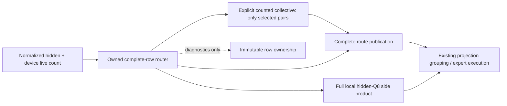

The model declaration supplies the existing domain/arena; reusable machinery
owns wiring. The same backend router owner prepares weights and publishes
hidden-Q8 reuse. Both packet banks are explicitly read at publication, then
their projection lifetime may overwrite them. No additional payload allocation
or workspace bank is introduced. Enabled native P2P remains native; this work
does not claim a dynamic-count native-P2P router implementation.

Diagnostic probabilities carry producer-declared row intervals. Host-only
observation copies each owned row once, without a floating reduction or a
production probability gather. Small replicated buckets declare the same
diagnostic partition, so mixed-size prompt chunks remain composable.
Missing/overlapping rows or mixed publication contracts fail. Complete route
IDs/weights are captured only after publication.

The final production-stage lowerer passed CUDA2/ROCm2/ROCm4 capture/replay
against an independent replicated tensor-API oracle, including exact acquired
counts and poisoned packet tails. All seven focused entries pass (14.37 s):
the three graph topologies, both backend representation sweeps, snapshot Unit,
and the snapshot preflight entry. The final graph topologies then passed 20
repetitions each (60/60, 126.47 s), with a complete, clean driver window.
Diagnostic coverage includes mixed compact/replicated chunks and preservation
of every TP producer, including empty owners, through TOKEN_ROW_PARTITION.

The fresh complete gate passes **681 Unit + 534 ProductionTestPreflight**
entries, **1,215 total in 1,451.41 s**. Its driver observation is complete and
has no GPU-driver findings (one unrelated kernel-log record). An initial Unit
attempt caught a stale source-guard spelling for ROCm's output pointer; the
guard now checks both ordinary FP32 stores and direct packet stores, retaining
its conversion-kernel and extra-copy prohibitions. No numerical tolerance or
runtime behavior was changed to satisfy that check.

The four canonical shared-path HF regressions also pass using this one fresh
receipt, with all CSV artifact contracts satisfied:

| Backend / policy | Elapsed seconds | Validated CSV artifacts |
|---|---:|---:|
| ROCm2 Static, MTP off | 17.80 | 8 |
| ROCm2 Dynamic, adaptive MTP | 46.58 | 10 |
| CUDA2 Static, MTP off | 18.05 | 8 |
| CUDA2 Dynamic, adaptive MTP | 47.40 | 10 |

These are short-prompt shared-path regressions, not an HF certification of
the >=512-row distributed computation. Bulk capture is certified against the
independent replicated production router by the focused tests above. The
512-token real-weight control/candidate comparison is now complete. The
1,209-entry receipt and HF passes in the next section belong to
the earlier local-primitive revision, not this graph-lowering revision.

The Release A/B/B/A uses frozen plans, a 512-token prompt, 256 generated
tokens, adaptive MTP 1..15, one warmup and five measured requests per process.
Both process orders preserve every generated token and the complete MTP
statistics within each topology. Driver windows are complete and clean.

| Topology / order | Control prefill | Candidate prefill | Control decode | Candidate decode |
|---|---:|---:|---:|---:|
| ROCm2 A/B | 1318.66 | 1322.13 | 97.56 | 95.19 |
| ROCm2 B/A | 1316.24 | 1320.06 | 94.11 | 94.77 |
| CUDA2 A/B | 1979.38 | 1970.81 | 161.42 | 161.47 |
| CUDA2 B/A | 1970.60 | 1965.77 | 161.60 | 161.64 |

All rates are tok/s. Paired mean prefill latency changes by only -0.276% on
ROCm and +0.339% on CUDA. The ROCm control's decode speed also varies between
processes, so the first pair does not isolate a decode regression. The
candidate changes neither the decode graph nor the selected MTP policy.
**Removing duplicated router arithmetic has not delivered a meaningful
whole-model speedup.** The extra five native nodes per layer offset much of
the component saving; that is a hypothesis for the next bounded fusion
experiment, not an established attribution of the entire difference.

Fresh single-device references measure 1171.24/130.02 tok/s prefill/decode on
MI50 and 1939.66/239.12 on 3090. Raw dual/single prefill scaling therefore
remains approximately 1.13x ROCm and 1.015x CUDA; the >1.8x goal is unmet.

The native CUDA observer confirms 40 actual row-publication nodes per
participant in three launched bulk-prefill parents. It observes 0.403/0.459
ms total publication event brackets per parent. These include event/scheduler
effects and are neither pure kernel cost nor additive recoverable time. No
CUDA profiler attachment was used. A possible publication/grouping fusion was
identified here but deferred by the subsequent kernel-scaling investigation
above; it has not been implemented or measured.

Evidence under the ignored result root: router-packet-release-economy.log
(all raw timing pairs and native resources), router-packet-exchange-stress20.log,
router-packet-driver.report.json, router-graph-current-focused.log,
router-graph-current-stress20.log, router-graph-driver.report.json,
router-graph-prerequisites-r2/prerequisites.json, router-graph-gate-r2-driver.report.json,
router-graph-hf-* (including the clean HF driver window), router-graph-ab-*,
router-graph-ba-*, router-graph-single-*, and router-graph-native-cuda/. The CUDA profiling
reference now documents final-linked resource inspection: device linking can
add a diagnostic printf frame absent from the object; that is not permission
to suppress real spill evidence. The new publication kernel itself has zero
local/private storage on both backends.

## Device-owned router row partition (2026-09-30, integration in progress)

The fixed-live-size experiment below is now a shared-core kernel primitive,
not an interposed copy of the ROCm router. `DeviceRowPartition` freezes only
logical membership. Every retained replay divides the canonical device-owned
live prefix by quotient/remainder; there is no host count, mutable ownership
mirror, new epoch, or capacity-derived wire length. Complete row arithmetic is
unchanged. One compile-time specialization shares each installed kernel body;
the established replicated specialization does not resolve a partition.

`MoERouterOwnedRowsLaunch` binds persistent compact outputs and prepared router
weights. It covers the installed ROCm FP32/FP16/BF16/BlockQ8 router families and
CUDA's ordinary-prefill FP32/BF16 families. These are **router representations**,
not restrictions on source expert formats. CUDA's scalar-decode contract is
deliberately not substituted: this primitive admits prefill capacity >=2 while
allowing zero/one live rows. ROCm still produces all live hidden-Q8 rows for
local routed/shared consumers; no incomplete side product is advertised.

The local kernel boundary passes byte-exact captured tests on both devices,
including degrees 2/3/4/8, uneven and empty participants, every live count
0..65, 512-row tails, changed inputs, signed zero, and untouched output guards.
Both focused tests passed 20/20 repetitions (138.43 s combined), and three
source-policy checks plus the new partition and existing verifier policy units
pass. The focused registrations are explicitly in `ProductionTestPreflight`.
The final capacity-two/partial-replay checks, both probability policies, and
the three existing router regressions also pass (five entries, 21.15 s).
Integration compilation covers CUDA sm80/86/89/90 and ROCm gfx906 with zero
memory-spill guard failures. The fresh complete gate passes **681 Unit + 528
ProductionTestPreflight entries**, 1,209 total in 1,455.76 seconds. Its driver
window is complete and has zero new records or findings. The older HF receipt
below predates these source changes. Four exact shared-path HF regression
cells now also pass against this one new prerequisite receipt:

| Backend / policy | Elapsed seconds | Validated CSV artifacts |
|---|---:|---:|
| ROCm2 Static, MTP off | 18.11 | 8 |
| ROCm2 Dynamic, adaptive MTP | 47.40 | 10 |
| CUDA2 Static, MTP off | 18.21 | 8 |
| CUDA2 Dynamic, adaptive MTP | 47.90 | 10 |

The HF driver window is complete and clean. These four cells prove that the
shared-kernel refactor preserves the **existing** production graph, including
its prefix, movement and MTP obligations. They do not certify a row-partitioned
model graph that has not yet been installed. Reports and logs use the
`router-owned-hf-*` prefix under the ignored result root.

The shared-core Release A/B/B/A probe retains the original fixed-live native
NCCL/RCCL exchanges, with no isolated kernel DSO. Its complete transaction
medians retain the benefit after device count resolution:

| Backend | Live rows | Replicated us | Row-owned + native exchange us | Reduction |
|---|---:|---:|---:|---:|
| ROCm2 | 64 | 81.81 | 96.93 | -18.5% |
| ROCm2 | 448 | 180.29 | 146.70 | 18.6% |
| ROCm2 | 512 | 232.32 | 159.35 | 31.4% |
| CUDA2 | 64 | 79.17 | 90.12 | -13.8% |
| CUDA2 | 448 | 127.43 | 108.69 | 14.7% |
| CUDA2 | 512 | 130.56 | 108.16 | 17.2% |

At 512 rows, ROCm logits retain 47 registers, zero LDS/private bytes, and a
20-block/CU occupancy ceiling; grid-Y halves from 32 to 16. CUDA logits use
39 versus 37 registers, unchanged 4,096 shared bytes and six blocks/SM, with
grid-Y halving from 16 to 8. Both top-k grids halve from 512 to 256, with no
change in registers or occupancy. All selected output bits agree on both
physical participants. Driver observation is complete and clean. These are
native resource limits, not achieved-occupancy counters; CUDA profiler
attachment remains unsafe on this host. No new kernel arithmetic or memory
allocation is part of ownership resolution.

Evidence: `router-owned-{functional,repeat20,final-functional}.log`,
`router-owned-native-{rocm,cuda}.log`, `router-owned-driver.report.json`, and
`router_owned_native_probe.cpp` under the ignored result root. A fresh full
Unit/production-preflight receipt is in `router-owned-prerequisites`, with its
complete driver report in `router-owned-gate-driver.report.json`.

The intended production dependency is deliberately small:

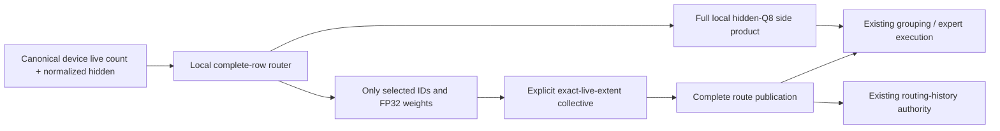

**Not installed yet:** the model graph, arena BOM and exact-live selection
exchange. No whole-model speedup is claimed. In particular, the existing
fixed-count native allgather used by the fully active probe cannot be reused
for a partial captured bucket. The no-P2P counted fabric already provides exact
device-authored extents; native-P2P publication must remain native and cannot
be replaced by a host-bounce transport. Production lowering also must order
complete publication before the existing histogram/grouping authority rather
than collecting an incomplete local row fragment.

The follow-up lowering audit found three contracts that must be handled
explicitly, not repaired after a model failure:

- `MoERoutingStage` currently describes complete probability snapshots. An
  owned router needs producer-declared **row partition** metadata for those
  diagnostic bytes; the selected-ID/weight checkpoint belongs after complete
  publication. Gathering full probability matrices during production would
  be unnecessary communication. Reusing the existing full-shape dump as if it
  were still replicated would read an incomplete or stale bank.
- `MoEProjectionArenaGeometry` already admits separate local/received packet
  banks whose intermediate values are not live before routing. Reusing those
  banks is a candidate for avoiding extra VRAM, but requires explicit arena
  lifetimes and a capacity proof; mere pointer fit is not sufficient. The
  shared domain fabric owns transfer epochs, so a router must not add a second
  acknowledgement or count authority.
- The backend MoE kernel owns prepared router weights and hidden-Q8 reuse.
  Graph lowering must call that owner rather than prepare another gate copy.
  Complete selections must precede the existing expert grouping/history
  publication; MTP's deferred accepted-row ledger remains unchanged. The
  measured small-batch loss also rules out indiscriminately partitioning
  scalar decode or short verifier graphs.

The fixed-live probe uses separate ID and weight allgathers. Production can
pack the two unchanged FP32 fields together, ideally at the existing top-k
store, to avoid another packing launch and a second exchange. This is a
design candidate, not an implemented or benchmarked result. Device-authored
byte counts and empty-source progress still need a captured end-to-end proof.

## ROCm router idle-wave removal (2026-09-30)

The refreshed critical-path inventory identified about 6.9 ms of replicated
router-logit work in the main bucket. The first isolated candidate expanded the
sixteen runtime row iterations into compile-time indices. It initially spilled
19 stack slots (232 bytes) and was never executed. A scheduling barrier removed
memory spills, but left 18 scalar-to-vector register moves and effectively no
timing improvement (223.88 to 223.32 us for the two-kernel 512-row router). That
candidate is rejected, not installed.

The useful change is simpler. Serial Q8 routing partitions K over 128 lanes.
At hidden width 2048 there are only 64 Q8 blocks, so half the physical lanes
carry zeros through sixteen row reductions and their LDS publication. The new
captured grouped route uses 64 physical lanes only when those omitted serial
owners have no input. The mathematical K stride stays 128; widths above 2048
still have all 128 owners. On wave64 hardware the final empty-wave contribution
is an explicit +0 rather than a second physical wave and an LDS barrier. A
wave32 target keeps the inter-wave reduction. No weight/activation precision,
workspace, stream, graph-node count, or transport change is involved.

An independent serial-logit oracle authenticated both isolated controls and
candidates across 40 shapes, with empty/partial/full retained replays. The
unprofiled A/B/B/A sweep gives these arithmetic-mean paired event times:

| Router geometry | Old public operation | Candidate | Latency reduction |
| --- | ---: | ---: | ---: |
| 448 rows, K=2048, 256 experts | 196.97 us | 154.88 us | 21.37% |
| 512 rows, K=2048, 256 experts | 224.41 us | 177.09 us | 21.08% |
| 512 rows, K=3072, 256 experts | 328.09 us | 327.87 us | 0.07% |
| 512 rows, K=8192, 256 experts | 852.31 us | 853.33 us | -0.12% |

The operation includes its unchanged hidden-row quantizer. Eight-row tiles
were also exact but slower than retained sixteen-row tiles; they are not
installed. The Q8 representation here is internal prepared router data, not
a restriction to Q8_0 source models. The measured model remains IQ3_S.

Separate exact-dispatch rocprofv3 passes authenticate 16,384 to 8,192 waves,
512 to zero LDS bytes, 48 allocated VGPRs unchanged, and 48 to 32 allocated
SGPRs. Both have zero scratch and zero memory spills. VALU utilization is
96.04%/95.72%; memory-unit busy is 59.63%/91.75%, with essentially unchanged
fetch counts. Those profiler timings are not used as canonical event samples.
The current shipping HIP target is gfx906; this is not a runtime certificate
for unshipped wave32 hardware. CUDA's prefill router is a different path and
was not changed by this HIP scheduling optimization.

Whole-model Release A/B/B/A used the same saved plans, 512-token prompt,
256-token deterministic generation, dynamic MTP 1..15, and prefix policy. Both
sides use the current core; only the isolated router bridge differs. Each
process warms once and measures five requests. Profiling/PerfStats are off.

| Topology | Old prefill | Candidate prefill | Old decode | Candidate decode |
| --- | ---: | ---: | ---: | ---: |
| 2x MI50, projection ownership | 1311.62 | 1318.24 | 96.04 | 95.46 |
| 1x MI50 | 1166.02 | 1171.79 | 128.78 | 129.99 |

All rates are tok/s, aggregated from mean request latency. Prefill gains are
only 0.50%/0.50%, and raw scaling remains approximately 1.125x. The dual decode
process means drift from 94.65 to 97.47 tok/s across the paired run; no reliable
decode gain is claimed. Every token stream, MTP counter and prefix counter
matches within its topology. Driver windows are complete and clean.

`V2_Integration_MoERouterLogits_ROCm` is explicitly in
`ProductionTestPreflight`. It compares every FP32 logit bit against unchanged
serial decode, including K=2016/2048/2080 and 4096/4128 partition boundaries,
every live count 0..65, large bucket tails, over/under-range device counts,
changed inputs/weights and output guards. Native graph inspection asserts two
nodes, the admitted workgroup size and zero scratch. The old interposed kernel
fails exactly the reduced-workgroup assertions, with no numerical failures;
the installed implementation passes 20/20 repeated runs. Existing CUDA and
ROCm router-publication checks also pass.

The ordinary installed Release binary, with no interposition, measures
**1318.04 tok/s prefill / 97.57 tok/s decode** on two MI50s and
**1172.83 / 128.51 tok/s** on one MI50 (one warmup, five measured requests,
unchanged saved plans and workload). All streams and MTP counters match their
isolated controls within each topology. The fresh complete gate passes
**680 Unit + 526 ProductionTestPreflight entries**, 1,206 total in 1,479.17 s.
The two affected real-weight ROCm diagnostic cells also pass: Static/MTP-off
in 17.86 s with eight CSV artifacts, and Dynamic/adaptive-MTP in 47.09 s with
ten. They reuse that one prerequisite receipt; this is not a claim of full
mathematical-matrix or image certification. All corresponding driver windows
are complete and clean.

Separate native resource inspection reports 47 registers/thread and zero
local bytes for both router kernels. Maximum occupancy is 10 x 128-thread
blocks/CU before versus 20 x 64-thread blocks/CU after: **the same 1,280
resident threads**, not a claimed occupancy increase. The actual dispatch
has half as many physical waves and no inter-wave LDS traffic. Inspection-run
timings are excluded from the canonical benchmark cohort.

Evidence is under `parity-results/qwen36-rocm2-prefill/router-*`. The full
1.8x communication-discounted goal is still unmet; this small retained win does
not alter the structural conclusions of the dependency audit below.

### Next slice: remove duplicated cross-participant computation

The next user-directed target is duplicated work, rather than another local
kernel scheduling adjustment. Input/weight/output ownership must establish
duplication: matching kernel names alone do not. The main-bucket trace shows
the GDN alpha/beta projection grid halving from 8,192 to 4,096 x-workitems and
its aggregate time falling from 10.60 to 5.45 ms; those are different head
shards, not duplicate work. The full router, residual normalization and some
hidden-input quantization do consume identical replicated inputs on both GPUs.

The first bounded experiment will partition **complete routing rows**, then
exchange only their selected expert IDs and FP32 weights. Every row retains
its complete expert softmax/top-k reduction, avoiding a new cross-device
floating-point tree. At 448 rows and top-8 that final payload is 28 KiB across
the domain, versus 448 KiB for all router logits. This is prospective byte
accounting, not yet a measured speedup or installed graph policy. A complete
captured economy probe must include exchange/packing/publication overhead and
authenticate both participants against the unchanged full-row router.

Runtime-sized production installation additionally requires the canonical
device-owned live count, exact wire extents, correct per-participant histogram
publication, and the existing hidden-Q8 consumer contract. A fixed-size
fully-active microbenchmark cannot certify those lifecycle requirements.
Native P2P transport selection, arithmetic, source formats, MTP and prefix
policy must remain unchanged. Merely moving the whole router onto one GPU
would remove duplicate arithmetic without shortening its dependency path.

#### First complete routing-transaction experiment

The model-free captured A/B/B/A probe now runs on both real GPU pairs. Each
participant computes either all routing rows or its disjoint contiguous half;
the latter invokes **two native NCCL/RCCL allgathers**, one for selected IDs
and one for FP32 weights. Both original contiguous output arrays are complete
before consumers could run. There is no transport substitution, changed
precision, logit exchange, or untimed output reconstruction. Every input row
is live, so these fixed native counts contain no padding. ROCm deliberately
retains full hidden-Q8 preparation on both GPUs for subsequent expert consumers.
CUDA calls its existing ordinary-prefill router rather than substituting the
ROCm Q8 path. The ROCm isolated bridge is authenticated against the unchanged
production bridge before timing; its compiler spill guard passes.

Mean of the two process medians in each A/B/B/A sequence, microseconds per
complete captured transaction (maximum participant interval):

| Backend | Live rows | Replicated routing | Row-owned + native publication | Latency reduction |
|---|---:|---:|---:|---:|
| ROCm2 | 64 | 81.51 | 95.81 | -17.5% |
| ROCm2 | 448 | 182.60 | 145.26 | 20.5% |
| ROCm2 | 512 | 234.27 | 157.72 | 32.7% |
| CUDA2 | 64 | 79.01 | 89.81 | -13.7% |
| CUDA2 | 448 | 128.30 | 105.82 | 17.5% |
| CUDA2 | 512 | 132.17 | 106.20 | 19.6% |

Both participants match every selected-ID and probability bit against their
own full-row production oracle through changed-input retained replays. The
window is driver-clean. These are **synthetic kernel/collective economics**,
not new whole-model throughput or real-weight HF results. Source weights and
gate representations differ by backend exactly as their normal prefill paths
do; this is not a cross-backend numerical comparison.

An additional 128/192/256/320/384-row sweep is also byte-exact and driver-clean.
ROCm's 128-row case loses; 192 is nearly neutral; 256 and larger win. CUDA
still loses through 256 rows and wins at 320/384. Some CUDA process medians
drift by 3--5 us, so do not derive a universal cutoff from one device pair or
interpolate across a dispatch boundary. In particular, there is no justification
for distributing scalar decode or short MTP batches simply to reduce duplicated
arithmetic. Runtime-counted installation and full-model A/B remain outstanding.

Evidence: `router_row_partition_probe.cpp`, `router-row-partition-candidate.*`,
`router-row-partition-{rocm,cuda}.log`, `router-row-boundaries-*`, and their
separate complete driver reports under the ignored result root. No production
graph policy changed during this experiment, so the 1,206-test receipt and
two HF diagnostics above remain the current installed-build certificate.

## CUDA GDN tiled-input candidate (2026-09-29, validated target slice)

The phase ranking below led to a bounded asynchronous input-tile change in
`CUDAGatedDeltaNetKernels.cu`. The old long-prefill path overlapped just the next
Q/K row and still loaded V/decay/beta from global memory at each causal step.
The candidate stages eight rows of **all** inputs, overlaps the next tile,
and joins once per tile. Four warps own sixteen independent value columns;
the eight contiguous key partitions and their sequential summation order are
unchanged. It needs no additional VRAM allocation, graph binding, host work,
precision change, or temporal reassociation. Dynamic shared memory is 17,536
bytes per D_K=128 CTA, rather than the old 2,048 bytes.

Keeping the Q/K copy loop rolled is important. The first unrolled candidates
spilled at the old register budget, so the spill guard rejected them. Merely
allowing 130 registers reduced residency to six two-warp blocks and made the
full-width shape slower. A rolled copy loop uses 112 registers with no spills;
the selected four-warp block permits four active CTAs per SM. Compile-only
proof covers the complete shipped SM80/86/89/90 set with the normal fatal spill
guard. Final code objects report zero stack/local bytes for both key widths;
D_K=64 uses 96 registers.

Captured production-entrypoint medians, including preprocessing, on RTX3090:

| Physical rows | Local heads / TP shape | Before us | Candidate us |
| --- | --- | ---: | ---: |
| 64 | 32 / TP1 | 67.01 | 60.35 |
| 64 | 16 / TP2 | 51.01 | 39.49 |
| 64 | 8 / TP4 | 46.46 | 33.28 |
| 448 | 32 / TP1 | 452.67 | 390.98 |
| 448 | 16 / TP2 | 401.41 | 249.60 |
| 448 | 8 / TP4 | 346.43 | 202.50 |
| 512 | 32 / TP1 | 516.80 | 429.38 |
| 512 | 16 / TP2 | 460.35 | 274.56 |
| 512 | 8 / TP4 | 393.73 | 224.51 |

At 448 rows the TP1→TP2 local ratio rises from 1.13x to 1.57x; it still misses
the 1.9x local target and says nothing by itself about model-level speedup.
Additional 448-row populations of 1, 3, 4, 64 and 96 heads improve in both
measurement orders. **48 heads is a counterexample**: baseline medians
539.13/536.32 us versus 545.28/566.08 us. Do not claim a universal economy win;
this remains a measured residency-sensitive follow-up.

The new `CapturedInputTilesRequestsAndSnapshotsByteExact` regression covers
both key widths, 32/16/8 and odd head populations, odd value widths, unequal
independent requests, live-length clipping, empty requests, separate/aliased
state, and partial snapshot guards. It restores pristine CUDA preprocessing
scratch before replay and compares all bytes against serial M=1. Its explicit
`V2_Integration_GDNInputTileLifecycle_CUDA` registration is in
`ProductionTestPreflight`, not the performance benchmark. All 31 CUDA GDN
integration cases pass for the candidate with zero new driver findings.

Profiling caveat: isolated NCU collection reproduced six NVIDIA driver
assertions (`pSmIssueThrottleCtrl != NULL`, `kernel_graphics.c:3411`) even with
clock control disabled. The math test passed but the driver observer correctly
failed the run. Its counters are diagnostic, **not clean certification**:
the old TP2 recurrence had 13% achieved occupancy, 4.63% DRAM throughput, and
48.8% long-scoreboard issue stalls. Subsequent unprofiled event-timing and
functional runs are driver-clean. No warning allowlist or profiler workaround
was installed. Candidate resources are inspected from the retained graph and
compiled code objects; fresh candidate hardware counters remain outstanding.

Evidence under the ignored result root: `cuda-gdn-before-timing*`,
`cuda-gdn-tile4-{lb6,loop-lb8}*`, `cuda-gdn-tile8-128t*`,
`cuda-gdn-wide-{control,candidate}*`, `cuda-gdn-tile8-full*`,
`cuda-gdn-tile8-shipped-{architectures,resources}*`, and the deliberately red
`cuda-gdn-before-ncu-v2*`.

The complete prerequisite gate passed **678 Unit + 503 ProductionTestPreflight**
entries (1,181 total, 1,287.94 seconds). All four exact CUDA/ROCm static-off and
dynamic-MTP HF cells passed, followed by both CUDA cells under eight native
channels with the default buffer size. Their CSV contracts, prefix lanes and
movement assertions remain intact. The complete validation driver interval has
zero findings; the separately collected red profiler evidence is not included.

Frozen-before/current-after Release A/B and reverse B/A runs used identical
native channel policy, saved plans, 512 prompt / 256 generated tokens, learned
dynamic MTP, one warmup and five measurements per run. Pooled ten-iteration
results (total tokens divided by total time) are:

| Topology | Before prefill tok/s | After prefill tok/s | Before decode tok/s | After decode tok/s |
| --- | ---: | ---: | ---: | ---: |
| CUDA1 | 1889.91 | 1904.93 | 234.74 | 234.44 |
| CUDA2, gate/up-owned down-columns | 1738.19 | 1772.66 | 154.21 | 154.19 |

That is **+0.79% single / +1.98% dual prefill**, effectively unchanged decode,
and only **0.931x dual/single prefill**, not the 1.8x goal. All twenty measured
streams per topology match across both binaries/orders; no cross-topology byte
equivalence is claimed. Evidence: `cuda-gdn-model-{ab,ba}-*`,
`cuda-gdn-model-summary.json`, and `cuda-gdn-validation-driver.report.json`.
`cuda-after-gdn-priority*` refreshes just the GDN curves in the existing local
phase ranking; unchanged phases retain their older measurements. Owner gate/up
is now the largest remaining local TP2 excess for the column-owned mode.

### Structural follow-up: eliminate per-owner packet holes

`MoEGroupedIntermediateLayout::packetBytes()` is based on all physical router
slots, not each producer's live route count. The packer explicitly zeroes
unowned slots and the native gather transmits every participant's whole packet.
At this model's 512-column expert intermediate, each Q8/scales route occupies
576 bytes. A 512-row, top-8 bucket therefore sends **2.25 MiB per participant**.
With 448 live rows and perfectly balanced two-way ownership, only 1,792 routes
or **0.984375 MiB per participant** are useful. This arithmetic describes wire
extent, not a measured attribution of all collective latency.

Ordinary `allgatherv` is not a dynamic-count solution: its count/displacement
arguments are host values fixed at recording. Eliminating padding while
retaining arbitrary device-owned placement needs a device-counted exact-byte
exchange, or a different ownership scheme. The immediate investigation is a
compact route-ID/payload packet and a TransferEngine-owned live-extent captured
message. Allocation capacity stays admitted/fixed; live bytes and empty-message
publication stay on device. This is **not installed in production** and is not
permission to replace a native P2P collective with an unmeasured mapped path.
One captured replay must first survive changing lengths, empty/skewed owners,
reuse and exact-byte checks, then beat the existing complete native exchange.

### Counted prototype: functional proof (2026-09-29)

`TransferEngine::bindDeviceCountedTransfer` now binds a positive maximum to a
retained device count. The producer samples its scalar once at acquire; the
receiver writes the acquired producer extent to its own retained output scalar.
That is a derived result of the message, not an independently chosen count.
The existing one-slot acquire/copy/publish lifecycle is unchanged, and an empty
message still publishes and acknowledges an epoch. Fixed-size callers keep
their exact-size contract. Capacity, extent authority and pointers remain
capture-stable; no host count readback, branch selection or recapture occurs.

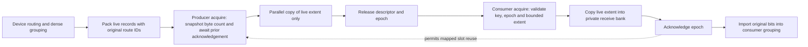

The compact MoE pack uses the already-dense grouped index, without another
scan or atomic append. One four-byte original route ID precedes each unchanged
Q8/scales or FP32 row. At 448 live rows / 512 capacity, aggregate two-owner
payload changes from 4.50 MiB to 1.9824 MiB; this is byte-count arithmetic, not
yet a performance result. Worst-case receive capacity remains preallocated.

The first new test harness incorrectly queued a potentially blocking pageable
readback before launching the other GPU. The first reply timed out, surfacing
NVIDIA Xid 43. Those failed runs and driver reports are retained, not waived.
The harness now submits both complete graphs before any host observation.
The production protocol did not need a timeout increase or ordering change.

The corrected focused gate passed **19/19** entries in 40.47 seconds, with a
clean driver report (`compact-transfer-functional-2*`). It includes four
CUDA/ROCm endpoint orders, existing fixed/private/workspace bindings, and both
compact encodings under empty/full/skewed changing ownership. Counted GPU
tests vary extent for 128 replays of each aligned/unaligned retained graph;
all payloads, count publication and untouched capacity tails are checked.
New functional cases are explicitly in `ProductionTestPreflight`. The six new
device/packet entries subsequently passed **20 repetitions each (120/120)** in
335.65 seconds, with no new driver records (`compact-transfer-stress*`).

The counted copy compiles for SM80/86/89/90 with 24 registers, zero stack/local
bytes; gfx906 uses 42 VGPR / 37 SGPR, zero scratch and zero register spills.
These are static resource observations, not hardware throughput counters.
The frozen pre-transport Release baseline is
`compact-transfer-control.PuBAoH`. No production model graph uses the prototype
yet, and native P2P selection has not changed.

### Counted prototype: complete-exchange economy (2026-09-29)

`v2_perf_moe_compact_intermediate` measures retained pack + exchange + import
graphs, including all protocol nodes. It checks every output word and the
untouched inactive tail. Two native/compact runs in ABBA order each have five
warmups and 31 event-timed samples; the interval is the slower participant's
interval, not a sum of overlapping GPU times. The table averages the two run
medians. These are **isolated exchange timings**, not model throughput.

| Backend / payload | Capacity / live routes | Owner split | Native padded µs | Compact µs | Speedup |
|---|---:|---:|---:|---:|---:|
| CUDA / Q8 + FP32 scales | 4096 / 3584 | 50:50 | 795.63 | 380.42 | 2.09× |
| CUDA / Q8 + FP32 scales | 4096 / 3584 | 87.5:12.5 | 793.09 | 379.39 | 2.09× |
| CUDA / Q8 + FP32 scales | 4096 / 4096 | 100:0 | 798.19 | 444.42 | 1.80× |
| CUDA / Q8 + FP32 scales | 128 / 8 | 50:50 | 57.34 | 30.21 | 1.90× |
| CUDA / FP32 | 4096 / 3584 | 50:50 | 2706.94 | 1514.48 | 1.79× |
| ROCm / Q8 + FP32 scales | 4096 / 3584 | 50:50 | 792.40 | 393.44 | 2.01× |
| ROCm / Q8 + FP32 scales | 4096 / 3584 | 87.5:12.5 | 793.36 | 398.08 | 1.99× |
| ROCm / Q8 + FP32 scales | 4096 / 4096 | 100:0 | 797.92 | 456.56 | 1.75× |
| ROCm / Q8 + FP32 scales | 128 / 8 | 50:50 | 70.08 | 48.88 | 1.43× |
| ROCm / FP32 | 4096 / 3584 | 50:50 | 2708.08 | 1212.48 | 2.23× |

Both encodings also passed the other skew/small shapes. CUDA retained the
previously measured eight native NCCL channels and default buffer/protocol;
ROCm used native defaults. P2P remained unavailable/disabled. No model weight
format, activation arithmetic, or production transport default changed. The
reported `wire_bytes` is the protocol's logical payload extent, not a PCIe
hardware counter: 4,718,592 → 2,078,720 bytes for the first row of each backend.

The initial ROCm CTest comparison (NUMA0 process placement) also won, at
793.52 → 394.56 µs. A repeat pinned to physical cores 28–55 on the GPUs' NUMA1
socket produced the ROCm table above. CPU placement is therefore not the cause
of the observed large-payload win. This host has no `numactl`; the first attempt
using it failed before launching a GPU process. The successful repeat uses
`mpirun --bind-to none taskset -c 28-55 ...`. All completed performance windows
have clean driver reports. Raw logs are `compact-exchange-cuda-perf.log`,
`compact-exchange-rocm-perf.log`, and
`compact-exchange-rocm-numa1-perf-2.log` under this investigation's ignored
result directory. Performance tests are deliberately outside preflight.

Exact-shape profiling entrypoints now isolate compact Q8/scales and FP32
pack/import on each backend without profiling a waiting multi-device protocol.
gfx906 Release code objects report pack/import at 20/21 VGPR and 50/45 SGPR,
zero LDS, private segment, and spill counts. CUDA SM80/86/89/90 compact pack
uses 26–27 registers and import 24, with zero stack/local/shared bytes.

Separate ROCm counter launches select one kernel and its first dispatch at
4096 route capacity, 512 columns and two equally populated logical owners.
Q8 pack fetched 1207.69 KiB, import 1203.00 KiB; these are VRAM/cache-counter
observations, not inter-GPU wire measurements. FP32 pack/import VALU lane
utilization was 96.48%/97.07%, with zero scratch and 8192 launched waves each.
Wave count and lane utilization do not constitute achieved occupancy. The
initial combined `FetchSize WriteSize` request exceeded MI50's hardware counter
limit (rocprofiler error 38); its abort handler stalled and was terminated.
The subsequent one-metric-per-launch probes passed, with no driver findings.
Profiler timing is not mixed into the Release A/B. NCU remains unused because
the earlier investigation reproduced driver assertions under it.

### Captured production-kernel boundary (2026-09-29)

CUDA and ROCm now implement compact export/import through `IMoEKernel`, with
the existing workspace and unchanged down arithmetic. Export binds immutable
runtime-table addresses: published-runtime gate/up reads runtime-owned expert
counts/offsets, whereas the kernel's private grouping buffers can still contain
counts from earlier work. Neither allocation capacity nor private scratch is
an alternative authority for the compact byte length. Import uses the complete
consumer grouping, populated from the original router tensors.

The new explicitly registered preflight entries
`V2_Integration_MoECompactProductionPackets_{CUDA,ROCm}` sweep all supported
codebooks and FP16/BF16/FP32, plus odd floating widths, with M=1,2,3,15,16,17,33,65
and twenty full/empty/sparse replays per shape. They deliberately leave private
counts empty before runtime publication and overwrite the computed activation
with a zero-input gate/up before reconstruction. They verify byte-exact final
output, exact published length, and untouched packet/count guards. This proves
the actual kernel boundary, not merely the standalone packing kernels.

The first fixture version incorrectly paired the imported private consumer
grouping with `executeGroupedPrefillProjectionFromPublishedRuntimePlan` down
weights. ROCm's two grouping orders differ at the 65-row case, exposing the
invalid pairing across formats. The production lowerer already uses ordinary
fixed-table down after regroup/import; the fixture now follows that contract.
This was a fixture integration error, not a new established inference failure,
and no production arithmetic or tolerance was changed to make it pass.

Both new entries now pass: **ROCm 26.57 seconds; CUDA 21.17 seconds**, with no
new driver records. The existing projection-phase entries also passed against
the new kernel bridges (ROCm 70.31 seconds, CUDA 46.73 seconds). The registered
full preflight suite now has **511 entries**; the 509-entry aggregate receipt
below predates these two API regressions, so a refreshed aggregate is still due
after production graph wiring. Evidence is `compact-production-packets.log`
(including the initial fixture failure), `compact-production-packets-*-2.log`,
the corresponding XML, and `compact-production-packets-2-driver.report.json`.

### Production graph integration (2026-09-29, validation in progress)

The installed lowerer now has an explicit `DEVICE_COUNTED_ALLGATHER` node for
no-P2P projection domains. `RankOrchestrator` installs one admitted
`DeviceCountedAllGather` per domain; sequential layers and graph families reuse
its directed channels. Every source has one GPU-authored extent per consumer,
and the local source is imported directly instead of being sent to itself.
The reusable graph binding retains arena owners and bounded peer byte ranges. It
imports into the original-router grouping and keeps the same fixed-table down
math, canonical route fold, shared-column overlap and native column collective.

`MemoryPlanner` consumes the same packet and channel geometry used by setup.
Its GPU cursor/count and CPU mapped-slot contributions go through PMA before
expert capacity filling. The pure topology projection authenticates observed
matrix order, including reordered/sparse ordinals and asymmetric P2P. Any
enabled edge retains NCCL/RCCL; unknown coverage is not treated as disabled.

New preflight cases cover complete captured projection graphs on CUDA2,
ROCm2 and ROCm4 across every format, shared-expert overlap, twenty changing
owner/full/empty/partial replays, soft reset and retired-graph rebuild. They
assert terminal per-source byte lengths against independently counted live
routes, in addition to byte-exact serial-arithmetic outputs. Device-free cases
cover the physical BOM and P2P policy. Compilation and this focused gate are
in progress; no updated whole-model speedup is claimed yet.

The initial focused run passed topology and arena tests but caught two fixture
setup defects: unique-owned tensors could not supply the production graph's
retained ownership, and the TP8 accounting fixture declared only four attention
heads. Shared tensor ownership and a valid eight-head geometry corrected those
contracts; the focused PMA accounting entry now passes.

The next captured CUDA run exposed a real integration error in the new lowerer:
`FP32Tensor::create_view()` produced an unrelated, host-only coherence identity
for a received packet. `TransferEngine` correctly rejected it at `import_down`;
the abandoned shared-branch capture then emitted a secondary unjoined-work error.
The fix removes the peer-view collection entirely. CUDA and ROCm imports take
the canonical arena tensor plus an aligned, capacity-checked byte offset, so
the capture ledger observes exactly the producer's existing publication.
Focused tests reject unaligned, overflowing and insufficient packet ranges;
the four-participant graph also exercises nonzero peer offsets. All five device
entries now pass: counted CUDA2 **6.24 s**, ROCm2 **21.71 s**, ROCm4 **44.97 s**,
and the compact production-kernel boundaries **21.58 s CUDA / 27.16 s ROCm**.
The complete focused driver interval reports no new records or findings.
Evidence is `compact-production-owner-{cuda,peers}.{log,xml}` and
`compact-production-owner-driver.report.json`.

The cold-admission audit also added the missing exact-bucket support contract:
before producer preparation, the counted collective is supported but not yet
capture-ready. The fixture now proves this distinction before any stage is
prepared, then executes the same captured graph. The three complete graph
entries passed again (CUDA2 6.23 s, ROCm2 22.35 s, ROCm4 45.89 s).

The refreshed canonical gate passed **678/678 Unit + 516/516
ProductionTestPreflight** entries in **1368.016 seconds** (Unit 76.542 s,
integration 1290.606 s), with zero new driver records or findings. The receipt
is `compact-production-prerequisites/prerequisites.json`; the complete driver
window is `compact-production-final-driver.report.json`. All later unchanged
HF cells reuse that receipt. These are component/aggregate proofs, not model
throughput or full-model mathematical certificates; the real-weight checks and
matched Release A/B are next.

The first real-weight ROCm static/off cell subsequently stopped in graph
construction, before numerical inference: `overlapTPLocalAllGather()` still
required a `NativeAllGatherStage`. The component fixture exercised the shared
reduce-scatter overlap but omitted this preceding packet/shared-FFN overlap.
This was a missing composition regression, not evidence of a math mismatch.
Its red log/report are `compact-production-hf-rocm-static-off.{log,json}`;
the driver interval remained clean. That aggregate receipt predates the fix
below and must not certify a rebuilt executable.

The correction retains the original exchange behind `CapturedAllGatherStage`
and uses the existing paired event lifecycle for both native and counted
transport. TransferEngine accepts an authenticated acquired-input fork for
the complete exchange; received tensors are published **only at the joined
main-stream edge**, not prematurely on the auxiliary lane. No host count,
blocking wait, extra copy, packet arena, or replay state is added. Cold-capture
eligibility/readiness also remains owned by the retained operation.

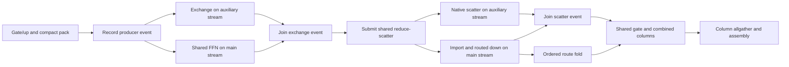

The all-format CUDA2/ROCm2/ROCm4 preflight fixture now constructs this complete
composition, including both overlap windows and cold setup. All thirteen
focused entries passed: three device-free contracts, counted CUDA2 **6.29 s**,
ROCm2 **22.29 s**, ROCm4 **46.12 s**, and seven existing native graph/overlap
entries. (The latter group includes the ordinary native gather and shared
column compositions.) Its driver interval has no findings. Evidence is
`compact-overlap-{cuda,peers}.{log,xml}` and
`compact-overlap-focused-driver.report.json`. The final preparation audit also
forwards setup to the retained operation once, before its event pair is ready;
the refreshed aggregate gate will certify that final build. No new whole-model
performance is claimed.

### Complete compact-exchange validation and Release outcome (2026-09-29)

The final overlap build passed **678/678 Unit and 516/516
ProductionTestPreflight** entries. The canonical prerequisite transaction took
1,402.475 seconds, including build preparation; integration lanes took
1,295.417 seconds. Its complete driver interval has zero new records or
findings. All four exact gate/up-owned down-column HF cells then passed:
CUDA/ROCm Static/MTP-off and Dynamic/adaptive-MTP. Static cells retained all
eight canonical artifacts; MTP cells retained ten. Prefix restore, physical
movement, serial-byte verification and numerical thresholds were not weakened.

Evidence: `compact-overlap-prerequisites/prerequisites.json`,
`compact-overlap-final-driver.report.json`, `compact-overlap-hf-*.{json,log}`,
and `compact-overlap-hf-driver.report.json`. These supersede the earlier
pre-fix aggregate receipt for this build.

Frozen-before/current-after Release runs used the same plans, tmpfs GGUF,
512-token prompt, 256 generated tokens, learned dynamic MTP and seed. Each
A/B and reverse B/A process had one warmup and five measured requests. CUDA
retained eight native channels and default protocol buffers; ROCm retained
native defaults. PerfStats was disabled and prefix hits were zero. The dynamic
loader was independently checked to select the frozen control's own core DSO.
Pooled throughput uses total tokens divided by total elapsed phase time across
ten measured requests per binary/configuration:

| Topology | Before prefill tok/s | After prefill tok/s | Before decode tok/s | After decode tok/s |
| --- | ---: | ---: | ---: | ---: |
| ROCm1 | 1089.16 | 1087.14 | 129.31 | 129.13 |
| ROCm2, gate/up-owned down-columns | 1197.96 | 1223.20 | 92.88 | 92.06 |
| CUDA1 | 1914.52 | 1916.60 | 234.60 | 234.44 |
| CUDA2, gate/up-owned down-columns | 1773.19 | 1889.02 | 153.49 | 158.06 |

Dual prefill improves **2.11% on ROCm and 6.53% on CUDA**. CUDA decode improves
2.98%, while ROCm decode falls 0.88% in both orders; do not dismiss that as a
proven neutral result. Every topology's twenty measured token streams agree
across binaries/orders. All four A/B driver intervals are clean. Evidence is
`compact-overlap-{rocm,cuda}-{ab,ba}-*` and
`compact-overlap-{rocm,cuda}-summary.json`.

The updated dual/single prefill ratios are only **1.125x ROCm and 0.986x CUDA**.
The >1.8x objective remains active. The user requested a full execution audit
before attributing the remaining gap to hardware: actual live communicator
lifetimes, duplicate collectives/copies, graph dependency/overlap structure,
and pack/copy/import plus other kernel costs. A separate control/candidate
ROCm API/dispatch/DOT collection and CUDA native-node/resource/communicator
inventory have been prepared under `compact-execution-audit-*`. These
diagnostic runs are not benchmark samples. CUDA CUPTI/Nsight collection remains
excluded because its earlier probes produced driver assertions; native graph
inspection is not a substitute for missing hardware-counter evidence.

### Native execution audit and fusion target (2026-09-29)

The serial audit finished with zero new GPU driver records. Both CUDA and
ROCm control/candidate processes initialized exactly one communicator group
with two rank handles and retired both handles once. No duplicate communicator
group was observed. ROCm's authenticated forty-layer main prefill executes
161 native collective kernels before compact exchange and 121 afterward:
the replacement is not accidentally running beside the old intermediate
allgather. Both vendors' captured decode inventories add exactly 240 kernels
per main forward. This consists of 240 acquire/copy/publish nodes, forty extra
per-owner import nodes, minus forty old collective nodes.

On the same MI50 participant (device 3), the main 512-row captured interval
falls from 319.071 ms to 308.977 ms. Communication without concurrent compute
falls from 86.918 ms to 73.426 ms. The corresponding single-card interval is
351.464 ms. These are diagnostic timelines, not canonical throughput samples.
The remaining recurrent GDN is 23.540 ms versus 26.540 ms single-card, and
unclassified disjoint work remains 47.67 ms versus 51.84 ms. Neither scales
well. No SDMA copies occur inside these main-forward windows. Mapped payload
kernels are accounted as kernels, not falsely reported as zero communication.

The compact exchange's 80 copy kernels, 80 acquire kernels and 80 publication
kernels are a concrete fusion target. Small messages can use one CTA with an
explicit all-writer system fence before publication. Large messages must keep
their parallel copy grid; any combined publication must prove completion
without a grid-wide spinning barrier or an extra host decision. TransferEngine
should submit one complete operation, leaving native launch decomposition to
its backend bridge. This is the next experimental slice, not yet a measured
win. The 1.8x objective is still unmet.

Evidence: `compact-execution-audit-driver.report.json`,
`compact-execution-audit-{rocm2-control,rocm2-candidate,rocm1-candidate}/`,
`compact-audit-*.json`, and `compact-execution-audit-cuda2-*-perfstats-rank0.json`.

The first fusion implementation now submits a whole message through one
backend bridge. It removes the separate low-level boundary/payload APIs.
Messages admitted at no more than 64 KiB use one 256-thread block; larger
messages use acquire plus a parallel copy whose last completed block publishes.
Every copying lane system-fences before its block's completion ticket. No block
spins for another copy block, and the ticket uses the cursor's previous padding:
its PMA geometry stays 32 bytes. The cutoff is an initial economy candidate,
not yet a certified optimal setting. The fixed-message protocol, device-counted
protocol, abort propagation and exact stream ownership are unchanged.

Release native compilation passed. CUDA SM86 resources are 46 registers for
the fused block and 33 for copy/publication, with zero stack/local storage in
the object. HIP gfx906 resources are 48 VGPR/70 SGPR for the fused block and
49 VGPR/66 SGPR for copy/publication, with zero reported spills or private
scratch. Evidence is `fused-transfer-{cuda,rocm}-resources.*`. Integration is
building SM80/86/89/90 before the focused native graph/byte regressions. Four
new `V2_Integration_FusedTransferChannel_*` entries explicitly join preflight;
they sweep the dispatch boundary, empty/full/shrinking counts, odd tails,
unaligned offsets and delayed peers through unchanged retained graphs.
Both native builds subsequently passed, including CUDA SM80/86/89/90 and
ROCm gfx906. All **18/18** focused entries passed, and the complete driver
interval had zero records/findings. The initial complete exchange microbench
was not an unqualified win: small ROCm messages improved, but CUDA regressed
6--13% on several small/intermediate geometries. The padded native control
was substantially stable, so fewer launches were not accepted as sufficient
evidence of economy. Evidence: `fused-transfer-focused.{log,xml}`,
`fused-transfer-probe-driver.report.json`, and `fused-transfer-economy.json`.

### Fused publication ordering and economy correction (2026-09-29)

The initial kernel gave every copying lane a system-wide fence. The revised
kernel acquires its writers through the CTA barrier, then connects completed
blocks using a device-scope acquire/release RMW sequence. Only the last block
publishes the existing system-release epoch. This is not a relaxed completion
counter and not a spinning grid barrier. Completed blocks retire immediately;
the single-block specialization omits the counter entirely.


The transitive synchronization chain, not assumed kernel completion, carries
every payload access to the peer. CUDA uses scoped `cuda::atomic_ref`; HIP
uses agent-scope `__hip_atomic_fetch_add`. The relevant CUDA contract is
[PTX causality order](https://docs.nvidia.com/cuda/parallel-thread-execution/#memory-consistency-model-causality-order);
the HIP bridge retains its explicit agent/system scopes. The same ordering
also prevents a producer overwriting the slot before all consumer readers
have joined. Cursor BOM, graph identity and byte representation are unchanged.

The revised 64-KiB-cutoff build passed all **18/18** entries again with a clean
driver interval. In the full pack/exchange/import microbench, the eight-route
quantized-intermediate case improved **9.17% ROCm** (53.20 to 48.32 us) and
**8.58% CUDA** (30.208 to 27.616 us). Large payload changes were generally
sub-percent. CUDA's 32-route FP32 case still increased 2.70% (one microsecond),
so the cutoff is being checked at 8 KiB before the expensive full-model gate.
No new whole-model gain is claimed. Evidence:
`fused-transfer-release-sequence-{focused,probe-driver,perf,economy}*` and
`fused-transfer-release-sequence-cuda-resources.txt`. CUDA objects remain at
zero stack/local storage for all four shipped targets.

The selected 8-KiB cutoff keeps at most two aligned vectors per lane in the
single-CTA route; larger messages use the parallel grid. Its separate exchange
sweep again passed exact output and untouched-tail checks for both intermediate
encodings and all eight geometries. The smallest quantized-intermediate exchange
was 53.36 to 47.60 us on ROCm and 30.72 to 27.648 us on CUDA. Native-control
timing drift at that smallest size was -8.07% and -4.88%, respectively, so these
isolated percentages are not a precise model-speed prediction. At 512-route
capacity / 448 live routes, changes were -1.27% ROCm and -3.62% CUDA; larger
payloads remained approximately neutral. All raw observations, including
sub-microsecond regressions, remain in `fused-transfer-8k-economy.json`.

All 18 focused entries passed. Twenty additional **fresh process lifetimes**
then passed all eight counted-channel cases each: **160/160 cases and 102,400
captured round trips**, with both alignments, all four vendor pairs, dispatch
boundaries and device-selected empty/full/shrinking sizes. Test body time was
170.472 seconds. No new driver records/findings occurred. Evidence is
`fused-transfer-8k-stress-{1..20}.{log,xml}` and
`fused-transfer-8k-stress-driver.report.json`.

The once-per-final-build aggregate gate passed **678/678 Unit and 520/520
ProductionTestPreflight entries**. Its 1,802.423-second transaction included
the affected-target rebuild; the integration lanes took 1,308.088 seconds.
The complete driver interval has zero new records/findings. Evidence is
`fused-transfer-8k-prerequisites/prerequisites.json` and
`fused-transfer-8k-final-driver.report.json`. The earlier 678/516 receipt does
**not** certify this new backend ABI; this fresh receipt does.

All four exact HF cells subsequently passed: ROCm/CUDA Static/MTP-off and
Dynamic/adaptive-MTP, respectively in 17.91/18.21 and 47.59/48.34 seconds.
Their eight/ten canonical artifacts were validated, including the existing
prefix, movement and numerical contracts. The HF driver interval is clean.
Evidence is `fused-transfer-8k-hf-*.{json,log}` and
`fused-transfer-8k-hf-driver.report.json`.

Matched unprofiled Release A/B+B/A has completed, using the frozen
post-compact/pre-fusion `fusion-control.XPLULU` binary/DSO pair. Each process
ran one warmup and five measurements with the unchanged 512-token prompt,
256-token generation, learned dynamic MTP, seed and plan. PerfStats was off,
prefix hits were zero and all four driver intervals were clean. Pooled results
use total phase tokens divided by total phase time across ten requests:

| Topology | Before prefill tok/s | Fused prefill tok/s | Before decode tok/s | Fused decode tok/s |
| --- | ---: | ---: | ---: | ---: |
| ROCm1 | 1088.18 | 1086.72 | 128.80 | 128.96 |
| ROCm2, gate/up-owned down-columns | 1223.30 | 1223.76 | 93.80 | 93.53 |
| CUDA1 | 1914.13 | 1911.95 | 234.56 | 234.55 |
| CUDA2, gate/up-owned down-columns | 1886.86 | 1887.92 | 158.16 | 157.91 |

**The fusion does not establish a meaningful whole-model gain.** Dual prefill
changes by +0.038% ROCm / +0.056% CUDA; decode changes by -0.288% / -0.155%.
ROCm decode is slightly lower in both orders, so this is not a claimed positive
decode result. The roughly 10% smallest-message microbenchmark improvement
must not be promoted into an inference-speed claim. Every fixed topology's
twenty measured token streams match across binaries/orders, and accepted,
rejected, drafted and verified token counts, commits and depth updates match
too. A changed MTP work budget therefore does not explain these differences.
Evidence is `fused-transfer-8k-{rocm,cuda}-{ab,ba}-*` and both
`fused-transfer-8k-{rocm,cuda}-summary.json` files.

Dual/single prefill remains **1.126x ROCm and 0.987x CUDA**, well below the
active >1.8x goal. The separate final native execution audit completed with
zero driver findings. It did not attach CUPTI to CUDA, given the previously
reproduced driver assertions. No production source changed after the gate.

The actual CUDA main-decode graph has **1,741 kernel nodes versus 1,901**
before fusion; its depth-15 all-position verifier has **2,073 versus 2,153**.
ROCm's main prefill removes exactly eighty publication dispatches, retaining
eighty acquire and eighty copy/publication operations, with no old copy or
publication kernel left beside the replacement. All 121 expected native
collective kernels remain. Both vendors initialize one communicator group
with two rank handles, then retire each handle once. The audit again found
no duplicated communicator or accidentally retained old intermediate gather.

The timing explains the flat result. On ROCm:3, the authenticated main-512
interval is **308.977 ms before versus 308.927 ms after**. The old publication
kernels occupied 0.801 ms inclusively, but only **0.112 ms was exposed without
other compute**. Most of the removed work was already hidden. The fused
copy/publication occupies 10.125 ms versus 9.602 + 0.801 ms for the old separate
copy/publication; those inclusive figures must not be added to overlapping
compute or promoted to a model-speed prediction. The final disjoint interval
still contains 69.958 ms native collectives, 53.962 ms dense projections,
50.694 ms routed gate/up, 46.977 ms other compute and 23.664 ms GDN. Total
communication without overlapping compute is 73.738 ms. There are no SDMA
copies inside this main-forward window; mapped traffic is represented by the
copy kernels, not treated as absent communication.

The capacity-sized completion cohort is a possible small-message follow-up:
idle blocks still take a completion ticket when the live extent shrinks.
Changing that requires a stable device extent that cannot race publication's
cursor reset. It is **not implemented**, and it cannot explain the main-prefill
gap when the live payload already occupies the entire bounded copy grid.
Do not spend another aggregate gate claiming this is the primary scaling lever.
The next scaling work must target exposed compute/collective dependencies and
poorly scaling arithmetic, with the same end-to-end A/B requirement; graph-node
count alone has now been explicitly disproved as a useful win certificate.

Evidence: `fused-transfer-8k-audit-driver.report.json`,
`fused-transfer-8k-audit-rocm2.json`, the underlying ROCm database/DOT inventory,
and `fused-transfer-8k-audit-cuda2-perfstats-rank0.json`. ROCm's full API trace
export took 110.09 seconds **after inference ended**; that diagnostic-tool cost
is excluded from every canonical throughput figure above.

### Original-token CUDA expert inputs (2026-09-29, complete local gate)

The next fusion removes an avoidable representation, rather than just one
publication launch. ROCm already consumes canonical Q8 hidden rows in original
token order. CUDA previously expanded those rows to grouped route order,
including copying an already-published router representation. CUDA gate/up now
borrows the original rows through `MoEGroupedSourceRows`; without a router
publication it quantizes each original token once. All gate/up NativeVNNI
codebooks use the same addressing contract. Weight arithmetic, down projections,
FP32 activation policy, arena reservation and wire precision are unchanged.

The first IMMA implementation hoisted several row roles into registers and was
rejected by the fatal spill guard. The retained candidate uses one bounded,
volatile shared row map per CTA, outside the K loop. Release SM86 and Integration
SM80/86/89/90 compilation pass; native resource queries pass every candidate's
no-spill checks. The optional exhaustive launch-policy invariance test was
skipped in that resource-only invocation, not counted as a pass.

Eleven focused Unit/integration entries pass in 229.45 seconds, with no driver
findings. New captured CUDA/ROCm tests cover every quantized format at 16, 33
and 65 rows, both local quantization and real router publication, shared/routed
experts and changing sparse/empty/full live sets. Poisoned old input storage
proves that route-expanded copies are absent; serial-row output bytes remain
identical. The two GPU entries explicitly join `ProductionTestPreflight`; the
device-free addressing test remains in the complete Unit namespace.

The saved microbenchmark caller was stale relative to the frozen core's public
projection ABI and returned false before measurement. Rebuilding the caller,
then using that same caller with each old/new core, resolves the harness issue.
Those failed invocations are not candidate performance or correctness evidence.
The captured 512-row local expert pipeline improves 1545.216 -> 1477.632 us
at one-card shape, 967.680 -> 899.072 us at two-card shape, and
655.360 -> 580.608 us at four-card shape. Short 64-row cases are roughly flat.

Unprofiled, non-certifying Release AB/BA uses the same saved plans and workload,
ten measured requests per configuration, no prefix hits, and PerfStats off:

| CUDA topology | Before prefill tok/s | Candidate prefill tok/s | Before decode tok/s | Candidate decode tok/s |
| --- | ---: | ---: | ---: | ---: |
| One RTX 3090 | 1911.157 | 1920.514 | 234.867 | 237.507 |
| Two RTX 3090, gate/up-owned down-columns | 1887.222 | 1910.604 | 158.040 | 159.098 |

Dual prefill improves 1.239%, with non-overlapping per-request latency ranges
(269.842–272.516 ms versus 267.517–268.464 ms). Single prefill's 0.490%
change has overlapping ranges; do not claim a strong single-prefill win.
Decode improves 1.124% single / 0.669% dual. Every fixed topology's twenty
measured streams and MTP work counts agree across versions/orders. Both driver
intervals are clean. The refreshed complete prerequisite gate passes **679/679
Unit and 522/522 ProductionTestPreflight entries**, with a clean driver window.
Its 1829.940 seconds include the affected-target rebuild; integration lanes
take 1330.992 seconds. All four exact HF cells then pass: ROCm/CUDA Static/MTP-off
and Dynamic/adaptive-MTP, with all eight/ten CSV artifact contracts validated.
The HF driver window is also clean. These new receipts, not the earlier
fused-transfer evidence, cover this source-row change. Evidence is
`row-source-final-prerequisites/prerequisites.json`,
`row-source-final-final-driver.report.json`, and `row-source-final-hf-*`.

The requested next investigation is a prefill/decode communication-free
counterfactual, compared against one GPU. It must preserve compute dependencies
and distinguish exposed communication, communication/compute overlap, retained
host work and poorly scaling arithmetic. Inclusive kernel times cannot simply
be summed/subtracted. CUDA will use native graph-event diagnostics rather than
reattach CUPTI after this host's reproducible driver assertions. Such extra
events perturb execution and their costs must be reported separately from the
unprofiled throughput baseline. No communication is disabled in real inference.

Evidence: `row-source-focused-*`, `row-source-micro-ab2-*`,
`row-source-native-resources.log`, and `row-source-model-{ab,ba,summary}*`
under the ignored results root. The **>1.8x dual/single goal remains unmet**.

### Communication-free critical-path and scalar-kernel audit (2026-09-29)

The native ROCm graph DOTs are bound to exact profiler dispatches, using packet
submission IDs rather than slightly skewed start timestamps. Every kernel name
and occurrence must match; ambiguous binding is an error. The ordinary prefill
graphs also prove a bijection between logical streams and actual hardware
queues. Some timestamps violate producer completion by up to about 20 us;
the main graph's summed violations are about 0.4 ms, retained explicitly in
the report rather than silently repaired.

Removing communication re-times the dependency DAG with compute durations held
fixed. This is not inclusive-time subtraction or measured faster inference.
The lower estimate drops scheduler gaps and assumes perfect peer readiness;
the higher estimate keeps observed queue ordering/gaps. Neither predicts
changes in compute contention after removing communication. Cross-rank
collective join edges are not yet reconstructed, making the lower estimate
optimistic. Host work and complete-request decode costs remain outside these
subgraph figures.

| ROCm graph | One GPU measured ms | Two GPUs measured ms, slower participant | Two-GPU communication-free ms |
| --- | ---: | ---: | ---: |
| Main 512-row prefill bucket, including sidecar | 352.666 | 313.974 | 235.172–241.510 |
| 64-row prefill tail, including sidecar | 90.177 | 87.839 | 70.881–74.187 |
| Last four-row MTP verifier main forward, participant 3 | 21.722 | 29.359 | 20.551–21.503 |

Even zeroing communication layout/packing gives only about **1.52x** for the
main prefill bucket; the verifier remains approximately **1.09x** in that
optimistic limit. These are not end-to-end token rates. The one/two-GPU native
GDN main-bucket costs are 26.536/23.692 ms. Its launch falls from 64 to 32
blocks while per-layer latency only falls from 885 to 790 us: fewer heads
do not shorten the recurrence within each value-column group. The already
rejected narrower-block experiments below remain rejected; underoccupancy
does not itself prove that simply halving the block size will help.

The requested scalar-kernel audit separates actual serial work from a lane-zero
store after cooperative arithmetic. Findings from the measured ROCm:3 graphs:

| Kernel / mechanism | Main bucket inclusive ms | Tail inclusive ms | One verifier inclusive ms | Assessment |
| --- | ---: | ---: | ---: | --- |
| `rocm_moe_exclusive_scan_kernel` | 0.706 | 0.699 | 0.656 | Literal one-thread, data-sized global-memory scan; 40 calls per graph |
| Runtime deterministic group scatter | 4.297 | 1.594 | absent | One lane scans preceding experts and each 256-route chunk while its peers wait |
| Captured transfer acquire | 5.725 | 1.202 | 0.627 | A leader waits on the protocol; not a serial payload copy or removable arithmetic |
| Service telemetry begin | 0.039 | 0.041 | 0.038 | Constant-size timestamp publication; no data-sized loop |

All main-bucket scan/scatter time is on the measured native critical path.
The standalone scan runs 200 times across the five measured MTP verifier
passes, 3.288 ms inclusive. Its CUDA counterpart stages counts cooperatively
but still scans them on lane zero; the captured all-position verifier includes
40 such nodes. CUDA's runtime large-prefill scatter contains the same lane-zero
prefix and per-chunk scan. The scan comment claiming integer prefix sums are
inherently serial is incorrect: bounded integer counts admit exact parallel
prefixes without changing any floating-point reduction or route order.

The expensive GDN, small-N projection, router logits, RMSNorm and quantization
kernels are **not** single-threaded merely because their final scalar store
uses lane zero. Their data-sized arithmetic is distributed. Existing runtime
small-group scans and grouped tile-directory scans are already cooperative.
Top-k's scalar final renormalization is bounded by selected-route count and
retains the existing FP summation order; it must not be casually reassociated.
Single-thread KV positions, epoch ownership and bounded MTP publication are
control work, separate from bulk expert grouping.

The highest-confidence next cleanup is shared cooperative integer scan/route
compaction across CUDA/ROCm, including the non-runtime grouping entrypoint.
Do not claim that alone can meet 1.8x: even deleting both main-bucket kernels
entirely would remove only about 5 ms of this roughly 314-ms graph. It needs
byte-exact all-format capture/replay regression coverage and measured economy.
No such production change is part of this audit yet.

Evidence: `zero-comm-rocm-*-dag.json`, `zero-comm-rocm-all-analysis.json`,
`zero-comm-rocm-timeline.svg`, and `single-thread-kernel-audit.json`. The latter
is a source-candidate inventory, **not** an automatic verdict that every
lane-zero conditional is a defect. The audit includes source locations for
literal one-thread launches even when their bodies contain no lane guard.
It describes the measured Qwen workload and the retained CUDA families, not
every backend/model/sampling configuration.

CUDA prefill parent-event instrumentation now runs without CUPTI. The initial
flat-only observer correctly skipped these parents because they contain
conditional nodes (CUDA node type 13); the revised observer leaves each body
untouched and brackets it only as an opaque parent operation. Single/dual runs
retained identical token streams and MTP work, with zero new driver findings.
The all-node event probes raised measured request prefill from 264.35 to
296.56 ms on one GPU and from 267.21 to 349.51 ms on two GPUs. These are
diagnostic perturbations, **not benchmark regressions or comparable scores**.

A selected scan/scatter probe reduced, but did not eliminate, that overhead:
266.05 ms single-GPU and 287.65 ms dual-GPU request prefill. Critically, the
dual-GPU before/after scan brackets sum to 9.06/9.21 ms while the single-GPU
brackets sum to 0.358 ms for the same 40-node family. Those intervals include
scheduling and event overhead; no kernel-service-time claim can be made from
them. Do not use them as an inflated estimate of removable serial arithmetic.
The CUDA decode inventory likewise remains structural evidence, not an
invented kernel-time measurement. The ROCm cost table above comes from actual
dispatch timestamps, not these CUDA event brackets.

The reproducible CUDA observer and bounded procedure now live in
`.agents/cuda-tuning/scripts/native_graph_event_trace.cpp` and
`.agents/cuda-tuning/references/native-graph-events.md`, linked from the skill.
They preserve exact original graph dependencies, keep conditional bodies
opaque, retain events through normal executable retirement, report selector
misses, and explicitly label scheduling-inclusive timing. The relocated helper
passes the model-free captured routing smoke and the real-model single/dual
CUDA runs, with six nonempty replay reports, identical tokens/MTP work and
prefix-cache behavior, and a clean driver window. It also compiles with
`-Wall -Wextra -Werror`; the skill passes its validator. Evidence for the model
probes is in `zero-comm-native-parent-events-*`, `scalar-native-events-*`, and
`native-event-skill-model-*` plus `native-event-skill-smoke/`. No CUPTI attachment,
production graph policy change, or driver setting change was used.

### Cooperative exact integer grouping (2026-09-29, green)

The scalar-kernel audit now has a production implementation. CUDA and HIP
share `DeviceIntegerBlockScan.h`: converged wave scans publish wave totals,
the first wave scans those totals, and a final workgroup barrier protects the
next chunk's scratch reuse. The standalone expert scan handles arbitrary
positive lengths in ascending chunks. Runtime stable scatter uses the same
integer prefix for preceding experts and each route chunk, exits empty experts
after publishing their offsets, and scans only live route slots. The prior
clear still owns padded output. No floating-point operation, route ordering,
graph node, persistent allocation, weight format or precision changes.

The focused symmetric preflight regressions pass **6/6 in 57.89 seconds**,
including all-codebook live/original-row expert arithmetic. New standalone
prefix coverage checks 16 geometries through 1024 experts, guard words, zero
counts and near-INT_MAX totals. Runtime grouping checks 170 geometries spanning
wave/block boundaries, sparse/skewed data and large-capacity short live prefixes.
Each geometry reuses one captured graph for 20 changing inputs. The first
CUDA standalone test attempt had an incorrect test-local C declaration missing
the device ordinal; it was fixed before these passes. Both runtime grouping
tests passed even on that first attempt. No production launch ABI changed.

Uninstrumented public clear/count/scatter medians, averaged across A/B and
B/A orders, show the isolated improvement:

| Backend | Rows | Prior us | Cooperative us | Speedup |
| --- | ---: | ---: | ---: | ---: |
| CUDA | 512 | 57.395 | 23.296 | 2.46x |
| CUDA | 2048 | 179.021 | 71.090 | 2.52x |
| ROCm | 512 | 122.684 | 36.412 | 3.37x |
| ROCm | 2048 | 368.095 | 99.852 | 3.69x |

The unchanged 32-row compact path remains stable. These are microbenchmarks,
not a model scaling certificate. The shared scan compiles spill-free for
CUDA SM80/86/89/90 and gfx906. CUDA SM86 scatter uses 50 registers, 32 shared
bytes and no local/stack bytes; the standalone scan uses 33 registers with the
same shared/local result. The ROCm scatter uses 39 VGPRs (allocated 40), 64
SGPRs and 32 static LDS bytes, with zero private storage/spills. Its standalone
scan uses 20 VGPRs/30 SGPRs and zero private storage/spills.

The isolated ROCm captured scatter counter pass selects exactly dispatch 9,
not unrelated routing kernels: 256 workgroups of 256 threads, 1024 waves,
82.1% active-lane utilization, 16.1% VALU busy, zero LDS bank conflicts and
0.37% LDS stall. A separate memory pass sees 49.25 KiB fetched, 19.1% memory
busy and 0.74% memory stall. WriteSize is zero in the selected warm replay;
that cache-traffic counter is not a claim that the logical output is unwritten.
CUDA achieved occupancy/counter data remain unavailable because attachment is
unsafe on this environment; compiler resources are not a substitute for it.

An attempted combined ROCm memory-counter set exceeded hardware capacity
(profiler error 38). Its profiler helper was explicitly retired. Fetch and
write metrics were then collected successfully in separate bounded invocations.
The overlapping first CUDA1 control cohort is excluded and remeasured. The
supported counter groups, selector semantics and cleanup procedure are recorded
in the ROCm skill reference; CUDA resource commands and the public grouping
probe are recorded in its native-graph reference. Driver windows are clean.

Evidence: `parallel-grouping-{final-focused,micro-ab,micro-ba,profile-alu,
profile-fetch,profile-write,cuda-resources,rocm-resources,rocm-isa}*` under the
ignored results root. The immutable pre-change control is
`parallel-grouping-control.lJwHBr`. The whole-model comparison and fresh native
attribution are recorded below, followed by the refreshed prerequisite/HF gate
for this source revision.

The unprofiled model A/B/B/A is now complete: ten measured 512-prefill/256-decode
requests per topology/version, after independent warmups. The contaminated
first CUDA1 control is replaced by the explicitly named `ab-retry` cohort.
All 80 retained token streams and drafted/accepted/rejected MTP work agree
within each topology. Prefix hits remain zero and PerfStats is disabled. Both
model driver intervals are clean. Pooled token/time rates are:

| Topology | Prior prefill tok/s | Cooperative prefill tok/s | Prior decode tok/s | Cooperative decode tok/s |
| --- | ---: | ---: | ---: | ---: |
| CUDA1 | 1927.56 | 1930.77 | 238.18 | 238.47 |
| CUDA2 | 1909.71 | 1925.30 | 159.02 | 159.55 |
| ROCm1 | 1088.86 | 1090.74 | 129.08 | 128.89 |
| ROCm2 | 1224.35 | 1244.04 | 93.79 | 97.05 |

The dual prefill changes are **+0.82% CUDA / +1.61% ROCm**, with nonoverlapping
per-request prefill ranges in each paired topology. Single-device changes and
CUDA decode are too small to claim as meaningful improvements. ROCm2 decode
improves in both run orders, but the control drifts from 92.28 to 95.35 tok/s;
the pooled +3.48% is an observed cohort result, not a promise of fixed gain.
The current candidate's dual/single prefill ratios are **0.997x CUDA and
1.141x ROCm**. The >1.8x goal remains unmet. The fresh full gate and four
HF cells below certify this edit; the older receipt is not reused as its proof.
Machine-readable authentication is `parallel-grouping-model-summary.json`.

Fresh native attribution confirms the cooperative kernels execute in the real
model, not just the isolated harness. On ROCm device 3, the main prefill parent
contains 40 standalone scans totaling **0.17184 ms** and 40 stable scatters
totaling **0.95872 ms**. The 64-row tail totals **0.15840 / 0.27952 ms** for
those same families. The earlier main trace measured **0.70560 / 4.29711 ms**.
These are inclusive kernel attribution measurements, not an interleaved
benchmark certificate; the unprofiled table above owns the speedup claim.
The five measured MTP verifier passes execute 200 standalone scans in
**0.77296 ms**, versus 3.28767 ms in the earlier trace. Every new scan has a
256-work-item grid and 256-thread block. The final verifier's 40 scans total
0.15504 ms; its exact 2,530-node DAG binds without causal timestamp violations.

The updated single-thread audit finds only bounded control publications among
literal grid-times-block-size-one launches: KV position, attention parameters,
telemetry start and epoch acquire/release. Together they account for about
**0.147 ms** in the main parent. Source lane-zero guards in GDN, normalization,
router reductions and transfer-acquire are not evidence that their bulk work
is single-threaded. The new standalone scan no longer launches one thread.

The CUDA native inventory independently finds the new 256-thread scan in
retained MTP fragments: **33 registers, 32 shared bytes, zero local bytes and
six theoretical active blocks/SM**. This is a resource ceiling, not achieved
occupancy. The engine inventory does not cover every ordinary prefill parent;
missing prefill scatter inventory is not proof of missing execution. Use the
compiled object and parent observer for that graph family, as now described in
the CUDA tuning reference.

The new ROCm main DAG has 2,501 nodes and a measured 316.36 ms span. Setting
communication and its layout work to zero gives **225.60–231.15 ms**, spanning
dependency-only through observed-queue-and-gap assumptions. The corresponding
64-row tail is **68.11–71.18 ms** versus an 84.55 ms observed span. The traces
retain 0.0052/0.3680 ms of reported causal timestamp overlaps; these are bounded
diagnostics, not exact predictions. Cross-device peer readiness and changes in
compute contention remain unknown. Even the optimistic main-graph comparison
against the earlier 352.67 ms single-device trace is only about **1.56x**, not
1.8x. More communication-only changes cannot be assumed to close this gap.
On the zero-communication main critical path, dense projections cost 69.57 ms,
expert gate/up 50.65 ms, expert down 28.33 ms, and GDN 23.59 ms. These larger
families, their shard geometry and overlap remain the next tuning targets.
The final verifier spans 30.21 ms, with a communication/layout-free estimate
of 19.44–20.32 ms. This again describes one verifier subgraph, not complete
MTP generation throughput or an unprofiled before/after latency comparison.

Evidence: `parallel-grouping-{cuda2-inventory,rocm2-profile,rocm2-512-dag,
rocm2-64-dag,rocm2-verifier-dag}*`. The first ROCm diagnostic attempt failed before GPU work
because its helper changed directory before resolving the executable path;
the helper now resolves the executable first, and the absolute-path retry
completed. Unit has passed **679/679** and host preflight **240/240**; GPU and
exclusive preflight subsequently passed **98 CUDA + 107 ROCm + 77 exclusive**,
for **522/522 ProductionTestPreflight** and **1,201 total prerequisite passes**.
The amortized prerequisite transaction took 1,409.67 seconds and is recorded in
`parallel-grouping-prerequisites/prerequisites.json`.

All four exact generated Qwen 3.6 35B IQ3_S two-GPU projection-ownership HF
cells pass using that one fresh receipt, FP32 activations and FP16 KV:

| Backend | Movement / MTP | Elapsed seconds | Validated CSV artifacts |
| --- | --- | ---: | ---: |
| ROCm | Static / off | 17.76 | 8 |
| CUDA | Static / off | 18.71 | 8 |
| ROCm | Dynamic / adaptive depth | 47.33 | 10 |
| CUDA | Dynamic / adaptive depth | 47.83 | 10 |

Fresh/full-prefix/partial-prefix lanes, exact movement assertions, and the
existing numerical thresholds are unchanged. Every artifact contract passes;
the complete certification driver window has **zero new records/findings**.
Reports are `parallel-grouping-hf-*` and
`parallel-grouping-certification-after-cuda-driver.report.json`. This is a green
source slice and focused mathematical proof, not a full parity matrix, Docker
certificate or achievement of the greater-than-1.8x scaling goal. CUDA and ROCm
tuning skill validation also passes after recording the verified native-resource
and profiler-counter procedures.

### Rejected CUDA barrier experiments and fused grouping initialization (2026-09-29)

Three gate/up staging variants were measured against the immutable
`warp-stage-control.H78p0P` snapshot. None is installed:

- Warp-private activation/metadata staging removed workgroup barriers but
  raised the IQ2_S specialization from 64 to 114 registers. The final
  spill-free version passed all-format byte proofs, yet TP2-shaped main
  gate/up increased from 436.6 to 693.8 us.
- Direct global activation-fragment loads were rejected by the compiler spill
  guard across multiple formats. They were not executed or exempted.
- Staging four quantization blocks together compiled spill-free after a
  residency adjustment, and passed the same byte proofs. TP2-shaped main
  gate/up increased from 437.5 to 518.1 us; the complete local pipeline rose
  from 896.0 to 975.9 us. The larger tile used 78 registers and 11,584 shared
  bytes for the representative specialization.

The gate/up source was restored byte-for-byte to the saved pre-experiment
file, rebuilt, and its three focused proofs rerun successfully. Fewer source
barriers are not themselves an economy certificate; register/shared-memory
residency and instruction scheduling outweighed the proposed saving.
Rejected sources and measurements are retained only in the ignored results
directory as `warp-stage-rejected.cu`, `direct-a-rejected.cu`,
`k-tile-rejected.cu`, and their corresponding probe/build logs.

The next candidate addresses graph initialization rather than expert math.
The earlier CUDA main-parent trace contained 240 small native memset nodes.
Their event brackets totaled about 1.9 ms on one GPU but 24.5–25.7 ms on the
two-GPU parents. Those brackets include scheduling/contention and are **not**
pure memory-clear service times or a prediction that fusion will save 25 ms.

`MoEGroupingInitialization` now describes the borrowed persistent count,
cursor, map, grouped-ID and probability banks. One 256-thread-grid launch
resets the independent expert/slot extents, preserving exact zero and -1
sentinels. CUDA and ROCm use the same device implementation; no arithmetic,
physical allocation, graph binding or precision changes. CUDA replaces six
native clears and ROCm five; counting/scanning/stable scattering remain
unchanged and ordered on the same exact stream.

The focused four-entry GPU gate passes in 41.86 seconds: both all-format
original-source-row proofs and both new captured initialization proofs.
The new proofs cover eleven expert/slot shapes, eight optional-bank masks,
guards, invalid inputs, one-kernel native inventory and twenty poisoned
replays per shape/mask. They are explicitly registered in
`ProductionTestPreflight`. A device-free binding/overflow unit also passes;
the refreshed complete prerequisite gate below now covers this edit.

The normal spill guard passes for shipped CUDA SM80/86/89/90 and ROCm gfx906.
The new CUDA kernel uses 16 registers on SM80/86/89 and 18 on SM90, with zero
stack/local/shared bytes. gfx906 reports 6 VGPRs, 20 SGPRs, no LDS/private
storage and zero memory spills. These are compiler resources, not achieved
occupancy. Evidence prefixes are `fused-group-init-*`; the CUDA skill reference
now records the verified exact-phase probe and the native-memset event-bracket
caveat.

The unprofiled A/B and reverse B/A comparison is complete. Each topology and
binary has ten measured requests, 512 prompt tokens and 256 generated tokens,
with the same saved plan, seed, learned dynamic MTP and zero prefix hits.
PerfStats and profilers are disabled. All 80 token streams and MTP
draft/accept/reject/verifier counts match their within-topology controls.
Both driver intervals are clean. Pooled token/time rates are:

| Topology | Before prefill tok/s | Fused prefill tok/s | Before decode tok/s | Fused decode tok/s |
| --- | ---: | ---: | ---: | ---: |
| CUDA1 | 1930.49 | 1935.56 | 238.90 | 238.90 |
| CUDA2 | 1921.00 | 1975.65 | 159.43 | 161.47 |
| ROCm1 | 1090.82 | 1092.43 | 128.83 | 129.77 |
| ROCm2 | 1243.70 | 1243.69 | 94.98 | 95.98 |

CUDA2 improves **2.84% prefill and 1.28% decode**, in both invocation orders,
with nonoverlapping measured request ranges. ROCm2 prefill is unchanged;
decode changes direction between orders and varies by process, so its pooled
number is not evidence of a durable gain. Small single-device prefill changes
are not claimed as meaningful. Dual/single prefill remains only **1.021x CUDA
and 1.138x ROCm**, well below the >1.8x objective. Authentication and raw
per-order scores are in `fused-group-init-model-summary.json`.

Separate native CUDA observation proves every main/tail prefill parent now
contains 40 fused initialization kernels and no memset nodes, rather than 240
memsets. The dual main parent falls from 2,358 to 2,158 nodes. Selected-event
instrumentation still inflates tiny-kernel brackets under collective load:
the new 40 resets total 14.4–16.3 ms on dual parents versus 0.32 ms single.
Do not mistake those inclusive intervals for pure execution or subtract them
from canonical latency. The observed dual diagnostic prefill is 283.18 ms,
versus 259.16 ms uninstrumented. Driver observation remains clean.

Isolated gfx906 counter passes select exactly one reset dispatch at 4,096
slots / 256 experts on a retained captured production pipeline. They confirm
16 workgroups, 64 waves, 8 allocated VGPRs / 32 SGPRs and zero scratch/LDS.
The selected interval is 1.76–1.92 us, with 100% active-lane utilization,
0.145% VALU busy, 2.48% memory busy and 0.25% memory stall: this small operation
is launch-bound, not a throughput-saturating memory kernel. The fetch counter
records 0.9375 KiB; warm-cache WriteSize is zero and must not be interpreted
as no logical stores. Captured sentinel/guard tests independently verify all
writes. All three counter processes and their driver interval pass.

The fresh full Unit gate passes **680/680 in 76.64 seconds**, with no skips.
All **524/524 ProductionTestPreflight** entries pass as well: 240 host,
99 CUDA, 108 ROCm and 77 exclusive/multi-device tests. The complete prerequisite
transaction takes 1,403.58 seconds. Its receipt is
`fused-group-init-prerequisites/prerequisites.json`; the preceding 679/522
receipt is not evidence for this edit.

The four exact HF cells reuse this fresh receipt and pass without changing
numerical gates, prefix-restore lanes or movement assertions:

| Backend | Regime | Cell seconds | Validated artifacts |
| --- | --- | ---: | ---: |
| ROCm | Static / MTP off | 17.71 | 8 |
| CUDA | Static / MTP off | 18.61 | 8 |
| ROCm | Dynamic / adaptive MTP | 47.37 | 10 |
| CUDA | Dynamic / adaptive MTP | 47.33 | 10 |

Reports are `fused-group-init-hf-*`. The complete build/gate/HF driver window
is clean, with zero new records or findings. This is a green local source
slice and four focused mathematical proofs, not a full parity matrix or
release/image certificate. The native-observer diagnostics also authenticate
their 16 generated tokens against the corresponding uninstrumented 256-token
stream prefix; no instrumentation-induced token divergence was observed.

The next investigation accounts for prefill wall time outside the selected
main/tail parents. Prefix archival, other GPU work and host work must be
distinguished before assigning that remainder to kernels. Host-only GDB
boundaries include request admission/prefill, participant forward, prefix
harvest/runtime serialization, pinned allocations and the final benchmark
completion-event wait. These intrusive boundaries are diagnostics, not new
throughput scores. No production code changes are made for this measurement.

### Host/graph boundary attribution after the fused reset (2026-09-29)

GDB resolves and observes the actual production methods, but its all-stop
breakpoints distort the CUDA2 request to 482.48 ms (versus roughly 259 ms
without instrumentation). Its nested times are only localization evidence.
The follow-up ELF interposer records into fixed host storage, performs no GPU
API calls or per-call log I/O, and preserves the normal frontend bootstrap.
The copied canonical helper compiles with `-Wall -Wextra -Werror` and passes
real CUDA2 and ROCm2 model invocations with a clean driver interval. It is now
`.agents/cuda-tuning/scripts/host_prefill_boundary_trace.cpp`; the native-graph
reference documents the verified command, ABI/coverage limitations and nested
interval interpretation. The CUDA skill validator passes.

Three measured 512-prompt/16-generation requests per topology authenticate all
token IDs against the corresponding original 256-token stream prefix. MTP
work matches an otherwise identical three-request control without the helper.
There are zero prefix hits and PerfStats is disabled. Readiness/warmup requests
are excluded from these means; they remain explicitly numbered in the trace.

| Topology | Control prefill ms | Observed prefill ms | Pinned allocation inclusive ms | Final completion wait ms |
| --- | ---: | ---: | ---: | ---: |
| CUDA1 | 263.00 | 262.73 | 70.60 | 0.01 |
| CUDA2 | 258.92 | 258.23 | 202.52 | 44.62 |
| ROCm1 | 468.39 | 469.53 | 2.79 | 0.01 |
| ROCm2 | 410.98 | 411.03 | 5.25 | 359.42 |

Observed/control differences range from -0.27% to +0.25%. This is evidence
against a large timer perturbation, not a separate throughput win. All three
original observer/control driver windows and the relocated-helper validation
window are complete with zero new records/findings. Authentication lives in
`host_prefill_summary.py` / `fused-group-init-host-summary.json`; raw evidence
uses `fused-group-init-host-{observer,observer-rocm,control,skill}*`.

The single-GPU graph captures portable MoE runtime state during harvest. Its
187.39-ms CUDA / 446.55-ms ROCm archive interval includes waiting for the
previously submitted graph; it is **not** CPU serialization time. On CUDA,
two 65,863,680-byte recurrent archive allocations average 30.44 ms each, after
that wait. This accounts for most of the apparent single-CUDA time outside the
selected main/tail graph intervals.

Ticketed multi-GPU ExpertOverlay excludes durable placement from the prefix
payload. Runtime archival costs only 0.02 ms, so allocations can overlap
already-submitted inference. In one CUDA2 measured request the first harvest
occupies host time 2.66–111.91 ms, the second 113.89–214.53 ms, and the final
event wait 214.54–257.57 ms. Its 202-ms allocation sum is therefore **not** a
removable 202-ms tail. ROCm2 returns from runner prefill after 51.48 ms and then
waits another 359.42 ms for device completion. There is no evidence of a large
hidden host stall that would restore >1.8x scaling by itself.

The relevant GPU request order is:

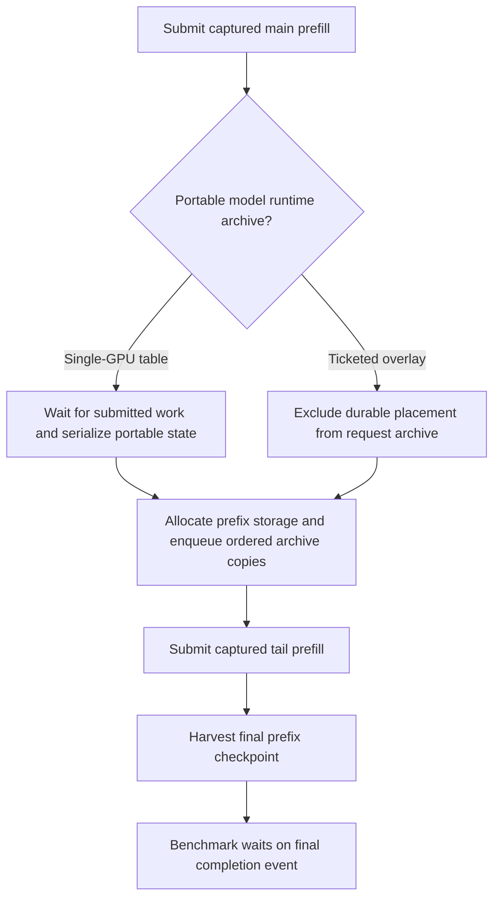

Enqueue edges in this chart are not GPU completion edges. Changing cache
storage/lifetimes would need its own correctness and economy proof; disabling
prefix caching would not certify a production speedup.

A source review found a GDN live-state allgather-to-gated-norm dependency in
the mirrored-decode configuration, but both measured native DAGs contain no
such reassembly/handoff node. The selected plans use a different regime. That
source-only lead is therefore **not a fix for this workload** and was not
changed. Likewise, the larger multi-bank prefix archive is not automatically
evidence of zero-padded wire traffic. The next scaling experiment must be tied
to the retained graph and the existing kernel/critical-path ranking, not an
unused source branch or a sum of nested host timings. Production code remains
the fully gated fused-reset slice; the >1.8x objective is still unmet.

### Rejected CUDA GDN shared-input layout experiment (2026-09-29)

The eight-partition CUDA Q/K tile has a potentially conflicting shared-bank
mapping. An XOR layout was substantially slower and rejected. Padding each
partition by four floats reduced the isolated 448-row, 16-head prefill time
from approximately 249 to 236 microseconds. It increased shared memory, not
the physical VRAM buffers, and retained zero spills. Alternative address
arithmetic, retained-key registers and smaller CTAs did not improve the result.
ROCm already separates the input-key partitions; no ROCm kernel was changed.

All 31 Release GDN correctness cases passed for the padded candidate. However,
the real saved-plan A/B and B/A, with five measurements per process, did not
justify installing it:

| CUDA topology | Control prefill tok/s | Candidate prefill tok/s | Control decode tok/s | Candidate decode tok/s |
|---|---:|---:|---:|---:|
| One GPU | 1932.81 | 1941.21 | 238.49 | 238.44 |
| Two GPUs, projection ownership | 1978.97 | 1980.64 | 161.63 | 161.62 |

These aggregate rates use total tokens divided by total measured time. The
two-GPU prefill difference is only +0.08%; candidate/control ordering reverses
between A/B and B/A. All 40 measured generations have identical 256-token
streams and MTP work within each topology. Both model driver windows are
complete and clean. This is not a proven model improvement.

The production kernel is restored to the certified fused-initialization
baseline. The restored build, three focused byte-equivalence proofs, and both
timing sweeps pass with clean driver diagnostics. Retained tooling extends the
GDN geometry sweep to DK 64/128, DV 17/128, M 64/448 and 3/16/32 heads; the
CUDA skill documents its commands and the zero-input timing fixture's limits.
No new performance test is placed in preflight.

Evidence: `cuda-gdn-bank-pad-model-{ab,ba}-cuda{1,2}-{control,candidate}.json`,
their driver reports, `cuda-gdn-bank-pad-restored-build.log`,
`cuda-gdn-bank-pad-restored-bytes.log`, and `cuda-gdn-bank-pad-restored.log`.
The single/dual-GPU scaling objective remains unmet. The next outstanding
communication audit must distinguish executed live bytes from capture-time
capacity records; native fixed-count partial-bucket collectives remain an
explicit known gap, not a newly certified economical path.

### Native partial-bucket extent audit (2026-09-29)

Fresh Release runs on both saved two-GPU plans bind the known padding gap to
actual replay. Each participant executes the 512-row parent with **448 live
rows**, followed by the exact 64-row tail. The retained forty main-layer Wo
allreduces each have an immutable **1,048,576-element / 4,194,304-byte** operand.
`TPAllreduceStage` passes that fixed count to the native operation; it has no
device live-row input. The corresponding live operand would be 3,670,016 bytes.
That is 512 KiB of inactive operand per main-layer reduction, or 20 MiB across
the forty main layers per participant. It is not legitimate tensor data.

These are logical native collective operand extents, not measured PCIe traffic:
native algorithms, staging and protocol metadata can multiply physical bytes.
Capture BOM counts are not execution counts. The separate `forward_graph`
replay observations establish which bucket ran; they are not multiplied by MTP
transaction counters to invent prefill traffic. The configured wire policy is
unchanged: 2048-wide row-invariant sums resolve to FP32, as before this audit.

The same source audit finds fixed bucket extents in projection column gather
and shared-column reduce-scatter. The compact intermediate exchange is a
different, already device-counted path; its correctness does not repair these
native operations. The public count boundary is the relevant defect, not an
oversized physical allocation by itself.

Captured native-only fixed-count pairs quantify the possible saving. Every
sample replays forty operations, with immutable rank/coordinate-coded inputs,
forty measured samples and exact output checks on both participants. CUDA uses
the same eight native channels as its model control; ROCm retains defaults.
No alternative transport, precision or buffer policy is selected.

| Native operation | CUDA 512 rows, us | CUDA 448 rows, us | ROCm 512 rows, us | ROCm 448 rows, us |
|---|---:|---:|---:|---:|
| FP32 allreduce | 1133.36 | 1039.40 | 1092.51 | 954.34 |
| Finished-column byte allgather | 686.67 | 609.27 | 664.10 | 583.29 |
| FP32 reduce-scatter | 772.29 | 687.36 | 660.05 | 581.16 |
| Column packing plus FP32 reduce-scatter | 786.84 | 699.03 | 682.59 | 602.33 |

These separately captured fixed counts establish an economic opportunity,
**not** a working device-counted native API or a model speedup. They also do
not preserve the native library's capacity-derived algorithm geometry by
construction, so their differences are not exact predictions for a future
dynamic implementation. Four new 448-row cases remain in the existing RCCL
performance harness; the standalone CUDA native probe measures the same pairs.
Performance tests remain outside production preflight.

Both fresh model generations match the corresponding accepted control's 256
tokens and per-request MTP work. Both the native-message and model diagnostic
driver windows are complete, passing, and contain zero new records/findings.
Evidence uses `live-extent-native*` and `live-extent-model*` in the ignored result
root. Production binaries are unchanged by the probes. Re-reading the host's
PCI tree confirms all four MI50s share the same root-port subtree, so choosing
a different MI50 pair would not escape that shared upstream link. No topology,
driver, P2P or boot setting was changed.

#### Required native live-extent contract; not implemented

The fix must separate three typed facts: admitted storage capacity, immutable
participant/stride layout, and the **device-published live extent** for this
invocation. A single row-count authority must feed allreduce, column packing,
reduce-scatter and final column publication. The captured graph reuses those
addresses, not a host copy of the value.

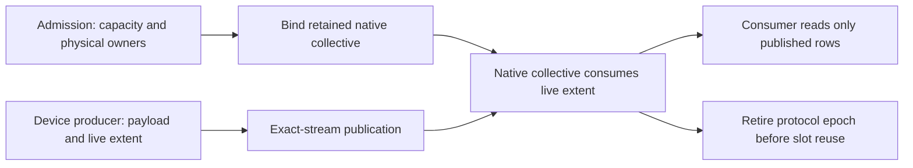

Do not merely overwrite NCCL/RCCL's device count or shorten its outer loop.
The inspected RCCL source schedules channel ranges and host-proxy steps from
the captured capacity. Reducing only GPU loop iterations could leave a proxy
waiting for steps that will never arrive. A native implementation must keep
necessary protocol progress while eliding inactive **payload**, including zero
rows. Native P2P must remain native; the existing mapped counted exchange is
not permission to bypass it. Library ABI, graph identity and transport progress
are one implementation boundary, not a stage-local count workaround.

Required proof is a single retained graph replaying large, small, empty and
large extents, poisoned capacity tails, both native backends, same and changed
streams, supported participant degrees, exact data and actual payload counters.
New focused functional proofs belong explicitly in ProductionTestPreflight;
the corresponding performance comparisons do not. No capability may be
advertised until that protocol is complete. This gap needs fixing, but the
measured saving alone is far short of the >1.8x whole-model scaling target;
the existing communication-free DAG already shows remaining compute limits.

### Captured projection/native-collective pipelining probe (2026-09-29)

A new backend-symmetric performance harness compares the same Q6_K output
projection followed by the same native FP32 sum under three schedules:
untiled serial, tiled serial, and tiled compute/collective overlap. It uses
two physical devices, exact-stream internal graph edges, one retained parent
per variant, unchanged prepared weights and shared output/workspace storage.
The 448-row case is a **fixed-live** probe, not a repair for the production
512-capacity/live-count gap described above.

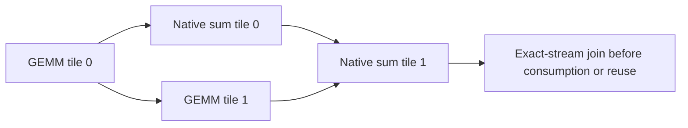

The tiled serial control retains the smaller GEMMs and extra native calls but
orders each complete pair. That distinguishes overlap savings from changing
launch geometry. Timing is the maximum of the two participants' native event
intervals, not their sum. Each graph repeats eight projection/sum transactions;
five warmups and twenty-five interleaved samples precede the summary. Both
participants check every output byte against the untiled captured control and
verify three untouched guard rows after every sample. Inputs and weights are
nonzero and participant-distinct. There are no new device kernels, inference
APIs, library changes, or extra physical buffers in the candidate.

| Backend | Live rows | Untiled, us | Best overlapping tiles | Overlapped, us | Untiled / overlap |
|---|---:|---:|---:|---:|---:|
| CUDA | 64 | 255.10 | 2 | 293.14 | 0.870x |
| CUDA | 448 | 1188.15 | 2 | 1230.25 | 0.966x |
| CUDA | 512 | 1249.48 | 2 | 1347.72 | 0.927x |
| ROCm | 64 | 313.38 | 2 | 340.90 | 0.919x |
| ROCm | 448 | 1281.34 | 4 | 1152.38 | 1.112x |
| ROCm | 512 | 1518.84 | 4 | 1335.34 | 1.137x |

For ROCm at 448 rows, two tiles are nearly as fast (1154.92 us) with fewer
nodes. At 512 rows their cost is 1371.32 us. Eight tiles lose on both backends.
CUDA overlap does improve over its **tiled** serial control, but the untiled
transaction remains faster: smaller GEMMs and additional native submissions
erase the benefit. A blanket row-pipeline default is therefore rejected.
ROCm bulk overlap is a local opportunity, not a production speed claim; even
its isolated saving across forty layers would only be a small fraction of the
remaining whole-request gap. Do not multiply this phase ratio into model tok/s.

All six registered performance cells pass and all six successful-run driver
windows are complete and clean, with no runtime warning/error lines. Initial
harness development exposed an unjoined setup producer and misuse of an
external-publication event for an internal graph fork. The strict APIs rejected
both; the latter probe hit its bounded watchdog during communicator retirement.
Both failed probes also have clean driver windows. They are harness failures,
not evidence of a new production defect. The corrected fixture uses
`IWorkerGPUContext` graph edges and an explicitly retained, output-only device
slice; ordinary `FP32Tensor::create_view()` is not a device-alias contract.

Evidence: `projection-overlap-{cuda-448-v3,cuda-512,cuda-64,rocm-448,rocm-512,rocm-64}`
logs and driver reports. Source is
`tests/v2/performance/kernels/moe/Perf__ProjectionCollectivePipeline.cpp`, with
six `V2_Perf_ProjectionCollectivePipeline_*` registrations. These performance
tests are deliberately outside ProductionTestPreflight. The accepted model
runtime is unchanged; >1.8x scaling remains unmet.

Fresh 448-row repetitions confirm the direction: CUDA untiled/overlapped
two-tile medians are 1184.22/1227.76 us; ROCm medians are 1280.06/1154.84 us
(four tiles: 1151.20 us). All eight successful invocations have complete,
passing driver windows and zero findings. The CUDA tuning reference now
contains the verified backend-symmetric command and its interpretation limits;
skill validation and `git diff --check` pass. Full Unit/preflight and HF gates
were not rerun for this performance-only addition: no production implementation
changed. A future runtime lowering must pass those gates, implement live-count
communication, and prove an end-to-end win before promotion.

### Register-owned ROCm activation publication (2026-09-29, candidate)

The updated goal discounts **unavoidable communication waits**, not padding,
replicated compute, unused capacity or avoidable dispatch costs. The preceding
ROCm native-DAG estimate is only about 1.56x for the main graph even after
optimistically removing all communication and its layout work. Native transport
changes alone therefore cannot satisfy the new >1.8x target. That bound remains
diagnostic: it holds measured compute durations fixed and does not establish
cross-participant critical-path joins or an achievable whole-request speed.

Activation quantization was disproportionately expensive in the small tail:
the old bulk producer reread inputs after an atomic shared-memory maximum, and
its small-row alternative launched many underfilled workgroups. The new ROCm
producer assigns each canonical 32-element block to eight lanes, retaining four
inputs per lane through a shuffle maximum and packed byte publication. Optional
INT32 block sums retain the existing row-major ABI. Unaligned source/output
views and partial final blocks use guarded scalar accesses. No weight format,
activation precision, wire policy, persistent allocation or VRAM budget changes.
M=1 and M=2..16 retain their previous public decode dispatch; larger rows select
the measured register-owned producer. CUDA already uses a one-pass shuffle
producer, so no CUDA arithmetic change was appropriate.

The new explicit preflight entry `V2_Integration_ROCmActivationQuantization`
proves both public APIs across 124 geometries and twenty changing-input retained
replays each. It checks every output byte, scale word, integer sum, tail/leading
guard and null-stream rejection. Together with the existing all-codebook
NativeVNNI prefill and grouped-verifier proofs, **3/3 focused preflight entries
pass in 44.26 seconds**, with a clean driver window. This is not yet a fresh
full Unit/preflight or HF certificate for the candidate.

The former blockwise quantizer performance harness used default streams and
loose +/-1 byte checks. Its replacement measures sixteen captured production
producer nodes with native events, independently checks exact results, and has
an isolated one-shape profiler entry. All **70 timing shapes pass**. This target
remains Performance-only. The installed four aligned/tail and sum/no-sum
variants have zero compiler spills, zero private scratch and zero LDS storage.
Exact 512x2048 dispatch counters report 94--95% active-lane utilization and
16/20 allocated VGPRs, versus the compiler's unrounded 14/17-register counts.
The three/six LDS instructions are lane shuffles, not shared-memory allocation.
Each counter invocation selects one variant and dispatch; driver diagnostics
are complete and clean. Verified commands live in the ROCm tuning reference.

Two full Release benchmark orders, each with independent warmup and five
512-prefill/256-generation measurements, give these preliminary results:

| Topology | Control prefill tok/s | Candidate prefill tok/s | Control decode tok/s | Candidate decode tok/s |
|---|---:|---:|---:|---:|
| ROCm1, A/B | 1094.56 | 1114.29 | 127.81 | 129.80 |
| ROCm1, B/A | 1094.57 | 1112.30 | 129.11 | 129.47 |
| ROCm2, A/B | 1244.13 | 1270.19 | 97.52 | 94.58 |
| ROCm2, B/A | 1244.46 | 1269.44 | 96.76 | 94.29 |

Within each topology all twenty measured requests preserve the complete token
stream and MTP counters. Prefix cache remains enabled with no benchmark hits;
PerfStats and profilers are disabled. Both driver windows pass. **Do not yet
accept this as an overall win:** the ~2% prefill benefit is repeatable, but the
two-GPU decode difference needs attribution. The B/A control itself changes
from roughly 97.6 to 94.9 tok/s across its measured requests. A separate native
trace is checking whether the new producer executes in decode at all and where
time differs. Trace throughput is not a replacement for these timing samples.

Evidence is `quantize-production-{ab,ba}-*`, `quantize-focused*`,
`quantize-production-shape-sweep.log`, `quantize-production-resources.txt`,
`quantize-installed-k*-s*`, and `quantize-installed-trace-*` under the ignored
result root. The single/two-card raw prefill ratio is still about 1.14x, and no
new communication-adjusted model ratio has been certified. The goal is unmet.

Follow-up: both native traces have exactly 158,972 dispatches and identical
resource metadata for every pre-existing kernel. The final verifier executes
the old M<=16 sum producer in both, with no register-owned quantizer launch.
Its relevant queues and per-kernel occurrence counts match. Matched microbench
M4/M16 sum/no-sum timings agree within 0.01 us. The new producer's measured
ordinary quantization time in the main/tail prefill windows is 2.10/0.58 ms
versus 6.02/5.95 ms on the observed continuation participant; do not add these
inclusive values to an overlap-aware critical path without its dependencies.
The trace's profiler-induced host gaps are not production dispatch measurements.

Two additional process pairs confirm the prefill result but **do not clear the
decode economy question**. Across twenty requests per binary, two-GPU prefill
is 1244.92/1270.14 tok/s (control/candidate); decode is 96.60/94.41. One unchanged
control process itself measures 94.57 tok/s, and restoring the older quantizer
translation unit through the diagnostic interposer also gives 94.43. This
rules out a simple regression in the new producer's decode arithmetic, not
every possible indirect binary/runtime effect. Keep the candidate's status
provisional and retain this observation when interpreting later A/B runs.

The completed profiler code-object URIs also identify exact bounded ELF images
inside both preserved core DSOs. Comparing the final verifier's executed
function bodies gives **87/87 byte-identical machine-code bodies**, not merely
equal register counts. The runtime-loaded RCCL kernel has a process-memory URI
and is explicitly unavailable for that post-exit comparison; the same installed
RCCL DSO was selected for both. This is evidence against changed verifier
instructions, not a claim that every host scheduling effect or draft graph is
excluded. See `quantize_isa_comparison.py` and `quantize-decode-isa-comparison.json`.

Extending that comparison over the entire trace, including MTP drafts and
prefill, finds **173/173 common recoverable kernel bodies byte-identical**. The
sole changed executed project-kernel family is the intended prefill quantizer.
Runtime-generated RCCL/copy/fill modules remain explicitly unavailable, not
declared equal. The additional report is `quantize-whole-trace-isa-comparison.json`.

The fresh aggregate gate is complete: **680/680 Unit** in 76.15 seconds and
**525/525 ProductionTestPreflight** entries pass. The latter comprises 240 host,
99 CUDA, 109 ROCm and 77 exclusive/multi-device entries. The entire prerequisite
transaction takes 1,423.84 seconds. All four exact HF cells reuse its one fresh
receipt and pass, preserving their CSV contracts and numerical thresholds:

| Backend | Regime | Cell seconds | Validated artifacts |
|---|---|---:|---:|
| ROCm | Static / MTP off | 17.76 | 8 |
| CUDA | Static / MTP off | 19.11 | 8 |
| ROCm | Dynamic / adaptive MTP | 47.10 | 10 |
| CUDA | Dynamic / adaptive MTP | 48.45 | 10 |

The combined build/gate/HF driver observation is complete, passing, and has no
findings. Evidence is `quantize-register-prerequisites/prerequisites.json`,
`quantize-register-hf-*` and `quantize-register-certification-driver.report.json`.
This is a **correctness-green candidate**, not an accepted overall economy win,
a full mathematical matrix certificate, or a release certificate. Decode's
process-dependent 94--98 tok/s behavior remains an explicit open observation;
the measured prefill improvement does not resolve it. GDN underfill and the
down-projection scaling gap remain next compute targets after separating that
runtime variation. Do not rerun this aggregate receipt for each diagnostic
unless the implementation or other covered inputs change.

### Rejected ordered-carry GDN ownership (2026-09-29)

A separate Release DSO tested eight state owners per value column instead of
four. Two owners each held sixteen keys from one canonical 32-key partition;
the low half passed its FP32 accumulator to the high half before the remaining
sixteen MACs. The four completed partitions were still reduced in decode order.
This is not an eight-way reassociated dot, a temporal scan, or a precision change.
It doubled the 16-head grid from 32 to 64 workgroups without adding global
storage. The source was isolated under `gdn-halfcarry-*`; production was not
changed.

Both control and candidate passed five captured byte-exact regression tests,
including unequal request lengths, tile boundaries, partial snapshots, head
shards, and the untouched D_K=64 path. Unprofiled A/B/B/A medians at 448 rows
were approximately 874/1,560 us at 32 heads and 801/797 us at 16 heads. The
64-row tail also regressed, from 110 to 121 us at 16 heads. There is no useful
economy win, and the candidate is rejected.

Separate single-dispatch counters explain why more workgroups were insufficient:
the physical wave count doubled from 128 to 256, but active-lane utilization
fell from 87.0% to 67.8% during the ordered half-lane dot phases. VALU busy rose
from 14.7% to 24.8% without shortening latency. Allocated VGPRs fell from 124
to 76, and both kernels had zero private scratch and zero compiler spills.
The timing and profiler driver windows both passed with no findings. Resource
improvement alone is therefore not evidence of an inference improvement.

### Fixed-row compiler expansion probe (2026-09-30)

The ROCm expert-tiled gate/up and down kernels used fixed-size accumulator
arrays, but a runtime `break` inside each explicitly unrolled row loop prevented
LLVM from expanding it. The executed IQ4_NL down specialization retained
indirect VGPR indexing in the K loop. An isolated candidate uses a bounded
`continue` guard instead: active rows execute the identical FP32 operations in
the identical partition order, while inactive rows still do no memory work.

After validating an unchanged interposed control, both candidates passed the
five all-format/captured projection suites. The first down-only A/B/B/A reduced
the degree-two column-down phase from 623.56 to 558.02 us. Applying the same
guard to gate/up gave the following medians of two independent nine-sample
captured phase runs per binary (microseconds):

| Local ownership shape | Control gate/up | Candidate gate/up | Control down | Candidate down | Control pipeline | Candidate pipeline |
|---|---:|---:|---:|---:|---:|---:|
| Degree 1 | 2864.28 | 2702.43 | 1111.36 | 991.63 | 4081.46 | 3804.47 |
| Degree 2 | 1561.58 | 1473.58 | 622.73 | 559.00 | 2291.32 | 2139.61 |
| Degree 4 | 901.07 | 843.04 | 382.79 | 350.22 | 1391.67 | 1299.63 |

These are transport-free shape probes, not multi-GPU model speeds. Separate
degree-two fixed-column down is 622.86/559.94 us. The gfx906 all-instantiation
spill guard passes; resource counts rise slightly, with some scalar-to-vector
register-lane moves but no private scratch or memory spills. CUDA uses a
different producer structure and has no corresponding loop to change.
The candidate remains isolated pending broader format/tail economy, profiler
evidence and whole-model A/B; production projection code is not changed yet.

The isolated DSO must give both kernels and device lookup tables distinct
symbols. An earlier unrenamed probe failed IQ3_S numerics even with the unchanged
control, invalidating that experiment rather than exposing a production defect.
After symbol isolation the unchanged control passes the same oracle. The
profiling skill now records this authentication requirement. Evidence prefixes
are `moe-static-rows-*` and `moe-static-both-*` under the ignored result root.

The broader sweep rejected the independent-guard candidate as the final design:
although 41/42 all-codebook shapes improved, the IQ1_M 512-row case regressed
2.64%, and the sparse 64-token Qwen tail regressed approximately 4%. An isolated
replacement nests compile-time-indexed visits, ending at the first absent row.
This exposes constant accumulator registers without testing the unused suffix.
All 408 tiled specializations compile with zero private bytes, VGPR spills, or
scalar-to-vector register moves on gfx906. The candidate passes the captured
all-format live-row oracle, bounded-publication/long-prefill oracle, and sparse
tail replay oracle. In the paired first sweep, all 42 codebook/row shapes improve
(median latency reduction 13.72%). The degree-two main pipeline is
2296.68/2074.02 us; its 64-token tail is 904.48/893.88 us. These remain local
phase measurements and the model-level effect is being measured separately.

Exact-dispatch profiling selects the *active* IQ2_S 12-row gate/up specialization,
not its retained, mostly-empty 16-row alternative. Its scalar-pipeline busy
fraction is 19.57/8.07%; the IQ4_NL down specialization is 37.60/16.99%.
Each pair keeps the same wave count and LDS instruction count; both have zero
scratch, and measured LDS bank conflicts are zero. The raw profile's template
names are demangled, so filtering on LLVM-mangled names produced no counters;
those initial traces are not counter evidence. The authenticated reports are
`moe-nested-rows-profile-typed-*`, with one exact dispatch per collection. The
new all-codebook economy cases live in `Perf__GPUExpertPipeline.cpp`, outside
the production-preflight performance gate. No production projection code has
been changed at this point.

The short-circuiting visitor is now installed in the ordinary ROCm gate/up and
down implementations. The captured live-row regression visits every live count
from zero through each retained capacity (16, 33 and 65), including recovery
after empty publication. Its existing CUDA/ROCm preflight registrations cover
all weight formats and the floating-point expert paths; the separate performance
sweep is not added to preflight. Release and Integration builds pass the mandatory
gfx906 spill guard. No dispatch policy, arithmetic order or runtime workspace
capacity changes.

The fresh installed-build transaction passes **680/680 Unit** and
**525/525 ProductionTestPreflight** entries (240 host, 99 CUDA, 109 ROCm and
77 exclusive/multi-device), in 1431.65 seconds including discovery. Four exact
HF cells then reuse that receipt, with unchanged numerical thresholds and CSV
contracts:

| Backend | Regime | Cell seconds | Validated artifacts |
|---|---|---:|---:|
| ROCm | Static / MTP off | 17.58 | 8 |
| CUDA | Static / MTP off | 18.08 | 8 |
| ROCm | Dynamic / adaptive MTP | 47.55 | 10 |
| CUDA | Dynamic / adaptive MTP | 47.30 | 10 |

The complete driver observation passes with no findings. These are focused
model proofs plus the full prerequisite gate, not a full mathematical matrix or
release certificate. Evidence is `moe-row-installed-prerequisites/`,
`moe-row-installed-hf-*`, and `moe-row-installed-certification-driver.report.json`.
The normal-linked Release A/B is measured separately below; isolated-library
timing is not substituted for that result.

The ordinary Release A/B/B/A is complete, using the frozen preceding binary
and core together, with no interposed library, profiler, or PerfStats timing.
Each process has one warmup and five measured 512-prompt/256-generation
requests. The saved topology, dynamic MTP policy, prefix policy, seed and
formats are identical. Rates below combine equal-token samples harmonically:

| Topology | Control prefill tok/s | Installed prefill tok/s | Change | Control decode tok/s | Installed decode tok/s |
|---|---:|---:|---:|---:|---:|
| 1 MI50 | 1113.49 | 1165.43 | +4.66% | 129.36 | 127.64 |
| 2 MI50, gate/up-owned + column-down | 1270.54 | 1310.16 | +3.12% | 94.58 | 95.10 |

Every one of the forty measured 256-token streams matches its same-topology
control. MTP decisions, prefix counters and prefill chunk geometry also match;
graph probe arrays differ only in serialization order. The active workspace
and prepared-weight sizes are unchanged. The driver interval has no findings.
This is **1.124x raw dual/single prefill scaling**, not the requested >1.8x.
No fresh communication-discounted result is inferred from these timings.

Decode is not certified as an improvement. One single-GPU candidate process
measured 125.54 tok/s throughout its five requests, whereas its other candidate
process measured 129.80 and the controls measured 128.87/129.84. Prefill, tokens
and MTP decisions were stable in that slower process. Retain it as unresolved
process-level timing evidence rather than discarding it as noise; the next
focused repeat investigates it without rerunning already-green correctness
gates. Evidence: `moe-row-installed-model-*`.

The follow-up single-GPU A/B/B/A completes with control decode at
128.95/129.53 tok/s and candidate decode at 129.55/128.92 tok/s: both
combined rates are 129.24 tok/s. Candidate prefill remains
1165.66/1165.89 tok/s versus 1111.04/1114.56. All twenty new token streams
match, and the driver report is clean. This does not reproduce a decode
regression but does not explain or erase the earlier slow process. Evidence:
`moe-row-single-repeat-*`. No source change or repeated prerequisite gate was
needed for this timing-only check.

### Independent GDN preparation ablation

An isolated diagnostic leaves the full recurrent body compiled but conditionally
returns after gates and Q/K normalization for the performance fixture's aliased
state buffers. It publishes observable prepared values, so the compiler cannot
discard that work. This is deliberately **not a valid inference kernel**, is
not installed, and its timing-harness completion is not a correctness proof.
The unchanged interposed control separately passes captured prefill/decode
equivalence before timing the A/B/B/A pair.

At 448 rows and 16 heads, the full kernel takes 800.07 us and preparation alone
takes 132.73 us (16.6%). At 512 rows the figures are 913.04/147.85 us (16.2%);
the 64-row tail is 109.72/24.95 us (22.7%). Thus preparation is measurable but
does not explain most of the recurrent kernel's poor head-shard scaling.
Splitting it into another graph node is not justified as a stand-alone fix.

Both terminal specializations use 123 VGPRs with zero scratch or memory spills;
the diagnostic raises SGPRs from 46 to 55. Native captured timings and static
ISA/resource evidence are recorded, but no hardware-counter certificate is
claimed for this ablation. All accelerator work has a clean driver interval.
Evidence: `gdn-prep-ablation-*` in the ignored results directory.

### Refreshed installed-build critical path

Fresh same-build single/dual rocprof traces include the instantiated native
DOT graphs, with optional stage-timing events disabled. Exact kernel multisets,
dependency edges and a bijective native-stream/observed-queue binding identify
each execution. The 512 bucket has **448 live rows**, followed by the separate
64-row prefix-checkpoint suffix. All three observed agents finish successfully,
and the complete driver interval is clean. Profiler finalization spends about
94.6 seconds exporting the dual trace after GPU execution has ended; that time
is not graph preparation or inference.

The main graph takes 330.39 ms on one MI50 and 291.52/303.72 ms on the two
participants. The suffix takes 83.85 ms single and 77.09/75.82 ms dual.
Recomputing the dependency path with communication assigned zero duration gives
**1.49x** for the two segments together; additionally removing communication
layout gives **1.51x**. Retaining observed queue gaps reduces those estimates to
1.45x/1.47x. These use the slower participant per segment and fixed measured
kernel costs, omit host/prefix/sidecar work, and do not model changed resource
contention. They are diagnostics, not achievable-throughput certificates.

The following main-bucket critical-path costs hold the measured queue ordering
and gaps, with communication/layout assigned zero cost. The dual column is
participant 3; participant 2 has the same qualitative ranking:

| Compute family | Single ms | Dual ms | Local scaling |
|---|---:|---:|---:|
| Dense projections | 126.27 | 70.13 | 1.80x |
| Routed gate/up | 85.02 | 45.56 | 1.87x |
| Routed down | 37.92 | 23.93 | 1.58x |
| GDN recurrence | 26.53 | 23.44 | 1.13x |
| Attention | 17.70 | 11.36 | 1.56x |
| Routing/grouping | 8.64 | 12.02 | 0.72x |
| Activation quantization | 7.69 | 7.52 | 1.02x |
| Normalization | 5.61 | 4.78 | 1.17x |
| Other compute | 13.78 | 13.10 | 1.05x |

Literal one-thread launches account for 0.083 ms single and 0.143 ms per dual
participant, mostly fixed-size epoch, KV-position and attention-parameter
publication. They are not the missing scaling factor. The router logits kernel
alone remains approximately 6.9 ms on each device because it evaluates the full
router on every participant. Dual grouped-plan materialization adds work absent
from the single-device path. GDN's independent head/value groups also retain a
long exact per-token recurrence with weak head-shard scaling. These measured
compute limits remain alongside exposed native-collective cost; the result does
not justify another transport substitution or loosening arithmetic contracts.

The trace records small causal clock discrepancies rather than concealing
them: single main/suffix edge-overlap sums are 104/41 ns; dual participant 3
records 0.143/0.321 ms in aggregate. The native identities and dependency order
still match exactly. Treat sub-millisecond attribution differences accordingly,
not as evidence of a scheduler correctness bug or a precise latency bound.
No inference implementation changed during this diagnostic repeat. Evidence:
`moe-row-installed-dag-*`, `moe-row-installed-*-dag.json`,
`moe-row-installed-zero-comm.json`, and
`moe-row-installed-native-timelines.svg`. The ROCm profiling reference records
the matching, clock-skew and phase-ablation cautions without turning the skill
into a measurements diary.

### Remaining production verification and scope

Do not translate the isolated 2× exchange result into a 2× inference claim.
The production kernel binding and explicit graph collective have passed their
focused and aggregate verification. Their storage belongs to a
shared admitted domain lifetime: sequential layers/buckets reuse storage;
simultaneous graph families need separate owners. Creating a host payload bank
per layer is not an acceptable installation of this protocol.

The native communicator continues to own P2P-enabled communication. The mapped
prototype is evidence for this host's no-P2P edges, not permission to bypass
native P2P on another machine. A production transport decision must consume
the already discovered directed peer matrix, reject unknown coverage, and be
capture identity. Dynamic-count native-P2P support remains a separate required
implementation; a fixed host count is not a solution to device-owned skew.
Column publication and shared reduce-scatter also need live-row contracts for
partial prefill buckets, not a claim that compact expert packets alone remove
all padded traffic.

Before a model A/B, run the all-format projection graph regression through the
installed compact exchange, then the exact HF cells and matched frozen-control
Release workload. The earlier prototype-only **678/678 Unit** gate passed in 76.79 seconds.
Its **509/509 ProductionTestPreflight** refresh passed in 1663.02
seconds, with zero new GPU driver records or findings. This **1187-test green
gate** includes the counted TransferEngine API and compact packet sweeps; the
earlier 1181-test receipt predates them. Evidence is in
`compact-transfer-unit.{log,xml}`, `compact-transfer-preflight.{log,xml}` and
`compact-transfer-preflight-driver.report.json` under the result root.

## CUDA expert-phase ranking (2026-09-29, follow-up)

The complete-pipeline ranking below is now split at the public grouping,
gate/up/SwiGLU, down/scatter and canonical-fold boundaries. Each sample times
eight retained operations; nine samples follow three warmups. The fixture
checks separately captured phases against the complete captured result, then
prepares actual source-column views and checks the fixed-down bank against the
corresponding full-width output bytes. TP1/2/4 remain **physical local shapes
on one RTX3090**, not measured communication or four-card model inference.

The fixed-down phase uses **all** original routes and N divided by the degree.
Its producer uses participant-owned routes with complete gate/up matrices.
Those are deliberately distinct workloads; timing filtered whole experts and
calling it column ownership would be incorrect. These phase probes omit the
new mode's intermediate export/import and native collectives. They therefore
rank local producers, not the end-to-end ownership modes.

The final phase run supplies the following main-bucket medians (512 physical
rows, 448 live):

| Local operation | TP1 us | TP2 us | TP4 us | 1→2 | 2→4 |
| --- | ---: | ---: | ---: | ---: | ---: |
| Owner gate/up + SwiGLU, including input quantization | 852.48 | 504.96 | 304.26 | 1.69x | 1.66x |
| Whole-expert down + canonical scatter | 596.99 | 349.69 | 232.06 | 1.71x | 1.51x |
| Column-owned down + canonical scatter | 573.82 | 290.43 | 151.42 | 1.98x | 1.92x |
| Whole-expert grouping | 71.17 | 69.12 | 68.48 | 1.03x | 1.01x |
| Whole-expert fold | 46.21 | 46.21 | 46.21 | 1.00x | 1.00x |
| Column-owned fold | 46.08 | 24.70 | 14.08 | 1.87x | 1.75x |

Grouping and whole-expert folding are replicated work and have no halving
promise. They are retained as visible overhead, not falsely failed as sharded
GEMMs. With complete-pipeline entries removed to avoid double-ranking parents
and children, occurrence-weighted excess above ideal TP2 halving identifies:

1. GDN main recurrence/preprocessing: **5.00 ms** over thirty main layers.
2. Owned gate/up main producer: **3.15 ms** over forty main layers.
3. Whole-expert down/scatter main producer: **2.05 ms** over forty layers.
4. Owned gate/up tail producer: **1.07 ms** over forty layers.
5. Q/gate + GDN QKV tail projections: **0.84 ms** over forty layers.

These are prioritization estimates, not additive critical-path savings.
The combined report contains 24 curves and 1,020 role-mapped samples, including
432 new phase observations. Twelve partitioned curves miss 1.9x at TP2 and
sixteen at TP4. All inspected CUDA phase symbols have zero local-memory bytes.
The owner gate/up phase records 32,768 gather CTAs and 8,192 projection CTAs;
whole-expert down records 32,768 projection CTAs and 131,072 canonical-scatter
CTAs at the main shape. Those conservative capacity grids do not shrink with
owned routes. Inactive CTAs exit, but their launch population and replicated
publication are concrete follow-up targets; this is not yet a measured
per-kernel overhead breakdown. GDN remains the leading individual phase and
its low-head-count underfill is the first kernel-tuning target.

The first two collection attempts exposed fixture errors, not production
regressions: source views need shared source lifetime, and a newly captured
consumer must join its exact external producer before capture. The fixture now
uses `ScopedBackendGraphCapture` so a failed assertion cannot leave the stream
capturing. Backend-symmetry checking also exposed an invalid diagnostic
assumption: regrouping can change packed row order on ROCm. The real column
graph imports intermediates through the new route map. The transport-free
probe now regenerates its gate/up values after grouping, outside down timing;
it never consumes intermediate rows packed for an old map.

Evidence root: `parity-results/qwen36-rocm2-prefill/` (ignored). Final CUDA:
`cuda-phases-v4.log`, `cuda-phases-v4-driver.report.json` (six cases pass, zero
driver findings). Backend-symmetry proof: `rocm-phases-v2.log` and its driver
report (six cases pass, zero findings). Phase CSV/report: `cuda-phase-samples.csv`,
`cuda-expert-phase-ranking.{csv,json,svg}`; combined priorities:
`cuda-phase-priority-ranking.{csv,json,svg,png}`. Report validation remains ten
passing device-free tests, also passing through `V2_Unit_KernelShardScalingReport`.
Production core and dispatch have not changed in this diagnostic slice; no new
whole-model speedup or fresh full-gate certificate is claimed.

## CUDA shard ranking (2026-09-29, diagnostic baseline)

The CUDA measurement surface now mirrors the ROCm shape-scaling exercise.
Retained production launches run on one RTX3090 at the local dimensions for
degrees 1, 2 and 4, with unchanged weights/activation/KV formats. This host has
only two CUDA devices: TP4 below is a local-shape experiment, not a four-card
inference certificate. Dense probes keep the installed exact dispatch overlays
enabled and byte-check every output against the untimed production call.
Their timings include activation quantization. GDN includes preprocessing;
attention uses the production Q/KV sharding rule, including replicated KV at
TP4. Whole-expert MoE uses 256 prepared experts, IQ2_S gate/up and IQ4_XS down,
eight routes, and exactly balanced ownership. It is a compute bound for the
whole-expert mode, **not** a substitute for measuring the distinct
GateUpOwnedDownColumns pipeline or real-model router skew.

The report contains 696 role-mapped samples from 510 distinct timing
observations and twelve curves; roles sharing one physical N/K geometry reuse
its measurements rather than pretending to provide independent samples. Nine curves
miss 1.9x at 1→2; eleven miss it at 2→4. Ranking uses occurrence-weighted excess
above ideal halving, not the worst ratio alone. Counts refer to the forty main
model layers (thirty GDN, ten attention), excluding the MTP sidecar. Independent
kernel intervals overlap in the real graph; these estimates must never be
summed or presented as an end-to-end speedup prediction.

| Operation | Workload | TP1 us | TP2 us | TP4 us | 1→2 | 2→4 | TP2 excess × main-layer occurrences |
| --- | --- | ---: | ---: | ---: | ---: | ---: | ---: |
| Whole-expert pipeline | 512 capacity, 448 live | 1546.24 | 967.68 | 656.38 | 1.60x | 1.47x | 7.78 ms |
| GDN recurrence + preprocessing | 448 live | 468.10 | 400.70 | 345.66 | 1.17x | 1.16x | 5.00 ms |
| Whole-expert pipeline | 64-row tail | 1182.72 | 656.38 | 372.74 | 1.80x | 1.76x | 2.60 ms |
| Q/gate + GDN QKV projection | 64-row tail | 76.86 | 59.52 | 52.99 | 1.29x | 1.12x | 0.84 ms |
| GDN Z projection | 64-row tail | 59.52 | 52.99 | 37.50 | 1.12x | 1.41x | 0.70 ms |
| Attention | 64 queries, 512 KV | 137.07 | 129.12 | 128.88 | 1.06x | 1.00x | 0.61 ms |
| Q/gate + GDN QKV projection | 512-row main | 423.55 | 225.79 | 114.11 | 1.88x | 1.98x | 0.56 ms |
| Attention/GDN output projection | 512-row main | 222.59 | 114.11 | 61.12 | 1.95x | 1.87x | 0.11 ms |
| GDN Z projection | 512-row main | 225.79 | 114.11 | 81.66 | 1.98x | 1.40x | 0.04 ms |
| Attention | 512 queries, 512 KV | 454.11 | 228.19 | 142.33 | 1.99x | 1.60x | 0.01 ms |

The retained GDN graph supplies compiler/resource evidence without Nsight:
recurrence is 64 threads, 96 registers/thread, zero local bytes and ten maximum
active blocks/SM. Its grid shrinks 512→256→128 blocks on 82 SMs. The corresponding
maximum available block population is only about 6.24→3.12→1.56 blocks/SM;
this is a parallelism/latency-hiding hypothesis, not an achieved-occupancy
counter measurement. The preprocessor uses 37 registers and zero local bytes.
Dense probes likewise report zero local bytes for primary and reducer symbols.
No compiler resource limit or production dispatch was changed.

Fresh production CUDA1/CUDA2-projection requests also passed with clean driver
observations. Their event instrumentation exposed whole captured prefill
intervals (roughly 142.5/37.2 ms single main/tail versus maximum participant
230.0/58.9 ms dual), **not per-kernel critical-path attribution**. They use a
short diagnostic generation horizon and are not new throughput certificates.
Nsight Systems was not retried after its earlier driver assertions.

Evidence: `cuda-scaling-{full,resources}-{dense,gdn,attention}.log`,
`cuda-scaling-moe.log`, `cuda-scaling-stage-*`, `cuda-scaling-samples.csv`, and
`cuda-kernel-ranking.{csv,json,svg,png}` under the ignored results root. Every
completed driver observation is green. Ten device-free report tests pass,
including weighted ranking, replication/collective exclusions, median
reduction, occurrence consistency, and incomplete-curve rejection. All changes
in this ranking slice are performance/report tooling; production core code is
unchanged and the prior 678 Unit + 502 preflight receipt is not a new claim
about these added diagnostic cases.

Next priorities are the routed expert producers in **both** ownership modes,
then GDN's low-head-count latency. Small-M dense projections and the attention
tail follow. Large main-bucket GEMMs are not the leading TP2 scaling defect.
The >1.8x whole-model objective remains unmet; local compute improvements alone
must not be assumed to remove the already-measured collective critical path.

### Native copy-engine/default-buffer follow-up

Native NCCL shared-memory copy-engine modes were measured separately from
ordinary SM-driven communication. Sender/receiver/both-copy modes did not
improve the dominant 4 MiB allreduce (baseline about 1337 us; 1464/1391/1612 us).
A 16 MiB protocol buffer similarly failed to improve the balance. Some
allgathers improved slightly, but there is no evidence of a complete-path win;
none of these settings is installed. The analogous ROCm sender-copy probe did
not complete within its 90-second diagnostic watchdog and is rejected. That
timeout does not establish a root cause or a defect in the ordinary production
path. All native-message probes retained exact payloads when they completed;
their driver observers found no GPU warnings.

Eight CUDA channels with the **default** protocol buffer also passed both
Static/MTP-off and Dynamic/adaptive-MTP HF cells with their CSV contracts. Five
unprofiled Release requests measured 1738.70 prefill / 155.12 decode tok/s, and
their 256-token stream equals the prior eight-channel/1 MiB-buffer cohort.
This is slightly below the prior 1746.84 mean, but confirms that a future
communicator-scoped channel policy need not depend on a process-global buffer
override. Production channel defaults remain unchanged. Evidence prefixes:
`native-copy-engine-*`, `native-ce-large-*`, `channel8-default-buffer-*`.

## Follow-up attribution and dense sweep (2026-09-29, in progress)

Fresh same-build ROCm API/kernel/copy traces are complete with no driver
findings. The measured main 512-capacity / 448-live-row interval is 352.530 ms
on one MI50 and 319.295 ms on the dual root; the corresponding 64-row tail is
94.024 and 84.927 ms. The dual main interval exposes 85.354 ms of collective
time after subtracting overlap with compute. Inclusive family totals must not
be added to that interval. These are diagnostic traces, not new throughput
certificates. Evidence: `native-dag-scaling-*`.

A tiny CUDA Nsight Systems attachment smoke reproduced four NVIDIA
`pSmIssueThrottleCtrl != NULL` driver assertions. Its driver report is red,
although the captured functional kernel ran. The full-model CUDA trace was
therefore not launched. No warning allowlist, driver setting, or production
configuration changed; ordinary non-profiler gates remain the evidence for
inference. Evidence: `native-dag-cuda-trace-smoke*`.

Native retained-message probes then compared ordinary selection with
`NCCL_PROTO=Simple`, preserving native libraries, payload precision and the
existing no-P2P topology. Forty-operation graphs and forty event samples per
message produce exact rank/coordinate-coded output on both participants.
For ROCm, 4 MiB allreduce is 1091.730 versus 1091.966 us, intermediate gather
743.960 versus 746.092 us, and column gather 662.869 versus 664.293 us.
CUDA gives 1337.677 versus 1336.947, 884.301 versus 882.445, and 783.194 versus
782.400 us respectively. This rejects protocol forcing as a useful lever here;
no production override was installed. The driver interval is clean. Evidence:
`native-protocol-*`.

### Turnkey replay defect journal

- **Dense all-format Auto observation rejected:** the six production projection
  geometries, M=64/512, all 21 source formats stopped after 22 authenticated
  cells. Native IQ1_M/IQ1_S QKV tests passed their complete byte comparison,
  but the Python validator rejected the real streaming Auto launch
  `(N tile=256, M tile=8/16, waves=3, unroll=0, checked edges)` as if every
  Auto decision belonged to the forced cooperative-tile inventory. No kernel
  or mathematical failure occurred. The validator now admits that distinct
  family only for Auto, retains all resource/byte/timing checks, and rejects
  invented streaming tuples or forced-candidate masquerading. Both negative
  and positive regressions are explicit production-preflight entries; the
  focused gate passes and all 678 Unit entries pass in 87.80 seconds. No exact policy
  may be installed from this incomplete transaction. Existing completed cells
  and raw failed-publication artifacts are retained under
  `native-dag-dense-sweep/`; its driver interval is clean.
- **Q8 producer identity missing from the same trainer:** the resumed run
  reaches Q8_0 and fails before timing with `could not inspect its launch`.
  Q8_0/Q8_1/Q8_K use the distinct INT8-VNNI producer, while the trainer both
  forces NativeVNNI-only controls and queries NativeVNNI-only metadata. This
  is not evidence of a numerical failure. Repair must name the actual producer,
  sweep only its real controls, inspect its exact compiler resources, retain
  source aliases independently, and byte-certify every candidate. It must not
  pretend ignored NativeVNNI knobs changed Q8 execution or replace Q8 weights.
  Preserve this incomplete generation and recollect against the corrected
  producer identity. `native-dag-dense-resume-1*` retains the failure and a
  clean driver interval.
- **Winner tie treated as a false red:** the fresh producer-aware run reaches
  Q2_K and rejects a native winner because the Python validator sorts rounded
  microseconds with a lexical candidate-name tie break. The native trainer
  selects the first minimum in its declared candidate inventory, from full
  event precision. Authenticate that same raw-sample minimum and tie order;
  rounded display columns must not choose the winner. Add separate exact-tie
  and rounded-display-tie regressions before resuming the retained cells.

### Producer-aware collection completed (2026-09-29)

The repaired collector now authenticates **252/252** source-format/shape/M
cells: all 21 formats, six physical dense projection shapes and M=64/512.
Canonical `status`, `combine`, and alias-aware overlay analysis succeed,
producing 192 distinct physical dispatch keys. The Q8 aliases measured the
real INT8 V3/V7 families; low-bit formats measured their native cooperative or
streaming producer. All candidate output certificates and resource checks pass.
The collection and focused-regression driver intervals are clean. Evidence:
`vnni-producer-dense-sweep/`, `vnni-producer-dense-resume-driver.report.json`.

The new captured identity regression passes all 21 source formats and their
actual candidate inventories. The focused Integration gate passes 3/3 entries
in 3.01 seconds; the Python sweep/overlay tests pass 38/38. These are focused
results, not a renewed complete prerequisite receipt. The previous full
Unit/preflight receipt below predates the new observer and test inventory and
must be refreshed before accepting another model-level change.

No dispatch overlay has been installed. The authenticated Q6 M=512 winners are
within 0.5% of existing Auto at every selected shape. M=64 opportunities range
from effectively unchanged for QKV to 26.3% for 1024x2048, but improving those
tail projections cannot independently meet the two-GPU scaling goal. The
measurement repairs themselves do not change model arithmetic or throughput.

A separate exact-Q6 QKV profiler probe (M=512, N=8192, K=2048) reports zero
scratch, 128 allocated VGPRs, about 100% active-lane VALU utilization, 72.4%
VALU busy, 9.7% SALU busy, 37.2% memory-unit busy, and 1.2% LDS bank conflicts.
Each metric comes from one selected physical dispatch in a separate profiler
process. These counters are attribution only, not canonical timings. Evidence:
`q6-counters-before-*`; the driver interval is clean.

The retained ROCm dense-kernel change replaces repeated integer remainder
checks with a monotonically advancing serial-partition boundary, as the main
CUDA prefill family already does. Cooperative and streaming families keep the
same FP32 operations and fold boundaries. The immutable pre-change Release
control is `q6-boundary-control.ioeOkL`; it includes its own core DSO.

The post-change generation also authenticates **252/252** cells and 192 runtime
keys. The independent all-format serial-M1 versus exact-M/bucket regression
passes in 23.26 seconds, including odd partition spans and streaming geometry.
It is now explicitly in `ProductionTestPreflight`, without a model fixture,
symmetrically with the CUDA registration. Together with captured producer
identity and evidence validation, the focused gate passes 4/4 in 24.81 seconds.
The complete prerequisite transaction and model checks have now finished, as
recorded below; this focused result alone would not replace them.

Same-GPU captured Q6 probes, 31 samples of sixteen producer operations per
sample, improve by 0.3--0.9% in both invocation orders across all twelve
shape/M cases. A few large apparent regressions in the separate four-device
sweeps do **not** reproduce in paired control/candidate measurements:

| Source family | Median control/candidate, forward | Reverse |
| --- | ---: | ---: |
| IQ1_S | 1.0162 | 1.0163 |
| IQ2_XS | 1.0259 | 1.0258 |
| IQ2_XXS | 1.0245 | 1.0249 |
| IQ4_NL | 1.0155 | 1.0168 |
| Q4_K | 1.0309 | 1.0310 |

The worst individual paired result is IQ4_NL at approximately 0.997x, not the
9--11% apparent losses from unmatched sweep rows. Q8's separate INT8 producer
is unchanged and its sweep medians remain approximately 1.000x. An initial
producer-only diagnostic mistakenly included Q8 and correctly rejected it;
that incomplete probe is retained as `q6-boundary-outliers-ab-*`, not counted
as successful evidence. The complete native pairs are
`q6-boundary-native-outliers-ab-*`.

Isolated post-change Q6 QKV profiling keeps 128 allocated VGPRs, 112 SGPRs,
22,528 LDS bytes and zero scratch. SALU busy falls from 9.68% to 7.28%, while
VALU busy remains about 72.6%, supporting the intended reduction in integer
bookkeeping. Profiling is separate from canonical timing. Every completed
driver interval is clean. Evidence: `q6-boundary-{dense-sweep,focused}*`,
`q6-boundary-ab-*`, `q6-counters-after-*`.

`q6_boundary_validation.sh` completed successfully. The refreshed gate passes
**678 Unit + 501 ProductionTestPreflight entries**, 1179 total, in 1349.80
seconds including preparation. Preflight contains 238 host, 92 CUDA, 102 ROCm
and 69 exclusive entries. Its receipt is
`q6-boundary-full-prerequisites/prerequisites.json`; the older native-DAG
receipt predates the producer observer and expanded inventory.

All four targeted two-GPU HF cells pass again: static/ordinal/MTP-off and
dynamic/ordinal/adaptive-MTP on CUDA and ROCm. Their fresh/full-prefix/partial-
prefix lanes and movement assertions retain validated CSV artifacts (eight
per static cell, ten per dynamic cell). No threshold changed. Their elapsed
times are 17.46/18.96 seconds for ROCm/CUDA static and 47.34/47.95 seconds for
ROCm/CUDA dynamic. These focused diagnostics are not a full parity campaign
or an image certificate.

Fresh unprofiled Release numbers retain the same staged model, saved plans,
512-token prompt, 256-token decode, adaptive MTP, five requests after one
warmup, and normal MPI bootstrap:

| Topology / binary | Prefill tok/s | Decode tok/s | Dual/single prefill |
| --- | ---: | ---: | ---: |
| MI50 x1, current | 1087.367 | 128.654 | — |
| MI50 x2 projection, immediate control | 1196.831 | 93.114 | — |
| MI50 x2 projection, current | 1199.455 | 92.892 | 1.103x |
| RTX 3090 x1, current | 1893.997 | 235.460 | — |
| RTX 3090 x2 projection, current | 1657.954 | 155.563 | 0.875x |

The paired ROCm model improvement is only **0.22%**, not a scaling breakthrough
or a demonstrated gain beyond process-level noise. Both binaries produce
identical 256-token streams and identical MTP work counts. All five iterations
within every run also match exactly. CUDA production math is unchanged by the
cursor change. The complete validation, HF and model driver intervals have
zero new kernel-log records/findings. Evidence is `q6-boundary-hf-*`,
`q6-boundary-model-ab-*` and `q6-boundary-validation*`.

### Disjoint prefill budget and next hypothesis

The saved production traces were reclassified with an interval sweep on one
physical agent per topology. Concurrent intervals occupy their own categories;
inclusive kernel sums are not added together. The main-model window is
authenticated by its embedding boundaries, 30 recurrent layers and, on the
dual topology, 40 intermediate packs and 161 native collectives. Main and tail
windows each exclude the MTP sidecar. Evidence: `native-dag-budget-*` and the
read-only diagnostic `prefill_latency_budget.py` under the ignored result root.

| Disjoint time (ms) | Single main | Dual main | Single tail | Dual tail |
| --- | ---: | ---: | ---: | ---: |
| Dense projection only | 115.029 | 51.742 | 27.940 | 15.242 |
| Routed gate/up only | 94.299 | 51.299 | 23.123 | 15.217 |
| Routed down only | 45.972 | 12.463 | 11.636 | 3.871 |
| Recurrent GDN | 26.514 | 23.514 | 3.968 | 3.116 |
| Attention | 17.632 | 11.368 | 6.383 | 4.185 |
| Other only | 51.925 | 46.570 | 19.710 | 19.124 |
| Collective only | 0 | 85.354 | 0 | 13.919 |
| Collective overlapping compute | 0 | 35.006 | 0 | 8.175 |
| Idle | 1.160 | 1.980 | 1.264 | 2.077 |
| Total interval | 352.530 | 319.295 | 94.024 | 84.927 |

The dual main graph's collective kernels use four 256-thread workgroups. The
native-channel probe varied NCCL/RCCL channel counts while holding the aggregate
SIMPLE protocol buffer budget constant. It preserved the existing transport,
source/activation/wire precision and complete captured execution. All exact
coordinate-coded collective checks and the driver interval passed.

For CUDA, eight channels with 1 MiB SIMPLE buffers reduced the isolated 4 MiB
sum from 1335.45 to 1132.62 us, intermediate gather from 876.44 to 765.40 us,
and column gather from 777.50 to 683.67 us. Reduce-scatter changed only from
771.61 to 765.85 us. Driver-free memory observations show **36 MiB extra per
GPU**, despite the unchanged aggregate SIMPLE buffer budget. Protocol-buffer
bytes alone are not proof of equal total native VRAM. The user approved this
modest memory trade-off for further measurement; it is not authority for an
unbounded increase. The cause of the native allocation increment has not been
proven. Evidence: `native-channel-budget-*`.

A same-binary Release ABBA followed, with five 512/256-token requests per run,
one warmup, learned dynamic MTP, the saved projection plans, and PerfStats off.
Only the candidate communicator channel/buffer settings differed:

| Backend | Baseline prefill tok/s, runs A/A | Candidate prefill, B/B | Mean change | Baseline decode, A/A | Candidate decode, B/B |
| --- | ---: | ---: | ---: | ---: | ---: |
| CUDA, 2 to 8 channels | 1663.389 / 1657.446 | 1747.276 / 1747.653 | +5.24% | 156.107 / 155.869 | 155.183 / 154.696 |
| ROCm, 4 to 16 channels | 1199.052 / 1199.666 | 1201.786 / 1201.432 | +0.19% | 94.851 / 95.948 | 97.871 / 95.167 |

CUDA's gain is repeatable but remains smaller than its isolated communication
gain; mean decode is 0.67% lower. ROCm has no meaningful prefill gain, and its
decode variation is too large to claim a durable benefit from this cohort.
All forty measured token streams match within their topology; accepted/drafted
MTP work counts are also unchanged. All eight model driver intervals are clean
with zero new records. Evidence: `native-channel-model-*`. No communicator knob
is installed as a production default. All four tuned-configuration HF cells
subsequently passed with their complete CSV contracts: CUDA static/dynamic
19.01/48.20 seconds and ROCm static/dynamic 17.86/48.20 seconds. The driver
interval is clean (`native-channel-hf-*`).

The full-model live-memory follow-up changes the budget: driver observations
peak at **12710 MiB/card baseline versus 12782 MiB/card candidate**, a **72 MiB
increase per card**, not the isolated communicator's 36 MiB. This observer-
instrumented run is allocation evidence, not the canonical timing cohort.
`NCCLBackend::initializeCopyComms()` constructs a second all-visible-GPU
communicator group in addition to the main coordinator; process-wide channel
environment overrides affect both. This is a plausible explanation for the
doubling, not an allocation-stack proof. The application-owned PMA bytes stay
at 11157597956/card, so those bytes alone must not be reported as total native
VRAM. The larger trade-off has been surfaced to the user before any default
change. Evidence: `native-channel-model-memory-*`. The greater-than-1.8x goal
remains unmet on both backends.

### Isolated GDN register-identity experiment

Two standalone copies of the current production GDN translation unit were
built with the same Release flags and canonical spill guard. The candidate
places an integer register identity on each of the 32 initially loaded state
values before entering cached-normalization recurrence. This tests whether
LLVM unnecessarily retains initial-load dependencies through the loop; no
floating-point operation, ownership, tensor format or allocation changes.
The native code-object census drops from 60 to 28 VMEM wait instructions in
the terminal-only specialization, while retaining 123 VGPRs, 46 SGPRs and
zero scratch/spills. The additional 32 register moves are outside recurrence.
This is compiler evidence only: captured byte proofs and paired timing must
establish correctness and economy before any production edit. The experiment
does not replace a production object or invalidate the existing green build.

Both the explicit register move and tied input/output empty-assembly variants
passed five captured byte-regression cases against serial decode, with loader
bindings proving that the isolated DSO ran against the unchanged Integration
core. ABBA captured sweeps show about 3--4% improvement at 16/8/4/3 heads, but
about 1--2% regression at 32 heads. The empty-assembly form removes the added
register moves without changing that mixed result. Neither is installed as a
universal production change. Both driver intervals are clean. Rechecking the
smaller two-wave workgroup with that dependency removed also preserved all five
byte proofs, but regressed captured M=448 from about 874 to 2082 us at 32 heads
and from 800 to 1067 us at 16 heads. It is rejected, with zero spills and a clean
driver interval. No GDN experiment from this section is installed.

### Unused native-copy communicator ownership (2026-09-29, green)

The suspected duplicate NCCL family is conclusively unused: both copy APIs
already delegate to the ordinary group coordinator. Its handles have only
initialization/destruction consumers. A new isolated Driver-API regression
starts with no primary contexts, selects CUDA:1 alone, and proves the old
backend incorrectly activates excluded CUDA:0 on all three lifecycle rounds.
The focused red is retained as `copy-comm-regression-red.log`. RCCL does not
have an equivalent independent copy family.

The fix removes the unused family, not the native copy implementation or its
event/stream ordering. `V2_Integration_NCCLDeviceScope` is explicitly registered
in ProductionTestPreflight and passes **20/20 fresh-process runs**, each with
three preparation/retirement rounds. Four existing transfer, retained-parent,
native-WHILE and pipeline-command regressions also pass. The entire focused
driver interval has zero new records or findings. No native transport or
channel default is changed. The immutable pre-fix Release control is
`copy-comm-control.kA4ivy`. The complete fresh gate now passes **678 Unit + 502
ProductionTestPreflight entries** (238 host, 93 CUDA, 102 ROCm, 69 exclusive).
Its receipt is `copy-comm-full-prerequisites/prerequisites.json` (1276.55 s).
All four default-channel HF cells pass, as do the two CUDA eight-channel
Static/MTP-off and Dynamic/adaptive-MTP cells. Every CSV contract is validated;
no mathematical gate or execution mode was weakened. The full validation driver
interval passes with no GPU findings (one unrelated firmware-notifier AppArmor
notice). The user explicitly accepted 72 MiB/card if the remaining checks pass;
unnecessary allocation removal is still required independently of that budget
approval.

Fresh observer-free Release timings after cleanup retain the same workload and
five measured requests after one warmup. Cleanup by itself is noise-level:
dual CUDA prefill is 1654.847 control versus 1659.182 current. The CUDA
channel-count ABBA gives **1657.715 versus 1746.839 tok/s prefill (+5.376%)**,
and **155.012 versus 154.952 tok/s decode (-0.039%)**. Both candidate passes
agree (1747.677 and 1746.000); the reverse baseline is 1656.247. Every CUDA
two-device token stream and its accepted/drafted MTP counts match exactly.
ROCm dual remains 1198.569 prefill / 92.736 decode. CUDA single is 1901.019
prefill / 234.792 decode, so even the tuned dual CUDA is only 0.919x single:
the 1.8x goal is **not met**. Evidence: `copy-comm-model-ab-*` and
`copy-comm-channel8-model-*`.

The completed passive memory comparison reports identical peaks on both cards:

| Native resource policy | Driver peak MiB/card | Change from original |
| --- | ---: | ---: |
| Original build, default channels | 12710 | — |
| Cleaned build, default channels | 12694 | -16 |
| Cleaned build, eight channels | 12730 | +20 |

Thus the native-channel increase is **36 MiB/card** over the cleaned baseline,
and **20 MiB/card net** over the original serving footprint, not the earlier
72 MiB/card. All three memory runs retain exact control tokens and clean GPU
driver reports. These observer-instrumented runs prove allocation, not timing;
the preceding observer-free ABBA owns the throughput comparison. Evidence:
`copy-comm-memory-*`. Production channel defaults are still unchanged. Any
durable channel policy must be scoped to the actual native communicator rather
than installing a process-wide NCCL environment override that can also affect
RCCL in a mixed-vendor process.

## Shared native dependency compiler (2026-09-29, green checkpoint)

The diagnostic CUDA transitive reduction below is now a production setup pass
shared by CUDA and HIP, `NativeGraphDependencyReduction`. It executes only on
the sealed native owner immediately before instantiation. Full-completion
edges are removed only when retained full-completion paths imply them; special
CUDA ports/annotations are preserved and excluded from that proof. Node bodies,
buffers, priorities, arithmetic and device state are unchanged. Nested/control
bodies are opaque, not mutated through borrowed graph handles. There is no
new allocation in device memory, host inference loop, runtime switch or replay
cost. PMA remains the only physical-memory authority.

The device-free proof passes all 59,049 typed five-node DAGs, randomly permuted
larger graphs, a 4,096-layer fork/join graph, invalid inventories, native errors,
and idempotence in under one second. Six focused native/preflight entries pass
in 7.37 seconds, including the existing capture suites and HIP queue-placement
proof. Both new captured regressions also pass 20/20 separate process runs,
each containing twenty changing-input replays, alternate launch streams and
parent replay after source retirement. The driver interval is clean. The first
fixture version assumed capture would already remove the redundant root edge;
both SDKs naturally retain it, so the final fixture tests that five-edge to
four-edge transformation directly instead of manufacturing an extra edge.

The complete gate passes **678 Unit + 498 ProductionTestPreflight entries**,
1176 total, in 1241.875 seconds. Preflight comprises 237 host, 92 CUDA,
100 ROCm and 69 exclusive entries. Its driver interval is clean. The current
reusable receipt is `native-dag-full-prerequisites/prerequisites.json`; earlier
column-only receipts are stale. This local receipt does not certify an image.

All four canonical targeted HF cells pass again: static/ordinal/MTP-off and
dynamic/ordinal/dynamic-depth for both native two-GPU projection domains.
Their fresh/full-prefix/partial-prefix lanes, graph-native MTP and existing
movement assertions pass, with 8/10 validated artifacts per static/dynamic
cell. The driver interval is clean. No numerical threshold changed. Evidence:
`native-dag-hf-{rocm,cuda}-{static-off,dynamic-mtp}.{json,log}`.

Matched unprofiled Release measurements use the same contract as the prior
checkpoint: staged IQ3_S, 512 prompt tokens, 256 generated tokens, learned
dynamic MTP, five measured requests after one warmup, normal MPI bootstrap,
and no precision, collective, capacity or placement changes:

| Topology / explicit mode | Prefill tok/s | Decode tok/s | Dual/single prefill |
|---|---:|---:|---:|
| MI50 x1 | 1085.672 | 129.226 | — |
| MI50 x2 whole-expert control | 1021.065 | 87.577 | 0.940x |
| MI50 x2 gate/up-owned, down columns | 1198.568 | 96.223 | 1.104x |
| RTX 3090 x1 | 1908.968 | 235.160 | — |
| RTX 3090 x2 whole-expert control | 1230.513 | 117.468 | 0.645x |
| RTX 3090 x2 gate/up-owned, down columns | 1655.575 | 155.835 | 0.867x |

The **>1.8x prefill goal remains unmet**. Whole-expert remains the default;
projection ownership is still an explicit A/B mode. The single-GPU results
are effectively unchanged against the immediate pre-reduction binary.

ROCm projection decode improves from 81.057 to 96.223 tok/s in the first
pair and from 80.298 to 92.634 in reverse order: **15.4–18.7%**. All five
iterations per run produce identical 256-token streams, and both binaries
have identical MTP accept/draft/verify counts and depth decisions. The absolute
ROCm rate varies between process launches; do not present the first pair as
an exact fixed gain. CUDA decode is effectively unchanged (155.518 → 155.835;
reverse 155.564 → 155.785). Prefill gains are small in both orders: ROCm
1194.515 → 1198.568 and 1193.675 → 1197.220; CUDA 1646.946 → 1655.575 and
1647.746 → 1658.299. Both driver intervals are clean. This experiment isolates
the compiler pass, but does not yet attribute the ROCm improvement to a
particular native scheduling mechanism. Evidence: `native-dag-ab-*` and
`native-dag-ab-reverse-*`.

Production CUDA memory observations, without the diagnostic interposer, show
316 active allocations / 11,157,597,956 canonical bytes per card in both
binaries. At the same pre-owner-release boundary, free driver memory improves
from 13,315,932,160 to 13,366,263,808 bytes: **48 MiB less native usage/card**,
removing the earlier 18 MiB excess. The real 2198-node capture removes 450
of 2868 edges. Both 16-token diagnostic outputs agree and the driver interval
is clean. These DEBUG observations are not peak-VRAM or timing measurements.
Evidence: `native-dag-cuda-model-memory-*`.

Other evidence under the ignored results root: `native-dag-focused-tests-2.log`,
`native-dag-replay-stress.log`, `native-dag-focused-2-driver.report.json`,
`native-dag-full-gate.log`, and `native-dag-full-gate-driver.report.json`.
The immediate pre-reduction Release control is `dag-reduction-control.THPWlv`;
`column-completion-control.LTGY4C` is the older pre-column control.

The separate locality investigation found a real placement mismatch, but no
prefill benefit from correcting it in this workload. During the reverse ROCm
control, PID 2269521's main
thread had CPU mask `0`; OpenMP workers occupied cores 0–27. The selected
ROCm devices 2/3 are physically on NUMA 1, but native `/dev/shm/nccl-*` maps
reported `bind:0` with their resident pages entirely `N0`. Repeated virtual
maps alias the same files and must not be summed as physical bytes.
`configureClusterRankThreads` keeps the inherited rank mask; RCCL's
`ncclTopoGetCpuAffinity` intersects it with GPU locality. TensorFactory also
installs a persistent MPOL_BIND based on its construction thread's actual NUMA
node, so changing RCCL's affinity alone need not repair the memory policy.
Evidence: `native-dag-numa-observation.txt`.

A separately labeled five-request MPI placement pair then changed only the
host CPU set, using the identical post-reduction binary and saved GPU plan.
The remote case placed the main thread on CPU 0 and SHM pages on N0; the local
case placed it on CPU 28 and the pages on N1, verified through `/proc` after
warmup. Prefill was 1199.365 versus 1198.098 tok/s; decode 96.324 versus
93.597. Both produced identical 256-token streams and complete MTP ledgers,
with clean driver observation. That decode variation is comparable to the
already-observed cross-process variation and is not evidence for changing
defaults. This locality correction does **not** explain the missing prefill
scaling here. Evidence: `native-dag-numa-ab-*`, including the raw per-process
locality observations. No locality override was mixed into the graph A/B or
installed in production. Continue with exposed compute/collective attribution,
not a speculative NUMA policy rewrite.

## Shared-column completion checkpoint (2026-09-29)

The >1.8x whole-model prefill target remains unmet. Fresh matched Release
measurements for the shared-column completion implementation are:

| Topology / explicit mode | Prefill tok/s | Decode tok/s | Dual/single prefill |
|---|---:|---:|---:|
| MI50 x1 | 1084.131 | 128.938 | — |
| MI50 x2 whole-expert control | 1019.697 | 76.737 | 0.941x |
| MI50 x2 gate/up-owned, down columns | 1192.649 | 79.432 | 1.100x |
| RTX 3090 x1 | 1904.955 | 235.465 | — |
| RTX 3090 x2 whole-expert control | 1221.289 | 117.399 | 0.641x |
| RTX 3090 x2 gate/up-owned, down columns | 1648.462 | 155.762 | 0.865x |

These are the same staged IQ3_S model, 512-token prompt, 4096 context,
256-token generation, learned dynamic MTP, FP32 activations and untouched
production KV/wire/movement policies: five unprofiled measured requests after
one warmup, through normal MPI bootstrap. Whole-expert ownership remains the
default; `gate-up-owned-down-columns` remains an explicit experiment.

Against the preserved **pre-column** projection implementation, the first
pair improves prefill 1150.959 → 1192.649 tok/s on ROCm and
1507.747 → 1648.462 on CUDA. Reverse-order pairs reproduce these gains:
1152.631 → 1193.443 and 1508.680 → 1649.523 respectively. CUDA decode is
effectively unchanged (155.660 → 155.762, then 155.965 → 155.830).
ROCm decode is slightly lower (80.666 → 79.432, then 79.711 → 79.481);
the different control baselines make a fixed regression size unproven. Do not
claim a decode speedup or established non-regression from these observations.
Both complete pairs emit identical 256-token streams and identical MTP
accept/draft/verify counts within each fixed topology, across all five repeats.
This does not establish cross-topology token equivalence. Both driver intervals
are clean. Evidence: `shared-column-ab-*` and `shared-column-ab-reverse-*`.

Captured native-message measurements justified retaining native collectives
while narrowing the shared-output publication. For the 512x2048 FP32 shared
partial, forty-operation probes measured ordinary allreduce at 1093.421 us
(ROCm) / 1335.347 us (CUDA), versus packing plus reduce-scatter at
683.638 / 788.493 us. The original row width, not the aggregate message or
received-column width, still owns the FP16 threshold decision. No wire,
activation, weight, P2P or driver policy changed.

The installed graph lowering now keeps shared output at its column owner
until the existing final column gather. It reuses the full gathered-column
bank for packing and the dead route-addend prefix for combined columns:

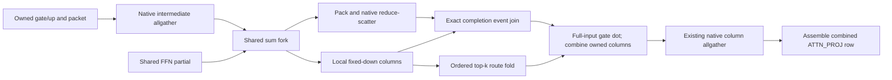

This is one participant-local DAG and the existing typed fork/join lifecycle,
not another controller or hidden collective. An explicit submission edge
preserves intermediate-gather → shared-scatter → final-gather order on every
native communicator. No new production allocation is introduced. Snapshot
publication distinguishes routed/shared column partitions from the complete
combined row so HF diagnostics cannot accidentally sum replicated results.

Initial focused results: six CTest entries passed in 88.20 seconds. The full pipeline
sweeps all supported quantized formats, mixed gate/up/down formats, and
FP16/BF16/FP32 experts on CUDA x2, ROCm x2 and ROCm x4, with twenty owner/input
changes per geometry plus request reset and graph retirement. A separate
captured epilogue sweep compares every small grouped row count (1–16), padded
prefill shapes, scalar/vector widths, and degree 2/4/8 column layouts with the
backend's full-row gate byte-for-byte. Each new functional regression is in
`ProductionTestPreflight`; the isolated economy target is not.

The first fixture attempt correctly rejected an unjoined external event in
the new full-row oracle before arithmetic ran. Setup now joins its extra
oracle tensors through TransferEngine, and its capture uses exception-safe
RAII. No production coherence check was relaxed. Both driver-observation
intervals were clean. Evidence: `shared-column-completion-focused-2.log` and
`shared-column-completion-driver-2.report.json` under the local results root.

The subsequent ISA review found a gap in that initial oracle: it compared
against the existing fused full-row gate/add, but this TP optimization replaces
separate gate and residual-add stages. LLVM contracted the new column product
and add into an FMA even though the gated product was also stored. The stronger
oracle observes the standalone full-row gated product, then adds the routed
value separately. It reproduced a two-ULP ROCm discrepancy; CUDA passed.
Merely calling HIP's `__fadd_rn` did not fix it: this toolchain implements that
intrinsic as ordinary addition unless its optional OCML rounded-operations
macro is enabled. The column product now uses the existing
`device_fp32_contract::multiply` retained register boundary, without memory
traffic, a new arithmetic authority, or a global compiler-policy change.
The original full-row specialization remains unchanged. The corrected version
passed all six strengthened entries in 86.64 seconds, including the four-MI50
pipeline, with a clean driver interval (`shared-column-rounded-product-*`).
The first full gate build was stopped before test execution and is not
prerequisite evidence.

Final code-object evidence: gfx906 uses 18 VGPRs, 28 SGPRs, no private storage
and no register spills; its epilogue contains separate multiply/add operations.
ROCm's dispatch allocation rounds these resources to 20 VGPRs and 32 SGPRs.
CUDA sm80/sm86/sm89/sm90 each report 26 registers, 1024 bytes shared memory,
no local memory and no stack. The isolated Release 512-row/448-live-row
benchmark passed four cases with a clean driver interval: CUDA full/column
gate medians were 24.218/12.826 us; ROCm was 45.896/45.992 us. This proves
isolated CUDA epilogue economy, not a whole-model win. The expected larger
saving still comes from narrowing shared-output communication.

Separate counter observations show CUDA at 81.96% DRAM throughput and 73.08%
achieved occupancy, with zero spilling requests. ROCm reports 2,048 waves,
88.27% VALU lane utilization, zero scratch, and zero LDS bank conflicts.
The Nsight attempt again emitted the NVIDIA `pSmIssueThrottleCtrl` profiling
assertion; its counters are diagnostic observations, not a clean driver
certificate. Preserve `shared-column-kernel-profile/kernel-log-after-profiling.json`.
The attempted reuse of an already-closed driver checkpoint was correctly
rejected and is not interval evidence; subsequent gates need fresh checkpoints.

The refreshed complete gate is green: **677 Unit + 495 ProductionTestPreflight
entries**, 1172 total, in 1231.652 seconds. Preflight comprises 236 host,
91 CUDA, 99 ROCm and 69 exclusive entries. Its driver interval is clean.
The reusable current receipt is `shared-column-full-prerequisites-2/prerequisites.json`;
the old gate receipts are stale and must not substitute for it.

All four targeted canonical HF cells pass: static/ordinal/MTP-off and
dynamic/ordinal/dynamic-depth on native CUDA x2 and ROCm x2 projection domains.
Fresh-seed, complete-prefix-hit and partial-prefix-hit lanes all pass, with
eight static or ten dynamic canonical diagnostic artifacts per cell. Prefill
LM-head cosine/KL are 0.997217/0.00371618 on ROCm and 0.998725/0.00459267 on
CUDA, with all 41 checkpointed layers passing. The native MTP transaction
proofs and existing movement assertions pass; the dynamic logs also show
physically applied arrivals. These rank-local generic fixtures currently use
the four PerfStats movement classes for assertions, rather than exporting
the node-overlay fixture's `expert_movement.csv` typed-ledger certificate.
Do not claim that missing CSV as evidence. Driver observation is clean.
Evidence: `shared-column-hf-{rocm,cuda}-{static-off,dynamic-mtp}.{json,log}`.

The physical ledger is unchanged at 316 active allocations per device:
11,729,165,572 bytes on ROCm and 11,157,597,956 bytes on CUDA. All retire to
zero. ROCm driver free memory is identical. However, the candidate consistently
shows **18 MiB less CUDA driver free memory per card** in both run orders,
including after engine-owned allocations retire. This remains an explicit
memory-footprint investigation, not a proven memory-neutral result. Isolated
native allreduce versus pack/reduce-scatter probes have identical driver
consumption at communicator, capture, replay and retirement boundaries, so
the collective alone does not reproduce the difference. The probe's exact
integer outputs and driver observation pass (`shared-column-cuda-memory-*`).
The pre-change Release control remains in `column-completion-control.LTGY4C/`.

The subsequent setup-only DEBUG measurements locate the CUDA difference in
native prefill instantiation: the five retained buckets typically grow the
driver pool about 4 MiB more each. MTP graph counts and node inventories match.
An immutable DOT/API observation finds 2198 top-level nodes in both 512-row
graphs (1948 kernels, 240 memset nodes, ten conditional nodes), but 2828 versus
2868 edges. Reachability analysis identifies 410 versus 450 transitive edges;
both reduce to the same 2418-edge count. This is a graph-structure observation,
not proof that any particular logical stage dependency is safe to erase.

A **diagnostic-only** setup interposer now confirms the opportunity: it admits
only ordinary full-completion edges, computes their closure, proposes transitive
removal, and checks that the complete reachability matrix is unchanged before
calling the native dependency-removal API. It applies to the matching prefill
and verifier graph sizes, not all native graphs or conditional child bodies.
Both binaries then report exactly 13,368,360,960 free driver bytes per card
while model owners remain live. That removes the candidate's 18 MiB excess
and leaves 32 MiB more free than the original pre-column baseline. Post-owner
free bytes likewise agree at 24,539,889,664. All four 16-token diagnostic
streams agree and the driver interval is clean. These DEBUG/modified-graph
runs are **not** canonical timing, full-length accuracy, or installed-production
certification. Evidence: `shared-column-cuda-{model-memory,native-dag,reduced-dag}-*`.

Next implementation boundary: a shared device-free dependency-reduction plan
plus exact native CUDA/HIP setup adapters, not an environment-controlled
interposer or model-specific special case. Special launch/programmatic edge
semantics must remain explicit; no generic reachability proof may erase them.
Adversarial DAG/reachability tests and retained concurrent-stream replay belong
in Unit and ProductionTestPreflight before repeating HF and matched timing.
The prototype has not changed any production binary, so the current green
receipt above remains the receipt for the existing column implementation only.

Fresh paired native ROCm kernel-only traces authenticate the change: forty
layers and 161 collectives remain, while dispatches drop from 2363 to 2323.
After excluding the first embedding rendezvous, main-layer wall time is
326.266 → 318.650 ms on ROCm:2 (326.328 → 318.577 on ROCm:3). The ordered
forty-layer collective families are attention sum 43.230 → 43.204 ms,
intermediate gather 26.964 → 26.825, shared sum/scatter 43.217 → 25.748,
and final column gather 25.860 → 23.347. Those inclusive totals overlap
compute and must not be added to graph time. Much of the shortened shared
sum was already hidden; exposed collective time after the embedding is only
89.215 → 84.233 ms. No optional GPU-stage events were inserted; both exact
agents and the complete driver interval are checked. Evidence:
`shared-column-native-rocm2-{candidate,control}/` and
`shared-column-native-{candidate,control}-device{2,3}.json`.

## Current integration checkpoint (2026-09-28)

The target is **greater than 1.8x single-to-dual GPU prefill scaling on each
backend**. It is not yet achieved. The explicit projection mode remains a
separate experiment; whole-expert ownership is the default and control.

| Matched Release control | Prefill tok/s | Decode tok/s | Dual/single prefill |
|---|---:|---:|---:|
| MI50 x1 | 1083.557 | 129.234 | — |
| MI50 x2 gate/up-owned, down columns | 1053.469 | 80.190 | 0.972x |
| RTX 3090 x1 | 1901.499 | 236.424 | — |
| RTX 3090 x2 gate/up-owned, down columns | 1435.609 | 155.797 | 0.755x |

These use the same staged Qwen3.6-35B-A3B-UD-IQ3_S file, 512-token prompt,
4096 context, 256 generated tokens, learned dynamic MTP, production movement
and wire defaults, FP32 activations, five measured requests and one warmup.
Single and dual auto plans were saved before measuring. These fresh four-way
results include the redundant recurrent RAM-archive clear removal described
below. Both dual-device outputs exactly match their preceding implementation,
including all five repeats; this does not certify existing cross-TP token
differences. The complete driver interval was clean. Whole-expert A/B results
from before that change remain below and must not be presented as a fresh
same-build comparison. No P2P or driver setting changed.

The 2026-09-28 hardware check also confirms that NVIDIA P2P is unavailable:
`nvidia-smi topo -p2p r` and `-p2p w` both report `CNS` (chipset not supported)
between the two 3090s. They share a PXB path without NVLink, and the current
application log reports `peer_access=none`. This is a measured topology
constraint, not proof that every collective duration is unavoidable transport
time. The next CUDA timeline must separate exposed communication, peer wait,
compute and archival work before selecting a further optimization.

Source-authenticated preparation and fixed-down capacity tests passed before
model graph wiring: five preparation/config tests, then two capacity entries
sweeping all 21 quantized source codebooks plus FP16/BF16/FP32. The next
focused run exposed an initial-publication lifecycle bug in the new setup
bridge: a freshly constructed runtime reports no *reset* publication pending,
which is not proof that a first baseline exists. The bridge now queries the
runtime's actual per-layer immutable-baseline lifecycle, without consulting a
shadow of the live device epoch. The same captured CUDA/ROCm fixture checks
first setup and re-entry after moved epochs. The arena fixture also needed
actual hybrid projection metadata to exercise the real estimator branch.
The refreshed focused run passed all seven CTest entries (80.51 seconds):
activation accounting, CLI/config round-trip, explicit preflight registrations,
and captured projection pipelines on CUDA x2, ROCm x2 and ROCm x4. The GPU
fixtures replay twenty changing ownership/full/partial/empty-row transactions
per format and shape, plus reset/graph-retirement boundaries. CUDA x2 took
5.73 seconds, ROCm x2 17.20 and ROCm x4 55.49 while Release compilation was
also active. An additional isolated ROCm x4 repeat passed in 37.39 seconds
with a complete clean driver interval; the first observer had been closed
before that original four-device test ended, so its report does not certify
the complete original run. Evidence is `projection-runtime-tests-2.*` and
`projection-runtime-rocm4-repeat.*` under the ignored result root. Release
has built; the first real-model run is diagnostic, not yet a performance
certificate.

The shared arena geometry replaces the old whole-expert route bank with five
declared buffers. Admission and the model schema consume the same geometry;
fixed down weights remain outside movable gate/up payloads and transfer slots.
The model graph supplies declarations to the reusable six-node builder. The
explicit CLI mode is `gate-up-owned-down-columns`; CPU/cross-tier/cross-rank
execution remains unimplemented and rejected, not silently routed elsewhere.
Cross-tier support remains required follow-up work.

The first production launch reached a factory-order defect: registry-created
builders receive model context after construction. Source geometry now binds
at that existing injection boundary; schema/graph resolution still rejects an
unbound projection declaration. Its new registry-level regression is in the
arena preflight entry; the four focused Unit/preflight entries passed again
in 1.18 seconds. The next launch loaded weights and then found a null
NORMALIZED input: `ActivationBuffers::get()` addresses extensions, while the
normalized common role has a named field. `MoEProjectionPipelineParams::bindArena`
now owns that distinction and role remapping. Both the real graph and captured
CUDA/ROCm fixture use it. The next rebuild/replay must prove this change.

The binding replay passed four focused entries in 23.86 seconds, including
both GPU pipelines and the per-layer initial-publication lifecycle. The next
model attempt (`rocm2-projection-fourth.log`) reached retained MTP graph
materialization and rejected the missing whole-expert route bank. That bank
was intentionally replaced by the projection arena, but the MTP handoff had
three separately maintained lists of whole-expert buffer fields. The fix
replaces them with `MoEActivationBindings`: a fixed-size checked borrow of
exactly the selected physical mode's arena roles. No tensor allocation is
added, and inactive-mode buffers are neither required nor borrowed. Main/FFN
buffer IDs remain unchanged; MTP's common normalized input retains its explicit
role remap. `V2_Integration_MTPMoEPolicySelectedArena` is the focused preflight
regression for the real sidecar-to-FFN handoff, wrong-mode/short-row rejection,
and every required missing role. This new build/test iteration is not yet a
real-model correctness or performance pass.

Before calling the mode production-certified, also audit its demand/service
boundaries: ordinary prefill, serial decode, speculative sidecar work and
accepted verifier rows cannot publish duplicate or misclassified demand.
Service prices for placement must measure movable gate/up work, not falsely
credit fixed down-column work as a benefit of moving an expert. Real-model
MTP, prefix reset and genuinely completed movement remain required proofs.

The MTP arena handoff gate passed all four focused entries (23.69 seconds).
The fifth real-model attempt captured the prefill buckets and completed its
warmup prefill, then correctly rejected a missing accepted-history publisher.
The projection stage did not implement the old whole-expert publisher role.
The simplification is to reuse the router's existing accepted-state publisher,
not install another publisher or lifecycle on the six projection nodes:

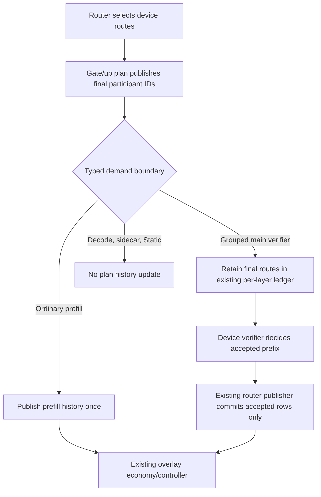

`MoEGroupedPlanDemand` replaces the complete-plan API's ambiguous retain flag:
not retaining speculative rows must not imply ordinary prefill. CUDA and ROCm
fuse the same policy into their existing small and scalable grouping launches.
The projection service markers surround only movable gate/up work, excluding
fixed down columns and native exchanges. New explicit preflight entries
`V2_Integration_MoEProjectionDemand_{CUDA,ROCm}` exercise every format, small
and scalable rows, exact demand deltas, rejected rows, real router publication,
and twenty changing-owner/request-reset/graph-retirement replays. These changes
passed on both backends: four pipeline/demand entries completed in 49.50 s,
and the forbidden-dependency source gate passed. The complete model now runs
the new physical mode with dynamic MTP on both backends.

### First complete production A/B and dispatch profile

Fresh same-policy Release A/B, five measured requests after one warmup:

| Backend | Whole-expert prefill | Projection prefill | Whole-expert decode | Projection decode |
|---|---:|---:|---:|---:|
| MI50 x2 | 1016.675 | 1039.525 | 78.344 | 76.057 |
| RTX 3090 x2 | 1220.900 | 1407.021 | 117.018 | 147.861 |

Units are tok/s. CUDA improves 15.2% in prefill and 26.4% in decode; ROCm
improves only 2.25% in prefill and regresses 2.9% in decode. Neither meets
the 1.8x single-to-dual target. Five repeats within each mode have identical
tokens and zero MTP transaction-validation failures. Cross-topology/mode
token streams differ, including the old whole-expert control; this benchmark
is not an HF numerical certificate. No completed maintenance movement was
observed in this short workload, so it is not a migration certificate either.

PMA active bytes per device are 11,731,918,084 whole / 11,729,165,572 projection
on ROCm, and 11,166,379,780 whole / 11,157,597,956 projection on CUDA. All
retirement ledgers return to zero. Three complete model/A-B/profiler driver
intervals are clean. Evidence under the ignored result root is
`rocm2-whole-refreshed`, `rocm2-projection-five`, `cuda2-whole-five`,
`cuda2-projection-five`, and `projection-{model,ab,profile}-driver.report.json`.

The ROCm retained-graph trace confirms all forty prefill intermediate
pack/allgather/consume exchanges. Their small pack/consume durations were
absent from the initial top-kernel list; this was not missing graph lowering.
The main 512-row interval is 371.93 ms versus 385.14 ms for the earlier
whole-expert trace. One participant records 143.15 ms in 161 RCCL kernels.
Collective arrival imbalance is small for dense/shared reductions; persistent
collective busy time cannot simply be attributed to a late peer.

The retained change overlaps the intermediate byte allgather with independent
shared-expert FFN compute. It extends the existing typed native fork/join
transaction, retains the same NCCL/RCCL messages and arithmetic, and allocates
no new activation banks. Eleven focused Unit/integration entries passed in
61.30 seconds, including twenty-replay CUDA/ROCm allgather overlap and existing
rooted-reduce, pipeline/demand, and alias/cycle/boundary rejection proofs. The
forbidden-dependency scan also passed. These are not a fresh full gate yet.

The five-request Release measurements after overlap are **1050.941 prefill /
79.487 decode tok/s on MI50 x2**, and **1431.491 / 155.169 on RTX 3090 x2**.
All five token streams match the preceding projection implementation exactly
on each backend, and the allocation totals above are unchanged. A complete
fresh driver interval (`gather-overlap-driver.report.json`) contains no new
records. Both the earlier decode regression on ROCm and the gap to its
whole-expert control are removed on this workload. This still does not meet
the single-to-dual scaling target or certify physical expert migration.

The new isolated trace (`profile-projection-overlap-rocm2`) confirms overlap in
all forty main-model layers: approximately 7.33 ms of shared-expert kernels
intersect intermediate-gather execution. The traced main 512-row interval is
366.20 ms, versus 371.93 ms before overlap. Profiler durations are explanatory
only; the unprofiled five-request numbers above own performance claims.

The canonical mathematical matrix now has a separately named projection-mode
declaration for each two-GPU topology, preserving all 24 placement/movement/MTP
cells and mandatory prefix checks. Final assembly exposes the existing pinned
route views and complete-row semantics without another GPU allocation. The
new checkpoint mapping and matrix-preservation regressions are explicitly in
ProductionTestPreflight. Build and mathematical certification remain pending.

The diagnostic additions now build, and the focused snapshot/matrix gates
pass. The first complete prerequisite attempt built all targets but stopped
at **674/676 Unit entries**; preflight correctly did not start. Neither
failure was model inference: an old buffer test imposed an arbitrary 128-ID
ceiling (the arena is sized by the actual enum count), and preparation fixtures
still positively admitted single-device/cross-rank projection topologies that
the implementation explicitly rejects. The repaired tests enumerate every
buffer identity and arena slot, retain nonzero owner-rank coordinates for a
rank-local domain, and explicitly reject unsupported execution topologies.
Their four focused Unit/preflight entries pass in 2.76 seconds. A fresh full
prerequisite run is in progress; the earlier failed receipt is preserved.

That second run passed all **676 Unit**, **234 host preflight**, and
**84/85 CUDA**. ROCm completed 53 of its 91 entries (**52 passed, one failed**)
before the CUDA lane's failure terminated its sibling lane; the remaining
ROCm entries were not proven. Both observed failures were the GPU preparation
fixture's remaining single-device topology assumption; the exclusive
partition did not start. The complete
driver interval is clean. The fixture now tests admitted two-/four-device
domains and verifies the exact source-shape rejection diagnostic after
successful topology admission. Its focused CUDA and ROCm entries pass in
6.78 and 37.18 seconds, respectively, with a clean driver interval. This keeps
all model-loadable quantized and FP16/BF16/FP32 preparation/publication byte
proofs, adds four-device preparation on this host, and changes no runtime
admission. The third full prerequisite run is **green: 676/676 Unit and
479/479 ProductionTestPreflight entries**, including all 234 host, 85 CUDA,
91 ROCm and 69 exclusive entries. Total elapsed time is 1149.62 seconds.
Its complete driver observation passes with no new AMD/NVIDIA warning or
error; one unrelated firmware-notifier AppArmor notice is preserved in the
report. The immutable receipt is
`projection-full-prerequisites-3/prerequisites.json`. The first real-weight
ROCm Static/Ordinal/MTP-off projection-mode cell reused that receipt and the
persistent model/reference caches, but failed during configuration normalization,
before loading weights or executing inference. The projection definition changed
the routed domain policy without updating the same domain's dense declaration.
The definition now derives the dense declaration from its selected routed domain.
The explicit matrix preflight reproduces the old error in 2.60 seconds and passes
afterward together with the complete matrix Unit entry in 1.32 seconds. It checks
all 48 CUDA/ROCm projection cases through production normalization and public CLI
parsing, including idempotence and an unchanged whole-expert control. Runtime
validation is unchanged. The fourth transaction also passed all 1155 entries
in 1146.70 seconds with a clean driver interval. Its model retry still used the
old executable: the prerequisite builder updates Unit/preflight targets, not
campaign executables. This was a build sequencing mistake, not a second math
failure. Both Qwen3.6 overlay executables have now been rebuilt, and the actual
matrix binary's complete GTest JSON confirms matching projection policies in
the CUDA/ROCm dense and routed declarations. Finish campaign builds **before**
sealing a reusable receipt. The fifth transaction passed all 676 Unit and 479
preflight entries in 1142.248 seconds; its complete driver interval was clean.
The rebuilt ROCm cell then executed the real captured model in 16.792 seconds
but failed the required prefill snapshot inventory: the new down-column phase
did not publish `MOE_ROUTE_CONTRIBUTIONS`. Decode's three comparisons averaged
0.9985 cosine, but this is not a full mathematical/prefix certificate. The fix
exposes the existing packed route-column bank at its down producer boundary,
with a typed column-partition publication instead of the whole-expert sum
interpretation. It adds no production buffer or collective. Focused tests
cover namespaces, live/padded chunk rows, participant degrees 1..8, rejection
of missing/mixed partitions, and every format on captured CUDA/ROCm pipelines.
The next build includes both model-parity executables before the next receipt.
That build is complete. All seven focused entries passed in 62.16 seconds,
including the complete snapshot/RankOrchestrator Unit binaries and captured
projection pipelines on CUDA x2, ROCm x2 and ROCm x4. Each pipeline format and
replay now proves the down producer's canonical snapshot descriptor aliases the
existing route-column tensor and that its published addends fold byte-exactly
to the corresponding captured output columns. Driver observation was complete
with zero new records. Evidence: `projection-route-publication-focused.*`.
The sixth complete prerequisite transaction passed all 676 Unit and 480
production-preflight entries (1333.054 seconds including the dependent rebuild;
1078.481 seconds for preflight). Both its driver observation and the subsequent
real-model observation are complete and clean with zero new kernel records.
The repaired ROCm Static/Ordinal/MTP-off projection HF cell is green in 18.547
seconds, validating all eight required numerical/prefix/production-path
artifacts. Final prefill logits have cosine 0.997217 and KL 0.0037; decode
averages 0.9985 cosine. Existing numerical gates were not changed. Evidence is
`projection-full-prerequisites-6/prerequisites.json` and
`projection-hf-rocm-static-off-route-fixed.*`. This is one focused cell, not a
full matrix certificate. Reusing that unchanged-build receipt, CUDA
Static/Ordinal/MTP-off passed in 19.546 seconds with eight validated artifacts.
Dynamic/Ordinal/dynamic-MTP passed on CUDA in 48.336 seconds and ROCm in 48.200
seconds, each with ten artifacts including native verifier rows and MTP
transactions. The CUDA transaction exercised captured depth 15; its acceptance
witness accepted eleven draft tokens, and its adaptive-policy witness completed
a controller window with byte-exact emitted/serial-oracle token streams.
Full and partial prefix restore passed as well. Runtime epilogues on both
backends report applied arrivals and changed layers, not only selected plans.
All three driver intervals are complete and clean; the CUDA static interval
retains two informational NVIDIA DMA-address notices, with no warning/error.
Reports use `projection-hf-{cuda-static-off,cuda-dynamic-mtp,rocm-dynamic-mtp}-route-fixed.*`.

The next performance question is native nested-fork scheduling, not another
transport substitution. In the isolated ROCm trace, the first shared Q6
projection overlaps the intermediate gather, but its independent sibling
starts only after that gather finishes. HIP's pinned source has different
classic and segment scheduling paths; native graph evidence is still required
to distinguish an implicit queue edge from resource contention. No runtime
library or graph-scheduling setting has been changed on that hypothesis.
The trace records the waiting projection and collective on the same native
queue. Prefix-cache reusable-boundary harvesting also means the nominal
512-token prompt executes 448 real rows in a 512-row bucket, then 64 real
rows in its own graph; the main interval above is the first chunk, not the
entire prompt. Preserve that production feature when attributing the rest of
the request cost rather than silently disabling prefix reuse for a faster
benchmark.

### Native HIP nested-fork evidence

`profile-projection-native-graph-rocm2/` now contains the pinned HIP runtime's
instantiation DOTs and an isolated ROCprof trace. `graph_591884_dot_print_5`
is the 512-row prefill graph for ROCm:2: 2381 nodes, with logical stream IDs
0/1/2. This graph uses HIP's **classic scheduler**, not the segment enqueue
path. The rejected segment heuristic leaves diagnostic `SegmentId` fields
on nodes even after clearing the segment schedule; those fields alone must
not be used to identify the active scheduler. The local inspector now makes
that distinction and rejects launch-time dumps whose stream IDs were rewritten.

The first intermediate allgather and both shared Q6 projections are pairwise
independent in that native DAG. Their observed execution is:

| Operation | Logical stream | Hardware queue | Start/end relative to first chunk (us) |
|---|---:|---:|---:|
| Intermediate allgather | 0 | 1 | 7278.076–7830.556 |
| Shared Q6 projection A | 1 | 5 | 7374.076–7513.436 |
| Shared Q6 projection B | 2 | 1 | 7836.476–7956.956 |

The two logical branches mapped to queue 1 cannot overlap. This narrows the
previous scheduling hypothesis to physical queue collision, rather than a
false captured dependency or the segment-level assignment algorithm. In the
pinned runtime, `FindStreamsReqPerDev` subtracts the future launch stream,
`CreateStreams` creates only that many auxiliary streams, and `UpdateStreams`
can merely reorder those handles; a handle colliding with the launch hardware
queue is appended again when there are insufficient distinct candidates. The
process's bounded HSA queue pool contains four normal queues, while this graph's
first chunk uses only two of them. A focused queue-allocation reproducer is
still required before modifying the runtime; no HIP DSO, queue-limit setting,
transport, P2P policy or release default has changed. The complete diagnostic
driver interval is clean. Profiled throughput is not a benchmark certificate.

### Separate graph compute from prefix archival cost

The follow-up host investigation found a concrete unnecessary operation.
Boundary timing on the Release process (no GPU stage timers) puts each
approximately 96 MiB terminal recurrent archive allocation/initialization at
57–59 ms. The measured request performs this for each GPU at both the 448 and
512 token checkpoints. These GDB timings are diagnostic, not canonical
throughput. Attempts to split out the native allocation with pending GDB
breakpoints did not resolve those symbols and are not allocation-cost evidence.

A separate Linux perf profile confirms the CPU clear: 139 of 151 sampled
harvest stacks had `__memset_evex_unaligned_erms` as the leaf under
`RamPrefixStorageBackend::allocateSection`; two more contained it under an
unresolved interrupted frame. Its hot instruction is `rep stosb`. The complete
profile retained 8,876 samples and reported 11 lost samples (0.124%). Startup
samples are not included in that harvest classification. The profile contains
no intrusive GPU timers; its throughput is still diagnostic. All diagnostic
driver intervals were clean. Evidence is `prefix-host-profile*.log`,
`prefix-cpu.perf.data`, `prefix-cpu.perf.stacks`, and
`prefix-memset-annotate.txt` in the ignored result root.

The implemented optimization uses a typed section-write-coverage contract in the
RAM backend. A GPU recurrent image is filled completely before its existing
readiness event can publish it, so its initial host clear is redundant. Short
attention/MTP block padding and optional terminal rows remain zero-filled;
CPU vector initialization is unchanged. This changes no kernel math, graph,
copy, memory capacity, cache policy or lifetime protocol. New explicit CUDA
and ROCm preflight tests replay a captured producer into twenty poisoned
archives, check partial-copy padding, assert the initialization-byte counters,
and check physical leases survive logical retirement. Release and the complete
Integration gate/model targets built successfully. The five focused entries
(RAM, disk, LRU, captured CUDA and captured ROCm) passed in 3.10 seconds with
a clean driver interval. The refreshed full transaction passed **676/676 Unit
and 482/482 ProductionTestPreflight entries** (235 host, 86 CUDA, 92 ROCm,
69 exclusive), in 1146.854 seconds including build/discovery. Its complete
driver interval has zero new records. The unchanged-build receipt is
`prefix-clear-full-prerequisites-7/prerequisites.json`.

All four focused real-weight HF projection cells then reused that receipt and
passed: ROCm Static/MTP-off in 17.660 seconds, CUDA Static/MTP-off in 18.580,
CUDA Dynamic/dynamic-MTP in 48.338, and ROCm Dynamic/dynamic-MTP in 47.299.
Static cells validate eight artifacts each; dynamic cells validate ten each,
including verifier/MTP evidence and full/partial prefix restore. The dynamic
epilogues prove applied expert arrivals and changed layers on both backends.
All four driver intervals are complete, with zero new records. Reports are
`prefix-clear-hf-{rocm-static-off,cuda-static-off,cuda-dynamic-mtp,rocm-dynamic-mtp}.*`.
These are focused correctness proofs, not a complete matrix or performance
certificate. No numerical threshold changed.

Five unprofiled requests plus one warmup on each saved plan produced:

| Backend/mode | Previous prefill tok/s | New prefill tok/s | New decode tok/s |
|---|---:|---:|---:|
| MI50 x1 | 938.655 | 1083.557 | 129.234 |
| MI50 x2 projection | 1050.940 | 1053.469 | 80.190 |
| RTX 3090 x1 | 1788.104 | 1901.499 | 236.424 |
| RTX 3090 x2 projection | 1431.491 | 1435.609 | 155.797 |

The archive change helps the single-device case, not the dual-device critical
path: the new matched scaling is 0.972x ROCm and 0.755x CUDA. Do not credit
the large sampled CPU-clear duration as a corresponding dual-device speedup;
host archive preparation can overlap already-enqueued GPU work. That overlap
needs timeline confirmation, not subtraction of inclusive CPU and GPU times.
All dual-device tokens match the prior projection/overlap build exactly, with
five identical repeats per backend and no MTP validation failures. No movement
completed in this short workload. The full benchmark driver interval has zero
new records. Evidence is `{rocm1,rocm2-projection,cuda1,cuda2-projection}-prefix-clear-five.*`,
`prefix-clear-focused.*`, and `prefix-clear-bench-driver.report.json`.

The same saved trace also shows that the interval between the 512-row and
64-row launches includes substantial prefix export work, not just graph
execution. In its measured request, root-side `forward_cache_hit_total`
timers total 482.545 ms (378.966 + 103.579), while benchmark prefill is
1003.447 ms. The earlier single-MI50 profile totals 454.060 ms in those
timers against 658.608 ms benchmark prefill. These runs are instrumented and
cannot replace matched unprofiled timing; the difference is time outside those
forward scopes, not a claim that every remaining millisecond is cache work.

Native timestamps show large idle gaps around logical-block exports and copies.
Source inspection confirms `RankOrchestrator::harvestPrefix` visits its TP
participants serially. Before attributing the residual scaling limit solely to
RCCL or kernels, measure this archival boundary without per-stage GPU timing.
Any optimization must preserve the reusable 448-token checkpoint and terminal
512-token checkpoint, exact prefix restore, PMA ownership, and production cache
defaults. The RAM initialization change above follows the separate host
measurement; no worker-pool or native-queue policy has changed.

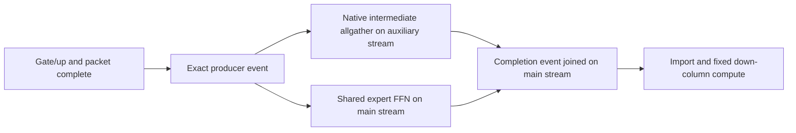

A prior full prerequisite run passed 676 Unit entries and its host/CUDA/ROCm
preflight partitions; the exclusive partition was interrupted by an orderly
host reboot. Its driver interval is invalid, so it is not a full green gate.
The interrupted packet test passed on the new boot. The complete fresh
`prefix-clear-full-prerequisites-7` receipt above now supersedes that interrupted
transaction for the retained Llaminar implementation.

### Model-free physical-queue reproducer and retained runtime repair

The source hypothesis now reproduces without model weights, collectives,
timing thresholds or spinning kernels. A tiny HIP kernel records its actual
HSA queue pointer for each independent branch. An eight-wave fork/join DAG is
instantiated once and replayed on twenty already-materialized launch streams.
With four physical queues available, the preceding runtime collapses independent
branches on 5/20 launches at width two, 10/20 at width three, and 15/20 at width
four. These are queue-identity counts, not throughput estimates.

The candidate first built in `/tmp/llaminar-clr-724.c7LUVV` adds explicit
physical-queue exclusions to graph stream allocation and retains
one extra logical candidate for the as-yet-unknown launch stream. The existing
hardware queue limit does not change. Queue selection respects exclusions even
under imbalanced reference counts and cannot exceed the physical pool to satisfy
them. The candidate passes 20/20 launches at each width and the existing
concurrent-construction/replay-lifetime preflight entries.

The matched five-request, one-warmup Release A/B then completed:

| Runtime | MI50 x1 prefill / decode | MI50 x2 projection prefill / decode |
|---|---:|---:|
| Preceding installed runtime | 1085.887 / 128.212 | 1051.712 / 80.110 |
| Queue-placement repair | 1084.637 / 129.071 | 1071.947 / 79.768 |

All values are tok/s. Dual prefill improves 1.92%, single prefill is effectively
unchanged, and dual decode differs by -0.43%. Dual/single prefill is still only
0.988x, not the >1.8x target. Every repeat is token-identical to its same-topology
control, with zero MTP validation failures. No movement completes in this short
workload. The complete A/B driver interval is clean. Canonical active allocation
remains 11,729,165,572 bytes per dual-device participant, and driver-reported
free memory before ownership retirement is identical at 21,907,636,224 bytes.
There is no measured VRAM increase; this does not quantify extra logical-stream
host storage or an unmeasured transient peak.

The production installer now applies `rocm-hip-graph-queue-placement.patch`
after the existing identity repair. Its reuse receipt authenticates both patches;
the Docker build copies both into the dependency layer. A fresh pinned-source
build installed the canonical DSO successfully, and a second installer call
confirmed idempotent reuse. The new model-free
`V2_Integration_HIPGraphQueuePlacement` is explicitly in
`ProductionTestPreflight`. It was red on the old runtime and green on the
isolated candidate. The installed runtime now passes twenty consecutive test
processes (13.88 seconds total) and all four related CUDA/ROCm overlap,
concurrent-construction and replay-lifetime entries (10.45 seconds). Their
complete driver interval is clean. The refreshed full prerequisite transaction
passes **676/676 Unit and 483/483 production-preflight entries** in 1156.45
seconds, including all 69 exclusive mixed-backend/MPI cases. Its complete
driver interval is clean. Packaging unit tests also reject old one-patch
receipts. `hip-queue-full-prerequisites-8/prerequisites.json` is the current
receipt; the earlier full gate does not certify this changed runtime/test
inventory. Four focused real-model cells subsequently pass against that
receipt: ROCm/CUDA static-off in 17.71/18.61 seconds (eight validated artifacts
each), and ROCm/CUDA dynamic-MTP in 47.59/48.87 seconds (ten artifacts each).
They retain checkpoint math, full/partial prefix restore, captured execution
and the dynamic movement obligation. Their complete driver interval is clean.
These are focused certificates for the projection mode, not the full matrix.

A separate CPU-affinity diagnostic placed the ROCm MPI process on the GPUs'
NUMA node. It measured 1054.388 / 83.998 tok/s for the preceding dual runtime
and 1082.593 / 129.176 single. The roughly 5% dual decode benefit deserves a
forward affinity fix, but its 0.25% prefill difference does not explain the
scaling gap. This explicit launcher override is diagnostic, not a production
default change. Its driver interval is clean.

The additional CUDA investigation is not a clean profiler certificate. A
privileged Nsight Systems model run produced the previously documented NVIDIA
`pSmIssueThrottleCtrl` assertions and then an illegal-memory-access/Xid 31 on
CUDA:0 during MTP decode. Its database contains GPU activity only for CUDA:1;
the root's conditional graph is not observable. This failed diagnostic cannot
attribute a root kernel or certify a prefill critical path. An initial attach
attempt also failed MPI initialization because it elevated the worker without
the launcher; the corrected attempt used a consistently privileged launcher.

Twenty subsequent **unprofiled** Release requests pass on the unchanged build,
all emitting the same 256 tokens, with zero MTP validation failures and no new
driver records: 1432.222 tok/s prefill, 155.783 tok/s decode. This narrows the
observed failure to the profiled run, but does not establish its root cause.
Compute Sanitizer subsequently stopped making progress inside its own
collection library at `cuCtxSynchronize_v2`, with both GPUs idle. It was
interrupted after collecting host stacks. Its 32 reported errors are startup
NCCL kernel-image API probes; no completed memory-safety proof was obtained.
Do not present that incomplete run as a clean sanitizer result. Its driver
interval contains only two informational records and no warning/error.
Evidence uses `cuda2-prefix-clear-{native-trace-root,repeat20,memcheck}*` and
`hip-queue-*` under the ignored result root.

The post-repair host-boundary diagnostic is complete and driver-clean. With
the same 512-token prefill but a diagnostic-only 16-token decode horizon,
the measured prefill completes in 479.49 ms. Host `prefill()` returns after
100.21 ms: its two rank-forward submissions take 20.53/15.60 ms and its two
prefix-harvest calls take 45.39/15.07 ms. These nested wall times include GDB
all-stop overhead and must not be added to GPU durations. The benchmark then
waits on the already-published terminal inference event. Thus the serial host
harvest loop is not, by itself, evidence of a 60 ms critical-path saving;
most completion time remains after the host has submitted the request. Native
HIP API/kernel/copy tracing is the next discriminator. No harvest concurrency
change or cache-policy reduction has been made. Evidence:
`hip-queue-host-boundaries{,-benchmark,-driver.report}.*`.

### Native critical-path attribution and shared-sum overlap experiment

The corrected native trace excludes both `stage_gpu` filters and GPU-stage
timing switches. Setting the switch to zero alone did not disable the filter's
independent opt-in. The earlier copy traces therefore included diagnostic
event waits and cannot certify host submission latency. The corrected exports
contain no GPU-stage timing rows; both complete driver intervals are clean.

For the main padded-512 graph (448 real rows), per-participant kernel totals are:

| Work | MI50 x1, ms | MI50 x2, ms per participant |
|---|---:|---:|
| Dense Q6 projections | 170.658 | 85.732 |
| Routed gate/up | 91.526 | 48.957 |
| Routed down | 38.554 | 20.702 |
| GDN | 26.533 | 23.416 |
| Full attention | 17.646 | 9.236 |
| Native RCCL | 0 | 146.594 |
| Graph interval | 353.405 | 362.158 |

These overlapping kernel totals are not additive wall time. Dense projections
already scale almost 2x; collective time consumes most of the compute saving.
The main 64-row tail is 89.916/92.477 ms, with 22.526 ms of dual-device RCCL.
The two-GPU trace contains 161 native collectives: one embedding and four per
layer. The repaired intermediate gather genuinely overlaps the shared FFN.
Native profiler copy instrumentation still enlarges archive gaps, so its
577.07/495.91 ms dual/single prefill completion is not canonical throughput.
Unprofiled results above remain the performance authority.

The next experiment moves only the shared-expert sum's event edges:

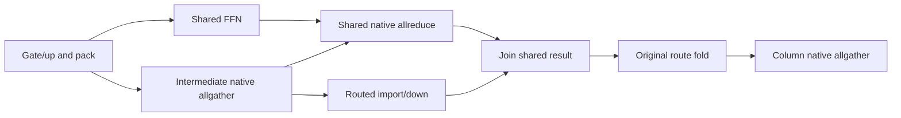

The communicator order is identical on every participant: intermediate gather,
shared sum, then column gather. Independent down math overlaps the sum. The
existing TPAllreduceStage/LocalTPContext retain precision, casts and scratch;
only the paired join publishes the tensor. Sideband-bearing transactions and
decode arithmetic are deliberately outside this prefill window. No transport,
weight format or buffer size changes. This experiment is not yet benchmarked
or certified; its graph-contract and captured CUDA/ROCm FP32/FP16 regressions
must pass before the next Release comparison. The focused eight-entry gate now
passes in 17.82 seconds with a complete, clean driver interval. This includes
the device-free invalid-window/liveness contract and twenty captured replays
per CUDA/ROCm native FP32 and FP16 sum, compared bytewise with the ordinary
allreduce using values sensitive to FP16 rounding. The refreshed full gate now
passes all 1,161 entries: 676 Unit and 485 production-preflight tests, in
1,554.803 seconds including the prerequisite build. Both GPU lanes and all 69
exclusive mixed-backend/MPI cases pass, and the complete driver interval is
clean. The receipt is `shared-sum-full-prerequisites-9/prerequisites.json`.
Both new allreduce entries then pass twenty fresh processes each (122.28 s);
each process itself checks twenty changed-input captured replays per transport
precision against the ordinary sum. All four focused HF cells pass with their
complete CSV contracts: ROCm Static/off 17.710 s, CUDA Static/off 18.712 s,
ROCm Dynamic/dynamic-MTP 48.089 s, and CUDA Dynamic/dynamic-MTP 48.399 s.
The movement and fresh/full/partial prefix proofs remain active. Both diagnostic
driver intervals are clean. Native trace evidence lives in
`hip-queue-native-only-rocm{1,2-projection}` under the ignored result root.

The subsequent unprofiled Release A/B is complete, with five measured requests
after one warmup for every row. All use the saved same-policy plans, exact
512-token prompt, 256-token generation, real GGUF, production FP32 activations,
default wire/KV policy and learned dynamic MTP. Ordinary MPI bootstrap remains
enabled. PerfStats is disabled with an empty record set in every timing report.

| Backend / ownership | Prefill, tok/s | Decode, tok/s |
|---|---:|---:|
| MI50 x1 | 1085.839 | 129.194 |
| MI50 x2, whole experts | 1020.641 | 79.167 |
| MI50 x2, projection control before shared overlap | 1072.725 | 79.338 |
| MI50 x2, projection plus shared overlap | 1153.988 | 79.831 |
| RTX 3090 x1 | 1905.351 | 236.388 |
| RTX 3090 x2, whole experts | 1216.302 | 117.214 |
| RTX 3090 x2, projection control before shared overlap | 1429.383 | 155.623 |
| RTX 3090 x2, projection plus shared overlap | 1506.175 | 155.638 |

This isolated overlap change improves prefill by **7.575% ROCm / 5.372% CUDA**.
Request latency falls 477.289 -> 443.679 ms on ROCm and 358.197 -> 339.934 ms
on CUDA, well outside each five-request range. The same-topology old/new
projection streams are identical for all 256 tokens, and every run repeats its
own stream exactly with zero MTP transaction-validation failures. As in the
earlier benchmark, ROCm whole-expert and projection streams differ; their
prefill comparison has an identical input, but their decode rates do not
represent a token-identical cross-mode workload. CUDA's two ownership modes
do emit the same stream. These timings are not an independent accuracy oracle;
the focused HF cells and grouped byte tests above supply that evidence.

PMA allocation count and bytes are unchanged by the overlap: 316 allocations,
11,729,165,572 bytes per ROCm device and 11,157,597,956 per CUDA device. ROCm
driver free memory is identical at 21,907,636,224 bytes; CUDA has no increase
in observed driver consumption (the candidate reports 18 MiB more free).
All eight runs retire their ledgers to zero. The complete benchmark driver
interval is clean. Evidence is `shared-sum-ab-*.{json,log}` and
`shared-sum-ab-driver.report.json` under the ignored result root.

The new mode beats whole-expert prefill by 13.065% ROCm / 23.832% CUDA, but
single-to-dual prefill scaling remains only **1.063x ROCm / 0.790x CUDA**.
The 1.8x goal is explicitly not achieved.

Matched kernel-only native traces of the preserved control and candidate now
confirm the mechanism. Both have forty intermediate pack operations, 161 RCCL
dispatches and 2,363 total dispatches in the final main padded-512 interval.
On ROCm:2, collective/routed-tiled-down overlap changes from **0 to 24.548 ms**;
ROCm:3 independently observes 24.347 ms. The tiled down kernels themselves
take 24.548 ms versus 22.647 ms before, so this is latency hiding, not faster
down arithmetic. Same-agent collective intervals not intersecting any compute
drop from **130.962 to 89.790 ms**. These interval unions avoid adding parallel
durations. Post-embedding-rendezvous main-layer time is 355.510 -> 326.096 ms.
The early follower's initial rendezvous includes 29.674 ms of profiler-run
arrival skew; do not mistake that for layer compute or add it again. Neither
trace inserts optional GPU-stage timing events, and both driver intervals are
clean. Canonical throughput remains the unprofiled five-request table above.
Evidence: `shared-sum-native-rocm2{,-control}` and their driver reports. The
small ignored `inspect_shared_sum_overlap.py` checks exact agent, embedding,
layer and collective counts before calculating intersections.

The native communication critical path remains the next structural constraint;
the measured win does not justify claiming a near-2x result or switching the
default from whole-expert ownership. No transport, P2P setting, precision,
weight format or physical-memory budget was changed.

### Captured native-message economics and the next ownership boundary

The isolated Release RCCL probe now retains forty out-of-place operations per
participant graph, warms eight times and records forty device-event samples.
Every output coordinate on both participants is checked against finite,
rank/coordinate-coded immutable input. This avoids the old in-place repeated
sum eventually overflowing and making a timing-only test meaningless.
`Perf__RCCLAllreduceLatency.CapturedProjectionPrefillMessages` is a performance
diagnostic, deliberately not a production-preflight member.

The default native transport is SHM/direct/direct on both vendors on this host.
The corresponding CUDA probe uses the canonical capture-reentry NCCL SONAME,
not the distribution library. Results below are medians per native operation,
not end-to-end model timing:

| Message at two participants | Send / receive bytes | RCCL, us | NCCL, us |
|---|---:|---:|---:|
| FP32 sum, 64 x 2048 | 524288 / 524288 | 158.616 | 195.136 |
| FP32 sum, 512 x 2048 | 4194304 / 4194304 | 1093.124 | 1353.715 |
| Existing Q8 intermediate gather | 2359296 / 4718592 | 744.504 | 878.886 |
| Finished-column gather | 2097152 / 4194304 | 662.048 | 785.126 |
| FP32 reduce-scatter, 64 x 2048 | 524288 / 262144 | 104.564 | 112.397 |
| FP32 reduce-scatter, 512 x 2048 | 4194304 / 2097152 | 660.892 | 774.541 |

All six output checks and final retirement pass on both vendors. Driver
observation passes. The intermediate packet is already compact: eight routes
per row, each containing 512 existing Q8 bytes and sixteen FP32 scales. It is
not an accidentally transported FP32 activation buffer. The model's current
native shared reduction is FP32: the default allreduce conversion threshold
is applied to the logical 2048-element row, not the padded 512-row message.
These measurements do not change that policy.

Sweeping RCCL from its default four channels to eight/sixteen/thirty-two only
reduces the 4 MiB sum from 1092.259 us to 1033.988/1026.000/1139.272 us.
The small gain reverses at thirty-two channels; no production channel override
was installed. The hot gfx906 wrapper reports 254 VGPRs, 106 SGPRs, 19,808 LDS
bytes and a 560-byte private segment. Its 44 scalar spill annotations match
register-lane moves; the wrapper has no buffer/scratch load/store instruction.
This does not classify every callee's private storage or establish a whole-
library zero-spill proof.

The first standalone CUDA probe omitted production's per-communicator Socket
network constraint. GDB isolated its host crash to `ncclNetPluginInit` during
IB initialization, before capture. Matching `NCCLCoordinator`'s existing
`ncclCommInitRankConfig` contract resolves that probe mismatch while retaining
native P2P/SHM selection. There was no production change and no CUDA driver
failure. The failed probe and its GDB trace are retained as diagnostic evidence,
not counted as successful measurements.

The next candidate is **not implemented yet**: retain current shared weight
shards, reduce each shared partial directly to its output-column owner, apply
the gate/add on that owner's columns, then reuse the existing final gather.

```mermaid
flowchart LR
    G[Gate/up and packet] --> A[Intermediate native allgather]
    G --> S[Shared FFN partial]
    S --> P[Pack columns into existing gather scratch]
    A --> R[Native shared reduce-scatter]
    P --> R
    A --> D[Routed import/down]
    D --> F[Original route fold]
    R --> C[Gate shared shard and add routed shard]
    F --> C
    C --> O[Existing final native column allgather]
    O --> M[Assemble combined model row]
```

The shared reduce-scatter must retain the same checked auxiliary-stream
fork/join, collective order, arithmetic precision and graph-owned publication.
Packing can reuse the existing column-gather receive bank before that gather;
receiving can reuse the existing shared-output bank. This is a proposed
no-extra-VRAM lifetime, not an admission proof. Diagnostics must explicitly
distinguish routed-only and combined output columns. The production API must
be exact-stream on both vendors, not the legacy streamless reduce-scatter.

For ROCm, the raw saving is roughly 0.43 ms per main-graph layer, or 17 ms
before packing/gating overhead and overlap effects. Moving shared intermediates
into the first gather would instead sacrifice the already working shared-FFN
overlap, so it is not justified by these measurements. Neither proposal is a
claimed model win or sufficient by itself to close the 1.8x target.

Evidence under the ignored result root: `rccl-prefill-probe-2/`,
`rccl-prefill-scatter-probe/`, `nccl-prefill-probe-socket.log`, their complete
driver reports, and `nccl-prefill-probe-gdb.log`. The CUDA script is an isolated
measurement harness, not a substitute for the production graph regressions.

## Lossless projection-boundary experiment (historical kernel evidence)

The retained recurrence change below is green, but whole-model scaling remains
1.082x. The next experiment attacks the measured route payload rather than
replacing native RCCL or changing arithmetic precision. A full routed down row
contains 2048 FP32 values (8192 bytes). The existing input to that projection
contains 512 INT8 values plus sixteen FP32 scales (576 bytes). Exchanging those
already-quantized bytes introduces no additional quantization.

The proposed single-domain ownership is asymmetric by projection: gate/up
expert pairs have one owner, while every participant holds its disjoint output
columns of every down projection. Both projections retain the complete source
matrix's serial-M1 arithmetic policy. In particular, a smaller physical down-N
must not select a different K partition or reduction tree.

```mermaid
flowchart LR
    R[Device-owned routes and ownership] --> G[Owner-local gate/up and existing SwiGLU quantizer]
    G --> P[Bitwise pack by original router slot]
    P --> A[Native RCCL byte allgather]
    A --> U[Bitwise consume into complete expert grouping]
    U --> D[Independent route dots for local down columns: original K arithmetic]
    D --> F[Original ordered top-k fold for local columns]
    F --> C[Native allgather of finished columns]
    C --> O[Lossless row-major assembly]
```

`MoEPrefillProjectionExecution` makes complete, gate/up-only and down-column
transactions explicit. The ROCm launch bridge uses the same installed kernels
for each phase; the existing production caller still selects `complete`.
Captured phase/slice regression covers all 21 quantized expert formats, column
degrees 1/2/4/8, M=1/2/3/15/16/17/33/65, changing inputs, full/short/empty live
sets, and model-width sentinels. Every output, intermediate byte and FP32 scale
must match the complete pipeline. This phase boundary passed twenty independent
process runs (154.56 s), then 674/674 Unit (74.36 s) and 440/440 production
preflight (1162.20 s). The driver interval was clean. That gate predates the
subsequent packet kernels; it is not presented as their fresh certificate.

The shared CUDA/HIP packet implementation copies existing representation bits,
including FP32 activations for floating-weight experts. Its capture geometry
contains no mutable host epoch. Native collective ordering owns packet lifetime;
producer and consumer may have different device-side expert groupings. Every
producer overwrites all packet words, including zeros for unowned/inactive
routes. A consumer reads only the sole owner's packet, without reduction. The
focused preflight entries replay changing ownership, independent grouping
permutations and full/short/empty inputs twenty times per geometry. They cover
1/2/3/8 logical peers, quant-block tails, odd floating widths, stale destinations,
NaN payloads/signed zeros and guard words. Both backends pass; Unit rejects
unknown encodings, incomplete bindings, default streams at the launch boundary,
and overflowing receive geometry. The all-format phase regression remains green.

The new `v2_perf_rocm_moe_projection_exchange` probe measures the **entire**
captured transaction against the existing mapped-route publication/root fold
and native broadcast. It interleaves paired candidates over the same prepared
IQ3_S experts and routes (D=2048, I=512, E=256, top-k=8), outside setup and
readback. Each output must equal a complete production expert-pipeline oracle;
partial/empty replay precedes timing. This is synthetic, real-format kernel
evidence, not a real-model benchmark or a new serving-mode certificate.

Corrected-fixture paired medians on physical ROCm:2/:3 initially showed
5691.836 us control versus 4018.078 us candidate at 448 rows (1.4166x),
and 6234.876 versus 4354.397 us at 512 rows (1.4319x). However, the
one-row transaction regressed from 238.720 to 323.360 us. Those results use
the explicit participant device ordinal, after removing an accidental constant
zero in the fixture's launch arguments; older probe numbers are superseded.

The one-row trace exposed a compute issue, not merely collective latency.
The candidate fused all eight independent expert dots into each output-column
lane's ordered top-k loop. Its half-width down grid had only sixteen one-wave
workgroups. That kernel took about 126.6 us; the control's parallel route-dot
kernel took about 23.5 us. Only the final top-k **addition** requires the serial
order. Capturing independent route dots followed by the existing exact fold
removes the unnecessary compute serialization. The candidate and control reuse
one persistent route bank because their diagnostic graphs never overlap; this
experiment adds no new kernel or arithmetic implementation.

The uniform-IQ3_S transaction then measured 221.279 us versus 238.719 us at
one row (1.0788x), a tie at sixteen rows, and 4091.668 versus 5688.782 us at
448 rows (1.3903x). The real model's filename is not every tensor's format:
its dominant routed execution pair is IQ2_S gate/up with IQ4_NL down. The
shared fixture now accepts independently declared projection formats, and its
arithmetic masks use the canonical source-to-device mapping, including Q8_1
and Q8_K aliases. Passing raw source IDs to that execution-policy boundary was
a fixture error caught by the all-format regression and corrected there.

Fresh paired measurements of the model-shaped mixed pair are:

| Rows | Complete-expert control, us | Projection exchange, us | Speedup |
| --- | ---: | ---: | ---: |
| 1 | 143.840 | 132.480 | 1.0857x |
| 16 | 421.599 | 404.639 | 1.0419x |
| 448 | 5615.667 | 4085.430 | 1.3746x |
| 512 | 5655.827 | 4062.230 | 1.3923x |

Every measured replay is byte-exact. These are still synthetic prepared-weight
transactions, not installed ownership or whole-model throughput. The 448-row
candidate p10/p90 is 3743.352/4126.070 us; retain the median instead of selecting
its fastest sample. The performance variants are individually registered under
`V2_Perf_ROCmMoEProjectionExchange_*`, never as preflight timing requirements.
The earlier transport-only probe (1256.160 us at 448 rows) excludes kernels and
assembly and must not be substituted for this complete transaction measurement.

Integration still requires a real projection-residency contract in the sole
ExpertOverlay authority. A movable gate/up pair is not a complete expert, and a
down-column shard must never masquerade as one in slot directories, epoch
publication or migration. For balanced placement the weight element count can
remain `2*E*I*D/P + E*I*D/P = 3*E*I*D/P`; actual packed planes, alignment,
transfer slots and arenas must be admitted through PhysicalMemoryAuthority's
typed BOM, not inferred from that ideal formula. The diagnostic holds redundant
weights for its oracle and cannot prove production VRAM. No planner capability,
CLI mode, production graph, movement rule or decode policy has been changed to
advertise the proposal. Multi-tier applicability and grouped/decode economics
remain explicit integration questions. P2P stays disabled.

The next production boundary must be a single domain-owned projection contract,
not a second expert placement controller:

1. `MoEExpertOverlayPreparationPlan` must request complete gate/up only at the
   device-authoritative owner and exact output-column down slices at each domain
   participant. Prepared identity retains the original full N/K, source format,
   column range and device. A physical down slice cannot select a new reduction
   tree merely because its N is smaller.
2. `MoERoutedExpertPlacementPlan`, its runtime plan and the PMA BOM must consume
   that same projection contract. The current expert-count fraction cannot price
   all three roles uniformly. Neither a fixture allocation nor a sum of logical
   elements proves unchanged physical VRAM.
3. Runtime descriptor banks must distinguish a gate/up owner from a complete
   expert resident. A gate/up migration publishes its destination only after
   preparation and transfer completion; immutable down slices remain local.
   `DeviceMoETransferSlotDirectory` currently requires a complete gate/up/down
   bundle and cannot be reused by silently omitting down payloads.
4. Device movement economics must price the movable gate/up work and bytes,
   rather than crediting movement with the uniformly distributed down work.
   Existing epoch/RCU publication remains the only authority. No host shadow,
   per-token weight exchange, phase-specific weight copy or extra full down
   replica is admitted by this design.
5. Reusable participant-local graph machinery must declare both native
   collectives and their exact streams. The model graph selects that typed
   policy; it must not grow another imperative cross-device coordinator.

This is a proposed homogeneous-domain specialization, not permission to force
CPU or heterogeneous tiers to retain all down projections. That applicability
needs its own capacity, transfer and economy design before admission.

The shared packet kernels compile with zero memory spills on gfx906 and every
shipped CUDA target (sm80/86/89/90). gfx906 pack/consume use 13/21 VGPRs,
44 SGPRs and zero private/LDS bytes; hardware rounds the VGPR allocation to
16/24. Initial focused packet tests passed twenty independent process runs each,
and Unit passed 675/675 in 75.21 seconds. The real two-GPU regression now also
exercises independent route publication at M=1/16/65 with uniform and mixed
formats, twenty changing-owner replays per geometry. The all-format projection
test and updated two-GPU test passed together in 15.15 seconds before that final
small-row expansion. The expanded two-GPU transaction then passed all twenty
independent process runs in 263.67 seconds. The retained build's complete Unit
gate passed 675/675 in 76.61 seconds. Its complete 443-test production preflight
passed in 1184.84 seconds. The complete stress/preflight driver interval had
zero new records and zero GPU findings. These are the retained packet/transaction
binaries, before the subsequent ownership/accounting work below.

### Projection ownership and physical sizing boundary

`MoEExpertProjectionOwnership` now expresses complete-expert placement versus
owner-local gate/up plus fixed down-output slices as an immutable source/domain
value. It does not retain an owner map, route, epoch, memory grant or mutable
controller. The existing authority supplies expert owners and their cardinality.
The contract rejects nonintegral equal-output partitions and malformed source
geometry, retains complete N/K for arithmetic identity, and distinguishes movable
owner-resident projections from fixed participant slices.

`WeightShardGeometryResolver` and the ordinary `WeightMemoryEstimator` can consume
that same contract. A participant with zero gate/up owners still retains and is
charged for its fixed down slices. Whole-expert selections retain their previous
geometry. This adds typed BOM inputs, not another capacity ledger. The captured
phase and two-GPU exchange fixtures also use the contract for actual native down
plane slicing and output assembly, replacing their separate division arithmetic.

Focused CPU-only coverage sweeps every listed quantized/floating format on both
GPU accounting paths, owner counts including zero, exact balanced weight bytes,
degree 1 through 8 ownership geometry, and malformed source/role/inventory cases.
It is explicitly registered as `V2_Integration_MoEProjectionOwnershipAccounting`
in production preflight. The complete weight-estimator Unit test, that new
preflight entry, all-format captured projection boundary and real two-GPU
transaction passed together (4/4, 21.47 s). Their independent driver interval
had no new records or findings. After rebuilding the complete Unit executable
inventory, all 675 Unit entries passed in 75.76 s. Evidence is retained under
`projection-ownership-*` in the local result root. The complete 443-test preflight
above predates these changes and is not their fresh certificate. The configured
preflight inventory is now 444 entries; only its three directly affected focused
entries were rerun for this metadata/slicing integration increment.

### Production source preparation and prepared identity

The preparation boundary now consumes the projection contract. The production
`MoEExpertOverlayPreparationPlan` requests owner-local gate/up and every
participant's exact down-output slice. `WeightManager` materializes those
requests through its existing asynchronous loader and prepared slabs. Each
role has its own expert inventory; missing requested experts fail before
publication rather than silently certifying the subset whose source parents
happen to be present.

`MoEExpertSourceView` resolves compact expert IDs and GGUF `[K,N,E]` axes into
the exact source matrix. A physically presliced down parent must carry its
original full geometry and authenticated output interval; matching a peer
slice's dimensions is insufficient. The registry retains the complete
projection identity and rejects whole-expert lookups, replacements or
retirements against projected entries. Source retirement uses that same
identity. Already prepared handles satisfy setup replay without requiring
released source storage to become live again.

Real-device preparation now passes on both CUDA and ROCm, with degree-one and
degree-two layouts, random expert ordering and reversed physical device order.
The coverage includes all twenty quantized formats accepted as GGUF expert
parents plus FP16, BF16 and FP32. Q8_1 is a valid prepared/activation operand,
not a three-dimensional GGUF expert parent; its rejection is explicit, while
the earlier kernel boundary still covers its execution format. The tests
compare every packed payload/scale/minimum plane or floating byte against an
independently prepared complete source matrix. They also verify released
source reuse and complete allocation retirement.

Candidate weight admission uses `ExpertPreparedMemoryGeometry`, the concrete
reusable expert representation used by the loader, not the ordinary
source-native weight estimate. Its PMA ledger must equal the planned bytes
exactly. Balanced projection placement has the same prepared weight bytes as
balanced whole-expert placement in these shapes; this does not yet prove equal
total VRAM because transfer slots and graph arenas remain to be integrated.
The test's separate oracle allocations are excluded from that candidate claim.

The first real-device attempt exposed two test-harness mistakes: comparing a
CPU ledger row with the GPU weight budget, and giving a tensor view a parent
without shared ownership. After correcting both, the retained CUDA and ROCm
entries passed in 3.37 s and 7.49 s (11.03 s combined). Four source/registry
checks had already passed in 1.36 s. The new entries are explicitly in
`ProductionTestPreflight`; the complete retained Unit gate passed 675/675 in
75.40 s, then the full preflight passed 448/448 in 1192.24 s. A registration
audit found that the existing all-format source-retirement/completeness
regression was Unit-only. It is now explicitly registered as
`V2_Integration_PreparedOverlaySourceRetirement` and passed separately in
0.79 s after the registration-only CMake regeneration (`ninja: no work to do`).
The complete configured preflight inventory is therefore 449 covered entries:
448 in the full run plus this additive entry, with unchanged engine binaries.
The driver interval covering preparation and both gates completed with zero
new kernel records and zero GPU findings. Evidence is under
`projection-materialization-*`, `projection-gpu-preparation-*`,
`projection-retirement-*` and `projection-preparation-driver-*` in the ignored
result root.

This is a setup/materialization certificate, not production graph admission.
The frozen domain/runtime plan must still carry the same immutable contract
into separate fixed-down and movable-gate/up descriptor publication, the
complete-bundle transfer directory, device movement pricing and graph lowering.
`MemoryPlanner` also has owner-count-based compact-layer/workspace selection:
zero gate/up owners does not mean zero down work under the new layout. No
auto/CLI capability has been enabled, and the latest whole-model throughput
remains the recurrence section's 1.082x result.

### Movable-projection runtime ABI and captured transfer preparation

The next retained slice makes projection ownership explicit in the existing
runtime/transfer ABI. `DeviceMoEProjectionSet` distinguishes complete experts
from movable gate/up pairs. `weightsReady()` still certifies a complete FFN;
`movableWeightsReady()` authenticates the declared payload and rejects fixed
down pointers in a gate/up bank. Unknown tags and mismatched source/destination
contracts fail validation. There is no inference from a missing down pointer.

Two compact format tags leave room for the projection tag without enlarging
the 240-byte expert descriptor. Host, CUDA, HIP MoE, HIP GEMV and the shared
overlay controller assert the exact field offsets. The rebalance ABI is v16;
this changes descriptor metadata, not tensor formats or activation precision.

The prepared-engine exporter validates an entire family before publication,
preserving placement metadata and leaving the previous descriptor unchanged
on rejection. Transfer-directory profiles consume the same projection set
for their allocator-owned BOM, materialization and wire capacity. Gate/up-only
directories allocate no down storage. Pack/unpack and arrival validation on
both GPUs preserve that contract and the existing lease/epoch lifecycle.
This is not yet a production graph selection: the complete frozen-domain,
fixed-down-bank, graph collective and economics wiring below remains required.

The new device-free movement-contract preflight entry passed. Captured device
regressions cover both compact and collective packing across the canonical
quantized-format inventory and FP16/BF16/FP32. Their source descriptors are
exported from device placement banks inside capture, not injected as prebuilt
transfer packets. They assert exact copied-byte counts, absent down storage
and unchanged publications after stale-lease replay. Both CUDA and ROCm passed
**20/20 fresh-process repetitions**, forty runs in **136.47 seconds**.

The retained build passed **675/675 Unit in 75.52 seconds** and **450/450
ProductionTestPreflight in 860.40 seconds**. All 224 host, 83 CUDA, 87 ROCm
and 56 exclusive entries passed; the canonical prerequisite receipt covers
1,125 entries in 936.77 seconds including its incremental build check. The
first Unit attempt found one stale expectation for ABI v15; updating that
test to the intentionally changed v16 contract restored the focused 71-test
executable and the complete gate. No production behavior was changed to silence
that assertion. The complete driver interval passed with one new kernel-log
record and zero GPU findings.

Final gfx906 code-object evidence shows compact/collective payload packing at
68 VGPRs / 55 SGPRs and unpacking at 15 VGPRs / 72 SGPRs; both use zero private
bytes and zero memory spills. Descriptor-export and arrival control kernels
retain their compiler-proven intentional private storage and register-only
scalar moves; this is not a claim that every controller kernel has zero scratch.
The build passed spill guards for local gfx906 and CUDA sm80/86/89/90. Other
shipped ROCm architectures have not been recompiled by this local slice.
Evidence uses `projection-movement-*` under the local result root, especially
`projection-movement-retained-prerequisites/prerequisites.json` and
`projection-movement-driver-report.json`. These model-free gates are not a
real-model throughput or release certificate.

### Source-loading integration: one role-specific preparation compiler

`MoEExpertOverlayPreparationPlan::sourceWeightPlan` now emits the source
requirements consumed by both the dense continuation factory and the remote
participant runner. The separate `buildMoEOverlayParticipantWeightPlan`
whole-expert compiler and its independent residency-category calculation were
removed. Each layer/role/domain/rank/participant selection comes from the same
immutable requests used for packing. Empty complete-expert ownership loads no
payload, while an empty gate/up owner still loads its required down sources.
Passive preparation diagnostics do not authorize source loading.

The projection builder now authenticates all three GGUF parents separately
for every routed layer. The former caller-supplied uniform geometry argument
is removed from both preparation and WeightManager. Main and sidecar layers
may have different intermediate widths; missing, transposed, unbounded or
incompatible shapes fail before materialization. Expert-axis source loading
still returns full host N/K, and that fact is stated honestly in each source
slice. `MoEExpertSourceView` selects the fixed down interval before GPU packing;
no full GPU down replica is allocated.

The all-format CUDA/ROCm regression now writes valid native bytes into a tiny
GGUF and uses the real ModelLoader and WeightManager materialization path.
It no longer injects manually assembled frozen bindings. Eight experts give
random placement non-contiguous source selections. The first run preserved
every packed-byte comparison but exposed a test-only retirement assumption:
contiguous quantized selections can borrow the GGUF mapping, whereas the old
fixture always owned copied buffers. The retained check distinguishes those
borrowed mappings from owned selections and still requires owned copies to
retire. The completed four-entry focused run passed in **30.62 seconds**,
including **7.14 seconds CUDA** and **21.82 seconds ROCm**. The metadata tests
cover ordinal/random ownership, degrees 1/2/3/4/8, reordered MPI ranks,
zero-gate/up ownership, CPU host lifetime, differing per-layer widths and stale
source geometry. Both the device-free suite and the real-loader GPU cases are
explicitly registered in `ProductionTestPreflight`.

Fresh complete validation passed **675/675 Unit in 75.36 seconds** and
**450/450 ProductionTestPreflight in 876.66 seconds**: 224 host, 83 CUDA,
87 ROCm and 56 exclusive entries. The canonical receipt covers all 1,125
entries in **1,278.41 seconds**, including the 758-step affected-target rebuild.
No skipped/failed entries were present in the retained JUnit evidence.
The complete driver interval passed with **zero new kernel-log records** and
zero findings. Evidence is `projection-source-authenticated-focused.log`,
`projection-source-prerequisites/prerequisites.json`, its per-lane JUnit files,
and `projection-source-driver-report.json` under the ignored result root.
The first failed fixture assertion is retained in `projection-source-focused.log`.

No production distribution policy or CLI default changed, and no new GPU
kernel was added in this slice. This is not a whole-model throughput or image
certificate. The latest production result remains **1.082x**; the >1.8x goal
still requires the runtime-bank, movement-economy and captured-graph work below.

### Prepared payload and fixed projection runtime binding (2026-09-28)

The public mutable triplet has been replaced by
`MoEOverlayPreparedExpertPayload`, whose factories construct only an empty
nonresident, a complete gate/up/down payload, or a complete gate/up pair.
Incomplete arrivals remain private to the existing transfer builder. Moving
the value clears the source, and publication rejects an engine from another
family. The participant RCU and device physical-slot ledger retain the same
begin/stage/publish/retire protocol; neither acquires another placement owner.

`MoEOverlayFixedDownProjectionBank` retains every expert's exact full-K down
slice independently of movable residency. It has no epoch or transfer API.
`DeviceMoERuntimeTable` can accept gate/up placement only when construction
supplies a complete, authenticated fixed-down bank for every layer. Request
reset cannot rebind it; portable prefix restore resolves only the declared
movable family. Pointer-bearing snapshot restore also validates the complete
family/partition before changing any layer. Ordinary full-FFN readiness still
requires all three projections.

Registry construction now derives the family from the source-authenticated
preparation requests, including participants with no gate/up owners. A missing
layer, wrong source geometry, or complete-expert plan presented as projected
preparation fails before initial publication. This wiring is not a production
selection: the model still chooses complete experts until the graph, capacity
and economy work below is finished together.

The first focused binding run passed **8/8 in 2.22 seconds**. The real-loader
CUDA/ROCm preparation pair passed **2/2 in 28.56 seconds**, comparing all twenty
GGUF expert quants and FP16/BF16/FP32 bytes while binding the fixed and movable
lifetimes. After the registry/preparation link, the expanded focused set passed
**12/12 in 31.00 seconds**, including both real-device entries. Final guards
reject inconsistent active-bank epochs and fixed-down pointers hidden in
nonresident movable descriptors; their three focused entries passed in
**1.13 seconds**. The refreshed complete Unit gate passed **675/675 in
75.30 seconds**. The full production-preflight transaction passed all 226 host
entries, then failed one CUDA graph-memory certificate; 82 other CUDA entries
passed. The sibling ROCm lane had completed 51 entries before cancellation,
and the exclusive lane had not started. This is not a full green receipt.
The previous complete preflight receipt is stale for this implementation.
No new whole-model result is claimed.

The failure has been reproduced and localized to test scheduling, not the new
projection binding or graph storage. CUDA's 128-helper family measured
294,387,712 bytes against its 256 MiB contract in the aggregate gate. Twenty
isolated runs each measured exactly 81,788,928 bytes cold and zero warm.
Twenty runs overlapping ROCm native-local-TP measurements also retained those
values. Overlapping the actual ROCm streaming-bandwidth/host-device discovery
tests reproduced the excess (296,026,112 bytes, on CUDA repeat 18).
Their GTest environment calls production full-cluster discovery, which queries
CUDA free memory and creates CUDA contexts despite the ROCm-only kernel filter.
Those allocations contaminated the device-wide graph-growth observation.

The test executable now declares `FullInventory` startup ownership in CMake.
Every registration of it inherits `FullDeviceInventory`; the preflight lane
planner schedules that scope exclusively regardless of the selected kernel
backend. Ordinary backend-disjoint tests remain parallel. No inference code,
memory allowance, tolerance or profiling policy changes. Three device-free
regressions exercise the real CMake registration and scheduler, including
invalid scope and Unit rejection, and join an explicit
`ProductionTestPreflight` entry. The complete 91-test campaign-driver unit
script passes. The fresh full transaction passed **675/675 Unit in 74.75 s**
and **453/453 preflight in 882.43 s**, **958.06 s** including build/discovery.
All 223 host, 81 CUDA, 85 ROCm and 64 exclusive entries passed with zero
skips. The new isolation regression and complete CUDA replay entry each passed
**20/20** independent process runs first. The final driver interval passed with
one informational NVIDIA DMA-address notice and zero findings. Both diagnostic
driver intervals have no GPU-driver findings (the second retains an unrelated
kernel delayed-fput workqueue warning rather than hiding it).

Evidence: `projection-binding-prerequisites/`, `cached-replay-repro-20.log`,
`cached-replay-parallel-*`, `cached-replay-vs-discovery-*`, and
`inventory-isolation-*` under the ignored result root. The exploratory ROCm
pipeline repetition was intentionally stopped after the overlapping CUDA
repetitions completed; it is not counted as a finished 20-run certificate.

The subsequent startup-scope audit also identified the captured-transfer
channel's production `clusterInventory()` call. Its same-vendor filters do
not make that discovery backend-local. That executable and the two pipeline
domain executables now declare the same full-inventory contract. This is a
scheduling correction only, not a change to their tested transports. The
453-entry receipt above predates these registration-only extensions.

### Fixed down descriptor export

The immutable bank now exports one typed native-or-floating table for the
existing backend descriptor interfaces. Registry tags prove requested identity;
export separately verifies the actual engine's local N, full K and native
block stride. Native provenance must be present, compatible with execution
format, and consistent with embedded metadata. FP16/BF16/FP32 remain distinct
families. Every expert must validate before any table is returned, including
experts with remote gate/up owners. No GPU storage, copy, weight conversion or
new placement lifecycle is introduced by export.

Device-free all-format/degree coverage and real GGUF CUDA/ROCm preparation now
consume this interface. The focused set passed **8/8 in 32.00 s**, including
**6.95 s CUDA** and **20.86 s ROCm**. The campaign framework passed **91/91**
device-free tests in 3.32 s. The refreshed full transaction passed **675/675
Unit in 75.06 s** and **454/454 preflight in 886.81 s** (**989.42 s** including
build/discovery). All 224 host, 79 CUDA, 83 ROCm and 68 exclusive entries passed.
The complete driver interval passed with two informational/unrelated notices
(NVIDIA DMA width and a firmware-updater AppArmor denial), zero GPU findings.
Evidence is under `fixed-down-export-*` in the ignored result root. This receipt
precedes the subsequent native allgather stage work.
The explicit preflight entry is `V2_Integration_MoEFixedDownDescriptorContract`.
This is descriptor binding infrastructure, not production graph selection or
a new whole-model performance result.

### Native collective graph edge

`NativeAllGatherStage` now provides the explicit NCCL/RCCL byte edge needed
between projection phases. It borrows the existing native domain and arena
tensors, freezes communicator order independently of physical ordinals, and
declares input/output lifetimes to the executor. Its dedicated collective
classification avoids the legacy strided MPI-gather intercept. There is no
new transport, host rendezvous, memory allocation or placement authority.
Input and output ranges must be disjoint, and the exact message prefix—not
the full tensor capacity—is gathered. Allreduce wire precision is irrelevant
to this bit-preserving operation.

The device-free contract and CUDA/ROCm captured regressions passed **4/4 in
6.08 s**. Each backend replays one retained graph twenty times over four
message extents (1, 37, 4097 and 32768 bytes), reversed GPU order, changing
payloads, floating-point special-value bits and poisoned capacity tails.
The driver interval had zero new records or findings. All three integration
entries are explicitly in `ProductionTestPreflight`. The refreshed complete
Unit gate passed **676/676 in 75.10 s**. The preceding full preflight receipt
predates this addition; the focused CUDA/ROCm captures above are current.
Evidence is under `native-allgather-stage-*` in the ignored result root.

This is a tested graph-stage primitive, **not yet a model-graph installation**.
The remaining lowering must connect owner-local gate/up, packet publication,
this collective, consumer grouping and fixed-down execution, followed by the
column collective and assembly. The existing graph-local routed-kernel owner
can retain the phase workspace; its producer grouping must stay live through
packing and must not be mistaken for the consumer's complete route grouping.
No new host epoch or mutable ownership mirror is needed.

### Symmetric public projection phases

`IMoEKernel` now exposes one typed grouped-projection operation on CUDA and
ROCm. The existing complete-pipeline methods delegate to its complete phase;
there is no second arithmetic implementation. Gate/up can publish intermediate
workspace without an output tensor, and down can consume it without a hidden
tensor. Down slices retain the full source width as their arithmetic-policy
key while using the prepared slice width for output strides. Quantized experts
retain Q8/block-scale intermediates; FP16/BF16/FP32 experts retain FP32
intermediates. Floating column tails no longer inherit a quantized alignment
restriction. The existing workspace owner and allocation requirements remain
unchanged by this phase interface.

The new captured `MoEProjectionPhases` preflight entries prepare real native
weights for all 21 execution codebooks plus the three floating families. They
compare complete and split operations byte-for-byte for M=1/2/3/15/16/17/33/65,
every down-column partition at degrees 1/2/4/8, and uneven floating N/K tails.
Twenty retained replays per geometry alternate full, empty and sparse routing,
change expert identities and poison unused capacity. Both direct token output
and canonical per-route publication/reduction are checked. The runtime-owned
**complete-expert** descriptor path also compares complete and split phases;
this is not yet a gate/up-only placement-bank certificate.

The initial static-table pair passed in 46.45 seconds. Expanded runtime and
canonical coverage, existing serial-byte/live-row and route-grouping tests,
and the three focused source/geometry units passed **9/9 in 178.83 seconds**.
That expanded run overlapped the affected-target compilation; its duration is
functional evidence, not a performance measurement. One old source-scan
expectation needed the new phase-specific condition: empty down publication
still clears output, while gate/up must not touch an unowned output. No
numerical threshold was changed.

The API rejects route-count overflow and rejects applying a sliced down hint
to a mutable full-matrix runtime descriptor. Fixed slices must come from the
immutable fixed-down table. The remaining model lowering must extend grouped
runtime descriptor publication with an explicit gate/up payload contract;
today its complete-expert readiness check correctly still requires down.
Do not weaken that check globally or infer readiness from an absent pointer.
Packet publication/consumption must retain the producer map through packing,
then establish the consumer's complete grouping before fixed-down execution.
The whole-model result remains **1.082x**, with no new production selection or
whole-model speed claim from these kernel-interface tests.

The refreshed canonical prerequisite transaction passed **676/676 Unit entries
in 75.52 seconds and all 459/459 production-preflight entries in 960.47
seconds**. The complete build-plus-test transaction took 1455.10 seconds. Its
preflight lanes were host 225/225, CUDA 81/81, ROCm 85/85 and exclusive
mixed-device/multi-rank 68/68. The new phase sweeps passed in 45.94 seconds on
CUDA and 68.20 seconds on ROCm. These include the final fixture change that
retains poisoned upload storage until the asynchronous observation join.
The build retained spill enforcement for CUDA 80/86/89/90 and ROCm gfx906;
this does not certify other shipped ROCm targets.

The driver-observation interval spanning focused tests, rebuilds and the
complete gate finished with **zero GPU findings**. It contained one unrelated
kernel workqueue warning about `vmstat_update`, not an NVIDIA/amdgpu fault.
Evidence is `projection-phases-prerequisites/prerequisites.json`, its per-lane
JUnit files, `projection-phases-prerequisites.log`, and
`projection-phases-driver-report.json` under the ignored result root. This
receipt replaces the older preflight evidence for the phase-interface slice,
not the outstanding whole-model or cross-tier certificates.

#### Next lowering boundary: publish one explicitly typed route transaction

The audit found that descriptor materialization is not the only complete-expert
check. Both backends' `prefill_static_local_runtime_ready()` also require all
three projections. The immutable expected projection set must reach **both**
the route filter and descriptor publisher, in the small verifier and scalable
prefill regimes. Otherwise the route filter can zero a valid gate/up owner's
weight before a later publisher accepts its pair. Preserve complete-expert
readiness for existing execution; do not infer a pair contract from a missing
down pointer or globally relax that predicate.

The consumer must regroup the original router IDs and **unfiltered** router
weights. Owner-local runtime route weights are intentionally zero for remote
work, so reusing those filtered weights for fixed-down computation would lose
remote contributions even if packet exchange were byte-exact. Original router
tensors already have the required lifetime; this needs explicit graph edges,
not another host mirror or route-copy lifecycle.

```mermaid
flowchart LR
    R[Device router IDs and weights] --> G[Owner-local grouping and gate/up]
    G --> P[Pack with producer grouping]
    P --> A[Native intermediate allgather]
    A --> C[Complete grouping and packet consume]
    R -->|Original unfiltered routes| C
    C --> D[Fixed down columns and ordered route fold]
    D --> O[Native column allgather and assembly]
```

The existing `MoERoutedPipelineKernelOwner` can retain the backend object and
phase workspace across these participant-local stages. Pack must finish before
the consumer grouping replaces the producer map. Native collectives remain
separate graph nodes. Bind publication, pack/consume and the frozen distribution
together before enabling model selection, and admit their complete liveness BOM
through PhysicalMemoryAuthority before claiming unchanged total VRAM.

#### Gate/up runtime publication: captured ownership boundary implemented

Both public GPU complete-plan publishers now take an explicit immutable
`DeviceMoEProjectionSet`. Existing callers require `CompleteExpert`; the
projection-distributed caller requests `GateUp` from a runtime authenticated
by its fixed-down bank. The shared host/device readiness predicate rejects
unknown contracts, missing required matrices, and a fixed down pointer inside
a movable pair. The owner filter and descriptor publisher use that same
predicate in both small and scalable grouping. Complete-expert readiness was
not relaxed, no new controller or lifecycle flag was introduced, and no
host/device state copy was added.

The real source-preparation regression now constructs that runtime from its
prepared registry and captures both router and assigned-route publication.
It covers every GGUF-loadable quantized format plus FP16/BF16/FP32, one- and
two-device ownership (reversed physical order), 32/258/514 route slots, and
20 full/empty/sparse replays per captured variant. It verifies exact local
counts, offsets, inverse maps, filtered weights and descriptor bytes. The
published movable down descriptors remain empty; the separate fixed table
retains its model lifetime. This is a **publication certificate**, not yet
the full exchanged activation/fixed-down model graph.

The four focused entries passed in 34.37 seconds: descriptor Unit, explicit
preflight readiness regression, CUDA preparation/publication (9.12 seconds),
and ROCm preparation/publication (24.12 seconds).
Evidence: `projection-runtime-focused.xml` and
`projection-runtime-focused.log` under the ignored result root.
CUDA 80/86/89/90 and ROCm gfx906 compiled with spill enforcement.
The six existing CUDA/ROCm grouping, live-row and phase compatibility entries
also passed (200.02 seconds while compilation was active; not a timing
certificate). The ROCm resource query reports zero private scratch, 77–78
registers per thread and three resident 256-thread workgroups per CU for all
four grouping variants. The existing 4-row/32-route publisher microbenchmark
passed: CUDA router/assigned fused publication took 8.084/7.397 microseconds
versus 13.622/12.771 for separate launches; ROCm took 14.678/14.443 versus
28.704/28.330. These are **fused-vs-separate publisher measurements**, not a
before/after model speedup or a new projection-distribution benchmark.
Evidence: `projection-runtime-compatibility.xml`,
`projection-runtime-resources.xml`, and
`projection-runtime-publication-economy.log`.

The refreshed full Unit gate passed **676/676 in 75.83 seconds**, and
production preflight passed **460/460 in 964.09 seconds**: host 226/226,
CUDA 81/81, ROCm 85/85, and exclusive mixed-device/multi-rank 68/68.
The canonical transaction took 1040.87 seconds after the affected-target
rebuild. Its receipt is
`projection-runtime-prerequisites/prerequisites.json`. The driver observer
finished with **zero GPU findings** in
`projection-runtime-driver-report.json`; `git diff --check` also passed.
This is model-free prerequisite evidence, not an image or model-performance
certificate. The whole-model prefill result is still **1.082x**, not
the required **>1.8x**; packet/workspace graph binding, native lowering,
memory admission and the mandatory cross-tier follow-up remain unfinished.

Before committing to model-level intermediate allgather, measure a narrower
exchange using the existing native collective: every original route has one
producer and every other producer writes zero bytes. Integer SUM over those
bytes can therefore preserve the owner's Q8 values, FP32 scales, or FP32
activation bits exactly (including signed zero); it is not a floating-point
reduction or re-quantization. A single merged packet could replace the
participant-major receive bank. This is currently an **unimplemented
hypothesis**, not a selected mode or performance result. It requires a typed
raw native reduction, owner-consensus/duplicate-owner fault tests, captured
byte-equivalence tests, and actual 2-/4-device timing. Do not add a dummy
floating activation collective or change P2P/transport settings to obtain it.
The ring-volume estimate is important: for a local packet of B bytes,
allgather sends (P-1)B per participant, while allreduce sends
2(P-1)B/P. Thus this predicts **no wire-volume reduction at P=2**, despite
halving the gathered packet bank, and a 2x reduction at P=4. Extra reduction
phases can lose latency at P=2. Benchmark the actual captured backend path;
do not infer a two-device speedup from the storage improvement.
If the merged representation wins, retire the superseded intermediate packet
path rather than maintaining an unmeasured execution switch. Output columns
still need their native allgather and explicit rank-major-to-row-major assembly.

### Native projection graph lowering (2026-09-28)

`appendMoEProjectionPipeline` now lowers the native-domain transaction into
participant-local compute stages and two explicit `NativeAllGatherStage`
nodes. Model graph files do not need to orchestrate peers or reach into MoE
workspace internals. The backend interface exports/imports the existing
grouped activation encoding; column assembly reuses the existing GPU
deinterleave kernel without introducing a new arithmetic reduction.

```mermaid
flowchart LR
    R[Original router IDs and weights] --> G[Runtime owner-local gate/up and bit-copy pack]
    G --> A[Native intermediate allgather]
    A --> D[Regroup original routes, import, independent down-column dots]
    R --> D
    D --> F[Ordered local top-k fold]
    F --> C[Native column allgather]
    C --> O[Row-major column assembly]
```

The consumer regroups from **unfiltered** router inputs after packing has
finished using the owner's inverse map. Both phases reuse one ordinary MoE
kernel/workspace. Down dots use the independent-route publication already
measured by the earlier experiment; only their short top-k fold is serial.
The graph requires declared storage for local route columns rather than
allocating scratch during capture. Production admission must price that
storage along with the packet banks before selecting this layout.

Preparation publishes one complete set of descriptor handles over the
authenticated fixed-down bank and runtime gate/up family. Workspace identity
and exact capture stream cannot silently change. Ordinary request reset keeps
the retained native graph and tables. The existing hard kernel reset boundary
invalidates shared descriptor handles once; after native graph retirement,
preparation reconstructs those handles without changing graph topology or
prepared weights. This is not a recapture workaround for normal requests.

New explicit `ProductionTestPreflight` entries execute this reusable lowerer
on two CUDA GPUs, two ROCm GPUs, and four ROCm GPUs with reversed physical
device order. They cover every quantized expert format, FP16/BF16/FP32, and the
model's mixed IQ2_S gate/up plus IQ4_NL down pairing; 1/16/129 rows; and twenty
full/empty/partial replay patterns per format and geometry. Epoch changes
include participants with no remaining gate/up ownership. Startup descriptor
tables contain only initially local experts, so using stale startup tables
after an owner change cannot masquerade as correct runtime-bank consumption.
The oracle is a separately captured complete-expert GPU pipeline, with exact
byte comparisons, finite/nonzero live-row witnesses and untouched-tail checks.
The suite also exercises request-preserving resets, hard metadata invalidation,
idempotent re-preparation and rejected foreign-stream preparation.

These fixtures intentionally retain redundant full oracle weights. They
prove graph composition and changed-bank consumption, **not** physical
expert-copy concurrency, production VRAM admission, HF/model parity, or an
end-to-end speedup. No production selector enables this layout yet. The last
measured whole-model prefill ratio remains **1.082x** and the >1.8x goal remains
open. The earlier synthetic timing excluded runtime publication/regrouping;
the composed graph needs its own Release timing before reusing those economy
claims. Cross-tier execution remains the required follow-up below.

The final focused three-topology run passed **3/3 in 59.47 seconds**:
CUDA2 5.52 seconds, ROCm2 17.28 seconds, ROCm4 36.56 seconds.
Evidence: `projection-lowering-independent-down.xml` and its sibling log in
the ignored result root. The complete Unit gate subsequently passed
**676/676 in 75.28 seconds**. The Integration build compiled CUDA
80/86/89/90 and ROCm gfx906 with spill enforcement; this is not a build proof
for the other ROCm targets shipped by the canonical image.

The refreshed full production-preflight gate passed **463/463 in 1020.02
seconds**: host 226/226, CUDA 82/82, ROCm 87/87, and exclusive mixed-device/
multi-rank 68/68. Including its affected-target rebuild and Unit phase, the
canonical transaction took 1377.53 seconds. Its receipt is
`projection-lowering-final-prerequisites/prerequisites.json`; per-lane JUnit
files are beside it. The earlier `projection-lowering-prerequisites/` attempt
was deliberately cancelled during its build to add the final stream/sparse
startup checks; it is not a test pass or a receipt to reuse. Driver observation
completed with **zero GPU findings** in `projection-lowering-driver-report.json`.
`git diff --check` passed. No source checkpoint or image certification was
performed in this slice.

### Complete projection timing and hidden-Q8 workgroup packing

The reusable correctness fixture now also supplies an explicit Release-only
performance target. The timed candidate is the complete six-node lowerer,
including runtime ownership publication, both groupings, both native
allgathers, the ordered fold and final column assembly. Five warmups precede
31 paired samples; each sample uses the maximum participant interval, not a
sum of overlapping GPU timers. Every sample also passes an untimed byte check.
The comparison is complete unsharded expert **compute** on each GPU, not the
old two-GPU production path or whole-model inference.

On the saved model pair (physical ROCm:2/:3), the initial complete-graph result
at 448 rows was 4041.434 us versus 5146.711 us for unsharded compute (1.2735x).
This is materially smaller than a scaling claim inferred from isolated dots.
The separate trace attributes about 1.2 ms to the two native collectives,
1.73 ms to gate/up, 0.63 ms to down, and 0.15 ms to runtime/group preparation
on each participant. Median category durations are not an additive critical
path proof; peer wait time must not be counted twice.

The trace also exposed a small avoidable cost in the production hidden-Q8
quantizer: one 32-thread workgroup per 32-value block left half of every MI50
wave inactive and launched 28,672 workgroups for 448x2048 values. The retained
change packs eight independent 32-value subgroups into a 256-thread workgroup
for M>16, reducing that grid to 3,584 workgroups. Small decode/verifier inputs
retain the smaller launch. A two-dimensional launch keeps row arithmetic
bounded. Wave shuffles remain explicitly width-32; scale rounding, the fixed
cross-backend reciprocal and every output byte are unchanged. Reusing the
generic quantizer was deliberately avoided because its native reciprocal is
not the same arithmetic contract.

| Rows | Prior complete graph, us | Packed-Q8 complete graph, us |
| --- | ---: | ---: |
| 1 | 159.680 | 157.920 |
| 16 | 468.319 | 465.759 |
| 448 | 4041.434 | 3965.751 |
| 512 | 4048.474 | 3983.511 |

The separate 448-row trace measures hidden quantization at **23.52/23.20 us**
on the two participants, down from 69.44/69.28 us. It still uses 12 VGPRs,
32 SGPRs, no LDS and zero scratch; the build spill audit passes. These resource
counts do not establish measured occupancy. The complete-graph improvement is
only about 1.6--1.9% at large M, not the threefold isolated-kernel improvement.
Both the ordinary test/timing interval and the separate profiling interval
passed the driver observer with no GPU findings.

`V2_Integration_ROCmMoEHiddenQuantization` is a new explicit preflight
regression against the independent host numerical contract. It checks every
Q8 byte and scale bit, every M from 1 through 65 at width 256, dispatch/tile
boundaries through 512 rows, odd subgroup tails at width 96, width 2048, zero
blocks and unrelated adjacent-block maxima across retained replays. The
existing all-codebook projection sweep also checks the host quantization
oracle. These two focused entries passed in 10.02 seconds; the complete
CUDA2/ROCm2/ROCm4 all-format lowerer proofs passed in 59.19 seconds.

Release reconfiguration additionally exposed four unconditional target-scope
properties for intentionally absent Integration executables. Startup device
scope now follows the existing target-selection boundary; invalid scope names
and missing live targets still fail. Four device-free configure probes pass,
and `V2_Integration_ReleaseTestTargetSelection` explicitly joins preflight.

Evidence is under `lowered-projection-q8-*` in the ignored result directory;
`lowered-projection-profile/` is the pre-change attribution. The full refreshed
Unit/preflight transaction and model rerun are pending at this checkpoint.
No production selector enables projection-distributed experts yet, and the
last whole-model scaling result remains **1.082x**, not the >1.8x goal.

### Remaining integration audit: one authority, no second movement lifecycle

The intended production lifecycle below is a design constraint. Preparation,
typed banks and restore now implement their parts; the full captured model
graph and movement economics do not yet select this distribution:

```mermaid
flowchart LR
    F[One frozen domain projection contract] --> W[Role-specific source requirements]
    F --> B[Canonical prepared-weight and arena BOM]
    W --> R[Projection-aware prepared registry]
    B --> A[PhysicalMemoryAuthority admission]
    A --> R
    R --> G[Movable gate/up placement banks]
    R --> D[Fixed down-slice bank]
    G --> I[Captured inference]
    D --> I
    I --> H[Existing device histogram and placement authority]
    H --> T[Async gate/up transfer into inactive slots]
    T --> E[Existing ordered epoch publication]
    E --> G
```

The fixed down bank has no promotion/demotion transition. The existing
placement epoch changes gate/up ownership only. Old gate/up slots retain the
same consumer-completion and retirement obligations they have today; reducing
the moved projection set does not justify early overwrite or a new host-owned
epoch mirror.

Concrete integration obligations identified in the read-only audit:

- Both production source-loading callers now use per-role preparation
  requests, with model-authenticated per-layer geometry for the partitioned
  layout. They still select the complete-expert contract until the frozen
  runtime distribution policy and captured graph below are installed together.
- Runtime-table admission now binds a declared gate/up payload to separate
  fixed-down lifetimes, and the prepared-residency registry derives that family
  from source-authenticated preparation. Prefix restore retains logical
  placement and rehydrates only that family. Production graph construction must
  supply these bindings from the same frozen distribution selected by admission;
  the new constructors alone do not make the model graph projection-aware.
- `RoutedExpertComputePolicy::Apportioned` currently promises complete expert
  gate/up/down ownership. Do not silently reinterpret that promise or select
  the new layout with a debug switch. Runtime preparation, graph identity and
  physical admission must consume one explicitly declared distribution policy.
- The graph's transfer-directory selection and movement economics must consume
  the same gate/up projection set. Directory allocation and wire sizing now
  support that set, but model controller calibration and graph materialization
  are not yet wired to it. Fixed down bytes and compute cannot be counted as
  migration cost or migration benefit.
- Native collective stages must be participant-local graph nodes with explicit
  event edges. Full source N/K and the local output interval belong in capture
  identity; the smaller physical N cannot choose a different serial reduction.
- The production admission test must include retained descriptor banks,
  arrival storage, intermediate packets and workspace liveness. Equal prepared
  weight bytes alone do not certify the user's unchanged-total-VRAM constraint.

The next native-domain integration should not be expanded into a rewrite of
the host physical fabric. `OrchestrationRunner` explicitly selects the captured
`DeviceMoETransferSlotDirectory` maintenance family for the homogeneous
single-domain GPU case and creates no host fabric or maintenance worker.
`MoEOverlayPhysicalResidencyFabric` belongs to the separate mapped multi-domain
or host-authoritative lifecycle; it still requires complete expert payloads.
The initial projection distribution is deliberately restricted to the former
native domain. Its critical path is the frozen distribution, prepared registry,
native directory/economics, fixed-down descriptor binding and participant-local
captured graph. Multi-tier projection support would require a separate complete
design and must not be advertised merely because the payload type can hold a
pair. Existing complete-expert multi-tier execution remains unchanged.

**Required follow-up, not deferred out of scope:** after the native-domain
whole-model correctness and performance proof, return to cross-tier projection
execution and movement. The user explicitly requires this continuation. A
single-domain speedup does not complete that work. The cross-tier design must:

- retain one ExpertOverlay placement authority across arbitrary integer-priority
  tiers and within-tier skew rebalancing, with topology-defined local/remote
  endpoints rather than assumptions about vendor, rank or socket;
- define which down slices exist in each tier, including initially empty
  receiving tiers, and price that inventory and all arrival/packet storage
  through PhysicalMemoryAuthority; replicating every down slice everywhere
  must not be an implicit capacity workaround;
- transfer every projection required by a tier promotion/demotion, prepare it
  asynchronously and publish it as one complete epoch only after all required
  arrivals are ready, while retaining old readers and slots through retirement;
- preserve native GPU blob transfers, GPU/CPU streaming format conversion,
  exact arithmetic, prefix restore, MTP and captured execution, without a
  second controller or a host shadow of device execution state;
- prove two- and three-tier adversarial placement, real cross-tier and
  within-tier movement, concurrent inference and sustained performance on
  quantized plus FP16/BF16/FP32 experts. Reuse the canonical regression gates;
  isolated native-domain results are not a cross-tier certificate.

The subsequent end-to-end proof must use the unchanged canonical model/auto
surface, retain Dynamic and MTP, and remeasure the complete production path.
The synthetic 1.37--1.39x transaction result is not the >1.8x model-level goal.

Keep profiler and functional driver evidence distinct. Nsight Systems produced
new `NVRM ... pSmIssueThrottleCtrl ... kernel_graphics.c:3411` assertions; the
corresponding `intermediate-driver-report.json` correctly failed. This is not
waived or counted as a clean profiling interval. A subsequent diagnostic and
functional interval (`intermediate-functional-driver-report.json`) had no GPU
findings, but ended during the final mixed-format benchmark. The fresh
`intermediate-retained-driver-*` interval brackets the expanded retained gate.

Evidence uses `projection-boundary-*`, `intermediate-*`,
`compact-projection-exchange-*`, and `projection-exchange-*` under the ignored
local result root. The full-model table in the recurrence section remains the
latest production throughput authority.

## Exact parallel recurrence investigation

The serial contract includes the rounded decay of every state element, each
ascending key-partition FMA chain, the ordered four-part sum starting at zero,
and the rounded update before output projection. Preserving the mathematical
equation alone is insufficient. The [Gated DeltaNet paper's chunkwise WY
algorithm](https://arxiv.org/html/2412.06464v3) offers sequence parallelism by
rewriting those operations as transition products and matrix operations; it
does not establish equality to this particular FP32 evaluation order. Such a
scan is therefore not installed as a replacement for exact scalar decode.
Even the zero-key (decay-only) subcase supplies a concrete counterexample:
FP32 state `1.1`, followed by FP32 decays `0.7` and `0.9`, produces
`0x3f316872` with serial rounding. Composing the decays first produces
`0x3f316873`. That one-ULP difference is already a contract violation before
introducing GDN's feedback or output projection.

There is useful parallelism without changing that contract. Value columns are
independent recurrences. The former long-prefill mapping put a column's four
key partitions in four different waves, forcing the whole workgroup to rendezvous
twice per token. The new bounded-prefill mapping puts all four partitions in
one wave. Four waves concurrently advance separate groups of sixteen columns:

```mermaid
flowchart TD
    I[Publish bounded Q/K/V input tile] --> A[Wave 0: columns 0..15]
    I --> B[Wave 1: columns 16..31]
    I --> C[Wave 2: columns 32..47]
    I --> D[Wave 3: columns 48..63]
    A --> AR[Ordered decay / observe / update / output for each token]
    B --> BR[Independent ordered recurrence]
    C --> CR[Independent ordered recurrence]
    D --> DR[Independent ordered recurrence]
    AR --> J[Join before replacing the input tile]
    BR --> J
    CR --> J
    DR --> J
    J --> I
    J --> F[Publish terminal state after last live row]
```

There is no workgroup barrier inside the tile's token loop. The four key
partitions still accumulate exactly the same rows and exchange their partials
in the original order using wave shuffles. All source lanes participate in
those shuffles; only the owning lane publishes the result. Input storage is
transposed by key partition so independent partitions do not contend for the
same LDS bank. Query/key values remain in registers during their arithmetic
chains. A typed capture-time snapshot policy removes impossible intermediate
stores from ordinary terminal-only prefill, while partial-snapshot execution
retains the same arithmetic and complete publication contract. Unused shared
reduction buffers are removed from the wave-owned variant. No VRAM allocation,
weight format, activation precision, graph-node count or collective changes.

This is **parallelism across independent recurrent columns, not a parallel
prefix scan across causally dependent state rows**. Scalar/MTP execution and
the existing long/other-width implementations retain their contracts; tests
cover their dispatch boundaries as well as the bounded optimized route.

An adjacent-token pipeline was also implemented and tested: output at row t
and observation at row t+1 share one rendezvous through ping-pong reductions.
It was byte-exact, but increased input traffic and regressed the representative
16-head/448-row kernel from about 857 to 974 microseconds. It was removed.
Smaller 128- and 64-thread wave-owned workgroups also regressed; they are not
retained. An explicit initial VMEM wait did not eliminate LLVM's loop-carried
scoreboard instructions, so that experiment was removed as well.

The focused `V2_Integration_GDNParallelRecurrence_ROCm` preflight entry proves
one retained graph across unequal request lengths, sixteen-row tile boundaries,
inactive requests, resets, nonzero initial state, separate terminal banks and
partial snapshot guards. Every byte is compared to scalar decode, not to a
tolerance. Together with the existing head-shard, partial-snapshot and MTP
publication sweeps, this is the correctness gate for the new mapping. Final
full-suite and whole-model measurements are recorded below.

Final isolated captured medians (microseconds, same MI50 and Release binary):

| Geometry | Prior input-tiled kernel | Wave-owned kernel | Change |
| --- | ---: | ---: | ---: |
| 448 rows, 32 heads | 910.577 | 873.171 | -4.1% |
| 448 rows, 16 heads | 857.265 | 799.260 | -6.8% |
| 448 rows, 8 heads | 855.050 | 795.908 | -6.9% |
| 64 rows, 32 heads | 163.472 | 155.903 | -4.6% |
| 64 rows, 16 heads | 117.624 | 109.631 | -6.8% |
| 64 rows, 8 heads | 113.144 | 105.543 | -6.7% |

The earlier pre-input-tile 16-head result was approximately 1.35 ms; the whole
GDN slice therefore removes roughly 41% of that local latency. This does not
mean 41% faster model inference. Local 1/2/4-shard scaling at 448 rows is still
only 1.092x and 1.004x per doubling; the refreshed
`kernel-scaling-gdn-parallel` chart honestly retains these red entries.

The compiled gfx906 terminal-only and bounded-snapshot variants each use 123
VGPRs, with 46 and 51 SGPRs respectively, zero private bytes and zero memory
spills. Hardware allocation rounds these to 124 VGPRs and 48/64 SGPRs. The
16-head exact-candidate counter pass reports 128 waves, 14.72% VALU busy and
87.04% active-lane utilization. A separate LDS pass reports 3.09% LDS stalls
and 0.423% bank conflicts. The snapshot policy has its own isolated profiler
launch and zero-scratch evidence. These cold instrumented launches are not
substituted for the unprofiled timing samples. The register limit permits two
waves per SIMD, but the small head-shard grid still underfills the device.

The final focused tests passed, as did all 674 Unit tests (74.77 seconds).
The new retained-graph/request/tile regression passed twenty consecutive
process runs (119.12 seconds). The refreshed full production preflight passed
**439/439 in 1149.60 seconds**. The complete driver-observation interval had
no GPU warnings; its one new kernel-log record was not a GPU diagnostic.

The final matched Release comparison uses the saved auto plans and five
measured requests after one warmup, with no profiling or tuning overrides:

| Topology | Prior prefill tok/s | Final prefill tok/s | Prefill gain | Prior decode tok/s | Final decode tok/s |
| --- | ---: | ---: | ---: | ---: | ---: |
| One MI50 | 915.515 | 938.655 | +2.53% | 125.924 | 128.220 |
| Two MI50s | 979.043 | 1015.831 | +3.76% | 76.662 | 78.237 |

These whole-model gains cover the complete GDN register/input/parallel-wave
slice since the compact-route control, not the wave remapping in isolation.
Decode is recorded for completeness; this prefill change does not establish
a causal decode improvement. Dual/single prefill scaling is **1.082x**, still
well below the greater-than-1.8x objective. The exact parallel recurrence
implementation is validated, but that broader scaling goal remains open.

All ten measured 256-token streams match their own topology's compact-route
controls exactly. MTP remains active in dynamic-depth mode, with the same
acceptance counts. This is not a new claim of cross-topology byte equivalence.
Canonical active allocation remains 20,551,276,548 bytes for the single-card
plan and 11,731,918,084 bytes per participant for the dual-card plan. Production
prefill graph replay remains active. Both models load from the persistent tmpfs;
the model-benchmark driver interval has no new records or warnings. No P2P,
precision, weight format, collective, or physical-capacity setting changed.

Final local evidence uses the `gdn-parallel-*` prefix under
`parity-results/qwen36-rocm2-prefill/`, including isolated timings, per-kernel
resource/PMC evidence, the refreshed scaling chart, Unit/preflight/stress logs,
model benchmark JSONs, and separate gate/model driver reports.

### Fresh post-change attribution and projection-barrier probe

Fresh paired traces use the final recurrence binary, the saved single/dual
plans, and the same 512-token request. The main-model 448-live-row interval is
355.09 ms on one MI50 and 385.14 ms on the dual root. These are instrumented
intervals, not replacements for the unprofiled whole-request throughput above;
the terminal 64-row interval and MTP sidecar are separate work.

| Dispatch family in that interval | Single device, ms | Dual root, ms | Local reduction |
| --- | ---: | ---: | ---: |
| Q6 dense projections | 170.26 | 93.16 | 1.83x |
| Routed IQ2_S gate/up | 91.74 | 51.21 | 1.79x |
| Routed IQ4_NL down | 38.50 | 20.48 | 1.88x |
| GDN recurrence | 26.47 | 23.54 | 1.12x |
| Full-attention main kernel | 17.63 | 9.23 | 1.91x |

The dual peer has closely matched compute totals. Root sparse-payload staging
takes 46.71 ms and root route-acquire kernels take 45.84 ms; peer publication
takes 45.37 ms. Acquire mostly waits for publication, so those are not three
independent additive costs. RCCL dispatch durations also include waiting and
overlap shared-expert work. This confirms that the remaining gap is not simply
an unsharded GEMM; exchange and fixed recurrence latency remain important.

A scoped experiment removed the extra pre-publication barrier from the
existing two-slot NativeVNNI GEMM loop. Its following barrier already retires
the current readers and publishes the independent next slot. The 12 captured
Q6 projection probes (six canonical N/K shapes, M=64 and 512, 31 samples each)
improved only 0.5–0.8%, with zero spills and agreement with the probe's Auto
oracle. That oracle is not an independent serial-decoding proof. The change
was removed rather than widening this slice into a new all-format certification
for a sub-percent gain; the original production GEMM was restored and rebuilt.
This experiment therefore contributes no claimed model speedup or correctness
certificate. Its driver-observation interval had no new records or warnings.

Local evidence: `profile-gdn-final-rocm{1,2}/` contains the paired profiler
databases and PerfStats; `gemm-pingpong-{before,after}.log` contains every probe
sample. The published recurrence control and completed gate evidence are
unchanged by this rejected experiment.

### Row-partitioned exact-fold experiment: shared upstream bandwidth

The captured schedule already overlaps QKV projections and shared-expert
reduction with routed compute. A further experiment assigned half of the token
rows to each GPU for the canonical top-k fold. Each GPU sent only contributions
for the other GPU's rows, folded its own rows in the unchanged FP32 route order,
and used native RCCL allgather for the finished dense rows. The control used the
existing single-root fold and native broadcast. Both used the same production
sparse exchange kernels and mapped-memory transport; no alternative collective
transport, weight representation or precision was introduced.

`V2_Perf_CanonicalRouteRowPartition` is the explicit model-free economy probe,
not an installed graph policy or a preflight timing gate. Each candidate has
five warmups and 31 measured retained-graph replays. Every replay changes both
the ownership ledger and the input data; adversarial cancellation values prove
the original ordered fold, while poisoned unowned inputs expose incorrect row
selection. The timed interval includes final native dense publication, but
excludes setup/reset uploads and result readback. No shared-expert reduction or
model computation is included, so these numbers are not model-throughput claims.
The registered Release CTest entry also passed all 16 cases in 15.49 seconds;
its separate driver-observation interval remained clean.

On the actual model pair (physical ROCm:2 and :3, selected with
`ROCR_VISIBLE_DEVICES=2,3` for the isolated fixture):

| Physical rows | Rooted exchange, us | Row-partitioned exchange, us | Reduction |
| --- | ---: | ---: | ---: |
| 16 | 185.439 | 185.440 | 0.0% |
| 64 | 549.761 | 495.360 | 9.9% |
| 448 | 2938.419 | 2859.517 | 2.7% |
| 512 | 3288.333 | 3256.317 | 1.0% |

The paired trace explains the missing large-batch benefit. One complete
14,680,064-byte peer publication takes about 1148 us. Two simultaneous
7,340,032-byte publications each still take about 1121 us: per-device bandwidth
halves, leaving aggregate throughput around 13 GB/s. Staging shows the same
effect. The sysfs PCI hierarchy places both cards below `0000:85:00.0`, whose
upstream link is **8 GT/s, x16**, although each card's downstream link is
16 GT/s, x16. The model therefore does not have two independent host uplinks.
This is a measured contention explanation, not proof that the overall scaling
target is impossible or permission to re-enable P2P.

Binding the entire fixture to physical CPU cores 28–55 before allocations
tests GPU-local first-touch without relying on NUMA page migration. The
448-row results remain 2901.776 versus 2852.958 us; first-touch does not recover
the anticipated twofold exchange gain. CUDA also passes all four geometries
for both candidates, with only 0.7–1.8% savings at 448/512 rows. All 16 backend
and candidate cases are byte-exact; the complete driver interval has zero new
records or warnings.

The experiment is **not wired into production**. Its small large-batch saving
does not justify additional row-owner graph, shared-expert reduction and memory
admission machinery. Existing published model results and the completed Unit /
preflight certificate remain the production control. Local evidence is
`row-fold-rocm23.log`, `row-fold-rocm23-firsttouchlocal.log`,
`row-fold-cuda.log`, `row-fold-profile-{rooted,partitioned}/`, and
`row-fold-driver-report.json` under the same ignored result directory.

### Rejected recurrence output batching and exposed-time accounting

The next GDN probe reused the consumed sixteen-row V-input LDS tile for output
values, then drained those values with coalesced stores at the tile boundary.
This tested whether per-token output stores were aggravating loop-carried VMEM
waits. It introduced no additional VRAM or arithmetic reassociation, passed the
retained-graph byte-equivalence regression, and compiled with the spill guard.
It nevertheless regressed all 24 measured row/head geometries by roughly
2.2–3.2%. At 448 rows, the 16-head median increased from 799.751 to 817.919 us;
the 32-head median increased from 873.190 to 897.007 us. The experiment was
removed and both Release and Integration were rebuilt with the certified
recurrence. The driver interval remained clean. Evidence uses the
`gdn-output-tile-*` prefix; these are rejected-probe timings, not a new control.

Dispatch sums overstate exposed collective costs when compute overlaps them.
A second analysis of the paired final traces partitions each root device's
448-row interval into disjoint time spans, giving compute priority wherever
compute and a collective overlap:

| Disjoint root-device interval | Single, ms | Dual, ms |
| --- | ---: | ---: |
| Dense projections | 115.230 | 62.088 |
| Routed gate/up | 94.670 | 53.810 |
| Routed down | 42.076 | 22.620 |
| GDN | 26.467 | 23.535 |
| Attention | 17.626 | 11.346 |
| Other compute | 57.832 | 54.320 |
| Collective with no concurrent compute | 0 | 59.758 |
| Route payload staging | 0 | 46.707 |
| Route publication wait | 0 | 45.844 |
| No active kernel | 1.183 | 5.115 |

The useful-compute union is 353.902 versus 227.719 ms, only 1.55x local
scaling even before exposed communication. The dual root's total RCCL dispatch
duration is about 85.94 ms, but only 59.76 ms is outside concurrent compute.
Publication wait includes peer work and must not be added again to that peer's
dispatch durations. These are instrumented main-segment attributions, not
whole-request throughput or proof that eliminating any one category achieves
the target. Router/Q8 preparation, deterministic grouping and other replicated
work remain material alongside the now-faster recurrence and shared uplink.

### Rejected parallel grouping probe and retained coverage

The scalable runtime grouping kernel serially scans 256 lane flags per chunk.
A symmetric CUDA/ROCm probe replaced that scan with warp/wave ballot ranks,
shared warp totals and a register-held integer chunk prefix. All route order
and copied weight bits remained exact; no FP reassociation, global buffer or
graph node was added. Empty experts and padded chunks were omitted. Both GPU
backends passed twenty consecutive runs of the expanded captured regression.

The public-operation probe includes clear/count/scatter, not only the changed
kernel. Five warmup samples precede 31 event-timed samples of twenty retained
graph replays each; result readback and the stable host oracle are outside the
timed interval. Representative medians were:

| Backend / rows | Serial grouping, us | Ballot candidate, us |
| --- | ---: | ---: |
| ROCm / 512 | 122.560 | 68.232 |
| ROCm / 2048 | 367.847 | 124.440 |
| CUDA / 512 | 57.392 | 29.133 |
| CUDA / 2048 | 186.880 | 68.608 |

Despite those isolated gains, the whole-model tradeoff was not acceptable.
Dual-MI50 prefill reached 1021.929 and 1021.086 tok/s in two five-request runs,
versus 1015.353 for a subsequently rebuilt serial-grouping control. But decode
was 77.213 and 76.693 tok/s, versus 78.329 for that same-session control. Every
token and MTP acceptance count still matched. The small-group decode source
was unchanged, so this evidence does not establish the mechanism of the decode
penalty; it does establish that the candidate is not yet a clean end-to-end win.
**The production changes were removed.** The certified recurrence and prior
grouping implementation remain the control; no candidate throughput is a new
installed high-water mark.

The candidate's isolated profiler launch reported zero ROCm scratch, 44 VGPRs,
64 SGPRs, 1024 waves, 7.18% VALU busy and 52.10% active-lane utilization. Nsight
reported 32 registers/thread, 44 bytes static shared memory, zero local spilling
requests and 49.18% achieved occupancy on the 3090. Launches were 256 blocks of
256 threads. These are candidate-only evidence, not the restored implementation's
resource figures. Compilation passed the spill guards for gfx906 and CUDA
80/86/89/90. No format, precision, collective, P2P or physical-capacity setting
changed during the A/B comparison.

The expanded `MoERuntimeGrouping` preflight tests are retained: the old inventory
ended at 256 route slots and never exercised this scalable kernel. The new
inventory crosses that boundary, wave/workgroup tails, odd top-k, padded live
rows and 2048-row requests, while repeatedly alternating empty, skewed, sparse
and distributed input. Both backend entries were already explicit members of
`ProductionTestPreflight`; this extends their proof instead of adding a second
inventory. `V2_Perf_MoERuntimeGrouping_{CUDA,ROCm}` is a separate registered
economy probe and is deliberately not in preflight. Evidence uses the
`grouping-*` prefix under the existing ignored result directory.

The restored production build passed all 674 Unit tests in 74.83 seconds and
the four affected grouping/resource/recurrence preflight entries in 10.07
seconds. Both newly registered performance entries also ran successfully.
The production kernel sources are back to the previously full-preflight-green
recurrence slice; only the additional test/probe coverage is retained here.

The broad experiment's driver receipt is **red**, not a clean certificate:
six NVIDIA `pSmIssueThrottleCtrl != NULL` assertions occurred during the Nsight
counter capture. An isolated rerun of the same profiler command against the
restored, original grouping kernel reproduces the same six assertions on driver
580.126.09. Ordinary captured grouping, recurrence tests and the registered
benchmark probes pass in a separate clean driver interval. This isolates the
observed trigger to profiling in this setup; it is not proof of the underlying
NVIDIA driver defect's cause or a reason to allowlist the warning. Retain both
failed profiling receipts as evidence. A device-free regression for this exact
assertion now proves that both red evidence and a falsely green summary are
rejected by the existing Unit and `ProductionTestPreflight` driver-health gate.

## Objective and measurement contract

The target is greater than 1.8x single-MI50 prefill throughput on two MI50s.
This investigation is **not at that target**. Measurements use Release,
production graph capture, ordinary MPI bootstrap, and the learned dynamic-MTP
policy. Weight format, FP32 activation precision, KV precision, wire precision,
and VRAM capacity are not changed to obtain a better score.

The model is `Qwen3.6-35B-A3B-UD-IQ3_S.gguf` (15,346,432,288 bytes), loaded
from the persistent model tmpfs. The bucket-aligned benchmark prompt has 512
tokens; generation is 256 tokens, temperature zero and seed 42, with a 4096-token
context. Prefix caching remains enabled; the benchmark clears it between
iterations. Auto plans are saved before profiling and reused to hold endpoint
selection fixed. No profiler or PerfStats environment is present in throughput
runs.

## Results so far

The exploratory rows below are medians of three measured requests after one
warmup. The installed-default row uses five measured requests after one
warmup. The single-card apply plan uses ROCm:3; the dual-card apply plan uses
ROCm:2 and :3.

| Revision within this slice | Single prefill tok/s | Dual prefill tok/s | Dual decode tok/s |
| --- | ---: | ---: | ---: |
| Before changes, frozen dual plan | — | 770.22 | 75.05 |
| Fixed-width GDN on sharded head counts | — | 779.51 | 76.46 |
| Bounded canonical-publication grids | 803.77 | 821.28 | 77.73 |
| Smallest supported raw-prompt bucket (diagnostic override) | 890.70 | 912.46 | 75.77 |
| Installed defaults, no tuning/profiling overrides | 889.78 | 912.45 | 78.55 |
| Byte-exact independent GDN normalization, five requests | 903.23 | 927.04 | 77.20 |
| Native shared-reduction overlap, five requests | — | 963.58 | 76.25 |
| Overlap final repeat, five requests | — | 964.20 | 77.63 |

The retained changes raise dual prefill from 770.22 to 964.20 tok/s (25.19%).
Against the latest 903.23 single-card control, however, this is only 1.067x
scaling; the 1.8x target requires more than 1625.81 tok/s against that control.
Within each topology every measured output token matches its own pre-change
control. The single- and dual-card controls already differed at token index 14
before these changes; this slice does not claim cross-topology byte equivalence.

Raw local evidence is under the ignored
`parity-results/qwen36-rocm2-prefill/` directory. Its benchmark JSONs, profiler
databases, extracted ISA and driver reports are not source-control payloads.

## Proven problems and changes

### GDN specialization was tied to an unsharded model

The fixed 128x128 recurrence selected its optimized indexing only for 32 heads.
TP2 has 16 heads and therefore performed less work through the slower generic
indexing path. Head count now remains a runtime stride/grid dimension; width
and block geometry select the specialization. The four-part arithmetic order
and explicit LDS state tail are unchanged.

At 448 rows, the isolated 16-head captured kernel improved from approximately
1763 to 1538 microseconds. The 32-head case remained approximately 1548
microseconds. The compiled fixed-width kernel uses 124 VGPRs, 53 SGPRs, zero
private bytes and zero memory spills. The captured regression compares every
output and terminal-state byte with serial decode across head shards, Q/K
normalization modes, live lengths and padded capacities.

### An inactive MoE branch still launched 131,072 workgroups

Both route-owned and expert-tiled publication kernels are retained in the
graph, with device-side admission selecting one. A 512-row, top-8, 2048-column
envelope nevertheless launched a full grid for the inactive branch. Returning
immediately in each workgroup still cost approximately 300 microseconds per
layer.

Canonical publication now walks original route slots through a bounded
grid-stride family. The active expert-tiled copy uses 256 column threads. No
dot-product ordering, route weighting, format selection, or buffer allocation
changes. The inactive branch falls to approximately 4 microseconds; the
isolated complete MoE pipeline falls from 4.1501 to 3.6091 milliseconds with
byte-identical output. Both publishers have zero scratch and zero memory
spills. A captured all-codebook sweep plus 64/256/512-row sentinels is registered
explicitly as `V2_Integration_ROCmCanonicalPublicationBoundedGrid` in
`ProductionTestPreflight` and passed in 44.57 seconds.

## Remaining critical path

The following is the existing no-P2P route-publication dependency, not a
proposal to add another execution path:

```mermaid
flowchart LR
    R[Device-owned route assignment] --> L[Root expert compute]
    R --> P[Peer expert compute]
    P --> W[Write peer-owned FP32 route rows to mapped memory]
    W --> E[Release produced epoch]
    L --> A[Root acquire]
    E --> A
    A --> S[Stage peer-owned rows into root VRAM]
    S --> V[Validate slot epochs]
    L --> F[Fold original top-k order]
    V --> F
    F --> B[Native RCCL continuation broadcast]
    F --> C[Release consumed epoch]
```

The pre-change 448-live-row trace showed approximately 48 ms of root staging
across 40 layers, plus mapped producer writes and native collective traffic.
Summed RCCL/wait-kernel durations are **not** independent overhead: they include
time waiting for work on another participant. Optimize the dependency path,
not the sum of every overlapping kernel.

FP32 route rows preserve the canonical ordered fold. Converting them to a
smaller format or first summing per participant would change numerical
semantics and is not an accepted transport optimization. The installed ROCm
allocator selects a GPU-nearest host-memory pool by HSA link distance; the
rank's socket-zero CPU affinity alone does not establish wrong NUMA placement.
Physical page evidence is required before changing allocation policy.

The driver intervals covering the MoE tests, focused default-policy tests and
matched benchmarks were clean. The refreshed complete Unit gate passed all
673 tests in 76.24 seconds. All six focused checks passed in 55.12 seconds,
including CUDA/ROCm captured-prefill execution, the new bucket-policy proof,
and the GDN/all-codebook MoE byte-exact regressions. The fresh full 431-entry
production-preflight gate passed in 1133.87 seconds, with zero new driver
warnings. This certifies the changes behind the installed-default benchmark
row, not the subsequent experimental normalization work below. The earlier
deliberately stopped 59-entry run remains incomplete historical evidence.

## Rejected experiment and next measurement

A 128-thread fixed-width GDN workgroup exposes twice as many independent
column blocks, but the captured 16-head/448-row microbenchmark regressed from
1537 to 1826 microseconds. All tested head counts regressed. Its ISA had zero
spills (125 VGPRs, 51 SGPRs), so spill freedom alone did not make it economical.
The experiment was reverted; the selected kernel remains 256 threads.

The trace also showed a 64-live-token tail executing inside a 256-row graph.
The legacy `LLAMINAR_PREFILL_GRAPH_MIN_SEQ` default was 256 even though the
canonical bucket ladder includes 64 and 128. A separate measured experiment
with floor 64 improved both single- and dual-device prefill by approximately
11%, without changing the prompt, prefix-cache semantics, or any output token.
Dual-device canonical active bytes remained exactly 11,731,918,084 per device;
prepared weights and reusable workspace also remained byte-identical in size.
The default-only five-request repeat measured 78.55 tok/s dual decode
(77.49–79.61 across individual requests), so the earlier 75.77 result is not a
reproduced decode regression. Single-card decode measured 129.23 tok/s. All
five 256-token outputs on each topology match their own controls exactly.

The source now derives the serving floor from the smallest canonical bucket.
Runtime environment parsing and graph-cache preflight use that same constant;
removing a diagnostic override on reload restores the default. The device-free
`V2_Integration_PrefillDefaultBucketEconomy` preflight regression covers CUDA
and ROCm identities, short tails, capacity clipping, and override removal.
The Release/default-only benchmark, Unit/focused gates, and complete preflight
refresh passed.

## Refreshed trace: what still prevents two-card scaling

The rebuilt Release trace confirms that the main prompt uses a 512-row graph
and the final 64-token tail now uses a 64-row graph. The trace ran while test
binaries were compiling, so it is dispatch/dependency evidence, **not** a new
throughput measurement. Profiler database generation took another 111 seconds
after inference/retirement and must not be counted as serving latency. Its
driver-warning interval was clean.

In the first ordinary-prefill graph (448 live rows), the root GPU spends about
95.7 ms in dense Q6 projections, 49.0 ms in routed gate/up, 20.0 ms in routed
down, and 45.9 ms in GDN. The matched peer's arithmetic times are similar.
Root mapped-row staging still takes 47.5 ms; peer mapped publication takes
46.4 ms. These overlapping per-device sums must not be added together as one
critical path. The bounded partial publisher now takes 3.1 ms across all
40 layers, versus 12.3 ms before the grid change.

One early layer exposes the remaining ordering concretely (milliseconds from
the graph's first root embedding launch):

| Operation | Root | Peer |
| --- | ---: | ---: |
| Shared-expert down projection ready | 7.65 | 7.67 |
| Routed expert publication ready | 10.25 | 10.23 |
| Native shared-expert rooted reduction | 10.25–11.15 | 10.23–10.71 |
| Peer mapped route payload write | — | 10.72–11.84 |
| Root acquire / mapped route staging | 11.15–13.03 | — |
| Combined continuation broadcast | 13.16–13.58 | 11.85–13.77 |

The shared partial is ready well before its collective begins, and mapped
producer publication follows that collective. This is a concrete scheduling
opportunity to investigate, not proof that an unconstrained extra stream is
safe: the graph's capture-wave ordering, collective rendezvous, buffer aliases,
and exact publication events must remain valid. In particular, a long-lived
collective wait must not starve the work that releases it. Any concurrency
change needs a typed graph contract and an allocation BOM, not a stage-local
hidden stream or a larger undocumented workspace.

The NUMA hypothesis was also tested. The current rank is bound to socket
zero while both selected GPUs are local to socket one. The installed RCCL
source intersects its GPU-local CPU affinity with the inherited mask; an empty
intersection does not rebind the thread. Its shared-memory allocations differ
from HIP's nearest-GPU native host allocation. `/proc/<pid>/numa_maps` confirmed
the native collective's actual `/dev/shm/nccl-*` pages on node zero, not merely
an inherited policy label. A separate explicit-MPI diagnostic bound the same
saved plan to node one's physical-core set. The same page census then showed
the RCCL pages on node one. Across five requests, prefill improved only 0.20%
(912.45 to 914.24 tok/s), and decode 0.64% (78.55 to 79.06 tok/s), with every
token unchanged. This does not explain the large scaling gap. No affinity,
driver, collective, or precision override has been installed in production;
the default-only row above remains the performance result of this slice.

## Byte-exact independent GDN normalization

Q/K normalization has no recurrent dependency. An experiment evaluates the
same two wave64 reduction trees before loading recurrent state and retains
the per-row scales in existing workgroup LDS. It adds neither a GPU allocation
nor a dispatch. Buckets beyond the bounded LDS capacity keep their existing
in-loop arithmetic. The captured regression now covers capacities through
4096, including both sides of the 2048-row specialization boundary.

The strict regression rejected the first implementation: normalized output
and terminal state differed by 1–2 ULPs. ISA inspection found that LLVM
contracted a lane's square with its first shuffle addition, whereas serial
decode rounds the square before either lane consumes it. HIP's round-to-nearest
helper calls did not stop this contraction. A lexical `clang fp contract(off)`
scope around direct arithmetic fixes that contraction without changing
recurrent FMA ordering. All eight affected GDN checks passed in 36.46 seconds,
including exact output and terminal-state bytes. The full preflight evidence
above predates this change and has not yet been refreshed for it.

The isolated 448-row, 16-head kernel improved from about 1538 to 1343 us.
Its code object has 123 VGPRs, 49 SGPRs, zero scratch and zero memory spills;
isolated counter runs report 89.75% VALU utilization and no LDS bank conflicts.
Five-request production medians are 927.04 tok/s dual and 903.23 single,
only 1.026x scaling. Decode measured 77.20 and 126.96 tok/s respectively,
about 1.7% below the preceding controls; this prefill-only change does not
establish a decode regression or prove its absence. Every output token matches
its topology's existing control. The complete driver interval was clean.

## Captured overlap of the shared native reduction

The policy type `tensor-sharded` exists, but configuration and the Qwen MoE
factory reject it as unimplemented. It is not an available production A/B
alternative. The measured supported-path opportunity is instead to start the
shared-expert native reduction before routed compute, on a persistent stream,
then join with an exact device event before routed publication. The builder
must own both event edges and reject aliases, control sidebands and ticketed
capture boundaries. The native transport, precision, fixed root and arithmetic
remain unchanged.

```mermaid
flowchart LR
    S[Shared expert partial] --> F[Record producer event]
    F --> R[Native reduction on persistent auxiliary stream]
    F --> E[Routed experts on main stream]
    R --> J[Join exact completion event on main stream]
    E --> J
    J --> P[Publish routed rows and combine on fixed root]
```

`addTPLocalReduceOverlap` installs both graph nodes and their dependencies.
The host enum validates capture recording only; replays execute the retained
event DAG without host decisions. The partial remains live in the arena until
the join. Construction uses the stages' typed setup-eligibility contracts,
not their not-yet-bound kernel readiness; the executor still checks complete
capture readiness after binding. Eight device-free contract regressions and
the existing TP stage tests pass. Separate CUDA/NCCL and ROCm/RCCL tests each
pass 20 retained replays with changing exact-sum inputs and independent RMSNorm
compute. All three focused entries are in `ProductionTestPreflight`.

The first five-request production result improves prefill 3.94%, from 927.04
to 963.58 tok/s. Every 256-token output and the MTP acceptance/work counts are
unchanged. Canonical device allocations remain 316 / 11,731,918,084 bytes per
device; retained weights, workspace, and observed driver-free VRAM also match
the control. The final repeat measured 964.20 tok/s prefill (962.92–965.69)
and 77.63 decode (77.54–77.78), recovering the earlier 77.20 decode control.
All ten measured generations across the two runs retain the exact control
tokens and MTP work counts. Scaling remains only 1.067x
against the 903.23 single-card control. The 1.8x objective is not achieved.

The refreshed trace confirms overlap in all 40 ordinary-prefill layers on both
participants (previously zero). Root reduction work overlaps routed compute
for 26.166 ms in the first full prompt segment; the peer overlaps 17.289 ms.
The main-segment interval is 412.950 ms versus 438.489 ms in the earlier
pre-normalization trace; that comparison includes both optimizations and is
not an isolated throughput score. ROCm attributes the captured operations to
the replay stream, so identical stream IDs do not negate their overlapping
device execution intervals.

The fresh full Unit gate passed 673/673 in 76.51 seconds. Six related native
collective, heterogeneous-ticket and runtime-retirement preflight checks also
passed. An additional run of the broader 20-case graph-lowering fixture had
16 passes and four setup failures: three LLEP fixtures omit the prepared-weight
store/memory authority needed by transfer-directory construction, and the
distributed dynamic-controller fixture omits part of its rank-batch transport
contract. A debugger breakpoint confirms none of those four reaches the new
overlap builder; the failing setup contracts are in unchanged source. They
remain explicitly unresolved diagnostic fixture gaps, not a green broader
integration certificate. The complete production-preflight gate has not yet
been refreshed for the overlap change.

After the final same-device/native-backend admission checks, Unit passed again
673/673 in 76.02 seconds and the nine selected production-preflight entries
passed in 23.50 seconds. CUDA/NCCL and ROCm/RCCL each replayed the new graph
twenty times with request-reset input changes. The completed driver-observation
interval covering builds, tests, both benchmarks and profiling has no findings.
The captured-stream attribution lesson was added to the canonical ROCm tuning
skill and its skill validation passed.

## Rejected narrower GDN blocks and coarse route pipelining

The post-normalization kernel was also measured with narrower blocks. A
128-thread cached-normalization version took 1448 us at 448 rows / 16 heads,
versus 1343 us for the retained 256-thread version. A 64-thread version put
all four canonical reduction partitions in one wave and used ordered shuffles
instead of cross-wave LDS barriers, but took 1774 us. Both compiled without
memory spills; both were rejected and reverted before model benchmarking.

A separate captured-transport experiment split large sparse banks into four
contiguous chunks, with one device-owned release per chunk. This used the
existing mapped payload and staging banks, preserved FP32 route order, and
left small decode payloads unfragmented. CUDA and ROCm each passed twenty
captured epochs at 63, 64, 65 and 512 rows, with odd hidden width, changing
ownership, empty producer payloads and cancellation-sensitive sums. Three
Release requests measured 974.03 tok/s prefill and 77.51 tok/s decode; every
token and MTP work count matched the existing dual-card control.

That ~1% gain did not justify retaining the added protocol. The dispatch trace
proved overlap, but root staging grew from 47.11 to 69.38 ms across the first
40-layer prompt segment while root waits fell from 47.44 to 18.39 ms. Producer
copy time grew from 45.34 to 47.07 ms. These are per-agent phase sums from
diagnostic traces, not independent components to add across agents. Concurrent
mapped traffic consumed most of the expected benefit. The four-chunk ABI,
device markers, extra graph nodes, and dispatch policy were removed. The
larger exact captured-replay cases remain useful transport coverage and are
explicitly registered as `V2_Integration_CanonicalRoutePrefillReplay` in
`ProductionTestPreflight`. The retained production score is still 964.20,
not the rejected experiment's 974.03 tok/s.

## Host peer-access restriction

Read-only inspection found `amdgpu.pcie_p2p=N` in `/proc/cmdline`, with the
live `/sys/module/amdgpu/parameters/pcie_p2p` also reporting `N` (read-only).
This agrees with the production `peer_access=none` policy evidence. Both
selected MI50s are behind the node-one PCIe switch fabric, but direct peer
traffic is disabled at the host driver. No driver/module setting, ACS/IOMMU
policy, boot configuration, or service was changed during those measurements.
The user confirmed that the restriction was intentional after RCCL/driver
system lockups, then explicitly authorized another trial. These results describe
the current no-P2P host configuration, not a demonstrated hardware upper bound
for dual-MI50 inference. Enabling P2P would require a separately authorized,
driver-clean correctness and performance proof; it is not an assumed fix.

The restored full Unit gate passed 673/673 in 75.62 seconds. Before the new
trial, host inspection found no open AMD device users, an AMD module reference
count of zero, and the display attached to the separate AST adapter. A live
`amdgpu` module reload can therefore isolate the P2P parameter without changing
the boot configuration or restarting the CPU/OpenWebUI service. The persistent
boot command line remains `amdgpu.pcie_p2p=N`; the trial must prove actual peer
access, exact peer copies, captured RCCL, and inference in that order. Driver
warnings or device failures stop the experiment. The explicit live rollback is
to unload the idle AMD module and reload it with `pcie_p2p=N`; a reboot also
restores the unchanged P2P-off boot policy.

### Authorized P2P retry: failed before RCCL

The live module reloaded with `pcie_p2p=Y` and all twelve directed MI50 peer
capability queries returned true. The reload interval itself was not clean:
unloading the prior driver emitted VM-statistics/PSP-TA warnings, and startup
repeated the unsupported memory-partition queries already present at the
original P2P-off boot. Those findings were retained, not allowlisted.

An isolated native HIP copy probe then aborted with a GPU hang on node 5
(`0000:9a:00.0`). The probe had not completed its first link/size, and no RCCL
or Llaminar model inference had been started. The kernel reported
`ERREVENT_ATHUB_INTERRUPT`, attempted a GPU reset, and then repeatedly reported
Intel VT-d invalidation timeouts. This demonstrates that the current live
P2P configuration is not stable even for the lower-level copy experiment;
it does not establish an RCCL or model-graph root cause. All further GPU tests
were stopped. A bounded unload/reload with `pcie_p2p=N` was requested for
recovery, but did not complete: the driver remained live with P2P enabled,
VT-d timeouts continued, and the kernel reported an RCU stall. No GPU tests
or benchmarks may resume in this state. The user was asked to authorize a
host reboot (or perform it manually). The boot configuration was never
changed and remains P2P-off; reboot also loses the tmpfs model cache and
interrupts the devcontainer and CPU/OpenWebUI service. Check device health
and restage weights after recovery, then resume the restored focused/full
production-preflight gates and normal benchmark. Do not automatically retry
P2P or weaken the driver-log gate.

Evidence: `p2p_probe.cpp`, `p2p-probe-pair.log`,
`p2p-reload-driver-report.json`, `p2p-copy-driver-report.json`,
`p2p-failure-full-kernel.log`, and `p2p-rollback.log` in the local results root.

### Recovery verified; P2P remains off

A subsequent host reboot changed the boot ID from
`7d6581c9-f171-48d9-8dfa-1557de203ebf` to
`790a4e77-8877-4e4c-a417-1c70b67f497a`. Both the boot command line and live
AMD module report P2P disabled. No stale probe remains. Seven focused checks
passed, including captured RCCL, graph identity, native reduction overlap and
the CUDA/ROCm canonical-route replay regression. The complete observation
interval has zero driver findings. The restored complete production-preflight
gate passed **435/435 in 1170.70 seconds**, with a second clean driver interval.
Together with the unchanged 673/673 Unit pass, this refreshes the complete
model-free gate for the retained changes. The unrelated broader graph-lowering
fixture gaps described above are not claimed fixed.

The normal persistent tmpfs setup recreated the mount after reboot and staged
only the selected model in 14.673 seconds (approximately 997 MiB/s). The
existing prompt survived in the devcontainer filesystem. CPU/OpenWebUI services
were not modified during recovery validation.

Read-only inspection also found translated IOMMU domains (`DMA-FQ`) for the
MI50 PCIe group. The failed probe's VT-d timeouts make the translation/ACS
interaction worth investigating, but do not establish causality. AMD's
[IOMMU guidance](https://rocm.docs.amd.com/en/docs-6.3.2/conceptual/iommu.html)
recommends passthrough for Instinct; its XGMI discussion is not a compatibility
certificate for PCIe-connected MI50s. A one-boot passthrough experiment was
offered separately because it changes DMA isolation and requires a reboot.
No IOMMU, ACS, persistent boot, or further P2P setting has been changed.
The user selected **keep P2P disabled for now**. Continue software tuning on
that topology; do not perform the offered passthrough experiment.

## Post-recovery controls and exact-frontier diagnostic

Fresh five-request Release controls reproduce prefill and every generated
token. These use the same staged model, saved plans, 512-token prompt,
256-token generation, greedy seed and learned dynamic MTP as before. The
separate `--prefill-max-bucket-size 448` experiment retains prefix caching but
lets its 448-token reusable frontier use an exact graph, followed by the usual
64-token terminal chunk. It does not skip checkpoint harvesting or infer fewer
tokens. Each process has an independent clean driver-observation interval.

| Geometry | Single prefill | Dual prefill | Dual/single | Single decode | Dual decode |
| --- | ---: | ---: | ---: | ---: | ---: |
| Unchanged 512-row maximum | 902.70 | 963.26 | 1.067x | 129.32 | 75.52 |
| Diagnostic 448-row maximum | 957.54 | 1019.40 | 1.065x | 128.89 | 76.43 |

Throughputs are tokens/second. All five generations per topology/configuration
match that topology's existing control bytes and MTP counts. Dual default
prefill ranges from 962.36 to 964.11; the exact-frontier experiment ranges from
1018.27 to 1019.59. Dual canonical active bytes decline from 11,731,918,084 to
11,723,646,468 per device in the diagnostic. There is no format, precision or
VRAM increase. The roughly 6% gain is shared by both topologies, so it does
not close the scaling gap. No magic 448-row cap has been installed as a
production default. If this work is retained later, the capture ladder should
cover reusable prefix frontiers without lowering the normal maximum.

The refreshed dual decode score is below the old 77.63 control despite no
intervening production changes; it must remain visible, not be attributed to
an implementation regression or dismissed without an A/B. These controls do
not meet the 1.8x target.

The retained overlap trace's measured-request main-model intervals are
411.20 ms for 448 live rows and 95.90 ms for the terminal 64 rows. The first
interval contains 47.15 ms of root sparse staging and 46.97 ms in its acquire
kernels; the peer publishes for 45.33 ms. The acquire largely waits for that
peer publication, so these are not three additive costs. Native RCCL likewise
contains waits and overlaps shared reduction with expert computation. Large
gaps outside those intervals in the profiler trace are not evidence of an
equally large production host tax: unprofiled whole-request prefill is only
531.53 ms. Any next scheduling change must overlap communication with
independent computation; simply overlapping producer and consumer PCIe traffic
was already measured and rejected above.

Evidence: `recovered-rocm{1,2}.json`, `exact448-rocm{1,2}.json`, their logs,
and their four `*-driver-report.json` files in the local results root.

## Captured compute scaling: one-, two- and four-card local shapes

The new diagnostic compares **1→2 and 2→4 separately**, with a 1.9x target for
each doubling. These are local-shape measurements on the same MI50, not an
end-to-end four-device throughput claim. Synthetic packed weights and routing
exercise production kernel entrypoints and retained graph replay; real-weight
whole-model controls above remain the serving evidence. All precision and
installed dispatch policies remain unchanged. No P2P setting was changed.

The main prefix chunk contains 448 live rows in a 512-row bucket. The final
chunk contains 64 rows. Both matter: the short tail scales considerably worse
for several projections. Dense physical N/K points come from the shared
NativeVNNI trainer manifest, head geometry comes from the release-model
catalog, and experts remain whole matrices while the locally owned route
count halves. Attention replicates K/V heads when the TP degree exceeds their
count. Balanced synthetic expert ownership is an upper-bound experiment, not
a claim that real routing is balanced.

| Captured operation | Rows | One-card µs | Two-card µs | Four-card µs | 1→2 | 2→4 |
| --- | ---: | ---: | ---: | ---: | ---: | ---: |
| Q6_K Q/gate and GDN QKV GEMM | 512 | 1300.07 | 664.35 | 382.16 | 1.957x | 1.738x |
| Same projection, short tail | 64 | 243.64 | 158.62 | 110.14 | 1.536x | 1.440x |
| Q6_K GDN Z GEMM | 512 | 664.35 | 382.16 | 243.69 | 1.738x | 1.568x |
| Same projection, short tail | 64 | 158.62 | 110.14 | 109.67 | 1.440x | 1.004x |
| Q6_K attention/GDN output GEMM | 512 | 746.29 | 382.16 | 199.80 | 1.953x | 1.913x |
| Same projection, short tail | 64 | 215.03 | 110.14 | 57.89 | 1.952x | 1.903x |
| GDN recurrence | 448 | 1343.89 | 1342.20 | 1338.20 | 1.001x | 1.003x |
| GDN recurrence, short tail | 64 | 209.99 | 167.95 | 162.83 | 1.250x | 1.031x |
| FP16-KV attention, KV=512 | 512 | 1781.45 | 1140.88 | 671.04 | 1.561x | 1.700x |
| FP16-KV attention, KV=512 | 64 | 626.36 | 391.52 | 197.40 | 1.600x | 1.983x |
| Complete balanced MoE compute pipeline | 512 / 448 live | 4184.64 | 2562.44 | 1681.04 | 1.633x | 1.524x |
| Complete balanced MoE compute pipeline | 64 | 1479.99 | 900.72 | 608.26 | 1.643x | 1.481x |

Nine of twelve curves miss the target at each doubling. The output-GEMM
results near 1.9x have little margin and are measurements, not a permanent
performance certificate. In particular, do not combine the overlapping
projection roles in this table into an inferred request latency.

### Measurement corrections and validity

The initial dense probe included activation quantization and one host graph
submission per sample. Those are valid **projection-pipeline** measurements,
but cannot diagnose pure GEMM scaling: activation quantization is replicated
for column TP, and launch/event overhead disproportionately affects small
shards. The final table therefore uses an isolated producer consuming the
production oracle's already-prepared Q8 activations, exact source arithmetic
identity, and 16 ordered GEMMs per retained diagnostic graph. Each of 31 raw
event samples is divided by 16, then the median defines the curve. Every
output byte matches the complete production Auto projection. The old pipeline
chart remains raw evidence, not the final kernel-scaling verdict.
These are warm-replay microbenchmarks; small matrices may remain cache-resident.
An installed optimization must still improve the real model, not only this
isolated favorable reuse pattern.

GDN retains three samples of 20 graph replays; attention retains nine samples;
MoE retains seven. MoE includes route grouping, gate/up, activation, down and
publication, with zero output-byte differences from serial rows. It deliberately
keeps fixed bookkeeping and inactive slots, so it is labeled a pipeline, not
one kernel. This suite does not certify the entire model or every format.
The NativeVNNI producer-only probe cannot stand in for the distinct INT8-VNNI
producer used for Q8 weights; requesting that family is rejected rather than
silently repacking it or reporting another kernel's resource metadata.
The producer probe's separate 18-format NativeVNNI check at M=64, N=K=2048
passed with zero differing output bytes; the initial request including Q8
failed at that probe-family boundary, not from a numerical mismatch. This is
not a claim of Q8 producer coverage or all-format model certification.

The generic backend-neutral report tool validates complete degree coverage,
sample uniqueness and finite timings. It exempts explicitly replicated work
and collectives from the half-work criterion. Its eight device-free tests
pass, including threshold equality and independent per-doubling decisions;
`V2_Unit_KernelShardScalingReport` is registered in the canonical Unit gate.
These performance probes are intentionally not added to production preflight.
The preceding complete 673/673 Unit and 435/435 preflight passes still cover
the unchanged production implementation; no new production kernel is claimed
installed by this measurement slice. The `scaling-driver-report.json`
observation interval passed with zero new driver findings.

### What to tune next

1. **GDN's decomposition:** 32/16/8 local heads produce only 64/32/16
   workgroups. Each still executes the same sequential 448-row recurrence.
   Halving independent heads therefore reduces available parallel work without
   shortening its critical path. More cards cannot fix that decomposition by
   themselves. Smaller-block experiments already regressed and were reverted;
   a replacement must preserve the serial-row arithmetic and terminal state.
2. **Column-sharded GEMM at small N/M:** GDN Z's 64-row kernel becomes almost
   flat from two to four cards, unlike K-sharded output GEMM. An exploratory
   existing-candidate tournament found modest short-tail improvements, but no
   main-bucket win. No dispatch table was installed from that unauthenticated
   diagnostic tournament; any retained tuning needs the canonical transaction.
3. **Routed MoE:** even ideal balanced ownership yields only 1.63x then 1.52x
   for the main bucket. Isolate its producer and fixed directory/publication
   costs before blaming real-model skew or communication for that gap.
4. **Attention:** main-bucket local head sharding also misses 1.9x. Preserve
   KV replication semantics and compare geometry candidates with exact policy
   and correctness evidence.

### Four-device serving admission exposed another defect

The auto planner produced a four-MI50 plan, but graph preparation failed before
inference. The shared expert has width 512, leaving width 128 at TP4. Its Q6_K
gate/up descriptors remain quantized while its block-constrained down shard is
prepared as FP32. `SharedExpertFFNStage` requires one compatible descriptor
family for gate/up/down and rejects that combination. This is not a driver
failure or proof that four-card compute is slow. The startup-only profiler DB
must not be used as a four-card inference benchmark. The defect is still open;
fixing it requires a supported preparation/descriptor contract and a focused
`ProductionTestPreflight` regression, not a topology or weight-format workaround.

Local evidence: `scaling-{dense-producer-batched,gdn-samples,attention-baseline,
moe-baseline}.log`, `scaling-samples.csv`, `kernel-scaling-producers.{csv,json,
svg,png}`, `scaling-profile-rocm1/`, and `scaling-profile-rocm4.log`. Recreate the
report without loading a model or occupying a GPU:

```bash
python3 tests/v2/performance/kernels/plot_kernel_shard_scaling.py \
  --samples parity-results/qwen36-rocm2-prefill/scaling-samples.csv \
  --output-prefix parity-results/qwen36-rocm2-prefill/kernel-scaling-producers \
  --threshold 1.9
```

## Post-scaling kernel experiments

The first two arithmetic-preserving scheduling experiments were rejected:

- **GDN software pipelining:** overlap the next row's state observation with
  the current row's output dot. The original occupancy bound spilled; a
  one-workgroup bound compiled without spills but took 5.070/2.566/2.553 ms
  for the 32/16/8-head, 448-row shapes. The restored kernel remains
  1.344/1.342/1.338 ms. A seemingly better scaling ratio obtained by slowing
  the single-card case is not a win. The experiment is fully reverted.
- **MoE ping-pong activation LDS:** overlap next-block activation staging with
  current-block expert decode, eliminating one barrier per K block. Both
  scheduling orders compiled without memory spills and matched the serial
  oracle, but measured 2.620 and 2.574 ms for the dual-card-shaped main
  pipeline versus the restored 2.56 ms. Both variants are reverted.

The next candidate packs eight independent SwiGLU/Q8 quantization blocks into
one 256-thread workgroup instead of launching one 32-thread workgroup per
block. The existing device group publication bounds scratch reads to live
compact rows. The 32-lane max tree, exponential/reciprocal instructions,
activation precision, weights, and scratch capacities are unchanged.

Initial captured dual-shape timing improved from a repeated restored median
of 2.565 ms to 2.488 ms (about 3%), with zero output-byte mismatches. This is
not yet a whole-model certificate. Native gfx906 resource evidence reports
14 VGPR / 28 SGPR (allocated 16 / 32), zero LDS, zero scratch, and zero
memory spills. A candidate-only counter pass recorded 66.0% VALU busy and
78.2% VALU utilization; subsequent captured trace invocations take about
48 microseconds. Counters and traces are separate from canonical timing.

The regression extends captured masked-owner replay through populated,
empty, and restored route data without graph reconstruction. Existing
all-codebook coverage remains in `ProductionTestPreflight`; a separate
96-wide Q8_0 case exercises partial eight-subgroup workgroups. Validation
passed: the all-codebook plus long-prefill entry took 42.40 seconds and the
partial-subgroup entry 1.88 seconds. The complete rebuilt Unit gate passed
**674/674 in 74.25 seconds**. The complete production-preflight suite has not
been rerun for this new candidate; its earlier 435-test pass is historical,
not a fresh certificate for these changes.

The candidate-only memory counter pass fetched 7,170.8 KiB, consistent with
the live gate/up rows' 7,168 KiB plus group metadata rather than the full
capacity's 16,384 KiB. It recorded 32.1% memory-unit busy and 1.3% memory-unit
stall. These profiled observations explain the removed traffic; they do not
replace the unprofiled timing samples.

Fresh five-request Release model controls retain all tokens, formats,
precision, production graph buckets and MTP policy. The aggregate prefill
scores are 903.76 tok/s on one MI50 and 970.86 tok/s on two, versus 902.86 and
963.26 in the same aggregate fields of the recovered controls. The dual gain
is approximately 0.8%; **dual/single is only 1.074x**, still far below the
1.8x goal. Aggregate decode was 128.85/77.52 tok/s, versus 129.82/75.76 in
the recovered controls; this does not establish a causal decode improvement.
All five per-topology token streams match their previous controls. Dual
canonical active bytes remain **11,731,918,084 per device** and neither test
has completed movement commands. Driver observation through both benchmarks,
all captured shape probes and integration tests is clean.

All four probe families were remeasured against the current Release core.
The new `kernel-scaling-packed-quant.{csv,json,svg,png}` report retains 672
raw samples and still flags 9/12 curves at each doubling. Main-bucket MoE
is 4.154/2.485/1.598 ms (1.672x then 1.555x); its short tail is
1.471/0.897/0.598 ms. GDN and the narrow column-sharded dense projections
remain the poor-scaling priorities. The TP4 serving-admission defect above
is unchanged; these local-shape probes do not certify four-card serving.

Local evidence: `gdn-pipelined-*`, `moe-pingpong-*`, `moe-restored-*`,
`moe-packed-quant-*`, and `moe-packed-quant-profile/` under the existing
ignored results root. These experiments did not change P2P, topology,
collectives, model formats, precision, or memory admission.

## Compact route-owned projection grid

The next retained change removes a second inactive-grid cost. A graph with
512 token rows and top-k eight retained 32,768 gate/up workgroups even when
the device selector chose expert tiling. Its sparse route-owned family can
actually own at most 64 compact routes for this geometry. Launching all
4,096 original slots was unnecessary even though most workgroups returned
before doing math.

`ROCmMoEGroupedRouteAdmission::maximumSlotsFor()` now derives the physical
bound from the same complete-key selector, including its measured exceptions.
The projection indexes compact routes and resolves expert ownership from the
existing device count/offset prefix. Original token/route indices still select
the activation row. No host routing mirror, new directory, allocation, weight
format change, precision change, or extra graph node is introduced. Missing or
malformed ownership fails rather than silently producing a partial output.

For the 512-capacity two-participant local probe, the complete MoE pipeline
decreased from 2.485 ms to approximately 2.36 ms. Candidate-only tracing shows
512 workgroups rather than 32,768 and a warmed inactive dispatch median of
4.64 us (previous whole-model dispatch roughly 151 us). This is a scheduling
win, not a claim that the active dot product became 32 times faster.

The gfx906 code object reports 34 VGPRs, 54 SGPRs, and zero private bytes or
memory spills. Allocation rounds to 36/64 registers. The active M=8 probe
records 2,048 wavefronts, 94.0% VALU lane utilization, 53.5% VALU busy, and
about 10,148 KiB fetched; the separate memory pass records 68.1% memory busy
and 0.07% memory stall. IQ2_S still owns its existing 10,496-byte dynamic LDS
codebook/activation tile; the profiler's zero static-LDS field does not mean
that tile disappeared. Profiling samples are not canonical timing samples.

The regression protocol now replays a full route set, no routes, only the
last eight physical token rows, and the restored full set through one captured
transaction. All output bytes are checked against serial decode. This catches
the important distinction between a small compact prefix and a small prefix
of original token indices. The protocol extends the existing all-codebook and
long-prefill proofs and has a focused `ProductionTestPreflight` entry named
`V2_Integration_ROCmCompactRouteProjection`.

Focused results: the all-codebook/long-prefill gate passed in 46.72 seconds,
the packed-quantization-tail gate in 1.87 seconds, the new sparse-tail gate in
2.95 seconds, and restored GDN head-shard equivalence in 5.77 seconds. The
fresh full Unit gate passed all 674 entries in 74.47 seconds. The full
437-entry preflight subsequently passed in 1148.05 seconds. The complete
driver-observation interval had no new records or findings.

Five matched Release requests measured 915.52 tok/s single-card prefill and
979.04 tok/s dual-card prefill, with 125.92/76.66 tok/s decode. Dual prefill
improved 0.84% over the preceding 970.86 result; single prefill improved 1.30%.
The resulting 1.069x scaling does not meet the >1.8x objective. Every one of
the ten token streams matched its same-topology prior control; this does not
assert cross-TP byte equivalence. Dual-device canonical active allocation
remained 11,731,918,084 bytes per participant. The benchmark driver interval
was clean. No format, precision, capacity or P2P setting changed.

The updated 672-sample report is `kernel-scaling-compact-route.{svg,png,csv,json}`.
The MoE main-bucket pipeline now scales 1.70x then 1.61x; the whole-model
numbers above remain the end-to-end authority. Nine of twelve local compute
curves still miss each per-doubling 1.9x target. These single-GPU shape probes
do not certify the still-blocked four-device serving configuration.

Two further GDN Q/K staging candidates were rejected. A 16-row LDS tile
increased 448-row latency to roughly 1.39 ms; a four-row tile was roughly
1.33 ms but slowed the important 64-row sharded tails to 174–179 us from
163–168 us. Both are removed. The original normalization-cache implementation
remains installed; batching independent loads alone did not fix the recurrent
kernel's poor head-shard scaling.

Evidence is under `moe-compact-route-*`, `compact-route-full-*`, and
`gdn-qk-tile*` in the local results root. ROCprof's isolated iteration selector
uses `--kernel-iteration-range 1` here; `1:1` was rejected by its CLI before
GPU execution. P2P remains disabled and no driver or boot policy was changed.

## GDN register lifetimes and independent-input staging

The current code-object audit found a distinct problem: signed 32-bit state
indices caused LLVM to retain 32 individually sign-extended snapshot offsets
through the recurrence. Making the nonnegative common index `size_t` reduced
the cached-normalization specialization from 123 to 61 VGPRs without changing
floating-point arithmetic. By itself this did not improve latency: 448-row
head shards remained about 1.35 ms. It did free registers for useful work.

Keeping each lane's 32 keys across the delta-publication barrier then reduced
the 32/16/8-head probes to 1.020/1.025/1.019 ms. Staging sixteen independent
Q/K/V input rows at once, including V rather than only Q/K, reduced them further
to 0.911/0.857/0.855 ms. The corresponding 64-row times are 163.5/117.6/113.1 us.
The retained specialization uses 91 VGPRs and 54 SGPRs, zero private bytes,
and zero memory spills. No weight, activation, physical VRAM allocation, or
recurrent reduction order changes. Its bounded LDS tile fits with the complete
normalization cache through 2048 rows; longer shapes retain the existing
on-row normalization route. These are local captured-kernel measurements,
not yet updated whole-model results or a claim of 1.9x head-shard scaling.

Captured long-prefill byte equivalence, grouped recurrence, and the new partial
snapshot/addressing test all passed after each retained step. The latter checks
both key widths, odd/full value widths, head shards, normalization policies,
aliased/separate state, full/short/empty live prefixes, partial snapshot banks,
and padded guard bytes. It has its own explicit production-preflight entry,
`V2_Integration_GDNLongPrefillSnapshotAddressing_ROCm`. At this intermediate
checkpoint the preceding full gate certified compact-route MoE only. The
subsequent wave-owned recurrence section above records the refreshed full gate
and whole-model A/B covering both sets of GDN changes.

A one-wave layout was retested with the new register/input scheme. Sixteen-row
input tiles duplicated too much LDS per workgroup, and four-row tiles still
took about 1.84 ms for 32 and 16 heads. Both slower variants were removed and
the 256-thread, sixteen-input-row version rebuilt. There is no retained
one-wave dispatch or new selectable tuning mode. Evidence prefixes are
`gdn-affine-address-*`, `gdn-resident-k-*`, `gdn-input-tile-*`, and rejected
`gdn-wave-*` under the ignored experiment root.

The user's question about sequence parallelism is an architectural distinction:
GDN's real-arithmetic affine updates admit chunkwise parallel algorithms (see
the [Gated Delta Networks paper](https://arxiv.org/abs/2412.06464)). Reassociating
those updates does not preserve the existing stepwise FP32 rounding. A parallel
prefill design must address that explicit numerical contract, prefix restore
and chunk-boundary behavior; it cannot silently weaken the current byte-exact
serial/grouped verifier invariant. No such contract change has been made.
