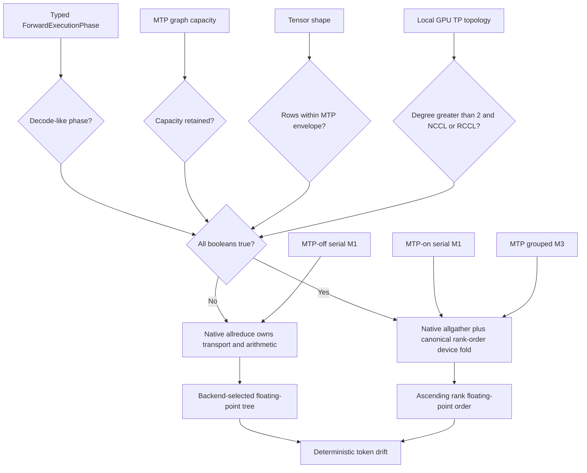
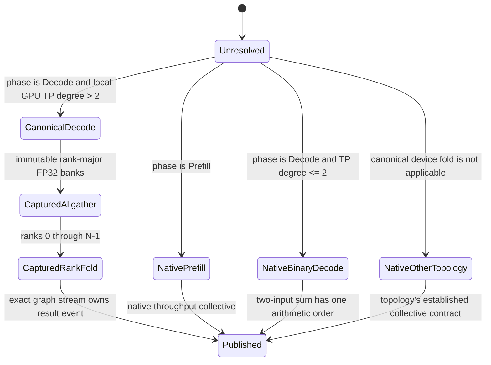
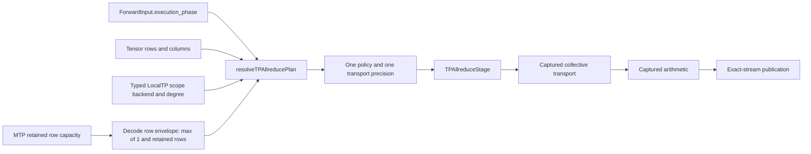

# MTP tensor-parallel reduction arithmetic lifecycle audit

Date: 2026-09-05

Scope: deterministic Qwen3.5 122B MTP depth-2 decode on a four-ROCm
continuation domain.  Serial decode emitted token `8381`; grouped verification
emitted `3377` for the same committed prefix.  Exact layer checkpoints narrowed
the first divergence to the tensor-parallel sum after layer-0 GDN output
projection.

This is a dated investigation record.  The source-owned contracts are
`ForwardExecutionPhase`, `QwenGraphBase::resolveTPAllreducePlan()`, and
`TPAllreduceArithmeticPolicy`.

## Evidence and old lifecycle

The local GDN projection was not defective.  At the divergent token, every
participant's pre-collective FP32 row was byte-identical between serial and
grouped execution:

| ROCm participant | Serial local hash | Grouped row-0 local hash |
|---:|---:|---:|
| 0 | `a0515e4c3d3827e0` | `a0515e4c3d3827e0` |
| 1 | `622593b0eabbc86d` | `622593b0eabbc86d` |
| 2 | `0a00ed8b8318bdb5` | `0a00ed8b8318bdb5` |
| 3 | `fd6bdce9fe9542b7` | `fd6bdce9fe9542b7` |

The published sums differed: serial native RCCL produced
`61e464252a23e90f`, while the grouped canonical fold produced
`331848bf2959f182`.  The graph builder had made retained MTP capacity a proxy
for the numerical contract.  Disabling MTP therefore changed serial decode's
floating-point authority even though it did not change the mathematical row.

This had three needless sources of complexity:

1. MTP enablement was allowed to select main-model arithmetic.
2. A collection of topology and shape booleans encoded a state transition but
   had no named result carrying the resolved precision and policy together.
3. Serial and grouped graphs independently arrived at a reduction policy even
   though grouped verification is required to be serial-row byte-equivalent.

## Simplified authoritative lifecycle

One resolver now consumes the already typed forward phase, exact row geometry,
and LocalTP topology and returns one immutable `TPAllreducePlan`.  The serial
decode envelope always contains M1; retained MTP capacity only enlarges that
envelope for grouped verifier rows.  It never changes M1's arithmetic.

The important invariant is now direct: for an eligible LocalTP topology, every
M1 decode graph uses canonical rank-order FP32 arithmetic whether MTP is off,
enabled, or retained as capacity only.  Grouped MTP rows use the same plan over
the enlarged retained row envelope.  Prefill remains on native NCCL/RCCL
allreduce because it has no serial-row equivalence contract and benefits from
the throughput-optimized collective.

## Proof obligations

1. A model-graph unit test must prove MTP-off serial M1, MTP-on serial M1, and
   grouped verifier rows resolve the same canonical policy, while prefill stays
   native.
2. CUDA and ROCm capture integration tests must prove row zero is byte-identical
   at M1, M2, and M3 under canonical rank-order reduction.
3. The exact Qwen3.5 GDN projection geometry must remain byte-identical before
   the collective, preventing a future reduction regression from being
   misdiagnosed as a quantized GEMM defect.
4. The real-weight MTP-on and MTP-off deterministic runs must emit the same
   token sequence before the performance campaign resumes.
