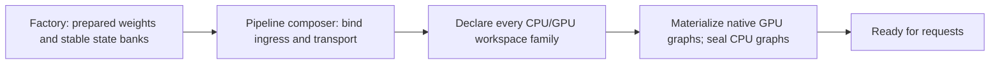
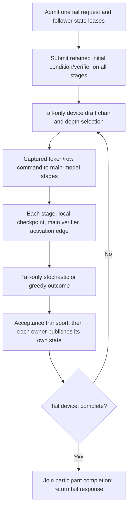
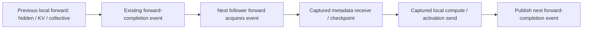
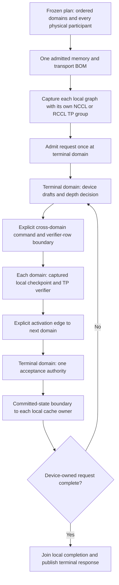
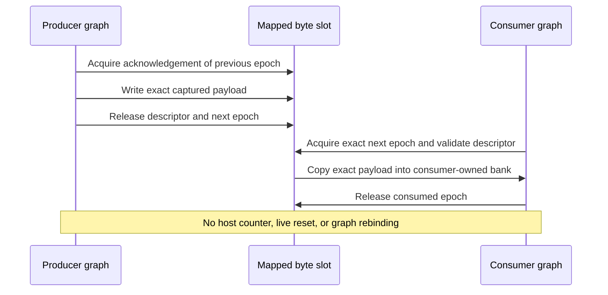
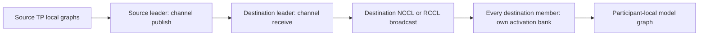
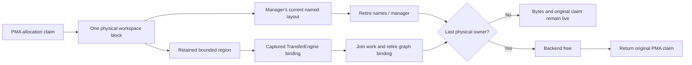
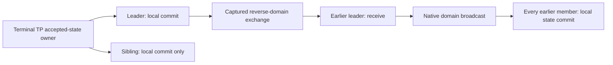
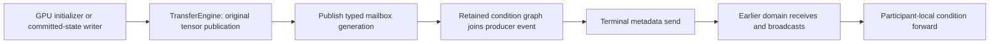

# Automatic HTTP E2E coverage

Work in progress, 2026-09-22. This file records this development slice;
the typed definitions and CMake registration remain the inventory authority.

## Objective

Add dense Qwen3.8 27B two-device TP and PP on CUDA and ROCm, plus mixed-vendor
two-CUDA/two-ROCm TP/PP. Drive every tagged HTTP cell through production auto
selection with topology constraints, and exercise real tool calling in each.

The initial stability target was twenty clean full-HTTP iterations for each
new TP/PP cell. The user subsequently accepted the completed 51-pass homogeneous
cohort and stopped stress testing; do not resume those loops automatically.
Startup, shutdown, dynamic MTP, prefix restore, all long-context checks and all
tool probes remain mandatory for the outstanding functional HTTP proof.

## Implemented

- Public `--auto-device-counts backend=count,...` filters physical compute
  membership without authoring ordinals, rank placement or layer partitions.
  YAML and the strict plan/MPI document carry the same typed policy.
- Canonical discovery has 18 HTTP cells (13 existing plus five new). Saved-token
  and mathematical runtime projections retain their declared placement; HTTP
  projects backend/count/strategy constraints from those same definitions.
- Per-stage native collectives express CUDA TP and ROCm TP across a PP boundary.
- Startup observation binds executing devices to inventory node/UUID/NUMA
  identity. HTTP evidence checks actual execution strategy and distinct physical
  counts, not requested flags or repeated rank visibility.
- Four HTTP tool probes cover JSON/SSE, required/named/automatic tool choice,
  exact arguments, call-ID joins and tool-result consumption. Raw exchanges
  are retained and independently revalidated after shell success.
- Remote auto-serve and plan/apply projections retain their own count contracts
  and share the HTTP evidence validator; no Azure resources were provisioned
  in this slice.
- README benchmark bars use each cell/phase's AVX512 result as 100%, including
  truthful AVX2 values above 100%. Sections group 27B, 35B and 122B models. The
  checked-in SVG was regenerated from unchanged historical JSON measurements;
  it is not evidence for the new 18-cell matrix.

## Evidence and remaining work

- Release and Integration builds completed.
- Focused policy/matrix/physical-identity/tool-protocol/publication regressions
  pass and are explicitly registered in production preflight.
- Complete prerequisites passed in
  `parity-results/e2e-auto-prerequisites-20260922/prerequisites.json`:
  662/662 Unit and 284/284 production preflight (126 host, 66 CUDA, 64 ROCm,
  28 shared-device) in 647 seconds overall. Reuse this gate across unchanged
  local cells, not a fresh prerequisite run per cell.
- Canonical HTTP inventory:
  `parity-results/e2e-auto-matrix-20260922.json`.
- First new real-model HTTP cell passed: CUDA2 TP, all 44 HTTP checks,
  including the eight long-context checks, tool calling, actual auto-selection
  evidence and clean shutdown/VRAM release. Its report is
  `parity-results/e2e-auto-cuda2-tp-20260922.json`.
- CUDA2 PP failed before readiness, after loading both participants. Its second
  stage reached graph-family materialization without its stable previous-stage
  activation owner. The exact initialization failure is retained in
  `parity-results/e2e-auto-cuda2-pp-20260922.json` and its artifact directory.
  Investigate the production PP wiring/materialization order and add a focused
  regression; do not relax the required owner check. The remaining new dense
  cells and the full 18-cell HTTP projection are not yet certified.
- The model-free gate is now `ProductionTestPreflight`, built by
  `v2_production_test_preflight_gate`. CI, Docker, hook, Python callers,
  registration and tracked documentation use the new name, without a legacy
  alias. Before/after CTest JSON proves all 284 test identities, commands,
  timeouts, locks and other properties are unchanged except for the label.
  Six focused hook/campaign/pipeline/publication CTest registrations passed
  on the latest check (5.09 seconds); the renamed label now discovers 290 tests
  after the separately documented PP regressions were added;
  both updated skills validate. Earlier prerequisite receipts remain historical
  evidence and were not rewritten to impersonate a run under the new label.
- Before publication, increment the strict orchestration document schema for
  any additional policy fields. The new `device_counts` field now uses schema
  version 5; the negative codec test rejects version 4 as well as unknown and
  non-integer versions. Amortize final rebuild/gates with runtime defects.

## PP startup ordering fix in progress

The new focused CPU MoE factory regression reproduces the same missing-ingress
failure as CUDA MTP in 33 ms. Concrete and interface-injected factories now
share one independent-family preparation helper. A typed PP scope leaves graph
declaration to the pipeline composer; it never supplies a placeholder input or
weakens the DGO's required-owner validation.

CPU stages no longer disappear from the composer's preparation loop. CPU-only
local PP also enters that explicit setup boundary, without requiring a GPU
bucket ladder. Both the factory reproduction and host-stage binding proof are
registered in `ProductionTestPreflight`. Release and targeted Integration
rebuilds finished; the factory, rank and configuration suites plus the two new
preflight registrations passed (5/5 CTest, 2.73 seconds). No fixed PP HTTP pass
has been claimed yet.

## Recurrent-only PP checkpoint defect

The next fresh-auto CUDA2 PP attempt failed earlier when its selected first
slice contained no full-attention cache rows. Evidence:
`parity-results/e2e-auto-cuda2-pp-preparation-fix-20260922.json`. A recurrent
slice legitimately has no K/V payload, but its sequence frontier must still
support device checkpoint, accepted-state publication, prefix import and reset.
The old base cache returned zero checkpoint bytes and no canonical count.

Focused CUDA and ROCm tests reproduced the same zero-byte failure in six
seconds combined before the fix (`/tmp/llaminar-recurrent-sequence-red.log`).
The implementation now separates metadata geometry from attention payload
geometry: an all-GDN cache owns one head/count pair per request, with no dummy
attention horizon. The existing device append kernel advances that frontier
once after the last GDN layer, using real resident row lengths. Prefix import
publishes the archive's declared length, while rollback restores the exact
opaque device checkpoint. Cache and MTP-checkpoint BOMs use the same geometry.

CUDA/ROCm regressions sweep FP32, FP16, BF16 and Q8_1 cache formats through
captured publication, padded advancement, repeated rollback, reset and prefix
restore. Planner and graph-binding regressions are also explicitly in
`ProductionTestPreflight`. Release and targeted Integration rebuilds completed.
The two device regressions, complete KV-estimator and memory-planner suites,
and explicit memory-admission registration passed (5/5 CTest, 3.11 seconds).
The Qwen graph suite and explicit graph-binding registration also passed
(2/2, 0.84 seconds). Full Unit/preflight evidence still needs refreshing for
these runtime changes; the earlier full receipt is historical.

The real HTTP retry advanced to prefix-storage preparation, then failed on two
distinct PP assumptions: the recurrent-only stage requires a dense logical
payload layout, and a non-sidecar stage tries to reserve an MTP KV prefix
cache it does not own. Preserve those explicit failures instead of disabling
prefix restore or MTP. The same run's previously unseen ROCm2 TP cell passed
the complete HTTP harness in 230.64 seconds. Both results are recorded in
`parity-results/e2e-auto-pp-checkpoint-and-rocm-tp-20260922.json`, with raw
artifacts under `parity-results/e2e-1790065716938883833/`. CUDA2 PP, ROCm2 PP,
and the mixed TP/PP cell are not certified.

## Remaining certification boundary

### Recurrent-only prefix ownership and admission

The model-free reproduction failed on CPU, CUDA and ROCm before the fix
(`/tmp/llaminar-pp-prefix-red.log`). Prefix preparation now uses the same typed
MTP role as cache construction: only the predictor owner attaches shifted KV.
`PrefixPayloadOrganization` separates contiguous attention archives from
complete recurrent images. Recurrent-only participants retain real checkpoint
frontiers and hash ancestry without allocating dummy attention/empty records.
Coordination measures logical token coverage rather than physical record count.

The first fixed run then exposed a matching planner defect: prefix RAM/staging
was admitted only for stages with full-attention layers. CPU failed its exact
RAM reservation; GPU participants lacked an admitted associated host tier.
Canonical planning now includes all-GDN owners while omitting nonexistent main
K/V staging. There is no test-only reserve or parallel memory ledger.

Release and targeted Integration builds completed. Nine focused CTests passed
in 4.82 seconds (`/tmp/llaminar-pp-prefix-admission-focused.log`): full planner,
coordinator and RAM backend units, three real backend archive/restore tests,
logical-coverage/payload-layout regressions and exact recurrent-prefix BOM
admission. The latter sweeps CPU/CUDA/ROCm, FP32/FP16/BF16/Q8_1 KV geometry,
MTP on/off and disabled/RAM/tiered storage. Device lifecycle tests prove full
and partial restore, changed-ancestor rejection and active versus retained
MTP ownership across all three stages. Every added defect regression is
explicitly in `ProductionTestPreflight`.

The first full prerequisite refresh
(`parity-results/e2e-auto-pp-prefix-prerequisites-20260922/`) passed 661/662
Unit registrations and caught an over-permissive partial-block coordination
change in `PrefixCachePrefillFlow`. Metadata alone must retain complete-block
coverage; a terminal partial chunk requires an actual retained boundary
witness. The implementation now distinguishes those cases, and both contracts
are registered explicitly in the logical-coverage preflight regression.
All ten focused CTests, including the entire prefill-flow suite, pass in
4.79 seconds (`/tmp/llaminar-pp-prefix-coverage-focused.log`).

The full prerequisite retry passed under
`parity-results/e2e-auto-pp-prefix-prerequisites-r2-20260922/`: 662/662 Unit,
296/296 preflight (132 host, 68 CUDA, 66 ROCm, 30 shared-device) in 669.65
seconds overall. The focused Python repeat-driver tests were added after the
Unit phase and separately verified as recorded below; the runtime/build tested
by the full gate was unchanged. The three PP HTTP diagnostics completed in
`parity-results/e2e-auto-pipeline-prefix-fix-20260922.json`: CUDA2 PP and mixed
TP/PP failed prefix-layout admission; ROCm2 PP reached readiness but rejected
MTP requests because its pipeline sidecar/transaction handoff was unimplemented.
This is not a stability cohort.
The remaining PP work includes complete tail-authoritative MTP generation
composition and mixed-vendor/nested-TP composition; a prefix preparation pass
alone is not evidence that these production paths are finished.

The prefix audit also identified a follow-up invariant to prove: participants
with different retained recurrent checkpoint frontiers must agree on an exact
restorable intersection, not independently round a minimum token count down.
Current focused restore tests use shared 9/13-token frontiers; they do not yet
certify asymmetric eviction or cross-rank frontier negotiation.

The canonical HTTP driver now accepts diagnostic `--repeat 20 --fail-fast`,
with one shared staging lease, a fresh server/watchdog/artifact directory per
iteration and explicit completion counts. Default aggregate failure collection
is unchanged. All 29 driver unit checks pass, including a forty-invocation
device-free scheduling proof, timeout/evidence failure and early-stop handling.
The 24 checks in `E2EDiscoveryTests`, already explicitly selected by
`V2_Integration_HTTPCellDeadline`, also pass directly after this tooling change.
These are runner tests, not substitutes for the requested real-model loops.

### Captured pipeline MTP: audited implementation boundary

The next focused regression isolated the remaining prefix-layout error to
local/global layer-ID aliasing. With a slice beginning at layer 1, the old
helper classified local offset 3 as global layer 3 and returned global layer 4
as attention. The same mistake affected archive traversal, recurrent reset,
diagnostic state walks and a publication-capability scan. One shared
`prefixFALayerForIndex` now resolves global IDs for both layout and payload
traversal; recurrent queries use global IDs and the capability uses the cache's
canonical GDN count. The regression reproduced failures on CPU/CUDA/ROCm, then
passed all three preflight entries in 3.51 seconds after correction. It covers
five nonzero PP offsets and FP32/FP16/Q8 cache formats. Evidence:
`/tmp/llaminar-prefix-offset-red.log`, `/tmp/llaminar-prefix-offset-green.log`.
Release and Integration rebuilt for that fix. The subsequent MTP composition
work below is not yet covered by the earlier full-gate receipt.

`PipelineDeviceGeneration` now composes homogeneous speculative generation as
well as ordinary captured generation, native prefill edges, follower main-state
checkpoints and condition/verifier fanout. `PipelineMTPDeviceGeneration.cpp`
retains the tail's existing controller and wraps each follower's verifier and
local publication in a complete native transaction. Rank MTP entrypoints now
delegate through that owner instead of admitting independent TP controllers.
The tail alone advertises and owns the sidecar/draft-input surface. This
implementation is not yet certified by the full real-model HTTP cells.

The installed homogeneous request lifecycle is:

CUDA must enclose this lifecycle in complete native parents. HIP may submit
retained complete transactions from the tail's authenticated scheduler ticket;
followers must be submitted before waiting for the next ticket. Neither host
path may inspect mutable verifier/KV/response state or reproduce tail decisions.
Nested TP and mixed-vendor stages require the explicit physical participant and
boundary contract, not a cast that treats a nested rank as a single DGO. Those
compositions are not yet implemented by the current homogeneous-stage owner.

### Headless pipeline forward ordering: deterministic regression

The six pipeline MTP/prefix preflight groups passed in 52.62 seconds after the
homogeneous composition and fixture changes (`/tmp/llaminar-pipeline-groups-r2.log`).
They include seeded stochastic/greedy generation, dynamic depth through 15,
twenty repeated requests plus continuations and both device orders. This is a
focused gate, not the full Unit/preflight receipt or a 20-run HTTP certificate.

Real CUDA2 PP and ROCm2 PP still stalled on the thinking-budget HTTP check:
`parity-results/e2e-auto-homogeneous-pp-mtp-20260922.json`. Both started and
answered the first non-thinking check. A fresh Integration CUDA server also
stalled with the thinking request first; preceding-request reuse is therefore
not required. The opt-in publication diagnostic made that request complete,
including when the original one-GDN-layer head / remaining-layer tail placement
was reproduced exactly. Its synchronous observations are diagnostic only and
must not be installed as a fix. The CUDA debugger attach subsequently crashed
one earlier stalled process; that post-attach crash is not evidence of an
independent application defect.

A held native timeline gate then proved a missing local dependency independently
of model arithmetic. Both CUDA and ROCm let a headless participant's next
forward overwrite a prior forward's live hidden read in **all twenty** guarded
transitions. A follower has no sampler/mailbox authority to acquire that event
incidentally. The fix acquires the existing `ForwardGraphOutputReady`
event in the follower's canonical forward prelude; no new lifecycle flag,
controller, host readback or synchronization is added.

The focused test `PipelineFollowerJoinsPriorForwardWithoutSampler` is in both
explicit `ProductionTestPreflight` pipeline registrations. Its red evidence is
`/tmp/llaminar-pipeline-predecessor-{cuda,rocm}-red.log`. Both backends now pass
all twenty guarded transitions, and all six pipeline MTP/prefix integration
registrations pass in 57.83 seconds
(`/tmp/llaminar-pipeline-predecessor-groups-r1.log`). The complete timeline
unit suite also passes. A public-runner condition burst was added without
per-token readbacks, because observations inside that burst would conceal the
ordering defect.

The first uninstrumented Release retry uses the exact originally failing CUDA
partition. Its thinking-budget request now returns HTTP 200, the correct answer
`4`, and 43 completion tokens in 1.34 seconds, versus the earlier stall. Evidence:
`/tmp/llaminar-cuda-pp-predecessor-thinking-r1.{json,status}` and
`/tmp/llaminar-cuda-pp-predecessor-release-r1.log`. This is one diagnostic
request, not an auto-selection/full-HTTP certificate. The same server then
passed twenty repeated thinking requests, each about 1.02 seconds, including
prefix reuse (`/tmp/llaminar-cuda-pp-predecessor-thinking-repeat.log`). It shut
down normally before model-free GPU gates. Full prerequisite refresh and
broader HTTP verification follow; no full 20-run HTTP cohort has started or
been certified.

The full refresh is green in
`parity-results/e2e-auto-pipeline-predecessor-prerequisites-20260922/prerequisites.json`:
662/662 Unit and 296/296 ProductionTestPreflight registrations in 663.86
seconds. Preflight covers 132 host, 68 CUDA, 66 ROCm and 30 shared-device
entries, including both new ordering regressions. The subsequent complete
auto-planned CUDA2 PP / ROCm2 PP HTTP retry is recorded separately in
`parity-results/e2e-auto-homogeneous-pp-predecessor-20260922.json`. Both
completed 43/44 checks, including all eight long-context checks and four tool
round trips, with normal shutdown and no retained VRAM. The sole failure was
the final graph-evidence validator: it classified complete native parent
executables as host-segmented execution merely from the counter name. These
historical reports remain failed and have not been rewritten.

The validator now authenticates native parent lifecycle records through the
sealed plan's boundary authority, positive child count and explicit zero host
service units. It still rejects missing launch/replay evidence, foreign owner
records, eager warmup and real homogeneous segmentation. Saved evidence from
both HTTP runs passes the corrected graph, runtime-feature, transfer and
request-lifetime checks. The full Python policy suite and the new explicit
`V2_Integration_HTTPNativeParentEvidence` registration pass (2/2 CTests,
0.80 seconds). This adds one host preflight entry, making the current inventory
297; the earlier 296-entry receipt remains historical. Fresh prerequisite and
full HTTP runs are required before claiming the two PP cells green.

The refreshed prerequisite transaction is green in
`parity-results/e2e-auto-native-parent-prerequisites-20260922/prerequisites.json`:
662/662 Unit and 297/297 preflight in 660.62 seconds. This includes the new
native-parent evidence regression. The four homogeneous TP/PP cells now enter
one twenty-repetition, round-major HTTP cohort, with a fresh server and complete
checks for every invocation. Its incremental report is
`parity-results/e2e-auto-homogeneous-tppp-stability-20260922.json`; it stops on
the first failure and preserves exact artifacts. Starting the cohort is not a
claim of twenty passes, and the mixed-vendor cell is not part of this cohort.

Round one completed green on all four homogeneous cells: CUDA2 TP (150.31 s),
CUDA2 PP (116.29 s), ROCm2 TP (228.75 s) and ROCm2 PP (279.37 s).
Every invocation passed all 44 checks, including all eight long-context checks,
four tool round trips, actual auto-selected topology, complete graph evidence,
normal shutdown and zero retained backend VRAM. Exact durations and each later
iteration are recorded in the incremental report above. Round two has started;
**1/20 per cell is not the completed twenty-run stability certificate**.
The mixed TP/PP cell remains unimplemented and has no green claim.

### Mixed TP/PP composition audit (not implemented/certified)

The missing surface is larger than a backend-name check. A mixed pipeline has
ordered **domains**, each containing participant-local GPU graphs. Existing
`PipelineDeviceGeneration` accepts only one DGO per stage and connects those
DGOs through one homogeneous native communicator. A nested TP stage is a
`RankOrchestrator`, not a DGO; flattening its pointer or passing CUDA addresses
to RCCL would lose real ownership. The older `LocalPPContext::transferAsync`
also delegates to its synchronous transfer, so it cannot provide a captured
generation boundary merely by changing the caller's capability declaration.

The required composition is:

Within-domain collectives stay native. Backend transitions require their own
captured/immutable-ticket transport contract; they may not copy mutable sampler
state through the host, rebind another participant's hidden tensor or fall back
to eager stage walks. Native CUDA parents and HIP's authenticated retained
transactions remain distinct backend policies. A new boundary must prove both
device orders, unequal domain widths, prefix reset/restore, repeated lifecycle
and bounded failure drain before the mixed real-model cell can be certified.
The existing homogeneous fixes do not prove any of those missing capabilities.

### Mixed-domain proof and message-lifecycle foundation

The mixed cell previously observed only strategy and physical GPU cardinality.
That would not distinguish two TP domains from four singleton PP stages. The
typed runtime exporter now also projects domain backend/width requirements and
the authenticated main-layer count. `ServerExecutionEvidence` publishes the
actual rank plan's ordered stage membership and exclusive layer bounds. The
HTTP observer joins these to the existing physical inventory, rejects missing,
duplicated, mixed-vendor or singleton-substituted domains, and proves contiguous
layer coverage. It permits either vendor order, arbitrary selected ordinals
and every nonempty legal layer split. It remains an observer, not a planner.

The five affected Unit/preflight registrations pass in 0.85 seconds
(`/tmp/llaminar-pipeline-domain-evidence-tests-r1.log`). Release and the running
stress manifest are unchanged; the new domain records will need their own
fresh Release run after the homogeneous cohort finishes.

`CapturedTransferChannelProtocol.h` adds the device-friendly, pure ordering
contract for the missing node-local channel. It has one outstanding payload,
separate producer/consumer publication words and monotonically increasing
device-owned epochs. Its entire successful lifecycle is:

The CPU specification tests independently delay acquire, payload and publication;
32 randomized schedules each complete 384 messages. They also cover 4,096
replays with changing message geometry, stale/future epochs, foreign allocation
identity, wrong bytes, duplicate leases, terminal abort and overflow. Both
`V2_Unit_CapturedTransferChannelProtocol` and the explicit
`V2_Integration_CapturedTransferChannelProtocol` preflight registration pass.
This is **only the protocol foundation**: no new GPU kernel/transport is yet
installed in inference, and it does not turn the mixed HTTP cell green.
Next is TransferEngine-owned binding plus CUDA/HIP lowering and real captured
visibility/failure tests, before integrating the pipeline domains.

That protocol-only inventory was 663 Unit / 298 preflight registrations.
The earlier 662/297 full receipt remains the authority for the unchanged
Release stress binary, not a fresh full gate for these subsequent additions.

- Corpus admission binds the full canonical inventory. HTTP policy metadata
  changes and new diagnostic cells therefore require separately reviewed corpus
  metadata/new controls before a full saved-token/image pipeline; do not
  silently regenerate existing token payloads or weaken inventory admission.

No commit or remote publication has been performed for this slice. Preserve the
pre-existing untracked published-image progress document.

### Captured channel binding and device regression preparation

The TransferEngine channel now has setup-owned mapped storage, one private
cursor on each GPU, immutable message bindings and an exact shared allocation
BOM. PMA claims every host page and cursor before materialization. Bindings
retain their channel and physical tensor/scratch owners and reject foreign
devices, replaced backend authority, changed pointers and out-of-bounds extents.
The API accepts rank-local `DeviceId`s only; it cannot address a remote process
or claim this mapped transport is cross-host.

Setup joins only the two cursor-initialization events before returning ready.
This is not an inference-time wait and does not synchronize a stream/device.
The first implementation attempted to import that external event during
capture; source review against the existing TransferEngine capture contract
removed that invalid edge before any GPU execution. The retained endpoint is
exactly acquire → parallel byte copy → release, without host observation or
reset. Device deadlines use fixed-rate wall timers, not the maximum shader
clock, so DVFS cannot silently extend the peer timeout.

CUDA and HIP backend lowering compiles. Static resource inspection of the
Integration objects reports CUDA acquire/publish at 34/33 registers, zero
stack/local bytes; gfx906 reports 47 VGPR / 54 SGPR, zero register spills,
8 bytes private segment for each boundary. The artifacts are under
`/tmp/llaminar-captured-transfer-isa-2iIuQc/`. These are compiler observations,
**not runtime occupancy, throughput or device-visibility certification**.

The protocol and binding suites pass all four Unit/preflight registrations
(`/tmp/llaminar-captured-transfer-channel-host-gate-r2.log`, 1.06 seconds).
Binding coverage proves both vendor orders, exact odd-byte payloads and guards,
PMA lifetime/rollback, native enqueue order, setup-only event queries, invalid
residency/bounds and failed native submission. Both backend objects and the
real-device round-trip fixture build. The latter is registered explicitly for
CUDA→CUDA, ROCm→ROCm, CUDA→ROCm and ROCm→CUDA, with exact backend labels so the
gate scheduler cannot mistake a cross-device test for host-only work.

The new device fixture retains two graph patterns, alternates endpoint launch
order, sweeps one byte through one MiB plus three bytes, aligned/unaligned
subregions and 64 replays per geometry, and checks returned bytes and surrounding
guards. It also verifies complete graph-family admission and zero remaining
channel claims at teardown. **These four GPU tests have not run yet**, to avoid
overlapping the live real-model stress cohort. Runtime profiler evidence and
bounded native failure/drain tests remain required before production wiring.

Current source discovery: **664 Unit / 303 ProductionTestPreflight**. The prior
full receipt still certifies only the unchanged Release stress build. As of the
last report inspection, that cohort has 23/80 clean invocations (CUDA TP/PP
6/20 each, ROCm TP 6/20, ROCm PP 5/20); the incremental JSON is authoritative for
later progress. This is neither a completed stress certificate nor a mixed-cell
pass.

The next composition audit found existing reusable machinery: DGO already
selects authenticated hosted transactions for a **declared heterogeneous
collective topology even on CUDA**. Mixed PP must contribute its actual frozen
domain boundary to that policy, not invent a new host controller or pretend
to be an MoE overlay. Native NCCL/RCCL stay inside each TP domain. The terminal
TP domain retains its established sidecar/replica authority; nonterminal
participants own only local main-model state and consume verifier/commit
commands. `PipelineDeviceGeneration` still assumes one DGO per stage, and
`PipelineGraphExecutionPlan` currently stores only a primary device per stage.
Domain membership and transaction composition therefore still need a coherent
implementation after the channel is device-proven. No capability declaration
has been weakened to admit the mixed cell prematurely.

The complete Integration Unit dependency target rebuilt successfully, followed
by **664/664 Unit passes in 78.23 seconds**
(`/tmp/llaminar-captured-transfer-full-unit-gate-r1.log`). All six affected
host-only preflight entries also passed in 1.93 seconds
(`/tmp/llaminar-captured-transfer-focused-host-preflight-r1.log`): channel
protocol/binding, native-parent evidence, automatic selection/domain evidence,
server physical identity and HTTP cell deadlines. These runs include the
offset-sensitive payload revision in the binding test. The device fixture now
uses distinct immutable offset-sensitive sources for its two retained patterns;
constant-fill payloads would not detect a shifted or permuted source copy.
The device fixture was rebuilt but remains unexecuted while the stress cohort
owns the GPUs. Full 303-entry preflight is still pending; these six entries do
not replace it. Latest observed cohort progress: 27/80 passing invocations,
CUDA TP/PP and ROCm TP at 7/20, ROCm PP at 6/20 with iteration seven running.

### Complete domain identity and first native channel proof

`PipelineGraphExecutionPlan` now retains every ordered local TP execution
identity instead of only the leader. Rank setup and replay validation compare
all children with the existing collective's ordered membership. There is no
second discovery path, physical memory ledger or NUMA inference: CPU physical
placement remains in the canonical rank plan/context. The pure plan tests were
split out of the large RankOrchestrator fixture. They cover unequal TP widths
through eight in either vendor order, preserve unsorted communicator order and
reject missing/duplicate/mixed GPU membership. A runtime regression changes a
nonleader while preserving the leader and proves rejection before any child
materializer runs. Both regressions are explicit ProductionTestPreflight entries.

The four affected Unit/host-preflight registrations pass
(`/tmp/llaminar-pipeline-domain-membership-gate-r1.log`). This is a topology
identity improvement, not implementation of mixed captured generation.

To avoid waiting for all eighty expensive invocations before checking the byte
primitive, the cohort launcher was briefly held while its current independent
server invocation completed. An exclusive model-free device window then ran;
an EXIT trap resumed the original launcher. Neither the running Release binary
nor its manifest changed, and device tests did not overlap model execution.
Aggregate diagnostic wall time consequently includes these handoff intervals
and is not an unperturbed campaign performance measurement.

The first attempt exposed a fixture registration error: the test used plain
GTest main but requested MPI inventory before MPI initialization. It now uses
the existing `integration/mpi_gtest_main.cpp`, including canonical GPU-worker
retirement before MPI finalization. After that fix all four native registrations
passed in 11.82 seconds (`/tmp/llaminar-captured-channel-first-devices-r2.log`):
CUDA→CUDA, ROCm→ROCm, CUDA→ROCm and ROCm→CUDA. Each pair executed 512 retained
round trips, exact offset-sensitive payload/guard verification, changing
geometry, alternate submission order and complete PMA release. The updated
fixture with opt-in isolated profiling probes also passes all four entries
(`/tmp/llaminar-captured-channel-profile-probe-functional-r1.log`, 13.67 seconds).

The profiling probes are disabled-by-default GTests and have no CTest/preflight
registration or performance threshold. They execute one fixed 4099-byte aligned
captured transaction using the same production lowering. Stateful peer kernels
must use application replay or a non-replaying trace, never individual-kernel
replay. Profiler output is isolated under
`/tmp/llaminar-captured-channel-profile-MJTYmO/`; do not claim completion from a
partially written report. Bounded native failure/drain coverage, production
mixed TP-domain composition, its full gates and twenty HTTP loops remain open.

### Channel profiling and native TP-domain activation boundary

The isolated profiles completed in the directory above. Separate CUDA
application-replay invocations selected exactly one acquire or publish kernel:
34/33 registers, zero local spilling requests, one 32-thread block. Their
profiled durations were 8.29/10.18 microseconds. The small protocol block has
2.08% achieved occupancy; bulk payload copying is a separate parallel kernel.
ROCm traces selected one 64-thread wave per boundary (allocated 48 VGPR/64
SGPR, matching compiler rounding). Producer acquire/publish measured
11.20/7.20 microseconds in the trace; consumer acquire includes actual peer
waiting and must not be presented as pure dispatch overhead. Separate
counter launches each contained exactly one requested dispatch. Static gfx906
inspection reports zero register spills but an eight-byte private segment;
do not describe that as zero scratch. These are Integration profiler
observations, not unprofiled Release latency or a model speed certificate.

The complete Unit gate then passed **665/665 in 78.12 seconds**
(`/tmp/llaminar-pipeline-domains-full-unit-gate-r1.log`). This receipt predates
the activation-stage extraction below. The unchanged Release cohort reached
44/80 clean invocations: every homogeneous TP/PP cell passed eleven full
44-check HTTP iterations. Later counts remain in the incremental JSON.

`PipelineActivationExchange` now owns the formerly private native activation
stage and adds an explicitly declared cross-backend domain boundary. Native
pipeline point-to-point remains NCCL/RCCL. Cross-vendor transport is permitted
only between the exact domain leaders; every receiving TP member participates
in its existing native broadcast. Same-vendor channels are rejected by this
domain path instead of silently bypassing their native transport. The channel's
immutable endpoint identities are queryable, not its device-owned live epochs.

Four focused Unit/host-preflight entries pass in 2.44 seconds
(`/tmp/llaminar-pipeline-activation-host-gate-r1.log`). New device-free checks
sweep both vendor orders, TP widths 1/2/4/8, unsorted ordinals, exact payload
extent/guards and receive-before-broadcast ordering. They reject nonleader
publication, wrong native groups, stale membership and failed broadcast before
dependent work. The dedicated `PipelineActivationDomain` host regression is
registered in ProductionTestPreflight.

Two additional explicit device preflight registrations construct four retained
graphs over CUDA2 and ROCm2 native groups, in both vendor orders. Each sweeps
four physical row extents, twenty replays, alternating launch order, all-member
payload/guard validation and PMA release. These are activation-boundary proofs,
not a replacement for the required full-model mixed-cell HTTP loops.

The first device attempt failed during capture because the fixture omitted the
production capture dependency ledger: its return send misclassified the
preceding captured receive as an external producer. Both communicators aborted
and all contexts retired normally. The fix declares native broadcast,
receive and send producers through `GraphCaptureDependencyLedger` and
`ScopedGraphCaptureStage`, joins the true source input before capture, and
publishes tensor completion only after graph launch. It does not weaken the
TransferEngine event check or add a synchronization. The four standalone
channel pairs still passed in that attempt. The corrected domain retry passed
both vendor orders in 10.41 seconds
(`/tmp/llaminar-pipeline-activation-domain-devices-r2.log`): eighty retained
round trips per order, including every TP member and exact guards. This is
not twenty fresh-process E2E iterations. The real HTTP launcher resumes
automatically after each isolated model-free device window.

The full Unit gate rebuilt and passed again after the extraction:
**665/665 in 79.04 seconds**
(`/tmp/llaminar-pipeline-activation-full-unit-gate-r1.log`). The existing CPU
pipeline MTP state suite also passed (0.66 seconds). Its CUDA/ROCm counterparts
passed in 17.84/36.04 seconds
(`/tmp/llaminar-pipeline-activation-existing-devices-r1.log`). Current discovery is 307 explicit
production-preflight registrations; a full 307-entry run remains pending.
Latest observed HTTP progress is 47/80 passing invocations: CUDA TP/PP and ROCm
TP each 12/20, ROCm PP 11/20 with its twelfth invocation in flight.

#### Remaining composition work (not a capability certificate)

The activation primitive is now device-proven; the full mixed cell is still
unimplemented. The next integration must preserve both domain and participant
identities. `PipelineDeviceGeneration` currently stores only one DGO per stage.
Its terminal operations should delegate to the existing terminal domain's
`IInferenceRunner` API: a TP `RankOrchestrator` already admits its mirrored
sidecar participants, authenticates equal tickets and submits every selected
branch concurrently. Nonterminal participants remain local verifier/commit
followers, never extra samplers. Setup and follower graph submission may use
the frozen flattened member list without flattening the terminal authority.

The row-input and four-word commit boundaries still need lifetime-safe captured
bindings plus their exact admission BOM. Tokens, positions and request lengths
already reside in named arena tensors. Most committed fields reside in the
durable logical-state arena, but accepted restore-slot indices still belong to
named workspace storage. Do not introduce an unowned raw-pointer channel API,
copy live state through a host mirror or duplicate that field into a second
authority. Extend the existing storage owner's typed lease if necessary.
Native groups remain distinct communicators and only declared heterogeneous
boundaries select the existing authenticated hosted-transaction policy.

After those pieces are connected, run the focused complete-generation tests,
refresh the shared full Unit/preflight receipt, then prove the mixed HTTP cell
and its twenty fresh-server iterations. The current four homogeneous Release
cohorts remain immutable and must finish independently of that new source.

The two native-domain regressions subsequently passed **twenty fresh MPI
processes each** (`/tmp/llaminar-pipeline-activation-domain-stability-20x-r1.log`,
200.66 seconds total). CTest reports two registrations; the raw log contains
twenty successful invocations for each. Together they exercised 3,200 retained
round trips, including repeated capture, teardown and canonical claim release.
This is model-free stability evidence, not the mixed full-model certificate.
The HTTP cohort launcher resumed automatically and now records 50/80 clean
invocations: CUDA2 TP and PP at 13/20 each, ROCm2 TP and PP at 12/20 each;
ROCm2 TP iteration thirteen is in flight. No Release binary or manifest changed.

#### Stress campaign stopped at the user's request

On 2026-09-22 the user accepted the accumulated stress evidence and requested
that the stress cases stop. The campaign stopped with **51 completed passes,
zero completed failures**: CUDA2 TP 13, CUDA2 PP 13, ROCm2 TP 13, ROCm2 PP 12.
ROCm2 PP's thirteenth invocation (number 52) was interrupted, not certified or
counted as a regression. Its raw shutdown/request errors resulted from that
cancellation. The launcher, harness, MPI child and server have all exited.
The original report and all artifacts remain intact; the sibling
`e2e-auto-homogeneous-tppp-stability-20260922-stop.json` records the interruption.
Do not automatically resume the twenty-iteration stress target. This accepted
partial cohort does not claim twenty passes per cell or implement/certify the
remaining mixed-domain full-model path. Focused functional implementation and
the pending complete preflight gate remain separate work.

#### Retained workspace metadata for the mixed-domain boundary

The metadata ownership gap is addressed without moving the accepted restore
indices into another mailbox. `WorkspaceBufferLease` retains a bounded region
of the original workspace allocation. That allocation keeps its existing PMA
claim; neither the lease nor TransferEngine claims the bytes a second time.
Named-buffer growth cannot redirect a retained pointer. Whole-block reuse
rejects live leases before changing names or publication state.

New device-free tests cover final-owner accounting, bounds/overflow, refusal
to reuse live storage, and superseded extension blocks. The workspace Unit
entry plus the explicit new preflight entry passed (2/2, 1.16 seconds;
`/tmp/llaminar-workspace-buffer-lease-host-r1.log`). Four new device preflight
entries exercise the original named workspace after its manager has retired,
using CUDA/CUDA, ROCm/ROCm and both mixed-vendor orders. They are not yet
verified at this checkpoint.

The first broad preflight attempt was intentionally interrupted after 69
reported passes, rather than certified: rebuilding `libllaminar2_core.so`
during that run could mix the new workspace ABI with old dependent test
executables. The entire Unit and 312-entry preflight dependency set is now
being rebuilt coherently before a fresh gate run. Do not cite the interrupted
attempt as a complete pass. The Release HTTP stress evidence remains unchanged
and the stress loops remain stopped at the user's request.

The coherent rebuild subsequently completed all 916 build steps. The full
Unit gate passed **665/665 in 79.14 seconds**
(`/tmp/llaminar-workspace-lease-complete-unit-r1.log`). Before admitting the
broad device gate, all four new retained-workspace channel tests passed in
9.02 seconds (`/tmp/llaminar-workspace-lease-focused-devices-r1.log`), including
foreign-role and out-of-bounds rejection, exact guarded bytes and final PMA
claim release. The fresh 312-entry preflight run is now in progress under
`/tmp/llaminar-workspace-lease-complete-preflight-r1.log`. Keep the library and
all test executables unchanged until it finishes.

The next integration should reuse the existing terminal TP domain rather than
invent another multi-device generation controller. Root setup may inspect the
frozen flattened participant list, but terminal admission, outcome publication,
ticket authentication/advance and result collection must call the terminal
domain's `IInferenceRunner` surface once. `RankOrchestrator` already mirrors
and authenticates its TP members. Nonterminal DGOs remain verifier/KV followers.
The compiled local ingress should come from each DGO's own frozen pipeline
edges, not one shared foreign `pipeline_hidden_input` pointer passed to all TP
members. Captured metadata has two existing input families to retain: the
verifier's token/position/length arena banks, and scalar logical-state rows.
Its accepted restore-index bank can now retain the named workspace allocation
directly. Per-domain capture/transfer BOM must be admitted before these channels
materialize; the existing flat-native pipeline fence budget is not that BOM.

#### Mixed-domain runner integration (2026-09-22, in progress)

The prior coherent workspace-lease gate finished: **312/312 preflight entries
passed in 925.18 seconds**, alongside the 665/665 Unit baseline above. Those
receipts precede the following implementation and are not its certificate.

The mixed-domain path now has original-owner metadata bindings, typed native
domain membership and a shared `PipelineTransferMemory` BOM consumed by both
admission and channel creation. The pipeline coordinates ordered domains and
delegates terminal operations to the terminal domain's existing runner. Only
leaders own inter-vendor channels; native TP keeps its original NCCL/RCCL
communicators. Both vendor orders use the same implementation.

Focused metadata/activation tests passed in both vendor directions. The latest
memory/edge/binding check passed **5/5 in 1.33 seconds**
(`/tmp/llaminar-pipeline-domain-runtime-unit-r1.log`). A new model-free captured
runner fixture expands one-/two-member domains, both vendor orders, and
ordinary/dynamic-MTP requests into eight explicit preflight entries. This is a
numerical lifecycle fixture, not proof of Qwen transformer arithmetic.

The first complete CUDA1-to-ROCm1 ordinary request case passed in 2.07 seconds
(`/tmp/llaminar-pipeline-domain-cuda-rocm-ordinary-r3.log`), including reset and
continuation. It caught premature binding of the host-backed hidden arena:
setup now materializes that original admitted device bank before freezing the
channel binding. No staging copy or second memory ledger is added.

The two-member case then exposed capture rendezvous identity asymmetry: only
the source leader has the cross-vendor send node. Its first/last graph node
names cannot identify the shared domain capture. The fix declares the logical
forward through the existing `GraphCaptureWaveContract`; it adds no replay-time
work.

The remaining MTP setup defect was a topology/readiness conflation. A terminal
TP sibling owns its mirrored accepted-state commit but has no outgoing channel
work. Requiring a nonempty native transport executable for that participant
rejected a valid local publication. The explicit `PublicationOrder` now selects
one of the following complete graphs, while every role retains the original
bank leases and rejects rebinding or resurrection after retirement:

The strengthened eight-case runner matrix now passes for one-/two-member
domains, both vendor orders, ordinary and dynamic MTP. Each case exercises two
requests, continuation, 82 emitted tokens per request, exact independent token
and leaf-KV oracles; MTP starts at depth 15 and requires adaptive-controller
activity. The adjacent native publication, metadata, activation and memory
checks also pass: **21/21 in 103.32 seconds**, recorded in
`/tmp/llaminar-pipeline-domain-focused-r5.log`. The first expanded attempt had
four ordinary-case failures caused solely by a new test expecting zero shared
controller transactions; ordinary sampling legitimately increments that ledger.
The corrected assertion instead requires zero speculative draft/verifier work.

A final observation correction excludes sampling from existing prefill logits
from ordinary pipeline-forward counts, with a regression matching traversal
evidence to actual cache growth. All eight cases pass again after that change
in **26.60 seconds** (`/tmp/llaminar-pipeline-domain-eight-cases-r2.log`).
Release and the coherent 719-step Unit/preflight/matrix rebuild completed.
The new canonical prerequisite transaction is under
`parity-results/e2e-mixed-domain-prerequisites-20260922/`: **665/665 Unit** passed
in 79.21 seconds, and **324/324 preflight entries** passed in 648.13 seconds
(728.13 seconds combined). This receipt predates the scalar publication fix
below.

The five-cell HTTP manifest was re-exported from the freshly built canonical
Qwen3.8 multi-device definitions to
`parity-results/e2e-mixed-domain-matrix-20260922.json`. Unlike the older saved
manifest, its PP observation contract explicitly requires the native domain
widths and all 64 main layers. It still leaves physical ordinals, domain order
and layer partitions to auto. These model-free proofs do not certify its
transformer math, tool calls or long-context behavior. Long stress loops remain
stopped.

#### First-request scalar MTP publication (2026-09-22)

The Release mixed-domain HTTP cell completed with a failure in 78.32 seconds
(`parity-results/e2e-auto-mixed-domain-runtime-20260922-r1.json`). Auto selected
the required native TP domains and the first non-thinking request answered
correctly. The thinking request then reached budget-limited direct emission:
`pipeline_mtp_rows` rejected `MTP_LOGICAL_SEQUENCE_STATE` as host-authoritative
on both terminal CUDA participants. Later HTTP failures followed communicator
abort and are not independent root-cause evidence.

The original integration workload started with a 65-token request. Adding a
one-token continuation after it still passed, because prior verifier work had
already published the tensor. Starting instead with a one-token request
reproduced the exact production failure before any grouped verification:
`/tmp/llaminar-pipeline-budget-one-red-r2.log` (36.13 seconds including peer
watchdog/retirement). The fixture now runs budgets `1,65,1,17`, checks every
token independently, and requires evidence of budget-limited direct emission.
The same preflight registrations cover both vendor orders and domain widths.

The initializer wrote the correct arena rows and published the typed mailbox,
but omitted publication through the arena tensor's TransferEngine authority.
The shared mailbox commit now publishes that exact GPU writer before exposing
the mailbox. It does not add a host mirror, a copy, or a blocking wait:

The strengthened regression passes **8/8 in 26.37 seconds**, including the
previously failing first-request one-token boundary in both vendor orders
(`/tmp/llaminar-pipeline-budget-one-eight-cases-r1.log`). The fresh complete
Unit/preflight transaction passed **665/665 Unit and 324/324 preflight** in
746.13 seconds including preparation, under
`parity-results/e2e-scalar-publication-prerequisites-20260922/`. Release rebuilt
successfully. The exact mixed-cell HTTP retry completed in 180.52 seconds as
`parity-results/e2e-auto-mixed-domain-runtime-20260922-r2.json`: **43/44 checks
passed**. Tool calls, thinking/non-thinking chat, streaming, prefix restores,
all eight long-context checks and clean shutdown/VRAM release passed. The sole
failure was the startup attention-ownership evidence described below, not a
green mixed-cell certificate.

#### Attention ownership in a recurrent-only pipeline domain (2026-09-22)

Auto assigned ROCm's native two-device domain main layer `[0,1)` and CUDA's
native two-device domain `[1,64)`. Layer zero is recurrent GDN; all full-attention
main layers therefore execute on CUDA. The server observer incorrectly marked
every model-graph participant as an attention participant, causing the strict
FlashAttention validator to demand nonexistent ROCm attention work.

Startup evidence now projects full-attention ownership from the frozen layer
intervals and the loaded GGUF's canonical `PersistentStateMemoryEstimator`
classifier. It also accounts for the enabled terminal MTP predictor and retains
every selected device in the compute/capture evidence. No validator exception,
model/backend name check, absence-of-counters inference or execution policy
change was added. Rank-local membership uses the selected device identity rather
than fabricating a `localhost` address for an admitted host/NUMA-qualified device.

Focused regressions cover both vendor orders, CPU participation, single and TP
domains, recurrent-only global PP followers, actual tensor overrides to periodic
layer geometry, predictor ownership and invalid/ambiguous intervals. These run
in the existing explicit `ServerExecutionIdentity` and
`ServerAutomaticSelectionEvidence` preflight registrations. All five selected
Unit/preflight entries pass; direct Python execution also passes 14 execution
contract and 134 graph/attention policy tests. Release and Integration rebuilt.
The full prerequisite refresh passed **665/665 Unit and 324/324 preflight** in
739.66 seconds, including preparation, under
`parity-results/e2e-attention-ownership-prerequisites-20260922/`. All eight
mixed-domain generation cases passed in that gate. The fresh canonical manifest
`parity-results/e2e-auto-full-matrix-20260922-r2.json` contains all 18 HTTP cells;
every entry requires automatic selection and tool calling. The exact mixed
Release HTTP retry passed **44/44 checks** as
`parity-results/e2e-auto-mixed-domain-runtime-20260922-r3.json`, including all
four tool roundtrips, all eight long-context checks, capture/attention evidence,
clean shutdown and zero retained device VRAM relative to the baseline. Its
artifacts are `parity-results/e2e-1790101551897758676/1/`.

One complete, non-fail-fast pass of the fresh 18-cell HTTP projection is now
running as `parity-results/e2e-auto-full-runtime-20260922-r1.json`, with the
unchanged prerequisite gate amortized across all cells. Long stress repetitions
remain stopped. The full projection is not certified until that run completes.

The aggregate's first cell, Qwen3.6 35B IQ3_S on CPU NodeTP (two MPI ranks,
Dynamic residency and dynamic-depth MTP), passed **44/44 HTTP checks**, including
the complete 2,048-token structured generation. Its artifacts are
`parity-results/e2e-1790101763773397683/1/`. The aggregate has advanced to
Ornith 1.5 Q4_K_M on the same two-socket topology; follow the aggregate JSON and
`/tmp/llaminar-auto-full-http-r1.log` for subsequent cell outcomes rather than
starting another run.

The second aggregate cell, Ornith 1.5 Q4_K_M on CPU NodeTP, also passed
**44/44 HTTP checks** in 817.01 seconds, including all four tool-call modes,
eight long-context checks, the full 2,048-token structured generation, clean
shutdown and unchanged GPU memory. Its artifacts are
`parity-results/e2e-1790101763773397683/2/`. The aggregate has moved to
Qwen3.5 122B with two CUDA GPUs and two CPU ranks; the current aggregate
report remains the source for all subsequent outcomes.

#### Completed full HTTP failure inventory (2026-09-22)

The non-fail-fast run completed all **18/18** selected cells in
`parity-results/e2e-auto-full-runtime-20260922-r1.json`, retaining per-cell
artifacts under `parity-results/e2e-1790101763773397683/`. **Twelve passed;
six failed.** The unchanged prerequisite receipt above was shared across the
run rather than repeated for each cell. All five newly requested Qwen3.8
27B dense multi-device cells passed their full **44/44 HTTP checks**, including
real tool calls: CUDA2 TP (#8), CUDA2 PP (#9), CUDA2/ROCm2 native-TP-over-PP
(#12), ROCm2 TP (#16), and ROCm2 PP (#17). Their server argument records show
automatic planning constrained by backend counts and strategy, without authored
ordinals, domain partitions, or PP layer boundaries. The other passes were CPU
NodeTP Qwen3.6 and Ornith (#1–2), single-CUDA Qwen3.6 and Qwen3.8 (#7, #10),
ROCm2 Ornith (#13), and single-ROCm Qwen3.6 and Ornith (#14–15).

The six failures fall into four observed families; none is a full-suite pass:

| Cells | First observed failure | Diagnostic direction |
|---|---|---|
| #3–5: Qwen3.5 122B CUDA2/CPU2, ROCm2/CPU2, ROCm4/CPU2 | Startup rejects an invalid CPU fallback expert ID against a rank-local frozen-parent slot count (130/126, 151/105, 182/74 respectively). | Trace CPU participant identity and parent binding through the auto plan, frozen weight plan, and preparation plan before changing any ownership rule. |
| #6: Ornith CUDA2 ExpertOverlay | After early successful HTTP tool calls, dynamic MTP reports `terminal_contract_error=2` on a one-transaction terminal ledger; reset then rejects a movement-archive request/arena/participant binding and the server crashes. | Isolate first ledger violation and reset lifetime separately from subsequent HTTP errors. |
| #11: Qwen3.5 122B CUDA2/ROCm4 | Startup explicitly rejects cross-device ROCm expert work from a CUDA graph because a real GPU participant/domain executor is missing. | Implement the participant-local production execution boundary; do not bypass the check or substitute host execution. |
| #18: single-ROCm Qwen3.8 27B | 42/44 checks passed, then RAM prefix harvest allocation rejected for 162,363,392 and 4,456,448 bytes, causing cache-reset/near-boundary HTTP 500s. | Reconcile prefix admission, eviction and publication with the physical-memory authority; also inspect the two unexpectedly slow long-needle prompts. |

Fix and register focused regressions for each root cause, rerun affected cells
individually after the relevant build and prerequisite refresh, then repeat the
non-fail-fast full HTTP projection. Preserve this failed receipt rather than
overwriting it. Long stress repetitions remain stopped.

#### Two-rank 122B auto-planning follow-up (2026-09-22)

The HTTP export for the three `2xMPI` GPU+CPU cases had omitted the MPI process
count in auto mode, and the HTTP observer had not checked the selected world
size. A one-rank launch could therefore masquerade as the declared two-rank
topology, pin discovery to one socket, and produce misleading frozen-parent
errors. The typed export now retains `--mpi-procs 2`, startup discovery surveys
the full local socket inventory before assigning ranks, and the HTTP observer
requires the declared `mpi_ranks` to equal the live `world_size`. Focused
automatic-MPI and runtime-evidence regressions are in the production preflight
gate.

With the real two-rank topology, the first CUDA2/CPU2 plan exposed a separate
capacity defect: its only generated rank-local continuation policy replicated
decode-dense weights and overfilled the 3090 shadow-bank BOM. Auto planning now
publishes both that explicit policy and an all-phase tensor-parallel candidate;
the same physical-memory authority rejects the overfull candidate with a typed
capacity result and admits the latter. Focused shadow-capacity and candidate
coverage regressions passed. This does not add a runtime fallback or change an
applied plan's declared policy.

The fresh focused Release HTTP run
`parity-results/e2e-122b-cuda2-cpu2-20260922-r3.json` passed its **44/44**
checks and outer evidence validation with two MPI ranks. It includes all four
tool-call round trips, all eight long-context checks, a 2,048-token structured
generation, clean shutdown, and movement/PerfStats proof. Artifacts are under
`parity-results/e2e-1790111856300250351/1/`. The structured generation took
159.17 seconds; this closes one correctness cell, not a speed certificate. The
same two-rank correction passed the focused ROCm2/CPU2 Release HTTP cell as
`parity-results/e2e-122b-rocm2-cpu2-20260922-r1.json`: **44/44** checks,
complete production-path/movement evidence, and clean retirement, under
`parity-results/e2e-1790112674149828599/1/`. Its 2,048-token generation took
112.71 seconds. ROCm4/CPU2, Ornith CUDA2, and the mixed-vendor GPU tier
remain open until rerun. The mixed-vendor failure also came from the old
one-rank launch, so the intended two-rank topology must be tested before
calling a participant executor absent.

#### Bounded RAM archive physical-lease pressure (2026-09-22)

The single-ROCm Qwen3.8 failure occurs after earlier long prompts have filled
the prefix archive. Logical LRU eviction may release a key while a current
request or in-flight copy retains its PMA child lease. The next harvest then
passes logical preparation but is rejected at physical allocation, turning a
successful inference response into HTTP 500. The patch now lets the RAM backend
report exact logical/physical/backing rejection, makes cache preparation evict
until the physical reservation can admit the archive, and uses a typed `Busy`
result if every reclaimable entry is gone while aliases remain. A busy optional
archive is counted and skipped without overcommit or host synchronization;
invalid replacement, disk write, and backing allocation remain fatal. Disk
hydration uses the same physical-capacity preparation and preserves a verified
disk record when physical pressure causes a cache miss. Three focused unit
regressions, explicitly registered as
`V2_Integration_PrefixPhysicalLeasePressure`, passed together with the RAM
backend and LRU Unit binaries. The rebuilt Release server then passed the
focused Qwen3.8 single-ROCm HTTP cell **44/44**, including both previously
failing late cache-reset and near-boundary requests, clean shutdown and outer
evidence validation. Report:
`parity-results/e2e-qwen38-rocm0-prefix-lease-20260922-r1.json`; artifacts:
`parity-results/e2e-1790113920771283768/1/`. This fresh run's four 17k-token
needle lookups were misses, while two fast needles in the prior failed run
were full prefix hits, so those timings are not comparable cold-prefill
evidence. The fresh run did not record `ram_harvest_busy_skips`: the focused
physical-alias tests prove that path, but a single successful real-model run
does not establish that the old alias interleaving recurred. The unfiltered
campaign rerun remains necessary.

#### Mixed-vendor rank boundary and in-flight movement stall (2026-09-22)

The corrected two-rank CUDA2/ROCm4 retry initially still selected a one-rank
plan: both MPI processes could enumerate all six GPUs, so visibility let auto
place both distinct GPU expert tiers on rank zero. The Qwen graph correctly
rejected lowering a ROCm participant into a CUDA graph. Candidate enumeration
now requires a real rank boundary between distinct GPU expert tiers. A
two-socket, duplicate-visibility regression checks both vendor continuation
directions and both admitted dense policies; it passes as an explicit
`ProductionTestPreflight` registration along with the full execution-plan
builder Unit binary. The rule is based on rank ownership, not fixed card
ordinals or socket placement.

The rebuilt Release retry, recorded in
`parity-results/e2e-122b-cuda2-rocm4-rank-boundary-20260922-r2.json`, reached
HTTP readiness with **two live ranks**, passed the short answer, prefix and
streaming checks, then failed during the first tool-call prefill. The ROCm
follower's captured 256-row prefill terminal did not complete within the
canonical 30-second graph deadline. Its fatal diagnostic shows the device
controller in `RetiringDurableEpoch`, movement transaction 18 and candidate
epoch 15, while a rank transport's old-epoch retirement still lagged. The
continuation rank then timed out waiting for the follower prefill, and the
remaining HTTP probes could not run. Artifacts:
`parity-results/e2e-1790115271602763780/1/`. This is a new runtime
movement/graph lifecycle failure, not a completed mixed-vendor certificate;
do not increase the deadline or disable Dynamic maintenance to hide it.

#### Adaptive automatic expert capacity and ROCm4/CPU2 HTTP proof (2026-09-22)

The first real two-rank ROCm4/CPU2 retry reached final live admission but
rejected a fixed 180-expert-per-layer GPU quota by about 1.55 MiB after GPU
contexts were initialized. Automatic planning had copied its discovery-time
maximal quota into the saved plan as a user-authored fixed quota. The automatic
candidate still resolves and ranks a complete PMA-backed capacity estimate,
but now retains automatic quota intent in its apply document. The live runner
reobserves free physical capacity and resolves the exact resident count before
allocations; it does not change topology or apply an arbitrary safety reserve.
`V2_Integration_AutomaticOverlayAdaptiveQuota` and the full memory-planner Unit
binary passed after the change.

The rebuilt Release focused run
`parity-results/e2e-122b-rocm4-cpu2-20260922-r2.json` then passed **44/44**
HTTP checks and outer production-path/PerfStats evidence on two MPI ranks.
It includes tool-call round trips, all long-context needles, the 2,048-token
structured generation, near-boundary context, and clean shutdown. Artifacts:
`parity-results/e2e-1790115958273914036/1/`. This closes the ROCm4/CPU2
cell; Ornith CUDA2 and mixed-vendor CUDA2/ROCm4 remain open.

#### Ornith CUDA2 first-MTP maintenance boundary (2026-09-22)

The focused Ornith CUDA2 rerun reproduced the aggregate's failure at the
streaming tool-call request: the terminal device-generation controller had
`InvalidController` after one transaction, and reset failed while observing
the movement archive. The parent-materialization path was treating
`completion_event_in_flight` as proof that the externally committed first MTP
transaction had already crossed maintenance. That flag is diagnostic-export
bookkeeping and can still refer to earlier prefill work; it has no transaction
identity. The parent now submits the first committed transaction's device-owned
cadence edge unconditionally before composing its retained loop. The existing
event wait orders that publication before the next verifier. No host placement
decision, synchronization, or fallback was introduced.

The focused source-policy regression is explicitly registered as
`V2_Integration_InitialMTPMaintenanceBoundary` in the production preflight
gate; it and the full workspace-policy Unit binary passed. With the rebuilt
Release server, `parity-results/e2e-ornith-cuda2-20260922-r4.json` passed
**44/44** HTTP checks, including the previously failing JSON/SSE tool calls,
all needles, 2,048-token generation, clean PerfStats evidence and shutdown.
Artifacts: `parity-results/e2e-1790117327825990240/1/`. The remaining known
failed HTTP cell is mixed-vendor CUDA2/ROCm4; the full aggregate still needs a
fresh run after that fix.

#### Mixed-vendor Dynamic retirement/completion cycle (2026-09-22)

The CUDA2/ROCm4 cell reproduced its graph deadline twice after the planner
rank-boundary fix. A live stack showed the controller worker waiting for a
retained graph terminal while the ROCm follower waited for its captured MTP
draft terminal. A one-shot slow-phase diagnostic then identified the exact
cycle: both CUDA participants were pending in local bank retirement while all
four ROCm participants were pending in the completion graph. The latter graph
had acknowledged the ROCm group's retirement but then ran a device-resident
`AwaitTransactionComplete` for the CUDA leader. It could therefore occupy the
ROCm scheduler while sparse inference still needed ROCm progress to release
CUDA's old bank. This violates the finite-phase contract in the controller
service's file header; adding time or disabling movement would conceal it.

The completion graph is now split into a finite group-root retirement receipt
and a sole-leader global completion graph. The phase submitter observes all
group retirement receipts before submitting the leader graph; followers wait
for that monotonic receipt without a resident GPU graph. The targeted
`V2_Integration_MixedVendorDynamicRetirementPhaseBoundary` preflight and full
workspace-policy Unit binary pass. The rebuilt Release focused run
`parity-results/e2e-122b-cuda2-rocm4-20260922-r7.json` also passed **44/44**
HTTP checks: JSON/SSE tool-call round trips, every long-context needle,
2,048-token structured generation, valid movement/graph PerfStats, clean
shutdown and complete GPU VRAM release. No slow-phase warning occurred in the
passing run. Artifacts: `parity-results/e2e-1790118659666388408/1/`.

All six failures from the preceding 18-cell aggregate now have focused green
Release HTTP reruns. The combined prerequisite run initially found one stale
Python cross-host test fixture: its synthetic automatic planning policy lacked
the exact MPI rank count now required by the real E2E contract. Discovery now
requires that count to match the typed topology, and the fixture carries it.
The affected inventory and production-pipeline CTests passed individually.
The clean rerun in `parity-results/unit-preflight-20260922-r2/` passed all
**665 Unit** and **337 ProductionTestPreflight** tests. This still does **not**
certify the whole HTTP matrix: the unfiltered aggregate requires a fresh run
against the combined change set.

#### Aggregate NUMA placement failure and first-touch repair (2026-09-23)

The next unfiltered Release HTTP aggregate completed every cell, rather than
stopping at the first failure: `parity-results/e2e-auto-full-runtime-20260922-r2.json`
records **17/18 passed**. The only failure was CUDA2/CPU2 cell 3 before HTTP
readiness. Its earlier expert-slot error was gone; CPU expert-weight preparation
on rank 1 instead rejected a page physically placed on NUMA node 0 while node 1
was requested. The focused cell had passed alone, so this was exposed by the
sequential campaign's memory conditions rather than by the prior slot fix.

The exact first-touch allocator used temporary CPU affinity but left the
thread's memory policy unconstrained. With `zone_reclaim_mode=0`, Linux can
choose a remote free node instead of reclaiming local file cache. A new
device-free regression deliberately installs a conflicting preferred-node
policy and reproduced the same node-0-versus-node-1 certification failure
before the fix. `NUMAAllocator` now temporarily uses a node-bound thread
memory policy during the actual first-touch writes, restores the caller's
exact policy and affinity before publication, then certifies every physical
page. It does not migrate pages or weaken exact placement.

`V2_Integration_NUMAFirstTouchPolicyIsolation` is explicitly registered in
`ProductionTestPreflight`. The focused test and complete NUMAAllocator Unit
binary pass. The rebuilt Release CUDA2/CPU2 HTTP cell passed **44/44** checks
in `parity-results/e2e-122b-cuda2-cpu2-20260923-r1.json`, including all
needles, 2,048-token generation, clean shutdown and VRAM return. The complete
prerequisite gate in `parity-results/unit-preflight-20260923-r1/` passed
**665 Unit + 338 ProductionTestPreflight = 1003** tests. The fresh unfiltered
Release HTTP aggregate in `parity-results/e2e-auto-full-runtime-20260923-r1.json`
then passed **18/18 cells** with zero failures. Every cell exercised its real
HTTP production path; the final single-ROCm Qwen3.8 cell passed all **44/44**
checks, including strict-JSON multi-needle recall, 2,048-token generation,
near-boundary context, PerfStats evidence, and clean teardown. Crucially, the
previously failing CUDA2/CPU2 cell also passed in its normal sequential
position after the two CPU-only cells, not merely as an isolated rerun.

The sum of cell runtimes was **5,991 seconds (~100 minutes)**. Correctness is
green, but this does not meet the desired 45-minute CI turnaround. The largest
contributors were single-ROCm Qwen3.8 (838 seconds), CPU-only Qwen3.6 MoE
(827 seconds), and CPU-only Ornith (795 seconds); optimize certification
economy separately without weakening the full HTTP checks.

The canonical dense Qwen3.8 27B projection includes CUDA2 TP, CUDA2 PP,
ROCm2 TP, ROCm2 PP, and mixed CUDA2/ROCm2 two-way-TP-over-PP. All five passed
in that aggregate. The two single-GPU dense cells passed as well. Each of the
seven dense cells used automatic planning with backend/count/strategy filters;
post-shutdown physical-participant and (for PP) contiguous-layer-domain
evidence matched the requested shape. All seven retained complete tool-call
evidence: **28/28** required-JSON, required-SSE, named-JSON, and automatic-SSE
round-trip checks passed. Across the entire 18-cell suite, every cell used
auto selection, no cell supplied an explicit device/domain placement, and
**72/72** tool-call checks passed.
