# Automatic orchestration: plan, apply, and cluster discovery

Status: implementation in progress, 2026-09-17. This is the active design and
handoff, not a claim that the existing `plan` command implements the target.

### Current closure boundary

Delivery order (user instruction): finish captured pipeline generation, prove
representative ROCm/CUDA/CPU compositions through canonical public HTTP token
regressions and then the full needle/long-context checks, and commit/push that
green native checkpoint to `develop`. Only then start full AVX512/AVX2 Docker
certification. Component tests are prerequisites, not substitutes for these
public-surface proofs; keep topology selection in the canonical definitions.

The automatic-planning frontend, physical inventory, apply document, and bounded
measured ranking are implemented. Public Release diagnostics have exercised
saved-plan dense CUDA inference and BF16 Dynamic ROCm inference. This is not
feature completion of the requested unrestricted runtime or image certificate.

The remaining critical path is **captured pipeline execution**, not more
candidate ranking or another estimator. Stage scoping, prepared-weight sharing,
physical topology and KV ownership are in place. Ordinary rank-local CUDA
pipeline composition and its equivalent ROCm tail-ticket composition are
implemented and each pass twenty fresh-process stress runs. Native captured
prefill now connects the same local stages through declared graph collectives.
Two-stage full/partial RAM-prefix restoration also passes twenty fresh-process
runs per backend, with independent KV-byte checks. Grouped MTP,
heterogeneous/nested-TP/global-rank composition and public model prefix proof
still require closure before public model
certification. Neither the old host stage traversal nor `forwardOnly()` is
that protocol. Preserve current guards until these paths execute correctly.

An earlier completed focused slice is the shared generation compiler,
unlaunched-child export and non-speculative DGO admission/reset: ten complete
groups pass. The first full refresh found only stale source-policy assertions;
their corrected complete 202-check group passes. Refresh `...-02` encountered
two 30-second source-scan timeouts while the Release build was running; both
passed unchanged in isolation (15.44/16.64 seconds). Refresh `...-03` passed
657/657 Unit groups in 76.12 seconds and 225/225 production-preflight groups in
817.22 seconds (894.093 seconds total). This is the complete baseline before
the captured-position change below.
The earlier failed receipts must not be reused.
Those earlier prerequisite receipts do not certify the later ordinary frontend
and PP changes recorded below; there is still no Docker certificate.

### Captured decode position closure (green prerequisite baseline)

The ordinary forward's KV-position snapshot was outside its retained graph, in
`prepareLiveStateForForwardGraphExecution`. Cloning that child into a generation
parent therefore did not carry the operation that refreshed RoPE/routing input.
The implementation now replaces the input flag with an exact typed
`DeviceDecodePositionBinding`, includes it in cache identity, and prepends one
`DecodePositionSnapshotStage` before all model roots. It reuses the existing
GPU scalar position kernel; no new allocations, kernel arithmetic or transfers
are added. The DGO prelude retains reader/event admission only.

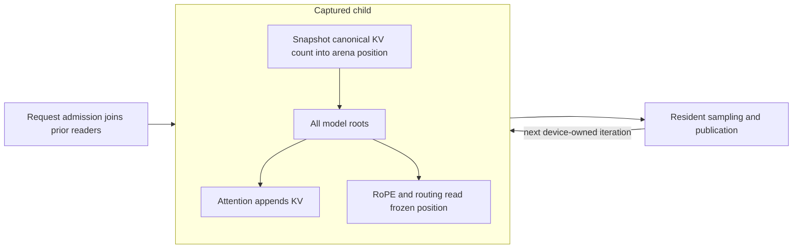

Focused CUDA/ROCm coverage uses a real KV append and twenty
parent-only replays: no host engine invocation between replays may refresh the
position. Both complete graph-cache integration groups pass in 4.46 seconds;
the three complete affected Unit groups (graph identity, engine, and allocation
source policy) pass in 3.03 seconds. Build and focused logs are
`/tmp/planning-captured-decode-position-{build-retry,gpu,unit}-20260916.log`.
The first compilation found only a new-test helper value/pointer typo, corrected
before the green rebuild. No native CUDA/HIP kernel arithmetic changed.
The complete fresh gate passed **657/657 Unit groups in 77.58 seconds** and
**225/225 production-preflight groups in 818.12 seconds** at
`parity-results/planning-captured-decode-position-prerequisites-20260916`.
Build/preparation plus both suites took 1249.296 seconds. Its process exited
zero. The passed `...-03` gate covers the preceding binaries, not this change.
The next input-binding regression below is newer than this baseline.

### Resident input capture identity (focused proof green)

The ordinary-loop audit found a second concrete capture dependency: the forward
signature retained only `uses_device_token_ids` and `uses_device_position_ids`.
Two different device buffers with the same geometry therefore selected the
same graph, although embedding/RoPE native nodes embed their original addresses.
The new device-free regression fails on the second token owner. The real
CUDA and ROCm retained-RoPE regressions both fail on the second position owner:
the cache contains one child where two are required. Logs are
`/tmp/planning-resident-input-identity-{red,gpu-red}-20260916.log`.

The implementation replaces those flags with exact borrowed input addresses,
including equality/hash and presence queries derived from the pointers.
Distinct owners retain distinct children; changing device values behind one
address remains replay data and must not recapture. The native regression
poisons the inactive position bank and alternates twenty reset/replay requests,
checking exact output equality and stable child identities. It joins the
existing CUDA/ROCm graph-cache preflight groups. No kernel arithmetic, formats,
activation precision, or production device memory allocations change.

The matching real-embedding regression now retains two token-owner children,
poisons the inactive bank, and performs twenty parent-only launches across
resets on each backend. No engine call or dynamic-parameter prelude occurs
between launches. Every output element matches an independent, exactly
representable CPU embedding-plus-residual oracle. This covers both address
identity and live-content reuse through the production embedding stage, not
only a mocked cache count. Fixture-owned weights outlive all native graphs.

The four complete affected Unit groups and both complete CUDA/ROCm graph-cache
groups pass **6/6 in 4.58 seconds**. Their build/process exits are zero. Evidence:
`/tmp/planning-resident-input-identity-complete-focused-20260916.log` and
`/tmp/planning-resident-input-identity-embedding-build-retry-20260916.log`.
The first added embedding-test build used a nonexistent test BufferId spelling;
it was corrected to the existing `MTP_CONDITION_TOKEN` before verification.
No product workaround or gate relaxation was needed. The new tests belong to
the existing production-preflight groups. The full gate above certifies the
preceding position-root slice, not this newer identity change; refresh the
canonical full receipt before the next model/image admission.

### Once-only generation initialization (focused proof green)

`DeviceControlledLoopProgram` now names initialization separately from the
repeated transaction. Both fixed/ordinary WHILE and dynamic-selector builders
use one lowering helper. The captured order is:

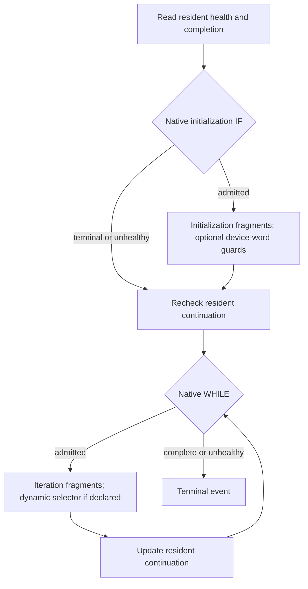

Empty initialization keeps the original MTP graph shape. Initialization can
finish a budget-one/EOS request without entering the model loop. CUDA requires
separate handles for its IF and WHILE nodes; the helper retargets the entry
predicate before instantiation and leaves loop predicates attached to WHILE.
Both predicates read the same request authority. No host state, extra per-token
predicate, kernel arithmetic, activation/weight format or request-memory bank
is introduced.

Existing ordinary executor and real greedy/stochastic sampling regressions now
exercise this ordering. The native selector regression additionally covers
depths 1–15, initialization-completed requests, poisoned terminal replay and
unhealthy entry across twenty resets. Unit construction tests reject incomplete,
self-referencing and selector-controlled initialization before native mutation.
All remain in the existing Unit/production-preflight registrations. The final
build and diagnostic-review relink exited zero. All **ten complete affected
groups plus the setup fixture pass (11/11) in 81.62 seconds**: three Unit
groups, both backend sampling/controller groups, the native selector group and
two native NCCL groups. ROCm's broad sampling group skips only the five
CUDA-native conditional-node cases; no required ROCm execution proof is skipped.
Evidence is `/tmp/planning-generation-initialization-focused-20260916.log`,
`/tmp/planning-generation-initialization-final-build-20260916.log` and
`/tmp/planning-generation-initialization-review-build-20260916.log`.
The first build preceded the CUDA single-handle-per-node correction and was
not treated as verified; the real device runs use the corrected final binaries.
This is compiler/lifecycle evidence, not public whole-model ordinary generation
or a fresh complete Unit/preflight receipt. Refresh that receipt before model
or image admission after the next coherent runtime slice.

### Ordinary history and penalty closure (focused proof green)

Ordinary response publication now validates and advances the request-owned
generated-token histogram in the same kernel as its response and logical
frontier. Negative/out-of-range tokens and negative/overflowed counts fail
before committing any output. EOS counts once, terminal replay is absorbing,
and forward-only consumption does not read or modify history. Independent
requests retain exclusive histogram rows; no atomics, additional publication
kernel, transfer or parallel memory ledger is introduced.

The sampling stage consumes that history for both seeded and greedy sampling.
The shared fused greedy reducer previously required verifier-only branch and
active-width inputs. `GenerationPenaltyHistory` now has checked `committed`
and `speculative` constructors, consumed by one backend interface. Ordinary
sampling compiles out branch reads; verifier mode still requires its resident
active width in both passes. MTP callers use the same strict speculative
contract, not a weakened null-pointer convention. Greedy history remains a
two-pass argmax; stochastic sampling uses the existing in-place penalty kernel
on freshly produced logits before its distribution kernel.

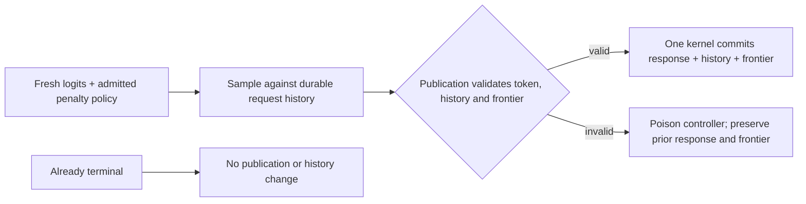

The complete ten affected Unit/CUDA/ROCm/NCCL groups plus their setup fixture
pass **11/11 in 147.07 seconds**. The focused groups include twenty resets for
corrupt seed/history/token data, both penalty signs, per-request EOS, padded
histograms and exact greedy values/token IDs through a 152,064-token vocabulary.
The retained seeded sampler also matches its serial oracle across all existing
top-k boundary cases. Existing speculative-history regressions remain green.
Five CUDA-native conditional cases remain intentionally inapplicable to HIP;
the required HIP sampling and controller cases all execute. Evidence is
`/tmp/planning-ordinary-history-focused-20260916.log`; final build evidence is
`/tmp/planning-ordinary-history-final-build-20260916.log`.

Isolated CUDA publication profiling reports **30 registers/thread and zero
spills**, versus 32 registers and zero spills before history publication. ROCm
gfx906 ISA reports 24 VGPRs/44 SGPRs for publication and 12 VGPRs/35 SGPRs for
committed-history argmax, with zero private scratch or register spills. These
are optimized Integration resource checks, not a Release model throughput
claim. Local evidence is `/tmp/llaminar-generation-history-profile.Wg1L94/`.
The exact 152,064-column positive-penalty argmax has 128 blocks of 256 threads.
CUDA reports 40 registers/thread, 100% theoretical occupancy, zero spilling
requests and 219.53 GB/s under Nsight instrumentation. The corresponding
single-dispatch ROCm counter record is index 207: 512 wavefronts, 93.55% VALU
lane utilization, zero LDS bank conflicts and zero scratch. Its timing-trace
duration is 7.68 microseconds; the separately instrumented counter duration is
not used as a timing sample. These counters are scoped to that exact kernel,
not blended with fixture downloads, policy configuration or final reduction.
The complete Unit/preflight receipt still needs refreshing for this slice.

This closes a sampling component, not the public ordinary-generation path.
The subsequent admission/reset slice below connects seed and history/policy
storage; the real forward still needs to consume the sampling stage.

### Request seed admission and reset (focused proof green)

`GenerationRequestSeeds` owns validated, resolved per-request metadata in the
immutable admission contract. The arena now registers `SAMPLING_REQUEST_SEEDS`
as contiguous UINT64 payloads in its existing INT32 storage type. The shared
`GenerationRequestSeedGeometry` supplies exact registration/BOM geometry;
ordinary rank and ExpertOverlay planning both carry retained request capacity
to `PhysicalMemoryAuthority`. No anonymous reserve or secondary ledger is used.

Admission uploads once through `TransferEngine` on the exact admission stream,
then publishes through the arena. TransferEngine protects the tensor-owned host
source until DMA finishes, even after the caller destroys its request vector.
Seeds are data behind stable pointers, not capture identity. Construction and
request reset share `zeroAndPublishGenerationSamplingInputsOnStream`, clearing
both full-width history and seeds. Narrower or seedless requests cannot inherit
inactive random streams. Stop/penalty publication and history initialization
also work with MTP disabled; the earlier MTP-only guards are removed.

The real CUDA/ROCm sampler regression records one graph and replays twenty
request resets with changing widths, high-bit seeds, seedless admission and
malformed geometry. Outputs match the scalar seed/position oracle exactly;
inactive seeds produce invalid samples, and construction/reset publish zeros.
It is in the existing model-free production-preflight state-ownership groups.
The complete four affected Unit groups and three CPU/CUDA/ROCm integration
groups pass **7/7 in 3.80 seconds**. Logs are
`/tmp/generation-seed-final-build.log` and
`/tmp/generation-seed-final-focused.log`; all processes exited zero. The first
test build used a protected tensor byte accessor, corrected before these runs.
No kernel arithmetic changed and no public model/image certificate is claimed.

### Typed initial frontier (focused proof green)

The former sampled-only backend initializer is replaced, not supplemented, by
`GenerationLogicalStateInitialization`. Its source is explicitly either
`UnsampledLogits` or `SampledCondition`. Both initialize the same seven existing
logical rows; an unsampled frontier deliberately has no condition token.
Malformed bindings fail before enqueue and negative device positions/sample IDs
publish an unhealthy frontier. CUDA and ROCm use the same row arithmetic, with
enough blocks to cover the entire admitted batch.

Ordinary pending-response admission now snapshots canonical device KV counts
through this contract and publishes through the existing exclusive-writer/event
lifecycle. It does not download positions, fake a sampled token, or execute a
dummy forward. `IKVCache` does not promise adjacent request counters, so admission
resolves each request's canonical address instead of inventing a cross-row stride.
The existing sampled MTP callers use the same checked API.

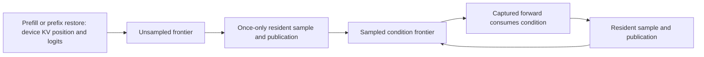

Focused tests cover both kinds, malformed input, aliased position input, guarded
row boundaries and twenty captured resets at request counts 1, 4, 33, 65 and 129
on CUDA/ROCm. The real DGO admission/reset test additionally checks that an empty
ordinary request publishes position zero, condition -1 and healthy status.
The first focused admission run caught an incorrect caller role: observing the
completed inference frontier belongs to `DeviceGenerationController`, not
`RequestAdmissionTransfer`. Correcting that caller preserved the role manifest.
It then exposed predictor-dependent event setup. The renamed common generation
event initializer now prepares logical-state publication/reader events for every
GPU algorithm, before its speculative-only resource branch. Request admission
does not allocate events. The reset regression checks stable event identity.

The final build exited zero. The complete two affected Unit groups and three
CPU/CUDA/ROCm admission/reset integration groups pass **5/5 in 3.58 seconds**.
Both complete GPU sampling groups and their setup fixture pass **3/3 in 71.53
seconds** (ROCm 53.52s, CUDA 17.81s), including the retained speculative paths.
Evidence: `/tmp/generation-frontier-build-event-final.log`,
`/tmp/generation-frontier-admission-event-fixed.log` and
`/tmp/generation-frontier-complete-sampling.log`. The new initializer and
admission regressions are included in existing production-preflight groups.
The event-identity test initially used an owning-pointer accessor on its borrowed
handle; that test-only compile error was corrected before the final build.
Earlier failed logs are not receipts. Refresh the full Unit/preflight receipt
after the next coherent runtime connection, before admitting models.

Resource evidence is `/tmp/llaminar-generation-frontier-profile.dPwvzk/`: the exact CUDA 129-request
unsampled dispatch has five 32-thread blocks, 22 registers/thread and zero
spilling requests. The corresponding ROCm dispatch (index 485) has three waves,
zero scratch/spills and no LDS bank conflicts; compiled ISA uses 7 VGPRs and
36 SGPRs (hardware allocation rounds these up). This small metadata operation
is launch-bound, not a throughput kernel; the profiler's low global occupancy
does not justify extra dummy work. Instrumented durations are not Release
inference benchmarks. No weight/activation arithmetic or format changes occur.

The next production connection remains the retained forward plus sampler
inside the complete generation policy; this prerequisite alone does not certify
public inference or pipeline execution.

### Retained forward plus ordinary sampler (model-free vertical proof green)

`Test__ResidentOrdinaryForwardCommon.inc` now composes production embedding,
residual-add, KV append and sampling through the existing forward engine and
generation compiler. No new controller, event layer or kernel was required.
The table produces exact four-token uniform distributions dependent on its
input token. An independent CPU oracle sorts the support and applies the
canonical seed-to-threshold law; it never reuses device answers as expected
tokens. The next forward consumes the previous device sample directly.

Both greedy and seeded policies run twenty request resets with budgets
1/2/17/384, prior cached lengths 1/7/31, pending-prefill and already-emitted
frontiers, no EOS, first-token EOS and later EOS. Actual prompt forward graphs
populate the KV cache; no test write manufactures cached-token counts. One
native CUDA parent owns initialization plus the complete loop, including an
absorbing terminal replay. HIP uses a retained complete forward-plus-sampler
transaction with the existing authenticated immutable ticket/cursor protocol;
the test does not dispatch individual model stages or inspect response tokens
between transactions. This is protocol evidence, not a new public execution
policy advertisement. The canonical cache advances by exactly the number of
consumed conditions, leaving the final output/EOS token unconsumed. History,
terminal controller accounting and graph identity are checked after completion.

The first test attempt correctly rejected a missing named
`REQUEST_POSITION_IDS` arena binding. The fixture now supplies that ordinary
production binding; no contract was relaxed. Final build exited zero; the
exact CUDA test passed in 1002ms and ROCm in 713ms. Both complete existing
production-preflight graph-cache groups pass **2/2 in 5.64 seconds**. Evidence:
`/tmp/resident-ordinary-forward-build-position.log`,
`/tmp/resident-ordinary-forward-cuda-position.log`,
`/tmp/resident-ordinary-forward-rocm.log`, and
`/tmp/resident-ordinary-forward-complete-graphs.log`.

The fixture is intentionally a small single-request model-free graph, not
whole-model mathematical parity, actual prefix-cache restoration, multi-request
EOS suppression, public HTTP generation, PP execution or an image certificate.
It establishes that the existing primitive composition works. The next change
must wire the public runner, not invent another sampler/controller abstraction
or repeat this component proof as a substitute for implementation.

### Production connection: ordinary prefill to terminal response

The existing DGO now composes its own resident-input forward and ordinary
sampler using the common generation compiler and existing persistent banks.
CUDA records one complete parent; HIP retains one complete forward-plus-sampler
transaction and its authenticated ticket publication. Setup returns the exact
materialized `ForwardGraphSignature` rather than claiming a synthetic executed
forward. The canonical memory BOM includes these graph owners through
`OrdinaryGenerationGraphPlan`; there is no second live accounting ledger.

The complete affected controller/forward/memory/graph/state groups pass **9/9
in 9.22 seconds** (`/tmp/ordinary-generation-runtime-complete-groups.log`).
This includes the new DGO ordinary generation regression on CUDA and ROCm
with greedy/seeded outputs, 1/2/17/384 budgets and twenty resets. These are
model-free component proofs, not public HTTP or PP certificates.

`decodeStep()` now dispatches ordinary GPU requests to that complete policy.
It admits the immutable sampling law and seed, authenticates the terminal
response/state accounting, and retains the already-emitted device condition
for a subsequent budget. CPU execution and speculative policy remain distinct.
The complete affected public prefill/decode Unit group and CPU/CUDA/ROCm
state-ownership integration groups pass **4/4 in 7.86 seconds**
(`/tmp/ordinary-public-complete-groups.log`). The device test drives actual
captured padded prefill, then chains 1/2/17/384 response budgets over twenty
greedy and twenty seeded request resets. It proves exact outputs, canonical
KV counts, device penalty-history continuation, first/later EOS and rejection
after stop. A narrow construction counter also proves that resets, budget
changes, seeds and stop-token changes do not rebuild the parent. Sampling-law
changes retain distinct graph identity. CUDA now predicates its initial sample
on the existing resident leading-row word; HIP retains its immutable-admission
bootstrap and complete transaction tickets. No additional controller or
intermediate model-state readback is introduced.

The injected-device fixture now performs the same serving-family preparation
as production initialization, with genuine padded embedding/KV/terminal-row
stages. The earlier fixture failures were incomplete setup, prefix configuration
and one-row-only geometry, not reasons to relax production contracts. The
no-host-fallback Unit expects capture rejection before any scalar sampling.
The first full prerequisite refresh passed **657/657 Unit groups in 76.57
seconds**, then exposed a stale GPU-context integration expectation: the
planner correctly charged the additional ordinary-generation graph owners,
but that test expected the former MTP-only inventory. The shared CUDA/ROCm
test now consumes `OrdinaryGenerationGraphPlan` as well; both complete context
groups pass **2/2 in 14.99 seconds**
(`/tmp/ordinary-graph-bom-regression-focused.log`). No production memory charge
or limit was reduced. The failed aggregate was stopped and its processes were
retired before rebuilding. The fresh full gate is running at
`parity-results/ordinary-public-generation-prerequisites-20260916-v2`; its
receipt, not the focused passes, is the next model-admission gate.

The second aggregate passed **657/657 Unit groups in 77.86 seconds** and
**224/225 preflight groups in 889.57 seconds**. Its only red was the 30-second
`PlanningMPIExpertSample_ROCm` aggregate: all-format expert publication passed
in 9.414 seconds and the communication service completed in 17.450 seconds;
the later streaming case was cut off by the aggregate deadline. A concurrent
Release rebuild was active, so isolate the original unmodified test without
build contention before attributing this to a lifecycle defect. Do not extend
the watchdog or reuse this failed receipt. The isolated twenty-run gate is
`/tmp/ordinary-public-planning-rocm-stress.log`: **20/20 passed**,
19.48–21.63 seconds each, 411.34 seconds total, with unchanged code and timeout.
This supports the build-contention explanation; it does not manufacture a
successful aggregate receipt or establish a runtime defect was fixed.

The Release executable and all canonical matrix executables now build.
`parity-results/ordinary-public-current-inventory-20260916.json` contains all
510 current cells. Before model admission, the read-only baseline audit found
exactly two configuration deltas across all 175 historical controls: the
prefill segment argument changed from 600 to 512 and `cross_host_e2e` metadata
was added. Prompts and sampler definitions are unchanged. The strict comparison
driver rejects these stale records. The user subsequently approved the
metadata-only revision; the September 17 migration below preserves original
acquisition evidence and token streams without weakening compatibility admission.

Still incomplete: distributed/pipeline ordinary graph composition, overlay
maintenance composition, unsupported sampling policies, full public HTTP token
and prefix/needle evidence, and image certification. The DGO compiler rejects
an incomplete shard/overlay composition explicitly. Do not substitute an eager
or host-token loop, claim these topologies green, or start Docker certification.

The remaining ordinary wiring must be one coherent request path, not another
collection of optional prelude flags. The former ordinary GPU `decodeStep()`
called host-token `forward()`, computed a host penalty map and surfaced each
sampled token. The captured position root alone removed only one dependency.
The same decoded token must feed the next embedding from its persistent device
row; copying it back through `last_token_` does not prove resident generation.

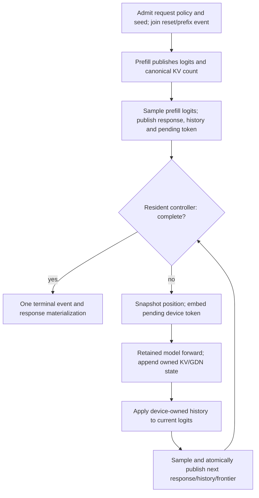

The first sample consumes **no** model-state row. EOS or a one-token budget at
that point must not launch a dummy forward. Each subsequent iteration consumes
exactly one previously returned token, while the last returned token remains
unconsumed. Request reset and prefix restore must preserve that distinction.
Admission must represent unsampled prefill explicitly, not initialize a
fictional valid condition token to satisfy the existing MTP mailbox API.

Reuse the existing arena-owned response, controller, logical-frontier and
sampler banks. Seed registration/admission, stop/penalty publication and complete
history/reset now have focused device proof above. The remaining connection
must bind those admitted inputs into the complete retained generation graph,
including byte-exact seeded draws. Do not fake a speculative outcome to advance
ordinary history or silently discard an admitted sampling/penalty policy.

The focused regression above now covers real embedding, forward/KV append and
sampling producers, pending versus already-returned tokens, budget one, EOS,
reset and seeded draws on CUDA/ROCm. Actual prefix-cache restoration remains a
public-runner obligation. Batched EOS also requires suppressing model state
advancement for stopped rows, not merely ignoring sampled outputs. Exercise the
public production runner before adding pipeline participants. The lower-level
proof does not implement that connection or authorize removing PP guards.

### Next coherent slice: stage-owned pipeline generation

The public scalar connection above is now tested. Pipeline execution must
extend that same request, not recreate it independently on every stage.
`GlobalPPTopology` / `PipelineGraphExecutionPlan` already own ordered stage
identity and physical connections. The terminal vocabulary owner remains the
sole sampler, response-ledger and MTP-depth authority. A preceding stage owns
only its layer state and the received, immutable transaction command.
Its completed row count must agree with the tail's published commit; its
response tokens and verifier statistics must not be fabricated to equal the
tail's result. In particular, the current rank helper's blanket fanout of the
same full-generation admission is not the required PP follower contract.

The first command receive must precede the follower's **first predicate**, not
sit behind it. A retained follower bank can still contain the previous
request's terminal command. Testing that bank before receiving the new command
would retire the follower while the tail waits for its collective. Similarly,
every completed transaction must publish/receive its final command before any
participant leaves its loop. Prove first-token EOS, one-token budgets, changed
request budgets and reversed submission order without host-resetting a shadow
of the tail's decision. The current generic graph initialization is guarded by
the entry predicate; it cannot be relabelled as this unconditional receive.

The native graph API now expresses this as three explicit phases: admitted
local initialization, unconditional collective arrival, then repeated work.
Followers declare no local initializer; their first predicate therefore reads
the newly arrived command. A tail may sample in initialization, but its arrival
still publishes after first-token EOS or a terminal replay. The entry fragment
type deliberately has no condition flag. Fixed and selector-controlled CUDA
parents use one shared lowering function; an empty arrival preserves the old
single-device node count. No host reset, new polling loop, native kernel or
second live controller is introduced. The focused two-device regression is
registered as `V2_Integration_CUDA_PipelineGenerationCommandArrival` in
production preflight. The final build passes
(`/tmp/pipeline-command-arrival-focused-build.log`), the first device run
passes in 4.68 seconds, and the isolated twenty-process stress gate passes
**20/20 in 99.80 seconds** (`/tmp/pipeline-command-arrival-stress.log`). Every
process covers both tail ordinals, ordinary and selector loops, twenty request
resets per combination, stale/unhealthy commands, zero-work entry, first-sample
termination, forward activation delivery and an absorbing terminal replay.
Followers receive only command words; their independent local-work clocks
prove actual execution, not equality with a mirrored tail response ledger.

Both affected Unit groups pass **2/2 in 3.69 seconds**
(`/tmp/pipeline-command-arrival-unit.log`). Existing native NCCL loop replay,
CPU/CUDA/ROCm state ownership, CUDA/ROCm generation controllers and the CUDA
selector group pass **7/7 in 80.97 seconds**
(`/tmp/pipeline-command-arrival-neighbor-gate.log`). This is a focused
model-free gate, not a refreshed full prerequisite receipt or a PP model
certificate. No new real-weight HTTP run, baseline revision, commit/push or
Docker certification has taken place. The next implementation must bind this
protocol to actual PP stage graphs and the tail's sole sampler/response owner;
the existing unsupported-composition guards remain until that is implemented.

#### 2026-09-17: native stage composition is connected to the rank runner

`PipelineDeviceGeneration` now connects actual DGO forward recordings and the
tail sampler through the public rank generation methods. This is no longer
only the command-clock protocol probe. Earlier stages do not receive the full
generation admission, initialize response budgets, or return fabricated response
ledgers. They receive health, completion and the pending token, execute their
own captured layers, and send activations from their persistent hidden bank.
Every local executable is compiled before any is submitted. Terminal validation
compares independently advanced KV positions and returns the tail's response.
The existing ordinary forward compiler is shared rather than copied into PP.

The new `OrdinaryPipelineHasOneTailResponseOwner/CUDA` regression lives in the
existing model-free `PipelineMTPStateOwnership_CUDA` preflight group. It uses
real embedding, KV append and terminal-row kernels in two DGOs and invokes the
rank's actual admission/materialize/launch/finish path. It reverses physical
GPU order, compares exact seeded output for budgets 1/2/17/384, runs twenty
requests per order and asserts that parents survive data resets without
recapture. The fixture first needed its required model metadata, partial-graph
entrypoint and canonical peer-transfer router; those were test setup failures,
not numerical runtime failures. The corrected group passes in 5.17 seconds;
the first fresh-process stress gate passes **20/20 in 95.51 seconds**
(`/tmp/pipeline-stage-generation-stress.log`). CPU and ROCm neighboring groups
pass **2/2 in 5.11 seconds**; the rank/controller Unit groups pass **2/2 in
2.67 seconds**. A final follow-up makes partially failed lifecycle transitions
absorbing and asserts premature/duplicate submission rejection; its rebuild
and recheck are recorded separately rather than inherited from the earlier run.
That final build passes (`/tmp/pipeline-stage-generation-policy-build.log`),
followed by another **20/20 fresh processes in 97.22 seconds**
(`/tmp/pipeline-stage-generation-final-stress.log`) and **4/4 neighboring
Unit/CPU/ROCm groups in 5.02 seconds**
(`/tmp/pipeline-stage-generation-final-neighbors.log`). Whole-model preparation
uses the existing worker-join policy; only individual collective rendezvous
have the canonical timeout. No new whole-model 30-second deadline is imposed.

This slice implements **rank-local native-loop ordinary generation**, not
hosted HIP, heterogeneous/nested-TP, global-rank or speculative PP composition.
It does not certify the full pipeline prefill/restore path or a real model.
The CPU/ROCm neighboring passes prove no regression in their established paths,
not support for the new native PP composition. Full prerequisites are still
unrefreshed; no new HTTP model run, baseline rewrite, commit/push or Docker
certification has taken place. The next slice must extend complete transaction
composition to the remaining execution policies, not resurrect full-controller
fanout for followers. Preserve the requested native HTTP token → full needle →
checkpoint/push → two-ISA image certification order.

```mermaid
stateDiagram-v2
    [*] --> Idle
    Idle --> Admitted: tail policy + local follower event admission
    Admitted --> Materialized: every complete parent prepared
    Materialized --> Submitted: enqueue every participant
    Submitted --> Idle: tail response + independent terminal KV proof
    Idle --> Failed: partial admission failure
    Admitted --> Failed: partial preparation failure
    Materialized --> Failed: partial submission failure
    Submitted --> Failed: invalid terminal publication
    Failed --> [*]: retire failed runner; never retry or switch paths
```

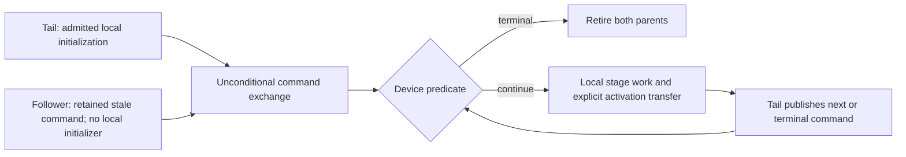

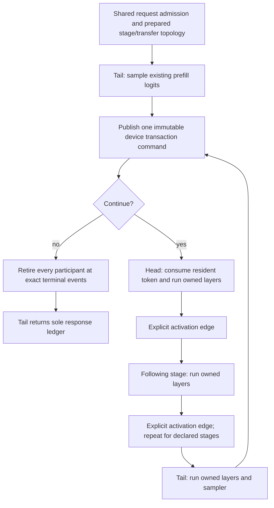

Native same-vendor GPU edges should use the existing exact-stream collective
API, recorded independently by each participant. Each GPU retains its own
complete executable; no parent contains another device's child graph. The
initial command must reach every stage before its first loop predicate, and
the terminal command must be published before the final branch retires. This
avoids both a dummy first forward and a follower waiting for a command after
the tail has already exited. Reuse the existing native loop predicates and
authenticated HIP ticket lifecycle; host tickets select complete transactions,
not individual stages or mutable sampling state.

Heterogeneous and CPU edges require their declared transport boundary.
Same-node mappings remain node-local by canonical physical inventory; remote
edges retain their MPI owner. CPU stages execute their own host graphs and
consume only their actual incoming work. This is not permission for a host
coordinator to mirror GPU tokens/KV or traverse an all-GPU graph stage by stage.
Transport buffers, graph owners and communication workspace must enter the
same PMA BOM used by planning, preflight and runtime before admission.

Progression: prove ordinary two-stage captured GPU execution, then the same
participant protocol with heterogeneous/CPU edges, then grouped MTP with
tail-owned draft/verification decisions and stage-local accepted-state
publication. Add focused model-free protocol/device regressions to preflight.
Finally drive the existing typed pipeline HTTP generation cells (off/dynamic),
then full canonical needle checks. Do not add a frontend-specific topology
list or remove the current unsupported-composition guards before those owners
and event edges exist.

User-directed delivery/update policy: amortize full builds and Unit/preflight
over larger coherent implementation slices; use focused regressions between
them. Once automatic selection with measured costing is green, commit the
completed slice and push to remote `develop`. Do not publish the placeholder
score as the completed auto/costing feature. Both configured remotes currently
name `https://github.com/Llaminar/llaminar.git`; the working branch is `develop`.

### 2026-09-17: complete ROCm pipeline transactions and continuation proof

`PipelineDeviceGeneration` now also composes homogeneous rank-local HIP
pipelines. The simpler graph shape puts command arrival **inside the start of
each complete transaction**. The tail owns the existing sampler and immutable
ticket publisher; each follower has the explicit `HostedPipelineTransaction`
kind and no ticket/response authority. No new executable owner, initialization
graph, terminal-stop graph, controller bank or memory reserve was added.

A fresh request first launches only the tail prefill sampler. Each subsequent
nonterminal ticket submits all follower transactions and the complete tail
transaction before observing the next ticket. An already-emitted continuation
starts with that same complete all-stage transaction instead of sampling the
old logits again. A terminal ticket records follower completion events after
their actual last work; followers do not fabricate controller completion
words. Independent terminal KV counts remain mandatory, including the
zero-forward budget-one case.

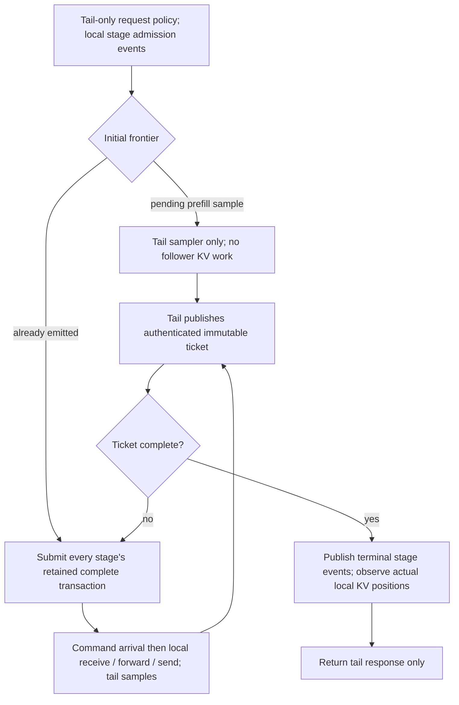

The existing CUDA/ROCm `OrdinaryPipelineHasOneTailResponseOwner` regression now
also continues every request with another 17-token budget without reset. Both
physical device orders, twenty request resets, budgets 1/2/17/384, exact seeded
tokens, independent local KV positions, no recapture, premature launch and
duplicate launch are covered. The first ROCm group passes in **13.13 seconds**
(`/tmp/pipeline-hosted-generation-first.log`). The affected six Unit groups and
CPU integration group pass **7/7 in 2.73 seconds**
(`/tmp/pipeline-hosted-generation-neighbors.log`). The expanded CUDA and ROCm
groups each pass **20/20 fresh processes**, **40/40 in 384.40 seconds** total
(`/tmp/pipeline-hosted-generation-stress.log`). These are new runs of the
continuation-aware test, not inherited native-only evidence. Build evidence
is `/tmp/pipeline-hosted-generation-final-build.log`.

This remains a model-free actual-runner proof, not mathematical real-weight,
public HTTP, prefix-restore or image certification. Heterogeneous, nested-TP,
global-rank and speculative pipeline composition are still unfinished. Full
Unit/preflight receipts remain stale and must be refreshed before model
admission, once the next coherent runtime slice is complete. No baseline token
payload, approved corpus, commit/push or Docker run was changed by this slice.

### 2026-09-17: native prefill ownership closure (focused gates green)

The remaining public prefill path walked stages on the host and moved the
producer's tensor between device authorities. `PipelineForwardGraphEdges` now
provides a frozen graph contributor: native receives fill the consumer's own
arena bank, model roots follow the receive, and sends follow every model leaf.
The stage type is an explicit collective in the shared classifier. The edge
owner is in forward-cache identity; it must be installed before the forward
engine exists. No extra executable or activation arena was added.
Captured-generation decode keeps its existing token/command composition.

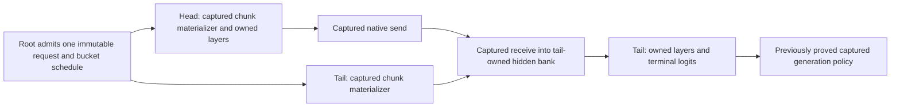

Serving graph families prepare concurrently, with native capture rendezvous at
the same setup boundaries. Runtime participants each consume the complete
schedule, so chunks cannot independently choose their transport width. Real
row counts remain device-owned and padding does not advance KV. The existing
rank API now routes these homogeneous GPU schedules into the captured edges;
heterogeneous/CPU and nested-TP compositions are not silently coerced into this
path.

The pipeline regression now invokes real rank graph-family setup and prefill
instead of manually copying a synthetic row between DGOs. It covers both
physical device orders, 256/512 buckets, 1/17/257/509-token prompts, multi-chunk
padding, exact seeded decode and continuations. A new device-free signature
test rejects cache aliasing across different frozen transport owners. The new
build and focused results below supersede decode-only stress evidence for this
composition. No public HTTP or image proof is claimed.

The initial focused CUDA run exposed a missing setup reservation, not an
inference mismatch: the new communicator had no persistent capture-fence
words. Native pipeline resource setup now reserves exactly one INT32 word per
GPU through the existing physical-memory authority, independently of TP's
unneeded FP16 conversion scratch. The canonical rank BOM and runtime share
that formula. The model-free fixture now admits both stages through one real
ledger; new units cover CUDA/ROCm symmetry and keep nested/CPU ownership
distinct. The live integration checks exactly four collective bytes per GPU
after setup and zero after graph/communicator teardown.

The focused CUDA group passes in 4.76 seconds and ROCm in 13.08 seconds
(`/tmp/pipeline-prefill-fence-{cuda,rocm}.log`). The three affected Unit groups
pass (`/tmp/pipeline-prefill-fence-unit-final.log`), as does the CPU integration
group (`/tmp/pipeline-prefill-fence-cpu.log`). The initial new accounting unit
omitted required compute-unit geometry; correcting that fixture made it pass
without changing runtime admission. Four static policy groups pass, including
explicit streams and hidden allocation checks
(`/tmp/pipeline-prefill-fence-source-policy.log`).

The blocking-sync policy also correctly found the newly added pipeline terminal
event observation. Review confirmed it runs only after the tail has finished,
with every participant's small terminal copies already submitted. The exact
one-site `PipelineDeviceGeneration::finish` boundary now belongs to the existing
`host_result` category; its new self-test rejects an extra site or a wait in
`launch`/`prefill`. All four synchronization/publication policy groups pass
(`/tmp/pipeline-prefill-fence-ordering-policy-final.log`). This does not permit
per-token, per-stage or stream/device synchronization.

The expanded group passes **20/20 fresh CUDA processes and 20/20 fresh ROCm
processes**, **358.83 seconds** total
(`/tmp/pipeline-prefill-fence-stress.log`). Both physical device orders and
twenty request resets execute inside every process. Final build evidence is
`/tmp/pipeline-prefill-fence-final-build.log`, with the corrected unit fixture
rebuilt in `/tmp/pipeline-prefill-fence-unit-rebuild.log`. All **11 focused Unit
groups plus the CPU integration group** pass. This includes the memory/graph
identity/rank groups and the eight source-policy groups; it is not the complete
Unit gate. Full prerequisites and Release remain stale. Next close pipeline
prefix restoration and the remaining composed generation policies, then refresh
the complete gates once before the requested HTTP token/needle runs. No model
admission, token baseline revision, commit/push, or Docker certification was
performed in this slice.

### 2026-09-17: ordinary pipeline prefix restoration (two-stage focused gate green)

The actual rank API now has focused fresh/full/partial RAM-cache proof over
257/509-token prompts, bucket boundaries, both physical device orders, seeded
generation and continued responses. A full hit restores the terminal state
without re-prefill. A partial hit submits only the unprocessed suffix with an
absolute schedule offset. The first CUDA attempt correctly rejected a fixture
that passed the whole prompt with a suffix-sized schedule; the test call and
API documentation were corrected, without changing runtime semantics.

Before each restore the fixture prefills unrelated tokens, then resets and
imports without an intervening diagnostic synchronization. This matters because
reset retires cache positions but need not erase physical KV bytes. Without
overwriting those bytes, an omitted import could appear correct. After both
generation segments finish, independent FP16 K/V expectations verify every
prompt element on every stage. Token checks alone are insufficient for this
small graph because its logits do not depend on old KV contents. Neither the
payload inspection nor its terminal wait occurs before inference.

The adversarial two-stage group passes **20/20 CUDA and 20/20 ROCm fresh
processes**, **368.63 seconds** total
(`/tmp/pipeline-prefix-adversarial-stress.log`). Initial focused runs were
4.75/13.37 seconds respectively
(`/tmp/pipeline-prefix-adversarial-first.log`); build evidence is
`/tmp/pipeline-prefix-adversarial-build.log`. All eleven neighboring Unit
groups pass in 11.11 seconds (`/tmp/pipeline-prefix-neighbor-units.log`), and
the CPU state group passes in 0.70 seconds (`/tmp/pipeline-prefix-cpu.log`).
These runs precede the three/four-stage fixture extension below and must not
be presented as proof of those additional topologies. The extension targets
receive-plus-send middle stages and idle native capture participants, which
two-stage tests cannot exercise. Full prerequisite receipts, Release/public
HTTP checks and image certification remain outstanding; no baseline or
publication was changed.

The extended middle-stage fixture passes CUDA (two stages) and ROCm (two,
three and four stages), both physical orders, in **35.35 seconds**
(`/tmp/pipeline-middle-prefix-first.log`). ROCm then passes **20/20 fresh
processes in 649.80 seconds**, including every three/four-stage topology in
each process (`/tmp/pipeline-middle-prefix-stress.log`). The corresponding
build is `/tmp/pipeline-middle-prefix-build.log`. This closes the tested
ordinary homogeneous middle-stage composition, not grouped MTP or mixed
device types.

The next public-evidence check reproduced a missing replay-observation bug in
both the standalone public request path and pipeline stages: the counter was
zero where a continuation actually executed 17 forwards
(`/tmp/pipeline-generation-evidence-red.log`, build
`/tmp/pipeline-generation-evidence-red-build.log`). The compiled parent executes
its children without returning through the engine's per-forward host replay
observer. The fix adds a constant-time exact-source completion observer to that
same engine. DGO supplies its authenticated terminal model-row count; pipeline
followers publish only after their own KV frontiers are validated. It counts
actual forwards, not sampler transactions: the first prefill sample contributes
zero. No host replay, extra device observation, model-stage walk or validator
relaxation is added. New units reject foreign/missing child identities and
negative counts. The completed fix passes the forward-engine Unit group and
all three CPU/CUDA/ROCm pipeline groups, **4/4 in 39.30 seconds**
(`/tmp/pipeline-generation-evidence-focused.log`; final build
`/tmp/pipeline-generation-evidence-final-build.log`). CUDA takes 5.31 seconds,
the expanded ROCm group 33.22 seconds, and CPU 0.58 seconds. The existing HTTP
graph-policy unit suite passes unchanged, **128 tests in 0.329 seconds**
(`/tmp/pipeline-generation-http-policy-unit.log`). The 20-process stress proof
above precedes this passive reporting change; the post-fix focused groups still
exercise twenty request resets and exact forward-count deltas in each topology.

The complete canonical Unit/preflight refresh passed at
`parity-results/pipeline-native-prefix-prerequisites-20260917`: **657/657 Unit
groups in 76.94 seconds and 226/226 production-preflight groups in 892.99
seconds**. The 875-step prerequisite rebuild and both suites completed in
1351.707 seconds; the driver exited zero. Its log is
`/tmp/pipeline-native-prefix-prerequisites-20260917.log` and the reusable receipt
is `prerequisites.json` in that result directory. No competing Release build
ran during these gates. The previously contention-sensitive ROCm MPI planning
sample passed in 21.22 seconds. The subsequent Release rebuild also completed
with exit zero, logged at `/tmp/pipeline-native-prefix-release-20260917.log`;
the rebuilt public `serve --help` entrypoint exits zero. The canonical receipt
validator independently accepts reuse of the unchanged Integration build and
all 883 test groups.

No model, HTTP server, baseline/corpus approval, commit/push or Docker
certification has been performed in this slice. Canonical ordinary local-PP
HTTP generation cells exist on CPU, CUDA and ROCm. Their saved September 12
controls retain the prior 600-row overlay-prefill setting and omit the now
explicit empty cross-host eligibility field; strict control admission rejects
that metadata mismatch before server launch. The exact three-backend 4B
comparison selection confirms this in
`/tmp/pipeline-native-prefix-http-admission-20260917.log`: it exits one during
control admission, before creating a result directory or admitting a model.
This is not an inference/token failure. The user-approved metadata-only migration
is now complete (see below), preserving original observations and every prompt,
seed and expected token. It is neither fresh inference evidence nor corpus
approval. These local-PP definitions also have no needle-certification
tags yet; add eligibility through the typed definitions, not a runner-side list.

### Captured pipeline MTP publication audit (composition still incomplete)

Ordinary pipeline followers consume one token and append one KV row; their
three-word command is sufficient for that protocol. It is **not** a grouped
verifier protocol. MTP followers execute speculative main-model rows, but have
neither a vocabulary reducer nor a shifted predictor. They need the tail's
budget-clipped accepted-state decision before they can reuse their KV/recurrent
state. Do not mirror a sampler or infer acceptance from local cache length.

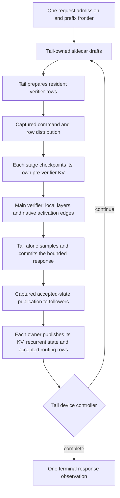

The audit found that setting the old `generation_controller_owned` flag false
did **not** create a follower: scalar validation/execution still required local
penalty history, and the independent-outcome branch derived metadata again.
That boolean is now replaced by explicit `Unbound`, `CompactOutcome`,
`BoundedGeneration` and `PipelineFollower` authorities in
`MTPSpeculativeStatePublicationStage`. The follower consumes committed metadata
and publishes only its local main KV, recurrent and accepted routing state.
It rejects sampler/response, sidecar and penalty-history bindings before any
mutation. The existing outcome and bounded-response paths retain their original
backend calls. Authority is part of exact capture identity; followers do not
declare fictitious sampler arena buffers.

Both GPU backends reproduced the missing-publication failure before the fix:
`/tmp/pipeline-mtp-follower-red-cuda-20260917.log` and the matching `rocm` log.
After the fix, the complete CPU/CUDA/ROCm pipeline groups plus affected
capture/workspace/source-policy units pass **6/6 in 36.58 seconds**, recorded in
`/tmp/pipeline-mtp-follower-focused-final-20260917.log`. The focused captured
follower test then passes **20/20 fresh processes on each GPU backend**; logs
are `/tmp/pipeline-mtp-follower-{cuda,rocm}-stress-20260917-{1..20}.log`.
Each process covers twenty resets per width 2/3/4/16, zero/partial/full
acceptance, unhealthy publication, and three independently checkpointed local
KV layers. This is publication ownership proof, not a whole-model MTP or
cross-device command certificate. The full prerequisite receipt and Release
binary above predate this source change and must be refreshed before model
admission; their historical passes are not current-build passes.

`MTPVerifierPreparationStage` already owns captured pre-mutation KV checkpoints
and persistent token/position rows. Earlier stages must checkpoint their own
cache, not borrow a tail checkpoint whose layer layout differs. The tail's
retained sidecar/verifier width policy remains the sole depth authority;
followers cannot run independent adaptive-depth controllers. Native CUDA
participants retain complete parents. HIP participants retain complete local
transactions; the existing authenticated tail ticket selects submission, and
all follower transactions are submitted before observing the next ticket.
The protocol must include initial condition/prefix entry and final retirement,
not only steady-state verifier iterations.

The explicit graph-edge contributor is now `PipelineForwardGraphEdges`, shared
by captured prefill and `GroupedMTPVerifier` invocations. Its engine integration
selects by the existing role, retains exact cache identity, and validates decode
phase/resident rows/local bank before graph mutation. The verifier never borrows
a prefill materializer. The predecessor type/path is retired, not kept as a
second implementation. Ordinary decode still owns its edges in the parent.

The initial device-free regression rejected a correctly declared verifier with
the old prefill-only contributor (`/tmp/pipeline-verifier-edges-red-20260917.log`).
After consolidation, topology units cover every width 2 through 16 and every
head/middle/tail role on both GPU kinds, including multi-root/multi-leaf ordering
and invalid-binding rejection before graph mutation. The new real native-edge
fixture passes individually on CUDA in 1.982 seconds and ROCm in 6.134 seconds
(`/tmp/pipeline-verifier-edges-{cuda,rocm}-fixed-20260917.log`). It reverses two
physical GPUs, captures widths 2/3/4/16 and replays each twenty times, checking
the selected row and every transferred/untouched guard element. These timings
are test runtime, not inference benchmarks. The first fixture attempts failed
because the direct stage fixture omitted executor-owned stream binding, then
used the unsupported FP32 mutation accessor on its INT32 setup tensor. Both
are corrected test setup defects, not evidence of a model numerical failure;
the first broad focused attempt is preserved as failed/cancelled at
`/tmp/pipeline-verifier-edges-focused-20260917.log`. The original ownership
regression above remains the intended pre-fix red.

The expanded focused gate subsequently passes **7/7 groups in 39.46 seconds**
(`/tmp/pipeline-verifier-edges-focused-final-20260917.log`): ForwardGraphTypes,
capture/workspace/source-policy units and the complete CPU/CUDA/ROCm pipeline
groups. The new native-edge test also passes **20/20 fresh processes per GPU
backend**, preserving each log at
`/tmp/pipeline-verifier-edges-{cuda,rocm}-stress-20260917-{1..20}.log`.
The final fixture-only rebuild is
`/tmp/pipeline-verifier-edges-fixture-typed-build-20260917.log`; the production
contributor/engine rebuild is `pipeline-verifier-edges-fixed-build-20260917.log`
in the same directory. The old full prerequisite receipt remains historical,
not reusable after these implementation changes.

After rebuilding their current binaries, neighboring production-preflight
regressions for stochastic verification ownership, replicated sidecar KV
publication, scalar commit ownership and condition-graph identity pass **4/4
in 3.12 seconds** (`/tmp/pipeline-mtp-neighbor-gate-20260917.log`; build log
`/tmp/pipeline-mtp-neighbor-gate-build-20260917.log`). These are four additional
focused groups, not a new complete Unit/preflight receipt.

The remaining composed-program work is explicit:

1. Install the follower's checkpoint-only preparation role into retained DGO
   program composition. The stage operation is now implemented and tested;
   tail preparation still owns token, position, valid-width and depth decisions,
   and explicit transport must publish those resident rows.
2. Compose scalar condition and grouped-verifier branches with exact native
   activation edges. Neither a scalar condition nor a prefix-entry bridge may
   silently acquire the grouped-verifier role or execute a host stage walk.
3. Broadcast accepted metadata from the tail's existing typed pointer bindings
   before local publication. Those four fields are not assumed contiguous.
4. Attach those operations to complete CUDA parents and complete HIP
   ticket-selected transactions, including initial/prefix entry, clipping/EOS,
   continuation and terminal retirement. Followers own no sampler, response,
   predictor or adaptive-depth decision.

The preparation-stage regression reproduced on both backends before its fix
(`/tmp/pipeline-mtp-preparation-red-{cuda,rocm}-20260917.log`): valid local
checkpoints were rejected for lacking owner token rows. Explicit
`VerifierInputOwner`/`PipelineFollower` roles now share one captured checkpoint
helper. All contradictory follower fields are rejected before touching a
poisoned checkpoint; physical-geometry overflow is rejected before multiplying.
The existing owner proof covers every M=2..16 and is now a focused preflight
registration on both backends. The complete pipeline groups, these owner tests
and three affected Unit groups pass **8/8 in 41.65 seconds**
(`/tmp/pipeline-mtp-preparation-focused-20260917.log`). This receipt is focused,
not a refresh of the complete prerequisite gate.

The next graph-edge consolidation also handles explicit scalar `MTPCondition`
rows in the same native contributor, including terminal-only prefix-bridge
binding validation. Its topology units and native transport fixture now cover
one-row conditions alongside grouped verification, without a new activation
allocation or transport. Full speculative parent/ticket composition and
real-model certification remain outstanding; these primitives alone do not
make the pipeline MTP feature green.

The combined checkpoint/condition-edge gate then passes **9/9 in 42.10 seconds**
(`/tmp/pipeline-mtp-preparation-condition-focused-20260917.log`). Both changed
GPU paths pass **20/20 fresh processes per backend** together; each process
includes twenty internal reset/replays per physical width and reversed native
GPU order for transport. Logs are
`/tmp/pipeline-mtp-preparation-condition-{cuda,rocm}-stress-20260917-{1..20}.log`.
All build/test processes were joined. The final semantic build logs are
`/tmp/pipeline-mtp-preparation-fixed-build-20260917.log` and
`/tmp/pipeline-mtp-condition-edges-build-20260917.log`; preflight registration
was regenerated by `pipeline-mtp-preparation-registration-build-20260917.log`
in the same directory. Later header edits add Doxygen only.

No public HTTP request, baseline migration, corpus approval, commit/push or
Docker certification is claimed by these model-free component gates.

The next native graph consolidation adds tail-owned token/position/width
broadcasts inside each condition/verifier graph and puts the follower's real
checkpoint stage immediately after arrival. Tests use independent banks with
guard words, a real device-length row selector, unequal local cache frontiers,
two/three participants and reversed physical GPU order. CUDA and ROCm each
pass **20/20 fresh processes** for the combined transport/publication proof
(`/tmp/pipeline-mtp-rows-bindings-{cuda,rocm}-stress-20260917-{1..20}.log`).
The complete focused gate passes **9/9 in 47.76 seconds** at
`/tmp/pipeline-mtp-rows-bindings-focused-20260917.log`.

The DGO binding audit then reproduces two further ownership errors: nonterminal
stages requested vocabulary/shifted-predictor output bindings, and their input
prelude expected a local token producer instead of the graph-owned receive.
Output binding now leaves those tail-only owners absent. One shared read-only
follower-input validator checks exact local banks, cache, physical geometry,
stream/device and frozen collective ownership; it rejects a competing local
token/outcome producer. Graph construction uses the same geometry validator,
including exact local checkpoint/cache identity. The prelude creates no
device values, flags, event families or additional preparation graph.

The input regression is preserved red at
`/tmp/pipeline-mtp-input-authority-red-20260917.log` and green on both GPUs at
`/tmp/pipeline-mtp-input-authority-fixed-20260917.log` (2/2 in 8.19 seconds).
All nine affected Unit and complete CPU/CUDA/ROCm preflight groups pass again
at `/tmp/pipeline-mtp-input-authority-focused-20260917.log`; the build is
`/tmp/pipeline-mtp-input-authority-fixed-build-20260917.log`.
Integration of accepted-metadata transport into the DGO publication lifecycle,
native conditional/ticket composition and real-model MTP certification remain
outstanding. The old complete prerequisite
receipt and Release binary still require a refresh before model admission.

The requested checkpoint order remains: finish pipeline generation, refresh
prerequisites once, pass native public HTTP token cases across CPU/CUDA/ROCm,
pass full needle/long-context checks, commit/push the green native checkpoint,
then begin full Docker certification. The saved-control metadata revision is
complete; expected token bytes have not changed.

### Approved control metadata revision — September 17

The migration audit and apply receipts are
`/tmp/pipeline-controls-metadata-{audit,apply}-20260917.log`. New diagnostic
controls live in `parity-results/native-journal-controls-metadata-20260917/`;
the new **unapproved** data-repository generation is
`corpora/generation_regression/avx512/native-20260917-metadata/`.
Only the default overlay prefill segment (600 to 512, preserving explicit
tiny-segment overrides) and canonical cross-host eligibility metadata changed.
The remote eligibility entries remain declarations, not fresh Azure evidence.
All 175 original observation files and the previous corpus generation are
byte-identical; all 700 saved requests/responses and token traces are unchanged.
Historical acquisition timings and summaries remain historical.

The strict existing control consumer admits all **242 routine cells** against
the revised 510-cell inventory, recorded in
`/tmp/pipeline-controls-metadata-admission-20260917.log`. This is a read-only
admission audit, not 242 inference passes. The approval catalog remains unchanged;
neither migration nor admission authorizes an image certificate. No corpus
commit, source checkpoint or push has been made in this slice.

### Captured acceptance transport — September 17

The next missing lifecycle edge was explicit tail-to-follower acceptance
publication. The initial frozen `PipelineForwardGraphEdges` implementation constructed
the joint DAG through `buildPublicationGraph`, reusing the row-broadcast stage's
fixed metadata transport. There is no new host transaction phase, live-state
mirror, scratch allocation, kernel, or acceptance calculation on followers.

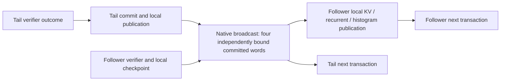

The builder validates existing stage ownership before adding collective nodes,
requires the forward's exact follower checkpoint, and rejects missing or aliased
metadata banks. Device-free tests cover head/middle/tail and widths 2 through
16. The new CUDA/ROCm preflight test records actual tail derivation, native
transport and follower restoration together, then checks zero/partial/full and
clipped publication, unhealthy outcomes, guards, both device orders and twenty
replays. The focused native test passes on CUDA (2.924 seconds) and ROCm
(13.611 seconds), logged at `/tmp/pipeline-mtp-accepted-edges-native-20260917.log`.
The additional nineteen fresh-process passes per backend make **20/20 CUDA and
20/20 ROCm**, with no failures, recorded at
`/tmp/pipeline-mtp-accepted-edges-stress-20260917.log`. CUDA uses two real devices;
ROCm also exercises a three-device pipeline. The complete `ForwardGraphTypes`
Unit group passes at `/tmp/pipeline-mtp-accepted-edges-unit-20260917.log`.
The final focused build is `/tmp/pipeline-mtp-accepted-edges-fixed-build-20260917.log`;
the first build's test-only worker-pool API typo was corrected before any device
test. These are publication-transaction proofs, not full MTP or HTTP evidence.

The unchanged final build also passes **11/11 complete affected groups** in
121.60 seconds at `/tmp/pipeline-mtp-accepted-edges-focused-20260917.log`:
the CPU/CUDA/ROCm pipeline groups, both verifier-preparation groups, both
device-generation-controller groups, and the four ForwardGraphTypes,
PrefillGraphCapturability, GpuWorkspaceAllocationPolicy and
MoEForbiddenDependencyScan Unit groups. This targeted gate does not replace the
stale full prerequisite receipt. Refresh the full Unit/preflight once after the
remaining parent integration and before real-model admission, not per cell.

Integration boundaries identified during the stress run:

- Reuse the same resident `ForwardInput` construction for serving-time capture
  and follower replay. Do not route followers through `forwardImpl`'s owner-only
  preparation/outcome pairing, or skip individual booleans until it passes.
- Publication must use the DGO's existing durable logical-state outputs plus
  verifier restore-index storage. Its capture identity includes the frozen
  pipeline transport owner. Install the existing native capture-boundary hook
  and declare collective capture; the current standalone publication executor
  passes `has_collectives=false` and is not yet a pipeline executor.
- Join both the initial speculative transaction and retained CUDA/HIP loop.
  The existing `RankOrchestrator` tail-only verifier delegation is not a valid
  pipeline forward. HIP submits the complete follower transaction before the
  next tail scheduler-ticket observation; CUDA joins the same transaction in
  its conditional parent. Neither path creates a second response controller.

Do not execute the old host stage traversal to make setup succeed. Focused proof must
cover partial acceptance, zero accepted drafts, full acceptance, clipped/EOS
termination, depth changes, prefix entry, independent middle-stage state and
reset/replay before public MTP cells are admitted. This audit grants no new
capability and is not completed MTP evidence.

### Local publication / fixed-wire capture audit — September 17

The DGO publication materializer has been split into terminal-only bindings and
a shared local-state installer in `DeviceGraphOrchestratorMTPPublication.cpp`.
Followers contribute their own checkpoint and durable committed-state banks;
they require no sampler, response buffer or predictor. The focused source-policy
groups passed **5/5** (`/tmp/pipeline-mtp-dgo-publication-source-units-fixed-20260917.log`)
and the complete pipeline groups passed CPU/CUDA/ROCm in **52.38 seconds**
(`/tmp/pipeline-mtp-dgo-publication-native-20260917.log`). Those passes precede
the fixed-wire refinement below, which still needs its new build and tests.

The audit found an asymmetric capture hazard: changing the terminal's commit
limit replaces its local publication identity, while a follower's local identity
stays unchanged. Independently deciding to capture the combined local/collective
DAG could strand the terminal at a rendezvous that the follower skips. There is
no need for another cohort epoch or request-time recapture protocol: the four
wire pointers do not change with verifier width or terminal commit limits.

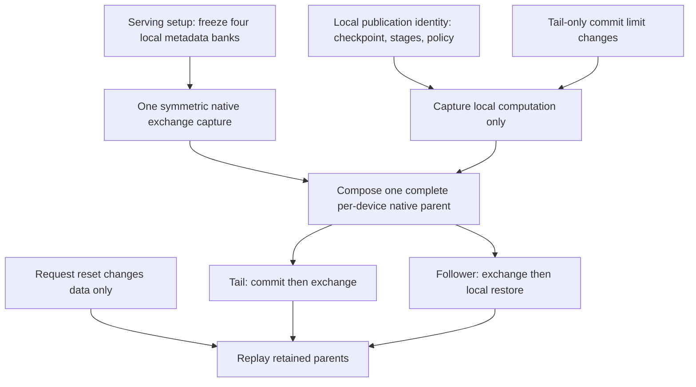

`materializePublicationTransport` retains the exact native exchange under the
frozen pipeline owner. `composePublication` replaces the combined-graph builder;
all submission remains one complete native transaction. The canonical local
publication executor uses the existing retained-parent compiler and event edges.
The canonical graph-cache exporter must return that complete parent, not an
incomplete source child. New unit checks reject stale generations, changed
stage coverage, independently executable children and host-serviced parents.
The native publication regression now enters the real DGO installer/capture
path and verifies unchanged follower and wire identities on tail-only clipping.
The participant, not the longer-lived rank, holds the fixed-wire resource lease.
Real DGO teardown must release it before arena reuse; the frozen topology rejects
attempts to resurrect an expired lease. The first composed-parent device run
correctly rejected an overly strong `DeviceOwnedTimelineTransaction` declaration
on the local source child; that declaration now applies to standalone complete
publication, while pipeline source work enters the mandatory native-parent compiler.
The next run exposed a CUDA compiler restriction: it rejected a complete retained
capture mixed with fragments recorded directly in the new parent. CUDA composition
now distinguishes its own in-place fragments from complete independent imports;
foreign/open fragment views remain invalid. A shared CUDA/HIP regression exercises
retained transfer reuse, ordering and source retirement, while the CUDA conditional
regression adds an independent import without cloning its conditional handles.
Both existing backend graph-capture groups already belong to production preflight.

Fresh fixed-wire verification (September 17):

- The exact production publication/composition test passed **20/20 fresh
  processes on CUDA and 20/20 on ROCm**, covering physical verifier widths
  2/3/4/16, clipped/unclipped commits, both participant orders, two/three
  participants where available, replay and real DGO teardown. Each process
  retains the registered 120-second watchdog. Evidence:
  `/tmp/pipeline-mtp-fixed-wire-native-retry-20260917.log` (run 1) and
  `/tmp/pipeline-mtp-fixed-wire-stress-20260917.log` (runs 2–20).
- The focused native import/conditional ownership tests passed on both vendors:
  `/tmp/pipeline-mtp-native-import-exact-fixed-20260917.log`. An initial fixture
  error used the blocking compatibility copy inside capture; the proof now
  records the existing asynchronous copy primitive.
- All **14 affected complete CTest groups passed in 124.71 seconds**, including
  five Unit groups, CPU/CUDA/ROCm pipeline ownership, both native graph-capture
  groups, and both vendors' verifier-preparation and generation-controller
  groups. Evidence: `/tmp/pipeline-mtp-fixed-wire-focused-20260917.log`.

This is focused model-free evidence. The previous full Unit/preflight receipt
and Release build predate these changes; neither a fresh full gate nor public
HTTP/model/Docker certification is implied by these results.

This remains publication integration, not complete pipeline MTP certification.
Initial verifier/condition fanout and the enclosing CUDA conditional/HIP ticket
parent still need joining before admitting new public pipeline-MTP cells.

### Remaining parent join: one decision owner

The retained MTP parent uses a fixed physical verifier width even when its draft
depth changes. Only the terminal's predictor chain and outcome policy vary.
Followers therefore need one main-verifier/publication transaction, not copies
of the terminal depth selector, sampler, preparation registry or sidecar. The
four acceptance fields above do **not** carry the stop/continue command; that
command belongs to the existing generation-control boundary.

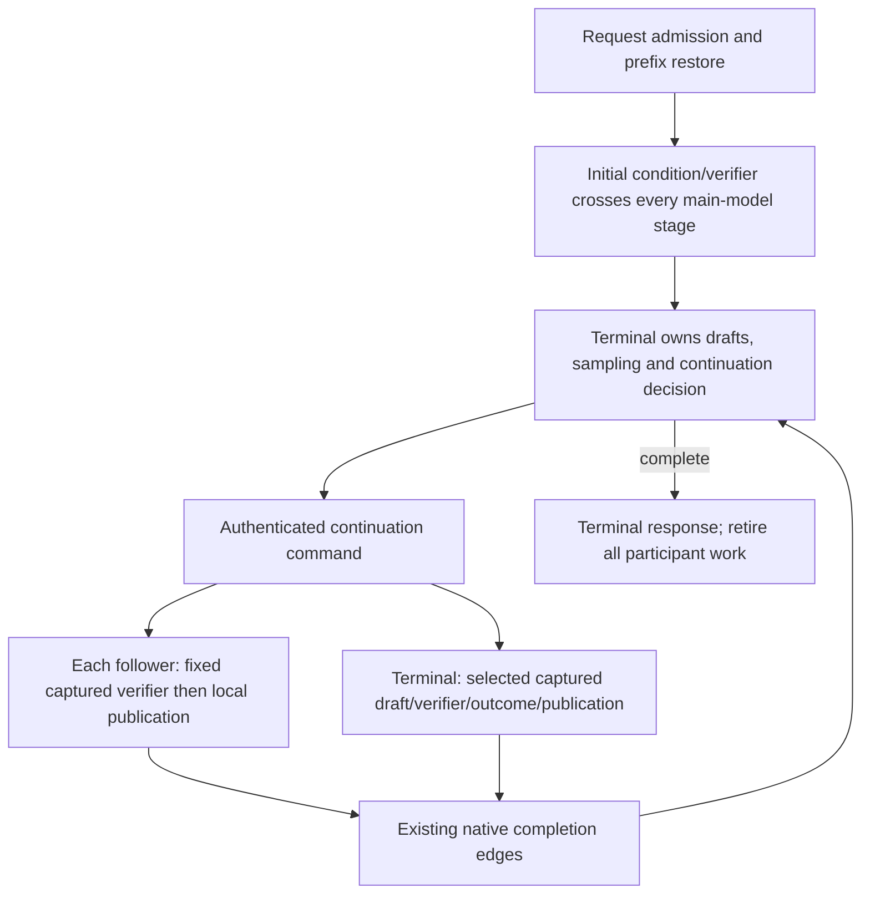

Implementation must reuse the serving-time main-forward builders and the
canonical forward cache. It must not manufacture pending sampler/token plans
to get a follower through `forwardImpl`. CUDA followers use the received command
in their complete native parent; HIP submits each complete follower transaction
before the tail's ticket-selected transaction, then observes the next immutable
ticket. The initial condition/prefix-bridge path must traverse all main layers
too. Tail-only delegation in the legacy rank MTP entrypoints is not sufficient
and must be replaced before claiming the public pipeline lane is supported.

## Selected costing scope (user decision, 2026-09-16)

Use **bounded measured ranking**, not an exhaustive per-operation latency
simulator. The primary observations are applicable kernel GOPS/GFLOPS, sustained
streaming-memory bandwidth, inter-node message latency/bandwidth, and native GPU
interconnect service. Expected prefill and generation token counts remain the
explicit objective. Small primitive samples are acceptable; per-candidate
synthetic model warmups and multi-second calibration inference are not.

Single-device execution has no inter-device communication edge and therefore
zero interconnect cost. Multi-device execution must earn its place through
compute/memory savings greater than its measured communication overhead, not
through device-count or capacity bonuses. At exactly equal estimated request
cost, honor explicit preferences, then prefer fewer compiled compute endpoints
(not fewer MPI ranks), then stable configuration order. Hard strategy/host
constraints still apply. This tie-break is not completion of measured ranking.

The existing `PlanningKernelService` already expresses the intended compute/
memory bound: measured invocation overhead plus the larger of arithmetic work
divided by effective compute rate and serviced bytes divided by measured memory
rate. Compose communication separately according to the real topology/protocol.
Preserve measured source format and worker geometry; a quantized operation rate
must not be advertised as floating-point peak throughput. Predictions and their
approximations must be visible and validated with real Release inference, not
described as completed model benchmarks.

Physical machine/rank membership comes exclusively from canonical inventory.
Measurements cannot turn a remote rank into a local one or replace NCCL/RCCL
with host MPI. Repeated cache-resident projection/expert measurements supply
effective kernel service, **not streaming bandwidth**. Streaming observations
must exceed actual cache coverage, preserve NUMA first-touch placement and keep
allocation, initialization, upload and capture outside their timed interval.

## Current implementation slice: shared bounded request composition

`AutomaticPlanningStartup::preparation()` now installs
`PlanningRequestCostModel::prepare` on every discovery rank. The constant-score
`startupTopologyEvaluator()` has been removed, including its callers; frontend
failure-injection tests own explicitly synthetic decision oracles instead.

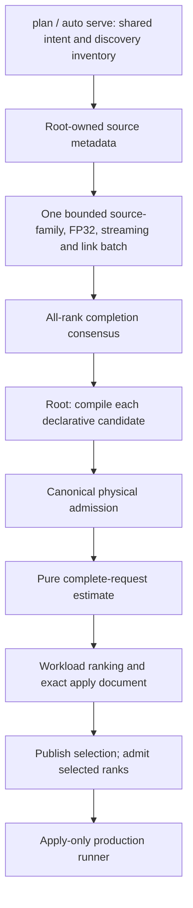

The composer prices ordinary projections, indexed embeddings, terminal head and
sampling, explicit scalar work, live KV/attention/GDN, and admitted expert
shares. It analytically amortizes full prefill chunks, prices the tail, and uses
the mean decode horizon. One endpoint's work adds; independent endpoints join
by maximum; dependent layers/PP boundaries add. Communication is a separate
positive cost except for single-device execution. It assumes neither MTP
acceptance, future movement gain, nor unproved communication overlap.

Physical node identity, sparse logical-root binding and admitted row capacity
come from existing authorities. Node-local mapped primitives remain distinct
from host MPI plus GPU DMA. Native allreduce, non-native collective and PP
volume proxies are explicitly qualified in evidence; they are not presented as
observed production-protocol latency. Uniform routing and mean-context roofline
approximations are equally explicit. No weight or activation format is changed.

The first broader integration run exposed a real candidate-construction defect:
cross-rank MoE TP was still expressed as an implicit one-stage legacy pipeline.
It now uses the existing explicit single-domain overlay authority, preserving
the TP strategy, physical scope and movement intent. CPU two-/three-rank and
CUDA/ROCm default-preparation integration groups price single, TP and overlay
proposals. Pure unit tests cover live-context/tail pricing, missing native
evidence and zero single-device communication across CPU/CUDA/ROCm and
FP32/FP16/BF16/Q8 source fixtures. Ordinary continuation TP joins are no longer
charged a second sparse activation exchange.

Focused evidence: **14/14 CTest groups passed in 42.30 seconds**, including
planner/KV units, two-/three-rank MPI, both GPU collectors and all frontend
selection/failure scenarios. Logs/XML:
`/tmp/planning-request-final-focused-20260916.*`; build:
`/tmp/planning-request-topology-build-20260916.log`. The complete canonical
refresh passed **656/656 Unit groups and 215/215 production-preflight groups**
in `parity-results/planning-request-cost-prerequisites-20260916` (1307.543 seconds
including build; preflight execution 763.57 seconds). This certifies the
request-cost composition baseline, not subsequent migration edits.

This is not a model-throughput, unrestricted search, remote-host execution or
image certificate. Public Release plan/apply/serve validation remains next.

### Required runtime closure, not candidate filtering

The user explicitly requires closing both runtime limitations before claiming
feature completeness. Do not remove MoE PP or floating Dynamic candidates from
automatic search to make a selection appear successful.

Floating Dynamic: inference already supported typed FP16/BF16/FP32 descriptors,
but the transfer directory and pack/unpack readiness still required NativeVNNI.
Both CUDA and ROCm now accept those floating formats through the existing
transaction lifecycle:

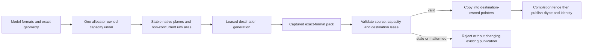

The raw-capacity tag is immutable, unlike the current expert dtype. Packed and
raw views share the larger physical region rather than allocating their sum.
No format conversion, new host controller, or inference synchronization is
introduced. Focused captured CUDA/ROCm tests cover every canonical quantized
format, all three floating precisions, cross-format reuse and stale leases;
they are included in the existing compact-transfer preflight groups.

MoE PP investigation: the current normalizer treats all pipeline participation
as one shared-expert domain, while overlay role lowering clears PP geometry.
Pipeline stages actually own disjoint transformer-layer ranges. Any solution
must preserve that distinction: a stage's same-layer TP participants share an
ExpertOverlay authority; independent stages must not compete to place experts
from one another's layers. Single-participant stages have no rebalance peer.
The existing declarative stage/domain definitions should remain the source of
truth; a second handwritten topology/configuration format is not warranted.
Stage-local authority projection, memory admission, global/local layer identity,
and actual captured runner behavior need a coherent regression before changing
the current fail-closed guard. This part is not implemented yet.
Focused CUDA/ROCm proof covers compact **and collective** packing, a nonzero
payload slot, all 21 quantized codebooks, FP16/BF16/FP32 reuse and a stale lease
after each publication. Both preflight groups passed in 7.83 seconds
(`/tmp/planning-floating-migration-dual-packing-20260916.*`). Unit checks prove
exact max-not-sum alias accounting and immutable floating allocation capacity.
The rebuilt transfer source-policy group passed separately; its earlier
failure was a brittle function marker after adding `__forceinline__`, not a
weakened semantic assertion. These are byte/publication proofs, not a claim of
real-model movement speedup.

Static compiler resource inspection found zero local-memory/stack bytes in
the CUDA transfer kernels. HIP inlining removed private-memory spills from
both pack kernels; unpack still reports scalar-to-VGPR spill pressure despite
zero private-memory bytes. No runtime profiler or throughput certificate has
been collected, so do not describe the whole path as spill-free or tuned.

Stage construction now projects the canonical `RuntimeConfig` for both DGO
and RankOrchestrator, shares the model-owned prepared-weight store across
stages, and creates only the TP context owned by the actual stage runner.
`StageRunnerEntry::localTPContext()` queries that live owner; it no longer
owns a duplicate bookkeeping collective. Regression tests prove policy
preservation, shared prepared-store identity, and null context after runner
retirement. The combined stage/transfer selection passed **4/4 groups in
7.97 seconds** (`/tmp/planning-stage-authority-focused-20260916.*`). Release
and Integration builds completed. The full refresh passed **656/656 Unit
groups and 215/215 production-preflight groups**, 871 total, at
`parity-results/planning-floating-stage-prerequisites-20260916`. Unit execution
took 74.88 seconds, preflight 759.34 seconds, and build plus both gates
1094.261 seconds. Public Release model diagnostics follow this receipt.

### Public Release diagnostics and follow-up (2026-09-16)

The dense Qwen3.5-0.8B Q4_0 diagnostic passed default-auto `plan` with CUDA
constraints, saved an apply document, and served that document on two CUDA
participants. Two identical public HTTP requests returned identical token IDs
(`Paris`); the second restored all 99 prompt tokens plus hybrid state and
terminal logits from prefix cache. PerfStats recorded full captured decode
replay and device-resident prefill transactions on both devices. Evidence:
`/tmp/planning-public-dense-{cuda,apply,http-corrected}-20260916*`. The first
probe used a non-applicable thinking-control field and exhausted its short
reasoning budget; the corrected probe used root-level `enable_thinking:false`.
These short public-path checks are not throughput or Docker certificates.

BF16 Qwen3.5-35B Dynamic planning with an explicit ROCm TP constraint admitted
five candidates, rejected six for physical capacity, and selected four GPUs.
Its saved-plan server exposed another real preparation defect: `TensorSlice`
inherited `IINT8Unpackable` for floating storage, so embedding preparation
mistook BF16 vocabulary shards for quantized tables. The old implementation
warned and substituted zeros. The run was stopped before readiness rather than
accepted as a proof. Evidence: `/tmp/planning-public-bf16-{rocm,apply}-20260916*`.

The follow-up resolves usable native unpacking through the storage owner,
rejects invalid unpacking instead of zero filling, and routes FP32 slices
through the same native embedding kernels as unwrapped FP32 tensors on both
CUDA and ROCm. New tests cover nested slices for every canonical codebook and
all three floating formats, including captured device lookup, nonzero vocabulary
offsets and byte equality against untouched floating source values. The focused
gate passed **8/8 groups in 3.37 seconds**, including CUDA/ROCm captured lookup,
CPU nested-source byte equivalence, prepared-embedding lifecycle and pipeline
factory/scope units (`/tmp/planning-native-slices-focused-20260916.*`). The first
captured test attempt lacked the production `GraphCaptureGuard`; this fixture
error was corrected rather than disabling diagnostics. Both real-GPU embedding
groups now join the canonical model-free production preflight label. The full
receipt refresh passed **656/656 Unit groups and 217/217 production-preflight
groups**, 873 total, at
`parity-results/planning-native-slices-prerequisites-20260916`. Unit execution
took 74.23 seconds, preflight 766.72 seconds, and build plus both gates
1334.954 seconds. The saved-plan BF16 Release server retry follows this receipt;
the earlier 871-group receipt does not certify this follow-up.

Pipeline setup consolidation now removes the separate PP graph/weight factory
implementation: a PP scope is passed to the ordinary production factory. Its
validation, eager loading, global components, primary frozen set and MTP
sidecar obey the same scope. A stage cannot seal the shared weight manager
before sibling preparation completes. Concrete model contexts also no longer
use DGO's isolated-test memory mode in the interface-injected factory.
The focused scope/factory selection passed 4/4 groups before the later tensor
representation edits. This removes setup duplication, not the remaining
pipeline generation/collective limitation below.

### Pipeline runtime closure audit

The topology rejection is not the only missing piece. The existing
`GlobalOrchestrator` has no serving-family preparation override and its
activation router materializes host tensors and performs synchronous MPI
send/receive. LocalPP has retained per-stage graphs but deliberately does not
advertise PP-wide device-resident MTP publication. Enabling the candidate by
changing a capability or deleting the guard would therefore be false
certification, for dense GPU PP as well as MoE PP.

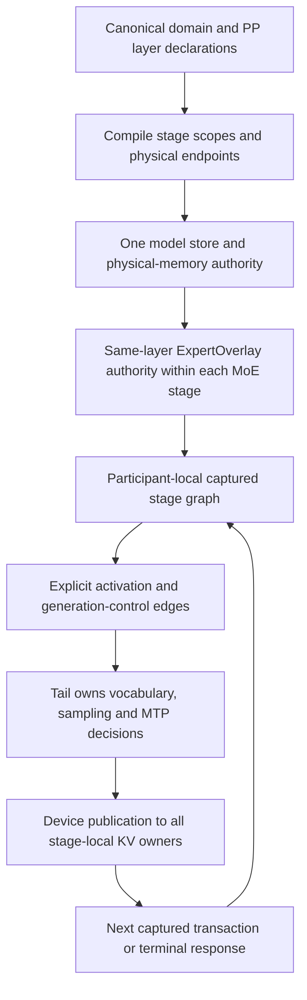

Required invariants for the implementation:

- A PP stage's layer range is a scope, not another replica of the whole model.
  Stage-local TP peers share one expert epoch authority; different stages never
  move experts from layers they do not execute. A singleton stage has no
  rebalance peer, without silently changing the user's movement policy.
- Per-stage BOM contributions merge through the existing physical authority,
  including shared physical devices across stages. No stage independently
  subtracts free memory or installs a replacement model store.
- Homogeneous GPU participants retain complete generation parents with native
  collective edges. Heterogeneous boundaries use authenticated retained
  transactions and explicit data-plane transfers, not a host forward loop.
- The vocabulary stage owns sampling and speculative outcomes. Earlier stages
  own real KV/recurrent state, unlike expert-only overlay followers: they must
  receive the exact accepted-prefix publication before the next transaction.
  Mirroring an LM head onto an earlier stage's different hidden state cannot
  replace this protocol.
- Setup seals exact activation buffers, streams, events, graph families and
  transaction capacity once. Request reset changes data, not topology. Prefix
  restore and MTP rollback publish to every owning stage before replay.

The existing declared stage topology, retained-transaction and publication
machinery should be extended, not replaced by another frontend topology list
or a second authority inside the planner. Preserve the fail-closed guard until
real captured prefill/decode, reset/prefix and grouped-publication regressions
prove the complete runtime. This closure remains unimplemented.

The next admission slice removes the estimator's replicated-global assumption.
`WeightComponentScope` names entry, intermediate, terminal, combined and
layer-only uses. `MemoryPlanner` applies the same scope to primary and mirrored
sets, retains the terminal MTP lookup explicitly, and prices predictor-only
weights without subtracting a synthetic globals-only interval. A tied GPU
vocabulary now contributes its lookup and GEMM representations for native
FP32/FP16/BF16 as well as quantized sources. CPU's shared tied source is not
charged twice within one participant; different pipeline stages own distinct
sources. These are BOM inputs to PMA, not another allocation ledger.

The three-stage/mirrored BOM regression first failed on all eight tested
CUDA/ROCm TP configurations. After wiring the scope, both complete affected
Unit groups passed in 1.17 seconds. The source-format sweep covers all 21
codebooks plus FP32/FP16/BF16 and all three backends. Real CUDA/ROCm loader
regressions also passed in 3.61 seconds, proving distinct native lookup/head
allocations followed by byte-exact captured lookup, including replicated and
sharded views. The fixture now admits those preparations through PMA and uses
the production canonical tied-output alias, rather than assuming a replicated
output schema. Logs: `/tmp/planning-pp-component-{repro,fixed}-20260916.log` and
`/tmp/planning-pp-native-alias-scoped-20260916.log`. The tail-only predictor
regression now passes: its initial failure was a fixture assertion comparing
the primary-only accessor with primary-plus-additional bytes. It now checks
each contribution and their combined total separately. Four complete focused
groups (topology, execution-plan construction, memory planning and weight
estimation) passed in 1.53 seconds before final malformed-binding checks.
Final focused validation, including the production MPI bootstrap projection,
passed **5/5 groups in 1.40 seconds** (`/tmp/planning-pp-admission-focused-20260916.log`).
The full refreshed Unit gate passed **657/657 groups in 80.88 seconds**, and
production preflight passed **222/222 groups in 776.83 seconds**. The complete
879-group receipt is
`parity-results/planning-pp-admission-prerequisites-20260916/prerequisites.json`
(868.778 seconds including preparation and both gates). Both gate targets
rebuilt successfully, and the Release application rebuild completed as well.
This receipt covers the later BOM/binding slice; the previous 879-group receipt
does not. No real-model campaign or Docker certification followed this refresh.

PP physical identity now comes from `ClusterInventory::connectionBetweenRanks`.
The old private rank-locality table was never populated by production topology
construction; it has been removed together with its duplicate grouping APIs.
Every bound activation edge and both endpoint rank actions retain the same
directed immutable physical identity. Geometry-only plans reject transport
identity queries, and changing an endpoint invalidates a previously bound edge.
Focused regressions cover same-rank handoff, same-node MPI, remote membership,
mixed fan-out, reordered/sparse physical IDs, misleading hostname labels and
incomplete inventories (including unused ranks). This closes topology binding,
not the still-missing captured pipeline protocol.

Two ownership boundaries remain important for the implementation, beyond the
already described transport work:

- `MTPStateRole` now separates disabled capacity, main-model followers and
  predictor owners. DGO cache construction and the persistent-state BOM consume
  that same role: a PP follower retains main rollback/verifier state but has no
  shifted predictor cache. Effective-KV diagnostic admission follows the same
  ownership. This does not yet scope all sidecar graph/activation directories.
- `StageRunnerRegistry` now contains only explicit stage entries. Its anonymous
  compatibility runner, duplicate prefix handle and 39 separate dispatch
  branches have been removed. Head/tail lookup returns null when that endpoint
  is remote; global construction rejects foreign stage IDs, changed endpoint
  ownership and mismatched PP intervals. Existing singleton TP and test callers
  now register their actual topology action instead of an unnamed rank runner.
  MTP dispatch still targets every registered runner.
  The existing GlobalPP MTP guard prevents that from being a working PP
  implementation. The completed protocol must distinguish a real local tail
  from a remote tail and publish decisions to state-owning followers; do not
  remove the guard while retaining these generic all-runner calls.

The new CPU/CUDA/ROCm construction regression exercises three PP roles plus an
unpartitioned runner, disabled/enabled/retained-depth-15 capacity, all concurrently
reserved checkpoint slots and request reset/reuse. It exposed an additional
restore defect: an FA-only shard was rejected solely for using a hybrid wrapper.
The zero-token check now distinguishes real GDN state from an FA-only wrapper;
the separate zero-token GPU GDN reset limitation is not claimed resolved.
The expanded GPU fixture must use Qwen3.5's complete MTP schema and real GDN
dimension metadata even for its FA-only map. Repeated full-pool acquisition
then exposed a real asynchronous reuse race: after caller snapshots were
released, restore still excluded its source slot until a host event query
reported completion, even across request reset. The fix queues the exact
restore-completion event on the next checkpoint writer before releasing only
that restore's pool lease. The permanent pool remains the allocation owner;
caller-held snapshots continue to exclude overwrite. Completion events survive
the handoff until retirement, including teardown after an aborted capture.
The regression now covers same-request reuse as well as request reset, without
a larger pool or a blocking host synchronization.
The earlier 879-group receipt predates this ownership slice; it is superseded
by the complete 882-group refresh below.

The focused ownership gate passed **5/5 groups in 3.32 seconds**, including
both complete affected Unit groups and all three backend lifecycle groups
(`/tmp/planning-pp-pool-reuse-focused.log`). Both GPU groups then passed
**20 fresh runs each**, 40 total in 48.34 seconds, including same-request and
reset-boundary reuse (`/tmp/planning-pp-pool-reuse-stress20.log`). The complete
Unit/preflight and parity-matrix executable inventory rebuilt successfully
(709 build steps), as did the Release application. The refreshed canonical gate
passed **657/657 Unit groups in 75.11 seconds** and **225/225 production-preflight
groups in 782.89 seconds**: 882 groups total, 858.721 seconds including
preparation. Its receipt is
`parity-results/planning-pp-state-owner-prerequisites-20260916/prerequisites.json`;
the full console log is `/tmp/planning-pp-state-owner-prerequisites-20260916.log`.
All three new ownership groups passed again inside that full gate. No build or
test process remains running at this handoff. These are ownership/reuse proofs,
not captured pipeline inference or image certification. No real-model campaign,
Docker certification or commit/push followed this refresh.

`DeviceGenerationPolicy::forwardOnly()` is a one-invocation no-sampling
operation, not a distributed generation follower. The existing
`DeviceGenerationControl` remains the tail's mutable decision authority.
Pipeline followers need authenticated immutable transaction/accepted-prefix
publication and ordered completion, not a downloaded/copied host controller
or a renamed forward-only policy. Native grouped point-to-point and broadcast
stream APIs already exist on `ILocalTPContext`; reuse their captured ordering
contracts at homogeneous boundaries instead of adding another transport.

The resident generation materializer is still MTP-specific in production:
`DGO::beginDeviceResidentGeneration` now admits ordinary/forward-only policies
without a predictor, but `materializeDeviceResidentGeneration` still rejects
zero draft depth before invoking the MTP parent composer. The ordinary/forward-only
controller policies are currently exercised by real DGO/backend/unit tests,
not selected by a public production request.
Do not mistake those tested transition helpers for an already wired ordinary
pipeline parent. The smallest next runtime proof should use a real production
two-stage runner with retained ordinary generation, exact activation/control
edges and tail-only sampling; then extend that same ownership/composition to
grouped MTP and per-stage MoE, rather than introducing another host stage loop.

The ordinary sampler boundary now has a dedicated
`OrdinaryGenerationSamplingStage`. It borrows full-vocabulary processed logits,
existing sampler scratch, the logical frontier and the shared response/controller
rows. Greedy and stochastic policy are distinct typed alternatives. Stochastic
sampling reads both the admitted seed and logical position from device storage;
changing request seed bytes does not change capture identity. CUDA and HIP's
existing compact sampler now accept that exclusive resident seed source, and
zero seed data produces a fatal invalid sample rather than choosing another RNG
law. `SAMPLING_REQUEST_SEEDS` names the arena input; it is not a second allocator
or ledger. Stop detection is fused into ordinary publication using a checked
shared or strided stop-token row, removing the separate stop-flag producer.

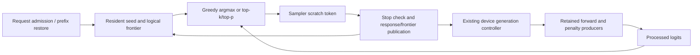

This is a composition component, not a completed production ordinary parent.
DGO still needs to bind/admit the seed input through its canonical arena/BOM,
compose this boundary with real forward and penalty-history publication, and
select it through the ordinary resident generation API. Pipeline transport and
stage-scoped MoE remain open. Do not remove PP guards based on the component's
tests or confuse its model-free native-loop proof with real-model inference.
Focused tests cover serial-law equivalence, device seed changes without
recapture, independent EOS rows, malformed admission, complete binding identity,
twenty resets per sampling policy and CUDA-native loop composition. They are
included by the existing CUDA/ROCm DeviceGenerationController preflight groups.
The device-free controller group passes all 13 cases. The expanded three-group
focused gate passed in 36.31 seconds
(`/tmp/planning-ordinary-sampler-boundary-tests.log`). Its top-k boundary sweep
exposed a real CUDA launch defect: the generic K=256 sampler requests 64 KiB of
dynamic shared memory but had not opted in above the default 48 KiB. All four
scalar generic Top-K entrypoints now request the same fixed supported ceiling
at launch preparation; arithmetic, global memory and replay work are unchanged.
The regression also checks K=192/193/255 and the legacy and processed-logit APIs.

Isolated CUDA profiling reports 17 registers for the resident draw and 32 for
ordinary publication, with zero local spill requests. ROCm ISA inspection finds
zero private storage/spills: four VGPRs for the compact draw and twenty for
publication. These tiny control kernels do not represent vocabulary projection
throughput. Diagnostic traces and ISA evidence are under
`/tmp/llaminar-ordinary-sampling-isa.3qrEfG`; timings are not canonical inference
benchmarks. The complete sampler-slice refresh passed **657/657 Unit groups**
in 79.11 seconds and **225/225 preflight groups** in 814.83 seconds, 882 groups
total. Build/preparation plus both gates took 894.764 seconds. Its receipt is
`parity-results/planning-ordinary-sampler-prerequisites-20260916/prerequisites.json`;
the console log is `/tmp/planning-ordinary-sampler-prerequisites-20260916.log`.
No Release model run or image certification is claimed by that receipt.

Parent construction is being consolidated into `DeviceGenerationGraphProgram`.
The existing MTP composer now supplies its transaction to the same native-loop
builder used by the ordinary sampler integration test. The alternative ticket
builder records only immutable dispatch publication and uses the existing
`ScopedBackendGraphCapture` owner to close on failures and exceptions. Neither
builder owns request memory, chooses another policy on error, or silently
replaces a retained executable. Device-free exception-path and real CUDA/ROCm
reset proofs passed with the complete affected controller groups: **4/4 groups
in 35.84 seconds** (`/tmp/planning-generation-program-focused-20260916.log`).
The MTP composer uses this builder in production; this still does not wire the
ordinary algorithm into request execution. The full refresh for the combined
builder/export/admission slice is running at
`parity-results/planning-generation-program-prerequisites-20260916`.

The next reduced failure is a forward-cache readiness mismatch. An instantiated,
unlaunched decode child has typed state `MaterializedUnlaunched`, but the engine
refused to export it because `phase3_active` was false. That flag is a semantic
node-reset optimization, not the native executable authority. A new device-free
test reproduces the rejection before any inference launch
(`/tmp/planning-unlaunched-export-red-20260916.log`). Export now checks the existing
typed materialization state and retains strict pointer/stream/stage-coverage
validation. All three affected Unit/CUDA/ROCm groups passed in 4.35 seconds
(`/tmp/planning-unlaunched-export-fixture-focused-20260916.log`). The device
proof composes an unlaunched child and consumes changing upstream activations
over twenty request resets, retaining every captured address. No synthetic
first inference is added. Its first test version omitted upstream admission;
that fixture error was corrected rather than changing production arithmetic.

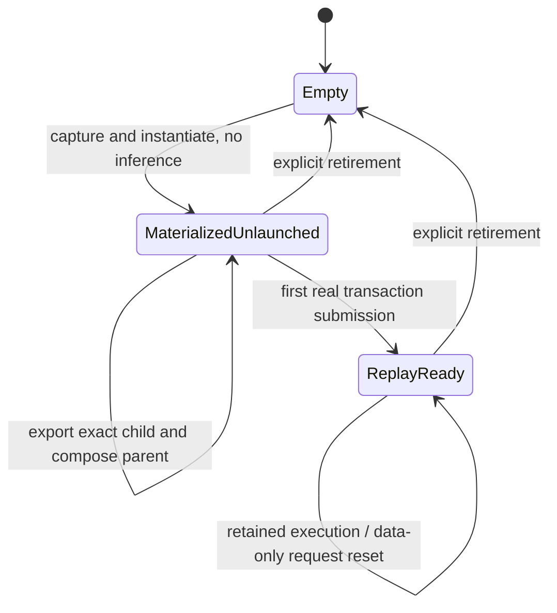

The concrete reuse points for the remaining runtime wiring are:

- DGO registers response/controller/ticket and logical-sequence buffers for
  **every GPU** in `initializeBuffers`; the missing ordinary path is not a
  reason to introduce a second buffer owner. Shared-bank initialization now
  runs for every GPU, and admission requires MTP capacity only for speculative
  algorithms. It joins the existing request-reset event before republishing
  the same banks. The production DGO admission/reset regression passes on both
  GPUs across twenty alternating ordinary/forward-only admissions; parent
  composition and frontend selection still need ordinary wiring.
- `ForwardExecutionEngine::deviceLoopGraphTemplate` exports an exact retained
  monolithic forward identity. Reuse that contract and the existing generation
  parent composition; do not export a vaguely compatible cached graph.
- `ILocalTPContext::groupedP2PRawOnStream` and
  `broadcastRawOnStream` provide captured native payload/control edges. A PP
  participant must bind its own stable activation destination. The legacy
  local handoff changes a shared tensor's device and the global handoff
  materializes host activations; neither is the target GPU protocol.
- Tail sampling uses the existing backend's enqueue-only sampling ABI and
  `OrdinaryGenerationPublication`. `forwardOnly()` remains a one-invocation
  operation, not a substitute for a decision-following pipeline stage. Later
  grouped MTP publishes tail outcomes to stage-local main-state owners while
  keeping predictor state solely at the terminal stage.

Start with a genuine two-stage production runner and captured ordinary
generation, including reset/prefix reuse. Keep the existing PP guards until
that protocol and its MTP/MoE extensions are actually executable; model-free
ownership tests do not authorize their removal.

The combined focused gate passed **10/10 groups in 43.17 seconds**
(`/tmp/planning-generation-contract-fixes-focused-20260916.log`). Besides the
prepared-workspace fixture correction, it exposed two construction-contract
errors: admission joined reset using the controller role instead of the
existing request-admission role, and the new compiler incorrectly required a
separate executable for recorded child graphs. Admission now uses the exact
existing reset/admission event edge. Composition accepts recorded children;
the backend authenticates their native graph/device and the parent owns its
executable. No preparatory inference, duplicate native executable, host wait,
or relaxed lifecycle validation was added. The compiler also rejects nested
recording before it can change either the worker or thread-local capture owner.

#### Concrete composition boundary for the remaining PP implementation

The runtime audit identifies three distinct ownership axes; combining them in
the current singular `moe_routed_expert_plan` would discard information:

| Ownership | Existing source to retain | Required composition |
|---|---|---|
| Transformer layers | `GlobalPPStageSpec` / `FactoryPPStageConfig` | Disjoint main-layer scopes, with sidecar only at the terminal owner |
| Same-layer expert placement | `MoEExpertOverlayAuthorityPlan` | One authority per stage's cooperating participants; never a model-wide placement shared by disjoint stages |
| Generation decisions | `DeviceGenerationAdmissionRequest` and resident controller | Tail-only vocabulary/sampling/verification authority, with published decisions to every stage-local state owner |

`ResolvedRankOrchestration::applyOverlayRole` currently clears PP geometry and
`OrchestrationRunner` constructs one overlay resource bundle. Both must consume
the same stage-scoped resolved result; adding a stage loop in the planner alone
cannot close this gap. Stage BOMs contribute to the existing model-wide PMA,
and stage preparation retains the existing model-owned prepared-weight store.
Neither may become another capacity or allocation authority.

The generation protocol needs two directed edges, not another mirrored head:

```mermaid
sequenceDiagram
    participant T as Tail: generation authority
    participant H as Head: first layer scope
    participant M as Intermediate layer scopes
    T->>H: Publish transaction identity, operation, rows and token input
    H->>M: Captured forward activation edge
    M->>T: Captured forward activation edge
    T->>T: Sample or verify; compute accepted prefix
    T->>H: Publish accepted-prefix and next-transaction decision
    T->>M: Same immutable publication
    H->>H: Commit only owned KV / recurrent state
    M->>M: Commit only owned KV / recurrent state
    H-->>T: Ordered publication completion
    M-->>T: Ordered publication completion
    T->>T: Admit next transaction or surface terminal response
```

These are graph/transport dependencies, not per-token host waits. Homogeneous
GPU stages must retain complete parents with captured collective edges. HIP
may submit retained complete branches from the authenticated scheduler ticket;
it must not run one host-directed stage loop. A heterogeneous boundary can use
the existing explicit transport/ticket machinery, retaining physical-host
identity: node-local mapped channels cannot replace cross-host transport.
CPU stage state remains CPU-owned. Copying an immutable publication to a
consumer is not permission to install a second generation decision authority.

The terminal stage's hidden state is different from an earlier stage's hidden
state, so copying its MTP/LM-head weights to earlier stages would not reproduce
its decisions. The existing mirrored-head TP implementation is therefore not
a PP implementation. Conversely, expert-only followers cannot be reused as
full pipeline followers without adding real KV/recurrent-state publication.

The focused proof must exercise two-/three-stage ownership, singleton and TP
stages, reordered physical devices/ranks, dense and MoE, all floating expert
formats, prefill tail buckets, ordinary decode and fixed/dynamic MTP. Reset and
prefix restore must publish before the next transaction; stale identities,
missing stage completion and partial accepted-prefix publication must fail.
Only then should the current PP guard be replaced and unrestricted public
`plan`/saved-plan `serve`/direct-auto `serve` be admitted to certification.

The follow-up audit found and fixed an uncovered factory-boundary issue:
`createInferenceRunner` passed `ModelContext::blockCount()` into a raw-integer
scope validator. That count can include trailing next-N blocks or be overridden
to a local PP scope. `FactoryPPStageConfig::requireValidForModel(IModelContext&)`
now derives the global main-layer boundary through `mainLayerCountExcludingMTP`
and total model metadata. Both concrete and interface-injected factories validate
before materialization. Focused tests passed for local-count overrides, actual
next-N tensors, metadata without sidecar tensors, misplaced global owners,
missing loaders and failure before weight loading. This closes setup admission,
not the unimplemented captured PP runtime above.

### Floating projection closure and contiguous loading (2026-09-16)

The saved four-ROCm BF16 Dynamic plan cleared the embedding fix but failed
cleanly during preparation after about 293 seconds, before HTTP readiness:
`This GEMM backend does not implement replicated-output serial-partition equivalence`.
No generation or movement claim follows from that retry. Log:
`/tmp/planning-public-bf16-fixed-20260916.log`.

A separate five-second CPU setup profile collected 507 samples with zero lost
samples. Self attribution was 33.60% memcpy, 13.51% memset and 11.32% kernel page
clearing. The stacks identified contiguous expert slices passing through raw,
typed-vector and tensor copies. Noncontiguous selections already adopted their
final allocation. Both APIs now share that single-allocation path; native
quantized contiguous intervals still retain checked mmap leases. Large mapped
runs split into disjoint first-touch chunks, and a caller already inside an
OpenMP team completes its independent load without incorrectly enlisting peers.
Native-format, lifetime, odd chunk-tail and concurrent-worker regressions cover
this consolidation. Profile: `/tmp/planning-public-bf16-setup-root-20260916.perf.data`.

The replicated-output contract is now explicit for CPU/CUDA/ROCm floating
kernels. FP16/BF16 already had N-invariant per-column reductions; scoped FP32
ordinary projections now use the same serial tree, and ROCm wide FP32 verifier
projections no longer enter shape-dependent BLAS. A recording-thread-local typed
scope authenticates prepared geometry without mutating shared prepared weights.
The focused native-format test compares independent serial shards at TP degrees
1–8 against full-width ordinary, fused and verifier projections, captured on
both GPU backends, with M=1–16/31/64 and odd N/K tails. Initial GPU proofs passed;
CPU exposed an obsolete M>1 verifier guard, now corrected to accept M=1. The
expanded focused selection passed **6/6 groups in 5.69 seconds**, and the full
hipBLAS integration group passed separately in 3.33 seconds. Native loading and
recording-scope isolation each passed **20 consecutive runs** (47.66 seconds
combined). Evidence is in `/tmp/planning-floating-contract-focused2-20260916.log`,
`/tmp/planning-floating-hipblas-focused-20260916.log`, and
`/tmp/planning-floating-lifecycle-stress20-20260916.log`.

The first full Unit refresh found three old `StageRunnerFactory` fixtures that
requested multi-layer PP scopes while declaring a one-layer model. The fixtures
now declare their actual global geometry; model-aware validation was retained.
The refreshed complete Unit gate passes **657/657 groups** (76.26 seconds).
The expanded production preflight passed **220/220 groups** in 768.65 seconds.
The complete **877-group** receipt is
`parity-results/planning-floating-contract-prerequisites-fixed-20260916`
(845.758 seconds including preparation and both gates).

The current gfx906 object reports zero private memory and zero register spills
for the fixed FP32/FP16/BF16 projection kernels and floating SwiGLU kernel.
Projection resource counts are 10 VGPR/22 SGPR for FP32 and 13 VGPR/25 SGPR for
FP16/BF16, with 1,024 bytes LDS per 256-thread block. The change reuses their
existing reduction arithmetic; this static resource inspection is not a runtime
occupancy, throughput or model-performance certificate. The real BF16 server
retry follows this receipt; its log is
`/tmp/planning-public-bf16-partitions-20260916.log`.

That retry passed floating projection preparation and reached serving graph
recording after about 151 seconds. It failed before HTTP readiness because the
embedding capture frontier found a native BF16 table marked `HOST_RESIDENT`,
with no device allocation. Preload and replicated-source sharing classified
all embeddings as preparation-only sources, although only quantized tables
use prepared EmbedQ8. Native FP32/FP16/BF16 kernels consume their raw device
bytes. The new device-free ownership regression reproduces all three floating
failures while its complete quantized matrix passes.

The follow-up makes preload and replication use one source-representation
predicate. Frozen raw bindings may no longer excuse missing storage with an
untyped host-resident flag. New CUDA/ROCm preflight regressions run real weight
preload and frozen preparation, then capture/replay `EmbeddingStage`, covering
single-device and two-device ownership, replicated and vocabulary-sharded
tables, all three native formats, and rejection of misclassified host-only
raw bindings. These follow-up tests are not yet certified by the preceding
877-group receipt.

A five-second CPU profile of the retry also found the remaining whole-tensor
load path copying through zero-filled raw and typed intermediate vectors.
Native floating whole loads now read into their final aligned allocation;
mapped copies first-touch disjoint chunks using physical workers. Stream and
mmap, factory and factory-free, all-codebook/native-byte and loader-retirement
tests cover the unchanged source representation. This is a setup-only change,
not an inference kernel or precision change. Profile:
`/tmp/planning-public-bf16-partitions-setup-20260916.perf.data` (502 samples,
zero lost). The measured retries stopped at different preparation stages;
neither is a model-throughput certificate.

The embedding follow-up now has a complete green prerequisite receipt:
`parity-results/planning-embedding-residency-prerequisites-20260916`,
**657/657 Unit + 222/222 production-preflight groups**. Unit execution took
75.15 seconds, preflight 772.56 seconds, and preparation plus both phases
1158.830 seconds. Before that refresh, each new CUDA/ROCm embedding-residency
group passed twenty consecutive launches (54.28 seconds combined); the loader
and ownership Unit groups also passed independently. Release was rebuilt before
the new public retry in `/tmp/planning-public-bf16-residency-20260916.log`.

While that immutable build was under test, the memory audit identified a
separate component omission: `WeightEstimate::prepared_embedding_bytes` is
populated only for quantized EmbedQ8, yet mirrored native floating tables also
occupy physical storage. The mirrored-embedding BOM consumes that field and
therefore omits the floating component. Added device-free regressions cover
FP32/FP16/BF16 on CUDA/ROCm and vocabulary sharding through TP degree eight;
they postdate the receipt above and are being reproduced separately. Correct
the shared estimator input to PMA, not capacity arithmetic in individual
planner callers. The current saved BF16 plan does not request mirrored
embeddings, so its retry remains a valid diagnostic of the certified loader
fix, not a certificate for this new accounting follow-up.

The BF16 retry reached HTTP readiness at 13:46:58, about **49 seconds** after
launch, with all four ROCm graph families materialized. Two public Paris
requests returned identical token IDs; the repeat restored all 112 prompt
tokens, hybrid state and terminal logits. Two subsequent counting requests
each generated **384 tokens**, with identical token sequences before/after the
observed movement. Complete request times were 14.526 and 14.334 seconds;
these include request setup/prefill and diagnostics and are not a controlled
decode benchmark or speedup claim.

The first long response had not yet published completed movement in its passive
HTTP snapshot. The next request exposed the completed native journal: four
participant-placement edges in two ownership-swap cycles, spanning ROCm
participants 1/3 and 2/0. The shared runtime-feature and HTTP/transport-identity
validators pass after shutdown, corroborating **25,165,824 physical bytes**
(24 MiB), not just estimated expert sizes. The canonical graph validator also
reports complete prefill, nonempty full graphs, collective evidence and no
segmented execution. Evidence:
`/tmp/planning-public-bf16-residency-http-20260916.jsonl`,
`/tmp/planning-public-bf16-residency-http-followup-20260916.jsonl`, and
`/tmp/planning-public-bf16-residency-physical-proof-20260916.json`.
The server exited cleanly and all four runtime generations retired to zero
canonical allocation bytes. This closes this real BF16 single-domain Dynamic
diagnostic, not unrestricted auto, all floating-model topologies, throughput,
mathematical HF parity, PP, or image certification.

Both new native-embedding BOM tests reproduced their expected omission with
the preceding core. The shared estimator now includes native floating lookup
storage in its existing prepared-embedding component without adding another
primary allocation charge. Both complete focused Unit groups pass (1.22
seconds). Logs: `/tmp/planning-native-embedding-bom-{repro,fixed}-20260916.log`.
This small accounting change still needs the next full prerequisite refresh.

No commit, push, Azure or Docker action has been performed for this slice.
Both ISA image certifications and auto/cost-feature publication remain pending.

## Previous implementation slice: FP32 arithmetic and live state work

`PlanningFP32ArithmeticPlan` adds one fixed source-free FP32 basis at M=1/64.
It shares ordinary projection preparation, exact-stream capture, native timing,
PMA admission and retirement; there is no second sampler lifecycle. Catalog
schema v4 authenticates it separately from a source GGUF projection. The input
is an admitted four-MiB workspace operand, not a model payload or a precision
change. Quantized GOPS, independent streaming bandwidth and this effective FP32
rate retain distinct evidence. Neither FP32 GEMM nor vendor peak is advertised
as measured attention/GDN latency.

`PlanningForwardStateWork` now projects main-layer attention and equivalent GDN
algebra from actual live rows/context and compiled participant ownership. It
handles uneven TP assignments, GQA replication through degree eight, replicated
dense decode, PP ranges, hybrid classification, and expert-only participants.
Causal attention and the mean decode horizon have closed-form identities;
unused KV capacity and retained MTP predictor capacity are not invocation work.
Native CPU/GPU payload bytes come from
`KVCacheMemoryEstimator::logicalPayload`, which excludes allocator metadata,
linearization replicas and scratch. GDN uses the existing canonical local-bank
geometry. State pricing is explicitly a bounded roofline proxy with ideal
intra-invocation reuse, not an exact kernel trace or full request benchmark.

The real MPI integration joins FP32 and independent streaming observations for
the same physical observer/workshare and prices short/long decode and prefill.
These checks reuse the existing CPU/CUDA/ROCm preflight registrations. New
device-free state/codec tests join the existing Unit targets. One initial Unit
fixture omitted CPU cache-domain metadata; the validator rejected it, the
fixture was completed, and the final combined run passed.

Final focused evidence: **17/17 CTest groups passed in 52.65 seconds**. This
includes CPU AVX2, CUDA/ROCm captured sampling and retirement, two-/three-rank
MPI, frontend selection/failure consensus, and both planner/KV Unit groups.
Build `/tmp/planning-state-work-final-build-20260916.log` exited zero; results
are `/tmp/planning-state-work-final-20260916.log` and sibling XML. All processes
are terminal. The earlier FP32-only pass was 16/16 in 53.54 seconds.

At that checkpoint the default still installed `startupTopologyEvaluator`;
the next slice above replaces it. Those focused observations alone were not a
complete request estimate. No model or Docker run, commit, push, or Azure action
occurred in that slice.

## Previous implementation slice: GPU/host communication evidence

`PlanningHostDeviceMeasurement` now observes both DMA and mapped-kernel byte
copies, in both directions, at control and bulk sizes on CUDA and ROCm. Pages
are first-touched by the rank setup caller; receipts retain that host scope
separately from GPU UUID/locality. Source publication, graph preparation and
exact-byte verification stay outside native timing. TransferEngine owns the
prepared copy lane and canonical mapped allocation extent; PMA owns its BOM.

The existing communication collection rounds now publish these observations
alongside native collectives, followed by host MPI (receipt schema v3).
`PlanningCommunicationCost::hostTransfer` requires the exact mechanism,
direction, physical GPU and same-node host scope. These byte primitives do not
claim complete activation-packet/protocol timing or remote mapped access.

Focused evidence: **7/7 CTest groups passed in 34.41 seconds**, including
**174** device-free planner tests and real CUDA/ROCm byte, retirement, failed
admission and reuse proofs. Logs: `/tmp/planning-host-device-focused-20260916.log`
and sibling XML; build `/tmp/planning-host-device-build-20260916.log` exited zero.
The complete refresh finished: **656/656 Unit groups passed**, and **209/215
preflight groups passed**. All six failures were frontend automatic-selection
scenarios rejected before their intended boundary because the sampler equated
physical CPU cores with the explicit `--threads 1` workshare. The initial log-tail
progress updates missed these failures; the complete report is the authority:
`parity-results/planning-host-device-prerequisites-20260916/` (exit 8,
1,209.114 seconds including build). This is not a green prerequisite receipt.

The corrective slice separates `RankInventory::cpu_worker_threads` from physical
`cpu_cores`, publishes actual post-startup OpenMP geometry, and uses that budget
for samples and CPU workspace BOM inputs. Both plan and serve apply the same
explicit thread policy before discovery. **15/15 focused CTest groups passed in
37.41 seconds**, including all six previously failing frontend scenarios, the
public plan command, planner/capacity/serialization units, CPU MPI two-/three-rank
sampling and CUDA/ROCm source measurement. The 321-step rebuild exited zero.
Evidence: `/tmp/planning-cpu-workshare-focused-20260916.log` and sibling XML;
build `/tmp/planning-cpu-workshare-build-20260916.log`. These focused results do
not turn the earlier failed prerequisite receipt into a full green gate. Refresh
the complete Unit/preflight authority after the next coherent implementation
slice, before model or image admission; do not repeat it for every unchanged
diagnostic cell.

The default startup still installs `startupTopologyEvaluator`. Remaining work
is bounded non-weight/request dependency composition, removal of that
placeholder, public Release plan/apply/serve performance validation, then
commit/push and both Docker ISA certifications. None is implied by the focused
component pass. The testing workflow is now `.agents/llaminar-testing/SKILL.md`.

## Previous implementation slice: communication-cost composition

`PlanningCommunicationCost` now turns completed communication receipts into
pure cost queries. The original observations remain unchanged. Payload curves
interpolate complete invocation times, retain a positive startup floor, and
extend beyond the sampled range at the bulk observation's effective rate.
A noisy/flat pair cannot imply negative incremental cost or free unlimited
traffic. This is a bounded prediction, not a fitted per-operation simulator.

Native queries bind discovery rank ordinals to physical node/backend/UUID and
actual communicator order. One validated GPU has exactly zero collective cost.
An identical measured group uses its payload curve; an unmeasured subset or
reordered group receives an explicitly typed proxy using the complete containing
group cost, without a degree discount. This is not advertised as a measured
candidate or a guaranteed upper bound. Missing node/backend/precision evidence
is an error, not an alternative transport selection.

The MPI sample basis is now control `(1,1)`, outbound-heavy `(payload,1)` and
return-heavy `(1,payload)` for each directed pair. The former symmetric-only
pair could not identify asymmetric dispatch traffic. Costing composes the two
independent payload increments with exactly one complete control RTT; it does
not infer symmetric one-way latency. The versioned communication receipt is
now v2. Physical locality remains canonical inventory evidence, never a timing
classification. Neither native collective nor host-MPI evidence prices mapped
GPU activation access or GPU DMA.

Current evidence:

- Build: `/tmp/planning-communication-cost-build-20260916.log`, exit zero.
- **9/9** combined focused CTest groups, **43.80 seconds**:
  `/tmp/planning-communication-cost-focused-20260916.xml` and sibling log.
- **167** device-free planner unit tests passed. Added mathematical curve,
  noise/overflow, exact/subset/reordered group, physical alias, precision,
  missing-service, single-device zero-cost and malformed receipt regressions.
- Real CPU MPI two/three-rank and CUDA/ROCm collection integrations now query
  the completed cost model, validate asymmetric request/reply composition,
  reject incomplete/duplicate/foreign membership evidence, and retain existing
  all-format preparation/AVX2 regressions. These integration cases remain in the
  existing `ProductionParityPreflight` registrations.

All build/test processes are terminal. The shared startup still installs
`startupTopologyEvaluator`; this is **not** the completed measured auto-selector.
Remaining integration work: mapped activation/GPU-DMA service, non-weight work
and dependency composition, then replace/remove the placeholder and validate
public plan/apply/serve selection with real Release inference. Full Unit/preflight
refresh, commit/push and both Docker ISA certifications follow that coherent
feature boundary; none was claimed or performed in this component slice.

## Previous implementation slice: bounded communication evidence

`PlanningCommunicationService` is implemented and focused-gate green. It reuses
the existing publication/consensus, real captured `PlanningLocalTPMeasurement`,
and `PlanningMPITransferMeasurement`; it introduces no alternate inference
transport or physical-memory ledger. `planningObservedResource` now supplies
one shared observed-allocator projection to compute and communication samplers.

The immutable basis contains maximal homogeneous GPU groups jointly visible to
a discovery rank, deduplicated by physical node/backend/UUID set. One common
reporter owns each group. Actual collective order follows production ordinal
order, not sorted UUID order, to measure the intended communicator and preserve
existing native coordinator-pool reuse. Native FP32/FP16 samples retain exact
group, reporting rank, payload, graph counts and complete endpoint times. MPI
samples retain directed request/reply geometry and canonical node membership.
No communicator/link measurement is made for a single-device-only search.

The native basis does **not** claim to measure every smaller candidate subset.
The cost-composition slice above now provides an explicit qualified prediction
for unmeasured groups. Mapped heterogeneous activation/GPU-DMA costs and non-weight
execution/dependency costs remain outside these observations. The default startup
selector remains the placeholder `startupTopologyEvaluator`; the completed
auto/costing feature is not yet green.

Evidence at that boundary:

- Build: `/tmp/planning-communication-build-20260916-r4.log`, exit zero.
- Nine combined focused CTest groups passed in **44.06 seconds**:
  `/tmp/planning-communication-focused-20260916-r2.xml` and sibling log.
  This includes 162 device-free planner tests, CPU MPI with two/three ranks,
  CUDA/ROCm collection, all-format preparation and AVX2 preparation.
- New native collection executed degree-2 CUDA and degree-4 ROCm, both wire
  precisions. Unit coverage includes physical aliases, partial visibility,
  identical UUIDs on different nodes/vendors, ordered group identity, invalid
  receipts and the local/no-MPI single-device case. Integration coverage rejects
  asymmetric rank geometry before traffic and then proves a valid collection.
- Observed cold collection setup was about 2.0 seconds CUDA and 7.5 seconds
  ROCm on this host. The ROCm trace attributes most of that to first DSO load
  and native communicator initialization; the next precision reused the pooled
  coordinator. These are setup observations, not model-inference benchmarks or
  a claim that the complete automatic startup meets a final economy target.
- Dedicated native primitive baselines also passed (two CTest groups,18.97s),
  `/tmp/planning-native-link-baseline-20260916.xml`.

All build/test processes are terminal. No full prerequisite refresh, Release
plan/apply inference, Docker certificate, Azure action or commit/push was done
in this component slice. The next delivery boundary is integration into the
bounded request-cost model and public default selector, followed by refreshed
full gates and the two ISA image certifications.

## Previous implementation slice: measured weight-service composition

`PlanningWeightServiceModel` now combines the authenticated kernel catalogs and
the independent streaming limit. Setup selects one actual source representative
per ordinary executed format or expert format triplet, weighted by aggregate arithmetic
volume; it is not repeated per candidate, transformer layer or resident expert.
Ordinary source rows are bounded to 1024 without changing K/codebook, and experts
remain complete native triplets. The existing failure-atomic discovery
transaction owns source publication, PMA admission and backend execution.

This is a **component estimate**, not yet the production default selector.
It scales same-family observed service to compiled N/K and row work, interpolates
invocation time between measured M points, and applies the separate streaming
bound. Experts use admitted ownership/replication plus explicit uniform top-k
expectations. It does not invent MTP acceptance, future promotion gains,
attention/GDN service, collective overlap or a complete request latency.

The review closed two composition defects before default installation:

- CPU kernel receipts must match the reporting rank's published worker count;
  positivity alone was insufficient. Local worker/geometry changes are rejected
  collectively before source loading or workspace preparation. Combining
  independently authenticated batches also requires identical CPU geometry.
- Interpolation operates on invocation latency, not reciprocal throughput:
  the latter could invent a latency hump between equal measured endpoint times.

The subsequent runtime-format review also closed an omitted service family:
production promotes Q8 GDN alpha/beta projections to FP32, but source-family
selection previously skipped promoted operands. `PlanningMatrixSamplePlan` now
derives executed type/extent from `PreparedWeightRepresentationContract` while
retaining native bytes and source coordinates for publication. Preparation
admits converted storage through PMA before applying the same tensor conversion
as the loader. Source, converted storage and engine borrows retire in that order
of dependencies (engines first). CPU traffic estimates include the FP32 extent
even when the floating kernel owns no additional packed allocation. Receipt
schema v3 authenticates source identity and executed format independently.

Current focused evidence after this fix:

- 157 device-free planner tests, including all-format source/runtime policy,
  missing-native-F32 representative selection and converted traffic accounting.
- Existing all-format projection integration now executes alpha/beta whole and
  sharded samples with nonzero native payloads on CPU, CUDA and ROCm, and checks
  PMA retirement. Injected host/device preparation failures prove converted
  allocation cleanup and subsequent source reuse. CPU AVX2 is covered too.
- Nine combined CTest groups passed in **34.28 seconds**:
  `/tmp/planning-runtime-format-focused-20260916-r2.xml`, with its sibling log.
  Build evidence: `/tmp/planning-runtime-format-build-20260916-r2.log`.
  All associated processes completed with exit zero. The extra AVX2 MPI
  collection check passed in 2.26 seconds
  (`/tmp/planning-runtime-format-avx2-20260916.xml`).

These are component and focused preflight proofs, not measured selection through
the default public entrypoints, a renewed full prerequisite receipt, or Docker
certification. `AutomaticPlanningStartup::preparation()` still installs the
placeholder topology evaluator. Communication evidence and complete bounded
request-cost composition are the next required work; do not certify or push the
auto/costing feature as complete before replacing that default and proving it.

The preceding focused `V2_Unit_MemoryPlanner` executable contained 155 device-free
tests, including all 23 native source formats on CPU/CUDA/ROCm cost coordinates,
ordinary and expert families, grouping, replication, endpoint aliases, missing
formats and independent memory limits. CPU/two-rank, CPU/three-rank, CUDA and
ROCm service-preparation integration cases are in the existing
`ProductionParityPreflight` filters. The final r4 combined gate passed all five
CTest groups in 18.50 seconds; evidence is
`/tmp/planning-weight-service-focused-20260916-r4.xml`. An additional
`LLAMINAR_ISA_LEVEL=avx2` two-rank CPU run passed in 2.27 seconds
(`/tmp/planning-weight-service-avx2-20260916.xml`). All associated build/test
processes completed with exit zero. These focused results are not a refreshed
full Unit/preflight receipt or Docker certificate.

Tiny-fixture preparation was 0.19–0.29 seconds CPU-only, 0.31 seconds with CUDA
and 1.05 seconds with ROCm in the first focused run. These include component
collection through the shared startup transaction, not full-model startup or
Release throughput. The documented ROCm-only/32768-context `serve` command also
passed `--validate-only`; that proves CLI policy, not model inference.

Next required integration remains communication and execution-cost composition,
followed by replacing `startupTopologyEvaluator`, validating real plan/apply and
auto-serve, and completing both Docker ISA certifications. The previously green
869-group full prerequisite receipt predates these code changes and must be
refreshed at the next coherent full-gate boundary.

The phase-specific expert operand inventory now also carries admitted execution
shares. Apportioned work follows participant quotas; replicated decode is not
divided by replica count. Prefill assignment across replicas is explicitly a
balanced-assignment prediction. Uniform top-k routing distinguishes expected
routed rows from expected nonempty expert groups and does not invent observed
hotness, future Dynamic movement benefit or MTP acceptance. The focused planner
gate passed after these additions (`/tmp/planning-expert-work-unit-20260916-r2.xml`).

The streaming sampler and its shared MPI collection are implemented. Cache
coverage comes from native GPU L2 properties and deduplicated Linux CPU cache
sharing domains, including unequal chiplets; unknown observations are not
replaced by guessed sizes. The versioned inventory wire preserves these facts.
CPU initialization adopts untouched page mappings before parallel first touch,
rather than serially zeroing a tensor first. Every payload and retained GPU
executable is admitted by the canonical PMA and retired before returning.

`PlanningStreamingServicePlan` uses the existing source/admission/measurement
collector without any model payload or reader. Its receipts have byte units,
exact cache/stream/worker geometry, and captured GPU evidence; they cannot
substitute for projection/expert arithmetic. GPU visibility aliases share only
their physical node/backend/UUID reporter; CPU workshares stay rank-qualified.
One observer per physical node runs at a time so startup does not measure its
own sampling contention. Both backend implementations retain native capture.

Focused build and tests are green: ten CTest groups covering planner/inventory
units, two-/three-rank MPI, source-kernel collection, streaming collection, and
CPU AVX512/AVX2 plus CUDA/ROCm execution. Evidence:
`/tmp/planning-streaming-catalog-focused-20260916-r2.{log,xml}` (25.33 seconds).
This includes asymmetric worker-failure consensus/recovery and rejecting an
unnecessary model reader before it can run. Earlier failed attempts
are retained separately: the first fixture lacked MPI initialization, and the
second used a socket-bound one-rank launcher with a whole-host CPU inventory.
Streaming now uses the MPI-owned test binary and CPU socket-local discovery;
the production workshare-mismatch guard remains strict. A whole-host CPU sample
must actually execute with its published whole-host workshare.

Initial diagnostic useful-byte rates were 64–75 GB/s per 28-core socket,
819 GB/s on CUDA device 0 and about 640 GB/s on ROCm device 0. These Integration
observations validate the sampler, not Release model throughput or cost ranking.
There is no speed threshold in preflight.

The complete canonical prerequisite refresh also passed: **656/656 Unit groups
and 213/213 production-preflight groups (869 total)**. Receipt, complete
inventories and CTest/JUnit evidence are under
`parity-results/planning-streaming-prerequisites-20260916/`; the combined log is
`/tmp/planning-streaming-prerequisites-20260916.log`. Unit took 76.28 seconds,
preflight 735.38 seconds, and the complete shared-header rebuild plus both gates
took 1,294.299 seconds. These are current local Integration prerequisites, not
model/image certification. No Release model, Docker, Azure, commit or push ran
in this slice.

The production default **still uses the placeholder evaluator**. Next: consume
the authenticated compute/memory and protocol-specific link observations in
the bounded candidate ranker, validate plan/apply and auto-serve with real
Release inference, then refresh image certification. This component work does
not certify measured automatic ranking or either Docker image.

Previous completed prerequisite slice (2026-09-16, shared all-rank automatic startup):
**The full gate passes 656/656 Unit groups and 209/209 production-preflight
groups (865 total). Both frontends now execute one all-rank preparation lifecycle
before root-only selection. The default cost remains the explicitly unmeasured
topology estimate; measured ranking and both Docker certifications are still
unfinished.**

`AutomaticPlanningStartup::run` replaces the old root-only
`AutomaticOrchestrationPlanner::selectForStartup`. It publishes root's complete
request, validates workload before model access, retains one source owner,
publishes metadata, invokes collective evidence preparation on discovery ranks,
authenticates final evaluator construction, selects on root and publishes one
apply document. Preparation returns a nonempty evaluator on root only; peers
cannot access the model source or run the search. Sample collectors own their
internal collective failure phases. Final local construction errors reach a
common readiness consensus before selection, not a rank-local early unwind.

```mermaid
flowchart LR
    I[Context-owned discovery inventory] --> R[Publish root automatic request]
    R --> M[Root retains GGUF source; publish metadata]
    M --> E[All-rank evidence collection]
    E --> A[All-rank evaluator-readiness consensus]
    A --> S[Root admits and prices candidates]
    S --> P[Publish one strict apply document]
    P --> X[Admit selected execution ranks]
```

The real frontend proof now samples a bounded CPU projection on both discovery
ranks through the production source/PMA/catalog lifecycle before using a
synthetic selection oracle. That integration exposed a real handoff defect:
`gatherClusterInventory` returned a detached value copy, while collection
correctly requires the context-owned publication. The gatherer now returns its
shared immutable owner; command sessions retain that owner, and serving passes
it directly. The identity guard is unchanged. The runner's existing mutable
runtime-capacity snapshot and explicit test-only filtered views remain explicit
copies; neither becomes the discovery or measurement authority.

New regressions cover follower preparation failure, root sample failure and a
follower returning an evaluator. Existing root pricing failure, mixed intent,
selected-follower, saved-plan admission, CPU bootstrap, hardware isolation and
both CUDA/ROCm command inventory proofs remain green. Inventory tests require
pointer identity and retained immutable lifetime, not merely equal field values.

- Build: `/tmp/planning-shared-startup-build-20260916-r3.log`, exit 0.
- Focused gate: `/tmp/planning-shared-startup-focused-20260916-r2.{log,xml}`, 25/25.
- The first focused run's six failures all exposed the detached-inventory handoff; they are preserved in the unsuffixed log, not counted as passing evidence.
- Full canonical gate: `/tmp/planning-shared-startup-prerequisites-20260916.log`, exit 0; receipt, complete inventories and JUnit under `parity-results/planning-shared-startup-prerequisites-20260916/`.
- Unit: 656/656 in 74.58s; production preflight: 209/209 in 720.69s. Combined build-and-gate elapsed: 977.113s.
- No model, Release benchmark, Docker, Azure, commit or push ran in this slice. These are local Integration prerequisites, not image certification.

Next: install the bounded measured evaluator in `AutomaticPlanningStartup::preparation`,
consuming the admitted work and applicable service/communication evidence. Do
not add another frontend search or leave production probes unused. This startup
refactor is a required integration boundary, not completion of auto/costing.

Previous continuation (2026-09-16, phase-specific compiled weight work):
**The focused combined gate passes 15/15 groups in 44.34 seconds. Automatic
selection still uses the placeholder score; measured frontend ranking, the
requested feature checkpoint and both Docker certifications remain unfinished.**

`AdmittedOrchestrationCandidate::devicePlans()` now retains the exact inputs
used by admission. `MemoryPlanner` returns its evaluated inputs alongside the
selected BOM, preserving full-context CPU continuation capacity while GPU and
CPU expert endpoints use their selected bucket geometry. Overlay inputs remain
the fixed zero-routed-expert BOM; final residency still belongs exclusively to
`overlayCapacity()`. There is no new live allocation ledger.

`compilePlanningForwardWeightWork` projects those compiler facts into a typed
main-forward operand inventory for prefill or decode. It distinguishes ordinary
projections, specialized router service, embedding lookups, non-projection
parameters, unresolved roles and complete single-expert FFNs. The shared shard
resolver supplies N/K axes; the existing representation contract supplies any
required FP32 derivation. It preserves discovery/execution rank identity and
pipeline intervals, excludes retained learned MTP sidecars, selects alternate
decode views instead of executing both views, and retains tied-head source
identity. Unknown operands remain explicit rather than disappearing as zero
cost. A domain with no expert-tier membership has no routed service endpoint.

Review against the live graph corrected two important details before costing:
the mirrored terminal head also applies to prefill's compact final-row projection
with MTP off, and `attn_gate.weight` / `ssm_out.weight` must infer the same
`GDNProjection` roles already assigned by runtime bindings. A format-view
lifetime assertion additionally prevents returning a `string_view` into a
temporary conditional-expression string.

Nine new device-free work-mapping tests cover these boundaries, native format
labels from the canonical catalog plus FP32/FP16/BF16, exact TP axes, both GPU
vendor roles, phase-split mirrors, remote expert-only ranks, tied heads, unknown
roles and malformed expert triplets. Additional admission/row-capacity and
weight-role assertions are in their existing Unit groups. The dense-only
fixture keeps its normalized hardware declarations and removes only tier
membership; deleting the hardware domain was an invalid fixture, not a reason
to add a production compatibility path.

- Final build: `/tmp/planning-forward-work-build-20260916-r6.log`, exit 0 (test-only follow-up to the complete `r4` build).
- Final combined gate: `/tmp/planning-forward-work-combined-20260916-r2.{log,xml}`, 15/15, 44.34s.
- That gate includes four functional Unit groups, the default-stream source policy, and ten existing CPU AVX512/AVX2, CUDA, ROCm, native LocalTP and two-/three-rank MPI measurement preflight groups.
- Earlier failed logs are retained separately; they are not passing evidence.
- The complete 862-group receipt below predates these changes. Refresh the full gate with the coherent measured-startup integration, not for every metadata edit. No model, Release throughput, Docker, Azure, commit or push ran in this slice.

**Next production boundary remains the evaluator and shared all-rank startup
transaction.** This inventory is not itself a full graph latency model or an
ordered execution schedule. Ordinary projection and complete-expert observations
must retain their operation/format/shape applicability; do not substitute one
for router, attention, recurrent-state or communication work. Preserve explicit
routing and MTP uncertainty. Measured service/protocol collection must precede
root-only selection in both frontends, then replace `startupTopologyEvaluator`
rather than leaving the probes unused or calling a weight subtotal full-model
latency. The target remains actual auto/apply and certified AVX512/AVX2 images,
not this focused gate alone.

Previous continuation (2026-09-16, shared tensor geometry and refreshed full
gate): **656/656 Unit groups and 206/206 production-preflight groups pass.
The complete 862-group model-free receipt is fresh for the accumulated
projection/catalog/native-collective and geometry changes. Automatic selection
still uses the placeholder score; neither frontend measured ranking nor either
Docker image is certified. No commit or push has been made.**

Tracing compiled work into the cost model found a real physical-sizing defect:
an input-axis TP shard was reduced to an element count, then reinterpreted as
`selected_elements / original_K` output rows. If N is not divisible by the TP
degree, that integer division drops part of the owned matrix. For example,
N=65, K=2048, TP2 owns [65,1024], not [32,2048].

`WeightShardGeometryResolver` now supplies typed N/K/instance geometry to
`WeightMemoryEstimator`. The existing schema/assignment calculations were
extracted rather than copied into a second cost-specific classifier. Schema
rules bind once per participant, not once per tensor. GPU packing uses actual
local K and retains every output row on both CUDA and ROCm. Complete-expert
residency changes the independent instance count, never another N/K share.
Vectors and element-only metadata expose no pretend GEMM shape. This is
metadata/BOM input, not another admission or live-allocation ledger.

Focused regressions cover all 24 existing floating/quantized format entries,
TP degrees 1 through 8, CPU/CUDA/ROCm sizing, exact GQA and fused GDN assignments
checked against the production slicer, empty expert residency, malformed
identity/geometry, and overflow-safe coordinate arithmetic. The synthetic
embedding/head fixture now uses the actual [vocabulary, hidden] orientation.
No inference kernel, activation precision, stream, or transport changed.

- Final incremental build: `/tmp/planning-shard-geometry-build-20260916-r2.log`, exit 0.
- Focused combined gate: `/tmp/planning-shard-geometry-combined-20260916.{log,xml}`, 17/17 groups, 44.81s.
- Complete gate: `/tmp/planning-shard-geometry-prerequisites-20260916.log`; canonical receipt/logs/JUnit under `parity-results/planning-shard-geometry-prerequisites-20260916/`.
- Full Unit: 656/656, 74.50s. Full preflight: 206/206, 717.06s. Complete build-and-test transaction: 964.592s, exit 0.
- These generated evidence files remain ignored. This is local Integration evidence, not an AVX512/AVX2 Docker certificate, Release throughput result, or renewed Azure proof.

**Remaining production boundary:** consume the compiled geometry and measured
service/protocol evidence in the shared all-rank startup selection, replacing
`startupTopologyEvaluator`. Matrix shape alone is not a source interval
(fused QKV/GDN can gather disjoint spans), a prepared representation, memory
traffic, observed routing hotness, or full-model latency. Preserve those
distinctions rather than multiplying resident bytes by a generic bandwidth.
The requested auto/costing checkpoint to `develop` remains conditional on that
feature actually working, not merely these prerequisite gates passing.

Previous continuation (2026-09-16, consolidated service and native collective
observations): **The combined focused gate passes 16/16 groups in 46.08s.
Native LocalTP capture/admission/retirement also passes 20/20 fresh-process runs
on CUDA and 20/20 on ROCm. Automatic selection still uses the placeholder;
neither measured frontend selection nor Docker certification is complete.**

Ordinary projection and complete-expert collection now share
`PlanningKernelServiceCatalog`, replacing the separate expert-named collector
and its source/test references. The shared transaction retains different typed
operation/source identities, one inventory-derived reporter assignment, one
PMA envelope, one source publication, and complete all-rank receipts. Exact
CPU execution geometry and native GPU graph evidence survive publication.
`serviceFor(discovery_rank, device)` resolves GPU visibility aliases by physical
node/backend/UUID and never aliases CPU workshares across ranks. Reordered
receipts, identical remote UUIDs and vendor reversal cannot change locality.

`PlanningLocalTPMeasurement` now supplies the missing **rank-local native
collective primitive**, through ordinary `LocalTPContext` NCCL/RCCL rather than
the host-MPI probe. It uses FP32 model-facing payloads with explicit FP32 or
FP16 transport, actual requested row/width geometry, one warmup and three native
event-timed retained launches. Its per-phase result retains every endpoint's
timing and uses the slowest endpoint, not their average or sum. Logical payload
bytes are not mislabeled as wire bandwidth. No new arithmetic kernel or eager
collective was introduced; native backend/P2P selection is unchanged.

```mermaid
flowchart LR
    P[Validated local GPU group and payloads] --> A[Canonical PMA admission]
    A --> C[Production LocalTP context]
    C --> B[Prepare every participant on its owning worker]
    B --> G[Capture participant-local graphs concurrently]
    G --> T[Concurrent retained replay and native event timing]
    T --> R[Join all workers and retire graph/tensor borrowers]
    R --> F[Retire collective scratch and communicator]
    F --> E[Complete immutable-input observation receipt]
```

The native probe's tests exercise both transport precisions, odd payload tails,
reversed device order, repeated communicator/capture construction, and
asymmetric exhaustion of workspace, native-graph and collective allocations.
Its two functional groups are in `ProductionParityPreflight`, using the existing
measurement executable. They contain no performance threshold. Each launch
uses both available CUDA GPUs or all four available ROCm GPUs on this host;
the implementation and tests derive degree from their supplied/visible devices.

The first wider run exposed a **test registration mistake**, not a reason to
increase physical reserves: omitting `MPI_PROCS 1` inherited the default
two-process launch, causing duplicate local probes to occupy the same GPUs.
Their overlapping graph-pool observations correctly failed admission. The
registration is now explicitly one process, verified from CTest's generated
command. No admission limit, timeout or source-policy allowlist was weakened.
Both native groups subsequently passed the 20-run gate; the final combined
run also passes all four selected source-policy tests and the surrounding
CPU/CUDA/ROCm projection/expert/MPI tests.

- Final build: `/tmp/planning-native-localtp-build-20260916-r2.log`; registration-only reconfigure: `/tmp/planning-native-localtp-registration-build-20260916.log`.
- Native stress: `/tmp/planning-native-localtp-stress-20260916.{log,xml}`; 20/20 per backend, 384.09s combined.
- Combined gate: `/tmp/planning-observation-combined-20260916-r2.{log,xml}`; 16/16, 46.08s.
- The earlier failing combined log remains `/tmp/planning-observation-combined-20260916.log`; it is not passing evidence.
- Full Unit/preflight receipt below remains historical; refresh it with the coherent startup/scorer integration, not per sample/cell. No model, Release benchmark, Docker, Azure, commit or push ran here.

**Next remains production selection, not another independent planner.** Compose
the measured inputs with compiled model work and actual transfer ordering,
then replace `startupTopologyEvaluator` in the shared all-rank startup
transaction used by `plan` and default-auto `serve`. Native collective samples
still need discovery-qualified collection; a compute UUID alias does **not**
prove collective equivalence across ranks with different NUMA first-touch
placement. CPU service must retain its measured worker count: inventory
`cpu_cores` is physical capacity, not necessarily an explicit user workshare.
The source-native projection sampler must not stand in for the exceptional
FP32 representations selected by `PreparedWeightRepresentationContract`.
Repeated-weight compute observations also remain distinct from cold-working-set
memory service, GPU DMA, mixed-device dispatch and full-model throughput.
Do not call these primitive gates completed auto/costing certification.

Previous continuation (2026-09-16, ordinary projection observations): **Source-native
ordinary GEMM measurements now cover CPU AVX512/AVX2, CUDA and ROCm. The focused
gate passes 5/5 CTest groups (55 underlying tests) in 12.56s. Automatic selection
still uses its placeholder score: these observations are not yet wired into a
complete measured ranking or either frontend's shared startup transaction.**

`PlanningProjectionMeasurement` consumes the existing sealed
`PlanningLoadedMatrixSample`: whole matrices and actual N/K source shards use
unchanged native weight formats and FP32 activations. The ordinary CPU factory
selects `BackendNative` arithmetic, not the expert sampler's
`GPUAlignedExpert` policy. Floating CPU kernels borrow the retained native source
and correctly claim zero additional prepared bytes; quantized CPU kernels own
their admitted native pack. GPU preparation uses `LoadOrchestrator` and its
exact pool accounting. Both M=1 and the requested positive prefill M execute
retained native graphs, with one warmup and three timed invocations. No eager
GPU arithmetic, whole-model synthetic warmup or new kernel implementation is
introduced. Source selection, physical dimensions, worker/ISA identity, graph
nodes and completed work remain attached to each observation.

The sampler is explicitly **repeated-same-prepared-matrix** service. It must not
be mislabeled as DRAM bandwidth, fused projection/FFN time, actual full-model
latency or an MTP acceptance estimate. Larger cold working sets and real native
collective costs remain necessary inputs to complete topology ranking; measured
host MPI exchange time is not a substitute for NCCL/RCCL or GPU DMA evidence.

ROCm floating scratch now has a shared named
`ROCmFloatingPointGemmWorkspaceContract`: the low-level hipBLAS engine, its
FP32/FP16/BF16 wrapper, model admission and sampler compose the same library
scratch and three captured pointer tables. This preserves the prior allocation
extent and execution behavior while removing another copied size calculation.

Functional coverage uses all 23 GGUF-backed formats (20 quantized plus
FP32/FP16/BF16; runtime-only Q8_1 has no source encoding), whole matrices,
nonzero-offset output-row shards with a 65-column tail, and block-aligned
input-column shards. It repeats measurements against one immutable source,
asserts allocation/reservation retirement, and exhausts prepared, workspace and
native-graph admission separately. CPU uses one and three workers in both ISA
lanes. The new functional tests join `ProductionParityPreflight`; no performance
threshold was added to that gate.

- Combined focused build: `/tmp/planning-projection-build-20260916.log` (10 steps, exit 0).
- Focused gate: `/tmp/planning-projection-focused-20260916.log` (5/5, 12.56s): workspace Unit group, CPU/CUDA/ROCm sample groups and CPU AVX2 projection group.
- The preceding full receipt below is historical for the previous build, not a fresh receipt for these changes. Amortize its refresh over the next coherent startup/scoring integration slice.
- No model, Release benchmark, Docker, Azure, commit or push ran in this slice.

**Next:** join ordinary projection and expert observations with authenticated
topology/actual-protocol measurements, then replace `startupTopologyEvaluator`
in both `plan` and default-auto `serve` through one shared startup transaction.
Do not add more unused probes or call the placeholder measured selection. Full
Unit/preflight and actual frontend auto/apply proofs precede the requested
auto/costing checkpoint to `develop`; both Docker ISA certifications remain open.

Previous continuation (2026-09-16): **The mapped CPU follower workspace omission
is fixed, including initially empty residency banks. The fresh complete gate
passes Unit 656/656 and production preflight 203/203. Admission and execution
share the canonical CPU projection contract across CUDA/ROCm return paths and
both CPU ISA lanes. Automatic ranking remains unfinished; this is a model-free
correctness receipt, not image certification.**

`CPUExecutionGeometry` carries the observing rank's cache capacities,
associativity and native row-tile policy through canonical inventory and its
versioned MPI wire format. Remote CPU estimates no longer use root CPUID.
`CPUProjectionWorkspaceContract` resolves the actual projection format, physical
N/K, serial-policy N and rank worker count into named requirements. Prepared
execution, model BOM and CPU service-sample admission use that same arithmetic;
`PhysicalMemoryAuthority` remains the only allocation/admission ledger.
Floating-point projections correctly declare no quantized Q8/partial bank.
Sparse follower planning includes all owned gate/up/down formats, and the
overlay capacity path uses the rank CPU worker count rather than a generic
device compute-unit count. Neither dispatch nor inference arithmetic changed.

```mermaid
flowchart LR
    I[Rank-local CPU observation] --> W[Versioned inventory publication]
    W --> G[Projection format, geometry, workers and cache policy]
    G --> C[Canonical CPU projection workspace contract]
    P[Actual prepared engine] --> C
    C --> M[Model and service-sample BOM]
    M --> A[PhysicalMemoryAuthority admission]
    A --> B[Explicit invocation-owned buffers]
    B --> E[Unchanged prepared execution]
```

The new AVX2/AVX512 metadata-versus-prepared regression checks every quantized
expert format, TP widths 1..8, both numerical policies, multiple row counts,
K widths and worker counts. MPI tests cover geometry roundtrip, every truncated
wire prefix, wrong version/magic and trailing bytes. Focused sampler gates
also exposed a CUDA declaration gap: admission omitted the down projection
and computed side-stream demand before merging gate partials. CUDA sample
admission now composes the existing projection contracts in stage order.
CPU/CUDA/ROCm sampler and two-/three-rank transfer groups pass 7/7 in 23.01s.

The first full gate stopped at a missed MPI sampler signature migration. The
second built successfully and ran Unit: 648/656 groups passed in 74.87s.
Seven red groups contained direct CPU fixtures that still omitted invocation
workspaces. They now admit the exact stage declaration using a test RAII scope
that revokes stage borrows before arena retirement, without spare hidden buffers.
The eighth was a stale Scenario6 object with **zero Ninja dependencies**, built
against a 408-byte RankInventory while the current core used 440 bytes. A scan
found no other zero-dependency objects. The object was preserved under
`/tmp/llaminar-stale-scenario6.*`, rebuilt, and now records 880 dependencies;
no runtime workaround was installed. All eight formerly failing groups pass.

- CPU BOM focused evidence: `/tmp/cpu-workspace-bom-focused-20260916.log` and corrected two-group `/tmp/cpu-workspace-bom-focused-20260916-r2.log`.
- Backend/MPI sampler evidence: `/tmp/planning-sample-all-backend-bom-20260916.log` (7/7).
- Failed complete receipts remain in `parity-results/cpu-workspace-bom-prerequisites-20260916{,-r2}/`; neither certifies preflight.
- Fixture build: `/tmp/cpu-workspace-fixture-build-20260916.log` (16 steps, exit 0).
- Corrected Unit groups: `/tmp/cpu-workspace-fixture-focused-20260916.log` (8/8, 22.51s).
- Third full run: `parity-results/cpu-workspace-bom-prerequisites-20260916-r3/` (Unit 656/656, 75.51s; preflight 199/203, 677.48s).
- Integration fixture build: `/tmp/cpu-workspace-integration-fixture-build-20260916.log` (6 steps, exit 0).
- Corrected integration groups: `/tmp/cpu-workspace-integration-fixture-focused-20260916.log` (9 groups plus setup, 35.33s).
- Preceding complete receipt: `parity-results/cpu-workspace-bom-prerequisites-20260916-r4/prerequisites.json` (859/859; Unit 75.17s, preflight 689.44s, total 765.552s).
- Complete log: `/tmp/cpu-workspace-bom-prerequisites-20260916-r4.log`; no model, Release benchmark, Docker or Azure execution belongs to this receipt.

The sparse-ticket test's independent serial oracle admitted only Q8/SwiGLU,
not the actual engines' ordered-partial requirements. Both its endpoint and
oracle now use complete declarations, covering CUDA/ROCm and AVX2/AVX512.
The same migration was completed for the prepared-expert MVP/ticket fixtures
and two fused expert-down tests. No numerical gate or execution arithmetic was
changed. The full preflight run found no other failures.

The mapped CPU audit confirmed a production omission:
`MoEOverlayParticipantGraphRunner` constructed CPU layer stages outside the GPU
graphs walked by its workspace allocator. Those stages now register as explicit
`WorkspaceConsumerRequest`s with the existing runner-owned serial allocator.
There is no new allocator, graph, ownership regime, or hot-path allocation.
Source GGUF gate/up/down geometry is validated before supplying a typed
`CPUExpertWorkspaceSource`; the canonical projection contract declares future
arrival scratch even when no expert engine is resident. Populated engines
additionally contribute their actual prepared requirements. Direct raw-parent
stages retain source identity during construction. Width-only Q8 guesses are
removed, floating formats require no Q8/partial bank, and compact-row overflow
fails at declaration rather than wrapping into an undersized allocation.

The captured sparse-ticket regression now starts with an empty CPU bank, binds
only its metadata declaration through the production non-graph allocator API,
then installs real prepared-engine epochs. All quantized formats plus
FP16/BF16/FP32 retain byte-exact serial-oracle results through captured CUDA and
ROCm ingress. Each replay checks every named scratch buffer's address and extent,
not merely its generation. Device-free tests cover mixed projection formats,
both ISA row tiles, multiple worker counts, missing source metadata, and overflow.
This is focused mechanism evidence; it does not independently certify a whole
live-model participant runner or the public frontend.

The first focused run identified two test-fixture defects: replacing the old
workspace helper removed its implicit CPU backend initialization, and one old
validation-only test supplied invalid raw tensor sentinel addresses. The test
now initializes its CPU backend explicitly and the Unit fixture owns tiny real
tensor objects. No production workaround, arithmetic change or tolerance change
was needed. Both fixes were rebuilt together before rerunning the focused gate.

- Combined build: `/tmp/cpu-follower-workspace-build-20260916.log` (850 steps, exit 0).
- Fixture-only follow-up: `/tmp/cpu-follower-workspace-fixture-build-20260916.log` (4 steps, exit 0).
- Focused gate: `/tmp/cpu-follower-workspace-focused-20260916-r2.log` (10/10 groups, 26.98s).
- Fresh complete receipt: `parity-results/cpu-follower-workspace-prerequisites-20260916/prerequisites.json` (859/859; Unit 73.44s, preflight 689.16s, total 763.372s).
- Complete log: `/tmp/cpu-follower-workspace-prerequisites-20260916.log`.

**Next:** finish bounded measurements and measured candidate-cost composition.
The CPU workspace audit is closed for this slice; reuse the fresh receipt for
unchanged diagnostic work and refresh it only after the next coherent code/build
slice. The public automatic
evaluator is still the deterministic placeholder; expert repeated-service
samples alone cannot price dense kernels, streaming bandwidth or native
collectives. Release economy, both Docker ISA certifications, Azure proof and
the requested auto/costing commit/push remain open.

Previous continuation (2026-09-15): **CPU fused partials now use one admitted
invocation slab instead of a growable TLS payload and pointer-publication
barrier. The focused correctness gate passes 10/10 groups in 48.75s.**
Both new ownership regressions passed 20/20 fresh-process runs per ISA
(40 processes, 80 test executions). This is not a full prerequisite receipt
or a performance claim.

The lifecycle audit found that a second fused-bundle ownership API was not
needed. Each actual prepared CPU engine contributes its serial/worker-grid
envelope under one name; the stage merges those contributions by maximum.
This includes every CPU gate, up and down engine, not just an anchor format.
GPU fused declaration and execution interfaces are unchanged.

```mermaid
flowchart LR
    E[Each prepared CPU engine declares its envelope] --> P[PhysicalMemoryAuthority admission]
    P --> A[Invocation-owned slab]
    A --> V[Validate exact fused demand before writes]
    V --> S[Small all-partitioned grid: disjoint member prefixes]
    V --> M[Mixed grid: reuse largest bank behind existing reducer barriers]
    V --> W[Large grid and tree over 16 partitions: exclusive worker tiles]
    V --> N[Full-K or bounded private tree: no slab access]
    S --> R[Existing ordered reduction and output publication]
    M --> R
    W --> R
    N --> R
```

All-partitioned shared grids have fewer output tiles than workers, so the
simultaneous bank is bounded by `(workers-1) * maximum physical tile extent`,
independently of the number of model experts. Larger trees retain their exact
serial arithmetic using one exclusive admitted tile per worker; they no longer
hit the former blanket `>16` rejection. Mixed full-K/partitioned bundles already
finish each partial reader at a reduction barrier and can reuse that storage
without adding an edge or serializing previously concurrent producers.

Two new tests in the existing CPU workspace preflight groups cover mixed-bank
reuse and the shared-to-worker-private transition across every quantized format,
including tail columns, untouched canaries, undersized-bank rejection before
output writes, retained teams and independent serial-row byte equality.
A device-free unit sweep checks the envelope geometry and overflow boundaries.
The nine-target build also compiles the migrated transfer/parity support and
three performance executables; these performance executables have not been
timed for this change. The first build caught four stray caller-migration
arguments in the large integration fixture; the corrected incremental build
passed, with no remaining compile failures.

- Build: `/tmp/cpu-fused-slab-build-20260915-r2.log` (10 incremental steps).
- Focused gate: `/tmp/cpu-fused-slab-focused-20260915.log` (10/10, 48.75s).
- Repetitions: `/tmp/cpu-fused-slab-repeat20-avx2-20260915.log` and
  `/tmp/cpu-fused-slab-repeat20-avx512-20260915.log` (20/20 each, both exit 0).

**Next, before model admission:** add this same slab demand to CPU service
sample admission and the model metadata BOM. The service sample currently
prices Q8/SwiGLU only; the model-level CPU continuation and sparse-follower
estimators likewise omit ordered partials. Model metadata needs each actual
prepared format and the participant's worker/cache observations from canonical
inventory; discovery-root CPUID is not a remote observation. Merge the exact
named requirements and preserve the smaller retained row shapes in the family.
Then run the fresh complete Unit/preflight gate, finish bounded CPU sampling
and replace automatic ranking's placeholder evaluator. Release economy,
Docker/Azure certification and the requested commit/push remain open.

Previous continuation (2026-09-15): **The fused task/partial layout now has one
allocation-free plan. A newly reproduced retained-team worker-geometry defect
is fixed across ordinary GEMV, grouped verification and fused execution.
The focused gate passes 10/10 groups in 41.34s; both new regressions pass in
20/20 fresh-process runs per ISA (40 processes, 80 test executions).**

`omp_get_max_threads()` described a future nested team, whereas partial-bank
declaration already used the active team. With two actual workers and a future
budget of eight, ordinary/grouped execution rejected the correctly sized bank
and fused execution silently changed its K reduction tree. The new regression
failed on both AVX2 and AVX-512 before the fix. `nativeVNNIInvocationWorkerCount`
now supplies declaration, all NativeVNNI execution paths and diagnostics. Tests
also cover the inverse case (eight actual workers, future budget two), every
canonical quantized format and serial-row byte equivalence. No quantizer,
weight format, microkernel, reduction algorithm or synchronization was changed.

`planNativeVNNIFusedRows` resolves each member's actual format/policy, shape,
rows and schedule. A typed route distinguishes full-K, output-tile-local trees
and shared partials. Shared extents use checked arithmetic and disjoint member
offsets; the existing economical private-tree route still needs zero shared
bytes. This is now the execution planner, **not yet a complete stage/BOM
declaration or replacement of the fused TLS payload**. The new mixed-member
regression proves that planning needs no input/output payload pointers.

- Before fix: `/tmp/cpu-fused-worker-before-fix-20260915.log` (both ISA groups fail only the new worker regression).
- Build: `/tmp/cpu-fused-worker-fix-build-20260915.log` (26 steps, five selected targets).
- Focused gate: `/tmp/cpu-fused-worker-focused-20260915.log` (10/10, 41.34s).
- Fresh-process repeats: `/tmp/cpu-fused-worker-repeat20-avx2-20260915.log` and `/tmp/cpu-fused-worker-repeat20-avx512-20260915.log` (20/20 each).

**Next:** replace the width-only fused declaration with actual typed member
geometry and carry admitted invocation storage through the raw/fused/layer-FFN
callers. Account for smaller retained row geometries: shared-bank demand is not
monotonic in M because larger bundles may use private trees. Carry canonical
remote CPU worker/cache observations into the model BOM; do not consult root
CPUID for a remote participant. The extracted planner preserves an existing
all-K-partitioned `>16` guard; audit that guard at the private-stack route
boundary, since BackendNative may legitimately select more partitions than
GPU-aligned experts. None of this is permission to cap worker counts or alter
arithmetic. Measured automatic ranking, full native prerequisites, Release
economy, Docker/Azure certification and the requested commit/push remain open.

Previous continuation (2026-09-15): **Ordinary/grouped CPU NativeVNNI ordered
partials now borrow invocation-owned storage. The focused build passes for
18 correctness and six performance executables; 23 selected test groups plus
their setup fixture pass in 57.70s. Both CPU workspace groups passed 20/20
repetitions (40 runs, 171.70s). This is not a complete Unit/preflight receipt,
a performance claim, or measured automatic selection.**

The new retained-team test exposed a real ownership bug: ordinary GEMV and
grouped-verifier K-partition producers and reducers each borrowed their own
worker's TLS array. Standalone entry created the team after choosing one array
and therefore passed, but entry by every retained-team worker read incomplete
partials from different arrays. Mandatory non-owning spans now carry one
participant address through both raw paths. Quantizers, partition counts,
microkernels and reduction order are unchanged; no pointer-publication barrier
or serial replay was added. The focused before-fix log has failures on both
ISAs; the same test passed on both after the change.

Declaration of a mirrored LM head also now enters the same serial-output
partition scope as execution. A new real-kernel test exercises a full-width
head whose ordinary policy needs no partials but whose serial-shard policy
does; storage covers physical output N, not just the shard width.

```mermaid
flowchart LR
    D[Prepared engine declares exact banks] --> P[PhysicalMemoryAuthority admission]
    P --> A[Participant-owned arena]
    A --> Q[Existing input quantization]
    Q --> W[Disjoint ordered-K producers]
    W --> B[Existing workshare barrier]
    B --> R[Ordered reductions read the same bank]
    R --> E[Once-per-output epilogue]
```

All 42 raw correctness callers and 42 raw performance callers were migrated.
Correctness helpers own explicit local arrays; performance banks are created
outside warmup, canonical timing and profiler intervals. The large generic
fixture initially called workspace methods through `ITensorGemm`; it now uses
the existing `IWorkspaceConsumer` interface. The corrected build passed.
The new all-format workspace proof includes missing-buffer rejection, untouched
partial/product tails, retained-team byte equality, rotated weights and the
mirrored-head declaration regression. Relevant evidence:

- Before fix: `/tmp/cpu-projection-optional-workspace-focused-20260915.log`.
- Initial fix: `/tmp/cpu-partial-workspace-focused-20260915.log` (2/2, 7.08s).
- Caller build: `/tmp/cpu-partial-workspace-callers-build-20260915-r3.log`.
- Focused gate: `/tmp/cpu-partial-workspace-final-focused-20260915.log` (24/24 including setup).
- Repetition: `/tmp/cpu-partial-workspace-repeat20-20260915.log` (20/20 per ISA, 171.70s).

**Next required work, before model admission:** the model-level planner BOM
does not yet include ordered partials, and the fused verifier still owns its
old TLS payload. Close both in one coherent slice: retain each fused member's
format and physical shape when composing simultaneous scratch; preserve the
economical stack-local ordered-tree route; carry remote worker/cache geometry
from canonical inventory rather than querying the planning host's CPUID.
Run the fresh complete Unit/preflight gate only after that closure. Then finish
CPU sampling and replace the automatic planner's placeholder evaluator before
calling auto/costing green or committing/pushing the requested checkpoint.

Ordinary, fused QKV/gate-up, grouped verifier and multi-input expert-down
wrappers now require the same named Q8 bank. A single checked block-extent
helper supplies declaration and execution. Prepared weights remain immutable;
no quantizer, weight format, activation precision or reduction arithmetic was
changed. Quantization publishes through the existing OpenMP team when one is
already active, without creating a team solely to pack a single input.

CPU graph admission includes local TP geometry, routed expert fanout and tied
terminal weights. Direct Unit, sparse/service, NativeVNNI and standalone tensor
fixtures explicitly supply their own workspace instead of depending on hidden
allocation. The all-format workspace proof covers missing/undersized banks,
inactive-tail canaries, serial/grouped byte equality, both numerical policies,
runtime AVX2/AVX-512 and workers 1..8. Existing shared-engine concurrency
coverage remains part of that proof.

Initial evidence: three accounting/workspace groups passed in 5.36s and five
existing grouped-verifier/fused/cache groups passed in 10.03s. The subsequent
1,073-step full gate build passed. Final direct-tensor fixture updates are being
built before rerunning focused and complete gates. Logs:

- `/tmp/cpu-q8-workspace-focused-20260915.log`
- `/tmp/cpu-q8-workspace-verifiers-20260915.log`
- `/tmp/cpu-q8-workspace-gates-build-20260915.log`
- `/tmp/cpu-q8-callers-build-20260915.log`

**Remaining ownership work:** fused K-partition partial sums still retain a
thread-local payload. Rotation and nonzero-beta product banks are invocation-
owned; ordinary/grouped partials are now invocation-owned as described above.
CPU sampling must not claim complete physical retirement until fused storage
and the planner BOM are closed. No Q8 Release
performance comparison, new Docker/Azure/model certification, commit or push
has occurred in this continuation. The earlier complete receipt below predates
these Q8 changes and is historical evidence only.

Earlier focused result: **17/18 groups passed in 47.69s**. All nine standalone
tensor integration groups and all seven CPU kernel groups passed. The newly
added tied-output accounting assertion omitted the compact-MTP namespace's
serial terminal bank (320 bytes); the main bank was correctly 8,960 bytes.
The assertion now names both owned banks, retaining the existing graph-family
composition. This correction passed in the later focused gates. The initial standalone caller
build also caught their missing test include path; relative shared-fixture
includes fixed it and the refreshed build passed. Final focused log:
`/tmp/cpu-q8-final-focused-20260915.log`; caller build:
`/tmp/cpu-q8-callers-build-20260915-r2.log`.

The same larger slice now includes invocation-owned rotation and nonzero-beta
product banks. GEMM stages declare product storage only for actual nonzero
beta; ordinary beta-zero inference allocates none. A rotated prepared kernel
declares its immutable rotation requirement. Retained teams copy/rotate each
row once and apply output scaling/accumulation once, with no new team solely
for a standalone epilogue. Added all-format tests compare standalone versus
retained-team results and prove untouched tails. They pass in the focused gate
above; **no complete gate is claimed**.

Only the fused-verifier K-partition TLS payload remains. Its existing
single/copyprivate publication avoids the ordinary/grouped team-pointer bug,
but does not make its allocation visible to the memory authority. Replace it
with explicit invocation storage without changing partition count, arithmetic
order or the economical stack-local fused route. Declaration must preserve
actual per-projection format, serial-equivalent terminal N and worker/cache
geometry: a fused bundle cannot infer every member's scratch from its anchor's
codebook. Remote CPU cache geometry is not yet in the inventory; never query
the planner host as a substitute for a remote participant's geometry.

Previous continuation (2026-09-15): **CPU SwiGLU transform storage now belongs
to the participant's admitted workspace, not a thread-local buffer or a
mutable binding on a shared prepared kernel. Five focused groups pass in
7.67s, including the CPU prepared-service and planner observations. All five
pass 20/20 repetitions (100 runs, 143.72s). The refreshed complete native
prerequisites are green: 656/656 Unit groups and 203/203 production-preflight
groups. Measured automatic selection and Docker certification remain unfinished.**

`IWorkspaceConsumer::workspaceBindingPolicy()` distinguishes prepared-engine
GPU bindings from immutable CPU invocation consumers. Dense/ordinary GEMM,
routed/shared FFNs, sparse CPU followers and private service probes declare
the same named FP32 transform tile. `WorkspaceMemoryEstimator` contributes
that exact geometry to PMA admission; `DeviceWorkspaceManager` claims and
releases it. Concurrent participants share weights, never transform storage.
Missing or undersized storage fails before the first transform write.

```mermaid
flowchart LR
  G[Canonical stage or sample geometry] --> W[Named workspace requirement]
  W --> A[PMA admission]
  A --> P[Participant-owned workspace allocation]
  P --> I[Invocation borrows checked span]
  K[Immutable prepared kernel and weights] --> I
  I --> R[Stage or probe retires]
  R --> F[Workspace frees bytes and releases its PMA lease]
```

The first caller sweep exposed two concrete omissions: direct CPU service
fixtures had never registered the CPU allocator, and floating GEMM inherited
the interface's zero-width geometry accessors. CPU FP16/BF16/FP32 now expose
their retained tensor's actual N/K, including service views after their source
handle retires. There is no parallel geometry cache. The new preflight sweeps
cover all quantized expert codebooks and all three floating formats, both
numerical policies, M=1..31, workers=1..8, runtime AVX2/AVX-512, undersized
storage and simultaneous distinct inputs on a shared engine. Service-probe
tests also verify serving output before and after probe retirement.

The full caller sweep caught five stale Unit fixture/assertion groups and nine
Integration groups before this green run. Direct graph/stage tests now admit
and bind their own invocation storage, CPU sampler fixtures register the CPU
allocator through executable-owned setup, and capacity assertions include the
canonical transform requirement. No tolerance, precision or production path
was weakened. The five Unit groups passed a focused rerun in 21.31s; all nine
Integration groups passed together in 74.41s before the full gate resumed.

**Current complete native gate:** `run_production_prerequisites.py` exited zero
in **740.011s (12m20s)** including its incremental build. Unit took **76.37s**;
production preflight took **661.63s**. Both JUnit reports have zero failures,
disabled or skipped tests. Production code was unchanged after the 100-run
stress proof; source stayed fixed throughout this final gate. Evidence:

- `parity-results/cpu-swiglu-prerequisites-20260915-r3/prerequisites.json`
- `/tmp/cpu-swiglu-prerequisites-20260915-r3.log`
- `/tmp/cpu-swiglu-repeat20-20260915.log`
- `/tmp/cpu-swiglu-integration-callers-focused-20260915.log`

The receipt records 859 groups and `certification_eligible: false`: this is
native prerequisite evidence, not a model or image certificate. Earlier failed
runs are retained in the adjacent original and `-r2` output directories. No
build/test job remains from this slice.

Release checks: three fresh-process repetitions per ISA, 28 physical cores on
socket 0, eight rotating experts, `(D,I)=(3072,1024)`, FP16/BF16/FP32 and
M=1/2/3/15. All runs pass with unchanged recorded checksums. Compared with the
single earlier baseline, aligned M=15 medians change by -1.23%..+1.82%; short
rows range from -5.88% to +8.86%. Unmodified gate/up timings also vary, so this
is not a controlled attribution of those deltas to workspace access, nor a
claim of zero performance impact. No arithmetic/SIMD policy was changed and
these microbenchmarks do not certify model throughput. Final executable build
ID: `1d2efc61ef00a347d77bcb5d2f5274ef8883e2fd`. Raw records:
`/tmp/cpu-swiglu-before-*-20260915.csv` and
`/tmp/cpu-swiglu-after-*-20260915.csv`.

**Remaining boundary:** this converts only the SwiGLU input transform. Native
Q8 activation packing, K-partition sums, rotation and nonzero-beta scratch
remain to be given exact invocation ownership before ordinary CPU sampling
can claim complete physical retirement. The automatic selector still uses
the old topology-only estimate. No new Docker/Azure/model certification,
commit or push has occurred. The current `-r3` receipt supersedes the historical
native receipts below. Release application/server targets must be rebuilt
against the changed workspace interface before any model run; the Release
microbenchmark build does not refresh every other executable.

Previous continuation (2026-09-15, 19:31 UTC): **ordinary native matrix and
TP-source-shard publication is implemented; six focused groups pass in 12.93s.
All four MPI groups pass 20/20 repetitions (80 runs, 250.97s). The refreshed
complete Unit/preflight gate is green. The
default score remains a placeholder and Docker certification is unfinished.**

`PlanningMatrixSamplePlan` seals source coordinates as well as format/N/K/bytes.
It accepts whole matrices, source row/column intervals and individual experts.
The loaded owner couples this identity to the source tensor and its PMA lease.
`PlanningMatrixSamplePublication` uses the same allocation consensus and native
completion lifecycle as full-expert publication. Both adapters use one private
native-format codec and one fixed-batch MPI payload publisher, not two format
tables or transport implementations. Root's loader/file may retire before
followers consume the final bytes; no follower filesystem is required.

The first focused run caught a duplicated artifact-registration allowlist in
the new integration. Registration and validation now share one optional typed
phase lookup; invalid enum values still fail inside collective consensus.
All five artifact types have device-free producer/decoder coverage. The native
matrix tests cover all 23 GGUF formats, whole/row/column selection, strict wire
validation, owner retirement, asymmetric admission/read/source failures and
20 clean post-failure transactions. Existing CUDA/ROCm expert preparation tests
cover the shared transport refactor; this does **not** claim ordinary GPU GEMM
measurement is wired yet. Focused log: `/tmp/planning-matrix-focused-20260915.log`.
Repeat log: `/tmp/planning-matrix-repeat20-20260915.log`. Full gate output:
`parity-results/planning-matrix-prerequisites-20260915/`; full gate log:
`/tmp/planning-matrix-prerequisites-20260915.log`. No Docker/Azure/model run,
commit or push has occurred in this continuation.

**Complete native gate:** the 661-step build passed; **656/656 Unit groups
passed in 73.66s** and **201/201 production-preflight groups passed in 660.89s**.
The canonical driver completed with exit code zero in **849.596s (14m10s)**
including build. Its receipt records 857 groups and
`certification_eligible: false`. Both JUnit files report zero failures,
disabled or skipped tests. No build/test job remains from this slice;
`git diff --check` passes. This receipt supersedes the earlier catalog receipt
for the current native build, but is not an image or model certificate.

```mermaid
flowchart TD
  D[Root retained GGUF directory] --> S[Seal exact matrix or expert-triplet selection]
  S --> C[Shared native layout codec and all-rank source authentication]
  C --> A[Claim final payload storage from each rank's PMA]
  A --> F{All allocations accepted?}
  F -->|No| X[Collective failure; retire unposted owners]
  F -->|Yes| B[One native fixed-batch MPI publisher]
  B --> E[Complete requests, then all-rank seal]
  E --> O[Loaded owner retains selection and physical lease]
  O --> M[Operation-specific production preparation and execution]
  I[Canonical inventory] --> R[Physical endpoint identity]
  M --> T[Completed service observation]
  R --> P[Qualified evidence; time cannot relabel locality]
  T --> P
```

**Newly identified ordinary-CPU admission boundary (not fixed):**
`CPUNativeVNNIGemmKernel::multiply_tensor` ignores its workspace argument and
calls helpers retaining thread-local activation Q8 blocks, K-partition sums,
and nonzero-beta output scratch. The fused helper has another retained arena
with OpenMP `single/copyprivate` pointer publication. These allocations are
not owned by the sampler's PMA and can outlive it. A temporary sampler lease
would falsely report retirement; replacing the ordinary kernel by the expert
arithmetic path would measure the wrong implementation. No such shortcut was
added. The current estimator now declares CPU SwiGLU storage, but these
ordinary NativeVNNI scratch buffers are still undeclared.

The proper next slice is a production CPU workspace contract: preserve existing
quantization and reduction order, make scratch geometry shared by declaration
and execution, bind through `IWorkspaceConsumer`/`DeviceWorkspaceManager`, and
retain explicit shared storage for an existing OpenMP team. Cover ordinary,
fused QKV/gate-up, verifier and rotated/epilogue paths on both compiled/runtime
ISAs and every format; profile economy before installing it. Keep preparation
accounting distinct: ordinary floating GEMM borrows native weights, whereas the
expert preparation footprint includes an owned copy. The existing expert BOM
cannot be relabeled as an ordinary floating-GEMM BOM.

Frontend wiring must collect on **all discovery ranks before** entering the
root-only `exchangeSelectedOrchestration` producer. The current collector
requires the context-owned inventory object (`*mpi->clusterInventory()`), not
the value copy returned by the frontend gather helper. Remove that redundant
argument or borrow the canonical object explicitly when joining these APIs;
do not discover hardware again or nest collectives inside the root callback.

Previous continuation (2026-09-15, 18:46 UTC): **the all-rank expert-service
collection transaction is implemented and its six focused groups pass. All
four MPI groups also pass 20/20 repetitions; the refreshed complete Unit and
production-preflight gate is green.
The default automatic selector is unchanged; Docker certification is not done.**

`PlanningExpertServiceCatalog` now connects the existing source publication,
CPU/GPU samplers and scatter/gather protocol. It chooses one reporter per
physical `(node, backend, UUID)`, resolving rank-local ordinal aliases and
preferring observed NUMA affinity. CPU observations remain rank/workshare
qualified, including actual worker count and active/compiled ISA. Timings do
not assign physical membership. The decoder checks source identity, complete
rank/endpoint coverage, exact phase rows/work and captured GPU graph evidence.

```mermaid
flowchart TD
  I[Canonical discovery inventory + backend constraints] --> A[Authenticate source and reporter assignment on every rank]
  A --> P[Each rank: canonical PMA admission of mutually exclusive sampler BOMs]
  P --> C{All ranks admitted?}
  C -->|No| F[Collective failure before source traffic]
  C -->|Yes| B[Publish one native source triplet]
  B --> N[One reporting rank at a time per physical node]
  N --> L[Serial local CPU / exact-worker captured GPU observations]
  L --> G[Gather completed work with transport-authenticated reporting rank]
  G --> V{Source, geometry, capture and coverage valid?}
  V -->|No| F
  V -->|Yes| S[Seal root catalog; retire all sample storage]
  S -. not wired yet .-> E[Complete measured startup cost evaluator]
```

`PhysicalMemoryPlanBuilder::addMutuallyExclusive` owns the setup per-owner
envelope instead of summing the same source triplet and serial staging once
per sampled device. Existing concurrent contributions remain additive.
Conflicting allocator observations and residency credits fail atomically.
No sampler keeps private free-memory arithmetic or a live allocation ledger.
Local sampling is deliberately isolated from other reporting ranks on the same
machine; independent physical nodes can sample concurrently. The collector
opens no model file on followers and performs no whole-model inference.

Current focused evidence: **6/6 groups PASS in 12.58s**; log
`/tmp/planning-expert-catalog-focused-20260915.log`. Two-/three-rank CPU and
actual CUDA/ROCm collector cases cover Q8_0, FP16, BF16 and FP32; existing
all-23-format payload/preparation coverage remains in the same integration
groups. Unit cases stress aliases, reverse receipt ordering, physically remote
but faster synthetic observations, malformed phases/work/ISA/capture and
incomplete or forged reporters. Source reader failure and asymmetric backend
assignment fail collectively before a subsequent successful transaction.

**Repeat proof:** two-rank CPU, three-rank CPU, CUDA and ROCm groups each pass
**20/20** (80 successful runs in **246.11s**), log
`/tmp/planning-expert-catalog-repeat20-20260915.log`. The CUDA collector used
both visible 3090s and the ROCm collector used all four MI50s, deduplicated
across rank visibility. These are functional native sampler/transport proofs,
not real-model throughput numbers or an Azure test. The canonical complete
gate completed through `run_production_prerequisites.py`, output
`parity-results/planning-expert-catalog-prerequisites-20260915/`, log
`/tmp/planning-expert-catalog-prerequisites-20260915.log`.

**Complete native gate:** the 848-step rebuild passed; **656/656 Unit groups
passed in 74.78s**, then **201/201 production-preflight groups passed in
662.39s**. The driver exited zero after **1115.741s (18m36s)** including build.
`prerequisites.json` records return code zero, 857 groups and
`certification_eligible: false`; this is prerequisite evidence, not an image
certificate. Both JUnit files report no failed, disabled or skipped tests.
No build/test process remains from this slice. `git diff --check` passes.

**Immediate remaining boundary:** the catalog is not yet consumed by `plan`
or `serve`; ordinary dense service and native collective/DMA observations must
complete the scoring inputs before replacing `startupTopologyEvaluator`.
Do not add this sampling cost beside the old fabricated score and call it a
measured selector. The prior full prerequisite receipt below is historical;
the new catalog receipt above covers this build. No Docker/Azure/model campaign,
commit or push occurred in this continuation.

Previous continuation (2026-09-15, 17:58 UTC): **file-independent, admitted
expert sample publication now works across discovery ranks, including actual
CUDA and ROCm follower preparation. Focused, 20-repeat native and the complete
Unit/preflight gates are green. The automatic selector
still uses the old topology-only estimate and images are not yet certified.**

`PlanningExpertSamplePlan` seals the GGUF owner's exact source selection,
format, dimensions and native extent. CPU/GPU samplers can consume the same
`PlanningLoadedExpertSample` without reopening the model. The local-reader
overloads retain their existing public use, delegating to that same prepared
service implementation rather than maintaining a second sampler.

`PlanningExpertSamplePublication` authenticates the control plan, reaches
allocation consensus, posts three native nonblocking broadcasts into final
PMA-owned receive tensors, and seals ownership only after completion on every
rank. All potentially throwing tensor accessors execute before the first MPI
request. In-flight transport failure is fatal under the standard 30-second
collective deadline; it cannot release pending MPI addresses. No additional
payload receive copy is allocated. Only root's `LocalGGUF` BOM includes reader
staging; followers declare `PublishedPayload`. Model paths are provenance,
never physical-node identity or a requirement on remote filesystems.

```mermaid
flowchart TD
  D[Root GGUF directory: exact source triplet] --> P[Publish immutable sample plan]
  P --> A[Each rank: claim final source storage from its admitted PMA]
  A --> C{All ranks prepared?}
  C -->|No| F[Collective failure; retire unposted owners]
  C -->|Yes| B[Post native payload broadcasts]
  B --> E{All requests complete?}
  E -->|Transport error / 30s stall| X[Fatal abort; never unwind live MPI buffers]
  E -->|Yes| S[Seal admitted source triplet on every rank]
  S --> M[Ordinary CPU FFN / captured CUDA or ROCm FFN]
  M --> O[Gather completed observations with authenticated discovery rank]
  O --> T[Attach physical-node membership from ClusterInventory]
```

The new MPI proof exposed a real native view-extent defect: most quantized
views borrowed valid pointers but returned zero `size_bytes()` from their
empty owning vector. `NativeTensorExtent` now supplies checked block geometry
for every native quantized weight view. Q4_0's special geometric path now
includes every axis of a 3-D parent; Q8_1 row views include native row padding.
FP32/FP16/BF16 retain their existing element-size contract. This changes no
kernel arithmetic, precision, weight format, or inference allocation policy.
Unit coverage verifies exact nested view bytes after ancestor retirement,
native expert views, and overflow without allocation.

Evidence so far:

- **9/9 focused groups PASS, 18.74s**: `MemoryPlanner`, `TensorByteSize`, local
  CPU/CUDA/ROCm planning execution, two-/three-rank MPI publication, and actual
  CUDA/ROCm reader-free follower preparation. All 23 GGUF source formats are
  checked byte-for-byte after root deletes its file and retires its reader.
- **CUDA 20/20 + ROCm 20/20 follower runs PASS, 144.72s.** Each exercises all
  formats and all three captured phases. The CPU MPI cases additionally inject
  asymmetric admission errors, root-load failure, mismatched plans, then run
  20 successful publications with zero retained claims.
- New GPU follower groups are registered in `ProductionParityPreflight`;
  two-/three-rank publication tests extend its existing MPI groups.
- Logs: `/tmp/planning-distributed-sample-focused-20260915.log` and
  `/tmp/planning-distributed-sample-repeat20-20260915.log`. The full gate completed
  through `run_production_prerequisites.py`, output directory
  `parity-results/planning-distributed-sample-prerequisites-20260915/`, log
  `/tmp/planning-distributed-sample-prerequisites-20260915.log`.
- **Full native gate PASS: 656/656 Unit groups in 73.96s and 201/201 production
  preflight groups in 668.15s.** The shared tensor-header change required a
  1,015-step rebuild; the complete build/test transaction took **1203.124s
  (20m03s)**. Its receipt records return code zero and all 857 groups, with
  `certification_eligible: false`: this remains a native prerequisite receipt,
  not a Docker/model/E2E certificate. Both JUnit files have zero failures,
  disabled or skipped tests. The driver exited zero; no build/test remains
  running, and `git diff --check` passed.

The extent regression specifically covers native weights and owned-parent
nested views. Separate inspection follow-ups, not certified by this slice:
quantized mmap-root view creation needs an ownership audit when `parent_` is
null but `mmap_owner_` owns storage; the legacy runtime-only Q16_1 variable-block
view path still contains 32-element offset/policy assumptions. Q16_1 is not a
GGUF expert weight format and was not changed by this source-sampling work.

**Next production boundary:** wire one all-rank measurement/admission/gather
transaction before root's `plan`/automatic-`serve` selection callbacks. Select
one observer per physical GPU from node/UUID visibility and rank affinity;
root must not query remote ordinals. Neither frontend consumes these new
sample producers yet. Replace `startupTopologyEvaluator`, rather than adding
measurements beside its fabricated participant/edge constants. Qualified
native collective/DMA and ordinary dense CPU service evidence remain missing;
repeated expert measurements are not streaming bandwidth or complete-model
latency. Fresh AVX512/AVX2 Docker, E2E, Azure and benchmark certification remain
pending. No VM, image, commit or push was created in this slice.

Previous continuation (2026-09-15, 17:02 UTC): **source-backed CPU/CUDA/ROCm
expert sampling is implemented; the focused, 20-repeat GPU and complete native
prerequisite gates are green. Automatic measured selection and image
certification are still unfinished.**

`PlanningExpertSampleRequest`/`PlanningExpertSampleDescription` now validate
the same complete same-layer/expert triplet for all backends, before I/O.
`PlanningGPUExpertMeasurement` loads those native slices through the retained
source owner, drives the PMA-bound production weight pool/factory, and captures
`MoEExpertComputeStage`. Decode/prefill/verifier use the shared bounded 1/8/4-row
geometry, one warmup and three native-event-timed FFNs. Source weights are not
changed, and no model runner, histogram, KV state or host output download is
introduced. Each phase retires its graph and borrowed workspace bindings before
its buffers; one admitted graph-family reservation spans all phase observations.
Returned timing provenance explicitly says repeated-same-prepared-expert. It is
not streaming bandwidth or a complete-model latency prediction.

The new exact-admission tests exposed these accounting and isolation gaps:

- CUDA quantized MoE shell sizing omitted prepared GEMM scratch. The sampler
  now composes the production `CUDAQuantisedGemmWorkspaceContract`, extracted
  from the existing adapter without changing its arithmetic or dispatch. This
  exact native launch-policy query runs on the actual device worker.
- CUDA floating admission omitted the nested cuBLAS adapter's three pointer
  arrays (768 aligned bytes). `CUDAFloatingPointGemmWorkspaceContract` now owns
  the complete BLAS + wrapper declarations, and both runtime adapters and
  `WorkspaceMemoryEstimator` consume it. FP16/BF16/FP32 device-free tests cover
  multiple row counts. The old shard-size test now expects six physical arrays,
  retaining its exact equality assertion.
- The measurement group inherited `mpirun -np 2` despite using ordinary
  non-MPI gtest main. Both processes observed/allocated on device 0, corrupting
  ROCm graph-pool growth attribution. These rank-local observer tests now use
  one process. Future distributed sampling must likewise choose one observer
  per physical GPU from authenticated inventory/UUID ownership, not timing.

Focused evidence: **5/5 groups PASS in 8.36s** (`MemoryPlanner`,
`WorkspaceMemoryEstimator`, CPU/CUDA/ROCm planning execution). All 23 GGUF
source formats, unequal 512/256 projection widths, two repeated preparations,
all phases, and partial-admission retirement are exercised. Runtime-only Q8_1
retains its existing prepared-kernel coverage, not a fabricated GGUF encoding.
Then **ROCm 20/20 and CUDA 20/20 passed in 140.55s**. Logs:
`/tmp/planning-gpu-expert-focused-20260915.log` and
`/tmp/planning-gpu-expert-repeat20-20260915.log`.

The canonical full Unit/preflight driver completed after those gates:
`parity-results/planning-gpu-expert-prerequisites-20260915/`, log
`/tmp/planning-gpu-expert-prerequisites-20260915.log`. The 659-step rebuild
passed, followed by **656/656 Unit groups in 73.48s and 199/199 production
preflight groups in 648.97s**, zero failures/disabled/skips in both JUnit files.
The complete transaction took **832.526s (13m53s)**. `prerequisites.json`
records return code zero and all 855 groups. It deliberately records
`certification_eligible: false`: this is a native prerequisite receipt, not an
image certificate. The driver exited successfully, no test/build process is
still running, and `git diff --check` passed.

**Next integration boundary:** distribute admitted bounded source samples and
collect qualified observations before either frontend's root-only selector.
Peers must not reopen the root's GGUF path. `startupTopologyEvaluator()` still
uses the placeholder score; replacing it requires the actual critical-path
composition, including ordinary dense CPU service and native transport costs.
The generic CUDA quantized routed-participant estimator still lacks the newly
exposed device-specific GEMM contribution; do not call a root-local CUDA ordinal
query to price a remote GPU. Carry the actual worker-produced workspace
requirements into admission instead. Fresh AVX512/AVX2 Docker certification,
Azure image reruns and benchmark certificates remain pending. No VM, image,
commit or push was created in this slice.

Previous continuation (2026-09-15, 16:14 UTC): **the source-backed CPU expert
sampler executes the existing production FFN service, and the full native gate
is green.** `PlanningCPUExpertMeasurement` validates one complete same-layer,
same-expert gate/up/down triplet, loads native GGUF slices through the retained
`PlanningModelSource`, and prepares them through `KernelFactory` with the normal
GPU-aligned expert arithmetic. It reuses
`MoEOverlayCPUServiceMeasurement::measurePrepared`, now also called by the
existing published-bank certifier. No model runner, histogram, KV cache, second
expert execution path, or sampling thread pool is constructed. The rank's fixed
OpenMP policy is inherited. It measures the existing bounded decode/prefill/
verifier geometries (1/8/4 rows), one warmup and three timed complete FFNs each.

PMA receives distinct source, prepared-weight, setup-staging and execution-
workspace contributions. Source and prepared matrices coexist; reader/packing
staging and phase workspaces reuse their serial maxima. The canonical CPU
preparation-demand helper distinguishes retained nibble scalar payloads from
the smaller consumed cache footprint and includes the packer's actual temporary
matrices. Preparation claims precede allocations and all source/prepared owners
retire before returning observations. Floating expert preparation now accepts
immutable shared source ownership. Its allocation-size query reports the actual
owned native bytes; borrowed dense engines and non-allocating execution views
report zero instead of duplicating the allocation.

Observations retain tensor/expert identity, formats, complete dimensions,
compiled/runtime ISA, worker count and repeated-prepared-expert cache regime.
They are complete FFN service observations, **not streaming bandwidth, GPU
service, remote link cost, or whole-model throughput predictions**. Physical
node/rank relationships remain authenticated inventory data, not a timing
classification. The sampler currently describes unrotated source-native expert
preparation, not another role's representation policy or ordinary dense-CPU
GEMM. Do not reuse its arithmetic policy as a dense-CPU proxy.

Focused verification: **4/4 groups PASS in 6.88s**, including all 23 GGUF formats
at 1 and 3 CPU workers, all three FFN phases, exact allocation equality and
retirement. Q8_1 has its runtime-only preparation-size check, not a fabricated
GGUF source encoding. Added negatives cover source/projection mismatch,
prepared-line exhaustion, workspace exhaustion after complete preparation,
truncated third-matrix read, invalid devices/authority, and dynamic OpenMP teams.
The existing prepared-service CPU/CUDA/ROCm groups also passed **3/3 in 4.87s**.
Logs: `/tmp/planning-cpu-expert-focused-20260915.log` and
`/tmp/planning-prepared-service-focused-20260915.log`.

Canonical prerequisite run:
`parity-results/planning-cpu-expert-prerequisites-20260915/`, log
`/tmp/planning-cpu-expert-prerequisites-20260915.log`. The 752-step rebuild
completed; its last large ROCm MoE test translation unit was actively compiling,
not stalled. **656/656 Unit groups passed in 73.56s; 199/199 preflight groups
passed in 647.78s**, with zero failures or skips. The complete run including
build took **1065.180s (17m45s)**. `prerequisites.json` records return code zero,
all 855 groups and `certification_eligible: false`; `unit.xml` and
`integration.xml` are beside it. The process has exited successfully, and no
build/test process remains. No Azure VM, Docker image, commit, push or shipping
certificate was produced. `git diff --check` is clean.

**Remaining:** `startupTopologyEvaluator()` still uses the placeholder score.
The CPU source-backed sample producer is now implemented, but its observations
are not yet distributed or consumed by either frontend. GPU model/format-aware
service preparation, ordinary dense-CPU service ownership, bounded source
distribution and authenticated all-rank observation collection must precede
the root-only selection callback. Then replace the placeholder with the
critical-path evaluator in the design below. Never enter MPI collectives from
inside the root callback or make followers reopen the root's GGUF path. The
existing host-MPI observations cannot price NCCL/RCCL or GPU DMA. Fresh complete
AVX512/AVX2 image certification remains pending after that implementation.

Accounting follow-up identified during this slice: ordinary CPU admission in
`WeightMemoryEstimator::getCPUPackedBytesPerWeight` still uses a generic 1.125
bytes/weight for quantized tensors. That is not the exact layout for every
NativeVNNI encoding. This slice's source sampler uses the exact preparation
contribution instead; it did not silently change ordinary runtime admission.
When consolidating that older estimator, distinguish initial source-prepared
storage from reusable migration slots, and borrowed dense floating storage from
an expert's owned native copy. They are not interchangeable allocation BOMs.

Current continuation (2026-09-15, 15:07 UTC): **bounded source sampling is
implemented, and the new all-format checks exposed and fixed Q3_K expert-view
support.** `PlanningModelSource` now resolves typed whole/row/column/expert
requests against its retained directory and loads only those native source
bytes through `ModelLoader`. PMA claims source storage and the temporary reader
separately before allocation. `PlanningLoadedModelSample` couples the native
matrix, 3-D parent, and source claim; a const borrow is valid for that sample's
lifetime, including after the source metadata owner retires. This deliberately
avoids an aliasing shared pointer whose nested tensor views could bypass the
lease. No tensor conversion, full-model mmap, or second source parser was added.

All 23 GGUF formats now have byte-exact dense, row, column and final-expert
source tests. The existing 24-format runtime kernel inventory still includes
Q8_1; Q8_1 has no supported GGUF source encoding and is not silently relabeled
as another format. Tests include unequal N/K, bounded reads, failed admission,
truncated payloads, and source/sample retirement. The new source tests initially
failed because `Q3_KTensor::create_view` explicitly rejected 3-D parents. Its old
unit suite expected that unsupported behavior. The tensor now normalizes the
same [K,N,experts] source convention as its peers, with checked row ranges and
nested-view ownership. No repacking or kernel arithmetic changed.

Focused gate: **5/5 groups PASS, 7.07 seconds**. The three existing CPU/CUDA/ROCm
`PlanningExecutionMeasurement` preflight groups additionally compare source-
sampled experts with independently prepared standalone matrices at M=1/32 for
every GGUF format (captured execution on both GPUs). Source metadata retires
before preparation. The two Unit groups are MemoryPlanner and Q3_K_Views.
Evidence: `/tmp/planning-model-sample-focused-20260915.log`.
The complete canonical prerequisite gate also passed **656 Unit + 199
production-preflight groups**, with zero failures or skips, in **831.436
seconds** including the 660-step rebuild (Unit 74.45s; preflight 650.74s).
Receipt: `parity-results/planning-model-sample-prerequisites-20260915/prerequisites.json`,
with both JUnit files beside it. Log:
`/tmp/planning-model-sample-prerequisites-20260915.log`. All 855 groups are
recorded with return code zero and `certification_eligible: false`. The tests
and build have retired; `git diff --check` is clean. No commit or push occurred.

**Remaining:** this supplies actual bounded weight materialization, not yet
the complete production compute sampler or measured startup evaluator.
Preparation must consume the existing CPU/GPU prepared-weight machinery and
PMA; observations must retain device/worker/format/geometry/cache identity.
Root-owned sample distribution and all-rank sampling must precede root-only
candidate selection in both frontends. `startupTopologyEvaluator()` is still
the placeholder and is not an accurate fastest-topology claim. No new Docker
image, real-model throughput result, Azure cost or shipping certificate was
produced in this slice. Full AVX512/AVX2 image certification remains pending.

Current continuation (2026-09-15, 14:29 UTC): **physical locality remains an
inventory fact; host-MPI sampling and the complete native gate are green.**
`ClusterInventory::connectionBetweenRanks` now returns typed same-rank,
same-node or cross-node membership with both endpoint ranks and physical node
IDs. It uses MPI's existing shared-memory-group discovery, not measurements,
hostname spelling or NUMA IDs. `MPITopology::same_node` delegates to that query
and no longer reports identical nonexistent ranks as local. Tests cover aliases
on one machine, equal hostnames on different machines, changing performance
metadata, malformed membership and execution-rank reordering. Node labels stay
scoped to their inventory; cost observations are in discovery-rank order.

The audit also removed `TPContextFactory::createFromDomain`'s UPI/MPI-backend
and hostname heuristics. Its caller now supplies the canonical resolved domain
scope. AUTO/invalid scope fails instead of reconstructing membership. Cross-rank
contexts still discover whether their actual communicator is node-local; a
cross-rank domain is not necessarily a cross-machine domain. Factory regressions
prove hostname aliases cannot turn rank-local execution into global execution.

`exchangePlanningSamples` now shares publication's failure consensus while
scattering requests and gathering authenticated completed results. The new
`PlanningMPITransferMeasurement` uses the ordinary MPI interface on a private
communicator, exact request/reply sizes and caller-supplied PMA authority.
Its buffers are claimed, allocated and first-touched before traffic; one warmup
precedes three timed exchanges. Timings use the initiator's clock and retain
the inventory's endpoint/node relationship. They are **complete host-MPI
exchanges**, not one-way bandwidth, GPU DMA/native collective costs, remote
compute service or whole-model throughput. No symmetry or latency-based
locality is inferred. Untimed bounded rendezvous keeps different sample pairs
from contaminating one another. Active MPI errors/timeouts abort; ordinary
preparation failures reach all-rank consensus and release every PMA claim.

The two- and three-rank integration groups each pass 20 successive batches,
including reversed initiators, asymmetric packet sizes and uninvolved ranks.
Asymmetric missing/invalid memory authority and occupied admission lines fail
collectively and are followed by successful exchanges. Both groups join
ProductionParityPreflight. All six focused groups passed in **3.35 seconds**:
`/tmp/planning-mpi-cost-topology-final-focused-20260915.log`.
This proves the local multi-rank implementation; no Azure VM was started and
no new remote timing or container certificate is claimed. The complete native
prerequisite gate passed **656 Unit + 199 production-preflight groups**, with
zero failures or skips, in **1192.268 seconds** including the 1,083-step rebuild
(Unit 75.05s; preflight 645.80s). Its canonical receipt is
`parity-results/planning-mpi-cost-topology-prerequisites-20260915/prerequisites.json`,
with Unit and Integration JUnit beside it; full log:
`/tmp/planning-mpi-cost-topology-prerequisites-20260915.log`. The receipt records
all 855 groups, return code zero and `certification_eligible: false`. All
build/test processes retired and `git diff --check` is clean. No commit, push,
Docker change or Azure power operation was performed by this slice.

**Remaining:** the bounded model/format-aware kernel sample producer and
critical-path projection still need to replace `startupTopologyEvaluator()`.
The MPI samples are not connected to that placeholder. Both frontends must
share the pre-selection measurement transaction on discovery membership; do
not price local GPU collectives from these host-MPI measurements or claim
accurate fastest automatic placement yet. Full AVX512/AVX2 image certification
remains pending after that implementation.

Current continuation (2026-09-15, 13:34 UTC): **production GPU pool binding is
shared and the complete native gate is green; measured auto scoring remains
uninstalled.** `KernelFactory::createGemmFromGPUWeightPool` now constructs both
dense and coalesced expert engines for `WeightManager` and the GPU preparation
test harness. The CUDA/ROCm constructors and pointer arithmetic are no longer
duplicated at those callers. `GPUPreparedWeightPoolLayout` distinguishes the
initial source representation from migration-reusable physical group stride;
source codebook identity remains independent. The factory checks the exact
managed backend/device, allocation, slot, shape, overflow and every pool region.
Reserved metadata pointers survive initial formats which do not yet use them.
`LoadOrchestrator` and its existing PMA leases retain physical ownership; the
factory neither loads weights nor publishes readiness. No inference kernel,
weight representation, transfer protocol or captured execution policy changed.

New device-free rejection tests cover wrong/missing ownership, absent slots,
invalid metadata/layout, overflow and truncated storage for all formats on
both backend identities. New CUDA and ROCm preflight regressions compare three
distinct coalesced experts against standalone captured GEMMs at M=1 and M=32,
for all 21 quantized formats plus FP16/BF16/FP32 and both storage layouts. Upload
chunks cross expert boundaries. The caller drops its pool owner before replay;
engines must retain it until their last destruction. All **576 byte-exact
coalesced/standalone comparisons** passed. Five focused integration groups
passed in 11.67s; the complete KernelFactory Unit group passed in 0.54s.
Focused logs: `/tmp/planning-pool-binding-integration-20260915.log` and
`/tmp/planning-pool-binding-unit-20260915.log`.

The first full prerequisite attempt stopped during build: the existing
`NativeVNNIExpertTransferParityTest.h` fixture had relied on backend declarations
being included indirectly by the old GPU helper. Its direct CUDA/ROCm includes
are now explicit. No test ran in that failed attempt; its separate failed
receipt is preserved. The corrected canonical run passed **656 Unit + 197
production-preflight groups**, with zero failures or skips, in **1010.706s**
including the incremental build (Unit 75.09s; preflight 647.50s). Evidence:
`parity-results/planning-pool-binding-fixed-prerequisites-20260915/prerequisites.json`,
with both JUnit files beside it; full log:
`/tmp/planning-pool-binding-fixed-prerequisites-20260915.log`.
The receipt records all 853 groups, return code zero and
`certification_eligible: false`. All build/test processes retired. No Docker
image or Azure VM was changed, and no model campaign was launched.

The next producer must use this shared binding over PMA-admitted, bounded
production samples and publish observations on the discovery communicator
before root-only selection. The timing witnesses are still cache-resident
lifecycle tests, not a whole-model bandwidth oracle. The existing
`startupTopologyEvaluator()` rank/edge constants are still the live scoring
gap: do not claim fastest automatic placement or rebuild/certify an image as
though those constants had already been replaced.

Current continuation (2026-09-15, 12:53 UTC): **execution measurement boundary
has real CPU/CUDA/ROCm functional proof; measured auto scoring is not installed.**
`PlanningExecutionMeasurement` accepts caller-owned prepared CPU work or an
already captured GPU executable. One warmup is excluded from three measured
invocations. GPU elapsed time comes from native events on the graph-owned
stream, with a bounded asynchronous-error-aware terminal observation; it does
not synchronize a stream/device, recapture, allocate tensors, consult PerfStats,
or turn an error into a guessed rate. It does not own preparation or sampling
identity selection, and is not yet called by the production auto frontends.

Five unit tests pass, including every submission position, event creation,
record/query/elapsed failures, invalid work and exact-stream ordering on both
backend doubles. The new preflight groups use real prepared GEMM kernels for
all **21 canonical quantized formats + FP16/BF16/FP32**, at M=1 and M=32,
N=K=256. CPU exercises one and three workers; GPU tests reuse the same retained
executable across two observations and require byte-identical finite outputs.
These cache-resident witnesses prove lifecycle, **not streaming bandwidth or
model throughput**. Final focused groups passed CPU 0.74s, CUDA 2.14s, ROCm
2.25s (5.33s aggregate), with no skips. Evidence:
`/tmp/planning-measurement-integration-fixed-20260915.log`.

The first full gate correctly rejected the new fixture's completed-boundary
publication, with all other 655 Unit groups passing. The fixture now publishes
through `TransferEngine::publishDeviceWrite` with the exact producer stream;
no source-policy exception was added. The focused publication policy and all
three device groups pass after that correction. The fresh complete gate passed
**656 Unit + 195 preflight groups**, with zero failures or skips, in
**715.308 seconds** (Unit 74.00s; preflight 640.52s). Its canonical receipt is
`parity-results/planning-measurement-fixed-prerequisites-20260915/prerequisites.json`,
with both JUnit files beside it. It records return code zero, all 851 groups
and `certification_eligible: false`; this is local evidence, not an image
certificate. The earlier failed receipt remains preserved separately. Build
and test processes have retired; `git diff --check` is clean. No Docker image
or Azure runtime was changed by this slice.

The next implementation is still a **single shared pre-selection measurement
transaction**, not more frontend scoring callbacks: root describes required
model work; discovery-rank owners prepare admitted bounded production samples;
all ranks publish immutable observations before root scores admitted candidates.
Preparation must reuse `LoadOrchestrator`/`PreparedWeightStore` and PMA, with
actual weight representations and sharding. The current tiny integration
fixtures must never become the whole-model streaming-bandwidth oracle.
Native events around separately submitted graphs can include host submission
gaps. Producers must distinguish transaction latency from device kernel service,
and use sufficient work inside one captured sample when isolating service cost;
the scorer must not charge a host launch to every node of a retained model graph.

Current continuation (2026-09-15, 12:18 UTC): **shared expected-workload policy
is implemented and the complete native gate is green.** Both public auto frontends accept
`--plan-workload <prefill,generation>` through the ordinary config parser, and
YAML uses `planning.workload`. The existing `OrchestrationPlanningWorkload`
value moved to the shared configuration policy rather than gaining a second
frontend-owned representation. Counts are positive, context checked without
overflow, and cannot disagree with the evaluator's objective. Omission prices
a balanced 256/256-token horizon, reduced for smaller context capacities;
this is an explicit default assumption, not a measured workload distribution.
It does not change inference output limits or claim MTP acceptance evidence.

The canonical config document is schema 4 with an optional typed workload;
older exact documents fail closed. Selected apply documents clear all search
hints as before. Public plan summaries show the horizon and cost provenance.
The initial CLI/YAML regression was red on the old code (unknown flag/key).
All seven focused parser/codec/selection/MPI groups passed in 5.20s. The public
plan command asserts its exact requested horizon and estimate provenance in
the summary; auto-serve's real initialization asserts the same workload at the
root-only evaluator. All five MPI cases also passed within the full gate.
The complete canonical gate passed **656 Unit + 192 preflight groups**, with
no failures or skips, in **1061.144 seconds** including 856 dependent build
jobs (Unit 73.73s; preflight 631.73s). Evidence is retained at
`parity-results/planning-workload-prerequisites-20260915/prerequisites.json`,
with JUnit files beside it; focused log:
`/tmp/planning-workload-focused-20260915.log`. The receipt records 848 groups,
return code zero and `certification_eligible: false`: it is local evidence,
not an image certificate. Build/test processes have retired and
`git diff --check` is clean. This is **not** the measured scoring
implementation: `startupTopologyEvaluator()` still prices rank/edge counts and
must be replaced before claiming fastest automatic placement. No Docker image
or Azure runtime is modified by this slice.

Current continuation (2026-09-15, 11:39 UTC): **public auto publication now
precedes execution-rank admission**, and the late per-rank factory search is
removed. `plan` and the serving frontend share `selectForStartup` inside root's
selected-document producer: one metadata owner, one search, one validated apply
document. The factory rejects unresolved auto intent before model access.

The new real frontend regression was red before the fix: the follower tried to
open its deliberately unreadable model path and both ranks failed construction
in 2.10 seconds. After the fix, all 11 focused MPI cases passed (11.13s), the
actual `PlanCommand` published a lossless apply document (1.04s), all 11 planner
unit tests passed, and all four complete Commands/RuntimeInit/MemoryPlanner/
RunnerModelValidation groups passed. **Five new MPI cases each passed 20 fresh
launches: 100/100 in 101.98 seconds.** These cover normal automatic selection,
selecting only non-root discovery rank 1, root cost failure, mixed auto/apply
intent across ranks, and the actual default-auto plan command. Failure tests
assert every rank reports failure and finalizes MPI; the cost failure cannot
retry another candidate. No model payload or accelerator is needed.

The complete canonical prerequisite gate passed against this final code:
**656 Unit + 192 preflight groups**, including all five new MPI cases, with
zero failures or skips. Total wall time was **794.530 seconds**, including
dependent rebuilds (Unit 74.11s; preflight 627.58s). Its canonical receipt is
`parity-results/frontend-auto-publication-prerequisites-20260915/prerequisites.json`;
it records all 848 groups and exit code 0. The receipt remains explicitly local,
not image-certification evidence. No test/build processes remain active.
Focused and stress logs are `/tmp/frontend-auto-green-20260915.log`,
`/tmp/plan-publication-test-20260915.log` and
`/tmp/frontend-auto-20x-20260915.log`. This is a frontend lifecycle proof, not
measured fastest placement or a new Docker certificate. The existing rank-count
score below remains the next implementation gap. Both Azure VMs remain
deallocated; no image rebuild, source commit or push is part of this slice.

Current continuation (2026-09-15, 11:05 UTC): performance-policy audit and
device-free arithmetic are implemented; **public auto still uses the old
topology-only score**. Do not interpret the new arithmetic tests as a measured
fastest-topology or completed planner proof.

The unused `backends/benchmarks` library had no callers but was force-linked
into the shared-core runtime. It maintained a separate device enumeration path, raw/default-
stream probes and error-to-zero results. Its nine files, duplicate CMake
definition, link dependencies and source-policy exemptions are removed. The
live `HostBackendROCm` HIP-language property is retained independently. This
does not remove the public model benchmark command or its certification runner.

`OrchestrationPerformanceEvidence` now seals completed work/time/provenance,
checks byte-versus-operation units, prices each kernel invocation before phase
composition, and differentiates dependent transfers from explicitly chunk-
pipelined transfers. Serial host staging adds both leg times; a `min(rate)`
shortcut is not valid. The pipelined O(legs) formula includes fill, drain,
per-message cost and the partial tail. Eight focused tests pass, including an
independent event-by-event oracle for 1–8 stages, every bottleneck position,
multiple chunk sizes and every short-tail size. No devices or models are loaded.
The existing planner/allocation and blocking-synchronization policy groups also
pass. The complete canonical gate passed **656 Unit + 187 preflight groups** in
**722.252 seconds** including build preparation (Unit 74.81s; preflight 629.02s).
Receipt: `parity-results/planning-evidence-prerequisites-20260915/prerequisites.json`.
The rebuilt shared library exports none of the retired benchmark symbols, and
`git diff --check` is clean. No new image has been built or certified; both
retained Azure VMs remain deallocated. The frontend publication defect was
identified in this audit and is fixed by the newer continuation above.

### Performance-policy ownership and remaining implementation

The wiring audit found a prerequisite defect beyond the score: production
`RuntimeInitPhase` chooses all discovery ranks when no saved selection exists,
then `OrchestrationRunnerFactory` performs automatic selection independently
after that split. `exchangeSelectedOrchestration` has thorough MPI tests but no
production caller. The passing Azure cases require all hosts and therefore do
not prove automatic subset selection. This was the pre-fix state; the newer
public-frontend and command proofs above now close that wiring gap, including
selection of only a non-root discovery rank. Installing measured scores must
preserve this one-root decision boundary.

The solid flow below is installed and covered by the new native frontend tests.
Dashed edges describe the still-missing measured cost policy, not a second
planner or an already certified throughput prediction.

```mermaid
flowchart TD
    request[Shared plan / auto-serve request] --> inventory[Canonical MPI inventory]
    request --> metadata[Root-owned real GGUF metadata]
    inventory --> candidates[Stream typed topology candidates]
    metadata --> candidates
    candidates --> admission[Production compiler + PhysicalMemoryAuthority admission]
    admission --> score[Current topology-only evaluator: must be replaced]
    score --> selected[One selected apply document + rank membership]
    selected --> split[Authenticate ordered membership and split MPI]
    split --> inactive[Excluded ranks retire without a runner]
    split --> runtime[Selected ranks construct apply-only production runners]

    inventory -. planned .-> probes[Bounded samples on owning ranks and exact devices]
    metadata -. relevant formats / shapes .-> probes
    probes -. immutable completed observations .-> evidence[Typed performance evidence]
    admission -. exact sharding / quotas / graph geometry .-> costs[Model-work and critical-path projection]
    evidence -. validated arithmetic implemented .-> costs
    costs -. replaces, not supplements .-> score
```

The new arithmetic is deliberately not a second inventory, memory ledger,
backend sampler, graph lifecycle or placement authority. Before replacing the
current scorer, the remaining production slice must:

1. Sample only the canonical observed endpoints, once per planning transaction,
   using bounded short production-kernel/link work. Preserve device, CPU ISA and
   physical worker count, weight format, shape, exact stream and measurement
   provenance. Missing or failed evidence is fatal, not a zero/default rate.
2. Admit any temporary measurement bytes through `PhysicalMemoryAuthority` and
   use the existing backend/transfer ordering boundary. Do not resurrect the
   orphan benchmark allocator or create a synthetic whole-model warmup.
3. Publish immutable rank-owned evidence on the discovery communicator before
   selecting membership. Both public frontends must share this transaction;
   remote ranks must not exit before their observations have been gathered.
4. Project work from the production metadata/typed weight-role and compiled
   rank plan, including actual prepared representations, TP/PP geometry,
   admitted graph rows and canonical overlay quotas. Allocated capacity is
   not traffic; all experts are not active on every token. Different kernel
   invocations cannot be collapsed into one optimistic roofline maximum.
5. Price actual communication ordering and shared-resource contention.
   Independent peer dispatches may overlap; ordered FP32 returns, dependent
   transfer legs and pipeline stages retain their required dependencies. A
   faster transport cannot be invented by the estimator.
6. Keep workload and uncertainty explicit. The shared workload hint now replaces
   the old one-token decode objective. Its context-bounded default is an
   assumption; startup measurements do not establish an MTP acceptance rate or
   routing histogram. Do not claim speculative speedup or hotness without data.
7. Replace the placeholder in both frontends, prove device/link/format/membership
   mismatch failures and meaningful selection changes, then refresh the full
   gate and exact-image frontend tests. Arithmetic-only tests are not this proof.

Read-only reuse audit during the frontend gate (2026-09-15):

- `MoEOverlayCPUServiceMeasurement::measure` requires a published initial
  residency bank and prepared expert engines. It is a live-model startup
  producer, not an available pre-load planning probe. Reusing its measurements
  requires the exact source contract; constructing a full overlay just to price
  an auto candidate would recreate the unwanted synthetic startup workload.
- GPU quantized preparation must use `loaders/gpu_pipeline/LoadOrchestrator`
  and `WeightVRAMPool`, followed by `PreparedWeightStore` registration. Direct
  `KernelFactory::prepareGemmHandleLocal` deliberately rejects that path. The
  shared `tests/v2/utils/GpuPreparedGemmHarness.h` demonstrates the production
  ownership chain; it is not a production dependency or permission to copy a
  test allocator. Floating and CPU preparation retain their canonical paths.
- `IBackend::createTimingEvent`, `recordEvent`, `queryEvent` and
  `eventElapsedTimeMs` already expose exact-stream device timing. A bounded
  setup observation needs an owned terminal event and the existing physical
  authority, not new raw CUDA/HIP timing or allocation wrappers. CPU samples
  must retain the observed rank affinity, ISA and actual OpenMP worker budget.
- `ClusterInventoryGatherer`, `RankHardwareOwnership` and the candidate catalog
  already retain node/UUID/NUMA identity. Measurement scheduling must consume
  those observations, deduplicate physical endpoints and complete before root
  selection. Do not build another device enumerator or fold sample collection
  into a root-only callback that remote owners cannot enter.
- Cache-hot small-matrix timings are not evidence of streaming model-weight
  bandwidth. Any service observation must distinguish its working set and
  preparation/dispatch geometry; do not multiply cache bandwidth by a whole
  model's resident-byte count or mistake physical capacity for execution traffic.

Current continuation (2026-09-15, 10:35 UTC): **all four AVX512 full-image Azure
remote cells are green**, including both two-VM cases that previously failed.
Public plan/apply and direct auto-serve each passed 43/43 HTTP checks for one
and two remote CPU hosts, with full long-context, dynamic movement, MTP,
prefix-cache and cross-host transport evidence. The graph now dispatches every
independent peer before waiting on ordered returns. The complete native and
installed gates passed **656 Unit + 187 preflight groups**. Both VMs are verified
deallocated; no image certificate or source checkpoint was published.
See [the current evidence and remaining gaps](cross-host-empty-route-lifecycle.md).
The topology-only startup cost evaluator is still a placeholder, not evidence
that unconstrained auto selects the fastest model execution. It and complete
dual-ISA production certification remain unfinished.

Current continuation (2026-09-15, 05:27 UTC): the full native gate passes
**655 Unit + 186 preflight groups**. Both full ISA images built from tree
`575d280829d7979ab9e2de98b312cbb72949d3d2`, discovered 510 cells, and passed ten
focused installed-image groups each. The real Azure HTTP comparison now proves
the empty-return optimization: identical 32/64-token requests and messages took
**4.239/6.870 seconds**, versus **22.692/44.142 seconds** before (5.35x/6.43x).
Both rank files pass the canonical remote-work observer: 1,678 empty returns
elided, 141 actual returns, 298 matched graph receipts, and completed CPU routes
in both prefill and decode. The probe shut down and deallocated both VMs.

Evidence: `parity-results/remote-http-profile-20260915/attempt3-empty-returns/`.
Actual incremental upload sent 60.9 MB for the 7.62 GB archive in 108.9 seconds;
private fanout took 53.2 seconds and parallel imports took 63.7 seconds total.
Local image export remains a substantial setup cost. A separate bridge-network
stall in Docker admission probes is fixed with inference-matching host networking;
172 pipeline-policy tests pass. That host-launcher fix postdates the image freeze
and must be included in the next source-bound build.

The full remote E2E runner is active at
`parity-results/remote-empty-returns-e2e-20260915/report.json`, retrying the
previously timed-out cell before the three unseen cases. All long checks and
the 600-second watchdog remain intact. No complete image certificate yet.
See [the updated measured lifecycle audit](cross-host-empty-route-lifecycle.md).

Previous continuation (2026-09-15, 04:50 UTC): both halves of the remote protocol
optimization are implemented in the tree. Empty numerical returns no longer
perform a reply RPC; graph retirement still waits for exact follower receipts.
The complementary delayed-peer test was red before elision and now passes for
both return layouts, alternating empty/nonempty batches, two participants,
changing epochs and prefill/serial/depth-15 identities. The full MPI suite
passed twenty fresh processes in 20.74 seconds. Telemetry assertions prove
48 dispatches, 24 physical returns and 24 empty outcomes, not 48 claimed wire
returns. Fixed metadata snapshots survive caller-view reuse.

The E2E observer now accepts the legitimate Main depth sentinel (-1), checks
phase/depth consistency, pairs empty outcomes separately from actual traffic,
and requires independent paired graph-completion receipts. All 22 focused
observer tests and 171 pipeline-policy tests pass. The first full native gate
caught one stale source-order assertion that named the old receive member.
It is replaced by a device-free observing-MPI test proving actual receive-before-
send for payloads and zero receive calls for empty results; blocking-wait bans
remain intact. All 39 collective-workspace unit cases pass. The complete native
gate is retrying under `parity-results/cross-host-empty-prerequisites-retry-20260915`.
The preceding receipt-only slice passed all 655 Unit + 186 preflight groups in
718.665 seconds. Next: both full immutable images, the identical short Azure
HTTP profile with paired rank files, then the full previously failing cell and
the three unrun remote cells. No measured speedup or new image certificate yet.
VMs remain deallocated. See [the implementation/evidence audit](cross-host-empty-route-lifecycle.md).

Previous continuation (2026-09-15, 04:05 UTC): the diagnostics/reporting slice
passed the complete canonical gate, **655 Unit + 186 production-preflight
groups**, in 710.664 seconds including build. Receipt:
`parity-results/cross-host-diagnostics-prerequisites-20260915/prerequisites.json`.

The explicit graph-completion prerequisite is now implemented. A delayed-peer
regression first proved premature retirement against the old implementation.
The fixed-slot channel now preposts an immutable receipt, and only the follower
lifecycle authority can publish it after executor and protocol retirement.
Source retirement joins the exact receipt before releasing its protocol slot.
Typed send/receive lifecycles replace the channel's in-flight flag; source ring
exhaustion that requires an explicit join fails immediately. The final private-
API implementation passed the focused MPI suite in twenty fresh runs (20.87s).
The rebuilt complete Unit gate passed 655/655; production preflight is running
under `parity-results/cross-host-completion-prerequisites-20260915`. Numerical empty-return
elision is still **not implemented**, so no latency improvement is claimed yet.
Both Azure VMs remain deallocated and no new Docker images were built this slice.
See [the updated lifecycle audit](cross-host-empty-route-lifecycle.md).
The next observer slice must also fix the verified rejection of the valid Main
transport `mtp_depth=-1` sentinel and distinguish elided numerical outcomes from
actual MPI return bytes. Existing synthetic fixtures incorrectly use depth zero
for all phases; this issue is recorded, not yet fixed.

Previous handoff (2026-09-15, 03:30 UTC): the bounded full-image Azure HTTP
profile completed and retired both VMs. The same canonical plan/apply cell
generated 32 tokens in **22.692 seconds** and 64 in **44.142 seconds** from the
existing 154-token structured-generation prompt. Same image/model/precision,
dynamic movement and dynamic MTP; only diagnostic request length was shortened.
There is no E2E certificate for these two requests.

The dominant cost is now quantified: **60.843 of 66.833 seconds** was root MPI
return wait; codecs consumed only **4.527 milliseconds**. At least **1,615 of
1,819 exchanges (88.8%)** contained no expert rows but still waited for replies,
accounting for **53.455 seconds**. These are root endpoint timings, including
peer work; do not sum overlapping GPU graph durations or label them pure RTT.
See [the lifecycle audit and proposed simplification](cross-host-empty-route-lifecycle.md)
for both Mermaid graphs, arithmetic, source anchors and required regressions.
The existing final sparse reply is also a follower-completion proof, so simply
skipping empty replies would be a lifetime bug. Explicit graph-completion
receipts must preserve retirement before eliding numerical no-op replies.
That protocol optimization is **designed but not implemented**.

Evidence is under `parity-results/remote-http-profile-20260915/attempt2/`.
Full runtime image authentication reused both remote Docker stores without
export, upload or import; model metadata reuse took 0.6 seconds. The lease is
retired, both VMs deallocated, reuse count five. The first diagnostic attempt
stopped before inference because an optional `ping` binary was missing and
also retired its lease. Parallel real-VM image-import timing remains unproved.

The probe exposed missing remote PerfStats exports. `MPIBootstrap` now forwards
explicit portable diagnostic settings by name through MPI `-x`, excluding
cloud credentials, device visibility and CPU placement. All six focused
bootstrap tests pass. The correction has **not** been rebuilt into the frozen
images or proved on Azure yet. The long-context helper now atomically preserves
each result/duration and the active check; interrupted progress cannot certify.
All 17 focused E2E-policy tests and 171 pipeline-policy tests pass. The complete
655-test Unit gate passed in 74.64 seconds before the final bootstrap edit;
the complete canonical Unit/preflight transaction is now running under
`parity-results/cross-host-diagnostics-prerequisites-20260915` to validate the
finished slice. No new image certificate, source commit or push was made.

Previous handoff (2026-09-15, 03:02 UTC): the repaired graph slice passed the
complete native gate, **655 Unit + 186 preflight groups (841 total)**, in
723.473 seconds including build. Both full images for tree
`20d25a19c8be93368ca00236b429e634148d88d4` built and exported all 510 cells.
Seven focused installed-image groups passed for each ISA (8.29 seconds AVX512,
8.25 seconds AVX2). Receipts are under
`parity-results/cross-host-ticket-prerequisites-20260915` and
`parity-results/production-cross-host-ticket-20260915`. These are not image
certificates.

The real Azure retry now serves correct cross-host HTTP inference. It passed
thinking/non-thinking single-turn and multi-turn answers, cache clear, SSE,
response metadata, invalid-request handling, and all four recall checks
(beginning/middle/end plus multi-needle strict JSON; approximately 5,230-token
prompts). It then hit the unchanged **600-second cell watchdog during structured
long generation**, not a C++ exception. The report records `cell_timeout`,
614.416 seconds including cleanup. The other three canonical remote cells
remain unrun. Evidence:
`parity-results/remote-ticket-lifecycle-fixed-20260915/report.json`.
Both VMs were verified deallocated; retained lease reuse count is three.
Residency log epochs advanced to 36, but the interrupted run has no final
PerfStats certificate and proposed moves alone must not certify movement.

The long-generation policy requires at least 1,331 completion tokens for its
2,048-token budget unless the full report structure completes. Successive
basic-response timestamps suggest about one token/second, but are not a
controlled benchmark: request/response artifacts are both written after the
reply and cannot supply per-request duration. The rank-batch codec serializes
`live_row_count` and `live_entry_count`, not whole reserved arrays. Next work is
a short, gracefully stopped Release HTTP profiling probe that retains PerfStats
and measures RTT/dispatch/maintenance costs before another full ten-minute cell.
Do not increase the watchdog or reduce the long-context correctness obligations.
The long-context helper currently writes its JSON only at the end; incremental
per-check timing/evidence is also needed so interruption preserves passed work.

Staging improved materially: both model replicas reused metadata in 0.5 seconds.
The image update reused 7,563,417,912 bytes (99.3%) and sent only 55,850,696
literal bytes over the WAN: 107.6 seconds versus the prior 609.2 seconds. Private
fanout took 53.1 seconds, for 161.3 seconds total versus 626.4 previously.
Docker export still costs roughly three minutes and imports were sequential.
A subsequent **tooling-only change, not in the frozen images**, launches imports
concurrently under one deadline, owns/joins every SSH process group on failure
or cancellation, and retains import logs after staging cleanup. Its focused
tests and the complete 171-test production-pipeline Python suite pass. Real-VM
timing of parallel imports remains unproved; the runtime gate above predates
this tooling change. No source checkpoint or publication was performed.

Current continuation (2026-09-15, 02:25 UTC): the selected-communicator fix
passed the complete native gate, **655 Unit + 182 production-preflight groups**
in 702.646 seconds including build. An earlier attempt had one unrelated Python
Unit timeout during a concurrent image build; twenty unchanged isolated repeats
and the unchanged complete rerun passed. Both full AVX512 and AVX2 images for
tree `d8599bec7e18df318f7e411b98331abac02e2d82` built and their installed
residency-consensus checks passed. Those images are not certified.

The next full-image Azure run is preserved in
`parity-results/remote-selected-projection-fixed-20260915/report.json`.
Saved-plan application now reaches HTTP readiness, then the first prefill fails
with `A captured executable launch dependency cannot decorate this replay
envelope` (64.28 seconds into the first cell). The subsequent HTTP errors are
consequences of that server failure, not independent model defects. Both owned
VMs are verified deallocated. Both model replicas reused their metadata in
0.6 seconds with no model payload transfer. The first fill of the new persistent
Docker archive cache took 609.2 seconds over the WAN and 16.6 seconds over the
private peer link; subsequent image updates can reuse that archive's blocks.

The graph defect is now reproduced locally on both CUDA and ROCm. Remote MPI
CPU service was omitted from the typed heterogeneous capture-envelope selection:
readiness could materialize an ordinary segmented graph, but the first replay
correctly rejected its authoritative launch dependency. The lowering now chooses
the existing heterogeneous authority/follower contract for a real host boundary.
Testing the actual production segment planner then exposed an independent fold
splitting host parsing from MPI service. The local fold now joins the captured
return suffix. No executor guard, stream synchronization, eager path or capture
bypass was added. This is the intended per-layer lifecycle:

```mermaid
flowchart LR
    Setup[Materialize retained GPU units without execution]
    Arm[Arm transaction once at executable launch]
    Producer[Captured routing, ticket publication and local experts]
    Service[One declared CPU / MPI service boundary]
    Return[Captured ingress, ordered fold and continuation]
    Terminal[Publish transaction terminal]
    Setup --> Arm --> Producer --> Service --> Return --> Terminal
```

Six focused native groups pass in 5.96 seconds, including actual plan validation
for one and two remote CPU hosts at rows 1, 3 and 16 on both backends, existing
local-CPU joins, and retained setup/first-launch/replay identity checks. The
latter two ticket-segment groups pass twenty fresh runs each (40 launches,
44.52 seconds) and now join preflight without their obsolete model-fixture
dependency. A complete gate and new images are next; the current Docker images
do **not** contain this graph fix.
Evidence is under `/tmp/cross-host-ticket-*-20260915*`. No remote HTTP or model
certificate has been issued. The planning-cost and routine-CI gaps below remain.

Latest continuation (2026-09-15): the inventory fix's frozen runtime tree
`38257c19964ac8c8b0e800d75adada7b76c44e64` passed the complete native gate:
655 Unit and 182 production-preflight groups, 813.20 seconds including build.
Both full AVX512 and AVX2 images built successfully (510 canonical cells each).
Public two-rank `describe` probes inside both runtime images now publish the
CUDA and ROCm devices on both bound CPU ranks, retain their physical NUMA IDs,
and count physical GPUs once. The image builds and CLI proofs do **not** issue
an E2E or production certificate. Evidence is under
`parity-results/cluster-accelerator-inventory-20260915` and
`parity-results/production-cluster-accelerators-20260915`.

The next real remote run was
`parity-results/remote-inventory-fixed-20260915-v2/report.json`. Planning now
succeeds: the saved document places the ROCm continuation on its observed NUMA
node and the CPU tier on the distinct Azure host. Automatic capacity resolves
255 GPU and one CPU expert per layer for this model/available GPU; both inputs
load, and CPU service observation takes 10.8 ms. Startup then fails at the
remote-projection transport's `MPI_TAG_UB` inquiry on the selected communicator,
45.37 seconds into the cell. No HTTP inference certificate exists. The run uses
the exact previously owned retain-disks lease via explicit `--reuse-azure-lease`,
not another VM pool. Restart authenticates membership/capacity/ownership and
provider deallocation, renews shutdown before submitting starts, and retains
one locked canonical receipt. TUN endpoints now belong to the network lease,
not first boot. Failed cells preserve their failure independently of verified
cloud retirement. Both peers are verified deallocated after that failure.

The next defect is isolated and fixed natively. MPI's World-model environment
owns `MPI_TAG_UB`; `MPI_Comm_split` need not copy it into selected execution
communicators. The old transport queried the latter and reported a missing
attribute as `MPI_SUCCESS` failure. It now reads the immutable limit from its
specified owner and distinguishes missing attributes from MPI errors. No
payload/collective moves to WORLD and no hot-path work is added. The existing
bidirectional CPU byte proof is shared with new production-selected and
reordered communicator cases in the canonical residency-consensus preflight
group. It reproduced the exact Azure exception before the fix. CPU and ROCm
projection groups pass afterward (4.85 seconds), as do twenty fresh two-rank
launches of the selected/reordered full byte proof (41.58 seconds). Full gate
and image refresh are next; do not treat the older runtime as containing this
new fix. MPI attribute ownership is specified in
[MPI 4.1 environmental inquiries](https://www.mpi-forum.org/docs/mpi-4.1/mpi41-report/node245.htm).

The first retained model reused all 15,346,432,288 bytes: zero literal payload
crossed the WAN (205.5 seconds of cold-disk block reuse); private fanout took
103.7 seconds. Both resulting replicas passed a fresh metadata-only check in
0.93 seconds. Source timestamps now survive staging. Ubuntu had removed the
old archive under `/tmp`, so this image update still needed a full upload;
subsequent code keeps archive caches outside `/tmp` and authenticates complete
already-imported images to skip export/transfer/import entirely on a match.
No binary overlays or alternate runtime images are used. The complete Unit
gate after these tooling changes passed 655/655 in 74.78 seconds; focused CI
groups and twenty artifact-lifecycle loops (180 tests) also pass. See
`docs/production-ci.md` for stable reuse and cleanup procedures. The original
lease receipt remains authoritative for whether the VMs are currently running
or deallocated; the completed activation renewed its shutdown backstop to 02:54 UTC.

Previous failure: the first full-runtime Azure cell failed in `plan`, before
inference, with no proposed topology. The public-command inventory projected
DeviceManager's CPU-socket-filtered execution view instead of the complete
driver observation. On this host ROCm lives on the other socket from the
controller rank, so the requested GPU disappeared before candidate enumeration.
A model-free immutable-image reproduction confirms drivers see the GPU while
command publication omits it. Native two-rank regressions reproduced the same
defect for both vendors, then passed after the shared gatherer was corrected.
The fix preserves CPU affinity, GPU UUID/NUMA identity, and single-publication
ownership without rediscovery or inference-time work. The two vendor-isolated
MPI cases join production preflight. Focused Unit plus both Integration groups
pass in 3.29 seconds; evidence is under
`parity-results/cluster-accelerator-inventory-20260915`. This does not yet prove
the repaired remote HTTP cell or certify a rebuilt image.

Both full image variants for tree `b78ce64aaf15c9df7289b9a5bcfafedeac544fd4`
passed installed Unit/preflight before this new inventory change: AVX512
655+180 groups in 698.162 seconds, AVX2 655+171 in 645.277 seconds. Their receipts
are under `parity-results/production-auto-host-staging-20260914`. They include
the Docker builder `.gitignore` packaging correction and private artifact fanout,
but not the new inventory fix. The earlier full AVX512 runtime and complete
35B model remain on both owned Azure VM disks. Lease
`d84e3b01ea9043c7a4cb94ff5fa94ac9` was retired with both VMs deallocated at that handoff; the first
failed cell is preserved under `parity-results/remote-full-runtime-20260914`.
No remote inference certificate exists yet. Do not confuse its conservative
failure-report cleanup flag with the lease's verified deallocation evidence.

Earlier selection evidence: the real public Qwen 35B `plan` probe admits ROCm by itself,
but selects CPU when CPU and ROCm single-device choices are both permitted.
The startup evaluator prices all one-rank proposals identically and uses config
serialization as its tie-break. The overlay probe likewise selects a local
ROCm/CPU topology. Evidence is in `parity-results/automatic-startup-*-20260914.*`.
This confirms the cost-model defect independently of Docker or remote MPI.
The preceding image build for tree `dfa98038a4763d5ace50d6a5212a1a16a61333c3` was stopped
before completion to address the required selection changes; it is not a green
or resumable certification receipt for the new source.

`--auto-hosts all` is installed as a general typed constraint, including
YAML/document round trips and canonical remote-cell export. It requires every
physical host, not every rank or a fixed device mapping. The three complete
focused groups (config, execution-plan builder, matrix definition) pass in
0.89 seconds, and the four focused Python suites pass 212 tests. The first
focused run exposed an indexed-node-extent versus physical-host-count mistake;
the publisher now compares observed identity sets, including sparse IDs.
Evidence is under `parity-results/auto-host-participation-*20260914.*`.
The exact config document is now schema 3; older complete documents are rejected
and must be regenerated, never silently assigned a new host policy. The refreshed
835-group receipt below includes this policy and schema change.
Replacing the participant-count-only cost evaluator remains required;
the old standalone device benchmark helpers are orphaned and use unaccounted
allocation/default streams, so they cannot be wired into startup unchanged.

The completed container transport proof is **20/20 one-peer + 20/20 two-peer**,
with 100 collected per-rank records and ten checked reductions per launch.
Lease 07 is now `retired / group-deleted`; all its MPI containers and tunnel
have retired. This remains a model-free diagnostic image proof, not Release
Qwen inference certification.

Latest verified Integration prerequisite receipt:
`parity-results/auto-host-policy-prerequisites-20260914/prerequisites.json` —
**655/655 Unit + 180/180 production preflight groups, 835 total**, in
**1379.295 seconds** including incremental build preparation; Unit execution was
77.03 seconds and preflight was 735.41 seconds. It includes the shared plan/serve
parser, typed all-host participation and schema-3 document, complete coordinated
integration rebuild, and exact network-interface selector regression.
This supersedes the earlier slice receipts below.
It adds shared metadata/selected-plan publication, native communicator identity
validation, positive context validation and constraint-aware startup visibility.
It retains cost-ranked selection with explicit workload identity and fatal
evaluator errors, public saved-selection application, rank-reordering/retirement,
resolved CPU NUMA preservation, complete candidate admission, shared BOM and typed
candidate-consensus proofs, including depth-15 and asymmetric MPI capture policy.
The full image's CPU-host loader prerequisite also
remains green; its earlier independent driver-free container/frontend probe is
under `deferred-cuda-driver-prerequisites-01`. The earlier bootstrap membership
20-launch proof remains under `cross-host-evidence-prerequisites-01`.
It does not certify a model, remote inference, Release or either Docker image.
GitHub's repository Actions permission remains explicitly disabled.

Both full-fat Docker build variants for source tree
`d4760ba21e3fc88fba4b768d9ca0754d02ec429c` completed, including Integration,
Release and the complete 510-cell export. Build receipts are under
`parity-results/production-auto-host-build-20260914/{avx512,avx2}`. They are
**build-only receipts, not image certificates**. The full AVX512 runtime is
being staged with Qwen 3.6 MoE 35B for the four canonical remote scenarios;
`parity-results/remote-full-runtime-20260914` owns that ongoing evidence and its
Azure lease. It retains VM disks and deallocates the owned pair on exit.

While that immutable run stages, CI-only changes remove the repeated WAN copy
for subsequent runs: upload each artifact once, fan out over the private VNet,
then authenticate every Docker import exactly as before. The source listener
is attached to SSH stdin; no key is forwarded or copied. Complete replica files
are published atomically. The production-pipeline Unit covers concurrent exact
bytes, incomplete downloads, existing destinations, invalid peers and listener
retirement. The isolated real-Azure proof copied 162,247,792 bytes: 25.5 seconds
for the WAN upload (sharing the active model upload), 0.7 seconds for the private
peer copy, 26.9 seconds overall. Both temporary payloads were removed and the
source exited. This is transport evidence, not inference or a model benchmark.
These later CI-source changes are not present in the frozen images and require
a new build identity before final image certification.

## User contract

### Selection economics audit: next implementation boundary

The installed participant-count score is not hardware performance evidence.
In particular, it cannot distinguish a CPU from a GPU, model tensor formats,
expert quotas, a local PCIe collective from a WAN hop, or a prefill-heavy from
a decode-heavy request. Its printed seconds must not be used as throughput
claims. The public probes above establish this defect; memory admission is
not the cause. The current startup objective also prices only one generated
token, which is not a representative steady serving workload.

The replacement should retain the existing streaming selector and complete
`AdmittedOrchestrationCandidate` boundary, not add a second planner:

```mermaid
flowchart TD
    Inventory[Canonical MPI inventory: physical devices and observed links] --> Probes[Bounded startup measurements, once per physical endpoint and required link]
    Metadata[One metadata-only GGUF source: exact formats and main/MTP geometry] --> Work[Per-phase work projected through admitted rank plans and expert quotas]
    Intent[Shared typed expected prompt and generation workload] --> Work
    Admission[Existing compiler plus PhysicalMemoryAuthority admission] --> Work
    Probes --> Evidence[Immutable format/geometry/endpoint-qualified performance evidence]
    Work --> Cost[One candidate latency evaluator]
    Evidence --> Cost
    Cost --> Selection[Existing streaming minimum-cost selector]
    Selection --> Apply[One complete apply document for plan and serve]
```

Required properties of that implementation:

- Measure a bounded set of existing production primitives, not a full synthetic
  inference for every candidate. Deduplicate repeated device visibility by
  physical identity and equivalent model tensor contracts before probing.
- Preserve exact weight format, FP32 activation policy, physical-core/NUMA
  geometry, and complete stream/workspace ownership. Probe allocations belong
  to `PhysicalMemoryAuthority`; copies and publication use `TransferEngine`.
  Startup completion may wait for its terminal event; no new inference-time
  synchronization or calibration controller is required.
- Price the compiled work distribution, not resident parameter totals: dense
  continuation, selected routed experts, TP shards, sequential PP stages and
  MTP work differ. With no prompt histogram, explicitly identify the routing
  assumption; do not claim that ordinal residency already contains hot experts.
- Compose concurrent participants by critical-path maxima and dependent
  operations by sums. Price latency as well as bytes on actual directed links.
  A remote CPU host must not receive a node-local transport estimate.
- Keep immutable performance evidence separate from the live physical-memory
  ledger and from runtime movement-economy evidence. It is a prediction of a
  candidate workload, not a reservation or certification of runtime speed.
- Missing, invalid or incompatible evidence is a precise error, not zero cost,
  a backend-name preference, core-count ranking, or an alternate execution mode.
- Regressions must change the winning plan when device rates, link latency,
  prompt/generation horizon or admitted expert quotas change. Include reversed
  GPU-vendor roles, sparse/reordered discovery ranks, and one/two remote hosts.
  Public Release measurements must then check the estimate's selected winner.

The old `backends/benchmarks/DeviceBenchmark*` helpers cannot supply that evidence
unchanged: they are not called by current discovery, allocate outside the new
authority, launch default-stream work, and sometimes represent failure as zero.
Retire replaced helpers when installing the production probe boundary rather
than maintaining both as competing inventory sources.

This missing economy work does not invalidate a constrained transport or
inference correctness experiment. `--auto-hosts all` can require the remote
hosts while existing backend/strategy constraints specify the experiment;
that experiment proves the selected production path, not optimal automatic
selection. Full-image remote proof and optimal-selection proof remain distinct.

### 2026-09-14 remote-container and shared-policy continuation

The later `remote-mpi-prerequisites-20260914b` native gate passed 654 Unit and
180 preflight groups (736.036 seconds). It predates the parser consolidation
below and does not certify the current image. The focused runner suites pass
211 tests; shared CLI/command/configuration groups pass after replacing the
plan-private runtime option table with checked shared-parser composition.
Plan now retains the same context, MTP, KV, prefix and movement policy as serve.
Its MPI discovery borrows that policy rather than constructing default intent.
The remote plan/apply route passes the full canonical policy into planning and
applies only the resulting document; it does not reapply automatic filters.

Live Docker diagnosis found a separate infrastructure defect: the devcontainer
socket proxy returns from attached exec after roughly half a second, while a
three-second child is still running, losing output and reporting false success.
The directly mounted host socket preserves completion and nonzero status.
The devcontainer now selects that socket explicitly; HTTP/remote admission
checks delayed output plus exact exit status and fails on broken transport.
Earlier apparent repeated-MPI success is therefore not clean stress evidence.
All diagnostic leases through `azure-lease-ukwest-06.json` are confirmed retired.
Detailed logs located the genuine MPI timeout: the remote rank attempted a TCP
payload connection to its own loopback. OpenMPI 4.1.6's
`opal_net_prefix2netmask(32)` returns zero both natively and in the diagnostic
image (confirmed through the exported library function). Its 32-bit shift by
32 makes an ostensibly exact `/32` selector admit all interfaces. The runner
now resolves each address against its host's live interface inventory and emits
the exact device name; unknown, down, ambiguous or unsafe interfaces fail.
The focused pipeline suite passes 154 tests, including this regression.
The new native gate has passed all 655 Unit and 180 preflight groups. Lease 07
has completed 20/20 one-peer container MPI jobs and started its two-peer proof,
with completion-aware Docker attachment and per-rank collective evidence.

The automatic planner's installed startup evaluator still prices only participant
and collective-edge counts, not measured compute/link capabilities. It therefore
cannot substantiate optimal throughput, and may select a subset/all-local plan
where a remote fixture requires every declared CPU host to execute experts.
This is an outstanding production selection/constraint issue, not permission
to certify discovery as inference or inject an internal test-only placement.

Each remote phase now provisions one maximum-sized owned pool per image and
uses only the exact declared subset for each case. Images/models are staged
once. Each daemon's immutable image lookup ID is retained after authenticating
identical runnable configuration and ordered rootfs content (Docker stores can
assign different lookup IDs). Every MPI daemon/application lives inside that
image. Credentials remain ephemeral and excluded from evidence and images.
Current live transport probes use a small diagnostic container, not the Release
candidate; they do not prove Llaminar inference. Real Qwen remote HTTP E2E and
both full ISA image certifications remain outstanding.

### Shared planning publication (focused, stress and full prerequisite gates green)

`PlanningPublication` now owns the existing root-read, receive-storage and
decode consensus for both model metadata and complete selected configurations.
The old metadata-specific broadcast implementation is removed, rather than
copied into another command. All ranks, including root, decode the same bytes.
Artifact identities distinguish metadata from selected plans before payload
transfer. Selected plans require apply intent, ordered discovery selection and
the original discovery process count; receiving a plan is not a physical grant
or a hardware certificate.

The lifecycle audit found a real asymmetry hazard in the previous metadata
exchange: it trusted the context wrapper's size-one claim before querying MPI.
Such a wrapper could run a local producer while its actual peer waited for
publication. Native communicator identity now owns that choice, and wrapper
disagreement fails collectively before payload transfer. Root producer failure,
missing/throwing peer decoders and artifact mismatches use the same terminal.

```mermaid
flowchart TD
    Context[Exact native communicator or explicit local transaction] --> Produce[Read/select on root; authenticate artifact and wrapper identity]
    Produce --> Vote1{Existing phase consensus}
    Vote1 -->|success| Storage[Publish size; allocate receiver storage]
    Storage --> Vote2{Existing phase consensus}
    Vote2 -->|success| Decode[Publish bytes; every rank decodes and validates]
    Decode --> Vote3{Existing phase consensus}
    Vote3 -->|success| Value[Return immutable metadata or complete selected config]
    Vote1 -->|failure| Error[Every rank exits with failure; no alternate plan]
    Vote2 -->|failure| Error
    Vote3 -->|failure| Error
    Value --> Caller[Caller: model planning or selected-rank admission]
```

Four device-free publication tests and six real-MPI tests cover exact policy
round trips, failure terminals, next-exchange recovery, nonzero selected roots
and real compiler/PMA/selector composition with an explicitly synthetic cost
oracle. The new Unit also exposed a shared validation gap: typed/serialized
configurations could accept non-positive context lengths although YAML rejected
them. The canonical `ConfigValidator` now owns the positive-context rule.

Automatic serving's discovery predicate now requests host-wide accelerators
when hard filters allow GPUs. One hostfile slot on a multi-socket node cannot
hide the other socket's cards merely because of its CPU binding. CPU-only hard
filters enter the existing CPU-only startup authority before enumeration;
preferences remain distinct from exclusions. Pure CPU/CUDA/ROCm intent tests
cover both behaviors without initializing devices.

All five focused planning/configuration/runtime/MPI groups pass (1.21 seconds).
The first build corrected a mistaken configuration member spelling; the first
focused run exposed the context-validation defect above. Their logs remain
separate from the final passing evidence. The coordinated full executable
refresh completed (629 actions). The MPI lifecycle group then passed twenty
fresh launches in **21.28 seconds**, including the six added publication cases,
and the complete Unit/preflight gate above passed. The receipt directory retains
focused logs/XML, the initial failures, all build logs and the stress evidence.
No build or test process remains running. Azure confirms the retained task VM
is deallocated, and repository Actions permissions remain disabled; this slice
created no cloud resources and did not mutate either external setting.
Public default-auto selection is now installed at the runner-factory boundary,
and `plan` resolves every strategy through the same candidate/admission
authority. The startup evaluator is deliberately bounded and deterministic;
measured production economics and real remote/image certification remain
separate gates.

### Cost-ranked selection core (focused proof green; shared startup evaluator installed)

`AutomaticOrchestrationPlanner` now consumes the existing streaming candidate
catalog and complete `AdmittedOrchestrationCandidate` boundary. It retains only
the current priced winner. The objective is complete prompt latency plus mean
decode latency over an explicit generation horizon; KV allocation capacity is
not silently substituted for prompt length. One typed workload travels with
each finite, positive cost estimate, and the winner retains the exact compiled
configuration and physical admission. The result is explicitly an estimate,
even when an evaluator eventually uses measured kernel/link inputs.

Hard constraints still belong to typed request validation and construction.
Soft hints break exact cost ties only; the full serialized apply configuration
breaks remaining ties deterministically. No core-count/VRAM ranking, anonymous
byte reserve or first-fit exit is added. Only typed physical exhaustion is a
candidate rejection. Compiler, evaluator and observer errors propagate; an
evaluator failure cannot be reclassified as physical exhaustion to choose a
different execution path. The candidate and its cost are held in one value,
not independently advanced optional states.

All **90 cases in the focused planning group pass**, including ten new selector
tests. Decision oracles cover a smaller/faster later CPU/CUDA/ROCm endpoint,
request horizons that change the winning Single/TP strategy, exact ties, hints,
missing/invalid evidence, mismatched workloads, exhausted capacity and fatal
errors. Twelve remote-overlay combinations cover both GPU vendors, one/two CPU
hosts and FP32/FP16/BF16 expert directories, retaining Dynamic MTP depth-15
capacity, explicit KV precision, prefill cap and tiered prefix budgets. The
first expanded run correctly rejected a tiny head_dim=32 fixture requesting
TurboQuant; it now uses valid non-default FP32 KV, without changing admission.
The complete Unit/preflight refresh above passes after the coordinated rebuild.
Its result directory retains all four focused logs/XML (including the rejected
fixture), build logs, complete gate log and canonical receipt. No build or test
process remains running at this handoff.

These tests supply **synthetic cost oracles**, not benchmark evidence. Both
public commands now call the selector with one bounded startup topology
evaluator; it performs no synthetic inference. Bounded production-kernel/link
measurements can replace that evaluator without changing frontend or admission
contracts. Root choice publication, default-auto serving and real
remote/image certification remain required. The selector deliberately has no
zero-cost, largest-device or first-fitting default evaluator.

### Saved execution selection (verified; automatic selection installed)

The configuration document now retains `ExecutionRankSelection`: one nonempty,
duplicate-free ordered list, shared with `ExecutionRankMembership`. Candidate
admission seals that list and the original discovery process count. Public
runtime admission applies the existing authenticated MPI split before creating
the runner, supplies the selected context to the factory, and lets excluded
processes retire. CPU device maps and GPU visibility interpret execution indices.
This fixes both lost subsets and accidentally binding a reordered process to
another rank's CPU. The saved local launch now shares the hostfile's unnarrowed
discovery contract, preventing a selected single-device CPU pin from shrinking
the MPI world before its discovery rank exists. Generated single-CPU candidates
also seal their observed NUMA binding explicitly. Compaction to execution rank
zero must not turn that exact endpoint into an aggregate CPU backend; a
serialization/startup regression covers nonzero discovery rank and NUMA IDs.

```mermaid
flowchart TD
    Config[Saved complete config and ordered discovery selection] --> Launch[Recreate discovery launch]
    Launch --> Inventory[Canonical once-only cluster inventory]
    Inventory --> Admit[Existing authenticated selection and MPI split]
    Admit --> Inactive[Excluded rank: retire process session]
    Admit --> Active[Selected context retains discovery owner]
    Active --> Runner[Explicit-context runner factory]
    Runner --> Runtime[Fresh model and physical admission]
```

The document schema is version two; stale documents cannot silently replace
missing membership with all ranks. Unit coverage checks malformed ranks, exact
order, saved local-launch geometry and candidate serialization. Four new
model-free preflight cases enter the public config/runtime boundary with an
excluded root, reversed order, asymmetric choices and an absent rank. They
deliberately use failed model admission to prove MPI retirement, not inference.
The coordinated Unit/preflight executable builds completed. All 13 initial
focused groups passed, and each of the four new MPI cases passed 20 fresh
launches (80/80, 81.24 seconds). The final CPU-binding correction also passes
all nine affected groups in 7.24 seconds. Its first compile identified a missing
test-only NUMA type include; adding the owning header fixed it. The complete
refreshed Unit/preflight gate above passes. Its directory retains the focused
and 20-launch logs/XML alongside the canonical receipt and full gate evidence.
All build/test processes have completed. The existing Azure task VM remains
deallocated and GitHub Actions remains disabled, both checked after the slice.

Automatic cost selection, command-private planner replacement, root selection
publication, complete saved hardware identity, live remote inference and the
ordered cloud/image certifications remain unfinished. This selection value is
not a hardware certificate or a second memory ledger.

### Complete candidate memory admission (verified; selection/frontend pending)

`OrchestrationCandidateAdmission` now compiles every selected rank and composes
the same ordinary or ExpertOverlay BOM builders used by runtime. It retains a
single immutable aggregate physical certificate, per-rank resident graph rows
and resolved expert quotas. The root's `PlanningModelSource` keeps one const
metadata-only loader alive through the search; existing MTP and expert manifest
builders consume it without another tensor directory or per-candidate reload.
The former runner-private maximum GGUF upload-extent calculation now lives at
that shared metadata boundary. A candidate must name that exact source path.
This result is a capacity proof against an observation, not a live reservation,
an execution certificate or a performance ranking.

The audit found two concrete defects. Ordinary runtime admission did not apply
the explicit CPU/GPU memory limits already honored by overlay admission. Both
now use `PhysicalMemoryAuthority::admissionCapacity`, including associated host
allocations for GPUs; config owns only checked MiB-to-byte conversion. Invalid
raw observations fail before a cap can conceal them. Valid exhaustion has the
shared `PhysicalMemoryCapacityExhausted` type, so candidate graph-row searches
cannot catch unsupported geometry or lifecycle failures as a capacity rejection.
Separately, generated whole-model local TP used a named one-stage pipeline,
preventing shared MoE authority synthesis. It now uses ordinary TP intent and
lets the existing compiler install the sole ExpertOverlay authority.

Thirteen added device-free tests cover the retained loader's move/read lifetime,
ordinary CPU/CUDA/ROCm BOM equality, checked limits and typed failures, non-root
pipeline capacity, and local MoE TP synthesis. Remote overlay admission covers
24 combinations: CUDA/ROCm, one/two remote CPU hosts, Static/Dynamic and
FP32/FP16/BF16 expert directories, retaining dynamic MTP depth-15 capacity.
Those 24 metadata-fixture admissions took 12 ms in the focused run; this is
not real-model loading or inference throughput. Existing all-codebook/backend
preflight still supplies its separate execution regressions. The initial
focused run exposed an older synthetic profile lacking an architecture name;
fixing that fixture restored the intended capacity assertion. All five focused
groups and the complete refreshed prerequisite gate pass. Evidence includes
`focused.log`, `focused-initial-failure.log`, Unit/preflight logs and JUnit beside
the receipt above. No race or new device-execution lifecycle was introduced.

Still required: measured/explicitly labeled cost selection, replacing the old
command-private planner, publishing one choice to active ranks, and using that same admission from default-auto
`serve`. The four canonical remote scenarios must then execute real model work
before the ordered cloud pipeline phase and per-ISA certificates can be installed.
Do not replace these obligations with a first-fit choice or use the legacy
pending-domain diagnostic alone to invent another executor. Azure confirms the
existing task VM is deallocated and GitHub Actions remains disabled; this slice
creates no cloud resources and certifies neither Release nor a shipping image.

### Candidate-construction slice (verified; frontend adoption pending)

`AutomaticOrchestrationCandidates` now visits typed explicit proposals from
canonical discovery. The shared configuration stays policy-complete; each
proposal carries `ExecutionRankMembership` so physical endpoint identity does
not get confused with compact execution ranks. Enumeration neither ranks by
VRAM/core count nor admits memory. Its current search space contains single
endpoints, every homogeneous rank-local GPU subset, node/cluster CPU pools,
two-domain pipelines at every main-layer boundary, and ordered two-tier
GPU/GPU or GPU/CPU expert overlays. It is deliberately documented as a search
space, not exhaustive arbitrary-cluster optimization. Arbitrary-tier and
multi-stage expansion, candidate cost selection and frontend
adoption remain unfinished. The later saved-selection slice above now carries
the execution-membership mapping through the shared configuration codec.

Ten new device-free regressions compile these proposals through the real shared
rank compiler and config codec: CPU/CUDA/ROCm nonzero owner selection, all 255
GPU subsets through degree eight, valid TP compilation, all pipeline boundaries,
one/two remote CPU hosts with both GPU vendors, both mixed-vendor continuation
directions, duplicate physical visibility, hard filters, soft-hint neutrality
and exception propagation. Remote proposals retain Dynamic/Random, MTP depth-15
capacity, prefix state and explicit prefill caps; expert quotas remain automatic
PMA inputs. The focused `V2_Unit_ExecutionPlanBuilder` group passes. This is
**topology/compiler proof, not remote inference**; the existing multi-host CPU
domain diagnostic is still visible and must be resolved/proved by actual graph
execution. The refreshed full prerequisite receipt above passes; it is explicitly
model-free and `certification_eligible=false`. `focused.log`, `unit.log`/XML and
`integration.log`/XML are retained beside the canonical receipt. No build or
test processes remain after completion. GitHub Actions is still disabled and
the existing Azure task VM is confirmed deallocated; no cloud resources were
created or mutated in this slice.

### Public behavior target

`llaminar2 plan -m model.gguf` and `llaminar2 serve -m model.gguf` default to the
same automatic planner when no explicit orchestration has been supplied.
`--auto` makes that intent explicit. Supplying an orchestration configuration
selects apply, not re-optimization. A saved plan must retain its chosen device
membership, strategy, model, workload geometry, precision and runtime policies.
Apply validates it against current resources and fails precisely if it is no
longer executable; it must not silently choose another strategy.

The exact configuration exchange is now implemented by
`OrchestrationConfigDocument`: one exhaustive typed field visitor drives both
JSON writing and reading, with structured-binding compilation checks when a
configuration aggregate gains a field. It preserves optional MTP thresholds,
explicitness, physical device/rank addresses, tier quotas/placements, prefix
budgets, and runtime policies. The public `--config` parser accepts its complete
versioned documents alongside authored YAML. Unknown, missing, duplicated,
out-of-range or wrongly typed input fails; recursive topology-tree execution
remains explicitly unimplemented. The codec performs no placement or memory
admission and a serialized capacity is not a transferable physical reservation.

This work exposed an actual plan/apply gap in environment-only startup options:
the CLI prefill cap previously disappeared from the typed config. It is now
`prefill_max_bucket_size`, published through `OrchestrationStartupPolicy`.
Loading a saved deterministic setting reaches that same kernel-policy
publication boundary too. Omission preserves inherited diagnostics; the
automatic-plan sealing step now freezes its effective execution policy and
hardware membership before output. Explicit strategy spellings are lowered to
typed hard constraints rather than entering a command-private placement loop.

The configuration slice passes **5/5 focused groups in 3.13 seconds**, including
34 plan/config cases and the public parser suite. Its first focused run caught
a fixture using raw rather than normalized dense-role declarations; the
round-trip test now supplies the normalized production boundary and retains
exact equality after reload. The new two-rank
`V2_Integration_FrontendSavedConfiguration_MPI` is registered in production
preflight and proves saved startup policy plus failed-admission MPI retirement
without loading a model. The complete refreshed receipt at
`parity-results/orchestration-config-document-prerequisites-01/prerequisites.json`
passes **653/653 Unit and 174/174 production preflight groups**, **827 total**,
in **1,036.095 seconds** including the shared-header rebuild (Unit 74.31 seconds;
preflight 611.19 seconds). This is the current Integration prerequisite receipt,
not a model or image certificate. The added saved-config MPI case subsequently
passes **20 fresh launches in 20.30 seconds**; its full repeat log and JUnit are
retained beside that receipt. `git diff --check` is clean. Release and CPU-only
AVX2 binaries still need rebuilding. Azure independently confirms the existing
development VM is deallocated. No new VM or remote model run was started in
this slice.

The shared typed intent and parser are now implemented in source as
`OrchestrationPlanningPolicy`: implicit/automatic/apply is resolved into a
variant containing either a validated automatic request or apply-only intent.
`--only-backends`, `--only-strategies`, `--prefer-backend` and `--prefer-strategy`
share their parser with the `planning:` YAML section. Empty/malformed filters,
excluded preferences and auto-plus-placement are errors; CLI set overrides
replace rather than widen a YAML set. `plan` and `serve` now use that same
typed intent and selector. `plan` writes the versioned lossless JSON document
(even when the filename ends in `.yaml`) because that is the only form that
preserves domains, quotas and discovery-rank membership for `serve --config`.

The preceding baseline is `orchestration-execution-admission-prerequisites-03`:
**651/651 Unit and 171/171 production preflight groups pass**, in **685.135
seconds** including preparation (Unit 76.16 seconds; preflight 608.20 seconds).
This refresh covers exact selected MPI contexts, physical endpoint preservation
and the new process-finalization regression. The earlier control-plane baseline
passed 651 Unit / 170 preflight groups in 692.569 seconds; it does not certify
these later changes. Integration, the full CPU/CUDA/ROCm AVX512 Release target,
and the CPU-only AVX2 cross-host build compiled that MPI work. Cross-host
Azure stress evidence and the remaining frontend ownership audit appear below.
No automatic-plan, model-generation or Docker-image certificate is claimed.

The subsequent frontend process-session consolidation has passed its focused
verification. Its first run passed five of six groups and caught an actual
ownership defect: the WORLD factory's static `shared_ptr` kept a communicator
owner alive when the new scoped finalizer ran. WORLD and SELF caches now use
weak lookup, while application/runner scopes retain the real lifetime. The
full prerequisite receipt above predates this change and must not be reused.
The corrected run passes **8/8 focused groups in 5.46 seconds**, then all four
affected MPI groups pass **20 fresh launches each** (one focused launch plus
19 repeated launches, 77.27 seconds for the latter). The full refreshed gate
`orchestration-frontend-session-prerequisites-01` passes **652/652 Unit and
173/173 production preflight groups**, **825 total**, in **705.041 seconds**
including preparation (Unit 75.27 seconds; preflight 611.41 seconds). This is
the current Integration receipt, not a Release or image certificate. The
Release and CPU-only AVX2 binaries still need rebuilding for these source
changes. The Azure task VM is confirmed deallocated after this slice; no
second VM or remote model run was started. No build/test processes remain.

### Remote CPU inference acceptance extension

The next real-model proof uses the canonical Qwen3.6 35B MoE IQ3_S file with
one local ROCm continuation participant, first one Azure CPU rank and then
two CPU ranks on separate Azure VMs. Prior Azure runs proved inventory and
MPI lifecycle only; **no remote model inference has passed yet**.

Both configurations must be driven by the public frontend: automatic
`plan --hostfile`, application of its emitted config by `serve`, and direct
automatic `serve --hostfile`. Do not bypass planning with a manually assembled
runner or silently convert the second topology into same-node NodeTP. Both
routes must use one candidate/BOM/serialization authority. Supported hard
constraints may select the intended ROCm/CPU overlay and limit expert capacity
to require remote work; without that, a model fitting entirely on the MI50
would provide no offload evidence. Record the constraint and the final
participant/expert distribution, not only generated text.

The installed rank-batch transport explicitly selects MPI across distinct
physical nodes and shared rows only within one node. A new focused binding
regression covers one and two remote CPU endpoints, preserves their concrete
hostname/rank identities on reapplication, and rejects an explicit NodeTP
declaration spanning hosts. AUTO previously classified all multi-rank pools
as NodeTP; its physical-node distinction is corrected in source, not yet a
claim that the full cross-host pool executes. Runtime lowering, public auto
selection, saved-plan consumption and actual remote expert execution still
need proof. Add every discovered defect to the focused Unit/preflight gate.

Keep the existing task VM deallocated until public frontend readiness. Before
remote execution, provision adequate CPU RAM/disk, restore the authenticated
SSH tunnel, install a fresh shutdown backstop, and use matching-source local
and remote production binaries. Never expose MPI ports to the public network.
Deallocate both task VMs after the experiment; retain disks and do not touch
the unrelated Azure VM. The WAN tunnel is a functional transport proof, not a
representative datacenter bandwidth benchmark.

### Cross-host production certification phase (requested, not yet certified)

Promote the remote proof into a mandatory, separately reported E2E family:

```mermaid
flowchart LR
  Build[Both ISA images] --> Gates[Unit / preflight / canonical model gate]
  Gates --> Needle[Both full HTTP needle / long-context suites]
  Needle --> Lease[Acquire campaign-owned Azure CPU hosts]
  Lease --> MPI[Cross-host E2E: plan + apply and direct auto serve]
  MPI --> Retire[Collect evidence and retire all cloud resources]
  Retire --> Bench[Both ISA benchmarks]
  Bench --> Cert[Attach complete per-image certificates]
  Lease -. any failure .-> Cleanup[Cleanup / record failure; no certificate]
  MPI -. any failure .-> Cleanup
```

The canonical typed model definitions must select these scenarios, rather than
introducing a second model list in Python or workflow YAML. Initial intent is
the existing Qwen3.6 35B MoE model with one local ROCm continuation participant
and one or two CPU ranks, each on a distinct remote host. Each topology runs
both public frontend routes. Cloud region, subscription, VM SKU, SSH/network
provisioning and credentials are infrastructure inputs, not model axes. Bind
the actual admitted topology, image identities and CPU ISA into each report.
Do not mark a different remote binary or ISA as evidence for the shipped image.

The cloud adapter consumes the existing Azure CLI login locally. CI establishes
a short-lived federated Azure login before invoking the same script; neither
tokens nor private SSH keys enter images, source snapshots or certificate JSON.
Keep GitHub workflows disabled while this implementation is being proved.

Provision only after both needle suites pass, and amortize one owned CPU host
pool across the remote cells. Native one-off diagnostics may exercise a selected
remote cell first, but cannot certify an image. The report must prove distinct
physical hosts, exact selected ranks, positive routed expert execution on every
remote CPU rank, real cross-host MPI payload traffic, captured GPU inference,
MTP/prefix obligations and HTTP response correctness. An all-local plan or a
remote rank merely joining MPI is not a pass. Node-local shared activation
channels remain legal only for edges whose endpoints share a physical node.

The live observer can reuse existing production witnesses: the rank-batch
telemetry exposes dispatch/return transactions and exact payload bytes with
source/target ranks and `transport=mpi`; `MoELocalExpertStage` publishes
`moe_overlay_local_expert_active_routes` only after GEMMs and compact returns
complete. Require positive CPU routes with `completion=local_expert_packet_complete`
on each remote rank, joined to actual physical-host inventory. Positive MPI
bytes alone are insufficient because an empty route envelope has header bytes;
positive graph invocation counts alone are insufficient because a participant
may have no assigned expert work. These are observers, never runtime authority.

The resource lease owns only newly created, uniquely named and tagged campaign
resources. Delete an entire resource group only when that exact group was
created as disposable by this lease and its ownership still matches. Existing
development VMs retain their previous deallocate-and-preserve-disks policy.
Retire workers before infrastructure; cleanup runs after success, failure and
cancellation, with durable resource IDs and provider-side shutdown as crash
backstops. Verify deletion/deallocation, surface cleanup failures and withhold
certification if retirement is incomplete. A TTL tag alone does not shut down a
VM, and guest shutdown alone does not prove Azure has deallocated it.

Implementation ordering: finish the shared frontend auto/apply path; add the
typed remote scenario/export and provider lifecycle regressions; prove each
one-/two-remote-host frontend cell; then install the ordered pipeline phase and
certificate validator. Do not add a skip-as-pass placeholder for this new gate.

The first resource-management slice is implemented in
`scripts/ci/azure_cross_host_resources.py`: a fresh owned group, pinned ARM CPU
deployment, provider shutdown schedules, exact receipt cleanup, and explicitly
sealed delete-versus-deallocate policy. It never adopts the earlier development
VM. Its 22 device-free tests cover one/two-host templates, partial acquisition,
lost create responses, interrupts, ownership corruption, incomplete retained
deployments, and cleanup failures. These join `V2_Unit_AzureCrossHostResources`.
The full Unit run passes **653/653 groups in 74.78 seconds**; the related
pipeline/HTTP driver suites pass 134 and 12 Python tests respectively. The
existing 173-group device preflight receipt above predates this new script
inventory; no model-admission receipt has been refreshed or reused here.

Azure also accepted the exact two-D4as-v4 template in a **validation-only**
transaction using a pinned Ubuntu 24.04 image. Its freshly created empty
resource group was deleted, and a separate `az group exists` confirmed absence.
Evidence: `parity-results/azure-e2e-provider-validation-01/validation.json`.
No VM was started and no disk was created. The existing development VM remains
deallocated. The provider component is not yet wired into a certifying phase;
canonical remote scenario export, shared frontend auto/apply readiness, actual
one-/two-remote-CPU inference and per-image certificate integration remain open.

The next slice installs canonical remote eligibility and discovery. The existing
Qwen3.6 IQ3_S single-ROCm Dynamic-MTP tag declares one and two remote CPU hosts;
C++ expands each into plan/apply and direct auto-serve, **four remote cases**.
Their mathematical source cases are unchanged, and Ornith does not inherit
unrequested remote eligibility. `ModelParityRemoteCPUHosts` rejects invalid
communicator geometry. The shared runtime exporter preserves precision, MTP,
prefix and economic settings while requesting automatic Dynamic overlay
placement, with no fixed local device map, rank count or collective override.
These policy arguments still require provisioning-time exact endpoint binding
and a real automatic planner; backend filters alone cannot prove offloading.

The new `cross-host-e2e` inventory projection consumes those emitted scenarios,
rejects stale/missing metadata, incomplete or duplicated frontend pairs,
inconsistent topology/rank geometry and divergent route policies. It never
provisions cloud resources. Six C++ regression cases and four added Python
tests pass as part of **7/7 focused groups in 1.49 seconds**. Discovery from the
freshly rebuilt Qwen matrix lists exactly four cases; retained metadata is in
`parity-results/cross-host-e2e-definition-01/manifest.json`. No model inference
or image certification is implied by that export.

This slice also removes the runner-private migration-storage policy function.
All five production call sites now use
`planning/MoEOverlayPlanningInputs`, preserving the existing device-directory
and physical-fabric storage choices and exact workspace identities. Its five
device-free tests plus the existing all-format capacity suite pass. It is a
typed input adapter, not another memory ledger: the physical-memory authority
still owns byte admission. Remaining overlay graph-capacity composition and
automatic candidate selection are not yet extracted/wired.

A full canonical Unit/preflight refresh first stopped at **652/653 Unit**:
the source architecture scan still required workspace geometry inside the old
runner helper. It now checks the shared adapter, forbids runner-private geometry
and preserves the existing physical-contract checks. The corrected focused run
passes **5/5 groups in 1.18 seconds**, including all 120 checks in that source
scan. The refreshed receipt
`parity-results/cross-host-definition-prerequisites-02` passes **653/653 Unit
and 173/173 production preflight groups**, **826 total**, in **774.959 seconds**
including preparation (Unit 74.44 seconds; preflight 612.40 seconds). The failed
`-01` receipt must not authorize model admission. This new receipt is model-free,
not an image or cross-host certificate. No build/test processes remain.
The existing Azure
development VM was independently confirmed `PowerState/deallocated`; no VM
was started in this slice. Live remote inference, pipeline phase execution and
per-image remote certificates remain open.

The remote evidence slice now projects `cross-host-manifest.json` from the
installed full inventory during the Docker build transition; this is retained
and digest-checked alongside the other build evidence. It does not independently
discover a model list, provision VMs or claim a completed remote phase. The
HTTP harness accepts an exact canonical remote source/configuration and scenario
ID, validates both frontend declarations before startup, and adds the completed
remote expert-work observer after rank-qualified collection. The server's
existing membership record now includes node/local-rank identity from the exact
execution context's immutable cluster inventory, without a new collective.

The observer pairs MPI dispatch and return endpoint counts, logical bytes and
ordered sequence digests by domain/layer/tier/MTP/phase; it credits wire traffic
once, not once per endpoint. Every remote rank must also publish positive
completed CPU expert routes during prefill and decode/verifier. Hostnames alone,
idle ranks, headers without work, mismatched sequences, unreturned dispatch and
cross-host use of shared-page transport fail. Existing graph, MTP, prefix and
movement gates remain independent and mandatory. Outer image/ISA/frontend/cloud
binding still remains to be implemented; the compact observer report is not a
certificate. The shared auto planner and the actual two-remote-host CPU runtime
lowering remain open, rather than being bypassed with hand-written placement.

Focused verification passes **7/7 groups in 1.57 seconds**, including the real
model-free hostfile bootstrap. The Python suites separately pass **17 remote
evidence, 12 inventory, 12 HTTP-driver, 135 pipeline, 132 graph-policy and 22
Azure lifecycle tests**. The production bootstrap regression also projects
server membership during repeated root-only inventory reads, when peers have
already entered their terminal collective. Two first builds caught an incorrect
assertion macro spelling; the corrected production macro build is green. The
full refreshed Unit/preflight gate passes all 828 groups; its current receipt
is recorded at the top of this document.

The full-image CPU-host loader blocker is now fixed in source and focused proof.
`CUDADriverApi` defers all existing Driver API calls behind one immutable table,
using the SDK's exact declared signatures and expanded ABI symbols. CUDA backend
and graph preparation bind the complete table before capture. Missing driver or
symbols throw; published code addresses remain pinned across model/context
retirement. There is no alternate ABI, runtime recapture or graph-replay lookup.
Both public CMake driver links and the Docker test-discovery stub workaround
are removed. Docker driver injection follows selected CUDA intent, not the
presence of CUDA code in a CPU/ROCm host's image.

Focused checks pass **5/5 groups in 5.76 seconds**: denied-driver CPU startup,
native table publication, CUDA graph capture and both vendor-isolation cases.
The new two groups are in production preflight. A test-only ELF audit module
denies `libcuda` without supplying a substitute implementation; CPU discovery
still succeeds and explicit CUDA binding fails with its exact missing-driver
diagnostic. The rebuilt full core has no `libcuda.so.1` ELF dependency, and the
actual frontend help also loads with the driver denied.

An independent full-runtime-container check confirms the same result with no
NVIDIA driver installed or injected. Read-only mounts supplied the rebuilt
Integration frontend/core to the existing full AVX512 runtime image; help and
CPU discovery pass and `ctypes.CDLL("libcuda.so.1")` fails as expected. The public
`describe --format json` command subsequently self-launches MPI and publishes a
one-rank, one-node, zero-GPU inventory in the same driver-free environment.
The unmodified image independently reproduces exit 127 before `main`, naming
the missing `libcuda.so.1`. This is an explicitly diagnostic binary overlay,
**not** a newly sealed image or Release inference certificate. The full refresh
at `parity-results/deferred-cuda-driver-prerequisites-01` passes all **830**
groups; the exact receipt and timings are recorded at the top of this document.
The controlled container output is copied only after process completion, using
the established metadata-probe lifecycle; attached Docker stdout can truncate
the child's output. Diagnostic containers have been removed, Actions remains
disabled and Azure confirms the development VM remains deallocated. No VM or
remote model run was started for this loader proof. Release and both shipping
images still need rebuilding after the remaining planner/runtime work.

One adjacent identity coupling was found during review: `generation_corpus.py`
and acquisition auditing compare the complete exported configuration, including
certification eligibility, rather than only its runtime/request semantics.
Consequently new remote tags change metadata identity even though the local
inference arguments and mathematical cases are unchanged. Existing tokens and
receipts have not been rewritten or discarded. Before resuming corpus-based
certification, separate eligibility from the canonical runtime compatibility
projection with regressions that still reject every model/topology/precision/
sampling/prefix-policy change; do not weaken exact runtime proof or silently
reuse a different configuration. This is outstanding, not fixed by discovery.

The next shared-planner slice extracts `MoEOverlayMemoryPlanInputs` from the
runner. It assembles one candidate's existing graph/MTP/snapshot/upload/host
demand inputs without admission or another byte ledger. Retained MTP capacity
is explicit and may exceed the current request; prefill scheduling and verifier
storage remain different quantities. The runtime consumes the adapter directly.
Its former untyped readiness votes are replaced by the existing authenticated
`RankInitializationLifecycle`, including candidate/phase identity and fatal
protocol errors. Fallible input construction is inside that phase, before
physical-budget exchange. A paired two-rank regression alternates malformed
capture policy between root and follower and checks the next matched phase.
Focused verification passes **3/3 groups in 2.17 seconds** (memory planning,
all-format overlay capacity, and real two-rank lifecycle). The full canonical
refresh passes **830/830 groups**; its receipt and timings are at the top.
The first focused tests rejected a malformed rank-local test topology, which
now declares only its rank-local owner. They also exposed empty bucket input
being normalized implicitly; this setup boundary now requires an explicit
bucket inventory. No weight format, activation precision, runtime graph policy
or hot-path work was changed.

The same two-rank executable also passes **20 fresh launches**: one focused
launch, one complete-gate launch and 18 further launches in **18.72 seconds**.
Each launch alternates 20 rank-local capture-policy failures and matched
subsequent phases. `focused.log`, `mpi-repeat.log` and `mpi-repeat.xml` are
retained beside the complete receipt. `git diff --check` is clean; no build or
test processes remain. Azure confirms the existing task VM is deallocated and
GitHub Actions remains disabled. No remote VM/model run, Release rebuild or
shipping-image certification was performed in this slice.

This does not finish automatic topology selection. The shared compiler and
ordinary/overlay BOM adapters are available, but the command-private planner
still needs replacement, complete metadata-only overlay inputs, selected rank
publication and direct `serve` integration. No remote certificate may be issued
before those public frontend paths execute real model work.

Two audit findings narrow the next slice and supersede stronger interpretations
of the pending-runtime wording above:

- Do not infer that two remote CPU hosts require a new executor from
  `multi_participant_execution_pending` alone. The factory's hard check is on
  the continuation domain. The existing Qwen sparse graph groups expert
  participants by target world rank; expert-only follower graphs select their
  local endpoints, and cross-node groups instantiate the MPI rank-batch
  transport. This is source evidence for a reusable path, not an execution
  certificate. Exercise the exact GLOBAL CPU expert tier before adding another
  executor or declaring the topology implemented.
- Automatic selection runs on root, so a metadata-only `ModelLoader` can remain
  scoped to that planning transaction. It can supply the existing NextN and
  exact routed-weight manifest builders without copying every tensor dimension
  or a second MTP manifest into the MPI descriptor. Peers already receive the
  compact canonical profile. Prefer that ownership arrangement to unnecessary
  wire-format expansion; release the loader after the selected plan is sealed.

The old device benchmark library is not connected to canonical inventory.
Its raw startup allocations and measurement assumptions need an ownership/
quality audit before reuse by auto planning. Do not turn zero throughput fields
or vendor-incomparable SM/CU counts into a fabricated performance ranking.

The September 14 selection audit confirms that `device_benchmarks` is still
whole-archive linked into `llaminar2_core`, but its factory/runner has no callers
outside `backends/benchmarks/`. Its claim of supplying placement is stale. It
also reports cross-vendor payload throughput as `2*a*b/(a+b)` for two serial
legs; one delivered payload takes `bytes/a + bytes/b`, so that rate is twice the
correct `a*b/(a+b)`. This is an unused-provider defect, not evidence of a live
inference regression. Retire the orphaned provider and its narrow source-policy
exceptions when installing canonical bounded measurements; do not wire these
old figures into the selector or start a second discovery/allocation path.

Backend and strategy restrictions are hard constraints. Preferences are separate
typed hints and cannot override a hard constraint, memory admission, graph
support or explicit user settings. “Only CUDA” excludes CPU **compute**, not the
unavoidable CPU control process or host memory in the canonical physical BOM.
“Only TP/PP” excludes expert overlay and single-device candidates; it does not
mean “prefer them, then run something else.”

Performance is workload dependent. Report the objective, context/prefill/decode
geometry, candidate cost evidence and why rejected candidates lost. Do not call
the first device that fits “the fastest”, equate cross-vendor SM/CU counts with
throughput, or treat missing link evidence as infinite bandwidth. Startup may
take bounded topology measurements; it must not run multi-second synthetic
model inference per candidate. Estimates and measured results remain labeled.

The MPI hostfile defines cluster membership. An omitted hostfile means this
node; a supplied hostfile must never collapse to local discovery because a
partial parser or local NUMA heuristic overrides MPI's slots. Remote ranks use
their own hardware observations and affinity. Hostfile slots describe ranks,
not physical cores or GPU counts. Model paths must be valid on participants
that need the GGUF; plan generation is not model distribution.

## One lifecycle, two frontends

```mermaid
flowchart TD
  CLI[plan / serve: shared typed configuration] --> Intent{Explicit placement?}
  Intent -->|no| Auto[Automatic request + hard filters + soft hints]
  Intent -->|yes| Apply[Apply declared or saved placement]
  Auto --> Launch[MPI bootstrap: hostfile or local membership]
  Apply --> Launch
  Launch --> Request[Root distributes discovery / planning request]
  Request --> Probe[Every rank observes local CPU / GPUs / links]
  Probe --> Gather[Gather authenticated rank records into one cluster inventory]
  Gather --> Metadata[Root reads model metadata once]
  Metadata --> Mode{Automatic or apply?}
  Mode -->|automatic| Candidates[Enumerate installed named-domain execution strategies]
  Candidates --> Compile[ExecutionPlanBuilder: exact rank plans / graph policies]
  Mode -->|apply| Compile
  Compile --> BOM[Shared runtime BOM construction / PhysicalMemoryAuthority]
  BOM --> Choice[Admit and rank candidates, or reject the explicit plan]
  Choice --> Publish[Publish one immutable resolved orchestration plan]
  Publish --> Output{Frontend}
  Output -->|plan| File[Pure reusable configuration + separate explanation]
  Output -->|serve| Runtime[Existing runner admission / captured inference / HTTP ready]
```

The exchange is a collective initialization transaction. Every rank enters the
same phases, including failure publication; a root exception must not strand
followers in a later broadcast. MPI collectives implement distribute/gather/
publish without requiring every rank to rerun an independent optimizer.
Rank-local plans are derived/distributed only after one choice is sealed.
Inventory is immutable for that admission; live execution remains owned by the
existing CPU/GPU authorities. No host mirror of inference state is introduced.

## Consolidation map and concrete defects found

| Existing surface | Problem / disposition |
|---|---|
| `PlanCommand` | Uses the shared candidate/admission selector for automatic and explicit strategy constraints. It emits the versioned lossless configuration document; its physical summary is presentation-only. |
| `RuntimeInitPhase` and `CommandMPI` | Share bootstrap/discovery transaction and root-only model metadata, with plan/apply using the same result. Lightweight commands must not initialize devices before MPI membership. |
| `DeviceManager::hardware()` | Fixed orphaned publication: initialization now owns one `HardwareInventory` observation; device views, P2P and display consume it. Removed duplicate vendor discovery and display-only CPU discovery. |
| `ClusterInventoryGatherer` | Canonical hardware exchange now uses the manager's observation. Removed requested-device replacement entirely. Pure projection preserves ordinals, capacity and PCIe/P2P information; CPU ownership follows actual NUMA binding. Local failure is collectively published before payload exchange, never converted to an empty rank. |
| `MPITopology::clusterInventory()` | Removed environment-derived discovery, duplicate capability exchange, and lazy reconstruction from `RankPlacement`. Setup consumes the canonical gatherer; placement is a derived view and the accessor is collective-free. Snapshot now survives move construction/assignment. |
| `OrchestrationRunner::gatherClusterInventory()` | Removed TP selector override; repeated calls consume the context-owned immutable publication. Explicit selected contexts now project that inventory without rediscovery; the public factory resolves automatic intent before runner construction. |
| `MPIBootstrap::parseHostfile` | Unused after delegating slot admission to MPI; removed. The launcher owns its complete hostfile grammar. |
| `MemoryPlanner` / runtime and overlay BOM builders | Keep `PhysicalMemoryAuthority` as the only memory arithmetic/admission authority. Extract shared pure **BOM input construction** from runner/overlay setup before using it to compare candidates; do not reimplement graph, prefix, MTP, upload-ring or expert-slot accounting inside auto. |
| CLI / YAML parsing | Fix reusable workload/model/hostfile fields and section lifetime, plus terminal `--config=...` loading. Longer-term plan serialization must round-trip through this same parser; diagnostic `toString()` methods are not serialization APIs. |

Some layouts visible in old strategy helpers are not installed production
paths. Candidate generation must compile the installed ordinary/named-domain
TP/PP and single ExpertOverlay authority. The ordinary runner does implement
simple cross-rank TP/PP; its diagnostic is not a rejection. A parsed topology
tree or constructed heterogeneous collective alone is not proof of execution.
Node-local mapped channels cannot be selected across nodes. Cross-node plans
must use installed network-capable communication or be rejected.

### September 14: shared planning metadata publication

`PlanningModelMetadata` now replaces PlanCommand's private size/payload protocol
and the runner's independent planning read on each participant. It retains the
existing versioned `ModelMemoryProfile` plus the learned-MTP main-layer boundary;
ordinary and ExpertOverlay BOM inputs consume that same descriptor. Explicitly
preloaded/pre-built contexts project their existing loader, without reopening
the model. Actual weight loading and tokenizer initialization remain rank-local
and are not claimed to have been removed.

```mermaid
flowchart LR
    Read[Root reads GGUF metadata] --> Vote1[Existing rank lifecycle: read consensus]
    Vote1 --> Size[Publish exact descriptor extent]
    Size --> Allocate[Followers allocate receive storage]
    Allocate --> Vote2[Existing rank lifecycle: allocation consensus]
    Vote2 --> Payload[Publish immutable descriptor]
    Payload --> Validate[All ranks decode and validate]
    Validate --> Vote3[Existing rank lifecycle: validation consensus]
    Vote3 --> Placement[Rank placement and shared BOM inputs]
```

Root read failure terminates at the first consensus, before size/payload waits.
Descriptor decoding also exposed incomplete profile bounds: malformed tensor
counts could reserve impossible storage, and trailers were ignored. Those checks
now live in the existing profile decoder, not another parser or hash scheme.
Twenty successful real-MPI publications and twenty root-failure repetitions pass
inside the existing initialization-lifecycle preflight group; all six group cases
pass. Twenty-eight isolated metadata/profile Units pass, including every truncated
descriptor prefix, impossible counts and format-string preservation.

A two-rank probe reads each real tmpfs model exactly once: Qwen36 35B (40 main /
41 raw layers), Ornith (40/41), Qwen38 dense (64/65), and the four-split 122B
(48/49). The exact descriptors are 48–58 KB; the latest read+exchange times are
64–97 ms. No weights or GPU contexts are constructed. Source syntax checks pass
for both command consumers and the full runner. Those measurements preceded the
coordinated build; the refreshed gate status above supersedes the source-only
handoff.

## Remaining shared admission boundary

September 14 follow-up: `MPIContext::clusterInventory()` now owns one immutable
observation per exact communicator. Existing startup/runner gather calls consume
that same publication, and `MPITopology` shares its pointer rather than gathering
again. The unused public `exchangeCapabilities()` refresh entrypoint is removed.
Discovery and topology construction retain success or original failure through
once-only publication, including concurrent readers. Actual MPI membership sizes
the exchange before checking wrapper identity. This closes duplicate gathers for
the same context; it does not yet implement active-rank selection or candidate
ranking. Distinct execution subcommunicators still need explicit admission.

The isolated inventory/projection/aggregation group passes 31/31 (12 ms), with
six new device-free publication regressions. The existing hostfile preflight
now checks exact pointer sharing, twenty rank-zero-only reads, twenty sticky
collective failures from one malformed wrapper, and reversed-rank membership
with unchanged physical NUMA ownership. After the coordinated rebuild, this
expanded real-MPI proof passes twenty fresh hostfile/MPI launches.

The resumed placement audit found remaining local-rank/NUMA heuristics in
`ExecutionPlanBuilder` and `MoEExpertOverlayExecutionPlan`, downstream of correct
discovery. Both now use observed CPU ownership through `RankHardwareOwnership`;
GPU owner preference uses CPU affinity on CUDA and ROCm. Sparse/reordered NUMA
unit proofs pass, including rejection of a wrongly pinned CPU and an unobserved
node in a one-rank process. Whole-host CPU ownership needs detailed physical
nodes, not a guessed contiguous range. The real hostfile preflight now compiles
ordinary CPU domains and binds ExpertOverlay against the reversed communicator;
this expanded proof also passes twenty fresh launches (25.84 seconds total).
One old PP fixture incorrectly described its second CPU as a different host's
node zero while requesting this node's socket one; its observation now matches
the topology it claims. All three focused placement/inventory Unit groups pass.

```mermaid
flowchart LR
    Context[Exact MPI context] --> Once{Discovery publication}
    Once -->|complete| Snapshot[One immutable cluster inventory]
    Once -->|failed| Error[Retained original exception]
    Snapshot --> Startup[Startup / plan]
    Snapshot --> Runner[Runner admission]
    Snapshot --> Topology[Topology / placement projection]
    Error --> Readers[Every later reader fails without retry]
```

The ordinary runner's `validateMemoryPlan()` now consumes canonical
`DevicePlanConfig` inputs from `RankMemoryPlanInputs`. Automatic planning must
use this construction, not copy its arithmetic or omit different pieces:

- `RankExecutionPlan` owns runtime geometry, layer interval, embedding ownership,
  shard membership and resolved MTP policy. LocalTP assignment must use the
  existing proportional split and resolved collective; local PP supplies its
  own per-stage layer interval.
- The immutable cluster observation supplies physical endpoint capacities and
  actual CPU worker counts. Retained-model reuse refreshes capacity observations
  only after the old runner retires; a new plan must not borrow a stale startup
  free-byte sample or invent a retained-weight credit.
- `GPUWeightLoadMemoryGeometry` supplies fresh upload rings. Certified retained
  sets instead carry the existing `WeightManager`/workspace lifecycle proof,
  never a boolean inferred by the frontend.
- Existing resolvers supply shifted MTP KV layout, target-row capacity, terminal
  head layout, additional persistent weight sets, prefix host resources,
  snapshot storage and the retained captured-prefill/decode/sidecar inventory.
- `MemoryPlanner` submits these typed BOM inputs to `PhysicalMemoryAuthority`
  and selects the admitted resident graph bucket. ExpertOverlay retains its
  separate **BOM input resolver**, but still uses that same physical authority;
  ordinary final validation must not price its already-certified resources again.

The current metadata-only `PlanCommand` builders omit several of these inputs;
they must be removed when this shared input builder is installed. Merely making
their output parseable would still not make a saved plan's admission truthful.

The ordinary BOM assembly has now been extracted into `RankMemoryPlanInputs`
and removed from the runner's private implementation. The same builder covers
TP degrees 1–8 on CPU/CUDA/ROCm, PP+TP layer intervals, replicated GQA, retained
MTP-off capacity, adaptive depth 15, prefix/upload host ownership and snapshots.
Retained credits still require the runner's live WeightManager/workspace proof.
All 61 memory-planning tests passed in an isolated binary before the coordinated
build. The refreshed canonical runtime gate now includes this implementation.

Physical summary rebuilding is now idempotent and unions GPU UUIDs and NUMA
resources. CUDA/HIP enumeration preserves the driver UUID, including GPU
partitions sharing one PCIe BDF. The new implementation is out of line to avoid
adding map/set compilation to every topology consumer. Projection/aggregation
has 25 isolated Unit passes; 99 existing serialization/placement/MTP/overlay
consumer tests also pass. Both vendor enumeration files compile. Collective
integration fixtures now use canonical observation instead of their private
eight-GPU MPI packet and fabricated peer-access flags. Real-device proof of
these source changes is part of the refreshed complete preflight gate.

Candidate selection must still pick one executable owner view of each physical
GPU, not treat deduplicated summary totals as an admission ledger. CPU discovery
also still conflates physical packages with NUMA domains: multiple NUMA domains
per package need separate observation before claiming support for SNC layouts.

The named-domain rank builder has another unsafe default: a rank outside every
pipeline stage is assigned all model layers plus embedding/head ownership. Auto
must not feed unused discovery ranks into that path. Install explicit active
membership/idle admission semantics before allowing a selected candidate to use
fewer ranks than discovery. Do not manufacture another full model to keep those
ranks occupied, and do not assume the continuation GPU belongs to world rank 0.

Runtime CPU shorthand no longer converts the local MPI rank into a NUMA ID.
`RuntimeInitPhase::resolveCPUShorthand` specializes it from observed affinity,
removing the extra shared-communicator lookup and rejecting missing locality
before mutation. Sixteen runtime-initialization units pass, including shuffled
and sparse NUMA IDs. The real hostfile bootstrap preflight fixture now exercises
that same serving specialization and passes twenty fresh launches.

## September 14 control-plane ownership audit

The user's control-plane cleanup request extends the admission work; it does
not authorize moving GPU inference decisions onto the host. The files are large
(DGO approximately 64k implementation / 12k header lines, runner 26k / 2k,
RankOrchestrator 19k / 2.6k), but size is evidence of coupling, not a reason to
mechanically split methods or introduce another controller for each subsystem.

### Installed ownership after the control-plane extraction

```mermaid
flowchart TD
    Front[CLI / HTTP / benchmark frontend] --> Runtime[RuntimeInitPhase]
    Plan[PlanCommand private strategy selection] --> Discovery[Canonical MPI inventory + root model metadata]
    Runtime --> Discovery
    Runtime --> Factory[OrchestrationRunnerFactory]
    Factory --> Runner[OrchestrationRunner]
    Runner --> Discovery
    Runner --> Resolve[ResolvedRankOrchestration]
    Resolve --> Compiler[Existing rank compiler + overlay normalization]
    Compiler --> BOM[Shared BOM inputs + PhysicalMemoryAuthority]
    Resolve --> Report[Frontend adopts resolved config / roles]
    BOM --> Builders[Named-domain / rank graph builders]
    Builders --> Rank[GlobalOrchestrator / RankOrchestrator]
    Rank --> DGO[DGO participant runtime]
    DGO --> Device[Captured device controller / graph executor]
    DGO --> Prefix[Device-local KV and prefix publication]
    DGO --> MoE[Device-local expert epoch / transfer bindings]
```

Repeated discovery access above now shares one immutable publication; the
remaining problem is repeated **placement/admission responsibility**, not a
claim that each arrow gathers hardware again.

Concrete findings, checked against callers rather than comments:

- Removed frontend overlay binding. `ResolvedRankOrchestration` now composes
  the existing compiler, model-aware authority normalization and role projection.
  The runner installs its result, and startup reports that exact configuration.
  Device-free tests sweep all three backends, static/dynamic and ordinal/random
  implicit MoE, sparse CPU IDs, nonzero continuation roots and repeat resolution.
  The first five focused planning/runtime/MPI groups passed in 1.16 seconds.
- `PlanCommand` no longer has an independent candidate or memory-accounting
  authority. Its command-local options become typed hard constraints passed to
  the shared selector/evaluator, and its output uses the shared codec.
- The runner now accepts an explicitly selected execution context and retains
  its exact communicator through bootstrap consensus and collective factories.
  Ordinary callers still infer SELF/WORLD from configuration until the public
  auto/apply admission boundary is wired. Unused discovery ranks must never
  enter the full-model default plan.
- Frontend CPU-affinity/backend failure paths still finalize MPI locally before
  the inventory/runner phase protocol. Fold that local preparation into the
  existing initialization consensus before another rank may enter discovery;
  an asymmetric preparation error must not leave peers waiting for inventory.
- Removed the uncalled `createUnifiedPipelineRunner`, DGO embedded pipeline
  dependency/setters, lazy TP/PP constructors, per-device main KV map and
  ForwardExecutionEngine's uncached multi-device branch. Participant-local PP
  remains installed. A legacy builder carrying an embedded pipeline is rejected
  during DGO construction, before resource setup. No substitute service was added.
- Renamed the misleading DGO PP+TP initialization suite to
  `V2_Unit_PipelineTopologyQueries`: it tests declarations, not runtime execution.
  Removed three engine tests whose sole purpose was proving the retired uncached
  branch. Constructor tests now prove rejection and injected TP identity/lifetime.
- Removed the factory's fake model dimensions and topology-tree alternate-path
  behavior. Unimplemented tree lowering now fails before MPI/model admission.
  A device-free public-factory regression proves no unrelated runner is created.
- DGO's constructor-injected `domain_tp_contexts` remains used by the ordinary
  participant factory. Its exact context lifetimes are retained; empty names or
  null owners fail before binding. No setter or lazy discovery path remains.

### Target: admission is shared; execution remains participant-local

```mermaid
flowchart TD
    Front[plan / serve / benchmark: shared typed intent] --> Admission[One admission transaction]
    Admission --> Inventory[Exact MPI membership + immutable observations]
    Admission --> Metadata[Root-owned model descriptor]
    Inventory --> Resolve[Choose or apply canonical named-domain placement]
    Metadata --> Resolve
    Resolve --> BOM[Existing BOM builders / PhysicalMemoryAuthority]
    BOM --> Sealed[Immutable admitted plan + exact active membership]
    Sealed --> Save[plan: serialize reusable intent + separate evidence]
    Sealed --> Execute[serve: construct admitted rank runtime]
    Execute --> Global[Global / rank owner: contexts and explicit collective edges]
    Global --> Participant[DGO: one participant's bound graph resources]
    Participant --> Controller[Existing device-owned generation controller]
    Controller --> Captured[Retained capture / MTP / prefix-state transactions]
    Participant --> CPU[CPU-owned execution where declared]
    Captured --> Terminal[Compact result / authorized immutable HIP ticket]
```

This is an ownership map, not a proposal for one new class per box. Reuse
`ExecutionPlanBuilder`, `RankInitializationLifecycle`, graph builders,
`TransferEngine`, and `PhysicalMemoryAuthority`. The smallest new shared
boundary is an immutable admission result carrying the selected configuration,
model descriptor, rank mapping and exact execution context. The runner consumes
it rather than discovering/reselecting topology. `plan` reports/serializes the
same result; it never needs DGO or model-weight materialization just to plan.

GPU generation state, MTP depth/verification, KV cursor and expert-placement
decisions stay device-owned. Removing host-side control-plane overlap must not
replace CUDA's captured parent or HIP's authenticated transaction tickets with
a host loop. CPU expert maintenance remains asynchronously published through
its existing authority. PMA remains the only physical-memory ledger.

The lifecycle to consolidate is admission -> prepared runtime -> request
admission -> captured execution -> terminal -> reusable runtime. Retirement
closes admission, drains outstanding owners, destroys borrowed graphs/streams,
then releases physical reservations. Prefix restoration and MTP rollback mutate
request data inside the admitted runtime; they do not rebuild topology or
invent an independent readiness lifecycle. Typed obligations already owned by
the existing publication/reuse authorities should remain there.

Sequence the cleanup so it reduces risk:

1. Completed: focused corrections and refreshed complete Unit/preflight baseline.
   The orphan embedded pipeline and its simulated execution claims are retired;
   real local/global PP remains participant-local.
2. Completed: install the shared auto/apply admission result and exact
   active-rank mapping. Duplicate frontend overlay binding is removed;
   `PlanCommand` serializes the same admitted result consumed by `serve`.
3. Prove active/idle membership, observed endpoint identity and asymmetric
   startup failure consensus through focused real-MPI/public-command tests.
4. Audit DGO's remaining graph-generation, prefix-state and expert-epoch owners
   at typed boundaries. Extract only a cohesive owner with its resources and
   lifecycle; do not create a helper that borrows dozens of DGO fields or mirrors
   device state. Keep graph/stream ordering and arena identity unchanged.
5. Prove public `plan -> serve`, automatic `serve`, inactive ranks and failure
   consensus, then run the canonical black-box generations and both image gates.

### September 14: selected execution membership and exact TP identity

The rank-namespace audit is implemented at the MPI/runner boundary. The new
`ExecutionRankMembership` projects immutable observations into an ordered,
selected communicator namespace. Physical hostname, NUMA ownership and GPU
identity remain observations; they are not derived from the new rank numbers.
`MPIContextFactory::selectRanks` uses the existing initialization consensus to
authenticate the exact ordered selection, then performs one communicator split.
It returns either an owned active context or a typed inactive result, never a
fabricated full-model plan. Nested selection retains its discovery owner and
shares the projected inventory without another hardware exchange.

```mermaid
flowchart TD
    Discovery[Discovery context / immutable inventory] --> Validate[Collectively validate ordered membership]
    Validate --> Split[One communicator split]
    Split --> Active[Active context / projected inventory]
    Split --> Inactive[Inactive rank / no execution context]
    Active --> Runner[Runner retains admitted communicator]
    Runner --> TP[Exact parent ranks and observed physical endpoints]
    TP --> Retire[Retire derived topology before owned communicator]
    Inactive --> Session[Application session completion: integration pending]
    Retire --> Session
```

The ordinary collective factory no longer substitutes WORLD for an admitted
context. The unused WORLD-derived `GlobalTPContext::create(TPDomain)` entrypoint
is removed. GlobalTP creation requires the observed local CPU endpoint;
`localDevice()` cannot fabricate CPU zero or a rank-derived hostname. Sorting
domain participants now keeps rank, endpoint and work share together, fixing
reversed declarations that otherwise selected the wrong CPU or shard weight.

Focused evidence: all six selected Unit/Integration groups pass (plus their
registered model-fetch fixture, 4.60 seconds). The expanded two-rank lifecycle
group passes **20/20 fresh MPI launches in 20.56 seconds**, including nested
membership, asymmetric rejection, a nonzero discovery rank initializing alone,
and real allreduce after two rank reorderings. One existing factory-selection
unit fixture needed an explicit CPU endpoint; the production validation was
not weakened. The first complete refresh exposed one stale PPStage metadata
fixture: it queried a local CPU from a deliberately unbound test communicator.
It now uses a strict, device-free metadata context with an explicit observed
CPU endpoint; it no longer starts MPI to answer metadata queries. All 21 cases
and twenty repeated group launches pass.

`orchestration-execution-admission-prerequisites-02` passes **651/651 Unit and
170/171 preflight groups**. The remaining reference group reported all 70 Python
checks passing but hit its outer timeout during an overlapping CPU build. With
that build stopped, the exact group passes in **6.40 seconds**, unchanged.
The subsequent complete `orchestration-execution-admission-prerequisites-03`
receipt is green: **651/651 Unit + 171/171 preflight**, **685.135 seconds**.
Compilation was finished before starting that gate. No timeout or mathematical
threshold was raised.

This is not yet a public automatic-serving certificate. The public admission
boundary still needs to project configuration rank references, install the
selected context through the runner factory, and distinguish active runtime,
successful completion and startup failure. Resource owners must retire before
MPI session finalization. Inactive ranks must not acquire an inference runner
or a second request-control loop.

The remaining session integration can be small: once its involvement in
discovery/admission communications is complete, an inactive process may enter
normal MPI finalization while selected ranks continue communicating within
their own context. MPI finalization is collective over connected processes;
it is not an early process-exit permission or a way to complete unfinished
application requests. See the [MPI finalization contract](https://www.mpi-forum.org/docs/mpi-5.0/mpi50-report/node270.htm).
The separate `V2_Integration_ExecutionSessionRetirement_MPI` process regression
now proves this edge: excluded discovery rank 0 enters MPI finalization while
selected ranks 2/1 construct topology and complete 1,000 real allreduces. A
test-only MPI SELF deletion callback authenticates finalization entry; no timer,
idle-rank loop or production callback is introduced. It passes **20/20 fresh
launches** and belongs to the canonical production preflight gate (171 groups).
Before that edge is installed, fold frontend preparation failures into the
existing consensus and release all runner/context owners before finalization.

### Cross-host proof and remaining frontend lifetime audit

The September 14 Azure check uses the current container plus one temporary
Ubuntu 24.04 AVX2 VM. An encrypted point-to-point SSH tunnel carries MPI TCP;
this is a functional cross-machine test, **not a link-performance benchmark**.
Both hosts run Open MPI 4.1.6. A CPU-only Integration build carries the same
production inventory, placement, communicator and runner code, without models
or accelerator discovery. The staged shared-library directory must be exported
explicitly through MPI; a successful SSH launch alone does not prove that the
remote executable can resolve its dependencies.

The real `describe --hostfile` bootstrap observes three ranks on two physical
nodes: two local 28-core socket participants and one remote 1-physical-core
participant. The remote virtual CPU exposes two SMT threads; it correctly gets
one worker, not the launcher's 28-core width. The complete 14-case admission
suite and the separate 1,000-allreduce finalization proof pass across the tunnel.
**Twenty fresh launches of each suite pass**, with no skipped cases: 14
admission/error-handling cases per launch, plus 20,000 allreduces after an
excluded process enters finalization. The slowest complete launches were 24.142
seconds and 15.013 seconds respectively, inside the unchanged 30-second bound.
These are WAN functional-run durations, not inference-performance results.
Evidence is local-only in
`parity-results/azure-mpi-crosshost-20260914/`. The test driver deallocated
`llaminar-mpi-proof` in `rg-llaminar-mpi-crosshost-20260914` after completion;
Azure confirmed **VM deallocated**. Its disk/configuration are retained, not
deleted. The temporary local tunnel is removed and the existing unrelated VM
is untouched. No model/corpus payload or private SSH key was uploaded.
The Azure-side shutdown backstop was also cleared after confirmed deallocation.
The final Release rebuild succeeded; no test/build processes remain running.

This exercise also identifies two remaining frontend cleanup boundaries:

- `DescribeCommand` labels per-rank JSON/YAML records `nodes`, even though the
  immutable inventory already distinguishes physical nodes from rank views.
  Public serialization must expose those distinct concepts, consuming canonical
  node aggregations instead of creating another accounting calculation.
- Application modes call `mpiShutdown()` before their caller-owned `AppContext`
  is destroyed. `AppContext::finalize()` is unused and itself leaves context
  owners alive. `CommandMPISession` also finalizes before destroying its context.
  Runner shutdown usually releases its internals, but that is not a structural
  guarantee that every communicator owner has retired.

Application exit order found by the audit (being replaced):

```mermaid
flowchart LR
    Mode[Mode returns / handles failure] --> Stop[Explicit runner shutdown]
    Stop --> Finalize[Mode calls MPI finalization]
    Finalize --> Locals[Mode-local adapters / handlers destruct]
    Locals --> Context[Caller-owned AppContext destructs]
    Context --> Owners[Runner and communicator owners finally release]
```

Consolidation now implemented in source, awaiting refreshed regression evidence:

```mermaid
flowchart LR
    Session[One move-only process MPI session] --> Init[Collective frontend preparation]
    Init --> Admission[Typed active / completed / failure result]
    Admission --> Mode[Active mode owns request termination only]
    Mode --> Locals[Mode-local adapters / handlers destruct]
    Locals --> Owners[Runner / tokenizer / context owners release]
    Owners --> Finalize[Session scope finalizes MPI once]
    Admission -->|inactive / dry-run / failure| Owners
```

Keep the existing rank-initialization consensus and request-command protocol;
do not add an idle-rank loop or another request controller. The outer session
must outlive derived contexts on every exit path. Pure mode tests should use
an unowned session and mocks rather than initialize MPI merely because an old
mode finalized it. A typed completion result should also remove the current
mutation of `config.dry_run` to encode process exit status. The new standalone
retirement regression is the place to prove the installed session boundary,
including failure while an excluded process is already finalizing.

`MPIProcessSession` is the move-only process owner, declared first in
`AppContext` and therefore destroyed last. Request modes retire requests and
their local adapters; none finalizes MPI. `RuntimeInitResult` distinguishes a
ready context, successful completion and failure without mutating `dry_run`.
`CommandMPISession` uses the same process owner. The public runner factory now
has an explicit-context construction boundary, covered by the nonzero-selected-
rank admission proof, so it cannot query WORLD after excluded ranks leave.

## Compact expert tiers

Implemented parser spelling:

```bash
llaminar2 serve -m model.gguf \
  --expert-tier 'compute=cuda:0,cuda:1;priority=0' \
  --expert-tier 'capacity=rocm:0,rocm:1,rocm:2,rocm:3;priority=10' \
  --expert-tier 'memory=cpu:0,cpu:1;priority=20'
```

This is an explicit topology, not a second automatic optimizer. The short form
adapts into existing `RoutedExpertDomain` and `RoutedExpertTier` objects. The
shared parser also accepts omitted scope and compute policy in expanded domain
declarations. The existing defaults remain apportioned experts, uniform phase
policy and static row assignment; expert **movement** is a separate existing
policy, not implied by that row-assignment default. Explicit compute, phase,
movement, dense policy and role overrides must survive.

Smallest integer priority supplies an omitted continuation, and an omitted
shared domain follows it. The base model already follows continuation. Greatest
priority supplies final coverage. Tier names have no performance semantics;
priorities need not be contiguous or positive. Omitted budgets and caps remain
automatic inputs to canonical admission; no fixed expert counts are installed.
Rank ownership, collective and scope are resolved against real inventory, not
inferred from declaration order or a requirement that a vendor occupy a socket.

## Gates and remaining implementation order

1. Compact declaration and reusable-config correctness; hostfile launcher
   isolation from local geometry. Focused device-free tests first.
2. Shared typed automatic/apply request, candidate enumeration and public plan
   serialization; root-selected plan and collective failure protocol.
3. Extract/reuse runtime BOM construction and authenticated cluster inventory;
   remove competing low-fidelity inventory/candidate paths when replaced.
4. Cost evidence and bounded topology sampling; hard-filter, soft-hint and
   deterministic ranking tests with CPU/CUDA/ROCm and multi-node synthetic
   inventories. A smaller faster device must be able to beat a larger slower
   one, and TP must be able to win over single-device if its actual cost wins.
5. Real MPI inventory/scatter-gather tests, generated-plan round-trip, then
   `plan -> serve --config -> HTTP` proof against automatic `serve`. Include
   failure on unsupported graph/network topology and changed hardware.
6. Complete Unit + production preflight, then Docker builds and independent
   AVX512/AVX2 generation/E2E/benchmark certification under the existing goal.

The prior native acquisition is complete: 175/175 serial controls and 335/335
MTP comparisons passed individually, with no unseen or unresolved cells. The
machine-readable audit is `parity-results/native-acquisition-audit-current.json`.
It explicitly records mixed source revisions and `certification_eligible=false`;
these observations do not certify the newly rebuilt source or either Docker
image. See the separate [ticket-boundary lifecycle audit](hosted-mtp-maintenance-continuation.md)
for the earlier ordering defect and its twenty-run proof.

The older `native-hosted-maintenance-prerequisites-03` receipt passed 651 Unit
and 170 preflight groups (699.684 seconds). It predates the latest ownership and
admission changes and is not reused for this build. Its earlier fixture issues
(mandatory parser options and a supposedly CPU-only test that did not request
CPU-only discovery) were corrected at their proper boundaries.

For the current resumed build, both focused failure groups pass. The invalid-
model Units now use the canonical metadata reader without entering distributed
execution; its actual runner failure/teardown path lives in real-MPI preflight
and passes twenty fresh launches (20.56 seconds). The MTP-default fixture now
declares observed CPU NUMA ownership. Empty-model admission no longer installs
invented geometry. All 651 current Unit groups pass (77.01 seconds), and all 170
Integration preflight groups pass (601.10 seconds). The shared receipt is
`orchestration-observed-ownership-prerequisites-02` (693.200 seconds including
preparation). This includes physical-memory authority, CPU/CUDA/ROCm hardware
isolation, the new rank-admission regression, and the extended real-hostfile
bootstrap proof. No tests or build processes remain running at this handoff.
Auto candidate ranking, saved-plan application, explicit active-rank admission,
and the remaining public admission wiring mapped above remain unfinished. The
selected-context implementation and newer focused evidence supersede the older
active-rank statement in this historical baseline paragraph.
