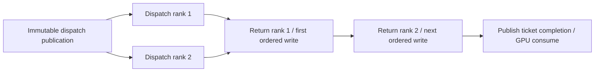
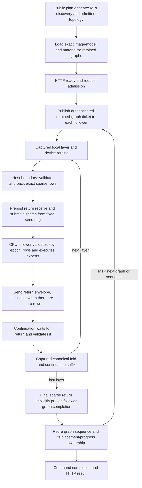
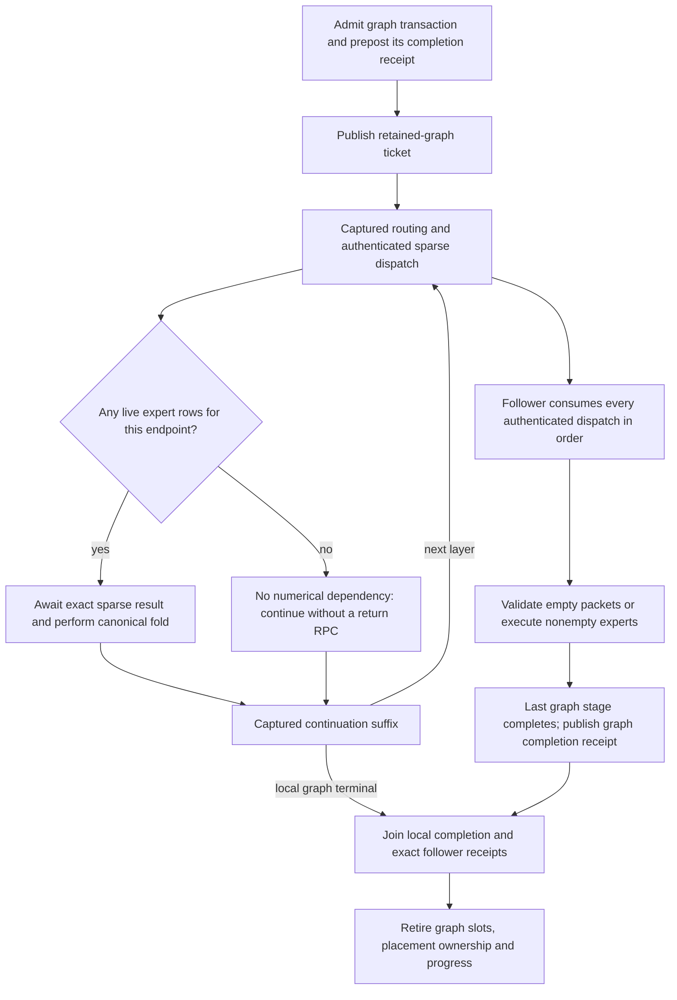

# Cross-host empty-route latency and completion ownership

Investigation/design, 2026-09-15. **The complete AVX512 Azure remote HTTP
projection is green: one/two CPU hosts, both public plan/apply and direct
auto-serve, with dynamic movement and MTP.** Complete dual-ISA production-image
certification remains incomplete.

## Full remote projection green, 10:35 UTC

Tree `ffed629cb27cd2b23ef3a673c7e2e0d91c6482b1` built the full AVX512 builder
and Release runtime, discovered all 510 canonical cells, and passed the complete
installed gate: **656 Unit + 187 preflight groups**, 704.064 seconds. The native
gate also passed both complete inventories; the new MPI overlap regression had
already passed twenty fresh launches. Runtime:
`sha256:d945b202ef1a784d313214d2f906421d65edb1e7f5e6e5bb979a0dd42dc2cc84`.

The canonical runner prioritized both previously failing two-host cells, then
the one-host regressions. Each passed **43/43 HTTP checks**, all eight full
long-context checks, and independent remote-work/transport/movement validation:

| Remote CPU hosts | Frontend | Complete cell seconds |
|---|---|---:|
| 2 | Plan/apply | 574.005 |
| 2 | Direct auto-serve | 557.191 |
| 1 | Plan/apply | 417.720 |
| 1 | Direct auto-serve | 430.596 |

All retain the original 60-second readiness and 600-second cell limits,
FP32 activations, FP16 KV, IQ3_S weights, dynamic MTP, prefix restoration and
histogram-driven movement. For two-host plan/apply, the CPU ranks prove
21,124/30,290 prefill routes, 1,251/672 decode routes and 3,811 matched graph
completions each. Root movement diagnostics record 88 promotions and 88
demotions. Both direct-auto cases passed readiness in this run; that does not
establish the cause or eliminate variability of the earlier cold-start failures.

The two-host plan/apply needle checks took 46.53/41.98/41.42/44.81 seconds,
174.74 seconds combined versus 244.95 previously. Root remote-return waiting
fell from 283.94 to 215.22 seconds. These are observed whole-workload timings,
not a controlled throughput certificate; nested timers must not be summed.
Decode is not a demonstrated win: the same 2,048-token generation check took
187.87 seconds versus 178.31 previously, with different generated contents.
The other cells' generation checks also completed their full 2,048 tokens.

Report: `parity-results/remote-fanout-e2e-20260915/report.json`.
The canonical report validator passes with exact image/source identity and
`complete=true`, `all_resources_retired=true`. Both owned Azure VMs were
independently observed deallocated; the retained lease is retired at reuse 14.
All owned local inference containers were removed. No checkpoint was pushed.

The image update exported a 7.62 GB archive, sent 58.6 MB of literal data over
the WAN in 108.0 seconds, copied privately in 53.2 seconds and imported both
stores concurrently in 75.8 seconds. Model replicas reused their existing bytes
in 0.6 seconds. These are infrastructure setup costs, not inference latency.

Remaining broader work includes replacing the topology-only automatic cost
placeholder with model/device/link evidence, finishing the routine generation
gate integration, and completing both ISA images' ordered certification. This
remote report does not substitute for those missing gates. This documentation
update postdates the frozen image tree above.

## Independent rank-batch fork/join, 09:10 UTC

The production graph contained `return(rank 1) -> dispatch(rank 2)` inside
the remote-tier loop. Independent MPI rank-pair channels were therefore
serialized despite their own persistent send/receive workspaces. Both GPU
preflight tests reproduce this for serial, prefill and grouped-verifier row
geometries. Their old graphs fail the new ordering assertions on CUDA and ROCm.

The replacement keeps the prior tier's entry dependency and the exact return
accumulation order, but freezes that entry for all peers. A typed setup helper
adds the fork/join edges in linear space without adding graph nodes, buffers,
threads, native launches or runtime protocol messages:

Every asynchronous send now precedes the first blocking return; CPU experts
on different hosts can execute concurrently. The shared reduction destination
still has serial writers in its original arithmetic order. This is not a
change to placement, capacity, graph capture, weight formats or precision.
Different tiers retain their existing shared-owner sequencing in this slice.
Device-free tests cover one through eight lanes, reverse node insertion and
invalid lane declarations. Existing CUDA/ROCm cross-host ticket preflight
groups also assert the invariant. All five focused graph Unit/lowering groups
passed in 3.82 seconds. The existing MPI transport suite and new three-rank
fork/join integration passed in 2.16 seconds. In the new test, both followers
must exchange a receipt after receiving work before either may return; this
rejects serialization without a timing threshold. It covers 24 prefill/MTP
transactions, depths 2/15 and single-send-slot reuse. Twenty fresh MPI runs
passed in 19.82 seconds. The new group joins production preflight. The complete
native prerequisite refresh passed at 09:32 UTC: 656 Unit groups in 75.80 seconds
and 187 production-preflight groups in 622.99 seconds, with 1,024.54 seconds
including build preparation. The receipt is
`parity-results/remote-rank-fanout-prerequisites-20260915/prerequisites.json`.
Images and Azure inference have not yet been remeasured with this fix.

The short direct-auto INFO probe also failed readiness: automatic selection
completed at 09:04:02.93, graph configuration started at 09:04:05.13, prepared
CPU service measurement finished at 09:04:36.43, and serving-family preparation
finished at 09:04:45.32. The watchdog interrupted movement profiling after
12/36 waves at 09:04:50.30. Thus the remaining startup issue precedes inference
and is independent of the rank-batch fork/join defect. Both VMs were deallocated
(retained lease reuse 13). No hidden timeout extension or eager path was used.

## Two-VM feedback and timing attribution, 09:03 UTC

The separated plan/serve retry (`remote-plan-readiness-e2e-20260915`)
passed readiness in approximately 54 seconds. All 37 short HTTP checks and
four needle checks passed; their durations were 74.75, 66.42, 65.33 and
66.65 seconds. The shared 600-second watchdog interrupted the 2,048-token
generation check. This is still a failed cell, not an evidence-only failure.
Both owned VMs were deallocated. No timeout or numerical policy changed.

The previously unseen two-VM direct-auto case was then run first with normal
WARN logging (`remote-auto-first-e2e-20260915`). It failed the 60-second
readiness gate before HTTP checks; its resource retirement is also verified.
An INFO-level short public-HTTP probe now isolates that startup boundary.

The earlier complete two-VM inference evidence attributes 237.89 seconds of
279.94 seconds of prefill to remote return waits. Those waits include remote
compute and network progress, not just wire transit. The first CPU VM records
only 2.45 seconds of actual expert compute across the whole workload, so CPU
arithmetic is not the dominant explanation. Graph-completion waits total
80.30 seconds across main and MTP transactions; these nested timings must not
be added to graph execution totals. Root-observed activation payloads were
486.97 MB dispatched and 474.37 MB returned, plus 353.63 MB of completed
placement-change projection payloads. Source inspection confirms live-row
encoding, preposted numerical return receives and asynchronous sends; a
whole-capacity copy has not been found. Packet-level latency and startup
attribution remain open, and no new runtime speedup is claimed.

## Installed gate and separate plan/readiness clocks, 08:45 UTC

Both full-backend ISA image pairs built from tree
`0665fe9c2162a4d654e102f72f4ede9f179f259f`, each discovering 510 cells.
The installed AVX512 gate passed **656 Unit + 186 preflight groups** in
698.512 seconds. Its runtime is
`sha256:2afc9366b5b91e7a82afefe554d312f54ec15c058511856496f986e0f42ef323`.
The AVX2 installed gate remains unrun. No complete image certificate exists.

Prioritizing the two-VM plan/apply case exposed a startup timing defect in
the driver. Both the normal and INFO-level retries hit the 60-second server
readiness window before HTTP checks. The latter's plan document was written
at 08:31:09.946 after the harness started at 08:30:57: the readiness clock
was incorrectly charging a separate public `plan` MPI job and document copies
before `serve` even began. Native serving-family preparation completed in
6.3 seconds at 08:31:54, then bounded movement profiling reached 9/36 waves
when the readiness timeout terminated the cohort. CPU service measurements
were about 12 ms, not the source of the delay. Neither failed report is green;
both leases were retired and both VMs deallocated.

The driver now runs plan preparation explicitly before the HTTP harness.
`E2ECellBudget` gives planning and HTTP execution one immutable ten-minute
deadline; only the server's own readiness window begins later. No timeout,
model policy, activation precision or mathematical gate changed. Preparation
failure/cancellation cannot start serving. The original wrapper regression
failed because `serve --config` secretly invoked another `plan`; the corrected
driver passes 177 pipeline-policy and 20 E2E-policy unit tests. These local
driver changes still need the full installed gate when incorporated into a
new frozen image pair. A targeted retry uses the existing tested runtime first.

Reports/logs: `remote-domain-e2e-20260915` and
`remote-domain-startup-info-20260915` under ignored `parity-results/`.
The current targeted retry is `remote-plan-readiness-e2e-20260915` and starts
with two-VM plan/apply, then the unrun two-VM direct auto-serve case. The exact
runtime is already cached on both VMs, so retries skip image export/upload.

The previous two-VM timeout's second-rank file survived on its retained disk.
A read-only summary confirms 34,622 prefill, 103 serial-decode and 543 grouped
verifier routes. That supports an evidence-collection timeout, but does not
retroactively certify the interrupted report. Also, the one-VM plan initially
assigns 255 experts/layer to GPU and one to CPU; dynamic movement exchanges
expert identities in those slots rather than draining the CPU down to one.

## Full-image remote campaign, 07:40 UTC

Both ISA images built from tree `e75e9189d3ad5a8e166e2523a76596819edfa234`
and discovered all 510 cells. The installed AVX512 builder passed **656 Unit
and 186 production-preflight groups** in 696.56 seconds. The earlier native
refresh hit five script timeouts while concurrent Docker writes stalled
directory fsync in `jbd2_log_wait_commit`; all five passed unchanged in 5.89
seconds afterward. The successful installed gate ran after the image builds,
not concurrently with them. No timeout was enlarged or failed receipt reused.

`parity-results/remote-graph-family-e2e-20260915/report.json` records:

| Remote CPU hosts | Frontend | Result |
|---|---|---|
| 1 | Plan/apply | **43/43 green**, 482.39 seconds |
| 1 | Direct auto-serve | **43/43 green**, 469.76 seconds |
| 2 | Plan/apply | Eight long-context checks passed; 600-second watchdog during shutdown/evidence collection |
| 2 | Direct auto-serve | Not run |

The first cell proves 28,306 CPU prefill routes, 924 decode routes, 3,816
matched graph-completion receipts, two completed prefix restores including
hybrid/MTP state, and 50 promotions plus 50 demotions across 40 epochs. The
second independently proves 28,548/1,003 prefill/decode routes and 3,839
completion receipts. Their 2,048-token generation checks took 150.41 and
158.63 seconds respectively; these are HTTP-check durations, not isolated
decode benchmarks. The two-VM plan assigns 254 GPU and two CPU experts/layer.
Its long generation passed in 178.31 seconds. Both VMs were verified retired;
the run is **not a complete image certificate**.

Two issues are isolated in the two-VM attempt. First, descriptor resolution
misclassified global sparse followers using an old dense-domain helper catalog,
emitting repeated unsupported-runtime warnings. A device-free regression was
red first. The fix removes the redundant readiness/pending fields and retains
the previous hard dense-continuation restriction as explicit role-specific
validation at graph admission. It does not advertise new execution support or
change arithmetic, movement, or transfers. Native descriptor and factory Unit
groups pass; the regression covers both GPU vendors and one/two remote CPUs.

Second, all HTTP checks finished at 07:34:06, with only nine seconds remaining.
The root exported a 95.6 MB PerfStats file at 07:34:12; serial remote evidence
collection copied rank one's 29.2 MB file at 07:34:17, after the watchdog. The
second peer file was not collected, so complete transport/shutdown proof is
still missing. Evidence downloads now overlap and use SSH compression while
retaining the exact plain JSON and validating the whole cohort before exposing
files to observers. A local compression sample reduced the peer file to 1.05 MB
in 0.21 seconds; real transfer improvement still requires measurement.

The remote runner now accepts repeatable `--first-case` scheduling priorities,
never a reduced certification subset. The next fresh image attempt must run
the failing/unseen two-VM cases first. Focused Python pipeline policy tests
pass (174 tests). These changes postdate the above image freeze and require
fresh installed-image gates; the AVX2 complete gate is still outstanding.

## Full-image Azure measurement, 05:26 UTC

Both image variants built from tree `575d280829d7979ab9e2de98b312cbb72949d3d2`
and discovered all 510 canonical cells. The native gate passed 655 Unit and
186 production-preflight groups in 766.754 seconds. Ten focused installed-image
groups passed for each ISA (10.57 seconds AVX512, 12.93 seconds AVX2).

The identical short HTTP probe used AVX512 runtime
`sha256:61f03cbe340a5b27070b001caf2b525c715c6b9737adba02dbea36595f541d0b`
on the controller and both staged peers. Evidence is in
`parity-results/remote-http-profile-20260915/attempt3-empty-returns/`.
The 32-token request fell from 22.692 to **4.239 seconds (5.35x)**; the 64-token
request fell from 44.142 to **6.870 seconds (6.43x)**. Request bodies and response
messages are identical to the baseline. Readiness took 49.64 seconds. The
server shut down cleanly, both rank files were collected, and both owned VMs
were verified deallocated (retained lease reuse count six).

The canonical cross-host observer passes the paired files: 146 completed remote
CPU prefill routes, 214 decode routes, 1,819 dispatches, 141 physical returns,
1,678 empty outcomes and 298 matched graph-completion receipts. Root numerical
return waits fell from 60.843 to 4.792 seconds; the independent graph-completion
joins cost 2.395 seconds. Do not add overlapping GPU intervals to these host
timings. No precision, model format, MTP policy, collective or test gate changed.

The archive contains 7,619,287,040 bytes, but its incremental WAN transfer sent
60,856,621 bytes in 108.9 seconds. Private fanout took 53.2 seconds, and both
real VM imports completed concurrently in 63.7 seconds total. Local Docker
export remains a material setup cost and was not separately instrumented in
this run. Image staging is not inference time.

An independent host-launcher defect surfaced before installed tests: its GPU
probe unnecessarily created a bridge network and stalled on this host. The
GPU, attachment and device-metadata probes now all use inference's host network.
Regression tests were red first; all 172 pipeline-policy tests pass. Real GPU,
attachment and metadata probes complete in 0.575, 1.638 and 0.438 seconds.
These Python/shell changes occurred **after** the image source freeze. They
must enter the next source-bound build; neither these focused passes nor the
short HTTP comparison certifies the images.

The full run under `parity-results/remote-empty-returns-e2e-20260915/report.json`
finished its first one-peer plan/apply cell in 438.27 seconds. All eight
long-context checks passed, including 2,048 generated tokens in 157.23 seconds.
Remote CPU proof contains 24,957 prefill routes, 784 decode routes and 3,737
matched graph-completion receipts. Both owned VMs were deallocated (reuse seven).
The three remaining remote cases have not run.

Certification stopped at an observer defect: the graph validator inferred
topology from CLI strings and classified the saved GPU/CPU plan as `unknown`.
The same assumption silently skipped explicit prefix requests and MTP/prefix
feature requirements. The replacement publishes admitted participant/attention
roles per rank and service policy once from the authority. The harness consumes
that runtime-owned contract and always sends its prefix-related request cohort.
It preserves the exact graph boundary/materialization/replay and physical
movement checks. Old artifacts cannot be retroactively certified with invented
startup records.

Separate diagnostic inspection of those old files confirms Dynamic movement:
46 CPU-to-ROCm promotions and 46 reverse demotions in the authority's records;
the independent completed physical-movement observer passes. MTP execution also
passes independently. Prefix harvest exists but completed restore does not,
consistent with the skipped explicit probe. Fresh images and the exact Azure
cell must prove the repaired workload and all observers together.

Focused validation: the rebuilt ServerMode Unit target passes; 125 existing
Python evidence tests and the new runtime-contract regressions pass. The complete
656-Unit/186-preflight transaction **passed** in 745.903 seconds under
`parity-results/server-execution-evidence-prerequisites-20260915`. Both new ISA
images built and discovered 510 cells. Neither is certified yet.

The offline audit then exposed a second observer bug: unused setup variants and
live MTP variants share a semantic context but have different terminal stages.
The observer merged their physical inventories and demanded launches for unused
tails. Remote sidecars also publish segmented replay, which the sidecar observer
mistook for missing full-graph replay. The current fix issues one process-local
diagnostic family ID when a capture plan is built; all units, initial submission
and replay retain it across request reset and ownership moves. Cache retirement
invalidates it. It does not control execution, add GPU operations, or depend on
PerfStats being enabled. Each live family must launch its own full inventory;
unused variants may not provide launch evidence to another family. Segment
proof still requires a genuine heterogeneous boundary. Three new Python tests
bring the graph-policy suite to 128 passing cases. All 139 native graph Unit
cases, both real-device ticket regressions, and the runtime-contract test group
pass together (five CTest groups, 2.56 seconds). Exact metadata assertions were
updated to include the new family tag without relaxing existing event checks.
This fix postdates the successful gate and image freeze; the full prerequisite
refresh and both ISA builds now run under the `graph-family-evidence-20260915`
and `production-graph-family-20260915` artifact roots respectively.

## Empty-return implementation and current gate

The rank-batch transport now retains one typed numerical obligation per dispatch:
peer payload or empty contribution. It snapshots authenticated participant,
epoch and geometry metadata in setup-owned storage rather than borrowing caller
views. Empty source returns publish only metadata/count zero; they do not clear
or copy reserved tensor storage. Targets still consume every dispatch and reject
nonempty or mismatched expert output for an empty obligation. Nonempty batches
retain the exact existing wire codec and preposted MPI return receive. Local
shared-page transports, weight formats and arithmetic are unchanged.

The complementary regression first failed against the old transport. It now
proves that numerical completion crosses a deliberately held peer, while the
earlier graph-retirement regression proves that retirement cannot. Both return
layouts, two participants, changing residency epochs, prefill/serial/depth-15
keys, 24 alternating empty/nonempty rounds and caller-metadata reuse are covered.
The test asserts 48 dispatches, 24 actual returns and 24 empty outcomes on each
endpoint, and exactly 48/24 source/target MPI sends. The complete MPI suite
passed twenty fresh processes in 20.74 seconds. The first rebuilt Unit run found
one stale source-order assertion naming the removed receive member. A new
device-free observing-MPI test now proves actual prepost-before-dispatch for
nonempty payloads and no receive for empty outcomes, while source bans on
blocking waits remain intact. All 39 collective-workspace tests pass. The full
gate is retrying under `parity-results/cross-host-empty-prerequisites-retry-20260915`.

Observers now distinguish physical return transactions/bytes from separate
paired empty-outcome sequences, and reconcile every dispatch with one of those
outcomes. They also require paired graph-completion sequences; numerical
emptiness alone cannot certify a retired request. Main `mtp_depth=-1` parsing
is fixed, with real prefill/serial/verifier fixture geometry and malformed-value
rejection. All 22 focused observer tests pass, including entirely empty layers,
mixed outcomes, missing/duplicate/mismatched evidence, and receipt independence.
The receipt prerequisite's preceding full gate passed 655 Unit + 186 preflight
groups in 718.665 seconds. No new image or performance result is implied by any
of these native/model-free passes.

## Installed lifecycle prerequisite

`MoEOverlayMPIInferenceTransactionChannel` now preposts a fixed receipt buffer
before publishing each execution ticket. Its typed slot remains live after MPI
send completion until the source explicitly joins an identical remote receipt.
Only `MoEOverlayInferenceTransactionFollower` can publish that receipt: its API
is private to the owner that first joins executor return and local protocol
retirement. There is one receipt per graph transaction, not one per layer.
The receipt carries immutable graph identity, not model, KV or sampling state.

Retirement therefore joins local completion and authenticated remote completion
before releasing placement/progress ownership. Source send-buffer retirement is
also joined independently before slot reuse. An exhausted execution ring fails
immediately when MPI progress cannot release any of its slots. Unjoined graph
ownership or an outstanding receive at channel destruction is fatal; storage
is never silently released underneath MPI.

The focused two-rank regression first failed against the old implementation:
the source retired while the executor was held behind an independent test edge.
It now passes. The final private-API implementation passed the complete sparse-
transport suite in twenty fresh process runs (20.87 seconds total), including
both new regressions. The rebuilt full Unit suite passed 655/655; the 186-group
production preflight subsequently passed all 186 groups. Companion coverage wraps a
two-slot ring through twenty commands, joins graphs out of order, rejects stale
command/epoch/generation/depth/row identities, and exercises depth-15 geometry.
No new GPU kernel, stream synchronization, allocation during capture, format
change, alternate collective or image certificate is part of this prerequisite.

## Measured production boundary

The diagnostic uses the exact AVX512 full runtime image
`sha256:875a2180ba3641adbb8669a6bf7ec7b27932a84972c2db1618480b46789ccfbd`,
canonical Qwen3.6 35B IQ3_S ROCm0 + one Azure CPU host plan/apply inputs,
FP32 activations, FP16 KV, dynamic movement and dynamic-depth MTP. The request
is the existing structured-generation prompt, shortened only to 32 and 64
completion tokens for diagnosis. This is **not** a shortened E2E certificate.

Evidence: `parity-results/remote-http-profile-20260915/attempt2/` contains
selection/image identity, request/response bodies and monotonic durations,
server log, root PerfStats and verified VM retirement. Both VMs used their
authenticated cached full image; no image upload/import was needed. Model
metadata reuse took 0.6 seconds. Frontend plan plus server readiness took
52.23 seconds. The first diagnostic attempt failed before inference because
the optional `ping` executable was absent; that attempt retired its lease too.

| Observation | Result |
|---|---:|
| 154-token prompt, 32-token completion | 22.692 s |
| Same prompt, 64-token completion | 44.142 s |
| Combined HTTP request wall time | 66.833 s |
| Root MPI return wait, including peer work | 60.843 s (91.0% of request wall) |
| Decode/verifier return waits | 1,779 calls, 58.679 s, 32.98 ms/call |
| Prefill return waits | 40 calls, 2.164 s |
| Dispatch plus return codec work | 4.527 ms |
| Total live dispatch / return payload | 3,366,888 / 3,337,360 bytes |
| Transactions in provably all-empty aggregate bins | 1,615 of 1,819 (88.8%) |
| Return waits in those all-empty bins | 53.455 s (80.0% of request wall) |

The empty-bin lower bound follows the actual version-3 wire codec: one
participant has a 112-byte empty dispatch and a 100-byte empty return. Every
payload size is nonnegative above that minimum. A bin whose total bytes equal
count times the minimum contains only empty transactions. Mixed bins can hide
more empty transactions, hence this is a lower bound, not an invented exact
per-message trace. Endpoint/layer/depth tags match the corresponding waits.

`rank_batch_wire_wait` includes remote computation and progress; it is not a
pure network RTT. GPU graph event intervals also include these host service
gaps and must not be added to wire waits as independent kernel time. The
measurements nevertheless isolate the dominant dependency: authenticated
empty replies, not excess activation bytes or codec arithmetic.

Only the root PerfStats file was exported. Remote inference itself completed
and shutdown was clean, but paired rank observation is **not yet proved**.
The frozen image's public MPI bootstrap does not explicitly export PerfStats
environment variables to SSH-launched ranks. The working-tree bootstrap now
exports explicitly supplied portable diagnostics by name through MPI `-x`,
with focused tests excluding credentials and device-local settings. Rebuild
and prove per-rank files before claiming the cross-host transport certificate.

## Frozen-image lifecycle and the hidden coupling

Source anchors in the frozen image (the publisher is now changed in the tree):

- `MoEOverlayMPIRankBatchTransport::exchangeDispatch` always preposts a return;
  `exchangeReturn` always waits for it on the continuation rank.
- `MoEOverlayInferenceTransactionPublisher::retire` marks return-ready locally;
  it does not receive a separate follower graph-completion acknowledgement.
- `MoEOverlayInferenceTransactionCoordinator::retireCompletedGraphSequenceLocked`
  explicitly relies on the final sparse-return fence to prove follower
  completion before graph-slot reuse and progress publication.

Consequently, a tactical `if (empty) return success` would turn “no numerical
contribution” into “remote execution retired.” Those are different facts. It
could release placement ownership, reuse a graph slot or announce committed
progress while the follower still validates or executes an earlier ticket.

## Implemented simplification: separate numerical and lifetime dependencies

Keep one overlay authority and the existing graph transaction identity. Make
each layer's numerical requirement explicit, and give follower retirement one
explicit completion receipt per retained graph (not per empty layer).

Implementation contract (full-image validation remains outstanding):

1. Use typed pending-transaction alternatives for absent numerical output and
   awaited payload; do not add independent “skip/ready/received” flags. Empty
   results retain authenticated source/target, epoch, geometry and layout.
2. Empty dispatch notifications still reach the follower, which validates its
   sequence and epoch. A nonempty response to an authenticated empty dispatch
   is fatal. Do not forge a remote receipt or count elided replies as MPI bytes.
3. Preallocate completion/send slots, bind them to complete graph identity, and
   prepost receives before launch. Follow existing exact-event ownership for
   device terminals; no hot-path allocation or stream synchronization.
4. The controller may advance independent local work, but retirement, graph-slot
   reuse, MTP accepted-state publication requiring retirement, prefix reset and
   placement release must await the explicit completion proof. Delay/cancellation
   cannot create an inferred completion. Retain the standard 30-second bound.
5. Avoid another broad collective: receipts are point-to-point per actual
   follower, with all peers submitted before joining dependencies. Preserve
   existing captured all-GPU paths and node-local mapped channels.
6. Keep the protocol model-, codebook-, GPU-vendor-, rank- and tier-count-neutral.
   Transport only handles canonical sparse activations; it must not inspect
   expert quantization, assume 40 layers or special-case the Azure SKU.

Required focused gates: delayed empty follower, mixed empty/nonempty layers,
one/two remote ranks, stale/repeated/wrong graph and residency identities,
send-slot reuse, delayed final receipt, reset/shutdown while receipts are live,
MTP depth changes and prefix restore. Prove the continuation crosses an empty
numerical boundary while the follower is deliberately paused, and separately
prove graph retirement cannot cross that pause. Fold these into the existing
model-free integration preflight; performance evidence remains outside it.

### Observer defect reproduced and corrected

`cross_host_expert_overlay_perf_policy.py` previously parsed every geometry tag
as unsigned. `_tag({"mtp_depth": "-1"}, "mtp_depth")` reproduced its rejection
of the production Main key's valid non-MTP sentinel. Its existing fixture uses
`"0"` even for prefill, so that defect was hidden. Canonical signed parsing now
applies to this one field (not rank/layer/tier), with fixtures containing actual
main prefill, serial decode and grouped-verifier geometries.

Empty-return evidence now has a separate authenticated no-contribution witness.
Paired physical transport still requires positive real bytes. Elided replies
cannot count as physical MPI traffic or weaken nonempty CPU computation proof.
Dispatches reconcile with actual returns plus explicit empty numerical outcomes,
and exact graph-completion proof remains independently required.

After those gates, rebuild both immutable images, rerun this exact short HTTP
probe with paired endpoint observations, then the previously failing full cell.
Only then resume the three unrun canonical remote cases. Keep all eight long
checks and the 600-second cell watchdog unchanged.
