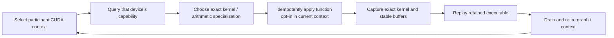

# CUDA BK256 context admission — 2026-09-11

## Reproduction and cause

The previously unseen `Qwen2_Q4_0_LocalPP_NCCL_2xCUDA_ActFP32_KVFP16_MTPOff`
generation control failed before HTTP readiness. The second pipeline stage
could not capture `layer12_down_proj` at M=4096, N=896, K=4864. The installed
exact prefill overlay selects the wide BK256 kernel for this shape. Its
59,392-byte dynamic shared-memory requirement exceeds the default CUDA limit.

`launchNativeVNNITC_BK256` kept two process-global `smem_configured` booleans,
one per arithmetic specialization. CUDA function opt-in belongs to the current
device context, not the process. GPU 0 set the flag; GPU 1 skipped its own
opt-in and failed launch. A per-ordinal boolean would also become stale after
context reclamation. An adjacent ordinal/result capability cache additionally
had unsynchronized publication across participant threads.

The focused production-bridge regression failed on GPU 1 at M=129 in
**0.870 seconds**, after GPU 0 had passed. No model, reference generation,
resource-query priming or alternate device implementation is involved. The
existing staging fixture queried kernel resources before launching; the
resource query itself applied opt-in and could mask this class of defect.

## Lifecycle simplification

There is no application-owned ready bit or second context-lifetime ledger.
The capability query uses CUDA's selected-ordinal attribute API. Function
opt-in is applied on graph construction/launch preparation, not graph replay.
Kernel arithmetic, tensor formats, tile policies, graph nodes and VRAM
requirements remain unchanged. Attribute or launch failure remains fatal to
the caller; no alternate kernel is attempted.

The source audit found no corresponding `hipFuncSetAttribute`/opt-in cache in
ROCm kernels. CUDA attention's function-attribute paths already configure the
current context directly. BK256 supports Q4_0 only; other codebooks use BK64,
and the common all-format preflight remains required after this change.

## Regression contract

The existing `V2_Integration_CUDANativeVNNIPrefillStaging` preflight registration
now includes sequential all-visible-device and concurrent participant launch
tests. They cover narrow/wide BK256, fresh instance-owned contexts, reverse
device order, and the actual 4096-row bucket. Each graph replays twenty times
against an independent all-ones arithmetic oracle, with poisoned output guards.
Resource inspection happens only after the launch proof and requires zero
local-memory spills and nonzero occupancy. Two streams per device exercise
same-context and cross-device preparation concurrently.

These are functional tests, not performance thresholds. Full Unit/preflight
must be refreshed once after rebuilding the runtime, then reused for unchanged
subsequent cells. Focused repetitions and the original Release server cell
remain required before calling the defect resolved.

Both new tests passed **20/20 repetitions each** after the fix. Each repetition
includes twenty replays per captured graph. Later iterations took roughly
0.4 seconds for the combined sequential/concurrent pair. This is diagnostic
fixture elapsed time, not an inference throughput claim. The Integration and
Release rebuilds are complete. The refreshed prerequisite gate is green:
**647/647 Unit** (73.83 seconds) and **136/136 production preflight** (504.27
seconds); build plus both gates took 593.447 seconds. The complete staging
integration registration, including the two additions, passed in 8.68 seconds.

## Evidence paths

Local ignored evidence is under `parity-results/`:

- `generation-qwen2-local-pp-cuda-unseen-01/`: original server failure.
- `cuda-bk256-device-context-red.log`: pre-fix focused regression failure.
- `cuda-bk256-device-context-stress20.log`: both focused tests, twenty repetitions.
- `cuda-bk256-context-integration-build.log`: Integration rebuild.
- `cuda-bk256-context-release-build.log`: Release rebuild.
- `cuda-bk256-context-prerequisites-01/`: refreshed canonical Unit/preflight receipt.

## Original cell retry: capture fixed, serving decode still red

`generation-qwen2-local-pp-cuda-fixed-02/` reaches readiness and completes both
the fresh and full-restore requests at 384 tokens each. Whole-cell time is
24.744 seconds. The original BK256 capture failure is gone, shutdown is clean,
and GPU memory returns to its starting level. However, fresh text is already
garbled, and full-restore completion first differs at token index 2. The cell
remains red; this is not a quantization-tolerance or early-EOS waiver.

The full hit restores all 139 prompt tokens from device-hot storage, with
terminal logits restored. Both devices report 767 request-input reader
admissions and 767 final-reader publications (one prefill plus 766 scalar
decode positions). The observer additionally reports zero reuse-wait counters.
The scalar position prelude does contain a reuse-event wait; whether this is
only incomplete observation must be resolved separately from the token defect.

The same canonical cell's short deep diagnostic passes in 5.789 whole-cell
seconds (4.491 seconds inside GTest), including eight validated artifacts:
`qwen2-local-pp-cuda-hf-after-capture-fix-01/`. It uses the cached reference pack,
nine prompt rows and five teacher-forced decode rows. This does not certify the
long public-serving path, which prepares its full graph family before requests.
Both follow-up runs reused the new prerequisite receipt and tmpfs GGUF with
zero additional prerequisite or copy cost.

An investigated cross-rank `GlobalOrchestrator` local-handoff hypothesis is
**not the active path**: `requiresNamedDomainGlobalGraph()` returns false for
these two rank-local domains owned by rank 0. Both configurations lower to
rank-local PP; do not patch the cross-rank router for this cell. Next work is a
focused serving-preparation/ordinary-decode/input-publication reduction. No
speculative follow-up runtime patch has been installed.

This note does not certify the token corpus, complete campaign, or Docker images.
