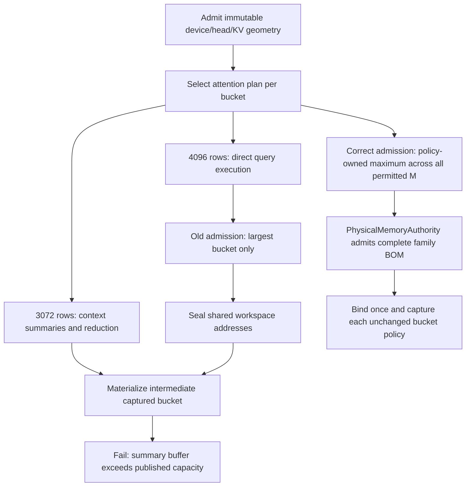

# Dense 27B generation controls — 2026-09-11

## Scope

The canonical inventory/history join selected seven previously unrun MTP-off
controls after the thirteen Ornith controls completed. They run sequentially
through the AVX-512 Release `llaminar2 serve` binary and public
`/v1/chat/completions`; the first failure stops admission of later cells.

The existing 649 Unit / 148 ProductionParityPreflight receipt is reused from
`native-movement-evidence-prerequisites-01/prerequisites.json`. No source or
build change was required before this run. All three required GGUFs are hits
in the sealed persistent tmpfs cache, with zero copied bytes.

Every cell retains four requests requiring 384 actual output tokens,
fresh/full/partial/full prefix-state verification, repeatability, graph-path
and memory evidence, and clean shutdown. No prompt, seed, precision, model,
timeout or numerical threshold is changed. The ten-minute cell watchdog
includes the entire server lifetime, not just HTTP generation.

## Progress

Local evidence is under
`parity-results/generation-dense27b-unseen-controls-01`; the sibling
`generation-dense27b-unseen-driver-01.log` records sequential admission.

| Model | Topology | KV | Status | Cell seconds |
|---|---|---|---|---:|
| Qwen3.5 27B Q8_0 | Two CPU sockets, NodeTP | FP16 | Passed | 330.243 |
| Qwen3.5 27B Q8_0 | Single CPU | FP16 | Passed | 544.638 |
| Qwen3.5 27B Q8_0 | Single CPU | Q8_1 | Passed | 540.918 |
| Qwen3.8 dense 27B IQ4_XS | Single CPU | FP16 | Passed | 402.978 |
| Qwen3.5 27B Q4_K_M | Two CUDA, LocalPP | FP16 | Failed before readiness; corrected rerun passed | 50.339 / 96.892 |
| Qwen3.5 27B Q4_K_M | CUDA/ROCm, LocalPP | FP16 | Passed | 131.015 |
| Qwen3.5 27B Q4_K_M | Two ROCm, LocalPP | FP16 | Passed | 132.462 |

The first four cells pass all eight harness checks and all four continuous
384-token requests. Their full-cache responses match their corresponding
fresh/partial responses exactly. The NodeTP terminal summaries prove RAM
restoration of both KV and main-model hybrid recurrent state: a 214-token full
prefix, a 214-of-289-token partial prefix, and a 289-token full prefix.

## First failure and lifecycle audit

The CUDA pipeline stops before serving a request while materializing its
3072-row captured prefill bucket. Attention asks for 1,207,959,552 bytes of
partial-output workspace, while the sealed family published 12,582,912 bytes.
This is not a timeout, device loss or numerical drift. The two remaining
pipeline controls were not launched. The first failing artifacts remain intact.

The CUDA selection is non-monotonic in query M: enough query tiles eliminate
the context-summary allocation at the largest bucket. ROCm already supplied
a family-envelope helper for this situation; CUDA stage allocation and
metadata admission both omitted the corresponding envelope.

Focused red-first evidence:

- `dense27b-workspace-metadata-red-01.log`: metadata admission fails the
  intermediate-bucket domination invariant on CUDA; ROCm passes.
- `dense27b-workspace-device-red-01.log`: the existing CUDA preflight stage
  descriptor test reproduces the capacity miss; its ROCm peer passes. Both
  complete in 3.65 seconds, without a model or inference request.

The implementation adds a CUDA launch-policy-owned envelope consumed by both
stage allocation and `WorkspaceMemoryEstimator`. It searches actual policy
interval endpoints below the physical grid-wave ceiling, not every context
row. The first context-selected plan when walking downward is the exact
maximum, because summary bytes grow with M. No runtime launch, arithmetic,
stream ordering, graph policy, or timeout changes. Capacity comes from real
graph geometry, not an anonymous reserve. Added tests exhaust all M through
4096 across head/batch/device geometries; existing model-free preflight entries
also test the descriptor invariant on FP32, FP16 and BF16 kernels on both GPUs.
The four focused registrations pass after the fix in 1.76 seconds, including
the FP32/FP16/BF16 real-device descriptor sweep. The host-only aggregation is
in `CUDAFlashAttentionWorkspaceEnvelope.h`; kernel launch code is unchanged,
avoiding unnecessary device-kernel rebuilds for future accounting edits.
The first full Unit refresh caught a real over-reservation before model
admission: 648/649 registrations passed, but
`ResidentGraphSelection_ChoosesLargestFittingBucket` rejected a 2K bucket at a
16K KV horizon. The first envelope call used the entire KV horizon as its query
bound, charging for unadmitted wider graphs. Both CUDA and ROCm now bound the
envelope by the declared query bucket while retaining the full KV horizon for
partition and conversion capacity. Serving materializes largest buckets first;
the existing serial-family merge combines separately declared participants.
No new lifecycle state or alternate accounting ledger is introduced.

The device regression now spans 32/512/2048/4096 admitted row limits and
4096/16384 KV horizons for all three kernel dtypes. It checks both coverage of
every smaller member and reduced partial-buffer capacity for the smallest
admitted bucket. Metadata coverage mirrors both horizons and TP1/2/4/8.
Two ROCm historical allocation goldens are adjusted only by the canonical
attention descriptor delta for removed unadmitted summaries; their remaining
byte and alignment assertions are unchanged. All five focused registrations,
including the full MemoryPlanner executable, pass in
`dense27b-workspace-bound-focused-02.log`.

The corrected shared gate passes all 649 Unit registrations (74.35 s) and all
148 ProductionParityPreflight registrations (532.76 s), 611.345 s including
driver overhead. The reusable receipt is
`dense27b-workspace-prerequisites-02/prerequisites.json`. Both AVX512 Release
and Integration gate/matrix builds pass. The exact failed CUDA cell passes in
`generation-dense27b-cuda-workspace-retest-01`: 96.892 seconds, all eight checks,
four 384-token requests in 11.610/11.403/11.468/11.284 seconds, exact restored
outputs, clean exit and zero residual VRAM delta. The first failure and all
previously green controls remain intact. The two previously unrun pipeline
controls pass in `generation-dense27b-unseen-pipelines-02`, reusing that same
797-test receipt and tmpfs model hit. CUDA/ROCm takes 131.015 seconds and dual
ROCm 132.462 seconds; each passes all eight checks, including all four
384-token requests, exact fresh/full and partial/full output equality, hybrid
prefix restoration, clean exit and zero residual VRAM delta. No gate, runtime
policy or timeout was changed between these cells.

All seven controls in this slice are individually green: 28 successful
requests, 10,752 generated tokens. The inventory/history join leaves 36 unseen
MTP-off controls, all 122B expert-overlay topologies. Previous failures outside
this slice and the MTP comparison lanes remain to be resolved; do not mistake
unseen-count reduction for a fully green matrix. No model/test processes remain
running, and the persistent model cache is retained for the next slice.

These are **unapproved diagnostic serial controls**, not HF numerical proofs,
MTP comparisons, an approved token corpus, or image certificates. Baseline
provenance, the remaining generation matrix and CI cutover, full E2E suites,
and separate AVX-512/AVX2 benchmark certificates remain outstanding.
