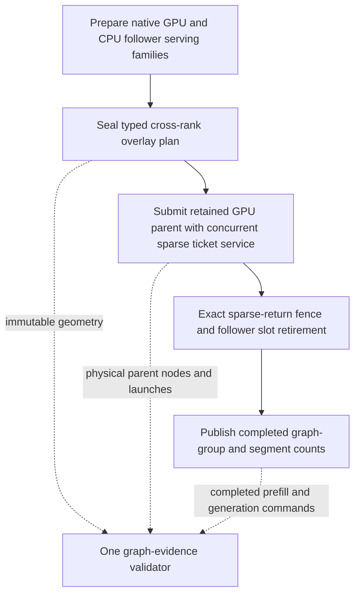

# ExpertOverlay generation boundary evidence — 2026-09-11

## First heterogeneous control

The first previously unseen Qwen3.5-35B Q4_K_XL CUDA1 + CPU2 node-overlay
control, Dynamic/Random with FP32 activations, FP16 KV and MTP off, completes
all four canonical 384-token requests. Fresh/full/partial/full request times
are 12.118, 12.103, 12.103 and 11.351 seconds. Whole-cell time is 77.272 seconds.
The server exits cleanly and releases its GPU memory. Its last harness check
rejects graph evidence, leaving the immutable first attempt at seven of eight
checks passed in `parity-results/generation-qwen35moe-heterogeneous-unseen-01/`.

The failure is not an observed arithmetic, prefix-state or device fault. The
HTTP validator recognizes child TP collectives and pipeline coordination, but
omits the installed sparse-overlay transaction authority. The continuation's
`has_collectives=false` correctly describes the absence of child TP nodes;
it does not deny the separate cross-rank sparse-return boundary.

## Actual lifecycle and fix

`MoEOverlayInferenceTransactionCoordinator` already publishes the correct
evidence. Its constructor validates source/follower rank membership, family
generation, participant counts and prepared segment geometry before publishing
`authority=typed_overlay_transaction_plan`. Retirement publishes
`terminal=sparse_return_retired` only after every authenticated follower slot
and continuation sparse-return fence complete.

The Python graph validator now authenticates this authority separately from TP
and PP: one same-rank plan, matching native materialization, nonzero generation,
consistent native/host/follower counts, and unique completed commands whose
segment totals equal plan segments multiplied by retired graph groups. Both
prefill and decode/MTP completion are required. Missing or inconsistent overlay
evidence fails even if a neighboring child reports a valid TP collective.
Existing per-rank/device/context physical executable and launch checks remain
mandatory. Homogeneous GPU segmentation and eager GPU execution remain errors.

Reading through the complete saved evidence also exposes a second stale check:
the shell separately demands `decode_graph_phase:replay`, whereas retained
parents publish `retained_parent_replays`. This run reports 1,531 main-decode
parent replays following its initial launch. Graph validation now owns the
capture/replay requirement through `DecodeGraphRequirement`; the shell selects
capture or replay without reinterpreting counters. Prefill and sidecar replays
cannot satisfy the main decode/verifier obligation. The unconditional short
GPU probe capture requirement is preserved.

There are no production runtime, stream, precision, allocation, graph or
configuration changes in this fix. Consequently it adds no inference overhead.

## Verification and remaining obligations

The device-free HTTP policy suite passes 121 tests, including the reduced real
overlay schema, both GPU vendors, shifted continuation ranks, two/three rank
segments, grouped MTP retirement, missing/malformed/foreign evidence, required
physical executables, and capture-only versus repeated-decode requirements.
Its existing `V2_Unit_ServerGraphCapturePerfPolicy` registration puts these
regressions in the complete Unit gate. This is a validator defect; no new
device implementation is being substituted for the existing preflight tests.

A read-only execution of the actual harness's complete Python evidence block
passes all 64,302 saved records after the fix, including movement, prefix,
memory-authority, attention and host-transfer policies. The original aggregate
and failed report are not rewritten. This offline diagnosis is not a fresh
green cell or an approved token baseline.

The refreshed shared gate passes 647 Unit and 137 ProductionParityPreflight
registrations in 594.269 seconds (Unit 73.77 seconds, preflight 519.61 seconds).
The reusable receipt is
`parity-results/overlay-boundary-evidence-prerequisites-01/prerequisites.json`.
Continue the nineteen untouched controls from the same canonical heterogeneous
selection, sharing this receipt. Respect unseen-first scheduling; the fixed first
attempt still needs a later fresh live verification. Neither this evidence
repair nor control collection establishes the full HF/generation matrix,
approved corpus, E2E/benchmark certificates, or either ISA's shippable image.

## Live unseen follow-up

`generation-qwen35moe-heterogeneous-unseen-02` shares that receipt and the sealed
tmpfs entry (zero copy bytes). Three previously unseen CUDA1/CPU2 controls pass
all eight checks: Dynamic/Ordinal in 75.380 seconds, Static/Random in 69.061
seconds and Static/Ordinal in 67.914 seconds. Read-only comparison of the saved
four response vectors finds exact token equality among all three configurations.
These are unapproved controls, not new HF proofs.

The next first attempt, CUDA1/ROCm1/CPU2 Dynamic/Random, passes token probes,
graph validation and clean shutdown but correctly fails required physical
movement evidence. Its 70.081-second attempt stops the batch with three passes,
one failure and fifteen selected cells still untouched. The cause is separate
from this validator fix: see the
[cold-format economy readiness investigation](generation-overlay-cold-service-readiness.md).
