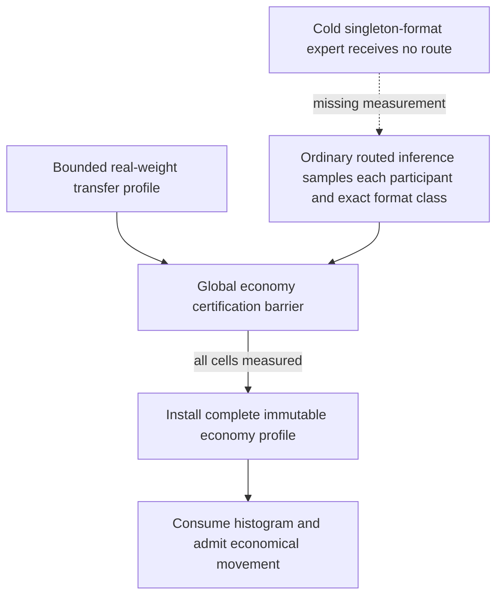
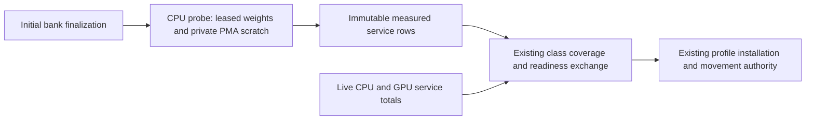
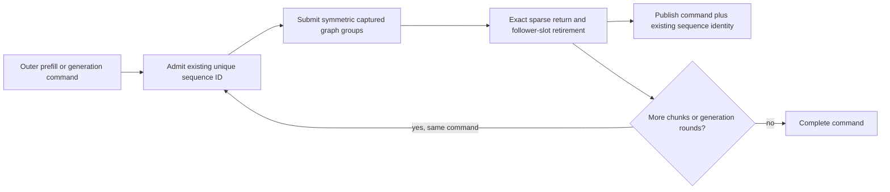

# Cold-format service readiness blocks Dynamic — 2026-09-11

## Preserved first failure

The previously unseen Qwen3.5-35B Q4_K_XL CUDA1/ROCm1/CPU2 two-MPI-rank,
Dynamic/Random, FP32 activation, FP16 KV, MTP-off control fails only the final
movement requirement in `parity-results/generation-qwen35moe-heterogeneous-unseen-02/`.
Its artifact key begins `697b076e59112316`. All four 384-token requests complete;
captured graph, prefix restore, memory ownership and shutdown checks pass.
No approved token corpus or HF mathematics certificate follows from collection.

The bounded CPU service-measurement producer is now installed and verified in
the exact Release HTTP cell (see the latest section). The original failure is
retained; neither its workload nor movement requirement was relaxed. A fresh
647-Unit/143-preflight receipt covers this build and is reused for subsequent
unchanged-build cells.

## Concrete evidence

The authority's initial-bank observations report 164 experts per layer on CUDA,
90 on ROCm, and one on each CPU socket. Capacity filling leaves very sparse CPU
demand. These are observed counts from this run, not recommended manual limits.

Read-only GGUF tensor metadata establishes two exact expert-format classes:

| Layers | Gate / up | Down |
|---|---|---|
| Every main layer except 10 | Q4_K / Q4_K | Q5_K |
| 10 alone | Q5_K / Q5_K | Q6_K |

The layer catalog groups all three projection identities exactly and selects
telemetry layers 2, 8, 10, 14, 20, 25, 31 and 37. CPU participant 2 completes 54
layer-10 decode expert packets and one prefill packet. CPU participant 3
completes no layer-10 expert packet in either phase. It does execute experts in
many other layers. Its last recorded readiness deficit is representative layer
10, decode. Different-format measurements cannot discharge that deficit.

Transfer profiling completes on both ranks in about 1.9 seconds, with 36
non-publishable calibration waves per rank. Their staged/copied bytes and
aborted candidate banks are expected profiling evidence, not committed
placement. There are no `expert_migration_edges` and no completed device
movement transaction/edge/byte triplets. The two ranks each complete 402
service-readiness rounds with `AwaitingEvidence`; shutdown ends the exchange.

## Current dependency

`MoEOverlayEconomyCertificationController::serviceEvidenceCoverage()` demands a
real observation for each participant, exact manifest class and priced phase.
`poll()` uses all-rank readiness before exchanging and installing profiles.
This rejects invented prices correctly, but makes overall liveness depend on
ordinary prompts routing to every required class on every participant. A finite
or even long repeated workload cannot guarantee that. This is not repaired by
longer timeouts, another collective, relaxed token gates, or counting calibration
copies as movement.

## Fix direction to implement and verify

The smallest bounded-lifecycle candidate is to complete missing service prices
with real prepared-expert kernel measurements owned by production preparation,
not the benchmark/test runner. Reuse the exact manifest catalog and production
expert kernels/streams; measure only missing participant/class/priced-phase
coordinates. This is a kernel microprobe, not synthetic full-model inference:
it must not change tokens, routing histograms, KV, prefix state or placement.
Keep scratch under the physical memory authority and order publication with
exact events. Measure its startup cost explicitly; do not install a multi-second
inference warmup or an anonymous memory reserve. CUDA, ROCm and CPU need the
same typed contract and all formats, including floating-point experts.

An alternative is incrementally certified, candidate-local economics. That
requires explicit unavailable prices, monotonic profile versions, exclusion of
unpriced moves and safe profile publication on both authority implementations.
Do not implement it by clearing graph reachability bits, pricing missing rows
at zero, borrowing another backend's measurements, or pretending an incomplete
global certificate is complete. Audit its extra lifetime machinery before
choosing it over a bounded setup measurement.

First add a model-free regression with a singleton format class and an idle
participant while other participants continue real work. It must demonstrate
that preparation/economics can become ready without routing to the cold expert,
and that no fake histogram or placement change is recorded. Device integration
must prove actual kernel measurement, immutable inference state, event ownership
and capture compatibility, then join ProductionParityPreflight. Refresh the
shared Unit/preflight receipt once after the implementation and required builds.
Continue unseen-first acquisition without replaying the full expensive pipeline.

At this handoff the 175-control inventory has 75 latest green observations,
17 retained reds and 83 unseen cells. These are historical individual results,
not a fresh aggregate certificate. The just-finished four-cell batch leaves
fifteen selected heterogeneous controls untouched; other manifest families also
remain unseen. Both ISA Docker/E2E/benchmark certifications are still unfinished.

## Installed coverage consolidation — 2026-09-11

`MoEOverlayEconomyCalibrationLayerCatalog::serviceEvidenceGaps()` now owns the
complete, canonical participant/exact-format/phase missing set. The existing
certifier delegates its first-deficit diagnostic to this query; the former
private duplicate coverage walk is removed. Each gap includes only equivalent
layers actually priced in that phase, which need not include the transfer
representative. It validates all rows before returning gaps, so an early cold
coordinate cannot hide malformed, overflowed, unordered, or disabled-phase
evidence later in the snapshot. Empty local participant sets remain legal for
relay ranks. No measured totals, prices, placement, or histogram are mutated.

The focused calibration-controller binary passes all 14 tests. Four added
regressions cover the actual Q4_K/Q4_K/Q5_K versus Q5_K/Q5_K/Q6_K mixed triplets,
an idle participant, priced versus merely reachable layers, malformed evidence,
and the canonical 21 source codebooks plus FP16/BF16/FP32. These tests prove the
shared coverage contract, not real-device probe execution or liveness of the
failing Dynamic cell. Build logs are `cold-service-coverage-build-0*.log` under
the ignored `parity-results/` directory; the first build caught a test fixture
assignment error which was fixed before the passing build. All five related
economy/measurement/maintenance/residency Unit registrations also pass;
`cold-service-related-tests-01.log` retains that run.

### Execution ownership constraint (execution views now verified below)

Do not construct a temporary `MoEExpertComputeStage` over live shared engines
and bind a private workspace after serving graphs are bound.
`MoEExpertComputeStage::bindWorkspace()` unconditionally rebinds all prepared
GEMM engines; `unbindWorkspace()` likewise clears their bindings. GPU stream
binding can mutate shared engine execution state too. A short-lived probe could
therefore leave serving engines bound to freed scratch even if its tensors are
otherwise private. This is an identified risk in the proposed implementation,
not an additional observed device failure.

The actual probe must run before serving engine bindings become live, or own
independent execution bindings over lifetime-pinned immutable prepared bytes.
Audit `MoEOverlayParticipantGraphRunner`'s initial-layer registration and
`OrchestrationRunner::initializeMoEExpertOverlayResidencyMaintenance()`'s
`finalizeInitialPreparedResidencyBanks` boundary before selecting the hook.
Existing non-publishable transfer calibration also retains private destination
weights before abort; reusing that ownership is worth checking, but calibration
profile reuse must not bypass required service measurements. Do not add an
unconditional clone/copy or another request-driven warmup to evade this issue.

GPU boot measurements additionally must not be inserted into the host endpoint's
ordinary cumulative counter and then overwritten by device counter imports.
`importServiceMeasurements()` and direct host recording are exclusive writer
regimes. Preserve one authority and exact cumulative identity when integrating
setup evidence. The existing all-rank readiness exchange and immutable profile
installation should remain the only certification lifecycle.

## Verified execution views and separate setup evidence — 2026-09-11

`KernelFactory::createExpertServiceExecutionView()` now gives GPU probes private
stream/workspace/library bindings over the source engine's exact prepared
allocations. It preserves physical decoder format and original arithmetic
provenance independently. CPU NativeVNNI engines are immutable and may be
shared; CPU floating engines now have an aliasing-source constructor that
retains the same tensor and numerical policy but a private workspace binding.
The original prepared engine remains retained. No expert weights are copied or
repacked by this operation. Production probes must additionally retain the
published bank lease while selecting/using an expert; retaining an allocation
alone is not permission to race a recyclable slot's next generation.

The new model-free `Test__PreparedExpertServiceExecution.cpp` uses actual
`MoEExpertComputeStage` FFNs, including the CPU transported-row grouped
workspace and nonempty native CUDA/HIP graph capture. It covers all 21 source
codebooks plus FP16/BF16/FP32, with M=1 decode, M=8 prefill and M=4 grouped
verification. A retained serving graph runs before a private probe, the probe
is destroyed, and serving replays again. All three outputs must agree byte for
byte. Exact GPU timing events also prove positive elapsed work; these tiny
fixture measurements are not model economy prices or performance certificates.

The fixture first exposed its own missing external-event admission before
capture. It now joins setup publications with `TransferEngine` before
recording, as the normal executor does. Its ROCm Q8 preparation also initially
selected the generic GEMM packer's row-scaled INT8 representation, which is not
the separated native-block overlay descriptor. The fixture now constructs the
actual overlay representation for every codebook, without changing source
precision. Neither fixture correction changes the preserved model failure.

CPU, CUDA and ROCm each passed 20 complete process repetitions (60 total) in
91.62 seconds. The three registered tests together subsequently passed in
5.03 seconds after rebuilding the certifier. They join
`ProductionParityPreflight`; the AVX2 CPU dispatch has a separate registration
using the same source, not a second format list. Ownership-only factory tests
also pass on all three backends. The AVX2 registration also passed all 20
repetitions in 12.32 seconds, bringing this slice to 80 passing stress processes.
The canonical preflight inventory now contains 143 registrations; it has not
yet been rerun in full on this build.

`MoEOverlayEconomyCalibrationLayerCatalog::withPreparedServiceEvidence()` now
composes immutable setup observations with a canonical live snapshot. A live
observation anywhere in a participant's exact class/phase owns that price;
only wholly unobserved classes use measured setup rows. Malformed, overflowed
or wrong-owner input fails even if its price would not be used. Neither input
is mutated and an unmeasured class remains a deficit. The certifier's typed
`prepared_service_measurements` configuration feeds that composition into its
existing readiness/exchange/rebase/install state machine. It never writes
these values into CPU or device cumulative counters.

All 17 calibration-controller/catalog tests pass, including completion from
prepared observations with no routed service samples, a GPU endpoint already
owned by device snapshot imports, unchanged zero live counters, unchanged
placement epoch and exactly one existing routing rebase/certificate. The six
related Unit registrations pass together in 0.76 seconds. Evidence remains in
the ignored `cold-service-*` logs under `parity-results/`.

### Earlier production boundary — superseded for CPU below, not a model pass

No production caller supplies `prepared_service_measurements` yet. The real
expert FFN measurement currently runs only in the integration proof. The
failing Dynamic control therefore remains red; no new model cell has run and
the complete Unit/preflight receipt is still stale. Do not interpret the
device-free completion proof as actual prepared weights being measured by a
Release server.

Next, supply a bounded production-owned measurement producer after initial
prepared-bank finalization and before concurrent serving/maintenance admission.
Use the catalog's exact missing set, retain its bank lease, and run each CPU
participant on its actual NUMA/worker placement and each GPU on its owner
worker. Lift the proven stage/capture/event procedure, not the test fixture's
unbound allocator constructors, into that producer. Its tensor, grouped CPU
scratch, workspace and native executable BOM must be admitted by the existing
`PhysicalMemoryAuthority`; no new parallel ledger, anonymous reserve or
workspace borrowed from an already captured serving graph is acceptable.
Retain one bounded scratch family per concurrent participant, not per model
layer, and measure setup wall time explicitly. This remains a few expert-kernel
observations, not full-model synthetic inference.

After this producer is wired and its focused regressions pass, finish Release
and prerequisite builds, refresh the full Unit/preflight receipt once, then
rerun the preserved exact red before resuming unseen-first controls. Do not
launch Docker/E2E or a fresh full model sweep to test this local boundary.

## Installed CPU startup producer — 2026-09-11

`MoEOverlayCPUServiceMeasurement` now executes the real prepared CPU FFN from
the initial published bank, after bank finalization and before maintenance
workers or serving admission. `OrchestrationRunner` supplies its immutable rows
to the existing certifier. Each missing exact class/phase gets one warmup and
three measurements, with representative rows 1/8/4 for decode/prefill/verifier.
These row counts describe kernel samples, not full-model synthetic requests or
a claim that the startup workload matches every later packet size. Live
class/phase measurements retain precedence during certification.

The producer uses the rank's existing affined OpenMP execution, pins the exact
initial bank epoch, and creates private execution views without weight copying.
Only CPU endpoints are measured here. GPU endpoints still supply ordinary
device-produced service observations; the proven private captured GPU probe
does not yet have a production startup producer. Do not claim universal cold
GPU-class liveness from this CPU fix.

`CPUGroupedMoESerialWorkspace::plannedAllocationBytes()` supplies its complete
FP32/Q8/router-publication payload contract. The constructor verifies its actual
payload against that contract. The producer adds its four private tensor
payloads and claims them through `PhysicalMemoryAuthority` before construction.
The same maximum serial-family requirement is contributed to Dynamic CPU
capacity admission before expert quotas fill RAM. Static pays no probe charge.
No serving workspace is borrowed, no GPU byte allocation is added, and all
probe claims retire after the last stage. There is no new background lifecycle
or alternative placement authority.

The existing all-format integration sweep now also invokes this actual CPU
producer while serving engines remain live. It asserts positive observations
in all priced phases, unchanged zero runtime service counters, unchanged epoch,
complete class coverage, full PMA claim release and fail-closed stale-epoch or
insufficient-admission calls. Its post-probe serving replay remains byte exact.
CPU, AVX2, CUDA and ROCm registrations passed together in 5.75 seconds. The
CPU/AVX2 producer then passed 20 repetitions each (40 processes) in 53.45 seconds
while build work also occupied the host; these are correctness stress timings,
not a performance certificate. The six related Unit registrations passed, and
the focused Static/Dynamic CPU capacity-delta regression passed. Release and
all Unit/preflight/matrix executables are rebuilt. The fresh shared prerequisite
run passed all 647 Unit and 143 Integration registrations (790 total) in
601.15 seconds, including 73.60 seconds for Unit and 526.81 for preflight.
Its receipt is `parity-results/cold-service-production-prerequisites-01/prerequisites.json`.

### Exact production rerun

The preserved Dynamic/Random CUDA1/ROCm1/CPU2 MTP-off cell now passes all eight
harness checks in 70.38 seconds. Its four fresh/full/partial/full HTTP probes
each return 384 tokens and retain byte-exact token equality across equivalent
prefix states. Per-request times are 10.208, 9.990, 10.019 and 9.533 seconds.
The Release server measures four missing CPU class/phase coordinates per rank
in 5.25 and 5.92 milliseconds. There is no whole-model synthetic warmup.

The authority rank records 638 committed expert migrations over ten published
epochs (2 through 11), excluding calibration transfers. Graph, prefix-cache,
memory-authority and clean-shutdown checks pass; GPU memory returns to its
42 MiB starting baseline. Evidence is retained in
`parity-results/generation-cold-service-production-fix-01/`; prerequisite time
is zero in this cell because the new receipt was reused.

This establishes the CPU cold-class liveness fix on the actual public server
path, not an approved baseline or a fresh HF mathematics certificate. The
remaining fifteen unseen Qwen35 MoE heterogeneous controls now run sequentially
in `generation-qwen35moe-heterogeneous-unseen-03`, stopping at the first failure
and reusing that same prerequisite receipt. GPU-only unobserved-class readiness
still requires its own production solution; the CPU result does not prove it.

### Next unseen results and distinct evidence-identity defect

The three-tier Dynamic/Ordinal control passes in 67.92 seconds. Its four saved
token traces exactly match the repaired Dynamic/Random control. The next
Dynamic/Random `SegmentedPrefillRows4` control stops the batch after 65.86
seconds: all responses, prefix, memory and teardown checks pass, but graph
boundary certification rejects coalesced retirement records. Its four token
traces also exactly match the ordinary-prefill control. Thirteen selected
controls remain untouched. The historical inventory is now 77 latest green,
17 retained red and 81 unseen controls.

This is an observer identity defect, not recurrence of missing CPU service
prices. `retireCompletedGraphSequenceLocked()` records only the outer command
in its PerfStats key. One four-row prefill command legitimately retires 54
sequences; another retires 19. PerfStats merges each command's returns into a
single counter (`count=54,value=108` and `count=19,value=38`). The validator
incorrectly demands one return per command. The execution state machine already
owns positive, unique sequence IDs and forbids overlapping live sequences.

The fix adds the existing sequence ID to both retirement witnesses and makes
the validator check unique sequences, not unique commands. It adds no protocol
state, events, synchronization or inference work. Count-one, exact cardinality,
positive identity, native executable and terminal-retirement gates remain
mandatory; malformed or duplicated sequence evidence still fails.

The CPU-only coordinator regression first reproduces the actual counter merge,
then passes with two distinct recorded IDs matching the admitted bindings.
All 29 coordinator tests pass across twenty repetitions. The 122-test Python
graph-policy suite passes, including repeated commands for prefill, ordinary
decode and MTP on both GPU-vendor fixture identities. Release and the complete
prerequisite executables are rebuilt. The new 647-Unit/143-preflight gate passes
in 602.67 seconds, with its receipt in
`parity-results/overlay-sequence-evidence-prerequisites-01/prerequisites.json`.
The exact server rerun follows this gate. Do not retroactively mark the retained
artifact green: it lacks required identities and the fixed binary must produce
new evidence.

The exact rerun now passes all eight harness checks in 65.47 seconds in
`parity-results/generation-overlay-sequence-evidence-fix-01/`. New evidence
contains 1,605 unique retired sequence IDs, each with count one: 54 and 19
prefill sequences under their respective outer commands, plus 1,532 decode
sequences. The authority records 312 committed migrations. All four 384-token
HTTP probes, prefix states, memory ownership and shutdown pass. The remaining
thirteen unseen controls continue in `generation-qwen35moe-heterogeneous-unseen-04`
with zero repeated prerequisite cost. No numerical gate was relaxed and neither
the old artifact nor an approved token corpus was rewritten.

That next batch passes six unseen controls, then stops at ROCm1/CPU2
Dynamic/Random with zero admitted movement despite complete certification.
Six selected controls remain untouched. This is a separate economy-policy
investigation, preserved in
[the Random ROCm/CPU objective audit](generation-rocm-cpu-random-economy.md).
