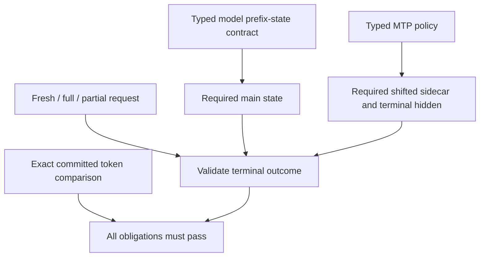

# Generation prefix-state contract — 2026-09-10

## Defect and ownership

The fast HTTP generation validator required the `hybrid_state_restored` field
to be a boolean and rejected it on fresh requests, but did not require it on
hybrid full/partial restores. MTP checks independently required sidecar state
and full-hit terminal hidden. Consequently an MTP-off hybrid model could pass
with exact tokens but missing main recurrent-state evidence. This is a
coverage defect, not evidence that the completed model cells lost state.

The obligation belongs to the canonical model definition, independently of
MTP, backend, weight format, topology and the observed response. The new typed
`ModelParityPrefixState` distinguishes attention KV from hybrid recurrent
state; omitted/invalid declarations fail expansion. Derived model variants
inherit the declaration. Python consumes its exported spelling instead of
inferring architecture from filenames or optional profiling.

Both online requests and persisted controls use the same validator. A hybrid
restore requires recurrent state even with MTP off. Attention-only models
reject a spurious hybrid restore. The contract participates in serial-control
identity, so metadata cannot silently weaken a retained observation. There is
no inference change, model download, extra graph node or device allocation.

## Verification

Four new device-free policy tests reproduced **28 failing assertions** against
the old validator. Eighteen are missing recurrent-state restores across all
six MTP policies and all three restore requests. The others cover omitted or
invalid contracts, incompatible serial identity and immediate online failure.
The C++ tests also cover mandatory declaration, expansion/export across every
MTP policy and real-model family declarations without filename inference.
After the validator fix, the complete **78/78** script-policy suite passes.
All new negative cases reject the unchanged token streams as intended.

The Qwen3.8 GPU generation batch passed on the preceding unchanged Release
binary and frozen inventory: all **12 cells**, MTP off/1/2/3/15/dynamic on each
vendor, with four exact 384-token requests per cell. Its completed observations
contain actual recurrent-state restores. Do not edit those artifacts or relabel them as a
certificate under a new inventory; old unapproved controls remain historical.
Rebuild the canonical inventory before collecting controls for subsequent
unseen cells. All 63 matrix/unit build steps and the C++ contract suite pass.
Fresh discovery retains **510 cells / 13 E2E candidates**, with 467 hybrid and
43 attention-only declarations. A read-only audit uses those declarations to
check all 48 preserved Qwen3.8 responses and all 36 restores successfully;
it verifies the only configuration difference is the new evidence contract.
It neither mutates nor approves old controls. Refreshed prerequisites pass:
**647/647 Unit** (73.27 seconds), **130/130 production preflight** (483.55
seconds), 557.566 seconds combined. The new Qwen2 CPU control passes all four
requests in 37.672 seconds under the explicit attention-only contract.

The unseen CUDA and ROCm controls fail the continuous-horizon requirement at
the partial continuation: CUDA emits EOS after **208** tokens, ROCm after
**97**. Both fresh/full requests produced 384 tokens and matched exactly.
Both partial responses report a real 210-token attention-KV restore; both
servers exit cleanly and release VRAM, without device errors in their logs.
This is insufficient long-generation evidence, not an observed device failure
or a reason to weaken the horizon. The fourth request is correctly not sent.
The existing early-EOS regression covers this rejection. No EOS suppression,
automatic seed retry, concatenated short requests or approved baseline change
has been introduced. The public sampler currently exposes neither minimum
output length nor EOS suppression; do not invent a harness-only execution mode.

Next, investigate a model-owned long-form continuation workload that reliably
reaches the required horizon during initial acquisition. Any deliberate prompt
or sampling change must flow through the canonical definition and invalidate
the affected unapproved controls; never mutate the failed observations. The
current generation ledger is **31 individual greens and two insufficient-
horizon failures**. The separate Qwen2 CPU/Q16_1 mathematical Top-5 decision
remains unchanged and is not one of these new failures.

Whole-cell seconds, including server lifecycle and evidence checks:

| Backend | Off | 1 | 2 | 3 | 15 | Dynamic |
|---|---:|---:|---:|---:|---:|---:|
| CUDA | 53.49 | 37.55 | 36.44 | 38.50 | 91.97 | 41.91 |
| ROCm | 85.89 | 58.25 | 57.56 | 59.02 | 149.34 | 65.04 |

Artifacts: `parity-results/generation-regression-qwen38-gpu-controls-01/`,
`generation-regression-qwen38-gpu-unseen-01/`, and
`generation-prefix-state-{red,green,build}.log`. These twelve cells plus the
eighteen preceding Qwen3.6 cells contain 46,080 committed tokens. The newly
green Qwen2 CPU cell brings green-only evidence to **47,616 tokens**. This is
not an unfiltered campaign or an approved corpus. Expensive depth-15 cases
still miss the desired sub-minute economy target. New Qwen2 evidence is in
`generation-regression-qwen2-single-controls-01/` and
`generation-regression-qwen2-rocm-control-01/`; the first report contains the
current reusable 777-test prerequisite receipt despite its later cell failure.

## Remaining certification boundary

This closes only the main-state obligation in generation probes. Approved
corpus provenance, native single-domain GPU completed-movement journals and
the routine image-pipeline cutover are separate outstanding work. The prior
deep HF diagnostic gates remain intact; exact token streams do not establish
a numerical KL/cosine bound or a shippable image certificate on their own.
