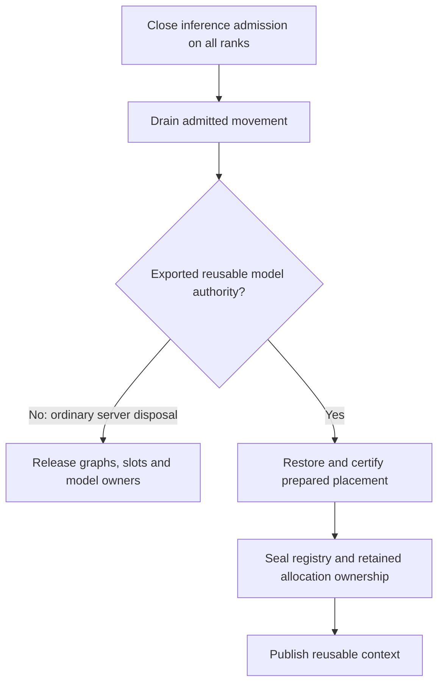
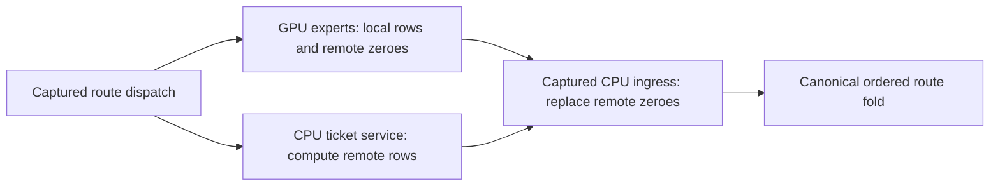
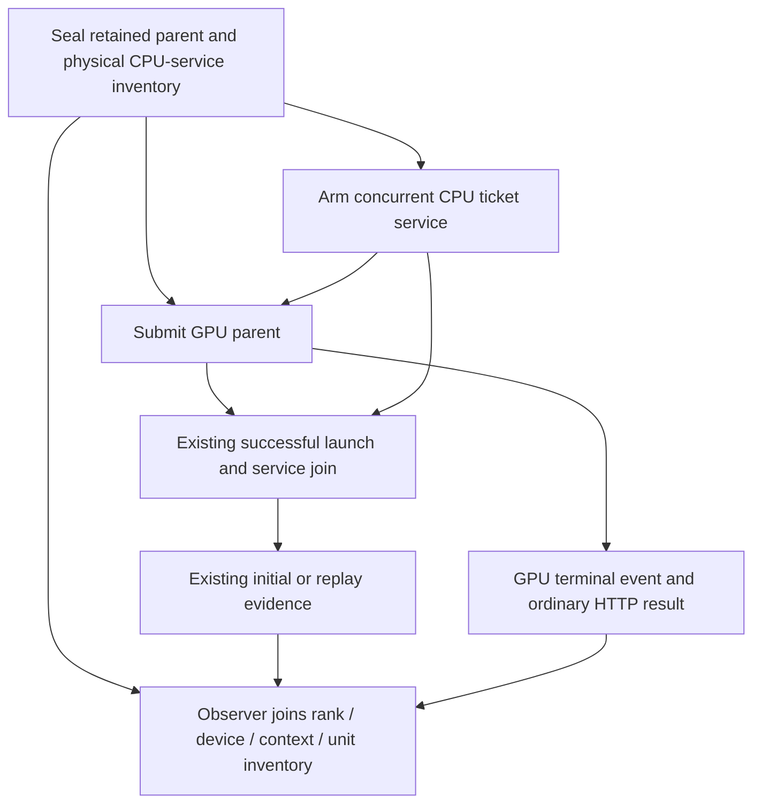
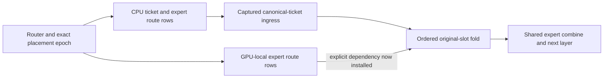
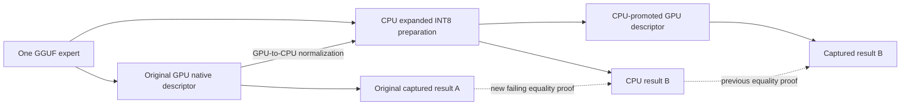
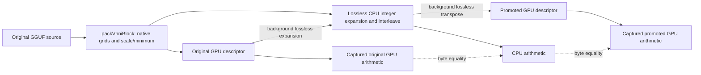
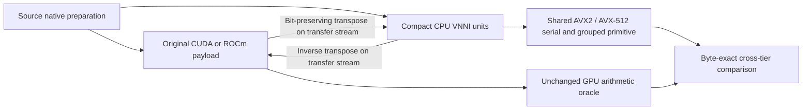

# Qwen 122B overlay generation controls — 2026-09-11

## September 12: first live mismatch localizes the epoch split

The diagnostic-only Release observer in `qwen122-cpu-input-trace-02` records
already-host-owned CPU inputs without substituting computation. The first
request is exact; the repeat diverges in emitted token 193. Comparing the 383
decode forwards per response finds the first unequal hidden input at decode
index 183, layer 31. All earlier corresponding inputs are byte-identical.

During that forward the CPU packet changes from epoch 2 at layer 29 to epoch 3
at layer 30. Layer 30's input is still exact, but expert 75 disappears from
the CPU routes; committed movement evidence identifies it as the epoch-3
promotion. The GPU's root/terminal RCU lease still selects epoch 2. Thus CPU
dispatch assumes GPU ownership before that forward's GPU has adopted it.
This is a missing contribution, not a small quantization tolerance issue.

`MoEExpertDispatchStage` acquired the latest host snapshot whenever its host
sequence epoch was unset. That is appropriate for host-owned admission but
incorrect for the single-rank retained GPU parent. Its dispatch publisher
copied routes and activations without copying the device request epoch.

```mermaid
sequenceDiagram
    participant GPU as Captured GPU forward
    participant Move as Background maintenance
    participant CPU as CPU ticket service
    GPU->>GPU: Acquire immutable epoch 2
    GPU->>CPU: Earlier layer packet, epoch 2
    Move->>Move: Publish epoch 3, promote expert 75
    GPU->>CPU: Layer 30 packet; GPU still owns epoch 2
    Note over CPU: Old bug: admit latest epoch 3, omit expert 75
    Note over GPU,CPU: Fix: publish pinned epoch with packet; both use epoch 2
    CPU-->>GPU: Complete canonical routes, retain epoch lease
    GPU->>GPU: Fold routes, release epoch 2 at forward terminal
    GPU->>GPU: Next forward may acquire epoch 3
```

The implementation now binds the model-owned device request ticket into the
immutable dispatch storage. The existing TransferEngine mapped-kernel path
publishes its eight-byte epoch before the existing release edge. Host dispatch
uses that exact epoch, rejects zero or a conflicting sequence epoch, and does
not overwrite device-authored metadata. Explicit host admission keeps its
separate stale-header-safe semantics. No new kernel implementation, precision
change, transfer synchronization, or movement pause is introduced. Both
Integration and Release builds pass. The focused seven-entry check passes in
67.34 seconds (`captured-dispatch-epoch-focused-01.log`): epoch admission Unit,
retained request/reset publication on CUDA and ROCm, and all-format expert
arithmetic on both GPU vendors with AVX512 and AVX2. The model repeat and fresh
combined prerequisite results follow below; generation-control observations
still do not issue numerical-provenance or image certificates.

The uninstrumented Release HTTP diagnostic
`qwen122-captured-dispatch-epoch-isolation-01` now returns two token-identical
384-token responses (41.934 s and 39.026 s), including a full prefix hit and
restored hybrid state. It retains the normal Dynamic window: movement
diagnostics record four committed waves (epochs 2–5), 384 migration edges.
Public shutdown returns 202 and the server exits zero. Total diagnostic wall
time is 166.85 seconds; concurrent prerequisite rebuilding makes this a
correctness observation, not an isolated performance benchmark. The
retained-graph stress check passes 20/20 repetitions on each of CUDA and ROCm
in 100.88 seconds (`captured-dispatch-epoch-replay-stress-20.log`). This is
40 model-free suite executions, not 20 real-model cell passes. The full
four-request canonical result follows below; the two-request probe itself
is not a campaign pass.

The new canonical prerequisite receipt is green: 648/648 Unit tests in
74.32 seconds and 155/155 Integration preflight tests in 586.54 seconds,
661.612 seconds overall. It is retained under
`generation-qwen122-cuda1-cpu1-dynamic-ordinal-captured-epoch-01/preflight/`.
The driver then admits the one exact repaired cell with all four GGUF shards
reused from persistent tmpfs, zero copy bytes. Subsequent unchanged-build
cells reuse this receipt; they do not repeat Unit/preflight.

### Repaired canonical cell: green

`CUDA1_CPU1_Dynamic_Ordinal_MTPOff` passes the full canonical Release HTTP
sequence in 212.213 seconds: four 384-token responses, exact paired repeats,
fresh/full/partial/full prefix outcomes, and all eight harness checks. Public
shutdown is clean and GPU memory returns from 21,914 MiB of process residency
to its original two-MiB baseline. The diagnostic movement export records
1,294 live migration edges (647 promotions and 647 demotions), epochs 2–15.
Movement was not disabled to obtain repeatability. All four resulting streams
also match the previously green Static/Ordinal observations
(`generation-qwen122-cuda1-cpu1-static-ordinal-fixed-01`) token-for-token,
with identical request bodies. This is a historical cross-check, not a fresh
Static rerun or mathematical provenance.

The cohort now has ten historically green MTP-off controls and 26 unseen;
none remain failed-only. `generation-qwen122-unseen-after-captured-epoch-01`
selects only those 26 from the compiled canonical inventory joined to prior
per-cell reports, reuses the fresh 803-test receipt, and runs sequentially
with first-failure stop. Historical status controls scheduling only; it is not
reused as certification evidence. Neither ISA image is yet certified.

The unseen-only run finished with 25 passes and one shutdown failure on the
unchanged Release binary:

| Topology | Movement / placement | Result | Cell seconds |
|---|---|---|---:|
| CUDA1 + CPU1 | Static / Random | Passed | 204.793 |
| CUDA1 + CPU1 | Dynamic / Random | Passed | 215.131 |
| ROCm1 + CPU2 | Static / Ordinal | Passed | 188.144 |
| ROCm1 + CPU2 | Dynamic / Ordinal | Passed | 198.573 |
| ROCm1 + CPU2 | Static / Random | Passed | 192.767 |
| ROCm1 + CPU2 | Dynamic / Random | Passed | 199.106 |
| ROCm2 + CPU2 | Static / Ordinal | Passed | 210.161 |
| ROCm2 + CPU2 | Dynamic / Ordinal | Passed | 226.263 |
| ROCm2 + CPU2 | Static / Random | Passed | 209.962 |
| ROCm2 + CPU2 | Dynamic / Random | Passed | 224.718 |
| ROCm3 + CPU2 | Static / Ordinal | Passed | 215.729 |
| ROCm3 + CPU2 | Dynamic / Ordinal | Passed | 241.619 |
| ROCm3 + CPU2 | Static / Random | Passed | 227.627 |
| ROCm3 + CPU2 | Dynamic / Random | Passed | 245.081 |
| ROCm4 + CPU2 | Static / Ordinal | Passed | 218.870 |
| ROCm4 + CPU2 | Dynamic / Ordinal | Passed | 258.790 |
| ROCm4 + CPU2 | Static / Random | Passed | 235.319 |
| ROCm4 + CPU2 | Dynamic / Random | Passed | 268.980 |
| ROCm1 + CPU1 | Static / Ordinal | Passed | 229.844 |
| ROCm1 + CPU1 | Dynamic / Ordinal | Passed | 245.435 |
| ROCm1 + CPU1 | Static / Random | Passed | 233.685 |
| ROCm1 + CPU1 | Dynamic / Random | Passed | 247.718 |
| CUDA2 + ROCm4 | Static / Ordinal | Passed | 120.371 |
| CUDA2 + ROCm4 | Dynamic / Ordinal | Passed | 178.331 |
| CUDA2 + ROCm4 | Static / Random | Passed | 118.544 |
| CUDA2 + ROCm4 | Dynamic / Random | **Shutdown failure** | 183.194 |

All 26 complete four 384-token requests with exact paired repeats. The 25
passing cells also complete all eight harness checks. This closes all four
controls for CUDA1/CPU1, ROCm1/CPU1 and ROCm1/2/3/4 + CPU2 and brings the original
cohort to **35/36 historically green**, not a complete fresh certificate.
The CUDA Random pair is token-identical across all
four requests; Static records no movement and Dynamic records 950 edges
(475 promotions and 475 demotions).

All four ROCm1/CPU2 configurations also produce identical token streams.
Dynamic/Ordinal records 3,678 migration-edge diagnostic rows: 2,436 tier-residency, 784 participant-
placement and 458 combined objectives. Dynamic/Random records 3,430 rows:
2,420 tier-residency, 716 participant-placement and 294 combined objectives.
Thus both movement axes execute without changing the sampled answers.
All four ROCm2/CPU2 configurations are likewise token-identical. Their Static
movement diagnostics report zero edges; Dynamic Ordinal/Random diagnostics record 4,794/5,546 rows
with both tier-residency and participant-placement objectives. No throughput
speedup is inferred from these deliberately movement-heavy correctness probes.
All four ROCm3/CPU2 configurations also agree exactly across all four
requests. Dynamic/Ordinal diagnostics record 4,566 rows: 3,380 tier-residency,
100 participant-placement and 1,086 combined objectives. These remain
PerfStats observations, not a substitute for the pending public authoritative
ledger export. Dynamic/Random records 5,462 rows: 3,956 tier-residency,
76 participant-placement and 1,430 combined objectives. It also passes all
eight harness checks, including clean shutdown and GPU memory reclamation.
All four ROCm4/CPU2 configurations also produce identical token streams across
all requests. Dynamic Ordinal/Random have 3,394/2,028 migration-edge diagnostic
rows; their pure participant-placement counts are 76/8 and combined counts
126/404, in addition to tier-residency objectives. These are coverage probes,
not a Dynamic throughput-win claim. All four ROCm1/CPU1 configurations also
agree exactly. All four six-GPU configurations agree on every returned prompt,
completion and finish reason, including the cell whose later shutdown fails.

### Six-GPU Random shutdown: unnecessary restoration identified

The last cell aborts in `MoEOverlayDeviceControllerGraphService::stopAndDrain`
after its standard drain deadline, without a worker failure message. The
subsequent missing rank-qualified PerfStats files are consequences of that
abort, not additional inference failures. GPU memory returns to baseline.
Preserve the original result under `96f34f99050ebb174b568833370f63d2c70afaa0dfa9b57b3b9651711d24ad6c/`.

Source inspection finds that `shutdownMoEExpertOverlayResidencyMaintenance`
requests `RestorePreparedContext` for every terminal Dynamic device service,
even when `modelContextReuseContract()` has never exported a reuse authority.
The later physical-seal method correctly does nothing without that authority,
but only **after** the controller has already restored all moved weights.
The green six-GPU Ordinal evidence contains 21 restoration waves, 20,908,081,152
payload bytes and 24.201 seconds in 22 terminal transactions (rank zero;
rank one mirrors the same work), with no prepared-context seal records.
Restoration is unnecessary when the model is being discarded. Its proximity to
the 30-second drain limit is a concrete explanation to verify for Random, not
proof of the failed worker's exact final state.



The ownership distinction is now implemented by `modelContextOverlayDrainIntent`.
It takes the actual exported reuse authority, rejects unowned/invalid contexts,
and selects release for ordinary disposal even in Dynamic mode. The device
service replaces its first shutdown barrier with one byte of intent per rank:
if any rank needs restoration, all participating physical endpoints help it.
This is host-owned resource lifetime, not GPU state or a new inference-time
collective. Disposal still completes admitted transfers and reader retirement;
retained contexts keep the full restoration proof. Timeouts are unchanged.

Three new Unit cases prove absent, retained and invalid ownership. A real-MPI
regression in the existing `MoEOverlayResidencyConsensus_MPI` preflight suite
alternates no consumer, either sole consumer (including rank one), and both,
20 times; all ranks also reject a malformed contribution coherently. The public
server observer now rejects restoration when its model is being discarded, and
its 127-test policy suite passes. That observer correctly rejects the preserved
Ordinal artifact's 24.2-second restoration; old evidence is not rewritten.

Integration and Release build. The four-entry focused gate passes in 1.29 s
(`model-disposal-drain-focused-02`), including model-retirement Unit semantics,
the MPI integration, server policy and architectural wiring. One older source
guard expected a literal enum after `stopAndDrain`; it now requires the tested
ownership resolver before that call and consumption of its typed result. An
early queued retry was stopped during discovery (`*-disposal-01`) before model
loading. `generation-qwen122-gpu-dynamic-random-disposal-02` is refreshing the
full Unit/preflight receipt before the exact public-server retry.

That retry is now green. Its fresh prerequisites pass 648 Unit entries in
75.17 s and 155 preflight entries in 586.30 s; prerequisite wall time including
build is 780.130 s. The exact six-GPU Dynamic/Random control then passes in
156.293 s with all eight harness checks, clean shutdown and device memory
returned to baseline. All four 384-token responses, their prompts and request
bodies match the preserved pre-fix responses exactly. Neither rank records any
`prepared_context_restore*` work. This closes **36/36 individual 122B Off
controls historically**, not a fresh combined campaign or a twenty-run
real-model stability certificate. The before/after cell wall times include
startup and are not an isolated inference-throughput comparison.

The same retry supplies the first live Dynamic public-ledger proof. The four
HTTP snapshots contain 952, 2,155, 3,223 and 4,293 unique durable edges, with
5, 11, 17 and 24 economy records respectively. Every owner is `device`, every
snapshot is complete, each economy command-count sum equals its edge count,
and later snapshots retain byte-equivalent earlier records as an immutable
prefix. The final snapshot contains 2,379 tier-residency, 609 participant-
placement and 1,305 combined-objective edges. These are one authority's
model-lifetime records, not sums of mirrored rank counters or repeated HTTP
snapshots. Automated public-ledger campaign admission remains to be installed;
this inspection does not grant baseline or image certification.

These aggregate diagnostic counts include rank mirrors, not unique global
migrations. For example, ROCm3/CPU2 Dynamic/Ordinal contains 2,283 rows on each
of ranks 0 and 1 with matching movement identities. Do not sum those copies to
claim twice the work. Axis presence is unchanged; the typed owner ledger must
remain the eventual certification and unique-movement authority.

A passive HTTP ledger-export change was prepared during the latter cells, but
neither the Release binary nor active Python driver was replaced. These results
and the reused receipt belong to the frozen pre-export executable. Its linked
140-test HTTP Unit suite and seven focused checks repeated 20 times pass,
including grouped-plus-serial terminal publication. After the batch stopped,
Release was rebuilt and fresh full prerequisites were started ahead of the two
remaining unseen Qwen2 controls. Live Dynamic ledger and shutdown verification
remain pending; see
the [generation-CI investigation](production-ci-generation-regression.md).

The expanded arithmetic probe independently passed 24 real Q8 triplets and
eight actual BF16 experts, including selected promotions/demotions, across
larger scrambled inputs. Model-free random scales require smaller input bounds
to avoid overflow of composed Q8_1 intermediates. Their bounded sweep passes
CUDA/ROCm and AVX512/AVX2 in 61.17 seconds before the subsequent explicit
finite-result assertions; the focused epoch check above also passes those
finite assertions. The previous full Unit result was 648/648, 74.68
seconds; it is not a receipt for the newer epoch fix.

## September 12: movement isolation and route-writer ordering

The diagnostic `qwen122-dynamic-long-window-isolation-01` retains the Release
HTTP Dynamic graph and prefix cache, but moves its maintenance window beyond
the two-request workload. Both 384-token responses match exactly, including a
full prefix hit. No migration/commit records are present; shutdown returns
zero. This is causal isolation, not a certifiable Dynamic pass. The normal
movement-enabled cell remains red.

All four explicit-routing arithmetic checks pass (CUDA/ROCm, AVX512/AVX2).
Inspection then exposes a different invariant: local GPU kernels zero remote
canonical slots, so their writes overlap CPU ticket ingress. The earlier
reducer join did not order those writers. Strengthening the existing production
lowering regression fails on both vendors, for decode and prefill, before the
graph change (`canonical-ticket-writer-order-red-01.log`).

The change orders CPU ingress after local GPU publication. It adds
no host synchronization, storage, recapture, or alternative kernel path. CPU
expert computation still overlaps GPU expert computation. The strengthened
regressions pass afterward (CUDA 1.10 s, ROCm 0.76 s). However, the subsequent
movement-enabled HTTP diagnostic `qwen122-dynamic-writer-order-isolation-01`
still diverges at token 291 on its repeated response. This source-level defect
does not explain the complete token drift; do not label the model cell fixed.



The invariant is representation-independent: every quantized and floating
expert path shares this graph-owned canonical publication boundary.

The demoted/original CPU sparse arithmetic helper now varies eight logical
experts across widths 1–8, empty-to-full reuse, and unequal/empty CSR rows with
poisoned physical-row gaps. All four vendor/CPU-ISA arithmetic entries pass
(CUDA 11.98 s, CUDA AVX2 12.77 s, ROCm entries about 17 s), including floating
formats. These checks have always belonged to preflight; no performance test
or per-cell prerequisite rerun was added.

The broader `V2_Integration_Qwen35MoEGraphNativeProductionLowering` run also
finds six failures out of 18 cases. Three distributed mocks are rejected by
the node-local rank-batch transport constructor's complete geometry contract;
three least-loaded/LLEP fixtures lack a model-owned PreparedWeightStore at
transfer-directory construction. These fail before reaching the newly added
CPU-ingress edge and remain separate fixture-contract investigations, not six
new model-campaign failures. Evidence is in
`cpu-packet-width-transition-symmetric-01.log`. The two targeted preflight
lowering checks pass; do not report the broader integration family as green.

## Scope and admission

The canonical inventory/history join leaves 36 previously unrun MTP-off
controls across nine 122B overlay topologies. Continue sequentially and stop
on the first failure. The first cohort is CUDA1/CPU2 with two MPI instances,
crossing Static/Dynamic and Ordinal/Random. Device-to-rank ownership remains
inventory resolved; tier priority and capacity come from the typed definition
and production admission, not a test-owned expert quota.

All controls drive the AVX512 Release `llaminar2 serve` binary through the
public `/v1/chat/completions` endpoint. Preserve four requests requiring 384
actual tokens each, fixed positive sampling seed, fresh/full/partial/full
prefix outcomes, hybrid state, graph-path and memory checks, movement policy,
and clean shutdown. The definition's readiness budget is 180 seconds inside
the unchanged ten-minute complete-cell watchdog. No HF snapshot fixture or
test-only inference path runs during these controls.

The driver validates and reuses the current 649 Unit + 148 production
preflight receipt at
`dense27b-workspace-prerequisites-02/prerequisites.json`. All four
`Qwen3.5-122B-A10B-UD-Q8_K_XL` shards are persistent tmpfs hits; no model bytes
are recopied. No implementation or build changed between prerequisite
completion and this cohort.

## CUDA1 / CPU2 progress

Evidence root: `parity-results/generation-qwen122-cuda1-cpu2-unseen-controls-01`.
Driver log: `generation-qwen122-cuda1-cpu2-unseen-driver-01.log`.

| Movement | Initial placement | Result | Cell seconds |
|---|---|---|---:|
| Static | Ordinal | Passed | 181.097 |
| Dynamic | Ordinal | Passed | 187.505 |
| Static | Random | Passed | 182.013 |
| Dynamic | Random | Passed | 192.490 |

Dynamic/Ordinal's host-authority committed-edge diagnostics contain 1,528 live
placement changes over epochs 2–16: 484 promotions, 484 demotions and 560
same-priority moves. Their typed objectives are 848 tier-residency, 502
participant-placement and 178 combined edges. Each MPI rank reports the same
global edge set; do not sum the two mirrors into 3,056 migrations. These are
the post-commit records, not proposals or prepared-context restoration.
All four token streams match Static/Ordinal exactly; Static/Random also matches
them. This extra cross-policy observation does not replace each cell's own
fresh/full and partial/full assertions or independent numerical provenance.

Dynamic/Random likewise commits 1,526 live edges over epochs 2–16: 511
promotions, 511 demotions and 504 same-priority moves. Its typed objectives
are 910 tier-residency, 448 participant-placement and 168 combined edges.
Its four streams match the other three controls exactly. All four cells pass
on the first attempt, including clean teardown and VRAM reclamation: 16
requests and 6,144 tokens in 743.757 seconds overall. No implementation or
test configuration changed, and no additional prerequisite run was needed.

## Remaining unseen controls

The next selection contains exactly the other 32 122B MTP-off controls and
excludes the completed CUDA1/CPU2 topology. Evidence will be recorded under
`generation-qwen122-remaining-unseen-controls-01`, with the same 797-test
receipt and persistent four-shard cache. Admission remains one cell at a time
and ends on the first red; already green cells are not replayed in this pass.

### CUDA2 / CPU2

| Movement | Initial placement | Result | Cell seconds |
|---|---|---|---:|
| Static | Ordinal | Passed | 195.272 |
| Dynamic | Ordinal | Passed | 207.607 |
| Static | Random | Passed | 195.561 |
| Dynamic | Random | Passed | 209.018 |

All four completed cells pass all four 384-token requests, the eight harness
checks, and clean teardown on their first attempt. Their token streams match
one another exactly. Dynamic/Ordinal records 2,292 committed edges across
epochs 2–22, with both tier-residency and participant-placement objectives.
These diagnostic request timings do not establish a
Dynamic throughput win or improved scaling from a second GPU.

### CUDA1 / CPU1: rank-local boundary evidence

The next cell, Static/Ordinal (202.444 s), passes all four 384-token responses, exact
repeats, prefix restores, and clean teardown, then fails the graph observer.
The driver stops before the other three cells. Eight of the original 36
unseen controls pass, one has this new red, and 27 remain unattempted.

The observer accepts a child TP collective or a completed cross-rank overlay
transaction, but this one-rank topology has neither. Its GPU executes a retained
parent while a persistent CPU worker services the rank-local tickets. The
existing producer validates and seals those manual programs, joins the service
after native submission, and only then publishes initial/replay records.
The original artifact has 1,982 main-parent nodes, one initial launch and 1,531
replays. No token, kernel, transfer, reset or teardown failure was observed.



The fix projects the sealed physical service inventory into existing parent
node and successful-submission records. The shared graph observer authenticates
that boundary independently of cross-rank coordination and still requires the
same physical capture, replay and mixed-topology checks. No new lifecycle,
counter authority, kernel, graph node, transfer or blocking edge is introduced.
The reduced regression fails before the observer change on both vendors and
both rank identities. All 126 evidence-policy unit tests pass afterward,
including malformed counts, missing retirement, foreign rank/device/context,
and homogeneous-topology rejection. The existing CUDA/ROCm cached-graph
preflight test now checks the actual setup/initial/replay producer records;
both backend suites pass (CUDA 2.45 s, ROCm 2.99 s), and Release rebuilds
successfully. They already belong to the production preflight label, so this
adds coverage without another test inventory or another per-cell gate.

The canonical driver refreshes all 649 Unit (74.07 s) and 148 preflight
(536.16 s) entries successfully, with 625.832 s total including the gate build.
The exact original cell passes all eight checks in 202.094 s in
`generation-qwen122-cuda1-cpu1-static-ordinal-fixed-01`. All four original
prompt/completion token-ID traces are unchanged. Native records authenticate
49 GPU compilation units and one physical CPU service program for both main
decode and prefill; the main parent has 1,982 nodes and 1,531 replays after its
initial submission. Its
`preflight/prerequisites.json` is the new reusable receipt; do not reuse the
pre-fix receipt after the rebuild. The original red and its token observations
are preserved unchanged; they are not retroactively relabeled. All four model
shards remain tmpfs hits with zero copied bytes.

The 27 untouched controls resume in
`generation-qwen122-unseen-after-local-ticket-01`, starting with CUDA1/CPU1
Dynamic/Ordinal. The selector excludes both completed CUDA/CPU2 quartets and
the fixed CUDA1/CPU1 Static/Ordinal cell; list-mode confirms exactly 27. The
new receipt is reused, not rerun per cell. Nine of the original 36 unseen
122B controls now have individual green evidence. Historical reds elsewhere
and the full certification obligations below remain outstanding.

These remain **unapproved diagnostic serial controls**, not independent HF
certificates, MTP proofs, approved token baselines, or shippable-image
certificates. Existing failures elsewhere, the MTP comparison matrix,
per-request movement/provenance completion, CI cutover, both ISA Docker
builds, full tagged E2E suites and benchmark certificates remain outstanding.

## CUDA1 / CPU1 Dynamic/Ordinal: repeatability red

The resumed selection stopped on its first cell. Nine of the original 36
controls remain individually green, this Dynamic cell is red, and 26 have not
been admitted. The unchanged exact reproduction also fails; no more unseen
cells are running.

| Evidence directory | Fresh response versus Static | Full-prefix repeat |
|---|---|---|
| `generation-qwen122-unseen-after-local-ticket-01` | All 384 tokens identical | First drift at completion index 291 |
| `generation-qwen122-cuda1-cpu1-dynamic-ordinal-repro-01` | All 384 tokens identical | First drift at completion index 198 |
| `generation-qwen122-cuda1-cpu1-dynamic-ordinal-join-fix-01` | All 384 tokens identical | First drift at completion index 216 |

Both runs restore the full 214-token prefix and hybrid state. Both responses
produce 384 tokens. Graph evidence, memory checks and clean teardown pass;
the exact-repeat token check is the only failed harness check. The first run
records 384 committed cross-tier edges in epochs 2–5: 192 promotions and 192
demotions. The varying drift position is not evidence of a fixed numerical
tolerance issue. Do not change the seed, token horizon or gates.

The source audit confirms preweighted original-route slots and one ordered
fold, rather than separate CPU/GPU partial sums. It identified a narrower DAG
gap: the single-continuation branch replaces its local-expert dependency with
the canonical-ticket dependency, whereas LocalTP explicitly joins both.
A model-free production-lowering regression reproduces the missing edge on
CUDA and ROCm, for decode and prefill (four failed assertions in 0.594 s).
The fix retains the GPU-local producer dependency alongside the selected
return dependency. It adds no host wait, kernel, allocation, or serialization
between the two expert-compute branches. Separate CUDA/ROCm registrations
join the canonical production preflight inventory. Integration and Release
rebuild successfully; the new CUDA/ROCm checks pass in 1.23/0.75 seconds.
The exact HTTP retry is admitted through a fresh full prerequisite gate in
`generation-qwen122-cuda1-cpu1-dynamic-ordinal-join-fix-01`.
The refreshed gate passes all 649 Unit and 150 production-preflight tests
(73.37 s and 539.52 s respectively; 628.142 s including prerequisite setup).
Its `preflight/prerequisites.json` replaces the previous receipt for this build.
All four model shards are again persistent tmpfs hits with zero copied bytes.
The unchanged HTTP retry remains red in 140.510 s: its fresh request takes
40.183 s and matches all Static tokens; its full-prefix repeat takes 38.816 s
and first differs at completion index 216. The other seven harness checks,
including graph evidence, memory and teardown, pass. The dependency fix
therefore does **not** resolve this drift; do not label it the root cause.



The prerequisite receipt was reused for both unchanged pre-fix HTTP runs.
The source/build change above required the fresh complete gate; unchanged
follow-up runs may reuse its receipt rather than paying prerequisites per cell.

Further read-only audit: GPU-local canonical decode writes zero contributions
for non-local slots; CPU-ticket ingress replaces those slots afterward. Thus
the bank cannot be described as physically disjoint writers throughout the
whole transaction. The installed stage-owned retained composer imports ordered
GPU units, so this observation alone does not establish a write collision.
Do not conflate the proven missing declarative edge with an established native
execution race or numerical diagnosis.

An explicitly uncertified isolation probe completed in
`generation-qwen122-dynamic-no-prefix-isolation-01`: the same Release server,
canonical argv/request body, model, seed and 384-token horizon, with the public
`--no-prefix-cache` override only. Two identical uncached requests distinguish
restore dependence from movement-driven repeatability. It is not a canonical
cell, does not weaken its mandatory prefix checks, and cannot approve a corpus
or image. Both responses explicitly report prefix caching disabled and still
drift at completion index 309 (39.333 / 43.696 s). Prefix restore is therefore
not a necessary trigger.

`generation-qwen122-dynamic-post-movement-repeat-01` keeps canonical runtime
settings, but repeats the same request four times without aborting collection
at the first token mismatch:

| Request (one-based) | Prefix-admission epoch | First token differing from request 1 | Seconds |
|---|---:|---:|---:|
| 1 | 1 | none | 39.416 |
| 2 | 1 | 213 | 38.361 |
| 3 | 4 | 50 | 35.586 |
| 4 | 8 | none | 32.265 |

The epoch is the HTTP prefix-admission observation, not proof that no further
movement happened during the response. Request 4 returning to the original
384-token stream favors a transient movement/publication hypothesis, but does
not exclude expert-specific arithmetic differences at intermediate layouts.
Both local isolation probes used signal cleanup rather than a certified
graceful retirement; the second probe discovered its admin shutdown endpoint
was not enabled (HTTP 404). Neither produced the ordinary terminal PerfStats
export. Do not claim clean lifecycle gates or movement-edge counts from them.
The optional endpoint environment is corrected in the local diagnostic script
for any future probe; canonical harness shutdown was already correct.
No model processes remain from either isolation run. The next step is a
focused computation/publication witness, not another full campaign restart.

## 2026-09-12: arithmetic isolation and truthful prerequisite execution

The model red above remains unresolved; no additional control is relabeled
green. Metadata inspection of the staged GGUF finds Q8_0 routed experts in
48 layer triplets and BF16 experts in `blk.46` (49 triplets including MTP).
The quantized filename is not evidence that every expert uses one codebook.

The cross-tier arithmetic regression now compares real captured runtime
decode (router, expert execution, canonical fold), not just grouped prefill.
It also executes GPU-to-CPU demotions and CPU-to-GPU promotions for every
canonical quantized expert format, and captured floating FP16/BF16/FP32
decode at 3072-by-1024 geometry. All four CUDA/ROCm, native/forced-AVX2
registrations pass in 47.82 seconds:
`parity-results/cross-tier-prepared-bank-all-01.log`.
The first IQ demotion experiment omitted source-bank preparation; preparing
the MoE bank through its real API installs the decoder resources and fixes
that fixture error. It is not an established production IQ defect or an
explanation for the model drift. No production arithmetic change was made.

Three floating CPU prerequisite registrations had stale GTest filters and
executed zero tests. They now select the actual GPU-aligned floating proof;
scalar, AVX2 and AVX512 executions pass. `add_v2_test` now rejects successful
GTest processes reporting zero executed tests. A device-free behavioral test
runs the actual CMake registration helper with ordinary, brief and colorized
empty GTest output and verifies CTest fails each; a nonempty run passes.
The new guard exposed one obsolete Unit registration whose sole case was
disabled and targeted the retired block-diagonal attention interface. That
registration and source were removed, not exempted. The current native
unequal-history/wrapped-ring attention regression passes instead.

The initial guarded Unit run had 648 passes and that one empty-registration
failure; after removal all 648 Unit tests pass in 73.97 seconds
(`empty-gtest-guard-full-unit-02.log`). Earlier full prerequisite receipts
predate these changes and must not be reused.

The new real CPU sparse endpoint / captured GPU ticket test fails immediately
on Q4_0: first weighted output 0.0965338647 versus serial 0.0970996097, before
any width change. This exposes a separate serial numerical-policy defect:
`gemv_native_vnni` quantizes FP32 input with the backend-native helpers even
when the prepared matrix declares `GPUAlignedExpert`. Grouped and fused
gate/up callers already honor that policy. The serial helper now uses the
same existing block-publication helpers, moved before it in the header;
no OpenMP fork, new workspace or changed weight format is introduced.
The CPU all-format preflight additionally compares the FP32-input M=1
entrypoint with independently prequantized rows. The previous prequantized-
only comparisons could not catch this boundary.

The serial fix passes both CPU all-format registrations in 2.24 seconds
(`cpu-expert-serial-policy-all-formats-01.log`), and all four new real sparse
endpoint registrations in 25.89 seconds
(`cpu-sparse-ticket-policy-fix-all-01.log`). Those retain the same stage,
workspace and captured GPU consumer through 1/3/15 rows, local widths
1/2/3/4/7/8, and changing binding generations. Both CUDA and ROCm consume
FP16/BF16/FP32 and every quantized format; native AVX512 and forced AVX2 are
separate executions. Release rebuild succeeds. After rebuilding the complete
Unit executable inventory for this header change, all 648 Unit tests pass in
74.49 seconds (`cpu-serial-policy-full-unit-01.log`). This is not a combined
Unit/preflight receipt: the new original-GPU comparisons below remain red.

This serial bug is not yet an explanation for the HTTP failure: the overlay
endpoint normally uses the grouped transaction, and the failing new test
first found a discrepancy in its ordinary serial oracle.

### Original resident encoding versus CPU normalization

The arithmetic helper now additionally executes the **original GPU-resident
descriptor** under capture, not only the CPU-promoted GPU descriptor. This
exposes another previously untested invariant in
`cross-tier-original-gpu-policy-fix-all-01.log`: all four backend/ISA
registrations fail for Q2_K, Q3_K, IQ3_S, IQ3_XXS, IQ2_S, IQ2_XS, IQ2_XXS,
IQ1_S and IQ1_M. Q8_0 is not among the failures. The 56.28-second run completes
every format and preserves the first different FP32 word for each comparison.
Example: ROCm Q3_K original-GPU output 244.2005768 versus CPU 243.4729767;
IQ3_XXS 1658.1069336 versus 2177.2504883. These are not one-ULP differences.

The CPU packer uses `IINT8Unpackable` to normalize these formats into expanded
INT8 blocks. Their source converters explicitly dequantize/requantize; for
example `Q3_KTensor::unpack_block_to_int8` calls
`transcode_q3_k_to_int8`. Matching the normalized representation after another
transfer had hidden the difference from the original resident representation:



The required repair is lossless expert representation/transfer arithmetic,
preserving each source format's subblock scales and offsets through CPU
preparation and promotion/demotion. Another normalization of GPU weights, a
looser token gate, or disabling movement would not prove that contract.
The new failing comparisons remain in preflight; do not remove a format or
claim the full preflight gate green. This is separate from the unresolved
Q8_0/BF16 122B repeatability failure. No new model control, HF lineage, corpus,
or image certificate was granted in this slice.

### Lossless single-scale grid repair (2026-09-12)

The first representation family is repaired: IQ3_S, IQ3_XXS, IQ2_XXS and
IQ1_S. Their native integer grids already fit INT8. The old CPU preparation
and GPU demotion unnecessarily folded the source scale into floating values,
selected another absmax scale and requantized. IQ1_S additionally lost its
independent delta/minimum correction. CPU preparation now consumes the same
`packVnniBlock` payload and FP16 metadata as native GPU preparation. Integer
expansion retains those values exactly; CUDA and ROCm demotion perform the
same lossless expansion. Promotion still uses the existing expanded physical
GPU descriptors, preserving source provenance and the contribution tree.
No source GGUF format, activation precision, persistent footprint, inference
kernel, transfer stream or movement scheduling policy changes.



Bounded preparation uses an explicit destination K-block window in
`VnniPackContext`, with checked source/destination coordinates. It reuses a
small stack tile rather than allocating separated arrays for an entire
matrix. Device-free tests cover all 21 formats at nonzero source rows and K
origins, rejection of out-of-window coordinates, native scale/integer
preservation, and round trips including signed-zero/subnormal scales.

Evidence:

- `native-iq-lossless-focused-01.log`: all four CPU sparse endpoint/captured
  GPU ticket registrations pass. The four original-GPU arithmetic
  registrations still fail, but **only** for Q2_K, Q3_K, IQ2_S, IQ2_XS and
  IQ1_M on both vendors and both native AVX512/forced AVX2. The four repaired
  formats and all previously passing formats pass. Total 126.74 s, with a
  concurrent Release build; this is correctness evidence, not a test-runtime
  performance comparison.
- `native-iq-lossless-unit-01.log`: rebuilt complete Unit inventory,
  **648/648 pass in 74.32 s**. The initial build caught a test-only use of
  `operator==` on `AlignedVector`; the test now compares size and bytes.
- `native-iq-after-{cuda,rocm}-<format>.csv`: all 64 Release rows validate
  byte equality and their economy floors across both projection shapes,
  directions and kernel/streaming modes. Gate/up demotion is approximately
  5.2–5.8 microseconds on CUDA and 8.8–9.3 microseconds on ROCm. These runs
  overlapped CPU build activity; do not claim a precise production speedup
  from the provisional before/after samples.
- `native-iq-clean-{cuda,rocm}-<format>.csv`: a second, uncontended Release
  run validates all 64 rows after the full gate finished. Gate/up demotion
  takes 4.9–5.4 microseconds on CUDA and 8.8–9.2 microseconds on ROCm.
  Across both shapes, streaming demotion reaches 8.0–8.6 GB/s on CUDA and
  9.6–10.2 GB/s on ROCm; promotion reaches 6.6–6.8 and 9.7–10.5 GB/s,
  respectively. These are the harness's semantic-byte throughput metrics,
  not an end-to-end model or link-only benchmark.
- CUDA per-format Nsight records (`native-iq-cuda-<format>-profile.*`):
  30–38 registers/thread, **zero local spilling requests**, 22.7–23.8%
  achieved occupancy on the short 512-block/64-thread fixture. Compiler
  resources also report zero stack/local storage.
- ROCm per-format traces/counters and `native-iq-rocm-resources-01.txt`:
  21–23 compiler VGPRs (24 allocated), zero VGPR/SGPR spills or private
  scratch, 512 wave64 workgroups, approximately 99.5% VALU utilization.
  IQ1_S's valid counter record is `native-iq-rocm-IQ1_S-counters-02`; its
  earlier counter selection hit an initialization fill, and is not kernel
  evidence. Each accepted counter record authenticates the actual conversion
  symbol, not a setup/DMA kernel. Profiler durations are not timing samples.

The remaining family needs typed preservation of **two independent scales**:
Q3_K and IQ2_S/IQ2_XS need dual dot/scale publication, Q2_K also needs two
minimum corrections, and IQ1_M needs four signed subgroup delta corrections.
The existing single-scale/minimum CPU representation cannot express those
contracts without loss. Implement their representation, SIMD arithmetic,
stream conversion and canonical memory BOM together; do not convert the GPU
resident weights to the current lossy CPU normalization. Keep the original
GPU comparison in the gate throughout that work.

Full production preflight (`native-iq-lossless-preflight-01.log`) completes
in 583.62 seconds: **149/154 pass**. Four failures are the CUDA/ROCm,
native/forced-AVX2 arithmetic registrations, each failing only the same five
multi-scale formats. The fifth is the CPU packing fixture's stale oracle:
it still expected the superseded lossy INT8 export for the four repaired IQ
formats. That oracle now independently expands each native grid value,
preserves the exact FP16 metadata, and deliberately uses whole-row addressing
rather than the production packer's bounded window. Its existing nonzero
source slice, partial N chunk, trailing K block, OpenMP determinism and NUMA
checks remain intact. The focused rerun
(`native-iq-lossless-packing-oracle-01.log`) passes all five fixture tests
in 0.85 seconds. Thus current individual evidence is **150/154 green**, not
a clean aggregate certificate; the other four registrations remain red.

The full preflight build also found a missing test-support definition in the
CUDA/ROCm MoE executables. `demoteGPUExpert` previously lived in the cross-tier
GTest registration translation unit. It now has one compiled support object,
linked by all three consuming executables, so the normal gate builds and runs
the actual demotion proof without importing another suite's registrations.

There is no reusable green prerequisite receipt yet. No expensive model run
was repeated while these model-free regressions are red. The original
Q8_0/BF16 HTTP drift remains unproven and no additional model cells or
certificates have been approved.

## Compact multi-scale implementation (2026-09-12, verification pending)

Q3_K, Q2_K, IQ2_S, IQ2_XS and IQ1_M now select the typed CPU
`CompactMultiScale` encoding. The representation retains the accelerator's
native payload and both scale bit patterns; Q2_K retains both effective
minima, and IQ1_M retains all four signed delta selectors. GPU execution keeps
its original codebooks and arithmetic. This is not a GPU conversion to the
old lossy CPU representation.



One CPU unit covers 64 output columns and 32 K values: 1024 payload bytes,
128 primary-scale bytes, 128 secondary-scale bytes, and 256 bytes for packed
effective minima (zero when unused). Its 1536-byte stride replaces the former
2432-byte expanded asymmetric unit. The canonical format/footprint helpers
also determine recyclable GPU slot capacity; no parallel allocation ledger
was added.

The CPU serial and grouped kernels share the same block primitive and the
GPU's separately rounded expressions. Multi-scale conversion performs no
floating-point operations. Obsolete CUDA/ROCm re-quantization branches and
their helpers were removed, and stale expanded multi-scale stream layouts are
rejected before publication. Single-scale GPU-to-CPU expansion now copies
FP16 metadata bits directly as well.

New focused coverage checks native payload/metadata preservation, rejected
legacy layouts, archive round trips, and nonzero TP row slices with partial
N/K geometry. The profiler fixture now derives encoding and strides from
production metadata instead of recreating the old encoding switch.

At this checkpoint, implementation builds are in progress. **No new numerical
or performance pass is claimed.** Required next evidence: focused all-format
cross-tier arithmetic on CUDA/ROCm and both CPU ISAs; packing/archive tests;
Release CPU/GPU timing and spill profiles; the full Unit/preflight gate. Only
then resume the independently unresolved Q8_0/BF16 122B HTTP control.

### Focused verification and economy evidence

- `native-multiscale-focused-01.log`: **13 selected checks plus CTest's existing
  model-fixture setup pass (14/14, 63.79 s)** on rebuilt Integration binaries.
  This includes all four CUDA/ROCm × native AVX512/forced AVX2 cross-tier
  arithmetic registrations, packing/NUMA/archive coverage, three focused Unit
  binaries, grouped-verifier/prefill invariance, the two GPU-aligned CPU tree
  registrations, and the new exhaustive AVX2 signed-byte dot regression.
  The previous five-format failures no longer reproduce. This is focused
  evidence, not the complete production-preflight certificate.
- `PackedWeightsSerialization` now uses version 3. Version-2 archives can
  describe the superseded lossy preparation with otherwise valid metadata;
  new archive tests require their rejection. Native compact encodings retain
  their full bytes across current-version round trips.
- An isolated assembly audit found that GCC materialized four-row accumulator
  arrays on the stack. Explicitly unrolling the bounded row dimension retains
  the existing arithmetic and eliminates vector stack references for all
  twenty AVX-512 format/tile instantiations. AVX2 additionally uses a bounded
  sign/absolute-activation dot primitive, proven for every weight in
  [-127,127] and every signed activation byte, including -128. Compile-time
  grid validation enforces that domain. **True AVX2 still has register-pressure
  work to assess**; a forced AVX2 path in an AVX512 build is not an AVX2 image.
- `native-multiscale-{cuda,rocm}-<format>-01.csv`: **80/80** Release
  kernel/streaming rows pass byte validation and existing throughput floors.
  CUDA conversion takes approximately 3.1–5.2 us and ROCm 5.8–9.5 us on the
  two fixture shapes. Streaming takes approximately 104–118 us and 88–93 us,
  respectively. These provisional measurements overlap CPU compilation;
  rerun uncontended before claiming a precise before/after performance change.
- `native-multiscale-cuda-<format>-<direction>-profile-01.*` authenticates all
  ten selected dispatches: 32 registers/thread, **zero local spills**, 64-thread
  blocks × 512 blocks, and approximately 23.4–24.3% achieved occupancy.
  Compiler resources also show zero stack/local/shared storage.
- Equivalent ROCm traces authenticate both conversion directions for all five
  formats: 64-thread groups, 12 allocated VGPRs, zero scratch. Code-object
  metadata reports 10 compiler VGPRs, 24/27 SGPRs, and zero VGPR/SGPR spills.
- CPU grouped-versus-serial microbench CSVs prove byte identity in 30 cases
  per selected ISA. At N512/K2048, Q2_K's smallest batches can tie or trail
  serial while the other four formats show substantial reuse benefit. At
  actual Qwen3.5-122B gate/up geometry N1024/K3072, the focused Q2_K run shows
  **1.33–1.83x** speedup for M2/3/4/15/16/31. Build contention remains present
  in these samples; CPU performance acceptance and independent AVX2 evidence
  are not finished.

The full canonical Unit/preflight inventory is rebuilding after these changes.
It now includes **155** model-free Integration registrations; only functional
verification was added to preflight, not the performance benchmark. The next
full gate must emit its own reusable prerequisite receipt before any model
control resumes. No new model cell or Docker certificate is approved yet.

### Complete prerequisites and HTTP retry

`native-multiscale-gate-02/prerequisites.json` records **648/648 Unit**
(73.98 s) and **155/155 production preflight** (576.98 s), 651.658 s including
setup. The first Unit pass exposed only a stale independent capacity-test
oracle: it still expected the superseded expanded multi-scale stride. The
test now expects the actual compact payload and both metadata planes; no
production reserve or capacity workaround was added. The separate AVX2
Release build also passes all 30 grouped-versus-serial byte-equivalence
microbench points. Timing remains provisional, especially its Q2_K/M15
outlier measured while compilation was finishing.

The exact HTTP retry in
`generation-qwen122-cuda1-cpu1-dynamic-ordinal-native-lossless-01` reuses this
803-test receipt and all four persistent tmpfs shards with zero copied model
bytes. It remains **red at full_harbor completion index 216**. This is the
same position as the last reproduction, not proof that the earlier variable
positions were resolved. The compact multi-scale changes do not affect this
model's Q8_0/BF16 experts, and are not its root-cause fix.

The next reduced proof adds the production retained CPU sparse-packet
executor to the existing all-format cross-tier integration sweep. The former
arithmetic oracle called the GEMM/FFN primitives directly; it did not cover
transported physical-row addressing, shared retained scratch, multiple
logical expert routes and packet publication around those kernels. This is
diagnostic localization, not a change to the HTTP certification surface.

The reduced packet probe passes all four existing CUDA/ROCm × native/AVX2
registrations: `cross-tier-retained-packet-cuda-01.log` (10.51 s) and
`cross-tier-retained-packet-symmetric-01.log` (three checks, 42.24 s). It uses
real GPU-demoted engines for all 21 quantized formats and initial floating
FP16/BF16/FP32 engines, the production retained CPU executor and shared
scratch, four reverse-expert-order routes, nontrivial physical-row indices,
and repeated invocations. No mock GEMM, production arithmetic or HTTP gate
was changed. This excludes the exercised input/publication configuration,
**not** overlapping residency publication, slot reuse or all real-weight
values. The test-only rebuild also changes the prerequisite build identity;
the earlier receipt documents the completed gate but must not be passed off
as a fresh aggregate result for later changed binaries.

Uncontended Release FFN measurements are now available in
`native-multiscale-cpu-ffn-{avx512,avx2}-clean-01.{csv,log}`. Both independent
ISA builds pass all five compact-format byte/economy cases at D3072/I1024,
four active experts, 16 routed rows and 28 physical cores. The GPU-aligned
persistent transaction is 2.30–3.31x faster than its serial oracle on AVX512
and 2.19–3.27x on AVX2. It is **not universally equal to BackendNative cost**:
the aligned/native time ratios range 0.937–1.164 and 0.907–1.161 respectively.
Q2_K retains roughly a 16% arithmetic-policy premium on this shape. These
measurements establish grouped benefit, not a before/after engine benchmark,
zero AVX2 spills, or a Dynamic-over-Static model throughput win. They are not
part of production preflight.

### September 12: isolate arithmetic from movement publication

The four `cross-tier-small-scales-*` checks pass on CUDA/ROCm with both CPU
ISA selections. The additional Q8 operand preserves signed payload diversity
but covers zero, subnormal and small normal half-scale encodings observed in
the real GGUF. This is an operand extension to the existing all-format gate,
not a new certification matrix or a production numerical change.

The ignored `diagnose_real_qwen122_experts.cpp` diagnostic reuses that same
arithmetic/transfer harness with native, demand-paged GGUF expert slices.
`real-qwen122-experts-cuda-01.log` passes all nine Q8 triplets selected from
layers 0/23/47 and experts 0/127/255 in 6.341 s. It checks grouped and captured
decode arithmetic, promotion, demotion and retained CPU packet execution.
`real-qwen122-experts-bf16-cuda-01.log` passes the real layer-46 BF16 experts
0/127/255 in 4.487 s, including native FP16/FP32 synthetic symmetry operands.
These are focused diagnostic observations, **not model-wide numerical or HTTP
certificates** and not proof of concurrent slot reuse.

The failing HTTP run's `moe_runtime_decode/predicate_skipped` records show
`descriptor_source=runtime`, but its actual local GPU entry point is
`groupedExpertDecodeFromRouting`, not `groupedExpertDecodeFromRuntime`.
The quantized focused gate now captures both entry points for original and
CPU-promoted GPU weights. Explicit tensor packets use non-unit route weights
and intentionally exercise fresh hidden quantization instead of router-Q8
reuse. `cross-tier-explicit-packet-cuda-01.log` passes (10.80 s); the symmetric
registrations are being checked before a causal movement-window isolation.

Do not read the HTTP prefix summary's `completion_movement_epoch` as the
generation-terminal epoch: `OrchestrationRunner` currently samples it at
prefix harvest, before decode. Both recorded values being 1 therefore does
not establish that no migration took place during the two 384-token streams.
The movement-window isolation must inspect the completed movement evidence,
not infer inactivity from this prefix-only summary field. The original
`full_harbor` token-216 failure remains unresolved.
