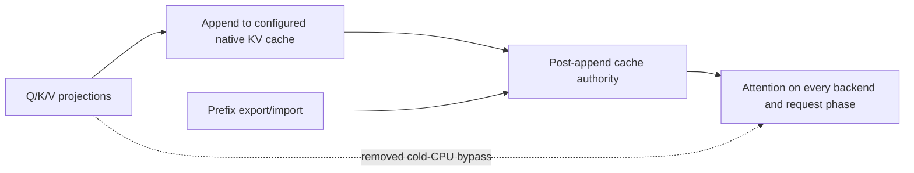
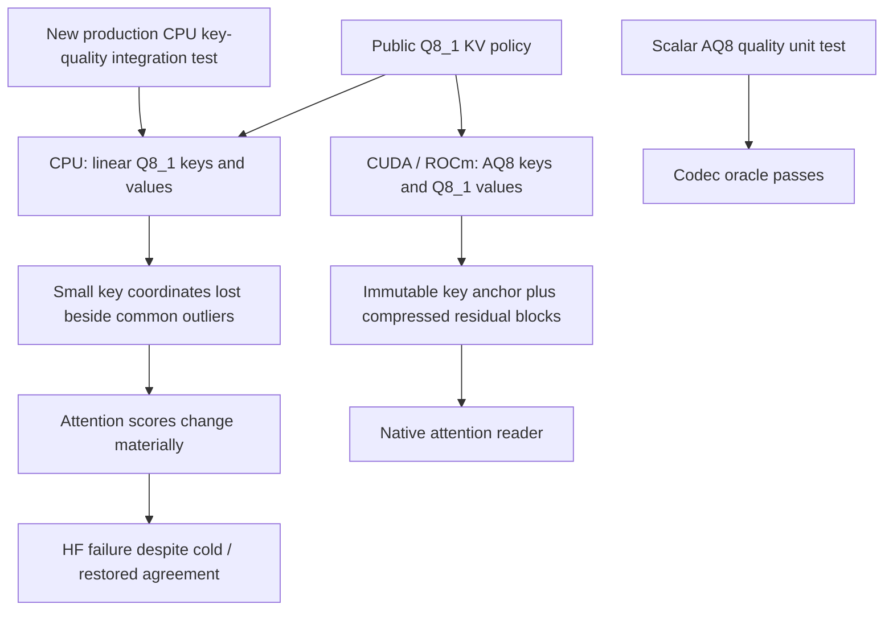
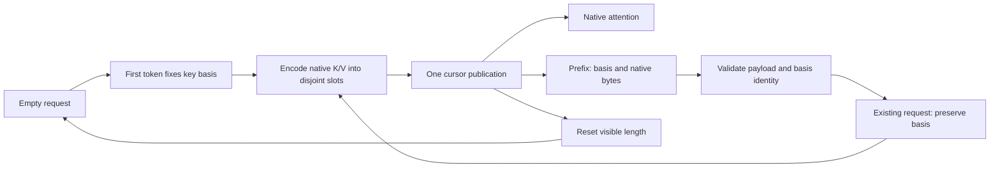

# Qwen2 continuous-generation acquisition — 2026-09-10

## Observed boundary

The first canonical Qwen2 Q4_0/FP32-activation/FP16-KV control passes on CPU.
CUDA and ROCm both pass their fresh/full 384-token requests, but the supplied
assistant continuation finishes naturally before the required horizon: EOS at
208 and 97 tokens respectively. Both report actual partial KV restore, clean
server logs, clean process exit and released VRAM. These are short-evidence
failures, not observed device errors. The failed response and unissued fourth
request remain in the original reports.

The first journal revision, with only a supplied assistant opening, also ended
early on CUDA at **89 tokens**. A separate cold request with the exact same
extended body produced **the same 89 token IDs and termination** as partial
restore. Its runtime summary proved no cache hit or matched tokens. Thus this
particular short answer is not a prefix-restore computation defect; clean logs
and natural EOS alone would not have established that.

Evidence is preserved in `parity-results/qwen2-journal-harness-diagnostic-01`
and `parity-results/qwen2-journal-cold-extended-diagnostic-01`.

An explicit follow-up user instruction did not solve the journal's short
answer: CPU passed all four probes but CUDA finished at **69 tokens**. A second
cold-versus-restored comparison matched those 69 tokens exactly. Bounded
acquisition diagnostics then tested a numbered practical field guide. Its
fresh request and short open-list assistant seed both produce 384 tokens on
CUDA and ROCm. A seed containing completed tips still encouraged a short
answer on ROCm, so it is not selected. These diagnostics use unchanged public
sampling policy and are not certificates or retries inside the canonical run.
Evidence: `qwen2-journal-harness-diagnostic-02` and
`qwen2-workload-acquisition-probe-01` / `-02`, all under `parity-results/`.

The horizon validator must continue rejecting them. The public sampler has no
minimum-output-length/EOS-suppression policy. Adding a private harness-only
suppression or continuing after terminal EOS would not prove ordinary serving.

## Scoped declaration change

`ModelParityGenerationPrompt` is a validated model-owned value for system,
user and active-assistant text. The default retains every previous message
byte. Qwen2 chooses a hundred-entry practical field guide, preserving the
harbor-to-mountain theme and asking for detailed guidance after a supplied
list opening. All Qwen2 formats/topologies inherit that choice from the same model
factory; its duplicate single-device constructor has been removed. No runner
contains a model/backend heuristic, prompt retry or second test matrix.

The unsuccessful optional follow-up-user prototype has been removed completely.
The selected design has three validated text values and the existing four
request protocol, with no additional branching in the exporter. The observer
still requires the entire earlier prompt to survive as a token prefix.

Every request still requires 384 committed tokens, a fixed seed and unchanged
sampler parameters. Every speculative policy still compares with its own
canonical serial control. Prompt changes invalidate affected controls; they
cannot retroactively turn old failures green. This is initial unapproved
workload acquisition, not permission to retune an approved expected answer.
No inference implementation, format, precision, stop policy or HF gate changes.

## Validation

The device-free policy suite passes **79 tests**. A new focused regression
reproduces observed short partial responses and horizon edges, verifies the prior requests
remain 384 tokens, preserves the failed third response and forbids sending a
fourth. C++ contracts cover nonempty text, escaping, unchanged defaults,
model-family inheritance and common message/horizon/seed projection across
single-device and overlay MTP matrices. All 63 build steps and the C++ definition
test pass for the final simplified field-guide declaration. Re-export preserves
**510 cells and 13 E2E tags**: only the request
bodies of 30 Qwen2 cells change; the other 480 complete configurations are
unchanged. The three focused Q4_0/FP16-KV/Off cells now pass all four 384-token
requests, exact repeatability, actual full/partial cache restoration, production
graph evidence and clean shutdown: CPU **34.278 s**, CUDA **13.562 s**, ROCm
**29.412 s**. The exported extended body is checked equal to the selected
acquisition probe, not reconstructed in the harness.

Evidence: `parity-results/qwen2-field-guide-harness-diagnostic-01/report.json`.
This is three focused diagnostic passes, not a new corpus or image certificate.
The canonical driver passed **647 Unit + 130 preflight** tests in **559.40 s**,
then passed Q4_0/FP16-KV/Off on two-rank CPU NodeTP (**26.44 s**) and CPU0
(**34.88 s**). The third cell, CPU0/Q8_1-KV/Off, failed its partial request
at 132 tokens. Fail-fast stopped the remaining 27 selected configurations.
Evidence: `parity-results/generation-regression-qwen2-family-01`.

## Distinct CPU cache-source defect

Unlike the earlier FP16 journal EOS cases, the exact Q8_1 extended request
produces **384 tokens cold versus 132 restored**, with a difference at token
zero (58276 versus 8420). It restores 139 of the identical 158 input tokens.
This is a real cold/restore divergence, not workload acquisition noise.

One-token Integration stage diagnostics narrow the mismatch without replacing
the canonical 384-token gate. Layer-0 Q/K/V projections and every cached-prefix
activation match exactly. Cold attention consumes FP32 projections, whereas
the 19-row restored suffix consumes the Q8_1 native cache. An independent
float64 attention equation reproduces those respective outputs within
1.1e-6 and 1.8e-6; switching operands explains the 0.262 maximum output gap.
Small RoPE suffix differences also exist (maximum K difference 0.000305) and
remain a separate invariance question, not a reason to overlook this source
defect.

The implementation removes the independent `read_kv_from_cache` switch:
binding a cache declares its post-append native operands; an explicitly
cacheless stage uses its supplied tensors. Query length never selects another
precision. No conversion shadow, new allocation, transfer, or synchronization
is introduced into attention. GPU behavior already used this contract.

`V2_Integration_CPUAttentionCacheSource` now belongs to production preflight.
Its model-free append/export/import/attention composition detects the unfixed
source defect for all seven CPU precision selections (7/7 red before the fix).
The test compares cold rows and restored suffix rows byte-for-byte across
serial, grouped and prefill widths using deliberately stale projection inputs.
The post-fix all-format regression passes. The latest Release extended request
now produces **384 identical tokens cold and restored**, with an authenticated
139-token partial hit (`qwen2-cpu-q8kv-source-fix-diagnostic-02`). This is a
targeted behavioral fix proof, not a full cell: the initial prompt now ends
naturally at **229 tokens**, below the unchanged requirement. The post-fix
647-Unit/131-preflight gate passed (565.830 seconds). Subsequent targeted HF
verification exposed the independent key-codec defect described below; prompt
acquisition is paused until that numerical failure is fixed.
The source-contract change applies to all CPU Qwen attention, so historical
CPU passes cannot certify it without rerunning the relevant cells.

Gate-build audit follow-up: the canonical prerequisite helper previously built
only `v2_unit_gate` before executing both CTest phases. This slice explicitly
rebuilt both targets, then reproduced the automatic-helper omission with a
mocked command-policy regression. The helper now builds both CMake-owned
inventories in one transaction before either phase, matching the pre-commit
hook. The regression is red before that fix; all 71 policy tests now pass,
including standalone gate publication, failed-phase replacement, stale-build
rejection and immutable completion-time checks. A standalone gate receipt is
now a first-class model-free evidence type, not a relabeled model campaign.
Receipt reuse cannot authenticate an unbuilt source edit.

## Follow-on: native CPU Q8 key quality was never certified

Targeted HF recheck `cpu-attention-cache-source-hf-02` reused the completed
778-test prerequisite receipt, with zero repeated gate time. CPU Q4_0/FP16-KV
passed in 2.999 seconds. CPU Q4_0/Q8_1-KV failed in 4.700 seconds: LM_HEAD KL
**0.613263** against **0.005**, Top-1 0%, average decode cosine **0.946642**,
and partial-prefix LM_HEAD cosine **0.935726**. Eight CSV artifacts were
validated per attempted cell. No threshold was relaxed.

The source fix correctly made cold and restored execution use the same cache,
but exposed a second problem formerly masked by the cold FP32 bypass. CPU
Q8_1 uses linear Q8 keys. CUDA/ROCm already use anchored, companded AQ8 keys
with Q8_1 values for the same public selector. The CPU production factory and
native reader do not implement AQ8. This is a backend implementation gap,
not evidence that the cold-source fix should be reverted.

Recorded layer-zero keys range from -130.450 to 121.583. Linear quantization
has key relative-L2 error only **0.00753**, but loses small coordinates that
determine attention probabilities after the common outlier terms cancel.
An independent FP64 attention equation over those exact recorded operands
isolates the damage (`key_codec_attribution.csv`):

| Key / value representation | Context cosine | Context relative L2 |
|---|---:|---:|
| FP32 / Q8_1 | 0.999972 | 0.007453 |
| Linear Q8_1 / FP32 | 0.863361 | 0.539347 |
| Linear Q8_1 / Q8_1 | 0.863349 | 0.539486 |
| AQ8 mean anchor / Q8_1 | 0.999590 | 0.028654 |
| AQ8 first-row anchor / Q8_1 | 0.999219 | 0.039564 |

These AQ8 numbers are diagnostic codec calculations, **not** a CPU runtime
implementation or a complete model pass. The CPU fix remains to be built.

The scalar `V2_Unit_AttentionKeyQ8` already contained a deterministic outlier
fixture, but it never exercised the CPU cache. That same fixture is now shared
with `CPUAttentionKeyQuality.Q8KeysPreserveScoreRelevantSmallCoordinates` in
the existing `ProductionParityPreflight` executable. The live production
append/attention check fails in **8 ms**, with cosine **0.915217** against
the existing scalar quality requirement **0.995**, relative-L2 **0.413630**
against **0.06**. The earlier seven-format source-ownership cases remain green.
The first attempted quality test had a missing layer binding; `red-02` is the
correct numerical reproduction, not that setup error.
The complete Unit namespace was rerun after receipt/fixture changes and passed
647/647 in 73.60 seconds (`cpu-q8-quality-unit-gate-01.log`). No full integration
rerun or model campaign was launched after the focused quality gate turned red.

### Next implementation slice

1. Give CPU the existing native AQ8 key contract, with persistent cache-owned
   compressed blocks and immutable anchor. Reuse the scalar byte oracle and
   typed anchor policy; do not install an FP32 key shadow or change activations,
   weights, or public precision selection. Audit Q8/TQ physical policy together
   so the same omission is not recreated for another compressed cache mode.
2. Keep append, grouped publication, ring reset/truncate and prefix export/import
   on one cache-owned lifecycle. Prefix payloads must carry the actual key basis;
   importing blocks from incompatible bases must not silently overwrite it.
   Preserve exact serial/grouped arithmetic and complete capture identity.
3. Extend the native CPU attention reader with AVX2 and AVX-512 implementations,
   using persistent workspaces and the existing row/tile scheduler. Profile
   append and read throughput/spills before declaring the path economical.
4. Make the shared physical-format BOM describe key blocks, values and anchors
   exactly. Feed PMA through the canonical estimator; no independent reserve or
   new memory ledger. Keep CPU/GPU metadata differences explicit.
5. First make the 8-ms quality regression and all-format source/restore tests
   green; then run focused Q8 HF and Release prefix/generation checks. Only
   afterward pay the complete Unit/preflight gate and resume remaining cells.
   Do not spend another full campaign run to rediscover this known red.

Raw evidence: `qwen2-cpu-q8kv-cold-diagnostic-01`,
`qwen2-q8kv-stage-diagnostic-01`, and `cpu-attention-cache-source-red-02.log`,
all under `parity-results/`.

Feedback order is now the focused native-key quality regression above, then HF
and HTTP. A focused harness result remains diagnostic, not an image or
full-matrix certificate.

### Native CPU codec/storage preparation — 2026-09-10

The SIMD codec and physical storage are implemented and tested, **but are not
yet selected by the CPU ring-cache factory or native attention reader**. The
8-ms production quality regression therefore remains red. No new model cell,
full prerequisite receipt, token baseline or image certificate was produced in
this preparation slice.

- `CPUAttentionKeyQ8.h` encodes FP32 source-minus-anchor directly to the existing
  AQ8 block, and reconstructs with the scalar oracle's fixed multiply/multiply/
  add order. AVX2 and AVX-512 have no scalar production path, allocation, roots,
  or dequantized cache. Automatic selection honors the canonical ISA override.
- The new preflight entry `V2_Integration_CPUAttentionKeyQ8` passes in **0.61 s**.
  Its five checks cover D=64/128/256, every positive worker count through 28,
  irregular head counts, every rational quantization boundary and its adjacent
  FP32 values, all finite FP32 exponents, and invalid-input non-publication.
  The final focused CTest entry also passes **20/20 consecutive repetitions**.
- `AttentionKeyQ8Tensor` owns `[FP32 anchor][native blocks]` in one persistent
  plane. Both physical layouts have explicit immutable geometry. A complete
  copy includes the basis; incompatible copies/layout relabeling fail without
  mutation. Explicit diagnostics use one head of scratch, never an FP32 shadow.
  Three storage checks pass in **11 ms**, and in **5 ms** with the AVX2 runtime
  route. They join the existing cache-source preflight executable.
- The seven earlier cache-source/restore format cases plus those three storage
  checks pass together: **10 tests, 608 ms**. This was an explicitly filtered
  component run excluding the known-red production quality test, not a passing
  full preflight claim. Unit/preflight/model setup was not paid per check.

Separate Release microbenchmarks use Xeon Gold 6238R socket 0, physical CPUs
0–27, byte authentication before timing, seven samples, and no profiler in
the timing invocation. The 128-head single-worker medians are:

| Codegen / runtime ISA | Head width | Encode ns/head | Reconstruct ns/head |
|---|---:|---:|---:|
| AVX512 / AVX512 | 64 | 108.55 | 9.82 |
| AVX512 / AVX512 | 128 | 211.67 | 15.48 |
| AVX512 / AVX512 | 256 | 449.04 | 28.36 |
| AVX2 / AVX2 | 64 | 238.25 | 8.90 |
| AVX2 / AVX2 | 128 | 477.72 | 16.71 |
| AVX2 / AVX2 | 256 | 971.56 | 39.56 |

The AVX512-codegen/AVX2-runtime regime was authenticated and timed separately
at all three widths. Native encoding at D=64 improved from 131.01/293.04 ns
to 108.55/238.25 ns (AVX512/AVX2). Replacing two-bound binary search with exact
bitwise interval selection removed bookkeeping. Full AVX2 unrolling initially
spilled two constant vectors; partial unrolling removes those spills. Final
disassembly has **zero SIMD stack spills** in all twelve inspected native
encode/decode width/ISA implementations. AVX2-selected routines in the AVX512
build were also inspected. Stack setup exists only on encoder exception paths.

An 8,192-head D=64 sweep at 1/2/4/7/14/28 workers gives **16.30× / 15.87×**
encoding speedup at 28 workers for AVX512/AVX2. Decode benefits additionally
from each worker's smaller private-cache working set. Reported logical GiB/s
counts operand bytes through the cache hierarchy; it is **not measured DRAM
bandwidth** or evidence of model tok/s improvement.

Separate non-multiplexed `perf stat` passes collected cycles/instructions and
L1 load/miss events. Encoding IPC spans 0.77–0.84 on AVX512 and 1.01–1.10 on
AVX2; decoding spans 1.48–1.73 and 1.57–2.50 respectively. D=64 L1 load-miss
rates are 29.08%/20.60% for encode and 44.97%/33.42% for decode. These are
whole-process counters dominated by the selected kernel, not DRAM miss rates.
The 128-head working set exceeds L1 but fits the socket's private L2 geometry.
No host-wide perf setting was changed; existing privileged counter access worked.

Evidence is under `parity-results/cpu-aq8-*`: `*-certified.csv` denotes only
codec-byte-authenticated timing, `*-workers-*.csv` is physical-core scaling,
`*-ipc.csv`/`*-cache.csv` are profiler-only evidence, and
`cpu-aq8-stack-audit-certified.txt` records stack references. These files are
ignored local diagnostics, not shippable-image certificates. Measured Release
build IDs: AVX512 `ceaaa4588fd9e822c57dfe048aff5000d4ca69f9`, AVX2
`6c0eec3439375768f41293564c181b93736a90d9`. The local AVX2 tree is CPU-only;
it does **not** substitute for the full-fat AVX2 shipping-image gate.

Next, wire this storage and codec through the existing ring owner, native
attention reader and canonical physical-memory estimator together. Do not
enable the public factory before all three agree. Keep the Q8/TQ physical
policy audit in scope; one anchor belongs to each entry and must survive
prefix round trips unchanged. The mean-versus-first-row initialization policy
must be explicit and its grouped/serial and partial-prefix invariants tested,
not reconstructed from current batch size during a restore.

### Native CPU runtime wiring — 2026-09-10 (validation in progress)

The public CPU Q8_1, TQ4 and TQ8 factories now select AQ8 keys with unchanged
native values. The ring encodes original FP32 projections directly into its
persistent slots. Native attention uses the existing fixed-order FA2 scheduler
and bounded one-head reconstruction scratch; there is no full FP32 key cache.
The physical-format estimator shares the CPU/GPU key/value/anchor calculation;
only GPU metadata and GPU-owned rotation replicas are additional GPU bytes.

Prefix blocks carry the exact key anchor. Restore validates finite anchors,
nonnegative finite scales, reserved codes and an existing entry's basis before
mutating live bytes. A foreign basis cannot relabel already published keys.
An immutable `KVRingAppendPlan` computes disjoint retained destinations from
one initial cursor; the native append publishes head/size after all producers
finish. The unused single-tensor append helper has been removed.

The initial native-path build made the original production key-quality test
green, alongside all seven cold/restored operand cases (**8 tests, 755 ms**).
An expanded runtime/storage run passed **13 tests, 1.203 s**, including 1,026
format/layout/geometry/history/grouped-width combinations, native-byte
serial/grouped equality, exact allocation bytes and malformed-prefix rejection.
Evidence: `cpu-aq8-native-focused-01.log`, `cpu-aq8-native-lifecycle-01.log`.

A subsequent audit identified why a first-batch mean is insufficient: cold
158-row prefill and a 139-row prefix plus 19-row suffix choose different means.
The CPU owner now always selects the first serial token as its immutable basis,
for ordinary prefill as well as grouped verification. This removes the CPU
anchor-policy switch and is protected by a new split/unsplit append regression.
The final source revision passes **14 tests in 1.098 s**, including the new
split/unsplit regression, followed by **20/20 complete repetitions**. The
production outlier fixture now measures cosine **0.999970** (previously
0.9152166) and relative L2 **0.007809** (previously 0.4136298), against unchanged
0.995/0.06 gates. Evidence: `cpu-aq8-native-final-01.log`,
`cpu-aq8-native-final.xml`, and `cpu-aq8-native-repeat-20.log`.

Raw packed-operand Unit tests explicitly select their physical tensor types;
they do not impersonate the public Q8/TQ factory policy. The production policy
is covered by the model-free factory/append/attention/prefix integration suite.
The same 14 native-path tests also pass with the AVX2 runtime override. The
first full Unit run found exactly one stale sharded-factory assertion (it
expected Q8 keys). It now asserts physical AQ8 K and Q8_1 V. After rebuilding,
**647/647 Unit tests pass in 74.49 s**, followed by **132/132 production
preflight tests in 488.63 s**. The complete typed gate passes in **572.852 s**
(including its small rebuild). Receipt:
`parity-results/cpu-aq8-prerequisites-02/prerequisites.json`.
No prerequisites are run per model cell.

The exact registered Qwen2 Q4_0/CPU/Q8_1-KV HF diagnostic completes in 5.256 s
and validates all eight CSV artifacts. Prefill KL improves from **0.613263 to
0.00138603**, cosine is **0.998815**, and Top-1 is unchanged. All five decode
tokens match, all decode checks pass, and full/partial prefix restore passes.
The cell remains red solely on prefill Top-5: four of five rather than the
declared 95% overlap. This is preserved as a failure, not waived.

An instrumented terminal replay isolates the same tokens (323/345) as the
existing Q16 boundary investigation. Their native logits are **15.895678** and
**15.894668** (gap **0.001010**); HF orders them oppositely. Exact FP32 projection
on the native hidden state already has token 323 ahead, so the upstream
approximation also matters. Independently applying the installed Q8 scratch
operand equation before the exact GGUF output matrix reproduces native logits
with relative L2 **2.2128e-7**, max absolute **4.7684e-6**, including their order.
This rules out terminal GEMM arithmetic as the new boundary's cause; it does
not by itself certify every upstream operation. No format, activation precision
or Top-5 threshold changed. Evidence: `cpu-aq8-hf-diagnostic-01.{json,log}`,
`cpu-aq8-hf-terminal-diagnostic-01.{json,log}`, `cpu-aq8-terminal-stages-01/`,
and `cpu-aq8-terminal-equation-01.log` under `parity-results/`.

The existing Release cache append/gather microbenchmark now exercises the
public AQ8-K/TQ4-V factory with original FP32 inputs, and validates the gathered
native blocks and request basis against logical export outside the timed region.
For D=128, eight KV heads, a 512-token prefill and 200 decode steps, the initial
1/4/8/28-worker sweep measured append costs of **27.78/10.24/10.64/16.55 us**
per step. An additional eight-worker run measured **12.04 us**, with prefill
append taking **4.916 ms**. These are initial operation measurements, not
statistical tuning or whole-model tok/s. The separately measured gather is
not performed by production native attention and must not be attributed to
its hot path. This performance target remains outside production preflight.
Evidence: `cpu-aq8-cache-perf-workers-*.log`,
`cpu-aq8-cache-perf-final.log`, and `cpu-aq8-runtime-release-build-0*.log`.

HTTP/generation, complete native attention economy and the remaining Top-5
boundary still need closure. No new full model campaign, generation corpus
or image certificate is claimed here.
