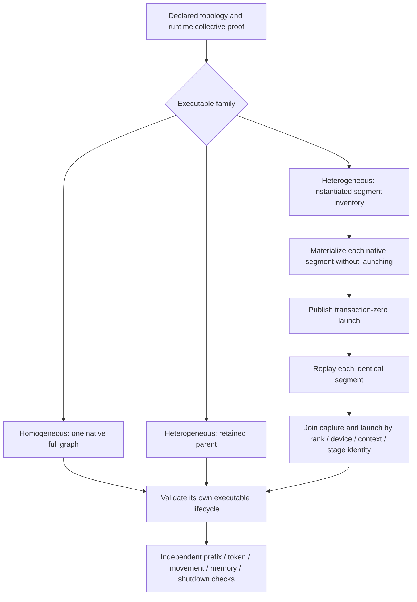

# Qwen2 multi-device generation evidence — 2026-09-11

This slice admits previously unseen generation controls one at a time from
`pipeline-request-authority-inventory.json`. It does not approve a token corpus,
replace the deep HF gate, or certify a Docker image. The Release runtime,
FP32 activations, FP16 KV, Q4_0 weights, seed 4242 and four continuous
384-token fresh/full/partial/full probes are unchanged.

## Initial observations

| Local TP topology | Result | Whole cell seconds |
|---|---|---:|
| 2 CUDA, NCCL | Pass; all four probes and eight harness checks | 18.730 |
| 2 ROCm, RCCL | Fresh response stops after 69 tokens | 24.893 |
| 4 ROCm, RCCL | Pass; all four probes and eight harness checks | 56.454 |
| CUDA + ROCm | Four token probes pass; graph-evidence observer rejects segments | 61.040 |

The ROCm pair returns one coherent field-guide entry and EOS, with clean logs
and shutdown. That is insufficient horizon, not a passing cell. Since the
first request ends acquisition, the downstream requirement for a reuse wait
has no second request to observe. This secondary diagnostic is not independent
evidence of a request-input lifetime defect. The cause of short generation is
not established by coherent text alone; it remains separate from the observer
bug below.

Every initial run reused the unchanged 647-Unit/136-preflight receipt at
`pipeline-request-authority-prerequisites-01/prerequisites.json`, with zero
prerequisite elapsed time and zero model-copy bytes. Models came from the sealed
persistent tmpfs, not SSD. No full-model hashing occurred.

The four HTTP requests account for 9.154 seconds of the CUDA pair's cell and
25.017 seconds of the ROCm quartet's cell. Remaining cell time includes server
readiness, evidence validation and shutdown; it is not a kernel attribution.
The mixed-vendor requests take 39.730 seconds before post-run validation. These
observations demonstrate bounded generation-control cost, not that 1,536-token
generation is universally cheaper than the short cached-HF diagnostic.

## Segmented executable lifecycle audit

The mixed-vendor cell published fifty instantiated native segments per device
and context. Each decode segment launched 1,532 times; each used prefill segment
launched twice. Both devices published transaction-zero admission and exact
per-segment executable node inventories. Its numerical/token and prefix probes
completed; the post-shutdown policy rejected all four contexts because it
required `full_graph_capture_executable_nodes` even for explicitly allowed
heterogeneous segment execution.

The fix belongs in the shared HTTP evidence observer, not inference. It joins
physical segment nodes and launches by rank, device, graph context, first/last
stage and stage count. Each launched segment needs its own nonempty executable;
each unit in a used context needs a launch. Repeated execution requires replay,
and setup-materialized units require transaction-zero publication. Unused setup
families need no synthetic request. Runtime graph-cache identity remains the
separate authority for embedded pointers and geometry.

This keeps heterogeneous segment proof distinct from native-full and retained-
parent proof. It does not claim that segments are a full graph, allow homogeneous
segmentation, permit eager warmup, or count graph-only children as executables.
No kernel, hot-path synchronization, precision, runtime launch or timeout changed.

Five new tests reduce the real artifact and adversarially remove captures,
launches or transaction zero; mutate rank/device/context/stage identity; replace
an executable with a child template; supply zero/NaN/infinite nodes; omit replay;
and test unused setup families. The positive regression fails on all eight
vendor/rank/context combinations before the fix. The complete evidence-policy
suite then passes **112/112**. These device-free regressions join the existing
`V2_Unit_ServerGraphCapturePerfPolicy` registration, hence the canonical Unit
prerequisite. No new device defect was identified in this observer fix.

Offline interpretation of all 6,654 records from the original mixed-vendor
artifact passes after the fix. Twenty measurements give a 7.620-ms median and
9.889-ms maximum for graph-policy validation only. This post-shutdown observer
does not affect inference and the measurements are not a live race-stress gate.

The refreshed shared gate passes **647/647 Unit** in 72.87 seconds and
**136/136 preflight** in 497.62 seconds, 571.222 seconds combined. The fresh
mixed-vendor cell then passes all eight harness checks in **63.323 seconds**,
including all four 384-token requests and captured-segment/prefix/memory/shutdown
evidence. Every prompt and completion token ID and termination also matches
the original run exactly. The old failed receipt remains unchanged.

Thus this four-topology slice has three passing generation controls and one
insufficient-horizon failure. No other previously seen cell was rerun. Future
unchanged-build cells reuse
`segmented-executable-evidence-prerequisites-01/prerequisites.json`; the gate
was refreshed once for the observer change, not once per cell.

## Artifact roots

All paths below are ignored local evidence under `parity-results/`:

- `generation-qwen2-local-tp-cuda-unseen-01`.
- `generation-qwen2-local-tp-rocm2-unseen-01`.
- `generation-qwen2-local-tp-rocm4-unseen-01`.
- `generation-qwen2-local-tp-mixed-unseen-01` (preserved original failure).
- `generation-qwen2-local-tp-mixed-fixed-02` (fresh all-checks pass).
- `segmented-executable-evidence-prerequisites-01` and its sibling `.log`.

The full 510-cell generation acquisition, numerical provenance, baseline
approval, routine-CI cutover and independent AVX512/AVX2 image certification
remain incomplete. These focused passes are not an aggregate certificate.
