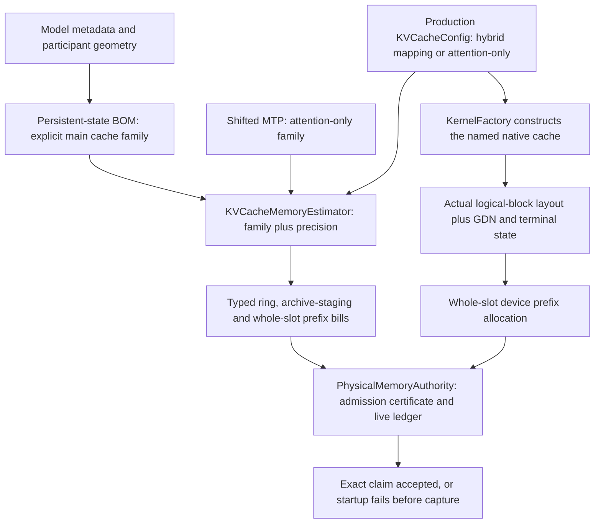

# Qwen3.5-0.8B generation controls — 2026-09-11

This is an evidence log, not a second matrix definition or an approved token
corpus. The current canonical typed inventory contains sixteen MTP-off controls
for the real `Qwen3.5-0.8B-Q4_0.gguf`. Every control uses FP32 activations,
fixed-seed stochastic generation, and four continuous 384-token requests with
fresh/full/partial/full prefix obligations. Hybrid recurrent-state restoration
is required independently of matching output tokens.

All runs below use the Release server through the canonical generation driver,
with exact runtime arguments from `cpu-pp-logical-rows-inventory-01.json`.
They reuse the unchanged **647-Unit/137-preflight** receipt at
`cpu-pp-logical-rows-prerequisites-01/prerequisites.json`; no Unit/preflight cost
is charged again. Models are reused from the sealed persistent tmpfs, with zero
bytes copied. No source, prompt, horizon, precision or inference policy change
is made during this acquisition pass.

## Pipeline and cross-rank results

| Canonical topology | Result | Whole-cell seconds |
|---|---|---:|
| LocalPP, CPU0→CPU1 | Eight checks pass | 48.685 |
| LocalPP, CUDA0→CUDA1 | Eight checks pass | 29.515 |
| LocalPP, CUDA0→ROCm0 | Eight checks pass | 46.320 |
| LocalPP, ROCm0→ROCm1 | Eight checks pass | 51.234 |
| NodePP, two CPU MPI ranks | Eight checks pass | 45.542 |
| NodeTP, two CPU MPI ranks | Eight checks pass | 36.603 |

Each pass includes four complete 384-token responses, exact restored pairs,
prefix-state evidence, memory checks and clean shutdown. GPU cells additionally
prove their native executable graph families; the mixed-vendor pipeline must
independently prove its declared heterogeneous boundary. Cross-rank evidence
retains all participant records and the runtime-selected serving authority.

Artifact roots under ignored `parity-results/`:

- `generation-qwen35-08b-localpp-cpu-unseen-01/`.
- `generation-qwen35-08b-localpp-gpu-unseen-01/`.
- `generation-qwen35-08b-nodepp-cpu-unseen-01/`.
- `generation-qwen35-08b-nodetp-cpu-unseen-01/`.

## Single-device and local-TP acquisition

| Canonical topology / KV | Result | Whole-cell seconds |
|---|---|---:|
| CPU0 / FP16 | Eight checks pass | 47.151 |
| CPU0 / Q8_1 | Eight checks pass | 46.743 |
| CPU0 / Q16_1 | Eight checks pass | 47.122 |
| LocalTP, two CUDA / FP16 | Eight checks pass | 20.688 |
| CUDA0 / FP16 | Eight checks pass | 16.925 |
| CUDA0 / Q8_1 | Startup prefix-slab admission failure | 6.942 |
| LocalTP, CUDA + ROCm / FP16 | Eight checks pass | 60.487 |
| LocalTP, two ROCm / FP16 | Eight checks pass | 55.253 |
| ROCm0 / FP16 | Eight checks pass | 35.084 |
| ROCm0 / Q8_1 | Same startup prefix-slab admission failure | 7.191 |

This completes first-attempt acquisition of all sixteen controls: fourteen
pass, and two expose one shared accounting defect. The first batch stops at
CUDA Q8; the four still-unseen controls are then selected separately from the
same inventory, without rerunning its already observed cells or prerequisites.

Artifact roots: `generation-qwen35-08b-remaining-unseen-01/` and
`generation-qwen35-08b-unseen-tail-01/`, both under ignored `parity-results/`.

## Hybrid Q8 accounting defect

Both native backends request 259,645,440 prefix-slab bytes against an admission
of 259,534,848 bytes. The 110,592-byte difference is caught before capture or
inference. This is not exhausted VRAM or a reclamation race.

The former estimator selected an anchored AQ8-key/Q8_1-value layout from the
`q8_1` precision token alone. `KernelFactory` actually selects linear Q8_1 K/V
for a hybrid GPU main cache, while its separate attention-only MTP cache uses
anchored keys. Floating-point cache formulas coincide between those families.
The same omitted family also underpriced live hybrid Q8 ring ownership,
especially CUDA's persistent linearization horizons.

The staged GGUF metadata confirms six FA layers, two KV heads, head width 256,
and 64 tokens per prefix block. One hybrid key block is
`64 * 2 * 8 * sizeof(Q8_1Block) = 36,864` bytes. The erroneous anchored-key bill
was `2 * 256 * sizeof(float) + 64 * 2 * sizeof(AttentionKeyQ8Block<256>) = 35,328`
bytes. Their 1,536-byte difference multiplied by six FA layers and twelve
arena slots is exactly 110,592 bytes. Actual prefix slots are 21,637,120 bytes,
not 21,627,904. No tensor payloads were hashed to establish these facts.

The correction makes `KVCacheFamily` a required estimator argument. Main-model
family resolution survives a PP slice containing only FA layers; the shifted
MTP sidecar is explicitly attention-only. CPU hybrid Q8 remains anchored.
There is no change to weight/activation/KV precision, cache allocation calls,
kernels, inference arithmetic, or the configured memory budgets.

The new model-free `GPUPrefixCacheAccounting.NativeLayoutMatchesAdmittedSlab`
regression is compiled into both existing `GPUGraphCaptureExecution`
ProductionParityPreflight registrations. Before the fix it reproduces the
hybrid Q8 mismatch at all six tested head geometries on both GPUs in under one
second per backend. Floating-point hybrid controls and attention-only controls
do not exhibit it. The expanded sweep also covers attention-only TQ4/TQ8;
device-free tests reject unimplemented hybrid TQ rather than substituting a
codec. Unit coverage separately pins distinct main/shifted prices and FA-only
hybrid pipeline slices.

Post-fix focused verification:

- `V2_Unit_KVCacheMemoryEstimator` and `V2_Unit_MemoryPlanner` pass together
  in 0.67 seconds.
- CUDA and ROCm each pass twenty repetitions of the real-device regression:
  sixty native cache configurations per repetition, 1,200 per backend.
- Both Release and Integration builds succeed, including the complete
  gate/parity executable inventory.
- The refreshed shared gate passes all 647 Unit and 137 preflight registrations
  in 591.974 seconds (Unit 73.74; preflight 517.54). Its receipt is
  `hybrid-q8-prefix-prerequisites-01/prerequisites.json`. Both GPU graph suites
  include the new regression. Subsequent unchanged cells reuse this receipt.
- Both exact real-model rechecks pass all eight harness checks in
  `generation-qwen35-08b-q8-prefix-fixed-01/`: CUDA in 17.778 seconds and ROCm
  in 35.436 seconds, 53.731 seconds for the pair including driver overhead.
  Each emits four complete 384-token responses, retains captured production
  evidence, proves full/partial recurrent-prefix restore and shuts down cleanly.
  The driver reports zero prerequisite elapsed seconds through authenticated
  receipt reuse; the shared gate is not silently charged to either cell.

All sixteen 0.8B controls now have individual passing evidence. Only the two
repaired cells were rerun after the fix; this is not a claim of a newly executed
sixteen-cell aggregate. Both canonical HF/CSV Q8 rechecks also pass, with all
eight canonical artifacts validated per cell and all five forced decode tokens
matching the reference. Captured prefill/decode replay is proven and there is
no segmented execution.

| Backend | HF diagnostic seconds | Prefill LM-head cosine | Prefill KL | Minimum decode cosine | Maximum decode KL |
|---|---:|---:|---:|---:|---:|
| CUDA | 4.448 | 0.999846 | 0.000592091 | 0.999608 | 0.00191169 |
| ROCm | 4.447 | 0.999838 | 0.00124931 | 0.999613 | 0.00143615 |

Evidence: `hybrid-q8-prefix-{cuda,rocm}-hf-fixed-01/`, including each report's
timestamped `production-campaign-artifacts/` subtree. The mathematical packs
remain independent CPU/FP32 HF references; their established gates were not
modified.

These small cached HF diagnostics are faster than the four-request,
1,536-token server controls (17.778 / 35.436 seconds). The workloads prove
different things; long-token coverage is not evidence that generation is
universally cheaper. A whole-matrix routine-CI economy improvement remains to
be measured on the larger/MTP cohorts. No new approved baseline or image
certificate is issued from either diagnostic form.

Green evidence: `hybrid-q8-prefix-focused-unit.log` and
`hybrid-q8-prefix-regression-{cuda,rocm}-green.log`.

Red reproductions: `hybrid-q8-prefix-regression-{cuda,rocm}-red-03.log`.
The earlier `red` and `red-02` logs are fixture bring-up diagnostics, not the
isolated production defect: their test configuration initially omitted prefix
enablement and the associated host resource, respectively.

## Certification boundary

Passing controls are unapproved behavioral evidence: they
do not replace independent HF provenance, authorize a corpus publication, or
certify either AVX512 or AVX2 Docker images. The broader matrix and image goal
remain incomplete.
