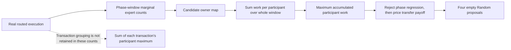
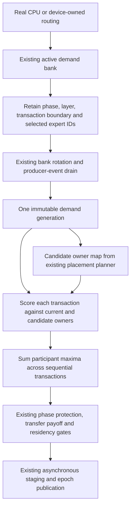
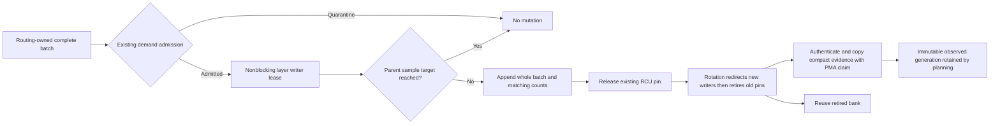
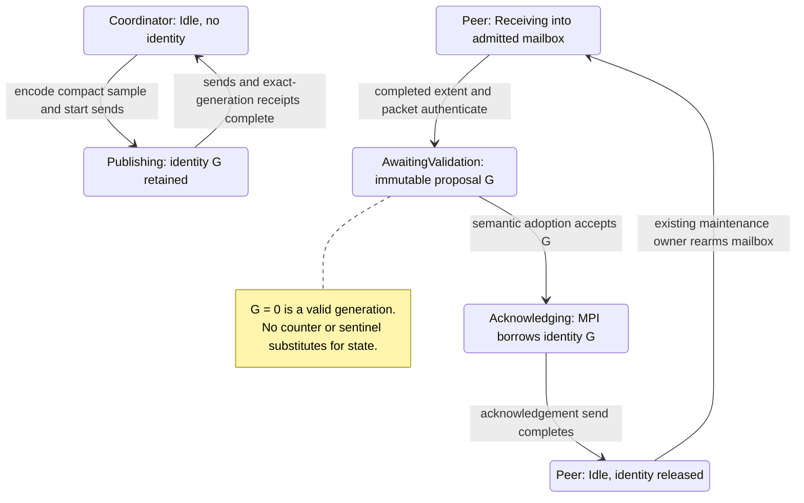
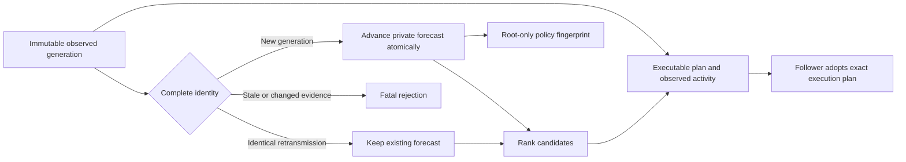
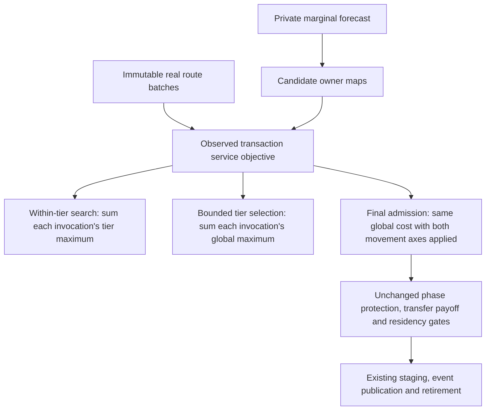
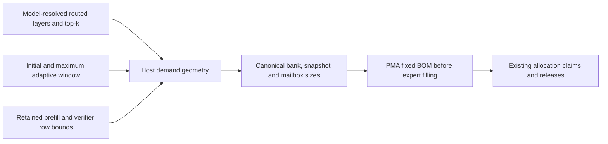
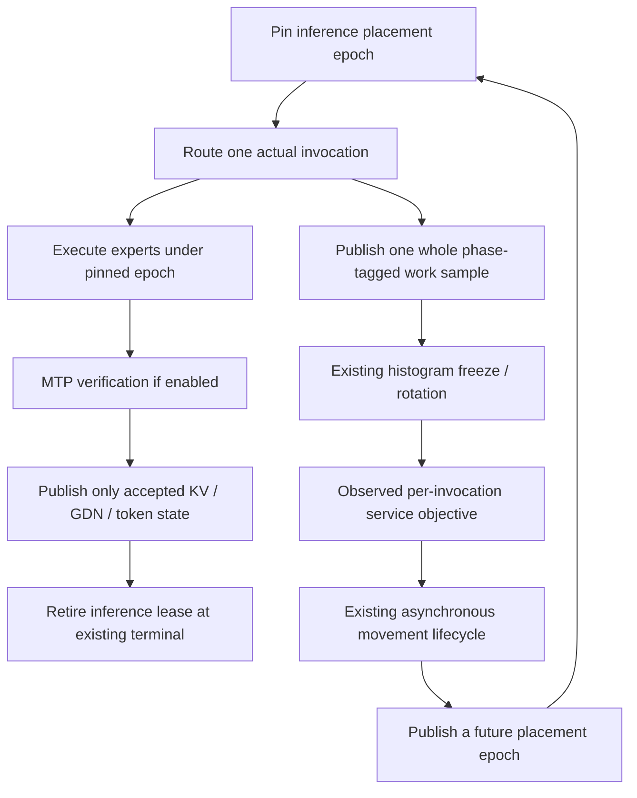

# ROCm1/CPU2 Random control: zero admitted movement — 2026-09-11

Current resolution: the preserved Dynamic/Random control passes in 85.688 s
with 125 completed expert moves. See the final producer/lifecycle section for
fresh evidence; the zero-movement observations below describe the original red.

## Preserved production result

`generation-qwen35moe-heterogeneous-unseen-04` passes six previously unseen
Qwen3.5-35B Q4_K_XL MTP-off controls, then stops at ROCm1/CPU2, two MPI ranks,
Dynamic/Random, FP32 activations and FP16 KV. The exact artifact key is
`3e3245667f0236ee8a15c5d8579bf048781f644e2961ddc6902e0ef28a2e1871`.
All four 384-token HTTP probes, prefix checks, graph evidence, memory ownership
and teardown pass. The final movement obligation fails after 85.16 seconds.
The immediately preceding Dynamic/Ordinal control passes in 84.89 seconds.

These are public Release server executions with unchanged typed definitions,
prompt bodies, seed and weights. The 790-test prerequisite receipt is reused;
no per-cell prerequisite run or tmpfs model copy occurs. Six selected controls
remain unrun. The historical 175-control ledger is 84 latest green observations,
17 retained reds and 74 unseen cells, not a fresh aggregate certificate.

## What the evidence establishes

This is not the previous CPU cold-class readiness failure, a transfer timeout,
or the repaired prefill-sequence identity defect:

- Both ranks complete the economy certificate after seven readiness rounds.
- The authority is rank 1, matching the discovered ROCm placement. No rank or
  NUMA affinity is overridden by the test.
- Four optimization windows each contain 256 tokens, with a 65,536-token payoff
  horizon. All proposals are received and acknowledged across ranks.
- The Random case rejects 41/42/42/42 cycles on payoff. There are no residency
  rejections. The reported nearest rejected cycle has zero projected service
  gain and 3,563,604 ns transfer/repack cost. All four final proposals are empty.
- The Ordinal case admits one two-edge move, then makes three no-op decisions.
  Its first accepted proposal reports about 10.73 seconds projected service
  gain over the configured horizon, against 3,377,129 ns transfer/repack cost.

Complete service prices exist in both cases. For example, Random layer 0 decode
is 7,670 ns/activation on ROCm and 419,193 / 98,296 on the two CPU participants.
The singleton-format layer 10 is also priced. Do not lengthen calibration,
invent missing measurements, raise a payoff horizon multiplying zero gain, or
count non-publishable calibration copies as movement.

## Service-objective audit: confirmed structural limitation, attribution open

`MoEOverlayResidencyAuthority::score_participant_makespan` accumulates each
participant's entire layer/phase-window work and only then takes the maximum.
It also rejects any phase regression before publishing aggregate service gain;
therefore a reported zero gain does not distinguish a truly neutral plan from
an early phase-regression rejection. The current artifact does not retain the
exact frozen expert-count vector or per-candidate before/after phase costs.
Do not claim that it proves which rejection branch every candidate took.

For sequential decode transactions, `max(sum(work))` is not the same objective
as `sum(max(work))`. A concrete example with two tokens is:

| Token | GPU work before | CPU work before | GPU work after promotion | CPU work after |
|---|---:|---:|---:|---:|
| 1 | 8 | 0 | 8 | 0 |
| 2 | 7 | 10 | 8 | 0 |

The window-aggregated proxy predicts 15 → 16 (regression), but the serial-token
critical path is 18 → 16 (improvement). Units are arbitrary; this is a
mathematical counterexample, not a timing measurement of the failed cell.
Rare slow CPU work can disappear behind aggregate GPU work in this proxy even
though that CPU call delays its individual token. Marginal expert histograms
alone cannot reconstruct which experts co-occurred in a transaction.

The CPU reference for the GPU placement policy has the same window-maximum
approximation for same-tier moves, but a sum-of-tier-costs objective for
cross-tier moves. Host and device authorities therefore need a joint audit;
copying one existing approximation to the other is not a proven repair.

## Next bounded work

1. Preserve this exact red and stop broader acquisition. Obtain the exact
   phase-specific rejection reason and frozen candidate inputs at the existing
   planning boundary, without changing inference or forcing a placement.
2. Reduce it to a device-free economy regression. Distinguish a genuinely
   unprofitable public workload from the window-granularity defect before
   changing either policy or test intent.
3. If transaction-granular evidence is required, design one typed bounded
   routing-owned representation, including its PMA BOM and event-aware drain.
   Share its cost semantics across host/CUDA/HIP controllers. No extra host
   model-state mirror, per-token synchronization or guessed co-occurrence.
4. Keep genuine transfer payoff and per-phase protection. Do not replace the
   maximum with a naive sum, weaken movement assertions, or change seeds,
   weights, prompts or capacities just to obtain a green result.
5. Focused regressions first, then one refreshed shared gate only if code
   changes. Rerun this exact cell before the six untouched controls.

No policy fix is installed for this new failure yet. The prior CPU producer
and sequence-identity fixes remain individually proven, with the full Unit and
production preflight gates green on the current build. Routine HTTP baseline
approval, full matrix coverage and both ISA image certificates remain pending.

## Installed rejection evidence, policy unchanged

The host authority now retains the exact before/after window cost of each
candidate phase, including when the phase-regression check exits early. A typed
`CyclePayoffDisposition` replaces the ambiguous payoff boolean; its single
eligibility predicate preserves the original decision. PerfStats mirrors each
full candidate's phase costs and disposition after scoring, and the existing
closest-rejection envelope carries that same disposition. It does not obtain
new device state or affect routing/placement.

Three device-free regressions first fail on the missing distinction, then pass:
unchanged critical participant (`no_projected_gain`), a prefill regression
despite decode improvement (`phase_regression`), and positive gain insufficient
to repay measured transfer (`insufficient_payoff`). All 49 residency-authority
tests pass, including 20 complete repetitions. Release is rebuilt. The fresh
`economy-disposition-prerequisites-01` receipt passes all 647 Unit and 143
production preflight tests in 600.293 seconds. This is a diagnostic improvement,
not yet the movement-policy fix or a green model cell.

## Exact rerun: rejection branch is now established

`generation-rocm-cpu-economy-disposition-01` reproduces the same movement failure
in 85.520 seconds. It reuses that 790-test receipt and the sealed tmpfs GGUF
with zero copied bytes. All four HTTP request observations are retained; no
control baseline is approved from this red cell.

The authority's 167 fully scored cycles divide as follows:

| Histogram generation | Decode regression only | Decode and prefill regression | Prefill regression only | No projected gain |
|---|---:|---:|---:|---:|
| 1 | 40 | 0 | 0 | 1 |
| 2 | 23 | 16 | 1 | 2 |
| 3 | 22 | 17 | 1 | 2 |
| 4 | 24 | 16 | 0 | 2 |

Thus 160 cycles exit through `phase_regression` and seven through
`no_projected_gain`. None reaches an insufficient-positive-payoff rejection.
Increasing the transfer budget or payoff horizon cannot change these decisions.

For example, generation 1 / cycle 13 reports decode service
16,930,737 → 16,939,008 ns. These are exactly 2,047 × 8,271 and
2,048 × 8,271 ns. The common-format GPU price is 8,271 ns/activation;
the corresponding CPU prices are 321,027 and 86,868 ns/activation. Metadata
read directly from the existing tmpfs GGUF confirms eight selected experts per
token, 256 experts, and 40 main layers. The reported GPU-work increment is
consistent with promoting a rare CPU route into a nearly all-GPU window.
It is not, by itself, a measurement of the removed per-token CPU wait, and the
per-cycle evidence still does not retain the complete route grouping.

## Why another histogram-only formula is not a general repair

A bounded-overlap correction can improve the estimate for an isolated slow
route, but cannot reconstruct a general transaction critical path. This small
device-free calculation demonstrates the missing information:

- Before the move, GPU owns experts 0/1 and CPU owns experts 2/3. One expert
  activation costs 1 on GPU and 3 on CPU; two experts are selected per token.
- The candidate exchanges experts 0 and 2.
- Routing `(0,1), (2,3)` costs 8 before and 6 after the move.
- Routing `(0,3), (1,2)` costs 6 before and 8 after the same move.

Both windows have exactly the same four marginal expert counts, phase, token
count, owner map, and service profile. Their movement gains have opposite
signs. Consequently neither replacing maximum with sum, adding a constant
penalty, nor inferring co-occurrence from those counts fixes the general
objective. This calculation was executed locally; it is not a new registered
regression or a measured hardware speedup.

## Consolidated implementation direction

Retain transaction-shaped demand in the existing routing evidence banks; do
not add another controller, sampler, timing pass, or lifecycle state machine.
The existing host ingress already receives complete row-major expert IDs in
`MoEExpertDispatchStage::publishRoutingEvidence` and passes them to
`DecodeExpertHistogram::mergeRoutedExpertRows`. That merge currently discards
the grouping while forming marginal counts. Native GPU producers must retain
the equivalent evidence on device, not download routes token by token.

The implementation must satisfy these constraints before this cell is called
fixed:

1. Retain only routed expert IDs and transaction geometry needed for the cost
   objective, not activations, logits, sampler state, or per-token wall-clock
   samples. Prefill chunks and grouped-verifier transactions must retain their
   true batch boundary rather than being silently treated as serial decode.
2. Use one bounded bank BOM admitted by `PhysicalMemoryAuthority`. Derive its
   capacity from the admitted demand window, retained layer/route geometry and
   maximum in-flight transaction overhang. No hot-path allocation, unbounded
   history, new stream wait, or new drain protocol.
3. Authenticate cohort counts against the frozen phase marginals. Preserve
   calibration/quarantine/optimization admission and existing event retirement;
   missing or truncated production cohorts cannot silently select the old
   approximation.
4. Share cost semantics between the host authority, GPU policy reference and
   CUDA/HIP implementations. Candidate generation may use historical marginal
   demand, but an admission claim must name the exact measured demand generation;
   independently rounded EWMA counts cannot masquerade as observed transactions.
5. First add focused regressions for the opposite-payoff example, rare slow
   routes, multiple simultaneous slow participants, grouped boundaries, and
   phase non-regression. Then prove bank lifecycle/capture equivalence on real
   devices and add those functional tests to preflight. No format-specific fix.
6. Refresh the shared gate once for that changed build, rerun this exact HTTP
   red, then resume the six untouched selected controls. Full corpus, MTP and
   both ISA Docker certificates remain separate outstanding obligations.

This direction is not connected to production planning yet. No production
scoring formula, model configuration, movement obligation, or numerical gate
was changed in the diagnostic slice.

## TDD implementation started: shared arithmetic and bounded storage

Two dependency-light host/device components now exist:

- `MoEOverlayTransactionCost.h` prices the selected logical routes against
  current/candidate owner maps and a phase/layer's measured participant prices.
  It sums work within one participant, takes the participant maximum for one
  transaction, and separately accumulates sequential transactions. Caller-owned
  scratch makes every operation allocation-free. Invalid inputs, missing prices
  and overflow return fatal typed statuses without a publishable partial result.
- `MoEOverlayTransactionDemand.h` borrows a parent bank's fixed storage. It
  retains compact logical IDs and the actual transaction phase/boundary, ignores
  padding, validates the complete input before writing, and publishes its
  frontier only after payload and descriptor construction. It owns no memory,
  reset thread, event, allocator or independent generation lifecycle.

The capacity contract deliberately closes **measurement**, not inference: a
layer retains complete transactions until its row target is reached, including
the whole transaction crossing that target. Subsequent traffic does not enter
that closed sample. Marginal counters must share the `Recorded` admission result;
they cannot continue accumulating routes omitted from the transaction sample.
This avoids unbounded storage and does not introduce an inference-space wait or
pretend that a truncated grouped transaction is serial decode. Exact route-slot
capacity is `(target_rows + maximum_transaction_rows - 1) * top_k`; descriptor
capacity is `target_rows`. The helper supplies typed byte inputs for PMA, not an
independent physical admission decision.

`ExpertHistogramSource.h` now owns the existing phase enum and index mapping,
moved without changing values from `DecodeExpertHistogram.h`. Both forms of
demand use that same definition; there is no parallel transaction-phase enum.

The new `V2_Unit_MoEOverlayTransactionCost` and
`V2_Unit_MoEOverlayTransactionDemand` registrations join the canonical Unit gate.
Their 15 contained tests were first red, then passed, including 20 repetitions.
They cover opposite gains with identical marginals, rare slow routes, true
grouped boundaries, poisoned padding, arbitrary participant permutations,
overflow, malformed late input, exact capacity/overshoot, closed-sample stability,
and retired-buffer reuse. The existing 49 residency-authority tests also pass
20 repetitions. CUDA and HIP compile-only checks of the new shared definitions
pass; these are not device-execution or kernel-performance certificates.

The Integration core and focused targets rebuild successfully. The complete
refreshed Unit gate passes **649/649** in **74.00 seconds** after the shared
phase-header move (`transaction-demand-full-unit-01.log`). Do not reuse the earlier
790-test receipt: the build and Unit inventory changed. No additional model
cell was launched during this component work.

### Remaining production integration (do not call the cell fixed yet)

1. Admit exact per-bank storage through PMA and the canonical capacity BOM.
   Capture its complete pointers/capacities. Resolve maximum transaction rows
   from actual retained prefill/verifier geometry, and preserve adaptive-window
   intent when binding the per-generation sample target.
2. Add the storage to existing host/native bank producers, not a parallel
   recorder. Their marginal updates and transaction appends must share one
   admission decision. Existing calibration/quarantine semantics still apply.
3. Freeze/authenticate transaction records with the same generation as their
   marginals, including distributed wire evidence and actual per-layer phase
   coverage. Parent retirement remains the sole reset/reuse authority.
4. Replace all production window-aggregate scoring with shared transaction
   semantics only when the complete producer/transport contract exists. No
   missing-evidence branch may silently retain the old approximation. Port the
   native CUDA/HIP consumers and profile their actual policy kernels.
5. Add real-device capture/reset/drain regressions to preflight; refresh the
   whole shared gate once, then rerun the preserved ROCm1/CPU2 Dynamic/Random HTTP
   cell before continuing the untouched cells and full image certification.

## Host-bank integration: ownership and observed-sample proofs

`DecodeExpertHistogram` now accepts a typed `ExpertHistogramTransactionConfig`
containing admitted capacity and the existing physical authority. Its two RCU
banks materialize stable per-layer transaction arrays only after PMA claims
succeed. `record()` and both sparse/dense `mergeRoutedExpertRows()` paths append
complete batches and update marginals under the same admission result. Closing
the sample stops both representations, not inference. The existing adaptive
window scalar selects the current target within the admitted maximum; there is
no second mutable limit or independent rotation state.

The RCU lease is a retirement pin, **not** writer exclusion. Transaction payload
publication has an explicit nonblocking per-layer writer lease; overlapping
publishers fail instead of corrupting the frontier or waiting for space. The
parent still owns quarantine, generation rotation and reset. Counter-only
consumers retain their original interface, but transaction-enabled consumers
reject marginal-only or independently counted boundary ingress. The production
runner does not enable this configuration yet: all producers and distributed
transport must carry complete evidence before installation.

After redirecting writers and retiring the old bank, freeze creates a compact,
immutable `DecodeExpertTransactionWindow`. It authenticates actual route IDs,
batch geometry, phases, boundary row counts and marginal counts. The copy owns
its exact PMA payload claim and outlives both bank recycling and the histogram
itself. Window copies share that payload. Modifying a copied window's counts
or generation invalidates its association with the observed transactions; an
EWMA forecast therefore cannot silently impersonate those observations.

Eight additional histogram regressions cover complete-batch closure, malformed
late input without partial mutation, exact admission/release, twenty bank
reuse generations with a retained old snapshot, adaptive targets, all three
phases, nonterminal main-layer boundaries, calibration quarantine, concurrent
rotation without lost admitted batches, and opposite service payoffs from
identical marginals through the real histogram ingress. The exact worst-case
snapshot uses the stated BOM with no anonymous reserve. All **49 histogram
tests pass twenty complete repetitions**. The eight bounded-demand and eight
shared-cost tests also pass twenty repetitions. Updated CUDA/HIP compile-only
checks pass; these remain compilation evidence, not native execution proof.
The complete rebuilt Unit gate passes **649/649 in 73.96 seconds**
(`transaction-histogram-full-unit-01.log`).
The complete rebuilt `ProductionParityPreflight` gate then passes **143/143 in
533.29 seconds** (`transaction-histogram-preflight-01.log`). CUDA and ROCm were
idle before admission. Both builds and test processes are terminal; no model
or benchmark process was started. These are fresh direct CTest gate results,
not an approved model corpus or a reusable driver receipt.

No model cell was rerun or turned green in this host-bank slice. The immediate
remaining work is complete distributed/native evidence publication, separate
typed forecast versus observed-demand inputs, canonical production BOM binding,
and switching the host/device admission consumers to the shared transaction
cost. The previous prerequisite receipt is still stale. Keep the exact red and
six selected unseen controls paused until those pieces and their device
regressions are ready; refresh the shared Unit/preflight gate once for that
changed build before resuming model acquisition.

### Producer audit to resolve before the MTP switch

The existing CPU grouped-verifier publisher is **accepted-demand** ingress:
`MoERoutingStage::publishHostGroupedVerifierHistograms()` calls the merge once
per request with `real_token_count = accepted_state_counts[request]` and
`bucket_token_count = rows_per_request`. This is not automatically the complete
batch that executed. Do not label that accepted prefix as the observed full
verifier transaction merely because its phase enum is `GroupedVerifier`.
Its per-request merge loop also cannot be treated as evidence that requests
within one grouped invocation executed serially; preserve the actual invocation
boundary when scoring their concurrent work.
The new host-bank unit tests prove retention for the batch supplied to them;
they do not certify this production MTP producer yet.

Before enabling transaction-cost admission for MTP, explicitly distinguish
executed service work/batch geometry from accepted-demand forecasting (or
deliberately consolidate their policy with equivalent functional proofs). Keep
the actual executed verifier boundary and logical row count; neither bucket
padding nor a rejected-but-executed row can be silently reclassified. This
audit is separate from the preserved MTP-off red, whose ordinary ticket
publisher already receives the complete logical route prefix. The GPU/native
accepted-state publishers need the same audit, alongside their existing bank
event/drain lifecycle.

## Distributed transaction evidence and generation-zero correction

The histogram/proposal codec now transports complete compact transaction
records. One top-k and token-boundary coordinate describe the sample; each
layer carries its used frontier, each transaction carries rows/phase, and the
route IDs follow without capacity padding. Offsets are reconstructed rather
than duplicated on the wire. The histogram ABI is 3 and proposal ABI is 2;
fingerprints include batch boundaries and route co-occurrence, not only
marginal counts. Local freezes and received packets share the same semantic
validator. Missing required evidence, inconsistent counts, malformed extents
and same-marginal route tampering fail before publication.

`MoEOverlayMPIResidencyProposalPublisher` preposts a maximum-capacity receive
with a PMA claim when transaction evidence is configured. It sends only the
used packet and obtains the received extent from MPI's completed status. There
is no additional size handshake or lifecycle lane. Received snapshots own
independent immutable claims, so mailbox reuse cannot mutate retained evidence.
The production runner forwards the histogram's admission into the publisher;
it does not enable transaction recording or change cost admission yet.

The real two-rank regression exposed an existing sentinel mismatch that the
older hand-built protocol fixtures missed. `DecodeExpertHistogram` begins at
generation **zero**, but publisher acknowledgement code interpreted zero as
"no generation". The first real frozen sample was decoded and then rejected.
The red reproduction is preserved in
`parity-results/transaction-mpi-generation-zero-red-01.log`. Existing integration
fixtures used explicitly nonzero generations or had already discarded a
calibration bank, hiding that boundary.

Three zero-sentinel generation fields are now one optional active identity.
That same stable value survives decoding, semantic acceptance and MPI's borrow
of the acknowledgement buffer. Only completion/drain releases it. MPI receipt
counts are also authenticated so an empty acknowledgement cannot impersonate
generation zero by leaving an initialized receive scalar unchanged.

The focused unit executable now has **26 tests**, passing **20 repetitions**;
the histogram's **49 tests** also pass **20 repetitions**. The new MPI test is
in a separate translation unit of the existing residency-consensus preflight
executable. It alternates large/small packets, authenticates prefill/decode
boundaries, refuses missing evidence, retains the oldest snapshot across twenty
epochs, and checks exact physical claims after teardown. It passed **20 fresh
two-rank CTest runs**, or **400 publication/reuse epochs**, in **19.75 seconds**
(`transaction-mpi-publication-stress-01.log`). The complete residency-consensus
integration suite subsequently passed in **1.25 seconds**
(`transaction-mpi-full-consensus-01.log`). These are protocol proofs, not a new
green model cell.

The complete changed-build gate is now terminal and green: **649/649 Unit in
72.41 seconds**, then **143/143 ProductionParityPreflight in 530.16 seconds**.
The canonical driver reports **603.306 seconds** including its no-op build and
discovery, and owns the reusable receipt at
`parity-results/transaction-wire-prerequisites-01/prerequisites.json` with both
CTest logs/JUnit files alongside it. Use that receipt only while this build is
unchanged; the upcoming production scorer/native changes will require a new
gate. No model, server benchmark, corpus approval or image certification ran
during this verification.

### Authority simplification: observed input versus private forecast

Do not introduce a second published histogram merely to carry rounded EWMA
counts. The previous implementation replaced `transaction.histogram_window`
with its rounded planning window, invalidating authentic observed transactions
after the first smoothing step. The simpler target boundary is:

- Keep the typed placement forecast private to the authority. It may rank
  candidate owners using history, but cannot stand in for observed batches.
- Retain the raw authenticated window on the executable transaction and derive
  its movement activity metadata from those observed counts. Followers then
  validate one published demand generation, not an independent forecast.
- Score admission from actual transaction boundaries against both owner maps.
  Bind the private forecast's identity into the root's policy audit, not the
  follower's execution authority or a second route payload.

The forecast separation is now implemented. `PlacementDemandForecast` is one
private value pairing its last immutable input with its prediction; it replaces
the two independent optional histogram states. It advances once per generation
with strong exception safety. Complete canonical input identity rejects altered
batch co-occurrence with unchanged marginals. Rounded phase counts derive their
redundant totals; independent rounding of the total is no longer permitted.
The root policy fingerprint is version 6 and includes `forecast_fingerprint`.
Execution fingerprints and the wire payload shape are unchanged by this step.

The real second-generation red is preserved in
`parity-results/forecast-observed-generation-red-01.log`: the old implementation
rewrote counts while retaining the first window's sealed batch evidence, then
threw `deterministic smoothing produced an invalid histogram window`. Earlier
counter-only fixtures had no sealed transactions and could not expose that
violation. The changed fixture preserves both actual generations through the
histogram's production ingress; it does not mutate a sealed generation number.

This is not yet the transaction-aware service-cost switch: admission still
uses the old aggregate-window pricing. Canonical production BOM admission,
native producer/consumer ports and the shared true-batch scoring installation
remain outstanding. MTP's executed-work versus accepted-demand distinction
above remains an explicit separate obligation. No model/corpus approval or
image certificate was advanced by this component slice.

### Cost-consumer audit before the host scoring installation

The next installation must cover candidate search as well as final admission.
Fixing only the final gate leaves the profitable alternative excluded before
it can be scored:

| Consumer | Current approximation to remove |
|---|---|
| `MoEOverlayResidencyAuthority.cpp`, `bounded_tier_cycle_score` | Maximum participant work after summing the entire phase window |
| Same file, `score_participant_makespan_transition` | Another whole-window maximum for selected cycle sets |
| Same file, `planOverlayParticipantRebalance` | Candidate ranking and eligibility from marginal endpoint work |
| `kernels/common/MoEOverlayDeviceControllerDevice.inl`, `scoreDynamicCycleEconomy` | Same-tier whole-window maximum; cross-tier summed moved-expert work |
| Same native policy's assignment scoring/search | Marginal same-priority makespan used before candidate admission |

Use the shared true-transaction scorer for both owner maps at these boundaries;
do not retain a marginal-only branch when required transaction evidence is
missing. Native CUDA/HIP share the `.inl` but still need actual capture/replay,
writer/reset, capacity and kernel-economy proofs. Their controller remains on
device. The host forecast correction does not port these cost decisions.

`MoEOverlayLocalCapacityPlanner` builds per-resource additions through
`PhysicalMemoryBOMBuilder`; `MoEOverlayCapacityAdmission` joins the canonical
runtime workspace requirements before automatic expert fill. These are the
production admission joins for the new bounded bank/mailbox/snapshot contract,
not permission to subtract a reserve at runner construction. The runtime
histogram setup in `OrchestrationRunner` still leaves `transaction_demand`
disabled. Its dispatch publisher has complete ordinary logical route batches;
the accepted-only grouped-verifier and native marginal drains require the
explicit producer work described above before enabling that contract globally.

### Forecast slice verification and handoff

The final authority executable passes **53 tests through 20 repetitions**
(`forecast-authority-final-stress-01.log`). Its four new regressions exercise
real second-generation batches, altered co-occurrence under one generation,
phase-total rounding and failed-advance exception safety. Existing smoothing
convergence now checks raw published activity and dense export validity. The
second-generation test additionally proves that a follower without forecast
history adopts the same execution fingerprint. Diagnostics distinguish observed
and forecast token counts and retain the root's forecast identity.

The distributed protocol's **26 tests pass 20 repetitions**
(`forecast-protocol-stress-01.log`); the complete real two-rank residency
consensus integration suite passes **20 fresh runs in 22.57 seconds**
(`forecast-mpi-consensus-stress-01.log`). Root-only forecast changes affect
policy identity, not the follower's execution identity.

All prerequisite targets were rebuilt after the shared evidence change. The
canonical driver then passes **649/649 Unit in 75.56 seconds** and
**143/143 ProductionParityPreflight in 527.17 seconds**. Its **603.465-second**
receipt includes the final no-op build and discovery, not the earlier rebuild:
`parity-results/forecast-authority-prerequisites-01/prerequisites.json`.
The adjacent Unit/integration logs and JUnit XML retain complete evidence.
`transaction-wire-prerequisites-01` is now stale; use the new receipt only while
this build remains unchanged. Further production changes require one refreshed
gate before admitting model cells, not a gate per cell.

No additional model cell, approved token corpus or image was certified. The
preserved ROCm1/CPU2 Dynamic/Random MTP-off zero-movement cell remains red. Keep
its exact public-HTTP request/model/precision identity and the six selected
unseen controls paused until the remaining transaction-cost installation is
ready. Release must be rebuilt before its next HTTP reproduction; this slice
rebuilt Integration/prerequisite targets only. No commit or push was made.

## Host service-cost installation and fixture contract repair

The host authority now uses `ObservedTransactionServiceObjective` for all three
previously separate service calculations: same-tier candidate search, bounded
tier-cycle preselection, and final/coupled-cohort admission. It borrows the
authority's certified participant/layer price table and uses the shared
`scoreTransaction`/`appendTransaction` arithmetic. Candidate scratch is reused
across batches. The obsolete stored tier-price lookup table and unused service
accessors were removed.

The within-tier search remains deliberately broader than final global admission,
so jointly profitable tier/skew cohorts are not pruned by an unrelated current
bottleneck. Its imbalance check now sums invocation-local minima and maxima too.
Projection uses the observed token count, never the rounded forecast count.
Missing observed batches fail closed when service is requested; there is no
marginal-only approximation branch.

Three reduced authority tests were first red against the old scorer:

- balanced window marginals hid two individually skewed decode invocations;
- 273 sequential top-one invocations falsely claimed a 7,426 ns parallelism gain;
- twenty GPU-only invocations hid one slow CPU invocation whose promotion saves
  90 ns under the declared prices and 21-token horizon.

All three pass after consolidation. An additional paired test proves that
prefill and grouped-verifier batching changes payoff even with identical
marginals, and rejects missing invocation evidence.

The initial authority audit exposed 23 older fixtures that supplied counts
without execution geometry. Parallel-makespan fixtures now explicitly describe
one prefill batch per layer; serial decode remains separate real invocations.
Their certified prefill prices are twice decode prices, so two exact expected
cost/threshold calculations were updated to those actual units. No production
policy threshold, prompt, seed, weight or precision changed. Multi-layer progress
is counted at its named boundary, not summed across layers. The new assertions
join the existing production preflight economy/cohort registration.

Verified so far in this slice:

- **57 authority tests × 20**, `observed-cost-authority-final-stress-01.log`;
- **49 histogram tests × 20**, `observed-cost-histogram-stress-01.log`;
- **18 asynchronous maintenance tests × 20**,
  `observed-cost-maintenance-stress-01.log`.

The real two-rank suite also passes **20 fresh runs in 21.72 seconds**, including
all 17 cases, physical CPU publication, 64 alternating-coordinator maintenance
lifetimes per run, and immutable compact mailbox reuse. Evidence is
`observed-cost-mpi-stress-01.log`. The expanded economy/cohort preflight
registration passes **20 runs in 10.63 seconds**:
`observed-cost-cohort-preflight-stress-01.log`.

All logs are ignored under `parity-results/`. Maintenance and MPI fixtures use
`ObservedExpertDemandFixture.h` for explicit invocation ingress and exact test
BOMs; their existing mailbox and retained samples use that same PMA admission.
The previous full prerequisite receipt is stale after these builds. The complete
refresh passes **649/649 Unit in 73.78 seconds** and
**143/143 ProductionParityPreflight in 528.93 seconds**. Its
**951.569-second** elapsed time includes the 790-step prerequisite rebuild.
The terminal receipt is
`parity-results/observed-cost-prerequisites-01/prerequisites.json`; its adjacent
logs/JUnit files and `observed-cost-prerequisites-driver-01.log` retain the
complete evidence. The canonical reuse validator accepts all 792 entries.
Reuse only while this build remains unchanged; it certifies no model or image.

Still outstanding: production BOM/capacity admission and producer wiring,
native CUDA/HIP cost/search ports, MTP executed-work versus accepted-demand
semantics, candidate-search economy measurements, and then refreshed full
Unit/preflight plus the preserved exact HTTP red. The public generation surface
remains Release HTTP. No model cell, approved token corpus or Docker certificate
advanced in this host-scoring slice.

## Host evidence BOM admission

Added `MoEOverlayHostDemandMemoryPlan`: one checked composition of the existing
route-bank, immutable-snapshot and MPI wire layout calculators. It covers two
mutable banks, three potentially disjoint observation lifetimes (forecast,
incoming, retirement), and one reusable mailbox for distributed publication.
Only PMA owns their live allocation claims. There is no new inference event,
message, free-memory subtraction or host mirror of an all-GPU controller.

`OrchestrationRunner` now contributes this plan to local fixed-memory admission
before tier filling. Model-resolved routed-layer capacity avoids charging an
MTP-off bank for unrelated retained GGUF blocks; the largest request-major
prefill and flattened retained verifier bounds supply invocation capacity.
Initial and maximum adaptive windows now participate in retained-weight
capacity identity. The local planner rejects a missing host-Dynamic BOM or a
host evidence request for another authority/policy.

The capacity regression was red first: a small fixture included the 18,464-byte
CPU probe but omitted 1,312,016 bytes of evidence. After the admission fix,
**35 capacity tests pass ×20** (`host-demand-bom-unit-stress-01.log`). The new
functional admission preflight and the complete real two-rank residency suite
both pass **×20 in 33.66 seconds**
(`host-demand-bom-preflight-stress-01.log`). The MPI compact-publication fixture
now consumes the production BOM instead of maintaining its own size equation.
It retains an old snapshot while reusing the mailbox and verifies exact release.

The new preflight registration is `V2_Integration_MoEOverlayHostDemandAdmission`.
The full refreshed gate passes **649/649 Unit in 73.56 seconds** and
**144/144 ProductionParityPreflight in 529.99 seconds**. Rebuild plus both gates
took **628.653 seconds**. The new receipt is
`parity-results/host-demand-bom-prerequisites-01/prerequisites.json`, with
adjacent logs/JUnit and `host-demand-bom-prerequisites-driver-01.log` retaining
the complete evidence. Earlier receipts are stale. Reuse this one only while
the build remains unchanged; another producer fix requires one new refresh,
not one gate run per model cell.

This is **admission, not yet live producer installation**. The runtime histogram
still needs to bind the admitted transaction storage. In particular, current
host MTP publication contains accepted verifier prefixes, which cannot be
relabeled as complete executed service batches. Resolve that semantics and its
producer path before enabling the trace contract and rerunning the preserved
HTTP red. Native GPU cost/search ports and real-shape candidate-search economy
also remain. No model control or Docker certificate advanced in this slice.

## Live host producer and MTP work/acceptance separation

The producer audit found an unnecessary accepted-state lifecycle: CPU verifier
routers retained routes, then the orchestrator walked the cached graph twice
(discovery/validation and publication), copied accepted-count arrays, and merged
one accepted prefix per request. Besides excluding rejected work, that turned a
single concurrent verifier invocation into apparently serial service samples.

The replacement records the complete invocation at CPU routing or the existing
heterogeneous dispatch-ticket boundary. Graph-owned phase tags also cover
one-row predictors and retained sidecar layers. Acceptance still exclusively
controls live KV/GDN, terminal hidden state, positions and sampler progress;
none of those algorithms changed. Histogram cadence and payoff use routed rows
at the named main-layer boundary, not accepted output tokens. No new inference
kernel, transfer, wait or controller is introduced.

Removed the CPU host grouped-histogram publisher interface, retained count copy,
per-request prefix merges and both orchestrator graph walks. The native GPU
accepted-row ledger interface is unchanged; it still needs its device-side
transaction-cost port. Host overlays no longer register a second GPU accepted-
marginal drain, which would duplicate ticket evidence and lose batch geometry.

The exact `MoEOverlayHostDemandMemoryPlan` now travels through local and resolved
capacity results, including prepared-weight reuse. Runtime binding validates
model/window identity and uses the canonical PMA, rather than constructing a
second capacity estimate. Tests cover copied-plan binding, rejected stale shape
and missing ledger, exact allocations and overlapping observations.

The CPU regressions were red first: zero work recorded after verifier execution,
and malformed executed-row geometry accepted without checking. They now pass
for 1/2/3/15/16/32 rows, complete repeated batches, reset-safe frozen evidence,
and explicit one-row decode/prefill/MTP phases. Ticket coverage exercises all
three phases and rejects padded suffixes/test-only phase labels. The first
expanded ticket fixture wrongly used two rows for single-token decode; typed
ingress correctly rejected it. The fixture now uses one decode row and two
prefill/verifier rows; the production geometry guard was preserved.

New functional preflight registrations:
`V2_Integration_MoEOverlayHostRoutingWork` and
`V2_Integration_MoEOverlayTicketRoutingWork`.
Builds and evidence are ignored under `parity-results/host-routing-work-*`.
All seven focused Unit/Integration registrations pass 20 repetitions in
53.80 seconds, including the complete two-rank residency suite. Evidence is
`host-routing-work-focused-stress-01.log`; the original CPU red is
`host-routing-work-red-01.log`. The first full refresh stopped at 648/649 Unit:
the source guard still required CPU sidecar histogram suppression and bounded
its source snippet to 220 characters. It now preserves GPU runtime-table
isolation, requires CPU-only explicit work-phase binding and forbids the retired
CPU accepted-histogram interface. The standalone 120-case scan passes.

Release and all matrix executables rebuilt. The final full refresh passes
**649/649 Unit in 74.48 s and 146/146 preflight in 534.10 s**, **609.268 s total**.
The reusable receipt is
`parity-results/host-routing-work-prerequisites-02/prerequisites.json`; earlier
receipts are stale or failed. The preserved exact ROCm/CPU Dynamic Random HTTP
control passes under `generation-rocm-cpu-observed-work-01`, reusing that
receipt with one tmpfs cache hit and zero model-copy bytes. Cell wall time is
**85.688 s** (86.347 s including driver overhead); the four 384-token HTTP
requests take 52.405 s combined. All eight harness checks pass, including
full/partial hybrid prefix restore, replay token equality and clean teardown.
Device memory returns from 40 MiB before the run to 40 MiB after it.

The placement authority on rank 1 publishes **125 completed live-placement
edges** over epochs 2–5: **56 promotions, 56 demotions and 13 same-priority
moves**, across four waves and 62 cycles. Physical completion evidence contains
375 gate/up/down transfer operations and 337,313,792 payload bytes on that rank.
These are completed live transfers, not proposals or readiness/calibration
traffic. Mirrored per-rank diagnostics are not added together. This establishes
functional movement, not a Static-versus-Dynamic throughput speedup.

The original red is resolved; the six selected but previously unrun controls
then pass one at a time on this same build receipt:

| Topology | Policy / placement | Cell seconds | Completed moves |
|---|---|---:|---:|
| ROCm1 + CPU2 | Static / Random | 77.757 | 0 |
| ROCm1 + CPU2 | Static / Ordinal | 76.254 | 0 |
| CUDA1 + ROCm1 | Dynamic / Random | 60.816 | 24 |
| CUDA1 + ROCm1 | Dynamic / Ordinal | 59.438 | 28 |
| CUDA1 + ROCm1 | Static / Random | 56.599 | 0 |
| CUDA1 + ROCm1 | Static / Ordinal | 55.045 | 0 |

Both mixed-GPU Dynamic cases prove six completed device-owned transactions
with parallel submission and zero resident external waits. Their physical
payload totals are 64,487,424 and 75,235,328 bytes respectively, counted once
from rank 0 rather than summed across mirrored rank diagnostics. Each cell
passes all four 384-token requests, prefix restoration, graph/path, memory and
shutdown checks. Reports are under `generation-qwen35moe-unseen-*`; the first
four use individual directories and the final Static pair shares one sequential
run. The refreshed full inventory is `host-routing-work-inventory-01.json`.
After these six, 68 of 175 MTP-off controls have no recorded attempt. The next
four selected unseen controls are Qwen3.6 MoE CPU NodeTP Static/Dynamic crossed
with Ordinal/Random. No previously green model cell is rerun in this follow-on.

This remains an unapproved
MTP-off generation control, not independent HF numerical proof, an approved
token corpus or a Docker certificate. The whole-cell under-60-second economy
target remains unmet; the shorter HTTP-only time must not stand in for it.

## Additional unseen CPU-only controls

The four Qwen3.6 MoE IQ3_S CPU NodeTP controls also pass through the Release
HTTP server, using the same current inventory and unchanged prerequisite
receipt. `generation-qwen36moe-unseen-cpu-overlay-01/report.json` records all
four cells, 711.246 s combined driver time, zero prerequisite elapsed time and
`certification_eligible=false`.

| Policy / placement | Cell seconds | Completed moves | Published movement epochs |
|---|---:|---:|---:|
| Static / Ordinal | 164.554 | 0 | 0 |
| Dynamic / Ordinal | 186.966 | 520 | 52 |
| Static / Random | 166.485 | 0 | 0 |
| Dynamic / Random | 192.661 | 510 | 51 |

All moves in these one-tier cells have the authority-owned
`participant_placement` axis and `same_priority` direction. The rank-0 physical
completion counters report 1,560 and 1,530 gate/up/down transfer operations,
respectively. Every cell passes four 384-token requests, fresh/full/partial
prefix evidence, no GPU use, memory ownership and clean shutdown. These ten
new controls together execute 40 HTTP requests and generate 15,360 output
tokens. None of the previously green controls was rerun.

Do not describe this as an economic win. Dynamic costs about 14%/16% more cell
wall time than its Ordinal/Random Static counterpart. This is the unchanged
canonical stress profile (one-token maintenance window, five transfer slots,
65,536-token payoff horizon), not a tuned matched throughput benchmark. Static
Ordinal spends 150.554 s in its four real generation requests alone; reference
generation, model copying and repeated prerequisites are absent. The next
economy pass must account for this cost without shortening the token horizon
or dropping restore/movement obligations.

After this group, 64 of the 175 MTP-off controls remain unattempted. Prior reds,
the MTP comparison matrix, independent numerical provenance, corpus approval
and both ISA image certificates remain outstanding. Full inventory and
historical attempt reconciliation use `host-routing-work-inventory-01.json`
and the `host-routing-work-seen-controls-all-*` local audit artifacts; those
files are scheduling evidence, not portable certificates.
