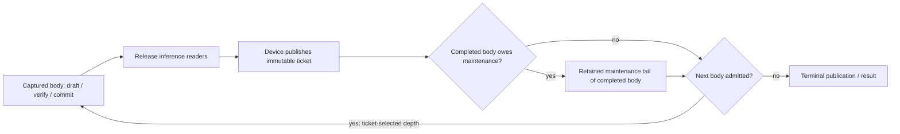

# Hosted MTP maintenance: ticket publication is an iteration boundary

2026-09-13. At the end of the focused fix, native generation acquisition had
286/335 MTP passes, 175/175 serial controls and 49 unseen MTP cells. The repaired cell has its
complete real-model proof and passes the twenty-process stability gate.

Failing cell: Qwen36MoE IQ3S, LocalTP RCCL 2xROCm ExpertOverlay,
Dynamic/Ordinal, FP32 activations, FP16 KV, fixed MTP depth 1. The unchanged
Release server fails at transaction 11 twice: aggregate acquisition and an
isolated exact-cell reproduction. Earlier Static/Ordinal depths
1/2/3/15/adaptive and all twenty Qwen122B CUDA2/ROCm4 MTP cells passed.

## Lifecycle audit

Native CUDA conditionals evaluate their tail after the body in the same
parent. The hosted ticket is sampled between those operations. Its maintenance
predicate is therefore about the completed body; admission/depth select the
next body. Reusing body-then-tail filtering across that publication boundary
delayed maintenance by one transaction. The next verifier encountered a due
or exhausted maintenance budget. Terminal tickets also incorrectly discarded
their outstanding tail because selection was gated on next-body admission.

`DeviceControlledLoopTicketSelection` now states those two scopes explicitly:
the completed tail is selected independently, then next-body fragments retain
producer order. Native parent ordering is unchanged. No extra host decision,
device readback, allocation, synchronization, graph capture or fragment is
introduced. The existing persistent worker submits the same retained graphs.

A second defect obscured diagnosis: `fail_device_generation_control` promised
first-error preservation but overwrote it. Geometry preparation could replace
the budget failure with `InvalidDepthSelector`. Terminal poisoning now retains
the original error, including malformed subsequent budget admission.

## Evidence and remaining proof

- Original evidence: `parity-results/native-journal-mtp-unseen-after-shifted-metadata-01`.
- Exact reproduction: `parity-results/native-mtp-rocm-dynamic-depth1-repro-01`.
- Device-free controller suite: 28/28, including every pair of current fatal codes.
- Captured CUDA/ROCm continuation probe: both pass, twenty resets/replays at
  depths 1/2/3/15 for active and terminal tickets. This is a model-free ordering
  proof, not a claim to test the whole MoE planner or movement implementation.
- Captured first-error cascade: fails on both old backends (2 overwritten by
  11), then passes on both rebuilt backends across twenty replays. All four
  new focused backend tests pass against the rebuilt Integration core.
- The focused probe is included in both existing DeviceGenerationController
  integration selections, already in ProductionParityPreflight.
- Both runtime builds complete. Canonical receipt
  `native-hosted-maintenance-prerequisites-03` passes 651 Units and 170
  production preflight tests in 699.684s, reused unchanged by the exact retry.
- `native-mtp-rocm-dynamic-depth1-fixed-01` passes in 68.998s: four original
  384-token HTTP streams, serial equality, prefix/capture/movement assertions
  and clean shutdown. The previous cleanup archive failure is absent on this
  successful terminal path; no separate cleanup workaround was installed.
- Fresh processes `native-mtp-rocm-dynamic-depth1-stress-02` through `-20`
  all pass. Together with the first proof this is twenty complete runs and
  eighty original 384-token HTTP responses, with all original harness checks.
  `native-journal-mtp-unseen-after-hosted-tail-01` runs only the 49 unseen
  MTP cells using the same unchanged binaries and canonical prerequisite receipt.
  All 49 pass by September 14, completing Qwen36/Ornith dual-ROCm and their
  single-ROCm matrices, plus Qwen38 dense single-ROCm. Native coverage is now
  335/335 MTP plus all 175 serial controls. The independent acquisition audit
  finds zero unseen cells and zero unresolved failures. This is individual
  native proof, not an image-bound certificate.
- Automatic orchestration work has separate isolated tests; earlier acquisition
  used unchanged binaries and cannot certify those new source changes.
