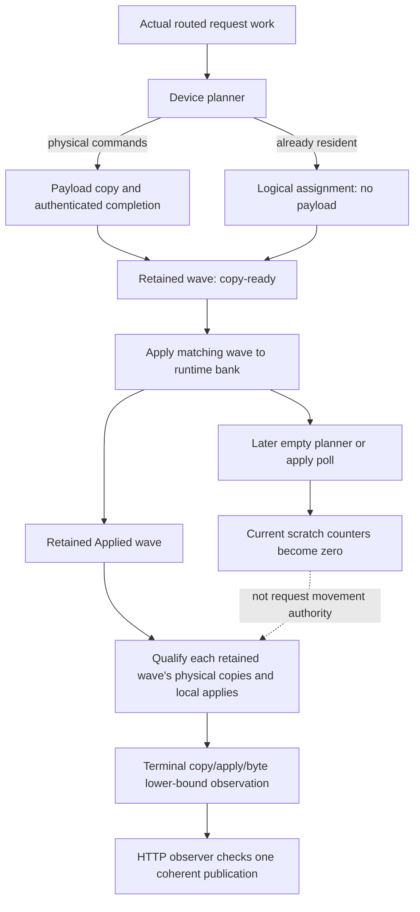

# Native GPU generation movement evidence — 2026-09-11

## Preserved failure

The previously unseen Qwen3.6-35B IQ3_S, LocalTP NCCL CUDA2,
Static/Ordinal MTP-off control passed in 46.119 seconds. The next control,
Dynamic/Ordinal, stopped the sequential acquisition group in 49.175 seconds.
All four public Release HTTP requests produced 384 tokens; prefix, graph,
memory and shutdown checks passed. The only failed obligation was completed
physical expert movement. Six selected controls remain untouched.

Evidence is preserved in the ignored local directory
`parity-results/generation-qwen36moe-unseen-gpu-overlay-01`. The failed cell key
is `a9bb3dd66e711c26e6f72ca9dd992224deb981318c221dd3be4ef25bd3fc6e9b`.
The shared 795-test prerequisite receipt was reused; tmpfs staging copied zero
bytes. These are unapproved MTP-off diagnostic controls, not numerical parity,
canonical token baselines or Docker certificates.

## Lifecycle and root cause

The old HTTP checker paired retained applied-arrival totals with **current**
planner useful bytes. The latter legitimately become zero after an empty final
wave. CUDA0 and CUDA1 each retained an Applied wave at epoch 18 with two
commands, two completed physical arrivals, one local apply and a nonzero
payload bucket. The configured whole-expert slot was 3,277,312 bytes. This is
positive movement evidence despite the final scratch status being empty.
Repeated reset snapshots must not be summed as independent new movements.

The existing request-lower-bound helper had a second latent problem: it treated
all copied/applied arrival counts as payloads. A resident-only wave marks its
commands copy-ready without transferring bytes, and local applies may mix
physical arrivals with resident-only assignments. Nonzero instance transfer
capacity does not qualify such activity as physical movement.

## Installed repair

The helper now accepts typed retained-wave snapshots instead of independently
summed counts. It requires valid epoch/ABI, copy-published lifecycle, no error,
and an actual non-overflowed payload bucket. For each qualified wave:

- `copied_arrivals` counts authenticated global physical arrivals;
- `command_count - copied_arrivals` bounds non-payload commands;
- local physical applies are conservatively bounded by
  `max(0, applied_arrivals - non_payload_commands)`.

Qualification and subtraction happen **per wave**, so a copy in one wave cannot
authenticate an apply in another. The existing sticky LLEP marker is combined
with `max`, retaining its conservative non-additive meaning. This remains a
rolling retained-state lower bound, not a complete movement event ledger.

The HTTP observer consumes the qualified copy/apply/byte trio from one exact
rank/device/phase/tag identity. It no longer accepts the old scratch-byte pair.
Static still rejects positive movement evidence. No runtime controller decision
depends on PerfStats; no new device kernel, synchronization, allocation or
host-owned inference state is introduced.

The new HTTP regression failed first on both CUDA and ROCm record shapes, then
all 123 HTTP policy unit tests passed. Added C++ regressions cover mixed logical
and physical commands, empty waves, incomplete/error states, and cross-wave
false pairing. CUDA and ROCm device lifecycle tests now assert retained evidence
after empty apply polls and reject resident-only changes; the selected apply,
transfer-copy and full-capacity stress tests are registered in production
preflight.

Both Release and Integration builds completed. The two focused registered
Unit suites passed. The new device preflight entries each passed 20 consecutive
runs: CUDA in 36.01 seconds, ROCm in 24.22 seconds. Each repetition executes
resident-only rejection, real compact payload copy/apply, and the seeded
full-capacity transfer-slot state-machine fixture. The full Unit/preflight
receipt is being refreshed once for this changed build; the exact failed HTTP
cell has not yet been rerun.

The reset audit also confirms that `resetRequestOwnedDeviceTransaction` resets
controller waves, headers, cursor and plan counts behind stable captured
addresses. The repeated terminal wave epochs must not be summed as new movement
events, but request-reset observations do not intentionally retain earlier
request wave state. No reset/graph lifecycle change was needed for this repair.

## Exact production rerun is green

The new receipt `native-movement-evidence-prerequisites-01` passes all 649 Unit
entries (73.98 s) and 148 production-preflight entries (535.13 s), 797 total.
No failures, skipped obligations or per-cell prerequisite reruns are used.

`generation-qwen36moe-native-movement-evidence-01` then passes the exact failed
CUDA2 Dynamic/Ordinal control in 49.380 seconds. All four 384-token public HTTP
requests and prefix/path/memory/shutdown checks pass with unchanged inputs.
At the first request reset, each GPU retains two global copied arrivals and
one qualified local payload apply: 3,277,312 bytes per GPU. The final current
scratch useful-byte counters are still zero, directly exercising the repaired
observer lifecycle. The same tmpfs file is reused with zero copied bytes.

## All eight homogeneous GPU controls individually green

The six paused unseen controls all pass in
`generation-qwen36moe-unseen-gpu-overlay-02` (470.583 seconds total), reusing the
same 797-test receipt and tmpfs model without any further source changes.

| Topology | Mode | Placement | Cell seconds |
|---|---|---|---:|
| CUDA2 / NCCL | Static | Ordinal | 46.119 |
| CUDA2 / NCCL | Dynamic | Ordinal | 49.380 |
| CUDA2 / NCCL | Static | Random | 50.182 |
| CUDA2 / NCCL | Dynamic | Random | 53.495 |
| ROCm2 / RCCL | Static | Ordinal | 85.996 |
| ROCm2 / RCCL | Dynamic | Ordinal | 92.079 |
| ROCm2 / RCCL | Static | Random | 90.565 |
| ROCm2 / RCCL | Dynamic | Random | 97.666 |

The first row is the preserved pre-repair green, not an unnecessary rerun;
the second is the targeted repaired cell. Every case completes four 384-token
requests, fresh/full/partial/full prefix checks, graph/memory evidence, and
clean shutdown. Static proves no movement; Dynamic proves qualified physical
copy/apply activity. ROCm's terminal scratch also becomes empty after completed
movement, so the symmetric production cells exercise the repaired observer.
These lower bounds must not be summed across repeated reset snapshots as a
movement ledger. Dynamic remains slower than Static in this short workload;
functional movement success is not an economy claim.

The authoritative manifest/history join now leaves **56 unattempted MTP-off
controls out of 175**. Next are the unseen Ornith controls, followed by the
remaining large-model topologies. Continue one at a time and stop on the first
red; reuse the receipt only while the build remains unchanged. These are still
unapproved diagnostic controls: baseline approval, MTP comparison, independent
HF proof and both ISA Docker certificates remain outstanding.
