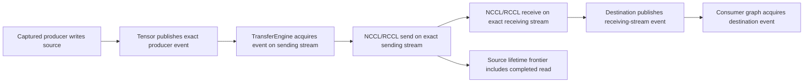
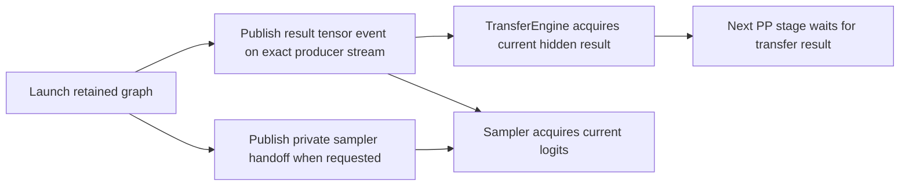

# Pipeline activation producer ordering — 2026-09-11

## Finding

After fixing CUDA BK256 context-local opt-in, the two-CUDA Qwen2 local-PP
generation control starts successfully but produces corrupted text and differs
from its full-prefix restore at completion index 2. The short, checkpoint-rich
HF cell passes. These remain distinct observations: diagnostic synchronization
can hide an asynchronous publication defect.

`TransferEngine::copyActivation` and `transferActivation` selected the correct
physical buffers but did not acquire the tensor's exact producer event before
the transfer read them. Synchronous completion of a copy does **not** establish
ordering with the unrelated stream that produced its source. The unused
collective `copyAsync` interface also accepted a stream which NCCL/RCCL ignored,
so simply switching to that method would not repair the contract.

Model-free tests hold a real GPU producer behind a mapped timeline, then copy
its activation while its write remains pending. Both CUDA and ROCm copy stale
bytes on the original implementation. Same-device copies and same-vendor peer
copies reproduce this independently; the PP ownership-handoff variant uses the
same test. Allocations, uploads and communicator warmup precede the gate, so
lazy initialization cannot accidentally synchronize away the failure.

The initial same-device-only repair made both focused tests pass but did not
fix the HTTP cell. The complete cross-device chain must be verified before
attributing the serving failure to this defect alone.

## One event DAG

Same-device copies use the same acquisition/publication contract around an
asynchronous D2D copy. Cross-vendor and CPU-visible boundaries acquire the
source event before their explicit host-observed transport. The change does
not replace NCCL/RCCL, alter arithmetic or tensor formats, or add a kernel.

The two-stream collective API replaces the unused stream-ignoring async API.
TransferEngine remains the public tensor/coherence authority; coordinators
serialize communicator submission, not device completion. The destination's
ordinary tensor event carries completion. No per-copy device-wide wait or
extra application readiness flag is introduced.

## Gate and evidence

`V2_Integration_TransferEngine_CopyActivation` is explicitly model-free, has a
120-second bound, and joins `ProductionParityPreflight`. Its fixture explicitly
retires its global collective owner before process-static registry teardown.
The focused test must pass on both backends, then pass twenty repetitions,
before a refreshed Unit/preflight receipt and the original generation retry.

Ignored evidence:

- `parity-results/activation-producer-red.log`: same-device CUDA/ROCm red.
- `parity-results/activation-producer-local-green.log`: same-device admission fix.
- `parity-results/activation-producer-peer-red.log`: peer/handoff reproduction.
- `parity-results/activation-producer-local-http-diagnostic-02/`: serving remains
  red with only the same-device fix; no prerequisite or certification claimed.
- `parity-results/activation-producer-stream-dag-build.log` and corresponding
  Release log: full event-DAG rebuild.

The strengthened tests use a retained captured producer and require copy
submission to return while that producer is still held. A bounded test-only
watchdog prevents a regression from hanging the suite; normally the caller
releases the producer immediately after submission returns. All four tests
passed **20/20 repetitions**, including both copy and handoff in each peer
test. Later four-test iterations take roughly 2.7 seconds. This is a progress
and byte-correctness proof, not an inference throughput threshold.

`activation-producer-stream-dag-http-diagnostic/` still reports token drift at
completion index 2. The serving corruption is therefore not fully explained
by the transfer defect. The serial-position input-bank wait now reports its
previously missing counter. That lets the observer reach another existing
failure: one `host_logits_access` from the final CUDA stage. Inspection finds
an unconditional `LogitsGatherer::copyFromStage` in rank-local PP terminal
prefix restore; unlike CPU TP restore, it did not honor device-owned GPU
logits. Restore now honors the existing prefill logits-ownership policy. A
device-free CPU/CUDA/ROCm regression and five related restore tests pass. The
next HTTP diagnostic passes its PerfStats ownership checks, but remains red:
fresh generation is garbled and reaches 384 tokens; the full-prefix request
diverges and stops at 151 tokens. This is not an acceptable short-EOS control.

The first refreshed Unit run passed 646/647 registrations. Its sole failure
was the synchronization sanitizer's exact budget: removing a blocking D2D
copy reduced `copyActivation` from three approved blocking operations to two.
The allowance is tightened to two (only explicit host/cross-vendor staging),
and both sanitizer tests pass. The second refresh passes all 647 Unit
registrations and all 137 integration preflight registrations in 587.020 seconds
combined. Evidence is `activation-producer-prerequisites-02/prerequisites.json`.

An additional model-free setup-materialization/PP-ingress regression joins the
already gated CUDA/ROCm prefill-cache integration binaries. It materializes
64- and 256-row graphs without launching either, then runs six live GPU ingress
copies across bucket changes and request reset. Every output element must be
exact, each shape must retain one capture and zero warmups, and replay counts
must match the submitted transactions. Both backends pass 20/20 repetitions
(`setup-pipeline-ingress-{cuda,rocm}-stress20.log`). This additive test build
postdates the full prerequisite receipt; the related four CTest families also
pass (9.74 seconds), including the complete rebuilt prefill-cache binaries.
The canonical receipt must be refreshed before another certified campaign run.

`pipeline-pp-launch-blocking-diagnostic/` is an abandoned diagnostic, not a
production failure or a correctness result: `CUDA_LAUNCH_BLOCKING=1` prevents
the paired NCCL transfer from progressing before any token is returned. The
server was stopped after collecting its stack; no production synchronization
policy changed.

`pipeline-pp-graph-timing-diagnostic/` instead enables ordinary GPU timing.
PerfStats confirms host-observed prefill graph completion, while decode event
collection remains asynchronous. The model is still corrupt: fresh returns
384 tokens and full-prefix restore returns 12. This rules out a fix consisting
only of waiting for prefill graphs; it does not prove every decode edge sound.
No diagnostic timing override remains enabled in ordinary commands.

## Deferred-forward publication: serving root cause isolated

The exact 139 HTTP prompt tokens also pass the independent CPU/FP32 HF
checkpoint probe with the complete 64..4096 serving graph family retained.
`pipeline-serving-hf-tensors-02/` reports prefill logit cosine 0.999557 and KL
0.00364746; all five decode steps pass, with cosine 0.999476..0.999814. The
separate prompt pack was generated from the same staged GGUF and authenticates
all 139 token IDs. Its first diagnostic launch rejected an undersized snapshot
BOM (139 rather than 4096 retained rows); the isolated probe then declared the
actual diagnostic capacity. No production accounting exception was introduced.

The ordinary public `prefill()` / `decodeStep()` loop, without intermediate
snapshots or host logits gathering, fails after two correct greedy tokens.
This gives a small reproduction independent of stochastic sampling. Explicit
`LLAMINAR_GPU_STAGE_TIMING=1` disables deferred completion and makes it pass;
that observation is diagnostic, not an acceptable fix.

`ForwardExecutionEngine` skipped `publishForwardResultAtBoundary()` whenever
completion was deferred to a GPU consumer. That callback already records a
nonblocking public tensor event; it no longer materializes host logits. The
old conditional therefore confused two distinct contracts: a sampler's
private stream handoff and the result tensor's public readiness frontier.
Nonterminal PP stages publish hidden state, not logits. Their next transfer
could acquire the previous result event and read the new hidden row too early.

Both cache misses and cache hits now publish the public result unconditionally
after successful execution. Unneeded deferral bookkeeping was removed. The
change is backend- and format-independent, adds no kernel or blocking wait,
and does not change NCCL/RCCL transport or graph arithmetic.

The existing first-use Unit assertions now require both public publication and
the exact private handoff. All 88 engine Unit tests pass. The new model-free
`DeferredDecodePublishesPipelineTransferResult` regression lives in both
already-gated prefill-cache integration binaries. It captures without launch,
copies six distinct real GPU result rows through TransferEngine, checks the
publication on every deferred replay, and crosses request reset without
recapture. CUDA and ROCm each pass 20/20 repetitions.

The first unchanged Release HTTP replay now passes 8/8 harness checks. All four
fresh/full/partial/full requests produce 384 tokens and their corresponding
prefix pairs match exactly, with clean graph evidence and teardown. Evidence:
`deferred-pp-publication-http-fixed-01/` through `-20/`: **20/20** full HTTP
repetitions pass, totaling 80 requests / 30,720 completion tokens. The complete
four-request token-stream set is also identical across all twenty processes,
not merely within each run's fresh/restore pair. The exact decode policy still
reports `defer_final_sync=true` and `require_full_graph` on both CUDA devices.
The shared prerequisite refresh passes **647/647 Unit** and **137/137
preflight** registrations in **588.741 seconds**, with receipt
`deferred-pp-publication-prerequisites-01/prerequisites.json`. The affected exact
canonical CUDA PP HF cell then passes in 5.403 seconds and validates all eight
required CSVs (`deferred-pp-publication-canonical-hf-01/`), reusing that receipt
without another prerequisite run. The full model matrix and Docker image
certification remain incomplete; this is one proved repair slice.

The canonical generation collector subsequently passes the repaired CUDA PP
cell (`generation-qwen2-local-pp-cuda-fixed-03/`, 27.769 seconds) and the
previously unseen two-ROCm PP cell
(`generation-qwen2-local-pp-rocm-unseen-01/`). Both reuse the same 784-test
receipt and immutable tmpfs model with zero bytes copied. These are unapproved
generation controls, not corpus approval. Continue with unseen cells rather
than repeating this proved CUDA slice; preserve the receipt until a relevant
build or test inventory changes.
