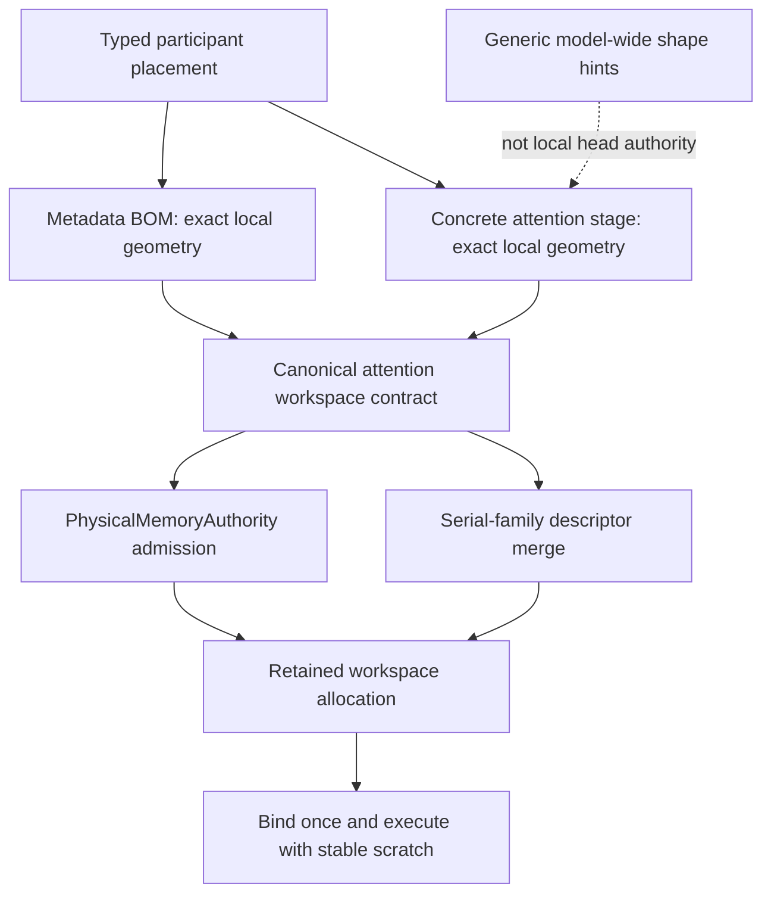

# Production parity: participant-local attention workspace

## September 9 diagnosis

The first unseen cell after the independent route-conditioned HF proof was
`Qwen2_Q4_0_NodeTP_2xMPI_CPU_ActFP32_KVFP16_MTPOff`. It stopped in 3.121s,
before prefill: runtime requested 177,408 bytes from a 147,840-byte admitted
workspace. Missing numerical CSVs were downstream effects, not the cause.

The canonical CPU attention contract was correct. With 28 workers, 64 elements
per head and 16 compact rows, the local seven-head shard needs 147,840 bytes.
The runtime stage incorrectly took `max(model hint, local heads)`: the global
14-head hint made it ask for 177,408 bytes. This was not physical memory
exhaustion, asynchronous reclamation, or a transfer lifecycle race.

## Ownership simplification

`AttentionComputeStage` now takes heads and head width only from its concrete
parameters on CPU, CUDA and ROCm. It retains the canonical compact verifier
row policy and backend prefill requirements. Serial-family merging remains
responsible for combining actual sharded and replicated graph members. No
budget expansion, additional allocation, recapture, precision change, or
inference-time work is introduced.

## Regression evidence

- The new device-free stage regression failed before the fix. It sweeps TP
  degrees 1–8, workers 1/3/7/28/56, graph-row hints 1/9/16/512, and smaller,
  absent, or global head hints. It also rejects tensor width as head width by
  proving that the generic hint cannot alter the exact local byte requirement.
- Existing CUDA and ROCm attention-workspace preflight tests now require an
  oversized global head/width hint to leave every buffer size unchanged.
- Full Unit/preflight/matrix target rebuild passes. The focused CPU stage,
  memory-planner, CUDA workspace and ROCm workspace registrations pass 4/4
  in 1.59s. Fresh Unit passes 645/645 in 80.33s and preflight passes 122/122
  in 455.69s.
- The repaired Qwen2 CPU NodeTP cell passes in 2.325s with all eight required
  CSVs. Two subsequent unseen single-CPU cells pass: KV FP16 in 2.949s and
  KV Q8_1 in 2.900s. The ledger advances to 101/510.
- The queue stops at the next unseen KV Q16_1 cell in 4.851s, with all eight
  CSVs present. Its sole assertion is prefill Top-5 overlap 80% versus 95%,
  while prefill KL is 0.0019 versus a 0.006 limit. This is a separate numerical
  investigation; no further workspace failure occurred.

Evidence is retained under `parity-results/ci-attention-local-geometry-*` and
the original red under `parity-results/ci-local-unseen-pass-01/`. These are local
diagnostic results, not certification artifacts or source-controlled payloads.
