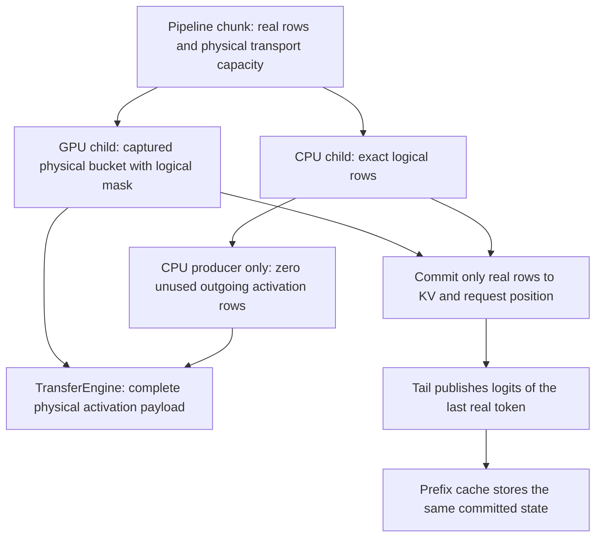

# CPU pipeline logical rows — 2026-09-11

## Failing cell and reduction

The previously unrun Qwen2 Q4_0 / CUDA→CPU LocalPP / FP32 activation /
FP16 KV / MTP-off generation cell fails full-prefix repeatability at token 3.
The fresh answer degenerates into repeated punctuation. Both requests reach
384 tokens and shutdown is clean. This is not early EOS or quantization noise.

`generation-qwen2-local-pp-heterogeneous-unseen-01/` preserves the failure.
The canonical runner selected CPU first and stopped before CUDA→ROCm. It reused
the 647-Unit/137-preflight receipt and the sealed tmpfs model with no copying.
An explicit GPU timing diagnostic reproduces the same mismatch; disabling
deferred completion does not fix it.

The short canonical HF cell passes in 5.403 seconds with all eight CSVs. An
independent exact-serving-prompt probe (`cuda-cpu-pp-serving-hf-01/`) instead
fails prefill: CUDA layers 0–11 match, CPU snapshots contain 256 physical rows
rather than the 139 real prompt rows, and terminal logit cosine is 0.497452
with KL 12.4571. Five subsequent forced decode checkpoints match the independent
CPU/FP32 HF reference. That localizes the defect to the padded CPU prefill
transaction rather than ordinary decode kernels.

## Ownership audit and intended simplification

The pipeline root owns a chunk's `real_count` and `bucket_seq_len`. GPU children
execute the physical bucket with device-owned masking. CPU children have no
capture geometry requirement, but their scheduler currently constructs padded
tokens anyway. The ordinary single-request CPU `forwardImpl` does not propagate
those separate logical lengths to its graph: padding becomes inference input,
including terminal-row selection and KV writes.

Keep CPU execution exact-shape, as in ordinary CPU inference. Only a CPU
producer's outgoing transport slack needs initialization for a downstream
captured GPU; that is not model computation or a fake token sequence. Preserve
the root's physical transfer geometry and existing GPU capture, with no new
GPU allocation, synchronization, or precision change. A model-free production
scheduler regression must cover CPU producer and consumer roles, several
inexact bucket sizes, reuse and request reset before the real cell is retried.

The same failing run also exposes a separate evidence-validator gap. The
pipeline coordinator proves an explicit heterogeneous boundary with its frozen
plan, physical materialization and completed segment counts. The validator
currently recognizes only in-graph collective-node evidence, rejecting an
otherwise legitimate CPU/GPU pipeline whose GPU child is fully captured.
Any admission change must authenticate the complete coordinator lifecycle and
continue requiring the individual GPU executable/capture/replay proof.

No fixed cell or image certificate is claimed yet. Changing the integration
source inventory invalidates the old prerequisite receipt; refresh the full
shared gate once the repair and regressions pass, not once per model cell.

## Repair and focused evidence

`CPUPipelinePrefillGeometry.ExecutesOnlyRealRowsAcrossReuseAndReset` reproduces
the admission error in 3.91 seconds through the actual CPU scheduler and forward
cache. Its tiny row probe sees 64 instead of 17 rows, and the tail selects a
zero padding row. It covers producer/consumer roles and 17/33/139 logical rows
in 64/256-row physical buckets. This test joins the already-gated model-free
`V2_Integration_OrchestrationRunner` binary.

The installed repair removes padded CPU token construction and its duplicate
request-length bookkeeping. CPU executes the normal exact-row graph, then a
nonterminal producer initializes only its outgoing FP32 activation slack.
All weight formats retain their existing kernels; GPU graphs, precision and
memory capacity are unchanged. No blocking GPU operation is introduced.

The exact 139-token HF probe now passes every prefill checkpoint and all five
decode steps: prefill logit cosine **0.999627**, KL approximately **0.0015**,
Top-1 **100%**. All CPU snapshot shapes are logical again. Evidence:
`cpu-pp-logical-rows-hf-fixed-01/` (7.538 seconds).

The first repaired HTTP replay passes all four 384-token requests and exact
prefix pairs. Its remaining evidence rejection is separately attributable to
`host_logits_access` on **device=CPU**, not a GPU download. The observer now
distinguishes this canonical CPU sampling owner while rejecting GPU, missing,
malformed or topology-inconsistent ownership. The graph observer independently
authenticates PP plan/materialization/transaction geometry by rank, preserving
the native child executable proof. These policy changes pass 115 focused
script tests; the pipeline script's 79 tests also pass.

The original failed reports remain immutable. The shared-gate refresh and
canonical follow-up below authenticate the changed source.

The focused scheduler regression passes **20/20** repetitions, and its complete
existing orchestration integration registration passes as well. A fresh Release
HTTP run (`cpu-pp-logical-rows-http-fixed-02/`) now passes **8/8** harness checks,
including all four 384-token generations, exact restored-prefix pairs, native
graph evidence, clean shutdown and released VRAM. Both runtime builds and all
605 shared-gate build actions completed before the new prerequisite run began.

The refreshed shared gate now passes **647/647 Unit** (73.72 seconds) and
**137/137 ProductionParityPreflight** (513.85 seconds), **588.245 seconds**
combined. Receipt: `cpu-pp-logical-rows-prerequisites-01/prerequisites.json`.
The canonical two-cell CUDA→CPU/CUDA→ROCm admission reuses this receipt and the
fresh 510-cell typed inventory; no further prerequisite run is charged per cell.

The new canonical CUDA→CPU generation control passes all eight checks in
**36.821 seconds**, and its canonical HF cell passes in **5.286 seconds** with
all eight CSVs. Evidence: `generation-qwen2-local-pp-heterogeneous-fixed-02/`
and `cpu-pp-logical-rows-canonical-hf-fixed-02/`. Both reuse the new receipt;
the model cache reports zero bytes copied.

The second, previously unseen CUDA→ROCm cell stops its first fresh response
with EOS after **319 tokens**, below the unchanged 384-token requirement.
Its response is a coherent ten-entry field guide and shutdown releases VRAM,
but those observations alone do not establish why it ended early. Acquisition
stops before any repeated-prefix request, so the accompanying missing-restore
observer error is consequential, not an independently reproduced cache defect.
It remains red in the immutable report (23.893 seconds); no prompt, seed,
budget or evidence threshold is changed. Continue the remaining unseen controls
before returning to short-horizon investigation.

## Remaining unseen Qwen2 controls

All six Qwen2 generation identities that were still unseen at the start of
this follow-up now have an attempt. Together with the repaired CUDA→CPU cell:

| Configuration | Result | Whole-cell seconds |
|---|---|---:|
| Q4_0, CUDA→CPU PP, FP16 KV | Pass, eight checks | 36.821 |
| Q4_0, CUDA→ROCm PP, FP16 KV | Fresh EOS at 319 tokens | 23.893 |
| Q4_0, 2×ROCm TP→CPU PP, FP16 KV | Fresh/full exact at 384; partial EOS at 271 | 40.387 |
| Q4_0, 2×CUDA TP→ROCm PP, FP16 KV | Pass, eight checks | 44.111 |
| Q4_0, 2×ROCm TP→CUDA PP, FP16 KV | Pass, eight checks | 37.039 |
| Q4_0, CPU, Q16_1 KV | Fresh EOS at 76 tokens | 6.838 |
| Q8_0, CPU, FP16 KV | Pass, eight checks | 49.777 |

Every cell uses FP32 activations and MTP off, selected from the current typed
inventory. Passing generation controls include four continuous 384-token
requests, exact fresh/full and partial/full pairs, graph/CPU execution,
prefix-state, memory and clean-shutdown checks. The short-output cells remain
failed; clean teardown and readable text do not prove their numerical cause.
There were no new crashes, device exceptions or timeouts in these seven runs.
All reused the 784-test receipt and sealed tmpfs entries with zero copy bytes.
This proves bounded per-control cost, not that long generation is universally
cheaper than a short cached-HF cell or that the full matrix is certified.

Additional immutable artifact roots under `parity-results/`:

- `generation-qwen2-hybrid-rocm-cpu-unseen-01/`.
- `generation-qwen2-hybrid-cuda-rocm-unseen-01/`.
- `generation-qwen2-hybrid-rocm-cuda-unseen-01/`.
- `generation-qwen2-q4-cpu-q16kv-unseen-01/`.
- `generation-qwen2-q8-cpu-fp16-unseen-01/`.

## Unseen hybrid-model pipeline follow-up

The same unchanged runtime and prerequisite receipt also pass every declared
Qwen3.5-0.8B Q4_0 / FP32 activation / FP16 KV / MTP-off local-pipeline control:

| Pipeline | Result | Whole-cell seconds |
|---|---|---:|
| CPU0→CPU1 | Eight checks pass | 48.685 |
| CUDA0→CUDA1 | Eight checks pass | 29.515 |
| CUDA0→ROCm0 | Eight checks pass | 46.320 |
| ROCm0→ROCm1 | Eight checks pass | 51.234 |

Every cell completes four continuous 384-token requests with exact restored
pairs and declared hybrid recurrent-state restoration. The GPU cells prove the
native child graph family and the permitted heterogeneous boundary separately.
All shut down cleanly and release their device memory. No further source,
prompt, policy or precision change was needed. Evidence:
`generation-qwen35-08b-localpp-cpu-unseen-01/` and
`generation-qwen35-08b-localpp-gpu-unseen-01/`.

This follow-up totals **11 exact generation attempts: eight passes and three
insufficient-horizon failures**. Ten were previously unseen; the remaining
one re-admitted the repaired CUDA→CPU cell. The only shared prerequisite refresh
is the 588.245-second receipt above; subsequent model cells and the narrow HF
recheck report zero repeated prerequisite time. None of these controls is an
approved corpus, and full matrix / AVX512+AVX2 image certification remains open.
