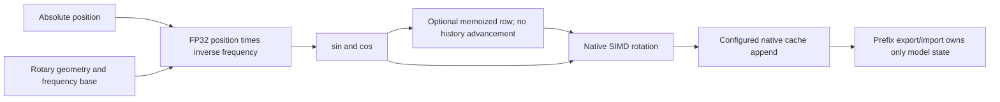
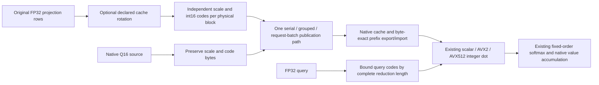
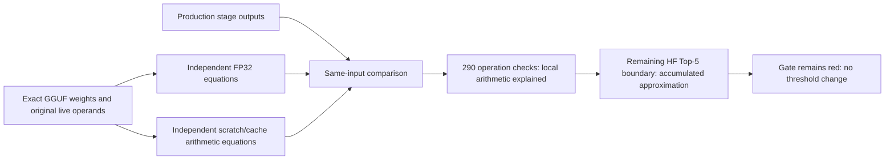

# CPU RoPE absolute-position identity — 2026-09-10

## First failing boundary

After native AQ8 installation, the registered Qwen2 Q4_0/CPU/Q8-KV generation
cell passes its four 384-token requests in 36.737 seconds, with zero repeated
prerequisite cost and zero model-copy bytes. This proves repeated cold/full
and partial/full behavior, but not cold-versus-partial equivalence: the two
distinct request bodies are compared only to their own repeats.

A stronger exact-body diagnostic starts a clean server for the extended
158-token request, then compares a second server which first executes its
139-token prefix. Both extended requests return 384 tokens, but their fourth
token differs: cold 33601, restored 14625. Prefix telemetry authenticates the
139-token restore. This is not early EOS or missing restore evidence.

One-token Integration stage dumps localize the first arithmetic difference:

| Layer-0 suffix checkpoint | Cold versus restored |
|---|---|
| QKV input and all three projections | Byte-identical |
| RoPE Q output | 15,900 changed values; maximum difference 0.000152588 |
| RoPE K output | 2,264 changed values; maximum difference 0.000305176 |
| Attention output | 16,069 changed values; maximum difference 0.000001684 |

The old CPU angle recurrence starts at the current chunk's first position.
Cold prefill advances from zero; restored prefill restarts at 139. Thus cached
execution history changes the approximation to the same mathematical angle.
The same issue exists in full/partial FP32 and native BF16/FP16/Q8 paths.
One-token cache advancement also depends on its previous position. Q16 already
uses absolute-position angles, but remains in the regression inventory.

## Simplified contract

Every position has one angle value regardless of chunk width, prior calls,
backwards restore, or MTP rollback. The patch removes recurrence deltas and
step loops, retains bounded current-row memoization for decode, and distributes
independent prefill angle rows across workers. Existing native SIMD rotations,
model weights, FP32 activations and cache precision selections are unchanged.
There is no new prefix field, shadow cache or request-reset transition.

`CPURoPEKernelTTest.PrefillPartitionsAllNativeFormatsAreByteExact` reproduces
the pre-fix failure in 15 ms and joins the existing RoPE production-preflight
entry. It compares whole prefill against single rows, seven-row chunks and the
139/19 split, at positions zero and 4096; it covers FP32 full/partial, BF16,
FP16, Q8 and all supported Q16 blocks. Existing grouped-verifier proofs remain.
The first absolute-position slice passed 647 Unit and 133 preflight tests.
The subsequent implicit-position fix below has its own refreshed gate; neither
result is a corpus or image certificate.

## Focused fix proof

The absolute-position implementation makes the exact Release cold/restored
extended requests equal for all **384 committed tokens**. Both report the
same prompt and sampler identity, and only the restored witness reports the
139-token partial cache hit. Evidence: `cpu-rope-absolute-cold-restore-01`.

An initial direct-angle implementation passed three focused tests, then 20
repetitions. Its separate Q/K table preparation was too expensive. The final
implementation shares one angle pair and one head workshare across Q and K.
An additional existing-team regression covers caller-private angle tables:
an OpenMP position partition must not leave each worker's private table only
partially initialized before a different head partition reads it. The four
focused tests now pass **20/20 complete repetitions**, approximately 57 ms
per repetition. This explicitly includes the 139/19 split, ordinary serial
rows, grouped verifier rows, and 1/3/7-worker outer teams. The RoPE CTest entry
now explicitly declares `NO_MODELS` and joins `ProductionParityPreflight`.
The registration guard caught the initially inherited model fixture before
running tests. The corrected first gate passed all 780 tests in 662.180 s
including its build. Its evidence predates the implicit-position change below.

The existing Release microbenchmark (eight workers, Qwen2 head geometry)
measures FP32 prefill at **50.97 us for 512 rows** and **191.42 us for 2048**,
versus initial recurrence samples of 68.04 and 241.14 us. The final figures
are medians of five runs, while the initial baseline is one run: this is
operation-level evidence, not a statistical whole-model speedup claim. BF16
and FP16 also improve on those baseline samples; Q8 remains approximately
level at 512 rows (95.06 versus 93.13 us), and faster at 2048 (308.96 versus
348.15 us). Fixed-position single-token timings do **not** measure the cost
of advancing positions and must not be used as an ordinary decode benchmark.

The same functional test source is linked into the perf-only Release target
so the actual AVX2/AVX512 cores can be checked before timing without maintaining
a second oracle. Performance code does not enter Unit or preflight. Actual
AVX2 compilation and all 27 then-current functional tests passed 20 repetitions.
Local CPU-only AVX2 evidence is not a full-fat image certificate.

The latest HF recheck remains red: Q4_0/CPU/Q8-KV has prefill Top-5 overlap
4/5; Q4_0/CPU/Q16-KV now has Top-5 5/5 but KL **0.0107084** versus **0.006**.
Both retain all eight CSVs. The old Q16 result predates the cache-source/native
reader work, so its changed score must not be attributed solely to RoPE without
further isolation. No threshold has been changed. Evidence:
`cpu-rope-absolute-hf-01.log` and its per-cell artifact directory.

Evidence: `parity-results/cpu-aq8-generation-focused-01`,
`cpu-aq8-cold-restore-focused-01`, `cpu-aq8-cold-restore-stages-01`,
`cpu-rope-absolute-red.log` and `cpu-rope-absolute-perf-before.log`.

## Other exact cells checked before this edit

HF Q4_0/CPU/TQ passes in 3.077 seconds, and Q8_0/CPU/Q8-KV passes in 2.606
seconds, each with eight validated CSVs. Q4_0/CPU/TQ also passes the four-request
generation harness. Q8_0/CPU/Q8-KV ends its first request naturally at 255
tokens; the unchanged 384-token horizon rejects it. Its later prefix requests
were not run, so the absent-restore summary is consequential, not another
observed lifecycle defect. Workload acquisition is deferred until RoPE is
fixed. No approved token corpus exists and no thresholds were relaxed.

## Implicit-position contract — 2026-09-11

The position audit found two additional violations of `ITensorRoPE`:

- Every native CPU ordinary tensor wrapper discarded `pos_offset` when the
  position array was null.
- Grouped Q16 synthesized implicit positions into a four-element stack array,
  despite accepting runtime verifier widths beyond four. Existing grouped
  tests always supplied explicit IDs and therefore never entered that branch.

`ImplicitPositionsAllNativeFormatsAreByteExact` reproduced the first violation
in 2 ms. Ordinary implicit positions are checked against explicit one-row
production witnesses before grouped implicit positions are checked. Coverage
includes FP32 full/partial, BF16, FP16, Q8, Q16 blocks 32/64/128, and runtime
widths through 31. Expected values never come from another implicit caller.

The fix forwards the existing scalar offset to native primitives. Q16 no
longer builds any position array: each row obtains `offset + row` directly.
Explicit IDs retain precedence. Two unreferenced factory RoPE adapters were
removed; registrations already return the native interface implementations.
No extra allocation, row replay, or numerical reduction was introduced.

All **28 functional RoPE tests passed 20 complete repetitions on both actual
AVX2 and AVX512 builds**. The new test joins the existing RoPE preflight entry.
Evidence: `cpu-rope-offset-avx2-repeat-20.log` and
`cpu-rope-offset-avx512-repeat-20.log`; the actual AVX512 Release binary also
passes all 28 tests for 20 repetitions in
`cpu-rope-offset-release-avx512-repeat-20.log`. The refreshed complete gate is
**647/647 Unit + 133/133 production preflight**, 597.324 s including build.
Its reusable receipt is
`parity-results/cpu-rope-offset-prerequisites-01/prerequisites.json`.
The rebuilt Release binary also repeats the independent cold/partial request
proof: **384/384 identical tokens**, with the 139-token RAM restore observed
only in the restored witness (`cpu-rope-offset-cold-restore-01`).

## Q16 HF error localization — 2026-09-11

The separate Q4_0/CPU/Q16-KV HF cell still fails KL 0.0107084 versus 0.006,
with all eight CSVs and Top-5 5/5. A fresh diagnostic authenticates layer-0
cache encoding against independent FP64 attention, a standard-library-generated
seed-42 sign diagonal, and a separately constructed Hadamard matrix.

The native computation agrees with the independently reproduced fixed-scale
equation to **4.2492e-6 relative L2 / 9.1196e-7 maximum absolute error**.
Against unquantized original operands the attention error is **0.0925573
relative L2**. Isolating value quantization contributes 0.0848490; isolating
key quantization contributes 0.0372828. These terms are not additive.

The configured Qwen-wide scales encode K in steps of 0.03125095 and V in
steps of 0.00781274. Layer-0 V codes span only -11 through 11. This is coarse
fixed-range quantization, not an established dot-product or cache-reader bug.
No threshold was relaxed and no alternate precision was selected.

Next implementation should make native Q16 range handling economical and
data-dependent without changing its storage format. The query integer bound
and supported key block range must be proved together: an unchecked switch to
full-range int16 keys could overflow the current int32 dot reduction. Add
full-range/block-size regressions before installing that change; avoid another
model-specific scale constant. Then rerun the exact HF cell before renewing
broader campaign evidence.
An independent counterfactual using per-head native Q16 scales and an int32-
safe query bound of 1024 for 64-element full-range key blocks reduces layer-0
relative L2 to 0.0145387. This is design evidence only, not installed code or
a passing model cell. Preserve block-scale granularity for multi-block heads
and prove the bound separately for every supported block size.

Diagnostic limitation also found: effective-K/V stage dumping currently treats
CPU head-major backing capacity as a contiguous logical position-major span.
The resulting short dump includes head-0 padding instead of all head-1 rows.
The independent equation therefore constructs both heads from original input
projections and authenticates only the correctly exported first head's native
encoding. Do not interpret the padded dump as a corrupt inference cache; its
snapshot layout needs a focused regression and correction of its own.

Evidence: `cpu-q16-native-cache-equation-02{.log,-equations.log,/}`. Attempt 01
was accidentally launched during core-library relinking and failed to load the
DSO before inference; it is not a numerical result or a new device defect.

## Native Q16 range correction — 2026-09-11

Two independent model-free regressions reproduce the prior defects: small
values round to zero under the model-wide range, and full-range native keys
overflow a 64-element int32 score reduction. The latter is a latent native-input
bug, not the explanation of the old fixed-range model error.

`CPUQ16AttentionMath` bounds the **complete** int32 reduction, including
horizontal SIMD sums, against imported key magnitude 32768. Physical blocks
32/64/128 admit query magnitudes 2047/1023/511. Unit tests prove safety and
maximality for every positive admissible reduction size and reject invalid
sizes. Native cache format, per-block byte count and GPU memory footprint do
not change. No model threshold or activation precision changed.

The append stage removes five duplicated fixed-range conversions and shares
one encoder across K/V and request grouping. Already-native V is no longer
dequantized, rotated again and requantized. Batched publication now receives
the same rotation as separate requests. The optional declared FP32 value
output uses the actual encoded values rather than a block-32-only raw copy.
Three functional regressions cover scale range, 32/64/128 physical blocks,
head dimensions through 256, grouped widths through 31, two heads/two requests,
native passthrough, prefix bytes and the independent FP64 softmax equation.
All three pass **20 complete repetitions on actual Release AVX2 and AVX512**.
They are part of the existing CPU cache-source production-preflight entry;
the Release performance harness links the same test source for ISA verification.

The exact Qwen2 Q4_0/CPU/Q16-KV model recheck improves prefill KL from
**0.0107084 to 0.00246115** (unchanged limit 0.006); cosine is **0.999143**.
All five decode tokens match HF and prefix checks pass. The cell remains
**red on prefill Top-5, 4/5**, with all eight CSVs retained.

Independent native-block attention reproduces the new output to **5.4392e-6
relative L2 / 1.0836e-6 max absolute error**. Against original unquantized
operands, layer-0 attention error falls from 0.0925573 to **0.0114066 relative
L2**. The previously documented head-major diagnostic envelope limitation
remains; only the correctly dumped first head is used to authenticate native
cache encoding, while both heads are independently reconstructed from original
projections for the attention equation.

The remaining Top-5 boundary is token 323 versus 345. Native logits are
15.836867/15.769242; HF logits are 15.703446/15.899855. Recomputing the terminal
projection from exact GGUF weights and the independently encoded Q8 scratch
matches native logits to **2.2525e-7 relative L2**. Removing only that terminal
scratch approximation still ranks 323 above 345 (15.812580/15.791435), so the
new mismatch cannot be attributed solely to the terminal GEMM. Upstream
approximation remains to be localized; no ranking gate was relaxed.

Fresh complete renewal passes **647/647 Unit + 133/133 production preflight**
in **766.453 s including build**, with the receipt in
`cpu-q16-native-prerequisites-01/prerequisites.json`. Its unchanged-build reuse
was explicitly validated: all 780 registrations, zero repeated prerequisite
seconds. The older RoPE receipt is not used to certify this change.
Performance timing is still preliminary: the old
standalone harness lacked explicit CPU backend admission, so it supplied no
valid before sample. Its setup now declares the pinned NUMA node before
workspace allocation and encodes native Q16 blocks, outside timing. No
before/after economy claim or new aggregate/corpus/image certificate is made.

Isolated post-fix Release samples at head dimension 64, seven query heads,
one KV head, approximately 8192 cached rows and 28 physical workers give these
medians (84 samples, explicit tile 256; microseconds, not model throughput):

| Code generation/runtime ISA | Decode M=1 | Grouped M=15 | Prefill M=128 |
|---|---:|---:|---:|
| AVX512 | 475.325 | 936.547 | 7323.912 |
| AVX2 | 336.045 | 1085.218 | 8036.509 |

These authenticate executable native/grouped paths but are not a before/after
regression proof. In particular, no speedup is claimed from the cache correction.
Separate process-scoped `perf stat` captures isolate the Q16/M=1/head-64/tile-256
worker on each ISA (`cpu-q16-perfstat-{avx2,avx512}.log`), without changing host
perf policy. These counter sets were multiplexed (approximately 66–83% active)
and are rejected as comparative profiling evidence. They also include harness/
OpenMP work, not just kernel instructions. Collect smaller non-multiplexed
counter sets before making IPC or cache-efficiency claims; no spill or kernel-
only attribution certificate exists here. Do not mix their timing with the
unprofiled samples above.

The additional AVX512 Release byte-totality run passes **2448 geometry/format/
runtime-row domains across all seven compiled K/V tiles**, 17,136 candidate
checks in 285.658 s (`cpu-q16-all-tp-byte-totality.log`). This is the existing
nine-format tournament inventory, including full-range Q16 and TP-induced
participant geometries through degree eight; it is not a claim that this
legacy inventory includes the newer AQ8 pairings. Those remain covered by the
separate cache-source/key-storage preflight regressions. The totality worker
does not apply the timing worker's format filter, so this evidence covers its
complete existing inventory rather than only Q16. No extra full prerequisite
run was charged for this unchanged-build check.

Evidence: `cpu-q16-range-red.log`, `cpu-q16-focused-01.log`,
`cpu-q16-release-{avx2,avx512}-repeat-20.log`,
`cpu-q16-native-cache-equation-03{.log,-equations.log,/}`, and
`cpu-q16-ranking-04{.log,-equations.log,/}` under ignored `parity-results/`.

## All-layer arithmetic closure (2026-09-11)

The remaining Qwen2 Q4_0 / CPU / FP32-activation / Q16-KV prefill red was
localized using immutable first-prefill operands and exact GGUF weights. Three
local diagnostic programs evaluate the operations independently; they do not
replace HF reference generation or change acceptance thresholds.

| Operation family | Checked operations | Worst relative L2 against the installed equation |
|---|---:|---:|
| Q/K/V, attention output, gate/up/down, terminal linear | 169 | 5.010e-7 |
| Native-block Q16 attention | 24 | 5.440e-6 |
| Residual-linked RMSNorm and absolute-position RoPE | 97 | 7.966e-8 |

The local linear audit first evaluates plain FP32 operands, then independently
encodes the transient Q8 operand used by NativeVNNI. This is internal GEMM
scratch, **not a different configured model activation precision**. The exact
GGUF has Q4_0 transformer matrices and a Q8_0 terminal matrix. Five fused down
projections initially differed by up to 1.051e-4 when the diagnostic used
PyTorch SiLU. Evaluating the installed exponential polynomial removes four;
exposing only the processor's RCP14 instruction through a standalone diagnostic
bridge, then independently evaluating the Newton step, removes the last.
No Llaminar kernel or library is linked into that bridge. All 169 projections
then satisfy the bound above. This separates approximation/rounding boundaries
from incorrect matrix multiplication; it does not declare those approximations
identical to the FP32 HF oracle.

Attention uses FP64 independent causal-softmax/GQA equations. Its query encoder
rounds nearest-even; cache encoding rounds away from zero. Both multiply by a
rounded reciprocal scale. Respecting these different arithmetic contracts
resolves the larger preliminary diagnostic discrepancies. The independently
encoded first head matches all 24 live cache dumps exactly. Because the existing
effective-cache descriptor truncates head-major storage as if it were packed
token-major storage, both heads are reconstructed from their original append
operands for the attention equation; that descriptor limitation is still open.

The residual audit starts with the captured embedding and adds the actual
projection outputs in FP32. It checks each next RMSNorm against an independent
FP64 equation and exact norm weights. Q/K producer values are authenticated
across the two capture runs before comparing absolute-position RoPE. This
checks the links between the projections, not just disconnected operators.

The evidence supports accumulated documented approximation as the remaining
ranking cause, not an unexplained residual, RoPE, attention or linear-kernel
failure. It is scoped to this exact CPU prefill, not a new all-format/backend
certificate. Prefill remains cosine 0.999143, KL 0.00246115 and Top-5 4/5;
all five greedy decode tokens match HF. Even an FP32 terminal projection on
the native hidden input still orders tokens 323/345 incorrectly, so changing
only the terminal scratch representation cannot close this boundary.

The audit also reproduced and fixed a genuine evidence defect in
`GEMMStage::buildDumpInfoImpl`: fused SwiGLU's gate is `[M,K]`, not `[M,N]`.
The old descriptor truncated K>N down projections and advertised reads beyond
the input when N>K. A device-free regression exercises both cases, fails before
the correction, and passes afterward with all 23 StageDumpInfo tests. This
metadata-only correction changes no inference kernels, weights, precision or
arena size. It joins the existing full Unit gate automatically.

Evidence under ignored `parity-results/`: `cpu-q16-linear-audit-06/`,
`cpu-q16-linear-audit-09-equations.{csv,log}`,
`cpu-q16-attention-audit-07/`,
`cpu-q16-attention-audit-07-equations.{csv,log}`,
`cpu-q16-norm-rope-audit-07-equations.{csv,log}`, and
`cpu-q16-dump-regression-{red-01,green-02}.log`.
The refreshed shared gate passes **647 Unit + 133 Integration preflight**
tests in **584.402 s including build**, with its canonical receipt in
`cpu-q16-diagnostic-prerequisites-02/prerequisites.json`. The focused dump
regression also passes 20 repetitions.

The post-fix exact-cell run reuses that receipt and completes in **5.039 s**.
All **24 gate operands are complete** and match their full upstream producer;
all **48 attention-output/down projection outputs remain byte-identical** to
the pre-fix captures. The existing eight CSV artifacts validate. HF Top-5 is
still red, intentionally; correcting evidence is not changing inference.
See `cpu-q16-corrected-dump-10{.log,-verification.log,/}`. A narrowly scoped
Top-5 policy change was requested from the user; none has been applied.

### Dump-limit admission follow-up

The final 48-stage bounded capture exposed a second evidence defect after its
admitted first prefill: `StageDumper::beginDump` returns a negative dump ID when
the per-type limit is exhausted. Synchronous input/output dumping already
honored that result, but async dumping did not. It formed `/inputs/...` and
`/outputs/...` from the declined context's empty directory and attempted host
publication and writes for excluded stages. Thus the valid first 48 outputs
above remain useful, but that run also contains diagnostic write errors; it is
not an error-free dump-lifecycle proof.

Async input/output entry points now share one admission check before metadata,
coherence, copies or queueing. Negative IDs perform no snapshot work; admitted
IDs without a directory throw precisely. No new state flag or inference path
was introduced. A device-free regression reproduces the old unwanted GPU
publication using a mock backend, and now proves zero transfer/synchronization
changes for declined input/output descriptors. Another rejects malformed
admission. All 25 StageDumpInfo tests pass 20 complete repetitions in
`cpu-dump-admission-green-repeat-20.log`; the old failure is in
`cpu-dump-admission-red-01.log`.

The final post-admission-correction gate passes **647 Unit + 133 Integration
preflight registered tests** in **589.649 s including build**, with the receipt
under `cpu-q16-diagnostic-prerequisites-03/`. These are CTest inventory counts,
not a claim that every inherited GoogleTest subcase is enabled.

The bounded exact-cell replay reuses that receipt and finishes in **5.201 s**.
Its 24 gate operands are complete, all 48 checked projection outputs are byte-
identical, all eight CSV artifacts validate, and no async write/admission errors
remain. There is exactly one GoogleTest assertion failure: the unchanged HF
Top-5 threshold. Evidence is in `cpu-q16-corrected-dump-11{.log,-verification.log,/}`.
No thresholds were relaxed and no image/corpus certificate was issued.

### Approved scoped Top-5 contract — 2026-09-12

The user approved the proposed **95% to 80% Top-5** change for exactly
`Qwen2_Q4_0_CPU0_ActFP32_KVQ16_1_MTPOff`. The existing typed Q16_1 override in
`Test__Qwen2_SingleDevice_Parity.cpp` now accepts four of five HF leaders.
Cosine, KL (0.006), Top-1, early-layer, decode, prefix and production-path
contracts are unchanged. Other Qwen2 CPU, CUDA and ROCm precision cells do not
inherit this allowance. The independent 290-operation audit above supplies the
numerical rationale; it does not authorize changes to any other red cell.

After all 175 HTTP controls completed green, the exact Qwen2 single-device
matrix was rebuilt. The one refreshed prerequisite receipt in
`qwen2-q16-approved-prerequisites-01/` passes **650/650 Unit and 157/157
Integration preflight**, with 677.042s total elapsed including the incremental
build. Unit takes 74.26s and preflight 602.04s. No prerequisite was charged per
HTTP control.

The fresh exact-cell run in `qwen2-q16-approved-proof-01/` **passes in 3.133s**
with all eight CSV artifacts validated. Prefill cosine is 0.999143, KL is
0.00246115, Top-1 is exact and Top-5 is 4/5. All 25 layer rollups pass, all five
decode tokens match HF, and fresh/full/partial prefix checks pass. No diagnostic
operand dumps or numerical implementation changes were needed for this replay.
Historical red reports remain unchanged; this fresh result alone establishes
the approved contract. CPU Q8-KV, CUDA Q8-KV and ROCm TQ numerical results remain
separate and were not waived by this allowance.
