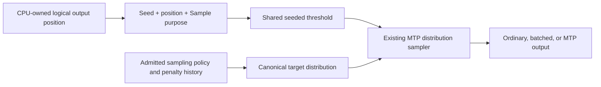
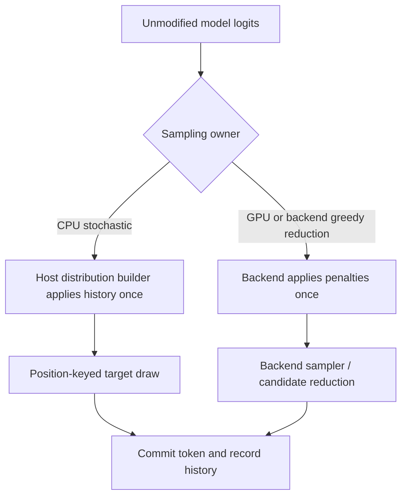

# CPU serial/MTP seeded sampling identity — 2026-09-10

## First live failure

After the CPU startup-affinity fix, Qwen3.6 MoE IQ3_S CPU Off passes four
384-token requests, but depth 1 diverges on the first request at completion
index 2: Off emits token 1467, MTP emits 974. Prompt tokens and requested policy
are identical. MTP attempts 237 drafts and accepts 146; there is no startup,
device error, or failed teardown. The later missing-prefix-evidence message is
secondary: fail-fast comparison stops before sending the restore requests.

Evidence remains under `parity-results/generation-regression-qwen36-cpu-depths-01/`.
The other four CPU MTP cells were not launched after this first red.

## Root cause, not a quantization waiver

CPU MTP already derives the seeded target draw from `(seed, logical position,
Sample purpose)`, like the GPU serial/MTP policy. Ordinary CPU decode instead
called `Sampler::sample`, advancing `mt19937` by call count. The initial CPU
request-batch sampling path had the same mismatch. Both may sample the intended
distribution, but they do not satisfy seeded serial/MTP token identity.

The model-free production-runner regression holds logits identical and uses a
broad ten-token distribution instead of an almost-one-hot argmax. It reproduces
**18 wrong draws**: twelve scalar and six ragged request-batch samples. All
corresponding MTP first samples already match the position-keyed oracle. This
separates draw identity from grouped tensor arithmetic or quantization error.
Existing numerical tests use greedy decisions; the previous stochastic runner
fixtures' sharply peaked logits could hide a wrong RNG key.

## Implementation and proof status

`sampleHostLogitsAtLogicalPosition` centralizes ordinary CPU, ragged-batch,
and remaining CPU draft/first-token callers inside the production orchestration
runner. It uses the existing shared position-threshold and MTP distribution
primitives; no new RNG, CDF arithmetic, kernel, weight format, or activation
precision is introduced. Greedy and unseeded calls retain their existing
behavior. GPU state and sampling remain device-owned and unchanged.

The focused registration `V2_Integration_CPUSeededSamplingPositionIdentity`
is in `ProductionParityPreflight`. It exercises real orchestration and CPU
sampling with model-free injected logits, both scalar and ragged-batch
entrypoints, and multiple seeds/output positions. The same cases also belong
to the complete Unit fixture. This is a sampling/wiring regression, not a claim
that injected logits certify a model graph; the real-model retry remains
mandatory.

The pre-fix focused registration is red as expected
(`parity-results/cpu-seeded-position-red.log`). Release and Integration rebuilds
pass. The focused registration passes, the complete runner Unit fixture passes
(1.33 seconds), and the new preflight registration passes **20/20 repetitions**
(10.51 seconds). Fresh complete gates pass **647/647 Unit** (73.66 seconds)
and **130/130 production preflight** (486.43 seconds); the canonical combined
receipt takes 560.762 seconds. The new **unapproved** CPU Off control passes all
four requests in 120.586 seconds, using the persistent tmpfs cache with zero
model bytes copied (`generation-regression-qwen36-cpu-controls-03`). Seeded CPU
serial behavior intentionally changes to the already-installed serial/MTP
position contract. Old observations remain preserved; no MTP-specific expected
stream was accepted.

## Remaining live drift after the draw fix

The exact depth-1 retry (`generation-regression-qwen36-cpu-depth1-02`) still
fails, now at completion index **54**: serial token 551 versus MTP token 82697.
The preceding 54 tokens match exactly. The fresh MTP response matches the
preserved previous MTP response; this is reproducible, not evidence that the
draw fix introduced an MTP regression. The request takes 31.507 seconds,
attempts 237 drafts and accepts 146; shutdown succeeds. Missing later-prefix
evidence remains secondary to fail-fast stopping after the first response.

Thus the call-count RNG defect is fixed and gated, but the complete CPU MTP
cell is **not fixed**. Do not classify the residual as quantization noise or
state corruption without locating its first divergent operation. The other
four CPU MTP policies remain unlaunched. A second Off collection with opt-in
stage dumps also passes; cached CPU decode does not publish those ordinary
stage dumps, so the existing native verifier snapshot comparator is being used
for the boundary reduction instead. Diagnostic timing is not economy evidence.

The initial boundary reduction stopped before inference because the older
`createMoEVerifierProofRunner` direct factory path has no physical-memory
admission authority. That diagnostic-helper gap is separate from the served
token drift; the production guard was not disabled or supplied with a fake
ledger. Its failure remains in `cpu-canonical-verifier-boundary-01.log`.

`MoECPU_M2_CanonicalGenerationBoundary` now uses fully initialized production
orchestration runners for both sides. It admits the canonical chat prompt,
collects 64 independently sampled serial checkpoints, then compares row zero
of each real depth-one verifier transaction with the matching serial stage
snapshots. Row zero depends only on the agreed condition token even when its
proposal is rejected. The first differing layer and its inputs are preserved
as CSV for a subsequent model-free reduction. This is a short diagnostic, not
a replacement for the 384-token campaign proof.

## Residual root cause: double CPU stochastic penalties

The standalone diagnostic first needed the same `initCPUBackend(-1)` runtime
service as existing CPU parity executables. Its initial row-index comparator
also incorrectly used response length: after rejection a returned correction
is still a pending model condition. The comparator now takes the exact next
condition position from the CPU-owned state probe. These were new diagnostic
setup/alignment errors, not production fixes.

With no penalties, the short probe passes in 38.377 seconds. HTTP, however,
merges model defaults into unspecified sampling fields: this model supplies a
presence penalty of 1.5. Applying those same defaults makes the probe reproduce
the **exact index-54 failure** (serial 551, MTP 82697) in 37.559 seconds,
with **22,784/22,784 byte-identical compared checkpoint rows**. Evidence is in
`cpu-canonical-verifier-boundary-05/`. No tolerance change is justified.

Ordinary CPU stochastic decode called `applyPenaltiesOnDevice`, whose CPU
implementation actually mutates the host logits. Its subsequent stochastic
device-sampling call returns unsupported on CPU. The host sampler then consumes
the already-penalized row and applies the same history a second time. MTP's host
distribution builder applies it once. The generated-token mismatch therefore
comes from sampling ownership, not a demonstrated grouped kernel defect.
Greedy CPU sampling succeeds through the backend candidate reducer after its
single in-place penalty pass, so the usual greedy numerical proof does not
enter the double-penalty lane. Peaked stochastic mock distributions can also
keep the same winner despite wrong penalties. The new regression checks row
immutability and ownership directly, not only token agreement.

`CPUStochasticPenaltyOwnership` holds real production-runner sampling against
an independent host sampler for 64 positions, two seeds, and presence,
frequency, DRY, and combined penalties. Its mock deliberately implements the
same in-place backend penalty behavior, and additionally requires original
logits to remain unchanged. It fails before the fix
(`cpu-penalty-ownership-red.log`). It joins the existing
`V2_Integration_CPUSeededSamplingPositionIdentity` preflight registration and
the full Unit fixture. The production fix selects the sampling owner before
mutation and removes the redundant CPU penalty pass/device-sampling attempt.
GPU behavior and model kernels/formats remain unchanged. Release/Integration
builds pass. The focused regression passes, the expanded preflight registration
passes **20/20 repeats in 10.11 seconds**, and the corrected model probe passes
in 40.878 seconds with **26,344/26,344 byte-exact checkpoint rows**. This is
diagnostic timing, not an economy claim. Fresh gates pass **647/647 Unit**
(73.51 seconds) and **130/130 production preflight** (479.64 seconds), with a
combined prerequisite receipt of 553.857 seconds. Unapproved serial control
collection passes under `generation-regression-qwen36-cpu-controls-05` in
119.881 seconds with one persistent tmpfs hit and zero GGUF bytes copied.
All four 384-token fresh/full/partial/full requests pass; the corrected fresh
serial response also matches every token of the preserved pre-fix MTP response.
The 60-second cell target remains unmet. The canonical depth-1 retry passes under
`generation-regression-qwen36-cpu-depth1-03` in **133.171 seconds**, reusing this
unchanged-build prerequisite receipt. All **1,536 output tokens** match the
corrected independent serial control across fresh/full/partial/full requests.
MTP accepts 146 of 237 drafts on the harbor requests and 150 of 233 on the
mountain requests, with no rollbacks. Full/partial restores authenticate shifted
MTP and hybrid state; full hits also restore terminal hidden/logits. Shutdown
and the CPU-only device-allocation check pass. No numerical gate was relaxed.

The remaining unseen CPU policies (2, 3, 15, dynamic) all pass sequentially
under `generation-regression-qwen36-cpu-unseen-01`, reusing the same gate.
Every cell completes all four 384-token requests, including full and partial
prefix restore, exact serial tokens, and clean retirement. Dynamic depth
retains capacity 15, records 108/108/90/90 policy updates across the requests,
and has zero rollbacks. No corpus baseline was approved and no Docker
certificate was issued.

| CPU policy | Whole cell seconds | Correctness |
|---|---:|---|
| Off | 119.881 | Pass |
| Depth 1 | 133.171 | Pass |
| Depth 2 | 134.204 | Pass |
| Depth 3 | 144.147 | Pass |
| Depth 15 | 340.522 | Pass |
| Dynamic depth | 175.802 | Pass |

These are Release certification-cell times, not isolated decode benchmarks.
Each includes four requests, startup, checks, and retirement, but excludes
the shared prerequisite gate. They explicitly **miss the 60-second target**;
correctness does not establish CPU MTP economy. This closes the CPU Qwen3.6
MoE sampling slice, not the broader generation matrix or image pipeline.
