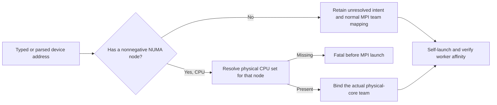

# CPU generation startup affinity — 2026-09-10

## Failure and root cause

The first Qwen3.6 MoE single-CPU fast-generation Off control failed in 4.131
seconds, before readiness or weight loading. Its canonical address is
`localhost:-1:cpu:0`: one rank-local CPU endpoint with unresolved NUMA, not an
explicit request for a nonexistent node. CLI parsing used the number of colons
to infer explicit locality. This incorrectly made `-1` authoritative. Bootstrap
then disabled socket mapping, failed to find a CPU set, and continued using MPI
defaults. All 28 OpenMP workers landed on one physical core.

The same parser error affected serialized CUDA/ROCm addresses and YAML/rank-map
forms, even though this observed runtime failure was CPU-specific. The original
HTTP failure is preserved under
`parity-results/generation-regression-qwen36-cpu-controls-01/`.

## Fix and regression boundary

`GlobalDeviceAddress::hasValidNuma()` now owns the locality predicate for CLI,
YAML and explicit rank maps. Bare `cpu` keeps its separate all-local-CPU
semantics. No model/topology definition or exported device string is rewritten.
Bootstrap rejects malformed explicit negative intent and unavailable physical
CPU sets before self-launch. Explicit endpoint team size comes from the actual
physical CPU set, not a socket-size assumption. Inference kernels, precision,
graph policy and affinity assertions are unchanged.

The new model-free `V2_Integration_CPUStartupAffinity` drives the production
parser and `MPIBootstrapPhase` self-launch. CTest must not wrap this test in MPI:
that would bypass the failing path. It checks unresolved locality, short/full
selectors on every detected NUMA node, all physical workers, and fatal rejection
of an unavailable node. It is in `ProductionParityPreflight`.

The pre-fix run reproduced the unresolved-node failure and passed both address
spellings on both real sockets. Device-free tests reproduced false explicit
intent for CPU/CUDA/ROCm and now pass after the fix. The focused parser,
bootstrap and integration registrations pass in 6.85 seconds. The twenty-repeat
startup gate passes in 118.08 seconds: 100 real MPI launches and twenty fatal
unavailable-node checks. Fresh complete gates pass **647/647 Unit** (73.96s)
and **129/129 preflight** (481.38s), 556.040 seconds combined. Release
and Integration builds succeed. Do not reuse the old prerequisite receipt
across this implementation change.

Evidence: `parity-results/cpu-startup-regression-{red,green}.log`,
`cpu-startup-affinity-20.log`, and `cpu-startup-release-build.log`.
The exact HTTP CPU control now **passes in 118.892 seconds** after these fresh
gates. Its model was reused from the persistent tmpfs cache with zero copied
bytes. Four requests each commit 384 tokens; repeated harbor/mountain requests
are token-exact, RAM full/partial hits restore hybrid state, and shutdown is
clean with no GPU allocation. Prompt boundaries are 214 and 289 tokens; the
partial request restores the complete 214-token earlier boundary. Evidence:
`parity-results/generation-regression-qwen36-cpu-controls-02/`.

Request times are 27.601 / 25.312 / 26.110 / 25.412 seconds. This first CPU
generation cell misses the 60-second whole-cell iteration target; that is an
explicit economy miss, not a reason to shorten the 384-token horizon. The five
MTP variants are next, using this same serial control and prerequisite receipt.
