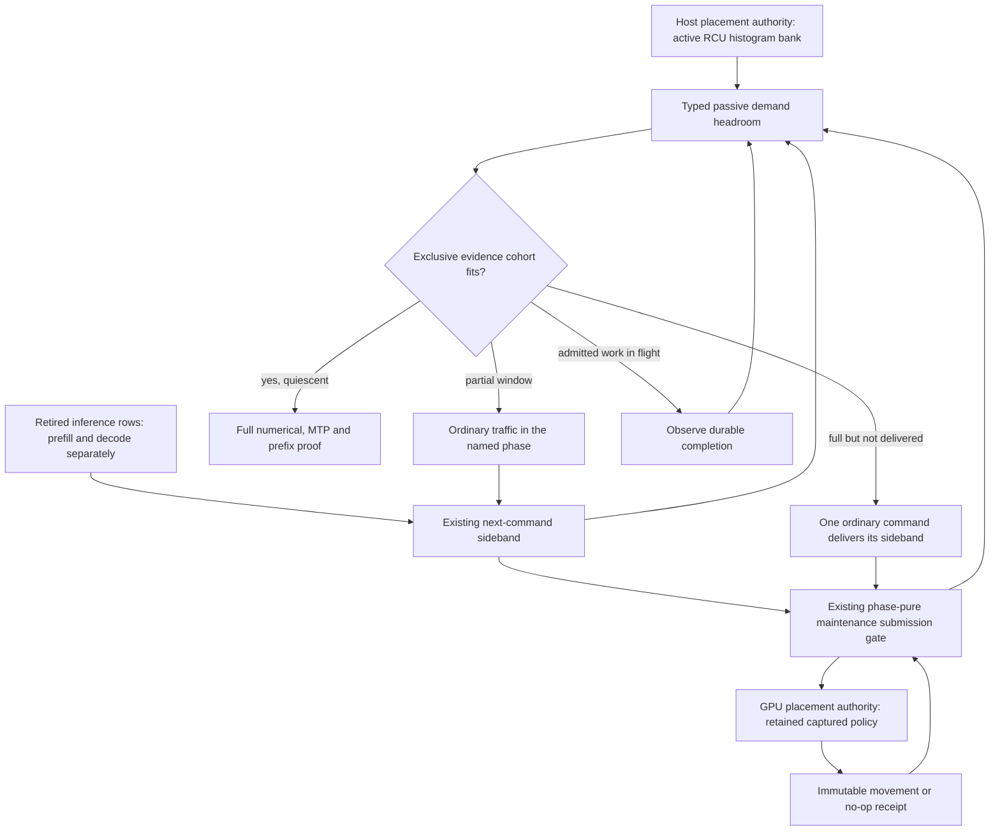
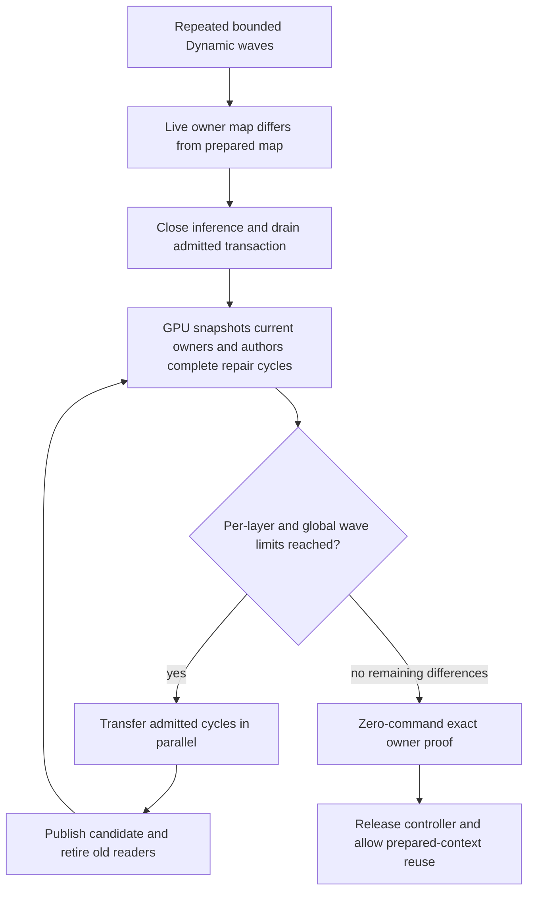

# Device demand-admission contract — 2026-09-10

## Preserved first failure

`ci-local-unseen-pass-15` adds **84 individual passes**, reaching **422/510**,
before stopping on 122B CUDA2/ROCm4 Dynamic/Ordinal/MTP-off. The exact cell
returns a test failure after 78.242 seconds (83.249 seconds including process
startup/retirement), not a timeout, OOM or asynchronous backend exception.
All six preceding Static/Ordinal MTP settings pass on this same topology.

The first failed condition is in `driveDynamicResidencyToDistributedMigration`:
the optimization authority is active but its `demand_window` is invalid.
`MoEOverlayDeviceControllerGraphService::optimizationStatus` never populates
that field. The field and shared fixture had converged on the host RCU-bank
contract without providing the all-GPU scheduler's corresponding admission
fact. Later missing participation/routing/CSV assertions are consequences of
the early return; numerical parity never starts.

This is an interface-contract gap, not evidence that the GPU controller failed
to compute a placement or corrupted expert weights. It is also distinct from
the separate single-domain native-controller ledger-export audit.

## Ownership and simplified correction

The device projection describes **submission cadence, not a host histogram**.
It selects the fuller of the existing independent prefill/decode windows; the
remaining headroom conservatively bounds a mixed cohort's total row count.
Its typed scope identifies which traffic can actually close that window.
Retired rows still queued in `OrchestrationRunner` are included, because the
next inference command delivers them before execution and can admit movement.

The existing gate owns its consume generation. Only diagnostic readers and
background consumers share a short counter/reset observation lock. Inference
notifications retain their existing lock-free atomics; no GPU download, extra
collective, stream wait, host placement calculation or hot-path allocation is
added. Coalesced occupancy is clipped only in the headroom projection, never
in the real counters consumed by the scheduler. GPU-authenticated receipts
remain the sole reason cadence can enter cooldown.

The fixture distinguishes missing phase rows from an already-full window
awaiting next-command delivery. It uses ordinary captured serving calls for
both, retains the authoritative movement/economy/axis requirements, and does
not substitute a fabricated demand bank or skip the protected-cohort check.

## Verification in progress

Focused device-free regressions cover prefill/decode selection, undelivered
sidebands, coalesced overshoot, receipt-owned cooldown, monotonic consumption
generations and concurrent notifications over twenty repetitions. The existing
`DynamicMaintenanceCadenceLifecycle` preflight registration now runs this whole
functional gate family. The fixture's geometry regression covers phase-correct
closure and progress delivery before or after the movement target.

The complete Unit/preflight/parity target build is running. Fresh prerequisites
and the exact preserved failing cell must pass before resuming unseen cells.
The six focused cadence tests pass (39 ms of test bodies), including the
twenty-repetition concurrent notifier/consumer/observer regression. All twenty
shared convergence-lifecycle tests also pass in the model-free fixture.
The broader build caught and then corrected an assertion-macro spelling error;
its remaining compiler work is still prerequisite to a consistent full receipt.

At 11:12 UTC the broad build completes. The six cadence tests additionally
pass in **twenty fresh processes**; each process repeats the concurrent
notifier/consumer/observer scenario twenty times. This is focused lifecycle
stability evidence, not twenty real-model passes. A final incremental build
refreshes registration before the complete prerequisite driver.

No gate, timeout, activation precision, model format or hardware topology has
been relaxed. This document is not a passing receipt.

## Fresh prerequisites and the next exposed defect

`ci-local-device-demand-01/report.json` records **645/645 Unit and 128/128
ProductionParityPreflight passes**. The same exact six-GPU Dynamic cell now
passes movement admission/convergence and emits its six numerical CSVs. It
fails after 163.831 seconds during the ordinary `shutdownMPIWorkers()` boundary
at `NodeExpertOverlayParityRunner.cpp`, not exception unwinding from an earlier
logged error. The canonical prefix/path evidence is not finalized, so this is
still a red cell and the diagnostic ledger remains **422/510**.

The terminal GPU-authoritative prepared-context restoration asks for seven
arrivals into participant 0/layer 30, and six into participant 2/layer 30; both
have a two-slot per-layer physical pool. `authorPreparedContextRestore` limits
global cycles and command storage, but omits the per-layer cycle bound already
used by Dynamic policy and by canonical shadow-capacity admission. Multiple
earlier legal Dynamic waves accumulate more repair work than one legal wave can
hold. The existing integration test only restores one prior movement wave,
which cannot expose the accumulation.

The correction retains this lifecycle and its physical capacity. It must apply
the same admitted per-layer cycle limit to repair, without raising slot counts,
adding host placement decisions, or serializing independent layers. The new
model-free regression starts with seven closed cycles per layer in two layers,
sweeps per-layer budgets 0/1/2/4, and reverses CUDA/ROCm authority. Zero disables
optimization but retains the admission-owned one-cycle repair capacity. It must prove
bounded parallel waves, strict progress, exact terminal runtime owners, and no
optimization-history changes. It belongs to the existing process-resident
fabric preflight group. Verification is in progress.

The new regression reproduces on the unmodified device planner on **both
CUDA and ROCm**: the first wave emits 60 commands instead of its permitted 12.
The production correction adds the existing per-layer cycle limit to the
restoration loop. It changes no buffers, memory admission, collective,
descriptor format, economy calculation or inference synchronization.

After rebuilding all Unit/preflight/parity targets, all three restoration
regressions pass **20 repetitions** (60 test executions). The new tests cover
both authority backends and all four layer caps in each repetition, including
the mandatory terminal zero-command proof. The fresh complete Unit gate is
**645/645 in 72.99 seconds**; preflight and the preserved model cell are running
under `ci-local-restore-bound-01`.

### Controller resource and dispatch evidence

Profiler artifacts live outside the source tree at
`/tmp/llaminar-restore-bound-profile.nqPXIo`. CUDA uses application replay,
graph-node profiling, device 0, and skips the three preceding controller
actions (begin, participant snapshot, group snapshot) to select the captured
repair author. Nsight measures 754.14 microseconds on the tiny two-layer,
42-expert regression geometry. Its one 256-thread CTA has 150 registers/thread;
the compiler's register/shared/local/stack resources are unchanged by the fix.
Low whole-GPU occupancy is expected for this single-authority maintenance
operation, not a compute-throughput claim or a production inference benchmark.

ROCm's matching captured author is dispatch 46 in the trace, measured at
1.402238 milliseconds; the separate singleton counter run authenticates that
same dispatch, four wavefronts and zero private scratch. The profiler's logical
`gpu: 0` corresponds to trace agent `gpu-id=2` on this host; the initial agent-id
filter collects no rows and is not evidence. A separately compiled pre-change
HIP object confirms **unchanged** 121 VGPRs, 98 SGPRs, 63,360-byte LDS, zero
private segment and zero VGPR spills. Both versions report 294 scalar spill
records: this existing monolithic-controller resource cost is not introduced
by the bounded restoration fix, and zero private scratch must not be described
as absence of every kind of spill. No profiler timing enters canonical results.

At 11:53 UTC the fresh complete gate passes **645 Unit + 128 production
preflight**, 547.632 seconds including both phases. The process-resident
CUDA/ROCm controller-fabric group passes in 8.40 seconds with the new
regressions included. The driver then starts only the preserved failing
122B Dynamic/Ordinal/MTP-off cell, retaining the persistent tmpfs cache.

At 11:56 UTC that exact cell passes in **191.245 seconds**, with all eight
required CSVs and clean shutdown/context retirement on both ranks. The
authoritative ledger contains 1,956 completed edges: 489 promotions, 489
demotions and 978 same-priority moves, with both tier and participant objectives
represented. Prefill LM-head cosine remains 0.999041 and KL 0.00105283; all
49 layer rollups pass. This is a correctness fix, not a speedup claim against
the earlier abort, which never completed restoration.

The individual diagnostic ledger reaches **423/510**. `ci-local-unseen-pass-16`
resumes only the remaining unproven cells with this unchanged-build prerequisite
receipt and stops at the next red. The known deferred Qwen2 Q16 Top-5 cell
remains red; no gate or numerical threshold is changed, and a fresh unfiltered
matrix is still required before Docker certification.

The unchanged sweep then passes fixed MTP depths 1/2/3/15 in 161.175,
169.185, 164.088 and 176.642 seconds respectively, with nine CSVs each. It
stops at dynamic depth after 343.312 seconds on a live-checkpoint append
admission error, not prepared-context restoration. The ledger is **427/510**.
See [the checkpoint admission audit](production-ci-mtp-checkpoint-append-admission.md)
for the exact boundary and proposed lifecycle simplification.
