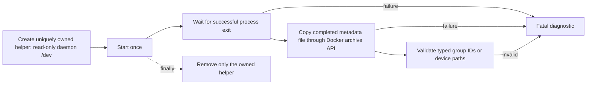

# Docker device metadata: completed artifact authority

Date: September 9, 2026. Scope: the node-local certification launcher, not
inference or GPU runtime execution.

## Exact failure and diagnosis

Docker proof 21 built the AVX512 Integration builder and full Release runtime
from source tree `183a47b2daebd0e0c38cd5d2bceb149212a3e656`. The next step failed
with `Docker daemon did not report valid ROCm device group IDs`, before manifest
discovery or any model test. Neither ISA has an image certificate.

The original attached-stdout probe returned exit zero but no output once in
twenty attempts. A second twenty-attempt experiment retained each container
and compared its attached stdout, result file, logs, and exit state. Twice,
attached stdout was empty while the file and logs contained the complete
group inventory. Both processes had exit zero, no OOM, and no runtime error.
This establishes Docker attach output loss, not absent devices or wrong GIDs.
Actual daemon device groups were 44 and 992; these are observations, not
configuration constants.

Local evidence:

- `parity-results/ci-container-proof-21-driver.log`
- `parity-results/ci-proof21-rocm-gid-probe-20.log`
- `parity-results/ci-proof21-rocm-gid-retained-20.log`

## Simplified lifecycle

`docker_paths.daemon_device_metadata` owns this lifecycle for both ROCm group
IDs and NVIDIA passthrough paths. Each control operation has a bounded timeout.
No attach, log replay, retry, device open, permission workaround, or additional
inference-path work is involved. Temporary result storage and the helper are
retired on successful execution, failed start, failed exit, wait timeout, or
failed copy. The shell NVIDIA launcher propagates failed probes rather than
turning them into an empty inventory through process substitution.

## Verification

The focused pipeline Unit suite passes 52 tests, including loss of attached
stdout with an intact artifact, ordered lifecycle and cleanup, all later-stage
failure exits, both backend parsers, and shell error propagation. Twenty real
iterations each of ROCm and NVIDIA metadata discovery pass without remaining
helper containers. Evidence:

- `parity-results/ci-device-metadata-unit.log`
- `parity-results/ci-device-metadata-real-20.log`

The rebuilt full Unit gate passes 645/645 in 74.17 seconds, including the new
pipeline regressions (`parity-results/ci-device-metadata-full-unit.log`). The
120/120 production-preflight evidence from the immediately preceding engine
slice remains applicable: this follow-up changes only launcher code, script
tests, and documentation. The full Docker driver runs both gates inside each
new image; no host prerequisite result is substituted for image evidence.

The exact discovery step passes using the already-built proof-21 builder:
13 canonical E2E cells exported, with no source or binary mounts. Evidence is
`parity-results/ci-proof21-launcher-diagnostic.log` and its adjacent directory.
This rerun is diagnostic only. The new source must be frozen into new images for full
dual-ISA certification; a launcher diagnostic cannot certify an older image.
