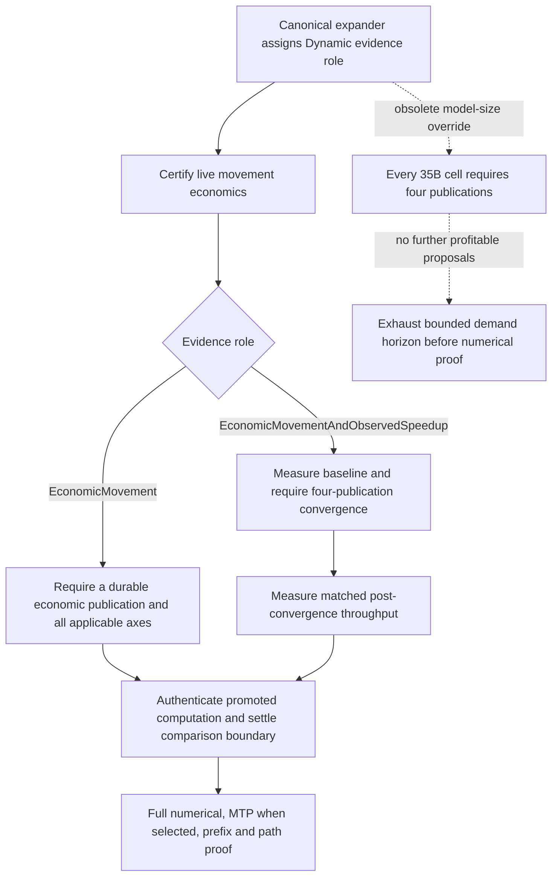

# Dynamic evidence-role mismatch — 2026-09-10

## First failure after 30 further individual passes

`ci-local-unseen-pass-14` advances from 307 to **337/510** individual greens,
including all 24 122B ROCm1/CPU1 settings. Its next unseen cell fails:

`Qwen35MoE_35B_Q4KXL_ROCm1_CPU2_2xMPI_NodeExpertOverlay_Dynamic_Ordinal_ActFP32_KVFP16_MTPOff`

The process exits normally with a test failure after **67.567 s**, not a timeout,
OOM or device error. The coordinated root is rank 1 on this topology. Both
ranks complete device retirement. The run is stopped and its report/diagnostics
are preserved under `parity-results/ci-local-unseen-pass-14/`.

The first diagnostic is exhausted movement-proof demand generations. The
authority publishes two profitable transactions: 16 migration edges in eight
cycles, then two edges in one cycle. The following three authenticated windows
produce no profitable proposal. Nevertheless the fixture demands four
publications and refuses to enter numerical parity. Missing numerical/prefix
CSVs and post-failure missing-participation assertions are downstream of that
early exit; they are not seven independent numerical failures.

## Lifecycle audit

`dynamicResidencyConvergenceTarget()` retained a model-size exception: only
122B non-speedup cells received the ordinary one-publication target. All 35B
cells inherited the longer timing-witness target despite the central expander
already assigning their evidence role. This is duplicated fixture policy, not
evidence that the production authority should manufacture uneconomic moves.

## Installed correction and verification plan

`qwen35MoEMinimumMovementPublications(ModelParityDynamicEvidence)` owns the
family's publication-count mapping in the canonical model definitions. The
fixture consumes the generated role directly. Static/non-movement maps to
zero; movement-only maps to one; the existing observed-speedup witness remains
four. Topology-axis checks, authoritative admission/physical-completion proof,
authenticated promoted-expert mathematics, numerical thresholds, prefix checks
and runtime movement policy are unchanged.

The device-free `V2_Unit_ModelParityDefinition` regression covers all roles,
rejects an invalid role and checks every real generated 35B topology/cell.
The existing speedup training budget consumes the same role-owned count.
No model-name predicate remains in the fixture's count selection.

All Unit/preflight/parity targets rebuilt successfully. The complete focused
`V2_Unit_ModelParityDefinition` suite, including the new regression, passes in
**0.58 s**. `ci-local-35b-evidence-role-01` then passed all **645 Unit** and
**128 production preflight** tests and the exact failed cell through the
canonical driver in **39.735 s**, validating all eight required CSVs. The
individual ledger is now **338/510**; this is diagnostic progress, not a fresh
unfiltered certificate.

The corrected run retains 13 authoritative physical movement edges: ten
tier-residency edges and three combined-axis edges. Six promotions, six
demotions and one same-priority edge prove both applicable objectives. All 22
promoted-expert numerical witnesses are certified. Prefill LM-head cosine is
**0.998425**, KL **0.00897842**, with exact Top-1/Top-5; the captured
heterogeneous path, decode checkpoints and full/partial prefix restoration
pass. Both ranks complete retirement normally.

`ci-local-unseen-pass-15` resumes the remaining unproven exact cells using this
unchanged-build prerequisite receipt. The separate native
byte-equivalence assertion and peak host-source admission audits remain open;
this change does not claim to resolve them.

## Unchanged-build continuation

By 10:27 UTC, `ci-local-unseen-pass-15` adds **35 further passes** without a
new red, bringing the historical individual ledger to **373/510**. Together
with the exact corrected rerun, this continuation adds 36 passes from 337.
Both remaining 35B ROCm1/CPU2 Static cases and Dynamic/Random pass; their
prefill distributions agree with the corrected Ordinal case and both complete
and partial prefix restoration are state-equivalent.

The queue also passes eight Qwen2 CUDA cells, Qwen3.5 35B single-CUDA, eight
Qwen3.5 dense CUDA single-device/TP/PP cells, and fifteen remaining Qwen3.6
two-CUDA overlay cells. Qwen3.6 now has **24/24** individual passes on that
topology: both owner orders, Static/Dynamic and all six MTP policies. Its
Dynamic/Random depth fifteen and adaptive cells take **33.969 / 55.289 s**,
retaining all nine required CSVs. No runtime, threshold, precision, timeout or
build change occurred during this sweep.

The live driver next admits Ornith's separate two-CUDA matrix, beginning with
its independent real-weight Hugging Face reference pack. Full unfiltered and
Docker certification remain pending. The single-domain movement-ledger
interface/export distinction is documented in
[its evidence audit](production-ci-single-domain-movement-evidence-audit.md);
terminal counter checks currently pass but are not claimed as the specialized
node fixture's stronger typed-ledger export.

By 10:42 UTC the unchanged sweep reaches **400/510** individual greens.
Ornith's complete **24/24 two-CUDA overlay** matrix passes with both owner
orders, Static/Dynamic movement and all six MTP policies. Its first ordinary
cell takes **87.062 s** including independent base-reference generation;
depth one then extends that authenticated pack with sidecar checkpoints.
Across all 24 isolated processes the median is **31.260 s** and their summed
cell time is **803.662 s**, not an aggregate campaign timing certificate.

All four Ornith adaptive cells publish depth-fifteen identity, one adaptive
window advance, 30 attempted drafts across two verifier transactions,
15 accepted draft tokens and a serial-exact response. Required numerical,
capture, prefix and eight/nine-CSV obligations pass. The ordinary decode
stage-row/summary distinction is recorded in the verifier evidence audit;
these passes do not claim byte identity to independent HF arithmetic.

Qwen3.6 single-CUDA MTP off, depth one and depth two subsequently pass. The
live driver continues with its depth-three cell; no new implementation,
threshold, format, precision or build change has been required since the
role-policy correction. Docker work remains paused until the local matrix
and its final certification audits are complete.

At 10:50 UTC the sweep stops after **84 new passes**, at **422/510**. The
remaining Qwen3.6 single-CUDA cells, all six Qwen3.8 dense single-CUDA MTP
policies, the small Qwen2/Qwen3 CUDA/mixed-vendor cases and all six 122B
CUDA2/ROCm4 Static/Ordinal policies pass. The next Dynamic/Ordinal/MTP-off
cell reveals a different, previously unprovided device cadence-admission
contract; see [the preserved first failure and lifecycle
audit](production-ci-device-demand-admission.md). The sweep does not continue
past that red or claim an aggregate certificate.
