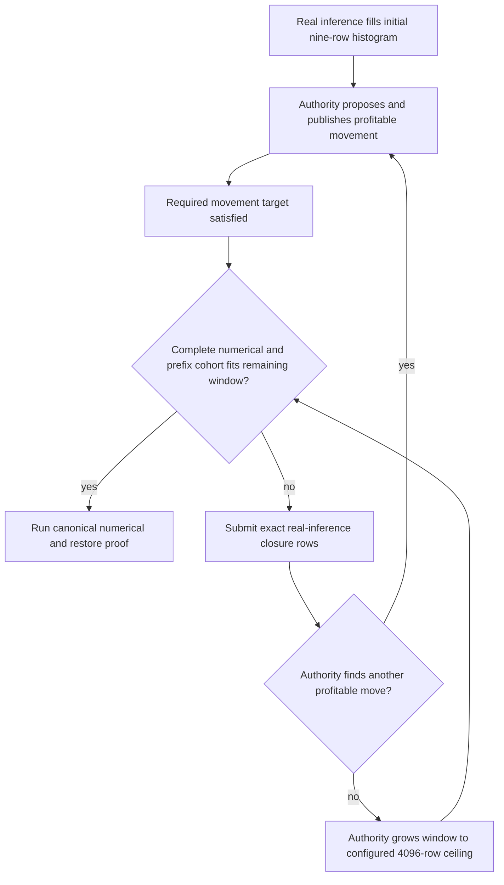

# Dynamic parity comparison-boundary cost — 2026-09-10

## Measured on the unchanged unseen sweep

`ci-local-unseen-pass-14` passes the 122B ROCm1/CPU1 rank-local
Dynamic/Random MTP-off cell in **414.922 s**. The retained driver log contains
28 post-target demand-window closure messages, from generation 2 at
09:13:26.467 through generation 29 at 09:18:08.890: **282.423 s** between the
first and last such messages. This is an observed interval, not an exclusive
profiler attribution. It already spans 68% of the complete cell wall time.

The movement ledger contains 708 promotions and 708 demotions. The diagnostic
counter records one histogram-window growth, from 9 to 4096 rows, after the
observed no-movement decision. The cell passes numerical checkpoints, all
required CSVs, full/partial prefix restore and teardown. This is an economy
finding, not a newly red cell or evidence of stalled inference.

## Why a movement proof currently runs toward full convergence

`NodeExpertOverlayParityMovement.cpp` distinguishes the achieved movement
target from the subsequent immutable comparison boundary.
`classifyConvergenceBoundary()` requires strict headroom for the complete
typed cohort. A nine-row window cannot hold even the ordinary 24-row bound;
the MTP bound is larger. `MoEOverlayResidencyAuthority` deliberately resets
cadence after a move and grows it only after an observed no-op. The fixture
therefore keeps driving profitable placements despite already satisfying its
minimum movement objective. The native controller is behaving according to
its selected policy; changing that production policy to accommodate a test
would be the wrong ownership boundary.

## Candidate simplification for the subsequent economy pass

For cells whose typed contract is `EconomicMovement` without an observed
speedup cohort, investigate deriving the *initial* declared histogram window
from the existing complete numerical-workload bound plus the bounded
already-admitted training traffic. Close that window using captured,
authenticated real prefills, prove the same required physical publications,
promoted-expert mathematics and topology-valid axes, then enter the unchanged
comparison proof in a fresh window with enough headroom. This changes an
explicit test workload policy, not the production controller or its authority.

Do not pause maintenance, discard histograms, inject routes, infer completion
from PerfStats, omit prefix checks, reduce the movement-axis contract, or
replace graph capture. The separately selected before/after speed witnesses
must retain their convergence and throughput obligations. The alternative may
execute more rows per window; whether that is cheaper than many tiny
requests and repeated weight exchanges needs measurement, not assumption.

No configuration or implementation change is installed for this investigation.
The unseen sweep retains its authenticated unchanged build. Any later change
needs typed-geometry regression coverage, fresh Unit/preflight, representative
CPU/GPU and all-GPU proofs, and the complete final matrix. Historical individual
passes are not a certificate or proof of the global 4500-second target.

## Separate ordinary-traffic inefficiency confirmed by source audit

`replayStationaryMovementProofRequest()` repeatedly submits the same exact
authenticated causal prefix. `runDynamicEconomyPrefill()` resets request data
but does not purge the prefix archive. Therefore later ordinary requests may
be complete hits and contribute no new routed rows, even though
`movementProofHistogramRequestBudget()` derives its finite request budget from
the nominal prompt length. The typed settlement branch remains correct: it
observes the actual authority-owned bank and purges the prefix archive before
submitting the exact missing rows. It does not mistake these hits for movement.

The corrected 35B Dynamic/Random run on ROCm1/CPU2 illustrates the distinction:
at 10:16:46 UTC, generation 1 still holds nine rows in its 256-row bank and
settlement submits the remaining 247 rows. The complete cell passes in
39.487 s. This observation is not a timing attribution to prefix hits, but it
shows why repeating the nominal request count does not reliably fill a bank.

A subsequent simplification should distinguish explicitly between bounded
requests used to overlap an already-active publication and guaranteed cold
traffic used to advance demand. Keep one authority-driven settlement loop and
the public prefix-cache lifecycle; do not add another wake protocol, change
the leading token to evade the cache, or claim cache hits as routed work.
