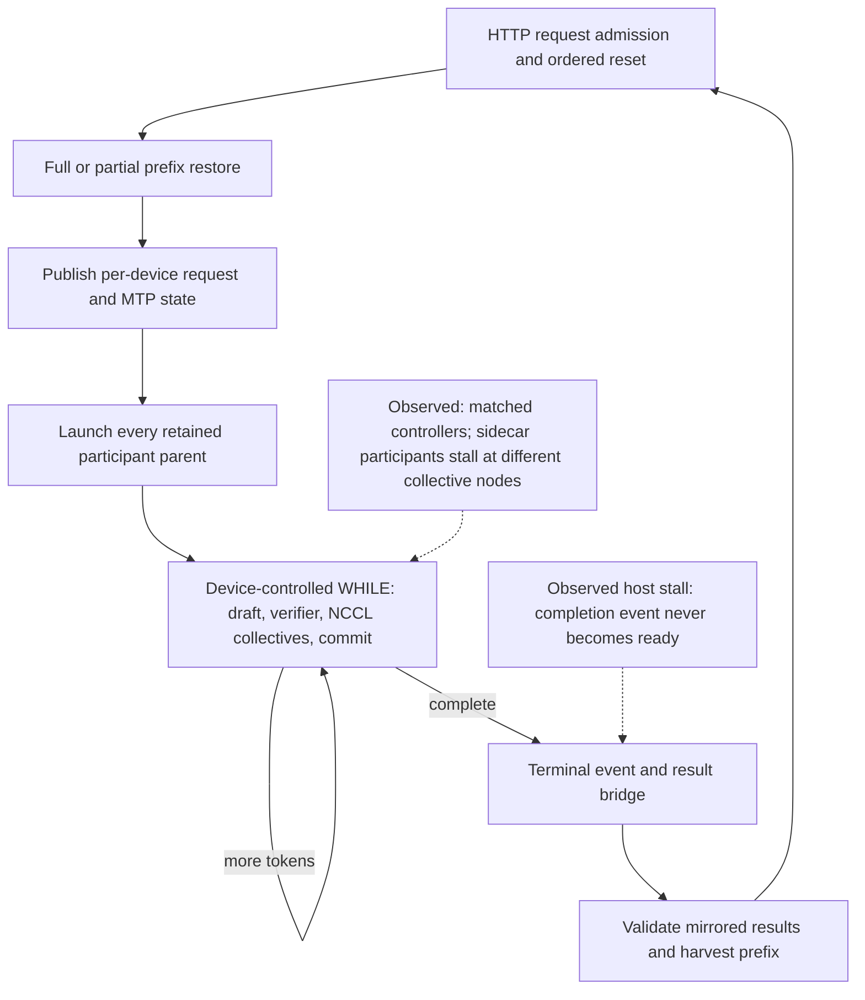
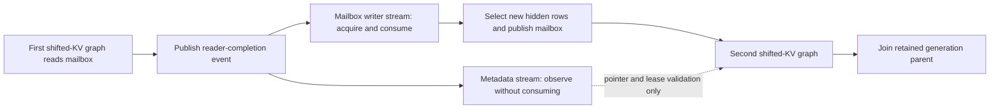
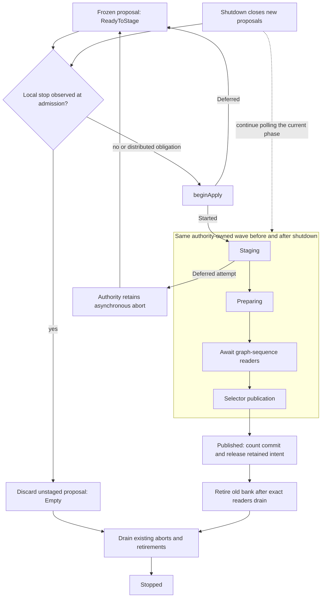
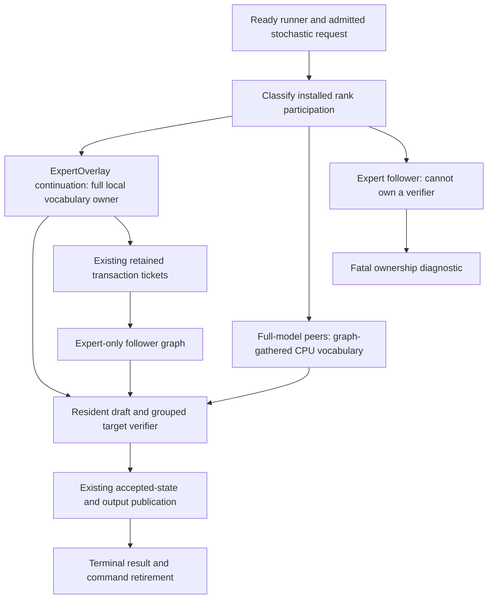
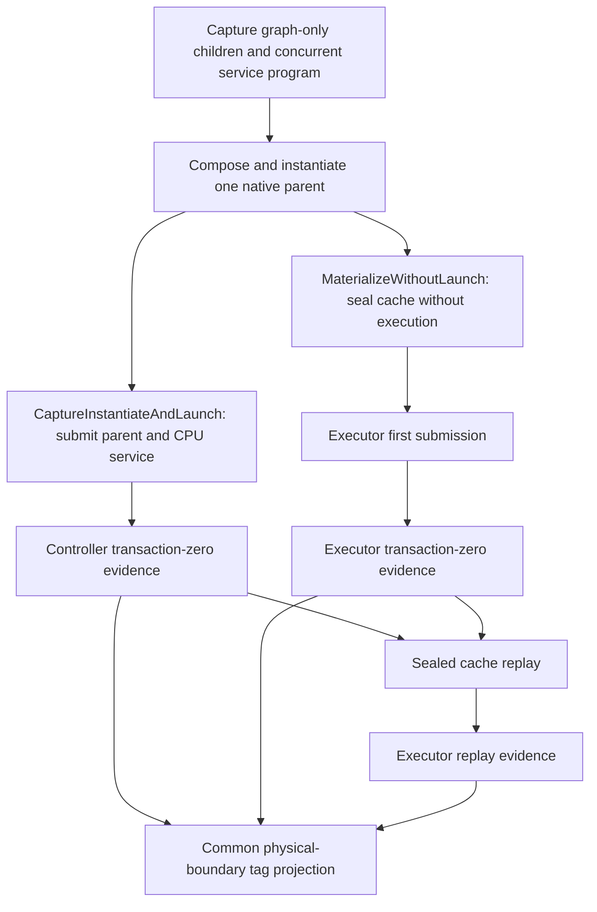
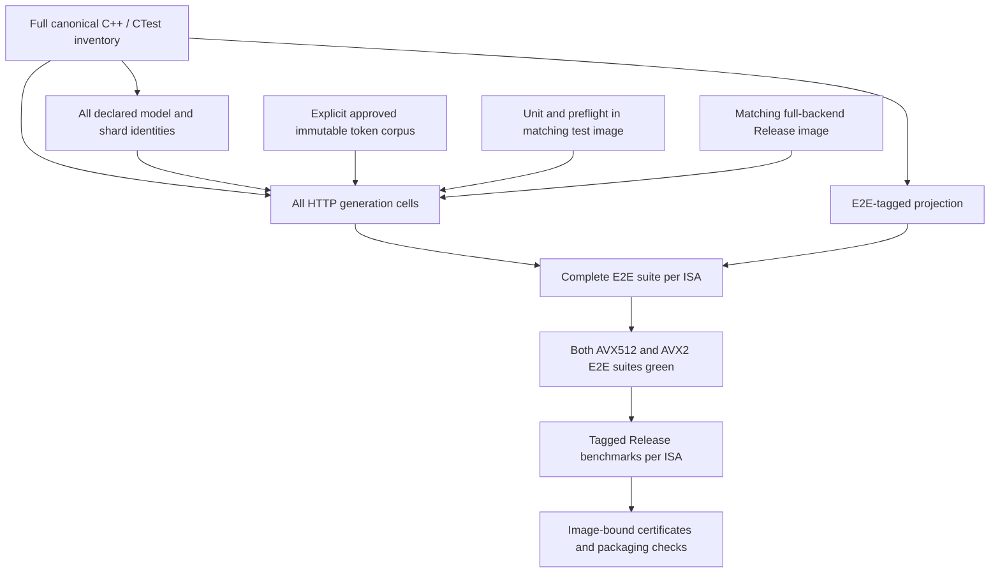
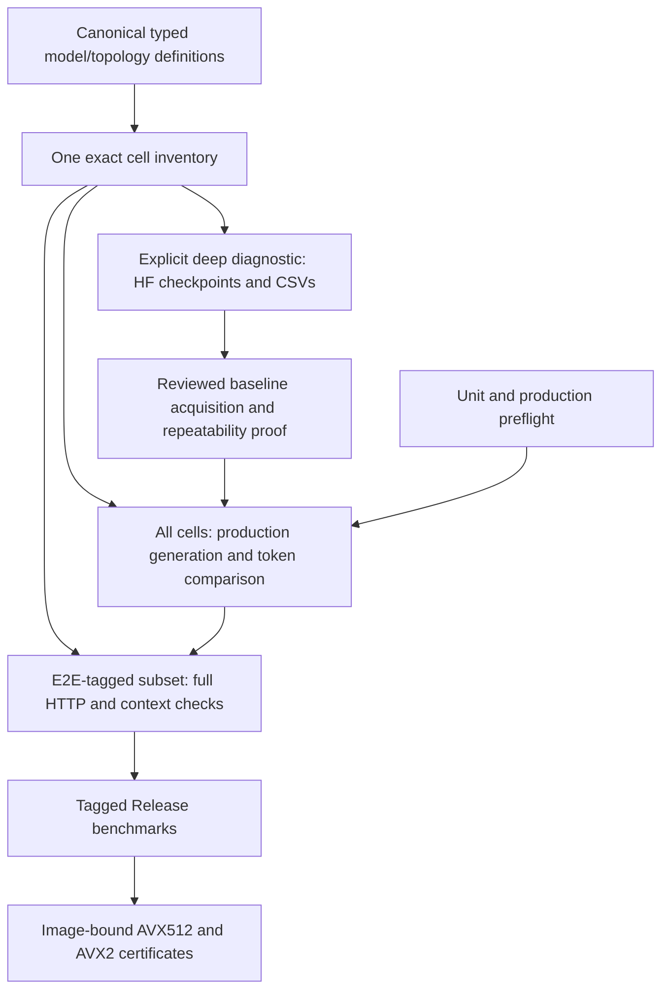

# Generation regression as the routine image gate — 2026-09-10

## Agreed destination

Keep the CPU/FP32 Hugging Face checkpoint suite and its diagnostic CSVs, but
remove it from routine CI after installing and proving the replacement.
Initially use numerical certification to establish trusted behavior. Routine
image certification drives deterministic production generation and compares
committed token IDs, while retaining graph, movement, MTP, prefix and lifecycle
checks. An output match is a behavioral regression check, not a claim that
every intermediate tensor still matches HF.

## Completion audit — September 12

### Latest continuation — September 14: individual acquisition complete

**175/175 serial controls and 335/335 MTP comparisons are green: 510/510.**
The final unseen-only batch completes all 49 cells, with its unchanged shared
651-Unit/170-preflight receipt. This finishes Qwen36 and Ornith dual-ROCm
Static/Dynamic × Ordinal/Random matrices, then all five MTP policies for
single-ROCm Qwen36, Ornith and Qwen38 dense. The acquisition auditor reports
`acquisition_complete=true`, zero unseen cells and zero unresolved failures.
It deliberately retains `certification_eligible=false`: these are additive
native acquisitions across source revisions, not an immutable Docker/image
certificate. No new runtime fix or threshold change was needed in this batch.

The protected binaries are now released for a coordinated rebuild of the
separately developed orchestration changes and complete Unit/preflight gate.
Automatic candidate ranking/apply wiring, approved generation-corpus integration,
and independent AVX512/AVX2 Docker E2E/benchmark certificates remain unfinished.

### Previous continuation — September 13: unseen MTP proof

**Latest result: 304/335 MTP cells pass; 31 remaining.**
The unseen-only batch adds 73 passes before stopping at Qwen36 dual-ROCm
Dynamic/Ordinal depth 1. An exact isolated retry fails at the same transaction
11. The hosted selector wrongly submitted the next body before the completed
body's due maintenance tail; a second defect replaced the original budget
error with a later geometry error. See the
[lifecycle audit and focused proofs](hosted-mtp-maintenance-continuation.md).
The new ordering probe passes twenty resets per depth/terminal case on both
vendors. The new first-error GPU probe fails on both old binaries, confirming
that regression independently. Rebuilt runtime prerequisites pass 651 Units
and 170 production preflight tests. The exact full-model retry passes in
68.998s with all four original 384-token responses serial-exact, all harness
checks and clean teardown. All nineteen additional fresh processes pass;
the first pass counts toward twenty. Unseen-only acquisition now resumes in
`native-journal-mtp-unseen-after-hosted-tail-01` with the same shared receipt.
Its first eighteen unseen cells pass. Qwen36 dual-ROCm now completes every
Static/Dynamic × Ordinal/Random × depth policy. Ornith dual-ROCm Static/Ordinal
depths 1/2/3/15 also pass; its dynamic-depth cell is running. The audit snapshot
after seventeen of these passes finds no unresolved failed cell. These remain
native individual acquisitions, not a complete Docker/image certificate.

Earlier acquisition history:

All 175 serial controls remain green. The repaired dual-CUDA depth-2 cell
passes twenty fresh canonical HTTP processes, with eighty original exact
384-token responses and all eight harness checks per run. The complete shared
gate passes 650 Unit and 168 production preflight tests. The unseen-only batch
`native-journal-mtp-unseen-after-shifted-metadata-01` then passes all eighteen
previously unseen Qwen 3.6 dual-CUDA cells, completing this topology's twenty
MTP cases across both movement modes, both placements and every depth policy.
All twenty Ornith dual-CUDA cells and all five Qwen 3.6 single-CUDA MTP policies
then pass too. All five Qwen 3.8 dense single-CUDA MTP policies, all twenty
Qwen122B CUDA2/ROCm4 cases, and all five Qwen36 dual-ROCm Static/Ordinal policies
also pass with the same shared receipt, before the Dynamic/Ordinal failure.

The preceding unseen batch stopped on Qwen 3.6 35B IQ3S dual-CUDA LocalTP
Static/Ordinal depth 2. The first two original 384-token responses are exact;
the partial-prefix request then stalled. Before any debugger attachment both
GPUs were busy, and a host stack subsequently located the wait in
`DeviceGraphOrchestrator::finishDeviceResidentGeneration()` at the terminal
CUDA event. CUDA-GDB attachment failed internally and the process then
segfaulted; that crash is potentially debugger-induced, not established as the
original defect. The original complete failed receipt remains preserved.

An unchanged, debugger-free retry in
`native-journal-qwen36-cuda2-d2-reattempt-01` completes the first three original
responses exactly in 3.520/2.756/3.008s, then stalls on the fourth/full-prefix
request. A read-only host-stack observation confirms the same terminal event
wait. This establishes a repeatable hang at varying request boundaries, not a
deterministic token mismatch or a maintenance/shutdown failure. The retry
ends at its unchanged 600-second watchdog. No increased timeout
is installed. A subsequent disposable user-triggered CUDA core-dump attempt
failed in NVIDIA's debugger machinery (the offline reader reports zero devices)
and provoked launch failure/abort; it does not identify the original hang.

The focused NCCL preflight previously proved retained-parent recording re-entry
with an empty conditional, not repeated collectives inside WHILE across request
resets. Added `V2_Integration_CUDA_NCCLNativeWhileRequestReplay` to the canonical
preflight list: four NCCL body fragments, a production device commit clock,
twenty resets with varying loop budgets, alternate submission order, and checks
on both devices. The test now passes twenty independent CTest runs (400 request
resets) in 55.65s. Its first version incorrectly inspected a non-root reduction
output; the corrected test explicitly broadcasts the root result before both
participants advance. This was a test defect, not the server's root cause.
The configuration-parser and prefill-bucket-default Unit suites also pass after
rebuilding, including the user's configurable maximum and inherited MPI policy.
These targeted results do not yet close the model hang. An ignored disposable
LD_PRELOAD probe observes the existing predicate's controller binding and reads
both device rows only after a terminal wait stalls; it changes no device state
or production code, and its results cannot certify a cell.
The successful read-only probe (`...-probe-04`) finds identical healthy
46-word generation controllers on both GPUs: response count 3, remaining 381,
transaction count 1, depth 2, and no error. Both epoch records report successful
Acquire with epoch 1/selector 3, one reader and no acquisition in flight. The
fragment-marker follow-up (`...-probe-05`) stops at entry to fragment 1, the
full sidecar, on both GPUs. Thus this reproduction is after epoch admission and
before draft publication/verifier/commit, not a divergence of the observed
controller words. The probe's earlier metadata-query variants polluted CUDA's
last-error state and are explicitly non-evidence for a runtime defect.
The small regression now alternates standalone captured first transactions
with retained-parent execution. This stronger version also passes twenty
independent runs (400 request resets), in 53.73s. Node-level markers in the
disposable model probe (`...-probe-06`) find GPU 1 blocked at full-sidecar node 2
while GPU 0 reaches node 38; both are driver-owned collective kernels. The
markers preserve every original dependency and reset on each iteration.
Controller and epoch records still agree. Exact collective naming and capture
identity/order are the next checks; no runtime fix is claimed.
The final expanded test adds the ordinary all-reduce surface, rooted reduction
and broadcast at widths 1/257/2048/32768. It passes twenty independent runs
(400 request resets) in 65.26s. This includes alternating source-capture first
transactions and retained-parent replay, but has not reproduced the model hang.
Driver-API inventory in `...-probe-11` authenticates matching sidecar collective
descriptors: the first kernel is the NCCL AllReduce entrypoint, followed by
the routed reduction and final-row broadcast. Both participants have matching
channel masks, work geometry and root. The library can dispatch a different
protocol through its work descriptor, so its kernel symbol alone is not a
complete algorithm/protocol identity. Read-only channel observations remain
stable and cross-peer send/receive steps agree (channel 0: 23986 and 24624;
channel 1: 22826 and 23832). These observations rule out a simple captured
size mismatch, not a missing/duplicate launch or dependency. Native source
graph submission/reuse is the next diagnostic boundary. None of these probes
changes the production library, precision, model, timeout or certified ledger.
The next ignored probe (`...-probe-12`) records actual source-executable
submissions. Both GPUs submit identical collective signatures in the same
sequence: full sidecar, chained sidecar, grouped verifier, two shifted-KV
graphs, then the retained conditional parent. The second request reuses the
same executable handles and stalls after parent submission 13. Thus no missing
host graph launch or source-executable replacement has been observed. The next
audit should reconstruct exact event-record/wait edges across these distinct
streams, especially the last shifted-KV graph to parent handoff; matching host
submission order alone is not a GPU happens-before proof. The disposable
120-second diagnostic deadline is not a replacement for the unchanged
600-second canonical cell watchdog.
The read-only full acquisition audit, including the clean failed retry,
revalidates all 175 controls and 211 MTP passes in 10.040s, with exactly one
unresolved canonical cell and 123 unseen. None of the diagnostic processes is
included in that coverage ledger.
The event-clock probes (`...-probe-13` and `...-probe-14`) locate an actual
missing dependency on request reuse. Submission 11 (first shifted-KV graph)
publishes both its shifted-KV event and transaction event. Metadata admission
waits on both on a separate setup stream, but consumes the shifted-KV handoff.
The later mailbox row-selector uses the verifier stream and therefore finds
no remaining reader publication to acquire. Submission 12 and parent 13 have
no happens-before path from submission 11. First-use graph construction had
incidentally supplied that edge; retained replay exposes its absence.

The shared production fix changes all seven shifted-commit metadata entry
points to the existing const observation API. Actual sidecar/mailbox writers
retain the consuming API; there is no new event, stream, host wait, graph
recapture, precision change or backend-specific branch. A model-free held-reader
regression covers metadata observation on a third stream before the actual
mailbox writer, twenty retained replays and byte preservation on both CUDA and
ROCm. Both already-registered graph-capture suites belong to preflight. The
source-policy gate checks that commit metadata cannot consume the writer edge.
The focused regression passes twenty fresh process runs per backend (800 held
reader interleavings total) in 72.58s, and the focused source-policy Unit suite
passes. Integration and Release builds succeed. The first uninstrumented
Release diagnostic completes all four original 384-token responses exactly in
3.761/2.753/3.126/2.890s and exits cleanly with all VRAM released. Its direct
harness invocation omitted `LLAMINAR_E2E_MOVEMENT_EVIDENCE`, so the harness
correctly reports 7/8 rather than certifying the cell. This is a successful
runtime reproduction check, not a ledger pass. The first prerequisite refresh
found one stale device-free fixture: the 4,080-token checkpoint-boundary test
used a mock without chunk scheduling, which conflicts with the new 512-row
serving default. The mock now executes the production chunk plan and asserts
that only real rows advance its cursor; every original CPU/CUDA/ROCm boundary
assertion remains. All 156 tests in that fixture and its focused preflight
registration pass. The replacement shared refresh at
`native-generation-shifted-metadata-prerequisites-02` passes all 650 Unit tests
and all 168 preflight tests in 686.395s, including a 75.25s Unit phase and
610.45s preflight phase. The canonical model runs `...-fixed-01` through
`...-fixed-20` then all pass, with eighty exact original responses, full prefix
and captured-parent evidence, empty Static movement journals, clean logs and
shutdown, and zero retained VRAM. Cell time ranges from 37.746 to 39.354s
(median 38.648s; sum 771.321s). Every repeat reuses the same 818-test receipt
and persistent tmpfs model. The read-only whole acquisition audit admits only
the final repeat, avoids counting duplicate passes, and confirms 175/175
controls plus 212/335 MTP cells, no unresolved failures and 123 unseen in
10.146s. These are acquisition/stability proofs, not image certificates.

Existing acquisition coverage is preserved; the user's configurable prefill
cap does not invalidate those completed runs.

The complete Qwen 3.6 dual-CUDA continuation is green. Static/Ordinal
depths 3/15/adaptive pass in 39.352/57.362/48.480s. Dynamic/Ordinal
depths 1/2/3/15/adaptive pass in 41.462/41.811/42.814/62.530/53.399s.
Static/Random passes in 42.666/43.415/44.167/61.627/52.644s;
Dynamic/Random in 46.417/47.282/47.630/66.588/57.511s. All seventy-two
original responses from these eighteen new cells are serial-exact and every
independent harness check passes. Each Dynamic final journal contains 108
device-owned participant-placement edges; Static journals remain empty.
Adaptive limits are 1–15, with 162 policy updates in the last Static response
and 134 in the last Dynamic response. No observer, precision, prompt or
movement gate was loosened.

Ornith's twenty dual-CUDA cases also pass all eighty original exact responses
and independent harness checks. In depth order 1/2/3/15/adaptive,
Static/Ordinal takes 42.264/44.321/44.819/68.094/56.706s;
Dynamic/Ordinal 45.331/47.983/47.434/72.470/61.082s;
Static/Random 44.526/46.124/47.480/71.109/59.622s;
Dynamic/Random 48.532/50.640/51.642/75.468/63.332s.
Every Dynamic final journal contains 108 device-owned participant-placement
edges; Static remains empty. Adaptive bounds remain 1–15, with 170 updates in
the final Static response and 142 in Dynamic. The unchanged driver now admits
the previously unseen single-CUDA Qwen 3.6 family. All cells continue using
the one 818-test receipt and persistent tmpfs models. The broader acquisition,
reviewed-corpus cutover and both image certificates remain incomplete.

Qwen 3.6 single-CUDA depths 1/2/3/15/adaptive pass in
22.348/22.246/22.948/38.648/25.300s, retaining every original exact response
and all independent harness checks. The driver advances directly to the
previously unseen Qwen 3.8 dense single-CUDA family, without replaying any
older green cell or rerunning prerequisites.

The preceding local shutdown fix remains independently proven:
CUDA1/CPU1 rank-local Dynamic/Ordinal depth 2 passes the
complete original HTTP cell in 207.942s after the local shutdown ownership fix.
All four 384-token responses are serial-exact; all eight independent harness
checks pass, including clean logs, physical movement and VRAM release. The
focused regression passed 20 repetitions; the refreshed shared receipt passes
650 Unit and 167 production preflight tests. The unseen-only run
`native-journal-mtp-unseen-after-local-drain-01` passes depth 3 in 219.823s,
with all four original 384-token streams serial-exact and all independent
prefix, graph, movement, log and teardown checks green. Depth 15 then passes
in 439.805s and adaptive depth in 238.194s, completing this topology's entire
Dynamic/Ordinal MTP family. Static/Random depths 1/2/3/15/adaptive then pass in
186.485/198.318/208.200/442.751/233.111s, with all twenty original 384-token streams serial-exact,
empty authoritative movement journals, prefix/captured-graph evidence and clean
teardown. Its adaptive controller retains bounds 1–15 and 162/153 updates on
the two workloads. The driver has advanced to the previously unseen
Dynamic/Random family: depths 1/2/3/15/adaptive pass in
196.827/213.845/227.335/451.655/245.368s, with every original stream serial-exact
and all independent harness checks green. The first three final journals
contain 864/960/864 tier-residency edges; depth 15 retains 2,528. Adaptive bounds
remain 1–15 with real policy updates. All 20 MTP cells for CUDA1/CPU1 are now
individually green, matching the complete CUDA1/CPU2 and CUDA2/CPU2 families.
ROCm1/CPU2 Static/Ordinal depths 1/2/3/15/adaptive then pass in
148.082/155.219/164.075/336.245/170.512s.
All original streams remain exact; prefix/captured-path evidence, empty
movement journals, clean two-rank shutdown and full VRAM release pass.
The five-cell family is individually green. Independent saved-observation
validation confirms all twenty original 384-token responses. Adaptive bounds
remain 1–15 with 164/157 policy updates on the two workloads; fixed depth 15
executes 2,595 draft steps and accepts 210 drafts per response. Both latest
cells pass all eight independent harness checks and return GPU VRAM from
40 MiB to the same 40 MiB baseline. The exact-ID inventory audit finds no
duplicate passes or configuration mismatches. ROCm1/CPU2 Dynamic/Ordinal
depths 1/2/3/15/adaptive then pass in
164.900/171.482/181.239/352.470/186.031s, retaining all twenty original
serial-exact 384-token responses and complete independent harness checks.
Final journals contain tier/participant/combined edge counts of
834/188/84, 882/132/96, 1,004/132/60, 1,820/498/204 and 860/238/117
respectively, proving both movement objectives. Adaptive bounds remain 1–15
with 164/157 policy updates on the two workloads. All ten Ordinal MTP cells
for ROCm1/CPU2 are individually green across Static and Dynamic placement.
Its Static/Random depths 1/2/3/15/adaptive then pass in
154.864/158.659/168.618/337.743/170.689s. All twenty original responses are
serial-token-exact, authoritative movement journals remain empty, and the
complete prefix, captured-execution and teardown harness passes every cell.
Adaptive bounds remain 1–15 with 164/157 policy updates. Thus 15/20 MTP cells
for ROCm1/CPU2 are individually green. Dynamic/Random depths 1/2/3/15/adaptive
then pass in 172.719/174.058/183.639/355.958/188.444s. All twenty original
384-token responses remain serial-exact, every complete harness passes, and
both movement objectives execute. Final journals contain tier/participant/
combined edge counts of 852/196/45, 856/168/81, 892/138/72, 1,874/492/213
and 830/176/108. Adaptive bounds remain 1–15 with 164/157 policy updates.
All **20 ROCm1/CPU2 MTP cells** are individually green, joining the three
complete CUDA/CPU topology families. ROCm2/CPU2 Static/Ordinal depths
1/2/3/15/adaptive then pass in 176.736/180.290/186.327/312.773/194.906s.
All twenty original 384-token responses are serial-exact, every authoritative
movement journal is empty, and all complete harness checks pass. Adaptive
bounds remain 1–15 with 177/157 policy updates on the two workloads. Depth 15
executes 2,460/2,325 draft steps and accepts 219/228 drafts. The exact-ID
coverage audit confirms 135 unique canonical MTP passes without duplicate
passes or unresolved native reds. ROCm2/CPU2 Dynamic/Ordinal depth 1 then
passes in 205.818s with all four original 384-token responses serial-exact and
the complete harness green. Its final journal contains 1,026 tier-residency,
66 participant-placement and 568 combined edges, proving both movement axes.
Depths 2/3/15/adaptive then pass in 211.033/216.909/341.155/222.380s.
Every original response is serial-exact and the complete harness passes.
Their final tier/participant/combined edge counts are 1,006/56/590,
1,056/70/495, 1,766/308/736 and 1,090/116/521. Adaptive bounds remain
1–15 with 177/157 policy updates. All ten ROCm2/CPU2 Ordinal MTP cells are
individually green. Static/Random depths 1 and 2 then pass in
179.491/182.147s, with all eight original 384-token responses serial-exact,
empty movement journals and complete harness checks. Depths 3/15/adaptive then
pass in 187.117/311.856/194.399s with the same complete proof. All twenty
original responses are serial-exact. Adaptive bounds remain 1–15 with 177/157
policy updates. The complete Static/Random family is individually green;
Dynamic/Random depths 1/2 then pass in 209.427/212.771s. All eight original
384-token responses are serial-exact and the complete harness passes. Final
tier/participant/combined journal counts are 1,136/28/620 and 1,124/34/596,
proving both movement objectives. Depths 3/15/adaptive then pass in
218.342/344.114/228.956s. Every original response remains serial-exact and
the complete harness passes. Final tier/participant/combined journal counts
are 1,064/34/683, 2,000/262/918 and 1,312/72/641. Adaptive depth retains
bounds 1–15 with 177/157 policy updates on the two workloads. All **20
ROCm2/CPU2 MTP cells** are individually green, completing the fifth full
122B GPU/CPU topology family. The driver has advanced to the unseen
ROCm3/CPU2 Static/Ordinal depth-1 cell. The read-only full-response audit
also independently validated all 175 controls and the preceding 149 MTP
passes in 15.999s, with no unresolved reds; the final adaptive cell has
subsequently passed the same saved-response/control validator.
No runtime change or prerequisite rerun was needed for these groups.
The independently tested outer
CI mount-admission correction below does not change this admitted native run.
Its reused prerequisite cost is zero; no runtime change or new gate run was
needed for the complete Static/Random or Dynamic/Random families.
Corpus approval and Docker certification remain pending.

The subsequent turn interruption stopped the driver and server processes; this
was verified by the missing unified process handle and an empty live process
inventory, not inferred from stale logs. ROCm3/CPU2 Static/Ordinal depth 1
retains four completed HTTP responses and an 8/8 harness summary, but no outer
driver result was committed. It therefore remains uncounted and will be the
first retried cell. The original report and artifacts are not rewritten.
The full saved-response audit still passes 175 controls and 150 MTP cells in
8.841s, with no unresolved native reds. A new canonical prerequisite run at
`native-generation-qwen2-allowances-prerequisites-01` refreshes the receipt
after the approved numerical-test rebuild. All 650 Unit tests pass in 73.37s
and all 167 Integration preflight tests pass in 607.55s (771.006s including
build preparation). The three approved exact Qwen2 HF retries then pass with
all eight CSVs per cell; detailed evidence is below. The resumed
`native-journal-mtp-unseen-after-qwen2-allowances-01` selects only the 185
remaining MTP cells, starting with the interrupted uncommitted ROCm3/CPU2
depth-1 cell. It reuses this fresh receipt and all seven selected GGUFs from
tmpfs, with zero copied bytes. This interruption does not justify replaying
previously green cohorts. Its fresh ROCm3/CPU2 Static/Ordinal depth-1 cell
passes in 187.570s with all 1,536 serial-exact tokens, an empty movement
journal, the complete 8/8 harness and VRAM returning to its 40 MiB baseline.
Depths 2 and 3 then pass in 191.153/194.513s with every original response exact,
empty Static movement journals and the complete independent harness green.
Depth 15 then passes in 303.296s with all four original serial-exact streams,
empty movement journals and complete harness/teardown evidence. Adaptive depth
then passes in 204.985s with all original responses exact, bounds 1–15 and
164/166 policy updates on the two workloads. The entire ROCm3/CPU2
Static/Ordinal family is individually green. Dynamic/Ordinal depth 1 then
passes in 229.968s with all four original responses serial-exact, complete
harness/teardown checks, and final tier/participant/combined journal counts
of 992/120/401. Both movement axes are proven; this is not a matched speedup
benchmark. Dynamic/Ordinal depths 2 and 3 then pass in 229.984/233.690s,
with all eight original 384-token responses exact and every complete harness
check green. Final tier/participant/combined edge counts are 902/76/459 and
938/78/396. Depth 15 then passes in 350.839s and adaptive depth in 245.420s.
All original responses remain exact, both movement objectives execute, and
every complete harness check passes. Final tier/participant/combined journal
counts are 1,714/356/370 and 1,058/120/408. Adaptive bounds remain 1–15
with 164/166 policy updates on the two workloads. All ten ROCm3/CPU2
Ordinal MTP cells are individually green across Static and Dynamic movement.
Static/Random depths 1 and 2 then pass in 198.714/196.421s with all eight
original 384-token responses exact, empty movement journals and complete
harness/teardown checks. Static/Random depths 3 and 15 then pass in
200.319/305.105s with every original response exact, empty movement journals
and complete harness checks. Adaptive depth then passes in 213.251s,
with every original response exact, no movement, bounds 1–15 and 164/166
policy updates. Static/Random is complete. Dynamic/Random depth 1 then
passes in 234.066s with every original response exact, the full harness green
and 1,244/36/435 final tier/participant/combined journal edges. Depths 2/3
then pass in 236.122/239.801s with all original responses exact, complete
harness checks and final tier/participant/combined edges of 1,312/42/455
and 1,184/32/484. Depth 15 then passes in 350.789s and adaptive depth in
251.770s, retaining every original exact response and complete harness check.
Final tier/participant/combined journal counts are 2,066/324/586 and
1,418/86/452. Adaptive bounds remain 1–15 with 164/166 policy updates.
All **20 ROCm3/CPU2 MTP cells** are individually green, completing the sixth
full 122B GPU/CPU topology family. The driver has advanced to unseen
ROCm4/CPU2 Static/Ordinal: depths 1/2/3/15/adaptive pass in
200.682/198.210/199.563/282.448/212.993s. All twenty original 384-token
responses are exact, movement journals remain empty, and complete harness/
teardown checks pass. Adaptive bounds remain 1–15 with 153/148 policy updates
on the two workloads. The complete Static/Ordinal family is individually
green. Dynamic/Ordinal depth 1 then passes in 262.293s with all original
responses exact and complete harness checks. Its final journal contains
1,046 tier-residency, 74 participant-placement and 107 combined edges,
proving both movement objectives. Depths 2 and 3 then pass in
261.630/251.378s with every original response exact and all complete harness
checks green. Final tier/participant/combined journal counts are 962/60/109
and 934/74/129. Depth 15 and adaptive depth then pass in 342.316/267.864s
with all original exact streams and full harness checks. Final tier/participant/
combined journal counts are 1,244/352/121 and 1,052/168/93. Adaptive retains
bounds 1–15 with 153/148 policy updates. All ten ROCm4/CPU2 Ordinal MTP cells
are individually green across Static and Dynamic movement. Static/Random
depths 1/2 then pass in 212.640/215.307s with all eight original 384-token
responses exact, empty movement journals and full harness checks. Depths 3/15
then pass in 224.841/284.762s with all original exact responses, empty
movement journals and complete harness checks. Adaptive then passes in
227.177s, with every original response exact, no movement, bounds 1–15 and
153/148 policy updates. Static/Random is complete; Dynamic/Random depth 1
then passes in 277.379s with all original exact streams, complete harness
checks and 1,188/58/220 final tier/participant/combined journal edges.
Depth 2 passes in 265.607s with the same complete proof and 1,076/48/170
final journal edges. Depths 3/15 then pass in 269.783/344.945s with all
original exact streams, complete harness checks and final tier/participant/
combined journal counts of 1,098/44/171 and 1,704/314/191. Adaptive then
passes in 282.797s with all original exact streams and complete harness checks.
Its final journal contains 1,236/138/216 tier/participant/combined edges;
bounds remain 1–15 with 153/148 policy updates. All **20 ROCm4/CPU2 MTP
cells** are individually green, completing the seventh full 122B GPU/CPU
topology family. ROCm1/CPU1 rank-local Static/Ordinal depths 1/2 then pass
in 191.276/203.472s with all eight original 384-token responses exact,
empty movement journals and complete harness checks. Depth 3 then passes
in 220.130s with the same complete proof. Depth 15 then passes in 472.126s
with all four original exact streams, no movement and complete harness/
teardown checks. Adaptive then passes in 217.918s with all original exact
responses, no movement, bounds 1–15 and 164/157 controller updates. The
complete Static/Ordinal MTP family is individually green. Dynamic/Ordinal
depths 1/2 then pass in 206.421/224.080s with all original exact streams,
complete harness checks and 768/864 final tier-residency edges. The production
topology declares only tier residency: each tier has one participant, so no
within-tier placement axis is available. The shared observer validates every
declared axis without inventing another topology policy. Depth 3 then passes
in 237.466s with all original exact streams, 864 final tier-residency edges
and complete harness checks. Depth 15 and adaptive depth then pass in
490.823/244.203s with all original exact streams, complete harness checks
and 1,638/768 final tier-residency edges. Adaptive retains bounds 1–15
with 164/157 controller updates. All ten ROCm1/CPU1 Ordinal MTP cells are
individually green across Static and Dynamic movement. Static/Random depths
1/2/3 then pass in 189.673/205.602/222.891s with all original exact streams,
empty movement journals and complete harness checks. Depth 15 and adaptive
then pass in 473.716/220.650s with all original exact streams, no movement
and complete harness checks. Adaptive retains bounds 1–15 with 164/157
controller updates. Static/Random is complete. Dynamic/Random depths 1/2/3
then pass in 209.247/222.772/239.261s with all twelve original 384-token
responses serial-exact, complete harness checks and 576/768/768 final
tier-residency edges. Depth 15 and adaptive then pass in 499.928/245.152s
with all eight original exact streams, complete harness checks and 1,416/768
final tier-residency edges. Adaptive retains bounds 1–15 in all four responses
with 164/157 controller updates. All **20 ROCm1/CPU1 MTP cells** are now
individually green, completing the eighth full 122B GPU/CPU topology family.
The shared saved-response validators recheck all twenty cells against their
original serial controls and production-declared movement contracts.
Qwen 3.6 35B IQ3S dual-CUDA LocalTP Static/Ordinal depth 1 then passes in
41.165s; its four original 384-token responses remain serial-exact, movement
is empty and complete harness checks pass. Depth 2 subsequently stalls as
described above. Before that failure, a read-only audit
independently revalidated all 175 controls and all 211 MTP passes in 10.529s,
with no unresolved failures, duplicate passes or configuration mismatches.
One hundred and fourteen subsequent individual MTP
cells have passed since the last local shutdown fix without another runtime
change; that is regression evidence, not completion of the remaining matrix.
The earlier uncommitted depth-1 attempt remains
untouched and uncounted; the new driver result is its first recorded pass.
An additional read-only review of all 30 completed adaptive-depth cells checks
all 120 responses: every response retains limits 1–15 and positive policy
updates (17,850 updates total). This is saved runtime evidence, not the pending
producer-bound admission validator or an image certificate.

During acquisition the user added `--prefill-max-bucket-size`, a 512-row serving
default and separate full training/coverage bucket inventory. These source edits
are preserved. Per the user's explicit direction, they do not invalidate any
completed coverage or restart the campaign. The live driver continues on its
already-built Release binary and original canonical manifest. At the next
rebuild, validate the new option/default through the parser, planning and graph
regressions and refresh the shared Unit/preflight receipt once before admitting
that rebuilt runtime. Retain original run provenance and all existing passes;
new image certificates must still describe the image actually executed.
The source-only `test_native_vnni_prefill_matrix.py` suite passes all 13 tests
in 0.025s, including the new check that the compact serving cap preserves the
complete 4096-row training inventory. This focused check does not rebuild the
live runtime or rerun the amortized prerequisite gate.

The five CUDA1/CPU1 Dynamic/Ordinal policies complete in
194.887/207.942/219.823/439.805/238.194s for depths 1/2/3/15/adaptive. All
twenty original 384-token responses are serial-exact, and every complete cell
passes independent prefix, captured-graph, physical-movement, log and teardown
checks. Depth 15's final journal contains 2,864 tier-residency edges; its first
response proves 2,415 draft steps, 161 verifier transactions and 222 accepted
drafts. Adaptive responses retain bounds 1–15 with positive policy updates.
No implementation change or prerequisite rerun was needed for the two latest
cells. These are individual native production proofs, not an approved corpus
or either shipping-image certificate.

The repaired
122B CUDA1/CPU2 Static/Ordinal depth-1 cell passes the complete original HTTP
probe in 162.758s (`native-journal-mtp-122b-cuda1-cpu2-d1-boundary-01`). All
1,536 tokens match serial controls exactly; full/partial prefix, Static movement,
captured-graph evidence, clean shutdown and complete VRAM release pass (8/8
independent harness checks). Both admission and evidence failures below are
closed. The next run, `native-journal-mtp-unseen-after-boundary-01`, selects
only the remaining 284 exact IDs from the canonical manifest, excludes the 51
individual greens, reuses the current 650-Unit/166-preflight receipt and stops
at the first red. No model cell is considered an image/corpus certificate.

That unseen-only run has additionally passed the same Static/Ordinal topology
at depths 2 (174.243s), 3 (179.875s) and 15 (374.406s). Every cell completes its
four original 384-token serial-exact responses and all independent harness
checks. Depth 15 really executes fifteen-draft transactions: its first request
reports 2,415 draft steps, 161 verifier transactions and 222 accepted drafts.
Dynamic depth also passes all four original 384-token exact streams and the
independent harness: request times are 37.323/34.626/35.041/33.712s. Its first
request reports adaptive bounds 1–15 and 162 policy updates. The complete
Static/Ordinal MTP family for this topology is now individually green. The driver
then advanced to **Dynamic expert movement / Ordinal / MTP depth 1**, not another
Static rerun. The prerequisite reuse cost was zero; that unseen-only driver
later stopped at the local shutdown failure described below.

The following Dynamic/Ordinal family is now also green, without another code
change or prerequisite rerun: depths 1/2/3/15/dynamic complete in
172.038/183.085/187.615/380.119/211.893s. All twenty original requests match
their serial controls exactly (7,680 completion tokens), and every complete
cell passes graph, prefix, movement-transport and clean-shutdown checks.
Authoritative journals prove both tier-residency and participant-placement
objectives, including combined edges. Dynamic depth retains bounds 1–15 with
162/153 observed policy updates on its two workloads while experts move.
The entire Static/Dynamic **Ordinal** MTP family for CUDA1/CPU2 is therefore
individually green. The unseen-only driver then advanced to **Static /
Random / MTP depth 1**.

The complete Static/Random family also passes all five MTP policies with four
original serial-exact 384-token responses each, zero authoritative movement,
prefix restoration, captured execution and clean teardown. Fixed depths
1/2/3/15 complete in 173.583/175.021/180.685/376.347s. No runtime edit or
prerequisite rerun was needed. Its adaptive-depth cell completes in 202.540s.
The driver then advanced to **Dynamic / Random / MTP depth 1**.

Dynamic/Random also completes the five policies in
175.140/186.960/192.593/380.197/214.006s. All twenty responses are serial-exact,
and the independent harness verifies both movement objectives, prefix restores,
captured execution and clean shutdown. Adaptive bounds remain 1–15 with real
162/153 policy updates while both objectives execute. No further runtime fix
or prerequisite rerun was needed. Thus all **20 MTP cells** for the 122B
CUDA1/CPU2 topology are individually green: Static/Dynamic × Ordinal/Random ×
depths 1/2/3/15/dynamic. The driver then advanced to **CUDA2/CPU2 / Static /
Ordinal / MTP depth 1**.

CUDA2/CPU2 Static/Ordinal now also passes all five MTP policies, including its
two-GPU continuation domain and CPU expert followers. Depths 1/2/3/15/dynamic
complete in 195.023/188.570/193.990/381.834/215.718s. Every original response is
serial-token-exact and each cell passes the independent prefix, captured-graph,
Static no-movement and teardown checks. Adaptive bounds remain 1–15, with
163/152 policy updates on the two workloads. No runtime edit or prerequisite
rerun was needed. The driver then advanced to **CUDA2/CPU2 / Dynamic /
Ordinal / MTP depth 1**.

CUDA2/CPU2 Dynamic/Ordinal also passes all five policies, in
205.617/201.702/209.040/375.493/231.157s. All twenty original 384-token responses
match their serial controls exactly. Independent graph, prefix, physical
movement and teardown checks pass for every cell. Depth 15 executes real
fifteen-draft transactions; adaptive depth retains bounds 1–15 and reports
163/152 policy updates on its two workloads. Its final journal contains 771
combined, 1,416 tier-residency and 80 participant-placement edges. These are
correctness/path witnesses, not a matched movement-speedup benchmark.
No runtime change or prerequisite rerun was required for this group. Both
Static and Dynamic **Ordinal** MTP families for CUDA2/CPU2 are individually
green. The driver then advanced to **CUDA2/CPU2 / Static / Random / MTP
depth 1**.

CUDA2/CPU2 Static/Random now completes all five policies in
196.201/190.623/197.464/383.641/217.976s. All twenty original responses are
serial-token-exact. Every cell passes the independent prefix, captured-graph,
Static no-movement and clean-teardown checks. Adaptive bounds remain 1–15,
with 163/152 policy updates on the two workloads and empty movement journals.
No implementation change or prerequisite rerun was needed. The driver then
advanced to **CUDA2/CPU2 / Dynamic / Random / MTP depth 1**.

CUDA2/CPU2 Dynamic/Random also completes all five policies in
210.810/204.967/214.114/382.661/233.881s. Every original response is
serial-token-exact; the independent prefix, captured-graph, physical-movement
and teardown checks pass in every cell. Both movement objectives execute.
Adaptive depth retains bounds 1–15 and records 163/152 policy updates on the
two workloads. No new runtime fix or prerequisite rerun was needed. All **20
MTP cells for CUDA2/CPU2** are therefore individually green, matching the
complete CUDA1/CPU2 MTP matrix. The driver then advanced to **CUDA1/CPU1 /
rank-local overlay / Static / Ordinal / MTP depth 1**.

CUDA1/CPU1 rank-local Static/Ordinal also passes all five policies, in
180.666/195.358/207.304/436.957/229.373s. All twenty original 384-token responses
match serial controls exactly; every cell passes prefix, captured-graph,
Static no-movement and clean-teardown checks. Fixed depth 15 completes within
the unchanged 600-second watchdog. Adaptive depth retains bounds 1–15 with
162/153 policy updates on the two workloads. No runtime fix or prerequisite
rerun was needed. The next cell was **CUDA1/CPU1 / rank-local overlay /
Dynamic / Ordinal / MTP depth 1**. An exact-ID/configuration audit finds 95
unique passing MTP cells, no duplicate passes and no inventory mismatches.
Overall evidence is 175 serial-control passes and 95 MTP passes, not a completed
canonical matrix or either Docker certificate.

#### Local shutdown ownership audit — September 13

CUDA1/CPU1 rank-local Dynamic/Ordinal depth 1 passes in 194.887s. The next
depth-2 cell stops the unseen batch after 210.396s. All 1,536 completion IDs
are serial-exact, prefix probes pass, the process exits zero, and GPU VRAM
returns from 22,440 MiB of backend use to its original 2 MiB. The final harness
rejects two ERROR log entries: the maintenance service reports active work
that its retained transaction no longer owns, then the runner reports the
failed maintenance drain. This is a real shutdown protocol failure, not a
numerical or VRAM-release failure. The evidence remains in
`native-journal-mtp-unseen-after-boundary-01`.

`run()` previously cleared every process-local retained transaction when stop
was observed. Its comment described only an unstaged deferred proposal, but
the assignment also cleared `Active`. The next `advanceBackground()` correctly
reported the still-active physical wave; `pollOnce()` then treated that wave
as an ownership violation. Existing local tests stopped after publication;
the explicit in-flight shutdown test covered a distributed proposal, whose
publisher prevented the bad clear. The new local test forces all four active
phases and reproduces the same error deterministically. An independently held
abort also reproduces it, while the genuinely unstaged cancellation case passes.

The repair removes shutdown's transaction mutation and consolidates the two
local cancellation sites in the existing `ReadyToStage` admission method:

There is no new lifecycle flag, controller, transfer, graph operation or
inference-time wait. The original distributed obligations remain executable
after stop. Tests also keep an old reader alive across publication, leave a
successor histogram queued, and hold asynchronous abort completion: shutdown
must join owned work without admitting a successor. The three focused cases
are registered as `V2_Integration_ExpertOverlayLocalMaintenanceDrain` in the
production preflight gate, in addition to their existing Unit binary. The old
implementation fails the active/abort cases in 6 ms. The corrected focused
preflight and existing maintenance Unit suite pass; twenty consecutive focused
preflight runs pass in 10.58s. Release rebuild is complete. The full Unit gate
passes 650/650 in 74.14s, and production preflight passes 167/167 in 615.24s,
including the existing distributed residency-consensus regression. Their
combined receipt costs 719.058s including executable relinking.

The exact original retry, `native-journal-mtp-cuda1-cpu1-d2-local-drain-01`,
passes all eight independent harness checks in 207.942s. Its four requests
take 37.633/37.112/36.635/30.866s and retain all 1,536 serial-exact completion
IDs. The final immutable journal contains 1,048 tier-residency edges: this
one-participant-per-tier topology has no within-tier placement axis. Stochastic
verification really executes at depth 2 and accepts drafts. Shutdown logs are
clean and GPU release passes. The unchanged tmpfs corpus supplies all four
shards with zero copy bytes; no model, prompt, threshold or watchdog changed.

The single-CPU Qwen3.8 dense depth-15 timeout is closed by the complete
584.379s PASS described below. Its next unseen dynamic-depth cell also passes:
321.940s for the complete cell, with four original requests at 77.547s,
73.128s, 75.244s and 74.114s. All 1,536 completion IDs match the serial controls
exactly. Full and partial prefix restore pass, and the adaptive controller
reports bounds 1–15 with 85/101 real policy updates for the two workloads.
Shutdown and the independent harness checks pass. Evidence is retained in
`native-journal-mtp-unseen-dense-dynamic-01`.

The next unseen Qwen122B CUDA1/CPU2 Static/Ordinal MTP depth-1 cell fails in
`native-journal-mtp-unseen-122b-cuda1-cpu2-d1-01`. Readiness passes, then the first
stochastic decode command is rejected by `mtpDecodeHardFailureReason`: its
MPI-world-size guard treats expert followers as full-model vocabulary peers.
The continuation coordinator already owns graph sequences, while followers
execute expert transactions without a sampler. This is an admission mismatch,
not the preceding CPU throughput failure. MPI abort explains the subsequent
missing HTTP response, GPU usage and rank-zero PerfStats artifacts.

The earlier node-overlay HF lane installs `referenceGreedySamplingPolicy()`
(temperature zero, argmax reference). This particular guard executes only for
non-greedy speculative sampling, which the seeded public HTTP workload now
exercises. Earlier greedy numerical greens therefore did not cover this
admission branch; no prior stochastic PASS for this exact cell is being
reclassified as a regression.

The latest ledger is **50 passed, one encountered red, 284 unseen**; all 175
serial controls remain green. These are diagnostic observations, not an
approved token corpus or an image certificate. That run reused the unchanged
650-Unit/165-preflight receipt; the new admission implementation will require
focused regressions, rebuilt binaries and one refreshed prerequisite gate.
No earlier green cohort is rerun to reach the failing cell.

The ownership audit keeps the existing lifecycle; it does not add another
acknowledgement, host distribution or per-token collective:

The extracted production check retains the actual runner's resource probes:
single GPU continuation requires resident stochastic verification/publication;
local TP additionally requires mirrored full-vocabulary heads. CUDA and ROCm
share the check. General GPU GlobalTP and uncoordinated MPI remain unsupported.
The regression first runs against the extracted old rejection before installing
the role-aware correction. Complete 384-token HTTP proof remains necessary.

The extracted old guard reproduces the rejection on all eight CUDA/ROCm
continuation shapes (one/two/four/eight local participants). The corrected
production check passes its four functional cases twenty consecutive times;
incomplete resident verifier/publisher, missing mirrored head, expert follower
and unsupported collective-peer contracts remain rejected. Four related Unit
registrations (verifier policy, MPI coordination, prefill/decode transition,
overlay transactions) also pass. Both Integration and Release rebuilds succeed.
The exact original four-request retry is now
`native-journal-mtp-122b-cuda1-cpu2-d1-owner-01`, first running a fresh complete
Unit/preflight transaction. Its new ownership integration registration is in
preflight. No completed model-cell pass is claimed from policy tests alone.

The refreshed complete gate passes **650 Unit + 166 production-preflight**
registrations, 781.426s including rebuild. Its receipt is
`native-journal-mtp-122b-cuda1-cpu2-d1-owner-01/preflight/prerequisites.json`.
The Release retry completed all four requests in 162.053s, with 1,536/1,536
serial-token-exact outputs, full/partial prefix restores, an empty Static
movement journal and clean shutdown. It remains red solely on the independent
graph-boundary check: the sidecar and verifier's transaction-zero records omit
`ticket_service_units` and `boundary_authority`. Their executable and replay
records contain the correct physical inventory. Request times are 28.645s,
25.405s, 26.687s and 25.321s; all four model shards remain tmpfs cache hits.

#### Retained parent evidence audit

The two supported initial-submission policies reach different existing emitters:

The capture controller's first-use record used an older partial schema. The
existing GPU preflight covered only setup-only materialization, whose later
first submission goes through the already-correct executor. A new fresh-fixture
first-use case reproduces the missing tags on **both CUDA and ROCm**, while the
existing setup-only case stays green. The fix shares one pure tag projection
of the actual composition/service inventory across the three canonical record
sites. It adds no lifecycle state, graph work, transfer or synchronization.
The observer remains strict; its new MTP-family regression proves that ordinary
decode, setup and replay evidence cannot mask a missing first-use inventory.
All 132 observer tests pass. Both native first-submission policies pass twenty
consecutive CTest repetitions per backend (51.13s total). The refreshed complete
Unit gate passes 650/650 in 75.73s; all 166 preflight registrations pass in
610.77s. The combined receipt takes 714.671s including relinking the complete
gate inventory. The exact original HTTP retry is running in
`native-journal-mtp-122b-cuda1-cpu2-d1-boundary-01`, with all four tmpfs shards
reused and zero copy bytes. Subsequent unchanged cells reuse this receipt.
Existing preflight
registrations include the new functional test automatically.

### Depth-15 timeout investigation and closure — September 13

`native-journal-mtp-comparisons-01` has stopped at cell 49, the single-CPU
Qwen3.8 dense 27B IQ4_XS / FP32-activation / FP16-KV / depth-15 cell. The first
48 MTP comparisons pass; 286 are unseen. All 175 serial controls remain green.
This is not a complete campaign or an image certificate.

The exact-cell watchdog returned 124 after 603.075s. Its first two original
384-token requests completed in 209.050s and 203.613s; the third was still
computing when the 600s process-group watchdog fired. Subsequent shutdown and
missing-PerfStats failures are timeout aftermath, not independently established
lifetime defects. The current task is a separate CPU performance-counter/sample
profile of one unchanged request, followed by an economical implementation fix
and the complete original four-request cell. Neither the timeout nor the
canonical request length is being relaxed. Resume unseen cells after targeted
closure, without rerunning the first 48 merely to reach this point again.

This timeout also exposed a reporting defect: a hard kill could erase completed
responses because the HTTP reporter persisted them only in `finally`. It now
atomically checkpoints each completed response before validation or the next
request. Partial evidence remains explicitly incomplete and cannot certify a
cell. A real child-process/SIGKILL regression fails before the change and passes
after it; all four relevant framework CTest groups pass. This reporting-only
change does not affect inference arithmetic or runtime policy.

The reporting hard-kill regression subsequently passed 20 consecutive runs.
The CPU profile completed its original request in 210.682s, returned all 384
serial-exact tokens, and shut down cleanly. The fixed depth-15 policy performed
2,599 draft steps and verified 2,775 rows in 176 grouped verifier transactions,
accepting 208 drafts. This is genuine expensive inference, not a stuck teardown.
Production timers attribute 157.120s to verification and 44.908s to drafting;
85.528s belongs to the fused two-projection verifier family. The overlapping
timers are not additive. A separate 45-second CPU sample attributes roughly
75% of cycles to quantized matrix kernels, about 10% to libgomp, and much less
to GDN/other work. Prepared/anonymous memory is correctly first-touched on NUMA
node 0 and the normal bootstrap selects 28 physical-core workers.

An inlining candidate removes per-block AVX-512 contribution-helper calls and
their vector stack traffic while preserving the explicit arithmetic boundaries.
At M=16, the focused IQ4_XS and Q5_K samples improve around 10–12%; smaller rows
and Q6_K are flat or slightly slower, so this is not a universal economy claim.
All 126 compact format/row points (21 formats, M=2/3/4/8/16/31) remain byte
exact. Independent scalar rounding oracles pass on the AVX512 build's AVX2 and
AVX512 lanes, and in a separate actual AVX2 build. Existing grouped-all-format
and GPU-aligned-expert one-block integration checks also pass. The independent
oracles and the full CPU grouped-format integration group now join preflight;
no performance test is added to that gate.

The unprofiled candidate HTTP request takes 202.771s, retains every serial
token and identical MTP counters, and shuts down normally. This modest gain
does **not** resolve the four-request 600s timeout. The next isolated diagnostic
compares real fused bundles with the same independent prepared projections
called separately, including mixed codebooks, to distinguish kernel cost from
production bundle scheduling. No new campaign cell is green from these partial
request diagnostics. Full Unit/preflight refresh remains required after the
kernel slice is settled; the previous build receipt cannot certify a changed
runtime.

The isolated two-projection benchmark reproduces a 2–3x bundle penalty with
independent prepared matrices: roughly 5.3 ms versus 2.2 ms for IQ4_XS FFN,
and 3.5 ms versus 1.2 ms for mixed Q5_K/IQ4_XS GDN. Both use the same Auto
pairwise AVX-512 kernel and return serial-row-identical bytes. Separate
profiling launches place 90–96% of sampled cycles in that same physical kernel,
not orchestration. The fused workshare stripes adjacent row tiles over cores,
whereas standalone contiguous assignment preserves private-cache B-panel
reuse. The current candidate groups adjacent weight-sharing tasks without
starving available workers; mixed-M sparse bundles retain cyclic balancing.

An adjacent audit also found that fused N-major dispatch omitted the canonical
cache-sized K continuation segments. Restoring them alone did not improve the
observed pairwise workload; it is not being credited with closing this timeout.
Its focused all-format regression now covers odd M, compact N tails, independent
projection inputs and padded output strides in both ISA lanes. Those functional
checks and the existing exhaustive fused-policy sweep join production preflight.
The standalone fused timing diagnostic remains outside preflight. No additional
campaign PASS is claimed until the original complete cell has actually passed.

The locality candidate reduces the twelve-sample median FFN bundle from
5351.185 to 2197.855 microseconds (2.43x), and the mixed-format GDN bundle from
3565.275 to 1199.825 microseconds (2.97x). The AVX2 runtime lane also remains
serial-byte-exact and comparable to its standalone grouped calls. Nine focused
integration registrations pass, including both ISA cache-panel and exhaustive
fused-schedule sweeps; the canonical preflight inventory now contains 164 tests.

The unchanged Release HTTP request completes in 149.516s, versus its original
209.050s campaign observation. All 214 prompt IDs, 384 completion IDs and terminal
reason match; the MTP evidence remains identical (2599 drafts, 208 accepted,
176 verifier transactions). Both samples are fresh prefix misses. Verification
drops from 157.120s in the sampled original to 98.682s, while the fused M16
two-projection family drops from 85.528s to 38.421s. These are overlapping
attributions, not additive costs. Shutdown succeeds. This confirms a production
inference improvement, but the full four-request 600s cell is still pending.

The subsequent complete gate passes all 650 Unit and 164 production-preflight
tests. Both exhaustive fused-policy ISA lanes also pass twenty repetitions.
The exact complete cell nevertheless remains red: the unchanged watchdog
returns 124 at 603.175s during request four. The first three requests are
preserved and serial-exact at 149.215s, 144.457s and 147.329s; the full and partial
prefix cases retain their restore obligations. Shutdown/missing-PerfStats errors
follow watchdog termination. This is additional throughput work, not evidence
of a newly established lifetime defect, and the ledger stays at 48 MTP passes,
one failing cell and 286 unseen. The passed prerequisite receipt is retained in
`native-journal-mtp-cell49-locality-01/preflight/prerequisites.json`.

The narrow floating projection candidate replaces the FP32 kernel's arbitrary
N >= 128 cutoff with a workshare-occupancy check. Four-row reuse is admitted
only when grouping retains the available worker parallelism. The existing
increasing-K arithmetic remains unchanged; its no-bias epilogue no longer adds
an extra positive zero, preserving serial signed-zero bytes. FP16/BF16 weight
companions already support narrow groups. A new functional preflight regression
crosses column and row boundaries, odd thread counts, transpose layouts and
epilogues for all three weight formats with FP32 activations.

The focused floating and existing CPU grouped-all-format tests pass. In the
unchanged fresh-prefix Release HTTP request, the narrow M16/N48/K5120 FP32
projection attribution falls from 4.775s to 2.165s, with identical prompt and
384 completion IDs and unchanged MTP counters. However, total request time is
150.192s versus 149.516s: this is a component win, not demonstrated overall
speedup or closure of the cell. No new full-cell attempt is justified by that
sample alone. The wider quantized verifier schedules are the next bounded
comparison; production dispatch remains Auto during this investigation. A fresh
complete Unit/preflight receipt is required after settling these runtime changes.

The explicit row-reuse experiment rejects WideRows for the dominant FFN shape:
two launches remain serial-byte-exact but take about 3.1 ms versus 2.18 ms for
Pairwise. No policy override or generated table is installed. Assembly instead
shows AVX-512 activation-word packing using four byte expressions that consume
XMM registers beside the live ZMM accumulators. It now delegates to the existing
AVX2 integer-word sign-bit flip, which is exactly equivalent to adding 128 to
each signed byte modulo 256. This affects shared activation preparation, not a
Q8-only weight format, and leaves compensation and FP32 arithmetic untouched.

The candidate FFN median is approximately 2.01 ms; the mixed Q5_K/IQ4_XS GDN
bundle is approximately 1.11 ms. Both retain complete serial-byte equivalence.
Separate current-binary CPU profiles show zero lost samples and the same hot
physical kernel. The symmetric hot path has no vector accumulator stack traffic;
the function's stack reservation decreases from 0x180 to 0xc0 bytes, but its
unused asymmetric branch still has temporary spills, so this is not a universal
zero-spill claim. An independent scalar word oracle covers every signed byte in
each lane at all valid offsets and is included with both ISA preflight sweeps.
Production-request and complete-cell evidence are still required.

The strengthened floating test then exposes a separate epilogue contraction
defect before another model launch: FP32 M=15/N=128/K=128, alpha=0.75,
beta=-0.25 with bias differs by one ULP. Independent unscaled dots agree exactly
at 0.93053305149078369. The serial output (-2294.745849609375) matches a rounded
alpha product followed by bias addition; grouped output (-2294.74609375) matches
a fused alpha-product/bias FMA. Nine other focused registrations pass, including
all quantized formats and exhaustive activation-word checks on both ISA lanes.
The new shared skinny epilogue preserves the rounded product using a register
dependency, adds bias separately, and explicitly defines the beta FMA. It is
used by the FP32, FP32x16 and homogeneous 16-bit skinny primitives; no-bias
publication still avoids an extra +0. A scalar oracle checks both optional
epilogue terms, signed zero and disabled previous-output reads. Full functional
and production-request proof remains pending this latest fix.

All ten focused integration registrations subsequently pass in 13.74s,
including the independent epilogue oracle and the formerly failing bias case.
The unchanged fresh-prefix Release request completes in 143.458s, retaining all
214 prompt IDs, all 384 completion IDs, the terminal reason and every MTP
counter; shutdown succeeds. This is a measured improvement over the 149–150s
predecessor, not yet a complete-cell PASS. The canonical exact-cell rerun is
`native-journal-mtp-cell49-signword-01`, with one fresh full Unit/preflight gate
before its original four requests and unchanged 600-second watchdog. Prior
48 MTP cells are not rerun to reach it.

That fresh complete prerequisite gate passes all 650 Unit tests (74.78s) and
all 165 production-preflight tests (611.81s). Build plus tests take 999.424s.
The exact-cell retry then starts using the persistent tmpfs cache with zero
copy bytes. Its completion and four-request evidence remain pending; the
prerequisite PASS alone does not change the 48-pass MTP campaign tally.

The complete cell subsequently **passes in 584.379s**, within its unchanged
600-second watchdog. Its four original requests take 142.503s, 138.466s,
140.879s and 140.083s. All 1,536 committed output tokens match their serial
controls exactly; full and partial RAM prefix restores retain the required MTP,
hybrid and terminal-state semantics. All eight HTTP harness checks pass,
including clean shutdown, log and PerfStats evidence. The observation is
complete, repeatable and serial-comparison-passed, but remains diagnostic and
cannot certify an image or approve a token corpus. The 15.6-second watchdog
margin is modest, not a broad economy-target or stress-stability certificate.

The MTP ledger is now **49 passed, 286 unseen, no remaining encountered red**.
The next unseen single-CPU Qwen3.8/FP16-KV dynamic-depth cell starts in
`native-journal-mtp-unseen-dense-dynamic-01`, explicitly reusing the same passed
815-test prerequisite receipt. No earlier green cohort is rerun.

### Current checkpoint — all 175 MTP-off HTTP controls pass

The unchanged-build collection completed successfully: 175 unique canonical
controls, 700 full requests and 268,800 committed tokens, with zero failures.
The two native runs and `native-journal-http-remaining-01/report.json` all have
`complete=true` and `passed=true`. Their exact configuration union equals the
complete 175-control inventory; no older-schema result was substituted. Every
backend-signature group has also passed independent saved-response, runtime-path
and physical-transport validation. All three native dual-ROCm overlay quartets
are token-exact across Static/Dynamic and ordinal/random placement, as are the
previously audited CPU, CUDA and heterogeneous quartets.

Summed cell wall is 18,841.744s (5.23 hours), excluding the shared prerequisite
gate. This sequential diagnostic collection **does not meet the 75-minute
economy target**. It is not an approved corpus or a shipping-image certificate.
The 335 MTP comparisons, remaining independent HF numerical closure, routine CI
generation cutover and both complete ISA image certifications remain required.

The last ROCm-only audit covers 37 controls / 148 requests / 56,832 tokens;
its summed cell wall is 2,636.281s. The continuing process has exited zero and
released its devices. A further complete 175-control audit is saved in
`native-journal-all-controls-audit-01.log`; the diagnostic symlink index
`native-journal-all-controls-01/audit.json` explicitly records `approved=false`
and `certification_eligible=false`. Original observations remain untouched.

The approved Qwen2 CPU/Q16-KV Top-5 fixture has now rebuilt and passed a fresh
deep-HF run in `qwen2-q16-approved-proof-01/`: 3.133s, all eight CSVs valid,
prefill cosine 0.999143, KL 0.00246115 and Top-5 4/5; all five decode tokens
match and every prefix check passes. Its one refreshed prerequisite receipt,
`qwen2-q16-approved-prerequisites-01/prerequisites.json`, passes 650 Unit and
157 Integration preflight groups in 677.042s including build. Only the exact
approved Q16 threshold changed. Other compressed-KV numerical reds remain
unwaived. The requested source checkpoint is now ready; Actions is still
disabled and no local evidence or corpus payload belongs in that commit.

Checkpoint `1a4402109` is now pushed to `Llaminar/llaminar:develop` with
`--no-verify` and `[skip ci]`, excluding generated artifacts and corpus data.
Fresh discovery in `native-journal-mtp-inventory-01.json` exports all 510 cells
at that commit; every cell record exactly matches the collection inventory.
`native-journal-mtp-comparisons-01` now runs the 335 non-Off cells sequentially
against the untouched `native-journal-all-controls-01` index, reusing the one
refreshed prerequisite receipt. Its first Qwen3.6 dual-socket CPU overlay
Static/Ordinal depth-1 cell passes in 183.770s: all four 384-token streams match
serial, prefix and teardown pass, and actual speculative sampling accepts
151/233 and 148/236 drafts for the two workloads. Follow the live report/log;
do not restart the active batch, rebuild over it, approve the corpus, or treat
partial MTP coverage as full certification.

Both Qwen3.6 dual-socket CPU **ordinal-placement** cohorts now pass all five
MTP policies, completing the first ten MTP comparisons. Every completed cell
also passes an independent saved-response audit against its original serial
control, prefix/runtime checks, terminal depth bounds against the exact
C++-exported CLI configuration, and the journal-to-physical-transfer join.
Whole-cell wall times and final model-lifetime movement receipts are:

| MTP policy | Static seconds | Dynamic seconds | Dynamic waves / edges |
|---|---:|---:|---:|
| Depth 1 | 183.770 | 220.125 | 62 / 620 |
| Depth 2 | 160.386 | 186.873 | 45 / 450 |
| Depth 3 | 177.429 | 205.725 | 50 / 500 |
| Depth 15 | 406.327 | 469.227 | 102 / 1,020 |
| Dynamic depth | 223.559 | 259.495 | 68 / 680 |

Static journals are empty. All Dynamic edges carry the participant-placement
objective; this single-tier topology does not claim tier-residency coverage.
Every journal has zero discarded evidence. The 40 requests / 15,360 committed
tokens are identical across all ten policy combinations, not merely repeatable
within each individual cell. Fixed-depth bounds match their requested depths.
Both adaptive cells retain **min=1/max=15**, end at depth 2, and record
111/111/123/123 policy updates with 186/186/179/179 accepted drafts across the
four requests. Depth 15 accepts 203 drafts per request in both movement modes.

The same batch then advanced to Static/Random depth 1. These cohorts required
no new inference implementation, build, prerequisite run, workload change or
threshold adjustment. These are functional acquisition wall times, not a Dynamic
speedup claim; the aggressive movement profile is slower than Static here.
An inventory-only audit also confirms all 335 MTP declarations carry explicit,
coherent depth and retained graph-capacity values, including the full 1–15
range in every dynamic-depth case. The validator gap below still needs its
focused regression and installed enforcement before routine certification.

The September 13 continuation also passes all five Static/Random policies in
182.429s, 161.143s, 179.595s, 406.085s and 228.123s for depths 1, 2, 3, 15 and
dynamic respectively. Independent saved-response audits prove all 20 requests
/ 7,680 tokens serial-exact, empty Static journals and matching physical/path
evidence. Fixed bounds match the declared policies; adaptive bounds remain
1–15, with 111/111/123/123 policy updates. Accepted draft counts match the
corresponding ordinal-placement cells, including 203 per request at depth 15.

Dynamic/Random depths 1 and 2 subsequently pass in 215.246s and 187.928s:
the first 17 MTP cells green, zero failures. Their independently joined journals
prove 61 waves / 610 participant-placement edges and 47 waves / 470 edges,
respectively, with no discarded evidence. All 68 requests / 26,112 committed
tokens across the seventeen completed variants are exact across policies and
placement orders, as well as against their original serial controls. The same
live batch continued to Dynamic/Random depth 3. The isolated outer-CI changes
below do not alter its generation driver, loaded inference build, configuration
or prerequisite.

The cohort is now complete: Dynamic/Random depths 3, 15 and dynamic pass in
207.500s, 471.656s and 267.897s, with 52/520, 100/1,000 and 62/620 completed
waves/edges. Independent audits of all twenty Qwen3.6 CPU variants verify
80 requests / 30,720 committed tokens exact across every policy and placement,
as well as against their original serial controls. All journals join completed
physical transfers with no discarded evidence. The fourth adaptive cell also
retains the declared 1–15 bounds and ends at depth 2 on all requests, with the
same policy-update and accepted-draft counts as the other adaptive variants.

The Ornith dual-socket CPU ordinal-placement cohort now passes all five MTP
policies in both Static and Dynamic movement modes: the first 30 MTP cells green,
zero failures. The same batch continued to Static/Random depth 1. Whole-cell acquisition
times and final model-lifetime movement receipts are:

| MTP policy | Static seconds | Dynamic seconds | Dynamic waves / edges | Accepted drafts per request: harbor / mountain |
|---|---:|---:|---:|---:|
| Depth 1 | 181.384 | 214.841 | 57 / 570 | 120 / 130 |
| Depth 2 | 184.923 | 207.998 | 55 / 550 | 148 / 159 |
| Depth 3 | 199.844 | 232.165 | 60 / 600 | 154 / 163 |
| Depth 15 | 467.650 | 544.856 | 119 / 1,190 | 156 / 168 |
| Dynamic depth | 219.645 | 267.106 | 68 / 680 | 136 / 148 |

Every completed cell independently audits exact against its serial control and
the preceding Static policies, including both repeats. The 40 requests / 15,360
committed tokens are invariant across all ten Ornith configurations. Static
journals are empty; all Dynamic edges advance participant placement and join
completed physical transfers, with no discarded evidence. Fixed terminal bounds
match their requested depths. Both adaptive cells retain the declared 1–15
envelope, end at depth 2, and record 155/155/143/143 policy updates. Both
depth-15 cells completed within the unchanged 600-second watchdog.
No new inference build, repeated prerequisite run or numerical threshold change
was needed. The same sequential batch, binaries and shared modules remain live;
no corpus has been approved.

All five Ornith Static/Random policies now pass in 182.938s, 181.049s,
204.413s, 483.187s and 227.527s for depths 1, 2, 3, 15 and dynamic respectively:
the first 35 MTP cells green, zero failures, followed by Dynamic/Random depth 1.
Independent audits validate all twenty new requests against serial and
the ordinal-placement cohort, including full/partial prefix behavior, exact
requested depth bounds and empty Static journals/transport evidence. Accepted
draft counts match their ordinal counterparts. The adaptive case retains 1–15
bounds, ends at depth 2, and records 155/155/143/143 policy updates with
136/136/148/148 accepted drafts. All 60 requests / 23,040 tokens across the
fifteen completed Ornith variants are invariant across policy and owner order.
No inference, shared validator, workload, threshold or prerequisite change was
needed for this continuation.

Ornith Dynamic/Random depths 1–3 pass. Their independent token/prefix/path
audits match serial, Static and ordinal placement. Whole-cell times are
213.633s, 207.188s and 235.567s; completed movement totals are 51/510, 45/450
and 58/580 waves/participant-placement edges respectively. Every edge joins
completed physical transport, no journal evidence is discarded, and accepted
draft counts match the corresponding earlier policies. All 72 requests /
27,648 tokens across the eighteen completed Ornith variants are invariant.
Depth 15 also passes in 543.539s. All four requests retain
the declared depth-15 bounds, accept 156/156/168/168 drafts and match serial
and the preceding Ornith policies exactly. Its 114 waves / 1,140 completed
participant-placement edges join physical transfers with no discarded evidence.
The final dynamic-depth case passes in 272.537s: **40/335 MTP cells green,
zero failures**. Independent audit joins 65 waves / 650 completed edges and
verifies the requested 1–15 depth envelope. All four requests end at depth 2,
record 155/155/143/143 updates and accept 136/136/148/148 drafts. All 80
Ornith requests / 30,720 committed tokens are exact across its twenty variants
and their original serial controls. The same live batch has started Qwen3.6
single-CPU depth 1, without rebuilding or rerunning prerequisites.
The next canonical groups are the Qwen3.6
MoE and Qwen3.8 dense single-CPU MTP policies, followed by CPU+CUDA overlay cells; the schedule
continues to come from the existing full inventory.

The single-CPU Qwen3.6 cohort is complete: **45/335 MTP cells green, zero
failures**, followed by Qwen3.8 dense 27B single-CPU depth 1 in the same batch.

| MTP policy | Whole-cell seconds | Accepted drafts: harbor / mountain |
|---|---:|---:|
| Depth 1 | 134.189 | 151 / 144 |
| Depth 2 | 131.759 | 188 / 182 |
| Depth 3 | 146.115 | 195 / 196 |
| Depth 15 | 360.083 | 204 / 200 |
| Dynamic depth | 169.988 | 193 / 182 |

Independent saved-response and transport audits prove all twenty 384-token
requests serial-exact and equal across these policies, full/partial prefix
restoration and empty movement journals. Fixed bounds match every declared
depth. Dynamic bounds remain 1–15, with terminal depths 3/3/2/2 and completed
policy updates 94/94/117/117. The local read-only helper
`parity-results/audit_native_journal_mtp.py` retains those audit operations and
joins the cell and its exact serial control to the canonical inventory, without
altering observations or issuing a certificate. All 45 completed configurations
still match the unchanged full inventory and its source revision.

Qwen3.8 dense 27B single-CPU depths 1, 2 and 3 pass in 295.131s, 347.347s
and 349.106s: **48/335 MTP cells green, zero failures**, followed by depth 15.
Independent saved-response audits join the exact canonical records and serial
controls, verify all twelve 384-token streams (also exact across the three depths),
full/partial prefix restoration, requested fixed-depth bounds and empty
movement/transport journals. Accepted drafts are 153/153/151/151 at depth 1
and 194/194/191/191 at depth 2, then 206/206/201/201 at depth 3. Depths 2 and 3
are slower than depth 1 for this acquisition workload;
this is functional evidence, not a benchmark speedup claim. No inference
or shared-validator change, model reload beyond normal per-cell setup, or
repeated prerequisite run was introduced.

The September 13 numerical CSV re-audit confirms the three separate Qwen2
Q4_0 prefill reds: CPU/Q8-KV (cosine 0.998815, KL 0.00138603, Top-5 4/5),
CUDA/Q8-KV (0.997842, 0.00317625, 4/5), and ROCm/TQ (0.997056, 0.00749205,
4/5). All incremental decode rows satisfy their current gates, but CUDA matches
four of five HF token IDs, not five; the earlier GPU attribution note is now
explicit about that distinction. This is not a failure of the new serial/MTP
exact-token comparisons. Full and partial prefix restore rows pass; fresh rows
inherit the failing prefill checkpoint.

The user approved the three scoped changes on September 13: Top-5 95% to
80% for those cells, plus ROCm/TQ prefill KL 0.005 to 0.008. They are now
declared in the Qwen2 single-device definitions and verified by fresh HF runs.
Because the existing KL field also controlled incremental decode, an optional
prefill-only budget preserves ROCm/TQ's 0.005 decode budget and every MTP
budget. All other backend/KV declarations remain unchanged. Device-free
regressions check phase isolation and exact precision-axis projection. The
selected matrix and Unit target rebuilt successfully, and the complete
`V2_Unit_ModelParityDefinition` case passes in 0.68s. A live metadata-only
export confirms all 18 Qwen2 single-device runtime/generation configurations
remain identical to the original inventory.

After the complete 650-Unit/167-preflight refresh, the canonical individual
runner passes all three exact cells in
`qwen2-approved-kv-allowances-fresh-01/report.json`, retaining all eight
required CSVs per cell. No request, precision, weight, reference or runtime
configuration was changed. Both GGUFs and the v4 HF reference pack were reused.

| Exact Q4_0 cell | Whole-cell seconds | Prefill cosine | Prefill KL | Top-5 |
|---|---:|---:|---:|---:|
| CPU / Q8_1 KV | 2.900 | 0.998723 | 0.00121178 | 4/5 |
| CUDA / Q8_1 KV | 3.817 | 0.997842 | 0.00317625 | 4/5 |
| ROCm / TQ KV | 3.448 | 0.997056 | 0.00749205 | 4/5 |

Every prefill/decode checkpoint, all three prefix phases and the production-path
contract pass. CUDA and ROCm both prove complete captured prefill/decode without
segmentation. The existing incremental-decode rule is **cosine OR KL**, not a
hard KL-only ceiling: maximum decode KL is 0.003345/0.0128285/0.0128286 and
minimum cosine is 0.999042/0.998568/0.998471 for CPU/CUDA/ROCm respectively.
That rule and its numerical limits were not changed. HF decode token matches
remain 5/5, 4/5 and 5/5; they are not the serial/MTP generation equality gate.
The previously approved CPU/Q16 proof remains separate. These three numerical
reds are now individually closed, but neither the corpus nor a shipping image
is approved by these local proofs.

The resumed native HTTP batch retains the original Release runtime and inventory
and uses the refreshed receipt above. The numerical test binaries do not change
its requests or expected streams. Do not rerun prerequisites per cell.

### September 13 — repeatable native acquisition audit

`scripts/ci/audit_generation_acquisition.py` now joins explicit original reports
to the canonical all-cell inventory through the existing inventory/serial
relationship reader. Each counted pass revalidates its complete saved HTTP
responses and compares immutable tokens with its original Off control. It
retains failed later attempts, rejects duplicate passes, stale configurations,
missing controls, incomplete responses and escaping artifact paths. Completed
cells in an interrupted aggregate remain evidence; an unfinished cell does not.

The initial real-data exercise checks all 175 controls and 139 then-completed
MTP cells in 14.091s, with no unresolved failures. Only token traces remain
resident after each observation is validated, avoiding accumulated movement
journals or repeated control parsing. Source revisions are preserved as
acquisition provenance, not rewritten: the controls span an earlier checkpoint
whose complete configurations still agree. The audit explicitly remains
unapproved and non-certifying, and never claims a fresh image/source proof.
Eight focused device-free cases join the existing production-pipeline Unit
test; both registered pipeline/E2E script gates pass in 1.53s. The audit does
not change the live driver, validator, inference binary or admitted run.

### September 13 — container mount admission hardening

The outer pipeline's path translator accepted `/src/models/../outside.gguf`
and produced `<selected-model-mount>/../outside.gguf`. `Path.relative_to()`
checks a lexical prefix but does not reject parent traversal. Source metadata
could therefore escape the selected model namespace before the stat-pin step.
This was found with a device-free negative probe while the unchanged native
MTP driver continued; it is not a model inference failure.

`remap_manifest()` now requires canonical shard paths inside the installed
mount and an absolute, resolved destination mount. It rejects parent traversal,
normalized aliases, control characters and mount-only paths. The operation
remains lexical because resolving a container path on the host would consult
the wrong filesystem. All execution/workload fields and input records remain
unchanged; existing shard pins and reviewed numerical provenance still own
weight identity. No GGUF hashing or filesystem probing was added.

Test-first negative cases produced 20 failing subcases before the repair.
The complete **126-test** device-free pipeline suite now passes in 1.862s;
registered `V2_Unit_ProductionPipeline` and `V2_Unit_ModelParityE2E` pass together
in 2.48s. Added composition tests prove that translated inventories retain
the reviewed serial tokens, reject a changed secondary-shard size and reject
an escaped untagged shard in the real `run_variant()` build transition before
stat admission. Docker/build processes alone are mocked. The new regressions
are in the existing Unit registration, not a device or performance gate.

Only the outer CI script, its device-free tests and docs changed in this slice.
The admitted runtime, generation driver, helper modules, canonical inventory,
controls and ongoing batch are unchanged. Their shared runtime prerequisite
receipt is not rerun for these native cells. This local test result does not
certify either Docker image or complete the generation-phase cutover below.

### Remaining CI cutover audit — inventory binding installed, generation pending

Inspection during the continuing MTP collection identifies these specific
implementation boundaries. The September 13 inventory follow-on below is now
implemented locally; the remaining generation cutover is not. Do not launch another expensive Docker
certification run until the replacement routine gate actually owns them.

| Boundary | Current source | Required cutover |
|---|---|---|
| Complete inventory | BUILD now exports `model_parity_inventory.py --scope all`, retains image/host copies, derives the exact E2E projection and pins every full-inventory shard. | Verify the changed discovery transition in both new ISA images after local cell closure; old images are not evidence for this implementation. |
| Prerequisites | `run_production_prerequisites.py` now exposes the existing full gate as a model-free command for local or installed builder trees. Generation currently accepts only the local-build reuse path. | Wire the canonical receipt into one actual Unit/preflight execution per ISA image. Bind installed-test evidence to the matching source/test/runtime images; no skip switch or host-build receipt may certify a container. |
| Expected streams | Collection/comparison remain non-certifying. `generation_corpus.py` now supplies a separately tested, read-only reviewed-pin consumer with full membership, shard/configuration, ISA and serial-token validation. It is not yet connected to the driver. | Complete acquisition/provenance review and explicit corpus publication, install the approved source pin, then connect routine generation to this consumer. Never bless a candidate's own output or quietly regenerate expected tokens. |
| Dynamic-depth envelope | `validate_mtp_outcome()` verifies positive controller updates and internally coherent bounds, but not equality to the declared dynamic limits. An in-memory negative probe capped at 1 is accepted despite the canonical maximum being 15. | Add a focused rejection regression and authenticate the terminal bounds against the canonical configuration before certifying. Current completed dynamic responses independently audit to 1–15; this is a validator gap, not an observed runtime clamp. |
| Container paths | The outer `remap_manifest()` now rejects noncanonical/escaping declarations; the approved-corpus consumer admits translated complete inventories through canonical shard pins. Diagnostic `GenerationCell.admit_control()` still deliberately requires exact saved configurations. | Connect the certifying generation mode to those existing inventory/corpus boundaries, without rewriting historical observation configurations or inventing another path/policy expander. A mount alias may change spelling, never model identity, workload, topology or policy. |
| Routine execution | `Phase.PARITY` still launches the deep HF/CSV driver. | Replace the routine phase with full Release HTTP generation against the approved corpus; keep the deep mathematical command as an explicit diagnostic, not an automatic second path. |
| Certification | `certificates()` still consumes numerical `parity.json`, now with exact full-inventory membership and tagged-projection checks; E2E and benchmarks require the complete tagged selection. | Join full generation membership, approved-corpus identity, prerequisite evidence, immutable image/ISA and manifest identity before packaging. Preserve the existing both-ISA E2E-before-benchmark barrier and certificate-layer readback. |

The target dependency graph is deliberately small; every box must acquire real
evidence, and no local control pass substitutes for an image-bound result:

Focused device-free tests must reject E2E-only inventories masquerading as full
coverage, missing/duplicate controls, changed workloads or sampling, unapproved
or self-generated baselines, wrong source/image/ISA bindings, stale prerequisite
receipts, model alias substitution, partial E2E benchmark admission and changed
certificate payloads. Exercise the new pieces independently before the complete
two-image script. Ordinary source builds and model-free gates still must not
initialize the optional corpus submodule or fetch its LFS payloads.

For the pending MTP-envelope check, export expected limits from the same typed
C++ configuration that owns the CLI projection. Add this evidence contract to
MTP-enabled records only; an Off record has no speculative envelope, so its
existing serial-control configuration need not change. The consumer must reject
missing or mismatched limits for fresh certifying MTP records, including a
dynamic ceiling silently capped at one. Do not derive expectations from test
names, parse CLI strings or trust the response's own bounds. Before using older
MTP observations as acquisition provenance, explicitly revalidate their actual
terminal limits against the new producer contract while preserving the original
run/configuration evidence. That review must not relabel an old run as a fresh
image execution. This is the cutover plan, not an installed validator change.

### September 13 — full image inventory binding implemented independently

The initial audit was read-only. Its inventory correction is now implemented
in the outer pipeline, without changing the live generation driver, its shared
modules, inference binaries, canonical workload, manifest or admitted batch.
BUILD retains `container-all-cells.json`, translates only model paths into
`all-cells.json`, and derives `manifest.json` from its existing E2E tags. Every
declared shard is pinned before model admission and rechecked on resume.
Certification authenticates the exact projection and exact completed numerical
campaign/cell membership, not merely a positive count. This prepares the same
inventory boundary for the later routine generation gate; it does not install
that gate or approve a corpus.

Test-first regressions reproduced the old E2E-only discovery and acceptance of
incomplete inventory/count evidence. The implementation passes all **90**
device-free pipeline tests in 1.040s. Both registered
`V2_Unit_ProductionPipeline` and `V2_Unit_ModelParityE2E` pass together in
1.66s. The real `run_variant()` build/resume transition is exercised with only
external Docker/build operations mocked: it discovers without selectors, pins
untagged model shards, retains all three manifests and rejects an untagged-shard
change before resuming. Other negative cases cover malformed/duplicate cells,
wrong source/scope, altered projections, missing/failed numerical aggregates,
and same-sized but wrong exact selections. These tests remain in the existing
Unit gate registration; no device or benchmark workload enters that gate.

An independent metadata-only check on the actual 510-cell inventory produces
exactly the canonical exporter's 13 tagged records and pins all 16 model shards.
The old tagged-only manifest covered just seven, leaving nine untagged model
files outside pipeline reuse checks. No GGUF payload was read or hashed.
No Docker image has yet been built or certified from this change. Refresh the
complete image-bound gates at the eventual source freeze; the continuing local
MTP acquisition still uses its unchanged inference build and prerequisite.

### September 13 — matching test/runtime image admission verified locally

The builder previously declared only source identity, while runtime admission
checked its ISA and backend set. Both output images now declare their distinct
roles, source, CPU ISA, Release build and CUDA/ROCm enablement. Builder admission
additionally rejects a skipped Integration installation. The typed image-pair
check uses the requested shipping ISA, never the image's own label as its
expected value. A bad builder fails before building the runtime; resume
re-inspects both image IDs, labels and layer lists. Installed-test authentication
and actual Unit/preflight execution remain mandatory independent obligations.

All **95** pipeline Unit tests pass in 1.592s. The registered pipeline,
ModelParityE2E and AcceleratorBuildTypeFlags groups pass together in 2.17s.
The NativeVNNI dispatch-refresh runner also reports all 117 tests passing,
including its per-ISA oneDNN/Docker build-cache check. Negative cases include
missing/wrong labels for both roles and ISAs, swapped/shared image identities,
skipped Integration builds and altered resume metadata. The producer label test
checks that exported metadata references actual Docker build arguments rather
than fixed values. These are device-free script tests; no new image build or
certificate is claimed. Refresh the complete image-bound gates after the local
matrix and pending generation cutover are ready.

### September 13 — read-only approved-corpus consumer implemented

`generation_corpus.py` adds the missing reader, without changing the running
generation driver or any inference binary. `ApprovedCorpusPin` supplies the
reviewed document identity and expected ISA from the eventual consuming source
snapshot. `ApprovedGenerationCorpus` checks full inventory compatibility,
complete model/shard declarations, numerical/serial/MTP provenance references,
exact Off-control membership and every ordered continuous token stream. It
stores immutable token tuples; no old movement, prefix or MTP receipt becomes
today's runtime proof. The module has no collection, approval, repair, download
or publication operation. No real corpus or source approval pin was created.

Portable compatibility strips only model mount spelling and top-level source
revision. It consumes canonical source stat pins to retain every shard filename
and byte length, without hashing GGUFs. Serial/MTP binding additionally compares
the full shard set: the same primary GGUF cannot hide a different secondary
shard. Independent numerical proof remains necessary to establish model-content
equivalence; filename/size metadata is not claimed to be that proof.

All 13 new adversarial reader tests pass within the existing **108-test**
pipeline Unit registration (6.018s). Pipeline, canonical inventory, E2E and
movement-ledger Unit groups pass together in 6.62s. Cases reject unreviewed or
changed payloads, wrong ISA, changed runtime/request policy, missing/extra or
ambiguous shards, MTP-specific answers, incomplete provenance, reordered or
nonrepeatable requests, token-383 corruption and short EOS evidence. Missing
files and LFS pointers fail without download or writes. Both ISA pins are
exercised, and returned token maps cannot mutate the admitted expectations.

A metadata-only audit of the actual inventory validates all **510 cells,
175 serial controls and 16 model shards**, including unchanged portable identity
under a different mount, inode/stat instance and source revision. Original
observations remain untouched. The acquisition publisher, approved pin,
generation-driver cutover and real per-image certification are still pending;
these reader tests do not substitute for any of them.

The source-selection boundary is now implemented as `load_reviewed()`. It
reads a fixed catalog path inside the admitted source snapshot, selects the
explicit shipping ISA and loads only that entry's materialized payload from
the separately mounted corpus root. Candidate-side pins, wrong/missing ISA
approvals, malformed catalog metadata, noncanonical relative paths and
symlinks escaping either admitted root fail before token admission. No real
catalog, pin or approved corpus was created.

Five additional regressions verify that boundary, including both independent
ISA approvals and no writes/downloads when the other ISA's payload is missing.
All **118** pipeline Unit tests pass in 0.871s; the pipeline, campaign,
inventory and E2E registered Unit groups pass together in 3.61s. The live
generation scripts and inference binaries remain unchanged.

The consumer now binds each expectation lookup to the complete current
configuration rather than accepting only a cell ID. Its immutable admission
digest rejects a same-named cell with changed model path, topology, sampler,
movement or MTP policy, and mutation of the caller's original inventory cannot
change the admitted contract. A different model mount still works through full
inventory admission, not an implicit per-cell alias. The new negative
regression and all **119** pipeline Unit tests pass (0.772s); all four relevant
framework CTest groups pass together in 3.57s. This isolated reader change does
not alter the running acquisition validator.

### September 13 — standalone canonical prerequisite entrypoint verified

The runtime HTTP driver belongs on the host so it can launch the tested
Release image, while Unit/preflight belongs inside the corresponding builder.
`run_production_prerequisites.py` exposes that model-free transaction without
copying the inventories or gate state machine. It calls the existing
`run_production_test_preflight()` authority, which owns build/installation
authentication, both complete CTest phases, the receipt and XML/log evidence.
No nested Docker socket, extra model staging, receipt synthesis or skip path
is added. The eventual outer generation transition still needs to bind the
installed receipt to its admitted builder/source/ISA; it is not wired yet.

Five new entrypoint regressions exercise real canonical gate transitions with
only external operations mocked. Both local and installed paths execute full
Unit then Integration preflight; local builds both CMake gate targets, while
installed execution validates the sealed inventory instead. Wrong/missing
installed receipts fail without trying an incremental rebuild. Existing output
is preserved, failed return codes propagate, and selectors/skip switches reject.
The actual CLI help/import smoke test also passes.

All **113** pipeline Unit tests pass in 1.069s and all **72** campaign-framework
tests pass in 3.120s. Together with inventory/E2E tests, the four registered
groups pass in 3.57s. This is device-free implementation verification, not a
new full live prerequisite receipt or Docker certificate. The active generation
batch's prerequisite has not been rerun.

### September 13 — frozen host-script phase boundary regression

The outer pipeline already launches E2E and benchmark drivers from each ISA's
admitted `source/` snapshot, while model-free tests execute inside the matching
builder. A new device-free regression exercises the real phase transitions
with external execution mocked: both ISAs must use those archived script paths,
the immutable runtime image and exact projected manifest; changing source during
E2E prevents the next benchmark phase. No production implementation change was
needed for this boundary. Mock reports prove scheduling, not an image pass.
All **120** pipeline Unit tests and the four relevant framework CTest groups
pass, the latter in 2.71s. The live generation batch is unchanged.

### Native terminal archive and runner forwarding — all ten native controls green

`NativeMoEMovementArchive` now consumes completed device journal prefixes,
validates exact request/workspace generations and immutable wave/edge history,
and retains model-lifetime receipts across request resets. Public transactions
use candidate epochs, not restarting command-slot epochs. It preserves native
load-spread equations and actual copied payload bytes; bounded exhaustion is
explicit and never overwrites old evidence. It has no PerfStats dependency and
does not drive placement or inference. Changed/stale receipts reject atomically.

The native root is selected by the captured controller's `root_participant`.
The DGO terminal exporter copies only populated wave/edge ranges after its
existing producer join, including when profiling is disabled. Rank and public
runner forwarding select the unique publisher instead of falling through to
the dormant setup-time host authority. Terminal shutdown retains that archive.
The optional mirrors reuse `dynamic_movement_transactions`,
`dynamic_migration_edges`, and `dynamic_physical_bytes`; the common HTTP identity
join needs no special native policy branch. A typed `DeviceOwned` activity
does not pretend old terminal evidence proves live controller quiescence.

The archive/root-forwarding/public-JSON Unit group passed
(`native-journal-terminal-wiring-unit-03.log`, 0.84s). Both captured GPU epoch groups
passed with actual device receipts fed through the archive, including reset,
exhaustion and malformed-publication cases: CUDA 1.48s, ROCm 0.91s
(`native-journal-terminal-device-01.log`). All 18 Python movement-ledger tests,
131 HTTP graph/runtime-policy tests and the blocking-sync source policy passed.
The first wiring build needed the test target's JSON include path and one
optional-address dereference corrected; production objects compiled. The final
loss-count/epoch-coherence and overflow tests also passed. The final focused
build before the final request-binding audit is
`native-journal-terminal-wiring-build-05.log`. The CUDA/ROCm stress gate passed **40/40 process
runs in 46.13s** (`native-journal-terminal-device-stress-01.log`).
The first full Unit refresh passed 649/650 and stopped before preflight:
`EveryCataloguedCodebookHasExactCpuAndGpuFootprint` still expected 19 workspace
buffers instead of 21. The fixture now also verifies the exact two journal
array byte extents for every codebook. This was stale test inventory, not a
changed allocation formula or numerical defect.

A source audit caught another distinction before model admission: CUDA
initializes immutable request/ticket identity but does not publish a HIP-style
scheduler action. `NativeMoEMovementRequestIdentity` authenticates ABI, request,
arena and participant ownership without inventing an action requirement. The
actual scheduler retains its complete `matchesLifecycle()` contract. Its new
device-free regression covers CUDA initialization, HIP action publication and
every mismatched identity field. The four focused archive/capacity/CUDA/ROCm
groups pass (`native-journal-terminal-focused-04.log`). Final implementation
builds are `native-journal-terminal-wiring-build-06.log` and
`native-journal-terminal-release-build-02.log`, both successful.

The second canonical prerequisite refresh passed **650/650 Unit in 75.46s**
and **157/157 preflight in 599.25s**, with no failed or skipped groups.
`native-journal-terminal-prerequisites-02.log` records the complete run;
`native-journal-terminal-prerequisites-02/prerequisites.json` is its passed
807-test receipt (730.72s including the incremental build). Do not reuse the
failed `-01` receipt. Release is built and current. The exact two-cell native
CUDA/ROCm generation selection is running in `native-journal-http-controls-01`,
reusing the passed `-02` receipt once for both controls.

Both reproduced native HTTP failures are now **green** in
`native-journal-http-controls-01/report.json`: Qwen3.6 dual-CUDA Dynamic/Ordinal
passes in **49.31s**, and its dual-ROCm counterpart in **92.20s**. Each completed
all four 384-token requests, cold/full/partial prefix behavior, repeatability,
captured-path/physical-transfer checks, clean shutdown and VRAM release. Each
final HTTP ledger contains **54 completed waves / 108 movement edges**, with
complete schema-v2 native load proofs and no discarded evidence. These are
generation controls, not renewed HF proofs or image certificates.

The eight remaining native Dynamic MTP-off siblings also **all pass** in
`native-journal-http-siblings-01`, using that same unchanged-build prerequisite
receipt. Together the two runs cover all ten native controls across the
canonical Qwen3.5/Qwen3.6/Ornith domains and ordinal/random placement, with
**40 full 384-token requests** and **934.03s summed cell wall time**. The
Qwen3.5 dual-ROCm cells exercise 1,149 recorded waves / 2,298 edges each; the
other eight final HTTP journals contain 54 waves / 108 edges each. No discarded
evidence, drift or shutdown failure is reported.

`native-journal-current-controls-audit-01.json` independently revalidates the
ten saved observations, exact current configurations and physical publication
mirrors, then selects the other **165 controls**. They are running sequentially
through the canonical driver in `native-journal-http-remaining-01`, still
reusing the one passed 807-test receipt. Older-schema observations remain
unaltered historical evidence, not current-contract passes. The local ignored
selector is `parity-results/run_remaining_transport_controls.py`; it does not
maintain another model/topology definition or approve a corpus. Docker/image
certification and MTP comparisons remain pending; no checkpoint has been
committed or pushed.

The broader run's first five controls pass: Qwen2 Q4_0 CPU NodeTP/FP16 KV,
then single CPU with FP16, Q8_1, Q16_1 and TurboQuant KV. This brings the
current-contract total to **15/175 green, zero new failures** at this handoff.
Control 6/165, Qwen2 Q8_0 single CPU / FP16 KV, is running. The live log is
`native-journal-http-remaining-01.log`; its fail-fast driver must not be
restarted or overlapped while active. Both native-only runs have finished.

### Image-goal completion audit — current source and saved evidence

The goal remains both fully certified shipping ISAs, not just the local
generation controls. Read-only inspection during the continuing collection
establishes these remaining boundaries:

| Requirement | Inspected authority and current evidence |
|---|---|
| One canonical configuration inventory | `movement-transport-inventory-01.json` contains all 510 cells, 175 Off controls and 13 E2E tags. Generation selects existing records; it does not synthesize configurations. |
| Current local prerequisites | `native-journal-terminal-prerequisites-02/prerequisites.json` passes all 807 configured groups. This receipt is local-build evidence, not a per-image certificate. |
| Complete generation corpus | Ten native controls and the continuing 165-control run retain fresh HTTP evidence. All observations remain explicitly unapproved; the complete 335-cell MTP comparison has not run. |
| Independent numerical provenance | Ornith's installed route-conditioned suffix is already proven by `route-suffix-ornith-01/report.json` and all six Ornith policies in `route-suffix-rocm-regression-01/report.json`. Do not reopen that fixed red from the older 508/510 summary. Qwen2's compressed-KV Top-5 boundary remains separate: `cpu-aq8-hf-diagnostic-01.json` is a genuine red for Q4_0/CPU/Q8_1 KV despite its eight valid CSVs. Token equality cannot waive it or the earlier Q16_1 boundary. |
| Routine CI generation cutover | `run_production_pipeline.py` still executes `Phase.PARITY` through the deep numerical driver, and `certificates()` still requires that report. Approved-corpus admission and the full HTTP generation gate must replace this routine phase before shipping; the deep command remains available diagnostically. |
| Two tested shipping images | The latest saved collection, `ci-container-proof-22/pipeline.json`, and both ISA receipts are `certified: false`; only build phases completed. Their source tree is `a209e762...`, preceding this implementation. Existing Docker tags cannot certify current code. |
| Full E2E then benchmarks | Both image-bound 13-cell E2E suites must pass before either image's official benchmark suite. Fresh complete evidence and its high-water proposal remain required. |
| Certificate-bearing artifacts | Both final images must retain the tested runtime ancestry and verified E2E/benchmark certificate files. No current-source final image or result publication is claimed. |
| Actions remain disabled | `gh api repos/Llaminar/llaminar/actions/permissions` reports `enabled: false`; no workflow setting was changed. |

The running collection has now also passed Qwen2 Q8_0 CPU FP16/Q8_1 KV and
Qwen3.5 dual-socket CPU Static; its next cell is that CPU topology's Dynamic
counterpart (**18/175 current-contract controls green** at this audit). Keep
following the live report rather than treating this dated count as a scheduler.

The subsequent continuation reaches **23/175 green**, including the complete
Qwen3.5 dual-socket CPU Static/Dynamic × ordinal/random set, single-CPU MoE 35B,
and the 0.8B two-part CPU pipeline. The 4B CPU pipeline is running. No source
or runtime policy changed during this collection and no extra prerequisite
phase was charged.

The numerical audit also re-read the later all-layer CPU Q16 attribution in
`production-ci-cpu-rope-position-identity.md`: 290 same-input operation checks
explain the installed approximations, but do not satisfy the original Top-5
membership gate. On 2026-09-12 the user approved changing **only** Qwen2
Q4_0/CPU/Q16-KV Top-5 from 95% to 80%, retaining every other gate. The existing
typed precision override now records that scoped allowance. This is not
authority to relax CPU Q8-KV, CUDA Q8-KV or ROCm TQ, which have separate
preserved numerical results; `effective-kv-accounting-hf-02` still records the
latter's KL/Top-5 failure. The changed numerical fixture has not yet been
rebuilt or rerun: keep the current Release control batch and its admitted
Integration build untouched until it finishes, then rebuild the Qwen2 matrix,
refresh prerequisites once and run the exact HF cell. No old red is relabelled
as a pass. The control batch has reached **27/175 green** with the Qwen3.5 27B
CPU NodeTP control running; follow its live report for subsequent progress.

A subsequent saved-evidence audit revalidates all **31 then-completed controls**
against the current manifest, the complete four-request response validator,
runtime-feature policy and journal-to-physical-transfer identity join. All
**124 requests / 47,616 committed tokens** pass; this read-only audit neither
reran inference nor charged another prerequisite phase. The 27B CPU NodeTP
cell completed in 340.55s, followed by the 0.8B CPU FP16/Q8_1/Q16_1 KV cells.
The live run has since reached **32/175 green, zero failures**, with the 4B
CPU Decode20-defined control running. These remain diagnostic controls, not an
approved baseline or either shipping ISA's certificate.

The continuation reaches **39/175 controls green, zero failures**. Both 27B
single-CPU Qwen3.5 cells complete all four 384-token requests inside the
unchanged ten-minute watchdog: FP16 KV takes 557.43s and Q8_1 KV 551.58s.
The complete Qwen3.6 IQ3S dual-socket CPU MTP-off overlay quartet then passes,
with a separate read-only revalidation of its current configurations, saved
responses, runtime-feature policy and physical-transfer identity joins:

| Movement / owner order | Complete cell wall (s) | Final HTTP waves / edges |
|---|---:|---:|
| Static / ordinal | 161.329 | 0 / 0 |
| Dynamic / ordinal | 185.783 | 50 / 500 |
| Static / random | 165.364 | 0 / 0 |
| Dynamic / random | 193.890 | 54 / 540 |

Each cell retains four full responses (1,536 committed tokens). Dynamic has
one host admission record per reported wave; its same-priority physical edges
advance participant placement. Static has an empty complete journal and no
physical movement. These are correctness/control wall times, not matched
steady-state throughput benchmarks or a claim that Dynamic outperforms Static.
The same sequential driver is now collecting Ornith's dual-socket CPU overlay
controls. No new prerequisite run, build, git checkpoint or publication occurred.

Ornith's corresponding CPU quartet also passes, taking the same live queue to
**43/175 green, zero failures**. Static ordinal/random complete in
156.756s/157.663s with empty journals. Dynamic ordinal/random complete in
182.420s/188.130s with 47/48 recorded waves, 470/480 edges and matching host
admission counts. All four retain 1,536 committed tokens each. Independent
saved-evidence revalidation again passes the exact canonical configurations,
four-request response contract, runtime-feature policy and physical identity
joins. The next admitted cell is Qwen3.6 IQ3S single-CPU / FP16 KV / MTP off;
the original driver/session remains live, with the same prerequisite receipt.

The live run subsequently reaches **52/175 green, zero failures**. The
canonical manifest's entire **41-cell CPU-only control selection** is now
complete, including Qwen3.8 dense 27B (396.858s), Qwen3 NodePP/NodeTP and all
four Qwen3 CPU KV formats. A read-only aggregate audit checks exact set equality
against that manifest, every saved response and physical-transfer identity join:
**164 requests / 62,976 committed tokens** pass. Summed CPU-only cell wall is
**5,645.44s (94.1 minutes)**; this establishes correctness, not the 75-minute
whole-matrix economy target. No watchdog or evidence horizon was changed.
The Qwen2 CUDA+CPU local pipeline control also passes. The existing sequential
driver has admitted the 122B CUDA1/CPU2 Static/Ordinal control, which has
completed its first 384-token request. Continue this same session; its report
remains the live progress authority. Independent HF closure, all MTP comparisons,
approved corpus publication, CI generation cutover and both ISA image
certifications are still outstanding.

The 122B CUDA1/CPU2 MTP-off quartet is now complete, bringing the live queue to
**56/175 green, zero failures**. Static ordinal/random pass in
181.213s/182.332s with empty movement journals. Dynamic ordinal/random pass in
188.576s/192.239s with 13 waves each and 1,320/1,317 completed edges. Both
Dynamic journals cover the two required objectives: ordinal has 824 tier,
358 participant and 138 combined edges; random has 770 tier, 414 participant
and 133 combined edges. A read-only audit independently revalidates all four
canonical configurations, the four 384-token response sequences and exact
physical-transfer identity joins. No journal is truncated. These control wall
times do not constitute a matched Dynamic-versus-Static throughput benchmark.
The same admitted run has moved to 122B CUDA2/CPU2 Static/Ordinal; retain its
original driver, cache lease and prerequisite receipt.

The 122B CUDA2/CPU2 quartet subsequently passes, taking the same run to
**60/175 green, zero failures**. Static ordinal/random complete in
195.575s/197.929s with empty journals; Dynamic ordinal/random complete in
206.179s/207.919s with 19/9 waves and 2,084/1,285 physical edges. Both Dynamic
cases cover tier residency and participant placement, including combined-axis
cycles. Independent saved-evidence validation passes all four configurations,
responses, runtime-feature obligations and physical identity joins. A further
read-only token comparison confirms that, within each completed CUDA1/CPU2
and CUDA2/CPU2 topology, all four policy/placement combinations have identical
prompt tokens, committed outputs and termination for all four requests. This
does not infer equality across different topologies or waive independent HF
gates. The existing driver is now collecting CUDA1/CPU1; no new prerequisite
run, runtime build or corpus approval occurred.

The subsequent CUDA1/CPU1 122B quartet also passes, bringing current-contract
coverage to **64/175 controls green, zero failures**. Static ordinal/random
take 202.834s/204.645s and retain empty journals. Dynamic ordinal/random take
210.007s/220.008s, recording 12/11 waves and 1,122/1,042 completed tier edges
(561/521 promotion-demotion pairs). There is one participant per tier, so
within-tier placement is not an available axis. The independent saved-evidence
audit validates the exact canonical records, all response and runtime contracts,
physical transfer joins and equality of all four request token streams across
the quartet. The unchanged live driver has admitted the 35B Q4_K_XL
CUDA1/CPU2 Dynamic/Random control; retain session 48931 and its original
prerequisite/cache lease. The approved Qwen2 CPU Q16 numerical threshold still
awaits its fresh build and exact HF verification after this admitted collection.

The 35B Q4_K_XL CUDA1/CPU2 quartet completes next: Dynamic random/ordinal
pass in 80.481s/79.002s with three waves each and 252/254 physical edges;
Static random/ordinal pass in 70.724s/68.414s with empty journals. Both Dynamic
layouts cover tier and participant objectives, and all four layouts produce
identical token traces for the four requests. A separate read-only manifest
join and saved-evidence validation now covers the entire **17-cell CPU+CUDA
MTP-off selection**: 68 requests, 26,112 committed tokens and 2,728.158s summed
cell wall. This is coverage evidence, not a throughput or image certificate.

The first three-tier control also passes, bringing the live total to
**69/175 green, zero failures**. The 35B CUDA1/ROCm1/CPU2 Dynamic/Random cell
takes 71.327s and retains nine waves / 735 completed edges, covering both
topology objectives and all three integer priorities (-20, 7, 41). The same
driver has admitted Dynamic/Ordinal. Unit/preflight remains the unchanged
807-test receipt; no rebuild, new corpus approval or publication occurred.

All **eight three-tier CPU+CUDA+ROCm MTP-off controls** subsequently pass.
The read-only canonical-set and saved-evidence audit validates 32 requests /
12,288 committed tokens, all runtime contracts and exact physical transfer
joins. Summed cell wall is 506.592s. Ordinary-prefill Dynamic random/ordinal
record 735/328 edges in 9/4 waves; four-row-prefill Dynamic random/ordinal
record 330/329 edges in four waves each. Every Dynamic cell covers both
objective axes and all three integer priorities. All four Static cells retain
empty complete journals. Across all eight cells, prompt tokens, committed
outputs and termination are identical for each exact request: no placement,
movement-policy or prefill-segment-size token drift is observed. These are
local 35B MTP-off controls, not MTP or image certificates.

The Qwen2 ROCm2/CPU pipeline control also passes in 48.217s, bringing the live
total to **77/175 green, zero failures**. The unchanged sequential driver is
starting 122B ROCm1/CPU2 Static/Ordinal. Its process is still live; continue
that same collection rather than relaunching it. All independent numerical
closure, 335 MTP comparisons, corpus approval, routine CI cutover and both
shipping-image certifications remain outstanding.

The next two 122B ROCm/CPU quartets also pass, taking the live collection to
**85/175 controls green, zero failures**. With one ROCm participant and two
CPU participants, Static ordinal/random take 188.722s/189.934s; Dynamic
ordinal/random take 198.447s/201.607s and retain 16/15 waves with 1,634/1,510
completed edges. With two ROCm and two CPU participants, Static ordinal/random
take 208.471s/210.548s; Dynamic ordinal/random take 223.194s/230.883s and retain
21/19 waves with 2,316/2,603 edges. Every Dynamic journal covers both tier
residency and participant placement; every Static journal is empty.

Separate saved-evidence audits validate all eight canonical configurations,
their four full 384-token requests, runtime-feature contracts and exact
physical-transfer identity joins. Within each topology, all four configurations
have identical prompt tokens, committed outputs and termination for every
request. No equality across different topologies or steady-state speedup is
inferred from these control timings. The same driver/session has admitted
122B ROCm3/CPU2 Static/Ordinal. No implementation, build, gate, prompt or
sampling policy changed during this continuation; the original 807-test
prerequisite remains amortized. Ninety MTP-off controls remain after this
checkpoint, and all previously stated numerical, MTP and image obligations
remain open.

The 122B ROCm3/CPU2 and ROCm4/CPU2 quartets subsequently pass as well,
bringing the same collection to **93/175 controls green, zero failures**.
For ROCm3/CPU2, Static ordinal/random take 214.453s/222.024s; Dynamic
ordinal/random take 241.215s/246.765s with 19/16 waves and 2,034/2,435
completed edges. For ROCm4/CPU2, Static ordinal/random take
219.911s/232.108s; Dynamic ordinal/random take 259.199s/277.871s with
16/5 waves and 1,676/842 edges. Every Dynamic journal covers both objective
axes; every Static journal remains complete and empty.

A fresh read-only aggregate audit joins the canonical inventory to all
**sixteen 122B ROCm1/2/3/4 + CPU2 MTP-off cells**, validates every response,
runtime-feature contract and physical-transfer identity, and checks exact token
equality across policy/placement combinations separately within each topology.
All **64 requests / 24,576 committed tokens** pass. Summed cell wall is
3,565.351s; these are control timings, not a steady-state speedup or global
economy certificate. No new model execution or prerequisite phase was used by
that audit. The original driver has admitted ROCm1/CPU1 Static/Ordinal and
completed its first 384-token request. Continue session 48931; no runtime
build, implementation change, corpus approval, git checkpoint or image
certificate has been produced during this continuation.

The 122B ROCm1/CPU1 quartet passes next. Static ordinal/random take
230.360s/231.762s with empty journals; Dynamic ordinal/random take
248.051s/245.895s with 13/11 waves and 1,248/1,056 completed tier edges.
There is one participant per tier, so participant-skew movement is not an
available objective. The 35B ROCm1/CPU2 quartet also passes: Dynamic
ordinal/random take 85.398s/85.656s with four waves and 101/125 edges,
covering both objectives; Static random/ordinal take 77.352s/77.508s with no
movement. Both new quartets have token-exact cross-policy/placement traces.

An independent saved-evidence audit now validates the entire canonical
**25-cell CPU+ROCm MTP-off selection**: exact configurations, 100 requests /
38,400 committed tokens, runtime-feature contracts and physical-transfer
identity joins all pass. Summed cell wall is 4,895.550s, so this is explicitly
not an under-75-minute aggregate economy proof. A manifest join also confirms
that **all 91 MTP-off controls involving CPU participants are green**. The
unchanged queue has reached **107/175 green, zero failures**, including the
CUDA-only Qwen2 local PP/TP and initial single-device KV controls; it is now
running Qwen2 Q8_0 CUDA / Q8_1 KV. No new prerequisite run, runtime build,
implementation change or baseline approval occurred. The independent Qwen2
compressed-KV numerical reds remain separate from these successful generation
controls, and both shipping-image certifications remain outstanding.

The complete **30-cell CUDA-only MTP-off selection** also passes an independent
saved-evidence audit: all exact current configurations, 120 requests / 46,080
committed tokens, runtime-feature contracts and physical-transfer identity joins.
Summed cell wall is 1,074.191s. Both native dual-CUDA overlay quartets
(Qwen3.6 and Ornith) are token-exact across Static/Dynamic and ordinal/random
placement. Dynamic terminal journals have 54 completed waves / 108 edges each;
Static retains no movement. These are control wall times, not matched
steady-state throughput comparisons. The queue subsequently reaches **134/175
green**, including the first three 122B CUDA2/ROCm4 controls; its Dynamic/Random
cell is running. The same unchanged-build prerequisite receipt remains in use.

All four 122B CUDA2/ROCm4 controls subsequently pass and are independently
revalidated against their exact canonical definitions, runtime-feature policy
and physical transport mirrors. Static ordinal/random take 121.685s/117.746s
with empty journals. Dynamic ordinal/random take 153.578s/156.738s with
30/24 completed waves and 1,401/4,300 edges. Both Dynamic journals prove tier
residency and within-tier participant placement, including combined objectives;
none of the evidence is discarded. All 16 requests / 6,144 committed tokens
are identical across the four policy/placement configurations. Shutdown and
VRAM release pass. This reaches **135/175 controls green**, with the 35B
CUDA1/ROCm1 quartet next; it does not establish Dynamic throughput superiority
or MTP correctness. The collected wall times include readiness and diagnostics.

All **17 CUDA+ROCm MTP-off controls** are now green and independently audited:
68 requests / 26,112 committed tokens, exact canonical configurations,
runtime-feature contracts and physical-transfer identity joins. Summed cell wall
is 1,355.535s. The 35B CUDA1/ROCm1 quartet is also token-exact across policy and
placement: Dynamic random/ordinal take 60.520s/58.813s with six waves and
20/24 tier-residency edges; Static random/ordinal take 56.248s/54.996s with
empty journals. One device per tier makes within-tier participant skew an
unavailable objective here, not missing movement coverage. All heterogeneous
PP/TP controls pass, including the 27B pipeline (128.949s).

The queue has reached **145/175 green, zero failures**, after the first
ROCm-only pipeline control. The remaining 30 controls are ROCm-only. The same
Release binary, canonical driver and one passed prerequisite receipt remain in
use; no new source implementation, build, corpus approval or image certificate
was introduced during this continuation.

### Earlier device-only slice: journal green before terminal export

The device journal is now wired through the canonical workspace BOM, the
existing command sideband, destination copy completion, and durable epoch
finalizer on CUDA and HIP. ABI 14 carries the sealed native spread proof,
per-expert demand and actual copied payload bytes. The finalizer records whole
reciprocal ownership cycles only after selector publication, then retires the
command slot. There is no additional launch, collective, event, allocation or
per-token readback. The general planner's pure ownership waves now seal the
same proof as its specialized ownership-only entrypoint; the exact planner
regression passes on both backends.

The new captured journal regression covers twenty commits, bounded exhaustion,
request-header reset with monotonic model epochs, and malformed proof/pair/byte
rejection before publication. Both complete epoch suites passed twenty process
runs each after the latest device changes: **40/40 in 48.70 seconds**
(`native-journal-device-stress-02.log`). Focused workspace and ABI units also
passed in the earlier `native-journal-device-focused-02.log` and
`native-journal-device-unit-02.log`; these are not a fresh full prerequisite
receipt.

CUDA's isolated finalizer profile reports 65 registers and zero local spills.
The HIP launch now declares its actual 256-thread geometry instead of the
compiler's default 1024-thread ceiling. Compiled scratch shrank from 64 bytes
to zero, with zero VGPR spills; two scalar-register spills are held in VGPRs,
not scratch memory. The same 27-dispatch captured regression passes under
rocprof; its first twenty successful publications have a profiled median of
20.64 us versus 23.36 us before the bound. These are diagnostic two-layer
kernel samples, not canonical Release inference throughput.

An additional real compact-payload/all-codebook regression failed on both
backends at its first Q4_0 destination apply. CUDA memcheck reports zero invalid
accesses. The root is a fixture lifetime violation, not a malformed descriptor:
`MissingPlan` is also used for invalid plan entries. The debugger shows all 32
copies completed (56,623,104 payload bytes) but all 32 applies rejected. The
fixture marked commands CurrentBatchLLEP while using bare runtime tables with
no canonical parent or acquired overlay epoch. The production lifetime check
correctly rejected them. The fix binds genuine transient children to canonical
parent tables and holds each participant's acquired ticket through both layer
transfers and grouped execution; both layer transfers use that same epoch.
Assertions additionally prove the durable parent is unchanged. The resulting
copy/publication regression passes all 21 canonical quantized formats on CUDA
in **2.84 seconds** and ROCm in **4.39 seconds**. Both movement-evidence groups
also pass, including the newly covered general planner. The preserved debugger
record is `native-journal-cuda-host-debug-03.log`; green evidence is in
`native-journal-cuda-copy-functional-03.log` and
`native-journal-movement-functional-03.log`. The original full grouped-math
sweeps also pass: **69.48 seconds CUDA**, **84.84 seconds ROCm**, retaining all
21 formats and M=2/4/8/15/16/65/257/2560. Evidence is in
`native-journal-{cuda,rocm}-transfer-grouped-03.log`. These are focused device
regressions, not a replacement for real-model HF or HTTP certification.

The large backend-neutral transfer implementation now lives in
`NativeVNNIExpertTransferGroupedParity.cpp`, compiled once, rather than inline
in both 26k/28k-line registration units. A typed copy/publication scope shares
the complete codebook inventory and lifetime proof without running the
expensive grouped arithmetic inventory. Its symmetric functional registrations
join preflight; the original full grouped-M test remains intact. The general
planner proof also joins the existing movement-evidence preflight groups.
The canonical preflight inventory is now 157 groups. The final focused build
completed successfully (`native-journal-device-build-06.log`); all five fresh
epoch/workspace/controller groups passed (`native-journal-device-focused-04.log`),
as did the three registration/ledger/source-policy units
(`native-journal-registration-unit-03.log`). Public, CUDA and HIP views now
statically verify all changed record extents against the canonical ABI.
The final combined stress gate then passed **80/80 process runs in 200.58
seconds**: twenty each of CUDA copy, ROCm copy, CUDA captured epochs and ROCm
captured epochs (`native-journal-copy-epoch-stress-03.log`). No diagnostic
`printf` or debugger instrumentation remains in source. No build or device test
is left running from this slice, and `git diff --check` passes. The next code
change is the terminal archive/runner export, not another rerun of these same
completed controls before that implementation exists.

**Neither native HTTP control has been flipped green.** The bounded terminal
archive, native runner forwarding and diagnostic mirror join remain to be
implemented. Full
Unit/preflight, Release control reruns and Docker certification remain pending.

### Earlier foundation and publication evidence

The latest journal slice introduces a shared native load-spread proof and a
bounded single-writer journal primitive. The HTTP economy value is now a typed
variant: existing host/mixed-vendor publications retain nanosecond equations;
native ownership swaps retain the original routed-work/slot equations. Wire
schema 2 requires the explicit policy identity and rejects older observations
rather than inventing units. The native command publisher and terminal runner
forwarding are **not wired yet**, so this does not flip either native cell green.

Journal preparation consumes no visible capacity, records a complete wave or
explicit exhaustion, and seals the proof by value. Only a successful durable
publisher may commit it. Abandonment leaves the prefix untouched; duplicate or
stale commits fail, and sticky saturating discard counts cannot hide a hole or
wrap back into complete evidence. Request reset can clear the small header
without zeroing the payload arena. The record types do not allocate memory;
their production binding still needs the canonical workspace BOM and existing
device finalizer, not a separate allocation/accounting path.

The exact-policy audit also found an unsigned multiply overflow in the shared
post-spread ceiling: an unrepresentably large RHS could wrap into a false
rejection. Both device backends use the corrected shared comparison. The
independent Python equation and C++ boundary tests cover this case without
altering ordinary thresholds. The 17 movement-journal Python tests and 85
production-pipeline tests pass. The C++ build completed 450 steps plus a
four-step fixture refresh. All five focused CTest groups passed in 0.97 seconds
(`native-journal-foundation-focused-01.log`): MoERuntimeTable,
MoEOverlayResidencyMaintenanceService, ChatCompletionHandler,
GenerationMovementLedger, and ProductionPipeline. The full Unit dependency
build completed 948 steps and passed 650/650 in 75.92 seconds. A subsequent
two-step refresh included the final exact-binding regression; the fresh full
Unit gate passed **650/650 in 74.54 seconds**, with no failed or skipped CTest
entries (`native-journal-unit-build-02.log`, `native-journal-full-unit-02.log`).
That regression rejects changing any journal pointer or capacity between
reservation and commit even when another arena has identical counters. No new
full Unit-plus-Integration prerequisite
receipt, Release model run, image certificate or checkpoint is claimed.

The previous complete publication/fixture gate passed **650/650 Unit** in
74.42 seconds and **155/155 ProductionTestPreflight** in 592.10 seconds,
with no failed or skipped CTest entries. Evidence is preserved in
`native-publication-final-unit-01.log` and
`native-publication-final-preflight-01.log`. Both complete epoch suites and
all four CPU/GPU arithmetic backend/ISA selections passed in that full run.
`git diff --check` passes. No model cell was rerun after this publication fix;
the native terminal journal below remains the next implementation, not a
reason to admit or relabel those two failed controls.

The movement-transport prerequisite refresh passed all 805 tests: 650 Unit in
73.76 seconds and 155 preflight in 592.01 seconds, 666.52 seconds combined.
The subsequent real-model controls passed for CUDA1/CPU2 Static and Dynamic,
CUDA2/ROCm4 122B Dynamic, and CPU2 Qwen3.6 Dynamic. Including the 43 earlier
small-model controls, 47 controls have passed the new evidence contract. This
does not certify the current source after the native-publication edits below.

The Qwen3.6 Dynamic/Ordinal/FP32/KVFP16/MTP-off LocalTP dual-CUDA and dual-ROCm
cells both completed all four 384-token HTTP requests and clean shutdown, but
failed the required participant-placement journal. Their native copy/apply
diagnostics were positive; their public authoritative journals were empty.
The preserved results are `generation-movement-transport-homogeneous-live-01`
(CUDA, with the CPU pass) and `generation-movement-transport-native-rocm-live-01`
(ROCm). The latter took 92.81 seconds and reused the same prerequisite receipt.
No numerical failure is established by these two evidence failures.

The frozen 510-cell inventory contains 50 Dynamic single-domain LocalTP GPU
cells using this native authority: ten MTP-off controls and forty MTP cells.
This is the implementation's coverage scope, **not fifty observed failures**.
Only the two Qwen3.6 ordinal MTP-off cells above have reproduced the new journal
failure; their siblings still need individual current-contract verification.

The source audit identifies two distinct gaps:

1. `OrchestrationRunner::moeOptimizationMovementLedger()` falls through to the
   setup-time host residency object when the active authority is the native
   homogeneous GPU controller. That dormant object cannot report its moves.
2. Both native apply kernels mark the wave Applied and clear its command header
   while only the unpublished peer bank is prepared. The later all-layer epoch
   finalizer is the actual durable commit. Reused command slots cannot provide
   complete historical identities after this premature retirement.

```mermaid
flowchart LR
    H[Device histogram and policy] --> C[Immutable wave commands]
    C --> T[Captured transport and copy publication]
    T --> R[Reserve unpublished epoch bank]
    R --> A[Apply: prepare the peer bank]
    A --> P[PreparedForPublication: retain command identity]
    P --> F{Finalizer authenticates exact wave}
    F -->|Valid complete family| S[Publish selector]
    S --> J[Commit immutable device movement receipt]
    J --> X[Applied: recycle command slot]
    F -->|Invalid identity or bank| E[Poison controller; retain failed commands]
    J -. completed request readback .-> V[Validate immutable prefix and lifecycle identity]
    V --> L[Bounded model-lifetime diagnostic archive]
    L --> U[Unique native root forwarded through public runner]
    L -. optional mirror .-> D[Common completed transaction / edge / byte diagnostics]
```

The first implementation slice separates prepared from published, binds the
existing finalizer to the exact device-authored apply identity, and makes its
successful publication the only command-retirement edge. A shared CPU/CUDA/HIP
predicate validates the handoff; invalid publication poisons the existing
controller rather than leaving a permanently busy wave. No new launch,
collective, event, allocation, host mirror or per-token readback is required.
The two existing preflight epoch integration suites reproduced premature
retirement before the fix. Their additions cover retained commands, publication,
twenty captured epochs and rejection of a stale apply identity; device-free
tests cover malformed bounds, epochs, counts, health and incomplete layers.
The complete prerequisite build finished (776 steps, then a two-step Unit
fixture refresh). Both backend epoch groups, `MoERuntimeTable`, and the native
graph dependency scan passed together. The two focused lifecycle cases then
passed 20 separate process runs on CUDA and 20 on ROCm (40/40 group runs,
45.72 seconds); each captured case itself publishes twenty successful epochs
and rejects a mismatched terminal apply identity without changing the selector.
The first full Unit run caught one stale version-12 assertion. After updating
that ABI fixture, all 650 Unit tests passed in 75.23 seconds. The full preflight
run completed in 594.17 seconds: 154/155 passed, with the independent fixture
failure below. No native model cell is claimed green yet.

`V2_Integration_ROCm_MoEOverlayCPUArithmeticAllFormats` exhausted the immutable
router publication domain at 128 slots while entering the Q8_K case. This was
launch preparation failure, not a numerical mismatch. The shared CPU/GPU
fixture created a fresh zero router inside every bank/input/codebook iteration
but retained one model-lifetime workspace. Address reuse had hidden the
unbounded sequence of distinct router identities in previous runs. The fix
retains one immutable FP32 one-expert router for that workspace, outside every
sweep loop and until the kernel/workspace retire. The source-format inventory,
amplitudes, M coverage, route variants and byte comparisons are unchanged. Do
not enlarge the cache, evict live publications, or change the router precision
to accommodate invalid fixture ownership. The four CUDA/ROCm × AVX2/AVX512
preflight selections pass after the fix (67.33 seconds while rebuilding).
Nineteen additional runs of the exact previously failing ROCm selection passed
in 325.58 seconds, making **20/20** with its focused pass. The complete
dependency refresh finished all 746 steps. A fresh complete Unit/preflight
gate passed as recorded above; preserved red logs remain available and are not
relabelled.

Isolated profiler evidence is in `native-publication-cuda-{before,after}.csv`
and `/tmp/llaminar-native-publication-rocm-{before,after}.csv`. CUDA keeps
40 registers/thread, 100% theoretical occupancy, and zero local spilling
requests; the measured profiled dispatch changes from 11.840 to 14.336 us.
ROCm keeps 64 VGPRs, 64 SGPRs, 512 bytes LDS and its **pre-existing** 68-byte
scratch requirement. The median of twenty successful profiled dispatches
changes from 14.480 to 19.760 us. These small two-layer Integration fixtures
prove unchanged launch/resource geometry, not zero runtime overhead or a
Release model-throughput result. The ROCm sample overlapped CPU compilation;
do not present its timing as a clean inference benchmark.

Remaining work must retain the completed native commands as owner-authored
receipts before recycling, carry them through the existing terminal diagnostic
boundary, and forward that authority through the runner interfaces. It must
not reconstruct history from PerfStats or inspect mutable state during ordinary
HTTP logging. Native policy currently prices routed-load spread and payload-slot
floors, not the other controller's nanosecond economy equation: preserve those
typed units when exposing its decision proof, never relabel load counts as
nanoseconds. Receipt storage needs a canonical physical-memory BOM and explicit
overflow/reset/lifetime semantics. After this fix is complete, rebuild all
required executables, refresh prerequisites once, then rerun only the affected
native CUDA/ROCm cells before resuming the remaining controls.

The follow-on journal has these explicit ownership boundaries:

- The device planner seals the exact native load-spread/payoff inputs beside
  its wave commands; reusable `WS_STATUS` observations are not historical proof.
- The finalizer commits identities only after successful selector publication.
  Prepared, failed, replica-only/no-payload, no-work, and prefix rehydration
  must not be mistaken for durable optimization transfers. Record measured
  copy completion separately from estimated descriptor bytes.
- Storage is prebound through `DeviceMoERebalanceWorkspaceContract` and its
  existing physical-memory BOM. It needs a declared finite extent and explicit
  whole-wave overflow accounting, never hot-path allocation or silent wrap.
- Request reset clears data only after the preceding terminal export. Native
  command epochs restart at request reset, so a raw command epoch cannot be
  the model-lifetime transaction identity. Preserve request identity and the
  durable publication identity; warmup/restoration are not optimization proof.
- Only the completed terminal boundary projects immutable records. The HTTP
  serializer reads an archived value; it cannot launch copies or query mutable
  placement. `IInferenceRunner`, composite runners, and `OrchestrationRunner`
  must forward the selected native owner instead of the dormant host object.
- The shared evidence schema needs an explicit native load-based economy type.
  Keep the existing nanosecond proof for the host/mixed-vendor policy, without
  relabelling counters or dropping either policy's acceptance predicates.

The focused gate must cover repeated reset/replay, empty final waves, overflow,
failed and stale publication, exact cycle identities and unchanged evidence
with PerfStats disabled, on both backends. These are requirements for the next
implementation, not functionality already present in this slice.

### Physical movement evidence binding: live host and mixed-vendor proof passed

The next audit reproduces a harness false positive: host Dynamic accepted an
`expert_migration_edges` counter alone, and device completion totals could be
combined across unrelated ranks or transactions. The focused Python regression
initially fails 22 subcases. The fix keeps the placement journal authoritative
and adds independent publication corroboration; it does not change movement
decisions, streams, kernels, memory accounting or inference scheduling.

Host transport now folds `(candidate_epoch, migration_count)` only after its
fully prepared bank is published. The owner independently folds the same
identity after committing the journal. `placement_transport_publications` and
`placement_owner_publications` use bounded ordered-sequence storage, not growing
per-epoch tags. `placement_published_payload_bytes` records measured bytes at
publication, excluding calibration and teardown restoration. Every rank's
sequence must match; no-op ranks report explicit zero local payload while the
cohort requires positive real bytes. Static rejects completed placement copies
even without a later owner commit. Device trios now join only within exact
rank/device/phase/transaction/epoch identities.

After the shared HTTP harness checks complete ranked physical diagnostics, its
generation path revalidates the saved requests and joins every HTTP journal
edge to its matching committed diagnostic identity. Different experts, epochs,
objectives or endpoints cannot certify the journal; duplicated rank mirrors
cannot replace missing edges. Additional later process-lifetime waves remain
valid because background work may finish after the last response snapshot.
This is passive evidence, not a second placement or memory authority.

The 131-test harness Python suite and 15-test journal suite pass. All four
focused CTest groups pass, including device-free real publication sequencing,
measured bytes, calibration exclusion and restoration exclusion. Release
rebuilds successfully; the full Integration matrix/Unit/preflight build passes
628 steps, followed by a two-step additive unit rebuild. Exported metadata in
`movement-transport-inventory-01.json` is identical for all 510 cells. All 43
small-model saved controls pass the strengthened physical/journal interpretation
without new inference; no fresh run is claimed by that revalidation.

The shared full prerequisite refresh and four representative controls passed;
the native CUDA/ROCm exceptions and current fix are described above. No new
image/corpus certificate or git checkpoint exists yet.

### Current slice complete: all 43 small-model controls meet the strict horizon

The final canonical recollection passes: the former dual-ROCm LocalPP outlier
alone (43.859 s including driver overhead), followed by the other 24 required
records (955.809 s). Combined with 18 unchanged valid canonical controls, the
small-model cohort is **43/43 green**, with **172 responses of exactly 384
committed tokens**. Every saved response has been revalidated against its
current configuration, exact repeat, full/partial prefix and movement/topology
contracts. `generation-final-small-model-controls-audit-01.json` records the
exact source report and observation path for every admitted cell. Candidate
observations were neither relabelled nor used as canonical controls.

An additional read-only comparison of the 25 fresh canonical cells against
their independently run fixed-workload candidates finds zero prompt-token,
completion-token or termination differences across all 100 responses. Both
recollection commands reuse the same complete 805-test prerequisite receipt;
all GGUF loads reuse sealed tmpfs files with zero copied bytes. All owned HTTP
servers and MPI process groups have exited. `git diff --check` passes.

The other 132 controls retain their configuration and historical four-request
384-token outputs (528 responses, independently length-checked), but still need
fresh movement-journal/topology evidence. That historical length check is not
current full validation. Before broad recollection, finish the independent
physical transport/apply evidence binding and prove its focused regressions
and representative host/device-overlay cells. Then collect the remaining
controls, run speculative comparisons and resume both Docker certification
lanes. The full 175-control gate, corpus approval, image certificates and the
conditional git checkpoint are still pending; this workload slice does not
claim to complete them.

The chronological notes below preserve rejected candidates and superseded
evidence so they cannot accidentally be counted as current passes.

The user subsequently withdrew the early-EOS exception. The 384-token minimum
is again unconditional, including non-MTP models. Its temporary policy enum,
export field and accepting consumer branch have been removed, while the
independent frozen-topology evidence work remains installed. Focused tests now
explicitly reject short non-MTP responses in live and saved observations.

The 12-pass run below is historical evidence under the withdrawn exception,
not a current green gate. The subsequent three-cell overlay run was cancelled
on the user's change of direction during its first cell; all owned processes
were reaped. Preserve its interrupted artifacts; do not count it as a failure
or pass. No git checkpoint occurred.

The deliberate workload search below used the production HTTP server without
rerunning prerequisites for each candidate. One fixed workload per model now
passes all twelve former EOS failures. The frozen definitions are rebuilt;
next acquire the remaining affected cells, then refresh canonical observations
for the individually proved cohort. None of this authorizes short output or
automatic prompt/seed retries inside the canonical gate.

The first fixed-seed candidate keeps the supplied journal but asks for an
English revision instead of French translation. With an added user follow-up,
both Qwen2 CUDA FP16 and Qwen3 CUDA Q8_1 generated 384 tokens on fresh and
extended requests at seeds 4242, 17 and 42. Full-protocol validation then
rejected Qwen3 CPU TQ: all three responses were 384 tokens, but its template
removed the earlier four-token non-thinking header when that assistant turn
became non-terminal. The initial 976-token prompt first differed at index 972.
This is a candidate-input incompatibility, not a cache or inference fix.

Both closed-history English candidates reach 384 tokens on the Qwen3 CPU TQ
diagnostic at seed 4242, preserving its complete 976-token seed prefix. Qwen2
CPU NodeTP2, however, echoes the 13-token acknowledgement when it is the final
history turn. The correct selection is model-owned: Qwen2 asks for the complete
revision in a next user turn; Qwen3 retains terminal assistant history. This is
not a backend-dependent prompt or an automatic retry. A validated optional user
turn on `ModelParityGenerationPrompt` expresses this difference; the shared
expander exports it and the actual token-prefix gate remains mandatory.

`LongFormRevisionPrompt.h` now owns the common English task and fixed history.
No seed, precision, runtime policy, numerical checkpoint input or output
minimum changes. All twelve former early-EOS failures now pass the complete
four-request candidate proof in `workload-model-owned-former-red-proof-01`:
48 responses of exactly 384 tokens, exact repeats, full/partial prefix restore,
path evidence and clean shutdown. EOS stays enabled. These deliberately
diagnostic records are not canonical controls. The two earlier rejected
candidate cohorts remain preserved and cannot be counted as current passes.

The focused definition, pipeline and movement-journal tests pass. The complete
matrix/Unit/preflight build passes (61 steps). Fresh discovery in
`strict-workload-inventory-01.json` remains 510 cells / 175 Off controls / 13
E2E tags. Exactly 43 Qwen2/Qwen3 records change, and only their message bytes;
the remaining 467 records are identical. Every successful candidate record
matches its new canonical configuration except its explicit diagnostic ID.
The shared full prerequisite refresh passes in
`strict-workload-prerequisites-01/prerequisites.json`: 650 Unit tests (73.46 s)
and 155 preflight tests (589.09 s), 805 total in 663.248 s. The other 31 affected
cells are now acquiring canonical controls in
`generation-strict-revision-unseen-live-01`, reusing this receipt. Collect the
twelve already-proven candidates under canonical IDs afterward. No model,
container or corpus certificate is issued by the diagnostic candidate proof.

The first remaining-cell run passes Qwen2 Q4_0 CPU with FP16, Q8_1 and TQ KV.
It then stops on Qwen2 **Q8_0 weights**, CPU/FP16 KV: the new revision task
elicits a 12-token refusal on the first request. No cache or device failure is
established; prefix coverage is absent because the cohort correctly stopped
before the restore requests. This model was not in the original EOS cohort.
Narrow the changed workload to the real-model identities that needed it:
Qwen2 Q4_0 and Qwen3 Q8_0. Qwen2 Q8_0 retains its original, previously proven
translation bytes. `LongFormJournalPrompt.h` shares the passage between the
two explicit tasks; each model definition selects its fixed task with no
backend/filename/runtime retry logic. The Q8_0 restoration has been checked
byte-for-byte against the old inventory, and its complete HTTP proof passes
in `workload-qwen2-q8-restored-proof-01`: all four responses are 384 tokens,
with exact repeats, prefix restore and eight successful harness checks.
The scoped rebuild passes (18 steps), as does the definition unit test.
`model-scoped-workload-inventory-01.json` still has 510 cells; the net message
change covers 36 cells and leaves 474 identical to the original strict
inventory, including all seven Qwen2 Q8_0 records. The refreshed prerequisite
receipt passes in `model-scoped-workload-prerequisites-01/prerequisites.json`:
650 Unit tests (74.10 s) and 155 preflight tests (592.57 s), total 667.406 s.
The canonical selector preserves the three already-green unchanged records
and the twelve individually proved candidates, running the other 28 entries
from the initially affected cohort with their current code-owned definitions
in `generation-model-scoped-workload-unseen-live-01`. The receipt is reused
once; no prerequisite suite runs between cells.

That continuation passes 18 cells, including the restored Qwen2 Q8_0 CPU and
CUDA cases, Qwen3 CPU NodePP/NodeTP and precision cells, CUDA TQ, and both
mixed-vendor HybridPPTP directions. It stops at Qwen2 Q4_0 dual-ROCm LocalPP:
fresh/full replies are 384 tokens; the partial request is a 17-token
acknowledgement asking for the full journal again. The server reports a valid
partial restore of 972/1010 prompt tokens and exits cleanly. Cold-versus-restored
diagnosis in `workload-qwen2-rocm-pp-cold-01` proves both the cold request and
full repeat are exactly the same 17 tokens as partial restore. This is a
workload-length issue, not a prefix-restore divergence. Repeating the entire
source journal in the follow-up still yields a 13-token acknowledgement; that
candidate was rejected without changing canonical source.

The final unseen cohort `generation-model-scoped-workload-unseen-live-02`
passes all nine cells using the same unchanged prerequisite receipt. All 43
workload-cohort cells have now been attempted: 42 individually green (30
canonical controls plus 12 explicit diagnostic candidate proofs), one unresolved
dual-ROCm LocalPP short-output cell. Preserve these distinctions; this is not
a 43-cell canonical green certificate, nor the broader 175-control gate.
`workload-search-qwen2-rocm-pp-seeds-01` proves both initial and extended
requests reach 384 tokens on the outlier for explicit seeds 17, 42 and 1337,
with its canonical prompt unchanged. `workload-qwen2-q4-seed17-proof-01` passes
seed 17 through all four requests on every one of the 23 Qwen2 Q4_0 cells:
92 replies of exactly 384 tokens, all repeats and restores valid, total
900.706 s. The known outlier ran first. The Qwen2 Q4_0 definition now explicitly
selects seed 17; Qwen2 Q8_0 and Qwen3 Q8_0 retain their proven 4242 workloads.
There is no per-cell exception or automatic retry.

`ModelParityGenerationSeed` validates the positive uint32 sampler ABI before
definition expansion; the shared exporter reads only the model-owned value.
Python live/saved admission rejects oversized, zero, negative and boolean
seeds. Focused C++ seed/default/expansion tests and all 85 pipeline tests pass.
The final matrix/Unit/preflight build passes all 63 steps in
`final-small-model-workloads-build-01.log`. The three focused CTest groups
(definition, pipeline and movement journal) pass. The exported
`final-small-model-workloads-inventory-01.json` retains 510 cells / 175 Off
controls / 13 E2E tags. Relative to the preceding scoped inventory, exactly the
23 Qwen2 Q4_0 records change, and only their request seeds; the other 487
records are identical. All 23 match their successful seed-17 candidate inputs
apart from explicit diagnostic identity.

The final shared prerequisite refresh passes all 650 Unit tests (73.67 s) and
155 integration preflight tests (588.51 s), 805 total in 662.919 s:
`final-small-model-workloads-prerequisites-01/prerequisites.json`.
All 43 cohort cells now have an individually green chosen workload, but
diagnostic candidate records must not be relabelled as canonical controls.
Canonical recollection runs the former dual-ROCm LocalPP outlier alone first in
`generation-final-small-model-outlier-live-01`, then the other 24 required
records in `generation-final-small-model-cohort-live-01`. Both reuse that one
receipt and the sealed tmpfs cache. The 18 unchanged valid canonical records
are retained, not rerun merely to refresh a count.

A read-only audit of all prior canonical collection reports finds that every
one of the 175 Off controls passed at least once historically. Only 18 pass the
current configuration and complete saved-evidence checks before this final
recollection. The other 157 need fresh evidence because of changed messages or
seeds, or missing newer movement-journal/topology fields. These are not 157 new
runtime failures, and old passes must not be presented as a current green gate.
The broader 175-control and Docker image certification goal remains incomplete.

### Historical EOS exception (withdrawn); frozen movement topology retained

The user approved natural early EOS only for models without an MTP lane.
`ModelParityCase::generationTerminationPolicy()` derives that typed contract
from `maximum_mtp_draft_depth`, not the selected cell policy. Requested budgets,
prompt bytes, sampling and all four prefix/repeat probes stay unchanged.
MTP-capable models' Off controls still owe the full 384-token minimum. The
Python consumer admits only nonempty normal stops below that minimum and
rejects request stop-string/tool substitutions; saved controls retain exact
token and finish-reason comparison. New metadata requires rebuilt discovery.

`MoEOptimizationMovementTopology` now projects expected authority and available
axes from the existing immutable capacity-resolved plan. It owns no controller,
device-state mirror or memory ledger. The opt-in terminal HTTP summary exports
it separately from the journal; the observer requires immutable topology, the
right authority and every available axis. Deep node-overlay parity reuses the
same geometry instead of maintaining a second count/participant algorithm.

Focused Python suites pass (85 pipeline cases, 13 journal cases), as do all
five focused CTest groups and `V2_Integration_DynamicMovementAxisGeometry`.
Release and the 680-step integration/matrix/prerequisite build pass. The new
inventory remains 510 cells / 175 controls / 13 E2E tags; only
`runtime.generation.termination_policy` differs from the previous inventory.
Its 108 natural-EOS cells use nine GGUFs, each checked read-only for the absence
of `nextn` tensors. All 402 MTP-capable cells (including 67 Off controls) retain
the required horizon. The complete Unit phase passes 650 tests in 77.59 s;
all 155 preflight tests pass in 594.74 s. The single reusable receipt is
`eos-topology-prerequisites-01/prerequisites.json` (805 tests, 673.071 s total).
Prior evidence without
the new topology field is not a new runtime failure and must not acquire
fabricated metadata. No Docker certification or git checkpoint has occurred.

All twelve former early-EOS reds now pass fresh canonical Release/AVX512 HTTP
runs in `generation-eos-policy-former-red-live-01` (321.334 s). Every cell
completes all four requests, exact repeats, prefix restoration, empty movement
journals, explicit no-overlay topology and all eight harness checks. All 32
responses preserved by the older fail-fast runs retain exactly the same prompt,
completion tokens and finish reason. No precision, kernel, prompt or seed was
changed to achieve these passes. The new short-response rule alone resolves
their length failures; the previously unexecuted fourth requests now also pass.
The run stages zero bytes and reuses the full prerequisite receipt once.

| Former failing cell | Output counts: fresh / full / partial / full | Wall seconds |
|---|---|---:|
| Qwen2 Q4_0, CPU NodeTP2, FP16 KV | 384 / 384 / 13 / 13 | 17.815 |
| Qwen2 Q4_0, CPU, Q16_1 KV | 384 / 384 / 29 / 29 | 25.332 |
| Qwen3 Q8_0, CPU, TQ KV | 13 / 13 / 384 / 384 | 44.238 |
| Qwen2 Q4_0, CUDA→CPU PP, FP16 KV | 384 / 384 / 12 / 12 | 28.165 |
| Qwen2 Q4_0, CUDA2 PP, FP16 KV | 384 / 384 / 37 / 37 | 22.745 |
| Qwen2 Q4_0, CUDA, FP16 KV | 384 / 384 / 37 / 37 | 10.758 |
| Qwen2 Q4_0, CUDA, Q8_1 KV | 384 / 384 / 254 / 254 | 17.631 |
| Qwen3 Q8_0, CUDA, Q8_1 KV | 12 / 12 / 384 / 384 | 15.221 |
| Qwen2 Q4_0, CUDA→ROCm PP, FP16 KV | 384 / 384 / 117 / 117 | 35.890 |
| Qwen2 Q4_0, ROCm2 TP, FP16 KV | 384 / 384 / 127 / 127 | 40.205 |
| Qwen2 Q4_0, ROCm, FP32 KV | 384 / 384 / 13 / 13 | 22.795 |
| Qwen2 Q4_0, ROCm, Q8_1 KV | 384 / 384 / 372 / 372 | 39.750 |

### HTTP movement-journal consumer

Live generation and saved-control admission now use the same passive journal
validator. Its device-free Unit entry is `V2_Unit_GenerationMovementLedger`;
the production-pipeline Python suite also exercises first-failure retention,
missing old journals, Static rejection, Dynamic cohort completion and history
mutation through the real HTTP probe consumer. No prompt, horizon, sampler,
runtime controller, precision or hot-path operation changed in this slice.

An initial validator incorrectly required every edge in a physical cycle to
have the same objective label. The preserved 122B all-GPU journal exposed this
before live gating: device publication recomposes physical cycles but retains
the original per-command logical axes. The corrected check validates cycle
coverage and participant conservation without rewriting that evidence. All
four stored responses validate for the 122B device authority (0.202 s total),
35B CUDA/CPU host authority (0.009 s) and a non-overlay empty journal. This is
revalidation of preserved evidence, not fresh cell execution or certification.
Focused journal tests pass (11); the full Python pipeline suite passes (83).
The complete refresh passes all 649 Unit tests (74.59 s) and all 155 production
preflight tests (587.41 s); its reusable receipt is
`movement-ledger-prerequisites-01/prerequisites.json`. The rebuilt canonical
inventory is unchanged: 510 cells, 175 Off controls and 13 E2E tags.

Fresh canonical Release/AVX512 HTTP runs then reuse that one receipt and the
sealed tmpfs model cache, with zero copied model bytes. Each passes four
384-token requests, exact paired repeats, fresh/full/partial prefix outcomes,
the journal validator and all eight harness checks, including clean shutdown:

| Fresh ordinal-placement cell | Wall time including lifecycle | Final journal |
|---|---:|---|
| Qwen3.5 MoE 35B, CUDA×1 + CPU×2, Static | 68.866 s | Empty in all four responses |
| Qwen3.5 MoE 35B, CUDA×1 + CPU×2, Dynamic | 78.877 s | Host: 254 edges, 3 economy/admission waves |
| Qwen3.5 MoE 122B, CUDA×2 + ROCm×4, Dynamic | 152.191 s | Device: 1,787 edges, 30 economy waves |

Artifacts are `generation-movement-ledger-{static,host,device}-live-01`.
The host journal grows 0/0/172/254 edges across the requests; its objective
counts are 224 tier-residency, 6 participant-placement and 24 combined. The
device journal grows 877/1491/1775/1787 edges; its objective counts are
930 tier-residency, 489 participant-placement and 368 combined. No host
admission record appears in the device-owned journal. These are fresh public
generation diagnostics, not newly issued HF, long-context or Docker certificates.

The historical 163/175 count below is scoped to the previously installed
checks. Old observations without terminal journals do not meet the new check;
never add fabricated empty records or relabel them as fresh runtime failures.
The post-slice audit, `movement-ledger-controls-audit-02.json`, has **41 controls
passing current checks, 122 older token passes missing journal evidence, and
12 unchanged short-output failures**. There are no new runtime failures in this
slice. Do not reacquire the 41 merely to refresh a count; collect missing evidence
on the remaining configurations using the unchanged-build prerequisite receipt.
Capacity-resolved expected axes/authority and independent physical transfer
proof still need end-to-end binding before routine generation CI cutover.
This audit predates the approved model-level EOS exception and frozen-topology
contract above. Its counts describe the journal-only gate, not the new one.

### Small-model workload refresh in progress

After the 162/175 historical individual-control slice below, all eight remaining
short partial responses have exact cold witnesses, while five failures occur
in the initial cold request. The new initial-acquisition task supplies a fixed
nine-paragraph passage for translation. `LongFormTranslationPrompt.h` is selected
only by the canonical Qwen2/Qwen3 model definitions; no backend/topology branch
chooses text. HF prompts/tokens, thresholds, seed, sampler settings, runtime
arguments and the common four-request/384-token contract are unchanged.

This deliberately invalidates all 43 small-model observations, including the
30 older greens, not only the 13 failures. The compiled inventory
`translation-workload-inventory-01.json` verifies exactly 510 unchanged cell
identities and 13 unchanged E2E tags: only 43 `runtime.generation.requests`
values differ, with every other field identical. The other 132 controls retain
their metadata. The new Unit case proves text propagation,
JSON round trips, unchanged numerical inputs and unchanged public request policy
on CPU/CUDA/ROCm. All matrix binaries and the Unit target build; the focused
definition CTest passes in 0.69 s (`translation-workload-unit-01`). The
`generation-translation-former-short-cpu-01` run starts with the two diagnosed
CPU failures (Qwen2 Q8_0/Q8_1 and Qwen3 Q8_0/Q16_1), refreshing full prerequisites
once after that rebuild. All 648 Unit tests and 155 production preflight tests
pass (72.98 s and 588.11 s). The first Qwen2 cell completes fresh/full 384-token
responses but its partial request ends at 89 tokens; the second selected cell
does not run because the driver fails fast. An exact cold/full-repeat witness
reproduces all 89 tokens and EOS in 9.412 s with clean shutdown.

The public chat handler closes supplied assistant history before opening the
next assistant reply; it is not an active completion prefix. The first
translation history supplied an opening French sentence, after which this
small model finished only that paragraph. The revised fixed history instead
announces that the complete translation follows. This changes neither the
HTTP protocol nor the prefix contract. An explicitly non-certifying acquisition
probe exports that candidate directly from the C++ factory and uses the same
public harness, saved runtime/sampler configuration, and all four mandatory
384-token requests. Qwen2 Q8_0 CPU/Q8_1 passes all four and all eight harness
checks (`generation-translation-history-prototype-01`); Qwen3 CPU/Q16_1 also
passes all four requests and all eight checks
(`generation-translation-history-qwen3-prototype-01`).
These probes avoid another expensive build/prerequisite cycle for unsuitable
input text; they are not canonical observations or an approved baseline. The
final text still requires rebuilt matrix binaries, a fresh prerequisite gate,
and canonical reacquisition of all 43 affected controls before the conditional
checkpoint can proceed.

The final 63-step build and focused definition test pass (0.68 s). Its compiled
inventory again proves only those 43 request bodies changed. The fresh
`generation-small-model-translation-controls-01` gate passes all 648 Unit
tests in 74.37 s and all 155 preflight tests in 589.06 s. Its first canonical
cell, Qwen2 Q4_0 two-rank CPU NodeTP/FP16-KV, passes fresh/full 384-token
requests but emits a 13-token French summary for the partial request. The
other seven harness checks pass. An exact cold/full witness reproduces those
13 tokens and EOS with clean shutdown in 3.540 s
(`generation-translation-qwen2-node-tp-cold-01`); the response cannot count
as the required horizon.

To finish coverage before another text revision, the remaining 42 configurations
are now acquired one at a time with that unchanged-build receipt. The local
`generation-small-model-translation-unseen-01-*` diagnostic sequence retains
short responses as failures and proceeds only to previously unattempted current
configurations. A failure outside the horizon check stops immediately. The
starting audited count is 132 compatible historical greens, one current red,
42 changed-but-unattempted controls. No canonical pass is claimed for a
prototype and no checkpoint or baseline has been published.

That acquisition is now complete: all 43 current small-model controls ran,
31 pass and 12 fail the unchanged continuous-output horizon. Combined with
the 132 unaffected compatible observations, the audit is **163 green, 12 red,
zero unseen or stale-metadata controls**. The 43 cells consume 1,709.831 s
excluding shared prerequisites and exploratory probes. All model reads are
persistent tmpfs hits; no per-cell Unit/preflight repetition or payload hashing
was introduced. The final audit is
`translation-workload-final-controls-complete-01.json`.

| Retained current failure | Short request | Tokens |
|---|---|---:|
| Qwen2 Q4_0 / CPU NodeTP / FP16 KV | Partial | 13 |
| Qwen2 Q4_0 / CPU / Q16_1 KV | Partial | 29 |
| Qwen3 Q8_0 / CPU / TurboQuant KV | Fresh | 13 |
| Qwen2 Q4_0 / CUDA→CPU pipeline / FP16 KV | Partial | 12 |
| Qwen2 Q4_0 / CUDA×2 pipeline / FP16 KV | Partial | 37 |
| Qwen2 Q4_0 / CUDA / FP16 KV | Partial | 37 |
| Qwen2 Q4_0 / CUDA / Q8_1 KV | Partial | 254 |
| Qwen3 Q8_0 / CUDA / Q8_1 KV | Fresh | 12 |
| Qwen2 Q4_0 / CUDA→ROCm pipeline / FP16 KV | Partial | 117 |
| Qwen2 Q4_0 / ROCm×2 TP / FP16 KV | Partial | 127 |
| Qwen2 Q4_0 / ROCm / FP32 KV | Partial | 13 |
| Qwen2 Q4_0 / ROCm / Q8_1 KV | Partial | 372 |

Both fresh failures additionally lack restore evidence because fail-fast never
sends the restored request; they remain failures, not waived path checks. All
completed servers exit cleanly. All ten partial failures now have exact
cold/full-repeat witnesses, including the complete prompt IDs, completion IDs
and EOS. Every cold witness proves a miss and every repeat proves a full hit;
all diagnostic servers exit zero. This excludes restore-induced drift in these
reproductions, not other numerical defects, and does not waive the horizon.
The completed witness index is `translation-short-control-cold-audit-03.log`,
which reuses the two already-proven witnesses and adds eight distinct ones.
An earlier local diagnostic stopped before server launch on a reused socket
port; the subsequent witnesses use distinct ports and preserve that failed
probe log. No production runtime change was required.

The text experiment is not a general solution: it changes which non-MTP cells
end early and increases the small-model green count only from 30 to 31. All
43 are models without MTP. The current common workload imposed the requested
384-token speculative horizon on them as well. An explicit policy question is
pending: should non-MTP models certify their native EOS behavior while every
MTP cell and its serial control retains the long minimum? No such change has
been made. Even if approved, exact repeats, real prefix restore, production
path evidence and independent numerical provenance must remain mandatory;
saved short responses alone cannot be promoted to passing controls. No commit,
push, baseline approval or image certificate is claimed.

### Historical evidence before that text change

This is a source/evidence audit, not a completion certificate. The refreshed
compiled inventory (`generation-post-epoch-full-inventory-01.json`) contains
510 exact cells, 175 serial controls and 13 E2E-tagged cells. At the audit
snapshot, latest historical control reports classify as 134 green with current
configuration metadata, five green with older metadata, 16 red and 20 unseen.
The subsequent 122B run finished 25/26, bringing that control cohort to 35/36
historically green. Its last six-GPU Dynamic/Random cell passed all token
probes, then failed shutdown; see the linked investigation. Per-cell reports
remain the progress authority, not the earlier dated counts.

The final two previously unseen controls have now run. Qwen2 Q4_0 CPU/TQ passes
all four 384-token probes and eight harness checks in 37.703 s. Qwen2 Q8_0
CPU/Q8_1 passes both harbor probes, then ends `partial_mountain` at 49 tokens;
the other seven checks, including clean shutdown, pass (29.531 s). The complete
historical status at that point was 152 current-metadata green, five stale
green, 18 red, zero unseen. The subsequent disposal-fixed six-GPU retry passes,
bringing those counts to 153 current-metadata green, five stale green, 17 red.
The 35B CUDA1/CPU2 Dynamic/Random retry also passes. All five older-metadata
controls and both superseded-prompt controls subsequently pass their current
canonical reruns. The post-source-fix Qwen2 CPU/Q8_1 retry passes as well. The
current tally is **162 current-metadata green, zero stale green, 13 retained
red, zero unseen**. These are historical individual
results, not a source-frozen whole-suite certificate.
The retained failures report insufficient continuous output, not necessarily
an arithmetic defect. No future scheduling needs to repeat already
seen cells merely to finish first-encounter coverage.

A configuration-level refinement finds that two of those retained reds,
Qwen2 Q4_0 CUDA/FP16-KV and ROCm/FP16-KV, used the superseded story prompt;
the current model definition already uses the field-guide task. Fourteen red
observations match current metadata. Do not mislabel the two older failures
as failures of the current prompt, and do not edit their saved records. The
five older green single-device controls pass their fresh four-request runs in
`generation-five-stale-controls-refresh-01`, with the unchanged-build receipt.
The batch takes 354.227 s: Qwen3.6 CPU 121.230 s, CUDA 33.030 s, ROCm 59.460 s;
Qwen3.8 CUDA 53.496 s and ROCm 86.334 s. Every restored request proves actual
hybrid-state restoration. The two Qwen2 GPU current-prompt controls pass in
14.264 s and 29.412 s under `generation-two-old-prompt-controls-refresh-01`.

Four of the five hybrid refreshes retain every prior token. Qwen3.6 CPU's
new repeats are exact but differ from `generation-regression-qwen36-cpu-controls-05`
at harbor token 36 and mountain token 4. That September 10 observation predates
the documented all-format CPU attention-source correction: cold attention now
uses the declared native cache instead of FP32 projection bypasses. Preserve
both observations; metadata equality alone does not certify an old stream after
an arithmetic change. Its old MTP evidence cannot approve the new serial stream.
Fresh numerical provenance and MTP-versus-current-Off comparison remain required.

The retained Qwen2 CPU/Q8_1 failure also predates that source correction (and
AQ8 installation). It was a real 384-cold/132-restored defect, not natural EOS;
the focused fix was already proven but its canonical control was not refreshed.
`generation-qwen2-cpu-q81-post-source-controls-01` passes all four 384-token
requests and eight harness checks in 36.157 s without any new workload change.
Two remaining older CPU FP16-KV greens (Qwen2 single-device and NodeTP) also
predate that arithmetic correction. Both pass their source-current refreshes
in `generation-two-pre-source-cpu-controls-refresh-01`, with all four 384-token
requests and eight harness checks per cell. Consult the linked Qwen2 workload audit for this history
instead of repeatedly diagnosing a defect whose root cause is already recorded.

| Completion requirement | Current evidence / remaining work |
|---|---|
| Same public production path for every token cell | Installed: Release `serve`, canonical CLI, `/v1/chat/completions`, exact returned token IDs and terminal prefix/MTP summaries; no direct runner/fixture inference in the token driver. |
| Complete current serial observations | Every control has been attempted; the five older-metadata hybrid controls and two obsolete-prompt GPU controls now pass current-config reruns. Historical source changes still require explicit evidence review before approving a baseline. |
| Resolve retained reds | Thirteen Qwen2/Qwen3 retained reds are below the continuous 384-token horizon. Archived cold witnesses already cover all six Qwen3 failures; do not repeat that diagnosis needlessly. The older Qwen2 CPU/Q8_1 source defect now passes its canonical retry. Both former graph/shutdown reds pass their exact canonical retries. |
| Full MTP comparison matrix | Existing pilots are partial evidence only. Every current speculative cell must compare with its declared, compatible Off control; independently recording speculative answers remains forbidden. |
| Authority-owned movement proof at the public terminal boundary | Source implementation, linked HTTP Unit verification, Release rebuild and live Dynamic export pass for both authority regimes. Six-GPU export ends with 4,293 device-owned edges / 24 economy records; CUDA1/CPU2 ends with 252 host-owned edges / three matching economy and admission records. Both objectives and immutable history are present; non-overlay CPU export is empty. Automated ledger/axis admission remains pending; PerfStats does not replace it. |
| Reviewed, portable baseline provenance | Collection/comparison remain explicitly non-certifying. Authenticate model/shards, workload, runtime and ISA identity plus independent numerical evidence; publish approved payloads through the optional corpus repository, never by accepting whatever ordinary CI just generated. |
| Routine CI generation cutover | Still pending. `run_production_pipeline.py` currently invokes the full numerical campaign in its parity phase. Install the strict approved-corpus generation phase before claiming the agreed destination; retain HF/CSV execution as explicit deep diagnosis. |
| Both shippable ISA images | Pending. Existing local Release images observed on September 12 were built September 8–9, before the current fixes. Freeze the completed source, build AVX512 and AVX2 images, and prove their own gates. Native workspace results cannot certify those images. |
| E2E then benchmark certificates | Keep the existing ordering: both complete tagged HTTP/context suites before either ISA's official benchmarks; ratchet and certificates must reference those exact tested images. No current image certificate is claimed. |

The movement export should reuse the existing authority snapshot, not add
another controller, poll lifecycle state, synchronize devices or reconstruct
placement from counters. Keep any larger terminal export opt-in so ordinary
logging/basic responses do not copy a growing movement journal. Preserve the
request-owned prefix/MTP summary semantics already used by the HTTP checks.

The epoch-split repair and its fresh 648-Unit/155-preflight receipt, 20-repeat
CUDA/ROCm graph checks, exact HTTP rerun and subsequent unseen-cell progress
are recorded in [the 122B investigation](generation-qwen122-overlay-control-coverage.md).
That receipt is reused across this unchanged-build batch, not paid per cell.

### Retained-failure evidence refinement

The newly observed Qwen2 Q8_0 CPU/Q8_1 short partial request has an exact cold
diagnosis (`generation-qwen2-q8-cpu-q81-cold-partial-01`). The unchanged body,
seed, model and CLI produce the same 49 tokens and EOS on a fresh server with
an authoritative cache miss, then identically again after a full RAM hit.
The saved partial-hit response agrees at every prompt/completion token and
termination. The diagnostic server exits zero in 5.484 s. This rules out prefix
history as the cause of that short answer; it does not waive the 384-token
requirement or prove that every other short cell has the same cause. Canonical
requests and existing controls have not been modified.

Qwen3 Q8_0 CPU/Q16_1 has the same cache-independent outcome under its different
story workload (`generation-qwen3-q8-cpu-q161-cold-partial-01`): 309 identical
tokens including EOS with a cold miss, the saved partial hit and a fresh full
RAM hit. The diagnostic exits zero in 27.344 s. This is a second exact
counterexample to blaming short output on restoration, not a campaign pass or
permission to suppress EOS.

The remaining mixed-backend continuation also has an exact cold witness:
`generation-qwen2-rocm2-cpu-cold-partial-01` uses the saved Qwen2 Q4_0
ROCm2-to-CPU LocalPP/TP body and canonical CLI. Cold miss and subsequent
device-hot full hit both reproduce the saved 271-token partial-hit answer,
including EOS; shutdown is clean (28.697 s total). Together with the archived
Qwen3 witnesses and the fresh Qwen2 Q8_0 CPU witness, every remaining short
partial response has a matching cold execution. Five other retained failures
already occur in the initial cold request. They still fail the unchanged
continuous horizon; these diagnostic matches are not cell passes.

The next acquisition task is suitable model-owned long-form text for the small
Qwen2/Qwen3 families, not another cache workaround or seed/precision change.
No prompt edit has been made in this refresh slice. Such a change must remain
shared by all backends/topologies for each model, preserve the exact four-probe
protocol and 384-token requirement, and invalidate/recollect all affected
controls (30 Qwen2 and 13 Qwen3) through normal metadata identity. The much
larger model cohorts must not inherit a small-model workload experiment.

Inspecting the saved responses, without rerunning a model or relaxing a gate,
separates the 15 short-generation failures further: ten occur in
`partial_mountain` after both harbor requests already produced exactly matching
384-token streams; five occur in `fresh_harbor`. These responses report `stop`,
not a truncated `length` completion. For example, Qwen2 Q4_0 ROCm/FP16-KV
ends its partial probe at token 97 with token ID 151645; Qwen3 Q8_0 CUDA/Q8_1-KV
ends at token 372 with the same EOS ID. Their prose reaches a story ending.
This identifies insufficient horizon, not the cause of the sampled EOS. Do not
call all 15 numerical regressions, suppress EOS, add together shorter requests,
or treat the two complete harbor responses as waiving the current partial
probe requirement. Diagnose the five initial-request failures separately from
the ten continuation-workload failures after unseen acquisition finishes.

The retained Qwen3.5-35B CUDA1/CPU2 Dynamic/Random failure is also specific:
all four 384-token probes, their repeatability, memory checks and shutdown
passed. Its sole failed check was segmented graph-boundary evidence. The
current graph policy recognizes the typed ExpertOverlay transaction boundary;
its fresh rerun `generation-qwen35-cuda1-cpu2-dynamic-random-public-02` now
passes all eight checks in 80.037 s using the new 803-entry prerequisite
receipt without rebuilding or rerunning it. All four 384-token streams match
the old observation exactly. The public ledger is initially empty, then
reports 168 and 252 host-owned edges at the last two boundaries. Final evidence
contains 228 tier-residency, six participant-placement and 18 combined edges,
with three economy and three admission records. Earlier records remain an
immutable prefix. The old failed report remains unchanged.

The five stale single-device controls differ from the current export only by
the previously absent `runtime.generation.prefix_state=hybrid_recurrent`.
This was a real missing obligation, not a model/precision change. Keep the old
observations for comparison, but do not invent that declaration retroactively.

### Passive HTTP movement export — linked Unit slice, live verification pending

`MoEMovementLedgerJson.h` is a pure projection: its only input is an existing
`MoEOptimizationMovementLedger`, with no runner/device/controller or PerfStats
access. `ChatCompletionHandler` invokes it only for an explicitly requested
non-streaming runtime summary, after generation and before RAII request
cleanup. INFO logs keep the cheap prefix/MTP summary and never copy the larger
movement journal. No request body, sampling policy, transfer lifecycle, graph,
precision or model configuration changes.

The wire object retains explicit model-lifetime scope, complete ordered edges,
economy proofs and host-admission records. It preserves logical axes separately
from physical directions, exact unsigned byte/epoch values and nullable unknown
MPI ranks. It does not deduplicate rank evidence, relabel estimated bytes as
measured traffic, or synthesize a request-local ledger. Truncation, invalid
records and unknown enum values fail the requested export instead of producing
a misleading empty snapshot.

Six focused tests were added to the existing HTTP Unit binary: four projection
tests plus terminal-ordering and incomplete-evidence HTTP tests. The fixture's
default expectation now forbids ledger access, so its ordinary HTTP/SSE and INFO
logging cases also guard against accidental copy overhead. Both changed
translation units pass syntax-only checks with their actual Integration
compiler flags (7.39 s handler, 12.98 s tests; 9.10 s after the final additional
enum/capacity checks). Library-path inspection then established that the live
server maps only the Release core, permitting a separate five-step Integration
build without replacing it. The linked `V2_Unit_ChatCompletionHandler` passes
all 140 tests in 0.71 s CTest wall time (`http-movement-export-unit-01`). The
six new regressions plus ordinary HTTP/SSE no-ledger-access coverage also pass
all 20 device-free repetitions (`http-movement-export-unit-repeat20-01`). These
are not real-model race repetitions or a refreshed full prerequisite receipt.
After the frozen batch finished, the terminal-ordering regression was
strengthened to exercise a grouped two-token step followed by a serial step:
exactly one ledger snapshot follows both, before request cleanup. The full
140-test HTTP suite and all 20 focused repetitions pass again (`*-02` logs).
Release rebuilt successfully. The next canonical driver invocation,
`generation-qwen2-final-unseen-controls-01`, refreshes prerequisites once before
the two remaining unseen controls. Its full Unit phase passes 648/648 in
74.52 seconds and Integration preflight passes 155/155 in 589.68 seconds;
including build, the receipt takes 723.901 seconds. Actual CPU HTTP responses
now also prove the opt-in ledger projects explicit complete, model-lifetime
empty arrays for a non-overlay model. This does not prove live Dynamic records.
The subsequent disposal-policy fix has its own focused Unit/MPI/server-policy
proof and is refreshing a new full receipt before its model retry. The HTTP campaign's
movement validator and final generation/corpus CI cutover remain separate
unfinished requirements.

The user authorized a `[skip ci]` source checkpoint and push **after all current
controls are green**, followed by continued certification. This condition is
not satisfied by the 122B subset or by Unit/preflight alone. No checkpoint has
been committed or pushed; generated artifacts remain excluded.

## Keep the design small

- Drive the shipped Release server through `/v1/chat/completions`, with the
  canonical public CLI configuration and exact client request body. The
  routine token gate must not call a runner, graph, stage or kernel directly.
  No parity-fixture setup, snapshot hook, forced route, injected expert result,
  or HF reference generation runs during token regression.
- Certification is attached to the tested runtime image and exact workload,
  not just its engine library. Startup, configuration parsing, model loading,
  request admission, inference, prefix reuse and terminal response production
  all remain inside that server. Terminal token IDs and runtime summaries are
  passive public response extensions, never execution-mode selectors. Lower
  level Unit/preflight and HF tests remain complementary regressions and deep
  diagnosis; they cannot substitute for this black-box model-cell proof.
- Keep coverage claims exact: the installed token-ID request lane is
  non-streaming HTTP. Streaming, cancellation, concurrent clients and long
  context behavior need their own real public-surface checks; a successful
  non-streaming token sequence does not silently certify those lifecycles.
- Keep one typed workload definition and one inventory. E2E eligibility selects
  a subset; it must not decide whether a cell can perform token regression.
- Compare token IDs, lengths and termination, not decoded text. Report the first
  mismatch and its exact preceding prefix. Capturing the already returned
  committed tokens needs no additional model-state download.
- Share expected streams across MTP and prefix variants wherever serial
  equivalence is an invariant. Do not independently record a broken speculative
  output and turn it into that depth's expected answer.
- Pin model/shard identity, tokenizer/prompt, sampling seed and policy, runtime
  configuration, and any relevant arithmetic backend/ISA identity. Do not hash
  whole GGUF files. Source revision belongs to baseline provenance, not an
  equality check that invalidates the baseline on every new source commit.
- Baseline acquisition is explicit. Verify repeatability with active production
  movement before publishing a baseline. Missing baselines, nondeterminism and
  output mismatches fail; ordinary CI never records or repairs expected output.
- Published token corpora belong in `Llaminar/corpora`; acquisition output stays
  local and ignored until reviewed. Unit/preflight do not fetch corpora.
- Keep fresh/full/partial prefix probes and actual movement-axis obligations.
  Consume the authoritative terminal movement ledger, not proposals or a
  PerfStats-derived ownership map. Tokens alone cannot prove path selection.
- Use longer streams to cover epochs/context growth deliberately, rather than
  making every Cartesian cell an unnecessarily long convergence experiment.
  Do not freeze placement, disable movement, shorten required coverage, or
  change runtime policy just to match a baseline.

## Why the wall time can improve

There is no conversion from a KL/cosine error threshold to an exact-token
stream length. An arbitrarily small near-tie perturbation can change the first
token; a larger distribution error can preserve every argmax indefinitely.
Fixed-seed stochastic sampling does not establish an equivalence either. Stream
length must cover lifecycle events. Retaining output-level numerical gates
requires separate cached reference-logit checkpoints on identical causal
prefixes; that does not recreate every intermediate-stage mathematical gate.

The agreed minimum is now **384 actual committed tokens in one continuous
request**, including every fixed/adaptive MTP case and its MTP-off control.
This deliberately goes beyond the reported roughly 200-token drift horizon.
A few ULPs of batch-dependent error can change a near-tied decision; matching
384 outputs still cannot prove that no such arithmetic error exists. Retain
the byte-exact verifier regressions separately. Early EOS below the minimum is
insufficient evidence, not permission to add together several short requests.

The fixed six-GPU 122B Dynamic/Ordinal adaptive-depth numerical cell took
402.843 seconds. It submitted 4,076 one-token decode calls to close a histogram
window before its stationary numerical cohort. Comparable Static/Random cells
took about 43–50 seconds including their mathematical comparisons. These are
whole-cell observations, not profiler attribution. Removing HF/CSV work alone
does not remove the movement-settlement cost. Generation regression can check
committed output while movement runs, without constructing the stationary
intermediate-comparison boundary.

## Installed first slice

`model_parity_inventory.py` now owns CTest/GoogleTest metadata joining for both
the full matrix and E2E projection. The E2E runner no longer contains its own
discovery implementation. Saved inventories explicitly distinguish `all` from
`e2e`; an E2E-only document cannot claim full generation coverage. Model paths
are normalized through the existing shard expansion so symlink aliases do not
produce a manifest that rejects its own primary model.

`ModelParityRuntimeExport.h` replaces the E2E-only exporter. Every typed cell
now exposes its runtime context, movement obligation and public CLI arguments,
including untagged configurations. E2E retains its separate workload/context
profile and uses the same argument projection. No inference arithmetic or
movement controller changed in this slice.

Device-free regressions cover all/tagged selection, duplicate/stale/malformed
inventories, symlink identity, one discovery launch per binary, and untagged
CPU/CUDA/ROCm dense and overlay policy round trips. Initial real-binary inventory
inspection found 510 cells and the same 13 E2E candidates; rebuilding all matrix
executables subsequently confirmed exact membership equality, all 510 complete
runtime exports and all 13 unchanged E2E profiles.

The larger metadata exposed a registration parser bug: GoogleTest truncates
console parameter comments, leaving unmatched JSON brackets. CMake list parsing
then swallowed following names and published only 396 cells. Comments are now
removed before list conversion, and empty/failed list invocations fail the
build. Shared discovery also checks both directions of the CTest/GoogleTest
membership join, including during filtered diagnostics. The concrete CMake
regression includes truncated brackets, semicolons and escapes.

The ordinary non-streaming HTTP response now supports `return_token_ids`.
`CompletionTokenOutput` keeps this representation separate from execution
policy. Actual prompt IDs and consumed committed output include hidden EOS and
forced thinking continuations; the handler does not re-tokenize output or probe
model state. Streaming requests reject the unimplemented representation before
inference. The default response allocates no additional token-vector storage.
`generation_tokens.py` checks usage/shape/budget and compares every token and
termination, reporting the first mismatch without making a distribution claim.

The full 646-entry Unit gate passed after the build completed. The HTTP binary
ran 131 tests, including the new terminal representation regressions. Three
additional comparator regressions subsequently passed in the 56-test pipeline
script suite. One prematurely launched unit process saw an old executable with
the newly linked shared-library ABI; it was rerun successfully only after the
complete build finished. This was a build/test scheduling error, not evidence
of an inference lifetime race.

A local Release Qwen2 Q4_0/CUDA0/FP32-activation/FP16-KV/MTP-off smoke used the
canonical exported runtime settings and tmpfs model. Three fixed-seed stochastic
128-token requests matched exactly, taking 0.647/0.627/0.627 seconds per request
(5.54 seconds including readiness, excluding shutdown). Terminal PerfStats
recorded 381 inner full-graph replays, 384 stochastic logical-position samples,
and two completed prefix restores. These observations do not certify the full
prefill-bucket lifecycle or any MTP/movement axis. No baseline was approved.

Release's local RCCL selection was also aligned with Integration's compatible
source-built library before subsequent backend checks; CMake still owns the
exact loader path. Docker's independent source-built dependency is unchanged.

A longer CUDA MTP-off smoke then matched three **1,024-token** continuous
stochastic responses exactly (4.775/4.750/4.741 seconds, 18.308 seconds including
readiness and comparison, excluding shutdown). This remains a small-model
repeatability check, not MTP certification or an approved baseline.

`ModelParityGenerationWorkload` now owns the continuous horizon in the typed
model/topology definition and every generated case. The default requests and
requires 384 outputs; a definition can raise either budget consistently for
MTP and its serial control. `runtime.generation` exports both counts and the
Python `GenerationWorkload.observe()` validates a single real HTTP response.
Missing metadata, short EOS, partial-budget termination, malformed counts, and
token drift at/after token 200 or at the final token fail the focused tests.
This changes the new fast workload, not existing short HF diagnostic fixtures.

After rebuilding every matrix, the actual export still contains exactly 510
cells and the same 13 E2E profiles; all 510 inherit the 384/384 budget. The
59-test pipeline-policy suite and the refreshed **646/646 full Unit gate**
passed (74.26 seconds for Unit). The latter includes the C++ expansion/export
regressions for every MTP policy, longer shared horizons and invalid budgets.
Full device preflight is still pending release of the active numerical sweep's
ROCm participants; no new image or MTP-generation certificate is claimed here.

## Shared HTTP probe implementation

The typed workload now also declares four ordered requests: fresh harbor,
exact harbor repeat, a fixed assistant continuation introducing a mountain
scene, and its exact repeat. The continuation retains the complete earlier
conversation; supplied history is canonical text, not sampled model output.
Requests retain fixed stochastic sampling and at least 384 committed
tokens each. The exporter names an existing MTP-off control with identical
model/topology/placement/precision and setup envelope; Python never invents
that relationship from a case name or modifies argv to synthesize a control.
Readiness is separately typed; all 122B generation cells receive 180 seconds.

`run_model_parity_generation.py` provides explicit unapproved control collection
and comparison modes. It calls the canonical prerequisites once, holds the
existing immutable tmpfs lease, then reuses `test_server_e2e.sh` for Release
or Docker lifecycle. `generation_regression_http.py` only sends the exported
requests to a ready server. It validates full lengths, exact repeated traces
and MTP-to-serial equality, preserving the first offending response and stopping
before another request. Persisted controls are revalidated rather than trusting
a success flag. No output is overwritten or promoted into an approved corpus.

Both modes remain explicitly non-certifying. The existing runtime-feature
observer is reused, but authority-ledger and request-qualified cache proofs
still need completion before image CI can consume generation regression.
The helper/selection tests pass in the 66-test pipeline policy suite.

### First real 35B control and corrected evidence admission

The first Release Qwen3.6 MoE CUDA MTP-off collection completed all four
384-token requests, with both repeated prompts byte-exact in token IDs:
4.813/4.733/4.787/4.727 seconds. The prerequisites passed 646 Unit and 128
Integration entries (551.23 seconds combined). Shutdown returned zero and
released VRAM. The outer cell nevertheless failed its graph evidence gate.

This was a validator disagreement, not absent graph execution: the top-level
predicate recognized only capture-with-launch while the per-context predicate
already recognized setup-materialized executables. The artifact contains
1,175 instantiated nodes and 1,532 main-decode replays. One shared predicate
now recognizes instantiation, with the existing context/rank-specific lifecycle
separately requiring launches. The 107-test graph-policy suite includes a
materialized-only family, absent replay, wrong context, empty nodes, graph-only
children and wrong-domain records on both CUDA and ROCm. Re-evaluating the
preserved artifact passes the full shared validator; the original run remains
recorded as failed and has not been rewritten.

The original different-user-suffix probe did not actually restore a partial
hybrid checkpoint: its shorter shared prefix had KV blocks but no terminal
recurrent state. The new fixed assistant continuation deliberately preserves
the whole earlier prompt. The observer additionally checks the actual encoded
token prefix and request order, rejecting a template that rewrites that prefix.
Physical partial restore still requires runtime evidence, not just this
eligibility check. New observations are being collected under the changed
workload; old controls cannot match its identity.

Generation prerequisite reports can now be reused by the canonical parity
authority, with exact inventory, build-directory and completion-time identity.
Updating model progress does not refresh that prerequisite timestamp; an
intervening rebuild remains stale. Failed model cells do not invalidate an
otherwise passed unchanged prerequisite gate. The 69-test campaign-runner suite
covers these receipt checks.

### Active-assistant prefix regression and terminal evidence

The second 35B CUDA control passed its fresh/full requests (384 tokens each,
4.822/4.735 seconds) but rejected the third request at encoded prompt index 210.
The production community template omitted an empty thinking block from active
assistant history, although that same block was in the earlier non-thinking
generation prompt. The previous complete prompt was therefore not a prefix.
This is a real template-consistency defect, not a cache hit to waive.

The focused test reproduced that loss before the fix. Active assistant turns
now retain the header even with empty reasoning; historical turns preceding a
later user still strip reasoning. All 48 chat-template tests pass, including
unchanged fresh headers and active turns with actual reasoning. Neither model
weights, inference kernels nor sampling policy changed.

The public non-streaming `return_runtime_summary` extension now serializes
`IOrchestrationRunner::requestRuntimeSummary()` once at terminal completion,
before request cleanup. Logs and JSON share this immutable snapshot. It remains
available with INFO/profiling disabled and never calls the intrusive prefix
probe. The optional response includes actual prefix restoration, its admission
epoch span and completion epoch, and validated terminal MTP observations.

Canonical generation requests require this extension. The observer verifies
actual fresh/full/partial outcomes and matched token boundaries, independently
of token equality and PerfStats. Even a movement-invalidated miss does not
certify restore: the epoch evidence explains it without waiving coverage.
Persisted observations are checked again during control admission. The shared
GPU graph gate now also requires the prefill lifecycle for generation probes.
The 68-test pipeline-policy suite covers missing/malformed summaries, false
hits, insufficient matched prefixes and stopping at the offending response.
Full movement edges still require an explicit terminal export before corpus
approval; the MTP fields do not constitute that export.

The third real control confirmed a valid partial restore (214 of 289 prompt
tokens, hybrid state restored), but the new observer initially misread `hit` as
an aggregate flag. The authority uses mutually exclusive full-hit and
partial-hit flags. The corrected observer follows that contract and rejects
both-true outcomes; no production cache change was needed.

Control collection 04 is **green**: fresh/full/partial/full requests each
produced 384 tokens, the two repeats were exact, and the terminal summaries
confirmed restored hybrid state at the requested boundaries. Times were
4.826/4.747/4.682/4.627 seconds, **32.677 seconds per complete cell** including
server startup, shutdown and runtime evidence. Captured prefill/decode passed;
shutdown was clean and released VRAM. The rebuilt prerequisites passed
646/646 Unit (73.50 seconds) and 128/128 preflight (477.72 seconds); the observer
correction reused that unchanged compiled gate after its focused script tests.
These are unapproved Off observations, not an MTP or image certificate.

### Numerical inventory completion

Unseen pass 18 completed all ten remaining unattempted ROCm cases: six Qwen3.8
dense MTP policies and four Qwen3 KV precisions. All ten passed. The global
ledger is **508/510 individually green**, with no unseen cells left. The two
known reds remain Qwen2 CPU Q16_1 vocabulary Top-5 overlap and Ornith ROCm
dynamic-depth recursive HF agreement. No full unfiltered campaign certificate
or threshold change follows from that subset success.

### Shared native verifier assertion follow-up

The newly mandatory finite-byte native verifier check passes all twelve
Qwen3.6 MoE CUDA0/ROCm0 numerical policies after **647 Unit + 128 preflight**.
These are separate short HF-diagnostic cells, not repeated 384-token HTTP
collections: each MTP numerical cell takes 12.31–13.85 seconds and writes ten
canonical CSVs. The previous twelve-cell long-generation pilot remains green
on its unchanged Release implementation.

Ornith ROCm dynamic depth reproduces the same original HF red while passing
614 native grouped/serial checkpoints byte-exact. Retained operand analysis
attributes the final threshold crossing to the validated expert-route change;
an independent conditioned HF suffix exceeds the unchanged 0.98 cosine and
0.2 L2 gates. That suffix is not yet an installed adjudication proof. See
`production-ci-ornith-rocm-recursive-routing.md` for exact equations and numbers.
No mathematical gate, global green count, approved token corpus or image
certificate is changed by that offline diagnosis.

### Stochastic MTP admission audit (before its first long comparison)

The new HTTP workload requests temperature 0.7 with fixed seed 4242, while
`modelParityServerArguments()` still emits `--mtp-verify-mode greedy`. The
runner explicitly rejects/bypasses that combination for speculative decode;
an MTP flag alone is not execution proof. Do not run this as an MTP certificate.

The production `SpeculativeSampling` contract already selects the ordinary
greedy lane for greedy requests and the stochastic lane otherwise. With a
nonzero seed, both CPU and GPU grouped verification use the serial decoder's
position-keyed target draw (`MTPRejectionSampler.h` and the grouped outcome
branches in `OrchestrationRunner.cpp`). Thus exact seeded MTP-to-Off comparison
is intentional here; ordinary unseeded probability-rejection sampling would
not justify that assertion merely because distributions agree.

The exporter now projects the compatible typed policy into HTTP runtime
arguments and generation metadata. The observer rejects seed zero and requires
terminal draft/verifier/acceptance evidence on every speculative request,
including its named fixed/adaptive depth policy. The 69-test pipeline-policy
suite covers missing/bypassed/zero-work/wrong-depth outcomes. All depth,
placement, precision and capacity settings are preserved; no sampled-token or
kernel implementation changed. The metadata extension requires a newly
collected control rather than rewriting collection 04's immutable observation.
Its numerical Off behavior is unchanged.

### First long seeded MTP comparison

The refreshed gate passed **646 Unit + 128 preflight** entries (74.08 and
476.72 seconds respectively). Control collection 05 then passed the complete
Off workload under the new metadata. CUDA **MTP depth 2 passed all four
384-token comparisons** against it: both original and prefix-restored prompts
are token-exact to the independently collected Off responses. Per-request
times were 2.303/2.154/2.258/2.214 seconds; the whole MTP cell was 23.251 seconds
including startup/shutdown. These are correctness-run timings, not a benchmark
certificate or a KL bound inferred from token equality.

The terminal authority reported 374 drafts / 187 verifier transactions / 197
accepted tokens for each harbor request, and 398 / 199 / 185 for each mountain
request. Full and partial hits restored MTP and hybrid state; full hits also
restored terminal hidden state and logits. Captured prefill/decode, clean exit
and VRAM release passed the shared harness.

The entire single-GPU Qwen3.6 35B IQ3S slice is now **12/12 green**: Off and
depths 1/2/3/15/dynamic on each of CUDA and ROCm, with FP32 activations and FP16
KV. Each cell ran fresh/full/partial/full 384-token requests: **48 requests,
18,432 committed tokens**, including exact repeat comparisons and every MTP
stream compared with its own backend's Off control. The unchanged prerequisite
receipt was reused for the remaining cells; no full HF sweep was rerun.

| Policy | CUDA complete cell (s) | ROCm complete cell (s) |
|---|---:|---:|
| Off | 32.68 | 59.15 |
| Depth 1 | 23.55 | 32.42 |
| Depth 2 | 23.25 | 31.82 |
| Depth 3 | 24.11 | 32.43 |
| Depth 15 | 38.90 | 69.02 |
| Dynamic | 25.91 | 48.59 |

These timings include each server's startup, inference, shutdown and evidence
validation, but exclude the shared prerequisite gate and inventory discovery.
ROCm depth 15 exceeds the 60-second iteration target; it remains a correctness
pass with an explicit economy miss, not a reason to shorten the token horizon.
Both adaptive policies reported a maximum depth of 15 and positive device
policy updates. CUDA ended at depth 2; ROCm ended at depth 4 or 2 depending on
the prompt. This does not claim that dynamic mode reached depth 15; the fixed
depth-15 cases independently exercised that width.

Evidence roots: `generation-regression-qwen36-cuda-controls-05`,
`generation-regression-qwen36-cuda-mtp2-01`,
`generation-regression-qwen36-cuda-depths-01`,
`generation-regression-qwen36-rocm-controls-01`, and
`generation-regression-qwen36-rocm-depths-01`, all under `parity-results/`.
No token corpus has been approved and no image certificate has been issued.

## Terminal-state and control-admission hardening

The first twelve real CUDA/ROCm pilots already contain positive shifted MTP
and hybrid restore flags, terminal hidden on full hits, and positive adaptive
policy updates. The initial validator retained these observations without
enforcing every applicable MTP requirement. Focused adversarial mutations
reproduced 37 false admissions: stale cold-request state, missing shifted MTP
state on full/partial hits, missing full-hit terminal hidden, and an inactive or
malformed adaptive-controller update count. The shared live/persisted validator
now rejects all of them. No inference implementation or numerical gate changed.

The outer generation driver additionally carries a typed `GenerationCell`
binding the selected configuration to its actual Off record from the same
canonical inventory. Old observations with the same ID/prompt but different
runtime arguments or movement obligations fail before model admission. There
is no CLI stripping, alternate expander, or rewritten expected stream.

The policy suite passes **74 tests** and the complete **647/647 Unit gate**
passes in 75.96 seconds (`generation-state-obligations-full-unit.log`). The
build is unchanged (`v2_unit_gate`: no work); the existing 128-entry device
preflight receipt remains valid. Read-only revalidation accepts all twelve
existing pilot cells, 48 requests and 18,432 tokens under the stricter state
checks; current binary discovery also authenticates all twelve against their
actual current serial-control definitions. Historical reports are not rewritten
and these checks do not turn unapproved observations into image certificates.
Hybrid-state requirements for non-MTP model families still need an explicit
model-owned contract; the validator must not infer that requirement from a
filename or from whether a response happens to report hybrid state.

## First CPU startup regression

The first CPU Off control failed before model loading: serialized NUMA `-1`
was treated as explicit, disabling normal MPI worker binding after CPU-set
lookup failed. Parsed-address locality now replaces colon counting on all
backend/configuration surfaces, and missing explicit physical placement fails
before launch. The focused parser/bootstrap and real self-launch tests pass;
the new model-free integration test belongs to `ProductionTestPreflight`.
Twenty repeats pass (100 MPI launches, 118.08 seconds), followed by fresh
647/647 Unit and 129/129 preflight gates. The exact CPU Off control now passes
all four 384-token requests with repeatability, real RAM full/partial hybrid
restore and clean shutdown in 118.892 seconds. This is an explicit whole-cell
economy miss against 60 seconds, not a correctness failure. The first CPU MTP
depth-1 variant then fails at completion index 2, and the other four are not
launched. Reduced same-logit tests establish a CPU serial/request-batch RNG
identity mismatch: ordinary sampling advances mt19937, while MTP uses the
correct position-keyed draw. The production fix and focused preflight
registration are added; the runner suite and twenty focused repetitions pass.
Fresh complete prerequisites pass (647 Unit / 130 preflight), as does a new
unapproved CPU serial control (120.586s). The exact depth-1 retry still diverges
at token 54, rather than token 2. The residual is now reproduced with byte-exact
model checkpoints: ordinary CPU stochastic decode double-applies history
penalties. The single-owner fix passes its focused regression, twenty preflight
repeats, the short model probe, and fresh 647 Unit / 130 preflight gates.
Corrected Off passes (119.881s), then depth 1 passes all four 384-token requests
with exact serial equality and real MTP/hybrid prefix restores (133.171s).
The remaining four unseen CPU policies also pass on that unchanged build:
depth 2 (134.204s), depth 3 (144.147s), depth 15 (340.522s), and dynamic depth
(175.802s). Every cell has four 384-token requests with exact serial equality
and prefix evidence. Dynamic depth records real policy updates and no
rollbacks. The pilot now has 18 distinct individual greens across all six
Qwen3.6 MoE CPU/CUDA/ROCm policies, not a full-matrix or image certificate.
CPU whole-cell times remain above the 60-second target.
See the
[seeded-sampling audit](production-ci-cpu-seeded-sampling.md) and
[CPU startup audit](production-ci-cpu-startup-affinity.md). This change adds no
inference-time operation and does not disable the affinity assertion.

## Remaining before routine CI cutover

1. Extend the green single-GPU generation slice to remaining canonical models,
   CPU and multi-device/ExpertOverlay configurations, prioritizing unattempted
   generation cells. Resolve the remaining Qwen2 Q16 Top-5 numerical red; do
   not infer its admission from a token-regression pass. Ornith's independent
   route-conditioned suffix proof is installed and green.
2. Extend live topology coverage of the installed common native grouped/serial
   finite-byte assertion. Complete terminal movement-edge export.
   Model-owned main-state restoration is now explicitly declared and checked,
   including hybrid recurrent state with MTP off; see the
   [prefix-state audit](generation-prefix-state-contract.md).
   MTP sidecar/terminal-hidden
   restoration and adaptive-controller activity are now mandatory in the fast
   runner, not merely retained observations.
   Resolve cached output-logit checkpoint coverage independently of stream length.
3. Acquire and repeat-check expected streams; preserve active movement and
   fresh/full/partial prefix semantics, and extend across every canonical cell.
4. Replace the pipeline's numerical phase with Unit/preflight plus the complete
   token-regression matrix. Reject incomplete corpus/image evidence explicitly.
   Keep deep mathematical parity an independently invoked diagnostic command.
5. Update the stable CI/skill documentation and exercise both complete ISA
   image pipelines, E2E suites and subsequent benchmarks before certifying.

The pipeline has **not** been switched yet. The local token smoke is diagnostic;
no reviewed token corpus or shippable image certificate is claimed.

### Qwen3.8 generation and main-state contract follow-up

All twelve Qwen3.8 CUDA/ROCm generation cells pass (Off/1/2/3/15/dynamic),
four continuous 384-token requests each. Combined with the eighteen Qwen3.6
CPU/CUDA/ROCm pilots, that is 30 individually green cells and 46,080 committed
tokens, not an unfiltered campaign. The typed main-state contract closes a
validator gap without changing inference. All 78 script-policy tests and the
C++ matrix contract suite pass; discovery still exports 510 cells and 13 E2E
candidates. Refreshed prerequisites pass **647/647 Unit / 130/130 preflight**;
three unseen Qwen2 CPU/CUDA/ROCm controls follow that shared gate. CPU passes
(37.672 seconds); CUDA and ROCm stop naturally at EOS after 208 and 97 tokens
in the partial continuation, below the unchanged 384-token requirement. Both
GPU fresh/full requests pass and both shutdowns are clean. This leaves 31
individual generation greens and two insufficient-horizon failures; next work
is the canonical continuation workload, not a device-error waiver or an
automatic retry after EOS. The exact failed responses remain preserved.

### Qwen2 workload acquisition follow-up

Cold execution reproduces the 89- and 69-token CUDA journal continuations
exactly, ruling out prefix restore for those short answers. A model-owned
practical field guide with a short fixed list opening now passes CPU, CUDA
and ROCm's complete four-request protocol, with 384 tokens per request and
unchanged sampling, prefix, graph and shutdown requirements. It adds two new
individual greens and replaces the changed CPU workload proof, bringing the
pilot to **33 distinct cells**. The unsuccessful optional follow-up-user
prototype is removed: the declaration has three validated text values and
uses the existing request sequence.

All 79 script-policy tests and C++ definition tests pass. All 510 cells and
13 E2E tags remain; only the 30 Qwen2 request bodies change. The canonical
Qwen2 family run passed its shared 647-Unit/130-preflight prerequisite and
its first two CPU FP16-KV cells, then stopped at CPU0/Q8_1 partial restore.
This brought the historical individual count to 34, not a fresh certificate.
The latter is a real cold/restore divergence, unlike the earlier short journal
answers: the stage consumes FP32 projections cold but native Q8_1 cache bytes
after restore. The new source-ownership regression detected it in every CPU
precision selection. The corrected native-source path gives 384 exact matching
cold/restored extended tokens, while the initial prompt now naturally ends at
229 and still fails the mandatory horizon. Post-fix 647 Unit and 131 preflight
registrations passed. The targeted HF recheck then passed CPU FP16-KV but
failed Q8_1-KV at KL 0.613263: CPU still uses linear Q8 keys where GPU uses
anchored AQ8. The new production-key quality test reproduces that gap in 8 ms
(cosine 0.915217, required 0.995) inside preflight. The earlier seven-format
source/restore regression remained green while that quality regression was red.
CPU AQ8 codec, native cache/reader and shared memory-accounting wiring are now
installed for all three compressed value modes. One first-token basis preserves
split/unsplit prefill and serial/grouped cache bytes. The outlier cosine is now
0.999970; 14 focused checks pass, including 20 full repeats and AVX2 runtime.
Fresh **647 Unit / 132 preflight** tests pass in **572.852 s**. The exact HF
Q8_1 cell improves to KL **0.00138603**, five matching decode tokens and passing
prefix restore. It remains red only on prefill Top-5 (4/5); no gate is waived.
Independent terminal arithmetic reproduces its 0.001010 fifth/sixth-logit gap.
Release runtime economy, continuous-generation refresh and that ranking boundary
remain; prior CPU generation results do not certify the new arithmetic. See the
[workload audit](generation-qwen2-continuous-workload.md).
The remaining routine-CI cutover obligations above are unchanged.

### Qwen3 controls and pipeline ownership follow-up

All thirteen Qwen3 generation controls have now been attempted individually.
Seven pass; five partial continuations stop before 384 tokens and match the
same cold request exactly. The remaining NodePP cell exposes a real mismatch
between rank-zero serving ownership and tail-rank logits. Its model-free MPI
regression reproduces the cause in 2.07 seconds. The fix passes the focused
coordinated/global runner gates and 20 MPI repeats, with both tail placements
and greedy/stochastic sampling. The rebuilt full gate passes 647 Unit and 136
preflight registrations. The exact NodePP HF cell passes in 2.909 seconds with
all eight CSVs. The real Release server no longer aborts: fresh/full responses
match for 384 tokens, then the partial answer stops at 213, exactly reproduced
cold. Seven Qwen3 controls pass and six now have insufficient horizons rather
than a remaining observed runtime defect. No horizon or numerical gate changes.
See the [control coverage](generation-qwen3-control-coverage.md)
and [request-authority audit](production-ci-pipeline-request-authority.md).

### Unseen Qwen2 multi-device controls and segment evidence

Four previously unseen local-TP controls now have results: CUDA pair and ROCm
quartet pass; ROCm pair stops its fresh request at 69 tokens and remains red.
Mixed CUDA/ROCm passes all token and prefix probes but initially exposes an
observer bug requiring full-graph node records for legitimate instantiated
heterogeneous segments. A capture/launch identity join fixes that observer,
with five focused regressions and 112 passing evidence-policy tests. The
refreshed complete gate passes 647 Unit and 136 preflight registrations. A fresh
mixed-vendor run then passes all eight harness checks in 63.323 seconds; all
four 384-token streams are identical to the original observation. No runtime
kernel, launch, synchronization or numerical policy changed. See the
[lifecycle audit and evidence](generation-qwen2-multidevice-evidence.md).

### Unseen Qwen2 CUDA pipeline: context opt-in fixed, decode investigation open

The unseen two-CUDA local-PP control exposed a process-global BK256 dynamic
shared-memory opt-in flag: GPU 0 configured its context, GPU 1 incorrectly
skipped configuration and could not capture the 4096-row bucket. A model-free
production-bridge regression reproduced this in 0.870 seconds. Idempotent
current-context configuration replaces the flag; the adjacent unsynchronized
capability cache is removed too. No kernel arithmetic, graph nodes or VRAM
footprint changes. Sequential/concurrent captured regressions pass twenty
repetitions each and are included in the existing staging preflight test.
The refreshed full gate passes 647 Unit and 136 preflight tests in 593.447
seconds including its build.

The original Release control now reaches readiness, but remains red: fresh
decode text is garbled and the first full restore differs at completion token
2, despite both requests reaching 384 tokens. The same short canonical HF
diagnostic passes with eight validated artifacts; that does not certify the
long serving path. No speculative follow-up patch is installed. Both follow-up
runs reuse the new prerequisites and sealed tmpfs model without copying.
See the [context-admission fix and remaining reduction](cuda-bk256-context-admission.md).

### Pipeline publication repaired; CPU logical-row defect isolated

The deferred CUDA PP decode failure above is now resolved. The forward engine
was omitting the public result-tensor event when a private GPU sampler handoff
deferred completion. A following pipeline transfer could therefore acquire an
old hidden-state publication. Every successful forward now publishes its exact
producer event independently of that private handoff. CUDA and ROCm each pass
twenty focused captured regression repetitions, and the CUDA Release server
passes twenty complete four-request HTTP runs with identical token streams
across all processes. The refreshed 647-Unit/137-preflight gate and exact HF
cell pass. The canonical CUDA PP generation control and previously unseen
two-ROCm PP control also pass, reusing that receipt. See the
[producer-ordering audit](production-ci-activation-producer-ordering.md).

The next unseen CUDA→CPU PP control exposes a different, deterministic
admission error: CPU executes the GPU's physical prefill bucket as real tokens.
The exact 139-token HF probe localizes the first bad shapes to the CPU half and
reports logit cosine 0.497452. CPU now executes only logical rows; a CPU producer
initializes outgoing transport slack without computing fake tokens. The focused
model-free scheduler regression passes twenty repetitions, the exact-prompt HF
probe improves to cosine 0.999627, and all eight Release HTTP checks pass with
four 384-token requests. The refreshed shared gate passes 647 Unit and 137
preflight registrations in 588.245 seconds. Canonical CUDA→CPU generation then
passes in 36.821 seconds, and its canonical HF cell passes with all eight CSVs
in 5.286 seconds. The previously unseen CUDA→ROCm PP control ends its first
fresh response at 319 tokens with EOS and remains red against the unchanged
384-token requirement. Its later prefix probes never ran. Both cells reused
the same gate receipt and the tmpfs model without copying; continue with the
remaining unseen controls.
See the [CPU pipeline lifecycle audit](production-ci-cpu-pipeline-padding.md).

These are diagnostic repair and control-acquisition results, not approved token
corpora or a complete image certificate. The full matrix and both ISA image
certifications remain unfinished.

### Continued unseen-control acquisition after the CPU repair

The unchanged-build follow-up now records eleven exact generation attempts:
eight pass and three fail the continuous 384-token horizon. Ten were previously
unseen; one is the repaired CUDA→CPU PP recheck. New greens include both
Qwen2 hybrid GPU pipelines (2×CUDA TP→ROCm and 2×ROCm TP→CUDA), Qwen2 Q8_0
CPU/FP16 KV, and all four Qwen3.5-0.8B local pipelines (two CPU, two CUDA,
two ROCm, CUDA→ROCm). Each passing cell completes the complete four-request
prefix protocol and all eight harness checks in 29.5–51.2 seconds.

The remaining new reds are Qwen2 CUDA→ROCm PP (fresh EOS at 319),
2×ROCm TP→CPU PP (partial EOS at 271 after a matching 384-token fresh/full
pair), and CPU Q4_0/Q16_1 KV (fresh EOS at 76). No new device exception,
crash or timeout occurs in these attempts. The short-output cause is not proven
by clean logs; these remain failed rather than approved controls. All eleven
cells reuse the same complete 784-test receipt and sealed tmpfs entries, with
no repeated prerequisite time or model-copy bytes. Exact identities, timing
and immutable artifact roots are in the
[CPU repair and follow-up evidence](production-ci-cpu-pipeline-padding.md).

### Hybrid Q8 cache admission repaired; 0.8B controls individually green

The remaining Qwen3.5-0.8B controls expose one shared startup defect on CUDA
and ROCm: admission prices anchored AQ8 keys, while the hybrid GPU factory
constructs linear Q8_1 K/V. The 110,592-byte prefix-slab mismatch is exactly
explained by the model's key geometry; the live ring BOM also omitted the
hybrid allocation family. `KVCacheFamily` is now mandatory in estimator calls,
with explicit separate main and shifted-MTP identities. No inference arithmetic,
storage precision, allocation count, or memory budget is changed.

Both backend preflight binaries now compare real native cache layouts against
their admitted slabs for sixty configurations, and each passes twenty repeated
sweeps. Unit coverage pins CPU behavior, hybrid FA-only PP slices, shifted MTP
and unsupported family rejection. The refreshed shared gate passes all 647
Unit and 137 preflight registrations in 591.974 seconds. Its reusable receipt
is `parity-results/hybrid-q8-prefix-prerequisites-01/prerequisites.json`.

Both previously failing Q8 Release cells pass all eight checks, each with four
384-token responses. Their canonical HF cells pass with eight validated CSVs
each, exact five-token decode matches, prefill cosine above 0.9998 and KL below
0.0013. All sixteen Qwen3.5-0.8B generation controls now have individual green
evidence; this does not claim a fresh sixteen-cell aggregate. See the
[complete control and accounting evidence](generation-qwen35-08b-control-coverage.md).

Unseen acquisition then resumes with Qwen3.5-4B Q8_0 weights, FP32 activations,
FP16 KV and MTP off on single CUDA and single ROCm. Both pass all eight checks
and four complete 384-token probes in
`parity-results/generation-qwen35-4b-single-gpu-unseen-01/`. All post-build
generation/HF runs reuse the same receipt and sealed tmpfs entries. The skill
and AGENTS guidance now explicitly state that prerequisites are amortized by
unchanged build, not by cell.

The 0.8B cached HF diagnostics take about 4.45 seconds, whereas their longer
Release generation controls take 17.78 / 35.44 seconds. Generation is therefore
not universally cheaper; the larger/MTP cohorts still need a matched aggregate
economy measurement. Controls remain unapproved diagnostic observations. No
corpus publication, commit, image certificate or workflow enablement occurred.

### Qwen3.5-4B controls complete without another implementation change

The remaining ten previously unseen Qwen3.5-4B Q8_0 controls pass consecutively
on their first generation attempts. Together with the two single-GPU controls
above, all twelve now have individual green evidence across CPU, CUDA, ROCm,
node TP, local TP and local PP, including mixed-vendor TP/PP. Each completes
four 384-token requests and all eight harness checks. The ten-cell batch takes
800.249 seconds; both recorded batches total 875.711 seconds. CPU cells spend
most of that time in actual HTTP generation. See the
[per-cell timing and evidence](generation-qwen35-4b-control-coverage.md).

Both batches reuse the same 784-test prerequisite receipt and sealed tmpfs
model, with zero repeated gate time and zero model-copy bytes. No code fix,
build, reconfiguration, prompt or precision change was needed for these ten
new greens. Continue with previously unseen MoE controls; approved corpora,
complete numerical/generation coverage and both ISA image certificates remain
unfinished.

### Qwen3.5-35B MoE single-device controls also pass

The next three unseen controls all pass on their first generation attempt in
`parity-results/generation-qwen35moe-single-unseen-01/`. They retain their
existing canonical model assignments: CPU and ROCm use Q4_K_XL, while CUDA
uses Q3_K_S. No model format was changed to obtain these results. All use FP32
activations, FP16 KV and MTP off, with the unchanged four-request, seed-4242,
384-token prefix protocol.

| Canonical control | Whole-cell seconds | Result |
|---|---:|---|
| `Qwen35MoE_35B_Q4KXL_CPU0_ActFP32_KVFP16_MTPOff` | 125.633 | Eight checks pass |
| `Qwen35MoE_35B_Q3KS_CUDA0_ActFP32_KVFP16_MTPOff` | 33.078 | Eight checks pass |
| `Qwen35MoE_35B_Q4KXL_ROCm0_ActFP32_KVFP16_MTPOff` | 60.256 | Eight checks pass |

The sequential batch takes 219.554 seconds, reuses the same unchanged 784-test
receipt, and reports two tmpfs cache hits with zero bytes copied. All four
responses and restore checks pass in every cell; GPU shutdown returns VRAM to
its initial level. No new implementation defect, source fix, rebuild or retry
occurs. These single-device controls do not substitute for the still-unseen
multi-device Static/Dynamic movement controls or their MTP comparisons.

At this checkpoint the current 175-control inventory has 79 distinct recorded
generation attempts: 64 latest observations pass, 15 previously recorded reds
remain, and 96 controls are still unseen. This is a historical acquisition
count, not fresh full-matrix certification. The just-completed slice adds
thirteen unseen greens (ten dense 4B and three MoE 35B), no new reds, and no
repeat prerequisite cost. Continue selecting unseen controls first; retain the
older failed evidence and do not approve baselines from repeatability alone.

### Homogeneous MoE Static/Dynamic and Ordinal/Random controls pass

The next eight unseen Qwen3.5-35B Q4_K_XL controls pass consecutively on their
first attempts: two-socket CPU NodeTP and two-ROCm local TP, each expanded over
Static/Dynamic and Ordinal/Random. All complete four 384-token probes and eight
harness checks. Offline comparison of the saved responses also proves exact
token identity across all four policy/placement combinations within each
backend. Setup evidence confirms actual ordinal versus random weight loading;
Dynamic has completed movement/physical-byte observations and Static does not.

The batch takes 1,211.572 seconds, with the same 784-test gate reused and zero
tmpfs copy bytes. No implementation change or retry is needed. The aggressive
one-token Dynamic parity policy is slower than Static over these probes,
particularly on ROCm; retain that economy concern rather than claiming a
speedup from functional success. Per-cell timings, counter interpretation and
the independent certification obligations are recorded in the
[homogeneous overlay evidence](generation-qwen35moe-homogeneous-control-coverage.md).

The control-acquisition tally is now 72 latest green observations, 15 older
reds and 88 unseen controls out of 175. This is not a fresh whole-matrix pass or
permission to approve a token corpus or certify either ISA image.

### Cold CPU service readiness fixed through the public server

Subsequent heterogeneous acquisition found a Dynamic CUDA1/ROCm1/CPU2 control
whose requests were repeatable but whose placement never moved. One CPU
participant never received the singleton-format layer needed to complete the
economy certificate. The bounded production CPU FFN measurement now closes
that missing evidence without altering histograms, counters or serving state.
See the [root cause, lifecycle and exact rerun](generation-overlay-cold-service-readiness.md).

The focused all-format CPU/AVX2 producer passes twenty repetitions per ISA;
CUDA/ROCm private-execution ownership proofs and the fresh complete gate pass
as well (647 Unit plus 143 production preflight registrations). The formerly
red HTTP control passes all eight checks, with 638 committed migrations over
ten epochs. CPU setup measurements cost 5.25/5.92 ms per rank. Before continuing
unseen controls the historical tally is 76 latest green, 16 retained red and
83 unseen of 175. No baseline is approved and neither image is certified.

All acquisition continues through the Release `serve` command and public
`/v1/chat/completions`, not direct runner calls. Unit/preflight remains a shared
unchanged-build prerequisite; it is not rerun per HTTP cell. The next fifteen
unseen heterogeneous controls are selected from the same typed inventory and
run sequentially, stopping on the first failure.

The follow-on sequence-identity fix and six further unseen greens are recorded
in the same investigation. Acquisition now stops at ROCm1/CPU2 Dynamic/Random:
all HTTP token/path checks pass, but four certified economy windows admit no
movement. Unlike the cold-class failure, readiness completed. The historical
ledger is 84 latest green, 17 red and 74 unseen controls. See the
[preserved economy evidence and objective audit](generation-rocm-cpu-random-economy.md)
before another model run. Neither passing response repeatability nor this
partial ledger approves a baseline or certifies an image.

The observed-invocation objective and phase-aware host producer now resolve
that red: the exact ROCm/CPU Random control passes in 85.688 s with 125 completed
moves. All six paused unseen controls subsequently pass (55.045–77.757 s),
including device-owned CUDA/ROCm Dynamic and zero-movement Static cases. The
fresh prerequisite receipt covers all 649 Unit and 146 preflight tests and is
reused throughout. See the same investigation for per-cell evidence and
remaining host/device economy obligations. There are 68 unattempted MTP-off
controls after this group; Qwen3.6 MoE's four CPU NodeTP controls are next.

Those four CPU controls subsequently pass as well, in 164.554–192.661 s each.
Both Static cases prove zero movement; Dynamic Ordinal/Random complete 520/510
same-tier participant-placement edges while preserving every 384-token
request and prefix check. Dynamic is slower on this aggressive canonical
maintenance profile; no throughput advantage is claimed. Ten newly attempted
controls are now green in this follow-on, leaving 64 unattempted MTP-off
controls. The shared prerequisite remains unchanged, and neither a baseline
nor an image is certified by these diagnostic observations.

### Native GPU movement evidence repaired; eight more controls covered

Qwen3.6-35B IQ3_S CUDA2 Static/Ordinal passed, then Dynamic/Ordinal exposed an
observer lifecycle mismatch: the HTTP checker required current-wave scratch
bytes after a later empty wave had reset them. The retained evidence helper
also needed to exclude resident-only assignments. It now qualifies typed wave
snapshots; the HTTP checker requires one coherent copy/apply/byte publication.
No inference kernel or synchronization change was needed.

Both GPU lifecycle regressions pass 20 repetitions. The fresh complete gate is
649 Unit plus 148 preflight entries (797 total, 609.852 s). The exact red passes
in 49.380 s; all six paused unseen controls then pass in 470.583 s. Thus all eight
CUDA2/ROCm2 Static/Dynamic × Ordinal/Random controls are individually green,
with four 384-token HTTP requests each and unchanged prefix/movement obligations.
See the [lifecycle audit and per-cell evidence](native-gpu-movement-generation-evidence.md).

The manifest/history join leaves 56 unattempted MTP-off controls. Continue with
unseen Ornith cases under the shared receipt. This is not a fresh whole-matrix
certificate; baseline approval, MTP comparison and both image certifications
remain pending.

### Ornith controls green without further implementation changes

All twelve previously unseen Ornith-1.5-35B Q4_K_M overlay controls pass on
their first attempts: CPU2, CUDA2/NCCL and ROCm2/RCCL, each with Static/Dynamic
and Ordinal/Random. Within each topology, all four policy/placement combinations
produce identical token streams for the four canonical HTTP requests. Static
proves zero movement; Dynamic proves physical movement. The additional unseen
single-ROCm control also passes, bringing this acquisition to thirteen green
controls and 52 complete 384-token requests.

No code, prompt, precision, seed or threshold changes were needed. The same
797-test prerequisite receipt and cached tmpfs GGUF were reused throughout.
See the [per-cell Ornith evidence](generation-ornith15-control-coverage.md).
There are now 43 unseen MTP-off controls: 36 large-model overlay cases and
seven other dense/topology cases. These observations remain unapproved controls;
full numerical provenance, MTP comparisons, generation-gate CI cutover and both
ISA image certificates are still outstanding.
