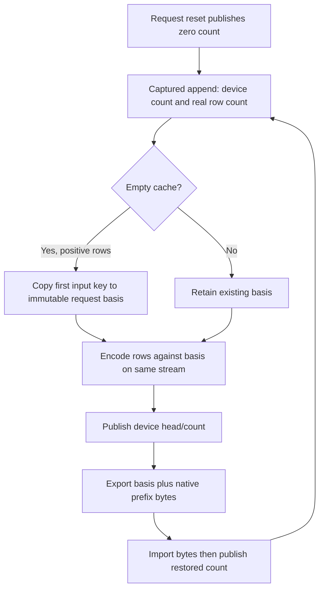
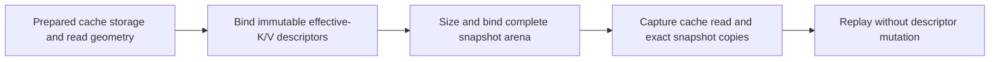
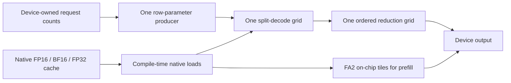
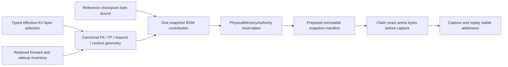

# GPU compressed-cache prefix identity — 2026-09-11

## Reproduction

The first previously unseen GPU generation cell selected in this slice was
`Qwen2_Q4_0_CUDA0_ActFP32_KVQ8_1_MTPOff`. Its fresh and full-repeat requests
each generated 384 tokens; its partial-prefix extension ended after 55. A
separate cold server given exactly the same extended request generated 384
tokens. The first mismatch is completion position 4 (zero-based): cold 7375,
restored 2272. Prompt identity, seed, sampling and all runtime settings were
unchanged. Only the restored witness reported the 139-token device-hot hit.

This is not an accepted short-answer workload. The Release reproduction is in
`parity-results/generation-qwen2-unseen-gpu-01` and the independent cold
witness in `generation-qwen2-cuda-q8kv-cold-01`. Integration reproduces the
same token mismatch in `generation-qwen2-cuda-q8kv-stages-01`; that attempt
produced no GPU stage dumps and is **not** checkpoint-localization evidence.

The campaign reused the unchanged 647-Unit/133-preflight receipt. It selected
ten unseen GPU cells, attempted one and stopped at that failure; the other nine
were not run. No approved generation corpus or image certificate was produced.

## Root cause and simplification

CUDA and ROCm ordinary compressed-cache append selected `MeanRetained`, while
grouped verifier append selected `FirstRetained`. Thus a cold 158-row initial
prefill and a restored 139-row prefix selected different immutable AQ8 bases.
Even earlier common tokens acquired different quantization errors according
to future prompt rows. Export/import could preserve bytes perfectly and still
not make those two computations equivalent.

The model-free regression reproduces this on both actual backends. It compares
native anchor/key/value bytes after captured cold append versus captured
prefix append, device-domain export/import and suffix append. An independent
assertion requires the basis to equal the original first input row; agreement
between two identically wrong encoders is insufficient.



The patch removes the policy enum and every forwarding parameter. All GPU
phases use the first **input** row, including oversized appends which evict
that row. CPU already follows this contract. No extra graph node, allocation,
host mirror, barrier or transfer is added. Basis preparation loses its
O(initial-chunk-width) averaging loop; latency improvement still needs measured
evidence before being claimed.

Affected storage is AQ8 keys paired with each of Q8_1, TQ4 and TQ8 values,
independent of model weight codebook. Native floating-point caches do not use
this basis. Tests cover head dimensions 64/128/256, splits 1..16, 31, 64 and
139 where the prefix fits, both ordinary and overflowing ring capacities,
and replay after reset. Both backend entries are registered in
`ProductionParityPreflight`, without model fixtures or performance gates.

## Evidence and next gate

- Red device proof: `parity-results/gpu-aq8-partition-red-01.log`; both fail.
- Green expanded device proof: `gpu-aq8-partition-green-01.log`, both pass in
  12.44 s combined. Each backend covers 324 format/geometry/split combinations,
  replayed twice (648 complete native-payload comparisons).
- Release cold/restored proof: `generation-qwen2-cuda-q8kv-first-key-02` and
  `generation-qwen2-rocm-q8kv-first-key-01`; both compare all 384 committed tokens
  exactly, with a genuine partial cache hit in only the restored witness.
- Refreshed gate: **647/647 Unit + 135/135 production preflight pass**, 765.030 s
  including build. Receipt: `gpu-aq8-partition-prerequisites-01/prerequisites.json`.
  The new device regressions and legacy-fingerprint unit are included. These
  are registered CTest counts, not a claim that every inherited GTest subcase
  runs on this host.
- Next: HF numerical rechecks and remaining
  unseen cells (results below). Any new memory/numerical defect remains a failure, not a reason
  to change prompt, precision, weight format or threshold.

Restart-persistent disk records also need arithmetic compatibility. The key
schema is now `prefix-cache-v2`; it cannot select old chunk-mean records, but
does not delete them. `LegacyChunkMeanArithmeticCannotRestore` fails against
the preserved v1 golden digest before this change and passes in the Unit gate.

An isolated CUDA NCU graph-node observation (`gpu-aq8-anchor-isolated-ncu.txt`)
reports 16 registers/thread and zero spill requests for D64, with two blocks of
64 threads. Achieved occupancy is 4.16% because the operation copies only two
small heads; that is not evidence of a large throughput bottleneck. Code-object
resource inspection reports zero stack/local memory for D64/128/256. The gfx906
code objects report 5 VGPRs, 16 SGPRs, no private stack or spills for all three
widths; disassembly has a coalesced lane-wise load/store, not a row loop. These
are resource proofs, **not** a measured whole-model speedup. The earlier NCU
attempt with a mismatching template selector produced no kernel evidence, and
the first successful capture overlapped a model diagnostic; neither is used
for performance claims. The final CUDA request proof ran without a profiler.

The separate CPU Q16 Top-5 policy question remains unresolved; no relaxation
has been applied. This slice does not certify that cell or either Docker ISA.

## Numerical and generation follow-up

The first affected HF recheck remains red solely on prefill Top-5 (4/5 versus
95%). For CUDA Q4_0/Q8-KV, cosine is 0.997842, KL is 0.00317625 against 0.008,
Top-1 is correct and all five decode tokens match HF. All eight diagnostic CSVs
validate. Evidence: `gpu-aq8-hf-recheck-01`; it stopped after the first of six
selected cells, so the other five have **not** been rechecked. This is not yet
an all-layer GPU numerical attribution or approval to relax Top-5.

Diagnostic generation then reused the same 782-test receipt. In
`generation-qwen2-unseen-gpu-02`, CUDA Q4_0/Q8-KV passes all four canonical
requests in 17.022 s. The next unseen CUDA Q4_0/TQ-KV cell ends its first cold
request naturally after 76 tokens (7.238 s), below the unchanged 384-token
minimum. No prefix restoration occurred in that request. Its response is a
coherent single equipment tip, but that is insufficient continuous evidence;
it is not marked green or silently substituted with another workload.
The remaining eight selected GPU cells were not launched.

Both new cache regressions passed **20 unprofiled runs per backend**: once
focused, once in the complete preflight gate, then eighteen additional repeats
in `gpu-aq8-partition-repeat-18.log` (217.66 s combined). This totals 12,960
complete native-payload comparisons on each backend. Profiler executions do
not count toward that total.

## Remaining unseen GPU generation controls

The next controls run individually from the same complete 510-cell manifest,
with the unchanged 782-test prerequisite receipt. No model bytes are copied;
every staging operation is a metadata-validated persistent tmpfs hit. Each
green below means four continuous 384-token requests, exact repeated token IDs,
authenticated fresh/full/partial prefix outcomes and captured graph evidence.
These are unapproved observations, not HF or image certificates.

| Weights / backend / KV | Result | Whole cell, seconds |
|---|---|---:|
| Q8_0 / CUDA / FP16 | Pass | 14.615 |
| Q8_0 / CUDA / Q8_1 | Pass | 17.374 |
| Q8_0 ChatCalc / CUDA / FP16 | Pass | 14.665 |
| Q4_0 / ROCm / FP32 | Pass | 32.871 |
| Q4_0 / ROCm / Q8_1 | Pass | 34.074 |
| Q4_0 / ROCm / TQ | Pass | 43.810 |
| Q8_0 / ROCm / FP16 | Pass | 30.668 |
| Q8_0 / ROCm / Q8_1 | Insufficient continuous output: 182 tokens | 11.102 |

Reports are under `parity-results/generation-qwen2-{q8-cuda-fp16,
q8-cuda-q8kv,q8-chatcalc-cuda-fp16,q4-rocm-fp32,q4-rocm-q8kv,q4-rocm-tq,
q8-rocm-fp16,q8-rocm-q8kv}-01/report.json`. Every report records zero repeated
prerequisite time. Seven of these eight new controls pass. Q8_0/ROCm/Q8-KV
ends its first cold request naturally at 182 tokens, so subsequent requests
are not issued. The aggregate observer consequently also lacks a
release-to-next-writer witness; no next request ran. This is not evidence of
a new backend lifetime defect, and neither failed obligation is waived.

Generation is not a universal latency improvement: the Q4_0/CUDA/Q8-KV HF
cell took 6.038 s, versus 17.022 s for four 384-token generation probes. The
workloads establish different evidence. A matched large-overlay measurement
is still needed before claiming the replacement solves its previous hundreds
of seconds of movement-settlement and numerical-diagnostic cost.

The only source edit after the full gate is a ROCm inline-comment correction
from the obsolete chunk-mean description to the installed first-input-key
contract. Executables and their tested behavior are unchanged; no executable
rebuild or profiler runs occur between these generation cells.

## Complete affected numerical recheck

All six affected Qwen2 compressed GPU cells have now been rechecked against
their existing HF gates, each with eight validated diagnostic CSVs. Prerequisite
evidence is reused throughout; these isolated numerical cells cost 3.8–6.0 s.

| Weights / backend / KV | Result | Prefill cosine | KL / existing limit | Top-5 |
|---|---|---:|---:|---:|
| Q4_0 / CUDA / Q8_1 | Fail: Top-5 | 0.997842 | 0.003176 / 0.008 | 4/5 |
| Q4_0 / CUDA / TQ | Pass | 0.998046 | 0.0056 / 0.008 | 4/5 |
| Q8_0 / CUDA / Q8_1 | Pass | 0.997665 | 0.0054 / 0.010 | 5/5 |
| Q4_0 / ROCm / Q8_1 | Pass | 0.998224 | 0.0043 / 0.005 | 5/5 |
| Q4_0 / ROCm / TQ | Fail: KL and Top-5 | 0.997056 | 0.007492 / 0.005 | 4/5 |
| Q8_0 / ROCm / Q8_1 | Pass | 0.996187 | 0.0050 / 0.010 | 5/5 |

The CUDA TQ declaration already permits 80% Top-5; its passing status does
not mean five-of-five overlap. No thresholds changed. ROCm TQ is a new
post-fix numerical red despite passing long generation. This illustrates why
token observations alone cannot approve their own mathematical baseline.
All five incremental decode tokens and prefix checks pass in both red cells;
the failing assertions are prefill distribution/ranking checks.

Evidence roots: `gpu-aq8-hf-recheck-01`, `gpu-aq8-hf-cuda-tq-01`,
`gpu-aq8-hf-cuda-q8-01`, `gpu-aq8-hf-rocm-q4-q8kv-01`,
`gpu-aq8-hf-rocm-tq-01`, and `gpu-aq8-hf-rocm-q8-01` in `parity-results/`.

An **HF-only sensitivity diagnostic**, not a native GPU attribution, keeps
each of 24 layers' projected Q/K/V fixed and compares key-codec bases. It
authenticates split-half rotary against the saved HF K_ROPE tensors, uses
independent FP64 causal attention, and changes no value codec, live weights,
runtime precision, or expected artifact. Mean attention relative-L2 errors are
0.013942 (first key), 0.011824 (model K-projection bias), and 0.012720
(noncausal whole-prompt mean control). The bias reduces the average about
15.2%, with worst-layer error 0.024656 versus 0.032120 for first-key. The
whole-prompt mean remains prohibited because it depends on future rows.

Evidence: `hf-aq8-basis-sensitivity-01.csv` (72 layer/basis observations) and
the corresponding log. Bias-centering is only a candidate: it has not been
implemented or shown to fix either native terminal-logit failure. This diagnostic
assumed pre-RoPE GPU encoding. The installed cells below actually select
**PostRotary**: the sensitivity result therefore does not describe their live
cache operands. A common basis API must respect the resolved encoding contract,
not infer it from the backend or an unused/default builder setting.

## Native-input arithmetic attribution

The next diagnostic captures the first prefill bank at
`SnapshotCapture::storeSnapshot`, before its first HF comparison. GDB reads only
already-owned host snapshot vectors. It also records the exact model-lifetime
host rotation constants at their initial HIP upload. There are no inferior
mutations, device-memory reads, changed runtime precisions or expected outputs.
These debugger runs are **not** performance measurements.

Both native banks contain 339 semantic snapshots. Reading the actual attention
stage confirms `AttentionKeyCacheEncoding::PostRotary`, theta 1000000 and full
rotary width on both CUDA/Q8-KV and ROCm/TQ-KV. The live TQ value codec is TQ8;
some older public comments still describe the historical TQ8-K/TQ4-V layout.
Neither a pre-RoPE equation nor the TQ4 value equation describes this run.

An independent NumPy/PyTorch audit keeps the recorded native input fixed at
each operation and uses the exact GGUF weights. The attention equation uses
FP64 causal GQA over independently reconstructed cache values; it does not
call the native attention kernel or substitute reference checkpoints.

| Audit | CUDA Q4_0 / Q8-KV | ROCm Q4_0 / TQ-KV |
|---|---:|---:|
| Linear operations / norms / attention layers checked | 169 / 49 / 24 | 169 / 49 / 24 |
| Worst norm relative L2 | 9.59e-8 | 7.96e-8 |
| Mean attention relative L2, matching installed cache and query arithmetic | 8.91e-7 | 3.59e-6 |
| Worst attention relative L2 | 6.65e-6 | 3.32e-5 |
| Mean attention relative L2, unquantized same-input equation | 0.017070 | 0.020030 |

Q/K/V, output, gate and up projections agree with their native activation-Q8
equation to FP32 rounding scale (worst relative L2 about 5.2e-7). Ordinary CUDA
linears retain FP32 block scales here; ordinary ROCm linears round scales to
FP16 **before** choosing codes. The original offline audit incorrectly rounded
after choosing codes and is superseded. This is an attribution of those actual
paths, not a claim that the separate cross-tier expert arithmetic differs.

The down-projection audit derives its input using Torch SiLU rather than the
native polynomial and reduction contract. Its largest remaining relative-L2
residual is approximately 1.20e-4 on CUDA and 9.67e-5 on ROCm. Do not call this
byte-equivalence proof, or claim every nonlinear operation has been audited.
Likewise the attention FP64 equation is not a byte-exact reduction oracle.

Final-head isolation gives stronger evidence against a vocabulary-head bug:

| Final-head diagnostic | CUDA KL / Top-5 | ROCm KL / Top-5 |
|---|---:|---:|
| Native recorded logits | 0.00317625 / 4 of 5 | 0.00749205 / 4 of 5 |
| Independent native-Q8 head, same native hidden state | 0.00317630 / 4 of 5 | 0.00749189 / 4 of 5 |
| FP32 head equation, same native hidden state | 0.00350730 / 4 of 5 | 0.00905687 / 4 of 5 |
| Native-Q8 head equation, HF hidden state | 0.00010624 / 5 of 5 | 0.00011597 / 5 of 5 |

The isolated FP32-head calculation is an offline counterfactual, **not** an
installed precision change. It does not repair the ranking: the discrepancy
already exists upstream. This evidence strongly supports accumulated native
quantization error over corrupted projection or attention computation. It does
not waive the two current numerical reds, the CPU Q16 policy question, the
continuous-generation minimum or any image/corpus approval.

Evidence under `parity-results/`:

- `gpu-aq8-rocm-tq-bank-05` and `gpu-aq8-rocm-tq-bank-06`: host bank,
  rotation constants, actual stage policy and original eight CSV artifacts.
- `gpu-aq8-cuda-q8kv-bank-01`: symmetric CUDA host-bank and policy evidence.
- `gpu-aq8-rocm-tq-linears-02.csv` and `gpu-aq8-cuda-q8kv-linears-01.csv`,
  with their `.norms.csv` files.
- `gpu-aq8-rocm-tq-attention-04.csv` and
  `gpu-aq8-cuda-q8kv-attention-01.csv`.
- `gpu-aq8-logit-attribution-01.log`: final-head counterfactuals.

The earlier `attention-01..03` ROCm equations use the wrong value or rotary
policy and are retained only as diagnostic history, not supporting evidence.
No production binary was rebuilt in this attribution slice; all canonical
executions reuse the same 782-test prerequisite receipt.

## Separate effective-K/V diagnostic capture defect

Enabling `LLAMINAR_DEBUG_EFFECTIVE_KV_SNAPSHOT=1` with an empty layer selector
(all layers) exposes a cold-manifest bug before the first model comparison:

```text
Stage 'layer0_attention' changed snapshot output count after storage binding
(prepared=3 recorded=5)
```

`getDumpInfo()` initially has the output plus device head/count. Only
`execute()` binds the effective K/V tensors, so the recorded manifest gains two
outputs after storage was already fixed. The executor correctly refuses that
mutation. Evidence: `gpu-aq8-rocm-tq-bank-03.log`. A selector of `-1` instead
selects no real layer and does not reproduce or certify effective-K/V capture.



The source implementation now separates describing prepared read storage from
enqueueing the read. `IKVCache::describeDeviceReadStorage()` resolves native
rings, request-major native gathers and converted destinations through their
cache/workspace owner, including hybrid layer remapping. The stage owns only
non-owning immutable tensor descriptors and validates execution against their
addresses/types/geometry. Reset retains these descriptors. The executor's
immutable manifest checks are unchanged; there is no eager warmup, late growth,
recapture, replacement GPU buffer or shadow of live cache state.

`Test__GPUEffectiveKVSnapshot.cpp` is a separate translation unit in the existing
CUDA/ROCm graph integration binaries, already members of preflight. Its 24
capture/reset cases per backend cross six KV formats, one/two requests and
native/transform-on-read keys. A separate hybrid test checks PP-offset layer
remapping for FP16/BF16/FP32/Q8_1. The final focused build succeeds in
`effective-kv-cold-build-05.log`. The corrected device run
`effective-kv-cold-focused-02.log` passes **25/25 ROCm and 22/25 CUDA**. The
complete ROCm graph integration binary also passes in
`effective-kv-full-rocm-01.log` (1.05 s CTest wall time).

The final test additionally replaces the cache's borrowed request-major tensor
wrapper with another request geometry before reset/replay, and checks both
preserved-capture and ordinary stage reset. All 25 ROCm cases pass 20 complete
repetitions (500 test executions, 17.02 s) in
`effective-kv-rocm-final-repeat-20.log`. The 22 positive CUDA cases pass 20
repetitions (440 test executions, 34.75 s) in
`effective-kv-cuda-final-positive-repeat-20.log`. Only that diagnostic stress
selection excludes the three known CUDA reds listed below; the registered
preflight test remains unfiltered and red. These are functional test times,
not inference benchmarks or model certificates.

The first fixture iteration lacked an admitted recurrent-state owner and did
not rebind the explicit stage stream after reset; those fixture errors are
corrected. There is no snapshot output-count/type/address mutation in the
positive cases. Three native CUDA attention cases remain red:

| New focused case | Exact rejection |
|---|---|
| BF16, one request, native read | FP32 attention does not implement BF16 KV consumption |
| BF16, two requests, native read | Small grouped request attention only accepts FP16 KV |
| FP32, two requests, native read | Same FP16-only grouped request guard |

These are pre-existing CUDA kernel-adapter restrictions, not data-dependent
snapshot failures: the test preserves native cache types and reaches those
explicit guards in unchanged CUDA attention source. ROCm implements all three.
The tests remain active in the preflight binary; no skip, conversion workaround
or tolerance relaxation was introduced. The old prerequisite receipt is stale
after rebuilding. Do not run expensive model cells until these focused reds
and one complete refreshed Unit/preflight gate are green.

Next implementation boundary: a typed native cache-element contract for CUDA
attention, preserving the established scalar arithmetic and its grouped-row
order. Supply native BF16 reads and FP32/BF16 independent-request dispatch,
without a host path or whole-cache conversion buffer. Prove serial/grouped
byte equivalence for all affected formats and row geometries, profile the
new native kernels, then refresh the shared gate once. No CUDA attention kernel
has been edited in this snapshot-descriptor slice.

The complete Unit suite passes **647/647** in `effective-kv-unit-03.log`
(73.64 s, incremental build clean). The first Unit run found one stale fake-
cache expectation: it intentionally expected missing effective outputs before
execution. Its replacement preserves the no-host-query invariant and adds
both backend identities, mandatory prebinding, correct cache rather than
projection pointers, and rejection of changed storage. The focused updated
test passes before the full Unit rerun. This is not a combined prerequisite
receipt: the three CUDA integration failures still block model admission.

The final **unfiltered** graph-integration run is
`effective-kv-full-graph-final-01.log`: ROCm passes; CUDA passes 39 of its 42
tests and fails only the three native-KV cases above. Total wall time is 4.77 s.
No existing graph test regressed in that run. At handoff no build, CTest,
model server, debugger or profiler remains running.

Only Integration core, Unit dependencies and the focused graph binaries were
rebuilt in this slice. `IKVCache` gained a virtual method, so rebuild the selected
model-matrix executables (or `v2_model_parity_matrices`) before their next use;
do not pair old matrix objects with the new shared-core ABI. Release has not
been rebuilt in this slice. The persistent model cache was not altered.

## Next unseen generation control: Qwen3 CUDA

`Qwen3_Q8_0_CUDA0_ActFP32_KVFP16_MTPOff` is newly exercised in
`generation-qwen3-unseen-gpu-fp16-02`. The fresh and full-repeat requests both
produce 384 tokens. The partial request restores 214 tokens of its 290-token
prompt and stops at 301 completion tokens; the unchanged 384-token minimum
fails the cell. Whole-cell time is 13.006 s with zero repeated prerequisite
time and a persistent tmpfs hit. The selected ROCm counterpart was not launched
by that fail-fast invocation.

An independent cold Release server receives the **identical** extended body,
seed and runtime settings in `generation-qwen3-cuda-fp16-cold-01`. It also stops
at 301 tokens, with every token ID equal to the restored response and a proven
cache miss. This is ordinary short output in this reproduction, not a new
restore-induced token drift. It remains insufficient continuous-generation
evidence and is not certified or silently replaced with another prompt.

The separately selected unseen ROCm counterpart behaves similarly:
`generation-qwen3-rocm-fp16-01` takes 25.045 s, passes both 384-token original
requests, then naturally stops the partial request at 260 tokens. An independent
cold request in `generation-qwen3-rocm-fp16-cold-01` matches all 260 token IDs
exactly with a proven cache miss. Both backends shut down cleanly; ROCm returns
to its pre-run VRAM baseline. The two new cells are red only for insufficient
continuous output, not newly established backend lifecycle failures. All four
canonical/cold executions reuse the unchanged 782-test receipt and tmpfs model.

No new model server, debugger or profiler was launched in the snapshot-descriptor
slice. The next engineering slice is closing the three explicit CUDA native-KV
attention gaps exposed by the new preflight tests. Numerical-quality and
continuous-output policy decisions remain explicit and unwaived.

## CUDA native floating-point cache closure

The three CUDA capability failures above are fixed in production. BF16 cache
storage now has native FA2 query/context producers and native split decode.
FP32/BF16 grouped verifier and independent-request paths use the same typed
decode body as FP16. The old duplicate scalar FP32 body and unreachable FP16
whole-cache conversion branch were removed. No cache/activation format,
precision threshold, device allocation or transfer was added to inference.



The ownership enum selects ordinary batch, shared verifier, or independent
request banks; it cannot select a different reduction tree. Each grouped row
uses its scalar live-prefix partition. BF16 FA2 loads eight elements with a
16-byte vector and converts only the on-chip WMMA operand, just as the existing
FP32 producer does. Stored cache bytes remain native.

New model-free tests are in the existing CUDA/ROCm graph preflight binaries:
three floating-point formats, HD64/128/256, every grouped M through M16,
independent unequal request banks, short/long split boundaries, captured replay,
and both FA2 parallel axes. Grouped/scalar output is byte-exact; an independent
FP64 equation checks native operands. ROCm FP16's documented half-Q dot2 operand
rounding is represented explicitly in that equation, not by changing its
2e-6 output bound. Native FA2 also equals captured FP32 execution on exactly
expanded native cache values, byte-for-byte.

`native-floating-kv-expanded-graph-03.log` passes 60/60 GTests on each backend
(4.61 s combined CTest wall time). The 43 snapshot/math cases pass 20 repetitions
on each backend: 860 executions each. The CUDA repeat's complete output is
retained in `native-floating-kv-cuda-repeat-20-detail.log`; timing summaries are
`native-floating-kv-{cuda,rocm}-repeat-20.log` (15.78/23.19 s respectively).

Compiler resource evidence in `native-floating-kv-resources-01.txt` covers all
99 floating-point specializations: zero stack/local memory. Existing FP16
scalar/shared/request decode remains at 64/60/64 registers and 8,288 bytes
static shared memory, matching the prior Release object. Scalar FP32 remains
64 registers with the same shared memory. Live NCU reports for BF16/FP32 M16
shared and two-request grids show zero spilling, 64 registers, 66.67% theoretical
and approximately 53–55% achieved occupancy. BF16 FA2 HD64/128/256 and HD256
context-partition nodes also show zero spilling. The tiny two-head prefill
fixture exposes only a few CTAs; its low achieved occupancy is not a full-model
throughput result. NCU timing is diagnostic, not canonical benchmark evidence.
Reports are `/tmp/llaminar-native-*.ncu-rep`, with text under
`parity-results/native-floating-kv-ncu-*`.

The exact workspace BOM replaces the initial test helper's conservative
maxima; the finished test needs only its own small persistent partial arena
and explicitly has no FP32 conversion buffers. The first expanded run's test
OOMs are not production accounting regressions. Likewise, grouped comparisons
now derive parameters from device-owned counts so their cache-capacity identity
matches production; a host-authored geometry overwrite cannot certify that path.

The complete Unit/preflight and model-matrix target inventory rebuilt in
`native-floating-kv-final-build-01.log` (685 Ninja actions). All Integration
matrix executables now share the new IKVCache interface. Release also rebuilt
successfully in `native-floating-kv-release-build-01.log`. The shared prerequisite
transaction `native-floating-kv-prerequisites-01` passes all 647 Unit and 135
preflight CTests: 75.04 s and 508.64 s respectively, 584.434 s including orchestration.
Existing HF quality and short-EOS failures above remain unwaived.

## Effective-cache snapshot admission (2026-09-11)

The exact ROCm Qwen2 Q4_0/TQ HF recheck reused that unchanged 782-test receipt
and the persistent tmpfs model cache. The old three-to-five output-manifest
failure is gone. A new initialization failure occurs at snapshot admission:
66,708,160 bytes exceed the declared GraphSnapshotArena reservation. The run
`native-floating-kv-effective-hf-01` ends in 4.471 s with zero of eight CSVs;
it is not a completed numerical recheck.

The declaration was derived only from reference-file headers. Optional
effective-K/V outputs have no HF reference files and retain full physical
context banks rather than the prompt's nine rows. The ledger correctly refuses
to allocate those undeclared bytes.



The follow-up implementation adds that typed selection to the existing
capacity declaration. MemoryPlanner prices a named full-bank envelope using
the same FA-layer classifier and local KV-head geometry as live-cache admission.
The maximum supported effective element width is FP32; actual slots continue
to retain native bytes. Independently retained forward/sidecar graph identities
bound the number of arenas; shared alternatives may use less. No anonymous
reserve, inference-time allocation, or native storage conversion is added.
Ordinary inference with these diagnostics disabled has no additional charge.

The existing CUDA/ROCm cold-capture snapshot matrix now requires a real
PhysicalMemoryAuthority reservation built by MemoryPlanner. Device-free tests
cover six cache codecs, both GPUs, TP degrees 1–8, layer selection, absent
diagnostics and invalid/overflowing geometry. Build and verification are
complete under `effective-kv-accounting-*`. Integration's 740-action rebuild
and Release's 28-action rebuild pass. All four focused planner/ledger/GPU
graph CTests pass in 5.48 s; both GPU binaries still cover all 60 GTests. One
premature focused launch overlapped the end of relinking and ran the old planner
executable against the new shared-library ABI, producing `bad_alloc`. After the
build completed, that same executable's 48 checks pass. Do not launch consumers
before all targets finish rebuilding.

The fresh shared gate passes 647 Unit CTests in 77.20 s and 135 preflight
CTests in 504.89 s. The driver was interrupted after CTest completed and before
its JSON publication. Its complete JUnit inventories and transcripts survived;
`recover-completed-preflight.py` validates every test name/status, zero
failure/skip counts, phase timestamps and unchanged build boundaries before
publishing the diagnostic receipt with the original completion timestamp.
`effective-kv-accounting-prerequisites-01/recovery.json` retains this provenance.
This is not an image certificate. No tests were skipped or their times refreshed.

The exact ROCm Q4_0/TQ model diagnostic now completes in 9.206 s with all eight
validated CSV artifacts (`effective-kv-accounting-hf-02`). Both manifest and
allocation failures are gone; the prefill quality result is unchanged:
KL 0.00749204727 against 0.005, Top-5 4/5 against 95%. Prerequisites and tmpfs
weights were reused. No gate, precision or weight format was changed.

The additional debugger bank (`effective-kv-accounting-rocm-bank-01`, 29.776 s)
contains 435 snapshots, including actual full-context effective K/V and request
metadata. Independent FP64 attention over those exact recorded inputs, with
the installed FP16 query-operand rounding, agrees across all 24 layers at mean
relative L2 **4.30e-7**, worst **3.42e-6**. All reconstructed AQ8 keys exactly
match the recorded effective keys. The installed value codec is TQ8, not the
older TQ4 description in the configuration banner; the TQ4 offline reconstruction
(`attention-01`) is not a valid attribution. `attention-02` uses the live TQ8
codebook and directly measured cache inputs. This strengthens the arithmetic
attribution but does not turn the numerical-quality red into a pass.

## Resumed unseen controls and measured cost

The fresh exported inventory still contains 510 cells. After the accounting
gate, two previously unattempted Qwen3 generation controls ran sequentially:

| Cell | Result | Whole cell, seconds |
|---|---|---:|
| Qwen3 Q8_0 / CUDA / Q8_1 KV | Partial request ends at 372; 384 minimum not met | 16.370 |
| Qwen3 Q8_0 / ROCm / FP32 KV | All four 384-token requests and lifecycle checks pass | 41.851 |

Both report zero prerequisite elapsed time and zero copied model bytes. The
CUDA cell starts and shuts down cleanly, releasing its GPU memory. An independent
cold server given the exact partial request also emits 372 tokens, all identical
to the restored response (`generation-qwen3-cuda-q8kv-cold-01`); it reports no
cache hit. The short answer is therefore not restore-induced drift in this
reproduction. It still fails the 384 minimum. Neither control is an approved
corpus or image certificate.

Generation is not universally lower *per-cell* wall time: the cached small
Qwen2 ROCm Q4_0/Q8_1 HF cell took 3.787 s for five incremental steps, whereas
its four-request generation control took 34.074 s for 1,536 committed tokens.
That is far more continuous coverage per second, not a demonstrated blanket
reduction in every cell's wall time. Generation avoids reference generation
and intermediate-tensor diagnostics; large-model/MTP aggregate economy still
requires its own measurements. The 647-Unit/135-preflight cost is shared across
unchanged runs in both drivers, never charged once per cell.
