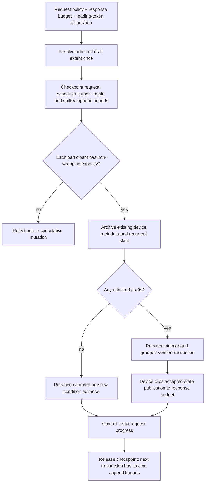

# MTP checkpoint append admission — 2026-09-10

## Exact failure

The six-GPU Qwen3.5 122B CUDA2/ROCm4 Dynamic/Ordinal cells pass MTP off
and fixed depths 1/2/3/15. Dynamic depth fails in `ci-local-unseen-pass-16`
after 343.312 seconds, before numerical CSV publication:
`main_cache_lacks_speculative_headroom_cached_4080_required_17_capacity_4096`.
The individual diagnostic ledger is **427/510**, not a complete certificate.

The fixture is closing an authority-reported decode cadence window with
4,076 ordinary budget-one decode calls. Two live stack samples show forward
progress through the captured condition transaction; the second reaches row
3,360. This is not a collective timeout or stale teardown. The debugger itself
fails while decoding a DWARF local after producing that second sample and
detaches; that separate debugger fault is not the model failure.

## Lifecycle and simplification

The old participant check used `retained_maximum_depth + 2` for every
checkpoint, even when budget clipping later selected zero drafts. The observed
call appends one main row and one shifted row, not seventeen. Retained graph
and workspace capacity must remain policy-complete, but that is not live KV
append demand. A later wider transaction acquires a new checkpoint; it does
not need unused KV headroom in the earlier transaction.

The implementation resolves draft extent before checkpointing and reuses that
immutable value for execution. The typed checkpoint request carries explicit
main/shifted append limits with invalid defaults. Participants retain the
non-wrapping protection, now with overflow-safe capacity arithmetic. GPU
transactions with a positive speculative budget still execute their full
selected width: device publication, not the host, clips committed outputs.
CPU retains its existing host-owned clipping contract.

There is no new event, checkpoint pool, allocation, kernel, capture family,
cache expansion, host device-state mirror, or inference fallback. Fixed and
dynamic policies share the same admission implementation across backends.

## Verification

Focused tests cover the serving runner at positions 4,080 through 4,096 on
device-free CPU/CUDA/ROCm mocks with fixed/dynamic depth 15, and all admitted
widths 1–31 with bounded/unbounded and already-emitted condition budgets. A
tiny real CPU participant independently proves final-slot capture, rejection
of overflowing main/shifted extents, logical restore, and byte-exact replay.
The serving and participant regressions join existing production-preflight
registrations, not a new model-dependent preflight lane.

All three focused tests pass, then pass **twenty repetitions each** (60 test
executions, authenticated by the retained detailed CTest log). The CPU physical
checkpoint case also verifies native-logit byte identity after last-slot
restore/replay. Evidence is in `ci-local-mtp-append-bound-focused.log`,
`ci-local-mtp-append-bound-stress20.log`, and the matching `-detail.log` under
the ignored `parity-results/` directory. The complete prerequisite/parity
target rebuild then completes successfully.
The 4,076-call cadence closure also remains an economy concern; this patch does
not disguise that work by shortening the proof or changing controller cadence.

At 12:46 UTC the rebuilt canonical driver passes **645/645 Unit** (73.45 s)
and **128/128 production preflight**, 549.017 s combined. Both updated MTP
preflight registrations pass. The original exact dynamic-depth cell then
starts from the persistent tmpfs cache (four shard hits, zero copied bytes)
and reaches the same 4,076-row decode closure. It remains under the unchanged
600-second exact-cell watchdog; no debugger/profiler is attached to this run.

At 12:52 UTC the exact cell completes successfully in **402.843 seconds**,
validating all nine required CSVs and retiring both ranks cleanly. The full
4,076-row closure completes before numerical proof. Prefill LM-head cosine is
0.999041 and KL 0.00105283; all 49 layer rollups and four decode rows pass.
The MTP CSV records requested/executed/identity depth 15, exact serial tokens,
an accepted-token witness delta of 15, and an exact dynamic-policy witness.
Complete and partial prefix restores both prove state equivalence.

The immutable movement evidence contains 125 completed edges: 11 promotions,
11 demotions and 103 same-priority moves. Both tier-residency and participant-
placement objectives are represented; the promoted-expert prefill/decode
cohorts are certified. This mixed-vendor topology retains its declared captured
heterogeneous segments, not a claimed homogeneous native generation parent.

The ledger reaches **428/510**. `ci-local-unseen-pass-17` resumes unproven cells
only, reusing the unchanged 773-test receipt. Its first Static/Random MTP-off
cell also passes in 42.820 seconds, reaching **429/510**; depth one is next.
The known Qwen2 Q16 Top-5 red, remaining unproven cells, fresh unfiltered full
matrix, and both ISA image certifications remain outstanding. This is not an
aggregate speed claim: the unchanged long decode-closure workload still costs
minutes.
